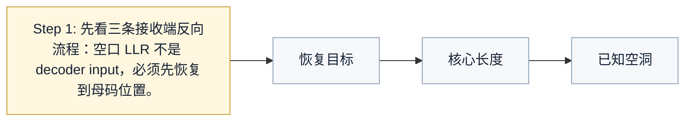
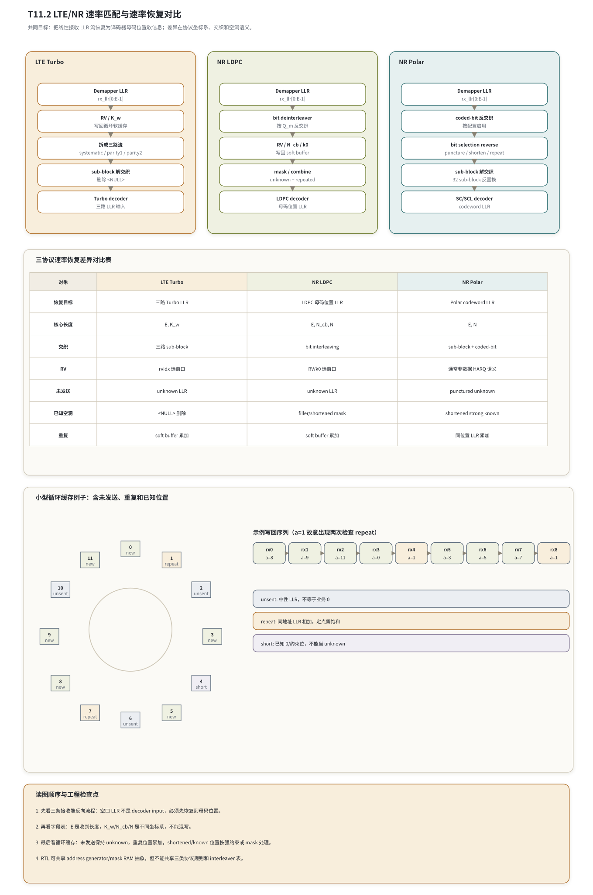

# T11.2 LTE/NR 速率匹配与速率恢复对比
## 本节学习目标

本节从接收端视角对比三类速率匹配和速率恢复。这里先统一单篇缩写：Turbo在 LTE 数据传输中使用三路编码流；低密度奇偶校验码在 NR 数据传输中使用稀疏校验矩阵和母码位置；Polar在 NR 控制信息中使用极化母码和 frozen mask；对数似然比是接收端在速率恢复中搬运和合并的软信息；混合自动重传请求负责重传时保留、补充和合并软信息；循环冗余校验用于译码后判定候选结果是否可信；传输块和码块分别表示上层交付的数据块和译码器逐块处理对象；正交相移键控是每个 symbol 承载 2 个 bit 的调制；正交幅度调制的调制阶数影响 NR LDPC 的 bit interleaving；块错误率用于后续链路性能验收；寄存器传输级和专用集成电路用于描述硬件实现边界。

学完本节后，应能做到：

- 说明 rate matching 的发送端目标和 rate recovery 的接收端目标。
- 对比 LTE Turbo、NR LDPC、NR Polar 的循环缓存、交织、冗余版本和反向映射。
- 区分 $E$、$K_w$、$N_{cb}$、$N$、$K$ 这些长度符号的坐标系。
- 解释为什么三者都可能有“未发送”和“重复”，但 `<NULL>`、filler、puncturing、shortening 的语义不能互相套用。
- 给出一个小型循环缓存例子，包含未发送位置、重复位置和已知约束位置。
- 说明重复 LLR 的累加和定点饱和风险。
- 说明 RTL 中 address generator、mask RAM、soft buffer 可以抽象复用，但协议规则和交织表不能混用。
- 列出验证 checklist：索引、mask、LLR 累加、饱和、CRC/syndrome/path metric。

如果只记一个原则：**rate recovery 的共同目标是把空口线性 LLR 流恢复成译码器母码坐标上的软信息；不同制式和不同码型的地址规则、交织规则、空洞语义不同，不能因为都叫 circular buffer 就混用。**

## 前置知识检查

| 前置项 | 本节需要达到的程度 |
|:---|:---|
| T7.1/T7.2 | 知道 LTE Turbo 解速率匹配先把 LLR 写回循环缓存，再拆成系统流和两路校验流，并处理 `<NULL>`。 |
| T9.1/T9.2/T9.3 | 知道 NR LDPC rate recovery 包含 bit deinterleaving、RV/k0 地址扫描、soft buffer 合并和 mask 初始化。 |
| T10.7 | 知道 NR Polar rate recovery 包含 coded-bit deinterleaving、bit selection reverse、sub-block deinterleaving，以及 puncturing/shortening/repetition 的不同 LLR 语义。 |
| LLR | 知道正负号表示更支持 0 或 1，绝对值表示可靠度；未知位置通常是中性 LLR，不是业务 0。 |
| HARQ | 知道重传不是简单替换前一次接收结果，而是补充新的软证据。 |

若这些前置不熟，可以先把本节当作“坐标系对比”：空口给的是 `rx_llr[0:E-1]`，译码器需要的是按 Turbo 三路、LDPC 母码变量节点或 Polar codeword position 排列的 LLR。

## 任务边界与 Prompt 覆盖

| Prompt/台账要求 | 本节覆盖位置 | 扩展方式 |
|:---|:---|:---|
| 从接收端视角对比三类 rate matching/rate recovery | 全文 | 先讲共同目标，再逐类讲协议正向和接收端反向。 |
| 聚焦 circular buffer、interleaving、RV、reverse mapping | “三条协议链路的正向与反向关系”到“统一字段表” | 增加长度符号、mask、soft buffer、decoder input 的对象模型。 |
| 说明共同目标 | “共同目标” | 明确恢复的是 LLR 到母码位置的对应关系，不是恢复未发送比特的观测值。 |
| 明确 LTE Turbo 没有 NR Polar shortening 语义 | “不能混用的空洞语义” | 对比 `<NULL>`、filler、punctured、shortened。 |
| NR LDPC/Polar puncturing/shortening 不能套用 LTE filler/`<NULL>` | “不能混用的空洞语义” | 用错误后果表说明。 |
| 给统一字段表 | “统一对象模型和字段表” | 并列字段在三类链路中的存在性和意义。 |
| 小循环缓存例子含未发送和重复 | “小型循环缓存例子” | 同时展示 `unsent`、`repeat`、`short`。 |
| 定点 repeated LLR 累加和饱和 | “定点化策略” | 给饱和公式和计数器。 |
| RTL address generator 和 mask RAM 抽象 | “RTL/ASIC 映射” | 区分可共享抽象和不可共享协议规则。 |
| 三条并排流程图且标出输入输出 | “三条协议链路的正向与反向关系” | 用 Mermaid、字段表和循环缓存例子列出 LTE Turbo、NR LDPC、NR Polar 的输入输出和工程检查点。 |

本节是对比讲义，不重新推导 LTE Turbo 子块交织、NR LDPC BG/Zc、NR Polar reliability sequence 的全部细节；这些分别由 T7、T8/T9、T10 承接。本节必须完成的是“同名概念背后的坐标系和协议语义对比”。

## 资料与协议边界

本节依据本地 Rel-19 抽取资料：

| 协议位置 | 本地证据路径 |
| :--- | :--- |
| TS 36.212 §5.1.4.1 | `3GPP_Rel19/processed/TS_36.212_36212-j30/content.md:777-789` |
| TS 36.212 §5.1.4.1.1 | `content.md:791-815`; `tables/table_0010.csv/html` |
| TS 36.212 §5.1.4.1.2 | `content.md:817-965` |
| TS 38.212 §5.4.1 | `3GPP_Rel19/processed/TS_38.212_38212-j30/content.md:1019-1021` |
| TS 38.212 §5.4.1.1 | `content.md:1023-1039`; `tables/table_0019.csv/html` |
| TS 38.212 §5.4.1.2 | `content.md:1081-1109` |
| TS 38.212 §5.4.1.3 | `content.md:1117-1130` |
| TS 38.212 §5.4.2 | `content.md:1175-1177` |
| TS 38.212 §5.4.2.1 | `content.md:1179-1309`; `tables/table_0020.csv/html`; `tables/table_0021.csv/html` |
| TS 38.212 §5.4.2.2 | `content.md:1311-1323` |

边界说明：

- 3GPP 规范定义的是发送端 rate matching 和相关参数。接收端 rate recovery 是工程实现对发送端轨迹的反向恢复，本节会写接收端伪代码，但不会把伪代码说成协议逐行强制算法。
- TS 38.212 Table 5.4.2.1-2 的 `k0` 表在当前 `table_0021.csv/html` 抽取件中数值为空，说明公式/表格抽取不完整。本节只使用“`k0` 由 RV 和 LDPC base graph 对应表确定”这一已在 `content.md:1289-1309` 看到的协议事实，不凭记忆补表值。
- 若后续章节需要 bit-exact `k0` 值，必须回到 `source.docx`、Word XML 或更可靠的表格重建流程，重建后再使用。

## 共同目标

rate matching 的发送端问题是：编码器输出的母码序列长度通常和当前无线资源能承载的 bit 数不一致。调度给出的资源、调制阶数、层数、码率、HARQ 冗余版本都会改变本次能发送多少编码比特。发送端必须从母码或交织后的序列中选择、重复、打孔或缩短，生成长度为 $E$ 的输出序列。

共同目标：把线性接收 LLR 流恢复为译码器母码位置软信息；差异在协议坐标系、交织和空洞语义。

rate recovery 的接收端问题正好反过来：软解调器只给出线性的 `rx_llr[0:E-1]`，每个元素只知道“第几个被接收”，还不知道它对应母码里的哪个位置。译码器却不接受“第几个空口 LLR”这个坐标，而是需要：

| 译码器 | 需要的坐标 |
|:---|:---|
| LTE Turbo | 系统比特流、第一校验流、第二校验流各自的 LLR 序列。 |
| NR LDPC | LDPC 母码变量节点位置的 LLR，也就是 decoder 迭代输入坐标。 |
| NR Polar | Polar codeword position 的 LLR，也就是 SC/SCL tree 输入坐标。 |

因此共同目标可写成：

$$
\texttt{decoder\_llr}[\operatorname{mother\_pos}(t)]
\leftarrow
\operatorname{combine}\left(
\texttt{decoder\_llr}[\operatorname{mother\_pos}(t)],
\texttt{rx\_llr}[t]
\right),
\quad 0\le t<E.
\tag{1}
$$

式 (1) 回答的问题是：第 $t$ 个接收 LLR 应写回哪个译码器母码位置。不同码型的差异集中在 $\operatorname{mother\_pos}(t)$ 怎样生成、哪些位置没有观测、哪些位置是结构空洞、哪些位置是已知约束，以及重复位置如何合并。

## 三条协议链路的正向与反向关系

### LTE Turbo

TS 36.212 §5.1.4.1 说明 Turbo coded transport channels 的 rate matching 按 coded block 定义，先对三路信息流做 sub-block interleaving，再 bit collection 并生成 circular buffer。接收端反向看时，顺序是：

1. 输入 `rx_llr[0:E-1]`。
2. 根据 `rvidx`、$E$、$K_w$、soft buffer 相关长度和 `<NULL>` mask，产生 circular buffer 写回地址。
3. 对同一 circular buffer 位置执行 LLR 累加或饱和累加。
4. 将循环缓存拆回三路：系统流、第一校验流、第二校验流。
5. 对三路分别做 sub-block deinterleaving，并删除或跳过 `<NULL>`。
6. 形成 Turbo decoder 的三路 LLR 输入。

LTE Turbo 的关键点是“三路流”。它不是把一个 LDPC 风格母码数组直接送入稀疏矩阵译码器，而是要恢复系统流和两路校验流的对应位置。`<NULL>` 是子块交织矩阵补齐的结构空洞，接收端不能把它当成一个真实编码比特。

换句话说，LTE Turbo rate recovery 的闭环是：先在 circular buffer 坐标上把 RV 选出的 LLR 写回并做 HARQ soft combining，再按 bit collection 反向拆成系统流、第一校验流和第二校验流，最后分别做 sub-block deinterleaving，把三路 LLR 交给两个 SISO 译码器。这个流程和 NR LDPC 的 base graph/lifting 母码坐标、NR Polar 的 bit selection/frozen mask 坐标都不同；共享软件或 RTL 模块时只能共享“地址轨迹生成和 mask 事件”这种抽象接口，不能共享具体表、起点公式或 `<NULL>`/punctured/shortened 的初始化语义。

TS 36.212 Table 5.1.4-1 的 32 列置换表复现如下，本节只用于提醒 LTE Turbo 有自己的 sub-block interleaver，不和 Polar pattern 混用：

| 置换后列 $j$ | 0 | 1 | 2 | 3 | 4 | 5 | 6 | 7 | 8 | 9 | 10 | 11 | 12 | 13 | 14 | 15 |
|---:|---:|---:|---:|---:|---:|---:|---:|---:|---:|---:|---:|---:|---:|---:|---:|---:|
| 原始列 $P(j)$ | 0 | 16 | 8 | 24 | 4 | 20 | 12 | 28 | 2 | 18 | 10 | 26 | 6 | 22 | 14 | 30 |

| 置换后列 $j$ | 16 | 17 | 18 | 19 | 20 | 21 | 22 | 23 | 24 | 25 | 26 | 27 | 28 | 29 | 30 | 31 |
|---:|---:|---:|---:|---:|---:|---:|---:|---:|---:|---:|---:|---:|---:|---:|---:|---:|
| 原始列 $P(j)$ | 1 | 17 | 9 | 25 | 5 | 21 | 13 | 29 | 3 | 19 | 11 | 27 | 7 | 23 | 15 | 31 |

这里 $P(j)$ 的含义是“置换后第 $j$ 列来自原始第 $P(j)$ 列”。接收端反置换时方向不能写反。

### NR LDPC

TS 38.212 §5.4.2 说明 LDPC rate matching 由 bit selection 和 bit interleaving 组成。接收端反向看时，顺序是：

1. 输入 `rx_llr[0:E_r-1]`。
2. 先按 $Q_m$ 做 bit deinterleaving，恢复 bit selection 输出顺序。
3. 根据 RV、LDPC base graph 和 `k0` 表入口生成 circular buffer 扫描起点。
4. 使用 $N_{cb}$ 而不是盲目使用完整母码长度取模。
5. 对同一地址做 soft combining；对未观测位置保持 unknown；对 filler/shortened 相关位置按 mask 处理。
6. 输出 LDPC decoder 可读的母码位置 LLR。

NR LDPC 的关键点是“bit interleaving 在 circular buffer 选择之后”。接收端必须先把 demapper LLR 从调制 bit position 顺序反交织回 bit selection 顺序，再写回 circular buffer。若这一步漏掉，RV 地址可能是对的，但写进去的 LLR 顺序已经错。

LDPC 的 `k0` 表值本节不复现。当前本地 `table_0021.csv/html` 只保留了表头和 RV 行，数值为空；因此正文不使用具体 `k0` 数字。工程实现若需要 bit-exact，应把 `k0` 表作为配置 ROM 或常量表，并用协议重建结果生成。

NR LDPC 还要额外关注高阶调制的 bit-channel 不均衡。QPSK 每个 symbol 只有 2 个 bit lane，16QAM、64QAM、256QAM 和 1024QAM 则有更多 bit lane；在 Gray-mapped QAM 中，不同 lane 的 LLR 可靠性通常不同。TS 38.212 §5.4.2.2 的 bit interleaving 与 $Q_m$ 绑定，目的之一就是让 rate-matched bits 按协议定义的 lane 顺序进入调制。接收端若漏做 bit deinterleaving，不只是顺序错，还会把“某个 lane 的可靠度统计”错放到另一个 LDPC 母码位置。高 SNR 时这种错误尤其隐蔽：LLR 幅度很大，LDPC core 会强烈相信错位证据，表现为 syndrome 停滞、CB CRC 稳定失败或 HARQ 合并后更难恢复。详细公式、QPSK/16QAM 手算例子和接口顺序风险见 T9.4；本节只强调横向对比中的结论：LTE Turbo 没有 NR LDPC 这种 $Q_m$ bit deinterleaver，NR Polar 的 coded-bit interleaving 又是另一套规则，三者不能复用同一张置换表。

### NR Polar

TS 38.212 §5.4.1 说明 Polar rate matching 由 sub-block interleaving、bit collection 和 bit interleaving 组成。接收端反向看时，顺序是：

1. 输入 `rx_llr[0:E-1]`。
2. 如果 coded-bit interleaving 启用，先做 coded-bit deinterleaving。
3. 对 bit selection 做反向恢复：根据 $E$ 和 $N$ 区分 repetition、puncturing、shortening。
4. 对 sub-block interleaver 做反置换，恢复 Polar codeword order。
5. 输出 SC/SCL/CA-SCL decoder 的 $N$ 个 codeword LLR。

Polar 的关键点是“puncturing 和 shortening 的 LLR 初始化语义不同”。punctured 位置是未知，通常给中性 LLR；shortened 位置是已知 0 或强约束，通常给强正 LLR 或使用 known mask 固定。这个语义不是 LTE Turbo 的 `<NULL>`，也不是 LTE 分段 filler。

TS 38.212 Table 5.4.1.1-1 的 Polar sub-block interleaver pattern 复现如下：

| $j$ | $\Pi(j)$ | $j$ | $\Pi(j)$ | $j$ | $\Pi(j)$ | $j$ | $\Pi(j)$ |
|---:|---:|---:|---:|---:|---:|---:|---:|
| 0 | 0 | 4 | 3 | 8 | 8 | 12 | 10 |
| 1 | 1 | 5 | 5 | 9 | 16 | 13 | 18 |
| 2 | 2 | 6 | 6 | 10 | 9 | 14 | 11 |
| 3 | 4 | 7 | 7 | 11 | 17 | 15 | 19 |
| 16 | 12 | 20 | 14 | 24 | 24 | 28 | 27 |
| 17 | 20 | 21 | 22 | 25 | 25 | 29 | 29 |
| 18 | 13 | 22 | 15 | 26 | 26 | 30 | 30 |
| 19 | 21 | 23 | 23 | 27 | 28 | 31 | 31 |

这里 $j$ 是原 sub-block index，$\Pi(j)$ 是 interleaver pattern 给出的目标 sub-block index。接收端 deinterleaving 使用反置换，不使用 LTE Turbo 的 Table 5.1.4-1。

## 对比流程图




| 内容 | 说明 |
|:---|:---|
| 1. 先看三条接收端反向流程：空口 LLR 不是 decoder input，必须先恢复到母码位置。 | 2. 再看字段表：E 是收到长度，K_w/N_cb/N 是不同坐标系，不能混写。；3. 最后看循环缓存：未发送保持 unknown，重复位置累加，shortened/known 位置按强约束或 mask 处理。；4. RTL 可共享 address generator/mask RAM 抽象，但不能共享三类协议规则和 interleaver 表。 |
| 恢复目标 | 三路 Turbo LLR；LDPC 母码位置 LLR；Polar codeword LLR |
| 核心长度 | E, K_w；E, N_cb, N；E, N |
| 未发送 | unknown LLR；unknown LLR；punctured unknown |
| 已知空洞 | <NULL> 删除；filler/shortened mask；shortened strong known |
| unsent | 中性 LLR，不等于业务 0 |
| repeat | 同地址 LLR 相加，定点需饱和 |
| short | 已知 0/约束位，不能当 unknown |
| Demapper LLR | rx_llr[0:E-1] |
| RV / K_w | 写回循环软缓存 |

读图顺序与工程检查点如下：第一，先看三条接收端反向流程，空口 LLR 不是 decoder input，必须先恢复到母码位置；第二，再看字段表，`E` 是收到长度，`K_w/N_cb/N` 是不同坐标系，不能混写；第三，最后看循环缓存，未发送保持 unknown，重复位置累加，shortened/known 位置按强约束或 mask 处理；第四，RTL 可共享 address generator/mask RAM 抽象，但不能共享三类协议规则和 interleaver 表。

示例写回序列在图中写成 `rx0 a=8 -> rx1 a=9 -> rx2 a=11 -> rx3 a=0 -> rx4 a=1 -> rx5 a=3 -> rx6 a=5 -> rx7 a=7 -> rx8 a=1`。它故意让地址 `a=1` 出现两次，用来检查 repeat 路径是否执行 LLR 累加；`unsent` 表示中性 LLR，不等于业务 0；`repeat` 表示同地址 LLR 相加，定点需饱和；`short` 表示已知 0/约束位，不能当 unknown。

## 统一对象模型和字段表

三者可以统一成“输入 LLR、地址生成、mask、soft buffer、decoder input”五类对象，但每个对象的具体协议规则不同。

| 字段/对象 | LTE Turbo | NR LDPC | NR Polar | 能否共享抽象 |
|:---|:---|:---|:---|:---|
| `rx_llr` | 本次 Turbo CB rate matched bits 的 LLR。 | 本次 LDPC CB rate matched bits 的 LLR。 | 本次 Polar coded block 的 LLR。 | 可以，共享 ingress buffer 抽象。 |
| $E$ / $E_r$ | 本次该 coded block 输出长度。 | 本次该 LDPC code block 输出长度，可按 CB 分配。 | 本次 Polar rate matching 输出长度。 | 可以，共享长度字段，但含义要随 codec 解释。 |
| $K_w$ | LTE Turbo circular buffer 相关长度。 | 不使用。 | 不使用。 | 不共享协议含义。 |
| $N_{cb}$ | TS 36.212 也有 soft buffer/code block 限制相关 `Ncb`。 | LDPC circular buffer length。 | 不作为 Polar 主坐标。 | 名字相似但协议公式不同，不能直接共享。 |
| $N$ | Turbo 三路恢复后不以同一个 $N$ 表示母码。 | LDPC 完整母码或 decoder input 位置数。 | Polar mother code length。 | 不能只按变量名共享。 |
| `rvidx` / RV | 控制 Turbo circular buffer 起点或窗口。 | 控制 LDPC `k0` 起点，依赖 base graph。 | 数据 HARQ 风格 RV 通常不是 Polar 控制主线。 | 可共享枚举字段，地址规则不可共享。 |
| interleaver | 三路 sub-block interleaver，Table 5.1.4-1。 | bit interleaving 与 $Q_m$。 | sub-block pattern + coded-bit interleaving。 | 不共享表。 |
| `mask` | `<NULL>` mask、valid_rx_mask。 | filler/shortened/unknown mask、CBG schedule mask。 | punctured/shortened/repeated/frozen 相关 mask。 | 可共享 mask RAM 形态，不共享生成规则。 |
| `soft_buffer` | HARQ 合并 Turbo circular buffer LLR。 | HARQ 合并 LDPC mother/circular buffer LLR。 | 控制信息通常按候选块恢复；重复位置仍可累加。 | 可共享存储管理思想。 |
| decoder input | 三路 LLR：systematic/parity1/parity2。 | LDPC variable-node LLR。 | Polar codeword LLR。 | 不共享布局。 |

若按图中的短标签压缩这三列：LTE Turbo 是 `rvidx 选窗口`，NR LDPC 是 `RV/k0 选窗口`，NR Polar 是 `通常非数据 HARQ 语义`。这三句话必须同时出现在设计评审里，因为它们阻止把 Turbo 的 `rvidx`、LDPC 的 `k0` 和 Polar 控制信息的 rate recovery 误写成同一个通用 RV 地址函数。

最危险的字段是 $N_{cb}$ 和 $N$。同一个字母在不同章节里可能是不同坐标系，不能靠变量名猜协议语义。工程 descriptor 应显式携带 `codec_type`、`rat`、`channel_type`、`length_semantics_version` 或等价字段，防止跨链路复用错误。

## 不能混用的空洞语义

| 名称 | 所属链路 | 它是不是一个真实编码比特位置 | 接收端 LLR 语义 | 错误混用后果 |
|:---|:---|:---:|:---|:---|
| LTE sub-block `<NULL>` | LTE Turbo 子块交织矩阵补齐 | 否 | 删除或跳过，不消耗接收 LLR。 | 若写入 LLR，后续地址全部错位。 |
| LTE 分段 filler | LTE 码块分段输入侧 | 取决于分段/编码位置，属于构造约束 | 按分段规则处理，码块重组时删除对应占位。 | 若留进 TB，CRC 或业务比特边界错。 |
| LTE/LDPC punctured 或本次未发送 | 速率匹配选择后没有观测 | 是 | unknown，中性 LLR。 | 若填强 0，会制造不存在的观测证据。 |
| NR LDPC filler/shortened 相关位置 | LDPC segmentation/encoding/rate matching 语义 | 是，且可能有已知约束 | known mask 或强约束，具体依协议和实现入口。 | 若当 unknown，译码约束变弱；若当 `<NULL>` 删除，坐标错。 |
| NR Polar puncturing | Polar bit selection | 是 | unknown，中性 LLR。 | 若当 shortened，路径会带错误强先验。 |
| NR Polar shortening | Polar bit selection | 是，且语义为已知约束 | strong known 或 known mask。 | 若当 punctured，丢掉强约束。 |

LTE Turbo 没有 NR Polar shortening 这套 rate matching 语义。NR LDPC/Polar 的 puncturing/shortening 也不能套用 LTE 子块交织 `<NULL>`。这些名词都描述“某些位置没有从空口收到普通 LLR”，但原因不同、是否保留坐标不同、初始化不同。

## 公式化的反向映射

为了把三类规则放在一个框架里，可以把接收端恢复写成三层映射：

$$
\texttt{rx\_llr}[t]
\xrightarrow{\pi^{-1}_{\mathrm{bit}}}
\texttt{sel\_llr}[u]
\xrightarrow{a(u)}
\texttt{soft\_buffer}[a]
\xrightarrow{\rho^{-1}}
\texttt{decoder\_llr}[m].
\tag{2}
$$

式 (2) 回答的问题是：空口第 $t$ 个 LLR 如何经过反交织、地址写回和最终布局恢复成为译码器位置 $m$。三类码的差异如下：

| 层 | LTE Turbo | NR LDPC | NR Polar |
|:---|:---|:---|:---|
| $\pi^{-1}_{\mathrm{bit}}$ | 通常不对应 NR LDPC 那种 $Q_m$ bit deinterleaver；重点在后续三路 sub-block 反置换。 | 必须按 §5.4.2.2 和 $Q_m$ 做 bit deinterleaving。 | 若 coded-bit interleaving 启用，按 §5.4.1.3 反交织。 |
| $a(u)$ | 由 `rvidx`、$K_w$、`<NULL>` skip 和 soft buffer 规则产生 circular buffer 地址。 | 由 RV、base graph、`k0`、$N_{cb}$、skip/mask 产生地址。 | bit selection reverse 处理 repetition/puncturing/shortening。 |
| $\rho^{-1}$ | 将 circular buffer 拆成三路，并对三路做 sub-block deinterleaving。 | 将 soft buffer/mother positions 格式化为 LDPC core 输入。 | 对 32 sub-block pattern 做反置换，形成 codeword order。 |

重复位置的共同合并可写成：

$$
L_{\mathrm{out}}[a]
=
\operatorname{sat}\left(
L_{\mathrm{old}}[a] + L_{\mathrm{rx}}
\right).
\tag{3}
$$

式 (3) 回答的是同一编码位置被多次观测时怎样合并证据。浮点参考模型可直接相加；定点实现必须使用饱和函数 $\operatorname{sat}(\cdot)$，不能补码回绕。

未发送位置的共同 unknown 初始化可写成：

$$
L_{\mathrm{unknown}}=0.
\tag{4}
$$

式 (4) 中的 0 是 LLR 中性值，表示接收端没有观测证据；它不是业务比特 0。shortened/known 位置则不是式 (4)，而是强已知约束或 mask 固定。

## 小型循环缓存例子

下面是一个统一 toy，不是任何一条协议的 bit-exact 向量。设一个 12 位置的循环缓存，初始状态如下：

| 位置 | 0 | 1 | 2 | 3 | 4 | 5 | 6 | 7 | 8 | 9 | 10 | 11 |
|---:|---:|---:|---:|---:|---:|---:|---:|---:|---:|---:|---:|---:|
| 状态 | new | repeat | unsent | new | short | new | unsent | repeat | new | new | unsent | new |

接收端本次反向映射得到地址序列：

$$
\mathbf{a}=[8,9,11,0,1,3,5,7,1].
\tag{5}
$$

式 (5) 表示 `rx0` 写到地址 8，`rx1` 写到地址 9，最后 `rx8` 又写到地址 1。设反交织后的 LLR 为：

$$
\boldsymbol{\ell}=[+1.0,-0.5,+2.0,+0.8,-1.2,+1.7,-0.3,+0.6,-0.9].
\tag{6}
$$

按地址累加后：

| 位置 | 写入 LLR | 恢复后语义 |
|---:|:---|:---|
| 0 | `+0.8` | 本次观测，偏向 0。 |
| 1 | `-1.2 + (-0.9) = -2.1` | 重复观测，两个 LLR 累加，偏向 1 更可靠。 |
| 2 | 无 | 未发送，unknown，保持中性 LLR。 |
| 3 | `+1.7` | 本次观测。 |
| 4 | 无普通观测 | `short`，若是 Polar shortening 或 LDPC known 约束，应强制已知；若是 LTE `<NULL>` 则不应保留为真实编码位置。 |
| 5 | `-0.3` | 本次观测。 |
| 6 | 无 | 未发送，unknown。 |
| 7 | `+0.6` | 重复类地址之一，若历史已有旧 LLR 则继续累加。 |
| 8 | `+1.0` | 本次观测。 |
| 9 | `-0.5` | 本次观测。 |
| 10 | 无 | 未发送，unknown。 |
| 11 | `+2.0` | 本次观测。 |

这个例子的三类解释：

- LTE Turbo：地址序列属于 circular buffer 域，恢复后还要拆成三路流，再按 Table 5.1.4-1 反置换。`short` 不应解释为 Polar shortening；如果它是 `<NULL>`，就应删除或跳过。
- NR LDPC：地址序列属于 `Ncb` circular buffer 域，重复位置进入 HARQ soft buffer 累加，known/filler 相关位置由 mask 控制。
- NR Polar：bit selection reverse 后直接面向 Polar codeword 位置，punctured 是 unknown，shortened 是强 known，repetition 是同位置 LLR 累加。

## 接收端伪代码

下面的伪代码故意把“共享抽象”和“协议专用规则”分开。`build_trace()` 不能共用同一套表，而应按 codec 调用不同规则。

```python
def rate_recover(desc, rx_llr):
    if desc.codec == "LTE_TURBO":
        trace = build_lte_turbo_trace(desc)       # rvidx, K_w, null_mask
        cbuf = soft_combine(desc.soft_buffer, trace, rx_llr)
        streams = split_turbo_streams(desc, cbuf)
        return [lte_subblock_deinterleave(s, desc) for s in streams]

    if desc.codec == "NR_LDPC":
        deint = nr_ldpc_bit_deinterleave(rx_llr, desc.Qm)
        trace = build_nr_ldpc_trace(desc)         # RV, BG, k0, Ncb, masks
        soft = soft_combine(desc.soft_buffer, trace, deint)
        return format_ldpc_mother_llr(desc, soft)

    if desc.codec == "NR_POLAR":
        seq = polar_coded_bit_deinterleave(rx_llr, desc) if desc.ibil else rx_llr
        mother = polar_bit_selection_reverse(desc, seq)  # puncture/shorten/repeat
        return polar_subblock_deinterleave(desc, mother)

    raise ValueError("unsupported rate recovery descriptor")
```

`soft_combine()` 的核心规则可以统一：

```python
def soft_combine(old, trace, llr, sat_min=-31, sat_max=31):
    out = old.copy()
    consumed = 0
    for event in trace:
        if event.kind == "skip":
            continue
        if event.kind == "known":
            out[event.addr] = event.known_llr
            continue
        val = out[event.addr] + llr[consumed]
        out[event.addr] = min(max(val, sat_min), sat_max)
        consumed += 1
    assert consumed == len(llr)
    return out
```

这段代码是工程抽象，不是协议原文。它强调三件事：skip 不消耗 LLR，known 不等于 unknown，重复地址做饱和累加。

## 浮点仿真方案

浮点验证先不要直接追求完整 BLER 曲线，而要先证明索引轨迹正确：

| 验证项 | LTE Turbo | NR LDPC | NR Polar |
|:---|:---|:---|:---|
| 输入长度 | `len(rx_llr)==E`。 | `len(rx_llr)==E_r`。 | `len(rx_llr)==E`。 |
| 反交织 | 三路 sub-block 反置换方向正确。 | $Q_m$ bit deinterleaver 是双射。 | coded-bit deinterleaver 和 sub-block deinterleaver 都是双射。 |
| 地址轨迹 | 跳过 `<NULL>` 时不消耗 LLR。 | 地址按 `Ncb` 取模，并按 RV/k0 轨迹写回。 | bit selection reverse 正确区分 puncture/shorten/repeat。 |
| soft combining | 重复地址求和。 | 重复地址和 HARQ 历史求和。 | repeated position 求和。 |
| 输出坐标 | 三路 Turbo LLR。 | LDPC mother-code LLR。 | Polar codeword LLR。 |

建议每个链路先构造 toy trace，固定随机种子生成 LLR，检查：

$$
\sum_a \operatorname{hit}(a) = E
\tag{7}
$$

式 (7) 回答“是否每个接收 LLR 都被消费一次”。若存在 skip 位置，它们不增加 hit；若存在重复地址，同一个 $a$ 的 hit 可以大于 1，但总 hit 仍必须等于接收 LLR 数量。

## 定点化策略

定点实现中，重复合并最容易出现两类问题：

1. 覆盖旧值：后一次 LLR 写入同一地址时直接覆盖前一次，HARQ 或 repetition 增益消失。
2. 补码回绕：两个很强的同号 LLR 相加后超出位宽，结果符号翻转。

以 6 bit 有符号 LLR 为例，范围可设为 $[-32,31]$。若旧值 $L_{\mathrm{old}}=+28$，新观测 $L_{\mathrm{rx}}=+10$，正确饱和结果是：

$$
\operatorname{sat}_{[-32,31]}(28+10)=31.
\tag{8}
$$

不能让 38 在 6 bit 补码中回绕成负值。每个 rate recovery 模块都应输出或可 dump 以下计数器：

| 计数器 | 含义 |
|:---|:---|
| `llr_consumed_count` | 实际消耗了多少输入 LLR，应等于 $E$。 |
| `skip_count` | `<NULL>`、filler skip 或协议不可输出位置数量。 |
| `repeat_hit_count` | 地址重复命中次数。 |
| `sat_pos_count/sat_neg_count` | 正/负饱和次数。 |
| `unknown_count` | 最终仍未观测的位置数量。 |
| `known_count` | shortened/filler/frozen 等已知约束位置数量。 |

## RTL/ASIC 映射

硬件上可以把三类 rate recovery 抽象成五个单元：

| 单元 | 可共享内容 | 不可共享内容 |
|:---|:---|:---|
| LLR ingress | FIFO、DMA、长度计数、valid/ready。 | 不同 codec 的 $E$ 解释和 CB/candidate 边界。 |
| bit deinterleaver | 置换网络、地址 RAM、双射检查。 | LTE Turbo table、LDPC $Q_m$ interleaver、Polar coded-bit/sub-block pattern。 |
| address generator | modulo counter、RV field、trace FIFO。 | `K_w`、`Ncb`、`N` 的协议公式，RV/k0 表，skip 规则。 |
| mask RAM | bit mask 存储、读端口、版本号。 | `<NULL>`、filler、shortened、punctured、frozen 的生成规则。 |
| soft combine | read-modify-write、饱和加法、旁路。 | 输出布局：三路 Turbo、LDPC mother positions、Polar codeword positions。 |

共享抽象的边界必须非常清楚。可以共享“地址生成器会产生写地址和事件类型”这个接口，但不能让同一个地址生成 ROM 同时服务 LTE Turbo Table 5.1.4-1、NR LDPC `k0` 表和 NR Polar Table 5.4.1.1-1。协议规则不同，表的方向也不同，硬复用会把错误隐藏到 CRC fail 之后才暴露。

## 验证方法

最小验证 checklist：

| 检查项 | 必查问题 | 负测试 |
|:---|:---|:---|
| 索引 | 每个 `rx_llr` 是否被消费一次；skip 是否不消耗。 | 在 `<NULL>` 上消耗一个 LLR，检查后续全错位。 |
| mask | unknown、known、filler、shortened、punctured 是否分离。 | 把 Polar shortened 当 unknown。 |
| LLR 累加 | 重复地址是否累加而不是覆盖。 | 构造同地址两次输入，检查结果是否为和。 |
| 饱和 | 正负溢出是否夹紧。 | `+28 + +10`、`-30 + -8`。 |
| 反交织 | permutation 是否双射，反置换方向是否正确。 | 使用 LTE 表替换 Polar 表。 |
| RV/k0 | RV 改变是否改变窗口或地址轨迹。 | 所有 RV 使用同一起点。 |
| 译码后指标 | Turbo 看 CRC/迭代，LDPC 看 syndrome/CRC，Polar 看 path metric/CRC selector。 | 只看最终 CRC，不保存中间 trace。 |

最小 dump 包建议：

| 字段 | 目的 |
|:---|:---|
| `codec_type/rat/channel_type` | 证明进入了正确 rate recovery 分支。 |
| `E/K_w/Ncb/N/K/Qm/rvidx/BG/Zc/ibil` | 证明长度、调制和协议坐标完整。 |
| `interleaver_table_id/mask_id/k0_table_id` | 证明表和 mask 版本可追溯。 |
| `trace_hash` | 对比软件 golden 与 RTL 地址轨迹。 |
| `llr_min/llr_max/sat_count/repeat_count/unknown_count/known_count` | 定点和 mask 排查。 |
| `crc_status/syndrome_weight/path_metric_summary` | 连接到后续译码器结果。 |

## 常见错误

| 错误 | 现象 | 修复方向 |
|:---|:---|:---|
| 把 punctured 位置填成强 0 | 高信噪比下仍然译错，错误稳定复现。 | punctured/unsent 使用 unknown 中性 LLR。 |
| 把 shortened 当 unknown | Polar 或 LDPC 约束被削弱，路径或迭代收敛异常。 | 使用 known mask 或强已知 LLR。 |
| 重复位置覆盖旧 LLR | 重传没有带来 BLER 改善。 | 对同地址 LLR 做饱和累加。 |
| bit deinterleaver flag 错 | NR LDPC/Polar 高阶调制下 LLR 幅度强但位置错。 | descriptor 中显式记录 $Q_m$、`ibil` 和表版本。 |
| RV 起点错 | 每次重传覆盖区域不符合预期，soft buffer 命中图异常。 | dump RV/k0/trace_hash，按协议表重建。 |
| 用 LTE 表处理 Polar sub-block | 控制信息 CRC/RNTI 失败，且路径 PM 看似正常。 | 分离 interleaver table id，禁止跨 codec 复用。 |
| 只共享模块不共享验证 | 复用硬件后错误难定位。 | 每个 codec 保留独立 golden trace 和负测试。 |

## 自测题

1. rate recovery 的共同目标是什么？为什么不能说它是在“恢复未发送比特”？
2. LTE Turbo 的 `<NULL>` 和 NR Polar 的 punctured 位置有什么根本区别？
3. NR LDPC 为什么要先做 bit deinterleaving 再按 RV/k0 写回 circular buffer？
4. 同一地址两次收到 LLR `+3.0` 和 `+4.5`，浮点和定点处理分别应该注意什么？
5. 哪些硬件模块可以抽象共享？哪些协议规则不能共享？

## 自测题参考答案

1. 共同目标是把 `rx_llr[0:E-1]` 映射回译码器母码或三路输入坐标，并合并重复观测。未发送比特没有空口观测，接收端只能给 unknown 中性 LLR 或按 known mask 固定，不能凭空恢复观测值。
2. `<NULL>` 是 LTE Turbo 子块交织矩阵补齐产生的结构占位，不是一个真实编码比特，应删除或跳过；Polar punctured 位置是真实 codeword position，只是本次未发送，应保留坐标并给 unknown LLR。
3. NR LDPC 的发送端先 bit selection 后 bit interleaving；接收端必须反着来，先按 $Q_m$ 反交织，才能让 LLR 顺序对应 bit selection 输出，再用 RV/k0 地址写回。
4. 浮点中直接相加得到 `+7.5`；定点中要按位宽饱和，例如最大值为 `+7` 时应夹到 `+7`，不能回绕。还应增加 repeat 和 saturation 计数。
5. 可共享 LLR ingress、trace FIFO、mask RAM 物理形态、soft combine read-modify-write 和饱和加法器；不能共享 LTE Table 5.1.4-1、NR LDPC `k0`/bit interleaver、NR Polar Table 5.4.1.1-1、puncturing/shortening/`<NULL>` 的语义规则。

## 协议证据表

| 结论 | 协议证据 | 本地路径 |
|:---|:---|:---|
| LTE Turbo rate matching 按 coded block 定义，包含三路流交织、bit collection 和 circular buffer。 | TS 36.212 §5.1.4.1。 | `3GPP_Rel19/processed/TS_36.212_36212-j30/content.md:777-789`。 |
| LTE Turbo sub-block interleaver 使用 32 列 inter-column permutation pattern。 | TS 36.212 §5.1.4.1.1, Table 5.1.4-1。 | `content.md:791-815`; `tables/table_0010.csv/html`。 |
| LTE Turbo bit collection/selection 定义 circular buffer、soft buffer size、`E`、`rvidx` 和输出循环。 | TS 36.212 §5.1.4.1.2。 | `content.md:817-965`。 |
| NR Polar rate matching 由 sub-block interleaving、bit collection 和 bit interleaving 组成。 | TS 38.212 §5.4.1。 | `3GPP_Rel19/processed/TS_38.212_38212-j30/content.md:1019-1021`。 |
| NR Polar sub-block interleaver pattern 来自 Table 5.4.1.1-1。 | TS 38.212 §5.4.1.1, Table 5.4.1.1-1。 | `content.md:1023-1039`; `tables/table_0019.csv/html`。 |
| NR Polar bit selection 覆盖 circular buffer、repetition、puncturing 和 shortening 分支。 | TS 38.212 §5.4.1.2。 | `content.md:1081-1109`。 |
| NR LDPC rate matching 由 bit selection 和 bit interleaving 组成。 | TS 38.212 §5.4.2。 | `content.md:1175-1177`。 |
| NR LDPC bit selection 写入 circular buffer，并使用 RV、LDPC base graph 和 `k0` 表入口。 | TS 38.212 §5.4.2.1。 | `content.md:1179-1309`; `tables/table_0021.csv/html` 当前数值抽取为空，未使用具体表值。 |
| NR LDPC bit interleaving 与调制阶数 $Q_m$ 有关。 | TS 38.212 §5.4.2.2。 | `content.md:1311-1323`。 |

## 图示


## 执行与证据记录

| 项目 | 记录 |
|:---|:---|
| Roadmap Prompt | 已读取 `2026-06-19-lte-nr-decoding-learning-roadmap.md` T11.2：要求从接收端视角对比 LTE Turbo、NR LDPC 和 NR Polar 的速率匹配/反匹配，聚焦循环缓存、交织、RV 和反向映射。 |
| 台账要求 | 已覆盖 `docs/audits/lte_nr_decoding_remaining_work_register.md` T11.2 的共同目标、空洞语义、统一字段表、小循环缓存例子、定点饱和、RTL 抽象、流程图和验证 checklist。 |
| 协议资料 | 使用 TS 36.212 `36212-j30` 与 TS 38.212 `38212-j30` 的 `content.md`、`tables/*.csv/html`。 |
| 表格复现 | 正文复现 TS 36.212 Table 5.1.4-1 的 32 列置换表和 TS 38.212 Table 5.4.1.1-1 的 Polar sub-block pattern。TS 38.212 Table 5.4.2.1-2 的 `k0` 数值当前抽取为空，已明确不使用具体值并记录关闭条件。 |
| 审计命令 | 本轮 E3 收尾重新运行：`python3 tools/audit_lesson_terms.py docs/L2/T11.2_LTE_NR_rate_matching_comparison.md`；`python3 tools/audit_markdown_headings.py docs/L2/T11.2_LTE_NR_rate_matching_comparison.md`；`python3 tools/audit_lesson_depth.py --strict docs/L2/T11.2_LTE_NR_rate_matching_comparison.md`；`python3 tools/audit_latex_render.py docs/L2/T11.2_LTE_NR_rate_matching_comparison.md`。结果见本轮最终审计输出。 |
| 证据边界 | 本节是速率匹配对比，不重建 NR LDPC `k0` 表具体值、不展开完整 LDPC BG/Zc 表、不重写 T7/T9/T10 的所有 rate recovery 细节；这些由对应专题章节和后续 bit-exact 表重建任务承接。 |

## 参考文献

1. [3GPP, 2026] 3GPP TS 36.212 Rel-19 `36212-j30`, “Evolved Universal Terrestrial Radio Access (E-UTRA); Multiplexing and channel coding,” §5.1.4.1, §5.1.4.1.1, §5.1.4.1.2, Table 5.1.4-1.
2. [3GPP, 2026] 3GPP TS 38.212 Rel-19 `38212-j30`, “NR; Multiplexing and channel coding,” §5.4.1, §5.4.1.1, §5.4.1.2, §5.4.1.3, §5.4.2, §5.4.2.1, §5.4.2.2, Table 5.4.1.1-1, Table 5.4.2.1-1, Table 5.4.2.1-2.
3. `docs/L2/T7.1_LTE_Turbo_de_rate_matching_overview.md` and `docs/L2/T7.2_LTE_subblock_deinterleaver_circular_buffer.md`.
4. `docs/L2/T9.1_NR_LDPC_rate_recovery_overview.md`, `docs/L2/T9.2_NR_LDPC_circular_buffer_states.md`, and `docs/L2/T9.3_NR_LDPC_HARQ_soft_buffer_RV_k0.md`.
5. `docs/L2/T10.7_NR_Polar_rate_recovery.md`.
