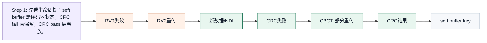
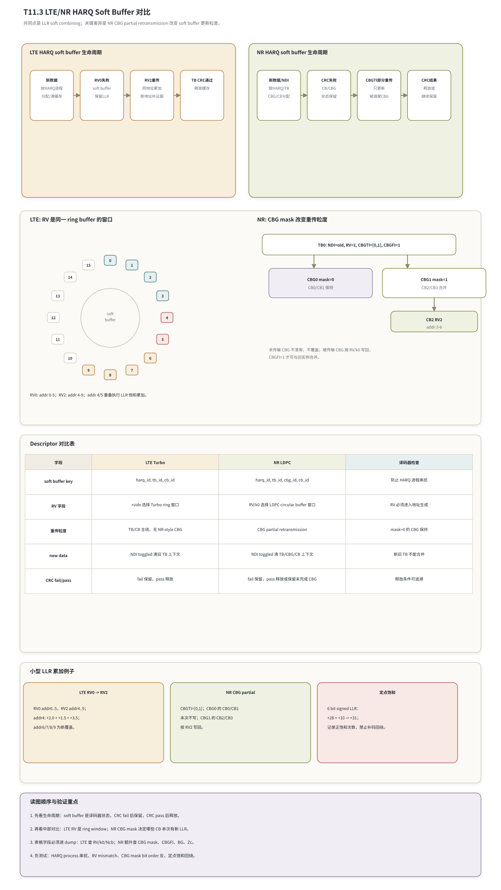

# T11.3 LTE/NR HARQ 与软缓存对比
## 本节学习目标

本节从接收端译码器状态的角度对比 LTE 和 NR 的混合自动重传请求软缓存。这里先统一单篇缩写：Turbo是 LTE 数据业务的主要信道编码；低密度奇偶校验码是 NR 数据业务的主要信道编码；对数似然比是 soft buffer 保存和合并的软信息；传输块是 HARQ 反馈和最终交付的基本数据块；码块是分段后送入译码器的处理块；CBG是 NR 为部分重传引入的 CB 分组；码块组传输信息（Code Block Group Transmission Information, CBGTI）指示本次哪些 CBG 被传输；码块组刷新信息（Code Block Group Flushing Out Information, CBGFI）说明下行 CBG 重传能否与旧实例合并；新数据指示（New Data Indicator, NDI）区分新 TB 和旧 TB 重传；冗余版本（Redundancy Version, RV）决定本次从速率匹配循环缓存的哪个窗口取得编码比特；循环冗余校验决定 soft buffer 是释放还是保留；传输块大小影响 CB 分段和本次可用比特数；上行共享信道是 LTE/NR 上行数据承载入口；下行控制信息携带 RV、NDI 和 CBG 相关控制字段；块错误率用于后续链路性能验收；静态随机存取存储器是硬件 soft buffer 的常见存储形态；寄存器传输级/专用集成电路实现要把这些字段落成地址生成、软缓存读改写、饱和加法、mask 和释放控制。

学完本节后，应能做到：

- 解释 HARQ soft buffer 为什么是译码器状态，不只是媒体接入控制层的调度状态。
- 说明 LTE 与 NR 的共同点：失败后保留同一编码位置的 LLR，重传时按 RV 地址执行 soft combining。
- 说明 LTE 与 NR 的关键差异：LTE Turbo 主线按 TB/CB 处理；NR LDPC 可以通过 CBG 只重传和更新部分 CB 组。
- 解释 RV 不是“第几次重传”的口语别名，而是循环缓存中不同起点或区域的选择。
- 手算一个 LTE RV0 初传、RV2 重传的小型地址/LLR 累加例子。
- 手算一个 NR CBGTI=[0,1] 的 CBG 部分重传例子，并说明未重传 CBG soft buffer 保持。
- 列出 LTE/NR soft buffer descriptor、最小 dump 包、定点饱和计数器和负测试。

如果只记一件事：**HARQ soft buffer 是接收端译码链路的一部分。调度层告诉译码器“这是新数据还是重传、哪个 HARQ process、哪个 RV、哪些 CBG 出现”；译码器必须据此决定清空、保持、累加、饱和和释放。**

## 前置知识检查

| 前置项 | 本节需要达到的程度 |
|:---|:---|
| T4.3 HARQ soft combining 基础 | 知道独立观测在 LLR 域可以相加，CRC fail 后软信息仍有价值。 |
| T7.3 LTE HARQ 软缓存与冗余版本 | 知道 LTE Turbo RV 是同一 circular buffer 上的窗口选择。 |
| T9.3 NR LDPC HARQ soft buffer、RV k0 与 CBG | 知道 NR LDPC RV 通过 `k0` 进入 circular buffer 地址，CBG mask 会改变哪些 CB 本次被更新。 |
| T11.2 速率匹配与速率恢复对比 | 知道接收端要把线性 LLR 流恢复到译码器母码坐标。 |
| 定点 LLR | 知道硬件 soft buffer 往往保存有限位宽 LLR，需要饱和而不是回绕。 |

本节不要求掌握 TS 36.213、TS 38.214 的全部调度过程。调度细节只保留会改变译码器状态的字段：`harq_id`、`tb_id`、`cb_id`、`cbg_id`、`ndi`、`rvidx`、`E`、`Ncb`、`k0`、`BG`、`Zc`、`cbg_mask`、`cbgfi` 和 CRC 结果。

## 任务边界与 Prompt 覆盖

| Prompt/台账要求 | 正文覆盖位置 | 扩展方式 |
|:---|:---|:---|
| 对比 LTE 与 NR 的 HARQ soft buffer 处理 | 全文 | 用统一 lifecycle、descriptor、LLR 累加和释放规则对比。 |
| 对比 RV 含义 | “RV 的共同抽象和差异” | 把 RV 解释为循环缓存窗口选择，而不是重传次数。 |
| 对比 CBG 支持 | “NR CBG 改变重传粒度” | 讲 TB -> CBG -> CB、CBGTI、CBGFI、未传输 CBG 保持。 |
| 讲译码控制影响 | “译码器状态机”到“RTL/ASIC 映射” | 只保留会影响 soft buffer 的调度字段。 |
| 说明 HARQ soft buffer 是译码器状态 | “soft buffer 的协议层边界” | 从 LLR 坐标、读改写、CRC 释放解释。 |
| 画 LTE/NR soft buffer lifecycle | 图 T11.3-1 | Python 长图含两套生命周期、LTE RV ring、NR CBG mask、descriptor 表和 LLR 例子。 |
| 给 LTE RV0/RV2 例子 | “LTE 小型地址/LLR 累加例子” | 给地址表、LLR 累加和 TB CRC 后果。 |
| 给 NR CBG 部分重传例子 | “NR 小型 CBG 部分重传例子” | 给 CBG mask、CB status、LLR 写回表。 |
| 讨论定点饱和和 saturation counter | “定点化策略” | 给饱和公式、正负计数器、禁止补码回绕。 |
| 最小 dump 包 | “验证方法与最小 dump 包” | LTE 查 RV/k0/Ncb，NR 额外查 CBG mask/BG/Zc/CBGFI。 |
| 负测试 | “验证方法与最小 dump 包” | 覆盖 HARQ process 串扰、RV mismatch、CBG mask mismatch。 |

这张表是最低覆盖线。正文额外补充协议前因后果、概率解释、伪代码、浮点仿真、硬件映射、常见错误和自测答案。

## 资料与协议边界

本节依据本地 Rel-19 抽取资料。协议分工要先讲清：TS 36.212/TS 38.212 定义信道编码和速率匹配轨迹；TS 36.213/TS 38.214 提供调制、RV、TBS、CBG 等物理层过程字段；TS 36.321/TS 38.321 描述 MAC HARQ entity/process 怎样把新传输、重传、soft buffer 合并和 ACK/NACK 连接起来。接收端 soft buffer 的 SRAM bank、LLR 位宽、饱和阈值和内部 pipeline 不是 3GPP 逐拍规定，但必须保持同一编码位置软信息合并这一语义。

| 协议位置 | 本地证据路径 |
| :--- | :--- |
| TS 36.212 §5.1.4.1.2 | `3GPP_Rel19/processed/TS_36.212_36212-j30/content.md:817-965` |
| TS 36.213 §8.3 | `3GPP_Rel19/processed/TS_36.213_36213-j30_s08-s09/content.md:1121-1171` |
| TS 36.213 §8.6/§8.6.1 | `content.md:1227-1395` |
| TS 36.321 §5.3.2.1/§5.3.2.2 | `3GPP_Rel19/processed/TS_36.321_36321-j20/content.md:1991-2108` |
| TS 38.212 §5.4.2.1 | `3GPP_Rel19/processed/TS_38.212_38212-j30/content.md:1248-1318` |
| TS 38.214 §5.1.7.1/§5.1.7.2 | `3GPP_Rel19/processed/TS_38.214_38214-j30/content.md:2407-2438` |
| TS 38.214 §6.1.5.1/§6.1.5.2 | `content.md:7099-7128` |
| TS 38.321 §5.3.2.1/§5.3.2.2 | `3GPP_Rel19/processed/TS_38.321_38321-j20/content.md:3763-3838` |

边界说明：

- 本节不复现 TS 38.212 Table 5.4.2.1-2 的具体 `k0` 数值。当前本地抽取表存在公式/数值空洞；T9.3 已给出人工核验后的公式形式。本节只使用 `k0` 作为“RV 到 circular buffer 起点”的抽象字段，例子使用 toy 地址。
- 本节不展开 TS 36.213/TS 38.214 的全部调度、HARQ-ACK timing、RRC 配置树和 DCI 格式细节。只保留会进入译码 descriptor 或 soft buffer 状态机的字段。
- 本节的地址/LLR 表是教学例子，不是 bit-exact 3GPP 测试向量。

## 协议前因后果

HARQ 的背景是无线信道不稳定。一次传输失败时，接收端已经得到了一批有噪声但仍有价值的 LLR。如果全部丢弃，下一次重传只能从头开始；如果保留并与后续重传合并，译码器看到的是更多编码位置或更可靠的相同位置证据。

LTE 与 NR 都继承这个思想，但编码和速率匹配结构不同：

| 系统 | 数据业务主码型 | HARQ soft buffer 主坐标 | 重传粒度主线 |
|:---|:---|:---|:---|
| LTE | Turbo | Turbo rate matching circular buffer，随后拆成三路 Turbo 输入 | TB/CB 主线，重传进入同一 TB 的 CB soft buffer。 |
| NR | LDPC | LDPC CB circular buffer 或母码位置，受 `Ncb`、BG、`Zc` 和 `k0` 影响 | TB/CB 主线外，支持 CBG partial retransmission。 |

LTE 的设计重点是通过 Turbo circular buffer 的不同 RV 窗口实现增量冗余。NR 数据业务使用 LDPC 后，一个 TB 更容易分成多个 CB，并且 NR 引入 CBG，把多个 CB 组成组，让重传可以只覆盖部分 CBG。这样能减少空口开销，也减少接收端重复处理的 CB 数量；代价是 soft buffer descriptor、mask、释放条件和验证负例都更复杂。

从译码器看，HARQ 的核心链条是：

```text
control fields -> descriptor -> rate recovery address trace -> soft buffer update -> decoder -> CRC -> buffer retain/release
```

只要这条链条中的一个字段错了，常见现象不是立即崩溃，而是 LLR 幅度看起来更大、迭代次数也跑满，但 CRC 仍失败。这是 HARQ soft buffer bug 难定位的原因。

## soft buffer 的协议层边界

TS 36.321 和 TS 38.321 都在 MAC HARQ process 语境下描述新传输、重传、soft buffer 合并、成功交付和失败保留。但工程实现不能因此把 soft buffer 当成纯 MAC 数据结构。原因有三点：

1. soft buffer 保存的是译码器坐标上的 LLR，不是 MAC PDU bytes。
2. soft buffer 的写地址来自 TS 36.212/TS 38.212 rate matching 轨迹，而不是 MAC header。
3. soft buffer 的释放由 CRC 结果和 HARQ process 生命周期共同决定，失败时要保留给下一次 rate recovery 使用。

因此可以把 MAC 和 PHY/decoder 的职责边界写成：

| 边界对象 | MAC/HARQ entity 关注 | 译码器/PHY 关注 |
|:---|:---|:---|
| `harq_id` | 路由到哪个 HARQ process | soft buffer bank 或上下文索引。 |
| `ndi` | 新传输还是重传 | 新传输清空旧 LLR，重传合并旧 LLR。 |
| `rvidx` | 本次传输的冗余版本字段 | 进入 `k0`/window/address generator。 |
| `tb_size` / `C` | TB 交付和分段背景 | CB 数量、CB buffer 分配、CB/TB CRC 组合。 |
| `cbg_mask` | NR 调度哪些 CBG 出现 | 未出现 CBG 保持，出现 CBG 才消费本次 LLR。 |
| CRC 结果 | ACK/NACK 和上层交付 | pass 释放或冻结成功状态，fail 保留 soft buffer。 |

这就是“调度细节只保留影响译码器状态的部分”的含义。符号、时隙、搜索空间、HARQ-ACK 资源等如果不改变上述状态，在本节只作为背景，不展开成调度教程。

## soft combining 的概率解释

设某个编码比特 $b$ 在两次独立传输中产生 LLR：

$$
L_1 = \log\frac{P(y_1|b=0)}{P(y_1|b=1)},
\qquad
L_2 = \log\frac{P(y_2|b=0)}{P(y_2|b=1)}.
\tag{1}
$$

若两次观测在给定 $b$ 时独立，联合观测的 LLR 是：

$$
L_{1,2}
= \log\frac{P(y_1,y_2|b=0)}{P(y_1,y_2|b=1)}
= \log\frac{P(y_1|b=0)P(y_2|b=0)}{P(y_1|b=1)P(y_2|b=1)}
= L_1 + L_2.
\tag{2}
$$

式 (2) 是 soft combining 的理论来源。它也说明了为什么“同一编码比特位置”是前提。如果 RV 地址错、CBG mask 错或 HARQ process 串扰，接收端相加的就不是同一个 $b$ 的独立观测，LLR 越加越自信，但自信指向错误位置。

工程实现常写成：

$$
L_{\mathrm{buf}}[a]
\leftarrow
\operatorname{sat}_{[L_{\min},L_{\max}]}
\left(L_{\mathrm{buf}}[a]+L_{\mathrm{rx}}[t]\right),
\tag{3}
$$

其中 $a$ 是 rate recovery 反推出的 circular-buffer 或母码地址，$t$ 是本次接收 LLR 流索引，`sat` 是定点饱和函数。首次观测可以看成旧值为 0 且 `observed_mask[a]=0`；未观测位置保持 `LLR=0, observed=0`，表示没有证据，不是业务比特 0。

## RV 的共同抽象和差异

RV 在 LTE 和 NR 中都不是“第几次重传”的同义词。更准确地说，RV 是速率匹配 circular buffer 上的窗口选择参数。调度可以第一次就发某个 RV，也可以重传时跳过某些常见顺序；译码器不能把 RV 硬编码成“初传=0，第一次重传=1，第二次重传=2”。

| 项目 | LTE Turbo | NR LDPC |
|:---|:---|:---|
| RV 字段 | `rvidx` 进入 TS 36.212 Turbo bit selection。 | `rvidx` 进入 TS 38.212 LDPC Table 5.4.2.1-2 的 `k0` 起点选择。 |
| 地址空间 | Turbo rate matching circular buffer，随后拆回三路 Turbo 输入。 | LDPC CB circular buffer 或母码位置，受 `Ncb`、BG、`Zc`、filler/known mask 影响。 |
| soft buffer key | 至少按 HARQ process、TB、CB、地址区分。 | 至少按 HARQ process、TB、CBG、CB、地址区分。 |
| 新 RV 的价值 | 可能补充前次未发送校验信息，也可能重复增强可靠度。 | 同样补充或重复，但还要先经过 CBG mask 判断本 CB 本次是否被传输。 |
| 常见错误 | RV 只写日志不进地址生成；`Ncb` 算错；`<NULL>` 跳过错。 | RV/k0/BG/Zc 不一致；CBG mask bit order 反；CBGFI=0 仍累加。 |

图 T11.3-1 把这个对比放在一张图里。




| 内容 | 说明 |
|:---|:---|
| 1. 先看生命周期：soft buffer 是译码器状态，CRC fail 后保留，CRC pass 后释放。 | 2. 再看中部对比：LTE RV 是 ring window；NR CBG mask 决定哪些 CB 本次有新 LLR。；3. 表格字段必须进 dump：LTE 查 RV/k0/Ncb；NR 额外查 CBG mask、CBGFI、BG、Zc。；4. 负测试：HARQ process 串扰、RV mismatch、CBG mask bit order 反、定点饱和回绕。 |
| 新数据 | 按HARQ进程；分配/清缓存 |
| RV0失败 | soft buffer；保留LLR |
| RV2重传 | 同地址累加；新地址补证据 |
| TB CRC通过 | 释放缓存 |
| 新数据/NDI | 按HARQ/TB；CBG/CB分配 |
| CRC失败 | CB/CBG；状态保留 |
| CBGTI部分重传 | 只更新；被调度CBG |
| CRC结果 | 释放或；继续保留 |
| soft | buffer |
上方是 LTE 与 NR soft buffer 生命周期；中部左侧把 LTE RV0/RV2 画成同一 ring buffer 的窗口，右侧展示 NR `CBGTI=[0,1]` 时 CBG0 保持、CBG1 合并；下方给 descriptor 对比、小型 LLR 累加例子和验证重点。

## soft buffer 生命周期对比

LTE 与 NR 的生命周期可以统一成四个状态：分配或清空、写入或合并、译码和 CRC、保留或释放。

| 生命周期阶段 | LTE Turbo | NR LDPC | 译码器状态后果 |
|:---|:---|:---|:---|
| 新数据到来 | NDI toggled 或首次 TB，清 `(harq_id,tb_id,cb_id)` 上下文。 | NDI toggled 或首次 TB，清 `(harq_id,tb_id,cbg_id,cb_id)` 上下文。 | 旧 LLR、observed mask、saturation counter、CB status 不能残留。 |
| 初传写入 | 按 RV 和 `Ncb` 写入 Turbo circular buffer。 | 初传通常可认为所有 CBG 出现；每个 CB 按 RV/k0 写入。 | 首次命中地址置 observed。 |
| CRC 失败 | 保留 soft buffer，等待重传。 | 保留 TB/CB/CBG 状态；若 CBG 部分重传开启，按 CBG 维度保留。 | 下一次重传必须使用历史 LLR。 |
| 重传到来 | 对每个 CB 按新 RV 地址生成并合并。 | 先解析 CBGTI/CBGFI，再只对出现且可合并的 CBG 中 CB 写回。 | 未传输 CBG 保持，不清零、不覆盖。 |
| CRC 通过 | 交付 TB，释放或回收相关 soft buffer。 | CB/TB 成功后释放；部分 CBG 状态要和 TB 级交付一致。 | 释放必须按 HARQ/TB key 精确执行。 |

NR 的复杂度来自“保留”不再只是整个 TB 维度。一个 TB 中某些 CBG 可能本次未重传，另一些 CBG 被重传并合并；某些 CB 可能已经成功，另一些仍失败。实现可以选择是否重译已成功 CB，但不能丢掉 soft buffer 的协议语义。

## NR CBG 改变重传粒度

CBG 不改变 LDPC 校验矩阵，也不改变单个 CB 的 Min-Sum 或 BP 译码公式。它改变的是 HARQ 重传和 soft buffer 更新控制。TS 38.214 对 PDSCH/PUSCH CBG 都说明：CBGTI 的 bit 从最高有效位开始映射到 CBG#0，`0` 表示对应 CBG 不传输，`1` 表示传输。PDSCH 还可能有 CBGFI：`0` 表示早前同 CBG 实例可能损坏，不能简单合并；`1` 表示可合并。

这带来三个接收端规则：

| 规则 | 解释 | 错误后果 |
|:---|:---|:---|
| mask=0 保持 | 该 CBG 本次没有新 LLR 输入，组内 CB soft buffer、observed mask 和状态保持。 | 若清零，会丢掉历史证据；若覆盖，会制造不存在的观测。 |
| mask=1 才写回 | 该 CBG 本次出现，组内 CB 按本次 RV/k0 地址写入或累加。 | 若忽略 mask，会把 LLR 流分配到错误 CB。 |
| CBGFI 控制合并边界 | PDSCH 中若 CBGFI=0，旧实例可能不可合并，需要 flush/隔离。 | 若仍累加，可能把损坏实例当独立证据。 |

LTE Turbo 主线没有 NR-style CBG partial retransmission。LTE 也有 TB/CB 分段和 soft buffer 限制，但没有通过 CBG mask 在同一 TB 内只更新部分 CB 组的这套 NR 控制语义。

## 译码器 descriptor 对比

图中的 `Descriptor 对比表` 把最后一列命名为“译码器检查”，用于明确每个 descriptor 字段要阻断哪类实现错误：

| 字段 | LTE Turbo | NR LDPC | 译码器检查 |
|:---|:---|:---|:---|
| soft buffer key | `harq_id, tb_id, cb_id` | `harq_id, tb_id, cbg_id, cb_id` | 防止 HARQ 进程串扰 |
| RV 字段 | `rvidx` 选择 Turbo ring 窗口 | `RV/k0` 选择 LDPC circular buffer 窗口 | RV 必须进入地址生成 |
| 重传粒度 | TB/CB 主线，无 NR-style CBG | CBG partial retransmission | `mask=0` 的 CBG 保持 |
| new data | NDI toggled 清旧 TB 上下文 | NDI toggled 清 TB/CBG/CB 上下文 | 新旧 TB 不能合并 |
| CRC fail/pass | fail 保留，pass 释放 | fail 保留，pass 释放或保留未完成 CBG | 释放条件可追溯 |

| 字段 | LTE Turbo | NR LDPC | 用途 |
|:---|:---|:---|:---|
| `rat` | `LTE` | `NR` | 防止协议规则混用。 |
| `codec` | `turbo` | `ldpc` | 选择 rate recovery 和 decoder core。 |
| `harq_id` | 必需 | 必需 | soft buffer process key。 |
| `tb_id` | 必需，空间复用时注意双 TB | 必需，支持多 TB/codeword 场景 | TB 级清空、交付和释放。 |
| `cb_id` | 必需 | 必需 | CB soft buffer 和 CRC status key。 |
| `cbg_id` | 不适用 | CBG 开启时必需 | CBG partial retransmission 粒度。 |
| `ndi` | 必需 | 必需 | 判断清旧缓存还是重传合并。 |
| `rvidx` | 必需 | 必需 | 进入地址生成。 |
| `k0` | 可由 LTE 公式/窗口生成或记录 | 由 RV/BG/`Ncb`/`Zc` 表生成 | 调试 RV mismatch 的最小证据。 |
| `Ncb` | 必需 | 必需 | circular buffer 长度和取模边界。 |
| `E` / `Er` | 必需 | 必需 | 本次 LLR 数量。 |
| `BG` | 不适用 | 必需 | NR LDPC `k0` 和矩阵上下文。 |
| `Zc` | 不适用 | 必需 | `k0` 对齐和矩阵提升上下文。 |
| `cbg_mask` | 不适用 | CBG 开启时必需 | 判断哪些 CBG 本次消费 LLR。 |
| `cbgfi` | 不适用 | PDSCH CBG 开启且字段存在时必需 | 判断旧实例是否可合并。 |
| `soft_buffer_addr` | 必需 | 必需 | 物理 SRAM 地址或逻辑地址。 |

工程上建议把 descriptor 分成三层：

```text
HARQ key:      rat, carrier/cell, harq_id, tb_id
block key:     cbg_id(optional), cb_id, codeword_id
rate key:      rvidx, k0, Ncb, E/Er, BG, Zc, Qm, masks
```

这样做的价值是定位错误时能判断：是 HARQ process 串了，还是 CB/CBG 层级错了，还是 RV 地址错了。

## LTE 小型地址/LLR 累加例子

下面使用 toy circular buffer 长度 10。它不是协议真实参数，只用于观察 RV0 和 RV2 如何合并。假设 RV0 初传覆盖地址 0..5，RV2 重传覆盖地址 4..9。

| 地址 | RV0 LLR | RV2 LLR | 合并后 | 状态 |
|---:|---:|---:|---:|:---|
| 0 | +1.0 | - | +1.0 | RV0 已观测，RV2 未命中。 |
| 1 | -0.8 | - | -0.8 | RV0 已观测，RV2 未命中。 |
| 2 | +0.5 | - | +0.5 | RV0 已观测，RV2 未命中。 |
| 3 | -1.2 | - | -1.2 | RV0 已观测，RV2 未命中。 |
| 4 | +2.0 | +1.5 | +3.5 | 重复命中，执行 LLR 累加。 |
| 5 | -1.0 | -0.7 | -1.7 | 重复命中，执行 LLR 累加。 |
| 6 | - | +0.9 | +0.9 | RV2 新覆盖。 |
| 7 | - | -1.4 | -1.4 | RV2 新覆盖。 |
| 8 | - | +0.6 | +0.6 | RV2 新覆盖。 |
| 9 | - | -0.5 | -0.5 | RV2 新覆盖。 |

接收端流程是：

1. RV0 初传到来，`ndi=new`，清空旧 soft buffer，写入地址 0..5。
2. Turbo 译码后 TB CRC fail，soft buffer 保留。
3. RV2 重传到来，`ndi=old`，按 RV2 地址生成器写入地址 4..9。
4. 地址 4/5 已观测，执行式 (3) 的累加；地址 6..9 首次观测，写入新 LLR。
5. 再次 Turbo 译码，若 TB CRC pass，释放该 TB 的 soft buffer；若 fail，保留等待下一次重传。

这个例子说明“增量冗余”和“重复增强”可以同时出现。地址 6..9 是新增证据，地址 4/5 是重复证据。

## NR 小型 CBG 部分重传例子

假设一个 NR TB 分成 4 个 CB，组成 2 个 CBG：CBG0={CB0,CB1}，CBG1={CB2,CB3}。某次重传的 descriptor 为：

```text
harq_id=3, tb_id=0, ndi=old, rvidx=2, CBGTI=[0,1], CBGFI=1
```

CBGTI 从最高有效位映射 CBG#0，所以 `[0,1]` 表示 CBG0 不传输，CBG1 传输。接收端状态表如下：

| CBG | CB | 本次是否传输 | soft buffer 动作 | 译码控制后果 |
|:---:|:---:|:---:|:---|:---|
| CBG0 | CB0 | 否 | 保持旧 LLR、observed mask、CB status。 | 不消费本次 LLR，可选择不重译或用历史状态参与 TB 组合。 |
| CBG0 | CB1 | 否 | 保持旧 LLR、observed mask、CB status。 | 不清零，不覆盖。 |
| CBG1 | CB2 | 是 | 按 RV2/k0 生成地址，写入或累加。 | 可重译 CB2。 |
| CBG1 | CB3 | 是 | 按 RV2/k0 生成地址，写入或累加。 | 可重译 CB3。 |

再给 CB2 的 toy 地址表。假设 `Ncb=8`，RV2 起点 `k0=3`，本次 $E=4$，接收 LLR 为 `[+1.0, -0.5, +0.8, -1.2]`，地址序列为 3,4,5,6。历史 soft buffer 中地址 3 已有 `+2.0`，地址 4 已有 `-0.2`。

| 地址 | 旧 LLR | 本次 LLR | 新 LLR | 状态 |
|---:|---:|---:|---:|:---|
| 0 | +0.4 | - | +0.4 | 本次未命中，保持。 |
| 1 | 0 | - | 0 | 未观测，保持 unknown。 |
| 2 | -0.7 | - | -0.7 | 本次未命中，保持。 |
| 3 | +2.0 | +1.0 | +3.0 | 重复命中，累加。 |
| 4 | -0.2 | -0.5 | -0.7 | 重复命中，累加。 |
| 5 | 0 | +0.8 | +0.8 | 新覆盖。 |
| 6 | 0 | -1.2 | -1.2 | 新覆盖。 |
| 7 | 0 | - | 0 | 未观测，保持 unknown。 |

NR 的关键点不是这 4 个 LLR 怎么加，而是 CBG0 的 CB0/CB1 根本没有本次 LLR。把本次 LLR 平均分给所有 CB，或在 CBG0 上写中性 0 覆盖旧值，都是错误。

## 接收端伪代码

```python
def update_harq_soft_buffer(desc, rx_llr_by_cb):
    """Teaching pseudocode; protocol tables generate desc fields before this point."""
    key_tb = (desc.rat, desc.cell_id, desc.harq_id, desc.tb_id)

    if desc.ndi_toggled or not soft_buffer.exists(key_tb):
        soft_buffer.clear_tb(key_tb)
        status.clear_tb(key_tb)

    for cb in desc.code_blocks:
        if desc.rat == "NR" and desc.cbg_enabled:
            if desc.cbg_mask[cb.cbg_id] == 0:
                continue
            if desc.has_cbgfi and desc.cbgfi == 0:
                soft_buffer.clear_cbg(key_tb, cb.cbg_id)

        addr_trace = rate_recovery_addresses(
            rat=desc.rat,
            codec=desc.codec,
            rvidx=desc.rvidx,
            k0=cb.k0,
            ncb=cb.Ncb,
            e=cb.E,
            masks=cb.masks,
        )

        for t, addr in enumerate(addr_trace):
            if addr.is_null_or_not_transmitted:
                continue
            old = soft_buffer.get(key_tb, cb.cbg_id, cb.cb_id, addr.pos)
            new, saturated = sat_add(old, rx_llr_by_cb[cb.cb_id][t])
            soft_buffer.set(key_tb, cb.cbg_id, cb.cb_id, addr.pos, new)
            soft_buffer.mark_observed(key_tb, cb.cbg_id, cb.cb_id, addr.pos)
            if saturated:
                counters.inc(key_tb, "sat_count")

    decode_result = decoder.run(key_tb, soft_buffer.view(key_tb))
    if decode_result.tb_crc_pass:
        deliver_tb(decode_result.tb_bits)
        soft_buffer.release_tb(key_tb)
    else:
        soft_buffer.retain_tb(key_tb)
    return decode_result
```

这段伪代码刻意把 `rate_recovery_addresses()` 抽出来，因为 LTE Turbo、NR LDPC 的地址生成规则不同。共享的是“地址轨迹驱动 soft buffer 更新”的框架，不共享具体协议表和 mask 语义。

## 浮点仿真方案

浮点模型的目标不是做完整 BLER 曲线，而是验证 soft buffer 状态转移和 LLR 合并语义。建议最小方案如下：

| 测试 | 输入 | 期望 |
|:---|:---|:---|
| LTE RV0/RV2 合并 | toy `Ncb=10`，RV0 addr0..5，RV2 addr4..9 | addr4/5 累加，addr6..9 新覆盖，addr0..3 保持。 |
| LTE 新 TB 清空 | 同一 `harq_id`，NDI toggled | 旧 soft buffer 全清，sat_count 清零。 |
| NR CBG mask 保持 | 4 CB/2 CBG，CBGTI=[0,1] | CBG0 的 write_count 不变，CBG1 更新。 |
| NR CBGFI flush | PDSCH CBGFI=0 | 被重传 CBG 的旧实例不参与累加。 |
| RV mismatch 负例 | 故意把 RV2 当 RV0 地址 | soft buffer 差异可定位到地址 trace，CRC 预期失败。 |

浮点模型应输出以下 trace：

```text
harq_id, tb_id, cbg_id, cb_id, rvidx, k0, Ncb, E,
addr_trace, old_llr, rx_llr, new_llr, observed_before,
saturated, cb_crc, tb_crc, buffer_action
```

这样即使最终 CRC fail，也能判断错误发生在地址生成、mask、饱和还是译码核心。

## 定点化策略

定点 soft buffer 不能使用普通补码加法回绕。设 LLR 使用 6 bit signed，范围为 $[-32,31]$，饱和函数为：

$$
\operatorname{sat}_{6}(x)=
\begin{cases}
31, & x>31,\\
-32, & x<-32,\\
x, & -32\le x\le 31.
\end{cases}
\tag{4}
$$

合并公式是：

$$
L_{\mathrm{buf}}^{\mathrm{new}}[a]
=
\operatorname{sat}_{6}
\left(L_{\mathrm{buf}}^{\mathrm{old}}[a]+L_{\mathrm{rx}}[t]\right).
\tag{5}
$$

定点实现至少记录三个计数器：

| 计数器 | 触发条件 | 用途 |
|:---|:---|:---|
| `sat_pos_count` | 加法结果超过正上限 | 发现过强正 LLR 或重复合并异常。 |
| `sat_neg_count` | 加法结果低于负下限 | 发现过强负 LLR 或符号约定错误。 |
| `wrap_guard_error` | 验证中检测到补码回绕 | 硬件错误，必须阻断。 |

示例：

| 旧 LLR | 新 LLR | 普通和 | 饱和后 | 计数器 |
|---:|---:|---:|---:|:---|
| +28 | +10 | +38 | +31 | `sat_pos_count += 1` |
| -30 | -8 | -38 | -32 | `sat_neg_count += 1` |
| +20 | -6 | +14 | +14 | 不增加 |

NR CBG partial retransmission 下，饱和计数器最好按 `(harq_id,tb_id,cbg_id,cb_id)` 归属，避免只看到 TB 总计数却无法定位哪个 CBG 被重复累加。

## RTL/ASIC 映射

HARQ soft buffer 在硬件中通常是大容量 SRAM 或 SRAM 组，配合地址生成、读改写、饱和加法和状态 RAM。

| 模块 | LTE Turbo | NR LDPC | 共享与差异 |
|:---|:---|:---|:---|
| descriptor FIFO | 接收 `harq_id/tb_id/cb_id/rvidx/E/Ncb` | 额外接收 `cbg_id/cbg_mask/cbgfi/BG/Zc/k0` | FIFO 形态可共享，字段不同。 |
| address generator | Turbo circular buffer + `<NULL>` skip | LDPC `k0` + `Ncb` + filler/known mask | 不共享协议规则。 |
| soft buffer SRAM | 按 CB 和地址存 LLR | 按 CBG/CB 和地址存 LLR | bank/key 维度 NR 更复杂。 |
| read-modify-write | 重传地址读旧 LLR，加新 LLR，写回 | 重传地址读旧 LLR、受 CBG mask/CBGFI 控制后加新 LLR、再写回 | 加法器可共享，enable 条件不同。 |
| status RAM | CB CRC、TB CRC、observed mask、sat count | 额外 CBG status、CBG mask、flush/combine 状态 | NR 状态维度更多。 |
| release controller | TB pass 释放，fail 保留 | TB/CBG/CB 状态协调释放 | 释放条件不能只按 CB 局部判断。 |

硬件风险集中在四类：

- **indexing**：`harq_id`、`tb_id`、`cb_id`、`cbg_id` 少一维会造成上下文串扰。
- **bank conflict**：重传合并需要读改写，多个 CB/层并行时可能争用同一 SRAM bank。
- **flush/release**：NDI toggled、CRC pass、CBGFI=0 都可能触发清空或隔离，时序必须明确。
- **saturation**：LLR 加法必须饱和，饱和计数要能 dump。

实现上可以把 `soft_buffer_addr` 设计为：

$$
\texttt{addr}
= \texttt{base}(harq,tb,cbg,cb) + \texttt{local\_addr}.
\tag{6}
$$

LTE 可以让 `cbg=0` 或禁用该维度；NR CBG 开启时必须把 `cbg` 纳入 base 计算或状态索引。不能为了复用 LTE 结构而把不同 CBG 压进同一个 CB 地址空间。

## 验证方法与最小 dump 包

### 正向测试

| 测试 | 验证点 |
|:---|:---|
| LTE RV0 初传 fail 后 RV2 重传 | 旧地址累加、新地址覆盖、TB CRC pass 后释放。 |
| LTE 新数据复用同一 HARQ process | NDI toggled 后旧 LLR 不残留。 |
| NR 初传全 CBG | 所有 CBG/CB 都有写入机会。 |
| NR CBGTI partial retransmission | mask=0 CBG 保持，mask=1 CBG 更新。 |
| NR CBGFI=0 | 被重传 CBG 不与旧实例合并。 |
| 定点强 LLR 重复 | 饱和到上/下限，计数器增加。 |

### 负测试

| 负测试 | 注入错误 | 预期捕获方式 |
|:---|:---|:---|
| HARQ process 串扰 | 把 `harq_id=3` 的重传写到 `harq_id=2` | dump 中 `soft_buffer_addr` base 与 descriptor key 不一致。 |
| RV mismatch | 发送 RV2，接收按 RV0 地址恢复 | `addr_trace` 首个地址和 `k0` 不匹配，CRC fail。 |
| CBG mask mismatch | CBGTI bit order 反了 | mask=0 的 CBG 出现 write_count，mask=1 的 CBG 未更新。 |
| CBGFI 漏用 | CBGFI=0 仍累加旧 LLR | flush counter 为 0，但协议字段要求 flush/隔离。 |
| 定点回绕 | `+28 + +10` 变成负数 | `wrap_guard_error` 触发。 |

### 最小 dump 包

| dump 字段 | LTE 必需 | NR 必需 | 说明 |
|:---|:---:|:---:|:---|
| `rat/codec` | 是 | 是 | 防止协议混用。 |
| `harq_id/tb_id/cb_id` | 是 | 是 | soft buffer key。 |
| `cbg_id/cbg_mask/cbgfi` | 不适用 | 是，CBG 开启时 | 定位 partial retransmission。 |
| `ndi` | 是 | 是 | 新数据清空边界。 |
| `rvidx/k0/Ncb/E` | 是 | 是 | 地址生成最小字段。 |
| `BG/Zc` | 不适用 | 是 | NR LDPC `k0` 和矩阵上下文。 |
| `addr_trace` | 是 | 是 | 定位 RV/address mismatch。 |
| `old_llr/rx_llr/new_llr` | 是 | 是 | 定位累加、覆盖、饱和。 |
| `observed_mask` | 是 | 是 | 区分 unknown 和真实 0 LLR。 |
| `sat_pos_count/sat_neg_count` | 是 | 是 | 定点风险定位。 |
| `CB CRC/TB CRC` | 是 | 是 | release/retain 决策证据。 |

## 常见错误

| 错误 | 现象 | 定位方式 | 修复方向 |
|:---|:---|:---|:---|
| 把 RV 当重传次数 | 特定重传顺序下 CRC fail | 比较调度 `rvidx` 和 `addr_trace/k0` | RV 必须进入地址生成，不写死顺序。 |
| LTE 逻辑套 NR CBG | NR 部分重传时未传 CBG 被清零或覆盖 | 检查 mask=0 CBG 的 write_count | CBG mask 先于 CB rate recovery 生效。 |
| CBG mask bit order 反 | CBG0/CBG1 更新互换 | 查 CBGTI MSB -> CBG#0 映射 | descriptor 解析统一 bit order。 |
| HARQ process 复用未清 | 新 TB CRC 异常，LLR 初值非 0 | NDI toggled 时 dump old observed mask | 新数据必须清旧 TB 上下文。 |
| CBGFI=0 仍累加 | PDSCH CBG 重传性能异常 | 查 CBGFI 和 flush counter | 旧实例不可合并时 flush/隔离。 |
| 定点加法回绕 | LLR 符号突然反转 | 强 LLR 重复测试 | 使用饱和加法和计数器。 |
| 释放条件过早 | 后续重传找不到历史 LLR | 查 TB/CB CRC 与 release log | 只有对应 TB/上下文满足条件才释放。 |

## 自测题

1. HARQ soft buffer 为什么不能只按 `cb_id` 索引？
2. 如果 NR CBGTI=[0,1]，接收端是否应该把 CBG0 的 soft buffer 清零？
3. CBGFI=0 时，接收端为什么不能简单继续累加旧 LLR？
4. 定点实现中为什么要记录 saturation counter？
5. “调度细节只保留影响译码器状态的部分”具体是什么意思？

## 自测题参考答案

1. 因为不同 HARQ process、TB、codeword、CBG 都可能有相同 `cb_id`。只按 `cb_id` 会把不同 TB 的历史 LLR 加在一起，造成上下文串扰。
2. 不应该。`0` 表示对应 CBG 本次不传输，接收端应保持旧 soft buffer 和状态。清零会丢掉历史证据。
3. PDSCH CBGFI=0 表示早前同 CBG 实例可能已损坏，不能把旧实例当作可靠可合并观测。实现需要 flush、隔离或按产品定义阻止旧实例参与合并。
4. 饱和说明 LLR 可靠度已到表示上限。计数器能发现重复合并异常、符号错误或输入尺度过大，也能证明硬件没有补码回绕。
5. 本节不展开搜索空间、PUCCH 资源、完整 HARQ-ACK timing 等不会直接改变 soft buffer 的细节；保留 `ndi`、`rvidx`、CBGTI、CBGFI、TBS/CB 分段、CRC 结果等会决定清空、写回、合并、保持或释放的字段。

## 协议证据表

| 结论 | 协议证据 | 本地路径 | 证据状态 |
|:---|:---|:---|:---|
| LTE Turbo rate matching 使用 circular buffer、`Ncb`、`E`、`rvidx` | TS 36.212 §5.1.4.1.2 | `3GPP_Rel19/processed/TS_36.212_36212-j30/content.md:817-965` | 已核验文本；公式抽取有空白，T7.3 已补主线公式证据。 |
| LTE MAC HARQ process 新传输/重传区分，重传与 soft buffer 合并 | TS 36.321 §5.3.2.1/§5.3.2.2 | `3GPP_Rel19/processed/TS_36.321_36321-j20/content.md:1991-2108` | 已核验文本。 |
| LTE UL-SCH RV/TBS 字段来自物理层过程 | TS 36.213 §8.6/§8.6.1 | `3GPP_Rel19/processed/TS_36.213_36213-j30_s08-s09/content.md:1227-1395` | 已核验文本；本节只作字段来源边界。 |
| NR LDPC bit selection 按 CBGTI 判断 CB 是否 scheduled，并使用 RV/k0 | TS 38.212 §5.4.2.1 | `3GPP_Rel19/processed/TS_38.212_38212-j30/content.md:1248-1318` | 已核验文本；`k0` 表具体值不在本节使用。 |
| NR PDSCH CBG grouping、CBGTI、CBGFI | TS 38.214 §5.1.7.1/§5.1.7.2 | `3GPP_Rel19/processed/TS_38.214_38214-j30/content.md:2407-2438` | 已核验文本。 |
| NR PUSCH CBG grouping、CBGTI bit order | TS 38.214 §6.1.5.1/§6.1.5.2 | `3GPP_Rel19/processed/TS_38.214_38214-j30/content.md:7099-7128` | 已核验文本。 |
| NR MAC HARQ process 指示 PHY 合并 soft buffer 或替换 | TS 38.321 §5.3.2.1/§5.3.2.2 | `3GPP_Rel19/processed/TS_38.321_38321-j20/content.md:3763-3838` | 已核验文本。 |

## 图示


## 执行与证据记录

| 项目 | 记录 |
|:---|:---|
| 路线图卡片 | `2026-06-19-lte-nr-decoding-learning-roadmap.md` T11.3。 |
| 本地协议 | TS 36.212 `36212-j30`、TS 36.213 `36213-j30_s08-s09`、TS 36.321 `36321-j20`、TS 38.212 `38212-j30`、TS 38.214 `38214-j30`、TS 38.321 `38321-j20`。 |
| 资产目检 | 已检查文本框和表格单元格文字水平/垂直居中、右侧说明不裁切、箭头未压字、端点落在节点边界、局部间距无接触。 |
| 协议表/图复现 | 本节未复现大型协议表；依赖的 RV/CBG 规则在正文用字段表和教学图重建。TS 38.212 `k0` 具体表值因本地抽取缺口不在本节使用。 |
| 审计命令 | `python3 tools/audit_lesson_terms.py docs/L2/T11.3_HARQ_soft_buffer_comparison.md` -> `LESSON_TERM_AUDIT_OK`；`python3 tools/audit_markdown_headings.py docs/L2/T11.3_HARQ_soft_buffer_comparison.md` -> `MARKDOWN_HEADING_AUDIT_OK`；`python3 tools/audit_lesson_depth.py --strict docs/L2/T11.3_HARQ_soft_buffer_comparison.md` -> `LESSON_DEPTH_AUDIT_OK`；`python3 tools/audit_latex_render.py docs/L2/T11.3_HARQ_soft_buffer_comparison.md` -> `LATEX_RENDER_AUDIT_OK formulas=13`；`python3 tools/audit_reference_rebuilds.py docs/L2/T11.3_HARQ_soft_buffer_comparison.md` -> `REFERENCE_REBUILD_AUDIT_CANDIDATES`，候选项已在正文边界中说明：本节不使用 TS 38.212 Table 5.4.2.1-2 具体 `k0` 表值。 |

## 参考文献

- 3GPP TS 36.212 V19.3.0, Multiplexing and channel coding, Rel-19，本地路径 `3GPP_Rel19/processed/TS_36.212_36212-j30`。
- 3GPP TS 36.213 V19.3.0, Physical layer procedures, Rel-19，本地路径 `3GPP_Rel19/processed/TS_36.213_36213-j30_s08-s09`。
- 3GPP TS 36.321 V19.2.0, Medium Access Control protocol specification, Rel-19，本地路径 `3GPP_Rel19/processed/TS_36.321_36321-j20`。
- 3GPP TS 38.212 V19.3.0, NR Multiplexing and channel coding, Rel-19，本地路径 `3GPP_Rel19/processed/TS_38.212_38212-j30`。
- 3GPP TS 38.214 V19.3.0, NR Physical layer procedures for data, Rel-19，本地路径 `3GPP_Rel19/processed/TS_38.214_38214-j30`。
- 3GPP TS 38.321 V19.2.0, NR Medium Access Control protocol specification, Rel-19，本地路径 `3GPP_Rel19/processed/TS_38.321_38321-j20`。
