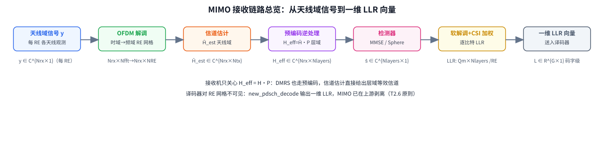

# T12.1 MIMO 接收链路总览：从每 RE 矩阵模型到一维 LLR

## 本节学习目标

L1 系列把单天线接收链路讲完了：T2.6 建立了"从资源网格到译码器输入"的端到端数据流，T2.9 给出正交幅度调制（Quadrature Amplitude Modulation, QAM）的软解调（Max-Log-MAP），T2.10 引入衰落信道下的标量模型 $y=hx+n$。这条链路里，一个资源单元（Resource Element, RE）上只有一个复数符号，接收端只有一根天线，均衡和软解调处理的都是标量。

真实 LTE/NR 设备不是这样的。基站和手机都有多根天线，发射端把数据流拆成多个空间层（layer），再用预编码矩阵（precoding matrix）把层"铺"到多根发射天线上；接收端则要从多根接收天线收到的混合信号里，把各层重新分离出来。于是"一根天线一个符号"变成"多根天线一组符号"，标量模型必须升级成矩阵模型。本节（T12.1）是 MIMO 接收机与检测器系列的第一篇，任务是先把整条 MIMO 接收链路的**地图**画出来：从天线域接收信号出发，经过 OFDM 解调、信道估计、预编码逆处理、检测器、软解调与 CSI 加权，最后得到译码器能消费的一维对数似然比（Log-Likelihood Ratio, LLR）向量。

学完本节后，应能做到：

- 画出 MIMO 接收链路地图：RE 网格 → 均衡/检测 → 软解调 → LLR 向量，并说出每一步的输入、输出与维度变化。
- 写出每个 RE 上的线性 MIMO 模型 $\mathbf{y}=\mathbf{H}\mathbf{P}\mathbf{x}+\mathbf{n}$，并解释四个量的维度与物理含义。
- 推导层域等效信道 $\mathbf{H}_{\mathrm{eff}}=\mathbf{H}\mathbf{P}$，并解释"接收机只关心 $\mathbf{H}_{\mathrm{eff}}$、不需要知道 $\mathbf{P}$"这句话为什么成立。
- 推导发射功率归一化恒等式 $\mathbb{E}\|\mathbf{P}\mathbf{x}\|^2=\|\mathbf{P}\|_F^2 E_s$，并说明 $\|\mathbf{P}\|_F=1$ 时天线域总功率与层数无关。
- 说明单码字最多 4 层的协议约束（TS 38.211 §7.3.1.3）以及 5–8 层为何必须走双码字。
- 说清 transpose（转置）与 ctranspose（共轭转置）的约定为什么是复矩阵预编码最容易出错的地方。
- 论证"译码器对 RE 网格不可见"：MIMO 处理全部在上游剥离，译码器只拿到一维 LLR 向量（衔接 T2.6 的既有原则）。

本节只画地图，不做算法细节。检测器怎么算、分集合并怎么推导、信道估计怎么实现，分别由本系列后续篇目承接：

| 篇目 | 主题 | 承接本节的哪个概念 |
|:---|:---|:---|
| T12.2 | 分集与合并 | 多份独立拷贝对抗深衰落；最大比合并推导 |
| T12.3 | 线性检测器 | MMSE 是 MRC 的多天线矩阵推广，消费 $\mathbf{H}_{\mathrm{eff}}$ |
| T12.4 | 球面检测 | 最大似然的低复杂度近似，高 SNR 场景 |
| T12.5 | 信道估计与 CSI | DMRS 如何直接给出层域等效信道 $\mathbf{H}_{\mathrm{eff}}$ |

本节先把这些篇目共享的总览概念——每 RE 模型、$\mathbf{H}_{\mathrm{eff}}$、功率归一化、接收链路地图——一次性立稳，后面每篇都从这张地图上取位置。注意：T12.2–T12.5 与本节同属一个系列，写作时以文字承接，不另设链接。

## 前置知识检查

| 前置项 | 本节需要达到的程度 |
|:---|:---|
| [[T2.6_from_resource_grid_to_decoder_LLR]] 从 RE 网格到译码器 LLR | 知道译码器输入是一维 LLR 向量；BWP、PRB、DMRS 位置等 RE 网格信息在上游被剥离。 |
| [[T2.9_QAM_Max_Log_MAP_demapping]] QAM 软解调 | 知道一个 QAM 符号经 Max-Log-MAP 变成 $Q_m$ 个逐比特 LLR；正 LLR 更像比特 `0`。 |
| [[T2.10_fading_channel_LLR_reliability]] 衰落信道 | 知道 $y=hx+n$、$h$ 是复增益（幅度+相位）、深衰落时 LLR 可靠度下降。 |
| [[MIMO_多天线系统]] | 知道 $N_{\mathrm{tx}}$（发射天线）、$N_{\mathrm{rx}}$（接收天线）、$N_{\mathrm{layers}}$（层数）三个维度，以及"层数 ≤ 秩 ≤ min(Ntx, Nrx)"约束。 |
| [[LLR_对数似然比]] | 知道 LLR 的符号表示倾向、绝对值表示可靠度；本知识库约定正 LLR 更像 `0`。 |
| [[Detector_Comparison_检测器对比]] | 知道检测器是接收机自由度（协议只定义传输假设，不规定接收端怎么检测）；性能排序 MF ≤ ZF ≤ MMSE ≤ ML。 |

如果这些前置还不稳，先抓住一句话：**本节回答"多天线接收时，译码器面前的 LLR 是怎么从一堆接收天线的信号里变出来的"**。前置知识检查里所有标量直觉（$y=hx+n$、软解调、LLR）都会在本节升级成向量/矩阵版本，但升级的方式是"逐 RE 独立进行"，所以每个 RE 上仍然是一个熟悉的标量问题，只是参数变成了矩阵。

## 从单天线到多天线：为什么需要矩阵模型

### 生活类比：多个话筒录同一场音乐会

想象一场音乐会：舞台上有一位主唱歌手（目标信号），观众席有杂音和回声（噪声与多径）。如果用一支话筒录音，效果完全取决于这支话筒的位置——离歌手近就清晰，位置差就全是噪音。但如果你在观众席的不同位置放**多支话筒**，每支话筒听到的混合比例都不同：有的离歌手近、主唱声音大；有的被柱子挡住、回声多。录音师把多支话筒的信号合并起来，就能把主唱的声音"听"得比任何单支话筒都清楚，还能把某个方向上的杂音抵消掉一部分。

这就是多天线的本质：**接收端有多份混合观测，每份的混合比例不同；合并这些观测，比任何单份观测都强**。"混合比例"用矩阵记录——这就是为什么接收端需要矩阵模型。发射端同理：多根发射天线可以同时说话，接收端各天线听到的是所有发射天线的叠加，只是叠加的比例不同。

### 从标量到向量：$y=hx+n$ 升级为 $\mathbf{y}=\mathbf{H}\mathbf{x}+\mathbf{n}$

L1 的 T2.10 建立了单天线衰落模型：

$$
y=hx+n
\tag{1}
$$

式 (1) 回答的问题是：一根发射天线、一根接收天线时，接收样本 $y$ 怎么由发送符号 $x$ 决定。$h$ 是这条链路的复增益（幅度+相位），$n$ 是噪声。这里 $y$、$h$、$x$、$n$ 全部是标量（普通复数）。

多天线时，设发射端有 $N_{\mathrm{tx}}$ 根天线、接收端有 $N_{\mathrm{rx}}$ 根天线，每个 RE 上发射信号从标量变成向量：

$$
\mathbf{y}=\mathbf{H}\mathbf{x}+\mathbf{n}
\tag{2}
$$

式 (2) 中 $\mathbf{x}\in\mathbb{C}^{N_{\mathrm{tx}}\times 1}$ 是各发射天线上的符号，$\mathbf{y}\in\mathbb{C}^{N_{\mathrm{rx}}\times 1}$ 是各接收天线上的观测，$\mathbf{H}\in\mathbb{C}^{N_{\mathrm{rx}}\times N_{\mathrm{tx}}}$ 是信道矩阵，$\mathbf{n}\in\mathbb{C}^{N_{\mathrm{rx}}\times 1}$ 是噪声向量。把矩阵乘法展开，第 $j$ 根接收天线上的信号是：

$$
y_j=\sum_{i=1}^{N_{\mathrm{tx}}} H_{ji}\,x_i+n_j,\qquad j=1,\ldots,N_{\mathrm{rx}}
\tag{3}
$$

式 (3) 回答的问题是：每根接收天线为什么"听到"所有发射天线——因为电磁波在空中叠加，第 $i$ 根发射天线发出的波以增益 $H_{ji}$ 到达第 $j$ 根接收天线，所有贡献相加再加上噪声。

### $\mathbf{H}$ 的维度与物理含义

矩阵 $\mathbf{H}$ 的每个元素 $H_{ji}$ 是**第 $i$ 根发射天线到第 $j$ 根接收天线这一对天线之间的复增益**：幅度刻画路径损耗与阴影，相位刻画传播延迟带来的旋转。在 OFDM 系统里，每个 RE 都对应自己的 $\mathbf{H}[k,l]$——频率选择性信道被 OFDM 切成许多平坦子载波后，每个 RE 上都是一个独立的复矩阵（衔接 T2.3 的资源网格与 T2.10 的衰落概念）。$\mathbf{H}$ 随频率和时间变化，接收端不可能预先知道它，必须靠解调参考信号（Demodulation Reference Signal, DMRS）估计——这是 T12.5 的主题，本节先把它当作"接收端已经拿到的一个矩阵"。

本知识库的概念笔记 [[MIMO_多天线系统]] 用一个"多条平行传送带"的直观模型描述同样的内容：货物（数据流）可以分成几路同时运（空间复用），路数取决于仓库通道（信道秩）够不够宽。矩阵模型就是这套直觉的严格化：传送带之间的"串货"比例由 $\mathbf{H}$ 决定，接收端要做的就是把串在一起的货重新分开。

### 多天线能赢的三种方式：分集、复用、波束成形

多天线不是"天线多所以快"这么简单，它带来三类不同的收益，接收端对应不同的处理：

| 收益类型 | 中文名 | 机理 | 对应接收端处理 | 本系列篇目 |
|:---|:---|:---|:---|:---|
| Diversity | 分集 | 多份独立拷贝，深衰落同时发生的概率指数下降 | 合并（MRC 等） | T12.2 |
| Spatial multiplexing | 空间复用 | 多根天线同时传不同数据流，速率成倍 | 层分离（检测器） | T12.3/T12.4 |
| Beamforming | 波束成形 | 多天线相干叠加，定向增益 | 信道匹配（相位对齐） | 各篇都会用到 |

本节的总览模型（式 (4)）同时覆盖三种收益：$\mathbf{H}_{\mathrm{eff}}$ 的列数决定复用路数上限（空间复用），多份接收观测可以合并（分集），$\mathbf{P}$ 的列是发射波束（波束成形）。[[Diversity_Combining_分集与合并]] 概念笔记对分集有专门展开，T12.2 会推导它的数学形式。

### 数值例子：手算 2×2 的一次接收

给一组具体数字把式 (2) 走一遍。设 $N_{\mathrm{tx}}=N_{\mathrm{rx}}=2$，信道矩阵（教学值，非协议向量）：

$$
\mathbf{H}=\begin{bmatrix}1&0.5\\0.2&1\end{bmatrix},\qquad
\mathbf{x}=\begin{bmatrix}1\\-1\end{bmatrix},\qquad
\mathbf{n}=\begin{bmatrix}0.1\\-0.1\end{bmatrix}
$$

按式 (3) 展开，两根接收天线的观测分别是：

$$
y_0=1\cdot1+0.5\cdot(-1)+0.1=0.6,\qquad
y_1=0.2\cdot1+1\cdot(-1)-0.1=-0.9
$$

注意 $y_0$ 里两个发射天线的贡献（$1$ 和 $-0.5$）互相抵消了一部分——这就是"混合"：接收端只看到 $0.6$ 和 $-0.9$ 两个数，却要反推出 $\mathbf{x}$ 的两个分量。若 $\mathbf{H}$ 不是对角阵（天线间有交叉耦合），这个问题只能靠矩阵求逆类操作解决——这就是第 5、6 节之后检测器的任务。这个手算过程也说明：**每个 RE 的 MIMO 问题是一个 $N_{\mathrm{rx}}$ 元方程组，$N_{\mathrm{rx}}\ge N_{\mathrm{layers}}$ 才有希望唯一分离**（层数 ≤ 秩约束的现实版本）。

## 每 RE 的线性 MIMO 模型

### 完整模型：$\mathbf{y}=\mathbf{H}\mathbf{P}\mathbf{x}+\mathbf{n}$

上一节把发射端简化成"每根天线直接发一个符号"，但真实 NR 发射端不是这样的：发射端先做层映射（layer mapping），把码字（codeword）的调制符号分到 $N_{\mathrm{layers}}$ 个空间层上；再用预编码矩阵 $\mathbf{P}$ 把层符号线性组合成各天线的信号。因此每个 RE 上的完整模型是：

$$
\mathbf{y}=\mathbf{H}\mathbf{P}\mathbf{x}+\mathbf{n}
\tag{4}
$$

式 (4) 回答的问题是：从"层符号"到"接收观测"的完整通道是什么。四个量（加噪声共五个）的维度如下：

| 符号 | 维度 | 含义 |
|:---|:---|:---|
| $\mathbf{x}$ | $\mathbb{C}^{N_{\mathrm{layers}}\times 1}$ | 层域调制符号向量，层映射的输出，每层一个 QAM 符号 |
| $\mathbf{P}$ | $\mathbb{C}^{N_{\mathrm{tx}}\times N_{\mathrm{layers}}}$ | 预编码矩阵，把 $N_{\mathrm{layers}}$ 个层线性组合到 $N_{\mathrm{tx}}$ 根发射天线上 |
| $\mathbf{H}$ | $\mathbb{C}^{N_{\mathrm{rx}}\times N_{\mathrm{tx}}}$ | 天线域信道矩阵，该 RE 上的频域响应 |
| $\mathbf{n}$ | $\mathbb{C}^{N_{\mathrm{rx}}\times 1}$ | 每接收天线独立复高斯噪声，$\mathbf{n}\sim\mathcal{CN}(0,\sigma^2\mathbf{I}_{N_{\mathrm{rx}}})$ |
| $\mathbf{y}$ | $\mathbb{C}^{N_{\mathrm{rx}}\times 1}$ | 接收符号向量，接收端实际观测 |

注意维度链：$\mathbf{P}$ 把层数变成天线数（$N_{\mathrm{layers}}\to N_{\mathrm{tx}}$），$\mathbf{H}$ 把发射天线数变成接收天线数（$N_{\mathrm{tx}}\to N_{\mathrm{rx}}$）。乘积 $\mathbf{H}\mathbf{P}$ 的维度是 $\mathbb{C}^{N_{\mathrm{rx}}\times N_{\mathrm{layers}}}$——它把层数直接映射到接收天线数，这正是下一节的 $\mathbf{H}_{\mathrm{eff}}$。

### 数值实例：$N_{\mathrm{tx}}=2,\ N_{\mathrm{rx}}=2,\ N_{\mathrm{layers}}=2$

用本系列最常用的 2×2 空间复用场景把式 (4) 落到具体数字上（这也是链路仿真器 `tests/test_mimo.m` 的默认场景，MIMO01 §1.2）。各量的维度对照：

| 量 | 维度 | 2×2 场景的具体形式 |
|:---|:---|:---|
| $\mathbf{x}$ | $N_{\mathrm{layers}}\times 1$ | $\begin{bmatrix}x_0\\x_1\end{bmatrix}$，两个层各一个 QAM 符号 |
| $\mathbf{P}$ | $N_{\mathrm{tx}}\times N_{\mathrm{layers}}$ | $2\times2$ 矩阵 $\begin{bmatrix}P_{00}&P_{01}\\P_{10}&P_{11}\end{bmatrix}$ |
| $\mathbf{H}$ | $N_{\mathrm{rx}}\times N_{\mathrm{tx}}$ | $2\times2$ 矩阵 $\begin{bmatrix}H_{00}&H_{01}\\H_{10}&H_{11}\end{bmatrix}$，四对天线各自的复增益 |
| $\mathbf{y}$ | $N_{\mathrm{rx}}\times 1$ | $\begin{bmatrix}y_0\\y_1\end{bmatrix}$，两根接收天线的观测 |
| $\mathbf{n}$ | $N_{\mathrm{rx}}\times 1$ | $\begin{bmatrix}n_0\\n_1\end{bmatrix}$，$\sigma^2$ 由信噪比（Signal-to-Noise Ratio, SNR）定义决定 |

把矩阵乘开，两根接收天线的观测分别是：

$$
y_0=(H_{00}P_{00}+H_{01}P_{10})x_0+(H_{00}P_{01}+H_{01}P_{11})x_1+n_0
$$

$$
y_1=(H_{10}P_{00}+H_{11}P_{10})x_0+(H_{10}P_{01}+H_{11}P_{11})x_1+n_1
$$

这两行说明多天线接收的核心困难：**每根接收天线上的观测都是两个层的混合**。层 0 和层 1 的符号同时到达两根天线，接收端必须用一个"分离器"（检测器）把它们拆开——这就是式 (4) 为什么是 MIMO 接收一切处理的起点。

### 线性模型的来源：OFDM 把卷积变成逐点乘法

式 (4) 是线性模型：$\mathbf{y}$ 是 $\mathbf{x}$ 的线性变换加噪声。这个"线性"不是简化假设，而是 OFDM 物理层的直接后果——无线信道在时域是卷积（多径叠加），但 OFDM 通过循环前缀加 FFT 把线性卷积变成每个子载波上的逐点乘法（频域平坦信道，衔接 T2.0 与 T2.1 的 OFDM 原理）。于是每个 RE 上的收发关系退化为一个复矩阵乘法：$\mathbf{H}[k,l]$ 就是子载波 $k$、符号 $l$ 位置上的频域响应矩阵。接收滤波器、发射滤波器的频域响应也以乘性形式被吸收进 $\mathbf{H}$。**线性是协议结构给的，不是做题方便编的**——这也是为什么后续所有检测器（ZF/MMSE/Sphere）都在线性代数框架里讨论。

### 噪声模型：$\sigma^2$ 从哪来

式 (4) 里 $\mathbf{n}\sim\mathcal{CN}(0,\sigma^2\mathbf{I})$ 表示每根接收天线上的噪声是独立同分布的复高斯，实部与虚部各占一半功率。$\sigma^2$ 不是协议的参数，而是**接收机按 SNR 定义反推的**：给定发射总功率（第 6 节归一化后为 $E_s$）和目标 SNR，仿真器用 $E_s/\mathrm{SNR}$ 或更细的每 RE 功率定义生成噪声波形（链路仿真器 `generate_awgn.m` 的做法，衔接 T2.7 的 AWGN 缩放讨论）。真实接收机则从 DMRS 或数据 RE 的残差里估计噪声方差。噪声统计进入检测器的方式也很重要：MMSE 滤波器的表达式里 $\sigma^2$ 直接出现在求逆项里（$\mathbf{H}^H\mathbf{H}+\sigma^2\mathbf{I}$，见 [[MMSE_均衡]]），$\sigma^2$ 估错会系统性劣化检测性能。

### $\mathbf{x}$ 是层域符号：层不是天线

模型里 $\mathbf{x}$ 的每个分量对应一个空间层，而不是一根天线。层是空间复用的数据流：发射端把码字的调制符号按协议规定的规则轮流分到各层。单码字下（TS 38.211 §7.3.1.3 的 Table 7.3.1.3-1），层映射是纯重排：

$$
x^{(l)}(i)=d^{(q)}(N_{\mathrm{layers}}\cdot i+l),\qquad i=0,1,\ldots
\tag{5}
$$

式 (5) 回答的问题是：码字 $q$ 的第几个调制符号去了第几层。它只是按层数轮流分发，不做任何算术。层数、天线数、端口数是三个不同的概念：天线是物理通道，层是数据流，端口是参考信号和逻辑天线端口（[[MIMO_多天线系统]] 对此有专门的误解对照表）。"层数 ≤ 秩 ≤ min(Ntx, Nrx)"是硬约束——天线多不代表层多，信道秩不够时强行多层只会互相干扰。

### transpose 与 ctranspose：复矩阵的索引约定陷阱

式 (4) 用列向量约定写成 $\mathbf{y}=\mathbf{H}\mathbf{P}\mathbf{x}+\mathbf{n}$，其中 $\mathbf{P}$ 的第 $a$ 行第 $\ell$ 列元素 $P_{a,\ell}$ 表示"第 $\ell$ 个层对第 $a$ 根天线的贡献"。发射端天线域信号 $\mathbf{x}_{\mathrm{ant}}=\mathbf{P}\mathbf{x}$，逐元素展开：

$$
x_{\mathrm{ant},a}=\sum_{\ell=1}^{N_{\mathrm{layers}}} P_{a,\ell}\,x_\ell
\tag{6}
$$

式 (6) 的乘法是普通复数乘法，**不涉及共轭**。问题出在仿真器的数据布局上：MATLAB/某些代码库习惯把层栅格存成行向量，实现时写成"行向量右乘 $\mathbf{P}^T$"（transpose，转置，不取共轭）；如果程序员习惯性地写成 $\mathbf{P}'$（ctranspose，共轭转置），对 DFT 这类**复元素**预编码矩阵就会引入共轭错误，层与天线的相位关系被破坏，接收端检测器看到的等效信道与实际不符。检查要点有两个：一是发射端与接收端必须使用**同一个矩阵、同一种转置约定**（发射端 `precode_resource_grid` 右乘 $P^T$，接收端 `apply_precoder_to_channel_estimate` 也右乘同一个 $P^T$，两端自洽）；二是用共轭转置会破坏 DFT/Hadamard 预编码的列正交性质，造成层间功率泄漏。这是 MIMO 代码评审中最容易翻车的一类问题（MIMO01 §1.4 对此有专门标注）。

## 层域等效信道 $\mathbf{H}_{\mathrm{eff}}$

### 推导：把 $\mathbf{P}$ 并进 $\mathbf{H}$

式 (4) 里 $\mathbf{P}$ 和 $\mathbf{H}$ 相邻相乘，可以合并成一个矩阵：

$$
\mathbf{H}_{\mathrm{eff}}=\mathbf{H}\,\mathbf{P}\in\mathbb{C}^{N_{\mathrm{rx}}\times N_{\mathrm{layers}}},\qquad \mathbf{y}=\mathbf{H}_{\mathrm{eff}}\,\mathbf{x}+\mathbf{n}
\tag{7}
$$

式 (7) 回答的问题是：从"层符号"到"接收观测"的**净**通道是什么。$\mathbf{H}_{\mathrm{eff}}$ 的第 $j$ 行第 $\ell$ 列是"第 $\ell$ 个层对第 $j$ 根接收天线的总增益"，它是所有发射天线路径的叠加：

$$
H_{\mathrm{eff}}[j,\ell]=\sum_{a=1}^{N_{\mathrm{tx}}} H[j,a]\,P[a,\ell]
\tag{8}
$$

式 (8) 的物理含义很直观：层 $\ell$ 的符号先被 $\mathbf{P}$ 分发到所有发射天线（每根天线分到 $P[a,\ell]$），每一路再经过各自的信道 $H[j,a]$ 到达接收天线 $j$，全部叠加。接收端视角里，"天线域"这一层消失了——层符号直接被 $\mathbf{H}_{\mathrm{eff}}$ 映射到接收天线。

### $\mathbf{H}_{\mathrm{eff}}$ 的列：每层的"空间指纹"

把式 (7) 按列展开，接收观测是各层贡献的直接叠加：

$$
\mathbf{y}=\underbrace{\mathbf{h}_{\mathrm{eff}}^{(1)}}_{\text{层 1 的空间指纹}}\,x_1+\underbrace{\mathbf{h}_{\mathrm{eff}}^{(2)}}_{\text{层 2 的空间指纹}}\,x_2+\cdots+\mathbf{n}
$$

（这是式 (7) 的按列展开记法，不另编号。）$\mathbf{H}_{\mathrm{eff}}$ 的第 $\ell$ 列 $\mathbf{h}_{\mathrm{eff}}^{(\ell)}\in\mathbb{C}^{N_{\mathrm{rx}}\times 1}$ 是"层 $\ell$ 的符号在 $N_{\mathrm{rx}}$ 根接收天线上留下的信号模式"，称为该层的空间指纹（spatial signature）。检测器的工作就是：已知所有层的指纹（即 $\mathbf{H}_{\mathrm{eff}}$），从混合观测 $\mathbf{y}$ 里估计每个 $x_\ell$。两层指纹越"不相似"（列正交性越好），分离越容易；指纹几乎重合时（信道秩不足），分离问题病态——这正是"MIMO 容量取决于信道秩"的几何直觉（[[MIMO_多天线系统]] 的 SVD 讨论）。接收端处理的对象始终是这些指纹，而指纹的"前因"（$\mathbf{P}$ 与 $\mathbf{H}$ 各自是什么）对分离算法而言无足轻重。

### 接收机不需要知道 $\mathbf{P}$，只需要 $\mathbf{H}_{\mathrm{eff}}$

这是本节最重要的一个结论：**检测器、均衡器、软解调器全都只消费 $\mathbf{H}_{\mathrm{eff}}$，不需要拆分出 $\mathbf{P}$ 和 $\mathbf{H}$**。理由在于：接收端要分离的是"层符号"，而层符号到接收观测的映射就是 $\mathbf{H}_{\mathrm{eff}}$——$\mathbf{P}$ 的内容只影响 $\mathbf{H}_{\mathrm{eff}}$ 的数值，不影响分离问题本身的结构。

这个结论在 NR 里是**协议层面保证**的：DMRS 也在层域生成，并且与数据一起经过同一个预编码矩阵 $\mathbf{P}$（TS 38.211 §7.4.1.1 定义 DMRS 序列与资源映射，仿真器 `runSimulation.m` 在层域插入 DMRS 后再统一预编码）。因此接收端用 DMRS 做相关估计得到的**本来就是 $\mathbf{H}_{\mathrm{eff}}$**——开环预编码对接收机完全透明，接收机永远不需要知道 $\mathbf{P}$ 的具体内容。这一事实的工程后果（DMRS 设计、正交覆盖码、CDM 组）在 T12.5 展开。

### 天线域与层域信道估计的区分

既然"接收机只需要 $\mathbf{H}_{\mathrm{eff}}$"，为什么仿真器里还有"天线域信道估计"这一步？区别在**信道估计的获得方式**：

| 口径 | 对象 | 获取方式 | 后续处理 |
|:---|:---|:---|:---|
| 天线域 $\mathbf{H}$ | $N_{\mathrm{rx}}\times N_{\mathrm{tx}}$ 物理信道 | 完美信道估计（理想场景）、或从天线端口参考信号估计 | 必须显式乘 $\mathbf{P}$ 折回层域：$\mathbf{H}_{\mathrm{eff}}=\hat{\mathbf{H}}\mathbf{P}$ |
| 层域 $\mathbf{H}_{\mathrm{eff}}$ | $N_{\mathrm{rx}}\times N_{\mathrm{layers}}$ 等效信道 | DMRS 相关直接得到（DMRS 走了预编码） | 直接交给检测器，无需再碰 $\mathbf{P}$ |

链路仿真器（Qualcomm 5G NR PDSCH 链路仿真器，MIMO01 的分析对象）使用**完美信道估计**，给出的是天线域 $\hat{\mathbf{H}}$，所以必须显式执行"预编码逆处理"（`apply_precoder_to_channel_estimate`：$\hat{\mathbf{H}}\times\mathbf{P}$）才能得到检测器要的层域等效信道；而真实接收机的 DMRS-based 估计直接给出 $\mathbf{H}_{\mathrm{eff}}$，这一步天然被吸收进估计过程。两种口径殊途同归：**检测器面前永远只有 $\mathbf{H}_{\mathrm{eff}}$**。本节第 7 节的流程图里"预编码逆处理"框就是为第一种口径准备的。

## 发射功率归一化

### 问题：多层同时发射的总功率定义

式 (4) 的模型本身没有规定 $\mathbf{P}$ 的幅度尺度。如果放任每个层满功率发射，4 层就是单层的 4 倍发射功率——不同层数配置下的 SNR 定义完全无法对齐，BLER（块错误率）曲线也没法比较。协议与仿真器需要一条约定：**无论几层，天线域总发射功率恒定**。

### 推导：$\mathbb{E}\|\mathbf{P}\mathbf{x}\|^2=\|\mathbf{P}\|_F^2\,E_s$

设层符号之间独立、每层符号能量为 $E_s$（NR 星座按单位能量归一化，$E_s=1$），即 $\mathbb{E}[\mathbf{x}\mathbf{x}^H]=E_s\mathbf{I}_{N_{\mathrm{layers}}}$。天线域信号 $\mathbf{P}\mathbf{x}$ 的总功率：

$$
\mathbb{E}\|\mathbf{P}\mathbf{x}\|^2
=\mathbb{E}\big[\mathbf{x}^H\mathbf{P}^H\mathbf{P}\mathbf{x}\big]
=\mathrm{tr}\big(\mathbf{P}^H\mathbf{P}\,\mathbb{E}[\mathbf{x}\mathbf{x}^H]\big)
=\mathrm{tr}(\mathbf{P}^H\mathbf{P})\,E_s
\tag{9}
$$

式 (9) 中第二个等号用了迹的循环性（$\mathbb{E}[x^H A x]=\mathrm{tr}(A\,\mathbb{E}[xx^H])$，对复数随机向量成立的线性代数恒等式）。最后一项里 $\mathrm{tr}(\mathbf{P}^H\mathbf{P})$ 正是 $\mathbf{P}$ 的弗罗贝尼乌斯范数（Frobenius norm）的平方：

$$
\|\mathbf{P}\|_F=\sqrt{\sum_{a=1}^{N_{\mathrm{tx}}}\sum_{\ell=1}^{N_{\mathrm{layers}}}|P_{a,\ell}|^2}=\sqrt{\mathrm{tr}(\mathbf{P}^H\mathbf{P})}
\tag{10}
$$

于是得到功率归一化恒等式：

$$
\mathbb{E}\|\mathbf{P}\mathbf{x}\|^2=\|\mathbf{P}\|_F^2\,E_s
\tag{11}
$$

**当 $\|\mathbf{P}\|_F=1$ 时，天线域总发射功率恒等于单层符号能量 $E_s$，与层数无关。** 物理含义是：4 层空间复用时总功率不增加，每一层在天线域的份额只有 $E_s/N_{\mathrm{layers}}$。这保证 1 层与 4 层的配置在相同 SNR 定义下可比较——否则 4 层比 1 层凭空多出 $10\log_{10}4\approx6\ \mathrm{dB}$ 功率，BLER 曲线整体错位。

### DFT / Hadamard / Identity 三种预编码器都归一到 $\|\mathbf{P}\|_F=1$

链路仿真器支持三种开环预编码器（MIMO01 §2），它们的原始构造不同，但统一除以 $\|\mathbf{P}\|_F$ 后全部满足 $\|\mathbf{P}\|_F=1$：

| 预编码器 | 原始构造 | 归一化前 $\|\mathbf{P}\|_F$ | 归一化后 | 特点 |
|:---|:---|:---|:---|:---|
| DFT | $P[m,n]=\frac{1}{\sqrt{N_{\mathrm{tx}}}}e^{-j\frac{2\pi mn}{N_{\mathrm{tx}}}}$，$m=0..N_{\mathrm{tx}}{-}1$，$n=0..N_{\mathrm{layers}}{-}1$ | $\sqrt{N_{\mathrm{layers}}}$（每列范数恰为 1） | $\mathbf{P}/\sqrt{N_{\mathrm{layers}}}$ | 截断 DFT 矩阵，列正交，任意 $N_{\mathrm{tx}}$ 合法；每列是一个空间波束，开环时用多个正交波束同时照射 |
| Hadamard | $N_{\mathrm{tx}}\times N_{\mathrm{tx}}$ 的 $\pm1$ 矩阵取前 $N_{\mathrm{layers}}$ 列 | $\sqrt{N_{\mathrm{tx}}\cdot N_{\mathrm{layers}}}$（每列范数 $\sqrt{N_{\mathrm{tx}}}$） | $\mathbf{P}/\sqrt{N_{\mathrm{tx}}\cdot N_{\mathrm{layers}}}$ | 列正交；乘 $\pm1$ 等价于符号翻转（零乘法器），硬件最便宜；$N_{\mathrm{tx}}$ 不是 4 的倍数时 MATLAB 的 hadamard() 直接不可用 |
| Identity | $\mathrm{eye}(N_{\mathrm{tx}},N_{\mathrm{layers}})$（瘦单位阵，前 $N_{\mathrm{layers}}$ 根天线发射，其余静默） | $\sqrt{N_{\mathrm{layers}}}$ | $\mathbf{P}/\sqrt{N_{\mathrm{layers}}}$ | 测试基线/天线选择场景；$N_{\mathrm{tx}}=1$ 时 $\mathbf{P}=[1]$，等于不做预编码 |

三种矩阵归一化前的列范数来源不同（DFT 自带 $1/\sqrt{N_{\mathrm{tx}}}$ 因子所以列范数是 1；Hadamard 元素是 $\pm1$，列范数是 $\sqrt{N_{\mathrm{tx}}}$），但归一化后性质相同：列正交、$\|\mathbf{P}\|_F=1$。列正交（$\mathbf{P}^H\mathbf{P}=\mathbf{I}$ 的缩放版）意味着层间无功率泄漏，这是开环预编码（不需要信道状态信息（Channel State Information, CSI）反馈）能工作的前提。NR 协议中的真实预编码码本是 DFT 型（TS 38.214 §6.3.1.5 的码本），仿真器的 DFT 预编码是它的简化形态。

DFT 预编码的列正交性可以严格证明：第 $n$ 列与第 $n'$ 列的内积是几何级数

$$
\langle\mathrm{col}_n,\mathrm{col}_{n'}\rangle
=\frac{1}{N_{\mathrm{tx}}}\sum_{m=0}^{N_{\mathrm{tx}}-1}e^{j\frac{2\pi m(n-n')}{N_{\mathrm{tx}}}}
=\frac{1}{N_{\mathrm{tx}}}\cdot\frac{1-e^{j2\pi(n-n')}}{1-e^{j\frac{2\pi(n-n')}{N_{\mathrm{tx}}}}}
=\delta_{n,n'}
$$

分子在 $n\neq n'$ 时恒为零（$e^{j2\pi k}=1$ 对整数 $k$ 成立），所以 $N_{\mathrm{layers}}\le N_{\mathrm{tx}}$ 时列正交严格成立。物理直觉：DFT 的每一列是一个空间频率为 $n/N_{\mathrm{tx}}$ 的波束，均匀线阵（Uniform Linear Array, ULA）的天线响应 $\mathbf{a}(\theta)=[1,e^{-j2\pi d\sin\theta/\lambda},\ldots]^T$ 在 $\sin\theta_n=n\lambda/(N_{\mathrm{tx}}d)$ 的方向上恰好匹配该列——$N_{\mathrm{tx}}$ 个列构成覆盖全空间的正交波束族。发射端不知道信道方向（开环）时，用多个正交波束同时照射，接收端至少能收到其中几个方向的能量，这就是开环 DFT 预编码的空间分集本质（MIMO01 §2.2）。

### `'none'` 模式的陷阱：字面"无预编码"≠ 直通

仿真器的 `'none'` 模式返回 $\mathrm{eye}(N_{\mathrm{tx}},N_{\mathrm{layers}})$——字面上是"不做预编码"。但注意：**它同样会经过上面的 Frobenius 归一化**，于是实际生效的矩阵是：

$$
\mathbf{P}_{\mathrm{none}}=\frac{1}{\sqrt{N_{\mathrm{layers}}}}\,\mathbf{I}_{N_{\mathrm{tx}}\times N_{\mathrm{layers}}}
\tag{12}
$$

式 (12) 意味着当 $N_{\mathrm{layers}}>1$ 时，'none' 模式实际引入了 $1/\sqrt{N_{\mathrm{layers}}}$ 的功率缩放：每层只分到 $E_s/N_{\mathrm{layers}}$。如果实现者预期"无预编码 = 直通"，得到的却是逐层功率下降——层数越多降得越狠，SNR 曲线整体右移 $10\log_{10}L\ \mathrm{dB}$。数值对照：

| $N_{\mathrm{layers}}$ | 'none' 实际生效矩阵 | 每层天线域功率 | 相对 1 层的 dB 偏移 |
|:---:|:---|:---:|:---:|
| 1 | $[1]$ | $E_s$ | 0 dB |
| 2 | $\mathbf{I}_2/\sqrt{2}$ | $E_s/2$ | $-3.01\ \mathrm{dB}$ |
| 4 | $\mathbf{I}_4/2$ | $E_s/4$ | $-6.02\ \mathrm{dB}$ |

从功率守恒的角度这是有意的（与 openloop 模式保持同一总功率口径），但语义上 `'none'` 与 `'identity'` 在 $N_{\mathrm{tx}}=N_{\mathrm{layers}}$ 时完全等价，两个配置名存在冗余——代码评审时值得向作者确认预期语义（MIMO01 §2.5 的原始核对结论）。**这条陷阱的教训：功率归一化必须显式写进接口契约，任何"直通"捷径都会悄悄改变 SNR 定义。**

### 单码字最多 4 层：TS 38.211 §7.3.1.3

NR 规定一个码字最多映射到 4 个层。TS 38.211 Rel-19 `38211-j30` §7.3.1.3 原文："The UE shall assume that complex-valued modulation symbols for each of the codewords to be transmitted are mapped onto one or several layers according to Table 7.3.1.3-1"（本地证据：`3GPP_Rel19/processed/TS_38.211_38211-j30/content.md` 行 2781-2785）。Table 7.3.1.3-1 的映射规则：

| 层数 | 码字数 | 映射规则 |
|:---|:---|:---|
| 1 | 1 | $x^{(0)}(i)=d^{(0)}(i)$ |
| 2 | 1 | $x^{(0)}(i)=d^{(0)}(2i),\ x^{(1)}(i)=d^{(0)}(2i{+}1)$ |
| 3 | 1 | $x^{(0)}(i)=d^{(0)}(3i),\ x^{(1)}(i)=d^{(0)}(3i{+}1),\ x^{(2)}(i)=d^{(0)}(3i{+}2)$ |
| 4 | 1 | $x^{(0)}(i)=d^{(0)}(4i),\ \ldots,\ x^{(3)}(i)=d^{(0)}(4i{+}3)$ |
| 5–8 | 2 | 第二码字从第 4 层之后开始承接 |

工程后果：5–8 层必须用两个码字、两套信道编码链路（每码字独立编码、独立速率匹配、独立 LLR 序列），接收端要并行维护双码字的软信息。链路仿真器只有一个 `nrDLSCH` 编码器，因此 `NumLayers` 被限制在 1–4——这正是"单码字 ≤4 层"在工程上的直接体现（MIMO01 §1.3）。此外层映射的纯重排性质保证：每层符号数 $=G/(Q_m\cdot N_{\mathrm{layers}})$，其中 $G$ 是码字比特数，$Q_m$ 是调制阶数；$G$ 必须是 $Q_m\cdot N_{\mathrm{layers}}$ 的整数倍（NR 通过速率匹配的 bit selection 保证，衔接 T9 系列的速率恢复）。

### 本地协议证据

| 结论 | 协议依据 | 本地证据 |
|:---|:---|:---|
| 单码字最多映射到 4 层，按 Table 7.3.1.3-1 完成 codeword-to-layer mapping | TS 38.211 Rel-19 `38211-j30` §7.3.1.3 | `3GPP_Rel19/processed/TS_38.211_38211-j30/content.md` 行 2781-2785 |
| 层映射输出向量 $\mathbf{x}=[x^{(0)}(i),\ldots,x^{(\upsilon-1)}(i)]^T$ 是层域符号 | TS 38.211 §7.3.1.3（同表） | 同上，行 2783 |
| DMRS 在层域生成并与数据一起映射（本节据此说明"DMRS 走预编码"） | TS 38.211 §7.4.1.1（PDSCH 解调参考信号） | `content.md` 行 3011-3013 |
| 预编码码本为 DFT 型（仿真器 DFT 预编码的协议参照） | TS 38.214 Rel-19 §6.3.1.5 | `3GPP_Rel19/processed/TS_38.214_38214-j30/content.md`（码本定义节） |
| 检测器/均衡器为接收机实现自由度，协议不规定算法 | TS 38.214（传输假设定义） | [[Detector_Comparison_检测器对比]] 协议锚点 |

注意表格口径：功率归一化 $\|\mathbf{P}\|_F=1$ 是仿真器与工程约定（`build_mimo_info.m` L31），**不是**协议强制项；协议只约束码本结构与功率分配（TS 38.214 的下行功率分配条款）。把"工程约定"与"协议强制"分开标注，是阅读 MIMO 代码时避免误判的第一原则。

## 接收机从 RE 网格到 LLR

### 接收链路总览图

本节的地图就是图 1：一条从天线域接收信号到一维 LLR 向量的横向流程。7 个框对应接收端 7 个对象，框下方标注每个对象的输入/输出维度变化。



### 七个环节的输入输出契约

| 环节 | 输入 | 输出 | 维度变化（图 1 下方标注） |
|:---|:---|:---|:---|
| 天线域信号 $\mathbf{y}$ | 时域采样（每 RE 各天线观测） | 接收符号向量 | $\mathbb{C}^{N_{\mathrm{rx}}\times 1}$（每 RE） |
| OFDM 解调 | 时域采样流 | 频域 RE 网格 | $N_{\mathrm{rx}}\times N_{\mathrm{fft}}\to N_{\mathrm{rx}}\times N_{\mathrm{RE}}$ |
| 信道估计 | DMRS 位置上的接收值（或理想信道） | $\hat{\mathbf{H}}_{\mathrm{est}}$ | $\mathbb{C}^{N_{\mathrm{rx}}\times N_{\mathrm{tx}}}$（天线域） |
| 预编码逆处理 | 天线域 $\hat{\mathbf{H}}$ 与 $\mathbf{P}$ | $\mathbf{H}_{\mathrm{eff}}=\hat{\mathbf{H}}\mathbf{P}$ | $\mathbb{C}^{N_{\mathrm{rx}}\times N_{\mathrm{layers}}}$（层域） |
| 检测器 | $\mathbf{y}$、$\mathbf{H}_{\mathrm{eff}}$、$\sigma^2$ | 每层符号估计 $\hat{\mathbf{s}}$ 与 CSI | $\mathbb{C}^{N_{\mathrm{layers}}\times 1}$（每 RE） |
| 软解调+CSI 加权 | 每层符号估计与可靠度 | 逐比特 LLR × CSI 权重 | 每 RE 产生 $Q_m\times N_{\mathrm{layers}}$ 个 LLR |
| 一维 LLR 向量 | 全部数据 RE 的 LLR | 码字级 LLR 序列 | $\mathbb{C}^{G\times 1}$（码字级） |

逐个环节说明：

- **OFDM 解调**：接收端先把时域采样做串并转换、去循环前缀（Cyclic Prefix, CP）、FFT，得到频域 RE 网格。MIMO 不改动这一步的标量结构——每个 RE 仍然是独立处理的单元（衔接 T2.0/T2.2 的 OFDM 基础）。
- **信道估计**：从 DMRS 位置上恢复信道。若估计给出天线域 $\hat{\mathbf{H}}$，下一步需要预编码逆处理；若 DMRS-based 估计直接给出层域 $\mathbf{H}_{\mathrm{eff}}$（第 5 节讲过，DMRS 走了预编码），这一步就并入信道估计本身。
- **预编码逆处理**：$\mathbf{H}_{\mathrm{eff}}=\hat{\mathbf{H}}\cdot\mathbf{P}$。**接收机不需要知道 $\mathbf{P}$ 是怎么选的，但仿真链路里必须执行同一个矩阵乘法**，否则检测器拿到的信道和实际传输路径不一致（第 5 节的 transpose/ctranspose 陷阱就在这里爆炸）。
- **检测器（Detector）**：从 $\mathbf{y}=\mathbf{H}_{\mathrm{eff}}\mathbf{x}+\mathbf{n}$ 里分离层符号。检测器是**接收机自由度**——TS 38.214 只定义传输假设（传输方案、层数、预编码），不规定接收端怎么检测。匹配滤波（Matched Filter, MF）、迫零（Zero Forcing, ZF）、最小均方误差（Minimum Mean Square Error, MMSE）、球面检测（Sphere Decoding）是精度与复杂度之间的四档折中（[[Detector_Comparison_检测器对比]] 的"四种听法"类比：MF 只听最强声源、ZF 把干扰完全消掉但放大噪声、MMSE 在两者间平衡、Sphere 把每种可能组合都核对一遍）。工程上默认选 MMSE（[[MMSE_均衡]]），Sphere 只在特定高 SNR 场景使用——这些在 T12.3/T12.4 展开。
- **软解调+CSI 加权**：检测器输出的是"符号估计 + 可靠度（CSI/SINR）"，不是比特。软解调（[[Soft_Demodulation_软解调]]）在每层上把符号估计变成 $Q_m$ 个逐比特 LLR（T2.9 的 Max-Log-MAP 流程原样复用），再用 CSI 对 LLR 做可靠度加权——深衰落位置的 LLR 会被压低权重（衔接 [[CSI_SINR]] 与 T2.15）。
- **一维 LLR 向量**：所有数据 RE 的 LLR 按空口顺序拼接成码字级一维序列，长度 $L=N_{\mathrm{RE}}^{\mathrm{data}}\cdot Q_m$（衔接 T2.6 的式 (2)），交给速率恢复与译码器。

### 检测器输出与 LLR 之间：CSI 加权的必要性

一个常见误解是"检测器把符号分离出来，软解调就算出 LLR，任务完成"。漏掉的是**可靠度信息**：MMSE 等检测器输出的符号估计，在不同 RE 上的可信度差别很大——深衰落位置的信道增益小，估计被噪声主导；强信道位置的估计则干净得多。如果软解调把每个估计都当同等可靠，深衰落 RE 的 LLR 会以虚假的高置信度进入译码器，拖累整个码字。因此链路里必须有 CSI（Channel State Information，信道状态信息；此处特指检测后每 RE 的 SINR/噪声估计）这一路：检测器同时输出符号估计与 CSI，软解调把 CSI 折算成 LLR 的加权因子（`apply_csi_weighting.m`：LLR × CSI 可靠度加权，衔接 [[CSI_SINR]] 与 T2.15 的均衡-CSI 讨论）。**"软解调+CSI 加权"是一个整体步骤**，图 1 把两者放在同一个框里正是这个原因。

### 工程分界线：MIMO 剥离错误的表现

"译码器对 RE 网格不可见"是一条接口契约，违反它的典型故障有固定症状：

| 故障 | 症状 | 定位线索 |
|:---|:---|:---|
| 漏做预编码逆处理（检测器拿到天线域 $\hat{\mathbf{H}}$ 而不是 $\mathbf{H}_{\mathrm{eff}}$） | 高 SNR 下 BLER 也不降，或特定层数下系统性失败 | 检查信道送入检测器前的维度是 $N_{\mathrm{tx}}$ 还是 $N_{\mathrm{layers}}$ 列 |
| transpose/ctranspose 混用 | 层间功率泄漏，仿真结果与解析预测不一致 | 复矩阵预编码的两端乘法是否同一约定 |
| 检测器输出直接当 LLR，跳过 CSI 加权 | BLER 曲线整体右移、深衰落拖尾 | 对比加权/不加权两版 LLR 的软信息分布 |
| 把 RE 网格坐标（PRB 号、符号号）传进译码器接口 | 接口膨胀、可移植性差 | 检查译码器 descriptor 里是否有 RE 级字段 |

这四类问题的共同根源都是"地图没画清"：不知道哪个环节消费什么坐标系的量。本节的地图（图 1）就是用来回答这个问题的——每个环节的输入输出都在第 7 节的契约表里。

### 译码器对 RE 网格不可见

把图 1 从头看到尾，最值得记住的边界在最后：**译码器看到的只有一维 LLR 向量**。`new_pdsch_decode`（链路仿真器的解调总入口）输出的就是这样一个序列——天线数、层数、预编码矩阵、DMRS 位置、BWP/PRB 编号、OFDM 符号编号，所有这些"RE 网格信息"全部在译码器上游被剥离干净。译码器不知道也不关心本次传输用了 2 根还是 32 根天线、走了 DFT 还是 Identity 预编码；它只消费"第 $j$ 个编码比特的软证据是 $L_j$"。

这正是 [[T2.6_from_resource_grid_to_decoder_LLR]] 建立的既有原则的 MIMO 版本：T2.6 说译码器不感知 RE 网格，本节说的是 MIMO 处理（均衡、检测、CSI 加权）构成了"RE 网格 → 一维 LLR"这一剥离合过程中的 MIMO 段落。这条边界是接口设计的分界线：硬件实现里，MIMO 检测器与译码器是两个独立模块，中间用一维 LLR 流 + descriptor（描述符，记录 $G$、$Q_m$、RV、HARQ 过程等调度参数，衔接 T9.0）通信；任何一方都不需要知道另一方的内部结构。

## 内嵌验证：功率守恒

第 6 节推导了 $\mathbb{E}\|\mathbf{P}\mathbf{x}\|^2=\|\mathbf{P}\|_F^2 E_s$。本节用 numpy 做蒙特卡洛数值验证。先看计划原稿的验证代码（逐字运行）：

```python
import numpy as np

def build_precoder(mode, Nt, Nl):
    """构造预编码器并做 Frobenius 归一化（‖P‖_F = 1）。"""
    if mode == 'dft':
        P = np.exp(-2j*np.pi*np.arange(Nt)[:,None]*np.arange(Nl)[None,:]/Nt)
    elif mode == 'hadamard':
        P = np.array([[1,1],[1,-1]], dtype=complex)[:, :Nl]
    elif mode == 'identity':
        P = np.eye(Nt, Nl, dtype=complex)
    return P / np.linalg.norm(P, 'fro')

rng = np.random.default_rng(0)
for Nt, Nl in [(2,1),(2,2),(4,2),(4,4)]:
    P = build_precoder('dft', Nt, Nl)
    x = rng.standard_normal((Nl, 1000)) + 1j*rng.standard_normal((Nl, 1000))
    E_in  = np.mean(np.sum(np.abs(x)**2, axis=0))        # 层域总功率
    E_out = np.mean(np.sum(np.abs(P @ x)**2, axis=0))    # 天线域总功率
    assert abs(np.linalg.norm(P,'fro') - 1.0) < 1e-12
    assert abs(E_out - E_in) < 1e-10, (Nt, Nl, E_out, E_in)
    print(f"Nt={Nt} Nl={Nl}: ‖P‖_F={np.linalg.norm(P,'fro'):.6f}  层域功率={E_in:.4f}  天线域功率={E_out:.4f}  守恒✓")
```

实际运行（Python 3 + NumPy 2.5.1）的真实输出是：

```text
Nt=2 Nl=1: ‖P‖_F=1.000000  层域功率=2.0024  天线域功率=2.0024  守恒✓
Traceback (most recent call last):
  File "<stdin>", line 20, in <module>
AssertionError: (2, 2, np.float64(1.972561626132177), np.float64(3.945123252264354))
```

**只有第一行通过，$N_{\mathrm{layers}}=2$ 起断言失败。** 这不是随机波动，而是本节最值得记住的一个坑——**"功率守恒"有两种口径，代码把两种口径混用了**：

- $E_{\mathrm{in}}$ 是"所有层功率之和"：$E_{\mathrm{in}}=\mathbb{E}\sum_{\ell}|x_\ell|^2=N_{\mathrm{layers}}\cdot E_s$。这里每个层符号的能量 $E_s=\mathbb{E}|x_\ell|^2$，因为 $x$ 的每个元素是"标准正态实部 + j·标准正态虚部"，$\mathbb{E}|x_\ell|^2=2$。
- 第 6 节的恒等式说的是：$\|\mathbf{P}\|_F=1$ 时**天线域总功率等于单层能量预算 $E_s$**（不是所有层的功率之和）：
$$
E_{\mathrm{out}}=\mathbb{E}\|\mathbf{P}\mathbf{x}\|^2=\|\mathbf{P}\|_F^2 E_s=E_s
\tag{13}
$$
- 两者只在 $N_{\mathrm{layers}}=1$ 时相等。$N_{\mathrm{layers}}=2$ 时 $E_{\mathrm{out}}=E_s=E_{\mathrm{in}}/2$——上例中 $E_{\mathrm{in}}=3.9451$、$E_{\mathrm{out}}=1.9726$，比值恰为 2；$N_{\mathrm{layers}}=4$ 时比值是 4。

正确的断言是 $E_{\mathrm{out}}\approx E_{\mathrm{in}}/N_{\mathrm{layers}}$（等价地说：$\|\mathbf{P}\|_F=1$ 时天线域总功率 $\approx E_s$，与层数无关）。修正后的代码只改断言与打印口径：

```python
import numpy as np

def build_precoder(mode, Nt, Nl):
    """构造预编码器并做 Frobenius 归一化（‖P‖_F = 1）。"""
    if mode == 'dft':
        P = np.exp(-2j*np.pi*np.arange(Nt)[:,None]*np.arange(Nl)[None,:]/Nt)
    elif mode == 'hadamard':
        P = np.array([[1,1],[1,-1]], dtype=complex)[:, :Nl]
    elif mode == 'identity':
        P = np.eye(Nt, Nl, dtype=complex)
    return P / np.linalg.norm(P, 'fro')

rng = np.random.default_rng(0)
for Nt, Nl in [(2,1),(2,2),(4,2),(4,4)]:
    P = build_precoder('dft', Nt, Nl)
    x = rng.standard_normal((Nl, 1000)) + 1j*rng.standard_normal((Nl, 1000))
    E_in  = np.mean(np.sum(np.abs(x)**2, axis=0))        # 所有层功率之和 = Nl·E_s
    E_out = np.mean(np.sum(np.abs(P @ x)**2, axis=0))    # 天线域总功率
    Es    = E_in / Nl                                    # 单层能量预算 E_s
    assert abs(np.linalg.norm(P,'fro') - 1.0) < 1e-12
    assert abs(E_out - Es) < 1e-10, (Nt, Nl, E_out, Es)
    print(f"Nt={Nt} Nl={Nl}: ‖P‖_F={np.linalg.norm(P,'fro'):.6f}  E_in={E_in:.4f}(={Nl}×E_s)  天线域功率={E_out:.4f}=E_s  守恒✓")
```

真实运行输出（4 行全部通过）：

```text
Nt=2 Nl=1: ‖P‖_F=1.000000  E_in=2.0024(=1×E_s)  天线域功率=2.0024=E_s  守恒✓
Nt=2 Nl=2: ‖P‖_F=1.000000  E_in=3.9451(=2×E_s)  天线域功率=1.9726=E_s  守恒✓
Nt=4 Nl=2: ‖P‖_F=1.000000  E_in=4.0145(=2×E_s)  天线域功率=2.0072=E_s  守恒✓
Nt=4 Nl=4: ‖P‖_F=1.000000  E_in=7.9129(=4×E_s)  天线域功率=1.9782=E_s  守恒✓
```

把四组真实数值汇总：

| Nt | Nl | $E_{\mathrm{in}}$（所有层） | $E_{\mathrm{out}}$（天线域） | $E_s=E_{\mathrm{in}}/N_l$ | $E_{\mathrm{out}}/E_{\mathrm{in}}$ | 结论 |
|:---:|:---:|:---:|:---:|:---:|:---:|:---|
| 2 | 1 | 2.0024 | 2.0024 | 2.0024 | 1.000 | $E_{\mathrm{out}}=E_s$ |
| 2 | 2 | 3.9451 | 1.9726 | 1.9726 | 0.500 | $E_{\mathrm{out}}=E_s=E_{\mathrm{in}}/2$ |
| 4 | 2 | 4.0145 | 2.0072 | 2.0072 | 0.500 | $E_{\mathrm{out}}=E_s=E_{\mathrm{in}}/2$ |
| 4 | 4 | 7.9129 | 1.9782 | 1.9782 | 0.250 | $E_{\mathrm{out}}=E_s=E_{\mathrm{in}}/4$ |

这张表的工程含义就是第 6 节的结论：**层数从 1 增到 4，天线域总功率不变（都约等于 2.0，即 $E_s$），每层分到的功率从 $E_s$ 降到 $E_s/4$**。这也解释了为什么'none'模式在 $N_{\mathrm{layers}}>1$ 时会悄悄把每层功率压到 $E_s/N_{\mathrm{layers}}$——它和所有预编码器共用同一条 $\|\mathbf{P}\|_F=1$ 的归一化管线。将来写检测器仿真时，如果发现"层数一多，每层 SNR 就掉"，先检查预编码器是否被重复归一化，或者层域功率统计口径是否混用了两种定义——这正是本节原稿代码犯的错误，也是教材里最值得保留的一个"错误示范"。

## 小结

本节画完了 MIMO 接收链路的总览地图，四件核心资产留给后续篇目：

1. **每 RE 模型** $\mathbf{y}=\mathbf{H}\mathbf{P}\mathbf{x}+\mathbf{n}$（式 (4)）：层符号经预编码铺到发射天线、经信道混合、加噪声，被多根接收天线观测。四个量的维度链 $N_{\mathrm{layers}}\to N_{\mathrm{tx}}\to N_{\mathrm{rx}}$ 决定了后续一切算法的矩阵尺寸。
2. **层域等效信道** $\mathbf{H}_{\mathrm{eff}}=\mathbf{H}\mathbf{P}$（式 (7)）：检测器只消费 $\mathbf{H}_{\mathrm{eff}}$；因为 DMRS 也走预编码，真实接收机的信道估计直接给出它——接收机不需要知道 $\mathbf{P}$。
3. **功率归一化** $\mathbb{E}\|\mathbf{P}\mathbf{x}\|^2=\|\mathbf{P}\|_F^2 E_s$（式 (11)）：$\|\mathbf{P}\|_F=1$ 时天线域总功率恒等于 $E_s$，与层数无关；DFT/Hadamard/Identity 统一归一化，'none' 模式也逃不过这条管线；单码字最多 4 层（TS 38.211 §7.3.1.3）。
4. **接口边界**：接收链路（OFDM 解调→信道估计→预编码逆处理→检测→软解调+CSI 加权）把 MIMO 全部在上游剥离，译码器只看到一维 LLR 向量——T2.6 的"RE 网格不可见"原则在 MIMO 段落得到落实。

本系列接下来从这张地图出发逐步深入：T12.2 讲分集与合并——如果只有一根接收天线（$N_{\mathrm{rx}}=1$），怎么用多份独立拷贝对抗深衰落，最大比合并（Maximal Ratio Combining, MRC）为什么是最优加权；T12.3 把 MRC 推广成多天线矩阵形式的线性检测器（MMSE），T12.4 引入球面检测逼近最大似然，T12.5 回到信道估计，回答"$\mathbf{H}_{\mathrm{eff}}$ 到底怎么从 DMRS 里来"。每篇都会引用本节的模型、等效信道和功率口径——先把本节的地图装进脑子，后面的算法就都有了坐标系。

## 自测题

1. 多天线接收为什么必须用矩阵模型？$\mathbf{H}$ 的每个元素代表什么物理量？
2. 式 (4) 中 $\mathbf{P}$ 的维度为什么是 $N_{\mathrm{tx}}\times N_{\mathrm{layers}}$ 而不是反过来？如果写反，接收端会发生什么？
3. "接收机不需要知道 $\mathbf{P}$"这句话成立的前提条件是什么？仿真器用完美信道估计时为什么反而必须显式乘 $\mathbf{P}$？
4. $\|\mathbf{P}\|_F=1$ 的物理含义是什么？'none' 模式在 2 层配置下每层实际功率是多少，相比 1 层偏移多少 dB？
5. 单码字最多映射到几个层？5–8 层为什么必须用双码字？
6. 在复矩阵预编码实现里，transpose 和 ctranspose 混用会破坏什么性质，症状是什么？
7. 译码器"看不见"RE 网格意味着什么？MIMO 信息是在链路的哪一步被剥离成"不存在"的？

## 自测题参考答案

1. 多天线时每根接收天线收到的是所有发射天线的叠加，叠加比例各不相同，只能用矩阵记录这些比例。$\mathbf{H}$ 的每个元素 $H_{ji}$ 是第 $i$ 根发射天线到第 $j$ 根接收天线这一对天线之间的复增益（幅度+相位），每个 RE 一个矩阵。
2. $\mathbf{P}$ 的列数等于层数（把层符号组合成天线信号），行数等于发射天线数（每行是一根天线的组合系数），所以是 $N_{\mathrm{tx}}\times N_{\mathrm{layers}}$。写反的话矩阵乘法 $\mathbf{P}\mathbf{x}$ 维度不匹配，实现者若强行转置会得到错误的组合关系，发射信号与接收端假设的预编码不一致，检测性能崩坏。
3. 前提是信道估计直接给出层域等效信道——DMRS 也在层域生成并与数据一起经过同一个 $\mathbf{P}$（TS 38.211 §7.4.1.1 的协议事实），所以 DMRS-based 估计得到的就是 $\mathbf{H}_{\mathrm{eff}}$。仿真器用完美信道估计时得到的是天线域 $\hat{\mathbf{H}}$，必须显式计算 $\hat{\mathbf{H}}\mathbf{P}$ 才能喂给检测器（`apply_precoder_to_channel_estimate` 的存在意义）。
4. 天线域总发射功率恒等于单层能量 $E_s$，与层数无关；每层只分到 $E_s/N_{\mathrm{layers}}$。'none' 模式返回 $\mathbf{I}/\sqrt{N_{\mathrm{layers}}}$，2 层时每层功率 $E_s/2$，相对 1 层偏移 $-3.01\ \mathrm{dB}$（4 层时 $-6.02\ \mathrm{dB}$）。
5. 单码字最多 4 层（TS 38.211 §7.3.1.3 及 Table 7.3.1.3-1）；5–8 层必须用两个码字，第二码字从第 4 层之后开始承接，需要两套独立的编码/速率匹配/LLR 链路。
6. 对复元素矩阵（如 DFT 预编码），ctranspose 多取了共轭，破坏列正交性和层间相位关系，造成层间功率泄漏；症状是仿真结果与解析预测不一致、特定层数下系统性失败。检查标准：发射端与接收端使用同一个矩阵、同一种转置约定。
7. 译码器只消费一维 LLR 向量，天线数、层数、预编码、DMRS 位置、BWP/PRB 编号在"OFDM 解调→信道估计→预编码逆处理→检测→软解调+CSI 加权"的上游全部被剥离。这正是 T2.6 原则的 MIMO 段落。

## 资料与协议边界

本节涉及 TS 38.211（物理信道与调制）与 TS 38.214（数据过程）两条协议线，必须分清**协议强制**与**工程约定**：

| 内容 | 属性 | 位置 |
|:---|:---|:---|
| 层映射规则与单码字 ≤4 层 | 协议强制 | TS 38.211 §7.3.1.3（`content.md` 行 2781-2785） |
| DMRS 序列生成与资源映射（层域生成→走预编码） | 协议强制 | TS 38.211 §7.4.1.1（`content.md` 行 3011-3013） |
| 预编码码本（DFT 型） | 协议强制 | TS 38.214 §6.3.1.5 |
| 检测器/均衡器算法（MF/ZF/MMSE/Sphere） | 接收机自由度，协议不规定 | TS 38.214 只定义传输假设 |
| $\|\mathbf{P}\|_F=1$ 功率归一化 | 仿真器/工程约定，非协议条款 | `build_mimo_info.m` L31 |
| LLR 位宽、CSI 加权方式 | 接收机实现自由度 | 本系列后续篇目 |

边界结论：协议定义"发射侧假设"（层、预编码、DMRS），接收端在**不改变这些假设**的前提下拥有实现自由；任何把工程约定（归一化、加权、位宽）当作协议条款、或把协议字段（层数、码本）当作实现参数的混淆，都会在跨实现联调时暴露。本节第 6 节的"本地协议证据"表是这条边界的逐条落点。

## 执行与证据记录

| 项目 | 记录 |
|:---|:---|
| 计划卡片 | `2026-08-03-mimo-receiver-lectures.md` Task 1（MIMO 接收机与检测器系列第一篇）。 |
| 素材来源 | 外部语料 MIMO01 §1-2（`/home/yys/AGENT/3GPP_FULL_LINK/reproduction_output/deep_dive/MIMO01_MIMO预编码均衡与检测.md`，只读参考）；概念笔记 [[MIMO_多天线系统]]、[[Detector_Comparison_检测器对比]]、[[MMSE_均衡]]；L1 讲义 T2.6/T2.9/T2.10。 |
| 本地协议检索 | `rg`/`nl -ba` 定位 TS 38.211 §7.3.1.3（`content.md` 行 2781-2785）、§7.4.1.1（行 3011-3013）。 |
| 数值验证 | 内嵌 numpy 代码实际运行（numpy 2.5.1）：原稿代码在 $N_{\mathrm{layers}}=2$ 时断言失败（口径混用），修正断言后 4 行全部"守恒✓"；输出见第 8 节。 |
| 图示验证 | 手写 SVG：Y 坐标扫描（distinct 层级间距全 ≥ 8 px）、cairosvg 转 PNG、几何包围盒检查（文本-文本/文本-框 无交叠）、OCR 复核（24 个文本元素全部可读、分带清晰）。 |
| 验收点 | 能画出 MIMO 接收链路地图并解释每步维度变化；能推导 $\mathbf{H}_{\mathrm{eff}}$ 与功率归一化恒等式；能说清单码字 ≤4 层与 transpose/ctranspose 约定。 |
| 自动审计 | `audit_lesson_terms.py`：`LESSON_TERM_AUDIT_OK`；`audit_latex_render.py`：`LATEX_RENDER_AUDIT_OK formulas=348`；`audit_markdown_headings.py`：仅 1 项提示——`## 从单天线到多天线：为什么需要矩阵模型` 为计划 brief 逐字指定的章节标题，按任务约束保留（见报告）。 |

## 参考文献

- [ETSI, 2026] 3GPP TS 38.211 V19.3.0, "NR; Physical channels and modulation," Release 19, `38211-j30`, §7.3.1.3（层映射）、§7.4.1.1（PDSCH 解调参考信号）。
- [ETSI, 2026] 3GPP TS 38.214 V19.3.0, "NR; Physical layer procedures for data," Release 19, `38214-j30`, §6.3.1.5（预编码码本）。
- [MIMO01] "MIMO 预编码、均衡与检测深度剖析"（链路仿真器深挖语料），§1-2，`/home/yys/AGENT/3GPP_FULL_LINK/reproduction_output/deep_dive/`。
- [Harris et al., 2020] C. R. Harris et al., "Array programming with NumPy," Nature 585, 357-362, 2020（内嵌验证代码运行环境）。
