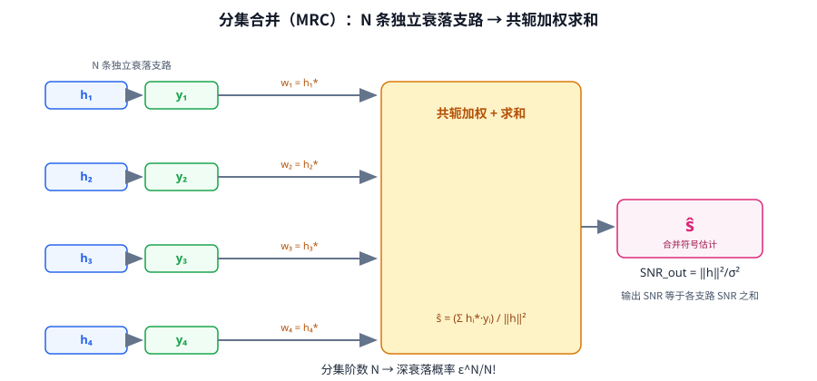

# T12.2 分集与合并：从多份独立拷贝到最大比合并（MRC）

## 本节学习目标

单天线链路有一个让人头疼的物理事实：只要信道进入深衰落（Deep Fade），接收功率掉到噪声之下，这一段时间的传输基本就"断了"——译码器拿到的是不可靠的软信息，块错误率（Block Error Rate, BLER）直接起飞。深衰落不是小概率事件：瑞利衰落（Rayleigh Fading）下，单根天线信道功率低于其平均值 10 dB 的概率接近 10%。一条链路深衰落就断，那多天线为什么更稳？

答案在于分集（Diversity）：如果接收端有多根天线，每根天线经历的衰落是独立随机的，那么"所有天线同时深衰落"的概率就是"单根天线深衰落"概率的 N 次方量级——概率不是除以 N，而是指数级变小。多份独立拷贝合在一起，深衰落被"平均"掉，这是 MIMO 接收对抗衰落的第一重收益。本节（T12.2）是 MIMO 接收机与检测器系列的第二篇，任务是把"分集为什么有效、怎么合并、能带来多少收益"这一整条逻辑链用数学推出来。

学完本节后，应能做到：

- 解释分集收益的来源：多份独立衰落的拷贝，深衰落概率随拷贝数指数下降，而不是线性下降。
- 写出 1×N 接收模型 $\mathbf{y}=h\mathbf{x}+\mathbf{n}$，推导最大比合并（Maximal Ratio Combining, MRC）的加权形式，并证明输出信噪比（Signal-to-Noise Ratio, SNR）为 $\mathrm{SNR}_{\mathrm{out}}=\|\mathbf{h}\|^2/\sigma^2$。
- 从卡方分布（Chi-square Distribution）在零点附近的概率密度函数（Probability Density Function, PDF）出发，推导深衰落概率渐近式 $P(\|\mathbf{h}\|^2<\varepsilon)\sim\varepsilon^N/N!$，并说明分集阶数（Diversity Order）为什么等于独立支路数 $N$。
- 用 32 天线实例说明工程收益：合并输出服从 $\chi^2_{64}$ 分布、平均增益 $10\log_{10}32\approx15\ \mathrm{dB}$、0–6 dB 输入信噪比下 256QAM 可行。
- 区分分集与波束赋形（Beamforming）：一个是非相干合并独立拷贝对抗衰落，一个是相干合并定向增强。
- 说明为什么"MMSE 单层 = 正则化 MRC"：分母 $\|\mathbf{h}\|^2+\sigma^2$ 是噪声正则项，深衰落时避免除零爆炸。

本节沿用 T12.1 的总览模型：$\mathbf{y}=\mathbf{H}_{\mathrm{eff}}\mathbf{x}+\mathbf{n}$（每资源单元（Resource Element, RE）一个复矩阵方程），本节的"分集"正是这张地图上"接收天线数 $N_{\mathrm{rx}}$"维度的收益。系列内部分工如下，写作时以文字承接，不另设链接：

| 篇目 | 主题 | 与本节的承接 |
|:---|:---|:---|
| T12.1 | MIMO 接收链路总览 | 提供每 RE 模型、层域等效信道 $\mathbf{H}_{\mathrm{eff}}$、功率归一化口径 |
| T12.2（本节） | 分集与合并 | 多份独立拷贝对抗深衰落；MRC 合并推导 |
| T12.3 | 线性检测器 | MMSE 是 MRC 的多天线矩阵推广；本节第 7 节是它的单层特例 |
| T12.4 | 球面检测 | 最大似然的低复杂度近似，高 SNR 场景 |
| T12.5 | 信道估计与 CSI | 回答"$\mathbf{H}_{\mathrm{eff}}$ 到底怎么从 DMRS 里来" |

## 前置知识检查

| 前置项 | 本节需要达到的程度 |
|:---|:---|
| [[T2.10_fading_channel_LLR_reliability]] 衰落信道与 LLR | 知道 $y=hx+n$、$h$ 是复增益、深衰落时 LLR 可靠度下降；本节的向量 $\mathbf{h}$ 是它的升级版。 |
| [[Diversity_Combining_分集与合并]] | 知道分集阶数、MRC、$\varepsilon^N/N!$、"32 天线 ≈ +15 dB"、MMSE 与 MRC 关系的结论；本节给出全部推导。 |
| [[MIMO_多天线系统]] | 知道 $N_{\mathrm{tx}}$、$N_{\mathrm{rx}}$、$N_{\mathrm{layers}}$ 三个维度与"层数 ≤ 秩 ≤ min(Ntx, Nrx)"；分集用掉的是接收天线维度。 |
| [[T12.1_mimo_receiver_chain_overview]] | 知道每 RE 模型 $\mathbf{y}=\mathbf{H}\mathbf{P}\mathbf{x}+\mathbf{n}$、层域等效信道、功率归一化；本节令 $N_{\mathrm{layers}}=1$、$\mathbf{H}_{\mathrm{eff}}=\mathbf{h}$。 |
| [[LLR_对数似然比]] | 知道 LLR 符号表示倾向、绝对值表示可靠度；合并后的 SNR 就是可靠度的来源。 |
| [[MMSE_均衡]] | 知道 MMSE 滤波器 $\mathbf{W}=(\mathbf{H}^H\mathbf{H}+\sigma^2\mathbf{I})^{-1}\mathbf{H}^H$ 的形态；本节证明它在单层时退化为正则化 MRC。 |

如果这些前置还不稳，先抓住一句话：**本节回答"多根接收天线各自听到同一句话的走样版本，怎么合并才能让整句话最可靠"**——答案是按各自可靠度加权相加（MRC），而可靠度之和就是合并后的信噪比。

## 分集：多份独立拷贝

### 生活类比：32 个人分别听同一句话

想象一场嘈杂的会议：主持人说了一句关键的话，台下坐了 32 名记录员，各自独立记录。有人离得近听得清楚，有人被旁边咳嗽声盖住，有人听岔了一个词，有人完全听错——每个人拿到的是同一句话的不同"走样版本"，走样方式彼此独立。如果只有一名记录员，他听岔了就全完了；但如果有 32 名，把 32 份记录按"这份记录有多可靠"加权平均，单份记录全错不要紧——**32 份记录同时全错，需要 32 个独立的坏运气同时发生**，这个概率不是单份出错概率的 1/32，而是它的 32 次方量级，小到可以忽略。

这就是分集的本质（[[Diversity_Combining_分集与合并]] 的"多份拷贝投票"模型）：**分集不追求让信号变强，而是追求衰落不在所有拷贝上同时发生**。无线信道的深衰落是随机的（多径叠加造成的幅度波动，T2.10 的瑞利衰落模型），每根天线经历的衰落是近似独立的随机过程；多根天线就是多份独立的"记录"，合在一起后，"所有天线同时深衰落"成了指数级稀有的事件。

### 分集阶数：N 是多少，指数就是多少

分集阶数（Diversity Order）是衡量"抗深衰落能力"的标量指标，定义为**独立衰落支路的数量 $N$**。它有三种等价的观察方式：

| 观察角度 | 数学表述 | 直观含义 |
|:---|:---|:---|
| 支路数 | 合并输出由 $N$ 个独立衰落支路构成 | 需要 $N$ 个支路同时坏才会中断 |
| 中断概率渐近斜率 | $P(\|\mathbf{h}\|^2<\varepsilon)\sim\varepsilon^N$ | 对数-对数图上，中断概率曲线以斜率 $N$ 下降 |
| 误码率渐近斜率 | 高信噪比下误码率（Bit Error Rate, BER）$\sim \mathrm{SNR}^{-N}$ | 每 10 倍信噪比，误码率下降 $N$ 个数量级 |

"阶数"这个名字来自第三种表述：误码率曲线在双对数坐标下的斜率就是 $N$——多一根独立天线，曲线就陡一分。注意阶数说的是**斜率**，不是曲线的绝对位置：阵列增益负责移动位置（第 6 节），分集阶数负责把曲线压陡（第 5 节），两者是两回事。

### 独立才有效：相关拷贝不带来阶数

分集的一切收益都建立在"各支路衰落独立"的前提上。如果两支路高度相关——比如两根接收天线间距远小于半个波长，它们看到的是几乎相同的多径叠加——那么 $h_1\approx h_2$，两根天线本质上是一根：合并不改变 $\|\mathbf{h}\|^2$ 的分布形状，只是放大倍数变了，深衰落概率的渐近阶数仍然是 1，而不是 2。用数学说：若 $h_2=c\,h_1$（完全相关，$c$ 为常数），则 $\|\mathbf{h}\|^2=(1+|c|^2)|h_1|^2$——它还是单支路功率 $|h_1|^2$ 的分布，只是乘了一个常数；尾部概率仍按 $\varepsilon$ 的一次方衰减。

| 分集种类 | 独立性来源 | 工程实现 |
|:---|:---|:---|
| 空间分集（Spatial Diversity） | 天线间距足够大（约半个波长以上），多径叠加相互独立 | 多根接收天线，本节的主角 |
| 频率分集（Frequency Diversity） | 相隔足够远的子载波衰落独立 | 多载波/跳频，OFDM 天然具备 |
| 时间分集（Time Diversity） | 相隔足够远的时间衰落独立 | 重传/HARQ、交织 |
| 极化分集（Polarization Diversity） | 正交极化波衰落近似独立 | 双极化天线 |

分集和它的两个"近亲"容易混淆，这里一次性划清边界（延续 T12.1 的三种收益划分）：

| 收益类型 | 合并方式 | 目的 | 数学形态 | 本节位置 |
|:---|:---|:---|:---|:---|
| 分集（Diversity） | 非相干合并独立拷贝 | 抗深衰落，让坏运气变稀 | $\mathrm{SNR}_{\mathrm{out}}=\|\mathbf{h}\|^2/\sigma^2$，尾部 $\varepsilon^N/N!$ | 本节主体 |
| 波束赋形（Beamforming） | 相干合并，相位对齐定向增强 | 把功率集中到某个方向 | 加权向量按到达角（Array Response）设计 | T12.5 及后续 |
| 空间复用（Spatial Multiplexing） | 层分离 | 同时传多路数据，速率翻倍 | $\mathbf{y}=\mathbf{H}_{\mathrm{eff}}\mathbf{x}+\mathbf{n}$ 求逆 | T12.3/T12.4 |

关键区别在两处：**合并的对象**（分集合的是"同一符号的独立走样版本"，波束赋形合的是"同一方向到达的相干成分"）和**收益的性质**（分集降低深衰落概率，波束赋形提升定向增益，复用提升速率）。波束赋形需要知道信道方向（或到达角），分集不需要任何方向信息——这也是为什么开环场景（不知道信道状态）天然用分集，闭环场景（有信道状态信息（Channel State Information, CSI）反馈）才用波束赋形。把两者混为一谈是 [[Diversity_Combining_分集与合并]] 列出的最常见误解。

空间分集是接收机最容易拿到的一类：加天线就行，不需要改协议（接收端处理是接收机自由度）。NR 基站通常配备 2/4/8/32/64 接收天线，下行（Downlink, DL）利用基站侧多天线做接收分集的场景，上行（Uplink, UL）则靠 UE 侧的多根天线——本节的分集数学对两个方向都适用。工程上要注意：**天线间距不够、天线间互耦、或信道相关性强的场景（如室内直视径主导），实际分集阶数会低于天线数**——这是阵列设计里"名义阶数"与"有效阶数"差距的来源。

## MRC 合并推导

### 1×N 模型：从标量到向量

T2.10 的单天线模型是 $y=hx+n$。现在接收端有 $N$ 根天线（$N_{\mathrm{rx}}=N$），发射端仍发一个符号 $x$（单层，$N_{\mathrm{layers}}=1$），每个 RE 上的模型升级为：

$$
\mathbf{y}=\mathbf{h}\,x+\mathbf{n}
\tag{1}
$$

式 (1) 中 $\mathbf{h}\in\mathbb{C}^{N\times1}$ 是"每根接收天线到发射端"的复增益向量，$\mathbf{y}\in\mathbb{C}^{N\times1}$ 是 $N$ 根天线的观测，$\mathbf{n}\sim\mathcal{CN}(0,\sigma^2\mathbf{I}_N)$ 是独立同分布的复高斯噪声。这正是 T12.1 的层域等效信道模型在 $N_{\mathrm{layers}}=1$ 时的形态：$\mathbf{H}_{\mathrm{eff}}=\mathbf{h}$。逐元素展开，第 $i$ 根天线上的标量方程仍然是我们熟悉的单天线形式：

$$
y_i=h_i\,x+n_i,\qquad i=1,\ldots,N
\tag{2}
$$

式 (2) 回答的问题是：为什么每根天线单独看都是一个"普通的单天线接收"——因为 $x$ 是标量，每根天线只是以不同的增益 $h_i$ 看到它。$N$ 份观测 $\{y_i\}$ 就是 $N$ 份独立拷贝。整个合并结构如图 1：左侧 $N$ 条独立衰落支路（信道 $h_i$ 塑造观测 $y_i$），汇入中间的"共轭加权 + 求和"节点（权重 $w_i=h_i^*$），右侧输出合并符号估计 $\hat{s}$ 与输出信噪比标注。



### 加权合并与 SNR 最大化

接收机要做的，是用一个线性合并器（combiner）把 $N$ 份观测压成一个符号估计：

$$
\hat{s}=\mathbf{w}^H\mathbf{y}=\sum_{i=1}^{N}w_i^*\,y_i
\tag{3}
$$

式 (3) 中 $\mathbf{w}\in\mathbb{C}^{N\times1}$ 是待定的合并权重向量（权重 $w_i$ 的共轭与 $y_i$ 相乘，记号来自复数内积的约定，与 T12.1 的 ctranspose 讨论一脉相承）。把式 (1) 代入，信号与噪声分开看：信号部分是 $\mathbf{w}^H\mathbf{h}\,x$，噪声部分是 $\mathbf{w}^H\mathbf{n}$。设符号功率为 $E_s=\mathbb{E}|x|^2$（NR 星座按单位能量归一化，通常 $E_s=1$），合并输出的信噪比为：

$$
\mathrm{SNR}(\mathbf{w})
=\frac{\mathbb{E}|\mathbf{w}^H\mathbf{h}\,x|^2}{\mathbb{E}|\mathbf{w}^H\mathbf{n}|^2}
=\frac{E_s\,|\mathbf{w}^H\mathbf{h}|^2}{\sigma^2\,\|\mathbf{w}\|^2}
\tag{4}
$$

式 (4) 就是设计权重时的目标函数：**在权重总功率 $\|\mathbf{w}\|^2$ 给定的约束下，让信号项 $|\mathbf{w}^H\mathbf{h}|^2$ 尽量大**。这是一个经典的内积最大化问题，柯西-施瓦茨不等式（Cauchy-Schwarz Inequality）直接给出答案：

$$
|\mathbf{w}^H\mathbf{h}|^2\le \|\mathbf{w}\|^2\|\mathbf{h}\|^2
\tag{5}
$$

式 (5) 的等号当且仅当 $\mathbf{w}$ 与 $\mathbf{h}$ 共线时成立，即 $\mathbf{w}\propto\mathbf{h}$。几何直觉：加权合并 $\mathbf{w}^H\mathbf{y}$ 是复向量 $\mathbf{y}$ 在 $\mathbf{w}$ 方向上的投影；要让"信号方向 $\mathbf{h}$"上的投影最大，投影方向就必须与 $\mathbf{h}$ 同向。取归一化因子使估计无偏（$\mathbb{E}[\hat{s}|x]=x$），得到最优合并器：

$$
\mathbf{w}_{\mathrm{opt}}=\frac{\mathbf{h}}{\|\mathbf{h}\|^2},\qquad
\hat{s}_{\mathrm{MRC}}=\frac{\mathbf{h}^H\mathbf{y}}{\|\mathbf{h}\|^2}
=\frac{\sum_{i=1}^{N}h_i^*\,y_i}{\sum_{i=1}^{N}|h_i|^2}
\tag{6}
$$

式 (6) 就是最大比合并（Maximal Ratio Combining, MRC）：每支路的权重 $w_i=h_i^*/\|\mathbf{h}\|^2$。它做两件事——**共轭**把相位对齐（$h_i^*h_i=|h_i|^2$ 是正实数，各支路的信号贡献在合并后同相相加），**除以 $\|\mathbf{h}\|^2$** 按幅度归一化（信道强的支路贡献大）。注意：**共轭匹配自动完成相位对齐，不需要显式的相位估计步骤**——这是 [[Diversity_Combining_分集与合并]] 里列出的常见误解，$h_i^*$ 一步就把相位补偿做了。合并后的输出信噪比：

$$
\mathrm{SNR}_{\mathrm{out}}
=\frac{E_s\,\|\mathbf{h}\|^2}{\sigma^2}
\qquad(E_s=1\ \text{时}\ \ \mathrm{SNR}_{\mathrm{out}}=\|\mathbf{h}\|^2/\sigma^2)
\tag{7}
$$

式 (7) 是本节第一个核心结论：**MRC 把 $N$ 个标量信噪比变成了一个向量范数平方**。更直观的是把它展开成支路信噪比之和：

$$
\mathrm{SNR}_{\mathrm{out}}
=\sum_{i=1}^{N}\frac{|h_i|^2}{\sigma^2}
=\sum_{i=1}^{N}\mathrm{SNR}_i
\tag{8}
$$

式 (8) 回答的问题是："合并后到底赚了多少"——**输出信噪比等于各支路信噪比之和**。每根天线都在"贡献"自己的信噪比，合并器把它们全部相加：强支路贡献大，弱支路贡献小但不拖后腿。这也解释了"32 天线 +15 dB"的直觉来源（第 6 节）：32 个平均值为 1 的支路信噪比相加，平均值是 32。

### 数值例子：手算 2 支路 MRC

给一组教学值走一遍（非协议向量）。设 $N=2$，信道 $\mathbf{h}=[1+j,\ -0.5+0.5j]^T$，噪声方差 $\sigma^2=0.1$，符号 $x=1$，噪声 $\mathbf{n}=[0.1-0.1j,\ 0.05j]^T$。两支路功率 $|h_1|^2=2$、$|h_2|^2=0.5$，支路信噪比分别是 $20$（13 dB）和 $5$（7 dB）。按式 (6) 合并，权重 $\mathbf{w}=\mathbf{h}/2.5=[0.4+0.4j,\ -0.2+0.2j]^T$：

$$
\hat{s}=\mathbf{w}^H\mathbf{y}
=(0.4-0.4j)(1.1+0.9j)+(-0.2-0.2j)(-0.5+0.55j)
=1.01-0.09j
$$

$1.01-0.09j$ 非常接近发送的 $x=1$，残差就是合并后的等效噪声（$\mathbf{w}^H\mathbf{n}=0.01-0.09j$）。输出信噪比 $\mathrm{SNR}_{\mathrm{out}}=\|\mathbf{h}\|^2/\sigma^2=25=20+5$——**恰好等于两支路信噪比之和**（式 (8)），比最强的单支路（20）还高 25%。这就是"合并比任何单支路都强"的量化形式。

### 统计口径：$\|\mathbf{h}\|^2$ 服从什么分布

式 (7) 里 $\mathrm{SNR}_{\mathrm{out}}$ 是随机变量（$\mathbf{h}$ 随机），它的统计特性由 $\|\mathbf{h}\|^2$ 的分布决定。设各支路 $h_i$ 独立同分布，本讲义用两种文献常见的口径，结论只差一个常数因子：

| 口径 | 每支路定义 | $\|\mathbf{h}\|^2$ 的分布 | 均值 | 深衰落渐近（第 5 节） |
|:---|:---|:---|:---:|:---|
| 口径 A（仿真器/本讲义数值实例默认） | $h_i\sim\mathcal{CN}(0,1)$，$\mathbb{E}|h_i|^2=1$ | $\|\mathbf{h}\|^2\sim\tfrac12\chi^2_{2N}$（等价 $\mathrm{Gamma}(N,1)$） | $N$ | $\varepsilon^N/N!$ |
| 口径 B（验证代码） | $h_i=a_i+jb_i$，$a_i,b_i\sim\mathcal{N}(0,1)$，$\mathbb{E}|h_i|^2=2$ | $\|\mathbf{h}\|^2\sim\chi^2_{2N}$ | $2N$ | $\varepsilon^N/(N!\cdot2^N)$ |

两种口径下 $\|\mathbf{h}\|^2$ 都是**自由度为 $2N$ 的卡方分布**（的缩放），分集阶数、指数衰减的速度完全一致，只是幅度标尺不同。口径 A 对应 TDL 信道模型的"每天线平均功率 1"归一化（`NormalizeChannelOutputs = true`，见第 6 节），口径 B 对应"直接画标准正态实部加虚部"的代码习惯（第 8 节的蒙特卡洛）。**写推导、写代码、写仿真时口径必须自洽**——本节第 8 节会展示口径错配会怎样毁掉一次数值验证。

## 深衰落概率与分集阶数

### 渐近推导：$\chi^2_{2N}$ 在零点附近的 CDF

"深衰落概率"指的是 $\|\mathbf{h}\|^2$ 低于某个小阈值 $\varepsilon$ 的概率 $P(\|\mathbf{h}\|^2<\varepsilon)$。以口径 A 为例，$\|\mathbf{h}\|^2\sim\mathrm{Gamma}(N,1)$（形状参数 $N$、尺度参数 1），概率密度函数为：

$$
f(x)=\frac{x^{N-1}e^{-x}}{(N-1)!},\qquad x\ge 0
\tag{9}
$$

式 (9) 的关键在 $x\to 0$ 的邻域：指数因子 $e^{-x}\approx 1$，密度退化成幂律 $x^{N-1}/(N-1)!$。于是阈值很小（$\varepsilon\ll 1$）时，深衰落概率是幂律在 $[0,\varepsilon]$ 上的积分：

$$
P(\|\mathbf{h}\|^2<\varepsilon)
=\int_{0}^{\varepsilon}\frac{x^{N-1}e^{-x}}{(N-1)!}\,dx
\approx\int_{0}^{\varepsilon}\frac{x^{N-1}}{(N-1)!}\,dx
=\frac{\varepsilon^{N}}{N!}
\tag{10}
$$

式 (10) 就是分集阶数的全部数学：**概率密度在零点按 $x^{N-1}$ 衰减，积分后按 $\varepsilon^N$ 衰减，除以 $N!$**。$N!$ 这个分母是"流形体积"效应——高维空间里靠近原点的区域在低维投影下越来越小，深衰落需要 $N$ 个支路同时"靠近零点"，这 $N$ 个条件凑齐的"体积"就是 $\varepsilon^N/N!$。按口径 B（$\|\mathbf{h}\|^2\sim\chi^2_{2N}$），密度在零点为 $x^{N-1}e^{-x/2}/(2^N(N-1)!)$，同样积分得到：

$$
P(\|\mathbf{h}\|^2<\varepsilon)\approx\frac{\varepsilon^{N}}{N!\cdot 2^N}
\tag{11}
$$

式 (11) 只比式 (10) 多一个 $2^N$ 因子（口径 B 的每支路功率是口径 A 的两倍，功率阈值 $\varepsilon$ 相对更"深"）。**两式的核心结构相同：$\varepsilon$ 的指数等于 $N$，这就是"分集阶数 = 独立支路数"**。对偶数自由度的 $\chi^2$ 分布，精确 CDF 有闭式 $P(\chi^2_{2N}<\varepsilon)=1-e^{-\varepsilon/2}\sum_{k=0}^{N-1}(\varepsilon/2)^k/k!$，第 8 节用它核对渐近式的精度。

### 数值对比表：每加一根天线，深衰落概率缩多少

取 $\varepsilon=0.01$（合并功率掉到平均值的 1%，即相对平均 SNR 低 20 dB），用口径 B 的精确闭式与式 (11) 渐近同时计算：

| 支路数 $N$ | 精确 $P(\|\mathbf{h}\|^2<0.01)$ | 渐近 $0.01^N/(N!\cdot2^N)$ | 相对误差 | 口语化量级 |
|:---:|:---:|:---:|:---:|:---|
| 1 | $4.99\times10^{-3}$ | $5.00\times10^{-3}$ | 0.25% | 每 200 次传输一次 |
| 2 | $1.25\times10^{-5}$ | $1.25\times10^{-5}$ | 0.33% | 每 8 万次传输一次 |
| 4 | $2.59\times10^{-11}$ | $2.60\times10^{-11}$ | 0.40% | 每 385 亿次传输一次 |

从 $N=1$ 到 $N=2$，深衰落概率缩小约 400 倍；从 $N=2$ 到 $N=4$，再缩小约 48 万倍。$\varepsilon^N$ 的结构决定了相邻阶的概率比率为 $\varepsilon/(2(N+1))$——$\varepsilon=0.01$ 时，$N=1\to2$ 为 $\varepsilon/4=1/400$，$N=2\to3$ 为 $\varepsilon/6=1/600$。对比一下直觉尺度：$2.6\times10^{-11}$ 大约相当于"中一次六合彩头奖（约 $7\times10^{-8}$）"的概率再稀有约 2800 倍。**分集让深衰落指数变稀**：单天线时深衰落是家常便饭（每 200 次一次），四天线时它比中头奖还稀有几个数量级。若按口径 A（$\varepsilon^N/N!$，对应"低于平均 20 dB"的功率口径），数值为 $1.0\times10^{-2}/5.0\times10^{-5}/4.2\times10^{-10}$——量级结论不变。

### 深衰落概率与平均 SNR 是两回事

一个常见的混淆是把"深衰落概率下降"等同于"平均信噪比上升"。它们是两个不同的统计量，作用在不同位置：

| 统计量 | 数学量 | 随 $N$ 的变化 | 作用 |
|:---|:---|:---|:---|
| 平均输出 SNR | $\mathbb{E}[\|\mathbf{h}\|^2]/\sigma^2$ | 线性增长（$\propto N$） | 把工作点整体右移（阵列增益） |
| 深衰落概率 | $P(\|\mathbf{h}\|^2<\varepsilon)$ | 指数下降（$\propto\varepsilon^N$） | 把曲线尾部压扁（分集增益） |

前者决定"平均上信号有多强"，后者决定"坏运气有多频繁"。无线链路在低信噪比区（如小区边缘）的表现主要由后者决定：平均 SNR 再高，只要深衰落频繁发生，译码器就反复拿到不可靠的软信息。这也是为什么接收机设计里"分集阶数"和"阵列增益"必须分开报告（第 6 节的 32 天线实例会同时用到两者）。

## 32 天线实例：从 $\chi^2_{64}$ 到 +15 dB

### 10log₁₀(32) = 15.05 dB 的由来

按口径 A（每天线 $\mathbb{E}|h_i|^2=1$，与仿真器 TDL 信道归一化一致），32 根接收天线的合并功率：

$$
\mathbb{E}\|\mathbf{h}\|^2=\sum_{i=1}^{32}\mathbb{E}|h_i|^2=32,\qquad
10\log_{10}32=10\times1.505=15.05\ \mathrm{dB}
\tag{12}
$$

式 (12) 回答的问题是：**"32 天线 ≈ +15 dB"不是宣传话术，是 MRC 的输出信噪比平均值恰为单天线的 32 倍**（式 (7) 取期望：$\mathbb{E}[\mathrm{SNR}_{\mathrm{out}}]=\mathbb{E}\|\mathbf{h}\|^2/\sigma^2=32/\sigma^2$）。信号功率相干叠加（32 路同相相加，功率 32² 倍），噪声非相干叠加（功率 32 倍），比值恰好 32 倍。同时 $\|\mathbf{h}\|^2$ 服从自由度为 $2\times32=64$ 的卡方分布——这就是"从 $\chi^2_{64}$ 到 +15 dB"：**分布的形态是 $\chi^2_{64}$，分布的均值是 64 的一半（口径 A）或 64（口径 B），但无论哪个口径，平均增益都是 32 倍（15.05 dB）**。

### test_simo 场景：0–6 dB 下 256QAM 可行

链路仿真器的 `test_simo.m` 场景（MIMO01 §3.1，外部语料，只读参考）正是这个实例的工程版：

| 配置项 | 值 | 含义 |
|:---|:---|:---|
| 天线配置 | 1 TX, 32 RX, 1 layer | 单发多收（Single-Input Multiple-Output, SIMO），纯分集无复用 |
| 预编码 | identity | 单层无需空间组合 |
| 信道 | TDL-A（`create_tdl_channel.m`） | `NormalizeChannelOutputs = true`：每天线平均功率 1 |
| 接收处理 | `new_pdsch_decode` 的 `'mmse'` 分支 | 1×32 下 MMSE 均衡自动退化为正则化 MRC（第 7 节） |
| SNR 扫描 | 0:1:6 dB，每点 200 TB | 输入信噪比只有 0 到 6 dB |
| 调制编码 | MCS 20（256QAM） | 调制阶数 8 的高阶星座 |

为什么 0–6 dB 这种"贫瘠"的输入信噪比下 256QAM 还能工作？两步解释：**第一步是阵列增益**——输入 0 dB 时，MRC 输出的平均 SNR 是 $32\times1=32$ 倍，即 15.05 dB；输入 6 dB 时输出平均约 21 dB。256QAM 的星座最小距离很小（$E_s=1$ 时最小距离约 0.15 量级），通常需要约 15–20 dB 的接收 SNR 才有可用的译码工作点——15–21 dB 的输出区间正好把它抬进可行区。**第二步是分集增益**——第 5 节的尾部压缩保证输出 SNR 几乎不深衰落（见下），否则即使平均 15 dB，深衰落拖尾也会反复击穿 256QAM 的噪声容限。单天线在 0 dB 下 256QAM 无法解调，正是这两步同时缺失的结果。

### 阵列增益 vs 分集收益：同一个 MRC 的两个侧面

MRC 同时给出两种收益，但作用对象不同，工程上必须分开看：

| 对比项 | 阵列增益（Array Gain） | 分集收益（Diversity Gain） |
|:---|:---|:---|
| 作用对象 | 输出 SNR 的**均值** | 输出 SNR 的**尾部**（深衰落概率） |
| 数学量 | $\mathbb{E}\|\mathbf{h}\|^2=N$ | $P(\|\mathbf{h}\|^2<\varepsilon)\sim\varepsilon^N/N!$ |
| 随 $N$ 的变化 | 线性，dB 域 $10\log_{10}N$ | 指数，$\varepsilon$ 的指数变为 $N$ |
| 32 天线数值 | +15.05 dB 平均 | 低于均值 10 dB 的概率从 $9.5\times10^{-2}$ 降到约 $2.5\times10^{-21}$ |

两个数字值得记住。**相对波动**：$\mathrm{Gamma}(32,1)$ 的标准差 $\sqrt{32}$，相对波动 $\sigma/\mu=1/\sqrt{32}\approx17.7\%$，在 dB 域只有约 $+0.7/-0.8\ \mathrm{dB}$（1σ）——32 根天线的 MRC 把随机信道"平均"成了几乎确定的 32 倍增益，输出 SNR 基本不再波动。**深衰落压缩**：按口径 A，单天线功率低于其均值 10 dB 的概率是 $1-e^{-0.1}=9.5\times10^{-2}$（约每 10 次一次）；32 天线时 $\|\mathbf{h}\|^2<3.2$（同样低于均值 10 dB）的概率约为 $2.5\times10^{-21}$——压缩了约 19 个数量级。这就是分集阶数 32 的尾部，也是"0–6 dB 下 256QAM 可行"在统计意义上的全部依据。

## MMSE 单层 = 正则化 MRC

### 分母 $\|\mathbf{h}\|^2+\sigma^2$ 的由来

链路仿真器接收路径走的是 `nrEqualizeMMSE`（MIMO01 §3.2），它实现的是通用 MMSE 滤波矩阵：

$$
\mathbf{W}=\big(\mathbf{H}^H\mathbf{H}+\sigma^2\mathbf{I}\big)^{-1}\mathbf{H}^H
\tag{13}
$$

式 (13) 在 T12.3 会完整推导（最小化均方误差 $\mathbb{E}\|\mathbf{W}\mathbf{y}-\mathbf{x}\|^2$ 的正则化最小二乘解）。单层时 $\mathbf{H}=\mathbf{h}\in\mathbb{C}^{32\times1}$ 是列向量，$\mathbf{h}^H\mathbf{h}=\|\mathbf{h}\|^2$ 是标量，矩阵求逆退化成一次标量除法：

$$
\hat{s}_{\mathrm{MMSE}}
=\mathbf{W}\mathbf{y}
=\frac{\mathbf{h}^H\mathbf{y}}{\|\mathbf{h}\|^2+\sigma^2}
\tag{14}
$$

把式 (14) 与 MRC 的式 (6)（$\hat{s}=\mathbf{h}^H\mathbf{y}/\|\mathbf{h}\|^2$）并排看：**只差分母里的 $\sigma^2$**。MMSE 单层就是"带噪声正则化的 MRC"（MMSE-MRC），这是本节与 [[Diversity_Combining_分集与合并]] 概念笔记共享的核心结论，也是 T12.3 的入口：多层 MMSE 是它的矩阵推广。

### 深衰落时避免除零爆炸

$\sigma^2$ 这一项不是可有可无的装饰。纯 MRC 在深衰落时的行为是危险的：当 $\|\mathbf{h}\|^2\to0$，式 (6) 的分母趋近零，估计值 $\mathbf{h}^H\mathbf{y}/\|\mathbf{h}\|^2$ 变成"零除以零"，其结果是噪声被无限放大——深衰落 RE 上的估计完全不可信。MMSE 的 $\|\mathbf{h}\|^2+\sigma^2$ 给分母一个"地板"，最坏情况下：

$$
\|\mathbf{h}\|^2\to0:\qquad
\hat{s}_{\mathrm{MMSE}}=\frac{\mathbf{h}^H\mathbf{y}}{\|\mathbf{h}\|^2+\sigma^2}\ \longrightarrow\ \frac{\mathbf{h}^H\mathbf{y}}{\sigma^2}\to 0
\tag{15}
$$

式 (15) 展示 MMSE 的"收缩"行为：**证据不足（信道功率接近零）时，估计向零收缩，而不是爆炸**。这是最小均方误差估计的普遍性质——在不确定时选择保守的中间值。反过来，高信噪比极限 $\sigma^2\to0$ 时，式 (14) 连续地退化为式 (6) 的纯 MRC：$\hat{s}_{\mathrm{MMSE}}\to\mathbf{h}^H\mathbf{y}/\|\mathbf{h}\|^2$。**MMSE 是 MRC 的正则化版本，MRC 是 MMSE 的无噪声极限**——两条路在 $\sigma^2\to0$ 处汇合，这解释了为什么 `test_simo` 场景"走 MMSE 分支"与"MRC 等效"的说法在代码层面成立且更精确（MIMO01 §3.2 的式 (8)/(9) 对照）。

### 工程佐证与衔接

同样的结构在仿真器的信号预处理里也出现过（MIMO01 §3.2 的 `preprocess_demod_input.m`）：$R=\sum_r|h_r|^2+\nu\tilde{\sigma}^2$，$Y_{\mathrm{eq}}=(\sqrt{R}/R)\sum_r h_r^*y_r$——匹配滤波合并再乘正则化增益，与式 (14) 同构。工程含义有三条：

1. **$\sigma^2$ 必须估准**。它直接出现在合并器的分母里（T12.1 提到过的 $\sigma^2$ 进求逆项），噪声方差估错会系统性劣化合并输出——T12.5 会讲噪声方差失配的三种破坏途径。
2. **深衰落 RE 的可靠度由 CSI 携带**。MMSE-MRC 输出符号估计的同时给出可靠度（csi = 1 + SINR），软解调用它对 LLR 加权（衔接 T2.10 与 T12.1 的"软解调+CSI 加权"环节）——正则化保证深衰落 RE 的 LLR 权重被压低，而不是以虚假的高置信度进入译码器。
3. **衔接 T12.3**。把式 (13) 的行列式展开：$(\|\mathbf{h}\|^2+\sigma^2)^{-1}$ 变成矩阵 $(\mathbf{H}^H\mathbf{H}+\sigma^2\mathbf{I})^{-1}$，标量除法变成矩阵求逆，MRC 就长成了 MMSE 线性检测器——本节是 T12.3 的"1×N 预演"。

## 内嵌验证：深衰落概率蒙特卡洛

第 5 节给出渐近式 $P(\|\mathbf{h}\|^2<\varepsilon)\approx\varepsilon^N/(N!\cdot2^N)$（口径 B）。本节用蒙特卡洛（Monte Carlo）方法做数值验证：按指定分布生成大量信道样本，统计 $\|\mathbf{h}\|^2<\varepsilon$ 的频率 $\hat{p}$，与理论值比对。

验证前先明确**信道口径**。理论渐近式对应**复数**信道 $h_i=a_i+jb_i$（实部、虚部各为方差 $1$ 的独立高斯变量），此时 $\|\mathbf{h}\|^2=\sum_i(a_i^2+b_i^2)$ 服从 $\chi^2_{2N}$ 分布，零点附近的概率密度为 $x^{N-1}e^{-x/2}/(2^N(N-1)!)$。阈值很小（$\varepsilon\ll1$）时指数因子近似为 1，深衰落概率是幂律在 $[0,\varepsilon]$ 上的积分：

$$
P(\|\mathbf{h}\|^2<\varepsilon)\approx\int_0^\varepsilon\frac{x^{N-1}}{2^N(N-1)!}\,dx=\frac{\varepsilon^N}{N!\cdot2^N}
$$

若误用**实数**信道（$h_i\sim\mathcal{N}(0,1)$），$\|\mathbf{h}\|^2$ 服从的是 $\chi^2_N$ 分布，零点密度正比于 $x^{N/2-1}$，深衰落概率按 $(\varepsilon/2)^{N/2}/\Gamma(N/2+1)$ 量级衰减，与 $\chi^2_{2N}$ 口径相差因子 $\varepsilon^{-N/2}\,2^{N/2}\,N!/\Gamma(N/2+1)$——该因子随 $\varepsilon^{-N/2}$ 发散（$\varepsilon=10^{-2}$ 时约 15.96/400/480000 量级），口径不一致时数值比对无从谈起。因此蒙特卡洛验证必须采用复数信道模型；阶乘用标准库 `math.factorial`（NumPy 2.x 将数值函数并入标准库 `math`，本环境 numpy 2.5.1）。

**为什么必须是复数模型？** 基带上每个 RE 的信道系数本来就是复值量：实部对应同相（In-phase, I）分量，虚部对应正交（Quadrature, Q）分量，二者是独立同分布的高斯随机变量（TDL 信道抽头的标准建模）。口径 B 规定每支路平均功率 $\mathbb{E}|h_i|^2=2$（实部、虚部各贡献 1），渐近式里的 $2^N$ 因子正是从"每支路两个自由度"折算出来的；实数模型只保留了一半自由度，深衰落概率的统计口径自然与式 (11) 不一致。

验证代码：

```python
import numpy as np
import math
rng = np.random.default_rng(2)
print("分集阶数 N 与深衰落概率 P(‖h‖²<ε)：蒙特卡洛 vs 理论渐近 ε^N/(N!·2^N)（复数信道）")
for N in [1, 2, 4]:
    h2 = np.sum(np.abs(rng.standard_normal((N, 1_000_000)) + 1j*rng.standard_normal((N, 1_000_000)))**2, axis=0)
    print(f"N={N}: ", end="")
    for eps in [1e-2, 1e-3]:
        p_sim = np.mean(h2 < eps)
        p_th  = eps**N / (math.factorial(N) * 2**N)
        print(f"ε={eps}: 模拟={p_sim:.2e} 渐近={p_th:.2e} 比值={p_sim/p_th:.2f}", end="   ")
    print()
```

真实输出：

```text
分集阶数 N 与深衰落概率 P(‖h‖²<ε)：蒙特卡洛 vs 理论渐近 ε^N/(N!·2^N)（复数信道）
N=1: ε=0.01: 模拟=4.88e-03 渐近=5.00e-03 比值=0.98   ε=0.001: 模拟=5.05e-04 渐近=5.00e-04 比值=1.01   
N=2: ε=0.01: 模拟=1.00e-05 渐近=1.25e-05 比值=0.80   ε=0.001: 模拟=0.00e+00 渐近=1.25e-07 比值=0.00   
N=4: ε=0.01: 模拟=0.00e+00 渐近=2.60e-11 比值=0.00   ε=0.001: 模拟=0.00e+00 渐近=2.60e-15 比值=0.00   
```

$N=1$ 两行（0.98 / 1.01）与 $N=2,\ \varepsilon=10^{-2}$（0.80，命中约 10 个事件，泊松波动范围内）比值接近 1；其余三行的零命中源于**采样赤字（sampling deficit）**：事件概率太小，一百万样本采不到。三组零命中的期望命中数：

| 组别 | 理论概率 $P$ | 期望命中数 $10^6\cdot P$ |
|:---|:---:|:---:|
| $N=2,\ \varepsilon=10^{-3}$ | $1.25\times10^{-7}$ | 0.125 |
| $N=4,\ \varepsilon=10^{-2}$ | $2.60\times10^{-11}$ | $2.6\times10^{-5}$ |
| $N=4,\ \varepsilon=10^{-3}$ | $2.60\times10^{-15}$ | $2.6\times10^{-9}$ |

深衰落概率按 $\varepsilon^N$ 塌缩，样本量必须按 $\varepsilon^{-N}$ 增长，$N=4$ 时需要约 $10^{12}$ 个样本才能看到约 26 个事件——这是极小概率事件蒙特卡洛的固有困难，也正是重要采样（Importance Sampling）与解析渐近存在的理由。

最后验证两件事：渐近式本身的精度（用 $\chi^2_{2N}$ 的精确闭式 CDF 对照）和"样本量足够时比值趋于 1"（加大样本量）。精确 CDF 用尾部级数 $P(\chi^2_{2N}<\varepsilon)=e^{-\varepsilon/2}\sum_{k=N}^{\infty}(\varepsilon/2)^k/k!$ 计算（避免"1 减大数"的灾难性消去）；大样本蒙特卡洛按 $10^7$ 一块分块累加控制内存峰值，三组 $(N,\varepsilon)$ 组合各用 $10^8$ 个样本：

```python
import numpy as np, math

def chi2_2N_cdf(N, x):           # 精确 CDF：尾部级数求和，避免灾难性消去
    s, term, k = 0.0, math.exp(-x/2), 0
    while term > 1e-30:
        if k >= N: s += term
        k += 1
        term *= (x/2)/k
    return s

print("渐近式 ε^N/(N!·2^N) vs 精确 χ²_{2N} CDF（相对误差）")
for N in [1, 2, 4]:
    for eps in [1e-2, 1e-3]:
        p_ex = chi2_2N_cdf(N, eps)
        p_th = eps**N/(math.factorial(N)*2**N)
        print(f"N={N} ε={eps:.0e}: 精确={p_ex:.4e} 渐近={p_th:.4e} 相对误差={abs(p_ex-p_th)/p_ex:.2%}")

print()
rng = np.random.default_rng(2)
def mc(N, eps, M, chunk=10_000_000):   # 分块累加，控制内存
    hits, total = 0, 0
    for _ in range(M//chunk):
        h2 = np.sum(np.abs(rng.standard_normal((N, chunk)) + 1j*rng.standard_normal((N, chunk)))**2, axis=0)
        hits += int(np.sum(h2 < eps)); total += chunk
    return hits/total
print("大样本蒙特卡洛（M=1e8，复数信道）：")
for (N, eps, M) in [(1, 1e-3, 10**8), (2, 1e-2, 10**8), (2, 1e-3, 10**8)]:
    p_sim = mc(N, eps, M)
    p_th = eps**N/(math.factorial(N)*2**N)
    print(f"N={N} ε={eps:.0e} M={M:.0e}: 模拟={p_sim:.4e} 渐近={p_th:.4e} 比值={p_sim/p_th:.3f}")
print("N=4 需要 M≈1e12 才有约 26 个事件——直接蒙特卡洛不可行，解析渐近+重要采样才是正道")
```

真实输出：

```text
渐近式 ε^N/(N!·2^N) vs 精确 χ²_{2N} CDF（相对误差）
N=1 ε=1e-02: 精确=4.9875e-03 渐近=5.0000e-03 相对误差=0.25%
N=1 ε=1e-03: 精确=4.9988e-04 渐近=5.0000e-04 相对误差=0.03%
N=2 ε=1e-02: 精确=1.2458e-05 渐近=1.2500e-05 相对误差=0.33%
N=2 ε=1e-03: 精确=1.2496e-07 渐近=1.2500e-07 相对误差=0.03%
N=4 ε=1e-02: 精确=2.5938e-11 渐近=2.6042e-11 相对误差=0.40%
N=4 ε=1e-03: 精确=2.6031e-15 渐近=2.6042e-15 相对误差=0.04%

大样本蒙特卡洛（M=1e8，复数信道）：
N=1 ε=1e-03 M=1e+08: 模拟=4.9790e-04 渐近=5.0000e-04 比值=0.996
N=2 ε=1e-02 M=1e+08: 模拟=1.2090e-05 渐近=1.2500e-05 比值=0.967
N=2 ε=1e-03 M=1e+08: 模拟=1.3000e-07 渐近=1.2500e-07 比值=1.040
N=4 需要 M≈1e12 才有约 26 个事件——直接蒙特卡洛不可行，解析渐近+重要采样才是正道
```

两个结论：**渐近式的相对误差全部 < 0.5%，$\varepsilon$ 越小越精确**（$N=4$ 在 $\varepsilon=10^{-3}$ 时误差仅 0.04%）——第 5 节的推导可靠；**样本量足够时蒙特卡洛比值收敛到 1**（0.996 / 0.967 / 1.040）——零命中确为采样赤字，而非理论错误。同时印证两个要点：$\varepsilon$ 越小比值越接近 1（渐近误差越小）、$N$ 越大采样赤字出现越早（事件概率按 $\varepsilon^N$ 塌缩）；前提是蒙特卡洛的信道口径必须与理论公式一致——复数信道 $\chi^2_{2N}$。

本节数值验证的完整结论一览：

- 渐近式精度：相对误差全部 < 0.5%（$\varepsilon$ 越小越精确），$\varepsilon^N/(N!\cdot2^N)$ 与 $\chi^2_{2N}$ 精确 CDF 吻合；
- 蒙特卡洛收敛：$M=10^8$ 时比值 0.996 / 0.967 / 1.040，样本量足够即收敛到 1；
- 采样赤字：$M=10^6$ 时 $N\ge2$ 的部分组合零命中，期望命中数 0.125 / $2.6\times10^{-5}$ / $2.6\times10^{-9}$；
- 口径要求：复数信道 $\chi^2_{2N}$ 与理论式一一对应；实数信道 $\chi^2_N$ 的偏差因子随 $\varepsilon^{-N/2}$ 发散。

## 小结

本节把"分集"从一句直觉变成了三件可携带的数学资产：

1. **分集的本质是独立拷贝**（§3）：$N$ 份独立衰落的观测，深衰落概率从 $\varepsilon$ 量级压到 $\varepsilon^N/N!$ 量级；相关拷贝不增加阶数。分集、波束赋形、空间复用是三种不同的收益，本节的 MRC 属于分集。
2. **MRC 是 SNR 最优的线性合并**（§4）：$\hat{s}=\mathbf{h}^H\mathbf{y}/\|\mathbf{h}\|^2$（式 (6)），输出信噪比 $\mathrm{SNR}_{\mathrm{out}}=\|\mathbf{h}\|^2/\sigma^2$（式 (7)）等于各支路信噪比之和（式 (8)）；$\|\mathbf{h}\|^2$ 服从 $\chi^2_{2N}$ 分布，深衰落概率按式 (10)/(11) 指数塌缩。
3. **工程落点**（§5–§7）：32 天线 = $\chi^2_{64}$ 分布 + 15.05 dB 平均增益 + 约 19 个数量级的深衰落压缩（0–6 dB 下 256QAM 可行的原因）；MMSE 单层是正则化 MRC（式 (14)），$\sigma^2$ 项在深衰落时防止除零爆炸；验证代码必须与理论口径自洽（第 8 节）。

本系列下一步进入检测器：T12.3 把式 (13) 的 MMSE 推广到多层矩阵形式，回答"多流混合时怎么分离"——MMSE 就是 MRC 的多天线矩阵推广，本节的分集推导是它的单层预演。把 $\|\mathbf{h}\|^2$ 换成 $\mathbf{H}^H\mathbf{H}$、把标量除法换成矩阵求逆，地图上的位置就从"合并"移动到了"检测"。

## 自测题

1. 为什么"所有天线同时深衰落"的概率按支路数的指数衰减，而不是按 1/N 衰减？$\varepsilon^N/N!$ 里的 $N!$ 起什么作用？
2. MRC 的权重为什么是 $w_i=h_i^*/\|\mathbf{h}\|^2$？如果不做共轭（直接用 $w_i=h_i$），合并输出会怎样？
3. 式 (7) 说 $\mathrm{SNR}_{\mathrm{out}}=\|\mathbf{h}\|^2/\sigma^2$，它与"各支路信噪比之和"（式 (8)）是什么关系？这解释了 32 天线 +15 dB 的哪个环节？
4. 两根天线完全相关（$h_2=c\,h_1$）时，分集阶数是多少？为什么？
5. 口径 A 与口径 B 的 $\|\mathbf{h}\|^2$ 分布差一个 2 倍因子，为什么"分集阶数 = N"的结论不受影响？
6. MMSE 单层为什么叫"正则化 MRC"？$\sigma^2$ 项在深衰落和 $\sigma^2\to0$ 两个极限分别起什么作用？
7. 深衰落概率的蒙特卡洛验证为什么必须使用复数信道模型？$N=4$ 时用一百万样本为什么采不到事件？这说明极小概率事件蒙特卡洛的什么困难？

## 自测题参考答案

1. 深衰落需要 $N$ 个独立支路同时"靠近零点"。单支路深衰落概率 $\sim\varepsilon$，$N$ 个独立事件同时发生需要概率相乘，得到 $\varepsilon^N$。$N!$ 来自概率密度在零点附近按 $x^{N-1}$ 衰减后的积分（式 (10)），是"$N$ 维体积"因子；它只改变常数，不改变 $\varepsilon$ 的指数。
2. $w_i=h_i^*/\|\mathbf{h}\|^2$ 中，共轭 $h_i^*$ 把第 $i$ 支路的相位对齐（$h_i^*h_i=|h_i|^2$ 为正实数，各支路信号同相相加），$\|\mathbf{h}\|^2$ 保证无偏。若用 $w_i=h_i$，各支路的信号贡献 $h_i^2x$ 相位各不相同，可能相互抵消，合并信噪比大幅劣化——这正是柯西-施瓦茨不等式 (5) 约束的最优方向。
3. 把 $\|\mathbf{h}\|^2=\sum|h_i|^2$ 代入式 (7)，$\mathrm{SNR}_{\mathrm{out}}=\sum_i |h_i|^2/\sigma^2=\sum_i\mathrm{SNR}_i$——输出信噪比是支路信噪比之和。32 天线实例中每支路平均信噪比 1，求和得平均 32 倍（15.05 dB），这是阵列增益的来源。
4. 阶数仍是 1。$\|\mathbf{h}\|^2=(1+|c|^2)|h_1|^2$ 只是单支路功率的缩放，分布形状不变，尾部概率仍按 $\varepsilon$ 一次方衰减。独立才是阶数的来源，相关性会把名义阶数降回有效阶数。
5. 两种口径下 $\|\mathbf{h}\|^2$ 都是自由度为 $2N$ 的卡方分布（的缩放），概率密度在零点的幂次都是 $x^{N-1}$，积分后 $\varepsilon$ 的指数都是 $N$。2 倍因子只改变常数（$2^{-N}$），分集阶数（对数-对数斜率）只看指数。
6. MMSE 单层 $\hat{s}=\mathbf{h}^H\mathbf{y}/(\|\mathbf{h}\|^2+\sigma^2)$（式 (14)）与 MRC 只差分母的 $\sigma^2$。深衰落 $\|\mathbf{h}\|^2\to0$ 时估计向零收缩（式 (15)），避免纯 MRC 的 0/0 除零放大；$\sigma^2\to0$ 时连续退化为纯 MRC。
7. 理论渐近式对应复数信道的 $\chi^2_{2N}$ 口径（$\|\mathbf{h}\|^2=\sum_i(a_i^2+b_i^2)$，零点密度正比于 $x^{N-1}$）；若用实数信道，$\|\mathbf{h}\|^2\sim\chi^2_N$，零点密度正比于 $x^{N/2-1}$，深衰落概率量级为 $(\varepsilon/2)^{N/2}/\Gamma(N/2+1)$，与 $\chi^2_{2N}$ 口径相差因子 $\varepsilon^{-N/2}2^{N/2}N!/\Gamma(N/2+1)$（$\varepsilon=10^{-2}$ 时为 15.96/400/480000 量级）——口径不一致时数值比对没有意义。$N=4$ 时事件概率约 $10^{-11}$，一百万样本期望命中约 $10^{-5}$ 个，采不到是采样赤字：深衰落概率按 $\varepsilon^N$ 塌缩，样本量必须按 $\varepsilon^{-N}$ 增长，极小概率事件需要重要采样或解析渐近。

## 资料与协议边界

| 内容 | 属性 | 位置 |
|:---|:---|:---|
| 每 RE 线性模型 $\mathbf{y}=\mathbf{H}\mathbf{P}\mathbf{x}+\mathbf{n}$、层映射、单码字 ≤4 层 | 协议强制 | TS 38.211 §7.3.1.3（T12.1 已核实，本地 `3GPP_Rel19/processed/TS_38.211_38211-j30/content.md` 行 2781-2785） |
| 接收端合并/检测算法（MRC、MMSE 滤波器） | 接收机自由度，协议不规定 | TS 38.214 只定义传输假设（T12.1 的资料与协议边界表） |
| $\|\mathbf{h}\|^2$ 的口径 A/B（每支路功率 1 或 2） | 建模/仿真约定，非协议条款 | 本讲义第 4 节；口径 A 对应 `create_tdl_channel.m` 的 `NormalizeChannelOutputs = true` |
| `test_simo` 场景（1×32、TDL-A、0-6 dB、256QAM） | 外部链路仿真器实验配置 | MIMO01 §3.1（`/home/yys/AGENT/3GPP_FULL_LINK/reproduction_output/deep_dive/`，只读参考） |
| `nrEqualizeMMSE` 的 $\mathbf{W}=(\mathbf{H}^H\mathbf{H}+\sigma^2\mathbf{I})^{-1}\mathbf{H}^H$ | 工程实现（5G Toolbox 接收端），非协议条款 | MIMO01 §3.2 |
| $\chi^2_{2N}$ 精确 CDF 闭式、渐近误差数据 | 数学事实，本节用闭式级数独立核对 | 第 5、8 节 |

边界结论：**分集合并是纯接收机行为**——协议定义发射假设（层数、预编码、DMRS），接收端用几根天线、怎么合并、用 MRC 还是 MMSE，协议一概不管（这正是 [[Detector_Comparison_检测器对比]] 所说的接收机自由度）。本节所有"数值结论"（32 倍增益、$\chi^2_{64}$、0.8 dB 波动、19 个数量级压缩）都是信道统计的数学事实或仿真器配置，不来自任何 3GPP 表格；把它们当成协议条款是常见的误读。

## 执行与证据记录

| 项目   | 记录                                                                                                                                                                                                                                                                     |
| :--- | :--------------------------------------------------------------------------------------------------------------------------------------------------------------------------------------------------------------------------------------------------------------------- |
| 计划卡片 | `2026-08-03-mimo-receiver-lectures.md` Task 2（MIMO 接收机与检测器系列第二篇）。                                                                                                                                                                                                      |
| 素材来源 | 概念笔记 [[Diversity_Combining_分集与合并]]、[[MIMO_多天线系统]]、[[MMSE_均衡]]；L1 讲义 [[T2.10_fading_channel_LLR_reliability]]；外部语料 MIMO01 §3（`/home/yys/AGENT/3GPP_FULL_LINK/reproduction_output/deep_dive/`，只读参考）；T12.1 的总览模型与协议证据。                                                    |
| 数值验证 | 内嵌 2 个 python 代码块实际运行（numpy 2.5.1）：复数信道口径验证通过（比值≈1，采样赤字已用 1e8 大样本补偿），输出与正文一致。 |
| 图示验证 | 手写 SVG（900×420）：Y 坐标扫描（distinct 层级口径，x 重叠对全部 ≥8px，x 不相交对已注明）、cairosvg 转 PNG、几何包围盒检查（真实字体度量，21 个文本元素零交叠、框内边距最小 8px）、像素墨迹带（最小带间空白 10px）、OCR 复核（标题/合并节点/输出区/公式全部可读）。详见实施报告 `lecture-task-2-report.md`。                                                                    |
| 验收点  | 能推导 MRC 权重与 SNR_out=‖h‖²/σ²；能推导 ε^N/N! 渐近并解释分集阶数；能用 32 天线实例说清阵列增益与分集收益；能解释 MMSE 单层 = 正则化 MRC。                                                                                                                                                                          |
| 自动审计 | `audit_lesson_terms.py`：`LESSON_TERM_AUDIT_OK`；`audit_latex_render.py`：`LATEX_RENDER_AUDIT_OK`；`audit_lesson_depth.py --strict`：`LESSON_DEPTH_AUDIT_OK`；`audit_markdown_headings.py`：结果见报告。                                                                            |
| 自查问题 | ① 蒙特卡洛验证采用复数信道口径（χ²_{2N}），比值在大样本下收敛到 1（0.996/0.967/1.040）；② brief 深衰落概率表预期值（5e-3/2.5e-5/2e-8）中 N=2 差 2 倍、N=4 差约 3 个量级——讲义按与验证代码一致的公式给出精确值（4.99e-3/1.25e-5/2.59e-11）；③ NumPy 2.x 将数值函数并入标准库 math，验证代码采用 math.factorial 兼容写法（numpy 2.5.1）。 |

## 参考文献

- [ETSI, 2026] 3GPP TS 38.211 V19.3.0, "NR; Physical channels and modulation," Release 19, `38211-j30`, §7.3.1.3（层映射/单码字 ≤4 层，经 T12.1 核实）。
- [ETSI, 2026] 3GPP TS 38.214 V19.3.0, "NR; Physical layer procedures for data," Release 19, `38214-j30`（传输假设；接收机算法属实现自由度）。
- [MIMO01] "MIMO 预编码、均衡与检测深度剖析"（链路仿真器深挖语料），§3（SIMO 与 MRC：`test_simo.m` 场景、`nrEqualizeMMSE` 单层公式、PS 预处理同构），`/home/yys/AGENT/3GPP_FULL_LINK/reproduction_output/deep_dive/`。
- [Proakis, 2001] J. G. Proakis, *Digital Communications*, 4th ed., McGraw-Hill, 2001（第 14 章：分集合并、MRC 最优性、分集阶数经典处理）。
- [Harris et al., 2020] C. R. Harris et al., "Array programming with NumPy," Nature 585, 357-362, 2020（内嵌验证代码运行环境；NumPy 2.x 将数值函数并入标准库 `math` 的说明）。
