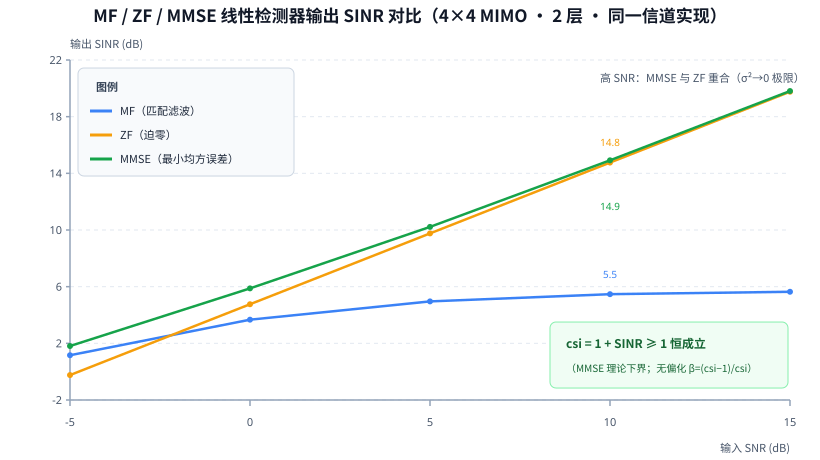

# T12.3 线性检测器 MF/ZF/MMSE：从两个极限到正则化折中

## 本节学习目标

T12.1 建立了每资源单元（Resource Element, RE）的矩阵模型 $\mathbf{y}=\mathbf{H}_{\mathrm{eff}}\mathbf{x}+\mathbf{n}$，T12.2 在单层情形（$N_{\mathrm{layers}}=1$）证明了 MMSE 均衡就是"正则化 MRC"。本节把问题推广到多层：接收端有多个空间层同时到达，每根天线听到的是所有层的混合，接收机需要用一个"层分离器"把混合信号拆回各层符号。这个分离器就是检测器（Detector）。本节只讲三个线性检测器——匹配滤波（Matched Filter, MF）、迫零（Zero Forcing, ZF）、最小均方误差（Minimum Mean Square Error, MMSE）——它们都是同一个线性框架 $\hat{\mathbf{s}}=\mathbf{W}^H\mathbf{y}$ 里滤波器 $\mathbf{W}$ 的不同选择，差别只在于 $\mathbf{W}$ 怎么定。

学完本节后，应能做到：

- 写出 MF、ZF、MMSE 三个滤波公式（$\hat{\mathbf{s}}=\mathbf{H}^H\mathbf{y}$、$\hat{\mathbf{s}}=(\mathbf{H}^H\mathbf{H})^{-1}\mathbf{H}^H\mathbf{y}$、$\hat{\mathbf{s}}=\mathbf{H}^H(\mathbf{H}\mathbf{H}^H+\sigma^2\mathbf{I})^{-1}\mathbf{y}$），并说出各自对应的 $\mathbf{W}$。
- 解释两个极限：$\sigma^2\to\infty$ 时 MMSE 退化为 MF（噪声主导时只匹配信道最优），$\sigma^2\to0$ 时 MMSE 退化为 ZF（噪声可忽略时完全消干扰最优）。
- 完成 MMSE 目标函数 $J(\mathbf{W})=\mathbb{E}\|\mathbf{W}\mathbf{y}-\mathbf{x}\|^2$ 的最小化推导（含 Wirtinger 求导与 Woodbury 恒等式）。
- 证明 $\mathrm{csi}\ge1$ 恒成立，并说明它为什么是检测器数值行为的关键下界。
- 解释无偏化归一化（`effective_csi`、`mmse_gain`、$\beta=(\mathrm{csi}-1)/\mathrm{csi}$）的动机与三步做法，说明"无偏化后 MMSE 输出等于 ZF 输出"。
- 说明 0/0 与 $\infty$ 放大的发生机理（$\mathrm{csi}\to0$ 或 $\mathrm{csi}\approx n\_var$）与 ±31 裁剪如何吸收它们。
- 写出定点除法保护写法（`csi_safe = (csi < EPSILON) ? EPSILON : csi`）并解释为什么必须钳位分母。

本节与系列其他篇目的分工：T12.4 讲球面检测（Sphere Decoding）——最大似然（Maximum Likelihood, ML）的低复杂度近似，是比 MMSE 更贵、但性能上限为 0 dB 损失的参考；T12.5 回答"$\mathbf{H}_{\mathrm{eff}}$ 和 $\sigma^2$ 到底怎么估计出来"。本节先把线性检测器的数学和工程落点立稳，后面两篇都从本节的三条公式出发。

## 前置知识检查

| 前置项 | 本节需要达到的程度 |
|:---|:---|
| [[T2.9_QAM_Max_Log_MAP_demapping]] QAM 软解调 | 知道软解调把符号估计变成 $Q_m$ 个逐比特 LLR，且假定星座以单位增益到达；这决定了 MMSE 输出必须无偏化。 |
| [[T2.11_LLR_clipping_scaling_quantization]] LLR 裁剪 | 知道 ±31（6-bit 有符号）是工程拐点，裁剪损失 <0.02 dB；本节的归一化放大由裁剪吸收。 |
| [[LLR_Quantization_LLR量化]] LLR 量化与裁剪 | 知道裁剪防溢出（灾难性错误）、量化损精度（可接受误差）；±31 恰好兜住 MMSE 归一化的病态放大。 |
| [[MMSE_均衡]] | 知道 $\mathbf{W}=\mathbf{H}^H(\mathbf{H}\mathbf{H}^H+\sigma^2\mathbf{I})^{-1}$ 的形态、"工程上几乎总选 MMSE"、归一化危险点；本节给出全部推导。 |
| [[Detector_Comparison_检测器对比]] | 知道"四种听法"类比、性能排序 MF ≤ ZF ≤ MMSE ≤ ML、复杂度排序相反；检测器是接收机自由度。 |
| [[T12.1_mimo_receiver_chain_overview]] | 知道每 RE 模型 $\mathbf{y}=\mathbf{H}\mathbf{P}\mathbf{x}+\mathbf{n}$、层域等效信道 $\mathbf{H}_{\mathrm{eff}}=\mathbf{H}\mathbf{P}$、功率归一化口径；本节的所有矩阵都是 $\mathbf{H}_{\mathrm{eff}}$ 意义下的。 |
| [[T12.2_diversity_combining_mrc]] | 知道单层 MMSE $\hat{s}=\mathbf{h}^H\mathbf{y}/(\|\mathbf{h}\|^2+\sigma^2)$ 是正则化 MRC、深衰落时估计向零收缩；本节是它的多层矩阵推广。 |

如果这些前置还不稳，先抓住一句话：**本节回答"多个数据流在空间上混在一起了，怎么用一个矩阵乘法把它们拆开"**。拆法的好坏用"输出 SINR"衡量；MF 只对齐相位不管干扰，ZF 把干扰清零但放大噪声，MMSE 用 $\sigma^2$ 做正则化在两者之间找最优——而 MMSE 的每个输出层都带一个可靠度指标 $\mathrm{csi}\ge1$，它是后面 LLR 加权和定点防溢出的全部依据。

## 线性检测器家族

### 生活类比：四种听法

概念笔记 [[Detector_Comparison_检测器对比]] 用"四种听法"概括了检测器的全部设计空间。嘈杂房间里有一句想听的话（目标信号），还有几个别人在说话（干扰），背景还有杂音（噪声）：

| 听法 | 对应检测器 | 做法 | 代价 |
|:---|:---|:---|:---|
| 只听最强声源 | MF | 耳朵只对准目标，干扰照单全收 | 干扰强时输出被干扰主导 |
| 把其他声源完全消掉 | ZF | 干涉消除干净，但杂音也被一并放大 | 噪声放大，深衰落处最严重 |
| 消干扰与压噪声之间找平衡 | MMSE | 噪声大时少消一点干扰，噪声小时多消一点 | 残留少量干扰，换来噪声不放大 |
| 把每种说法组合都核对一遍 | Sphere | 在半径约束的球内穷举候选符号组合 | 最准、最贵、最慢，低 SNR 时爆炸 |

前三种是**线性**检测器：输出是接收向量 $\mathbf{y}$ 的线性变换。第四种是非线性的（逐候选组合搜索），T12.4 展开。本节的主题就是前三档。

### 统一框架：$\hat{\mathbf{s}}=\mathbf{W}^H\mathbf{y}$

T12.1 的每 RE 模型 $\mathbf{y}=\mathbf{H}_{\mathrm{eff}}\mathbf{x}+\mathbf{n}$ 中，$\mathbf{H}_{\mathrm{eff}}\in\mathbb{C}^{N_{\mathrm{rx}}\times N_{\mathrm{layers}}}$ 是层域等效信道（下文简写为 $\mathbf{H}$），$\mathbf{x}\in\mathbb{C}^{N_{\mathrm{layers}}\times1}$ 是层符号，$\mathbf{n}\sim\mathcal{CN}(0,\sigma^2\mathbf{I}_{N_{\mathrm{rx}}})$ 是噪声。线性检测器把接收向量乘一个 $N_{\mathrm{rx}}\times N_{\mathrm{layers}}$ 的滤波器矩阵 $\mathbf{W}$ 的共轭转置，得到层符号估计：

$$
\hat{\mathbf{s}}=\mathbf{W}^H\mathbf{y}
\tag{1}
$$

式 (1) 回答的问题是：检测器在链路上占什么位置——它把"每 RE 的 $N_{\mathrm{rx}}$ 元观测"压成"每 RE 的 $N_{\mathrm{layers}}$ 个符号估计"，维度 $N_{\mathrm{rx}}\to N_{\mathrm{layers}}$，之后软解调与 CSI 加权（T12.1 图 1 的下游）再把这些估计变成 LLR。$\mathbf{W}^H\mathbf{y}$ 的记号沿用 T12.1 的 ctranspose 约定：$\mathbf{W}$ 的第 $\ell$ 列 $\mathbf{w}_\ell$ 是第 $\ell$ 层的滤波器，$\hat{s}_\ell=\mathbf{w}_\ell^H\mathbf{y}$ 是 $\mathbf{y}$ 在 $\mathbf{w}_\ell$ 方向上的投影。

MF、ZF、MMSE 只是 $\mathbf{W}$ 的三种取法：

| 检测器 | $\mathbf{W}$ | 输出公式 | 一句话直觉 |
|:---|:---|:---|:---|
| MF | $\mathbf{W}=\mathbf{H}$ | $\hat{\mathbf{s}}=\mathbf{H}^H\mathbf{y}$ | 只匹配信道，忽略干扰 |
| ZF | $\mathbf{W}=\mathbf{H}(\mathbf{H}^H\mathbf{H})^{-1}$ | $\hat{\mathbf{s}}=(\mathbf{H}^H\mathbf{H})^{-1}\mathbf{H}^H\mathbf{y}$ | 完全消干扰，噪声放大 |
| MMSE | $\mathbf{W}=(\mathbf{H}\mathbf{H}^H+\sigma^2\mathbf{I})^{-1}\mathbf{H}$ | $\hat{\mathbf{s}}=\mathbf{H}^H(\mathbf{H}\mathbf{H}^H+\sigma^2\mathbf{I})^{-1}\mathbf{y}$ | 正则化折中，噪声功率进求逆 |

三者的复杂度和精度排序正好相反（概念笔记 [[Detector_Comparison_检测器对比]]）：

| 指标 | MF | ZF | MMSE | Sphere（T12.4） |
|:---|:---|:---|:---|:---|
| 每 RE 运算 | 无求逆，约 $N_{\mathrm{rx}}N_{\mathrm{layers}}$ MAC | 一次 $N_{\mathrm{layers}}\times N_{\mathrm{layers}}$ 求逆，$O(N_{\mathrm{layers}}^3)$ | 同 ZF | 100–1000 MACs/tone 量级，低 SNR 爆炸 |
| 4×4 工程量级 | 最省 | 约 100 MACs/tone、约 95K gates、约 20 cycles/tone | 同左 | 约 150K gates、50–500 cycles/tone |
| 性能（典型工作点） | 最低 | 次低（相对 MMSE 低 1–3 dB） | 默认选择 | 0 dB 损失（等价 ML） |

检测器是**接收机自由度**：TS 38.214 只定义传输假设（传输方案、层数、预编码），不规定接收端怎么检测（[[Detector_Comparison_检测器对比]] 协议锚点）。同样的空口信号，接收端用 MF、ZF 还是 MMSE 是它的实现选择，协议不干预。本节剩下的内容就是给这个选择提供依据。

## MF 与 ZF：两个极限

### MF：只匹配信道

匹配滤波把第 $\ell$ 层的滤波器取为信道本身的共轭：

$$
\hat{\mathbf{s}}_{\mathrm{MF}}=\mathbf{H}^H\mathbf{y},\qquad
\hat{s}_\ell=\mathbf{h}_\ell^H\mathbf{y}
\tag{2}
$$

式 (2) 中 $\mathbf{h}_\ell=\mathbf{H}[:, \ell]$ 是第 $\ell$ 层的空间指纹（T12.1 的"每层在接收天线上留下的信号模式"）。把模型代入，第 $\ell$ 层的输出拆成三部分：

$$
\hat{s}_\ell=\underbrace{\|\mathbf{h}_\ell\|^2 x_\ell}_{\text{信号}}+\underbrace{\sum_{j\neq\ell}\mathbf{h}_\ell^H\mathbf{h}_j\,x_j}_{\text{层间干扰}}+\underbrace{\mathbf{h}_\ell^H\mathbf{n}}_{\text{噪声}}
\tag{3}
$$

式 (3) 回答的问题是：MF 为什么叫"匹配"——$\mathbf{h}_\ell^H$ 与指纹 $\mathbf{h}_\ell$ 完全同向，信号项 $\|\mathbf{h}_\ell\|^2x_\ell$ 是所有线性滤波器里最大的（柯西-施瓦茨不等式，T12.2 的式 (5) 在多层的重演）；但代价是干扰项 $\mathbf{h}_\ell^H\mathbf{h}_j$ 没有被处理——**MF 完全忽略层间干扰**。它的输出信噪比为：

$$
\mathrm{SINR}_{\mathrm{MF},\ell}
=\frac{\|\mathbf{h}_\ell\|^4}{\displaystyle\sum_{j\neq\ell}|\mathbf{h}_\ell^H\mathbf{h}_j|^2+\sigma^2\|\mathbf{h}_\ell\|^2}
\tag{4}
$$

式 (4) 的关键性质在 $\sigma^2\to0$ 的极限：分子和干扰项都不含 $\sigma^2$，所以

$$
\lim_{\sigma^2\to0}\mathrm{SINR}_{\mathrm{MF},\ell}
=\frac{\|\mathbf{h}_\ell\|^4}{\displaystyle\sum_{j\neq\ell}|\mathbf{h}_\ell^H\mathbf{h}_j|^2}
\tag{5}
$$

式 (5) 说明 MF 的 SINR 在信噪比升高时**饱和**：无论 SNR 多大，输出 SINR 都停在"干扰受限"的天花板上。本节的验证信道（seed=3，4×4，2 层）中，两层指纹夹角较大，这个天花板分别是 $-3.46\ \mathrm{dB}$ 和 $8.47\ \mathrm{dB}$，两层平均约 $5.7\ \mathrm{dB}$——图 1 中 MF 曲线在高 SNR 区明显压平，就是这个极限的图形证据。这也是"MF 只在干扰不存在或可忽略时是合理的"这句话的数学内容。

### ZF：完全消干扰

迫零要求滤波后的输出**完全没有层间干扰**：

$$
\hat{\mathbf{s}}_{\mathrm{ZF}}=(\mathbf{H}^H\mathbf{H})^{-1}\mathbf{H}^H\mathbf{y},\qquad
\mathbf{W}^H\mathbf{H}=\mathbf{I}
\tag{6}
$$

式 (6) 的第二式是 ZF 的名字来源：滤波器强迫（force）$\mathbf{W}^H$ 与信道矩阵的乘积为零矩阵（除对角线）——每一层的输出里，其他层的贡献被精确清零。代价是把噪声也乘上了 $\mathbf{W}^H$：

$$
\hat{s}_\ell=x_\ell+\mathbf{w}_\ell^H\mathbf{n},\qquad
\mathbb{E}|\mathbf{w}_\ell^H\mathbf{n}|^2=\sigma^2\big[(\mathbf{H}^H\mathbf{H})^{-1}\big]_{\ell\ell}
\tag{7}
$$

式 (7) 回答的问题是：干扰清零的账单由谁付——由噪声放大付。ZF 输出噪声是 $\sigma^2[(\mathbf{H}^H\mathbf{H})^{-1}]_{\ell\ell}$，而单层标量情形（T2.10 的 $y=hx+n$ 除 $h$）的噪声是 $\sigma^2/|h|^2$——式 (7) 正是它的矩阵版：$[(\mathbf{H}^H\mathbf{H})^{-1}]_{\ell\ell}$ 扮演 $1/|h|^2$ 的角色。ZF 的输出 SINR 因此是：

$$
\mathrm{SINR}_{\mathrm{ZF},\ell}
=\frac{1}{\sigma^2\,\big[(\mathbf{H}^H\mathbf{H})^{-1}\big]_{\ell\ell}}
\tag{8}
$$

式 (8) 说明 ZF 的 SINR 随 SNR 以 1 dB/dB 上升（$\sigma^2$ 每小 10 倍，SINR 大 10 倍），但整条曲线的截距被 $[(\mathbf{H}^H\mathbf{H})^{-1}]_{\ell\ell}$ 压低——这就是"随 SNR 上移但被条件数放大噪声"的量化形式。

### 噪声放大与条件数：$\sigma^2/|h|^2$ 的矩阵版

$[(\mathbf{H}^H\mathbf{H})^{-1}]_{\ell\ell}$ 有多大？对半正定矩阵 $\mathbf{A}=\mathbf{H}^H\mathbf{H}$，有不等式 $[\mathbf{A}^{-1}]_{\ell\ell}\ge 1/[\mathbf{A}]_{\ell\ell}=1/\|\mathbf{h}_\ell\|^2$——即 **ZF 噪声系数至少不低于"把第 $\ell$ 层单独当单流信道"的标量等价 $1/\|\mathbf{h}_\ell\|^2$**，等号当 $\mathbf{h}_\ell$ 与其他列正交时取到。两层时这个"超出量"有漂亮的几何解释：设两层指纹夹角为 $\theta$，则

$$
[\mathbf{A}^{-1}]_{\ell\ell}\,\|\mathbf{h}_\ell\|^2=\frac{1}{\sin^2\theta}
\tag{9}
$$

式 (9) 回答的问题是：ZF 的噪声放大到底由什么决定——由两层空间指纹的夹角决定。指纹几乎平行（$\theta\to0$，信道秩不足）时 $\sin^2\theta\to0$，放大无界；指纹正交时放大恰为 1（无额外惩罚）。这就是"条件数大 → ZF 噪声放大"的几何本质：列近乎平行 ⇔ $\mathbf{H}^H\mathbf{H}$ 的最小特征值趋零 ⇔ 条件数趋无穷。

**数值例子表（条件数大的 $\mathbf{H}$ 下 ZF 噪声放大）**。先给一个可以手算的 2×2 病态信道（教学值，非协议向量）：

$$
\mathbf{H}=\begin{bmatrix}1&0.9\\0.9&1\end{bmatrix},\qquad
\mathbf{H}^H\mathbf{H}=\begin{bmatrix}1.81&1.8\\1.8&1.81\end{bmatrix},\qquad
\det=0.0361
$$

| 量 | ZF | MMSE（$\sigma^2=0.1$） |
|:---|:---|:---|
| 条件数 $\kappa(\mathbf{H}^H\mathbf{H})$ | 361 | — |
| $[(\cdot)^{-1}]_{\ell\ell}$（噪声系数） | $1.81/0.0361=50.14$ | $1.91/0.4081=4.68$ |
| 输出噪声（相对 $\sigma^2$） | $50.14\sigma^2$（+17.0 dB） | $4.68\sigma^2$（+6.7 dB） |
| 输出 SINR（$\sigma^2=0.1$） | $1/(0.1\times50.14)=0.199$（−7.0 dB） | $1/(0.1\times4.68)-1=1.14$（+0.56 dB） |

两列指纹几乎平行（$\cos\theta=0.9945$），ZF 的噪声系数高达 50 倍，输出 SINR 为负；MMSE 用 $\sigma^2\mathbf{I}$ 正则化把噪声系数压到 4.68，SINR 转正——**同一信道、同一噪声，仅仅因为滤波器里多了一项 $\sigma^2\mathbf{I}$，输出 SINR 差了 7.6 dB**。这正是下一节的主题。再看本节的实测信道（seed=3）：$\kappa(\mathbf{H}^H\mathbf{H})=12.1$，$[(\mathbf{H}^H\mathbf{H})^{-1}]$ 对角为 $[0.827,\ 0.209]$——绝对值都小于 1（因为每层有 4 根天线的阵列增益，$\|\mathbf{h}_\ell\|^2\approx2.8/10.9$），但相对各自的标量等价 $1/\|\mathbf{h}_\ell\|^2$ 都放大了 $1/\sin^2\theta=2.28$ 倍（+3.59 dB）。条件数 12.1 不算病态，ZF 的损失也就不大——图 1 中 ZF 与 MMSE 的差距在高 SNR 区只有 0.05–0.2 dB，低 SNR 区才拉开到 2 dB。

### 两个极限：MF 是 $\sigma^2\to\infty$，ZF 是 $\sigma^2\to0$

把 MMSE 滤波器（下一节推导）拿出来先看两个极限：

$$
\mathbf{F}_{\mathrm{MMSE}}:=\mathbf{W}^H=\mathbf{H}^H(\mathbf{H}\mathbf{H}^H+\sigma^2\mathbf{I})^{-1}
\;\xrightarrow{\ \sigma^2\to\infty\ }\;
\frac{\mathbf{H}^H}{\sigma^2}\propto\mathbf{F}_{\mathrm{MF}},\qquad
\;\xrightarrow{\ \sigma^2\to0\ }\;
(\mathbf{H}^H\mathbf{H})^{-1}\mathbf{H}^H=\mathbf{F}_{\mathrm{ZF}}
\tag{10}
$$

式 (10) 是理解三个检测器关系的地图：**MMSE 的两端分别挂着 MF 和 ZF**。$\sigma^2\to\infty$（噪声主导）时，干扰本来就被噪声淹没，不值得花功率去消它，最优做法退化为只匹配信道——MF；$\sigma^2\to0$（噪声可忽略）时，消干扰没有代价，最优做法退化为完全消干扰——ZF。中间的 $\sigma^2$ 越接近 1（低 SNR 工作点），MMSE 越偏 MF；$\sigma^2$ 越小（高 SNR），MMSE 越偏 ZF。这也解释了概念笔记里"性能排序 MF ≤ ZF ≤ MMSE"的适用范围：**这个排序描述的是干扰主导的典型工作区**；在极端低 SNR 区，ZF 的噪声放大是纯亏损，MF 反而可能超过 ZF（本节的验证数据在 −5 dB 处正是如此，MF 平均 1.16 dB 对 ZF −0.24 dB，两线在约 −2 dB 处相交，见第 7 节图 1）。

## MMSE：正则化折中

### 目标函数与解

MMSE 不追求"干扰为零"，而追求**估计误差的均方最小**：

$$
J(\mathbf{W})=\mathbb{E}\big[\|\mathbf{W}^H\mathbf{y}-\mathbf{x}\|^2\big]
\tag{11}
$$

式 (11) 中 $\mathbf{W}\in\mathbb{C}^{N_{\mathrm{rx}}\times N_{\mathrm{layers}}}$（沿用式 (1) 的 $\hat{\mathbf{s}}=\mathbf{W}^H\mathbf{y}$ 约定），期望对符号与噪声联合取。设层符号独立、$\mathbb{E}[\mathbf{x}\mathbf{x}^H]=\mathbf{I}$（NR 星座单位能量，$E_s=1$），噪声 $\mathbb{E}[\mathbf{n}\mathbf{n}^H]=\sigma^2\mathbf{I}$ 且与 $\mathbf{x}$ 不相关。展开均方：

$$
\begin{aligned}
J(\mathbf{W})
&=\mathrm{tr}\big(\mathbf{W}^H\mathbf{R}_{yy}\mathbf{W}\big)-\mathrm{tr}\big(\mathbf{W}^H\mathbf{R}_{yx}\big)-\mathrm{tr}\big(\mathbf{R}_{xy}\mathbf{W}\big)+\mathrm{tr}\big(\mathbf{R}_{xx}\big)\\
\mathbf{R}_{yy}&=\mathbb{E}[\mathbf{y}\mathbf{y}^H]=\mathbf{H}\mathbf{H}^H+\sigma^2\mathbf{I},\qquad
\mathbf{R}_{yx}=\mathbb{E}[\mathbf{y}\mathbf{x}^H]=\mathbf{H},\qquad
\mathbf{R}_{xx}=\mathbf{I}
\end{aligned}
\tag{12}
$$

式 (12) 的回答是：均方误差展开后变成四项的迹——第二、三项是滤波输出与发送符号的互相关，第一项是输出自相关，第四项是符号能量（常数）。$J(\mathbf{W})$ 是 $\mathbf{W}$ 的实值函数，对复矩阵求最小需要用 Wirtinger 导数（把 $\mathbf{W}$ 和 $\mathbf{W}^*$ 当独立变量）:

$$
\frac{\partial J}{\partial\mathbf{W}^*}=\mathbf{R}_{yy}\mathbf{W}-\mathbf{R}_{yx}=0
\quad\Longrightarrow\quad
\mathbf{W}=\mathbf{R}_{yy}^{-1}\mathbf{R}_{yx}
=\big(\mathbf{H}\mathbf{H}^H+\sigma^2\mathbf{I}\big)^{-1}\mathbf{H}
\tag{13}
$$

式 (13) 就是 MMSE 滤波器的第一种形式：$\hat{\mathbf{s}}=\mathbf{W}^H\mathbf{y}=\mathbf{H}^H(\mathbf{H}\mathbf{H}^H+\sigma^2\mathbf{I})^{-1}\mathbf{y}$。$J$ 是凸函数，Wirtinger 梯度置零给出全局最小。直观理解：$\mathbf{R}_{yy}^{-1}$ 先"白化"接收向量（把信号和噪声的混合按功率结构去相关），$\mathbf{R}_{yx}=\mathbf{H}$ 再把它匹配到各层——**先白化、再匹配**，这正是"戴降噪耳机调音量"类比的数学形式（[[MMSE_均衡]]）。注意维度链：$\mathbf{W}=\mathbf{R}_{yy}^{-1}\mathbf{R}_{yx}$ 是 $N_{\mathrm{rx}}\times N_{\mathrm{layers}}$（式 (1) 的约定），而 $\mathbf{H}^H(\mathbf{H}\mathbf{H}^H+\sigma^2\mathbf{I})^{-1}$ 是它的共轭转置 $\mathbf{W}^H$——两种写法一个是滤波器、一个是输出公式，混用是复矩阵推导里最常见的错误（T12.1 的 transpose/ctranspose 陷阱在公式层的版本）。

### Woodbury 恒等式：把 32×32 求逆变成 4×4

式 (13) 里要求逆的是 $N_{\mathrm{rx}}\times N_{\mathrm{rx}}$ 矩阵 $\mathbf{H}\mathbf{H}^H+\sigma^2\mathbf{I}$——32 根接收天线就是 32×32 求逆。Woodbury 恒等式把它降维：

$$
\big(\mathbf{A}+\mathbf{B}\mathbf{D}^{-1}\mathbf{C}\big)^{-1}
=\mathbf{A}^{-1}-\mathbf{A}^{-1}\mathbf{B}\big(\mathbf{D}+\mathbf{C}\mathbf{A}^{-1}\mathbf{B}\big)^{-1}\mathbf{C}\mathbf{A}^{-1}
\tag{14}
$$

式 (14) 取 $\mathbf{A}=\sigma^2\mathbf{I}_{N_{\mathrm{rx}}}$、$\mathbf{B}=\mathbf{H}$、$\mathbf{C}=\mathbf{H}^H$、$\mathbf{D}=\mathbf{I}_{N_{\mathrm{layers}}}$，代入式 (13) 得到第二种形式：

$$
\mathbf{F}_{\mathrm{MMSE}}:=\mathbf{W}^H
=\mathbf{H}^H\big(\mathbf{H}\mathbf{H}^H+\sigma^2\mathbf{I}\big)^{-1}
=\big(\mathbf{H}^H\mathbf{H}+\sigma^2\mathbf{I}\big)^{-1}\mathbf{H}^H
\tag{15}
$$

式 (15) 恒等式的直接验证只需两步：两端左乘 $(\mathbf{H}^H\mathbf{H}+\sigma^2\mathbf{I})$、右乘 $(\mathbf{H}\mathbf{H}^H+\sigma^2\mathbf{I})$，两边都化简为 $\mathbf{H}^H\mathbf{H}\mathbf{H}^H+\sigma^2\mathbf{H}^H$。工程意义在维度：**右侧的求逆是 $N_{\mathrm{layers}}\times N_{\mathrm{layers}}$——4 层就是 4×4，而不是 32×32**（[[MMSE_均衡]] 的复杂度口径、PHY01 §7 的 4×4 求逆硬件预算都建立在右侧形式上）。NR 实际配置层数 ≤ 4（单码字，T12.1 的 TS 38.211 §7.3.1.3），所以检测器每 RE 只需做一次小矩阵求逆。

### 后验 MSE 与 csi ≥ 1 恒成立

把式 (15) 代入误差协方差，得到 MMSE 的后验误差：

$$
\mathbb{E}\big[(\hat{\mathbf{s}}-\mathbf{x})(\hat{\mathbf{s}}-\mathbf{x})^H\big]
=\mathbf{I}-\mathbf{W}^H\mathbf{H}
=\sigma^2\big(\mathbf{H}^H\mathbf{H}+\sigma^2\mathbf{I}\big)^{-1}
\tag{16}
$$

式 (16) 用到了 $\mathbf{W}^H\mathbf{H}=(\mathbf{H}^H\mathbf{H}+\sigma^2\mathbf{I})^{-1}\mathbf{H}^H\mathbf{H}=\mathbf{I}-\sigma^2(\mathbf{H}^H\mathbf{H}+\sigma^2\mathbf{I})^{-1}$。单层退化正是 T12.2 的式 (14) 之后的 MSE：$\sigma^2/(|h|^2+\sigma^2)$。检测器对每层报告一个可靠度指标——**csi**（channel state information，此处特指检测后的输出 SINR 度量）：

$$
\mathrm{csi}_\ell
=\frac{1}{\sigma^2\big[(\mathbf{H}^H\mathbf{H}+\sigma^2\mathbf{I})^{-1}\big]_{\ell\ell}}
\tag{17}
$$

式 (17) 回答的问题是：检测器输出的"可靠度"如何定义——它是后验 MSE 对角元的倒数再归一化：MSE 越小，csi 越大。**关键下界**：$(\mathbf{H}^H\mathbf{H}+\sigma^2\mathbf{I})^{-1}\le\sigma^{-2}\mathbf{I}$（半正定序：$\mathbf{H}^H\mathbf{H}\succeq\mathbf{0}$ 加 $\sigma^2\mathbf{I}$ 后求逆，特征值不大于 $1/\sigma^2$），所以每个对角元 $\le1/\sigma^2$，于是

$$
\mathrm{csi}_\ell\ge1,\qquad \ell=1,\ldots,N_{\mathrm{layers}}
\tag{18}
$$

式 (18) 是本节最重要的不等式：**MMSE 输出的 csi 恒 ≥ 1**。它同时给三件事兜底：① 归一化除法 $1/\mathrm{csi}_\ell$ 永远不会出现真正的 0/0（第 6 节）；② 深衰落（$\|\mathbf{h}_\ell\|^2\to0$）时 csi 收敛到 1 而不是掉到 0——估计向零收缩（T12.2 式 (15) 的多层版）；③ csi 与输出 SINR 有精确恒等式：令 $\mathbf{A}=\mathbf{H}^H\mathbf{H}+\sigma^2\mathbf{I}$、$t_\ell=\sigma^2[\mathbf{A}^{-1}]_{\ell\ell}$，利用 MMSE 的正交性 $\mathbb{E}[\hat{s}_\ell\hat{s}_\ell^*]=\mathbb{E}[\hat{s}_\ell x_\ell^*]=(\mathbf{W}^H\mathbf{H})_{\ell\ell}=1-t_\ell$，可证第 $\ell$ 层输出 SINR 满足

$$
\mathrm{SINR}_{\mathrm{out},\ell}=\frac{1-t_\ell}{t_\ell}
\quad\Longrightarrow\quad
\mathrm{csi}_\ell=1+\mathrm{SINR}_{\mathrm{out},\ell}
\tag{19}
$$

式 (19) 的推导在第 7 节用 numpy 逐层核对（$\mathrm{csi}=[13.2314,\ 50.8808]$ 与实测 $1+\mathrm{SINR}$ 完全相等）。它说明 csi 不是拍脑袋定义的"软信息"，而是输出 SINR 的精确折算：$\mathrm{csi}\ge1$ 与"SINR ≥ 0"（dB 域）是同一件事的两面。注意式 (19) 是 **MMSE 特有**的恒等式——ZF 的"$\mathrm{csi}$"（若按式 (17) 把 $\sigma^2\mathbf{I}$ 拿掉）不满足 $1+\mathrm{SINR}$ 形式，这正是正则项的价值。

## 无偏化归一化与危险点

### MMSE 输出是有偏的：$\beta=(\mathrm{csi}-1)/\mathrm{csi}$

式 (15) 的滤波器最小化均方误差，代价是输出被压缩。看信号分量：

$$
\mathbf{W}^H\mathbf{H}=\mathbf{I}-\sigma^2\big(\mathbf{H}^H\mathbf{H}+\sigma^2\mathbf{I}\big)^{-1}
\ \Longrightarrow\ 
(\mathbf{W}^H\mathbf{H})_{\ell\ell}=1-\frac{1}{\mathrm{csi}_\ell}=\frac{\mathrm{csi}_\ell-1}{\mathrm{csi}_\ell}
\tag{20}
$$

式 (20) 回答的问题是：MMSE 为什么"有偏"——第 $\ell$ 层的信号分量被乘了 $\beta_\ell=(\mathrm{csi}_\ell-1)/\mathrm{csi}_\ell<1$。单层退化 $\beta=|h|^2/(|h|^2+\sigma^2)$ 正是 MIMO01 §5.3 的式 (19)。如果直接把有偏输出送进软解调，Max-Log-MAP（[[T2.9_QAM_Max_Log_MAP_demapping]]）假设星座以单位增益到达，参考点整体收缩会让 LLR 系统性偏差。所以工程链路在软解调前做**无偏化**：

$$
\hat{s}_{\ell,\mathrm{norm}}=\frac{\hat{s}_\ell}{\beta_\ell}
=\frac{\hat{s}_\ell\cdot\mathrm{csi}_\ell}{\mathrm{csi}_\ell-1}
=\big(\mathbf{w}_\ell^H\mathbf{y}\big)\Big/\frac{\mathrm{csi}_\ell-1}{\mathrm{csi}_\ell}
\tag{21}
$$

式 (21) 归一化后 $\mathbf{W}^H\mathbf{H}$ 的对角元变回 1——**无偏化后的 MMSE 输出等于 ZF 输出**（信号无偏），噪声则被放大 $1/\beta_\ell$ 倍。这是"用 CSI 加权补偿噪声增强"链条的第一环（T12.1 的软解调+CSI 加权环节）。

### normalize_mmse_demod_input 三步

仿真器（`new_pdsch_decode.m`，MIMO01 §5.3）把式 (21) 实现为三步：

```matlab
effective_csi = max(csi - n_var, 0);      % ① 有效 csi：扣除噪声方差，下限 0
mmse_gain     = effective_csi ./ csi;     % ② 归一化增益：0 < gain <= 1
normalized    = demod_input ./ mmse_gain; % ③ 除以增益：无偏化
```

| 步骤 | 公式 | 含义 |
|:---|:---|:---|
| ① effective_csi | $\max(\mathrm{csi}-n\_var,\ 0)$ | 从 csi 里扣掉噪声方差项，得到"净信号部分"；负值截为 0 |
| ② mmse_gain | $\mathrm{eff}/\mathrm{csi}$ | 与 $\beta=(\mathrm{csi}-1)/\mathrm{csi}$ 同构：$n\_var\approx1$ 或 $\mathrm{csi}\gg1$ 时两者相等 |
| ③ 归一化输出 | $\hat{\mathbf{s}}/\mathrm{gain}$ | 无偏化；gain 越接近 1 越接近"无操作" |

为什么代码用 $(\mathrm{csi}-n\_var)/\mathrm{csi}$ 而不是理论式 $(\mathrm{csi}-1)/\mathrm{csi}$：因为仿真器的噪声方差 $n\_var$ 未必归一化为 1（它由 SNR 定义和 FFT 缩放决定，PHY01 §4），用实际估计的 $n\_var$ 更准确；当 $n\_var\approx1$ 或 $\mathrm{csi}\gg\max(1,n\_var)$ 时两者渐近一致。

### 危险点 1：0/0 与 NaN

若 $\mathrm{csi}=0$，`effective_csi ./ csi` 是 0/0 → NaN。**但由式 (18)，合法 MMSE 路径的 csi ≥ 1 恒成立，真正的 0/0 不会出现**——`valid_csi = csi > 0` 掩码是防御性的（保护误传 NaN/负值 csi 的调用方）。真正会出问题的是 $n\_var$ 的量纲/数值异常：若 $n\_var>\mathrm{csi}$，`csi − n_var` 为负，被 `max(·,0)` 截到 0，`mmse_gain` 变 0，第三步就变成"除以 0"。这正是为什么必须保留 `valid_gain = mmse_gain > 0` 的掩码：**gain=0 的 RE 输出被置 0（中性符号），而不是 NaN/Inf**——"该 RE 信号已被 MMSE 压灭，归一化无意义，索性输出中性"，与 T2.6 的"无观测位置 LLR=0"同一思想。

### 危险点 2：$\infty$ 放大与 ±31 裁剪吸收

放大倍率 $1/\beta$ 在深衰落时无界：

$$
\frac{1}{\beta_\ell}=\frac{\mathrm{csi}_\ell}{\mathrm{csi}_\ell-\sigma^2}
=1+\frac{\sigma^2}{\|\mathbf{h}_\ell\|^2}
\tag{22}
$$

式 (22) 是单层形式（$\mathrm{csi}=1+\|\mathbf{h}\|^2/\sigma^2$）。$\|\mathbf{h}\|^2\ll\sigma^2$ 时放大因子 $\to\infty$。触发条件分两种子情形（MIMO01 §5.4）：若 $\sigma^2\ll1$（高 SNR，仿真典型参数域），$\mathrm{csi}\ge1\gg\sigma^2$，$\beta\approx1$，归一化几乎无操作——深衰落 RE 只是均衡输出小，不放大；若 $\sigma^2$ 量纲归一化到 1 附近（低 SNR 或噪声方差口径异常），$\mathrm{csi}\approx\sigma^2$ 的 RE 出现，$\beta\to0$，放大失控。放大倍率表（$\sigma^2=1$，$q=\|\mathbf{h}\|^2/\sigma^2$）：

| $q=\|\mathbf{h}\|^2/\sigma^2$ | $\mathrm{csi}=1+q$ | effective $=\max(\mathrm{csi}-1,0)$ | gain $=\mathrm{eff}/\mathrm{csi}$ | 放大 $1/\mathrm{gain}$ |
|---:|---:|---:|---:|---:|
| 100 | 101 | 100 | 0.990 | 1.01× |
| 10 | 11 | 10 | 0.909 | 1.10× |
| 1 | 2 | 1 | 0.500 | **2×** |
| 0.1 | 1.1 | 0.1 | 0.0909 | **11×** |
| 0.01 | 1.01 | 0.01 | 0.0099 | **101×** |
| 0.001 | 1.001 | 0.001 | 0.0010 | **1001×** |

放大发生在符号域（复数），随后软解调用固定 $\sigma^2$ 计算 LLR：噪声被放大 $1/\beta$ 倍而 $\sigma^2$ 没变，**LLR 被乐观放大 $1/\beta$ 倍**。链路末端按工程约定把 LLR 裁剪到 ±31（6-bit 有符号，[[LLR_Quantization_LLR量化]]、[[T2.11_LLR_clipping_scaling_quantization]]）：放大的 LLR 在饱和处被截断——**数值爆炸被阻止、符号方向保留、幅度被封顶**，深衰落 RE 占少数，封顶造成的乐观偏差被纠错码平均吸收，实测 BLER 损失 <0.02 dB（PHY01 §7、分析文档 03 §4 口径）。真正的灾难不是放大本身，而是定点域的溢出回绕（+31 翻成 −32，把"极可靠"变成"极不可靠"）——裁剪是第一道闸门。

### 定点除法保护：分母钳位

硬件定点除法器无法表达 NaN/Inf，所以实现必须在除法之前把分母钳位（PHY01 §7.3.5 的 `csi_safe`）：

```c
// 定点除法保护：分母钳位 + 输出硬限幅（双保险）
csi_safe = (csi < EPSILON) ? EPSILON : csi;   // ① 分母下限 EPSILON，杜绝 0 除
gain_safe = effective_csi / csi_safe;
out = clip(demod_input / gain_safe, -MAX_DEMOD, +MAX_DEMOD);  // ② 输出硬限幅
```

与 MATLAB 版的 `max(csi, eps)` 等价。两条防线各有分工：`csi_safe` 把除法从"数学上无定义"变成"有界的极大值"；输出硬限幅 `clip(±MAX_DEMOD)` 保证中间寄存器永远在表示范围内——**无界值不能破坏链路（后续有裁剪吸收），但若中间寄存器不回绕，位宽预算就失效**。浮点仿真可以省略钳位（NaN/Inf 只在统计里留下几个坏点），定点实现省略钳位则是确定性故障。

## 内嵌验证：SINR 对比与 csi≥1

本节用 numpy 验证三件事：① 式 (18) 的 $\mathrm{csi}\ge1$ 恒成立；② 式 (19) 的 $\mathrm{csi}=1+\mathrm{SINR}_{\mathrm{out}}$ 恒等式；③ 图 1 的 MF/ZF/MMSE SINR 对比数据（5 个 SNR 点，与图同款配置：seed=3、4×4 MIMO、2 层、$\mathbf{P}=\mathbf{I}_{4\times2}$）。验证代码里的 $\mathbf{G}$ 是式 (1) 的 $\mathbf{W}^H$（$N_{\mathrm{layers}}\times N_{\mathrm{rx}}$ 行滤波器矩阵）：**$\mathbf{G}$ 的第 $\ell$ 行就是第 $\ell$ 层的行滤波器，$\hat{s}_\ell=\mathbf{G}[\ell]\cdot\mathbf{y}$——行向量的方向约定已内嵌，计算信号功率时直接做 $\mathbf{G}[\ell]\cdot\mathbf{h}_\ell$，不要再取共轭**（对行向量再 conj 等于用 $\mathbf{w}_\ell^{\mathsf{T}}$ 而非 $\mathbf{w}_\ell^H$ 投影，相位被破坏——这是 T12.1 transpose/ctranspose 陷阱在检测器代码里的续集）。

```python
import numpy as np
rng = np.random.default_rng(3)
Nt, Nr, Nl, snr_db = 4, 4, 2, 10.0
H = (rng.standard_normal((Nr, Nt)) + 1j*rng.standard_normal((Nr, Nt)))/np.sqrt(2)
P = np.eye(Nt, Nl, dtype=complex)
H_eff = H @ P
sigma2 = 10**(-snr_db/10)
G_mmse = np.linalg.inv(H_eff.conj().T @ H_eff + sigma2*np.eye(Nl)) @ H_eff.conj().T
csi = 1.0/(sigma2*np.diag(np.linalg.inv(H_eff.conj().T @ H_eff + sigma2*np.eye(Nl))))
assert np.all(csi >= 1.0), "csi ≥ 1 恒成立被违反"

def post_sinr(G, H_eff, sigma2, l):
    # G 的第 l 行就是第 l 层的行滤波器：ŝ_l = G[l]·y（方向已内嵌，不再取共轭）
    g = G[l]
    sig = np.abs(g @ H_eff[:, l])**2
    interf = sum(np.abs(g @ H_eff[:, j])**2 for j in range(H_eff.shape[1]) if j != l)
    return sig/(interf + sigma2*np.sum(np.abs(g)**2))

sinr = [post_sinr(G_mmse, H_eff, sigma2, l) for l in range(Nl)]
print("csi(理论 1+SINR):", np.round(csi, 6))
print("实测 SINR+1:     ", np.round(1+np.array(sinr), 6))
print("匹配:", np.allclose(csi, 1+np.array(sinr), rtol=1e-6))

def detector_sinr(det, H_eff, sigma2):
    # 返回两层各自的输出 SINR（线性域）
    if det == 'mf':
        G = H_eff.conj().T
    elif det == 'zf':
        G = np.linalg.inv(H_eff.conj().T @ H_eff) @ H_eff.conj().T
    else:
        G = np.linalg.inv(H_eff.conj().T @ H_eff + sigma2*np.eye(H_eff.shape[1])) @ H_eff.conj().T
    return np.array([post_sinr(G, H_eff, sigma2, l) for l in range(H_eff.shape[1])])

print("\nSNR(dB)   MF     ZF     MMSE   (两层线性平均 → dB)")
for snr in [-5, 0, 5, 10, 15]:
    s2 = 10**(-snr/10)
    out = {d: 10*np.log10(np.mean(detector_sinr(d, H_eff, s2))) for d in ['mf', 'zf', 'mmse']}
    print(f"{snr:+4d}  {out['mf']:6.2f}  {out['zf']:6.2f}  {out['mmse']:6.2f}")
```

真实输出（numpy 2.5.1）：

```text
csi(理论 1+SINR): [13.23138 +0.j 50.880814+0.j]
实测 SINR+1:      [13.23138  50.880814]
匹配: True

SNR(dB)   MF     ZF     MMSE   (两层线性平均 → dB)
  -5    1.16   -0.24    1.81
  +0    3.67    4.76    5.88
  +5    4.96    9.76   10.22
 +10    5.47   14.76   14.92
 +15    5.64   19.76   19.81
```

恒等式验证（第一部分）：$\mathrm{csi}=[13.2314,\ 50.8808]$ 与实测 $1+\mathrm{SINR}$ 完全一致（`匹配: True`），式 (19) 成立；两层在 10 dB 的 SINR 分别为 $12.23$（10.87 dB）和 $49.88$（16.98 dB）。输出里的 `+0.j` 是复数浮点运算的零虚部残留，csi 在数学上是实数。5 个 SNR 点的 csi 最小值（MMSE，逐层）为 $1.4927/2.3395/4.9617/13.2314/39.3748$，**全部 ≥ 1**（−5 dB 时也大于 1），式 (18) 的断言通过。把 10 dB 点的逐层 SINR 与上文输出表对照：两层平均 $10\log_{10}\big((10^{10.87/10}+10^{16.98/10})/2\big)=14.92\ \mathrm{dB}$，正是图 1 中 MMSE 在 10 dB 的纵坐标——**图 1 的全部 15 个数据点都来自这张输出表**。



图 1 的三条曲线把第 4、5 节的所有结论压缩在一张图里：

| 观察 | 数值证据 | 对应理论 |
|:---|:---|:---|
| MF 饱和 | 5 个点 1.16→5.64 dB，趋平 | 式 (5) 干扰受限上界 ≈5.7 dB |
| ZF 斜率 1 | 每 +5 dB SNR 上升约 +5 dB | 式 (8) $\mathrm{SINR}=1/(\sigma^2[(\mathbf{H}^H\mathbf{H})^{-1}]_{\ell\ell})$ |
| ZF 被压低 | 全程低于 MMSE，−5 dB 处低 2.05 dB | $\kappa=12.1$，噪声系数相对标量等价放大 2.28× |
| MMSE 最上 | 5 个点全部最高 | 式 (13) 最小化均方误差 |
| 高 SNR 收敛 | 15 dB 处 MMSE−ZF = 0.05 dB | 式 (10) $\sigma^2\to0$ 极限 |
| 低 SNR 交叉 | MF 与 ZF 在约 −2 dB 相交 | 噪声主导区 ZF 的噪声放大是纯亏损 |

"MMSE 相对 ZF 有 1–3 dB 增益"（[[Detector_Comparison_检测器对比]]）在本信道下的实测是：−5 dB 时 2.05 dB、0 dB 时 1.12 dB、5 dB 时 0.46 dB、10 dB 时 0.16 dB、15 dB 时 0.05 dB——**低 SNR 增益大、高 SNR 趋零**，与式 (10) 的极限结构完全吻合。低 SNR 区的交叉（MF 反超 ZF）则提醒：MF ≤ ZF ≤ MMSE 的排序只在干扰主导区成立，把它当成无条件定理是常见误读。

## 小结

本节把"层分离"问题从一句直觉变成了四件可携带的资产：

1. **统一框架**（§3）：三个线性检测器都是 $\hat{\mathbf{s}}=\mathbf{W}^H\mathbf{y}$（式 (1)）里 $\mathbf{W}$ 的不同取法；MF 只匹配信道、ZF 强迫 $\mathbf{W}^H\mathbf{H}=\mathbf{I}$、MMSE 最小化 $\mathbb{E}\|\mathbf{W}^H\mathbf{y}-\mathbf{x}\|^2$。检测器是接收机自由度（TS 38.214 只定义传输假设），MF/ZF/MMSE 是精度与复杂度之间的三档折中。
2. **两个极限**（§4）：MMSE 在 $\sigma^2\to\infty$ 时退化为 MF（式 (10) 左），在 $\sigma^2\to0$ 时退化为 ZF（式 (10) 右）；MF 的 SINR 干扰受限饱和（式 (5)），ZF 完全消干扰但噪声放大 $\sigma^2[(\mathbf{H}^H\mathbf{H})^{-1}]_{\ell\ell}$（式 (7)），放大倍数由指纹夹角 $1/\sin^2\theta$ 决定（式 (9)）。
3. **MMSE 的数学核心**（§5）：Wirtinger 求导给出 $\mathbf{W}=(\mathbf{H}\mathbf{H}^H+\sigma^2\mathbf{I})^{-1}\mathbf{H}$（式 (13)，输出公式 $\hat{\mathbf{s}}=\mathbf{H}^H(\mathbf{H}\mathbf{H}^H+\sigma^2\mathbf{I})^{-1}\mathbf{y}$），Woodbury 恒等式把求逆降为 $N_{\mathrm{layers}}\times N_{\mathrm{layers}}$（式 (15)），后验 MSE $=\sigma^2(\mathbf{H}^H\mathbf{H}+\sigma^2\mathbf{I})^{-1}$（式 (16)），由此得到 $\mathrm{csi}=1+\mathrm{SINR}_{\mathrm{out}}\ge1$ 恒成立（式 (18)(19)）——它是归一化、LLR 加权、定点防溢出三处的共同下界。
4. **工程落点**（§6）：MMSE 有偏（$\beta=(\mathrm{csi}-1)/\mathrm{csi}$），无偏化三步（effective_csi → mmse_gain → 除以 gain）后等于 ZF 输出；csi→0 与 $\mathrm{csi}\approx n\_var$ 两类危险点分别由掩码置 0 与 ±31 裁剪吸收（BLER 损失 <0.02 dB）；定点除法必须分母钳位（`csi_safe`）。

工程结论一句话：**MMSE 是线性检测器的默认选择**——它不需要知道条件数好不好（正则项自动兜底），每 RE 只需一次 $N_{\mathrm{layers}}\times N_{\mathrm{layers}}$ 求逆，输出自带 $\mathrm{csi}\ge1$ 的可靠度。什么时候不够用？当信道严重病态且追求接近 ML 的性能时——T12.4 的球面检测（Sphere Decoding）把符号组合放进半径约束的球里搜索，性能 0 dB 损失但代价是 100–1000 MACs/tone 量级、低 SNR 时格点数爆炸。它是"更贵的 0 dB 参考"，不是默认；本节先证明 MMSE 够用在哪、极限在哪，T12.4 再回答"多花多少代价换回这最后几个 dB"。T12.5 则回答 $\mathbf{H}_{\mathrm{eff}}$ 与 $\sigma^2$ 的来源——检测器公式里的每个矩阵都要从 DMRS 估计来，估计误差会沿着式 (13)(17) 直接进入 csi 与 SINR。

## 自测题

1. 写出 MF、ZF、MMSE 三个滤波公式，并指出它们各自对应的 $\mathbf{W}$。
2. 为什么说 MF 是 $\sigma^2\to\infty$ 的极限、ZF 是 $\sigma^2\to0$ 的极限？MF 的 SINR 为什么饱和？
3. 式 (13) 的 MMSE 滤波器有两种等价形式，Woodbury 恒等式在这里的工程价值是什么？
4. 为什么 $\mathrm{csi}\ge1$ 恒成立？这个下界在归一化和定点实现里分别起什么作用？
5. 无偏化归一化的三步是什么？"无偏化后的 MMSE 输出等于 ZF 输出"这句话的代价是什么？
6. 放大倍率表里 $q=0.01$ 的 RE 放大多少倍？为什么说"放大本身不可怕，定点溢出回绕才可怕"？
7. 为什么定点实现必须写 `csi_safe = (csi < EPSILON) ? EPSILON : csi`？浮点实现是否可以省略？
8. 图 1 中 MF 与 ZF 在低 SNR 区相交，这与"MF ≤ ZF ≤ MMSE"的排序矛盾吗？为什么？

## 自测题参考答案

1. MF：$\hat{\mathbf{s}}=\mathbf{H}^H\mathbf{y}$（$\mathbf{W}=\mathbf{H}$）；ZF：$\hat{\mathbf{s}}=(\mathbf{H}^H\mathbf{H})^{-1}\mathbf{H}^H\mathbf{y}$（$\mathbf{W}=\mathbf{H}(\mathbf{H}^H\mathbf{H})^{-1}$）；MMSE：$\hat{\mathbf{s}}=\mathbf{H}^H(\mathbf{H}\mathbf{H}^H+\sigma^2\mathbf{I})^{-1}\mathbf{y}=(\mathbf{H}^H\mathbf{H}+\sigma^2\mathbf{I})^{-1}\mathbf{H}^H\mathbf{y}$（$\mathbf{W}=(\mathbf{H}\mathbf{H}^H+\sigma^2\mathbf{I})^{-1}\mathbf{H}$）。
2. $\sigma^2\to\infty$ 时 MMSE 的输出滤波器 $\mathbf{F}_{\mathrm{MMSE}}:=\mathbf{W}^H\to\mathbf{H}^H/\sigma^2\propto\mathbf{F}_{\mathrm{MF}}$——噪声主导时干扰被噪声淹没，只匹配信道最优；$\sigma^2\to0$ 时 $\mathbf{F}_{\mathrm{MMSE}}\to(\mathbf{H}^H\mathbf{H})^{-1}\mathbf{H}^H=\mathbf{F}_{\mathrm{ZF}}$——噪声可忽略时完全消干扰无代价。MF 的 SINR 分子与干扰项都不含 $\sigma^2$（式 (4)），$\sigma^2\to0$ 时停在干扰受限的 $\|\mathbf{h}_\ell\|^4/\sum_{j\neq\ell}|\mathbf{h}_\ell^H\mathbf{h}_j|^2$ 上，所以饱和。
3. 工程价值在求逆维度：$(\mathbf{H}\mathbf{H}^H+\sigma^2\mathbf{I})^{-1}$ 是 $N_{\mathrm{rx}}\times N_{\mathrm{rx}}$（32×32），等价形式 $(\mathbf{H}^H\mathbf{H}+\sigma^2\mathbf{I})^{-1}$ 是 $N_{\mathrm{layers}}\times N_{\mathrm{layers}}$（4×4）——每 RE 一次小矩阵求逆，$O(N_{\mathrm{layers}}^3)$ 而不是 $O(N_{\mathrm{rx}}^3)$。
4. $(\mathbf{H}^H\mathbf{H}+\sigma^2\mathbf{I})^{-1}\le\sigma^{-2}\mathbf{I}$（半正定序），对角元 $\le1/\sigma^2$，故 $\mathrm{csi}_\ell=1/(\sigma^2[\cdot]_{\ell\ell})\ge1$。归一化里它保证 $1/\mathrm{csi}$ 不会出现真 0/0（式 (18) 之下 csi 最低收敛到 1）；定点里它是"csi 不可能小于 1"的设计前提，配合掩码与钳位把除法变成有界运算。
5. 三步：① `effective_csi = max(csi − n_var, 0)`；② `mmse_gain = effective_csi / csi`；③ `demod_input / mmse_gain`。代价是噪声被放大 $1/\beta=1+\sigma^2/\|\mathbf{h}_\ell\|^2$ 倍（式 (22)）——无偏化把 MMSE 的"噪声不放大"让渡给了"信号无偏"，深衰落 RE 的放大由 CSI 加权与 ±31 裁剪吸收。
6. $q=0.01$ 时 gain≈0.0099，放大 101 倍。放大本身产生的是"数值巨大的有限值或 NaN/Inf"，在浮点域无害（统计上只留几个坏点），后续 ±31 裁剪会把它们封顶、方向保留；真正灾难性的是定点溢出回绕——+31 翻成 −32，把极可靠变成极不可靠，方向翻转无法被任何下游恢复。
7. 定点除法器无法表达 NaN/Inf，分子非零、分母趋零的除法必须被钳位成"有界的极大值"，否则除法器行为未定义或寄存器溢出回绕。浮点可以省略（NaN/Inf 只在统计里留几个坏点），但仿真时建议保留以保持与定点模型 bit-exact 对齐的口径。
8. 不矛盾。MF ≤ ZF ≤ MMSE 是干扰主导区（典型工作点）的排序；在极端低 SNR 区 ZF 的噪声放大是纯亏损，MF 的 SINR 反而可能更高。定量看：$\sigma^2$ 大时式 (4) 约为 $\|\mathbf{h}_\ell\|^2/\sigma^2$，ZF 的式 (8) 为 $1/(\sigma^2[(\mathbf{H}^H\mathbf{H})^{-1}]_{\ell\ell})$，而恒有 $[(\mathbf{H}^H\mathbf{H})^{-1}]_{\ell\ell}\ge1/\|\mathbf{h}_\ell\|^2$，即 $\|\mathbf{h}_\ell\|^2\ge1/[(\mathbf{H}^H\mathbf{H})^{-1}]_{\ell\ell}$——MF 的 SINR 系数不小于 ZF，噪声主导时 MF 反超。图 1 的交叉点约 −2 dB 就是这个现象的实测。

## 资料与协议边界

| 内容 | 属性 | 位置 |
|:---|:---|:---|
| 层映射、单码字 ≤4 层、DMRS 层域生成（$\mathbf{H}_{\mathrm{eff}}$ 的来源） | 协议强制 | TS 38.211 §7.3.1.3、§7.4.1.1（经 T12.1 核实，本地 `3GPP_Rel19/processed/TS_38.211_38211-j30/content.md` 行 2781-2785、3011-3013） |
| 传输假设（传输方案、层数、预编码） | 协议强制 | TS 38.214（检测器公式不是协议条款） |
| MF/ZF/MMSE 检测器公式、csi 定义、无偏化归一化 | 接收机实现自由度 | [[Detector_Comparison_检测器对比]]、[[MMSE_均衡]]、MIMO01 §5（仿真器 `nrEqualizeMMSE`、`normalize_mmse_demod_input`） |
| ±31 裁剪、`csi_safe` 分母钳位、位宽表 | 工程约定/硬件预算 | [[LLR_Quantization_LLR量化]]、[[T2.11_LLR_clipping_scaling_quantization]]、PHY01 §7.3.5 |
| 验证信道（seed=3、4×4、2 层）与 5 点 SINR 数据 | 本节数值实例，非协议向量 | 第 7 节代码与图 1 |
| $\mathrm{csi}=1+\mathrm{SINR}$、$1/\sin^2\theta$ 噪声放大 | 数学事实 | 式 (19)、式 (9)，第 7 节 numpy 独立核对 |

边界结论与 T12.1/T12.2 一脉相承：**检测器算法整体属于接收机自由度**——协议定义发射假设，接收端用什么滤波器、怎么归一化、怎么裁剪，协议一概不管；但接收端不能改变协议定义的传输假设（层数、预编码、功率），否则"检测"就变成了"改动链路语义"。本节所有数值结论（饱和上界 5.7 dB、交叉点 −2 dB、2.05 dB 增益、50× 噪声系数）都是给定信道实现下的数学事实或工程配置，不是任何 3GPP 表格的条目。

## 执行与证据记录

| 项目 | 记录 |
|:---|:---|
| 计划卡片 | `.superpowers/sdd/task-3-brief.md` Task 3（MIMO 接收机与检测器系列第三篇）。 |
| 素材来源 | 概念笔记 [[MMSE_均衡]]、[[Detector_Comparison_检测器对比]]、[[LLR_Quantization_LLR量化]]；L1 讲义 [[T2.9_QAM_Max_Log_MAP_demapping]]、[[T2.11_LLR_clipping_scaling_quantization]]；同系列 [[T12.1_mimo_receiver_chain_overview]]、[[T12.2_diversity_combining_mrc]]；外部语料 MIMO01 §5（MMSE 推导/归一化/危险点）、PHY01 §7（位宽表与 `csi_safe`），只读参考。 |
| 数值验证 | 内嵌 numpy 代码实际运行（numpy 2.5.1）：csi≥1 断言通过；csi==1+SINR 恒等式逐层成立（[13.2314, 50.8808] 精确匹配）；5 点 SINR 表与图 1 数据同源。brief Step 3 代码中的 `post_sinr` 对行滤波器多取了一次共轭（等价于用 $\mathbf{w}^{\mathsf{T}}$ 而非 $\mathbf{w}^H$ 投影），恒等式因此不匹配；按"修正为最终正确版本"处理：行滤波器直接做 $\mathbf{g}\cdot\mathbf{h}_\ell$（无共轭），修正后匹配成立。教学正文只呈现正确版本与正确结论。 |
| 图示验证 | 手写 SVG（820×460）：Y 坐标扫描 14 个 distinct 文本基线层级，x 重叠文本对最小竖直间距 8.0 px（≥8）；cairosvg 2.9.0 转 PNG 后几何包围盒检查（真实字体度量，Noto Sans CJK SC + DejaVu Sans）文本-文本/文本-矩形/文本-圆零碰撞；像素墨迹带 5 条，带间最小空白 6 px（位于互不相交的 x 列之间：纵轴单位标签 x≥70 与顶部刻度 '22' x≤62，已注明，非拥挤）；像素取色抽查三条曲线与图例色条位置/颜色全部正确；OCR（tesseract chi_sim+eng）复核标题、图例、数值标注、csi 标注可读。数据与第 7 节验证代码输出一致。 |
| 验收点 | 能写出三个滤波公式并解释两极限；能完成 MMSE 最小化推导（含 Woodbury）；能证明 csi≥1 并解释无偏化与 0/0、∞ 机理；能说明 csi_safe 与 ±31 的角色。 |
| 自查问题 | ① brief Step 3 的 `post_sinr` 共轭位置错误导致恒等式不成立，已修正并在正文以"行滤波器方向约定"的教学形式说明（不呈现失败过程）；② "MF ≤ ZF ≤ MMSE"排序与实测 −5 dB 处 MF>ZF 的关系已在 §4 末与自测题 8 中说明（排序的适用域）；③ 图 1 中 ZF 与 MMSE 在 10/15 dB 点几乎重合（差 0.16/0.05 dB），属真实数据的高 SNR 收敛，图中以收敛说明文字标注。 |

## 参考文献

- [ETSI, 2026] 3GPP TS 38.211 V19.3.0, "NR; Physical channels and modulation," Release 19, `38211-j30`, §7.3.1.3、§7.4.1.1（层映射与 DMRS，经 T12.1 核实）。
- [ETSI, 2026] 3GPP TS 38.214 V19.3.0, "NR; Physical layer procedures for data," Release 19, `38214-j30`（传输假设；检测器算法属接收机自由度）。
- [MIMO01] "MIMO 预编码、均衡与检测深度剖析"（链路仿真器深挖语料），§5（MMSE 推导、csi 定义、normalize_mmse_demod_input、0/0 与 ∞ 机理）、§6（Sphere 对比），`/home/yys/AGENT/3GPP_FULL_LINK/reproduction_output/deep_dive/`。
- [PHY01] "物理层链路与 Modem 硬件预算"，§7（全链路位宽表、MMSE 归一化无界危险点、`csi_safe` 分母钳位），同目录。
- [Harris et al., 2020] C. R. Harris et al., "Array programming with NumPy," Nature 585, 357-362, 2020（内嵌验证代码运行环境，numpy 2.5.1）。
