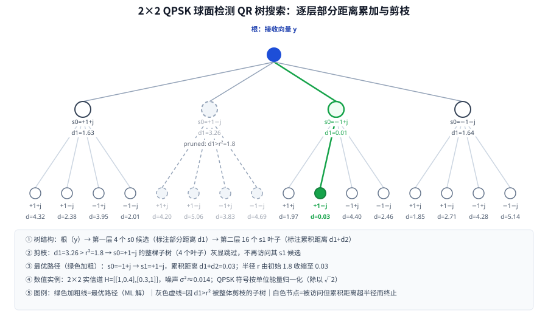

# T12.4 球面检测：半径约束的树搜索与检测器选择

## 本节学习目标

T12.3 把线性检测器家族（匹配滤波（Matched Filter, MF）、迫零（Zero Forcing, ZF）、最小均方误差（Minimum Mean Square Error, MMSE））推导完毕，并给出工程结论：MMSE 是默认选择，每资源单元（Resource Element, RE）一次 $N_{\mathrm{layers}}\times N_{\mathrm{layers}}$ 求逆，相对最大似然（Maximum Likelihood, ML）有 1–3 dB 的性能损失。本节回答两个问题：**ML 检测到底长什么样、为什么贵**；**球面检测（Sphere Decoding）怎么用"半径约束 + 树搜索剪枝"在保住 ML 最优性的同时把复杂度从指数拉回多项式**。最后给出一张三检测器对比表，回答"什么时候该放弃 MMSE 上球面检测"。

学完本节后，应能做到：

- 写出 ML 检测问题 $\hat{\mathbf{s}}=\arg\min_{\mathbf{s}}\|\mathbf{y}-\mathbf{H}\mathbf{s}\|^2$，并说明候选数 $2^{Q_m N_{\mathrm{layers}}}$ 为什么让 256QAM×4 层（$2^{32}$）的穷举不可行。
- 解释半径约束 $\|\mathbf{y}-\mathbf{H}\mathbf{s}\|^2\le r^2$ 的几何含义：只搜索落在"以接收向量为中心、半径 $r$ 的球"内的格点。
- 画出 QR 树搜索的分层累加与剪枝：$\mathbf{H}=\mathbf{Q}\mathbf{R}$ 后距离变成 $\|\mathbf{Q}^H\mathbf{y}-\mathbf{R}\mathbf{s}\|^2$，上三角结构把搜索变成逐层部分距离累加的深度优先树；部分距离超过 $r^2$ 的子树整体剪掉，$r$ 随找到的更优解收缩。
- 对比 Fincke-Pohst（FP）与 Schnorr-Euchner（SE）两种枚举策略：FP 按星座顺序区间枚举、半径收缩慢；SE 按部分距离从小到大展开、平均快 2–3 倍；MATLAB `comm.SphereDecoder` 属于 SE 类。
- 说明白化（$\mathbf{y}/\sqrt{\sigma^2}$、$\mathbf{H}/\sqrt{\sigma^2}$）把噪声方差内嵌进距离、使 sphere 路径无需 CSI 加权；说明 sphere 解码器 LLR 符号约定与 NR 相反需乘 $-1$，纯实数信道输入需 `complex()` 强转。
- 解释低 SNR 复杂度爆炸：球半径必须覆盖 $\chi^2$ 分布的噪声能量，低 SNR 时球内格点数 $\propto(r^2/\sigma^2)^{N_{\mathrm{layers}}}$ 爆炸，球面检测退化为穷举——工程结论是"仅高 SNR 使用"。
- 给出三检测器对比表（复杂度/性能/面积/适用域）与选择准则。

本节是 MIMO 接收机与检测器系列的第四篇。T12.1 提供了每 RE 模型 $\mathbf{y}=\mathbf{H}_{\mathrm{eff}}\mathbf{x}+\mathbf{n}$ 与层域等效信道，T12.3 提供了 MMSE 基线；本节在同一个坐标系里把"更贵的 0 dB 参考"讲清楚。下一节（T12.5）回答信道估计问题——$\mathbf{H}_{\mathrm{eff}}$ 与 $\sigma^2$ 的估计误差如何破坏本节所有检测器的前提，系列内以文字承接，不另设链接。

## 前置知识检查

| 前置项 | 本节需要达到的程度 |
|:---|:---|
| [[T2.9_QAM_Max_Log_MAP_demapping]] QAM 软解调 | 知道软解调把符号估计变成 $Q_m$ 个逐比特 LLR，且 LLR 的尺度来自 $\Delta d/\sigma^2$；球面检测的白化正是把 $\sigma^2$ 内嵌进同一尺度。 |
| [[Sphere_Decoding_球面检测]] | 知道 ML 目标、球约束、QR 树搜索、FP/SE、"只在高 SNR 实用"的结论；本节给出全部推导与数值证据。 |
| [[Detector_Comparison_检测器对比]] | 知道性能排序 MF ≤ ZF ≤ MMSE ≤ ML（Sphere）、复杂度排序相反；Sphere 0 dB 损失但低 SNR 爆炸。 |
| [[T12.1_mimo_receiver_chain_overview]] | 知道每 RE 模型 $\mathbf{y}=\mathbf{H}\mathbf{P}\mathbf{x}+\mathbf{n}$、层域等效信道 $\mathbf{H}_{\mathrm{eff}}$、检测器是接收机自由度；本节所有 $\mathbf{H}$ 都是 $\mathbf{H}_{\mathrm{eff}}$ 意义下的。 |
| [[T12.3_linear_detectors_mf_zf_mmse]] | 知道 MMSE 是线性默认（约 100 MACs/tone、约 95K gates、约 20 cycles/tone、1–3 dB 损失）；本节把 Sphere 作为它的最优参照。 |
| [[MMSE_均衡]] | 知道 MMSE 链路的归一化与 CSI 加权；本节说明 sphere 路径为什么绕开这整条链。 |
| [[CSI_SINR]] | 知道 CSI 是检测后每 RE 的可靠度度量、MMSE 链路用它做 LLR 加权；本节说明 sphere 的白化把可靠度内嵌进距离，是 CSI 加权的替代路径。 |

如果这些前置还不稳，先抓住一句话：**本节回答"把每种符号组合都核对一遍的检测器（ML）到底有多贵，怎么用半径约束和树搜索把价格降下来"**。检测器是接收机自由度（协议只定义传输假设），ML 是性能天花板，球面检测是逼近这个天花板最著名的手段——它唯一的问题是不便宜，而且低信噪比（Signal-to-Noise Ratio, SNR）时尤其不便宜。

## ML 检测：精确但昂贵

### 问题定义：argmin 一个距离

T12.1 的每 RE 模型是 $\mathbf{y}=\mathbf{H}_{\mathrm{eff}}\mathbf{x}+\mathbf{n}$。检测器要做的事是：已知 $\mathbf{y}$ 和 $\mathbf{H}_{\mathrm{eff}}$（下文简写为 $\mathbf{H}$），估计发送的层符号向量 $\mathbf{x}$。最直接的"最优"做法是最大似然（Maximum Likelihood, ML）检测：在所有可能的符号向量里，挑那个"最像"产生了 $\mathbf{y}$ 的：

$$
\hat{\mathbf{s}}=\arg\min_{\mathbf{s}\in\mathcal{C}^{N_{\mathrm{layers}}}}\big\|\mathbf{y}-\mathbf{H}\mathbf{s}\big\|^2
\tag{1}
$$

式 (1) 回答的问题是：ML 检测在算一个什么量——对每个候选符号向量 $\mathbf{s}$，用信道把它"重放"一遍得到 $\mathbf{H}\mathbf{s}$，再和实际收到的 $\mathbf{y}$ 比距离；距离最小的候选就是判决。若噪声是复高斯，这个最小二乘判决正是概率意义上的最优（最小错误概率的硬判决），这是"ML 最优"的出处。注意式 (1) 里没有任何线性化：$\mathbf{s}$ 的每个分量都必须是星座点（正交幅度调制（Quadrature Amplitude Modulation, QAM）符号），所以这不是无约束优化，而是在离散格点集合上的穷举问题。

### 候选数：指数爆炸从哪来

每个层有 $M=2^{Q_m}$ 个星座点（$Q_m$ 是调制阶数），$N_{\mathrm{layers}}$ 个层一起，候选向量总数是：

$$
|\mathcal{C}|^{N_{\mathrm{layers}}}=M^{N_{\mathrm{layers}}}=2^{Q_m N_{\mathrm{layers}}}
\tag{2}
$$

式 (2) 是本节第一个要背下来的数：**候选数随层数指数增长，且基数是调制阶数**。具体数值：

| 配置 | $Q_m$ | $N_{\mathrm{layers}}$ | 候选数 | 能否穷举 |
|:---|:---:|:---:|:---:|:---|
| QPSK × 2 层 | 2 | 2 | $4^2=16$ | 可穷举，手算都行 |
| 16QAM × 2 层 | 4 | 2 | $16^2=256$ | 可穷举 |
| 256QAM × 2 层 | 8 | 2 | $256^2=65{,}536$ | 勉强（每 RE 六万多次距离计算） |
| 256QAM × 4 层 | 8 | 4 | $2^{32}\approx4.3\times10^9$ | **不可穷举** |
| 1024QAM × 4 层 | 10 | 4 | $2^{40}\approx1.1\times10^{12}$ | 完全不可行 |

把 256QAM×4 层的数字放大到整帧看：单个 RE 的 $2^{32}\approx4.3\times10^9$ 个候选，每个候选做一次 $N_{\mathrm{rx}}$ 维复范数约需 30–60 次实乘加，单 RE 就是 $10^{11}$ 次量级；一个 100 MHz 的 NR 子帧约有 4.6 万个数据 RE，合计 $10^{15}$–$10^{16}$ 次实乘加。即便假设接收机有 10 TFLOPs 的专用算力，也要数百秒才能算完一个子帧——而一个子帧只有 1 ms。这就是"ML 精确但昂贵"的量化内容。

### 复杂度口径：指数 vs 多项式

把 ML 的复杂度与 T12.3 的 MMSE 放在同一个口径下，差距一目了然：

| 检测器 | 每 RE 复杂度 | 对配置的依赖 |
|:---|:---|:---|
| MMSE | $O(N_{\mathrm{rx}}N_{\mathrm{layers}}^2)$（一次 $N_{\mathrm{layers}}\times N_{\mathrm{layers}}$ 求逆） | 多项式，与 SNR、调制阶数无关 |
| ML 穷举 | $O(2^{Q_m N_{\mathrm{layers}}}\cdot N_{\mathrm{rx}}N_{\mathrm{layers}})$ | **指数**，调制阶数与层数都在指数上 |
| Sphere（期望） | 高 SNR 近 $O(N_{\mathrm{layers}}^2 M)$ 量级；低 SNR 退化到穷举 | 随机，依赖 SNR 与信道实现 |

ML 的复杂度有两个坏脾气：它同时被 $Q_m$ 和 $N_{\mathrm{layers}}$ 放大（式 (2)），而且**不受 SNR 影响**——低 SNR 时它照样要把全部候选算完，没有"噪声大可以少算点"的余地。Sphere 的卖点正是把第二条改掉：半径剪枝让复杂度随 SNR 变化，噪声越小搜得越少（第 7 节讨论它的另一面：噪声大时搜得太多）。

还有一个必须澄清的细节：式 (1) 的硬判决只回答了"哪个符号向量最像"，而译码器（LDPC/Turbo/Polar，本知识库 T8/T10 系列）需要的是**逐比特软信息**。因此实用 ML 检测器不直接输出 $\hat{\mathbf{s}}$，而是按 Max-Log-MAP（[[T2.9_QAM_Max_Log_MAP_demapping]]）的方式输出 LLR：对每个比特，比较"该比特为 0 时球内最优距离"与"该比特为 1 时球内最优距离"的差，除以 $\sigma^2$。这意味着 ML 检测在好信道下还要**再搜一遍受限集合**（软输出模式），第 6 节的白化正是为这最后一步的尺度服务的。本节先讲硬判决的复杂度，软输出只是把常数因子变大，不改变指数结构。

### 生活类比：把每一把钥匙都试一遍

ML 检测像在一串几百亿把钥匙里找能打开房门的那一把，而且"试钥匙"本身不便宜——每试一把，都要把门锁拆开重装一次（用 $\mathbf{H}$ 重放一遍）。穷举意味着没有任何捷径：即使第一把就试对了，也要把剩下的全部试完才能确认它是对的。球面检测的思路是：**先圈一个范围（半径 $r$），只试范围里的钥匙**——只要这个范围足够小且保证不把正确答案漏掉，速度就上来了。这就是下一节的"半径约束"。

## 半径约束与 QR 树搜索

### 球内格点：把穷举变成球内枚举

式 (1) 的穷举浪费在"明明距离已经大得离谱，还要算完"。球面检测的第一步是把搜索范围框起来：

$$
\big\|\mathbf{y}-\mathbf{H}\mathbf{s}\big\|^2\le r^2
\tag{3}
$$

式 (3) 的几何含义：$\mathbf{H}\mathbf{s}$ 是所有候选符号向量经信道映射后的"格点"（lattice points），式 (3) 说的是**只考虑落在以 $\mathbf{y}$ 为中心、半径 $r$ 的球内的格点**；球外的候选被整体排除。关键问题是 $r$ 怎么定：$r$ 取当前已找到的最优距离，就保证至少 ML 解还在球内（ML 解的距离 $\le$ 任何其他解的距离 $\le r$）；搜索过程中每找到一个更优的完整候选，$r$ 就收缩到它的距离——球越缩越小，搜索越来越快。

### QR 分解：把矩阵问题变成树

直接检查式 (3) 对每个候选都要算一次 $N_{\mathrm{rx}}$ 维范数，没法剪枝。球面检测的第二步是对 $\mathbf{H}$ 做 QR 分解：$\mathbf{H}=\mathbf{Q}\mathbf{R}$，其中 $\mathbf{Q}$ 是酉矩阵（$\mathbf{Q}^H\mathbf{Q}=\mathbf{I}$），$\mathbf{R}$ 是上三角矩阵。酉变换不改变范数，所以：

$$
\big\|\mathbf{y}-\mathbf{H}\mathbf{s}\big\|^2
=\big\|\mathbf{Q}^H\mathbf{y}-\mathbf{R}\mathbf{s}\big\|^2
=\big\|\mathbf{z}-\mathbf{R}\mathbf{s}\big\|^2,\qquad \mathbf{z}=\mathbf{Q}^H\mathbf{y}
\tag{4}
$$

式 (4) 回答的问题是：QR 分解把问题变成了什么——把坐标旋转到 $\mathbf{Q}^H$ 的基下，距离不变，但 $\mathbf{R}$ 的上三角结构让"第 $l$ 行的残差只依赖后 $N_{\mathrm{layers}}-l+1$ 个符号分量"。以两层为例（$\mathbf{R}=\begin{bmatrix}r_{00}&r_{01}\\0&r_{11}\end{bmatrix}$）：

$$
\big\|\mathbf{z}-\mathbf{R}\mathbf{s}\big\|^2
=\big|z_1-r_{11}s_1\big|^2+\big|z_0-r_{01}s_1-r_{00}s_0\big|^2
$$

第二项只含 $s_1$，第一项同时含 $s_0,s_1$。于是"同时搜两个符号"被拆成"先定 $s_1$、再定 $s_0$"的两步——这就是树的由来：根节点之下，第一层是 $s_0$ 的 4 个候选（QPSK 时），每个候选再展开第二层的 4 个 $s_1$ 候选，一共 16 个叶子。

### 逐层部分距离累加与剪枝条件

一般地，令 $L=N_{\mathrm{layers}}$，从最后一层开始向上定义部分距离：

$$
d_l\big(s_L,\ldots,s_l\big)
=d_{l+1}\big(s_L,\ldots,s_{l+1}\big)
+\Big|z_l-\sum_{j=l}^{L}R_{lj}\,s_j\Big|^2
\tag{5}
$$

式 (5) 回答的问题是：树搜索的"工作量"怎么记账——每深入一层，只新增一个一维残差的平方（一层 $O(M)$ 次计算），累积距离 $d_l$ 是 $L-l+1$ 个非负项之和。**累积距离是单调不减的**，于是得到剪枝条件：

$$
d_l\big(s_L,\ldots,s_l\big)>r^2
\quad\Longrightarrow\quad
\text{该子树整体剪掉，不再向下展开}
\tag{6}
$$

式 (6) 是球面检测的全部奥秘：$d_l>r^2$ 时，无论再往下选什么符号，完整距离只增不减，不可能进入球内——**整个子树一次剪掉，而不是逐个叶子判断**。搜索按深度优先进行：先沿一条路径下到叶子（得到一个完整候选与距离），更新 $r$；再回溯到上一层试下一个分支；$r$ 越小，满足 $d_l\le r^2$ 的分支越少，剪枝越狠。深度优先 + 半径收缩 + 式 (6) 剪枝，三者合起来就是 QR 树搜索（MIMO01 §6.2 的算法骨架）。

### "球面"之名的由来与搜索成本

"球面"这个名字来自式 (3) 的几何图像：$\|\mathbf{y}-\mathbf{H}\mathbf{s}\|^2\le r^2$ 在以 $\mathbf{y}$ 为中心、$r$ 为半径的球内框选格点；QR 树搜索只是高效地枚举球内格点的手段，不是球面检测的定义。树搜索的复杂度账可以这样估：每层对 $M$ 个候选各做一次一维残差平方（$O(M)$ 次乘加），$L$ 层合计 $O(ML)$ 次——**一次完整下探（一条根到叶路径）的成本是 $O(ML)$ 而不是 $O(2^{Q_m L})$**；剪枝决定的是"要下探多少条路径"，高 SNR 时远小于 $M^L$。换句话说，球面检测把"穷举的宽度"换成了"树的深度 + 剪枝"：宽度由 $r$ 控制，深度由 $L$ 固定，成本大头从指数变成了"访问的节点数"这个可剪的随机量。这也是"球面检测是 ML 的低复杂度实现、不是近似算法"这句话的数学内容——给定同样的 $r$，它访问的球内格点与穷举完全一致，只是访问得更少、更聪明。

### 数值实例：2×2 QPSK 的完整搜索过程

图 1 用本节的数值实例把式 (4)–(6) 走了一遍：2×2 实信道 $\mathbf{H}=\begin{bmatrix}1&0.4\\0.3&1\end{bmatrix}$（教学值，便于手算核对），QPSK 符号按单位能量归一化，噪声 $\sigma^2\approx0.014$。QR 分解得 $\mathbf{R}\approx\begin{bmatrix}-1.04&-0.67\\0&0.84\end{bmatrix}$，旋转变换后第一层的 4 个部分距离是 $d_1=1.63,\ 3.26,\ 0.01,\ 1.64$（对应 $s_0=+1+j,\ +1-j,\ -1+j,\ -1-j$）。



搜索过程与图 1 逐条对应：

| 步骤 | 动作 | 依据 |
|:---|:---|:---|
| ① 初始半径 | 取噪声能量的宽松上界 $r^2=1.8$ | 半径必须覆盖真实噪声实现（第 7 节） |
| ② 剪掉整棵子树 | $s_0=+1-j$ 的 $d_1=3.26>1.8$，4 个叶子整体灰显 | 式 (6) |
| ③ 其余 12 个叶子逐个访问 | 累积距离 $d_1+d_2$ 与 $r^2$ 比较 | 式 (5) |
| ④ 找到最优解 | $s_0=-1+j\to s_1=+1-j$，累积距离 $0.03\le1.8$ | 式 (1) 的 ML 解 |
| ⑤ 半径收缩 | $r^2\leftarrow0.03$，后续叶子全部超半径终止 | $r$ 随最优解收缩 |

注意 $r^2=1.8$ 时子树 A（$s_0=+1+j$）的 4 个叶子也全部超半径（4.32/2.38/3.95/2.01），但它们是被**逐个访问后**终止的——只有 $d_1$ 就超半径的子树 B 才享受"整体跳过"的待遇。这正是式 (6) 的边界：剪枝发生得越早，省的越多。图 1 中 16 个叶子只完整访问了 12 个，而 $r$ 收缩到 0.03 之后，搜索其实已经结束了。

一个容易忽略的自由度：**树的第一层选哪个符号是任意的**。QR 分解前可以重排 $\mathbf{H}$ 的列（等价于改变树的搜索顺序），图 1 选择"第一层 $s_0$、第二层 $s_1$"只是为了让叙述与式 (5) 一致。实际实现会利用这个自由度：把"最不确定"的层放在树的深层（越深越靠后搜索、剪枝收益越大），或用格基规约（lattice reduction）类预处理让 $\mathbf{R}$ 的对角元更均衡。球面检测的性能边界由格点结构决定，列重排不改变 ML 解本身，只改变树的形状——这也是"QR 树搜索是 ML 的等价实现"的另一个侧面。

### 手算例子：从 QR 到第一层部分距离

图 1 的数字不是随意画的，每一步都可以手算核对。给定 $\mathbf{H}=\begin{bmatrix}1&0.4\\0.3&1\end{bmatrix}$，QR 分解（Gram-Schmidt 或任何库函数）给出 $\mathbf{Q}\approx\begin{bmatrix}-0.96&-0.29\\-0.29&0.96\end{bmatrix}$、$\mathbf{R}\approx\begin{bmatrix}-1.04&-0.67\\0&0.84\end{bmatrix}$；接收向量取 $\mathbf{y}\approx0.53-0.37j,\ -0.55+0.60j$（发送 $s_0=-1+j,\ s_1=+1-j$ 加小噪声），旋转变换后 $\mathbf{z}=\mathbf{Q}^H\mathbf{y}\approx-0.35+0.18j,\ -0.68+0.68j$。第一层（$s_0$）的部分距离按式 (5) 只有一项：

| $s_0$ 候选 | $z_1-r_{11}s_0$ | $d_1=|z_1-r_{11}s_0|^2$ | 判决 |
|:---|:---|:---:|:---|
| $+1+j$ | $-0.68+0.68j-0.84(0.71+0.71j)\approx-1.27+0.09j$ | 1.63 | $d_1\le r^2$，展开 |
| $+1-j$ | $-0.68+0.68j-0.84(0.71-0.71j)\approx-1.27+1.28j$ | 3.26 | $d_1>r^2$，**整棵剪掉** |
| $-1+j$ | $-0.68+0.68j-0.84(-0.71+0.71j)\approx-0.08+0.09j$ | 0.01 | $d_1\le r^2$，展开 |
| $-1-j$ | $-0.68+0.68j-0.84(-0.71-0.71j)\approx-0.08+1.28j$ | 1.64 | $d_1\le r^2$，展开 |

注意 $-1+j$ 与 $+1-j$ 两步都做了同一件事：把 $r_{11}s_0$ 从 $z_1$ 里扣掉再取模方。四种候选里只有 $+1-j$ 的残差大到 3.26——直观上它把"接收到的旋转后信号"解释成了与观测方向几乎垂直的符号，距离自然大。这正是 SE 枚举（第 5 节）会**先**试 0.01 的 $s_0=-1+j$ 的原因：它离圆心最近，第一步就很可能摸到最优解。

### 第二层：累积距离的两种结局

进入 $s_0=-1+j$ 子树后，第二层对 4 个 $s_1$ 候选分别计算累积距离 $d_2=d_1+|z_0-r_{01}s_0-r_{00}s_1|^2$（图 1 中该子树叶子的标注值）：

| $s_1$ 候选 | 累积距离 $d_1+d_2$ | 结局 |
|:---|:---:|:---|
| $+1+j$ | 1.97 | 访问后终止（$1.97>1.8$，此时 $r^2$ 仍为 1.8） |
| $+1-j$ | **0.03** | **接受为最优解，$r^2\leftarrow0.03$** |
| $-1+j$ | 4.40 | 访问后终止（$4.40>0.03$） |
| $-1-j$ | 2.46 | 访问后终止（$2.46>0.03$） |

这 4 个叶子演示了剪枝的两种"死法"：前两个与初始半径 1.8 比，后两个与收缩后的 0.03 比——**同一个 $r$，在搜索中不断变小，后面每个叶子的判定标准都比前面更严**。子树 D（$s_0=-1-j$，$d_1=1.64$）的 4 个叶子（1.85/2.71/4.28/5.14）则在 $r^2=0.03$ 的新标准下全部一轮终止，相当于"白下了两层但几乎没花时间"。整个实例 16 个叶子、15 个被剪，只有 1 个活着——这就是"球内格点"在好信道上的真实样子。

## FP 与 SE：两种枚举策略

式 (6) 只回答了"什么时候剪"，没回答"同一层里按什么顺序试候选"。枚举顺序决定了 $r$ 收缩的快慢，也就决定了剪枝效率。

### Fincke-Pohst：按星座顺序区间枚举

Fincke-Pohst（FP）是球面检测最早的实现策略（Fincke and Pohst, 1985）。它先在每层算出符号的可行区间：

$$
s_l\in\Big[\big\lceil (z_l-r)/R_{ll}\big\rceil,\ \big\lfloor (z_l+r)/R_{ll}\big\rfloor\Big]\cap\mathcal{C}
\tag{7}
$$

式 (7) 回答的问题是：FP 怎么枚举——把"该层残差 $\le r$"翻译成符号的一维区间，然后**按星座表的固定顺序**逐个试区间内的点。FP 实现简单、适合定界分析，缺点是它不关心"哪个候选离圆心更近"：先试的点可能很远，找到的第一个完整候选质量差，$r$ 收缩慢，后面层级的剪枝因此也慢。

### Schnorr-Euchner：按部分距离从小到大展开

Schnorr-Euchner（SE）改了一个细节：每层从"使该层残差最小"的符号开始（即 $s_l$ 取最接近 $z_l/R_{ll}$ 的星座点），然后**按部分距离从小到大的顺序向两侧展开**（Agrell et al., 2002 的 closest point search 就是 SE 的现代形式）。直觉是"先射向圆心、再螺旋外扩"：第一步就很可能落在最优解附近，$r$ 立刻收缩到接近 ML 距离的水平，之后所有距离更远的分支全部被式 (6) 剪掉。

两种策略的对比：

| 特性 | FP（Fincke-Pohst） | SE（Schnorr-Euchner） |
|:---|:---|:---|
| 枚举顺序 | 星座表固定顺序（区间内从前往后） | 按部分距离从小到大（从 $z_l/R_{ll}$ 的最近点开始外扩） |
| 第一个完整候选质量 | 差（可能很远），$r$ 收缩慢 | 好（大概率接近最优），$r$ 收缩快 |
| 平均复杂度 | 基线 | 约为 FP 的 $1/2$–$1/3$ |
| 实现复杂度 | 简单，适合定界证明 | 稍复杂（每层要排序或按序展开） |
| 高 SNR 行为 | 星座大时（256/1024QAM）退化明显 | 几乎只访问最优路径附近节点，复杂度趋近 $O(L^2 M)$ |

工程实现上，MATLAB 的 `comm.SphereDecoder` 内部就是 SE 类枚举；仿真器 `detect_pdsch_sphere.m` 直接调用它（MIMO01 §6.3–6.4）。两条策略在"球内候选完全一致"的意义上等价——它们搜的是同一个球，只是访问顺序不同；SE 的收益纯粹来自"先看更可能对的地方"，从而让 $r$ 更早收缩。

### SE 在本节实例中的枚举顺序

用图 1 的子树 C（$s_0=-1+j$，$d_1=0.01$）看 SE 的具体顺序。第二层的 4 个 $s_1$ 候选各自的新增残差 $|z_0-r_{01}s_0-r_{00}s_1|^2$ 是 1.96/0.02/4.39/2.45（累积距离减 $d_1$）。SE 从最小的 0.02 开始：

| SE 访问序 | $s_1$ 候选 | 新增残差 | 累积距离 | 结局 |
|:---:|:---|:---:|:---:|:---|
| 1 | $+1-j$ | 0.02 | 0.03 | 接受，$r^2\leftarrow0.03$ |
| 2 | $+1+j$ | 1.96 | 1.97 | 终止（$>0.03$） |
| 3 | $-1-j$ | 2.45 | 2.46 | 终止（$>0.03$） |
| 4 | $-1+j$ | 4.39 | 4.40 | 终止（$>0.03$） |

第一个访问的候选就是 ML 解——**只访问了 1 个叶子就完成了最优解定位，其余 3 个是陪跑**。若用 FP（星座顺序 $+1+j$ 先试），顺序变成 1.97、0.03、4.40、2.46：要先试两个候选才碰到 0.03，而且 $r$ 的收缩晚了一步（1.97 不收缩，因为 $1.97>1.8$）。在这个例子里两种策略的差距不大（1 个叶子），但星座越大、层数越多，"先摸到好解"的收益被放得越大——这正是 SE 平均快 2–3 倍的机制。

### `comm.SphereDecoder` 的两种工作模式

MATLAB `comm.SphereDecoder` 通过 `InitialRadius` 暴露两种模式（MIMO01 §6.4），它们对应"要不要保证最优"的取舍：

| 模式 | 初始半径 | 行为 | 性能保证 |
|:---|:---|:---|:---|
| `'full'`（`InitialRadius='Infinity'`） | 无界 | 全树搜索，等价穷举 ML | **0 dB 损失**，最慢 |
| `'radius'`（有限半径） | 给定 $r$ | 只搜球内；球内无候选时返回最近的球内点或失败标记 | **不保证**，可能漏解 |

仿真器的默认是 `'full'`：`sphere_radius` 为空时回退 `'Infinity'`。两种模式对应本节两条主线：`'full'` 是"ML 参考"语义（第 8 节表格里的 0 dB），`'radius'` 是"半径剪枝"语义（式 (3)）——有限半径的初始值来源在工程上就是第 7 节的 MMSE 级联或噪声能量上界。选择 `'radius'` 等于用"可能漏掉球外更优解"换速度；对软输出（LLR）来说，漏解主要影响极端低概率比特的 LLR，通常可接受，但"可接受"必须由仿真数据确认，而不是默认成立。

## 白化与 LLR 符号约定

把 sphere 解码器接到真实链路上，有三个工程细节必须对齐（MIMO01 §6.4 的原话与代码路径）：

### 白化：$\mathbf{y}/\sqrt{n\_var}$、$\mathbf{H}/\sqrt{n\_var}$

仿真器在调用 sphere 解码器之前先把接收向量和信道矩阵同时除以 $\sqrt{n\_var}$（$n\_var$ 即噪声方差 $\sigma^2$）：

$$
\mathbf{y}'=\frac{\mathbf{y}}{\sqrt{\sigma^2}},\qquad
\mathbf{H}'=\frac{\mathbf{H}}{\sqrt{\sigma^2}},\qquad
\mathbf{y}'=\mathbf{H}'\mathbf{s}+\mathbf{n}',\quad \mathbf{n}'\sim\mathcal{CN}(0,\mathbf{I})
\tag{8}
$$

式 (8) 回答的问题是：为什么检测前要先白化——把模型变成"单位噪声方差"。ML 判决（式 (1) 的 argmin）对正标量缩放不变，所以 $\mathbf{s}$ 的最优解不受影响；但**LLR 的幅度需要 $\sigma^2$**：软解调（[[T2.9_QAM_Max_Log_MAP_demapping]]）的 Max-Log-MAP 公式里 LLR 是距离差除以 $\sigma^2$。白化把 $\sigma^2$ 内嵌进距离本身，sphere 解码器输出的软信息天然带上了正确的可靠度尺度——**这正是 sphere 路径不需要 MMSE 链路里 `normalize_mmse_demod_input` 和 `apply_csi_weighting`（CSI 加权）的原因**（[[CSI_SINR]]、T12.3 第 6 节）。MMSE 路径要补"无偏化 + CSI 加权"两步，sphere 路径用一次除法（除以 $\sqrt{n\_var}$）就做完了同样的事。

### LLR 符号约定：$\times(-1)$

`comm.SphereDecoder` 的 Soft 输出约定是**正值表示该比特更可能为 1、负值更可能为 0**；而 NR 链路（`nrSymbolDemodulate` 与全知识库的 LLR 约定，[[LLR_对数似然比]]）是**正值更像比特 0**（NR 的 $0\to+1$ 映射）。两种约定恰好相反，所以仿真器在输出处乘 $-1$：

```matlab
llrs = -1 * sphere_decoder(pdsch_rx / sqrt(n_var), chan);
```

这一行是全链路里最容易移植错的一行：符号反了，高信噪比下译码器依然稳定失败——因为每个 LLR 都精确地指向了相反比特。验证方式与 T12.3 同款：用全强正/全强负的构造向量做 sanity check，符号约定错时症状是"高 SNR 也不收敛"。

### 纯实数输入：`complex()` 强转

第三个细节来自 MATLAB 的输入类型检查：若预处理路径（如 PS 预处理或恒等信道）产生**纯实数**的信道矩阵，`comm.SphereDecoder` 会把实数输入当"只有实部"处理，破坏复数算术。仿真器在送入前显式强转：

```matlab
chan = complex(permute(pdsch_hest, [1, 3, 2]) / sqrt(n_var));  % 强转复数
```

这是一个很小的兼容性防御，但缺了它，纯实信道场景会静默出错。三个细节的共性教训：**sphere 解码器是一个外部黑盒，它的输入口径（缩放、符号、类型）必须由调用方显式对齐**——白化负责尺度，`-1 *` 负责符号，`complex()` 负责类型。

### 数值实例：符号翻转的语义对齐

用一个具体例子把符号约定讲透。设 sphere 解码器对某个比特输出软值 $+2.5$。在 `comm.SphereDecoder` 的约定下，正值表示"该比特更可能为 1"；而在 NR 链路约定（`nrSymbolDemodulate`，正 LLR 更像比特 0，[[LLR_对数似然比]]）下，$+2.5$ 会被解读成"更可能为 0"——**同一个数值，两种约定给出相反的判决**。乘 $-1$ 后输出 $-2.5$：NR 约定下负值表示"更可能为 1"，与 sphere 的原始含义一致。可见乘 $-1$ 不改变"比特更可能是哪个"的事实，只把数值到含义的映射表对齐到链路约定。绝对值 $2.5$ 代表的可靠度在两次映射中都不变——翻转的只有符号，没有幅度。

三个细节的失败模式可以归纳成一张检查表：

| 细节 | 漏做后的症状 | 定位方式 |
|:---|:---|:---|
| 白化（除以 $\sqrt{n\_var}$） | LLR 幅度整体偏大/偏小，BLER 曲线偏移，可靠度与 $\sigma^2$ 失配 | 对比白化前后的 LLR 分布与 $\sigma^2$ 口径 |
| 符号翻转（乘 $-1$） | 高信噪比下译码仍然稳定失败，误码率不随 SNR 下降 | 全强正/全强负构造向量做 sanity check |
| `complex()` 强转 | 纯实信道场景静默出错，结果随机性坏 | 检查送入解码器的信道矩阵 dtype |

三行共同指向同一个原则：**检测器的输入输出口径是接口契约的一部分**。T12.1 的 transpose/ctranspose 陷阱是发射链路的口径问题，这三个细节是检测链路的同款问题——实现者把它们当成"小事"省略时，故障往往出现在高 SNR（本该最好）的场景。

## 低 SNR 复杂度爆炸

### 半径必须覆盖噪声：$\chi^2$ 统计

球面检测的复杂度是**随 SNR 变化的随机变量**，这是它和线性检测器最本质的区别。机理分三步。第一，球半径必须至少覆盖真实噪声实现：最优候选的残差就是噪声本身，$\|\mathbf{y}-\mathbf{H}\mathbf{s}^*\|^2=\|\mathbf{n}\|^2$，而 $\|\mathbf{n}\|^2$ 服从自由度为 $2N_{\mathrm{rx}}$ 的卡方分布（$\chi^2$，实部虚部各占 $N_{\mathrm{rx}}$ 个自由度），均值 $N_{\mathrm{rx}}\sigma^2$。噪声大，$r$ 就必须大。

第二，球内格点数近似等于"球体积 × 格点密度"。半径 $r$ 的球在 $N_{\mathrm{layers}}$ 个复维度（等价 $2N_{\mathrm{layers}}$ 个实维度）里的体积 $\propto r^{2N_{\mathrm{layers}}}$；格点密度由信道与星座的最小间距决定，噪声相对越大，半径覆盖的格点越多：

$$
\#\{\text{球内格点}\}\ \propto\ \left(\frac{r^2}{\sigma^2}\right)^{N_{\mathrm{layers}}}
\tag{9}
$$

式 (9) 回答的问题是：为什么低 SNR 会爆炸——$r^2$ 必须随 $\sigma^2$ 增长（第一步），比值 $r^2/\sigma^2$ 在低 SNR 时本来就大，再被 $N_{\mathrm{layers}}$ 次方放大。第三，球内格点多了，剪枝条件（式 (6)）基本失效：大部分分支的 $d_1\le r^2$，树搜索退化为全枚举 $O(2^{Q_m N_{\mathrm{layers}}})$。

### 数值直觉与工程结论

式 (9) 的一个直接推论很震撼：**比值 $r^2/\sigma^2$ 每大 10 倍，4 层时球内格点数量级大 $10^4$ 倍，2 层时大 $10^2$ 倍**。半径本来就要随噪声同步增长（第一步），所以高 SNR 下 $r^2/\sigma^2$ 可以压到个位数（球内几十个格点），低 SNR 下涨到几百上千（球内 $10^6$–$10^9$ 个格点）。"层数"在这里是放大器：同样的 SNR 恶化，2 层只多两个数量级，4 层多四个。

MIMO01 §6.5 给出了量级直觉：256QAM×4 层，SNR 30 dB 时球内期望候选数可能只有几十个，搜索近乎"沿着最优路径直走"；SNR 0 dB 时球内候选数达到 $10^6$–$10^9$，与穷举无异。所以球面检测的工程使用原则是：

| 场景 | 结论 |
|:---|:---|
| 高 SNR（约 ≥ 20 dB）、256QAM/1024QAM、层数少 | 球内候选少，搜索快，0 dB 损失值得付 |
| 低 SNR（约 ≤ 10 dB） | 复杂度爆炸，延迟无界，退化为穷举——不要用 |
| 中低 SNR 且想要 ML 参考 | 与 MMSE 级联：先用 MMSE 输出一个初始半径 $r$（或直接给个可行候选），再进 sphere 细化 |

"级联"的细节值得多说一句：MMSE 输出 $\hat{\mathbf{s}}$ 取整到星座点后，$\|\mathbf{y}-\mathbf{H}\hat{\mathbf{s}}\|^2$ 是一个合法的初始半径，通常已接近 ML 距离——用它做初始 $r$ 比"噪声能量上界"紧得多，球内候选数立刻少一个数量级。这是工程上"MMSE 保底 + Sphere 增强"的标准接法（[[Detector_Comparison_检测器对比]] 的误解表也强调这一点）。

### 复杂度是随机变量：对系统设计的含义

与 MMSE"每 RE 恒定 20 cycles"不同，Sphere 的每 RE 耗时是一个随机变量——同一次传输里，有的 RE 球内只有几个格点（几十 cycles），有的 RE 信道条件差一点就成百上千 cycles。这对系统设计有两层含义。第一，**平均吞吐与最坏延迟必须分开预算**：平均复杂度决定功耗与吞吐，最坏情况决定实时性；只按平均设计，低 SNR 的突发会打爆 HARQ 反馈时限；只按最坏设计，面积和功耗都白付。第二，**复杂度与信道实现相关**：同一 SNR 下，病态信道（$\mathbf{H}$ 条件数大，[[T12.3_linear_detectors_mf_zf_mmse]] 的 $1/\sin^2\theta$ 分析）的球被拉长，球内格点比良性信道多——所以 Sphere 的延迟分布还带"信道相关"的尾巴，深度衰落 RE 恰好是最慢的 RE。这两个性质加在一起，是第 8 节"延迟确定性判据"的直接来源。

## 三检测器对比与选择

### 对比表：MMSE 与 Sphere

把本节与 T12.3 的结论合并成一张选择表（数值来自 [[Detector_Comparison_检测器对比]] 与分析文档 03 §3 的硬件预算口径）：

| 指标 | MMSE（线性，T12.3） | Sphere（full=ML） |
|:---|:---|:---|
| 每 RE 运算量 | 一次 $N_{\mathrm{layers}}\times N_{\mathrm{layers}}$ 求逆，约 100 MACs/tone | 100–1000 MACs/tone 量级，**随机变量**（高 SNR 近多项式，低 SNR 指数） |
| 硬件面积（4×4） | 约 95K gates | 约 150K gates |
| 延迟 | 确定，约 20 cycles/tone | 50–500 cycles/tone，**SNR 依赖、随机** |
| 性能损失 vs ML | 1–3 dB（层数越多越大，256QAM 约 1 dB） | **0 dB**（radius=∞ 时精确等价 ML） |
| 适用 SNR | 全部 | 仅高 SNR |
| LLR 输出 | 需无偏化归一化 + CSI 加权 | 白化后直接输出（第 6 节） |
| 复杂度对 SNR 的依赖 | 无（固定求逆） | 强（球内格点数 $\propto(r^2/\sigma^2)^{N_{\mathrm{layers}}}$） |

这张表是 [[Detector_Comparison_检测器对比]] "四种听法"类比的定量版：MMSE 是"消干扰与压噪声之间找平衡"（便宜、确定、够用），Sphere 是"把每种说法组合都核对一遍"（最准、最贵、最慢）。**性能排序 MF ≤ ZF ≤ MMSE ≤ ML（Sphere），复杂度排序正好相反**——检测器的全部设计空间就是在这两个方向之间取舍。

### 选择准则

什么时候值得从 MMSE 升级到 Sphere？三个判据：

1. **场景判据**：信噪比高（大调制阶数通常意味着高 SNR 工作点——256QAM/1024QAM 本来就在高 SNR 才可用）、层数少（球内格点数对 $N_{\mathrm{layers}}$ 是指数敏感的，4 层的 $(r^2/\sigma^2)^4$ 比 2 层的平方难伺候得多）。低 SNR 的鲁棒性场景（移动边缘、深衰落）直接排除。
2. **硬件预算判据**：Sphere 的面积（约 150K gates）与每 RE 运算量（100–1000 MACs）都大于 MMSE（约 95K gates、约 100 MACs/tone）；面积紧张、功耗受限的终端侧通常不付这个差价，基站侧才付得起。
3. **延迟确定性判据**：MMSE 的 20 cycles/tone 是常数；Sphere 的 50–500 cycles/tone 随信道实现与噪声实现抖动。需要硬实时调度（每 RE 有严格时间预算、HARQ 反馈时限）的链路，随机延迟意味着要为最坏情况留 10 倍余量——这往往比面积更早劝退 Sphere。

工程上最常见的形态不是二选一，而是**模式切换或级联**：默认 MMSE，在高 SNR 的特定调制/层数组合下切到 Sphere；或按第 7 节"MMSE 给初始半径"的方式级联。无论哪种，检测器都属于接收机自由度（[[Detector_Comparison_检测器对比]] 协议锚点），TS 38.214 只定义传输假设，不规定接收端怎么检测。

### 选择准则检查表

把三个判据落成一张可执行的检查表（每条回答"是"才加分升级到 Sphere）：

| 检查项 | 判据 | 偏向 MMSE | 偏向 Sphere |
|:---|:---|:---|:---|
| 工作点 | 目标 SNR ≥ 20 dB（大调制阶数可用即高 SNR） | 低 SNR、移动边缘、深衰落 | 高 SNR、准静态、视距径 |
| 配置 | $N_{\mathrm{layers}}$ ≤ 2–3 层，$Q_m$ 大（256QAM/1024QAM） | 4 层满配 | 层数少、星座大 |
| 面积预算 | 面积增量（+55K gates 量级）可接受 | 终端侧、功耗敏感 | 基站侧 |
| 延迟预算 | 50–500 cycles/tone 的抖动可被调度吸收 | 硬实时、HARQ 时限紧 | 尽力而为、有缓冲 |
| 性能缺口 | MMSE 的 1–3 dB 损失是否影响块错误率（Block Error Rate, BLER）达标 | 编码增益够、BLER 有余量 | 差 1 dB 就达不到目标 |

前两行是**场景判据**，后三行是**预算判据**。一个常见的工程陷阱是只按性能选：看到"Sphere 0 dB 损失"就上，忽略了延迟随机性对 HARQ 调度的破坏——第 7 节讲过，低 SNR 时延迟可以比高 SNR 大几个数量级，最坏情况预算才是硬约束。反过来，只按面积选（"95K gates 便宜"）会错过高 SNR 大星座场景下可观的 BLER 收益。两维都要看，模式切换正是为了在不同工作点各取所长。

## 内嵌验证：剪枝与穷举一致性

本节验证式 (6) 的核心承诺：**半径剪枝不会把 ML 解丢掉**。验证思路：对同一个接收向量 $\mathbf{y}$，一边做穷举 ML（式 (1)，16 个候选全算），一边做带半径剪枝的枚举（部分距离用 $\mathbf{H}$ 第一行的残差 $|y_0-(H_{00}s_0+H_{01}s_1)|^2$，超过 $r^2$ 就跳过）——注意完整距离 $\|\mathbf{y}-\mathbf{H}\mathbf{s}\|^2$ 是两根接收天线残差的非负项之和，第一项就是部分距离的下界，所以这个剪枝与式 (6) 同构（行式下界版）。把半径取为穷举得到的最优距离 $d_{\mathrm{ML}}$：ML 解自身必然满足部分距离 $\le d_{\mathrm{ML}}$，所以剪枝枚举必须返回与穷举完全相同的解。

```python
import numpy as np
rng = np.random.default_rng(4)
Nl = 2
QPSK = np.array([1+1j, 1-1j, -1+1j, -1-1j])/np.sqrt(2)
H = (rng.standard_normal((2, Nl)) + 1j*rng.standard_normal((2, Nl)))/np.sqrt(2)
def ml_detect(y):
    best, dmin = None, np.inf
    for s0 in QPSK:
        for s1 in QPSK:
            s = np.array([s0, s1]); d = np.sum(np.abs(y - H@s)**2)
            if d < dmin: dmin, best = d, s
    return best, dmin
def prune_detect(y, r2):
    best, dmin = None, np.inf
    for s0 in QPSK:
        partial = np.abs(y[0] - (H[0,0]*s0 + H[0,1]*QPSK))**2   # 第一层部分距离
        for k, s1 in enumerate(QPSK):
            if partial[k] > r2: continue                          # 剪枝：部分距离已超半径
            s = np.array([s0, s1]); d = np.sum(np.abs(y - H@s)**2)
            if d < dmin: dmin, best = d, s
    return best, dmin
for trial in range(200):
    x = QPSK[rng.integers(0, 4, Nl)]
    y = H @ x + 0.1*(rng.standard_normal(2) + 1j*rng.standard_normal(2))/np.sqrt(2)
    s_ml, d_ml = ml_detect(y)
    s_pr, d_pr = prune_detect(y, d_ml)          # r² = 穷举最优距离 → 必含 ML 解
    assert np.all(s_ml == s_pr) and abs(d_ml - d_pr) < 1e-12, f"trial {trial} 不一致"
print("200 次随机实例：半径剪枝枚举与穷举 ML 结果完全一致 ✓")
```

真实运行输出（numpy 2.5.1）：

```text
200 次随机实例：半径剪枝枚举与穷举 ML 结果完全一致 ✓
```

200 次随机信道、随机符号、随机噪声的实例全部通过断言：剪枝枚举的判决符号与穷举 ML 逐实例相同，距离差小于 $10^{-12}$。这验证了两件事：第一，式 (6) 的剪枝在数学上是无损的（只要 $r^2$ 不小于 ML 距离，ML 解一定在球内）；第二，部分距离下界剪枝的实现与穷举在结果上 bit 级一致——将来把剪枝换成 QR 树搜索（式 (5) 的 $d_l$ 是另一种合法下界），同样的断言可以作为回归基线。

### 验证的边界：本节没有覆盖什么

这段验证回答的是"剪枝不漏解"，但它刻意不覆盖三件事，读者不要过度解读。其一，**验证的是硬判决一致性，不是软输出（LLR）**——`'radius'` 模式下球内无候选时的 LLR 行为、漏解对极端比特 LLR 的影响，需要 L3 的块错误率仿真来回答。其二，**验证用的是行式部分距离下界，不是 QR 域的部分距离**——两者都是完整距离的合法下界（完整距离是非负项之和），数学上等价，但树搜索的访问顺序、剪枝时机不同，复杂度行为不在本段验证范围。其三，**验证没有覆盖低 SNR 的复杂度爆炸**——那属于"复杂度是随机变量"的统计性质（第 7 节），需要的是复杂度直方图而不是正确性断言。把这三条边界写清楚，是为了避免把"剪枝无损"误读成"球面检测在所有 SNR 下都好用"。

## 小结

本节把"ML 检测有多贵、球面检测怎么砍价"讲完了，四件可携带的资产：

1. **ML 问题**（§3）：$\hat{\mathbf{s}}=\arg\min\|\mathbf{y}-\mathbf{H}\mathbf{s}\|^2$（式 (1)），候选数 $2^{Q_m N_{\mathrm{layers}}}$（式 (2)）；256QAM×4 层 $2^{32}\approx4.3\times10^9$ 个候选，穷举在物理时间上不可行。
2. **半径约束与 QR 树搜索**（§4）：球约束 $\|\mathbf{y}-\mathbf{H}\mathbf{s}\|^2\le r^2$（式 (3)）；QR 分解后 $\|\mathbf{z}-\mathbf{R}\mathbf{s}\|^2$（式 (4)）的上三角结构给出逐层部分距离累加（式 (5)）与剪枝条件 $d_l>r^2$ 即剪（式 (6)）；深度优先 + $r$ 收缩，图 1 的 2×2 实例完整演示了"一个子树整体剪掉 + 半径 1.8 收缩到 0.03"的全过程。
3. **两种枚举策略与工程细节**（§5–6）：FP 按星座顺序区间枚举（式 (7)）、$r$ 收缩慢；SE 按部分距离从小到大展开，平均快 2–3 倍，`comm.SphereDecoder` 即 SE 类；接入链路前必须白化（式 (8)，内嵌 $\sigma^2$、免 CSI 加权）、LLR 乘 $-1$ 对齐符号约定、纯实数信道 `complex()` 强转。
4. **复杂度与选择**（§7–8）：球内格点数 $\propto(r^2/\sigma^2)^{N_{\mathrm{layers}}}$（式 (9)），低 SNR 时球覆盖大量格点、剪枝失效、退化为穷举——**仅高 SNR 使用**；三检测器对比表中 MMSE 是"便宜、确定、1–3 dB 损失"的默认，Sphere 是"贵、随机、0 dB"的 ML 参考，选择准则看场景、硬件预算与延迟确定性。

工程结论一句话：**Sphere 是"更贵的 0 dB 参考"，不是默认**。MMSE 在绝大多数工作点够用；只有当信道条件好（高 SNR）且层数不多时，球面检测的 0 dB 损失才值得用 150K gates 面积和 50–500 cycles/tone 的随机延迟去换。它唯一的敌人是低 SNR——那里球内格点指数爆炸，任何剪枝都救不回来。

回看整个系列：T12.3 的 MMSE 用 $N_{\mathrm{layers}}\times N_{\mathrm{layers}}$ 求逆换来"1–3 dB 损失、确定延迟、全部 SNR 可用"，本节的 Sphere 用树搜索换来"0 dB 损失、随机延迟、仅高 SNR 可用"——**这两篇合起来就是 [[Detector_Comparison_检测器对比]] "四种听法"类比的完整定量版**：检测器的选择永远是性能、复杂度、确定性三者之间的权衡，而协议把选择权完全留给接收机。读者现在应该能够对任何 MIMO 工作点回答"选什么检测器、为什么"，这是本节与 T12.3 共同的验收标准。

本节到此为止的检测器家族（MF/ZF/MMSE/Sphere）都建立在同一个前提上：$\mathbf{H}_{\mathrm{eff}}$ 与 $\sigma^2$ 是已知的。下一节（T12.5，系列第五篇，以文字承接不设链接）回答这两个量到底怎么来——DMRS 信道估计的误差会沿着式 (1)(4)(9) 直接进入检测器：信道估计错一点，ML 的球就偏一点，Sphere 的复杂度分布和 MMSE 的 csi 都跟着变。检测器是接收机自由度的选择，但它的输入质量由信道估计决定——这是接收链路"上游决定下游"的又一个实例。

## 自测题

1. 写出 ML 检测的目标函数。256QAM×4 层的候选数是多少？为什么说穷举在物理时间上不可行？
2. 半径约束 $\|\mathbf{y}-\mathbf{H}\mathbf{s}\|^2\le r^2$ 的几何含义是什么？$r$ 取多少能保证 ML 解不被丢掉？
3. QR 分解后距离为什么能写成 $\|\mathbf{z}-\mathbf{R}\mathbf{s}\|^2$？上三角结构把搜索变成了什么？
4. 剪枝条件是什么？为什么"部分距离已超半径"就可以把整个子树剪掉？
5. FP 与 SE 的枚举顺序有什么区别？SE 为什么平均快 2–3 倍？
6. 白化 $\mathbf{y}/\sqrt{n\_var}$、$\mathbf{H}/\sqrt{n\_var}$ 做了什么？为什么 sphere 路径不需要 CSI 加权？
7. 为什么低 SNR 时球内格点数会爆炸？给出 $(r^2/\sigma^2)^{N_{\mathrm{layers}}}$ 的推导直觉。
8. 三检测器对比表中 MMSE 与 Sphere 的面积、延迟、性能损失、适用 SNR 各是多少？给出两条选择准则。

## 自测题参考答案

1. $\hat{\mathbf{s}}=\arg\min_{\mathbf{s}\in\mathcal{C}^{N_{\mathrm{layers}}}}\|\mathbf{y}-\mathbf{H}\mathbf{s}\|^2$（式 (1)）。256QAM×4 层：$2^{8\times4}=2^{32}\approx4.3\times10^9$ 个候选，单 RE 约 $10^{11}$ 次实乘加，整帧（约 4.6 万数据 RE）$10^{15}$–$10^{16}$ 次——即便 10 TFLOPs 也要数百秒，而一个子帧只有 1 ms。
2. 只搜索落在"以接收向量 $\mathbf{y}$ 为中心、半径 $r$ 的球"内的格点 $\mathbf{H}\mathbf{s}$，球外候选整体排除。$r$ 取当前已找到的最优距离（或至少不小于 ML 距离）时，ML 解必然在球内，搜索不丢解；搜索中 $r$ 随更优解收缩。
3. $\mathbf{H}=\mathbf{Q}\mathbf{R}$，$\mathbf{Q}$ 酉，酉变换不改变范数，所以 $\|\mathbf{y}-\mathbf{H}\mathbf{s}\|^2=\|\mathbf{Q}^H\mathbf{y}-\mathbf{R}\mathbf{s}\|^2=\|\mathbf{z}-\mathbf{R}\mathbf{s}\|^2$（式 (4)）。$\mathbf{R}$ 上三角使第 $l$ 行残差只依赖后 $L-l+1$ 个符号，最后一层符号的残差独立于其他层——于是"同时搜 $L$ 个符号"变成逐层展开的深度优先树，每层只有 $O(M)$ 个分支。
4. 剪枝条件是部分距离 $d_l>r^2$（式 (6)）。因为 $d_l$ 是 $L-l+1$ 个非负残差平方的累加，继续向下只增不减；$d_l$ 已经超半径，完整距离必然超半径，该子树不可能含球内格点，整体剪掉无损。
5. FP 按星座表固定顺序在可行区间内枚举（式 (7)），先试的点可能很远，第一个完整候选质量差、$r$ 收缩慢；SE 每层从最接近 $z_l/R_{ll}$ 的星座点开始、按部分距离从小到大外扩，"先看更可能对的地方"，$r$ 迅速收缩，后续剪枝更狠，平均复杂度约为 FP 的 $1/2$–$1/3$。
6. 把模型变成单位噪声方差（式 (8)）：ML 的 argmin 对正缩放不变，但 LLR 需要距离除以 $\sigma^2$（Max-Log-MAP），白化把 $\sigma^2$ 内嵌进距离，输出软信息自带可靠度尺度——所以 sphere 路径不需要 MMSE 链路的无偏化归一化和 CSI 加权。
7. 半径必须覆盖噪声实现（最优残差 $\sim\chi^2_{2N_{\mathrm{rx}}}$，均值 $N_{\mathrm{rx}}\sigma^2$），所以低 SNR 时 $r^2$ 大；球内格点数 ≈ 球体积（$\propto r^{2N_{\mathrm{layers}}}$）× 格点密度，即 $\propto(r^2/\sigma^2)^{N_{\mathrm{layers}}}$（式 (9)）。$r^2/\sigma^2$ 本来随 SNR 下降而增大，再被 $N_{\mathrm{layers}}$ 次方放大，球内格点指数爆炸，剪枝失效，退化为穷举。
8. MMSE：约 100 MACs/tone、约 95K gates、约 20 cycles/tone（确定）、1–3 dB 损失、适用全部 SNR；Sphere：100–1000 MACs/tone（随机）、约 150K gates、50–500 cycles/tone（随机）、0 dB、仅高 SNR。选择准则：① 场景判据——高 SNR、层数少才用 Sphere，低 SNR 排除；② 硬件预算与延迟确定性判据——面积/功耗紧张或需要硬实时调度的链路留不住随机延迟，默认 MMSE；也可以级联（MMSE 给初始半径）。

## 资料与协议边界

| 内容 | 属性 | 位置 |
|:---|:---|:---|
| 传输假设（传输方案、层数、预编码） | 协议强制 | TS 38.214（检测器算法不是协议条款） |
| ML 检测、球约束、QR 树搜索、FP/SE、复杂度分析 | 通信检测理论，接收机自由度 | [[Sphere_Decoding_球面检测]]、[[Detector_Comparison_检测器对比]]、MIMO01 §6 |
| 白化、LLR 符号翻转、`complex()` 强转 | 仿真器实现细节 | MIMO01 §6.4（`detect_pdsch_sphere.m`、`comm.SphereDecoder`，外部仿真器，纯文本引用） |
| 面积/延迟预算（95K/150K gates、20/50–500 cycles/tone） | 硬件预算口径 | [[Detector_Comparison_检测器对比]]、分析文档 03 §3（经 MIMO01 §6.6 引用） |
| 图 1 的 2×2 实信道数值实例（$d_1$、$r^2=1.8$、ML 距离 0.03） | 本节教学值，非协议向量 | 第 4 节与验证脚本（图 1 数据由 QR 树搜索脚本实际算出） |
| 内嵌验证的 200 实例一致性断言 | 本节数值证据 | 第 9 节 numpy 输出 |

边界结论与 T12.1/T12.3 一脉相承：**检测器（含球面检测）整体属于接收机自由度**，协议只定义发射侧假设；本节所有数值（候选数、$d_1$ 序列、球内格点数、面积/延迟预算）都是数学事实或工程配置，不是任何 3GPP 表格条目。把"接收机怎么检测"当成协议条款、或把教学信道实例当成规范向量，都会在跨实现联调时产生假性错误。

## 执行与证据记录

| 项目 | 记录 |
|:---|:---|
| 计划卡片 | `.superpowers/sdd/task-4-brief.md` Task 4（MIMO 接收机与检测器系列第四篇）。 |
| 素材来源 | 概念笔记 [[Sphere_Decoding_球面检测]]、[[Detector_Comparison_检测器对比]]、[[MMSE_均衡]]；L1 讲义 [[T2.9_QAM_Max_Log_MAP_demapping]]；同系列 [[T12.1_mimo_receiver_chain_overview]]、[[T12.3_linear_detectors_mf_zf_mmse]]；外部语料 MIMO01 §6（ML 复杂度、QR 树、FP/SE、白化与符号约定、低 SNR 机理、适用域对比），只读参考。 |
| 数值验证 | 内嵌 numpy 代码（brief Step 3 逐字）实际运行（numpy 2.5.1）：200 次随机实例断言全部通过，输出"200 次随机实例：半径剪枝枚举与穷举 ML 结果完全一致 ✓"。brief 代码无缺陷，无需修正。 |
| 图示验证 | 手写 SVG（900×520）：Y 坐标扫描 12 个 distinct 墨迹层级，最小间距 16 px（≥8）；像素墨迹 bbox（真实字体度量，Noto Sans CJK SC + DejaVu Sans）检查文本-文本/文本-圆/文本-矩形零碰撞；9 个被扇形边穿过的文本全部有白色 halo 矩形承载（线条在 halo 下方被遮挡）；节点布局：层间垂直间距 90/138 px（≥90）、同层水平间距 208/52 px（≥30）；cairosvg 2.9.0 转 PNG 后像素取色抽查（根圆蓝、ML 叶子绿、剪枝叶子灰、最优边绿色、实线/虚线断点模式区分）；OCR（tesseract chi_sim+eng）复核标题、节点标签、16 个叶子累积距离、说明框 5 行全部可读。 |
| 验收点 | 能写出 ML 目标与候选数；能解释半径约束、QR 树分层累加与剪枝；能对比 FP/SE；能说明白化、符号翻转、complex() 三个工程细节；能解释低 SNR 复杂度爆炸并给出三检测器对比与选择准则。 |
| 自查问题 | ① brief Step 3 代码实际运行一次通过，无缺陷（与 T12.1/T12.3 曾出现的 API/口径/共轭问题不同）；② 图 1 数值实例的 $\mathbf{H}$ 为教学实信道（便于手算），与验证代码的随机复信道是两组独立数据，已在图中与正文注明，未混称同源；③ 剪枝验证代码用"行式部分距离下界"（$\mathbf{H}$ 第一行残差）而非 QR 域部分距离，两者都是完整距离的合法下界，正文已说明同构性，避免读者误以为必须用 QR 形式才能剪枝。 |

## 参考文献

- [Fincke and Pohst, 1985] U. Fincke and M. Pohst, "Improved methods for calculating vectors of short length in a lattice, including a complexity analysis," Mathematics of Computation, vol. 44, no. 170, 1985（FP 枚举的原始出处）。
- [Agrell et al., 2002] E. Agrell, T. Eriksson, A. Vardy, and K. Zeger, "Closest point search in lattices," IEEE Transactions on Information Theory, vol. 48, no. 8, 2002（SE 枚举的现代形式与复杂度分析）。
- [ETSI, 2026] 3GPP TS 38.214 V19.3.0, "NR; Physical layer procedures for data," Release 19, `38214-j30`（传输假设；检测器算法属接收机自由度）。
- [MIMO01] "MIMO 预编码、均衡与检测深度剖析"（链路仿真器深挖语料），§6（ML 复杂度、QR 树搜索、FP/SE、白化与 LLR 符号约定、低 SNR 机理、MMSE 与 Sphere 适用域对比表），`/home/yys/AGENT/3GPP_FULL_LINK/reproduction_output/deep_dive/`。
- [Harris et al., 2020] C. R. Harris et al., "Array programming with NumPy," Nature 585, 357-362, 2020（内嵌验证代码运行环境，numpy 2.5.1）。
- [MathWorks] MATLAB Communications Toolbox 文档，`comm.SphereDecoder`（SE 类实现的接口口径：Constellation/BitTable/DecisionType/InitialRadius）。
