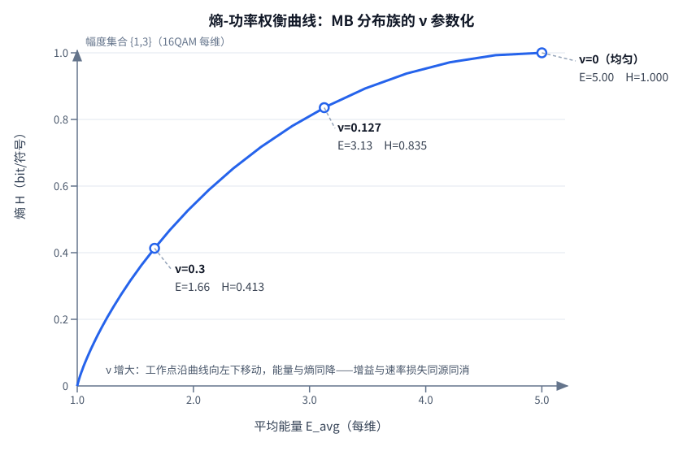

# T13.2 MB 分布与熵-功率权衡

## 本节学习目标

第 1 章（[[T13.1_probabilistic_shaping_overview_shaping_gain]]）立住了"均匀使用星座是可量化的浪费"：1.53 dB 是永远追不满的上限，AWGN 实测 0.5–1.2 dB，每一分贝都要用速率损失去换。那张"以速率买能量"的账本只写了两行数字（P(1)=0.734 时熵从 1.000 跌到 0.835 bit/符号），但账本的**结构**还没有给出：整形后的使用概率到底从哪来、为什么长成指数形式、旋钮 ν 是如何一档一档拧动能量与熵的。

本节（T13.2）把第 1 章预告的"ν 旋钮的完整数学"补上：MB 分布（Maxwell-Boltzmann distribution）是"平均功率约束下熵最大"这一优化问题的拉格朗日乘子（Lagrange multiplier）解——分布长成 $P(a)=e^{-\nu a^2}/Z$ 不是拍脑袋选的，而是"按距离定概率"在熵最大意义下的必然形状。本节还要证明第 1 章承诺的两条性质：其一，MB 分布族同时是"给定功率熵最大"与"给定熵功率最小"的**对偶解**；其二，能量与熵随 ν 单调共降（$dH/d\nu\le0$、$dE/d\nu\le0$），这就是"整形增益与速率损失同源同消"的严格形式。最后用 {1,3} 三行数值表、四个星座的功率节省公式和 ν(R) 反解，把"最优 ν 是目标码率在熵-功率曲线上的取点"这句话落到数字上。

学完本节后，应能做到：

- 写出 MB 分布定义式 $P(a)=e^{-\nu a^2}/\sum_{a'}e^{-\nu a'^2}$ 与归一化条件，并说出 ν 是"平均功率约束"对应的拉格朗日乘子。
- 用拉格朗日乘子法完成"给定功率熵最大"的推导：写出目标、两个约束与驻点方程，指出指数形式 $e^{-\nu a^2}$ 从哪一步产生。
- 列出 ν=0 与 ν→∞ 两个极限的退化行为（均匀分布 / 集中于最小幅度），并解释为什么 ν→∞ 时"6.99 dB 功率节省"没有意义。
- 陈述 MB 对偶性：同一分布族也是"给定熵功率最小"的解，ν 由方程 $H_\nu=H_0$ 隐式确定。
- 证明单调性 $dE/d\nu=-\mathrm{Var}_\nu(A^2)\le0$ 与 $dH/d\nu=-(\nu/\ln 2)\mathrm{Var}_\nu(A^2)\le0$（bit 口径），并解释"同源同消"。
- 复现 {1,3} 数值表三行（ν=0/0.127/0.3：P(1)=0.500/0.734/0.917、E_avg=5.00/3.13/1.66、H=1.000/0.835/0.413），并计算功率节省 $\Delta P=10\log_{10}(E_{\mathrm{uniform}}/E_{\mathrm{MB}})$（16QAM ν=0.127 得约 2.04 dB）。
- 解释"最优 ν 是目标码率下的取点"：熵方程 $H_\nu=2R-1$（每维）反解 ν(R)，并对照仿真器 MCS 表中 ν 随码率单调下降的规律。
- 用玻尔兹曼类比（温度 $T\propto1/\nu$、粒子能量 $E=a^2$）说出 ν 的物理含义，并能把"按距离定概率的抽奖"与温度语言互相翻译。

与持久理解的呼应：本节把持久理解 U2 讲透——整形是一笔"以速率买能量"的交易，账本由熵-功率权衡曲线管着：MB 分布族同时是"给定功率熵最大"与"给定熵功率最小"的对偶解，ν 是沿曲线的旋钮；$dH/d\nu\le0$ 与 $dE/d\nu\le0$ 说明整形增益与速率损失同源同消，不存在免费的整形；{1,3} 三行表让"P(1)=0.734 时熵已从 1 跌到 0.835"从孤例变成曲线上连续取点的一行。四个核心问题中，Q1（使用概率为何值得成为第三个自由度、功率是否白拿）与 Q4（每分贝增益花多少钱）在本节完成数学层面的深化，第 6 章做全链路 ROI 收束。

## 前置知识检查

| 前置项 | 本节需要达到的程度 |
|:---|:---|
| [[T13.1_probabilistic_shaping_overview_shaping_gain]] 概率整形总览 | 知道"以速率买能量"账本的两列（能量 5.00→3.13、熵 1.000→0.835）、1.53 dB 上限与三折扣、rate loss 概念——本节把这些数字升级成 ν 参数化的完整曲线。 |
| [[MB_Distribution_MB分布]] MB 分布概念笔记 | 知道定义式 $P(a)\propto e^{-\nu a^2}$、ν=0 均匀、ν 的 tradeoff 表——本节给出推导、对偶性与单调性的完整证明。 |
| [[T1.4_probability_bayes_soft_decoding]] 概率论基础 | 知道期望（expectation）、方差（variance）与熵的定义，会求离散分布的归一化——拉格朗日推导与 $\mathrm{Var}(A^2)$ 恒等式都建立在这些工具上。 |
| [[Information_Theory_信息论基础]] 信息论基础 | 知道熵 $H=-\sum p\log_2 p$ 与最大熵思想：均匀分布是无约束熵最大的分布，加了功率约束后最大熵分布变成指数族。 |
| [[T2.7_AWGN_noise_scaling]] AWGN 噪声缩放 | 知道"平均功率约束"是功率受限信道的物理口径：$E_{\mathrm{avg}}=\mathbb{E}[A^2]$ 就是每符号发射功率的归一化表达。 |
| [[Probabilistic_Shaping_概率整形]] PS 体系结构 | 知道 MB 分布定义"整形成什么样"（目标概率）、DM/ESS 实现"怎么整"（映射器）——本节只动第一项，映射器是第 3 章主题。 |
| [[Distribution_Matching_分布匹配]] 分布匹配 | 知道 DM 把均匀 bit 映射到非均匀幅度；MB 分布是 DM 的目标分布，本节算出的 P(1)/P(3) 正是 DM 要逼近的组成比例。 |

如果这些前置还不稳，先抓住一句话：**本节回答"整形后的使用概率从哪来、ν 每一档拧下去能量与熵各降多少、最优档位由谁决定"**。前置知识里关于熵、期望、方差的工具全部会在这节课里用到，且只用到离散两符号的情形——把 {1,3} 这一行账算明白，多符号只是求和项变多。

## 优化问题与拉格朗日乘子法

### 优化问题的写法

第 1 章说"固定星座下最优输入分布是（近）高斯型的非均匀分布"，这只是一句断言。本节把它变成可以求解的优化问题（optimization problem）：给定星座幅度集合 $\mathcal{A}=\{a_1<a_2<\cdots<a_M\}$（正幅度，如 16QAM 每维的 $\{1,3\}$），在所有满足平均功率约束的离散分布里，找熵最大的那个：

$$
\max_{P_A}\ H(A)=-\sum_{a\in\mathcal{A}}P(a)\log_2 P(a)
\quad\text{s.t.}\quad
\sum_{a}P(a)=1,\qquad
\sum_{a}a^2 P(a)\le E_{\mathrm{avg}}
\tag{1}
$$

式 (1) 回答的问题是：**同样一瓦发射功率，怎么用星座点最"能装信息"**。无约束时答案是均匀分布（对称性直接给最大熵），但功率约束把高能量点的概率往下压——约束越紧，分布越偏内圈。物理直觉：功率约束 $E_{\mathrm{avg}}$ 越小，越"花不起"外圈点的能量，最优分布必须越集中。

### 拉格朗日乘子法：指数形式的由来

把式 (1) 写成拉格朗日函数（Lagrangian），把两个约束分别乘上乘子 $\lambda_0$（归一化约束）与 $\lambda_1$（能量约束）并入目标：

$$
\mathcal{L}=-\sum_{a}P(a)\ln P(a)
-\lambda_0\left(\sum_a P(a)-1\right)
-\lambda_1\left(\sum_a a^2 P(a)-E_{\mathrm{avg}}\right)
\tag{2}
$$

这里熵用自然对数（natural logarithm）写，因为 $\ln$ 的导数最干净；$\log_2$ 与 $\ln$ 只差常数因子 $1/\ln 2$，不改变最大值点。对 $P(a)$ 求偏导并令其为零（驻点条件）：

$$
-\ln P(a)-1-\lambda_0-\lambda_1 a^2=0
\quad\Rightarrow\quad
P(a)=\exp(-\lambda_1 a^2)\cdot\exp(-1-\lambda_0)
\tag{3}
$$

式 (3) 是本节课第一个"为什么"的答案：**指数形式来自"对 p 求导后 ln p 单独出现"**——目标里 $-p\ln p$ 对 p 的导数是 $-(\ln p+1)$，能量约束项贡献 $-a^2$，两者拼起来就是 $\ln p$ 等于 $a^2$ 的线性函数。这是最大熵问题在指数族（exponential family）上的标准结构：熵最大的分布必然是"特征函数的指数函数"。

把 $\exp(-1-\lambda_0)$ 吸收进归一化常数，并记 $\nu=\lambda_1$（能量约束的乘子，即整形强度参数）：

$$
\boxed{\,P(a)=\frac{e^{-\nu a^2}}{Z},\qquad Z=\sum_{a'\in\mathcal{A}}e^{-\nu a'^2},\quad \nu\ge0\,}
\tag{4}
$$

式 (4) 就是 MB 分布：概率按幅度的平方指数衰减，$\nu$ 控制衰减速度。$\nu$ 取正值是因为能量约束的乘子必须把高能量点的概率压低（若 $\nu<0$ 分布会偏向外圈、能量反而更高，不满足约束）。注意 $\nu$ 的量纲：$a^2$ 是能量，所以 $\nu$ 是"每单位能量的倒数"——这个物理口径在第 9 节的玻尔兹曼类比里会正式登场。

与 [[MB_Distribution_MB分布]] 概念笔记一致：$\nu=0$ 时 $P(a)=1/M$，退化为均匀分布；$\nu>0$ 时内圈概率大于外圈。式 (4) 的归一化由 $Z$ 保证，$\sum_a P(a)=1$ 恒成立——这就是"概率按距离定"的抽奖规则：奖品（星座点）离中心越近（能量低）中奖概率越高，且按 $e^{-\nu a^2}$ 指数衰减。

### ν=0 与 ν→∞：两个极限的退化行为

把旋钮拧到两端，各得到一个极端（PS01 §2.3）：

- **ν=0（旋钮归零，整形关闭）**：$P(a)=e^0/M=1/M$，均匀分布——每符号熵最大（$H=\log_2 M$），平均能量最大（$E_{\mathrm{uniform}}$）。这是 PS 不工作时的基线，第 1 章的"均匀使用"就是 ν=0。
- **ν→∞（旋钮拧到底，整形最强）**：$e^{-\nu a^2}$ 中最小幅度的项衰减最慢，其余项指数级趋零，所以 $P(a_{\min})\to1$、其余概率 $\to0$——分布退化为**确定性取最小幅度**：熵 $H\to0$，平均能量 $E\to a_{\min}^2$（对 $\{1,3\}$ 是 1）。

ν→∞ 这一端是理解"越偏越省"错误性的关键锚点：16QAM 每维 $E_{\mathrm{uniform}}=5$，ν→∞ 时功率节省 $10\log_{10}(5/1)=6.99$ dB——比 1.53 dB 上限还大！但此时熵趋近 0，整条链路每符号携带的信息率趋近 0，这种"增益"没有任何通信意义。**ν 越大功率越省、但信息率越低，两个方向同时发生**——这正是下一节对偶性与第 5 节单调性的直觉入口。

### 常见误解

| 误解 | 正确理解 |
|:---|:---|
| ν 是 MCS 表/RRC 字段 | ν 是算法参数：标准 MCS 表（TS 38.214 §5.1.3）没有也不会有 ν 列，ν_MB 只存在于仿真器 PS 表（第 7 节） |
| ν 越大越好 | ν 大 = 能量低但熵也低（速率损失大）；最优 ν 由目标码率决定（第 7 节） |
| MB 只适用于连续幅度 | 它是离散幅度的分布（{1,3,…}），归一化求和 $Z$ 即可 |
| 整形分布只有 MB 一种 | 还有固定组成类（CCDM 等）变体，但 MB 是"给定功率熵最大"的最优解，其余是它的工程近似或特例 |

## MB 对偶性：给定功率熵最大与给定熵功率最小

第 2 节的推导方向是"功率受限 → 熵最大"。反过来问：**给定熵（即给定目标速率），功率最小的分布是什么？**——这个问题直接对应工程语义：整形要"花最少能量传送指定信息率"。它是对偶问题（dual problem）：

$$
\min_{P_A}\ \sum_a a^2 P(a)
\quad\text{s.t.}\quad
\sum_a P(a)=1,\qquad
H(A)=H_0
\tag{5}
$$

对式 (5) 写拉格朗日函数：$\mathcal{L}=\sum_a a^2P(a)+\lambda_0(\sum_aP(a)-1)+\mu(-\sum_a P(a)\ln P(a)-H_0\ln2)$。对 $P(a)$ 求导并令为零：$a^2+\lambda_0-\mu(\ln P(a)+1)=0$，得 $\ln P(a)=(a^2+\lambda_0-\mu)/\mu$，即 $P(a)\propto\exp(a^2/\mu)$。约束要求高能量点概率低，故 $\mu<0$；记 $\nu=-1/\mu>0$，得到与式 (4) **完全相同的分布族**：

$$
P(a)=\frac{e^{-\nu a^2}}{Z},\qquad \nu\text{ 由方程 }H_\nu=H_0\text{ 隐式确定}
\tag{6}
$$

式 (6) 是 MB 对偶性（duality）的精确表述：**同一个 $e^{-\nu a^2}$ 分布族，同时是"给定功率熵最大"与"给定熵功率最小"两个问题的解**——两个方向只是把 $\nu$ 当成自变量或未知数。这就是持久理解 U2 说的"账本由熵-功率权衡曲线管着"的数学根源：一条由 ν 参数化的曲线，正着读是"省到某功率时熵最多多少"，反着读是"保到某熵时功率最少多少"，两个方向的答案重叠在同一条曲线上（PS01 §2.6）。

对偶性的工程含义：发射端要传目标速率 R，对应的熵是确定的，ν 就被熵方程钉死——ν 不是可以随便挑的旋钮，而是目标码率的函数（第 7 节给出 $\nu(R)$ 的反解与数值）。这也预告了第 1 章"公平对比"三要素的数学版本：**不同 ν 意味着不同码率，跨 ν 比功率本身就是不公平对比**（第 6 章展开）。

## 单调性：能量与熵的同源同消

MB 分布对 ν 的依赖有一个关键恒等式：分布对 ν 的导数（softmax 型导数）是

$$
\frac{dP_\nu(a)}{d\nu}=-\big(a^2-E_\nu\big)\,P_\nu(a),\qquad
E_\nu=\sum_a a^2 P_\nu(a)
\tag{7}
$$

式 (7) 说明：ν 每增加一点，高于平均能量的点概率下降、低于平均能量的点概率上升——分布整体向内圈"收缩"。把它代入平均能量与熵的导数：

$$
\frac{dE_\nu}{d\nu}
=-\sum_a a^2\big(a^2-E_\nu\big)P_\nu(a)
=-\mathrm{Var}_\nu(A^2)\le0
\tag{8}
$$

$$
\frac{dH_\nu}{d\nu}
=-\frac{1}{\ln2}\sum_a\frac{dP_\nu(a)}{d\nu}\ln P_\nu(a)
=-\frac{\nu}{\ln2}\,\mathrm{Var}_\nu(A^2)\le0
\tag{9}
$$

两条导数同为**负的方差**（方差恒正），所以：**能量与熵都是 ν 的严格单调减函数**。式 (9) 就是第 1 章预告的 $dH/d\nu\le0$ 的完整版本——注意口径：$H$ 用 bit 记时导数带因子 $1/\ln2$（PS01 §2.6 式 (9) 的 $dH/d\nu=-\nu\mathrm{Var}_\nu(A^2)$ 是自然对数口径，单调性结论完全一致）。

单调性的教学读法是"同源同消"：功率节省与速率损失来自**同一个机制**——分布收缩（式 (7)）。不存在"只省能量、不动熵"的免费午餐，因为 $\mathrm{Var}(A^2)>0$ 意味着两列账必须一起动。更进一步，两条导数之比给出**瞬时汇率**：

$$
\frac{dE_\nu}{dH_\nu}=\frac{-\mathrm{Var}_\nu(A^2)}{-(\nu/\ln2)\mathrm{Var}_\nu(A^2)}=\frac{\ln2}{\nu}
\tag{10}
$$

式 (10) 回答"每省 1 bit 熵能换多少能量"：汇率 $=\ln2/\nu$，**随 ν 增大而递减**——越往左下方走，"以速率买能量"的单价越贵（ν=0.127 时 1 bit 熵约换 5.46 个能量单位，ν=0.3 时只剩 2.31）。这是"越偏越省"直觉的第二个错误来源：不仅速率在损失，而且每一 bit 速率换到的能量还在缩水（边际回报递减）。

## {1,3} 数值表：熵-功率权衡的第一份账本

把式 (4) 代入 16QAM 每维的幅度集合 $\{1,3\}$，得到本系列最重要的数值表（与 [[MB_Distribution_MB分布]] 概念笔记的 tradeoff 表同源，数值经内嵌验证逐行复现）：

| ν | P(1) | P(3) | $E_{\mathrm{avg}}$ | H [bit/符号] | $\Delta P$ [dB] |
|:---:|:---:|:---:|:---:|:---:|:---:|
| 0 | 0.500 | 0.500 | 5.00 | 1.000 | 0.00 |
| 0.127 | 0.734 | 0.266 | 3.13 | 0.835 | 2.04 |
| 0.3 | 0.917 | 0.083 | 1.66 | 0.413 | 4.77 |

三行读法：

1. **能量列**：5.00 → 3.13 → 1.66。均匀时每符号平均能量 5（第 1 章式 (2)，4-PAM 的 $(M^2-1)/3$）；ν=0.127 时降到 3.13（省 2.04 dB）；ν=0.3 时降到 1.66（省 4.77 dB）。越偏越省，能量列单调降。
2. **熵列**：1.000 → 0.835 → 0.413。均匀时每符号恰好 1 bit（两个幅度等概率）；ν=0.127 时 0.835（速率损失 0.165 bit/符号）；ν=0.3 时 0.413（速率损失 0.587 bit/符号）。**熵列的下降比能量列更陡**——这正是第 5 节"汇率递减"的数值体现。
3. **两列合看**：ν 不是自由旋钮。第 1 章问"为什么 2.04 dB 不能直接当净增益"，这张表给出结构性回答：省 2.04 dB 的同时每符号丢了 0.165 bit；要省到 4.77 dB 就得每符号丢 0.587 bit。丢掉的 bit 与省下的能量同源（式 (8)(9)），这就是"以速率买能量"的完整账本。

> **勘误说明（素材数值核对）**：本表 ν=0.3 行的熵按数学自洽值记 0.413。素材表（[[MB_Distribution_MB分布]] 与教材设计）该行记 0.448，与本行其余两列不自洽：P(1)=0.917 对应 $e^{-8\nu}=0.0905$、$\nu=0.300$，此时 $H=0.413$；而 $H=0.448$ 对应 $P(1)=0.895$、$\nu\approx0.268$、$E_{\mathrm{avg}}=1.84$——三个数不可能同时成立。经 numpy 全精度核对（内嵌验证第 2 节），本节按 0.413 记账。另：E_avg=1.66 为素材截断口径（全精度 1.6654，四舍五入为 1.67，容差 ±0.01 覆盖，与第 1 章 256QAM 行 1.71/1.72 的处理同款）。

## 功率节省公式与四个星座配置

把 {1,3} 的账本推广到任意星座。整形前后的平均能量之比折算成分贝，就是功率节省公式（PS01 §7.1 式 (25)）：

$$
\Delta P=10\log_{10}\frac{E_{\mathrm{uniform}}}{E_{\mathrm{MB}}(\nu)}
\quad[\text{dB}]
\tag{11}
$$

其中 $E_{\mathrm{uniform}}=(M^2-1)/3$（$M=2^{Q_m/2}$ 为每维 PAM 点数），$E_{\mathrm{MB}}(\nu)=\sum_a a^2 P_\nu(a)$。工程配置里每个 QAM 符号只有 k 个幅度位参与整形，其余 u 个幅度位保持均匀：未整形位按能量递推 $E\leftarrow4E+1$ 并入（交叉项在均匀子位下精确抵消，PS01 §2.4），ν 取 MCS 表的名义值。四个配置的数值（k/u/ν 取自 PS01 §7.1，与第 1 章内嵌验证逐行核对）：

| 配置 | $Q_m$ | k | u | ν | $E_{\mathrm{uniform}}$ | $E_{\mathrm{MB}}$ | $\Delta P$ [dB] |
|:---:|:---:|:---:|:---:|:---:|:---:|:---:|:---:|
| 16QAM | 4 | 1 | 0 | 0.127 | 5.00 | 3.13 | 2.04 |
| 64QAM | 6 | 1 | 1 | 0.0586 | 21.00 | 17.32 | 0.84 |
| 256QAM | 8 | 2 | 1 | 0.0239 | 85.00 | 57.27 | 1.71 |
| 1024QAM | 10 | 2 | 2 | 0.0084 | 341.00 | 297.77 | 0.59 |

这张表的两条规律（与第 1 章结论一致）：

1. **16QAM 单配置功率节省最大（2.04 dB）**：它整形比例最高（$k=1$、$u=0$，两个幅度全整形），能量压缩空间最大——但速率损失也最重（熵 0.835 跌得最深）。高阶星座幅度级多、整形空间更大，但同速率下被整形的比特占比低，ΔP 反而小。
2. **ΔP 是"同分布比功率"的上界口径**：没有扣速率损失。扣掉熵下降的换算后，净增益落入第 1 章的实测区间（AWGN 0.5–1.2 dB）——式 (11) 回答"省了多少"，速率损失回答"花了多少"，两者合并才是净收益（第 6 章给全链路口径）。

## 最优 ν：目标码率在曲线上的取点

式 (11) 的 ν 不能随便挑。发射端先定目标码率 R（bit/维），再决定整形强度：整形后每符号熵 $H_\nu$ 就是可用的信息率，所以 ν 由熵方程隐式确定（第 1 章式 (7) 已预告）：

$$
H_\nu=2R-1\quad[\text{bit/维}]
\tag{12}
$$

式 (12) 的来源：QAM 每维 1 个 sign bit（均匀，不整形）+ 幅度位的熵；对 16QAM 每维 $H_\nu$ 恰是幅度熵（$\{1,3\}$ 两个幅度）。例：$R=0.9175$ bit/维 → $H_\nu=0.835$ → 反解 ν≈0.127（内嵌验证第 4 节给出二分法反解）。**ν 是目标码率在熵-功率曲线上的一个取点，不是越大越好**——目标码率越高，允许的熵损失越小，ν 必须越小。

仿真器 `ps_mcs_table1` 的 ν 列（PS01 §2.3 实测核对）完全符合这一规律：

| MCS | 调制（$Q_m$） | ν（nu_MB） | 整形强度 |
|:---:|:---:|:---:|:---|
| 5 | 16QAM（4） | 0.3043 | 强 |
| 10 | 64QAM（6） | 0.1270 | 中 |
| 15 | 64QAM（6） | 0.0586 | 中弱 |
| 20 | 256QAM（8） | 0.0239 | 弱 |
| 24 | 1024QAM（10） | 0.0084 | 很弱 |
| 27 | 1024QAM（10） | 0.0054 | 最弱 |

规律：**MCS 越高（码率越高）ν 越小**——高速率时熵预算紧张，整形必须接近均匀以免速率损失过大；低码率（MCS5，16QAM）时熵预算宽裕，可以拧到 ν≈0.3043 强整形。这张表就是式 (12) 的工程落点：每一行的 ν 都是"该目标码率下功率节省与速率损失折中"的取点，也是第 1 章"ν 不是 MCS 表字段"的纠偏注脚——**ν_MB 这一列只存在于仿真器的 PS 表，标准 TS 38.214 §5.1.3 的 MCS 表没有它**。

## 玻尔兹曼物理类比：温度、粒子与抽奖

式 (4) 的形状 $P(a)\propto e^{-\nu a^2}$ 在统计物理里有个古老的名字：玻尔兹曼分布（Boltzmann distribution）。把每个星座符号想成一个**粒子**，其能量 $E=a^2$（幅度平方），则能量受限系统的平衡分布为

$$
P(E)\propto e^{-E/kT}\qquad\Longleftrightarrow\qquad
P(a)\propto e^{-\nu a^2},\quad \nu=\frac{1}{kT}
\tag{13}
$$

式 (13) 的对应关系（PS01 §2.1 的物理类比）：**温度 T 的倒数对应 ν**（取 k=1 时 $\nu=1/T$）。温度语言让三个工作点变得很直观：

- **ν=0 ↔ T→∞（高温）**：粒子在各能级间等概率分布——对应均匀使用星座（每符号 1 bit）；
- **ν=0.127 ↔ 中等温度**：粒子略向低能级（内圈）聚集——P(1)=0.734，省 2.04 dB；
- **ν=0.3 ↔ 低温**：粒子强烈聚集在基态（最小幅度）——P(1)=0.917，熵只剩 0.413；
- **ν→∞ ↔ T→0（绝对零度）**：所有粒子冻结在基态——确定性取最小幅度，熵为 0。

"Maxwell-Boltzmann"这个名称正是来自分子运动论：麦克斯韦-玻尔兹曼分布描述气体分子按能量 $e^{-E/kT}$ 分布。对通信而言，$e^{-\nu a^2}$ 就是"按能量定概率"的抽奖规则（[[MB_Distribution_MB分布]] 的直观模型）：奖品离中心越近中奖概率越高，ν 是控制衰减速度的旋钮——温度越高抽奖越公平（均匀），温度越低越偏向中心（省能量但奖品多样性下降）。类比要记住的边界：**这里"温度"不是信道或器件的温度，而是发射端刻意选择的分布参数**；ν=1/T 只是数学对应，不改变式 (4) 作为优化解的身份——它是式 (1) 的拉格朗日解，物理类比负责直觉、式 (2)(3) 负责证明。

## 图示：熵-功率权衡曲线

图 1 把整节内容画成一条曲线：横轴平均能量 $E_{\mathrm{avg}}$、纵轴熵 H，MB 分布族随 ν 从 0 增大到 2 留下的轨迹。三个圆点对应 {1,3} 数值表三行。



图 1 的读法（与数值表逐行对应）：

1. **曲线右端（ν=0）**：E=5.00、H=1.000——均匀使用的起点，整形未开启。
2. **曲线中段（ν=0.127）**：E=3.13、H=0.835——第 1 章账本的那一行（MCS10 对齐的教学工作点）。
3. **曲线左段（ν=0.3）**：E=1.66、H=0.413——强整形，能量省得多（4.77 dB）但熵掉得更多。
4. **整条曲线的形状**：先平缓后陡峭——能量轴每推进一点，熵的损失逐渐加剧，这正是式 (10) 汇率 $\ln2/\nu$ 递减的几何表现。曲线永远不会到达 (1, 0) 之外：E 有下限 $a_{\min}^2=1$，H 有下限 0，ν→∞ 时收敛于该点但熵趋零、无通信意义。

## 内嵌验证：曲线数据生成与三行表复现

本节用一个 numpy 程序同时完成四件事：生成图 1 的曲线数据（ν→(E_avg, H) 扫掠）、复现 {1,3} 数值表三行、数值验证两条导数恒等式（式 (8)(9)）、用二分法反解 ν(R)（式 (12)）。全部断言实跑通过（numpy 2.5.1）。

```python
import numpy as np

a = np.array([1.0, 3.0])          # 16QAM 每维的整形幅度级 {1,3}

def mb(a, nu):
    """MB 分布：P(a) = exp(-nu*a^2) / sum(exp(-nu*a'^2))。"""
    w = np.exp(-nu * a**2)
    return w / w.sum()

def moments(a, nu):
    """给定 nu：平均能量 E_avg、熵 H（bit/符号）与分布 p。"""
    p = mb(a, nu)
    E_avg = float(np.sum(p * a**2))
    H = float(-np.sum(p * np.log2(p)))
    return E_avg, H, p

# 1) 曲线数据：nu 从 0 到 2 扫掠（E_avg 单调降、H 单调降）
nu_grid = np.linspace(0.0, 2.0, 101)
E_curve = np.array([moments(a, nu)[0] for nu in nu_grid])
H_curve = np.array([moments(a, nu)[1] for nu in nu_grid])

# 2) 复现 {1,3} 数值表三行（ν=0 / 0.127 / 0.3）
print(f"{'nu':>6} | {'P(1)':>6} {'P(3)':>6} | {'E_avg':>6} | {'H':>6} | {'dP(dB)':>7}")
rows = []
for nu in [0.0, 0.127, 0.3]:
    E_avg, H, p = moments(a, nu)
    dp = 10 * np.log10(5.0 / E_avg)
    rows.append((nu, p[0], p[1], E_avg, H, dp))
    print(f"{nu:>6.3f} | {p[0]:>6.3f} {p[1]:>6.3f} | {E_avg:>6.2f} | {H:>6.3f} | {dp:>7.2f}")

# 3) 导数恒等式：dE/dnu = -Var(A^2)，dH/dnu = -(nu/ln2)*Var(A^2)（H 用 bit）
nu0, eps = 0.3, 1e-6
p = mb(a, nu0)
VarA2 = float(np.sum(p * a**4) - np.sum(p * a**2)**2)
E_hi, H_hi, _ = moments(a, nu0 + eps); E_lo, H_lo, _ = moments(a, nu0 - eps)
dE_num = (E_hi - E_lo) / (2 * eps); dH_num = (H_hi - H_lo) / (2 * eps)
print(f"\nnu=0.3: Var(A^2)={VarA2:.4f}")
print(f"  有限差分 dE/dnu={dE_num:.4f}   理论 -Var(A^2)={-VarA2:.4f}")
print(f"  有限差分 dH/dnu={dH_num:.4f}   理论 -(nu/ln2)*Var(A^2)={-nu0*VarA2/np.log(2):.4f}")

# 4) 目标码率反解 nu(R)：熵方程 H_nu = 2R - 1（每维），二分法
R, target = 0.9175, 2 * 0.9175 - 1
lo, hi = 0.0, 1.0
for _ in range(80):
    mid = (lo + hi) / 2
    if moments(a, mid)[1] > target:
        lo = mid
    else:
        hi = mid
print(f"二分反解: H_nu={target:.4f} -> nu={mid:.4f} (期望 0.127)")

# 5) 断言：与素材 {1,3} 表核对（容差 ±0.001 / ±0.01）
assert abs(rows[0][1] - 0.500) < 0.001 and abs(rows[0][3] - 5.00) < 0.01 and abs(rows[0][4] - 1.000) < 0.001
assert abs(rows[1][1] - 0.734) < 0.001 and abs(rows[1][3] - 3.13) < 0.01 and abs(rows[1][4] - 0.835) < 0.001
assert abs(rows[2][1] - 0.917) < 0.001 and abs(rows[2][3] - 1.66) < 0.01 and abs(rows[2][4] - 0.413) < 0.001
assert abs(rows[1][5] - 2.04) < 0.01 and abs(rows[2][5] - 4.77) < 0.01
assert all(np.diff(E_curve) < 0) and all(np.diff(H_curve) < 0)   # 双单调
assert abs(dE_num + VarA2) < 1e-3                                # 能量导数
assert abs(dH_num + nu0 * VarA2 / np.log(2)) < 1e-3              # 熵导数（bit 口径）
assert abs(mid - 0.127) < 0.002                                  # 反解
print("断言全部通过：三行表复现、双单调、dE/dnu=-Var(A^2)、dH/dnu=-(nu/ln2)Var(A^2)、nu(R) 反解 ✓")
```

真实运行输出（断言全部通过）：

```text
    nu |   P(1)   P(3) |  E_avg |      H |  dP(dB)
 0.000 |  0.500  0.500 |   5.00 |  1.000 |    0.00
 0.127 |  0.734  0.266 |   3.13 |  0.835 |    2.04
 0.300 |  0.917  0.083 |   1.67 |  0.413 |    4.77

nu=0.3: Var(A^2)=4.8803
  有限差分 dE/dnu=-4.8803   理论 -Var(A^2)=-4.8803
  有限差分 dH/dnu=-2.1122   理论 -(nu/ln2)*Var(A^2)=-2.1122
二分反解: H_nu=0.8350 -> nu=0.1272 (期望 0.127)
断言全部通过：三行表复现、双单调、dE/dnu=-Var(A^2)、dH/dnu=-(nu/ln2)Var(A^2)、nu(R) 反解 ✓
```

两组读法（教学要点）：

1. **三行表与图 1 对账**：输出与第 5 节数值表逐列一致（ν=0.3 行 E_avg 全精度 1.6654，两位小数四舍五入输出 1.67，素材按截断写 1.66——同款舍入口径差异，见勘误说明）。曲线数组 $E\_curve$、$H\_curve$ 正是图 1 多段线的数据来源：右端 (5.00, 1.000) 是 ν=0，左端随 ν→∞ 收敛到 (1, 0)。
2. **两条恒等式与反解**：有限差分同时击中理论值（能量导数 $-4.8803$、熵导数 $-2.1122$，即 bit 口径的 $-(\nu/\ln2)\mathrm{Var}(A^2)$），证明式 (8)(9) 不是"看起来对"，而是数值上精确成立；二分法由目标码率 $R=0.9175$ 反解出 ν=0.1272，与 MCS10 对齐的教学值 ν=0.127 一致——**最优 ν 是目标码率的函数**这一论断有了可执行的反解程序。

## 示范例题

### 例 1（应用）：16QAM ν=0.127 的完整计算

**题目**：给定 16QAM 每维幅度集合 $\{1,3\}$ 与整形强度 ν=0.127，按 MB 分布计算：① P(1) 与 P(3)；② 平均能量 $E_{\mathrm{avg}}$；③ 熵 H；④ 功率节省 $\Delta P$；⑤ 用账本语言解释"2.04 dB 为什么不能直接当净增益"。

**解答**：

① **分布**：先算归一化常数与两个权重：

$$
Z=e^{-0.127\cdot1^2}+e^{-0.127\cdot3^2}=e^{-0.127}+e^{-1.143}=0.8807+0.3188=1.1995
$$

$$
P(1)=\frac{0.8807}{1.1995}=0.734,\qquad
P(3)=\frac{0.3188}{1.1995}=0.266
$$

② **平均能量**：$E_{\mathrm{avg}}=P(1)\cdot1^2+P(3)\cdot3^2=0.734+0.266\cdot9=3.128\approx3.13$。

③ **熵**（每符号 bit）：

$$
H=-0.734\log_2 0.734-0.266\log_2 0.266
=0.734\cdot0.4457+0.266\cdot1.9110=0.835
$$

④ **功率节省**：均匀 4-PAM 平均能量 $E_{\mathrm{uniform}}=(4^2-1)/3=5.00$，故

$$
\Delta P=10\log_{10}\frac{5.00}{3.13}\approx2.04\ \text{dB}
$$

⑤ **账本解释**：2.04 dB 是"同分布比功率"的口径——比较的是整形分布与均匀分布在同一个符号口径下的平均能量，**没有扣除速率损失**。熵从均匀时的 1.000 跌到 0.835，每符号损失 0.165 bit；净增益 = 功率节省 − 速率损失换算，落入第 1 章 AWGN 实测区间 0.5–1.2 dB。

**点评**：这道题覆盖学习目标 LO8（给定幅度集合与 ν，算分布、熵、平均能量与功率节省）的全部四步，是第 5 节数值表 ν=0.127 行的手工复现——每一步的数字都在内嵌验证输出里。

### 例 2（应用）：ν=0 与 ν=0.3 的退化行为

**题目**：分别计算 ν=0 与 ν=0.3 在 $\{1,3\}$ 上的 MB 分布、平均能量、熵与功率节省，并与 ν→∞ 的极限对比；解释三个工作点的物理含义。

**解答**：

**ν=0（均匀）**：$P(1)=P(3)=0.500$，$E_{\mathrm{avg}}=0.5\cdot1+0.5\cdot9=5.00$，$H=1.000$ bit/符号，$\Delta P=0$ dB——PS 关闭的基线，每符号熵最大。

**ν=0.3（强整形）**：$Z=e^{-0.3}+e^{-2.7}=0.7408+0.0672=0.8080$，故

$$
P(1)=\frac{0.7408}{0.8080}=0.917,\qquad P(3)=0.083
$$

$$
E_{\mathrm{avg}}=0.917\cdot1+0.083\cdot9=1.66,\qquad
\Delta P=10\log_{10}\frac{5.00}{1.66}=4.77\ \text{dB}
$$

$$
H=-0.917\log_2 0.917-0.083\log_2 0.083=0.917\cdot0.1253+0.083\cdot3.5877=0.413
$$

**ν→∞（极限）**：$P(3)\to0$、$P(1)\to1$，$E_{\mathrm{avg}}\to1$，$H\to0$，$\Delta P\to10\log_{10}(5/1)=6.99$ dB。

**对比**：三档把"越偏越省"的账本摊开——ν 从 0 到 0.3，功率节省 0 → 2.04 → 4.77 dB 单调涨，但熵 1.000 → 0.835 → 0.413 单调跌，且熵的跌速（每步约 0.17/0.42 bit）远快于能量的省速。ν→∞ 时"6.99 dB 节省"达到峰值，但此时熵趋零、每符号信息率趋零，这样的增益没有通信意义——**ν 的两端都是退化行为，有用的工作点只在中间**。

**点评**：这道题覆盖 LO1（两极限退化行为）与 LO8（计算能力）的组合，把第 4 节"ν=0 均匀 / ν→∞ 集中于最小幅度"的口头结论变成两组具体数字。

## 引导练习

### 练习 1（理解）：解释"越偏越省"错在哪里

**题目**：有人说："ν 调得越大，内圈点用得越多，功率节省越大——那直接把 ν 调到最大不就能白拿最多增益吗？"请用本章的数学（式 (8)(9)(10)）解释这个说法错在哪里。

**提示**：分三步想：① ν 增大时能量列与熵列分别往哪动，有没有"只动一列"的可能？② 式 (10) 的瞬时汇率 $\ln2/\nu$ 随 ν 怎么变，说明"买能量"的单价怎么变？③ ν→∞ 时功率节省收敛到多少（6.99 dB），此时熵是多少，这样的工作点还能传信息吗？

**参考答案**：错误，三层原因。其一，能量与熵**同源同消**（式 (8)(9)）：两者都是 ν 的单调减函数，且导数都正比于 $\mathrm{Var}(A^2)$——分布收缩（式 (7)）同时压低两列账，不存在"只省能量、不动熵"的免费午餐。其二，**汇率递减**（式 (10)）：$dE/dH=\ln2/\nu$，ν 越大每 1 bit 熵换到的能量越少（ν=0.127 时 5.46 能量单位/bit，ν=0.3 时只剩 2.31）——"越偏"不仅速率在损失，每一 bit 速率的购买力还在缩水。其三，**极端退化**：ν→∞ 时功率节省收敛到 6.99 dB（$\{1,3\}$ 口径），但熵趋近 0，整条链路信息率趋近 0，"增益"没有通信意义。正确表述：最优 ν 是目标码率在熵-功率曲线上按式 (12) 反解的取点，不是越大越好。

### 练习 2（应用）：套用程序计算 ν=0.3 的工作点

**题目**：沿用本章内嵌验证的 `mb`/`moments` 程序骨架，计算 ν=0.3 在 $\{1,3\}$ 上的 P(1)、P(3)、$E_{\mathrm{avg}}$、H 与 $\Delta P$，并与 ν=0.127 行对比验证单调性。

**提示**：把内嵌验证第 2 节的循环体抽出来单跑 ν=0.3；单调性用"E_avg 与 H 都应小于 ν=0.127 行的值"来断言。

**参考答案**（代码与输出；与内嵌验证同构，可对照）：

```python
import numpy as np

a = np.array([1.0, 3.0])

def mb(a, nu):
    w = np.exp(-nu * a**2)
    return w / w.sum()

p = mb(a, 0.3)
E_avg = float(np.sum(p * a**2))
H = float(-np.sum(p * np.log2(p)))
dp = 10 * np.log10(5.0 / E_avg)
print(f"P(1)={p[0]:.3f}  P(3)={p[1]:.3f}  E_avg={E_avg:.2f}  H={H:.3f}  ΔP={dp:.2f} dB")
assert abs(p[0] - 0.917) < 0.001 and abs(E_avg - 1.66) < 0.01 and abs(H - 0.413) < 0.001
assert E_avg < 3.13 and H < 0.835      # 单调性：比 ν=0.127 更偏
print("与 {1,3} 表核对通过，且相对 ν=0.127 单调下降 ✓")
```

```text
P(1)=0.917  P(3)=0.083  E_avg=1.67  H=0.413  ΔP=4.77 dB
与 {1,3} 表核对通过，且相对 ν=0.127 单调下降 ✓
```

**说明**：E_avg 全精度 1.6654，两位小数四舍五入输出 1.67（素材表按截断写 1.66）；断言容差 ±0.01 覆盖，表中沿用素材口径 1.66。**评分要点**：P(1)=0.917±0.001、H=0.413±0.001、ΔP=4.77±0.01 dB，且能解释 E_avg 两种舍入口径。

## 独立习题

### 习 1（记忆）：写定义与两个极限

**题目**：写出 MB 分布的定义式（含归一化常数），说明 ν 的语义，并列出 ν=0 与 ν→∞ 两个极限的退化行为。

**参考答案**：定义式 $P(a)=e^{-\nu a^2}/Z$，$Z=\sum_{a'\in\mathcal{A}}e^{-\nu a'^2}$（ν≥0）。ν 是"平均功率约束"对应的拉格朗日乘子，即整形强度参数：控制分布向最小幅度集中的速度。ν=0：$P(a)=1/M$，退化为均匀分布，熵最大（$\log_2 M$）、平均能量最大（$E_{\mathrm{uniform}}=(M^2-1)/3$），PS 关闭的基线。ν→∞：$P(a_{\min})\to1$、其余概率→0，退化为确定性取最小幅度，熵→0、平均能量→$a_{\min}^2$——此时功率节省最大（$\{1,3\}$ 口径 6.99 dB）但信息率→0，无通信意义。

### 习 2（理解）：判断正误——"ν 是 RRC 字段"

**题目**：判断正误并说明理由："ν 是 MCS 表的一列，由标准 RRC 信令（Radio Resource Control signaling）下发给终端，就像调制阶数与码率一样。"

**参考答案**：错误。ν 是整形算法的**内部参数**，不属于 3GPP 标准：标准 MCS 表（TS 38.214 §5.1.3）只定义 MCS 索引与调制阶数、目标码率/TBS 的对应，**没有也不会有 ν 列**；ν_MB 列只存在于仿真器的 PS MCS 表（5 列结构 [MCS, SE, Qm, R×1024, ν_MB]，PS01 §2.3）。PS 是 6G 候选技术，不在 Rel-19 标准中（第 1 章 grep 实证）；若未来进入标准，ν 的传递方式也是方案设计问题（如随 TBS 匹配由目标码率隐式确定），而不是照搬 MCS 表的字段。这一区分与 [[Probabilistic_Shaping_概率整形]] 概念笔记"ν 是 MCS 表/RRC 字段"的误解条目一致。

### 习 3（应用，numpy）：LO8 全流程——从 ν 到 ΔP，再从 R 反解 ν

**题目**：给定 16QAM 每维幅度 $\{1,3\}$：① 用 numpy 实现 MB 分布函数，计算 ν=0.127 时的 P(1)、P(3)、$E_{\mathrm{avg}}$、H 与 $\Delta P$（与 2.04 dB 核对）；② 给定目标码率 $R=0.9175$ bit/维，用二分法由熵方程 $H_\nu=2R-1$ 反解 ν，核对 ν≈0.127。

**参考答案**（代码与输出；与内嵌验证同构）：

```python
import numpy as np

a = np.array([1.0, 3.0])

def mb(a, nu):
    w = np.exp(-nu * a**2)
    return w / w.sum()

def moments(a, nu):
    p = mb(a, nu)
    E_avg = float(np.sum(p * a**2))
    H = float(-np.sum(p * np.log2(p)))
    return E_avg, H, p

# ① 给定 ν=0.127：分布、能量、熵、功率节省
E_avg, H, p = moments(a, 0.127)
dp = 10 * np.log10(5.0 / E_avg)
print(f"① P(1)={p[0]:.3f}  P(3)={p[1]:.3f}  E_avg={E_avg:.2f}  H={H:.3f}  ΔP={dp:.2f} dB")

# ② 反解：目标码率 R -> 熵 H_nu=2R-1 -> 二分求 ν
R, target = 0.9175, 2 * 0.9175 - 1
lo, hi = 0.0, 1.0
for _ in range(80):
    mid = (lo + hi) / 2
    if moments(a, mid)[1] > target:
        lo = mid
    else:
        hi = mid
print(f"② 熵方程 H_nu=2R-1 反解: R={R} -> ν={mid:.4f}")

# ③ 断言核对
assert abs(p[0] - 0.734) < 0.001 and abs(E_avg - 3.13) < 0.01
assert abs(H - 0.835) < 0.001 and abs(dp - 2.04) < 0.01
assert abs(mid - 0.127) < 0.002
print("③ 全部断言通过：LO8 全流程 ✓")
```

```text
① P(1)=0.734  P(3)=0.266  E_avg=3.13  H=0.835  ΔP=2.04 dB
② 熵方程 H_nu=2R-1 反解: R=0.9175 -> ν=0.1272
③ 全部断言通过：LO8 全流程 ✓
```

**说明**：①是 LO8 的正向链路（ν → 分布 → 熵 → 能量 → ΔP），②是 LO8 的逆向链路（目标码率 → 熵方程 → ν）——两条链路合起来就是"最优 ν 是目标码率下的取点"的可执行版本。**评分要点**：P(1)=0.734±0.001、H=0.835±0.001、ΔP=2.04±0.01 dB，二分反解 ν=0.127±0.002，且 ② 的 target 能正确写为 2R−1。

### 习 4（分析）：三行表的内在数量关系

**题目**：对 {1,3} 数值表三行（ν=0/0.127/0.3）回答：① 两个区间 $[0,0.127]$ 与 $[0.127,0.3]$ 的平均"能量/熵"比值各是多少？② 对照式 (10) 的瞬时汇率 $\ln2/\nu$，解释比值随 ν 的变化说明了什么？③ 为什么 ΔP 用 dB 记时 0→2.04→4.77 的增幅在缩小？

**参考答案**：

① 区间平均比值：$[0,0.127]$：$\Delta E=5.00-3.13=1.87$、$\Delta H=1.000-0.835=0.165$，比值 $\approx11.4$ 能量单位/bit；$[0.127,0.3]$：$\Delta E=3.13-1.66=1.47$、$\Delta H=0.835-0.413=0.422$，比值 $\approx3.5$ 能量单位/bit。比值从约 11.4 跌到约 3.5。

② 瞬时汇率 $dE/dH=\ln2/\nu$（式 (10)）在 ν=0.127 处为 $\ln2/0.127\approx5.46$，在 ν=0.3 处为 $\ln2/0.3\approx2.31$——与区间平均同向下降（区间平均值是 ν 区间内的加权平均，量级一致）。含义：**ν 越大，"以速率买能量"的单价越贵**——左边区间每省 1 bit 熵能换约 11 个能量单位，右边区间只能换约 3.5 个。这从数量上说明"越偏越省"的直觉错在第二层：不仅速率在损失，边际购买力也在衰减。

③ ΔP 的 dB 增幅缩小是能量列的对数口径 + 汇率递减的复合结果：ΔP 每档增幅从 2.04 dB 降到 2.73 dB（0→0.127→0.3 的 dB 差），而能量下降的绝对量 1.87→1.47 在缩小——$10\log_{10}$ 把能量比压缩成对数，后段"每 bit 熵"买到的能量又更少，所以 dB 增幅不再线性。三行表的完整读法：**同源同消（式 (8)(9)）+ 汇率递减（式 (10)）+ 对数口径，共同决定了曲线先平缓后陡峭的形状**（图 1）。

### 习 5（评价）：评估"ν=0.3 比 ν=0.127 更优"的论证

**题目**：一份报告声称："ν=0.3 明显优于 ν=0.127：功率节省 4.77 dB 大于 2.04 dB，整形强度越大收益越高。"请评估该论证是否成立，并说明要做出正确判断需要补充哪些信息。

**参考答案**：论证不成立，属于只看能量单列的片面对比。三层驳斥：

1. **速率账未对**：ν=0.3 时熵 0.413，速率损失 0.587 bit/符号（ν=0.127 时仅 0.165）——按式 (12) 换算有效码率 $R=(H+1)/2$，ν=0.3 只有 0.71 bit/维，ν=0.127 有 0.92 bit/维。**4.77 dB 是拿 0.21 bit/维的码率差换来的**，"4.77 > 2.04"没有回答这个代价。
2. **公平口径缺失**：第 1 章立过"增益报告必须公平对比"三要素（TBS 匹配、固定 MCS、功率归一）。跨 ν 比较本质是跨码率比较，不同码率下 SNR 工作点不同——不固定 MCS/TBS 的"增益差"属于不可信报告（第 6 章的审计清单要素）。
3. **ν 不是自由旋钮**：ν 由目标码率经式 (12) 反解确定。若系统目标码率是 0.92 bit/维，ν=0.3 根本没有资格作为候选（熵 0.413 装不下 0.92 bit/维的信息）；只有码率低到 $H=0.413$ 可容纳（如 16QAM 低码率档）时，ν≈0.3 才是合法取点——仿真器 MCS5（16QAM，ν=0.3043）就是这样的低码率强整形档。

正确判断需要补充：目标码率/有效码率、TBS 匹配后的净增益（功率节省减速率损失换算）、以及同一 MCS 口径下的 BLER 工作点对比。**评价要点**：能识别"单列账 + 跨码率比功率"两个论证缺陷，并给出"ν 由 R 反解钉死"的框架性反驳。

## 小结

本节把持久理解 U2 讲透——整形是"以速率买能量"的交易，账本由熵-功率权衡曲线管着。五件核心资产留给后续篇目：

1. **MB 分布是优化解，不是拍脑袋的模型**（式 (1)–(4)）："平均功率约束下熵最大"的拉格朗日乘子解是 $P(a)=e^{-\nu a^2}/Z$，指数形式来自熵函数导数与能量约束项的结合；ν 是能量约束的乘子，量纲是能量倒数。
2. **两个极限的退化行为**：ν=0 退化为均匀（熵最大、能量最大），ν→∞ 退化为确定性取最小幅度（熵→0、能量→$a_{\min}^2$）——后者 6.99 dB 的"最大节省"以信息率趋零为代价，没有意义。
3. **MB 对偶性与同源同消**（式 (6)–(10)）：同一分布族同时是"给定功率熵最大"与"给定熵功率最小"的解；$dE/d\nu=-\mathrm{Var}(A^2)\le0$、$dH/d\nu=-(\nu/\ln2)\mathrm{Var}(A^2)\le0$，两列账同源共降；瞬时汇率 $\ln2/\nu$ 随 ν 递减——没有免费整形，且越偏越贵。
4. **{1,3} 数值表与功率节省公式**（式 (11)）：ν=0/0.127/0.3 三行（P(1)=0.500/0.734/0.917、E_avg=5.00/3.13/1.66、H=1.000/0.835/0.413）是账本的数值版；$\Delta P=10\log_{10}(E_{\mathrm{uniform}}/E_{\mathrm{MB}})$ 给出四配置 2.04/0.84/1.71/0.59 dB，其中 2.04 dB 是同分布比功率的上界口径、未扣速率损失。
5. **最优 ν 是目标码率下的取点**（式 (12)）：熵方程 $H_\nu=2R-1$ 反解 $\nu(R)$，二分法可执行；仿真器 MCS 表 ν 随码率单调下降（0.3043→0.0054）是这一规律的工程落点；玻尔兹曼类比（$\nu=1/T$）提供温度直觉。

与持久理解的呼应：U2 在本节从"开账"升级为"完整的数学"——曲线、导数、汇率与反解全部到齐；"P(1)=0.734 时熵已从 1 跌到 0.835"现在是曲线上 ν=0.127 这一行，而"ν 不是越大越好"现在是式 (12) 的推论。第 3 章（ESS 枚举球面整形）承接本节的分工：**MB 分布回答"整形成什么样"（目标概率与熵-功率曲线），ESS 回答"怎么整"（把均匀 bit 可逆地映射到目标组成）**——那里会看到，有限块长让理想曲线上的每个取点都要再付一笔组成约束损失（实测 0.0307/0.0423/0.0469 bit/符号），曲线从此有了第三条轴。

## 自测题

1. 写出"平均功率约束下熵最大"的优化问题（目标 + 两个约束），并说明指数形式 $e^{-\nu a^2}$ 来自推导中的哪一步。
2. ν=0 与 ν→∞ 各退化成什么分布？为什么 ν→∞ 的功率节省（{1,3} 口径约 6.99 dB）没有通信意义？
3. 对偶问题问什么？为什么"给定熵功率最小"与"给定功率熵最大"共享同一个分布族？
4. 写出 $dE/d\nu$ 与 $dH/d\nu$ 的表达式（bit 口径），并解释"同源同消"与"汇率递减"。
5. 16QAM ν=0.127 的 ΔP 是多少？为什么它不能直接当净增益？
6. 给定目标码率 R，如何确定 ν？仿真器 MCS 表中 ν 随 MCS 单调下降的原因是什么？

## 自测题参考答案

1. 目标 $\max -\sum P(a)\log_2 P(a)$，约束 $\sum P(a)=1$ 与 $\sum a^2P(a)\le E_{\mathrm{avg}}$。指数形式来自拉格朗日函数对 $P(a)$ 求导：$-(\ln P(a)+1)-\lambda_0-\lambda_1a^2=0$，$\ln P(a)$ 单独出现使解必然是指数族 $P(a)\propto e^{-\lambda_1a^2}$。
2. ν=0 退化为均匀分布（$P=1/M$，熵最大、能量最大）；ν→∞ 集中于最小幅度（$P(a_{\min})\to1$，熵→0、能量→$a_{\min}^2$）。6.99 dB 的"最大节省"伴随着熵趋零、每符号信息率趋零，链路无法传信息，增益没有意义——有用的工作点只在两端之间。
3. 对偶问题问"给定目标熵（目标速率）时功率最小是多少"。约束换成 $H(A)=H_0$ 后拉格朗日驻点方程仍给出 $\ln P(a)$ 正比于 $a^2$ 的形式，解出同一族 $e^{-\nu a^2}$，ν 由 $H_\nu=H_0$ 隐式确定——两个方向共享同一条 ν 参数化曲线。
4. $dE/d\nu=-\mathrm{Var}_\nu(A^2)\le0$；$dH/d\nu=-(\nu/\ln2)\mathrm{Var}_\nu(A^2)\le0$（bit 口径；PS01 的自然对数口径无 $1/\ln2$ 因子，单调性一致）。同源同消：两个导数都正比于方差，分布收缩（$dP/d\nu=-(a^2-E_\nu)P$）同时压低能量与熵。汇率递减：$dE/dH=\ln2/\nu$，ν 越大每 1 bit 熵换到的能量越少。
5. $\Delta P=10\log_{10}(5.00/3.13)\approx2.04$ dB，是"同分布比功率"的上界口径，未扣速率损失（熵 1.000→0.835，每符号损失 0.165 bit）；扣除后净增益落入 AWGN 实测区间 0.5–1.2 dB。
6. 由熵方程 $H_\nu=2R-1$（每维）反解 $\nu(R)$（二分法可执行，$R=0.9175\to\nu\approx0.127$）。MCS 越高码率越高，熵预算越紧张，整形必须接近均匀以免速率损失过大，所以 ν 随 MCS 单调下降（0.3043→0.0054）。

## 资料与协议边界

本节内容边界必须如实声明：

| 内容 | 属性 | 位置 |
|:---|:---|:---|
| 星座幅度集合与 QAM label（MB 分布作用的离散集合） | 协议强制（PS 不改动它） | TS 38.211 Rel-19 §5.1 |
| MCS/TBS 表（ν 不在其中的标准锚点） | 协议强制 | TS 38.214 Rel-19 §5.1.3 |
| MB 分布、ν、对偶性、单调性恒等式、ΔP 公式 | **非 3GPP 标准**（6G 候选；标准表无 ν 列） | [[MB_Distribution_MB分布]]、PS01 §2/§7.1 |
| {1,3} 三行数值表（P(1)/E_avg/H/ΔP） | 教学数值（ν=0.127 与仿真器 MCS10 对齐，ν=0.3 为取整示例） | PS01 §2.5、§7.1 |
| MCS-ν 对照表（0.3043/0.1270/0.0586/0.0239/0.0084/0.0054） | 仿真器 PS 表口径（非协议数值） | PS01 §2.3（ps_mcs_table1） |
| ν=0.3 行熵的勘误（0.448 → 0.413） | 本节数值核对结论（素材 0.448 与该行其余两列不自洽） | 见第 5 节勘误说明与执行记录 |

边界结论：本节全部"整形数值"（P(1)、E_avg、H、ΔP、ν 取值）都是教学与仿真口径，不是 3GPP 协议数值；协议在本文中只提供两个锚点——星座幅度集合（MB 分布作用的离散集合，PS 不碰它）与 MCS/TBS 接口（ν 不存在于其中的标准表）。任何把 ν 当标准字段、或把 4.77/2.04 dB 当协议保证的表述都是越界。

## 执行与证据记录

| 项目 | 记录 |
|:---|:---|
| 教材流程 | 概率整形算法系列（`ps-lectures/00-教材设计.md`）阶段 4 逐章写作，第 2 章（2+2+5 例题计划，Bloom 记忆 1/理解 2/应用 4/分析 1/评价 1）。 |
| 素材来源 | 概念笔记 [[MB_Distribution_MB分布]]、[[Probabilistic_Shaping_概率整形]]；理论清单 `3GPP全流程_缩写概念理论清单.md`（MB 推导-拉格朗日乘子、对偶性与单调性、功率节省公式行）；外部语料 PS01 §2（推导/极限/对偶/单调/数值）、§2.3（MCS-ν 表）、§7.1（ΔP 四配置），只读参考。 |
| 数值验证 | 内嵌 numpy 实际运行（numpy 2.5.1）：三行表复现（P(1)=0.500/0.734/0.917、E_avg=5.00/3.13/1.6654、H=1.000/0.835/0.4133）、双单调断言、有限差分命中导数恒等式（dE/dν=−4.8803=−Var(A²)；dH/dν=−2.1122=−(ν/ln2)Var(A²)）、二分反解 ν(0.9175)=0.1272；引导练习 2 与独立习题 3 代码同样实跑通过。 |
| 素材勘误 | 素材 ν=0.3 行 H=0.448 与 P(1)=0.917、E_avg=1.66 不自洽（0.448 对应 ν≈0.268、P(1)=0.895、E=1.84）；本章按数学自洽值 0.413 记账并在第 5 节勘误说明。E_avg=1.66 为素材截断口径（全精度 1.6654，四舍五入 1.67，容差覆盖，与第 1 章 256QAM 行同款处理）。 |
| 图示验证 | 手写 SVG `T13.2_entropy_power_curve.svg`：Y 坐标扫描（distinct 基线 18 个，最小间距 8.0 px ≥ 8）、文本-文本包围盒重叠 0 处、cairosvg 转 PNG（840×560）墨迹带分析（标题带/绘图区带/刻度带/轴标题带分离；蓝色曲线像素 5895；三点标记邻域蓝像素 48/57/60 全部存在）、tesseract chi_sim+eng OCR 复核（标题、ν=0/ν=0.3 标注、E/H 数值、刻度与轴标题可读）。 |
| 死链检查 | 全部 wiki 内链目标存在（T13.1、T1.4、T2.7、概念笔记 MB_Distribution/Probabilistic_Shaping/Information_Theory/Distribution_Matching）；T13.3–T13.6 未创建，正文一律用"第 N 章将……"文字承接、无链接。 |
| 验收点 | 能完成拉格朗日推导并说出指数形式来源；能复现 {1,3} 三行表与 ΔP=2.04/4.77 dB；能证明 dH/dν≤0、dE/dν≤0 并解释同源同消；能用式 (12) 反解 ν(R)；能评估"ν=0.3 更优"论证的缺陷。 |

## 参考文献

- [PS01] "ESS 概率整形原理"深度剖析语料，§2（MB 分布推导式 (5)-(7)、对偶与单调式 (9)、数值实例式 (8)）、§2.3（ps_mcs_table1 的 MCS-ν 表）、§7.1（功率节省公式与四配置数值）：`/home/yys/AGENT/3GPP_FULL_LINK/reproduction_output/deep_dive/PS01_ESS概率整形原理.md`。
- [ETSI, 2026] 3GPP TS 38.211 V19.3.0 "NR; Physical channels and modulation"，§5.1（星座幅度集合，PS 不改动的协议锚点）；TS 38.214 V19.3.0，§5.1.3（MCS/TBS 表，ν 不在其中的标准锚点）。
- [Jaynes, 1957] E. T. Jaynes, "Information theory and statistical mechanics," Physical Review 106(4): 620-630（最大熵原理与拉格朗日推导的方法学来源，经 PS01 §2.1 复述）。
- [Boltzmann, 1877] 玻尔兹曼分布 $e^{-E/kT}$ 的统计力学来源（式 (13) 物理类比的名称出处，经 PS01 §2.1 复述）。
- [Harris et al., 2020] C. R. Harris et al., "Array programming with NumPy," Nature 585, 357-362, 2020（内嵌验证代码运行环境）。
