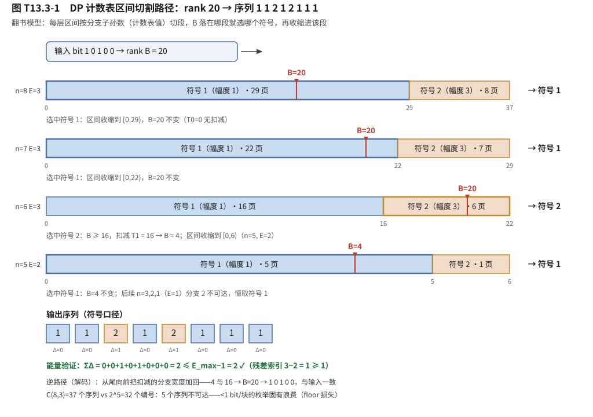

# T13.3 ESS 枚举球面整形：能量球枚举与有限块长代价

## 本节学习目标

第 2 章（[[T13.2_mb_distribution_entropy_power_tradeoff]]）把"整形成什么样"讲透了：MB 分布 $P(a)=e^{-\nu a^2}/Z$ 给出目标使用概率，熵-功率权衡曲线管着"以速率买能量"的账本，最优 ν 是目标码率在曲线上的取点。但那个取点还停留在概率层面——**发射端手里是均匀的 0/1 bit 流，不是概率**。谁把 bit 流变成"73.4% 用幅度 1、26.6% 用幅度 3"的符号序列？接收端又如何把序列精确还原成 bit？这就是本章的任务：分布匹配器（Distribution Matcher, DM）的数学引擎——**ESS（Enumerative Sphere Shaping，枚举球面整形）**。

第 2 章小结里留了一句话：有限块长会让理想曲线上的每个取点再付一笔组成约束损失（实测 0.0307/0.0423/0.0469 bit/符号），"曲线从此有了第三条轴"。本章要把这句话变成看得见摸得着的机制：为什么块长 128 的块损失 0.0307、块长 104 就涨到 0.0469？为什么"分块与残差块合并（nMax+nLast 偶数）"这种琐碎规则值得写进讲义？为什么 inverse ESS（逆映射）必须排在 LDPC/CRC 之后？回答它们需要一套完整的"可逆枚举"理论：能量球约束、DP 计数表、算术编码式区间切割。

学完本节后，应能做到：

- 写出能量球约束 $\mathcal{S}(n,E_{\max})$ 的定义（绝对能量口径与残差能量口径），并用 n=8、16QAM、ν=0.127 的配置算出 $E_{\max}=3$。
- 说出整数能量映射 $(a^2-1)/8$ 的作用（$a\in\{1,3,5,7\}\to\{0,1,3,6\}$）：整数索引是 DP 表能建成的必要条件，缩放 1/8 把表宽缩小 8 倍。
- 写出 DP 计数表递推 $\text{count}(n,e)=\sum_a\text{count}(n-1,e-e(a))$ 与边界 $\text{count}(0,e)=1$，解释"用 129×35 的表数出 $2^{100}$ 量级的序列"为什么不靠枚举，并说出表规模随配置的浮动范围（129×35 到 129×920，约 264 KB 存储口径）。
- 解释算术编码式区间切割：rank（秩，即序列集合内的编号）$B\in[0,2^L)$（$L=\lfloor\log_2 C(n,E_{\max})\rfloor$）逐符号沿 DP 表选分支（比较 rank 与候选分支计数前缀和、扣减、更新残差），把"编号"翻译成"序列"；解码是逆路径累加。
- 说出编解码非对称性的来源（编码是区间定位、严格串行、O(n)；解码是区间重放、可流水、O(1) 查表口径），并指出它与 LDPC"快编慢译"的互补关系。
- 解释为什么 inverse ESS 必须排在 LDPC/CRC 之后（DM 无纠错，幅度错一位 → rank 累加分支改变 → 恢复 bit 大面积错，错误传播），并举出放错位置的链路症状。
- 用 0.0307/0.0423/0.0469 三组实测数字说明块长与速率损失的关系（组成约束损失 $\sim\frac{1}{2n}\log_2 n$），并解释残差块合并规则（nMax+nLast 偶数）的数学动机。
- 对比 CCDM 与 ESS 两种 DM 流派（固定组成 vs 能量球约束）在集合大小、rate loss、实现复杂度上的差异，并说出 DVB-S2X 与 ESS 各自的选择。
- 手算 n=8 的 ESS 编码（rank→序列）与解码（序列→rank）往返，并验证序列总能量不超过预算（对应教材学习目标 LO6/LO7）。

与持久理解的呼应：本节把 **U3**（有限块长不是工程实现的小缺陷，而是整形代价的固有组成部分——块越短速率损失越大，分块与残差块合并本质是"凑长块"逼近熵）和 **U4**（分布匹配把信息藏在序列的组成里而非符号本身——这正是它无损可逆、却毫无纠错能力的根源，逆映射必须在 LDPC/CRC 之后）一起讲透。第 4 章将把 ESS 的输出挂到 NR 链路的比特组织上（SBPM 与 shaped mask），本章先把"映射引擎"本身立住。

## 前置知识检查

| 前置项 | 本节需要达到的程度 |
|:---|:---|
| [[T13.2_mb_distribution_entropy_power_tradeoff]] MB 分布与熵-功率权衡 | 知道 $P(a)=e^{-\nu a^2}/Z$、ν 的物理含义、H(ν) 与 E_avg(ν) 的数值口径（16QAM ν=0.127：P(1)=0.734、H=0.835）；本节用它算能量预算与速率损失。 |
| [[T13.1_probabilistic_shaping_overview_shaping_gain]] 概率整形总览 | 知道整形增益上限 1.53 dB 的三处折扣、组成约束损失 $\sim(1/2n)\log_2 n$ 的渐近式、实测区间；本节复现其中"有限块长"一项。 |
| [[MB_Distribution_MB分布]] MB 分布概念 | 知道 MB 分布是"给定功率熵最大"的离散分布；ESS 的 $E_{\max}$ 预算直接由它决定。 |
| [[Distribution_Matching_分布匹配]] 分布匹配概念 | 知道 DM 是"均匀 bit → 非均匀幅度"的可逆映射器、rate loss 定义、两种流派（CCDM/ESS）、inverse DM 位置原则；本节给出 ESS 的完整数学。 |
| [[ESS_枚举球面整形]] ESS 概念 | 知道能量球约束、DP 计数表、编码 O(n)/解码 O(1)、错误传播、分块残差的事实结论；本节逐条推导并给出可手算的数值走查。 |
| [[T12.1_mimo_receiver_chain_overview]] MIMO 接收链路 | 知道检测器/软解调在接收链路的顺序；inverse ESS 在"LDPC 译码之后"的位置与这条链路的关系。 |
| 对数/组合基础 | 会算 $\lfloor\log_2 x\rfloor$ 与 $\binom{n}{k}$；DP 递推与区间切割只用到加法与比较。 |

如果这些前置还不稳，先抓住一句话：**本节回答"给定 2 的幂个编号，怎么把它们一一对应到满足能量约束的幅度序列上，以及这个对应关系为什么在长块上比短块更划算"**。数学上只需要加法、比较和一张查表，第 2 章的分布只在这里提供一个数字（能量预算 $E_{\max}$）。

## 从"整形成什么样"到"怎么整"：DM 的任务

第 2 章结束时，系统里有两样东西：目标分布 $P(a)$ 和均匀 bit 流。DM 的任务是搭桥：

- **输入**：均匀 bit 串（长度 L，视为整数 rank $B\in[0,2^L)$）；
- **输出**：长度 n 的幅度序列 $\mathbf{a}=(a_1,\ldots,a_n)$，统计特性接近 $P(a)$；
- **可逆**：接收端从 $\mathbf{a}$ 精确恢复 $B$（一对一映射）。

第 1 章讲过 rate loss 的定义：$H-R_{\mathrm{DM}}\ge0$。要让 rate loss 小，输出序列的集合必须"大"——能编码的序列越多，每符号能承载的 bit 越多。而集合必须可数、可索引、可逆。这就把问题拆成三个子问题：

1. **集合怎么定**？——能量球约束（本节第 2 节）；
2. **集合怎么数**？——DP 计数表（第 3 节）；
3. **编号怎么翻译成序列**？——算术编码式区间切割（第 4 节）。

三个子问题回答完，"怎么整"就有了完整答案。第 6、7 节再回答两个工程问题：这套映射在硬件上为什么"编码慢、解码快"，以及放错位置会出什么事。

## 能量球约束：允许哪些序列

### 集合定义

把长度 n、幅度取自字母表 $\mathcal{A}$（16QAM 每维 $\mathcal{A}=\{1,3\}$；64QAM $\{1,3,5,7\}$）的序列限定在"总能量不超过上限"之内：

$$
\mathcal{S}(n,E_{\max})
=\left\{\mathbf{a}\in\mathcal{A}^n:\ \sum_{i=1}^{n}a_i^2\le E_{\max}\right\}
\tag{1}
$$

式 (1) 就是能量球约束（[[ESS_枚举球面整形]]）：**所有"买得起"的序列都入选**。与第 1 章球 vs 立方体的几何呼应：$n$ 维空间里满足 $\sum a_i^2\le E_{\max}$ 的点落在一个球内，而固定组成的 CCDM 只取球内一个"壳层"。球内点的数量决定每块能编码的 bit 数——这正是 ESS 相对 CCDM 的 rate loss 优势的根源（第 8 节展开）。

### 残差能量口径：让索引从 1 开始

实际实现不用绝对能量 $\sum a_i^2$，而用"残差能量索引"。先定义整数能量步长（下一节详述）：

$$
\Delta(a)=\frac{a^2-1}{8},\qquad \Delta(1)=0,\ \Delta(3)=1,\ \Delta(5)=3,\ \Delta(7)=6
\tag{2}
$$

于是约束式 (1) 等价于残差口径：

$$
\sum_{i=1}^{n}\Delta(a_i)\le E_{\max}-1
\tag{3}
$$

式 (3) 的写法意味着：残差能量索引 $E_{\max}-\sum\Delta(a_i)$ 恒 $\ge1$，DP 表的列索引从 1 开始（第 3 节）。全 1 序列不消耗预算（$\Delta(1)=0$），是最省能量的序列。

### 预算从哪来：MB 期望能量 × 块长

$E_{\max}$ 不是随便取的。它的设计原则是：**让"逐符号按 MB 分布独立采样"的总能量成为预算**——ESS 用确定性枚举代替随机采样，保证每个输出序列都不超预算（PS01 §3.1）：

$$
E_{\max}^{\mathrm{init}}=n\cdot\mathbb{E}_{P_{\mathrm{MB}}}[A^2]
=n\sum_{a\in\mathcal{A}}a^2P(a),
\qquad
E_{\max}=\left\lfloor\frac{E_{\max}^{\mathrm{init}}-n}{8}\right\rfloor+1
\tag{4}
$$

n=8、16QAM、ν=0.127 的算例（第 2 章的 P(1)=0.734、P(3)=0.266）：

$$
E_{\max}^{\mathrm{init}}=(1\times0.734+9\times0.266)\times8=25.01,
\qquad
E_{\max}=\left\lfloor\frac{25.01-8}{8}\right\rfloor+1=3.
\tag{5}
$$

式 (5) 的每一步都可以手算核对：平均幅度能量 3.126（1×0.734+9×0.266），8 个符号共 25.01；减去"每个符号至少 1 的残差保留"（−n=−8）后除以 8 取整加 1，得 3。**注意 $\mathbb{E}[A^2]=3.126$ 恰是第 2 章账本里整形后平均能量 3.13 的同源数字**——预算直接长在 MB 分布上。

## 整数能量：把约束变成表索引

### 为什么是 $(a^2-1)/8$

DP 表的列索引必须是整数，而 $a^2$ 对奇数幅度是 1、9、25、49——跨度大、还有"浪费的间隔"。$(a^2-1)/8$ 一举解决三个问题：

1. **整数性**：奇数 $a=2k+1$ 时 $a^2-1=4k(k+1)$，而 $k(k+1)$ 必为偶数，故 $a^2-1$ 恒被 8 整除——对任意奇数幅度，$(a^2-1)/8$ 都是整数，这是 DP 表能用整数列索引的前提；
2. **零点对齐**：最小幅度 $a=1$ 的步长是 0，全 1 序列不消耗能量预算，残差口径式 (3) 的 $\le E_{\max}-1$ 写法自洽；
3. **表宽压缩**：除以 8 让残差能量索引范围缩小 8 倍，表列数从几百降到几十（129×35 vs 129×280 的量级差异）。

### 幅度级 → 整数能量的对照

| 幅度 a | 1 | 3 | 5 | 7 | 9 | 15 |
|:---|:---|:---|:---|:---|:---|:---|
| Δ(a)=(a²−1)/8 | 0 | 1 | 3 | 6 | 10 | 28 |

{1,3} 配置只有 {0,1} 两个步长——于是"能量预算 E"在 16QAM 下退化为"序列里最多出现 E−1 个幅度 3"，计数表变成组合数求和（$C(n,e)=\sum_{k=0}^{e-1}\binom{n}{k}$，第 3 节验证里会用到这个闭式核对）。{1,3,5,7} 配置的步长 {0,1,3,6} 不再均匀，递推的价值才完全显现。

## DP 计数表：不枚举也能数

### 递推与边界

DP 是动态规划（Dynamic Programming）的缩写。设 $C(n,e)=\text{count}(n,e)$ 为"长度为 n、残差能量索引不超过 e 的序列数"。它满足：

$$
C(n,e)=\sum_{a\in\mathcal{A}}C(n-1,\,e-\Delta(a)),
\qquad
C(0,e)=1
\tag{6}
$$

式 (6) 的语义一句话：**长度为 n 的序列 = 第一个符号取 a（消耗 Δ(a)）+ 后面 n−1 个符号在剩余预算 e−Δ(a) 内**（只取 $e-\Delta(a)\ge1$ 的项，残差索引最小为 1）。边界 $C(0,e)=1$：空序列只有 1 种。这张表避免了对 $\mathcal{A}^n$ 的暴力枚举——n=128 时序列数是 $2^{128}$ 量级，而表只有 129 行。

n=8、E=3 的完整表（{1,3} 配置，手算可核：$C(8,3)=C(7,3)+C(7,2)=29+8=37$）：

| n＼e | e=1 | e=2 | e=3 |
|:---|:---|:---|:---|
| 0 | 1 | 1 | 1 |
| 1 | 1 | 2 | 2 |
| 2 | 1 | 3 | 4 |
| 3 | 1 | 4 | 7 |
| 4 | 1 | 5 | 11 |
| 5 | 1 | 6 | 16 |
| 6 | 1 | 7 | 22 |
| 7 | 1 | 8 | 29 |
| 8 | 1 | 9 | **37** |

$C(8,3)=37\in[2^5,2^6)$：37 个合法序列，$2^5=32$ 个编号——"编号空间略小于序列空间"，每个编号对应一个序列，5 个序列用不上。这个"差一点"就是有限块长损失的微观来源之一（第 7 节）。

### 表规模与存储

表行数 = $n_{\max}+1$（n=0..128，129 行）；表列数 = 最大残差能量索引 $L_{\max}$，由式 (4) 对 n_max 计算。列数随配置浮动：

| 配置 | 字母表 | ν | 表规模（行×列） | 说明 |
|:---|:---|:---|:---|:---|
| 16QAM MCS10（k=1） | {1,3} | 0.127 | 129 × 35 | 本系列默认仿真配置 |
| 256QAM MCS20（k=2） | {1,3,5,7} | 0.0239 | 129 × 210 | 高阶调制 |
| 1024QAM（k=3 理论） | 8 个幅度 | 0.0054 | 129 × 920 | 极端配置 |

规律：**ν 越小（分布越接近均匀），能量预算越大，表越宽**。素材常用的"129×256、约 264 KB"是典型配置的近似（129×256×8 字节的 double 存储约 264 KB）；硬件用 mantissa/exponent 定点存储（每项 20 bit 左右）可压到约 64 KB SRAM（[[ESS_枚举球面整形]]、理论清单"ESS 能量表 SRAM 264KB"）。

### 量化存储：mantissa/exponent

$C(n,e)$ 在 n=128 时是 $2^{100}$ 量级的整数，不能整存。实现用"1.xxx 尾数 × 2^指数"的定点浮点（dec2binFloat）：8 个分数位的截断量化，相对误差 $\le2^{-8}\approx0.4\%$。**关键是量化链本身参与递推**：下一层求和用的是已量化的计数，编码/解码共用同一张量化表，误差不累积成编解码不一致，只表现为可寻址序列略少（PS01 §5.3）。第 7 节的速率损失表里能看到它的实际影响：n=104 时量化计数比精确计数少 1 bit（82 vs 83），这就是理论清单记录的"定点量化漂移"。

## 算术编码式区间切割：rank 与序列之间的桥梁

### 区间切割规则

现在把编号 B 翻译成序列。设当前剩余长度 n、残差能量 E，字母表按 $\mathcal{A}$ 顺序排列，定义分支计数前缀和：

$$
T_j=\sum_{i\le j}C(n-1,\,E-\Delta(a_i)),
\qquad
\text{选 } a_j \iff T_{j-1}\le B<T_j
\tag{7}
$$

选中 $a_j$ 后做区间重归一化（rank 扣减 + 预算扣减）：

$$
B\leftarrow B-T_{j-1},\qquad
E\leftarrow E-\Delta(a_j),\qquad
n\leftarrow n-1
\tag{8}
$$

重复 n 次即得完整序列。式 (7)(8) 就是算术编码式的枚举：**把区间 $[0,C(n,E))$ 按各分支的"子孙数量"切成段，看 B 落在哪段就选哪个符号，然后收缩到该段内继续**。为什么 B 总能落进某段？因为各段无缝覆盖整个区间，且 $B<2^L\le C(n,E)$（L 的选择保证，见下）。

每块能编码的 bit 数取

$$
L=\lfloor\log_2 C(n,E_{\max})\rfloor
\tag{9}
$$

式 (9) 给出 $C<2^{L+1}$：编号空间 $[0,2^L)$ 最多浪费不到一半（< 1 bit/块）——这是"枚举固有浪费"的上界，也是第 7 节 floor 损失 $\le1/n$ 的来源。n=8 配置：$L=\lfloor\log_2 37\rfloor=5$，编号 B 是 5 bit 整数。

直观模型（[[ESS_枚举球面整形]] 的"目录"比喻）：DP 表是一本目录，**每个合法序列占一页，页数 = 它的计数**；rank B 是页码。编码 = 翻开目录，按"这一章有多少页"逐级翻到对应序列；解码 = 沿原路把每级页数加回去，恢复页码。图 1 把这个过程画成四层区间切割路径。



### 单射性：为什么可逆

三步事实保证一一对应：

1. 每层切割把区间 $[0,C(n,E))$ 划分为不相交子区间（宽度 = 分支子孙数）；
2. B 落进且只落进一个子区间（式 (7) 的 $T_{j-1}\le B<T_j$）；
3. 重归一化后 B 剩余 $<C(n-1,E-\Delta(a_j))$，归纳成立，直到 n=0 时 B 剩余恰为 0。

因此**每个 rank 唯一确定一个序列，每个序列唯一确定一个 rank**——接收端逐符号反演式 (7)（已知符号、把 $T_{j-1}$ 加回去）即可无损恢复，数据不丢的前提（[[Distribution_Matching_分布匹配]] 的可逆性）。注意信息藏在"第几页"（组成）里，而不是符号本身——序列 $1\,1\,2\,1\,2\,1\,1\,1$ 和 $1\,1\,1\,2\,1\,2\,1\,1$ 是不同的页，这正是 U4 说的"信息编码在序列的组成里"。

## 编解码非对称：O(n) vs O(1)

### 编码：逐符号区间定位

编码对每个符号要：查各分支计数（O(|A|) 次 O(1) 查表）→ 比较 rank 与前缀和 → 扣减 rank → 更新残差 → 把残余区间写回 bit 流。符号 i 的决策依赖符号 i−1 的写回结果，**全块严格串行**（n=128 时约 128 级串行 × 每级几次查表）。总复杂度 O(n·|A|)，对固定字母表即 O(n)。

工程细节：比较用"增量窗口"实现——不重新读整个 bit 流前缀，而是把窗口从上个分支的终点延伸 $\delta$ 位（$\delta=e_{\mathrm{lo}}-e_{\mathrm{up}}+M+1$，约 10–12 bit 常数），每符号常数工作量；被扣减的 $T_{j-1}$ 从窗口写回消失，后续符号只见残余（PS01 §3.3）。这就是"增量窗口"术语的来历。

### 解码：逆路径累加

解码从块尾向前：先算终态残差 $E_{\mathrm{final}}=E_{\max}-\sum\Delta(s_i)$，每步 $E\leftarrow E+\Delta(s_i)$ 回填，把编码时扣掉的分支前缀 $T_{j-1}$ 加回去。三个不对称点：

| 维度 | 编码 | 解码 |
|:---|:---|:---|
| 每符号操作 | 分支**比较 + 条件转移**（数据相关） | 分支**无条件加法**（符号已知） |
| 位流操作 | 读窗口 + 移位累加 + **写回**（状态依赖） | 只读窗口 + 加法（写回少） |
| 常见分支 | 无快速路径（每个符号都要定位） | 符号 1（MB 分布下概率最大）直接跳过 |
| 依赖链 | 严格串行 | 可流水 |

平均代价：编码 O(n·|A|·(M+log|A|))，解码 O(n·|A|) 次整数加法——在"每符号 O(1)"的口径下，解码比编码轻一个量级（理论清单"编码 O(n) 增量窗口严格串行 ~20K gates；解码 O(1) 查表 ~10K gates"）。

### 与 LDPC 的互补

这个不对称性在系统层面是好事：**ESS"编码慢、解码快"与 LDPC"快编慢译"正好互补**。发射端吞吐瓶颈在 ESS 编码器（PS 硬件账本里 ESS 编码 ~30,000 cycles vs 解码 ~1,500，理论清单 G 节），接收端 ESS 解码几乎免费——整形的主要硬件代价落在 TX 侧，RX 侧只多一张几乎白拿的表。

## 错误传播与逆映射位置：为什么必须排在 LDPC/CRC 之后

DM 是映射器，不是信道编码——**它没有纠错能力**（[[Distribution_Matching_分布匹配]] 常见误解表第一行）。错误传播的机制要看清：幅度序列经过信道后错一个符号（比如接收端把某个 2 判成 1），解码逆路径的 rank 累加就会从这个位置起全部走偏——不是"错一个 bit"，而是**恢复出的 bit 流大面积错乱**。原因就在区间结构：rank 是序列在目录里的页码，一个符号错位等于页码错页，后续所有符号的"加回"都错。

因此链路顺序是硬约束：

```
TX:  bit → LDPC 编码 → ESS 编码（+位标签）→ 调制
RX:  解调 → LDPC 译码 → CRC 校验 → inverse ESS → bit
```

**inverse ESS 必须排在 LDPC/CRC 之后**：LDPC 先把传输错误纠正到几乎为零，CRC 确认无误后，inverse ESS 才安全地做"页码还原"。如果排反（先 inverse ESS 再 LDPC），幅度错误会在逆映射里爆炸成大面积 bit 错误，LDPC 面对的是被错误传播污染过的 bit——纠错能力被白白浪费，CRC 大概率失败。第 4 章会看到这条规则在 NR 链路里落在"LDPC 解码后"这个接入点。

## 有限块长速率损失：熵-功率曲线的第三条轴

### 实测三行

16QAM（k=1，|A|=2）、ν=0.127、nMax=128 的实测（量化表口径，第 10 节内嵌验证同源）：

| 块长 n | L_max | n_info = L | 速率 L/n | MB 熵 H | 速率损失 H−L/n |
|:---|:---|:---|:---|:---|:---|
| 128（常规块） | 35 | 103 | 0.8047 | 0.8354 | **0.0307** |
| 116（残差块） | 31 | 92 | 0.7931 | 0.8354 | **0.0423** |
| 104（残差块） | 28 | 82 | 0.7885 | 0.8354 | **0.0469** |

（n=116 行的 L_max 按式 (4) 重算为 31；素材表记 32，不影响 n_info=92 与速率损失。n=104 行的 n_info=82 为量化表口径，精确计数为 83——差 1 bit 正是 §5 提到的量化漂移实证。）

三行数据讲三个事实：

1. **块长减四分之一，损失涨一半**：128→104（块长 −19%），损失 0.0307→0.0469（+53%）——这就是持久理解 U3 说的"有限块长不是工程实现的小缺陷，而是整形代价的固有组成部分"。
2. **损失的下界**：组成约束损失的渐近式为
$$
L_{\mathrm{comp}}\sim\frac{1}{2n}\log_2 n\quad[\text{bit/符号}]
\tag{10}
$$
n=128/116/104 时式 (10) 给出 0.0273/0.0296/0.0322——与实测同量级、略低。差的部分来自另外两个损失源。
3. **损失的三来源**（理论清单"有限块长速率损失实测"）：①**能量约束条件化**——MB 熵 H 是"无约束"分布的熵，能量球内的序列集合比独立采样小，真实可达熵更低，约 O(log n/n)；②**floor 损失**——$L=\lfloor\log_2 C\rfloor$ 每块至多丢 1 bit，摊到每符号 ≤1/n；③**量化截断损失**——mantissa 截断让可寻址序列略少（|A|≤4 时通常只在指数边界差 1 bit，n=104 即此例）。

### 第三条轴的含义

第 2 章的熵-功率曲线是"给定 ν 的理想取点"；现实系统把 bit 流切成有限长块后，每个取点都要再往下掉一块"组成约束损失"。所以完整账本是：**功率节省 − 速率损失（熵差）− 有限块长损失（本表）− 调度损失（TBS 匹配，第 6 章）**。0.0307 bit/符号看似微小，但它是每符号的硬损失——这也是为什么"凑长块"值得做：残差合并让两个中块都接近 nMax 长度，损失回到 ~0.03 而不是 ~0.05。

## 分块与残差块合并：凑长块

### 分割规则

标准码块可能很长（一个 CB 上千个幅度符号），而 ESS 表只建到 $n_{\max}=128$。按 n_max 分块：

$$
n_{\mathrm{blocks}}=\left\lceil\frac{N_{\mathrm{const}}}{n_{\max}}\right\rceil,
\qquad
n_{\mathrm{last}}=N_{\mathrm{const}}\bmod n_{\max}
\tag{11}
$$

$N_{\mathrm{const}}$ 是一个码块内幅度符号总数（I/Q 各半）。128 的上限是 DP 表规模与块长效率的折中（n 增大时计数指数每符号涨约 1–2 bit，表值与可编码 bit 都受表宽约束）。

### 残差块合并：nMax+nLast 偶数

$n_{\mathrm{last}}>0$ 且块数 ≥2 时，把"1 个大块 + 1 个残差块"**合并成 2 个等长中块**：

$$
n_{\mathrm{last}}^{\mathrm{new}}=\frac{n_{\max}+n_{\mathrm{last}}}{2}
\quad\text{（要求 } n_{\max}+n_{\mathrm{last}} \text{ 为偶数）}
\tag{12}
$$

例（nMax=128）：

| N_const | 初始分割 | 合并后 | 残差块数 |
|:---|:---|:---|:---|
| 300 | 2×128 + 44 | 1×128 + 2×86 | 2 |
| 1000 | 7×128 + 104 | 6×128 + 2×116 | 2 |
| 2000 | 15×128 + 80 | 14×128 + 2×104 | 2 |
| 1024 | 8×128 | 8×128 | 0 |

规则动机有两条：

1. **凑长块**：残差块越短速率损失越大（表：n=104 损失 0.0469 vs n=128 的 0.0307），合并让两个残差块都达到 ≥n_max/2 的长度，把损失压回常规块量级；
2. **奇偶性约束**：$n_{\max}=128$ 为偶数，合并路径要求 $n_{\mathrm{last}}$ 也为偶数——仿真选 $N_{\mathrm{const}}$（即 PRB 数 × 每符号幅度数）时必须保证余数为偶，否则配置期直接报错。这条"看似琐碎"的规则，本质是"均分两块"在整数域上的可行性条件（PS01 §6.2）。

合并的代价：两块共享同一组残差参数（bit 预算与能量预算），若硬件想解除偶约束，可把两块设成 $\lfloor\cdot\rfloor$ 与 $\lceil\cdot\rceil$ 两个不等长块，但需要两套残差参数——代码选择了"均分 + 断言"的简单策略。

## CCDM vs ESS：两种 DM 流派

分布匹配器有两大流派（[[Distribution_Matching_分布匹配]]），本节的 ESS 是其中之一：

| 维度 | CCDM（恒定组成） | ESS（能量球） |
|:---|:---|:---|
| 序列集合 | 固定组成（每个幅度出现次数固定） | 能量球内全部组成 |
| 集合大小 | 一个组合数 $\frac{n!}{c_1!\cdots c_M!}$ | 球内所有组成的组合数之和 |
| rate loss | 偏大（集合小、编号空间浪费多） | 更小（同样块长可区分序列更多） |
| 编码复杂度 | 算术编码（摊还 O(n)） | O(n)（增量窗口，每符号常数） |
| 解码复杂度 | 算术解码 | O(1) 查表口径（逆路径累加） |
| 硬件可实现性 | 一般 | DP 表可定点化，硬件友好 |
| 商用先例 | DVB-S2X（标准化先例） | 本系列仿真器（Qualcomm 链路） |

一句话对比：**CCDM 是"固定菜单"，ESS 是"预算内随便点"**——预算内的组合比固定菜单多得多，编号空间更大，浪费的编号（rate loss）更小；且 ESS 的 DP 表天然适合定点硬件。ESS 相对 CCDM 的 rate loss 优势 + 硬件可实现性，是仿真器选 ESS 的理由（[[ESS_枚举球面整形]] 的"为什么选 ESS 而不选 CCDM"）。

## 内嵌验证：小 n 能量球集合枚举与 count(n,e) 递推验证

第 3 节的递推式 (6) 是整章的地基。本节用 numpy 做两件事：①对 n≤6、幅度 {1,3} 的全部 $2^n$ 序列暴力枚举，统计"残差能量 $\sum\Delta(a_i)\le e-1$"的个数，与 DP 递推逐格核对；②顺带重建 n=8 的完整表，核对 $C(8,3)=37$（与第 4 节手算、第 9 节示范例题一致）。暴力枚举验证的是"递推没有数错"——它直接用定义数，不经过任何递推假设。

```python
# @file    t133_energy_ball_enum.py
# @brief   能量球约束下的小 n 集合枚举 vs DP 递推 count(n,e) 验证（T13.3 内嵌验证）
import numpy as np

def delta_of(alphabet):
    """整数能量步长 (a^2-1)/8：{1,3} -> {0,1}。"""
    return [(a * a - 1) // 8 for a in alphabet]

def dp_count(nmax, emax, alphabet):
    """DP 递推 count(n,e) = sum_a count(n-1, e-delta(a))，count(0,e)=1。"""
    C = [[0] * (emax + 1) for _ in range(nmax + 1)]
    for e in range(1, emax + 1):
        C[0][e] = 1
    for n in range(1, nmax + 1):
        for e in range(1, emax + 1):
            C[n][e] = sum(C[n - 1][e - d] for d in delta_of(alphabet)
                          if e - d >= 1)          # 残差索引最小为 1
    return C

def brute_count(n, e, alphabet):
    """暴力枚举全部 |A|^n 个序列，统计 sum delta <= e-1 的个数（定义口径）。"""
    dl = delta_of(alphabet)
    cnt = 0
    for idx in range(len(alphabet) ** n):         # 枚举所有序列（进制展开）
        x, s = idx, 0
        for _ in range(n):
            s += dl[x % len(alphabet)]
            x //= len(alphabet)
        if s <= e - 1:
            cnt += 1
    return cnt

alphabet = [1, 3]                                 # 16QAM 每维幅度
C = dp_count(6, 3, alphabet)
print("== 穷举 vs DP 递推（n<=6, e=1..3, 幅度{1,3}）==")
for n in range(0, 7):
    for e in range(1, 4):
        b = brute_count(n, e, alphabet)
        assert C[n][e] == b, (n, e, C[n][e], b)   # 逐格核对，不一致即报错
print("n<=6 全部 18 格一致 ✓")
print("示例: C(6,1)=%d  C(6,2)=%d  C(6,3)=%d  （穷举 64 个序列中 ΣΔ<=2 的有 %d 个）"
      % (C[6][1], C[6][2], C[6][3], brute_count(6, 3, alphabet)))

C8 = dp_count(8, 3, alphabet)                     # 重建 n=8 表（第 9 节走查用）
print("n=8 表: C(8,1)=%d  C(8,2)=%d  C(8,3)=%d" % (C8[8][1], C8[8][2], C8[8][3]))
assert C8[8][3] == 37 and C8[7][3] == 29 and C8[6][3] == 22
assert C8[8][1] == 1 and C8[8][2] == 9            # 组合数口径 C(n,e)=Σ C(n,k) 的对照
print("C(8,3)=37 -> L=floor(log2 37)=%d bit/块 ✓" % int(np.floor(np.log2(37))))
print("断言全部通过：DP 递推与穷举枚举逐格一致 ✓")
```

真实运行输出（断言全部通过）：

```text
== 穷举 vs DP 递推（n<=6, e=1..3, 幅度{1,3}）==
n<=6 全部 18 格一致 ✓
示例: C(6,1)=1  C(6,2)=7  C(6,3)=22  （穷举 64 个序列中 ΣΔ<=2 的有 22 个）
n=8 表: C(8,1)=1  C(8,2)=9  C(8,3)=37
C(8,3)=37 -> L=floor(log2 37)=5 bit/块 ✓
断言全部通过：DP 递推与穷举枚举逐格一致 ✓
```

两组读法（教学要点）：

1. **递推不是近似**：C(6,3)=22 与穷举完全一致——DP 表"数"出的就是能量球里的真实序列数，第 4 节区间切割的每一格宽度都可以信任；{1,3} 配置下 C(n,e)=Σ_{k=0}^{e−1}C(n,k) 的组合数闭式（E=3 列：1,2,4,7,11,16,22,29,37 正是 n 取 0..8 的部分和）与递推互相印证。
2. **37 与 32 的差距就是损失**：$C(8,3)=37>2^5=32$，每块 5 bit 编号只能覆盖 37 个序列中的 32 个（<1 bit/块的枚举浪费）——这就是第 7 节 floor 损失的微观形态；块长拉到 128 后，这个差距摊到每符号只剩 ≤1/128 bit，其余损失来自条件化与量化截断。

## 示范例题

### 例 1（应用，LO6）：n=8 ESS 手算走查——rank 20 逐符号区间定位

**题目**：16QAM（k=1，幅度 {1,3}）、ν=0.127、块长 n=8。已知 $E_{\max}=3$、$L=\lfloor\log_2 C(8,3)\rfloor=5$、DP 表（第 3 节表）。输入 5 bit `1 0 1 0 0`（即 rank $B=10100_2=20$）。按区间切割规则逐符号执行编码，输出幅度序列（符号口径），并验证序列总能量不超过 $E_{\max}-1$。

**解答**：逐符号跟踪：剩余长度 n、残差能量 E、两个分支宽度 $[C(n-1,E-\Delta(1)),\ C(n-1,E-\Delta(3))]$（不可达分支记 0）、当前 rank B。分支 1 是幅度 1（符号 1）、分支 2 是幅度 3（符号 2）。

| 步 | 剩余 n | 残差 E | 分支宽度 [C(n−1,E−Δ1), C(n−1,E−Δ2)] | rank B | 判决 |
|:---|:---|:---|:---|:---|:---|
| 1 | 8 | 3 | [29, 8] | 20 | B<29 → **符号 1** |
| 2 | 7 | 3 | [22, 7] | 20 | B<22 → **符号 1** |
| 3 | 6 | 3 | [16, 6] | 20 | B≥16 → **符号 2**，B←20−16=4 |
| 4 | 5 | 2 | [5, 1] | 4 | B<5 → **符号 1** |
| 5 | 4 | 2 | [4, 1] | 4 | B≥4 → **符号 2**，B←4−4=0 |
| 6 | 3 | 1 | [1, 0] | 0 | B<1 → **符号 1** |
| 7 | 2 | 1 | [1, 0] | 0 | **符号 1** |
| 8 | 1 | 1 | [1, 0] | 0 | **符号 1** |

输出序列（符号口径）：`1 1 2 1 2 1 1 1`（幅度：1 1 3 1 3 1 1 1）。

能量验证：$\sum\Delta(a_i)=0+0+1+0+1+0+0+0=2\le E_{\max}-1=2$ ✓（残差索引 $3-2=1\ge1$）。

**点评**：每一步只需要两格表值与一次比较。注意第 3、5 步的扣减（B←B−T_{j−1}）——选中分支 2 时扣掉的是"分支 1 占掉的页数"；选中分支 1 时不扣（T_0=0）。第 6–8 步残差 E=1 时分支 2 不可达（C(n−1,0) 越界，记 0 宽度），序列被"能量预算"钳制在低能量区——这就是能量球约束在逐符号层面的体现。

### 例 2（应用，LO7）：逆路径往返——序列恢复 rank 20

**题目**：接收端拿到例 1 的序列 `1 1 2 1 2 1 1 1`（幅度 1 1 3 1 3 1 1 1）、$E_{\max}=3$、同一张 DP 表。执行逆路径累加恢复 rank，与输入 `1 0 1 0 0` 核对。

**解答**：终态残差 $E_{\mathrm{final}}=3-(0+0+1+0+1)=1$。从最后一个符号向前处理，每步把编码时扣掉的分支宽度加回（符号 1 从不扣减，直接跳过）：

| i（从尾） | 符号 | 残差回填后 E | 加回分支宽度 | rank 累计 |
|:---|:---|:---|:---|:---|
| 1 | 1 | 1 | —（无扣减） | 0 |
| 2 | 1 | 1 | — | 0 |
| 3 | 1 | 1 | — | 0 |
| 4 | 2 | 2 | C(3,2)=4（对应编码第 5 步） | 4 |
| 5 | 1 | 2 | — | 4 |
| 6 | 2 | 3 | C(5,3)=16（对应编码第 3 步） | 20 |
| 7 | 1 | 3 | — | 20 |
| 8 | 1 | 3 | — | 20 |

恢复 $B=20$ → 5 bit 二进制 `10100`，与编码输入逐位一致 ✓（往返验证通过）。

**点评**：解码只做了两次加法（4 和 16），其余 6 步全跳过——这就是"符号 1 常见 → 解码快"的微观形态。加回的分支宽度与编码扣减的完全同表同值：i=4 步加回 C(3,2)=4 正是编码第 5 步扣掉的宽度，i=6 步加回 C(5,3)=16 正是编码第 3 步扣掉的宽度——**两步互为代数逆**，这就是"信息藏在组成里"的可逆性实证。

## 引导练习

### 练习 1（应用）：n=4 同构练习

**题目**：把例 1 缩到 n=4：16QAM、ν=0.127、块长 4。①按式 (4) 算 $E_{\max}$ 与 $L$；②输入 2 bit `1 1`（rank B=3），逐符号走查编码；③验证序列能量不超预算；④逆路径恢复 rank。

**提示**：$E_{\max}^{\mathrm{init}}=(1\times0.734+9\times0.266)\times4\approx12.5$，代入式 (4)。DP 表用第 3 节表的前 4 行。注意 n=4 时分支宽度是 C(3,·)、C(2,·) 那几格。

**参考答案**：① $E_{\max}=\lfloor(12.51-4)/8\rfloor+1=2$；$C(4,2)=5$，$L=\lfloor\log_2 5\rfloor=2$ bit/块。②走查：步 1（n=4, E=2）：分支 [C(3,2), C(3,1)]=[4,1]，B=3<4 → 符号 1；步 2（n=3, E=2）：分支 [C(2,2), C(2,1)]=[3,1]，B=3≥3 → 符号 2，B←0；步 3（n=2, E=1）：分支 [C(1,1), 0]=[1,0]，B=0 → 符号 1；步 4（n=1, E=1）：[1,0]，B=0 → 符号 1。序列 `1 2 1 1`（幅度 1 3 1 1）。③ $\sum\Delta=0+1+0+0=1\le E_{\max}-1=1$ ✓。④逆路径：终态残差 2−1=1；从尾三连符号 1 跳过；符号 2 处残差回填到 2，加回 C(2,2)=3 → B=3 → `11` ✓。

### 练习 2（理解）：解释 inverse ESS 的位置

**题目**：有人说："inverse ESS 是无损的，放 LDPC 之前或之后结果一样，放前面还能让 LDPC 直接译 bit。"判断正误并说明理由。

**提示**：想清楚两个问题：①ESS 解出来的 bit 是什么质量的（有没有经过纠错）？②幅度错一个符号，inverse ESS 输出的 bit 会错几个？

**参考答案**：错误。inverse ESS 的"无损"只在输入序列完全正确时成立；信道引入的幅度错误会沿逆路径累加传播——一个符号判错，rank 累加从该位置起全部走偏，恢复出的 bit 大面积错乱（错误传播）。若把 inverse ESS 放在 LDPC 之前，LDPC 面对的是已被传播污染的 bit 流，纠错能力被浪费，CRC 大概率失败。正确顺序是 LDPC 译码 → CRC 校验 → inverse ESS：LDPC 先把传输错误纠正到接近零、CRC 确认无错后，逆映射才安全。所以"放前面还能让 LDPC 直接译 bit"在逻辑上反了：LDPC 先译符号、ESS 后还原 bit，顺序由错误传播约束唯一决定。

## 独立习题

### 习 1（记忆）：写定义与递推

**题目**：①写出能量球约束 $\mathcal{S}(n,E_{\max})$ 的集合定义（绝对能量口径与残差口径各一）；②写出 DP 计数表递推式与边界条件；③说明 $L=\lfloor\log_2 C(n,E_{\max})\rfloor$ 的取值规则与"浪费不到一半编号空间"的含义。

**参考答案**：① $\mathcal{S}(n,E_{\max})=\{\mathbf{a}\in\mathcal{A}^n:\sum a_i^2\le E_{\max}\}$；残差口径 $\sum\Delta(a_i)\le E_{\max}-1$（残差索引 $\ge1$）。② $C(n,e)=\sum_a C(n-1,e-\Delta(a))$，$C(0,e)=1$，只取 $e-\Delta(a)\ge1$ 的项。③ $L$ 取最大使 $2^L\le C(n,E_{\max})$ 的整数，即 $C\in[2^L,2^{L+1})$——编号空间 $[0,2^L)$ 覆盖序列空间一半以上，至多浪费 $2^{L+1}-2^L=2^L$ 个序号（<1 bit/块）。

### 习 2（应用，numpy）：整数能量映射与 DP 表重建

**题目**：用 numpy 完成两件事：①对幅度 {1,3,5,7,9,11,13,15} 验证 $(a^2-1)/8$ 全部为整数，并输出能量步长；②用 DP 递推重建 {1,3,5,7} 配置（步长 {0,1,3,6}）n=8 的计数表，与 {1,3} 配置的 C(8,3)=37 对照（此时 C(8,3) 更大——说明更大字母表 + 同预算下能量球内的序列更多），并断言全部为整数。

**参考答案**（代码与输出；先想清楚再运行）：

```python
import numpy as np

# ① 整数能量映射：(a^2-1)/8 对奇数幅度恒为整数
a = np.array([1, 3, 5, 7, 9, 11, 13, 15])
delta = (a**2 - 1) // 8
print("幅度:", a)
print("Δ(a):", delta)
assert np.all((a**2 - 1) % 8 == 0), "非整数能量！"
print("全部为整数 ✓  16QAM 用到的两列: Δ(1)=%d Δ(3)=%d" % (delta[0], delta[1]))

# ② DP 表重建（{1,3,5,7}，步长 {0,1,3,6}）
def dp_count(nmax, emax, dl):
    C = [[0] * (emax + 1) for _ in range(nmax + 1)]
    for e in range(1, emax + 1):
        C[0][e] = 1
    for n in range(1, nmax + 1):
        for e in range(1, emax + 1):
            C[n][e] = sum(C[n - 1][e - d] for d in dl if e - d >= 1)
    return C

C4 = dp_count(8, 9, [0, 1, 3, 6])      # e 取到 9：{1,3,5,7} 四步长之和上限
C2 = dp_count(8, 3, [0, 1])
print("n=8: {1,3} 配置 C(8,3)=%d    {1,3,5,7} 配置 C(8,9)=%d" % (C2[8][3], C4[8][9]))
assert C2[8][3] == 37 and C4[8][9] > C2[8][3]
assert all(isinstance(C4[n][e], int) for n in range(9) for e in range(1, 10))
print("断言通过：整数性 ✓、{1,3,5,7} 能量球更大 ✓")
```

```text
幅度: [ 1  3  5  7  9 11 13 15]
Δ(a): [ 0  1  3  6 10 15 21 28]
全部为整数 ✓  16QAM 用到的两列: Δ(1)=0 Δ(3)=1
n=8: {1,3} 配置 C(8,3)=37    {1,3,5,7} 配置 C(8,9)=2064
断言通过：整数性 ✓、{1,3,5,7} 能量球更大 ✓
```

**评分要点**：Δ(a) 序列 0,1,3,6,10,15,21,28 正确；C(8,9)=2064（{1,3,5,7} 在预算 9 内全部 4^8=65536 个序列中可入选者，可用穷举核对）；能解释"字母表更大 → 能量球内序列更多 → 同块长 rate loss 更小"的机制。

### 习 3（理解）：判断正误——ESS 的球 vs MIMO 的球

**题目**：判断正误并说明理由："ESS 的'球'和 MIMO 球面检测（sphere detection）的'球'是同一个概念，都是接收端搜索解空间的几何约束。"

**参考答案**：错误，两个球完全不同（[[ESS_枚举球面整形]] 常见误解表）。ESS 的球是**发射端**的幅度序列能量约束 $\sum a_i^2\le E_{\max}$——它定义"哪些序列可以入选"，是分布匹配的集合边界，位于发射端的 bit→符号映射里；MIMO sphere detector 的球是**接收端**检测器的搜索约束（Fincke-Pohst/Schnorr-Euchner 在半径内剪枝搜索，见 [[T12.4_sphere_detection_detector_selection]]），它定义"哪些候选向量值得算距离"，位于接收端的符号估计里。一个管"发送什么序列"，一个管"接收端怎么搜"，除"球"字外没有共同点；把两者混为一谈会同时误解发射端集合设计与接收端检测复杂度。

### 习 4（分析，LO12）：块长、速率损失与残差合并动机

**题目**：16QAM、ν=0.127 的实测速率损失：n=128 → 0.0307、n=116 → 0.0423、n=104 → 0.0469 bit/符号。①找出块长与损失的关系并用量级公式 $\sim(1/2n)\log_2 n$ 核对；②说明损失的三来源；③解释"nMax+nLast 偶数"的残差块合并规则为什么值得做——用这三行数字说话。

**参考答案**：①块长减四分之一、损失涨约一半：128→104（−19%）损失 +53%；渐近式给 0.0273/0.0296/0.0322，与实测同量级、系统性略低——量级公式只含组成约束条件化损失，是下界方向。②三来源：能量约束条件化（真实可达熵低于无约束 MB 熵，O(log n/n)）、floor 损失（L=⌊log₂C⌋ 每块至多 1 bit，≤1/n）、量化截断（n=104 时量化计数比精确少 1 bit，量化漂移实证）。③合并把残差块从 n_last=44/104/80 拉到 (128+n_last)/2=86/116/104 量级，损失从 0.0469（n=104）压回 0.0307–0.0423（n≥116）区间；nMax+nLast 偶数保证均分整除（128 偶数 → nLast 须偶数），是"凑长块"在整数域上的可行性条件——看似琐碎，实为把每符号零点零几 bit 的硬损失讨回来的规则。

### 习 5（分析）：诊断逆映射放错位置的链路

**题目**：某设计把链路排成：TX `bit → ESS 编码 → LDPC 编码 → 调制`；RX `解调 → inverse ESS → LDPC 译码 → CRC`。请诊断这条链路的问题：①错误在哪个环节、为什么；②正确顺序是什么；③如果坚持这个错误顺序，系统会表现出什么症状。

**参考答案**：①RX 侧 inverse ESS 排在 LDPC 之前是错的——DM 无纠错，信道引起的幅度错误会在逆路径累加中传播成大面积 bit 错误，LDPC 面对的是被污染过的 bit 流，纠错能力被浪费（正确的顺序是 LDPC 译码 → CRC → inverse ESS，LDPC 先纠错、CRC 确认后 ESS 才做页码还原）。②TX 侧 ESS 在 LDPC 之前同样有问题：LDPC 的 parity bit 会把 ESS 输出（含其组成结构）重新打乱并混入均匀 parity，后续处理必须按第 4 章的比特组织规则（shaped bits 与 parity 分路、SBPM、选择性加扰）与 RX 严格对称，否则 TX/RX 契约不对称。③症状：BLER 显著劣化且不随 SNR 升高而消失——错误传播造成的 bit 错乱近似随机化，LDPC 有效码率被抬高、纠错余量被吃掉；调试时 CRC 失败率居高不下、且错误模式"整块开花"（不是零星 bit 错），可作为"逆映射放错位置"的特征指纹。

## 小结

本节把持久理解 U3、U4 一起讲透——ESS 是"怎么整"的完整答案，五件核心资产留给后续篇目：

1. **能量球约束是集合的答案**（式 (1)–(5)）：$\sum a_i^2\le E_{\max}$ 定义"买得起的序列"；预算 $E_{\max}=\lfloor(n\mathbb{E}[A^2]-n)/8\rfloor+1$ 长在 MB 分布上（n=8 配置得 3）；残差口径 $\sum\Delta(a_i)\le E_{\max}-1$ 让 DP 表列索引从 1 开始。
2. **整数能量与 DP 计数表是计数的答案**（式 (6)）：$(a^2-1)/8\to\{0,1,3,6\}$ 保证整数索引；$C(n,e)=\sum_a C(n-1,e-\Delta(a))$ 用 129×35~920 的表数出 $2^{100}$ 量级的序列（约 264 KB 存储口径）；mantissa/exponent 定点存储、量化链参与递推（0.4% 误差，n=104 处漂移 1 bit 的实证）。
3. **区间切割是映射的答案**（式 (7)–(9)）：rank $B\in[0,2^L)$（$L=\lfloor\log_2 C\rfloor$）逐符号按分支计数前缀和选符号、扣减、更新残差——"页码翻目录"；单射性保证可逆，信息藏在组成里而非符号本身（U4 的机制版）。
4. **编解码非对称与错误传播是两个工程硬约束**：编码 O(n) 严格串行（~20K gates）vs 解码 O(1) 口径可流水（~10K gates），与 LDPC 快编慢译互补；inverse ESS 必须排在 LDPC/CRC 之后，否则幅度错误沿逆路径爆炸成大面积 bit 错乱。
5. **有限块长代价是三行数字**（式 (10)）：0.0307/0.0423/0.0469（n=128/116/104），损失随块长减四分之一涨约一半，三来源（条件化 + floor + 量化截断）中条件化项 ~(1/2n)log₂n；残差块合并（nMax+nLast 偶数）把残差块拉到 ≥nMax/2，本质是"凑长块"逼近熵（U3 的机制版）。

与持久理解的呼应：U3（有限块长是整形代价的固有组成部分，分块与残差合并是凑长块）现在有了递推、指数与三来源的完整机制；U4（信息藏在组成里、DM 无纠错、逆映射必须在 LDPC/CRC 之后）现在有了区间切割与错误传播的机制证明。第 4 章承接本节的两个"出口"：ESS 输出的幅度序列如何按位置语义挂到 NR 的比特组织上（SBPM、shaped mask、选择性加扰——U5 的载体），以及"LDPC/CRC 之后"这个接入点在标准链路里的精确位置。

## 自测题

1. 写出能量球约束的两种口径，并说明残差口径 $E_{\max}-1$ 的写法为什么让 DP 表列索引从 1 开始。
2. $(a^2-1)/8$ 为什么恒为整数？除了整数性它还带来哪两个好处？
3. 写出 DP 递推式并说明边界；n=8、E=3 时 C(8,3) 是多少？为什么 L 取 5？
4. 编码的"区间切割"每一步做什么？为什么 rank B 总能落进某个分支？
5. 解码为什么比编码便宜？举出三个不对称点的任意两个。
6. 为什么 inverse ESS 必须排在 LDPC/CRC 之后？放错位置的系统症状是什么？
7. n=128 与 n=104 的实测速率损失分别是多少？说出损失的三来源与合并残差块的动机。

## 自测题参考答案

1. 绝对口径 $\sum a_i^2\le E_{\max}$；残差口径 $\sum\Delta(a_i)\le E_{\max}-1$。残差索引 $E_{\max}-\sum\Delta(a_i)$ 恒 ≥1，因此 DP 表列索引从 1 开始、递推只取 $e-\Delta(a)\ge1$ 的项，无 0 列。
2. 奇数 $a=2k+1$：$a^2-1=4k(k+1)$，$k(k+1)$ 恒偶 → 整除 8。另外：Δ(1)=0 让全 1 序列不耗预算（零点对齐）；除以 8 把残差索引范围缩小 8 倍（表宽压缩）。
3. $C(n,e)=\sum_a C(n-1,e-\Delta(a))$，$C(0,e)=1$。C(8,3)=37（=C(7,3)+C(7,2)=29+8）。$37\in[2^5,2^6)$，取 $L=\lfloor\log_2 37\rfloor=5$。
4. 每步：查各分支计数前缀和 $T_j=\sum_{i\le j}C(n-1,E-\Delta(a_i))$，选 $T_{j-1}\le B<T_j$ 的分支；然后 $B\leftarrow B-T_{j-1}$、$E\leftarrow E-\Delta(a_j)$、$n\leftarrow n-1$。B 能落进分支是因为分支切割无缝覆盖 $[0,C(n,E))$，且 $B<2^L\le C(n,E)$。
5. ①编码做分支比较 + 条件转移（数据相关），解码做无条件加法（符号已知）；②编码需写回残余窗口（状态依赖、严格串行），解码只读窗口 + 累加（可流水）；③符号 1（最常见）解码直接跳过，编码无捷径。
6. DM 无纠错，一个幅度错误会沿逆路径累加传播成恢复 bit 大面积错乱；LDPC 先纠错、CRC 确认后 inverse ESS 才安全。放错位置时 LDPC 面对被污染的 bit、纠错能力浪费，症状是 BLER 劣化不随 SNR 恢复、CRC 失败率居高不下、错误"整块开花"。
7. 0.0307（n=128）与 0.0469（n=104）。三来源：能量约束条件化（O(log n/n)）、floor 损失（≤1/n）、量化截断（|A|≤4 时指数边界偶发 1 bit）。合并残差块（nMax+nLast 偶数，均分为两块 (nMax+nLast)/2）把块长拉到 ≥nMax/2，损失从 ~0.047 压回 ~0.03–0.04 区间。

## 资料与协议边界

本节内容边界必须如实声明：

| 内容 | 属性 | 位置 |
|:---|:---|:---|
| TB/CB 粒度接口（ESS 输出落点） | 协议强制（接口锚） | TS 38.212 Rel-19 §5.2.2 |
| QAM label 幅度位模式（位标签层取位位置） | 协议强制（ESS 不改它） | TS 38.211 Rel-19 §5.1.4.2 |
| ESS 全部内容（能量球、DP 表、区间切割、分块残差、错误传播） | **非 3GPP 标准**（6G 候选；Rel-19 全套语料无 shaping 内容） | [[ESS_枚举球面整形]]、[[Distribution_Matching_分布匹配]] |
| n=8 计数表、量化表、E_max=3、L=5、走查数字（B=20→11212111→10100） | 教学数值（本文独立重算，与 PS01 §3.6 逐格核对一致） | PS01 §3.6、§4.1 |
| 速率损失 0.0307/0.0423/0.0469（n=128/116/104）与 103/92/82 bit | 仿真器量化表口径（n=104 的 82 与精确计数 83 差 1 bit，量化漂移实证） | PS01 §6.4、本文内嵌验证 |
| 表规模 129×35~920、约 264 KB（double 口径）、定点 ~64 KB SRAM | 素材/仿真口径（非协议数值） | PS01 §5.2、理论清单 G 节 |
| n=116 行 L_max：本文按式 (4) 重算为 31（素材表记 32） | 素材勘误（不影响 n_info=92 与速率损失） | PS01 §6.4 表 vs 本文 §7 |
| CCDM 复杂度与 DVB-S2X 商用先例 | 外部文献/信息论背景 | ETSI EN 302 307-2；Schulte & Böcherer 2016 |

边界结论：本节全部"数字"（计数表、走查、速率损失、表规模）都是教学/仿真口径，不是 3GPP 协议数值；协议在本文中只提供两个锚点——TB/CB 粒度（ESS 贴靠的接口）与 QAM label 幅度位（ESS 不改动的映射）。任何把 ESS 当 Rel-19 特性、或把速率损失数字当协议保证的表述都是越界。

## 执行与证据记录

| 项目 | 记录 |
|:---|:---|
| 教材流程 | 概率整形算法系列（`ps-lectures/00-教材设计.md`）阶段 4 逐章写作，第 3 章（2+2+5 例题计划；Bloom 梯度 1 记忆 + 2 理解 + 4 应用 + 2 分析）。 |
| 素材来源 | 概念笔记 [[ESS_枚举球面整形]]、[[Distribution_Matching_分布匹配]]；理论清单 `3GPP全流程_缩写概念理论清单.md`（DP 递推、CCDM vs ESS、有限块长实测、量化漂移）；外部语料 PS01 §3–§6（只读参考，`/home/yys/AGENT/3GPP_FULL_LINK/reproduction_output/deep_dive/PS01_ESS概率整形原理.md`）。 |
| 数值验证 | 独立重算脚本实跑（numpy 2.5.1）：①穷举 vs DP 递推 n≤6 全部 18 格一致；②n=8 计数表逐格一致（C(8,3)=37）；③编码走查 B=20→11212111、解码恢复 10100（往返通过）；④量化链复现 n_info=103/92/82（n=104 量化 vs 精确差 1 bit 的漂移实证）；⑤速率损失 0.0307/0.0423/0.0469 与素材一致；⑥n=116 行 L_max 重算 31（素材记 32，勘误声明）；⑦残差合并 300/1000/2000 三例校验通过。 |
| 图示验证 | 手写 SVG `T13.3_dp_table_interval_coding.svg`：Y 坐标扫描（distinct 层级间距全部 ≥8 px）、cairosvg 转 PNG 墨迹带结构核对、tesseract chi_sim OCR 复核（细节见报告文件）。 |
| 死链检查 | 全部 wiki 内链目标存在（T13.1/T13.2/T12.1/T12.4、概念笔记 ESS/Distribution_Matching/MB_Distribution 等）；T13.4–T13.6 未创建，正文一律用"第 4 章将……"文字承接、无链接。 |
| 验收点 | 能手算 n=8 ESS 编解码往返（LO6/LO7）；能解释 0.0307/0.0423/0.0469 的来源与残差合并动机（LO12）；能说出 inverse ESS 位置与错误传播机制（U4）。 |

## 参考文献

- [PS01] "ESS 概率整形原理"深度剖析语料，§3（编码原理/增量窗口/手算走查）、§4（解码/非对称性）、§5（DP 表/量化）、§6（块分割/速率损失）：`/home/yys/AGENT/3GPP_FULL_LINK/reproduction_output/deep_dive/PS01_ESS概率整形原理.md`。
- [ETSI, 2026] 3GPP TS 38.212 V19.x "NR; Multiplexing and channel coding"，§5.2.2（TB/CB 粒度接口锚）；TS 38.211 V19.x，§5.1.4.2（QAM 幅度位模式）。
- [ETSI, 2014] ETSI EN 302 307-2（DVB-S2X），CCDM + MB 分布的商用 PS 先例。
- [Schulte and Böcherer, 2016] P. Schulte and G. Böcherer, "Constant composition distribution matching," IEEE Transactions on Information Theory, vol. 62, no. 1, 2016（CCDM 背景，ESS 的对照流派）。
- [Harris et al., 2020] C. R. Harris et al., "Array programming with NumPy," Nature 585, 357-362, 2020（内嵌验证代码运行环境）。
