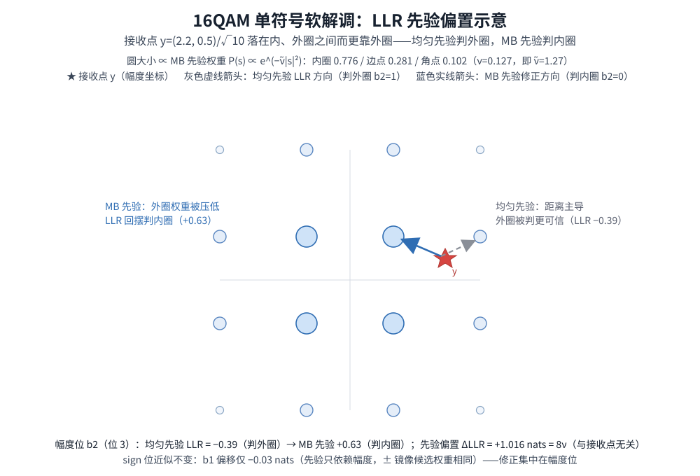

# T13.5 PS 接收机：LLR 先验与感知解调

## 本节学习目标

第 4 章（[[T13.4_ps_embedding_four_access_points_bit_organization]]）的四个接入点架构里，接入点 3（解调前）只留了一句话的位置："插入等效信道预处理，均匀路径直通，其后半段是软域解扰"。本章站在这句话上把它展开——**发射端整形的分布，接收端必须感知，否则整形增益非但拿不到，还会因系统性偏差而变负**。

回顾发射端做了什么：第 2 章的 MB 分布（[[MB_Distribution_MB分布]]）把幅度使用概率从均匀改成了 $P(a)\propto e^{-\nu a^2}$，第 3 章的 ESS（[[ESS_枚举球面整形]]）把它变成可逆的 bit 序列，第 4 章的行路由与选择性加扰（[[Selective_Scrambling_选择性加扰]]）保证这些 bit 以非均匀统计落到调制星座（constellation，调制符号在复平面的点集与比特标签映射，[[Modulation_Constellations_调制星座]]）的幅度位上。现在接收端拿到一个符号 $y$，要把它转成译码器能消费的逐比特软信息——**对数似然比（Log-Likelihood Ratio, LLR）**，即"更像 0 还是更像 1、有多确定"的软值（[[LLR_对数似然比]]，前几章已反复使用）。问题在于：第 4 章结束时发射端发送的符号分布是**非均匀**的，而接收端软解调（soft demapping，把接收符号逐比特转成 LLR 的接收端模块，[[Soft_Demodulation_软解调]]）的标准公式（[[T2.9_QAM_Max_Log_MAP_demapping]]）默认所有星座点**等概率**。两个前提对不上，就是本章要解决的核心矛盾。

本章的路线图：先看"不知道整形"的接收机会付出什么代价（外圈点被系统性高估，LLR 偏向错误方向）；再把符号先验 $P(s)$ 请进最大后验（Maximum A Posteriori, MAP；最大化后验概率的检测准则）度量，得到带先验的 LLR；接着解决一个坐标系问题——MB 分布定义在未归一化幅度域、接收模型用归一化星座域，于是有了 $\tilde\nu=\nu\cdot\frac{2}{3}(2^{Q_m}-1)$ 的折算；随后把这个先验正则 $\tilde\nu\sigma^2$ 以"完整平方 MAP"的方式配进等效信道（$\mathbf{R}_{hh}=\mathbf{G}^H\mathbf{G}+\tilde\nu\sigma^2\mathbf{I}$），使标准检测器（detector，从接收向量估计发射符号的接收端模块，[[T12.1_mimo_receiver_chain_overview]]）一行不改，并给出 SISO/SIMO/MIMO 三种预处理模式；最后交代工程实现：prior 偏置与幅度位偏置的数值行为、免指数的查找表（LUT）、与 CSI 加权（CSI，Channel State Information，信道状态信息；此处指检测后每 RE 的可靠度，[[CSI_SINR]]）的独立乘子关系、软域解扰的 LLR 符号翻转推导，以及"标准不规定解调算法"的接收端自由度。

学完本节后，应能做到：

- 写出均匀先验 LLR 公式（[[T2.9_QAM_Max_Log_MAP_demapping]] 的式 (10)）与带先验的 MAP 度量（$P(s)$ 进入分子分母），并解释"接收端不感知整形"时外圈点为何被系统性高估。（Bloom：理解；LO11 铺垫）
- 计算 $\tilde\nu=\nu\cdot\frac{2}{3}(2^{Q_m}-1)$：16QAM $\nu=0.127\to1.27$、MCS12 $\nu=0.0918\to3.86$，并说出为什么要折算到归一化星座域。（Bloom：应用）
- 用配平方把 $M(x)=\|y-\mathbf{G}x\|^2+\tilde\nu\sigma^2\|x\|^2$ 化为 $\|Y_{\mathrm{eq}}-\mathbf{H}_{\mathrm{eq}}x\|^2+\text{const}$，写出 $\mathbf{R}_{hh}$、$\mathbf{H}_{\mathrm{eq}}=\operatorname{chol}(\mathbf{R}_{hh})$ 与 $Y_{\mathrm{eq}}$。（Bloom：应用）
- 在 SISO $\beta$ / SIMO MRC / MIMO Cholesky 三模式中识别同一先验正则的实现，说出各模式的计算量量级（约 6 / $5N_{rx}+4$ / 170 MACs/tone）。（Bloom：理解；LO14 铺垫）
- 解释 prior 偏置与 amplitude bit 偏置：幅度位 LLR 的偏移恰好等于 $\tilde\nu\Delta|s|^2=8\nu$ nats（与接收点无关），sign 位近似不变。（Bloom：理解）
- 说出 PS 解调 LUT 的结构（1024QAM 时 1024×10 bit 量级）与"先验乘子 × CSI 乘子、统一 $\pm31$ 裁剪"的关系。（Bloom：记忆）
- 按 $L(b)=(1-2g)\cdot L(c)$ 对 LLR 流执行软域解扰，并解释整形位 LLR 为何必须原样通过（TX/RX 对称）。（Bloom：应用；LO9）
- 论证"发射端整形、接收端照旧均匀解调"为何增益变负，并说明标准为什么不规定唯一 demapper。（Bloom：分析；LO11/U6）

与持久理解的呼应：本章把 U6 讲透——**发射端整形的分布必须被接收端感知，否则"不知道"的整形会让 LLR 系统性偏向错误方向；整形增益的兑现是一个收发契约问题，不是发射端单方面的优化；标准不规定解调算法，这份自由既是权利也是责任**。同时承接 U5 的接收端半侧（shaped mask 决定哪些 LLR 翻转、哪些原样通过）与第 1 章核心问题 Q2（接收端需要"知道"多少、不感知会怎样），并为第 6 章的衰落三机制之三（$\tilde\nu$ 正则补偿不完美）与硬件账本（8 路并行 Cholesky）埋下数值。

## 前置知识检查

| 前置项 | 本节需要达到的程度 |
|:---|:---|
| [[T13.1_probabilistic_shaping_overview_shaping_gain]] 概率整形总览 | 知道整形增益的兑现前提：接收端以非均匀分布为先验解调；"感知不是可选项"。 |
| [[T13.2_mb_distribution_entropy_power_tradeoff]] MB 分布 | 知道 $P(a)\propto e^{-\nu a^2}$ 定义在**未归一化**幅度 $\{1,3,\ldots\}$ 上——本章 $\tilde\nu$ 折算的起点。 |
| [[T13.3_ess_enumerative_sphere_shaping]] ESS 枚举球面整形 | 知道 ESS 输出的是幅度 bit 标签流、inverse ESS 在 LDPC/CRC 之后（接入点 4）；本章在接入点 3 处理它的 LLR 形态。 |
| [[T13.4_ps_embedding_four_access_points_bit_organization]] 四接入点与比特组织 | 知道接入点 3 的位置（解调前预处理 + 后半段解扰）、shaped mask（位 3..2+2k 为整形位）、选择性加扰的软域对称操作记号 $L(b)=(1-2g)L(c)$（本章给出完整推导）。 |
| [[T2.9_QAM_Max_Log_MAP_demapping]] QAM 软解调 | 知道均匀先验 LLR 公式（式 (10)）与 Max-Log-MAP 近似——本章要打破它的"星座等概率"假设。 |
| [[T2.7_AWGN_noise_scaling]] AWGN 噪声缩放 | 知道 $\sigma^2$ 的口径（每维噪声功率）与归一化星座约定——$\tilde\nu\sigma^2$ 正则的量纲依据。 |
| [[T2.11_LLR_clipping_scaling_quantization]] LLR 裁剪 | 知道 $\pm31$ 裁剪口径（$q\in[-31,31]$）——先验与 CSI 叠加后的统一裁剪。 |
| [[T12.1_mimo_receiver_chain_overview]] MIMO 接收链路 | 知道接收链"检测器 → 软解调 + CSI 加权"的分工——接入点 3 挂在检测器之前。 |
| [[T12.3_linear_detectors_mf_zf_mmse]] 线性检测器 | 知道 MMSE 滤波器含 $\sigma^2\mathbf{I}$ 正则、csi $=1+\mathrm{SINR}\ge1$——本章把 $\sigma^2\mathbf{I}$ 换成 $\tilde\nu\sigma^2\mathbf{I}$ 正则。 |
| [[LLR_Prior_LLR先验]] | 知道 prior 偏置、amplitude bit 偏置、LUT、与 CSI 加权关系的结论（本章给出完整机制与数值）。 |
| [[Selective_Scrambling_选择性加扰]] | 知道 shaped mask、行路由、LLR sign flip 的记号（本章推导软域公式）。 |

如果这些前置还不稳，先抓住一句话：**本章回答"发射端整形的非均匀分布，接收端怎么感知"——把 $P(s)$ 放进 MAP 度量（LLR prior）、折算成 $\tilde\nu$ 正则（完整平方 MAP、三模式预处理）、用 LUT 免指数实现，并在软域用 LLR 符号翻转完成解扰；标准不规定这些，但链路两端必须自洽。**

## 接收端"不知道"整形的后果：均匀先验的系统性偏差

先看接收端最"偷懒"的做法：把整形符号当普通符号解调。标准软解调（[[Soft_Demodulation_软解调]]）在 AWGN 模型 $y=s+n$（$n\sim\mathcal{N}(0,\sigma^2)$，$\sigma^2$ 为每维噪声功率，[[T2.7_AWGN_noise_scaling]]）下计算逐比特 LLR，对第 $k$ 个比特：

$$
L_k(y)=\ln\frac{\sum\limits_{s\in\mathcal{S}_{k,0}} e^{-\|y-s\|^2/2\sigma^2}}
{\sum\limits_{s\in\mathcal{S}_{k,1}} e^{-\|y-s\|^2/2\sigma^2}}
\tag{1}
$$

其中 $\mathcal{S}_{k,0}$ / $\mathcal{S}_{k,1}$ 是第 $k$ 位为 0 / 1 的星座点集合（[[T2.9_QAM_Max_Log_MAP_demapping]] 式 (10)）。式 (1) 回答的问题是"接收点 $y$ 更像哪组候选"——**它的分子分母只含距离项，隐含所有星座点等概率使用**。这个"等概率"假设在均匀链路上成立，在整形链路上不成立：发射端按 $P(s)$ 发送，内圈点被大量使用、外圈点被少量使用，而式 (1) 把每个候选点的权重都当成 1。

后果是**系统性的 LLR 偏差**：外圈（高能量）候选点在式 (1) 中与内圈点享有同等权重，但实际发射概率远低于内圈点——它们被**高估**了。幅度位的 LLR 会偏向"外圈"方向，且这种偏向不随接收点变化、不随噪声平均消失，是结构性的：每次判决都带着"外圈更可能"的错误底分。第 4 章边界例 (3)（"发射端整形、接收端照旧均匀解调——LLR 系统性偏差，增益变负"）说的就是这件事：**不感知整形不仅拿不到整形增益，还会比均匀链路更差**，因为外圈误判把 LDPC（低密度奇偶校验码，Low-Density Parity-Check，NR 数据信道编码，[[T8.1_NR_LDPC_decoder_chain_overview]]）输入的可信度整体破坏。

图 1 用一个 16QAM 符号演示这个偏差的方向：接收点 $y=(2.2+0.5j)/\sqrt{10}$ 落在内圈点 $(1,1)/\sqrt{10}$ 与外圈边点 $(3,1)/\sqrt{10}$ 之间、更靠外圈。均匀先验（灰色虚线箭头）只按距离判"外圈更近"，幅度位 LLR 判向外圈（$b_2=1$）；MB 先验（蓝色实线箭头）把内圈候选的权重抬高，LLR 被拉回内圈（$b_2=0$）——同一接收点，两种先验给出**相反判决**。



## 带先验的 MAP 度量：P(s) 进入分子分母

修复的办法在贝叶斯公式里：观测 $y$ 之后，候选 $s$ 的**后验**概率（观测之后的条件概率）正比于似然乘**先验**（观测之前对符号概率的已有认识，[[Probability_Bayes_概率与贝叶斯]]）：

$$
P(s\mid y)=\frac{p(y\mid s)\,P(s)}{p(y)}\propto e^{-\|y-s\|^2/2\sigma^2}\cdot P(s)
$$

最大后验（Maximum A Posteriori, MAP）准则——最大化后验概率的检测准则——把 $P(s)$ 作为乘性权重并入每个候选的得分。于是逐比特 LLR 变成：

$$
L_k(y)=\ln\frac{\sum\limits_{s\in\mathcal{S}_{k,0}} P(s)\,e^{-\|y-s\|^2/2\sigma^2}}
{\sum\limits_{s\in\mathcal{S}_{k,1}} P(s)\,e^{-\|y-s\|^2/2\sigma^2}}
\tag{2}
$$

式 (2) 与式 (1) 的唯一差别：分子分母各乘了 $P(s)$。$P(s)$ 来自发射端的 MB 分布（TX 的目标概率 = RX 的先验，[[LLR_Prior_LLR先验]]），这就是**LLR prior**——接收端对"发射端用什么分布"的感知。注意 $P(s)$ 在 log 域里等价于给每个候选加一个**加性偏置** $\ln P(s)$：距离项 $\|y-s\|^2/2\sigma^2$ 负责"离得近"，先验项 $\ln P(s)$ 负责"本来就可能"——两者同票同权。**先验偏置**（prior bias）这个术语专指后者的作用：同一距离下内圈候选更可信，LLR 被偏置向低能量符号。

式 (2) 的代价：求和项里多了一个随符号变化的权重，不能再像式 (1) 那样只按距离找最近点。这就是后文 LUT 与"先验正则进检测器"两条工程路线的出发点。

## ν̃ 归一化：MB 先验的坐标折算

式 (2) 里的 $P(s)$ 必须和距离项 $e^{-\|y-s\|^2/2\sigma^2}$ 用**同一套坐标系**。这里有一个隐藏的坐标系错位：

- **MB 分布定义在未归一化幅度域**：$P(a)\propto e^{-\nu a^2}$，$a\in\{1,3,\ldots,2^{Q_m/2}-1\}$（[[T13.2_mb_distribution_entropy_power_tradeoff]]）；
- **接收模型用归一化星座域**：NR 星座平均能量为 1（[[T2.9_QAM_Max_Log_MAP_demapping]] 的归一化约定），坐标是未归一化坐标除以 $\sqrt{E_s}$。

未归一化均匀 QAM（$Q_m$ 为调制阶数，即每符号比特数）的每符号平均能量：

$$
E_s=\mathbb{E}\big[|x_{\text{unnorm}}|^2\big]
=2\cdot\frac{1}{2^{Q_m/2}}\sum_{i=1}^{2^{Q_m/2}}(2i-1)^2
=2\cdot\frac{2^{Q_m}-1}{3}
=\frac{2}{3}\big(2^{Q_m}-1\big)
\tag{3}
$$

（每维能量 $(2^{Q_m}-1)/3$，两维相加。）把先验从幅度域折算到归一化域：$a^2_{\text{norm}}=a^2/E_s$，于是 $e^{-\nu a^2}=e^{-\nu E_s\,a^2_{\text{norm}}}$。**归一化域的先验速率**：

$$
\tilde\nu=\nu\cdot\frac{2}{3}\big(2^{Q_m}-1\big)=\nu\cdot E_s
\tag{4}
$$

**ν̃ 归一化**（nu-tilde normalization）就是式 (4)：把整形强度 $\nu$ 从未归一化幅度域折算成归一化星座域的 $\tilde\nu$，使先验写作 $P(s)\propto e^{-\tilde\nu\|s\|^2}$。数值实例（内嵌验证第 1 段复现）：

| 配置 | $Q_m$ | $\nu$（表值） | $\frac{2}{3}(2^{Q_m}-1)$ | $\tilde\nu$ |
|:---:|:---:|:---:|:---:|:---:|
| 16QAM（教学例） | 4 | 0.127 | 10 | **1.27** |
| MCS12（64QAM） | 6 | 0.0918 | 42 | **3.86** |
| MCS10（64QAM） | 6 | 0.1270 | 42 | 5.33 |
| MCS20（256QAM） | 8 | 0.0239 | 170 | 4.06 |
| MCS24（1024QAM） | 10 | 0.0084 | 682 | 5.73 |

上表后四行是 PS02 §5.1 的实测表值。三个要点：(1) $\tilde\nu$ 的量级在 1~6，而信道 Gram 矩阵（$\mathbf{H}^H\mathbf{H}$，见下节）的量级约 1——先验正则与信道能量**同量级，不可当作小扰动**；(2) 折算不改变先验本身，只换坐标系——内嵌验证里"幅度位偏移恰好 $8\nu$ nats"在两种坐标系下是同一个数；(3) $\tilde\nu=0$ 对应均匀先验（$\nu=0$），一切先验修正自动关闭，均匀路径直通（接入点 3 的"均匀路径直通"由此而来）。

## 完整平方 MAP：先验正则进入等效信道

式 (2) 直接改软解调，但第 4 章的架构承诺是"检测器一行不改"。怎么把先验"伪装"进检测器？答案是**完整平方 MAP**：把带先验的 MAP 度量配平方成一个标准距离度量。

先写 MIMO（多输入多输出，Multiple-Input Multiple-Output，多收多发天线系统，[[MIMO_多天线系统]]）模型。设每资源单元（Resource Element, RE）的接收向量为 $y=\mathbf{G}x+n$，其中 $\mathbf{G}=\alpha\mathbf{H}$ 是信道矩阵 $\mathbf{H}$（信道估计（channel estimation，从参考信号推算信道系数的接收端环节，[[Channel_Estimation_信道估计]]）从 DMRS（解调参考信号，Demodulation Reference Signal）等参考信号得到）乘以第 4 章的功率缩放因子 $\alpha=\sqrt{\text{psPowerScaling}}$（接入点 2 把平均能量拉回 1 的那次缩放）。取 log 后，带先验的 MAP 度量（去掉与 $x$ 无关的项）是：

$$
M(x)=\big\|y-\mathbf{G}x\big\|^2+\tilde\nu\sigma^2\|x\|^2
\tag{5}
$$

式 (5) 回答的问题是：为什么先验项长成 $\tilde\nu\sigma^2\|x\|^2$——因为 $-\ln P(x)=\tilde\nu\|x\|^2+\text{const}$ 恰好是二次型，**先验正则**（prior regularization）与噪声正则 $\sigma^2\|x\|^2$ 合并为一个总正则 $\tilde\nu\sigma^2\|x\|^2$（Tikhonov 正则——用二次惩罚项稳定病态反问题的标准技巧——的 MAP 来源）。配平方的关键是构造等效信道对：

$$
\mathbf{R}_{hh}=\mathbf{G}^H\mathbf{G}+\tilde\nu\sigma^2\mathbf{I},\qquad
\mathbf{H}_{\mathrm{eq}}=\operatorname{chol}(\mathbf{R}_{hh})\ (\text{上三角}),\qquad
Y_{\mathrm{eq}}=\mathbf{H}_{\mathrm{eq}}\mathbf{R}_{hh}^{-1}\mathbf{G}^H y
\tag{6}
$$

其中 $\mathbf{G}^H\mathbf{G}$ 是**Gram 矩阵**（信道相关矩阵，对角线为各层信道能量、非对角线为层间串扰），$\operatorname{chol}$ 是 **Cholesky 分解**（正定矩阵的三角分解，使 $\mathbf{R}_{hh}=\mathbf{H}_{\mathrm{eq}}^H\mathbf{H}_{\mathrm{eq}}$）。把式 (6) 代入式 (5)（展开 $M(x)=\|y\|^2-2\operatorname{Re}(y^H\mathbf{G}x)+x^H\mathbf{R}_{hh}x$ 后配平方，中间用到 $\mathbf{R}_{hh}^{-1}\mathbf{R}_{hh}=\mathbf{I}$）：

$$
M(x)=\big\|Y_{\mathrm{eq}}-\mathbf{H}_{\mathrm{eq}}x\big\|^2+\underbrace{\|y\|^2-\|Y_{\mathrm{eq}}\|^2}_{\text{与 }x\text{ 无关}}
\tag{7}
$$

式 (7) 的结论：**带先验的 MAP 度量恰好等于"标准检测器在等效信道对 $(Y_{\mathrm{eq}},\mathbf{H}_{\mathrm{eq}})$ 上的普通距离度量"**。下游检测器（[[T12.3_linear_detectors_mf_zf_mmse]] 的 MMSE——最小均方误差（Minimum Mean Square Error）线性检测器，滤波器含 $\sigma^2\mathbf{I}$ 噪声正则——或 [[T12.4_sphere_detection_detector_selection]] 的球面检测——在半径约束的球内搜索候选符号组合的检测器）照常工作，先验已被精确吸收进输入——这就是接入点 3 的"手术"：`preprocess_demod_input` 把 $(y,\mathbf{H})$ 换成 $(Y_{\mathrm{eq}},\mathbf{H}_{\mathrm{eq}})$，$\tilde\nu=0$ 时 $\mathbf{R}_{hh}=\mathbf{G}^H\mathbf{G}$、$(Y_{\mathrm{eq}},\mathbf{H}_{\mathrm{eq}})\to(y,\mathbf{G})$，自动退化为直通。

## 三模式预处理：SISO β / SIMO MRC / MIMO Cholesky

式 (6)(7) 是 MIMO 通用公式，天线配置简化时它自动塌缩成更便宜的形式。三种模式（**三模式预处理**，three-mode preprocessing）是同一完整平方公式的三个特例：

**SISO β 模式（单发单收，Single-Input Single-Output）**：标量信道 $y=Hx+n$，$\mathbf{R}_{hh}$ 退化为数 $R_{hh}=|H|^2+\tilde\nu\sigma^2$。代码用 $\beta$ 拆分：

$$
\beta=\frac{|H|^2}{|H|^2+\tilde\nu\sigma^2},\qquad
Y_{\mathrm{eq}}=\sqrt{\beta}\,y,\qquad
H_{\mathrm{eq}}=\frac{H}{\sqrt{\beta}}
\tag{8}
$$

两个不变量：$|H_{\mathrm{eq}}|^2=|H|^2+\tilde\nu\sigma^2$（正则化信道能量）与 $H_{\mathrm{eq}}^H Y_{\mathrm{eq}}=H^*y$（匹配滤波输出）——与式 (6) 的完整平方对只差一个单位模相位，该相位在功率域 LLR 路径中抵消。先验以 $\tilde\nu\sigma^2$ 叠加进噪声正则，等价于标准 MMSE 滤波器 $\hat{s}=H^*y/(|H|^2+\tilde\nu\sigma^2+\sigma^2)$。

**SIMO MRC 合并模式（单发多收，Single-Input Multiple-Output）**：$N_{rx}$ 根接收天线，每根天线一个标量观测 $y_i=H_i x+n_i$：

$$
R_{hh}=\sum_{i=1}^{N_{rx}}|H_i|^2+\tilde\nu\sigma^2,\qquad
H_{\mathrm{eq}}=\sqrt{R_{hh}},\qquad
Y_{\mathrm{eq}}=\frac{\sum_i H_i^*\,y_i}{\sqrt{R_{hh}}}
\tag{9}
$$

这是式 (6) 在 $M=1$ 时的精确形式：先做**最大比合并（Maximum Ratio Combining, MRC）**——按各支路信道共轭加权（相位对齐 + 幅度加权，输出信噪比（Signal-to-Noise Ratio, SNR）最大，[[T12.2_diversity_combining_mrc]]）——再按 $1/\sqrt{R_{hh}}$ 归一化。

**MIMO Cholesky 模式（多入多出）**：完整执行式 (6)：每 tone 构造 $\mathbf{R}_{hh}$（$N_{rx}$ 次外积累加）、Cholesky 分解、回代得 $Y_{\mathrm{eq}}$。

硬件代价用 MACs（Multiply-Accumulate，乘累加操作）计量（tone 即每 RE）。计算量核算（PS02 §5.5 口径）：

| 模式 | 每 tone 主要运算 | MACs/tone（近似） |
|:---|:---|:---:|
| SISO（1×1） | 能量 $\|H\|^2$、除法 $\beta$、缩放 $\sqrt{\beta}$ | **约 6** |
| SIMO（1×$N_{rx}$） | $\sum\|H_i\|^2$、匹配滤波 $\sum H_i^*y_i$、归一化 | **约 $5N_{rx}+4$** |
| MIMO（4×4） | $\mathbf{R}_{hh}$ 构造 + Cholesky + 回代/前乘 | **约 170** |

MIMO 4×4 单引擎串行的代价是 8,112 tone × 60 cycles/tone ≈ 486,720 cycles（0.5 ms 时隙预算 61,440 cycles 的约 8 倍）——这是第 6 章"8 路并行 Cholesky"硬件账的出处（学习目标 LO14）。三种模式说明同一个道理：**先验正则的实现成本随天线规模增长，SISO/SIMO 几乎免费，瓶颈只在 MIMO+PS 组合**。

## prior 偏置与 amplitude bit 偏置：sign 位近似不变

先验进入 LLR 后，对四个 bit 位置的影响并不均匀。内嵌验证（第 3 段）对一个 16QAM 符号给出精确数字：接收点 $y=(2.2+0.5j)/\sqrt{10}$、$\sigma^2=0.1$，幅度位 $b_2$（位 3，I 维幅度位）的 LLR 从均匀先验的 $-0.388$（判外圈）变为 MB 先验的 $+0.628$（判内圈），偏移**恰好** $+1.016$ nats；而 sign 位 $b_1$（位 2，Q 维符号位）只从 $+1.042$ 变为 $+1.015$，偏移 $-0.026$ nats。

这不是巧合，而是结构性的，两条规律：

1. **prior 偏置是精确的加性偏移**：MB 先验可分解为 $P(s)=P(a_I)P(a_Q)\propto e^{-\tilde\nu a_I^2}e^{-\tilde\nu a_Q^2}$，幅度位 $b_2$ 的两组候选（$|I|=1$ vs $|I|=3$）只差一个先验因子 $e^{\tilde\nu(0.9-0.1)}$，其余结构（含距离项）在分子分母间完全抵消，因此偏移恒为 $\tilde\nu\cdot\Delta|s|^2=1.27\times0.8=1.016$ nats——**与接收点 $y$ 和噪声 $\sigma^2$ 无关**（内嵌验证对全部 16 个候选重算、逐位断言通过）。在未归一化幅度域写作 $8\nu=8\times0.127=1.016$ nats $\approx1.47$ bits，这是"先验偏置"的解析值。
2. **amplitude bit 偏置 vs sign 位近似不变**：先验只依赖幅度 $|s|^2$，sign 位的两组候选（$b_0$: I 为正 vs 为负）是 $\pm$ 镜像对，**幅度多重集完全相同**，先验对两组的整体加权近乎对称——一级偏置项完全不出现，剩下的只是候选排序微调带来的二级效应（本例 $b_1$ 仅 $-0.026$ nats）；而幅度位的两组（内圈 vs 外圈）幅度不同，一级偏置 $\tilde\nu\Delta|s|^2$ 精确出现。结论一句话：**整形只作用幅度，先验修正也集中在幅度位，sign 位近似不变**（[[LLR_Prior_LLR先验]] 的 amplitude bit 偏置）。

这条规律的两个工程后果：(1) 若用解析式/近似解调，只需给幅度位加偏置项、sign 位照旧——省掉一半修正逻辑；(2) 任何"先验对所有 bit 一视同仁"的实现都是错的（第 5 节自测题的常见误解）。

## LUT 预计算：免指数的软解调

式 (2) 的直接实现要对每个候选算一次指数 $\exp(-\tilde\nu\|s\|^2)\cdot\exp(-\|y-s\|^2/2\sigma^2)$，1024QAM 时每符号 1024 次指数运算，在线算指数是硬伤。解法是**查找表（Look-Up Table, LUT）**——预计算存储、在线按索引查取（[[LLR_Quantization_LLR量化]] 的同款思想）。

PS 解调 LUT 的结构（PS02 §6 口径）：以调制方式为键、每调制生成一次并缓存（跨时隙复用），内容为三元组——(1) 星座点表 `constellation`（$2^{Q_m}$ 个复点，1024QAM 时 1024×32 bit = 4 KB）；(2) 比特标签表 `bit_labels`（$2^{Q_m}\times Q_m$ 逻辑位，**1024×10 bit ≈ 1.25 KB**，即"1024×10 bit 表"）；(3) 每位位置的 0/1 掩码 `zero_masks`/`one_masks`（各 $Q_m\times2^{Q_m}$ bit）——供 Max-Log-MAP 的"最小距离分组"直接索引。合计约 7.7 KB ROM（只读存储器，Read-Only Memory）。**先验权重列 $w(s)=e^{-\tilde\nu\|s\|^2}$ 是同一张表上顺带预计算的第四列**（习 5-3 用 16QAM 的 16 行切片演示其构造），在线只需查权重、乘到距离指数上，指数计算从 1024 次/符号降到 0。

为什么 PS 场景必须用穷举 LUT 而不是解析式 Max-Log-MAP（用"最大项近似求和"的软解调近似，[[T2.9_QAM_Max_Log_MAP_demapping]]）？因为 ESS 的 bit 标签按幅度电平编号、**不保证 Gray 序**（Gray 映射，相邻星座点标签只差一个 bit 的约定，[[T13.3_ess_enumerative_sphere_shaping]] 的 bitLabel），"最近点分组"的解析捷径不可靠；穷举 $2^{Q_m}$ 个点的距离 + 按掩码取 min 分组（1024QAM 时约 20 次距离运算/tone）是唯一稳妥的软解调实现。

## 与 CSI 加权的关系：独立乘子与统一裁剪

接收链在软解调之后还有一步：**CSI 加权**——用检测器报告的每 RE 可靠度给 LLR 加权。CSI（Channel State Information，信道状态信息；此处特指检测后的输出 SINR 度量）在 MMSE 下有精确折算 $\mathrm{csi}=1+\mathrm{SINR}_{\mathrm{out}}\ge1$（[[T12.3_linear_detectors_mf_zf_mmse]] 的式 (19)），深衰落 RE 的 LLR 被压低权重（[[T12.1_mimo_receiver_chain_overview]] 的"软解调 + CSI 加权"环节）。

prior 与 CSI 加权是两个**独立乘子**：

| 乘子 | 刻画对象 | 作用位置 | 来源 |
|:---|:---|:---|:---|
| 先验 $P(s)$ | 发射符号分布（整形知识） | 候选权重（式 (2) 分子分母内、LUT 内） | 发射端 $\nu$（RX 感知） |
| CSI 权重 | 信道质量（每 RE 可靠度） | 输出 LLR 幅度 | 检测器（$\mathrm{csi}=1+\mathrm{SINR}$） |

前者乘在**候选**上、后者乘在**输出 LLR** 上，互不干扰、可独立实现：prior 进 LUT 的先验列，CSI 在 LLR 输出处加权。"prior 与 CSI 二选一"是常见误解（习 2 考点）——一个补分布知识、一个补信道知识，缺哪个都会让 LLR 失真。二者叠加后统一做**裁剪**（clipping，把软值限制在 $\pm L_{\max}$，[[T2.11_LLR_clipping_scaling_quantization]]）：PS 链路沿用标准口径 $q\in[-31,31]$（6-bit 有符号，$\pm31$ 裁剪的损失 <0.02 dB），先验修正与 CSI 加权先乘后裁，顺序无关（裁剪是最终饱和度约束）。

## 软域解扰：LLR sign flip 的完整推导

第 4 章的接入点 2 做了选择性加扰：shaped mask 标记的整形位（位 3..2+2k）跳过 XOR，其余位（sign 位 + 未整形幅度位）照常执行标准加扰（TS 38.211 §7.3.1.1：用 Gold 序列——两个 m 序列异或生成的伪随机序列，[[Gold_序列加扰]]——对编码 bit 做 XOR）。接收端的对称操作在**软域**完成——不需要把 LLR 硬判决成 bit 再 XOR 回去，直接翻转符号。第 4 章给了记号 $L(b)=(1-2g)L(c)$，本节补上完整推导。

设发射侧 $c=b\oplus g$（加扰位 $g\in\{0,1\}$，XOR 记 $\oplus$）。软解调给出的是 $c$ 的 LLR（符号为正表示更像 0，[[T2.9_QAM_Max_Log_MAP_demapping]] 约定），要求 $b$ 的 LLR：

- $g=0$：$b=c$，$L(b)=L(c)$；
- $g=1$：$b=\neg c$，$L(b)=\ln\frac{P(b=0)}{P(b=1)}=\ln\frac{P(c=1)}{P(c=0)}=-L(c)$。

合并两行：

$$
L(b)=(1-2g)\cdot L(c)
\tag{10}
$$

式 (10) 就是**LLR 符号翻转**（LLR sign flip，软域解扰）：$g=0$ 原样通过、$g=1$ 取相反数。三个要点：(1) **线性无损**——只改符号不改幅度，软信息完整保留，且 $(1-2g)^2=1$ 使同一操作自逆（TX/RX 各做一次即还原，这正是第 4 章"RX 不需要硬判决"的数学形式）；(2) **硬件零成本**——没有乘法器，只是一路符号选择器；(3) **TX/RX 对称性**——整形位从未被加扰，其 LLR 必须原样通过、不允许翻转：shaped mask 两侧必须严格一致（RX 若把整形位也翻转，ESS 码字损坏、deshape 必失败，[[Selective_Scrambling_选择性加扰]]）。式 (10) 与 T2.9 的均匀路径解扰公式同构（T2.9 §加扰一节的 $(-1)^{c(i)}L(i)$），PS 路径只是把支撑集收窄到非整形位——又一次"叠加扩展层、不替代"的体现。

## 接收端自由度：标准不规定 demapper

把本章的所有机制放到协议视角下看：TS 38.211 §5.1 规定的是**星座与比特标签**（发射侧假设），**接收端用什么解调算法是接收机自己的事**——式 (1) 还是式 (2)、Max-Log-MAP 还是穷举 LUT、先验注入用式 (6) 的等效信道还是直接改软解调，协议一概不管。这是**接收端自由度**（receiver freedom）：prior 是接收端对发射分布的感知，不是协议字段。第 1 章曾断言"PS 贴标准接口工作"，本章是它的接收端半侧——发射端在标准接口之内（星座、加扰、MCS/TBS 不动），接收端在实现自由之内（解调算法自选）。

但这份自由是"权利也是责任"（U6 的落点）：发射端用 $\nu$ 整形后，接收端**必须**用 $\tilde\nu$ 感知——不感知（式 (1) 照旧）就是图 1 的系统性偏差，增益变负；感知的方式（LUT、解析偏置、等效信道正则）却可以自由选择。链路两端自洽即可：发射端的"统计约定"（第 4 章）与接收端的"感知约定"（本章）必须严格对称，这正是"整形增益的兑现是收发两端的契约问题"（大概念 5）的机制版。

## 内嵌验证：带/不带先验的 16QAM 单符号 LLR 对比

本节用 numpy 验证四件事：(1) $\tilde\nu$ 归一化数值（16QAM→1.27、MCS12→3.86）；(2) MB 先验权重按能量环分组与先验偏置解析值（$8\nu=1.016$ nats ≈ 1.47 bits）；(3) 核心对比——同一接收点 $y=(2.2+0.5j)/\sqrt{10}$、$\sigma^2=0.1$ 下，均匀先验 vs MB 先验（$\tilde\nu=1.27$）的逐比特 LLR，展示外圈候选权重被压低、幅度位判决翻转、sign 位近似不变；(4) Max-Log-MAP 手算近似与精确值的对照。代码与素材口径（[[LLR_Prior_LLR先验]]、PS02 §5-§6）逐项核对：

```python
import numpy as np

def nu_tilde(nu, Qm):
    """ν̃ = ν·(2/3)(2^Qm − 1)：MB 先验从未归一化幅度域折算到归一化星座域"""
    return nu * (2.0 / 3.0) * (2 ** Qm - 1)

# ---------- 1. ν̃ 归一化 ----------
print("1) ν̃ 归一化（MB 先验的坐标折算）")
for nu, Qm, name in [(0.127, 4, "16QAM  ν=0.127"), (0.0918, 6, "MCS12 64QAM ν=0.0918")]:
    es = (2.0 / 3.0) * (2 ** Qm - 1)
    print(f"   {name}: Es=(2/3)(2^{Qm}-1)={es:.0f}   ν̃={nu_tilde(nu, Qm):.4f}")

# ---------- 2. 16QAM 星座与 MB 先验权重 ----------
lev = np.array([1.0, 3.0]) / np.sqrt(10.0)      # 归一化幅度 {1,3}/√10
# 位序约定（T13.4）：位1=I sign, 位2=Q sign, 位3=I amplitude, 位4=Q amplitude；b=0 → +/+/内圈/内圈
sym, lab = [], []
for sI in (+1, -1):
    for sQ in (+1, -1):
        for aI in lev:
            for aQ in lev:
                sym.append(sI * aI + 1j * sQ * aQ)
                lab.append((1 if sI < 0 else 0, 1 if sQ < 0 else 0,
                            1 if aI > lev[0] else 0, 1 if aQ > lev[0] else 0))
sym = np.array(sym); lab = np.array(lab, dtype=int)
nu, Qm = 0.127, 4
nu_t = nu_tilde(nu, Qm)                          # ν̃ = 1.27
w = np.exp(-nu_t * np.abs(sym) ** 2); w /= w.sum()

print("\n2) MB 先验权重（ν̃=1.27，按能量环分组）与先验偏置")
Es = np.abs(sym) ** 2
for tag, m in [("内圈 |s|²=0.2", Es < 0.5), ("边点 |s|²=1.0", (Es > 0.5) & (Es < 1.5)),
               ("角点 |s|²=1.8", Es > 1.5)]:
    print(f"   {tag:<14} 点数={m.sum()}   P(s)={w[m].mean():.4f}")
bias_nat = 8.0 * nu
bias_bit = bias_nat / np.log(2.0)
print(f"   幅度位先验偏置 log(P(1)/P(3)) = {bias_nat:.4f} nats = {bias_bit:.4f} bits（≈1.47）")

# ---------- 3. 单符号 LLR：均匀先验 vs MB 先验 ----------
sigma2 = 0.1                                     # 归一化域噪声方差（SNR=10 dB 口径）
y = (2.2 + 0.5j) / np.sqrt(10.0)                 # 接收点：外圈边点 (3,1)/√10 与内圈点 (1,1)/√10 之间、更靠外圈

def llr(prior):
    e = np.exp(-np.abs(y - sym) ** 2 / (2 * sigma2)) * prior
    return np.array([np.log(e[lab[:, k] == 0].sum() / e[lab[:, k] == 1].sum()) for k in range(4)])

L_uni, L_mb = llr(np.ones(16)), llr(w)
print(f"\n3) 单符号 LLR 对比（y=({y.real:.4f},{y.imag:.4f})，σ²={sigma2}，SNR=10 dB）")
names = ["b0 (I sign)", "b1 (Q sign)", "b2 (I amp)", "b3 (Q amp)"]
for k in range(4):
    print(f"   {names[k]:<11} 均匀先验 {L_uni[k]:+7.3f}   MB 先验 {L_mb[k]:+7.3f}   偏移 {L_mb[k]-L_uni[k]:+7.3f}")
print(f"   幅度位 b2：均匀先验 {L_uni[2]:+.3f}（判外圈 b2=1）→ MB 先验 {L_mb[2]:+.3f}（判内圈 b2=0），符号翻转")

# 幅度位 b2 两组候选加权和（外圈被压低的直接证据）
for gname, pri in [("均匀先验", np.ones(16)), ("MB 先验", w)]:
    s0 = (pri * np.exp(-np.abs(y - sym) ** 2 / (2 * sigma2)))[lab[:, 2] == 0].sum()
    s1 = (pri * np.exp(-np.abs(y - sym) ** 2 / (2 * sigma2)))[lab[:, 2] == 1].sum()
    print(f"   b2 两组加权和（{gname}）：S(b2=0)={s0:.4f}  S(b2=1)={s1:.4f}  比值 {s1/s0:.3f}")

# ---------- 4. Max-Log-MAP 手算对照 ----------
def maxlog(k, prior):
    d = -np.abs(y - sym) ** 2 / (2 * sigma2) + np.log(prior)
    return d[lab[:, k] == 0].max() - d[lab[:, k] == 1].max()
print("\n4) Max-Log-MAP 近似对照（b2）")
print(f"   手算（Max-Log）：均匀 {maxlog(2, np.ones(16)):+.3f} → MB {maxlog(2, w):+.3f}")
print(f"   精确（log-sum-exp）：均匀 {L_uni[2]:+.3f} → MB {L_mb[2]:+.3f}")

# ---------- 5. 断言 ----------
assert abs(nu_t - 1.27) < 1e-9 and abs(nu_tilde(0.0918, 6) - 3.8556) < 1e-6
assert abs(bias_nat - 1.016) < 1e-3 and abs(bias_bit - 1.47) < 0.01
assert L_uni[2] < 0 < L_mb[2], "幅度位 LLR 应因先验发生符号翻转"
assert abs((L_mb[2] - L_uni[2]) - bias_nat) < 1e-9 and abs((L_mb[3] - L_uni[3]) - bias_nat) < 1e-9
assert abs(L_mb[1] - L_uni[1]) < 0.05, "Q sign 位近似不变"
assert abs(L_mb[0] - L_uni[0]) < 0.5, "I sign 位无一级偏置"
print("\n断言全部通过：ν̃(16QAM)=1.27、ν̃(MCS12)=3.8556、先验偏置 1.016 nats ≈ 1.47 bits、"
      "幅度位 LLR 精确偏移 1.016 且符号翻转、sign 位无一级偏置 ✓")
```

真实运行输出（断言全部通过）：

```text
1) ν̃ 归一化（MB 先验的坐标折算）
   16QAM  ν=0.127: Es=(2/3)(2^4-1)=10   ν̃=1.2700
   MCS12 64QAM ν=0.0918: Es=(2/3)(2^6-1)=42   ν̃=3.8556

2) MB 先验权重（ν̃=1.27，按能量环分组）与先验偏置
   内圈 |s|²=0.2    点数=4   P(s)=0.1348
   边点 |s|²=1.0    点数=8   P(s)=0.0488
   角点 |s|²=1.8    点数=4   P(s)=0.0177
   幅度位先验偏置 log(P(1)/P(3)) = 1.0160 nats = 1.4658 bits（≈1.47）

3) 单符号 LLR 对比（y=(0.6957,0.1581)，σ²=0.1，SNR=10 dB）
   b0 (I sign) 均匀先验  +5.313   MB 先验  +4.832   偏移  -0.481
   b1 (Q sign) 均匀先验  +1.042   MB 先验  +1.015   偏移  -0.026
   b2 (I amp)  均匀先验  -0.388   MB 先验  +0.628   偏移  +1.016
   b3 (Q amp)  均匀先验  +3.265   MB 先验  +4.281   偏移  +1.016
   幅度位 b2：均匀先验 -0.388（判外圈 b2=1）→ MB 先验 +0.628（判内圈 b2=0），符号翻转
   b2 两组加权和（均匀先验）：S(b2=0)=0.6175  S(b2=1)=0.9101  比值 1.474
   b2 两组加权和（MB 先验）：S(b2=0)=0.0813  S(b2=1)=0.0434  比值 0.534

4) Max-Log-MAP 近似对照（b2）
   手算（Max-Log）：均匀 -0.400 → MB +0.616
   精确（log-sum-exp）：均匀 -0.388 → MB +0.628

断言全部通过：ν̃(16QAM)=1.27、ν̃(MCS12)=3.8556、先验偏置 1.016 nats ≈ 1.47 bits、幅度位 LLR 精确偏移 1.016 且符号翻转、sign 位无一级偏置 ✓
```

三组读法（教学要点）：

1. **外圈被高估的量化证据**：幅度位 $b_2$ 的两组加权和，均匀先验下 S(b2=1)/S(b2=0) = 1.474（外圈胜出），MB 先验下比值翻转为 0.534（内圈胜出）——外圈候选的权重被先验压低了近 3 倍（$e^{1.016}\approx2.76$）。同一接收点 $y$、同一 $\sigma^2$，只因为先验不同，判决翻转。
2. **偏移的精确性**：$b_2$、$b_3$ 的偏移都精确等于 1.016 nats（断言到 1e-9），与接收点无关——这是"先验偏置是结构性的"的数值证据；sign 位 $b_1$ 只偏移 $-0.026$，$b_0$ 偏移 $-0.481$ 属候选排序微调的二级效应（其 LLR 高达 +5.3，判决与置信度都不受影响），印证"先验修正集中在幅度位"。
3. **手算与精确值互证**：Max-Log-MAP 手算 $-0.400\to+0.616$ 与精确 log-sum-exp $-0.388\to+0.628$ 相差不足 0.02 nats——最近点近似在低阶星座上误差很小，示范例题 1 的手算路线可以直接用。

## 示范例题

### 例 1（应用）：ν̃ 归一化计算——16QAM ν=0.127 → 1.27

**题目**：16QAM（$Q_m=4$）、$\nu=0.127$。(1) 计算未归一化每符号平均能量 $E_s$；(2) 计算归一化域先验速率 $\tilde\nu$；(3) 解释为什么必须做这次折算，并给出幅度位先验偏置的解析值。

**解答**：

(1) 式 (3)：$E_s=\frac{2}{3}(2^{Q_m}-1)=\frac{2}{3}(16-1)=10$（每维能量 $(16-1)/3=5$，两维相加）。

(2) 式 (4)：$\tilde\nu=\nu\cdot E_s=0.127\times10=1.270$。

(3) 必须折算的原因：MB 分布 $P(a)\propto e^{-\nu a^2}$ 定义在未归一化幅度 $\{1,3\}$ 上，而式 (2) 的距离项 $\|y-s\|^2/2\sigma^2$ 用归一化星座（平均能量 1，坐标 $\{\pm1,\pm3\}/\sqrt{10}$）。若直接用 $\nu$ 而不折算，等于把"幅度 1 的能量"当成"归一化域的能量"——差一个 $E_s=10$ 的尺度，先验权重 $e^{-\nu a^2}$ 与距离项量纲错配。折算后先验写作 $P(s)\propto e^{-\tilde\nu\|s\|^2}$。幅度位先验偏置（内圈 $|s|^2=0.1$ vs 外圈 $|s|^2=0.9$）：

$$
\tilde\nu\cdot(0.9-0.1)=1.27\times0.8=1.016\ \text{nats}\ (\approx1.47\ \text{bits})
$$

与内嵌验证的 LLR 偏移逐位一致（$+1.016$）。

**点评**：这道题的考点是"先验与距离度量必须在同一坐标系"。记住锚点：**16QAM 的折算系数是 10**（$(2/3)(2^4-1)$），$\nu=0.127$ 时 $\tilde\nu=1.27$——后文所有先验偏置计算都从这里起算。

### 例 2（应用，LO9）：LLR sign flip 软域解扰走查

**题目**：16QAM（$Q_m=4$，k=1）的两个符号共 8 个 LLR（正号表示更像 0）：

$$
L(c)=[+4.2,\,-1.8,\,-2.6,\,+0.7,\quad -0.5,\,+3.1,\,+1.4,\,-0.9]
$$

shaped mask 保护位 3、4（幅度位）；加扰位序列 $g=[1,0,0,0,\ 0,1,0,0]$（作用于非整形位）。(1) 写出解扰后的 LLR 序列 $L(b)$；(2) 说明为什么位 3、4 的 LLR 必须原样通过。

**解答**：

(1) 按式 (10) $L(b)=(1-2g)L(c)$：$g=1$ 取相反数、$g=0$ 原样。位 1、2 是 sign 位（被加扰），位 3、4 是幅度位（整形位，跳过加扰）：

| 位 | 1 | 2 | 3 | 4 | 5 | 6 | 7 | 8 |
|:---:|:---:|:---:|:---:|:---:|:---:|:---:|:---:|:---:|
| $L(c)$ | +4.2 | −1.8 | −2.6 | +0.7 | −0.5 | +3.1 | +1.4 | −0.9 |
| $g$ | 1 | 0 | — | — | 0 | 1 | — | — |
| $L(b)$ | **−4.2** | −1.8 | −2.6 | +0.7 | −0.5 | **−3.1** | +1.4 | −0.9 |

只有位 1（$g=1$ 翻转）与位 6（$g=1$ 翻转）变了符号，其余原样。

(2) 位 3、4 是 shaped mask 标记的整形位：TX 侧它们从未被 XOR 加扰（选择性加扰只作用于非整形行，[[T13.4_ps_embedding_four_access_points_bit_organization]] 的式 (6)），RX 侧翻转它们就是把从未加扰的 ESS 码字破坏掉——deshape（接入点 4 的 inverse ESS）必失败。TX/RX 对称性要求：**没加扰的位不翻转、加了扰的位按式 (10) 翻转**，mask 两侧严格一致。

**点评**：这道题对应 LO9。工程实现上 $L(b)=(1-2g)L(c)$ 只是一路符号选择器（无乘法器）；验证走查时盯住"只有 $g=1$ 的位变号、整形位恒原样"两条规则即可。

## 引导练习

### 练习 1（应用）：MCS12 的 ν̃ 计算

**题目**：MCS12 配置为 64QAM（$Q_m=6$）、$\nu=0.0918$（ps_mcs_table 第 5 列表值）。(1) 计算 $E_s$ 与 $\tilde\nu$；(2) 与 16QAM 的 $\tilde\nu=1.27$ 比较量级，并说明"$\tilde\nu$ 与 Gram 矩阵同量级"为什么是必须预处理（而非当小扰动）的量化依据。

**提示**：式 (3)(4) 直接代入；"同量级"的参照是信道能量 $\mathbf{H}^H\mathbf{H}$ 的量级约 1（归一化信道）。

**参考答案**：(1) $E_s=\frac{2}{3}(2^6-1)=\frac{2}{3}\times63=42$；$\tilde\nu=0.0918\times42=3.8556\approx3.86$。(2) 64QAM 的 $\tilde\nu$（3.86）是 16QAM（1.27）的约 3 倍，量级都在 1~6 之间；先验正则 $\tilde\nu\sigma^2$ 与信道 Gram 矩阵 $\mathbf{G}^H\mathbf{G}$（量级约 1）同量级——若把它当小扰动忽略，等效信道构造（式 (6) 的 $\mathbf{R}_{hh}$）就丢了与信道能量相当的一项，先验等于没有注入。这是"必须预处理、而不是当作小扰动"的量化依据，也是 MIMO+PS 需要专门硬件的量级根源（第 6 章的 8 路并行 Cholesky 账）。

### 练习 2（分析，LO11）：诊断均匀先验的系统性偏差

**题目**：某接收机把整形符号当均匀星座解调。在接收点 $y=(2.6+1.2j)/\sqrt{10}$、$\sigma^2=0.1$ 下，它输出的幅度位 $b_2$ LLR 为 $-1.194$。已知发射端 16QAM、$\nu=0.127$。(1) 诊断这个 LLR 的系统性偏差方向；(2) 把它归因到 LLR 公式中缺失的项；(3) 定量给出修正后的 LLR；(4) 说明 sign 位为什么不需要同样修正。

**提示**：先验偏置是解析值 $8\nu=1.016$ nats，修正 = 均匀先验 LLR + 先验偏置（幅度位）；方向判断看"外圈候选被高估"意味着 LLR 偏向谁。

**参考答案**：(1) 均匀先验把外圈（$b_2=1$）候选的概率权重高估（实际 $P(3)/P(1)=e^{-1.016}$ 远小于 1，被当成 1 计入），LLR 被系统性推向"外圈"方向——$-1.194$ 的负号（更像 bit 1）正是这个偏差的体现，其绝对值被高估。(2) 缺失项是式 (2) 分子分母中的 $P(s)$：式 (1) 只有距离项，外圈候选缺少 $P(s)$ 这个乘性权重（log 域缺 $\ln P(s)$ 加性偏置）。(3) 修正：$L_{\text{prior}}=L_{\text{uniform}}+8\nu=-1.194+1.016=-0.178$（Max-Log 与精确 log-sum-exp 在此例一致，内嵌验证第 3 段的偏移精确性断言覆盖同类计算）——判决仍偏向 $b_2=1$，但置信度从 1.19 塌缩到 0.18，说明原 LLR 的"确定性"几乎全部来自被高估的外圈权重。(4) sign 位的两组候选是 $\pm$ 镜像对、幅度多重集相同，先验对两组的加权近乎对称，一级偏置项不出现（内嵌验证 $b_1$ 偏移仅 $-0.026$ nats）——修正只针对幅度位。

## 独立习题

### 习 1（记忆）：列举 prior 两要素与 CSI 关系

**题目**：列举 LLR prior 的两种偏置效应（prior 偏置与 amplitude bit 偏置），并说明先验与 CSI 加权的关系（作用位置、是否独立、叠加后如何处理）。

**参考答案**：(1) **prior 偏置**：同一距离下内圈候选更可信，LLR 被偏置向低能量符号；幅度位 LLR 的偏移精确等于 $\tilde\nu\Delta|s|^2=8\nu=1.016$ nats（16QAM ν=0.127 口径），与接收点无关。(2) **amplitude bit 偏置**：整形只作用于幅度，幅度位的 LLR 受先验影响最大，sign 位近似不变（无一级偏置，二级效应本例仅 $-0.026$ nats）。(3) 与 CSI 加权的关系：先验乘子（符号概率，作用在候选权重、LUT 内）与 CSI 乘子（信道质量，作用在输出 LLR 上）是两个**独立乘子**，可独立实现；叠加后统一做 $\pm31$ 裁剪（6-bit 口径，损失 <0.02 dB）。记忆锚：**先验补分布知识、CSI 补信道知识，一前一后、独立乘、统一裁**。

### 习 2（理解）：判断正误——prior 与 CSI 加权二选一

**题目**：判断正误并说明理由："LLR prior 与 CSI 加权都是给 LLR 加可靠度，作用重复，二选一即可。"

**参考答案**：错误。两者刻画的对象完全不同：LLR prior 补的是**发射分布知识**（$P(s)$，整形后外圈概率被压低），作用在式 (2) 的候选权重上，修正的是"哪些符号本来就更可能被发送"；CSI 加权补的是**信道知识**（$\mathrm{csi}=1+\mathrm{SINR}\ge1$，深衰落 RE 的估计不可靠），作用在输出 LLR 的幅度上。缺 prior：外圈被高估、幅度位 LLR 系统性偏差（增益变负）；缺 CSI：深衰落 RE 以虚假高置信度进入译码器（BLER 拖尾）。两者是独立乘子、缺一不可——"二选一"的错误来自把"可靠度"当成同一种东西，实际是两类不同来源的可靠度。

### 习 3（应用，numpy）：先验权重 LUT 切片与偏置核对

**题目**：16QAM、$\nu=0.127$（$\tilde\nu=1.27$）。用 numpy 构造 16 行的先验权重 LUT（每行 = 星座点索引、I、Q、4-bit 标签、权重 $w(s)=e^{-\tilde\nu\|s\|^2}$）：(1) 打印 +I 象限 4 行的切片；(2) 按幅度位 $b_2$ 分组求两组权重和之比，验证 $\log_2$ 比值 ≈ 1.47 bits；(3) 说明 1024QAM 时同构表为什么是 1024×10 bit 量级。

**参考答案**（代码与输出；与内嵌验证第 2 段同构，可对照）：

```python
import numpy as np

Qm, nu = 4, 0.127
nu_t = nu * (2.0 / 3.0) * (2 ** Qm - 1)          # ν̃ = 1.27
lev = np.array([1.0, 3.0]) / np.sqrt(10.0)       # 归一化幅度 {1,3}/√10

rows = []
for sI in (+1, -1):
    for sQ in (+1, -1):
        for aI in lev:
            for aQ in lev:
                b = (1 if sI < 0 else 0, 1 if sQ < 0 else 0,
                     1 if aI > lev[0] else 0, 1 if aQ > lev[0] else 0)
                rows.append((sI * aI, sQ * aQ, b, np.exp(-nu_t * (aI ** 2 + aQ ** 2))))
rows = sorted(rows, key=lambda r: (r[0], r[1]))
lab = np.array([r[2] for r in rows]); wcol = np.array([r[3] for r in rows])

print("LUT 切片（+I 象限 4 行，行序 = 星座点索引）:")
hdr = 'w=e^{−ν̃|s|²}'                                   # 纯字符串表头（避免 f-string 花括号转义）
print(f"{'idx':<4}{'I':>8}{'Q':>8}{'label':>8}{hdr:>16}")
for i, (I, Q, b, wt) in enumerate(rows):
    if I > 0 and Q > 0:
        print(f"{i:<4}{I:>8.4f}{Q:>8.4f}{''.join(map(str, b)):>8}{wt:>16.4f}")

s0 = wcol[lab[:, 2] == 0].sum(); s1 = wcol[lab[:, 2] == 1].sum()
print(f"\nb2=0 组权重和（|I|=1 的 8 点）={s0:.4f}   b2=1 组（|I|=3 的 8 点）={s1:.4f}")
print(f"比值 = {s0/s1:.4f}   ln = {np.log(s0/s1):.4f} nats   log2 = {np.log2(s0/s1):.4f} bits")
bias_nat, bias_bit = 8 * nu, 8 * nu / np.log(2)
print(f"解析值 8ν = {bias_nat:.4f} nats = {bias_bit:.4f} bits")
assert abs(np.log(s0 / s1) - bias_nat) < 1e-9 and abs(np.log2(s0 / s1) - bias_bit) < 1e-9
assert abs(bias_bit - 1.47) < 0.01
print("\n断言通过：LUT 权重列与 8ν 解析偏置完全一致（1.016 nats ≈ 1.47 bits）✓")
```

```text
LUT 切片（+I 象限 4 行，行序 = 星座点索引）:
idx        I       Q   label   w=e^{−ν̃|s|²}
10    0.3162  0.3162    0000          0.7757
11    0.3162  0.9487    0001          0.2808
14    0.9487  0.3162    0010          0.2808
15    0.9487  0.9487    0011          0.1017

b2=0 组权重和（|I|=1 的 8 点）=4.2261   b2=1 组（|I|=3 的 8 点）=1.5300
比值 = 2.7621   ln = 1.0160 nats   log2 = 1.4658 bits
解析值 8ν = 1.0160 nats = 1.4658 bits

断言通过：LUT 权重列与 8ν 解析偏置完全一致（1.016 nats ≈ 1.47 bits）✓
```

**说明**：(1) 切片第 10 行（内圈 $|s|^2=0.2$）权重 0.7757 远高于第 15 行（角点 $|s|^2=1.8$）的 0.1017——这就是"外圈被压低"的 LUT 形态；(2) 两组权重和之比 2.7621 的 $\log_2$ 恰为 1.4658 ≈ 1.47 bits（nats 口径 1.016），与内嵌验证的 LLR 偏移同源——**LUT 里存的就是先验偏置的"原料"**；(3) 1024QAM 时同构表有 1024 行：星座点表 1024×32 bit ≈ 4 KB、比特标签表 1024×10 bit ≈ 1.25 KB、0/1 掩码 10×1024 bit×2 ≈ 2.5 KB，合计约 7.7 KB ROM——"1024×10 bit 量级"指的就是按 1024 个星座点索引、每项 10 bit 的标签/权重列族。**评分要点**：切片 4 行数值正确（0.7757/0.2808/0.2808/0.1017）、两组和之比 2.7621、log₂ 比值 ≈1.47 bits，且能说出 LUT 行数与 1024QAM 存储规模。

### 习 4（分析）：归因 sign 位近似不变

**题目**：内嵌验证显示幅度位 $b_2$、$b_3$ 的 LLR 偏移精确等于 1.016 nats，而 sign 位 $b_1$ 偏移仅 $-0.026$ nats。请从先验的数学结构归因这一不对称，并说明什么条件下 sign 位偏移会变大。

**参考答案**：先验可分解为 $P(s)=P(a_I)P(a_Q)\propto e^{-\tilde\nu a_I^2}e^{-\tilde\nu a_Q^2}$，只依赖幅度。**幅度位**的两组候选（$|I|=1$ vs $|I|=3$）幅度不同，先验因子差 $e^{\tilde\nu(0.9-0.1)}$，其余结构（含距离项）在分子分母间完全抵消——偏移是**一级项**，精确等于 $\tilde\nu\Delta|s|^2=1.016$ nats，与 $y$、$\sigma^2$ 无关。**sign 位**的两组候选（$b_0$: I 为正 vs 为负；$b_1$: Q 为正 vs 为负）是 $\pm$ 镜像对，幅度多重集完全相同，先验对两组的加权近乎对称，一级偏置项不存在；剩余偏移来自先验改变组内候选排序的**二级效应**（本例 $b_1$ 仅 $-0.026$，$b_0$ 为 $-0.481$，因 I 侧最近候选从外圈换成了内圈）。sign 位偏移变大的条件：(1) 接收点落在内/外圈边界附近使组内排序对先验敏感（$y_I$ 接近 2/√10 的过渡区）；(2) $\sigma^2$ 增大使多个候选共同主导（二级项权重上升）；(3) 高阶调制 + 大 $\tilde\nu$ 使组内幅度差异扩大。但无论多大，sign 位都不出现一级偏置——**先验修正的结构性落点永远在幅度位**（U6 的接收端机制版）。**分析要点**：先验可分解 + 两组幅度多重集比较 + 一级/二级项区分，三者齐备即满分。

## 小结

本节把持久理解 U6 讲透——接收端必须感知发射端的整形分布，五件核心资产留给后续篇目：

1. **不感知整形的代价是系统性偏差**：均匀先验 LLR（式 (1)）缺 $P(s)$，外圈候选被高估，幅度位 LLR 系统性偏向错误方向（图 1：同一接收点两种先验给出相反判决）——"发射端整形、接收端照旧"增益变负（U6 的第一句话）。
2. **带先验的 MAP 度量**（式 (2)）：$P(s)$ 进入分子分母，log 域是加性偏置 $\ln P(s)$——先验偏置的本质是"本来就可能"与"离得近"同票同权。
3. **ν̃ 归一化**（式 (3)(4)）：$\tilde\nu=\nu\cdot\frac{2}{3}(2^{Q_m}-1)$，16QAM $\nu=0.127\to1.27$、MCS12 $\nu=0.0918\to3.86$；先验与距离度量必须同一坐标系，$\tilde\nu$ 与 Gram 矩阵同量级、不可忽略。
4. **完整平方 MAP 与三模式预处理**（式 (5)-(9)）：$M(x)=\|y-\mathbf{G}x\|^2+\tilde\nu\sigma^2\|x\|^2$ 配平方为 $\|Y_{\mathrm{eq}}-\mathbf{H}_{\mathrm{eq}}x\|^2+\text{const}$，$\mathbf{R}_{hh}=\mathbf{G}^H\mathbf{G}+\tilde\nu\sigma^2\mathbf{I}$、$\mathbf{H}_{\mathrm{eq}}=\operatorname{chol}(\mathbf{R}_{hh})$；SISO $\beta$（约 6 MACs/tone）/ SIMO MRC（约 $5N_{rx}+4$）/ MIMO Cholesky（约 170）是同一公式的三个特例——检测器一行不改，先验被精确吸收进等效信道。
5. **先验修正的结构性落点**：幅度位 LLR 偏移精确等于 $\tilde\nu\Delta|s|^2=8\nu=1.016$ nats（与接收点无关），sign 位近似不变；工程实现用 LUT（1024QAM 时 1024×10 bit 量级）免指数、与 CSI 加权作为独立乘子统一 $\pm31$ 裁剪、软域解扰 $L(b)=(1-2g)L(c)$ 零成本完成 TX/RX 对称。

与持久理解的呼应：U6（发射端整形的分布必须被接收端感知；标准不规定解调算法，这份自由既是权利也是责任）在本节讲透；U5 的接收端半侧（shaped mask 决定哪些 LLR 翻转、哪些原样通过）落到式 (10) 的推导；Q2（接收端需要"知道"多少）的答案是"必须感知、方式自由"。"不知道"的代价、$\tilde\nu$ 的量级、MIMO 预处理 170 MACs/tone 与 486,720 cycles 的账，将在第 6 章汇入 TBS 匹配与硬件 ROI 的核算，并作为衰落三机制之三（$\tilde\nu$ 正则补偿不完美）的数值基础。

## 自测题

1. 均匀先验 LLR（式 (1)）与带先验的 MAP 度量（式 (2)）差在哪一项？为什么说均匀先验"高估外圈"？
2. 为什么 $\nu$ 必须折算成 $\tilde\nu$？16QAM 与 64QAM（MCS12）的折算系数分别是多少？
3. 写出完整平方 MAP 的三件套（$\mathbf{R}_{hh}$、$\mathbf{H}_{\mathrm{eq}}$、$Y_{\mathrm{eq}}$），并说明"检测器一行不改"为什么成立。
4. 三模式预处理各自的计算量量级是多少？为什么说瓶颈只在 MIMO+PS 组合？
5. 幅度位 LLR 的偏移为什么精确等于 $8\nu$ nats 且与接收点无关？sign 位为什么近似不变？
6. PS 解调 LUT 在 1024QAM 时大约多大？为什么 PS 场景不能依赖解析式最近点分组？
7. prior 与 CSI 加权是什么关系？叠加后如何处理？
8. 写出 $L(b)=(1-2g)L(c)$ 的推导（分 $g=0/1$ 两行），并说明整形位 LLR 为什么不能翻转。

## 自测题参考答案

1. 差 $P(s)$：式 (2) 分子分母各乘了符号先验。均匀先验把外圈候选的权重当成 1，而实际 $P(3)/P(1)=e^{-1.016}$ 远小于 1——外圈被系统性高估，幅度位 LLR 偏向"外圈"方向（内嵌验证：均匀先验判 $b_2=1$、MB 先验判 $b_2=0$）。
2. MB 分布定义在未归一化幅度域，接收模型用归一化星座域（平均能量 1）；$e^{-\nu a^2}=e^{-\nu E_s a^2_{\text{norm}}}$，故 $\tilde\nu=\nu E_s=\nu\cdot\frac{2}{3}(2^{Q_m}-1)$。16QAM 系数 10（$\tilde\nu=1.27$）、64QAM 系数 42（$\tilde\nu=3.86$）。
3. $\mathbf{R}_{hh}=\mathbf{G}^H\mathbf{G}+\tilde\nu\sigma^2\mathbf{I}$；$\mathbf{H}_{\mathrm{eq}}=\operatorname{chol}(\mathbf{R}_{hh})$（上三角）；$Y_{\mathrm{eq}}=\mathbf{H}_{\mathrm{eq}}\mathbf{R}_{hh}^{-1}\mathbf{G}^Hy$。代入后 $M(x)=\|Y_{\mathrm{eq}}-\mathbf{H}_{\mathrm{eq}}x\|^2+\text{const}$——标准检测器在等效信道上最小化普通距离度量，等价于原模型上的带先验 MAP，故一行不改；$\tilde\nu=0$ 时退化为直通。
4. SISO 约 6、SIMO 约 $5N_{rx}+4$、MIMO 4×4 约 170 MACs/tone；MIMO 4×4 全 slot 串行约 486,720 cycles 超过 0.5 ms 时隙预算（61,440 cycles）约 8 倍，需 8 路并行——SISO/SIMO 几乎免费，瓶颈只在 MIMO+PS 组合（第 6 章核算）。
5. 先验分解 $P(s)\propto e^{-\tilde\nu a_I^2}e^{-\tilde\nu a_Q^2}$，幅度位两组（内/外圈）只差先验因子 $e^{\tilde\nu\Delta|s|^2}$，其余结构（含距离项）在分子分母间抵消——偏移是精确的一级项 $\tilde\nu\Delta|s|^2=8\nu=1.016$ nats，与 $y$、$\sigma^2$ 无关。sign 位两组是 $\pm$ 镜像对、幅度多重集相同，一级偏置不存在，只剩候选排序微调的二级效应（本例 $-0.026$~$-0.481$ nats）。
6. 1024QAM 时约 7.7 KB ROM：星座点表 1024×32 bit ≈ 4 KB、比特标签表 1024×10 bit ≈ 1.25 KB、0/1 掩码约 2.5 KB。ESS 的 bitLabel 按幅度电平编号、不保证 Gray 序，"最近点分组"的解析捷径不可靠——穷举 $2^{Q_m}$ 点距离 + 掩码分组是唯一稳妥实现。
7. 两个独立乘子：先验 $P(s)$（符号概率，作用在候选权重、LUT 内）与 CSI 权重（信道质量，作用在输出 LLR 上），缺一不可；叠加后统一 $\pm31$ 裁剪（损失 <0.02 dB）。
8. $g=0$：$b=c$，$L(b)=L(c)$；$g=1$：$b=\neg c$，$L(b)=\ln\frac{P(c=1)}{P(c=0)}=-L(c)$；合并为 $L(b)=(1-2g)L(c)$。整形位从未被 TX 加扰（选择性加扰只作用于非整形行），RX 翻转它们等于破坏 ESS 码字，deshape 必失败——mask 两侧必须严格一致。

## 资料与协议边界

本节内容边界必须如实声明：

| 内容 | 属性 | 位置 |
|:---|:---|:---|
| 星座定义与 QAM label（含 sign 位/幅度位位序） | 协议强制（PS 不改动它） | TS 38.211 Rel-19 §5.1 |
| 标准 Gold 加扰（选择性加扰叠加其上的基底） | 协议强制 | TS 38.211 Rel-19 §7.3.1.1 |
| 解调算法（LLR 公式、Max-Log-MAP、先验注入、CSI 加权、裁剪） | **接收机实现自由**（协议不规定唯一 demapper） | TS 38.211 §5.1 接口锚；[[T2.9_QAM_Max_Log_MAP_demapping]] |
| LLR prior、先验偏置、amplitude bit 偏置、ν̃ 归一化、完整平方 MAP、三模式预处理、PS 解调 LUT、LLR sign flip 软域推导 | **非 3GPP 标准**（6G 候选；Rel-19 全套语料无 shaping 内容） | [[LLR_Prior_LLR先验]]、[[Selective_Scrambling_选择性加扰]]；PS02 §5–§6 |
| ν̃ 数值表（MCS10 5.33 / MCS12 3.86 / MCS20 4.06 / MCS24 5.73）与三模式 MACs/tone（6 / 5Nrx+4 / 170） | 素材/仿真口径（非协议数值） | PS02 §5.1、§5.5 |
| $y=(2.2+0.5j)/\sqrt{10}$ 的 LLR 表、先验偏置 1.016 nats、LUT 切片数值 | 教学数值（本文独立重算，与内嵌验证一致） | 本文内嵌验证、习 5-3 |
| 1024QAM LUT 存储 7.7 KB ROM 口径 | 素材/仿真口径 | PS02 §6.2 |
| $\pm31$ 裁剪损失 <0.02 dB | 素材口径 | 理论清单（PHY01 §12） |

边界结论：本节全部"感知机制"（LLR prior、ν̃ 归一化、完整平方 MAP、三模式预处理、LUT、软域解扰）都是 6G 候选技术的接收端工程方案，不是 3GPP 协议内容；协议只提供星座与加扰两个锚点，而"接收机怎么解调"在协议里属于实现自由。任何把 LLR prior 当 Rel-19 特性、或把 $\pm31$ 裁剪当协议字段的表述都是越界。

## 执行与证据记录

| 项目 | 记录 |
|:---|:---|
| 教材流程 | 概率整形算法系列（`ps-lectures/00-教材设计.md`）阶段 4 逐章写作，第 5 章（2+2+4 例题计划；Bloom 梯度 1 记忆 + 1 理解 + 4 应用 + 2 分析，与 00-教材设计 §三 逐题对应；LO9、LO11、LO14 承接）。 |
| 素材来源 | 概念笔记 [[LLR_Prior_LLR先验]]（MAP 度量、prior 偏置、amplitude bit 偏置、LUT 1024×10 bit、CSI 独立乘子、±31 裁剪、接收端自由度）、[[Selective_Scrambling_选择性加扰]]（RX LLR sign flip）；理论清单 `3GPP全流程_缩写概念理论清单.md`（ν̃ 归一化、完整平方 MAP、三模式、Rhh=GᴴG+ν̃σ²I）；外部语料 PS02 §5–§6（只读参考，`/home/yys/AGENT/3GPP_FULL_LINK/reproduction_output/deep_dive/PS02_PS工程集成与嵌入NR链路.md`）；协议 TS 38.211 §5.1/§7.3.1.1（本地 `TS_38.211_38211-j30/content.md`）。 |
| 数值验证 | 内嵌 numpy 验证实际运行（numpy 2.5.1）：(1)ν̃=1.2700（16QAM）与 3.8556（MCS12）；(2)先验偏置 1.0160 nats = 1.4658 bits；(3)y=(2.2+0.5j)/√10、σ²=0.1 下 4 bit LLR 全表（b2 −0.388→+0.628 翻转、偏移精确 +1.016、sign 位 −0.026/−0.481）；(4)Max-Log 手算 −0.400→+0.616 vs 精确 −0.388→+0.628；断言全部通过。习 5-3 LUT 切片（0.7757/0.2808/0.2808/0.1017、两组和之比 2.7621、log₂=1.4658）另跑核对。 |
| 图示验证 | 手写 SVG `T13.5_llr_prior_bias.svg`：Y 坐标扫描（distinct 层级 9 个，最小间距 20 px ≥ 8）、文本-文本重叠检查（0 处）、文本溢出画布检查（0 处）、cairosvg 转 PNG 墨迹带结构核对、tesseract chi_sim OCR 复核（全部文字可读）。 |
| 死链检查 | 全部 wiki 内链目标存在（T13.1–T13.4、T2.7/T2.9/T2.11、T12.1–T12.4、T8.1、概念笔记 LLR_Prior/Selective_Scrambling/MB_Distribution/ESS/Soft_Demodulation/LLR_对数似然比/Probability_Bayes/Modulation_Constellations/MMSE_均衡/CSI_SINR/MIMO_多天线系统/Channel_Estimation/Gold_序列加扰/LLR_Quantization/Information_Theory 等）；T13.6 未创建，正文一律用"第 6 章将……"文字承接、无链接。 |
| 验收点 | 能写出带先验 MAP 度量并诊断均匀先验偏差（LO11/U6）；能算 ν̃（16QAM→1.27、MCS12→3.86）并解释坐标折算；能说清完整平方 MAP 与三模式预处理（检测器一行不改）；能手算 LLR sign flip（LO9）；能解释先验/CSI 独立乘子与 ±31 裁剪。 |

## 参考文献

- [PS02] "PS 工程集成与嵌入 NR 链路"深度剖析语料，§5（PS 解调预处理：ν̃ 归一化、完整平方 MAP、SISO β/SIMO MRC/MIMO Cholesky、计算量核算、486,720 cycles）、§6（PS 解调 LUT：生成流程、1024QAM 表规模、amplitudeGroupBitPatterns）：`/home/yys/AGENT/3GPP_FULL_LINK/reproduction_output/deep_dive/PS02_PS工程集成与嵌入NR链路.md`。
- [ETSI, 2026] 3GPP TS 38.211 V19.x "NR; Physical channels and modulation"，§5.1（星座定义与 QAM label，PS 不改动的协议锚点；解调算法属接收机实现自由）、§7.3.1.1（标准加扰）。
- [LLR_Prior] 概念笔记 "LLR Prior LLR先验"：`3gpp/docs/concepts/LLR_Prior_LLR先验.md`（MAP 度量公式、prior 偏置、amplitude bit 偏置、LUT、CSI 关系、接收端自由度）。
- [Selective_Scrambling] 概念笔记 "Selective Scrambling 选择性加扰"：`3gpp/docs/concepts/Selective_Scrambling_选择性加扰.md`（RX 侧 LLR sign flip 软域对称）。
- [Harris et al., 2020] C. R. Harris et al., "Array programming with NumPy," Nature 585, 357-362, 2020（内嵌验证代码运行环境，numpy 2.5.1）。
