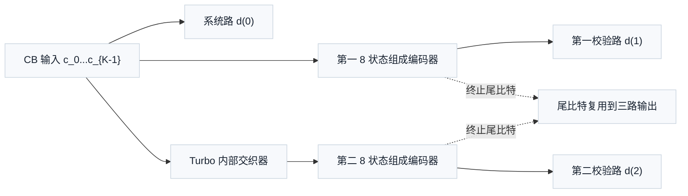
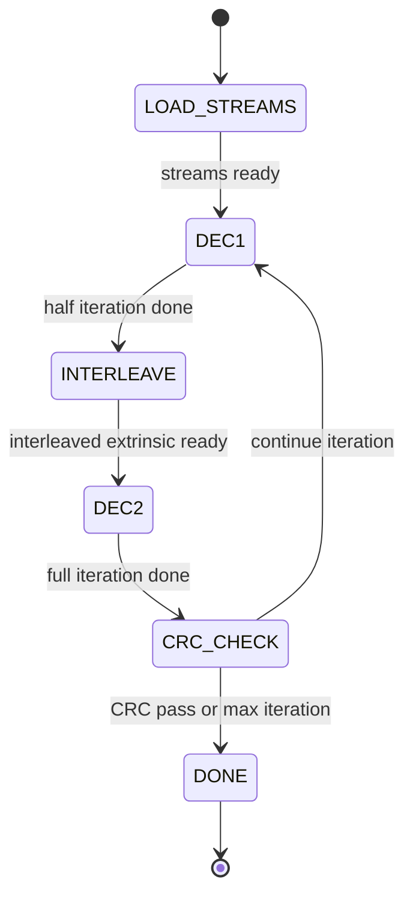
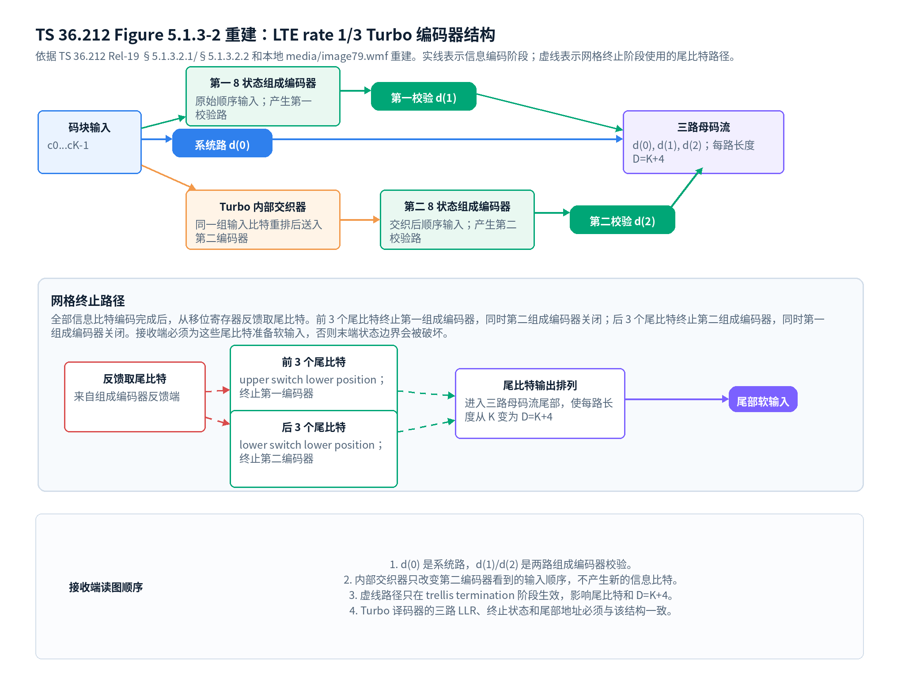

# T6.3 LTE Turbo 编码器与网格终止
## 本节学习目标

本节讲 LTE Turbo编码器的协议结构和网格终止。上一节已经用玩具递归系统卷积码（Recursive Systematic Convolutional code, RSC）解释了状态、寄存器和校验输出；本节把这些概念放回 TS 36.212 Rel-19 `36212-j30` 的 Figure 5.1.3-2 和 §5.1.3.2.2。

学完本节后，应能做到：

- 说明 LTE Turbo 编码器为什么是两个 8 状态组成编码器、一个内部交织器和三路输出。
- 区分系统比特、第一校验比特、第二校验比特和尾比特。
- 解释协议中 $D=K+4$ 的含义，以及为什么不是每路长度都简单等于 $K$。
- 从译码器角度说明网格终止为什么能给最终状态提供边界条件。
- 把网格终止映射到对数似然比、循环冗余校验、寄存器传输级和专用集成电路实现约束。

如果只记住一句话：LTE Turbo 编码器对每个码块产生三路母码流，信息段后还要附加终止相关的尾比特；接收端必须给这些尾比特提供正确软输入，否则 Turbo 网格的末端状态约束会被破坏。

## 前置知识检查

| 前置项 | 本节需要达到的程度 |
|:---|:---|
| RSC 状态 | 能理解 8 状态来自 3 个寄存器。 |
| 内部交织器 | 知道它会重排同一组信息比特后送入第二组成编码器。 |
| LLR | 知道它是 Turbo 译码器的软输入。 |
| CB | 知道每个 CB 独立进行 Turbo 编码和译码。 |
| 传输块 | 知道 TB 可能被拆成多个 CB。 |

本节仍然站在接收端看编码器。原因是译码器必须按编码器结构搭建反向网格：编码器有几个状态、几路输出、尾比特如何排列，译码器就必须准备对应的软输入、状态约束和地址。

## 资料与协议边界

协议定位如下：

| 协议位置 | 本地证据路径 |
| :--- | :--- |
| TS 36.212 Rel-19 `36212-j30` §5.1.3 | `content.md` lines 683-703 |
| TS 36.212 Rel-19 `36212-j30` §5.1.3.2.1 | `sections.jsonl` paragraph 403，`content.md` lines 721-745 |
| TS 36.212 Rel-19 `36212-j30` Figure 5.1.3-2 | Word XML 邻近段落和 relationship `rId87 -> media/image79.wmf` |
| TS 36.212 Rel-19 `36212-j30` §5.1.3.2.2 | `sections.jsonl` paragraph 421，`content.md` lines 747-759 |
| TS 36.212 Rel-19 `36212-j30` §5.1.3.2.3，Table 5.1.3-3 | `tables/table_0009.csv/html` |

边界声明：TS 36.212 规定编码器输入输出和尾比特排列；它不规定 Turbo 译码器采用 MAP、Log-MAP 还是 Max-Log-MAP，也不规定迭代次数。后者是实现选择，但无论采用何种算法，都必须使用与协议编码器一致的网格和尾比特顺序。

## 术语来源与工程问题

网格终止这个名称来自卷积码的网格图。网格图把“时间”和“状态”放在同一张图里：横向是输入比特位置，纵向是编码器状态。问题在于，RSC 编码器不是无记忆映射，最后一个信息比特输入后寄存器里仍然保存历史。若没有终止，译码器只能假设多个末端状态都有可能；若有终止，译码器知道合法路径必须落到约定终态。

从零基础角度看，终止解决的是“故事结尾是否确定”的问题。没有结尾约束时，最后几步路径会出现多个解释；有结尾约束时，不满足终态的解释会被压低。这个定义直接带来工程后果：Turbo 译码器的后向递推、尾比特 LLR、解速率匹配母码长度和 CRC 早停都必须共享同一个终止边界。推导上，$D=K+4$ 不是任意补长，而是协议把终止输出复用到三路母码流后的每路长度；实现若跳过这一步，后续公式即使写对也会在数组边界处失效。

## 编码器结构的协议含义

TS 36.212 §5.1.3.2.1 把 LTE Turbo 编码器描述为 PCCC，即并行级联卷积码（Parallel Concatenated Convolutional Code, PCCC）。并行的含义是两个组成编码器都处理同一个 CB 的信息，只是第二个组成编码器看到的是经过内部交织器重排后的顺序。级联的含义不是串行输出，而是两个卷积码约束共同作用于同一组信息位。



本节结构是教学重建。协议 Figure 5.1.3-2 还画出了终止时开关位置，说明普通信息编码阶段和终止阶段的连接不同。

图 T6.3-1 是对 TS 36.212 Figure 5.1.3-2 的本地表格化重建。它不是从 WMF 文件直接截图，而是依据协议文本和 `media/image79.wmf` 的结构关系重画：上半部分展示信息编码阶段的三路母码流，下半部分展示 trellis termination 阶段的虚线尾比特路径。


| 内容 | 说明 |
|:---|:---|
| 码块输入 | c0...cK-1 |
| 第一 8 状态组成编码器 | 原始顺序输入；产生第一校验路 |
| Turbo 内部交织器 | 同一组输入比特重排后送入第二编码器 |
| 第二 8 状态组成编码器 | 交织后顺序输入；产生第二校验路 |
| 三路母码流 | d(0), d(1), d(2)；每路长度 D=K+4 |
| 反馈取尾比特 | 来自组成编码器反馈端 |
| 前 3 个尾比特 | upper switch lower position；终止第一编码器 |
| 后 3 个尾比特 | lower switch lower position；终止第二编码器 |
| 尾比特输出排列 | 进入三路母码流尾部，使每路长度从 K 变为 D=K+4 |
| 1. d(0) 是系统路，d(1)/d(2) 是两路组成编码器校验。 | 2. 内部交织器只改变第二编码器看到的输入顺序，不产生新的信息比特。；3. 虚线路径只在 trellis termination 阶段生效，影响尾比特和 D=K+4。；4. Turbo 译码器的三路 LLR、终止状态和尾部地址必须与该结构一致。 |
阅读时先看实线路径：CB 输入一路直接形成系统路 $d^{(0)}$，一路进入第一 8 状态组成编码器形成 $d^{(1)}$，一路经 Turbo 内部交织器后进入第二 8 状态组成编码器形成 $d^{(2)}$。再看虚线路径：所有信息比特编码结束后，从组成编码器反馈端取尾比特；前 3 个尾比特终止第一组成编码器，后 3 个尾比特终止第二组成编码器。

这张重建图需要和协议文字一起读。TS 36.212 §5.1.3.2.1 给出 PCCC、两个 8 状态组成编码器、内部交织器和 1/3 码率；§5.1.3.2.2 给出尾比特取自 shift-register feedback、前 3 个尾比特用于第一组成编码器、后 3 个尾比特用于第二组成编码器。本节图表中的虚线不是“可选增强路径”，而是终止阶段才生效的路径；接收端若把虚线尾比特当作普通信息段处理，或者在速率恢复后丢掉尾部软输入，Turbo 网格的末端状态约束就会错。

## 三路输出和 1/3 码率

对信息段第 $k$ 个输入比特，三路输出可抽象为：

$$
d_k^{(0)}=c_k
\tag{1}
$$

$$
d_k^{(1)}=p^{(1)}_k
\tag{2}
$$

$$
d_k^{(2)}=p^{(2)}_k
\tag{3}
$$

式 (1) 回答“系统路是什么”：它直接承载原输入比特。式 (2) 和式 (3) 回答“两路校验是什么”：第一路来自原顺序输入的组成编码器，第二路来自交织顺序输入的组成编码器。

若只看信息段，每输入 1 个比特产生 3 个编码比特，所以母码率为：

$$
R_{\mathrm{mother}}=\frac{1}{3}
\tag{4}
$$

式 (4) 是母码率，不等于空口最终有效码率。速率匹配会打孔、重复和选择不同冗余版本，因此实际发送的编码比特数由后续 TS 36.212 §5.1.4.1 决定。

## $D=K+4$ 的解释

TS 36.212 §5.1.3 在信道编码总入口规定，Turbo coding with rate 1/3 时：

$$
D=K+4
\tag{5}
$$

这个公式回答“每个编码输出流有多长”。$K$ 是 Turbo 编码器输入比特数，也就是当前 CB 的编码输入长度；$D$ 是每一路输出流的长度。$+4$ 来自终止相关输出在三路流中的排列结果，而不是表示每个组成编码器只有 4 个状态。

接收端工程后果很直接：若当前 CB 的 $K=6144$，每路 Turbo 母码流长度不是 6144，而是：

$$
D=6144+4=6148
\tag{6}
$$

三路合计母码位置数量为：

$$
N_{\mathrm{mother}}=3D=3(K+4)
\tag{7}
$$

式 (7) 回答“解速率匹配反填时需要准备多少母码软位置”。若实现只分配 $3K$ 个位置，尾比特软信息会丢失，译码器末端状态约束会错。

## 网格终止的动机

RSC 有记忆，编码结束时寄存器里通常还保存着非零状态。若不处理末端状态，译码器在网格最后一列不知道应该收敛到哪个状态，只能把多个可能状态都当成候选。这会降低最后几个比特及其相邻比特的可靠度。

网格终止的目的就是把组成编码器驱动回已知状态。直观上，它像让一个有惯性的机器在结束前回到停车位。对译码器来说，已知终点状态等价于一个强边界条件：

协议结构图中单独标出“网格终止路径”：它表示信息位输入结束后，组成编码器仍要输出终止相关的 tail bits，把 trellis 路径推回约定终态；接收端因此能在后向度量初始化时使用明确的末端状态约束。

$$
P(S_K=0)\approx1
\tag{8}
$$

式 (8) 回答“终止给译码器什么信息”。$S_K$ 表示结束时刻状态，$0$ 表示全零状态。这里用概率写法表达直觉：译码器可以把不符合终止状态的路径大幅降权。完整实现中通常通过尾比特分支和末端度量初始化体现。

## 协议终止规则

TS 36.212 §5.1.3.2.2 规定：所有信息比特编码完成后，从移位寄存器反馈取尾比特并附加。前 3 个尾比特用于终止第一组成编码器，此时第二组成编码器 disabled；后 3 个尾比特用于终止第二组成编码器，此时第一组成编码器 disabled。

将协议语句翻译成接收端语言：

| 尾比特组 | 作用对象 | 另一个编码器 | 接收端含义 |
|:---|:---|:---|:---|
| 前 3 个尾比特 | 第一组成编码器 | 第二组成编码器 disabled | 第一网格末端有 3 拍终止分支。 |
| 后 3 个尾比特 | 第二组成编码器 | 第一组成编码器 disabled | 第二网格末端有 3 拍终止分支。 |

为什么是 3 个尾比特？因为 LTE 组成编码器是 8 状态，含 3 个寄存器。每个终止输入可以控制一次状态更新，3 次足以把 3 个记忆单元清到已知状态。这个解释是编码器状态机直觉；具体尾比特如何从反馈取出由协议 Figure 5.1.3-2 的开关结构定义。

## 尾比特在三路流中的接收端后果

接收端不需要重新生成发送端的尾比特作为信息输出，但必须给译码网格提供尾比特对应的软观测。原因是尾比特决定末端分支是否可信。如果尾比特位置在解速率匹配中被错放，译码器会把错误证据加到末端状态。

对每个 CB，Turbo 译码器软输入长度应按 $D=K+4$ 准备：

$$
\mathbf{L}^{(i)}=\left[L^{(i)}_0,L^{(i)}_1,\ldots,L^{(i)}_{D-1}\right],\quad i\in\{0,1,2\}
\tag{9}
$$

式 (9) 回答“三路软输入数组的形状”。前 $K$ 个位置主要对应信息段，后 4 个位置承载协议规定的终止输出排列。不同实现可能在内部把尾比特拆成更细的终止分支输入，但外部母码流长度必须与协议 $D$ 对齐。

## 手算例子：终止长度对 buffer 的影响

这是教学例子。设一个小 CB 长度为 $K=8$。根据式 (5)：

$$
D=8+4=12
\tag{10}
$$

三路母码软输入共：

$$
3D=36
\tag{11}
$$

若工程师误以为每路只有 $K=8$ 个位置，则只分配：

$$
3K=24
\tag{12}
$$

少掉：

$$
36-24=12
\tag{13}
$$

这 12 个母码位置不是 12 个信息尾比特，而是三路输出流中终止相关位置的总缺口。它们经过速率匹配后可能部分发送、部分打孔或重复。接收端不能在 Turbo 输入端直接丢掉这些位置。

## 算法伪代码

发送端结构的教学伪代码如下：

```text
input c[0 .. K-1]
z = turbo_internal_interleaver(c)
for k in 0 .. K-1:
    d0[k] = c[k]
    d1[k] = first_constituent_encoder_parity(c[k])
    d2[k] = second_constituent_encoder_parity(z[k])
generate tail bits for first constituent encoder
generate tail bits for second constituent encoder
multiplex termination outputs into d0, d1, d2 so each stream has D = K + 4 bits
```

接收端准备 Turbo 译码输入的伪代码如下：

```text
for each code block r:
    D = K_r + 4
    allocate L0[0 .. D-1], L1[0 .. D-1], L2[0 .. D-1]
    fill all positions with erasure LLR
    de-rate-match received LLRs into the three streams
    run constituent decoder 1 on original order trellis with termination
    interleave extrinsic information
    run constituent decoder 2 on interleaved trellis with termination
    deinterleave extrinsic information
    iterate until CRC pass or max iteration
```

这里的终止不是可选优化。即使尾比特在某个冗余版本中没有全部发送，译码器也必须保留这些母码位置，用中性 LLR 表示未知，而不是缩短网格。

## 浮点仿真

本节建议浮点仿真验证三个点：长度、尾比特位置、末端状态约束。

| 项目 | 建议值 |
|:---|:---|
| 依赖 | Python 3 标准库和可选 `numpy`。 |
| 随机种子 | `20260620`。 |
| 输入 | 若干小 $K$ 教学块和一个协议合法 $K$，例如 Table 5.1.3-3 中的 $K=40$。 |
| 输出 | $D=K+4$、三路数组长度、尾比特位置日志、终止状态。 |
| 验收阈值 | 每个合法 $K$ 的三路长度均为 $K+4$；终止阶段后状态为约定终态；无数组越界。 |

可复现实验命令建议为：

```text
python3 tools/lte_turbo_tail_trace.py --seed 20260620 --K 40
```

本次阶段 4 已新增 `tools/figures/render_lte_turbo_encoder_structure.py`，把协议 Figure 5.1.3-2 的主体结构和终止虚线路径重建为图表。后续若实现 bit-exact Turbo encoder，还应进一步把开关位置转成可执行状态转移，并明确每个尾部输出位进入 $d^{(0)}$、$d^{(1)}$、$d^{(2)}$ 的索引。

## 定点化策略

终止比特本身是编码比特，接收端保存的是对应 LLR。定点化时需要保证尾比特和信息段使用同一符号约定、同一饱和规则和同一擦除值。

| 场景 | 定点要求 | 失败后果 |
|:---|:---|:---|
| 尾比特收到强 LLR | 饱和后仍保留正确符号 | 末端路径被错误压制。 |
| 尾比特未发送 | 使用中性擦除 LLR | 不应凭空偏向某个尾比特值。 |
| 混合自动重传请求合并尾比特 | 与信息段同样合并 | 重传无法增强末端约束。 |
| 末端度量初始化 | 内部度量位宽足够 | 状态度量溢出导致终止约束失效。 |

若采用 Max-Log-MAP 近似，终止状态通常通过末端度量给非法终态一个很小的值。定点实现不能用无法表示的负无穷，常用最小饱和值表示：

$$
\beta_K(s)=
\begin{cases}
0, & s=s_{\mathrm{term}}\\
-M, & s\ne s_{\mathrm{term}}
\end{cases}
\tag{14}
$$

式 (14) 回答“后向递推末端怎样体现已知终止状态”。$M$ 是足够大的定点惩罚值，具体取值是实现选择。

## RTL/ASIC 架构映射

在硬件中，编码器结构会影响译码器结构。主要映射如下：

| 协议结构 | RTL/ASIC 对应模块 | 设计关注点 |
|:---|:---|:---|
| 两个 8 状态组成编码器 | 两个半迭代 SISO 核或一个复用 SISO 核 | 面积和吞吐折中。 |
| 内部交织器 | 地址生成器和外信息重排存储 | 读写冲突和 bank 映射。 |
| 三路输出流 | 三路 LLR buffer | $D=K+4$ 长度和尾比特位置。 |
| 网格终止 | 末端状态初始化和尾比特分支 | 尾比特 soft input 不能丢。 |

译码控制可以抽象为：



LOAD_STREAMS 阶段必须加载 $3(K+4)$ 个母码位置的软信息，包括擦除位置。若控制器只按 $3K$ 计数，后续所有尾比特地址都会错位。

## 验证方法

验证应覆盖协议长度、终止状态和尾比特 soft input 三类风险：

| 验证项 | 输入 | 预期 |
|:---|:---|:---|
| 长度断言 | 多个合法 $K$ | 每路 $D=K+4$。 |
| 尾比特反填 | 构造带尾比特 LLR 的母码流 | 尾比特进入后 4 个流位置或实现约定的终止结构。 |
| 终止状态 | 编码器状态轨迹 | 两个组成编码器各自回到终态。 |
| 译码边界 | 尾比特被打孔 | 网格长度不变，尾比特 LLR 为擦除。 |

代表性用例 1：$K=40$ 单 CB，无重传。输入为协议合法最小块长对应的三路母码 LLR。输出为长度 44 的三路软输入。边界条件是最小 $K$。验证方式是数组长度、地址范围和尾比特位置断言。失败案例是只分配 40 深度。

代表性用例 2：$K=6144$ 最大块长，尾比特部分未发送。输入为速率匹配反填后的 LLR 和未发送标志。输出为三路长度 6148 的数组，未发送尾比特为擦除。边界条件是最大存储深度。验证方式是无溢出、无越界、末端度量初始化正确。失败案例是把未发送尾比特硬填 0。

## 常见错误

| 错误 | 根因 | 后果 |
|:---|:---|:---|
| 把 $D=K+4$ 当成总长度 | 忽略每路输出流定义 | buffer 小 3 倍或索引错。 |
| 忽略尾比特 | 只关注信息段 | 末端状态约束丢失，译码性能下降。 |
| 把两个组成编码器同时终止 | 未理解 disabled 规则 | 尾比特排列和协议不一致。 |
| 第二编码器未使用交织输入 | 漏掉内部交织器 | Turbo 分集结构消失。 |
| 尾比特未发送时硬填 0 | 混淆擦除和硬比特 | 网格末端产生虚假证据。 |

## 自测题

1. LTE Turbo 编码器为什么有三路输出？
2. 若 $K=1000$，每路输出长度 $D$ 是多少？三路母码位置总数是多少？
3. 前 3 个尾比特和后 3 个尾比特分别终止哪个组成编码器？
4. 接收端为什么不能因为尾比特未发送就缩短 Turbo 网格？

## 自测题参考答案

1. 一路是系统比特，两路分别是两个 8 状态组成编码器产生的校验比特。第二个组成编码器使用内部交织后的输入。
2. $D=K+4=1004$，三路母码位置总数为 $3D=3012$。
3. 前 3 个尾比特终止第一组成编码器，后 3 个尾比特终止第二组成编码器。
4. 网格长度和终止结构由协议母码定义。未发送只表示对应位置没有观测证据，应填擦除 LLR；缩短网格会改变状态边界和编码约束。

## 图示


## 执行与证据记录

| 项目 | 记录 |
|:---|:---|
| 本地协议 | `3GPP_Rel19/specs/36212-j30.docx`，`3GPP_Rel19/processed/TS_36.212_36212-j30/source.docx`。 |
| 抽取证据 | `content.md` lines 721-759，`sections.jsonl` paragraph 403、421。 |
| 图证据 | Figure 5.1.3-2 通过 Word XML 邻近段落和 relationship `rId87 -> media/image79.wmf` 定位；已用 `tools/figures/render_lte_turbo_encoder_structure.py` 重建为 `docs/L2/assets/T6.3_TS36.212_Figure_5.1.3-2_turbo_encoder_rebuild.png`，并目检无文字遮挡。 |
| 表格证据 | Table 5.1.3-3 通过 `tables/table_0009.csv/html` 定位，用于合法 $K$ 背景。 |
| 审计计划 | 本次阶段 4 修订后运行 T6 相关术语、标题、深度和 LaTeX 渲染审计。 |

## 协议证据表

| 结论 | TS 36.212 Rel-19 `36212-j30` 证据 | 本地路径 |
|:---|:---|:---|
| Turbo 编码每路输出长度为 $D=K+4$ | §5.1.3 | `content.md` lines 697-699 |
| Turbo 编码器为 PCCC，含两个 8 状态组成编码器和一个内部交织器 | §5.1.3.2.1，Figure 5.1.3-2 | `sections.jsonl` paragraph 403，`content.md` lines 721-745，`media/image79.wmf`；本地重建图 `docs/L2/assets/T6.3_TS36.212_Figure_5.1.3-2_turbo_encoder_rebuild.png` |
| Turbo 编码率为 1/3 | §5.1.3.2.1 | `content.md` lines 721-737 |
| 第二组成编码器输入为内部交织器输出 | §5.1.3.2.1 | `content.md` lines 743-745 |
| 前 3 个尾比特终止第一组成编码器，后 3 个尾比特终止第二组成编码器 | §5.1.3.2.2 | `content.md` lines 747-753 |

## 参考文献

- [3GPP, 2026] 3GPP TS 36.212 V19.3.0, `36212-j30`, "E-UTRA; Multiplexing and channel coding", Release 19, March 2026.
- [Bahl, 1974] L. R. Bahl, J. Cocke, F. Jelinek, and J. Raviv, "Optimal decoding of linear codes for minimizing symbol error rate", IEEE Transactions on Information Theory, 1974.
- [Berrou, 1993] C. Berrou, A. Glavieux, and P. Thitimajshima, "Near Shannon limit error-correcting coding and decoding: Turbo-codes", IEEE International Conference on Communications, 1993.
