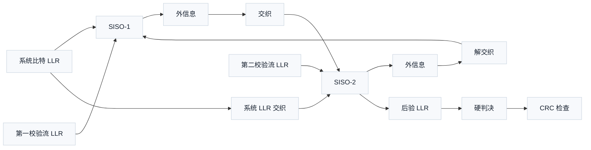

# T6.7 Turbo 迭代、外信息交换与停止
## 本节学习目标

Turbo译码的关键不只是单个软输入软输出译码器，而是两个译码器之间的迭代合作。第一个译码器从系统比特和第一路校验比特中得到新可靠度，经过交织后传给第二个译码器；第二个译码器再结合第二路校验比特，经过解交织传回第一个译码器。这个循环让两个不同视角的网格约束逐步积累证据。

本节讲软输入软输出（Soft-Input Soft-Output, SISO）译码器、外信息、交织/解交织、迭代调度、后验判决、循环冗余校验早停和最大迭代限制。对数似然比仍是全部软信息的表示方式。

- 画出两个 SISO 译码器之间外信息流动方向。
- 解释外信息为什么要扣除信道信息和先验信息。
- 跟踪一轮 Turbo 迭代中的交织、解交织、后验 LLR 和硬判决。
- 说明 CRC 早停的接收端意义和风险边界。
- 区分 TS 36.212 规定的 CRC/Turbo 结构与接收机自选的迭代停止策略。

## 前置知识检查

| 前置项 | 本节需要达到的程度 |
|:---|:---|
| Log-MAP/Max-Log-MAP | 知道 SISO 译码器可输出后验 LLR 和外信息。 |
| 交织器 | 知道交织是位置重排，解交织是反向位置重排。 |
| CRC | 知道 CRC pass/fail 可用于判断候选硬判决是否可信。 |
| 码块 | 知道传输块可能被分成多个码块。 |
| 硬件控制 | 知道最大迭代次数和早停会影响延迟与吞吐。 |

如果只记住一句话：Turbo 迭代是在两个 SISO 译码器之间交换“新增可靠度”，CRC 早停是在候选硬判决已经满足协议校验时提前结束实现流程。

从名称和历史来源看，Turbo 迭代的“Turbo”不是协议层状态机名称，而是两个组成译码器像涡轮两级叶片一样反复增强可靠度的算法直观。它解决的问题是单个卷积网格只能利用一部分校验约束，两个交织视角合并后才能逐步逼近更可靠的后验概率。常见误解是把迭代次数看成协议固定值；实际定义、推导和符号都属于接收端实现，工程后果是延迟、功耗、块错误率和 CRC 早停策略需要共同权衡。

## 资料与协议边界

TS 36.212 Rel-19 `36212-j30` 规定 CRC 计算、码块分段和 LTE Turbo 编码器结构，这些是接收端必须对齐的比特级事实。TS 36.212 不规定接收机必须迭代几次、是否使用 CRC 早停、采用 Log-MAP 还是 Max-Log-MAP；这些属于接收机实现策略。

| 层次 | 依据 |
| :--- | :--- |
| CRC 计算 | TS 36.212 Rel-19 `36212-j30` §5.1.1 |
| 码块分段和码块 CRC | TS 36.212 Rel-19 `36212-j30` §5.1.2 |
| Turbo 编码结构 | TS 36.212 Rel-19 `36212-j30` §5.1.3.2.1 |
| 网格终止 | TS 36.212 Rel-19 `36212-j30` §5.1.3.2.2 |
| 内部交织器 | TS 36.212 Rel-19 `36212-j30` §5.1.3.2.3、Table 5.1.3-3 |
| 迭代次数和早停 | 接收机实现策略 |

本节只把 CRC 和 LTE Turbo 结构作为协议锚点；外信息公式、早停策略、调度图和硬件队列设计均为接收端工程实现说明。

## 双 SISO 译码器结构

LTE Turbo 编码器是并行级联卷积码，发送侧有两个组成编码器。接收端自然对应两个 SISO 译码器：

| 译码器 | 使用的信道证据 | 使用的先验 | 输出 |
|:---|:---|:---|:---|
| SISO-1 | 系统比特 LLR、第一校验流 LLR | 来自 SISO-2 的解交织外信息 | 非交织顺序的后验 LLR 和外信息。 |
| SISO-2 | 交织后的系统比特 LLR、第二校验流 LLR | 来自 SISO-1 的交织外信息 | 交织顺序的后验 LLR 和外信息。 |

这里的 SISO 不是无线多天线中的单输入单输出，而是译码算法语境中的软输入软输出。软输入表示输入不是硬比特，而是可靠度；软输出表示输出也不是只有 0/1，而是每个比特的后验可靠度。

%%{init: {'theme': 'default'}}%%


本节结构描述的是接收机内部实现流程，不是 TS 36.212 的规范图。协议规定发送侧编码结构和交织器关系；接收端用该结构设计迭代译码器。

## 外信息的定义与必要性

每个 SISO 译码器输出后验 LLR：

$$
L_{\mathrm{post},k}=L(u_k\mid \mathbf{y})
\tag{1}
$$

式 (1) 回答的是：结合当前译码器能看到的全部证据后，第 $k$ 个比特倾向 0 还是 1。它包含三类来源：系统信道证据、输入先验、当前组成码校验约束带来的新增证据。

外信息定义为：

$$
L_{\mathrm{ext},k}=L_{\mathrm{post},k}-L_{\mathrm{ch},k}-L_{\mathrm{a},k}
\tag{2}
$$

式 (2) 回答的是：当前译码器真正新增了多少证据。若把完整后验 LLR 直接传给另一个译码器，另一个译码器会再次使用同一系统信道证据和先验证据，造成重复计数。重复计数会让 LLR 绝对值虚高，表现为译码器过度自信，错误路径更难被后续迭代纠正。

这条规则也叫外信息非回声原则：传出去的只能是“我基于自己那一路校验新学到的东西”，不能把对方刚给我的先验原样反弹回去。用集合语言看，两个 SISO 译码器共享同一批系统位信道证据，只是校验流和交织视角不同；如果每轮都把共享证据重复相加，迭代图会从“交换独立增量”变成“放大同一证据”。这类错误在低信噪比时表现为收敛慢，在高信噪比时更危险：错误比特可能被迅速推到很大的错误 LLR 幅度，后续迭代反而难以拉回。

## 一轮迭代的信号流程

一次完整 Turbo 迭代通常包含两个半迭代：

1. SISO-1 使用非交织顺序的系统 LLR、第一校验 LLR 和来自 SISO-2 的先验，输出 $L_{\mathrm{ext1}}$。
2. $L_{\mathrm{ext1}}$ 按 LTE 内部交织器映射重排，成为 SISO-2 的先验。
3. SISO-2 使用交织顺序的系统 LLR、第二校验 LLR 和交织先验，输出交织顺序的 $L_{\mathrm{ext2}}$。
4. $L_{\mathrm{ext2}}$ 解交织回原始顺序，成为下一轮 SISO-1 的先验。
5. SISO-2 或组合后的后验 LLR 解交织后做硬判决，并触发 CRC 检查。

用符号写，若交织映射为 $\pi(k)$，SISO-1 输出外信息：

$$
L_{\mathrm{a2},\pi(k)}=L_{\mathrm{ext1},k}
\tag{3}
$$

SISO-2 输出后解交织：

$$
L_{\mathrm{a1},k}^{\mathrm{next}}=L_{\mathrm{ext2},\pi(k)}
\tag{4}
$$

式 (3) 和式 (4) 回答的是同一个工程问题：两个译码器讨论的是同一批信息比特，但第二个译码器看到的是交织后的顺序，所以外信息必须按地址映射重排。

## 教学例子：四比特外信息交换

设一个教学交织器为：

$$
\pi=[2,0,3,1]
\tag{5}
$$

含义是原始位置 $k=0,1,2,3$ 分别送到交织后位置 $2,0,3,1$。若 SISO-1 输出：

$$
\mathbf{L}_{\mathrm{ext1}}=[0.8,-0.3,1.2,0.1]
\tag{6}
$$

交织后给 SISO-2 的先验为：

$$
\mathbf{L}_{\mathrm{a2}}=[-0.3,0.1,0.8,1.2]
\tag{7}
$$

解释如下：原始 index 0 的 $0.8$ 被放到交织 index 2；原始 index 1 的 $-0.3$ 被放到交织 index 0；原始 index 2 的 $1.2$ 被放到交织 index 3；原始 index 3 的 $0.1$ 被放到交织 index 1。

如果 SISO-2 输出交织顺序外信息：

$$
\mathbf{L}_{\mathrm{ext2,int}}=[-0.1,0.5,1.0,0.7]
\tag{8}
$$

解交织回原始顺序：

$$
\mathbf{L}_{\mathrm{a1}}^{\mathrm{next}}=[1.0,-0.1,0.7,0.5]
\tag{9}
$$

这个手算例子说明：交织/解交织不是数值运算，而是地址重排。硬件若地址错，即使 Log-MAP 算术全对，两个译码器也会把别的比特的证据当成自己的证据。

## 相关性、振荡与错误平层

Turbo 迭代的理想直觉是两个译码器提供相对独立的新证据。但真实实现里，证据会逐轮变得相关：两个译码器共享系统 LLR，交织器长度有限，Max-Log-MAP 近似和定点饱和会改变外信息幅度，短环式的统计相关性会在某些比特集合上累积。相关性高时，继续迭代不一定继续改善块错误率，可能只是在相同错误假设周围放大置信度。

振荡是另一类症状。某些比特的后验 LLR 在迭代间反复换符号，或者 CB CRC 在 pass/fail 边界附近来回变化。工程上应记录每轮的 CRC 结果、LLR 符号翻转数和饱和计数。一个简化的振荡指标可写成：

$$
N_{\mathrm{flip}}^{(i)}=\sum_{k=0}^{K-1}\mathbf{1}\left[
\operatorname{sign}\left(L_{\mathrm{post},k}^{(i)}\right)\ne
\operatorname{sign}\left(L_{\mathrm{post},k}^{(i-1)}\right)
\right]
$$

这个指标回答“第 $i$ 次迭代相对上一轮有多少硬判决倾向改变”。若 $N_{\mathrm{flip}}^{(i)}$ 长时间不下降，说明迭代没有稳定收敛；若它迅速为 0 但 CRC 仍失败，说明译码器可能稳定在错误码字附近或外信息过度自信。

错误平层（error floor）指高信噪比下 BLER 不再按瀑布区斜率继续下降，而是在低错误率区出现平台或缓慢下降。对 LTE Turbo，常见诱因包括低重量输入事件、交织器相关性、尾比特/终止边界、Max-Log-MAP 缩放不当、LLR clipping、混合自动重传请求软合并饱和和 CRC 早停误判。它不是 TS 36.212 规定的协议现象，而是算法、块长、交织、量化和验证统计共同作用的性能现象。

早停策略必须考虑这些风险。CRC pass 是强工程信号，但 CRC 有有限漏检概率；若实现还存在 filler、CB 拼接、RV 或 LLR sign 错误，早停会把错误更快固化为“通过”。因此严谨验证通常同时检查：早停轮次分布、失败 CB 的 LLR dump、高 SNR directed vectors、CRC pass 但 TB 语义不一致的保护断言，以及达到 $I_{\max}$ 仍失败时的最小 failure bundle。

## 后验判决与 CRC 早停

迭代若无限进行，延迟和功耗无法接受。因此工程实现会设置最大迭代次数 $I_{\max}$。每一轮或每个半迭代后，接收端可把后验 LLR 硬判决：

$$
\hat{u}_k=
\begin{cases}
0,&L_{\mathrm{post},k}\ge 0\\
1,&L_{\mathrm{post},k}<0
\end{cases}
\tag{10}
$$

然后对候选比特执行 CRC 检查。若 CRC 通过，译码器可以提前停止：

$$
\mathrm{stop}=(\mathrm{crc\_pass}=1)\lor(i=I_{\max})
\tag{11}
$$

式 (11) 是接收机实现策略，不是 3GPP 强制停止公式。协议锚点是 TS 36.212 §5.1.1 规定 CRC 计算，§5.1.2 规定码块分段和码块 CRC 附加；接收机可以利用这些协议定义的校验关系判断候选硬判决是否可接受。

早停的意义是降低平均延迟和功耗。信道好时，可能第 2 到第 4 次迭代已经 CRC 通过；若仍强制跑满 8 次，会浪费时钟和能量。风险是实现必须确保 CRC 检查使用正确的比特顺序、正确的 filler 处理和正确的 CB/TB 汇总规则。

## 多码块停止策略

当一个 TB 被分成多个 CB 时，接收端通常按 CB 译码并检查码块 CRC。一个 TB 的接受条件不能只看某一个 CB 通过，而要所有相关 CB 都通过并完成重组。可用教学逻辑表示：

$$
\mathrm{tb\_pass}=\bigwedge_{r=0}^{C-1}\mathrm{cb\_pass}_r
\tag{12}
$$

式 (12) 回答的是多 CB 汇总条件。它不是协议原文公式，而是接收端对码块 CRC 结果的工程汇总表达。若某个 CB 到达最大迭代仍 CRC 失败，TB 通常不能上交为正确数据，媒体接入控制层后续会结合混合自动重传请求过程处理重传或合并。

## 算法伪代码

以下伪代码描述接收机实现流程，不是 3GPP 规范伪代码。

```text
输入：系统 LLR、校验 1 LLR、校验 2 LLR、交织地址、最大迭代次数
输出：硬判决比特、CRC 状态、实际迭代次数

1. 初始化 SISO-1 先验 LLR 为 0。
2. 对迭代 i = 1 到 I_max：
   a. SISO-1 使用系统 LLR、校验 1 LLR、先验 LLR 运行 Log-MAP 或 Max-Log-MAP。
   b. 计算 SISO-1 外信息，并按交织地址写入 SISO-2 先验缓存。
   c. SISO-2 使用交织系统 LLR、校验 2 LLR、交织先验运行译码。
   d. 计算 SISO-2 外信息，并解交织写回 SISO-1 先验缓存。
   e. 解交织 SISO-2 后验 LLR，生成硬判决。
   f. 执行 CRC 检查。
   g. 若 CRC 通过，记录 i 并停止。
3. 若达到 I_max 仍未通过 CRC，输出失败状态和最后一次硬判决。
```

## 浮点仿真方案

| 仿真项 | 方法 | 通过条件 |
|:---|:---|:---|
| 交织/解交织 | 使用式 (5) 的 4 比特例子 | 复现式 (7) 和式 (9)。 |
| 外信息扣除 | 构造 $L_{\mathrm{post}}$、$L_{\mathrm{ch}}$、$L_{\mathrm{a}}$ | 满足式 (2)。 |
| 早停 | 构造第 3 轮 CRC pass 的测试桩 | 实际迭代次数为 3。 |
| 最大迭代 | 构造 CRC 一直 fail 的测试桩 | 跑满 $I_{\max}$ 后输出 fail。 |
| 多 CB 汇总 | 设置 CB pass 向量 `[1, 1, 0]` | TB pass 为 0。 |

随机仿真建议固定种子 `20260619`，记录码块长度、交织参数、算法模式、最大迭代次数、早停开关和 CRC 多项式。

## 定点化策略

| 对象 | 定点策略 | 工程风险 |
|:---|:---|:---|
| 输入 LLR | 与解调器和解速率匹配输出位宽一致 | 符号约定错会导致全部判决反转。 |
| 外信息 | 单独裁剪，常小于内部路径度量范围 | 外信息过大导致迭代过度自信。 |
| 先验缓存 | 交织顺序和非交织顺序可能分开存储 | 地址映射错误会破坏迭代。 |
| 后验 LLR | 用于硬判决和调试导出 | 饱和可能掩盖边界错误。 |
| CRC 输入比特 | 硬判决后按协议顺序排列 | filler、CB 拼接或尾比特混入都会造成误判。 |

定点模型应先 bit-exact 对齐浮点/高精度模型，再交给寄存器传输级和专用集成电路实现。不要只看最终 CRC pass，因为错误实现可能在个别高信噪比样例上偶然通过。

## RTL/ASIC 架构映射

Turbo 迭代译码器的硬件控制通常包含：

| 模块 | 职责 | 验证重点 |
|:---|:---|:---|
| Descriptor 控制 | 保存 CB 长度、交织参数、最大迭代和模式 | 参数锁存时序。 |
| SISO 计算核心 | 执行 Log-MAP 或 Max-Log-MAP | 路径度量、归一化、外信息。 |
| 交织地址生成 | 生成 $\pi(k)$ 和反向映射 | 与 TS 36.212 Table 5.1.3-3 参数一致。 |
| 外信息静态随机存取存储器 | 存储 SISO 间消息 | 读写 bank 冲突和清零。 |
| CRC 单元 | 对硬判决候选执行校验 | 启动时机、输入顺序和 pass 采样。 |
| 早停控制 | CRC pass 或最大迭代触发停止 | 不丢输出，不提前释放资源。 |

吞吐和延迟关系可粗略表示为：

$$
T_{\mathrm{cb}}\approx I_{\mathrm{used}}\left(T_{\mathrm{siso1}}+T_{\mathrm{siso2}}+T_{\mathrm{perm}}\right)+T_{\mathrm{crc}}
\tag{13}
$$

式 (13) 是工程估算，不是协议公式。$I_{\mathrm{used}}$ 是实际迭代次数；早停降低平均 $I_{\mathrm{used}}$，但最坏情况仍由 $I_{\max}$ 决定。

## 验证方法

| 验证目标 | 测试方法 | 失败案例 |
|:---|:---|:---|
| 一轮迭代可追踪 | dump SISO-1 外信息、交织结果、SISO-2 外信息、解交织结果 | 地址错或外信息符号错。 |
| CRC 早停正确 | 注入第 $i$ 轮 pass | 早停晚一轮、早一轮或重复输出。 |
| 最大迭代正确 | CRC 永远 fail | 计数越界或死循环。 |
| 多 CB 汇总正确 | 混合 pass/fail CB | TB 被错误标记为 pass。 |
| 反压与复位 | 输出 ready 拉低、译码中复位 | 外信息缓存污染或状态机卡死。 |

## 常见错误

| 错误 | 后果 | 修正方式 |
|:---|:---|:---|
| 把完整后验当外信息传递 | 重复计数，LLR 虚高 | 按式 (2) 扣除信道和先验。 |
| 忘记解交织 | SISO-1 收到错位先验 | 使用反向地址表验证。 |
| CRC 输入包含尾比特或错误 filler | 早停误判 | 严格区分信息比特、CRC 比特、尾比特和 filler。 |
| 单 CB pass 就宣布 TB pass | 多 CB 数据损坏 | 使用式 (12) 汇总所有 CB。 |
| 把早停写成协议强制要求 | 协议边界错误 | 标注早停为实现策略。 |

## 工程思考题

1. 外信息不扣除先验会导致什么数值现象？
2. CRC 早停为什么能降低平均延迟但不能改善最坏延迟？
3. 多 CB 场景下，一个 CB 失败时 TB 是否可接受？
4. 若交织地址生成错一位，为什么 CRC 可能直到最后才暴露问题？

## 自测题

1. SISO-1 和 SISO-2 分别使用哪一路校验 LLR？
2. 外信息公式中要扣除哪两类旧证据？
3. CRC 早停依赖 TS 36.212 的哪些协议锚点？
4. 最大迭代限制解决什么工程问题？
5. 式 (12) 表达了什么多码块验收逻辑？

## 自测题参考答案

1. SISO-1 使用第一校验流，SISO-2 使用第二校验流；两者都使用系统比特信息，只是 SISO-2 使用交织顺序。
2. 扣除系统信道 LLR 和输入先验 LLR，保留当前组成码约束新增的可靠度。
3. CRC 计算锚定 TS 36.212 §5.1.1，码块分段和码块 CRC 锚定 §5.1.2；Turbo 结构锚定 §5.1.3.2.1 到 §5.1.3.2.3。
4. 最大迭代限制约束最坏延迟、功耗和硬件资源占用。
5. 只有所有 CB 都通过时，TB 才能作为整体通过；任一 CB 失败都会使 TB 失败。

## 协议证据表

| 主题 | 协议锚点 | 本地证据路径 | 本节结论 |
|:---|:---|:---|:---|
| CRC 计算 | TS 36.212 Rel-19 `36212-j30` §5.1.1 | `3GPP_Rel19/processed/TS_36.212_36212-j30/content.md` | CRC pass/fail 可作为候选硬判决验收观察点。 |
| 码块分段和码块 CRC | TS 36.212 Rel-19 `36212-j30` §5.1.2 | `3GPP_Rel19/processed/TS_36.212_36212-j30/content.md` | 多 CB 译码需要按 CB 检查并汇总 TB 结果。 |
| Turbo 编码结构 | TS 36.212 Rel-19 `36212-j30` §5.1.3.2.1、Figure 5.1.3-2 | `3GPP_Rel19/processed/TS_36.212_36212-j30/content.md`；`docs/L2/assets/T6.3_TS36.212_Figure_5.1.3-2_turbo_encoder_rebuild.png` | 双 SISO 结构来自两个 8 状态组成编码器和内部交织器。 |
| 网格终止 | TS 36.212 Rel-19 `36212-j30` §5.1.3.2.2 | `3GPP_Rel19/processed/TS_36.212_36212-j30/content.md` | 尾比特影响 SISO 边界状态。 |
| 内部交织器 | TS 36.212 Rel-19 `36212-j30` §5.1.3.2.3、Table 5.1.3-3 | `3GPP_Rel19/processed/TS_36.212_36212-j30/content.md` | 外信息交织/解交织必须与发送侧地址映射一致。 |
| CRC 早停 | 非 3GPP 强制流程 | 接收机实现策略 | 可利用协议 CRC 结果降低平均迭代次数。 |
## 执行与证据记录

| 项目 | 记录 |
|:---|:---|
| 总纲复核 | 已阅读 `合规与遵从.md` 的 Hard Constraints、Document & Code Formatting Standards、输出规范。 |
| 风格参照 | 已阅读 `docs/L1/T5.1_fixed_point_numbers_for_LLR.md`、`docs/L1/T5.5_decoder_hardware_verification_mindset.md`。 |
| 路线图卡片 | 已读取 `2026-06-19-lte-nr-decoding-learning-roadmap.md` 中 T6.7。 |
| 协议资料 | 已检查 `3GPP_Rel19/manifest.csv`、`3GPP_Rel19/processed/manifest.json`、`3GPP_Rel19/processed/TS_36.212_36212-j30/README.md`、`content.md`、`sections.jsonl`。 |
| 技能使用 | 已读取并采用 `3gpp-word-extraction` 技能的抽取件阅读与证据记录要求。 |
| 协议边界 | CRC/Turbo 结构锚定 TS 36.212；外信息调度、早停和最大迭代标注为实现策略。 |
| 审计计划 | 完成四篇后统一运行术语、标题、深度和 LaTeX 渲染审计。 |

## 参考文献

- [Berrou, 1993] C. Berrou, A. Glavieux, and P. Thitimajshima, "Near Shannon Limit Error-Correcting Coding and Decoding: Turbo-Codes", IEEE International Conference on Communications, 1993.
- [Hagenauer, 1996] J. Hagenauer, E. Offer, and L. Papke, "Iterative Decoding of Binary Block and Convolutional Codes", IEEE Transactions on Information Theory, 1996.
- [Robertson, 1995] P. Robertson, E. Villebrun, and P. Hoeher, "A Comparison of Optimal and Sub-Optimal MAP Decoding Algorithms Operating in the Log Domain", IEEE International Conference on Communications, 1995.
- [TS 36.212, 2026] 3GPP TS 36.212 V19.3.0, Release 19, `36212-j30`, "E-UTRA; Multiplexing and channel coding"; local path `3GPP_Rel19/processed/TS_36.212_36212-j30`.
