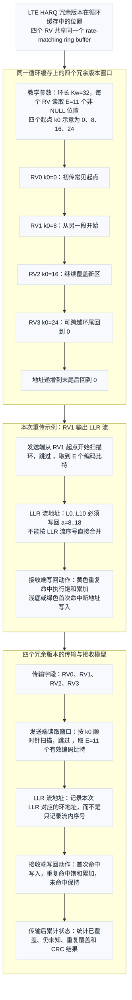

# T7.3 LTE HARQ 软缓存与冗余版本
## 本节学习目标

本节学习 LTE Turbo接收链路中的混合自动重传请求软缓存、冗余版本和重传合并。这里的“软缓存”不是保存已经判成 0/1 的硬比特，而是保存对数似然比这类软信息：符号表示更像 0 还是 1，绝对值表示可靠度。

本节主线只有一个：当某个传输块第一次译码失败时，接收端不能把已经收到的软信息丢掉；后续重传到来时，也不是简单覆盖旧数据，而是把同一编码比特位置的新旧 LLR 合并。冗余版本（redundancy version, RV）通过 `rvidx` 给出，它决定本次从速率匹配循环缓存的哪个起点和区域读取。接收端必须用同一个环地址模型把 LLR 写回 HARQ soft buffer。

学完后应能做到：

- 解释 HARQ soft buffer 保存 LLR 的原因，而不是保存硬判决比特。
- 说明 `rvidx=0/1/2/3` 是同一个循环缓存上的四个读取窗口，不是四套编码器。
- 解释增量冗余如何补充前一次被打孔或未发送的校验信息。
- 手算一个小型循环缓存中 RV0、RV1、RV2、RV3 的覆盖、重复和合并。
- 区分分段 filler、子块交织 `<NULL>`、本次未发送位置和重复发送位置。
- 说明定点饱和加法、软缓存大小和寄存器传输级/专用集成电路映射风险。

## 前置知识检查

| 前置项 | 本节需要达到的程度 |
|:---|:---|
| LTE Turbo 解速率匹配 | 知道接收端要把收到的 LLR 放回速率匹配循环缓存，再拆回三路 Turbo 输入。 |
| 子块交织 `<NULL>` | 知道 `<NULL>` 是协议填入的无效占位，接收端扫描循环缓存时要跳过它。 |
| 码块 | 知道一个传输块可能分成多个 CB，每个 CB 独立做速率匹配和 Turbo 译码。 |
| 传输块 | 知道 HARQ 成功/失败最终围绕 TB 交付和反馈闭环。 |
| 循环冗余校验 | 知道译码后用 CB CRC 和 TB CRC 判断是否通过。 |
| 调制与编码方案 | 知道 MCS 会影响本次可发送比特数和译码难度。 |

如果这些前置知识还不稳，阅读本节时先抓住一个不变量：soft buffer 的索引不是“LLR 流第几个”，而是“循环缓存中的编码比特地址”。

## 路线图 Prompt 覆盖表

| Prompt 要求 | 本节覆盖位置 | 覆盖方式 |
|:---|:---|:---|
| 讲解 LTE HARQ 软缓存大小 | “软缓存大小与协议参数” | 解释 `NIR`、`Ncb`、`Nsoft`、`KMIMO`、`MDL_HARQ`、`Mlimit` 的接收端含义和实现边界。 |
| 讲解冗余版本 | “冗余版本的协议语义”与图 T7.3-1 | 把 `rvidx` 解释为同一循环缓存上的 RV0/RV1/RV2/RV3 读取窗口。 |
| 讲解增量冗余 | “增量冗余的接收端含义” | 说明新 RV 覆盖前次未知或被打孔位置，补充校验证据。 |
| 讲解重传 LLR 如何更新缓存 | “HARQ soft buffer 的对象模型”和“接收端软缓存流程” | 给出按环地址写回、首次命中、重复命中、未命中和 `<NULL>` 跳过规则。 |
| 说明重传如何补充前一次被打孔或未发送的校验信息 | “增量冗余的接收端含义”和数值例子 | 用 RV0 到 RV3 的覆盖过程说明未知位置如何变成有 LLR 证据。 |
| 说明相同编码比特位置 LLR 如何累加或饱和 | “数学定义与推导”和“定点化策略” | 给出浮点求和式与定点饱和式。 |
| 包含小型循环缓存合并例子 | “小型循环缓存合并例子” | 使用 $K_w=12$ 与四个 RV 的手算表。 |
| 讨论定点饱和 | “定点化策略” | 给出 6 bit signed soft buffer 的正饱和、负饱和和冲突观测例子。 |
| 参考弹性审计清单 | 全文结构 | 保留学习目标、前置检查、协议证据、理论解释、接收流程、伪代码、仿真、定点、RTL/ASIC、验证、错误、思考题、证据记录和参考文献，但按本节主题重排顺序。 |

这张表也是后续全项目整改的样板：任务卡片的 Prompt 不能只在标题上“沾边”，正文必须能逐条找到讲解和证据。

## 资料与协议边界

本节主要精读 TS 36.212 Rel-19 `36212-j30` §5.1.4.1 和 §5.1.4.1.2。协议文本给出的关键链条是：Turbo 编码后的三路比特流先做子块交织，再做 bit collection，形成 circular buffer；随后根据 soft buffer 限制、`E` 和 `rvidx` 选择本次发送的 rate matching 输出序列。

| 协议对象 | 本地路径 |
| :--- | :--- |
| TS 36.212 Rel-19 §5.1.4.1 | `3GPP_Rel19/processed/TS_36.212_36212-j30/TS_36.212_36212-j30_content.md` 行 777-789 |
| TS 36.212 Rel-19 §5.1.4.1.1 | `3GPP_Rel19/processed/TS_36.212_36212-j30/TS_36.212_36212-j30_content.md` 行 791-815；`tables/table_0010.csv`、`table_0010.html` |
| TS 36.212 Rel-19 §5.1.4.1.2 | `3GPP_Rel19/processed/TS_36.212_36212-j30/TS_36.212_36212-j30_content.md` 行 817-923 及后续 bit selection 段；`source.docx` 中 `rId155-rId177` 对应公式图表 |
| TS 36.213 Rel-19 §8.3、§8.6、§8.6.1 | `3GPP_Rel19/processed/TS_36.213_36213-j30_s08-s09/TS_36.213_36213-j30_s08-s09_content.md` 行 1121-1171、1227-1389 |
| TS 36.321 Rel-19 §4.3.2、§4.4、§5.3.2.1、§5.3.2.2、§5.4.2.1 | `3GPP_Rel19/processed/TS_36.321_36321-j20/TS_36.321_36321-j20_content.md` 行 839-863、1991-2107、2285-2295 |

边界要明确：3GPP 规定发送端 rate matching 的比特选择语义和 soft buffer size 相关参数；接收端内部用几位保存 LLR、如何划分静态随机存取存储器bank、是否压缩未观测位置、如何做读改写仲裁，是实现问题。实现可以不同，但同一编码比特位置的软信息语义不能改变。

## 协议前因后果

Turbo 编码器输出的母码比特通常多于一次无线传输实际能承载的比特数。原因很直接：无线资源由调度、带宽、调制阶数、层数和码率共同决定，而编码器产生的是一个更大的可选比特集合。速率匹配的任务，就是从这个集合里选出本次真正发送的 $E$ 个比特。

如果第一次传输失败，系统有两种选择。第一种是普通重复：下一次仍然发送几乎相同的比特，接收端把相同位置的 LLR 累加，提高可靠度。第二种是增量冗余：下一次尽量发送上次没发过的校验信息，使译码器看到更多母码约束。LTE Turbo 的 RV 机制把这两种效果统一进同一个 circular buffer：不同 RV 从不同起点抽取，既可能覆盖新地址，也可能与旧地址重叠。

从接收端看，HARQ soft buffer 解决的是“失败后证据如何保存”的问题。CRC 失败只说明当前证据不足以恢复正确 TB，不说明已收到的 LLR 没价值。把 soft buffer 清空会浪费前一次传输；把重传 LLR 覆盖旧 LLR 会丢掉独立观测；把未发送位置当业务 0 会给 Turbo 译码器错误先验。这些都是接收机质量明显下降的原因。

## 扩展学习范围

Prompt 覆盖表是最低验收线，本节还要额外讲清以下工程背景，否则读者只能知道“要合并”，却不知道系统为什么这样设计：

| 扩展主题 | 补充原因 | 本节位置 |
|:---|:---|:---|
| HARQ 过程生命周期 | soft buffer 不是孤立数组，它随 HARQ 过程创建、保留、更新和释放。 | “HARQ 过程的接收端生命周期” |
| LLR 累加的概率来源 | 软合并不是经验技巧，而是独立观测在 LLR 域相加。 | “软合并可靠度的概率解释” |
| RV 序列与调度边界 | 协议规定 `rvidx` 语义，具体何时发哪个 RV 来自调度和 HARQ 过程。 | “RV 序列与调度边界” |
| 接收端 descriptor | 硬件或模型需要一组字段驱动地址生成和 soft buffer 写回。 | “接收端 descriptor 字段” |
| 工业调试场景 | 实际失败往往不是 Turbo 核心算法错，而是 soft buffer 上下文或 RV 映射错。 | “工业用例” |

## 冗余版本的协议语义

TS 36.212 §5.1.4.1.2 使用 `rvidx` 表示 redundancy version number。对下行共享信道和 PCH，协议文本明确 `rvidx` 取 0、1、2、3；对部分 MCH 配置，取值范围与更高层参数有关。本节聚焦 DL-SCH/PCH 的四个 RV，因为它最能说明 LTE Turbo HARQ soft buffer 的接收端模型。

冗余版本不是“换一个 Turbo 编码器”，也不是“换一个译码算法”。它是同一个 rate matching circular buffer 上的读取窗口选择。可以把 circular buffer 想成一个环：地址从 0 开始递增，走到末尾后回到 0。`rvidx` 改变本次读取窗口的起点，窗口长度由本次 code block 的输出长度 $E$ 决定；接收端收到的顺序 LLR 流，必须按照相同起点和扫描规则写回这个环。

图 T7.3-1 使用教学参数把这个关系画成一个长图。它不是规范测试向量；规范公式在后文“协议公式与接收端推导”中复原。本图用于直观看清四件事：RV0、RV1、RV2、RV3 是同一环上的四个窗口；每个 RV 会产生一串顺序 LLR；接收端按环地址写回 HARQ soft buffer；四次传输后覆盖区域逐步扩大。




图中的左侧环不是四套编码器，而是同一循环缓存上的四个冗余版本窗口。RV0、RV1、RV2、RV3 改变的是读取窗口的起点；地址沿 ring buffer 递增，走到末尾后回到 0。图中教学参数为 `Kw=32`、每个 RV 读取 `E=11` 个非 `<NULL>` 位置、四个示意起点 `k0=0/8/16/24`。这些数字只用于教学，真实工程要由 TS 36.212 的 `Ncb/E/rvidx/k0/<NULL>` 规则生成。

右上角的“本次重传示例：RV1 输出 LLR 流”强调接收端最容易写错的映射：软解调器给出的是顺序 LLR 流 `L0...L10`，但 soft buffer 的写回索引是环地址 `a=8...18`。因此日志里必须同时保存 LLR 流序号和环地址；如果只按流序号合并，RV1 会被错误地当成“覆盖 L0...L10 的旧位置”，重传增益会被破坏。

右下角的 soft buffer 更新表分成四类地址，列名必须按“环地址、状态、写回动作、含义”理解：

| 环地址 | 状态 | 写回动作 | 含义 |
|:---|:---|:---|:---|
| `a=8..10` | RV0 已有旧 LLR，RV1 再命中 | `sat(L_old + L_rx)` | 重复覆盖；同一编码比特的新旧独立观测在 LLR 域累加。 |
| `a=11..18` | 之前未知，RV1 首次命中 | `0 + L_rx` | 增量冗余；过去未观测的母码位置获得新证据。 |
| `a=19..31` | 本次 RV1 未命中 | 保持旧值或中性 0 | 未观测或未更新；不能凭空生成 LLR。 |
| `<NULL>` | 协议补入的空位置 | 跳过，不消费 LLR | 非编码比特；不能写入 soft buffer，也不能计入 E 个有效 LLR。 |

核心公式是：同一环地址 `a` 上的独立观测在 LLR 域相加，硬件实现用饱和加法。写成接收端更新就是 `LLR_buf[a] = sat(LLR_buf[a] + LLR_rx[i])`，其中 `i` 是本次接收 LLR 流序号，`a` 是由 `rvidx/k0` 和 `<NULL>` 跳过规则恢复出的循环缓存地址。这里不能把 `i` 当成 `a`，否则 HARQ 合并会把不同母码位置的证据错误相加。

下半部分的“四个冗余版本的传输与接收模型”把每次 HARQ 传输拆成五列：`传输`、`发送端读取窗口`、`LLR 流地址`、`接收端写回动作`、`传输后累计状态`。`发送端读取窗口` 记录本次 `k0`、顺时针扫描和 `<NULL>` 跳过；`LLR 流地址` 记录每个 `L_i` 落在哪个环地址；`接收端写回动作` 区分新覆盖、重复覆盖和未命中保持；`传输后累计状态` 统计已经覆盖多少个环地址、仍未知多少个地址、CRC 失败时是否保留上下文。

图例颜色也有工程语义：黄色表示重复命中，必须执行饱和累加；浅底或绿色表示首次命中新地址，旧值从中性 LLR 变成本次接收 LLR；灰色或空白表示仍未观测或本次未命中。读图顺序与工程检查点是：先确认左侧同一个环上的 RV 窗口；再确认右上 LLR 流按 RV 起点映射回环地址；再检查右下 soft buffer 的首次命中、重复命中、未命中保持和 `<NULL>` 跳过；最后在验证记录中保存 `k0`、`E`、命中地址、新覆盖数、重复覆盖数、饱和次数和 CRC 结果。

## HARQ 过程的接收端生命周期

一个 HARQ soft buffer 的生命周期可以分成五个阶段：

| 阶段 | 接收端事件 | soft buffer 状态 | 译码器关注点 |
|:---|:---|:---|:---|
| 创建 | 收到新传输指示，建立 `(harq_id, tb_id)` 上下文 | 全部地址为中性 LLR，`seen=False` | 初始化不能残留旧 TB 数据。 |
| 初传写入 | RV0 或其他初传 RV 到来 | 部分地址获得第一次 LLR | 未命中地址仍为未知，不是业务 0。 |
| 译码失败保留 | CB CRC 或 TB CRC 未通过 | 已有 LLR 保留 | 不释放上下文，等待重传。 |
| 重传合并 | 新 RV 到来 | 新地址写入，旧地址累加 | 地址必须按本次 `rvidx` 重新生成。 |
| 成功释放 | TB CRC 通过并完成交付 | 相关 soft buffer 可回收 | 释放前后不能污染其他 HARQ 过程。 |

这个生命周期解释了一个常见现象：同一个 Turbo decoder core 可以服务很多 TB，但 HARQ soft buffer 不能只按 decoder core 复用。它必须按 HARQ 过程和 CB 隔离，否则一个失败 TB 的重传 LLR 可能被写到另一个 TB 的历史 soft buffer 里。

## RV 序列与调度边界

本节只把 `rvidx` 当作译码器输入字段处理。TS 36.212 负责说明 `rvidx` 进入 rate matching bit selection 的位置；具体某次重传使用哪个 RV、何时重传、何时停止，属于调度和 HARQ 过程控制边界，通常来自物理层控制信息和媒体接入控制层/HARQ 状态机。这个边界已经用 TS 36.213 §8.3、§8.6/§8.6.1 和 TS 36.321 §5.3.2/§5.4.2 核验：前者给 HARQ-ACK、UL-SCH 的 MCS/RV/TBS 读取背景，后者给 MAC HARQ entity/process、soft buffer 合并和 ACK/NACK 路由背景。

对译码器而言，重要的不是背一个固定 RV 序列，而是正确消费每次传入的 `rvidx`。实现上要避免把“常见序列”写死成地址生成逻辑。测试向量应覆盖以下情况：

| 情况 | 译码器期望行为 |
|:---|:---|
| RV0 后接 RV2 | 按 RV2 的起点生成地址，不能假设一定先来 RV1。 |
| 重传长度 $E$ 改变 | 本次只消费新的 $E$ 个 LLR，历史 soft buffer 保持。 |
| HARQ 过程号复用 | 新 TB 到来前必须清旧 soft buffer。 |
| 某次调度缺失 | soft buffer 保持，不能凭空生成 LLR。 |

这也是本节不把 TS 36.213/TS 36.321 细节强行写成 rate matching 公式的原因：T7.3 的译码器核心责任是“给定 `rvidx`、$E$、`Ncb` 和 LLR，正确更新 soft buffer”。TS 36.213/TS 36.321 的已核验证据只说明 HARQ 过程、ACK/NACK、RV 字段来源和 MAC soft buffer 行为确实属于外围控制边界。

## HARQ soft buffer 的对象模型

工程实现中，必须把五类对象分清楚：

| 对象 | 所在层次 | 接收端动作 | 常见误解 |
|:---|:---|:---|:---|
| 母码循环缓存 | Turbo rate matching 后的编码比特地址空间 | 作为 LLR 写回索引空间 | 误以为它是收到的 LLR 流数组。 |
| RV 读取窗口 | 由 `rvidx`、$E$、`Ncb` 和 `<NULL>` 跳过规则确定 | 生成本次接收 LLR 到环地址的映射 | 误以为 RV 是四份不同码字。 |
| 接收 LLR 流 | 软解调器输出的顺序软信息 | 按 RV 映射逐个写回 | 误按流序号与旧缓存对齐。 |
| HARQ soft buffer | 按 `(harq_id, cb_id, addr)` 索引的软信息存储 | 首次写入、重复累加、未命中保持 | 误把重传写成覆盖旧值。 |
| `<NULL>` 掩码 | 子块交织产生的无效占位 | 扫描时跳过，不消费 LLR | 误把 `<NULL>` 当业务 0 或可合并位置。 |

这个对象模型比单纯背协议名词更重要。只要对象混淆，错误就会很隐蔽：CRC 会失败，但你很难从最终硬判决看出到底是 RV 起点错、`<NULL>` 跳过错、soft buffer 上下文串扰，还是 LLR 符号反了。

## 增量冗余的接收端含义

增量冗余的“增量”不是指接收端增加一个新译码器，而是指 soft buffer 中有更多编码比特位置获得了观测证据。第一次 RV0 可能覆盖系统比特和一部分校验比特；RV1 或 RV2 可能覆盖前一次没有发送的校验比特；窗口重叠的位置提供重复观测。Turbo 译码器看到的是一个更完整、更可靠的三路输入。

Chase Combining 和 Incremental Redundancy HARQ 的理论动机不同。Chase Combining 更像“同一批编码比特重复发送”：母码坐标覆盖集合基本相同，收益来自同一比特多次独立观测的 LLR 累加，噪声平均后可靠度提高。Incremental Redundancy 更像“逐步发送母码的不同部分”：新 RV 覆盖此前打孔或未发送的校验位置，收益不仅是 LLR 幅度变大，还包括 Turbo 译码器获得新的校验约束。

| HARQ 方式 | soft buffer 视角 | 概率收益 | LTE Turbo RV 场景中的表现 |
|:---|:---|:---|:---|
| Chase Combining | 多次命中同一地址集合 | 同一编码位的独立观测 LLR 相加 | RV 窗口高度重叠或资源配置导致重复覆盖。 |
| Incremental Redundancy | 新 RV 命中新地址 | 未观测校验位从 unknown 变成 known，约束更完整 | `rvidx` 改变 $k_0$，覆盖不同循环缓存区域。 |
| 混合情况 | 部分重叠、部分新增 | 重复位置增可靠度，新位置补约束 | LTE circular buffer 常见，需要统计 new/repeated/unknown。 |

因此 T7.3 的 RV ring buffer 图不能只看四个窗口是否存在，还要看窗口之间的交集和并集。接收端日志至少应报告 `new_cover_count`、`repeat_cover_count`、`unknown_count_after` 和 `sat_count`；否则无法区分“Chase-like 重复有效”“IR 新覆盖有效”和“RV mismatch 导致假重复”。

可以把重传收益分成两类：

| 类型 | 环地址表现 | 对 Turbo 译码器的价值 | 典型来源 |
|:---|:---|:---|:---|
| 重复合并 | 本次 RV 命中已经观测过的地址 | 同一个编码比特的 LLR 幅度可能变大，可靠度提高 | Chase-like 重复、窗口重叠、低码率重复。 |
| 增量冗余 | 本次 RV 命中过去未观测的地址 | 新增校验约束，让译码器看到更多母码信息 | RV 起点改变、之前被打孔或未发送的位置被覆盖。 |

这两类收益可以同时发生。一个 RV 窗口的一部分地址可能和历史窗口重叠，另一部分地址可能是新覆盖。接收端不能只统计“这次收到 $E$ 个 LLR”，还要统计这些 LLR 分别落在新地址还是旧地址上。

接收端可以把每个环地址分为三种状态：

| 状态 | soft buffer 值 | 本次 RV 到来后的处理 |
|:---|:---|:---|
| 从未观测 | 中性 LLR，通常为 0 | 若本次命中，写入本次 LLR。 |
| 已观测且本次未命中 | 旧 LLR | 保持不变。 |
| 已观测且本次再次命中 | 旧 LLR | 与本次 LLR 做加法，定点实现做饱和加法。 |

这里的中性 0 是“没有证据”，不是“业务比特 0”。LLR 为 0 表示 $\Pr(b=0)$ 和 $\Pr(b=1)$ 当前同样可能；业务比特 0 是译码器最后硬判决的候选结果。把这两者混淆，会让测试日志看起来“全是 0”，但语义完全不同。

## 协议公式与接收端推导

先定义符号。设某个 code block 的 circular buffer 长度为 $K_w$，本次可用 soft buffer 长度为 $N_{\mathrm{cb}}$，本次 rate matching 输出 LLR 数量为 $E$。`rvidx` 决定 bit selection 起点 $k_0$，$k_0$ 再决定本次 LLR 流写回 HARQ soft buffer 的环地址。

TS 36.212 §5.1.4.1.2 的关键点不是单独一个公式，而是一条从“UE soft buffer 能力”到“每个接收 LLR 写到哪个环地址”的链条：

```text
Nsoft -> NIR -> Ncb -> E -> k0 -> while 扫描 w[(k0+j) mod Ncb] -> e_k
```

对下行共享信道和寻呼信道（Paging Channel, PCH），第 $r$ 个 code block 的 soft buffer 长度为：

$$
N_{\mathrm{cb}}
=
\min\left(
\left\lfloor \frac{N_{\mathrm{IR}}}{C}\right\rfloor,\ K_w
\right)
\tag{1}
$$

这里 $C$ 是 transport block 分段后的 code block 数量，$K_w$ 是 Turbo rate matching circular buffer 的长度。式 (1) 回答的问题是：第 $r$ 个 CB 最多允许在 soft buffer 中保留多少个 circular-buffer 地址。它不是本次传输实际收到的 LLR 个数；本次收到多少由后面的 $E$ 决定。

对上行共享信道、未配置 `pmch-TimeInterleavingN` 的 MCH、SL-SCH 和 SL-DCH，协议给出：

$$
N_{\mathrm{cb}}=K_w
\tag{2}
$$

换言之，这些场景不按式 (1) 用 DL soft-buffer 能力预算裁剪每个 CB 的 circular-buffer 长度。UE category 0 在若干 DL-SCH/PCH 场景也有 $N_{\mathrm{cb}}=K_w$ 的例外，本节不展开 UE category 细则，只强调实现必须把 transport-channel/context 输入带入 `Ncb` 计算。

对 DL-SCH/PCH，transport block soft buffer size 的主体公式为：

$$
N_{\mathrm{IR}}
=
\left\lfloor
\frac{\alpha N_{\mathrm{soft}}}
{K_C K_{\mathrm{MIMO}}\min(M_{\mathrm{DL\_HARQ}},M_{\mathrm{limit}})}
\right\rfloor
\tag{3}
$$

式 (3) 中 $N_{\mathrm{soft}}$ 是 UE 类别和高层配置给出的 soft channel bits 能力；$K_C$ 是协议按特定 $N_{\mathrm{soft}}$ 和配置分支给出的系数；$K_{\mathrm{MIMO}}$ 反映部分下行 MIMO 场景；$M_{\mathrm{DL\_HARQ}}$ 是最大 DL HARQ 过程数；$M_{\mathrm{limit}}=8$；$\alpha$ 是 Rel-19 中与 PDSCH 传输时长相关的系数，subframe/slot/subslot 以及重传场景有不同取值。接收端实现的意义是：同一 UE 能力下，并发 HARQ 过程越多、MIMO/配置约束越强，单个 TB 能分到的 soft buffer 预算越小。

本次 code block 的 rate matching 输出长度 $E$ 由 transport block 可用传输比特数 $G$ 分配到各个 CB。协议先定义：

$$
G'=\frac{G}{N_L Q_m}
\tag{4}
$$

其中 $N_L$ 是一个 transport block 映射到的层数，$Q_m$ 是调制阶数对应的每符号比特数。再定义：

$$
\gamma = G' \bmod C
\tag{5}
$$

于是第 $r$ 个 CB 的 $E$ 为：

$$
E =
\begin{cases}
N_L Q_m\left\lfloor \frac{G'}{C}\right\rfloor, & r \le C-\gamma-1\\
N_L Q_m\left\lceil \frac{G'}{C}\right\rceil, & r > C-\gamma-1
\end{cases}
\tag{6}
$$

式 (6) 的作用是把一个 TB 的可用传输比特尽量平均分给 $C$ 个 CB。若不能整除，后面的 $\gamma$ 个 CB 多拿一个 $N_LQ_m$ 粒度的份额。接收端必须用同一条规则切分 demapper 输出 LLR，否则 CB0/CB1 的 LLR 流边界会错位。

对 DL-SCH/PCH，冗余版本起点为：

$$
k_0=
R_{\mathrm{TC}}^{\mathrm{subblock}}
\left(
2
\left\lceil
\frac{N_{\mathrm{cb}}}{8R_{\mathrm{TC}}^{\mathrm{subblock}}}
\right\rceil
\mathrm{rv}_{\mathrm{idx}}
+2
\right)
\tag{7}
$$

式 (7) 需要特别小心排版含义。它表示 $R_{\mathrm{TC}}^{\mathrm{subblock}}$ 乘以后面括号整体；括号中是 $2\left\lceil N_{\mathrm{cb}}/(8R_{\mathrm{TC}}^{\mathrm{subblock}})\right\rceil\mathrm{rv}_{\mathrm{idx}}+2$，不是把 `rvidx` 外面的各项随意相加。更直观地写成工程实现形式：

$$
k_0=
R_{\mathrm{TC}}^{\mathrm{subblock}}
\left[
2
\left\lceil
\frac{N_{\mathrm{cb}}}{8R_{\mathrm{TC}}^{\mathrm{subblock}}}
\right\rceil
\mathrm{rv}_{\mathrm{idx}}
+2
\right]
\tag{8}
$$

其中 $R_{\mathrm{TC}}^{\mathrm{subblock}}$ 是 TS 36.212 §5.1.4.1.1 定义的 sub-block interleaver 行数，$\mathrm{rv}_{\mathrm{idx}}\in\{0,1,2,3\}$。式 (7)/(8) 是 RV 变成循环缓存起点的协议桥梁：`rvidx` 每改变一次，$k_0$ 就跳到另一段区域附近，而不是只在日志里换一个标签。

协议随后用 while 循环产生发送序列。接收端做逆过程时，也要保持同样的地址语义：

$$
\text{若 } w_{(k_0+j)\bmod N_{\mathrm{cb}}}\ne \langle \mathrm{NULL}\rangle,\quad
e_k=w_{(k_0+j)\bmod N_{\mathrm{cb}}}
\tag{9}
$$

并且只有式 (9) 的条件成立时，$k$ 才递增；不论是否命中 `<NULL>`，扫描偏移 $j$ 都递增。这个细节就是 `<NULL>` 不消费 LLR 的协议来源。

上面的公式从发送侧描述 $e_k$ 如何生成。接收端把它反过来理解：收到的第 $k$ 个 LLR 应写回到 $w_{(k_0+j)\bmod N_{\mathrm{cb}}}$ 对应的 soft buffer 地址，前提是该地址不是 `<NULL>`。

忽略 `<NULL>` 跳过时，本次收到的第 $i$ 个 LLR 对应环地址：

$$
a_i=\left(k_0(\mathrm{rvidx})+i\right)\bmod N_{\mathrm{cb}},\quad i=0,1,\ldots,E-1
\tag{10}
$$

式 (10) 只是便于理解的简化模型。真实 LTE 还要跳过 `<NULL>`，所以实现中通常写成扫描指针：

$$
a_i=\operatorname{nextValid}\left(k_0(\mathrm{rvidx}), i, \mathrm{nullMask}, N_{\mathrm{cb}}\right)
\tag{11}
$$

式 (11) 中 `nextValid` 表示从起点开始顺序扫描 circular buffer，遇到 `<NULL>` 地址不消费 LLR，直到找到第 $i$ 个有效编码比特地址。

设第 $m$ 次传输对地址 $a$ 的观测 LLR 为 $L_m[a]$，覆盖地址 $a$ 的传输集合为 $\mathcal{M}(a)$。浮点 soft combining 为：

$$
L_{\mathrm{comb}}[a]=\sum_{m\in\mathcal{M}(a)} L_m[a]
\tag{12}
$$

如果地址 $a$ 从未被任何传输覆盖，则：

$$
L_{\mathrm{comb}}[a]=0,\quad \mathcal{M}(a)=\varnothing
\tag{13}
$$

式 (13) 的 0 是 LLR 中性值。若某地址旧值为 $+1.4$，新观测为 $+0.9$，合并为 $+2.3$，可靠度增强；若新观测为 $-1.1$，合并为 $+0.3$，表示两次观测冲突，可靠度下降。

定点实现不能无限增大 LLR，必须用饱和加法：

$$
L_{\mathrm{new}}[a]=
\min\left(L_{\max},\max\left(L_{\min},L_{\mathrm{old}}[a]+L_{\mathrm{rx}}[a]\right)\right)
\tag{14}
$$

式 (14) 是硬件正确性的底线。若补码回绕，$+31 + +1$ 可能变成负数，译码器会把非常可靠的 0 错看成偏向 1。

## 软合并可靠度的概率解释

LLR 累加来自贝叶斯推理。设同一个编码比特 $b$ 被两次独立传输观测到 $y_1$ 和 $y_2$。两次观测合起来的 LLR 为：

$$
L(b\mid y_1,y_2)=
\log\frac{\Pr(b=0\mid y_1,y_2)}{\Pr(b=1\mid y_1,y_2)}
\tag{15}
$$

若两次噪声观测在给定 $b$ 后近似独立，则似然可以相乘：

$$
\Pr(y_1,y_2\mid b)=\Pr(y_1\mid b)\Pr(y_2\mid b)
\tag{16}
$$

代入 LLR 比值后，乘法变成对数域加法：

$$
L(b\mid y_1,y_2)=L(b\mid y_1)+L(b\mid y_2)
\tag{17}
$$

式 (17) 解释了 soft combining 的本质：接收端不是“把两个数随便加起来”，而是在同一编码比特地址上合并两次独立观测的证据。若两次观测符号一致，可靠度增强；若符号相反，可靠度相互抵消。工程实现的饱和加法是在有限位宽下近似这个概率规则。

## 小型循环缓存合并例子

这是教学例子，不是规范 LTE 向量。设 circular buffer 长度 $K_w=12$，没有 `<NULL>`，soft buffer 初值全部为中性 LLR 0。设四个 RV 的教学起点为：

| RV | 起点 $k_0$ | 本次长度 $E$ | 命中地址 |
|:---|---:|---:|:---|
| RV0 | 0 | 5 | 0, 1, 2, 3, 4 |
| RV1 | 3 | 5 | 3, 4, 5, 6, 7 |
| RV2 | 6 | 5 | 6, 7, 8, 9, 10 |
| RV3 | 9 | 5 | 9, 10, 11, 0, 1 |

第一次传输 RV0，收到：

| 地址 | 0 | 1 | 2 | 3 | 4 |
|---:|---:|---:|---:|---:|---:|
| LLR | +2.0 | -1.0 | +0.5 | +1.0 | -0.5 |

RV0 后 soft buffer 为：

| 地址 | 0 | 1 | 2 | 3 | 4 | 5 | 6 | 7 | 8 | 9 | 10 | 11 |
|---:|---:|---:|---:|---:|---:|---:|---:|---:|---:|---:|---:|---:|
| LLR | +2.0 | -1.0 | +0.5 | +1.0 | -0.5 | 0 | 0 | 0 | 0 | 0 | 0 | 0 |
| 状态 | 新 | 新 | 新 | 新 | 新 | 未知 | 未知 | 未知 | 未知 | 未知 | 未知 | 未知 |

第二次传输 RV1，收到：

| 地址 | 3 | 4 | 5 | 6 | 7 |
|---:|---:|---:|---:|---:|---:|
| LLR | +0.8 | -1.5 | +2.5 | -0.8 | +1.2 |

地址 3 和 4 是重复命中，地址 5、6、7 是首次命中。合并后：

| 地址 | 0 | 1 | 2 | 3 | 4 | 5 | 6 | 7 | 8 | 9 | 10 | 11 |
|---:|---:|---:|---:|---:|---:|---:|---:|---:|---:|---:|---:|---:|
| LLR | +2.0 | -1.0 | +0.5 | +1.8 | -2.0 | +2.5 | -0.8 | +1.2 | 0 | 0 | 0 | 0 |
| 状态 | 旧 | 旧 | 旧 | 合并 | 合并 | 新 | 新 | 新 | 未知 | 未知 | 未知 | 未知 |

第三次传输 RV2，地址 6、7 重复，8、9、10 新覆盖。第四次 RV3，地址 9、10、0、1 重复，11 新覆盖。四次之后，12 个地址全部至少有一次观测，其中多个地址有两次观测。这个过程就是图 T7.3-1 下半部分“四个 RV 传输模型”的数值版。

如果第二次传输后 CRC 仍失败，soft buffer 不能清空；第三次传输必须在上表基础上继续累加。如果第二次传输误覆盖旧值，地址 3 会从 $+1.8$ 退化为 $+0.8$，地址 4 会从 $-2.0$ 退化为 $-1.5$，重传增益被削弱。

再看一个带回绕和 `<NULL>` 跳过的微例子。设 $N_{\mathrm{cb}}=8$，起点 $k_0=6$，`null_mask[7]=True`，本次 $E=4$。扫描顺序是 6、7、0、1、2、...，但地址 7 是 `<NULL>`，不消费 LLR，所以四个 LLR 写入地址为 6、0、1、2：

| 扫描地址 | 是否 `<NULL>` | 是否消费 LLR | 写回地址 |
|---:|:---:|:---:|---:|
| 6 | 否 | 是 | 6 |
| 7 | 是 | 否 | 不写回 |
| 0 | 否 | 是 | 0 |
| 1 | 否 | 是 | 1 |
| 2 | 否 | 是 | 2 |

这个微例子说明两个实现细节。第一，环地址会从末尾回到 0。第二，`<NULL>` 跳过会让“扫描次数”和“消费 LLR 次数”不同，不能用简单的 `addr=(k0+i)%Ncb` 直接消费每个位置。

## 接收端软缓存流程

```text
输入:
  harq_id             HARQ 过程号
  tb_id               传输块上下文
  cb_id               码块号
  rvidx               冗余版本索引
  E                   本次 code block rate matching 输出长度
  rx_llr[0:E-1]       本次软解调 LLR
  Ncb                 本 code block 可用 soft buffer 长度
  null_mask[0:Ncb-1]  <NULL> 位置掩码
  soft_buf            HARQ soft buffer

过程:
  1. 根据 rvidx 和协议参数得到本次扫描起点 k0
  2. 从 k0 开始在 circular buffer 中顺序扫描
  3. 遇到 <NULL> 地址时跳过，不消费 rx_llr
  4. 遇到有效地址 addr 时读取 rx_llr[i]
  5. 若 addr 未观测过，将 soft_buf[addr] 从中性值更新为 rx_llr[i]
  6. 若 addr 已有旧值，将 soft_buf[addr] 与 rx_llr[i] 做饱和累加
  7. 收满 E 个 LLR 后，停止本次写回
  8. 从 soft_buf 反向拆出 Turbo 三路输入，进入 Turbo 译码
 9. 若 CB CRC 和 TB CRC 通过，释放相关 HARQ 上下文
10. 若失败且仍允许重传，保留 soft buffer 等待下一 RV
```

更贴近实现的伪代码如下：

```python
def harq_soft_combine(soft, seen, rx_llr, k0, null_mask, sat_add):
    rx_index = 0
    scan_offset = 0
    ncb = len(soft)
    while rx_index < len(rx_llr):
        addr = (k0 + scan_offset) % ncb
        scan_offset += 1
        if null_mask[addr]:
            continue
        if seen[addr]:
            soft[addr] = sat_add(soft[addr], rx_llr[rx_index])
        else:
            soft[addr] = rx_llr[rx_index]
            seen[addr] = True
        rx_index += 1
```

这段伪代码有三个检查点：`null_mask` 必须先于 LLR 消费判断；`seen[addr]` 决定首次写入还是重复累加；`rx_index` 只在有效编码比特地址上递增。

## 接收端 descriptor 字段

为了让软件模型、C/C++ 定点模型和 RTL 使用同一套语义，建议把每次 CB 写回 soft buffer 的输入整理成 descriptor：

| 字段 | 来源/含义 | 使用位置 | 错误后果 |
|:---|:---|:---|:---|
| `harq_id` | HARQ 过程号 | soft buffer 上下文索引 | 不同 TB 的 LLR 串扰。 |
| `tb_id` | TB 或调度实例标识 | 释放和日志关联 | 过程号复用时难以判断旧数据。 |
| `cb_id` | 当前 CB 编号 | CB soft buffer 索引 | 多 CB 写入同一缓存。 |
| `rvidx` | 本次 RV | 地址生成起点 | 增量冗余窗口错误。 |
| `E` | 本次 CB 的 LLR 个数 | LLR 流消费长度 | 少消费或多消费导致流错位。 |
| `Ncb` | 本 CB soft buffer 地址边界 | 地址取模和容量检查 | 写越界或截断错误。 |
| `null_mask_id` | `<NULL>` 掩码版本 | 跳过无效地址 | `<NULL>` 消费 LLR。 |
| `llr_scale_id` | LLR 缩放/量化配置 | 定点饱和和比较 | 浮点/定点不一致。 |
| `new_data_flag` | 新 TB 还是重传 | 是否清空旧上下文 | 新 TB 继承旧 LLR。 |

这张表超出 Prompt 的最低要求，但它是工程落地必需的。没有 descriptor，软件、硬件和验证很容易对“同一个 RV 写回”使用不同字段集合，导致模型一致性失败。

释放条件不能含糊。CB CRC 失败说明该 CB 还不能交付；TB CRC 失败说明整个 TB 还不能向上层交付。实现可以按 CB 管理局部状态，但不能在 HARQ 闭环失败时释放整个 soft buffer，否则下一次重传无法合并。

## 软缓存大小与协议参数

TS 36.212 §5.1.4.1.2 在 bit selection 前定义 transport block 的 soft buffer size `NIR` 和第 $r$ 个 code block 的 soft buffer size `Ncb`。这些参数不是装饰，它们决定接收端需要保留多少软信息，也决定某些地址是否因为能力限制无法进入本次 soft buffer。

容量层级可以按下面顺序理解：

```text
UE soft-bit 总能力 Nsoft
  -> 单个 TB 可用预算 NIR
      -> 第 r 个 CB 可用预算 Ncb
          -> 本次 RV 实际写回的 E 个 LLR
              -> 每个 LLR 映射到 soft_buf[harq_id][cb_id][addr]
```

因此，soft buffer size 不是只影响“内存开多大”。它还影响接收端哪些 circular-buffer 地址可以被保存、哪些地址因为 `Ncb` 限制不进入本次可用缓存、HARQ 过程并发时如何分配 SRAM，以及多 CB 场景下每个 CB 的边界。若 `Ncb` 算错，即使 Turbo 核心完全正确，LLR 也会被写到错误地址或错误 CB。

| 参数 | 协议位置 | 接收端含义 | 实现风险 |
|:---|:---|:---|:---|
| `Nsoft` | UE 能力相关总 soft channel bits | 总 soft buffer 能力预算 | 能力表或高层配置读错导致内存不足或错误裁剪。 |
| `NIR` | 式 (3) | 一个 TB 可分配的软信息预算 | 多 TB、多层或多 HARQ 过程共享时容易算错。 |
| `Ncb` | 式 (1)/(2) | 该 CB circular buffer 可写回的长度边界 | 地址生成超过 `Ncb` 会写坏其他 CB。 |
| `KMIMO` | 式 (3) | 影响 soft buffer 在多层场景下的分配 | 把调度层数当成固定 1 会导致容量估算错误。 |
| `MDL_HARQ` | 最大 DL HARQ processes | 影响同时保留的 HARQ 上下文数量 | 过程号复用时旧 soft buffer 未清。 |
| `Mlimit` | 协议常量 | 限制 soft buffer 分配计算 | 漏掉限制会造成与协议参考不一致。 |
| `E` | 式 (4)-(6) | 本次要消费的 LLR 个数 | `E` 与实际 demapper 输出不一致会造成流错位。 |
| `rvidx` | 式 (7)/(8) | 本次扫描起点和覆盖区域选择 | 所有 RV 起点相同会让增量冗余失效。 |

本节已经复原 DL-SCH/PCH 主线所需的 `Ncb`、`NIR`、`E`、`k0` 和 `<NULL>` 跳过公式。Rel-19 中还包含 MCH 配置 `pmch-TimeInterleavingN` 时的 `NIR` 分支，以及 `Nsoft`/`KC` 的更多 UE category 分支；这些是协议完整实现需要覆盖的能力配置细节，但不改变本节 HARQ soft combining 的核心地址语义。后续若做 bit-exact 规范模型，应把这些分支作为配置表驱动，不应硬编码成单一 DL-SCH 公式。

教学容量例子：假设某个 TB 被分成 $C=2$ 个 CB，工程模型为每个 CB 分配 $N_{\mathrm{cb}}=16$ 个 soft positions。即使某次 RV 只收到 $E=6$ 个 LLR，soft buffer 仍要能保存此前 RV 的历史值和未来 RV 可能补充的位置。因此“本次 LLR 数量 $E$”和“可保存地址数 $N_{\mathrm{cb}}$”不是同一个概念：$E$ 是本次传输长度，$N_{\mathrm{cb}}$ 是该 CB 的缓存地址边界。

## 四类空洞的区别

| 对象 | 出现位置 | 是否进入 soft buffer | 接收端策略 |
|:---|:---|:---|:---|
| 分段 filler | 码块分段输入端，通常在第 0 个 CB 前部 | 不作为普通业务信息恢复目标 | 按 T3.3/T7.4 的分段与重组规则处理。 |
| 子块交织 `<NULL>` | 子块交织矩阵补齐位置 | 不作为有效编码比特 | 扫描 circular buffer 时跳过，不消费 LLR。 |
| 本次未发送位置 | 速率匹配选择后未被本 RV 覆盖 | 是有效编码位置，但本次无新观测 | 保留旧 LLR；若从未观测，则保持中性 0。 |
| 重复发送位置 | 多个 RV 或重复传输命中同一地址 | 是有效编码位置 | 对同一地址 LLR 累加，定点实现饱和。 |

这张表是 debug 时最重要的分界线。把 `<NULL>` 放入 soft buffer，会产生不存在的编码比特；把未发送位置删除，会破坏 Turbo 输入长度；把分段 filler 当作 RV 后续可补齐的位置，会混淆码块分段和速率匹配两个层次。

## 浮点仿真方案

浮点参考模型建议显式保存覆盖状态，而不只保存 LLR 数组：

```python
soft_buffers = {
    (harq_id, cb_id): {
        "llr": [0.0] * ncb,
        "seen": [False] * ncb,
    }
}
```

核心合并函数：

```python
def combine_harq(soft, seen, rx_llr, k0, null_mask):
    rx_index = 0
    scan = 0
    ncb = len(soft)
    while rx_index < len(rx_llr):
        addr = (k0 + scan) % ncb
        if not null_mask[addr]:
            soft[addr] += rx_llr[rx_index]
            seen[addr] = True
            rx_index += 1
        scan += 1
    return soft, seen
```

验收不能只看最终 CRC。每个 RV 后都要打印覆盖摘要：

| 记录项 | 用途 |
|:---|:---|
| `harq_id`、`cb_id`、`rvidx` | 排查上下文串扰和 RV 顺序错误。 |
| `k0`、`E`、`Ncb` | 排查起点、长度和边界错误。 |
| 命中地址列表 | 排查 `<NULL>` 跳过和环绕错误。 |
| 新覆盖数、重复覆盖数、仍未知数 | 排查增量冗余是否生效。 |
| soft buffer 前后摘要 | 排查覆盖旧值和未饱和加法。 |
| CB CRC、TB CRC | 关联软缓存行为与译码结果。 |

固定随机种子可以用 `seed=73`。先用玩具参数验证地址与合并，再接入真实 LTE 参数。这样一旦 CRC 失败，可以先判断 soft buffer 行为是否正确，而不是直接怀疑 Turbo 核心算法。

## 定点化策略

定点 soft buffer 的关键是位宽、缩放和饱和。假设 soft buffer 使用 6 bit 有符号整数，范围为 $[-32,31]$。若旧值为 `+28`，新观测为 `+10`，数学和是 `+38`，硬件应输出 `+31`。若使用补码回绕，结果会变成错误值，严重时符号翻转。

| 场景 | 输入 | 正确输出 | 错误实现 |
|:---|:---|:---|:---|
| 正饱和 | `+28 + +10` | `+31` | 回绕为负数或小正数。 |
| 负饱和 | `-30 + -8` | `-32` | 回绕为正数。 |
| 冲突观测 | `+12 + -9` | `+3` | 取绝对值相加，错误增强可靠度。 |
| 初次覆盖 | `0 + -7` | `-7` | 把 0 当业务 0 并强制正 LLR。 |
| 未命中 | old=`+5`，无 new | `+5` | 清成 0，丢掉历史证据。 |

定点仿真需要同时统计饱和次数。如果某个信噪比下饱和次数异常高，可能是 demapper LLR 缩放过大；如果几乎没有饱和但块错误率很差，可能是缩放过小、LLR 符号错误或 RV 映射错误。

## RTL/ASIC 架构映射

HARQ soft buffer 是接收端面积和带宽大户。一个工程实现通常至少包含以下模块：

| 模块 | 功能 | 关键验证点 |
|:---|:---|:---|
| HARQ 上下文表 | 保存 `harq_id`、TB 状态、RV 历史和释放状态 | 过程号复用时必须清旧缓存。 |
| CB soft buffer SRAM | 保存每个 CB 的 LLR | 地址由 `(harq_id, cb_id, addr)` 唯一确定。 |
| RV 地址生成器 | 根据 `rvidx`、`E`、`Ncb` 和 `<NULL>` mask 生成写地址 | 四个 RV 起点必须可区分，环绕必须正确。 |
| 读改写单元 | 读旧 LLR、加新 LLR、写回 | 同一 bank 冲突和旁路必须正确。 |
| 饱和加法器 | 执行定点 soft combining | 正负饱和、符号扩展、舍入策略一致。 |
| 释放控制 | CRC 通过后释放 soft buffer | 失败时不能误释放，成功后不能残留污染下一 TB。 |

并行度越高，soft buffer 越容易成为瓶颈。如果一个周期写入多个 LLR，地址生成器可能产生同 bank 访问；实现要么多 bank 化，要么排队，要么做旁路。无论选择哪种架构，外部可见语义仍是式 (14) 的按地址饱和累加。

## 工业用例

| 用例 | 输入 | 输出 | 边界条件 | 验证方式 | 失败案例 |
|:---|:---|:---|:---|:---|:---|
| 初传失败后 RV2 成功 | 同一 `(harq_id, cb_id)` 的 RV0 LLR、RV2 LLR、对应 `E/Ncb/null_mask` | 合并后的 Turbo 输入和 CRC 结果 | RV2 新覆盖多于重复覆盖；soft buffer 未释放 | 比较 RV0 后、RV2 后覆盖统计和 CRC 状态 | 失败后误清 soft buffer，RV2 只能单独译码。 |
| 多 HARQ 过程交错 | HARQ 过程 A 的 RV0、过程 B 的 RV0、过程 A 的 RV1 | A 和 B 的 soft buffer 独立更新 | 过程号复用前必须清旧上下文 | 日志按 `(harq_id, tb_id, cb_id)` 检查写入地址 | 只用 `cb_id` 索引，A 的 RV1 写入 B 的缓存。 |

## 验证方法

| 验证层 | 输入 | 预期 | 失败案例 |
|:---|:---|:---|:---|
| 地址模型 | 全部 `rvidx=0/1/2/3`、多组 `E`、多组 `Ncb` | 四个 RV 命中地址符合参考模型 | 所有 RV 命中同一段地址。 |
| `<NULL>` 跳过 | 人工 null mask | `<NULL>` 不消费 LLR | LLR 流长度与地址数错位。 |
| 浮点合并 | 多次传输 LLR | 同地址 LLR 等于所有命中观测之和 | 重传覆盖旧 LLR。 |
| 定点合并 | 边界整数 LLR | 饱和不回绕 | `+31 + +1` 变负。 |
| 上下文管理 | 多 HARQ 过程交错 | 不同 `(harq_id, cb_id)` 不串扰 | 过程号复用未清。 |
| 系统闭环 | 初传失败、重传成功 | soft buffer 保留后 CRC 改善 | 失败后释放缓存。 |

调试包至少应包含：descriptor、`rvidx`、`k0`、`E`、`Ncb`、`null_mask` 摘要、命中地址、soft buffer 写前/写后摘要、饱和次数、CB CRC、TB CRC、第一处硬判决 mismatch。没有这些字段，HARQ 问题很容易被误诊为 Turbo 译码器内部问题。

## 常见错误

| 错误 | 后果 | 修正 |
|:---|:---|:---|
| 把 HARQ soft buffer 保存为硬判决 | 重传可靠度无法累加，增益大幅下降 | 保存 LLR。 |
| 把 `rvidx` 当成译码器模式 | Turbo 核心被错误配置，地址仍不变 | `rvidx` 应进入速率恢复地址生成。 |
| 四个 RV 起点实现成同一个值 | 增量冗余失效 | 用图 T7.3-1 类似覆盖统计做单元测试。 |
| 重传覆盖旧 LLR | 丢掉前次观测 | 对同一环地址做加法或饱和加法。 |
| 未观测位置填强正 LLR | 译码器被错误先验牵引 | 未观测位置保持中性 LLR。 |
| `<NULL>` 消费 LLR | 后续所有地址错位 | 扫描时跳过 `<NULL>`。 |
| 失败后释放 HARQ 过程 | 下一次重传无法合并 | 失败时保留 soft buffer。 |

## 工程思考题

1. 若 RV0 和 RV2 的命中地址完全相同，重传仍可能带来哪些收益，又失去了什么收益？
2. soft buffer 初值为 0 时，测试报告中如何证明它不是业务 0？
3. 为什么 soft buffer 索引必须包含 `(harq_id, cb_id, addr)`，而不能只用 `addr`？
4. 若定点 soft buffer 饱和次数过高，应优先排查 demapper 缩放还是 RV 起点？

## 工程思考题参考答案

1. 仍可能通过重复观测带来可靠度提升，因为同一地址的 LLR 可以相加；但失去了增量冗余，前次未发送的校验信息仍然未知，Turbo 译码器约束没有变完整。
2. 报告中应同时打印 `seen` 或 `valid` 标志。业务 0 是最终比特判决；soft buffer 的 0 只是 LLR 中性值，必须用覆盖状态证明该地址是否真的收到过观测。
3. 多个 HARQ 过程、多个 TB 和多个 CB 会交错存在。只用 `addr` 会让不同过程或不同 CB 的软信息互相污染，CRC 失败且难以定位。
4. 先排查 demapper LLR 缩放和量化范围，因为饱和次数过高通常表示输入可靠度尺度过大；但同时要确认 RV 起点没有让同一小段地址被异常重复命中。

## 自测题

1. HARQ soft buffer 保存硬比特还是 LLR？
2. `rvidx` 在接收端主要影响哪个模块？
3. 两次传输同一位置 LLR 分别为 `-1.0` 和 `-2.5`，浮点合并结果是多少？
4. 6 bit 有符号 soft buffer 中，`+28` 与 `+10` 饱和合并结果是多少？
5. `<NULL>` 位置是否消费接收 LLR？

## 自测题参考答案

1. 保存 LLR，即软信息，不保存最终硬判决。
2. 主要影响速率恢复/解速率匹配的 circular buffer 起点、扫描地址和 soft buffer 写回地址。
3. 合并结果为 `-3.5`，表示更可靠地偏向比特 1。
4. 饱和合并结果为 `+31`，不是回绕值。
5. 不消费。`<NULL>` 是无效占位，扫描时跳过。
## 执行与证据记录

| 项目 | 记录 |
|:---|:---|
| 写作范围 | 重写 `docs/L2/T7.3_LTE_HARQ_soft_buffer_RV.md`。 |
| Prompt 对齐 | 已在“路线图 Prompt 覆盖表”逐条覆盖 T7.3 卡片要求。 |
| 协议读取 | 已读取 TS 36.212 Rel-19 `36212-j30` §5.1.4.1、§5.1.4.1.1、§5.1.4.1.2 周边文本。 |
| 表格核验 | 已读取 `tables/table_0010.csv`、`table_0010.html` 作为 `<NULL>` 和子块交织背景。 |
| `rvidx` 证据 | 已定位 §5.1.4.1.2 中 `rvidx` 为 redundancy version number，DL-SCH/PCH 取 0、1、2、3。 |
| 公式重建 | 已复原 DL-SCH/PCH 主线的 `Ncb`、`NIR`、`E`、`k0` 和 `<NULL>` 跳过公式；本地 Word 证据为 `source.docx` 中 `word/_rels/document.xml.rels` 的 `rId155-rId177` 映射，关键公式图包括 `word/media/image147.wmf`、`image148.wmf`、`image151.wmf`、`image156.wmf`、`image157.wmf`、`image161.wmf`、`image165.wmf`、`image166.wmf`；并用 ETSI TS 36.212 V14.5.1 PDF 文本交叉核对公式形态。 |
| HARQ/MAC 边界核验 | 已读取 TS 36.213 Rel-19 `36213-j30_s08-s09` §8.3、§8.6、§8.6.1 和 TS 36.321 Rel-19 `36321-j20` §4.3.2、§4.4、§5.3.2.1、§5.3.2.2、§5.4.2.1；这些证据用于说明 HARQ feedback、ACK/NACK、RV 字段来源、MAC HARQ entity/process 和 soft buffer 合并边界。 |
| 审计结果 | T7 全量已通过 `LESSON_TERM_AUDIT_OK`、`MARKDOWN_HEADING_AUDIT_OK`、`LESSON_DEPTH_AUDIT_OK`、`LATEX_RENDER_AUDIT_OK formulas=434`；引用重建审计输出 `REFERENCE_REBUILD_AUDIT_CANDIDATES`。 |
| 审核经理复核 | Critical = 0；`k0/NIR/Ncb` 公式重建 Important 项已关闭；TS 36.213/36.321 精确 HARQ/MAC 锚点已在阶段 4 核验并补入证据表，后续若扩展完整调度器章节再展开对应表格。 |

## 图谱关联

- [[HARQ_混合自动重传请求]]
- [[RV_冗余版本]]
- [[Soft_Buffer_软缓存]]
- [[LLR_对数似然比]]
- [[CRC_循环冗余校验]]
- [[TB_传输块]]
- [[T4.3_HARQ_soft_combining_basics]]
- [[T11.3_HARQ_soft_buffer_comparison]]
- 关系语义：本节把 LTE Turbo 的 RV、circular buffer 和 soft buffer 写回规则连到 HARQ 软合并语义。

## 协议证据表

| 结论 | 协议证据 | 本地证据 |
|:---|:---|:---|
| Turbo rate matching 包含三路流交织、bit collection 和 circular buffer | TS 36.212 Rel-19 `36212-j30` §5.1.4.1 | `TS_36.212_36212-j30_content.md` 行 777-789 |
| 子块交织会引入 `<NULL>` 并使用 Table 5.1.4-1 的列置换 | TS 36.212 Rel-19 `36212-j30` §5.1.4.1.1 | `TS_36.212_36212-j30_content.md` 行 791-815；`tables/table_0010.csv/html` |
| circular buffer 和 soft buffer size 相关参数在 §5.1.4.1.2 定义 | TS 36.212 Rel-19 `36212-j30` §5.1.4.1.2 | `TS_36.212_36212-j30_content.md` 行 817-923 |
| `NIR` 是 transport block soft buffer size，`Ncb` 是第 $r$ 个 code block soft buffer size | TS 36.212 Rel-19 `36212-j30` §5.1.4.1.2 | `TS_36.212_36212-j30_content.md` 行 827-923 |
| DL-SCH/PCH 的 `Ncb` 为 `min(floor(NIR/C), Kw)` | TS 36.212 Rel-19 `36212-j30` §5.1.4.1.2 | `source.docx` 内 `rId155 -> word/media/image147.wmf`；`TS_36.212_36212-j30_content.md` 行 827-835 |
| UL-SCH 等场景的 `Ncb` 为 `Kw` | TS 36.212 Rel-19 `36212-j30` §5.1.4.1.2 | `source.docx` 内 `rId156 -> word/media/image148.wmf`；`TS_36.212_36212-j30_content.md` 行 833 |
| DL-SCH/PCH 的 `NIR` 主体公式由 `Nsoft`、`KC`、`KMIMO`、`MDL_HARQ`、`Mlimit` 和 Rel-19 时长系数构成 | TS 36.212 Rel-19 `36212-j30` §5.1.4.1.2 | `source.docx` 内 `rId159 -> word/media/image151.wmf`；`TS_36.212_36212-j30_content.md` 行 845-921 |
| `rvidx` 是本次传输的 redundancy version number | TS 36.212 Rel-19 `36212-j30` §5.1.4.1.2 | `TS_36.212_36212-j30_content.md` 行 923 |
| DL-SCH/PCH 的 `rvidx` 取 0、1、2、3 | TS 36.212 Rel-19 `36212-j30` §5.1.4.1.2 | `TS_36.212_36212-j30_content.md` 行 923 |
| `E` 按 `G'`、`C`、`gamma` 分给各个 CB | TS 36.212 Rel-19 `36212-j30` §5.1.4.1.2 | `source.docx` 内 `rId167-rId171 -> word/media/image156.wmf` 至 `image160.wmf` |
| DL-SCH/PCH 的 `k0` 由 `R_TC_subblock`、`Ncb` 和 `rvidx` 决定 | TS 36.212 Rel-19 `36212-j30` §5.1.4.1.2 | `source.docx` 内 `rId172 -> word/media/image161.wmf`；`rId174 -> word/media/image163.wmf` |
| bit selection while 循环跳过 `<NULL>`，有效位置才产生 `e_k` | TS 36.212 Rel-19 `36212-j30` §5.1.4.1.2 | `source.docx` 内 `rId176-rId177 -> word/media/image165.wmf`、`image166.wmf`；`TS_36.212_36212-j30_content.md` 行 923 后周边 |
| HARQ-ACK 与 PUSCH 传输存在时序关联，ACK/NACK 会向高层交付 | TS 36.213 Rel-19 `36213-j30_s08-s09` §8.3 | `TS_36.212_36212-j30_content.md` 行 1121-1171 |
| UL-SCH 的调制阶数、RV 和 TBS 来源于物理层控制字段和相关表 | TS 36.213 Rel-19 `36213-j30_s08-s09` §8.6、§8.6.1 | `TS_36.212_36212-j30_content.md` 行 1227-1389 |
| MAC 层提供 HARQ feedback 服务，并把 HARQ 作为错误校正功能之一 | TS 36.321 Rel-19 `36321-j20` §4.3.2、§4.4 | `TS_36.212_36212-j30_content.md` 行 839-863 |
| DL HARQ process 在重传时把收到的数据与 soft buffer 中该 TB 的数据合并，失败时保留/替换 soft buffer 并生成 NACK | TS 36.321 Rel-19 `36321-j20` §5.3.2.2 | `TS_36.212_36212-j30_content.md` 行 2021-2067 |
| UL HARQ entity 维护并行 HARQ processes，并把 ACK/NACK、MCS 和资源路由到对应 HARQ process | TS 36.321 Rel-19 `36321-j20` §5.4.2.1 | `TS_36.212_36212-j30_content.md` 行 2285-2295 |

## 参考文献

- [Berrou, 1993] C. Berrou, A. Glavieux, and P. Thitimajshima, "Near Shannon Limit Error-Correcting Coding and Decoding: Turbo-Codes," IEEE International Conference on Communications, 1993.
- [ETSI, 2026] 3GPP TS 36.212 V19.3.0, "E-UTRA; Multiplexing and channel coding," Release 19, `36212-j30`, §5.1.4.1, §5.1.4.1.1, §5.1.4.1.2, Figure 5.1.4-1, Table 5.1.4-1.
- [Lin, 2004] S. Lin and D. J. Costello, "Error Control Coding," 2nd edition, Pearson, 2004.
