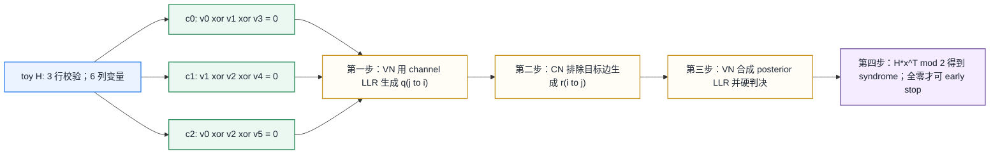

# T8.4 LDPC Tanner 图与消息传递
## 本节学习目标

本节讲低密度奇偶校验码译码器最核心的图模型：Tanner 图。T8.3 已经说明 NR 如何用 `BG`、`Zc`、`iLS` 和 shift table 生成奇偶校验矩阵 $H$；本节继续回答：矩阵 $H$ 如何变成图，图上的变量节点和校验节点分别代表什么，syndrome 为什么能判断硬判决是否满足 LDPC 约束，以及迭代消息传递的第一轮信息流如何发生。

学完本节后，应能做到：

- 解释奇偶校验矩阵 $H$ 的每一行是一条校验方程，每一列对应一个候选码字比特。
- 把一个小型 $H$ 矩阵画成 Tanner 图：变量节点、校验节点和边分别来自哪里。
- 用二元有限域（Galois Field with two elements, GF(2)）手算 syndrome $s=H\hat{\mathbf{x}}^T$，并解释 syndrome 全零和非零的含义。
- 区分 syndrome 与循环冗余校验：前者检查 LDPC 码字约束，后者检查传输块或码块的数据完整性。
- 解释对数似然比在变量节点和校验节点之间作为软信息消息传递。
- 说明系统位、校验位、punctured systematic bits 和 filler bits 对接收端输入的不同影响。
- 写出一个 Python syndrome 校验片段，并展示单比特错误如何让 syndrome 改变。
- 说明寄存器传输级/专用集成电路中 message memory、row/column addressing 和 syndrome checker 的映射关系。

本节是 T8.5 置信传播公式推导的准备课。这里重点是“图和消息方向”；校验节点的 $\tanh/\operatorname{atanh}$ 公式、Min-Sum 近似和 layered schedule 分别留到 T8.5、T8.6 和 T8.7 展开。

## 前置知识检查

| 前置项 | 本节需要达到的程度 |
|:---|:---|
| T1.1 GF(2) | 知道 GF(2) 加法等价于异或，$1+1=0$。 |
| T1.3 矩阵乘法 | 知道矩阵乘向量时，每一行与向量做内积。 |
| T4.2 图模型 | 知道图由节点和边组成，边表示两个对象之间存在依赖关系。 |
| T8.3 QC-LDPC | 知道真实 NR 的完整 $H$ 由基图和循环移位表生成。 |
| 硬判决和软信息 | 知道硬判决是 0/1 候选结果，软信息还包含可靠度。 |

如果前置还不稳，先抓住一句话：Tanner 图只是 $H$ 的另一种画法。$H$ 中某个位置是 1，就画一条边；某个位置是 0，就不画边。

## 路线图 Prompt 覆盖表

| Prompt 要求 | 本节覆盖位置 | 覆盖方式 |
|:---|:---|:---|
| 讲解 Tanner 图 | “Tanner 图的定义”和图 T8.4-1 | 从 $H$ 的行、列、1 元素映射到节点和边。 |
| 讲解变量节点 | “变量节点与校验节点” | 定义 variable node，说明它对应候选码字位置和 LLR。 |
| 讲解校验节点 | “变量节点与校验节点” | 定义 check node，说明它对应一条奇偶校验方程。 |
| 讲解边消息 | “一轮消息传递的结构” | 区分 variable-to-check、check-to-variable 和 posterior LLR。 |
| 讲解 syndrome | “syndrome 的定义”和“GF(2) 手算例子” | 给出公式、手算三行 syndrome，并展示单比特错误。 |
| 讲解迭代消息传递 | “迭代译码接收端流程” | 给接收端流程和伪代码，说明早停位置。 |
| 小校验矩阵展示一轮消息流 | “教学例子”和图 T8.4-1 | 用 $3 \times 6$ 矩阵展示 Tanner 图、syndrome 和一轮消息入口。 |
| 按弹性审计清单取舍并拓展 | 全文 | 补协议证据、系统/校验/打孔/filler 影响、Python、定点、RTL/ASIC、验证和常见错误。 |

这张表只表示最低覆盖。正文会继续拓展接收端对象模型、硬件表示方式和错误定位，避免把 Tanner 图写成单纯概念索引。

## 资料与协议边界

本节精读 TS 38.212 Rel-19 `38212-j30` §5.3.2，并回看 §5.2.2 的 code block segmentation、filler bits 以及 §5.4.2.1 的 LDPC rate matching bit selection。协议定义的是 LDPC 编码结构、$H$ 的构造和发送侧速率匹配选择，不规定接收机必须使用哪一种迭代译码算法。因此本节把内容分成两类：

| 类别 | 协议地位 | 本节处理方式 |
|:---|:---|:---|
| $H$ 的来源、BG1/BG2 维度、shift table | TS 38.212 §5.3.2 的规范内容 | 作为协议精读对象，引用本地 `TS_36.212_36212-j30_content.md`、表格和 T8.3 重建图。 |
| filler bits、码块分段和 $Z_c$ 入口 | TS 38.212 §5.2.2 的规范内容 | 说明这些位置如何影响译码输入和输出剥离。 |
| rate matching、circular buffer、RV 起点和 `<NULL>` 跳过 | TS 38.212 §5.4.2.1 的规范内容 | 说明未发送位置与 filler/shortening 位置在接收端 LLR 语义上不同。 |
| Tanner 图、syndrome、message passing | LDPC 理论和工程实现对象 | 由协议 $H$ 推出，不是 3GPP 对具体译码算法的强制规定。 |
| BP/SPA、Min-Sum、layered schedule | 接收机实现策略 | 本节只讲消息方向和接口，公式推导留到后续小节。 |

本地证据如下：

| 协议位置 | 本地证据路径 |
| :--- | :--- |
| TS 38.212 §5.2.2 | `3GPP_Rel19/processed/TS_38.212_38212-j30/TS_38.212_38212-j30_content.md` 行 717-805 |
| TS 38.212 §5.3.2 | `3GPP_Rel19/processed/TS_38.212_38212-j30/TS_38.212_38212-j30_content.md` 行 948-989 |
| TS 38.212 §5.4.2.1 | `3GPP_Rel19/processed/TS_38.212_38212-j30/TS_38.212_38212-j30_content.md` 行 1175-1309 |
| Table 5.3.2-1 | `tables/table_0013.csv/html` |
| Table 5.3.2-2 | `tables/table_0014.csv/html` |
| Table 5.3.2-3 | `tables/table_0015.csv/html` |

抽取边界要明确：`TS_36.212_36212-j30_content.md` 对部分公式变量名有丢失，本节使用协议语义重建公式，并把表格 CSV/HTML、T8.3 图表和原始 Word 抽取路径作为复核证据。本文的 $3 \times 6$ 矩阵是教学例子，不是 NR 一致性测试向量；真实 NR 的 $H$ 尺寸来自 BG1 的 $46Z_c \times 68Z_c$ 或 BG2 的 $42Z_c \times 52Z_c$。

## 奇偶校验矩阵 H 的译码意义

奇偶校验矩阵 $H$ 是 LDPC 译码器的结构核心。给定一个候选码字硬判决向量：

$$
\hat{\mathbf{x}} =
\begin{bmatrix}
\hat{x}_0 & \hat{x}_1 & \cdots & \hat{x}_{N-1}
\end{bmatrix}
\tag{1}
$$

其中 $\hat{x}_j \in \{0,1\}$，若它是合法 LDPC 码字，就必须满足：

$$
H\hat{\mathbf{x}}^T=\mathbf{0}
\quad \text{over GF(2)}.
\tag{2}
$$

式 (2) 回答的问题是：当前硬判决是否满足 LDPC 编码时定义的全部奇偶校验约束。这里的乘法和加法都在 GF(2) 中进行，所以一行内积不是普通整数求和，而是若干比特的异或。

若 $H$ 的第 $i$ 行在列集合 $\mathcal{N}(i)$ 上为 1，则第 $i$ 条校验方程是：

$$
\bigoplus_{j\in\mathcal{N}(i)} \hat{x}_j = 0.
\tag{3}
$$

式 (3) 中 $\oplus$ 表示异或。它的工程含义是：参与同一条校验的比特中，1 的个数必须为偶数。若结果为 1，说明这一行校验失败。

低密度的含义也体现在这里：$H$ 中大多数元素是 0，每一行只连接少数列，每一列也只连接少数行。稀疏结构让译码器可以局部传递消息，而不必让每个比特和所有其他比特直接交互。

## Tanner 图的定义

Tanner 图是 Robert Tanner 在 1981 年提出的二分图表示方式。二分图表示节点分成两类，边只连接不同类型的节点。对 LDPC 来说：

| 图对象 | 来自 $H$ 的对象 | 含义 |
|:---|:---|:---|
| 变量节点（variable node, VN） | $H$ 的一列 | 一个候选码字比特位置，保存信道 LLR 和后验 LLR。 |
| 校验节点（check node, CN） | $H$ 的一行 | 一条奇偶校验方程，要求相连变量的异或为 0。 |
| 边（edge） | $H_{i,j}=1$ | 变量节点 $v_j$ 参与校验节点 $c_i$ 的方程。 |
| 无边 | $H_{i,j}=0$ | 该变量不参与该校验方程。 |

因此，Tanner 图不是新协议结构，而是 $H$ 的图形化展开。协议表给出 $H$，Tanner 图用于理解和实现译码。

### 教学例子：从矩阵到图

这张教学图的主题是“LDPC Tanner 图、syndrome 与消息流”：同一个小型校验矩阵先被画成 Tanner 图，再用同一组硬判决计算 GF(2) syndrome，最后接到一轮变量节点/校验节点消息流。这里的“小型校验矩阵 H”不是 NR 一致性矩阵，而是为了把每一行、每一列和每一条边都手算清楚。

取一个小型教学矩阵：

$$
H =
\begin{bmatrix}
1&1&0&1&0&0\\
0&1&1&0&1&0\\
1&0&1&0&0&1
\end{bmatrix}.
\tag{4}
$$

矩阵有 3 行、6 列，所以 Tanner 图有 3 个校验节点 $c_0,c_1,c_2$ 和 6 个变量节点 $v_0,\ldots,v_5$。第 0 行是 $[1,1,0,1,0,0]$，所以 $c_0$ 连接 $v_0$、$v_1$、$v_3$。图上的转换规则可以逐字记成：H 中每个 1 对应一条边：变量节点 vj 连接到校验节点 ci。换言之，$H_{i,j}=1$ 就画边 $(c_i,v_j)$；$H_{i,j}=0$ 就不画边。这个规则同时决定 syndrome checker 的 XOR 输入集合和消息 memory 的边表。三行对应的邻接关系为：

| 校验节点 | 校验方程 | 图上的边 |
|:---|:---|:---|
| $c_0$ | $\hat{x}_0\oplus\hat{x}_1\oplus\hat{x}_3=0$ | $(c_0,v_0)$、$(c_0,v_1)$、$(c_0,v_3)$ |
| $c_1$ | $\hat{x}_1\oplus\hat{x}_2\oplus\hat{x}_4=0$ | $(c_1,v_1)$、$(c_1,v_2)$、$(c_1,v_4)$ |
| $c_2$ | $\hat{x}_0\oplus\hat{x}_2\oplus\hat{x}_5=0$ | $(c_2,v_0)$、$(c_2,v_2)$、$(c_2,v_5)$ |




| 内容 | 说明 |
|:---|:---|
| 矩阵 | $H=\begin{bmatrix}1&1&0&1&0&0\\0&1&1&0&1&0\\1&0&1&0&0&1\end{bmatrix}$，列对应 $v_0$ 到 $v_5$，行对应 $c_0$ 到 $c_2$。 |
| Tanner 边 | $c_0$ 连接 $v_0,v_1,v_3$；$c_1$ 连接 $v_1,v_2,v_4$；$c_2$ 连接 $v_0,v_2,v_5$。 |
| syndrome 示例 | 对硬判决 $x=[1,0,1,1,1,0]$，三行分别为 $1\oplus0\oplus1=0$、$0\oplus1\oplus1=0$、$1\oplus1\oplus0=0$，syndrome 全零。 |
| 失败对照 | 若翻转 $x_5$，第三行变为 $1\oplus1\oplus1=1$，syndrome 非零，说明 hard decision 不满足 LDPC 校验。 |
| 消息流 | VN 先发 channel LLR；CN 基于其他相邻 VN 产生外信息；VN 合成 posterior LLR；hard decision 后计算 syndrome。 |
| 外信息边界 | $c_i$ 给 $v_j$ 回消息时必须排除 $(c_i,v_j)$ 自己的输入，避免把同一证据送回来源。 |
左侧是小型 $H$，中间是 Tanner 图，底部是 GF(2) syndrome 手算，右侧是一轮消息流入口。该图用于理解结构，不代表 NR 一致性测试矩阵。

为了让“消息流”不是一句抽象描述，下面把式 (4) 的 9 条边逐条列出。令每个变量节点的初始信道软信息为 $L_j^{\mathrm{ch}}$。第一轮变量到校验的消息只是把该变量的初始证据送到相邻校验节点：

| 边 | 第一步 variable-to-check 初始消息 | 第二步 check-to-variable 依赖关系 |
|:---|:---|:---|
| $(v_0,c_0)$ | $q_{0\to0}^{(0)}=L_0^{\mathrm{ch}}$ | $r_{0\to0}$ 只依赖 $q_{1\to0}^{(0)}$ 和 $q_{3\to0}^{(0)}$。 |
| $(v_1,c_0)$ | $q_{1\to0}^{(0)}=L_1^{\mathrm{ch}}$ | $r_{0\to1}$ 只依赖 $q_{0\to0}^{(0)}$ 和 $q_{3\to0}^{(0)}$。 |
| $(v_3,c_0)$ | $q_{3\to0}^{(0)}=L_3^{\mathrm{ch}}$ | $r_{0\to3}$ 只依赖 $q_{0\to0}^{(0)}$ 和 $q_{1\to0}^{(0)}$。 |
| $(v_1,c_1)$ | $q_{1\to1}^{(0)}=L_1^{\mathrm{ch}}$ | $r_{1\to1}$ 只依赖 $q_{2\to1}^{(0)}$ 和 $q_{4\to1}^{(0)}$。 |
| $(v_2,c_1)$ | $q_{2\to1}^{(0)}=L_2^{\mathrm{ch}}$ | $r_{1\to2}$ 只依赖 $q_{1\to1}^{(0)}$ 和 $q_{4\to1}^{(0)}$。 |
| $(v_4,c_1)$ | $q_{4\to1}^{(0)}=L_4^{\mathrm{ch}}$ | $r_{1\to4}$ 只依赖 $q_{1\to1}^{(0)}$ 和 $q_{2\to1}^{(0)}$。 |
| $(v_0,c_2)$ | $q_{0\to2}^{(0)}=L_0^{\mathrm{ch}}$ | $r_{2\to0}$ 只依赖 $q_{2\to2}^{(0)}$ 和 $q_{5\to2}^{(0)}$。 |
| $(v_2,c_2)$ | $q_{2\to2}^{(0)}=L_2^{\mathrm{ch}}$ | $r_{2\to2}$ 只依赖 $q_{0\to2}^{(0)}$ 和 $q_{5\to2}^{(0)}$。 |
| $(v_5,c_2)$ | $q_{5\to2}^{(0)}=L_5^{\mathrm{ch}}$ | $r_{2\to5}$ 只依赖 $q_{0\to2}^{(0)}$ 和 $q_{2\to2}^{(0)}$。 |

这张表的重点不是具体函数形式，而是排除自身消息。例如 $c_0$ 给 $v_0$ 回消息时，只能看 $v_1$ 和 $v_3$ 在同一条校验方程上的消息，不能把 $v_0$ 刚发给 $c_0$ 的消息又带回 $v_0$。具体 $r_{i\to j}$ 如何由这些输入计算，T8.5 会用 BP/SPA 公式推导。

## cycle、girth 与短环相关性

Tanner 图是有环图。cycle 指从某个节点出发，沿不同边走一圈回到原节点且中间不重复节点的闭合路径；girth 是本节图表中最短 cycle 的长度。LDPC Tanner 图是二分图，所以 cycle 长度一定是偶数。若存在下面这样的路径：

$$
v_0 \rightarrow c_0 \rightarrow v_1 \rightarrow c_1 \rightarrow v_0,
\tag{5}
$$

它就是一个长度为 4 的 cycle。短环越多，BP 消息越容易在少数节点之间快速绕回，破坏“外部证据近似独立”的假设。

| 概念 | 定义 | 对 BP 的影响 | 工程观测 |
|:---|:---|:---|:---|
| cycle | Tanner 图上的闭合路径 | 消息经过若干轮后可能回到源节点 | posterior LLR 过快变大但 syndrome 不降。 |
| girth | 最短 cycle 长度 | girth 越小，相关性越早出现 | 4-cycle 常是最先检查的结构。 |
| 短环相关性 | 同一信道证据被多条路径重复使用 | 违反独立消息近似，造成过度自信 | 高 SNR 下可能表现为停滞、震荡或固定错误子图。 |
| QC lifting 影响 | shift value 决定 lifted graph 的环结构 | 同一 BG 不同 $Z_c/i_{\mathrm{LS}}$ 的短环分布不同 | shift 方向或表列错会改变 cycle 结构。 |

这里不能把“短环多”简单等同于“协议错误”。TS 38.212 固定 BG 和 shift 表，接收端必须按表实现；cycle/girth 是分析译码行为和调试失败的语言。若工程中出现高 SNR 仍失败，除了检查 LLR 符号、rate recovery 和 CRC 边界，还应 dump 错误比特诱导子图，看它是否集中在某些短环或 trapping set 周围。

## syndrome 的定义

syndrome 可译为“校验综合”或“伴随式”。在译码语境中，它是把候选硬判决代入所有奇偶校验方程后得到的结果：

$$
\mathbf{s}=H\hat{\mathbf{x}}^T \bmod 2.
\tag{6}
$$

若：

$$
\mathbf{s}=\mathbf{0},
\tag{7}
$$

说明当前硬判决满足 $H$ 定义的所有 LDPC 校验。若：

$$
\mathbf{s}\ne\mathbf{0},
\tag{8}
$$

说明至少有一条校验方程失败。syndrome 的第 $i$ 个分量 $s_i$ 就对应 Tanner 图上的第 $i$ 个校验节点。

### GF(2) 手算例子

仍使用式 (4) 的 $H$。取硬判决：

$$
\hat{\mathbf{x}}=
\begin{bmatrix}
1&0&1&1&1&0
\end{bmatrix}.
\tag{9}
$$

逐行计算：

$$
s_0=\hat{x}_0\oplus\hat{x}_1\oplus\hat{x}_3
=1\oplus0\oplus1=0.
\tag{10}
$$

$$
s_1=\hat{x}_1\oplus\hat{x}_2\oplus\hat{x}_4
=0\oplus1\oplus1=0.
\tag{11}
$$

$$
s_2=\hat{x}_0\oplus\hat{x}_2\oplus\hat{x}_5
=1\oplus1\oplus0=0.
\tag{12}
$$

所以，为排版紧凑，下面按 $\mathbf{s}^T$ 展示：

$$
\mathbf{s}^T=
\begin{bmatrix}
0&0&0
\end{bmatrix}.
\tag{13}
$$

如果把最后一位翻转为 1：

$$
\hat{\mathbf{x}}'=
\begin{bmatrix}
1&0&1&1&1&1
\end{bmatrix},
\tag{14}
$$

前两行仍通过，但第三行变为：

$$
s'_2=1\oplus1\oplus1=1.
\tag{15}
$$

于是，同样按 $\mathbf{s}'^T$ 展示：

$$
\mathbf{s}'^T=
\begin{bmatrix}
0&0&1
\end{bmatrix}.
\tag{16}
$$

这个例子说明 syndrome 能定位“哪些校验方程不满足”，但它不直接告诉接收端“哪一个比特一定错了”。一个变量节点通常连接多个校验节点，译码器需要通过多轮软信息消息传递来改变最可能出错的硬判决。

## syndrome 与 CRC 的边界

syndrome 和 CRC 都会输出通过/失败，但检查对象不同。

| 检查 | 输入对象 | 检查内容 | 失败含义 | 通过含义 |
|:---|:---|:---|:---|:---|
| LDPC syndrome | 译码后的候选码字硬判决 | 是否满足 $H\hat{\mathbf{x}}^T=\mathbf{0}$ | 不满足 LDPC 校验约束，迭代通常不应早停 | 候选码字在 LDPC 码空间内 |
| CB CRC | 码块解出的信息位和 CB CRC 位 | 码块级完整性 | 该 CB 不可信 | 该 CB 通过码块完整性检查 |
| 传输块 CRC | 传输块重组后的信息位和 TB CRC 位 | 传输块级完整性 | 混合自动重传请求反馈通常走失败边界 | 整个 TB 可交付上层 |

syndrome 全零不等于业务数据一定正确。理论上，噪声可能把接收结果推到另一个合法 LDPC 码字；此时 syndrome 通过，但 CRC 仍可能失败。CRC 不能替代 LDPC syndrome 的语义；若实现采用 syndrome early stop，就应在迭代内部计算 syndrome。是否每轮计算 syndrome、是否只在部分迭代检查，是接收机实现策略；CB CRC 或 TB CRC 则是码块或传输块完整性的外层检查。

## 系统位、校验位、打孔位和 filler bits

LDPC 编码输出通常可以分成系统位和校验位。系统位承载编码前的信息序列，校验位承载由 $H$ 约束生成的冗余。接收端看到的是 rate recovery 之后放回 LDPC 输入空间的 LLR 数组，而不是简单的“全部比特都被物理信道发送过”。

| 位置类型 | 含义 | 接收端 LLR 初始化 | 译码后处理 |
|:---|:---|:---|:---|
| 系统位 | 对应输入信息和 CRC 的位置 | 若被发送，来自解调器；若未发送，按 unknown/neutral 处理 | 解码后参与 CB CRC 或 TB 重组。 |
| 校验位 | LDPC 编码生成的冗余位置 | 来自接收的冗余版本，或由重传补充 | 不作为业务 payload 直接交付。 |
| punctured systematic bits | 协议 rate matching/circular buffer 选择后未发送的系统位 | 没有观测 LLR，应放中性值，例如 0，表示未知 | 不能误当成高可靠 0 或 1，也不能从完整 $H$ 列位置删除。 |
| filler bits | 码块分段为适配 $K$ 插入的非 payload 位置 | 在编码约束中按已知 0/shortened 处理；按本文 LLR 符号约定，可用强正 LLR 或等价 mask 强制 | 译码输出时必须剥离，不能交付 payload。 |

filler 和 puncturing 很容易混淆，必须分三层看。第一，filler 是码块分段引入的非 payload 位置；punctured systematic bit 是真实信息位。第二，filler 在编码约束中按已知 0/shortened 处理，接收端通常用强已知 0 的 LLR 或等价 mask 固定；punctured systematic bit 没有观测，只能用中性 LLR 表示未知。第三，译码输出时 filler 必须剥离，punctured systematic bit 若被译码恢复则仍是 payload 或 CRC 范围内的真实比特。二者在 soft buffer、LLR 初始化、译码输出剥离和 CRC 输入范围上都不能混用。

## 一轮消息传递的结构

Tanner 图上的迭代译码不是一次性求逆，而是让变量节点和校验节点沿边交换软信息。完整 BP/SPA 公式留到 T8.5，本节先建立消息方向。

| 消息 | 常用记号 | 来源 | 去向 | 含义 |
|:---|:---|:---|:---|:---|
| channel LLR | $L_j^{\mathrm{ch}}$ | 解调器和 rate recovery | 变量节点 $v_j$ | 信道对比特 $j$ 是 0 或 1 的初始证据。 |
| variable-to-check | $q_{j\to i}$ | 变量节点 $v_j$ | 校验节点 $c_i$ | 变量节点给某条校验方程的当前信念。 |
| check-to-variable | $r_{i\to j}$ | 校验节点 $c_i$ | 变量节点 $v_j$ | 该校验方程基于其他变量推回来的外信息。 |
| posterior LLR | $L_j^{\mathrm{post}}$ | 变量节点汇总 | 硬判决器 | 当前迭代后对比特 $j$ 的总信念。 |

第一轮可以理解为四步：

1. 变量节点把 channel LLR 发给所有相邻校验节点。
2. 校验节点从相邻变量收到消息，但给 $v_j$ 回消息时不能直接使用来自 $v_j$ 自己的消息。这是外信息原则。
3. 变量节点把 channel LLR 和所有校验节点返回的消息相加，得到 posterior LLR。
4. 对 posterior LLR 做硬判决，计算 syndrome；若 syndrome 全零，可触发 early stop，否则进入下一轮。

外信息原则是迭代译码的关键。若校验节点把来自某个变量的消息原样绕一圈又返回给同一个变量，译码器会重复计算自己的证据，导致过度自信和错误收敛。

## 迭代译码接收端流程

接收端可以把本节对象放入如下流程：

| 步骤 | 输入 | 动作 | 输出 |
|:---|:---|:---|:---|
| 1 | demapper LLR、HARQ soft buffer | rate recovery，把接收软信息放回 LDPC 编码比特空间 | LDPC input LLR array |
| 2 | `BG`、`Zc`、`iLS`、shift table | 生成隐式边表或地址计划 | Tanner graph edge schedule |
| 3 | input LLR、edge schedule | 初始化变量节点消息 | $q_{j\to i}^{(0)}$ |
| 4 | check-node update | 沿边生成校验到变量消息 | $r_{i\to j}^{(t)}$ |
| 5 | variable-node update | 汇总 channel LLR 和外信息 | $L_j^{\mathrm{post}}$ |
| 6 | hard decision | 根据 posterior LLR 得到 $\hat{\mathbf{x}}$ | 候选码字 |
| 7 | syndrome checker | 计算 $H\hat{\mathbf{x}}^T$ | early stop 或继续迭代 |
| 8 | CRC and reassembly | 剥离 filler，取信息位，检查 CB CRC/TB CRC | 交付或 HARQ 失败边界 |

这里的 “Tanner graph edge schedule” 在真实 NR 实现中通常不是显式图对象，而是 `row_group`、`column_group`、`shift_value` 和 local index 的地址生成序列。软件教学可以画图；硬件实现更关心如何在每一层访问正确的消息 memory bank。

## 伪代码

下面的伪代码强调结构和边界，不展开 T8.5 的具体 check-node 公式。

```text
input:
  llr_full[n_cols]        # rate recovery restored to full H column positions
                           # n_cols = 68*Zc for BG1, 52*Zc for BG2
  unknown_mask[n_cols]    # positions not observed in this transmission
  filler_mask[n_cols]     # non-payload shortened/filler positions
  bg, zc, ils             # LDPC structure descriptor
  edge_table              # derived from TS 38.212 Table 5.3.2-2/3
  max_iter

initialize variable messages q[j -> i] from llr_full[j]

for iter in 1..max_iter:
    for each check node i:
        neighbors = columns connected to row i
        for each j in neighbors:
            r[i -> j] = check_update(q[k -> i] for k in neighbors except j)

    for each variable node j:
        incoming = all r[i -> j] from connected checks
        posterior[j] = llr_full[j] + sum(incoming)
        for each connected check i:
            q[j -> i] = llr_full[j] + sum(r[i2 -> j] for i2 in checks(j) except i)

    hard[j] = 0 if posterior[j] >= 0 else 1
    syndrome = H_times_x_mod2(edge_table, hard)
    if syndrome is all zero:
        break

remove filler positions
extract information bits and CRC bits
run CB CRC and TB CRC at their protocol boundaries
```

注意伪代码里的 `llr_full` 不是长度 $E$ 的解调器输出，而是 rate recovery 之后与完整 $H$ 列数一致的母码位置 LLR 数组。长度 $E$ 的接收 LLR 要先按 TS 38.212 §5.4.2.1 的 circular buffer、RV 起点和 `<NULL>` 跳过规则放回这些 $H$ 列位置；未发送位置由 `unknown_mask` 标出，filler/shortened 位置由 `filler_mask` 标出。syndrome 计算必须使用与 $H$ 列数一致的 hard vector。

还要注意 LLR 符号约定采用 $L=\log(P(b=0)/P(b=1))$，所以 posterior 非负判为 0。若工程实现采用相反符号，hard decision 和所有消息公式必须一致调整。

## Python syndrome 校验片段

下面的片段只验证 syndrome，不实现完整 BP。它适合作为单元测试：矩阵、边表或 GF(2) 运算一旦写错，例子会立即失败。

```python
def syndrome(H: list[list[int]], x: list[int]) -> list[int]:
    return [
        sum(hij & bit for hij, bit in zip(row, x)) % 2
        for row in H
    ]


H = [
    [1, 1, 0, 1, 0, 0],
    [0, 1, 1, 0, 1, 0],
    [1, 0, 1, 0, 0, 1],
]

x = [1, 0, 1, 1, 1, 0]
assert syndrome(H, x) == [0, 0, 0]

x_bad = [1, 0, 1, 1, 1, 1]
assert syndrome(H, x_bad) == [0, 0, 1]
```

如果把 `% 2` 去掉，第三行对 `x_bad` 会得到整数 3，而不是 GF(2) 的 1。这类错误在软件调试中很常见：普通整数求和可以告诉你校验行中有几个 1，但 LDPC syndrome 需要的是奇偶性。

## 浮点仿真方案

本节的浮点仿真目标是验证图和消息方向，不是跑完整块错误率曲线。建议最小方案如下：

| 验证项 | 方法 | 期望 |
|:---|:---|:---|
| matrix-to-graph | 从 $H$ 生成 edge list，再从 edge list 重建 $H$ | 重建矩阵与原始 $H$ 完全一致。 |
| syndrome sanity | 对已知合法向量计算 syndrome | 全零。 |
| single-bit flip | 翻转一个变量节点，重新计算 syndrome | 与该变量相连的校验节点翻转。 |
| message direction | 初始化每条边的 $q_{j\to i}$ 和 $r_{i\to j}$ | 不出现把 $q_{j\to i}$ 直接反馈给同一边的情况。 |
| neutral LLR | punctured/unknown 位置输入 0 LLR | 初始硬判决可能任意，但可靠度不应被夸大。 |
| known filler | filler 位置按强已知 0 LLR 或等价 mask 处理 | 不进入 payload，且不会污染 CRC 输入范围。 |

一个实用 golden test 是同时保留两套表示：完整 $H$ 矩阵和稀疏 edge list。小矩阵用完整 $H$ 方便人工检查；真实 NR 规模用 edge list 运行，抽样与完整矩阵生成器对比。

## 稀疏矩阵存储与访存关系

Tanner 图在纸面上很直观，但工程实现不能把完整 bit-level $H$ 当成普通二维数组长期保存。原因不是“矩阵太抽象”，而是它又大又稀疏。以 BG1 为例，完整展开后有 $46Z_c$ 行和 $68Z_c$ 列，绝大多数元素为 0；如果按 dense matrix 保存，硬件和软件都会为大量 0 付出无意义的存储和带宽。

常见稀疏表示有三类：

| 表示 | 保存内容 | 适合回答的问题 | LDPC 译码中的用途 |
|:---|:---|:---|:---|
| edge list | 每条边的 `(row, col, shift, local)` 或等价元组 | “图上一共有哪几条边？” | 教学、golden model、逐边 trace、schedule 生成。 |
| CSR（Compressed Sparse Row） | 每一行的起止指针 `row_ptr`，以及连续的 `col_idx` | “某个 check node 连接哪些 variable node？” | check-node update、syndrome checker、layered row processing。 |
| CSC（Compressed Sparse Column） | 每一列的起止指针 `col_ptr`，以及连续的 `row_idx` | “某个 variable node 连接哪些 check node？” | variable-node update、posterior LLR 汇总、按列回写消息。 |

CSR 和 CSC 不是新的编码理论，只是同一张 Tanner 图的两种索引视角。CSR 方便按校验节点逐行扫，CSC 方便按变量节点收集输入。LDPC 译码正好两种访问都需要：check-node update 要看同一行的所有边，variable-node update 要看同一列的所有边。若只保存一种格式，另一种方向的访问就需要额外搜索、排序或地址翻译。

一个小型 edge list 可以这样从式 (4) 生成：

```text
edge_id | row | col
0       | 0   | 0
1       | 0   | 1
2       | 0   | 3
3       | 1   | 1
4       | 1   | 2
5       | 1   | 4
6       | 2   | 0
7       | 2   | 2
8       | 2   | 5
```

对应的 CSR 表示是：

```text
row_ptr = [0, 3, 6, 9]
col_idx = [0, 1, 3, 1, 2, 4, 0, 2, 5]
```

含义是：第 0 行使用 `col_idx[0:3]`，第 1 行使用 `col_idx[3:6]`，第 2 行使用 `col_idx[6:9]`。对应的 CSC 表示可以写成：

```text
col_ptr = [0, 2, 4, 6, 7, 8, 9]
row_idx = [0, 2, 0, 1, 1, 2, 0, 1, 2]
```

含义是：第 0 列连接 `row_idx[0:2]`，也就是校验行 0 和 2；第 1 列连接 `row_idx[2:4]`，也就是校验行 0 和 1。这个例子适合做单元测试：edge list、CSR、CSC 三者互转后，重建出的 $H$ 必须完全一致。

到真实 NR QC-LDPC 时，还要再加一层 `Zc` 内局部地址。协议表给的是基图层面的 `(row_group, column_group, shift_value)`，实际边会展开成 `Zc` 条连接。硬件常见做法是保存基图非零项和 shift value，运行时用：

```text
check_local = local
variable_local = (local + shift_value) mod Zc
```

或按实现方向使用等价的反向公式生成地址。这里的 `mod Zc` 地址生成会直接影响 memory bank。若多个边在同一周期访问同一 bank，就会产生 bank conflict；T8.7 的 layered schedule 和 T13.5 的 SIMD/memory layout 会继续展开这个问题。

工程上建议同时记录四类证据：

| 证据 | 用途 |
|:---|:---|
| `edge_count` | 检查 BG 表读取和 lifting 展开数量是否正确。 |
| `row_degree_hist` | 检查每个 check node 的边数分布是否异常。 |
| `col_degree_hist` | 检查每个 variable node 的边数分布是否异常。 |
| `csr_csc_roundtrip_hash` | 证明 edge list、CSR、CSC 与重建 $H$ 一致。 |

这部分内容解释了为什么 T8.4 的 Tanner 图会自然连接到硬件访存：图上的每条边最终都要变成一次消息读写；稀疏存储格式决定地址生成器、banking、冲突处理和 trace dump 的可验证性。

## 定点化策略

Tanner 图本身没有定点数值，但图上的消息有定点风险。接收端常见策略如下：

| 对象 | 定点风险 | 建议 |
|:---|:---|:---|
| channel LLR | demapper 输出范围可能超过译码 core 位宽 | 入口裁剪到 decoder 支持范围，并记录饱和值。 |
| edge message | 多轮迭代后幅度可能持续增大 | 使用饱和加法，避免 wrap-around。 |
| posterior LLR | channel LLR 与多条 check message 相加 | 加法树保留 guard bits，最终再裁剪。 |
| neutral LLR | punctured bit 没有观测证据 | 使用 0，而不是最大正值或最大负值。 |
| filler bit | 已知 0/shortened 位置 | 按本文符号约定使用强正 LLR 或等价 mask 单独处理，避免被误当作普通未知位。 |
| syndrome bit | GF(2) XOR 结果 | 使用 XOR tree，不使用定点加法器结果的数值大小。 |

定点实现中最危险的是 wrap-around。若 6 bit signed message 的最大值是 +31，普通二进制加法溢出可能变成负数，等价于把“非常相信 0”变成“相信 1”。LDPC 译码器必须使用饱和算术，且仿真要覆盖饱和边界。

## RTL/ASIC 映射

真实 NR 硬件通常不会保存完整 $H$，原因很直接：BG1 展开后有 $46Z_c$ 行和 $68Z_c$ 列，$Z_c$ 最大可到 384，完整 bit-level 矩阵过大，而且绝大多数元素为 0。工程实现保存的是结构描述和消息存储。

| 硬件对象 | 对应本节概念 | 关键字段 | 检查点 |
|:---|:---|:---|:---|
| `edge_rom` 或 `bg_table_rom` | Tanner 图边 | `row_group`、`column_group`、edge index | BG1/BG2 表不能混用。 |
| `shift_rom` | QC-LDPC 子块连接 | `iLS`、shift value | set index 列选择正确。 |
| variable message memory | 变量节点消息 | column group、local index、bank | 读写地址与 $Z_c$ 对齐。 |
| check message memory | 校验节点消息 | row group、edge index、local index | flooding 与 layered schedule 的生命周期不同。 |
| address generator | 图上的边访问 | $(local+shift)\bmod Z_c$ | shift 方向与 TS 38.212 右循环移位一致。 |
| syndrome checker | $H\hat{\mathbf{x}}^T$ | hard bit、edge schedule | 与 decoder core 使用同一套边表，或证明等价。 |

syndrome checker 最好复用或严格等价于译码 core 的 edge schedule。若 decoder core 使用一套地址生成逻辑，syndrome checker 另写一套简化逻辑，两者可能在 shift 方向、row index 延续、filler mask 或 puncturing mask 上出现不一致。工程验证应比较两套逻辑对同一硬判决的 syndrome 输出。

## 常见错误与定位方式

| 错误 | 现象 | 最小 dump 字段 | 定位方式 |
|:---|:---|:---|:---|
| 行列含义反了 | Tanner 图边连接错，syndrome 与 golden 不一致 | $H$ shape、edge list、row/column labels | 用式 (4) 的小矩阵逐边对照。 |
| GF(2) 用普通加法 | syndrome 出现 2、3 等整数，早停判断混乱 | 每行 raw sum、mod2 result | syndrome 必须取 `% 2` 或 XOR。 |
| syndrome 与 CRC 混淆 | syndrome 通过后直接交付 payload | syndrome、CB CRC、TB CRC status | 明确早停边界和交付边界。 |
| punctured bit 当作 filler | 真实信息位被剥离或强制 | puncture mask、filler mask、payload index | 两类 mask 分开记录。 |
| filler 当作普通信息位 | CRC 输入范围错，TB 重组错 | filler count、CB concat indices | 剥离 filler 后再重组。 |
| 0 LLR 当作硬 0 | 打孔位被错误高置信度初始化，或 filler 被当成未知 | LLR array、unknown mask、filler mask | 0 LLR 表示中性未知；已知 filler 0 应使用强约束或 mask。 |
| BG 表错用 | 大量 syndrome 不收敛，地址越界或边数错 | `BG`、table id、edge count | BG1 用 Table 5.3.2-2，BG2 用 Table 5.3.2-3。 |
| syndrome checker 表不同步 | 译码 core 认为收敛，checker 不通过或相反 | decoder edge schedule、checker edge schedule | 两套 schedule 做逐边 diff。 |

## 自测题

1. Tanner 本节图表中的变量节点和校验节点分别对应 $H$ 的什么对象？
2. 若 $H_{i,j}=1$，图上应该画什么？
3. 为什么 syndrome 计算必须在 GF(2) 中进行？
4. syndrome 全零是否等价于 TB CRC 通过？
5. punctured systematic bits 和 filler bits 在接收端有什么不同？
6. 为什么真实 NR 硬件通常不保存完整 $H$？
7. 外信息原则要避免什么问题？

## 自测题参考答案

1. 变量节点对应 $H$ 的列，也就是候选码字比特位置；校验节点对应 $H$ 的行，也就是一条奇偶校验方程。
2. 应在校验节点 $c_i$ 和变量节点 $v_j$ 之间画一条边，表示变量 $\hat{x}_j$ 参与第 $i$ 条校验方程。
3. LDPC 校验方程是二元有限域上的奇偶关系，加法等价于异或；普通整数加法得到的是 1 的个数，syndrome 需要的是奇偶性。
4. 不等价。syndrome 全零只说明候选码字满足 LDPC 校验；TB CRC 检查传输块业务数据完整性，仍可能失败。
5. punctured systematic bits 是真实信息位但当前没有观测，应以中性 LLR 输入并由校验关系推断，且仍保留在完整 $H$ 列位置中；filler bits 是分段对齐引入的非业务位置，按已知 0/shortened 处理，译码后必须剥离，不能进入 payload。
6. 完整 $H$ 尺寸随 $Z_c$ 放大且极稀疏，保存完整矩阵浪费存储。硬件保存 BG 表、shift value 和 edge schedule，通过地址生成访问消息。
7. 外信息原则避免一个节点把来自某条边的消息直接绕回同一条边，造成证据重复计算和过度自信。

## 协议证据表

| 结论 | 协议证据 | 本地核验 |
|:---|:---|:---|
| LDPC 编码在 GF(2) 中执行 | TS 38.212 §5.3.2 | `TS_36.212_36212-j30_content.md` 行 948-989 提到 parity bits 生成和 GF(2) 编码。 |
| BG1 的 $H$ 基矩阵为 46 行 68 列 | TS 38.212 §5.3.2 | `TS_36.212_36212-j30_content.md` 行 971-977；T8.3 已复核。 |
| BG2 的 $H$ 基矩阵为 42 行 52 列 | TS 38.212 §5.3.2 | `TS_36.212_36212-j30_content.md` 行 971-977；T8.3 已复核。 |
| $H$ 由基图元素替换为全零矩阵或循环置换矩阵得到 | TS 38.212 §5.3.2 | `TS_36.212_36212-j30_content.md` 行 977-989；T8.3 已展开公式和图。 |
| BG1/BG2 的非零位置和 shift value 来自 Table 5.3.2-2/3 | TS 38.212 §5.3.2 | `tables/table_0014.csv/html`、`tables/table_0015.csv/html`；T8.3 已完整表格化复现。 |
| filler bits 在 LDPC code block segmentation 中插入 | TS 38.212 §5.2.2 | `TS_36.212_36212-j30_content.md` 行 747-805；本节用于说明接收端 mask 和输出剥离。 |
| LDPC rate matching 使用 circular buffer、RV 起点和 `<NULL>` 跳过 | TS 38.212 §5.4.2.1 | `TS_36.212_36212-j30_content.md` 行 1175-1309；本节用于说明 unknown/punctured 位置与 filler/shortened 位置的 LLR 语义差异。 |
## 执行与证据记录

| 项目 | 记录 |
|:---|:---|
| 路线图卡片 | `2026-06-19-lte-nr-decoding-learning-roadmap.md` T8.4，Prompt/产出/验收/3GPP 证据已覆盖。 |
| 讲义文件 | `docs/L2/T8.4_LDPC_Tanner_graph_message_passing.md`。 |
| 协议来源 | TS 38.212 Rel-19 `38212-j30` §5.2.2、§5.3.2、§5.4.2.1、Table 5.3.2-1/2/3。 |
| 本地表格证据 | T8.4 不重复长表正文；复用 T8.3 已核验的 `table_0013.csv/html`、`table_0014.csv/html`、`table_0015.csv/html` 和表格化重建。 |
| 图表资产 | `tools/figures/render_ldpc_tanner_syndrome.py` 生成 `docs/L2/assets/T8.4_LDPC_Tanner_syndrome_toy.png`。 |
| 单篇审计 | `python3 tools/audit_lesson_terms.py docs/L2/T8.4_LDPC_Tanner_graph_message_passing.md` 输出 `LESSON_TERM_AUDIT_OK`；`python3 tools/audit_markdown_headings.py docs/L2/T8.4_LDPC_Tanner_graph_message_passing.md` 输出 `MARKDOWN_HEADING_AUDIT_OK`；`python3 tools/audit_lesson_depth.py --strict docs/L2/T8.4_LDPC_Tanner_graph_message_passing.md` 输出 `LESSON_DEPTH_AUDIT_OK`；`python3 tools/audit_latex_render.py docs/L2/T8.4_LDPC_Tanner_graph_message_passing.md` 输出 `LATEX_RENDER_AUDIT_OK formulas=195`。 |
| 审核经理复核 | Critical=0；Important=5 已修复：补边级一轮消息流、§5.4.2.1 rate matching 证据、filler/unknown LLR 语义、syndrome/CRC 实现边界、`llr_full[n_cols]` 伪代码边界；Minor 已处理：syndrome 转置展示说明、伪代码索引、登记标题对齐。 |
| 资产文件检查 | `python3` 打开 `docs/L2/assets/T8.4_LDPC_Tanner_syndrome_toy.png` 输出尺寸 `(1600, 1180) RGB`；`python3 tools/audit_figure_geometry.py tools/figures/render_ldpc_tanner_syndrome.py`、`python3 tools/audit_figure_readability.py tools/figures/render_ldpc_tanner_syndrome.py`、`python3 tools/audit_figure_text_fit_static.py tools/figures/render_ldpc_tanner_syndrome.py` 均输出 OK。 |

## 参考文献

1. 3GPP TS 38.212 Rel-19 `38212-j30`, “NR; Multiplexing and channel coding”, §5.2.2, §5.3.2, §5.4.2.1, Table 5.3.2-1, Table 5.3.2-2, Table 5.3.2-3.
2. R. M. Tanner, “A Recursive Approach to Low Complexity Codes”, IEEE Transactions on Information Theory, 1981.
3. R. G. Gallager, “Low-Density Parity-Check Codes”, IRE Transactions on Information Theory, 1962.
