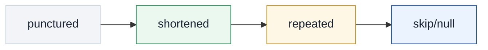
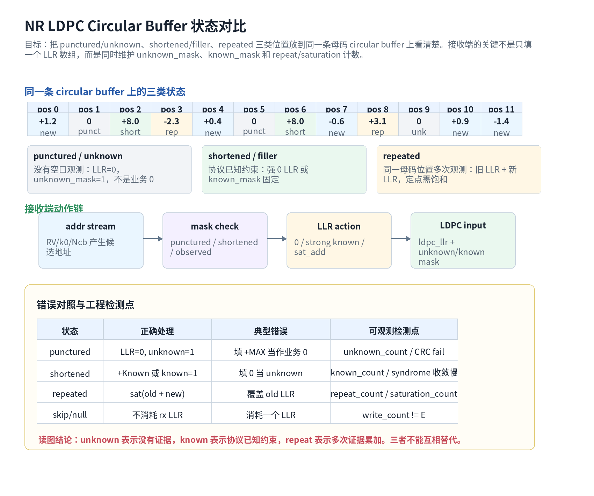

# T9.2 NR LDPC Circular Buffer、Puncturing、Shortening、Repetition
## 本节学习目标

本节使用的单篇技术缩写先统一说明：低密度奇偶校验码是 NR 数据业务的信道编码；对数似然比是译码器使用的软信息；混合自动重传请求会让同一母码位置跨重传累积软信息；循环冗余校验用于译码后的完整性检查；码块是 LDPC decoder 的逐块处理对象；传输块是 CB 重组后的交付对象；寄存器传输级/专用集成电路实现需要把这些语义落成 mask、存储器和饱和加法。

本节专门讲 NR LDPC 接收侧 circular buffer 中三类最容易混淆的位置：punctured/unknown、shortened/filler、repeated。它们在图上都可能表现为“没有新的普通 LLR 写入”，但工程含义完全不同。

学完本节后，应能做到：

- 解释 circular buffer 不是普通队列，而是速率匹配按母码位置循环选择的地址空间。
- 说明 puncturing 或未发送位置为什么是“没有观测”，不是业务比特 0。
- 说明 shortening/filler 为什么是“协议已知约束”，和 puncturing 完全不同。
- 说明 repetition 为什么要累加 LLR，定点实现为什么要饱和。
- 给出同一个小数组中 unknown mask、known mask、repeat accumulation 的最终结果。
- 指出三类常见错误：punctured 填强 LLR、shortened 填 0、repeated 覆盖旧 LLR。
- 把三类状态映射到 RTL/ASIC 模块：unknown mask、known mask、repeat combiner。

如果只记一件事：**LLR=0 表示“没有证据”，不是“这个比特是 0”；强正 LLR 或 known mask 才表示“协议已知为 0”；多次观测同一位置要做证据累加。**

## 前置知识检查

| 前置项 | 本节需要达到的程度 |
|:---|:---|
| T9.1 NR LDPC 速率恢复总览 | 知道 `rx_llr` 经过反交织和 RV 地址扫描后写回 circular buffer。 |
| T8.4 Tanner 图与 LLR 语义 | 知道 LDPC decoder 输入位置对应完整 $H$ 的变量节点，unknown 和 filler 不能混用。 |
| T3.4 NR LDPC 分段 | 知道 NR LDPC filler 位于每个 CB 的尾部区间，译码后必须剥离。 |
| T2.11 LLR 定点化 | 知道 LLR 可以量化和饱和，重复累加不能回绕溢出。 |

本节不要求先掌握 TS 38.212 的完整 `k_0` 起点表。这里要先学会“某个母码位置为什么是 unknown、known 或 repeated”，T9.3 再把这些状态放入 HARQ RV 软缓存生命周期。

## 术语来源与常见误解

puncturing、shortening 和 repetition 这三个词来自编码和速率适配的不同工程动作。puncturing 的直觉是“把某些编码输出位置从本次发送集合里打掉”，所以接收端没有这些位置的空口观测。shortening 的直觉是“把某些输入位置预先固定为已知值，让实际承载的信息更短”，所以接收端不是不知道这些位置，而是知道它们应满足固定约束。repetition 的直觉是“同一编码位置被看见不止一次”，所以接收端得到的是多份证据。

这三个词最容易被一个数字 0 搞混。unknown 位置常填 $0$ LLR，因为它没有偏向；known 0 位置也可能在 hard bit 层面是 0，但它应当对应强正 LLR 或 known mask；repeated 位置如果两次证据刚好相互抵消，也可能累加成 $0$ LLR。三个 0 的来源不同：

| 表现 | 来源 | 接收端含义 | 工程后果 |
|:---|:---|:---|:---|
| unknown 的 $0$ LLR | 没有观测 | 不偏向 0 或 1 | 让校验关系自己推断。 |
| known 0 | 协议固定约束 | 强制或高度相信 0 | 帮助 syndrome 收敛，输出时剥离 filler。 |
| repeated 后为 0 | 多次证据抵消 | 可靠度下降 | 说明两次观测互相冲突。 |

因此本节的核心不是背术语，而是回答一个工程问题：**这个母码位置的证据从哪里来，接收端凭什么相信它，后续 CRC/TB 重组是否还能使用它。**

## 任务边界与 Prompt 覆盖

当前执行依据是 `docs/audits/lte_nr_decoding_remaining_work_register.md` 的 T9.2 条目。需要说明一个本地计划边界：roadmap 文件中 T9.2 卡片写的是 bit deinterleaving，而登记表将 T9.2 定义为 circular buffer、puncturing、shortening、repetition；登记表后续 T9.4 已承接 bit deinterleaving。按用户要求“按登记表依次执行”，本节以登记表 T9.2 为准，bit deinterleaving 的完整 $Q_m$ 例子留给 T9.4。

| 登记表要求 | 本节覆盖位置 | 覆盖方式 |
|:---|:---|:---|
| 解释 circular buffer | “circular buffer 的接收端含义” | 从母码位置地址空间解释。 |
| 解释 puncturing | “Puncturing 与 unknown LLR” | 强调不是业务 0，而是无观测。 |
| 解释 shortening | “Shortening 与 known mask” | 解释协议已知约束和 filler 的关系。 |
| 解释 repetition | “Repetition 与 LLR 累加” | 给浮点和定点饱和公式。 |
| 同一张图对比三类状态 | “三类状态图” | 用 Mermaid 和状态表对比 `new`、`repeat`、`short`、`unknown` 的 circular buffer 语义。 |
| 数值例子 | “小型数组例子” | 给 12 位置最终 LLR、unknown/known/repeat 统计。 |
| 错误对照 | “错误对照” | 三类错误逐项对照。 |
| Python 验证片段 | “Python 可复现校验” | 输出最终 LLR 数组和 mask。 |
| RTL 映射 | “RTL/ASIC 映射” | unknown mask、known mask、repeat combiner。 |

这张表是最低覆盖。正文额外补充协议证据边界、descriptor 字段、验证计数器、失败定位和自测答案。

## 资料与协议边界

本节精读 TS 38.212 Rel-19 `38212-j30` 的 LDPC 分段、编码和速率匹配相关条款。

| 协议位置 | 本地证据路径 |
| :--- | :--- |
| TS 38.212 §5.2.2 | `3GPP_Rel19/processed/TS_38.212_38212-j30/content.md:717-805` |
| TS 38.212 §5.3.2 | `3GPP_Rel19/processed/TS_38.212_38212-j30/content.md:945-989` |
| TS 38.212 §5.4.2 | `3GPP_Rel19/processed/TS_38.212_38212-j30/content.md:1175-1177` |
| TS 38.212 §5.4.2.1 | `3GPP_Rel19/processed/TS_38.212_38212-j30/content.md:1179-1309` |
| TS 38.212 §6.2.5 | `3GPP_Rel19/processed/TS_38.212_38212-j30/content.md:1397-1407` |
| TS 38.212 §7.2.5 | `3GPP_Rel19/processed/TS_38.212_38212-j30/content.md:3771-3775` |

边界说明：

- TS 38.212 明确规定发送端速率匹配、filler 插入和 circular buffer 选择过程；接收端 unknown mask、known mask、饱和加法器是工程实现对这些协议语义的反向表达。
- 本节把“punctured/unsent”作为接收端无观测状态来讲。协议文本不一定在每个 LDPC 数据信道条款直接使用这个词，但 bit selection 没有输出的位置在接收端确实没有空口观测。
- 本节不重建 Table 5.4.2.1-1/2 的具体数值。涉及具体 RV 起点和 HARQ 生命周期的表格重建留给 T9.3。

## circular buffer 的接收端含义

circular buffer 是按母码位置循环寻址的地址空间。发送端把 LDPC encoded bits 写入这个空间，再从某个 RV 起点开始扫描，选出本次能发的 $E_r$ 个比特。接收端反向恢复时，必须使用同一条地址轨迹，把收到的 LLR 放回对应位置。

可以把它抽象为：

$$
a_t = (k_0 + s_t) \bmod N_{\mathrm{cb}},
\quad 0 \le t < E,
\tag{1}
$$

式 (1) 回答的问题是：第 $t$ 个被接收并反交织后的 LLR 应写回哪个 circular buffer 地址。$k_0$ 是 RV 相关起点，$s_t$ 是扫描过程中跳过不可发送或 filler 位置后的有效步数，$N_{\mathrm{cb}}$ 是实际 circular buffer 长度。真实协议公式比这个抽象式更细，本节只用它解释接收端对象关系。

写回动作是：

$$
L[a_t] \leftarrow \operatorname{combine}(L[a_t], L_{\mathrm{rx}}[t]).
\tag{2}
$$

式 (2) 的关键在 $\operatorname{combine}$。它不是永远覆盖，也不是永远相加，而是要看这个位置的状态：

- 第一次观测：写入新 LLR。
- 重复观测：与旧 LLR 相加或饱和相加。
- 没有观测：保持 neutral LLR 和 unknown mask。
- 已知约束：由 known mask 或强 LLR 固定，不消耗接收 LLR。

## Puncturing 与 unknown LLR

puncturing 在接收端最重要的含义是“该母码位置没有观测”。没有观测不是 0，也不是 1；它只是没有证据。按本文 LLR 符号约定：

$$
L = \log\frac{P(b=0)}{P(b=1)}.
\tag{3}
$$

如果完全没有观测，接收端不应该偏向 0 或 1，因此：

$$
L_{\mathrm{unknown}} = 0.
\tag{4}
$$

式 (4) 回答的问题是：没有收到这个位置时，给 decoder 的软信息应该是什么。$L=0$ 表示 $P(b=0)$ 和 $P(b=1)$ 在输入证据层面一样可信。它不是“硬判 0”，也不是“填业务 0”。工程实现还应同时置位：

$$
\texttt{unknown\_mask}[i] = 1.
\tag{5}
$$

unknown mask 的作用是让调试和验证知道这个位置没有空口观测。LDPC 迭代仍可通过校验约束推断它，但初始证据不能伪造。

## Shortening 与 known mask

shortening/filler 的语义和 puncturing 正好相反。filler 是协议分段为了适配 $K$、$Z_c$ 和 BG 结构插入的非 payload 位置。它不是空口丢失的未知信息，而是接收端在协议层面知道的固定约束，通常按已知 0 处理。

按本文 LLR 符号约定，已知 0 可表示为强正 LLR：

$$
L_{\mathrm{known0}} = +L_{\max}.
\tag{6}
$$

也可以不用真实写入一个很大的数，而使用 known mask：

$$
\texttt{known\_mask}[i] = 1,\quad \texttt{known\_value}[i] = 0.
\tag{7}
$$

式 (6) 和式 (7) 是两种实现风格。浮点模型中常直接给 $+8$、$+16$ 这类强 LLR；硬件中可能用 mask 告诉 decoder 这个位置固定为 0，避免强 LLR 在迭代中溢出或过度影响其他位置。

filler 的另一个边界是输出侧：译码之后，这些位置必须剥离，不能交给 CB CRC 或 TB 重组。把 filler 当成 payload，会导致 CRC 输入范围错。

## Repetition 与 LLR 累加

repetition 表示同一个母码位置被观测了多次。可能来自 circular buffer 回绕，也可能来自 HARQ 重传窗口与旧窗口重叠。多次观测给的是同一个比特的多份证据，所以要在 LLR 域累加：

$$
L_{\mathrm{acc}} = L_{\mathrm{old}} + L_{\mathrm{new}}.
\tag{8}
$$

式 (8) 回答的问题是：同一比特的独立软证据如何合并。LLR 的一个工程优点就是独立证据在对数域中相加。定点实现不能无限加下去，必须饱和：

$$
L_{\mathrm{acc}} =
\min\left(L_{\max},\max\left(L_{\min},L_{\mathrm{old}}+L_{\mathrm{new}}\right)\right).
\tag{9}
$$

如果 6 bit signed LLR 范围是 $[-32,+31]$：

| 旧 LLR | 新 LLR | 正确饱和结果 | 错误回绕风险 |
|---:|---:|---:|:---|
| +28 | +10 | +31 | 可能回绕成负值。 |
| -30 | -8 | -32 | 可能回绕成正值。 |
| +20 | -18 | +2 | 证据抵消，不能取绝对值相加。 |

repetition 的常见错误是覆盖旧值：

$$
L[a_t] \leftarrow L_{\mathrm{rx}}[t].
\tag{10}
$$

式 (10) 会丢掉 HARQ 或回绕带来的软合并增益。它在单次无重复测试中可能完全不暴露，因此必须用 directed test 覆盖重复地址。

## 三类状态图

图 T9.2-1 把三类状态放在同一条 toy circular buffer 上。灰色位置是 punctured/unknown，绿色位置是 shortened/filler，黄色位置是 repeated，蓝色位置是普通新观测。

同一条 circular buffer 上的三类状态必须放在同一张状态表里读：`unknown` 表示没有证据，`known` 表示协议已知约束，`repeat` 表示多次证据累加。三者不能互相替代。




| 内容 | 说明 |
|:---|:---|
| punctured | LLR=0, unknown=1；填 +MAX 当作业务 0；unknown_count / CRC fail |
| shortened | +Known 或 known=1；填 0 当 unknown；known_count / syndrome 收敛慢 |
| repeated | sat(old + new)；覆盖 old LLR；repeat_count / saturation_count |
| skip/null | 不消耗 rx LLR；消耗一个 LLR；write_count != E |

接收端动作链是：`addr stream` 先由 `RV/k0/Ncb` 产生候选地址；`mask check` 再区分 `punctured / shortened / observed`；`LLR action` 按状态选择 `0 / strong known / sat_add`；最后形成 `LDPC input`，也就是 `ldpc_llr + unknown/known mask`。这条链条说明接收端不是只填一个 LLR 数组，而是同时维护数值、mask 和计数器。

读图要点：

1. `punctured / unknown` 的 LLR 是 0，但这个 0 是中性软信息，不是业务 0。
2. `shortened / filler` 是协议已知约束，使用强 0 LLR 或 known mask。
3. `repeated` 是多次观测，旧 LLR 和新 LLR 需要饱和累加。
4. `skip/null` 不消耗接收 LLR；一旦误消耗，后续地址和 LLR 会整体错位。

## 小型数组例子

设 toy circular buffer 有 12 个位置，初始旧 soft buffer 和 mask 如下：

| 位置 | 旧 LLR | 状态 |
|:---:|---:|:---|
| 0 | 0.0 | unknown |
| 1 | 0.0 | punctured/unknown |
| 2 | +8.0 | shortened known 0 |
| 3 | -0.7 | old observed |
| 4 | 0.0 | unknown |
| 5 | 0.0 | punctured/unknown |
| 6 | +8.0 | shortened known 0 |
| 7 | 0.0 | unknown |
| 8 | +1.9 | old observed |
| 9 | 0.0 | unknown |
| 10 | 0.0 | unknown |
| 11 | 0.0 | unknown |

本次收到并反交织后的 LLR 及写回地址为：

$$
\texttt{rx} = [+1.2,\ -1.6,\ +0.4,\ -0.6,\ +1.2,\ +0.9,\ -1.4],
\tag{11}
$$

$$
\texttt{addr} = [0,\ 3,\ 4,\ 7,\ 8,\ 10,\ 11].
\tag{12}
$$

位置 1、5、9 没有出现在 `addr` 中，保持 unknown；位置 2、6 是 shortened，不消耗 `rx`；位置 3 和 8 已有旧观测，本次重复累加。

逐项更新：

| 写回顺序 | 地址 | 新 LLR | 动作 | 最终 LLR |
|---:|---:|---:|:---|---:|
| 0 | 0 | +1.2 | 首次写入 | +1.2 |
| 1 | 3 | -1.6 | 与旧值 -0.7 累加 | -2.3 |
| 2 | 4 | +0.4 | 首次写入 | +0.4 |
| 3 | 7 | -0.6 | 首次写入 | -0.6 |
| 4 | 8 | +1.2 | 与旧值 +1.9 累加 | +3.1 |
| 5 | 10 | +0.9 | 首次写入 | +0.9 |
| 6 | 11 | -1.4 | 首次写入 | -1.4 |

最终数组为：

$$
\mathbf{L}_{\mathrm{out}} =
[+1.2,\ 0,\ +8.0,\ -2.3,\ +0.4,\ 0,\ +8.0,\ -0.6,\ +3.1,\ 0,\ +0.9,\ -1.4].
\tag{13}
$$

对应 mask 为：

$$
\texttt{unknown\_mask}
=
[0,\ 1,\ 0,\ 0,\ 0,\ 1,\ 0,\ 0,\ 0,\ 1,\ 0,\ 0],
\tag{14}
$$

$$
\texttt{known\_mask}
=
[0,\ 0,\ 1,\ 0,\ 0,\ 0,\ 1,\ 0,\ 0,\ 0,\ 0,\ 0].
\tag{15}
$$

覆盖率统计：

| 统计项 | 值 | 含义 |
|:---|---:|:---|
| `new_write_count` | 5 | 地址 0、4、7、10、11 首次写入。 |
| `repeat_accum_count` | 2 | 地址 3、8 与旧 LLR 累加。 |
| `unknown_count` | 3 | 地址 1、5、9 没有观测。 |
| `shortened_count` | 2 | 地址 2、6 是已知 0 约束。 |
| `saturation_count` | 0 | 本例未触发饱和。 |

## 错误对照

错误对照与工程检测点需要同时写明“正确处理、典型错误、可观测检测点”。只列错误名不足以定位问题，因为同一个 CRC fail 可能来自 unknown/known/repeat 任一类状态被误处理。

| 状态 | 正确处理 | 典型错误 | 可观测检测点 |
|:---|:---|:---|:---|
| punctured | `LLR=0, unknown=1` | 填 `+MAX` 当作业务 0 | `unknown_count / CRC fail` |
| shortened | `+Known` 或 `known=1` | 填 `0` 当 unknown | `known_count / syndrome` 收敛慢 |
| repeated | `sat(old + new)` | 覆盖 old LLR | `repeat_count / saturation_count` |
| skip/null | 不消耗 rx LLR | 消耗一个 LLR | `write_count != E` |

读图结论：unknown 表示没有证据，known 表示协议已知约束，repeat 表示多次证据累加。三者不能互相替代。

| 错误 | 错误写法 | 直接后果 | 调试观察 |
|:---|:---|:---|:---|
| punctured 填强 LLR | `L[punctured]=+31` | 把未知位置伪造成高可靠 0 | 高信噪比下仍 CRC fail，或仿真虚假乐观。 |
| shortened 填 0 | `L[shortened]=0` | 把已知约束变成未知 | syndrome 收敛变慢，filler 区域 hard decision 不稳定。 |
| repeated 覆盖旧值 | `L[addr]=new` | 丢掉重传软合并增益 | HARQ 重传块错误率改善不足。 |
| skip/null 消耗 LLR | `t += 1` on skipped position | 后续所有 LLR 地址错位 | `write_count != E` 或首个 skip 后 mismatch 连续出现。 |

工程定位时不要先怀疑 LDPC Min-Sum core。先查 descriptor、mask、地址、写回计数和 LLR 合并日志，因为这些错误会让 decoder 在错误输入上工作。

## Python 可复现校验

下面的 Python 片段复现式 (13)-(15)。它验证三类位置的最终 LLR 数组、unknown mask、known mask 和覆盖率统计。

```python
def sat_add(a, b, lo=-31.0, hi=31.0):
    v = a + b
    if v > hi:
        return hi, True
    if v < lo:
        return lo, True
    return v, False


N = 12
old = [0.0, 0.0, +8.0, -0.7, 0.0, 0.0, +8.0, 0.0, +1.9, 0.0, 0.0, 0.0]
old_observed = {3, 8}
shortened = {2, 6}
rx = [+1.2, -1.6, +0.4, -0.6, +1.2, +0.9, -1.4]
addr = [0, 3, 4, 7, 8, 10, 11]
soft = old[:]
observed = [False] * N
stats = {
    "new_write_count": 0,
    "repeat_accum_count": 0,
    "unknown_count": 0,
    "shortened_count": 0,
    "saturation_count": 0,
}

for value, a in zip(rx, addr):
    if a in shortened:
        raise AssertionError("shortened position must not consume rx LLR")
    if observed[a] or a in old_observed:
        soft[a], saturated = sat_add(soft[a], value)
        stats["repeat_accum_count"] += 1
        stats["saturation_count"] += int(saturated)
    else:
        soft[a] = value
        stats["new_write_count"] += 1
    observed[a] = True

unknown_mask = [0] * N
known_mask = [0] * N
for i in range(N):
    if i in shortened:
        soft[i] = +8.0
        known_mask[i] = 1
        stats["shortened_count"] += 1
    elif not observed[i] and i not in old_observed:
        soft[i] = 0.0
        unknown_mask[i] = 1
        stats["unknown_count"] += 1

expected = [+1.2, 0.0, +8.0, -2.3, +0.4, 0.0, +8.0, -0.6, +3.1, 0.0, +0.9, -1.4]
assert all(abs(a - b) < 1e-9 for a, b in zip(soft, expected)), soft
assert unknown_mask == [0, 1, 0, 0, 0, 1, 0, 0, 0, 1, 0, 0]
assert known_mask == [0, 0, 1, 0, 0, 0, 1, 0, 0, 0, 0, 0]
assert stats == {
    "new_write_count": 5,
    "repeat_accum_count": 2,
    "unknown_count": 3,
    "shortened_count": 2,
    "saturation_count": 0,
}
print("T9.2_CIRCULAR_BUFFER_STATES_OK")
```

预期输出：

```text
T9.2_CIRCULAR_BUFFER_STATES_OK
```

## 浮点仿真方案

| 检查项 | 输入 | 验收 |
|:---|:---|:---|
| unknown neutral | 构造未发送位置 | LLR 为 0，`unknown_mask=1`，不强制 hard 0。 |
| shortened known | 构造 filler/shortened 位置 | LLR 为强正值或 `known_mask=1, known_value=0`。 |
| repeated accumulation | 构造重复地址 | `old + new` 与期望一致。 |
| saturation disabled/enabled 对照 | 大幅度重复 LLR | 浮点无限精度与定点饱和模型差异可解释。 |
| skip 不消耗 LLR | 人为插入 skip 地址 | `write_count == E`，首个 skip 后地址不整体错位。 |

推荐 directed tests：

1. 只有 punctured：所有观测为空，decoder 输入全 0 LLR，unknown mask 全 1。
2. 只有 shortened：若全部是已知 0，hard decision 应稳定为 0。
3. repeated 正负抵消：`+4 + -4 = 0`，合并后可靠度应降低。
4. repeated 同号饱和：`+28 + +10 -> +31`，`-30 + -8 -> -32`。

## 定点化策略

| 项目 | 建议 | 原因 |
|:---|:---|:---|
| unknown LLR | 固定为 0，另存 unknown mask | 0 LLR 是中性证据，不应与 known 0 混用。 |
| known 0 | 强 LLR 或 known mask 二选一 | mask 更可控，强 LLR 更接近浮点模型。 |
| repeat combiner | 饱和加法 | 防止溢出回绕。 |
| saturation counter | 每个 CB 统计 | 帮助判断 LLR scale 是否过大。 |
| mask bitwidth | unknown/known 分开 1 bit | 互斥检查简单，调试可读。 |

硬件中最好不要只保存一个 LLR RAM。至少要能恢复：

$$
\texttt{state}[i] \in \{\texttt{unknown},\ \texttt{known0},\ \texttt{observed},\ \texttt{repeated}\}.
\tag{16}
$$

式 (16) 不一定以 2 bit 状态寄存器的形式存在，也可以由 unknown mask、known mask、observed bit 和 repeat counter 推导，但验证报告必须能观察到这些状态。

## RTL/ASIC 映射

| 模块 | 输入 | 输出 | 必查点 |
|:---|:---|:---|:---|
| address generator | `rvidx`、`Ncb`、skip mask | `addr`、`valid_write` | skip 不消耗 LLR，地址模 `Ncb`。 |
| unknown mask RAM | rate recovery 覆盖结果 | `unknown_mask[i]` | punctured/unsent 位置为 1。 |
| known mask RAM | segmentation/filler metadata | `known_mask[i]`、`known_value[i]` | shortened/filler 位置与 unknown 互斥。 |
| LLR RAM | old soft buffer、new LLR | updated LLR | repeated 用读改写。 |
| repeat combiner | old LLR、new LLR | saturated sum、sat flag | 覆盖旧值是错误。 |
| debug counter | 写回事件 | `new_write_count`、`repeat_accum_count`、`unknown_count`、`shortened_count`、`saturation_count` | 每个 CB 输出到 dump。 |

多 bank LLR RAM 中，repeat combiner 是 read-modify-write 路径。如果同一个周期多个 lane 命中同一 bank 或同一地址，要么仲裁串行化，要么做旁路合并。否则会出现“仿真单 lane 正确，多 lane 丢一次累加”的错误。

## 验证方法

最小验证计划：

| 用例 | 输入特征 | 期望 |
|:---|:---|:---|
| punctured neutral | 地址 1、5、9 不写入 | LLR 为 0，unknown mask 为 1。 |
| shortened known | 地址 2、6 是 filler | known mask 为 1，LLR 强正或固定 0。 |
| repeated accumulation | 地址 3、8 有旧值又收到新值 | 输出 -2.3、+3.1。 |
| saturation | 构造 `+28 + +10` | 输出 +31，sat flag 为 1。 |
| wrong overwrite trap | 旧值非零，新值写入同地址 | 覆盖模型必须与 golden mismatch。 |
| skip trap | skip 地址夹在写回序列中 | `write_count == E`，后续地址不移位。 |

最小 dump 包字段：

| 字段 | 用途 |
|:---|:---|
| `tb_id/cb_id/harq_id` | 确认软缓存上下文。 |
| `BG/Zc/N/Ncb/E/rvidx` | 确认地址和母码尺寸。 |
| `addr_first_32` | 快速定位 RV 或 skip 错位。 |
| `unknown_mask_hash` | 确认 punctured/unsent 集合。 |
| `known_mask_hash` | 确认 shortened/filler 集合。 |
| `old_llr/new_llr/combined_llr` | 定位 repeated 合并错误。 |
| `new_write_count/repeat_accum_count/unknown_count/shortened_count/saturation_count` | 最小覆盖率统计。 |

## 常见错误

| 错误 | 现象 | 修复方向 |
|:---|:---|:---|
| punctured 当业务 0 | decoder 被虚假 0 证据牵引，BLER 曲线异常 | unknown LLR 固定 0，保留 unknown mask。 |
| shortened 当 unknown | filler 约束丢失，syndrome 收敛变慢 | 使用 known mask 或强 known LLR。 |
| repeated 覆盖旧值 | HARQ 合并增益不足，重传后改善小 | 使用 read-modify-write 饱和累加。 |
| known/unknown mask 同时为 1 | 输入状态自相矛盾 | mask 生成后加互斥断言。 |
| skip 消耗 LLR | 首个 skip 后所有位置错位 | `valid_write` 为 0 时不递增 LLR 指针。 |
| `Ncb` 当 $N$ | limited-buffer 场景地址错 | 地址生成统一使用 `Ncb`。 |

## 自测题

1. 为什么 punctured/unknown 位置的 LLR 通常填 0，但不能说它是业务比特 0？
2. shortened/filler 和 punctured 的本质区别是什么？
3. 同一地址旧 LLR 为 +1.9，新 LLR 为 +1.2，为什么最终为 +3.1？
4. 如果 6 bit signed LLR 范围是 $[-32,+31]$，`+28 + +10` 应输出什么？
5. 为什么 skip/null 位置不能消耗一个 `rx_llr`？
6. RTL 中 unknown mask 和 known mask 为什么要分开保存？

## 自测题参考答案

1. LLR=0 表示输入证据对 0 和 1 没有偏向；业务比特 0 应是强正 LLR 或 hard decision 后的结果，不能把无观测伪装成高可靠 0。
2. punctured 是真实母码位置但没有空口观测；shortened/filler 是协议分段或编码结构引入的已知约束，通常按已知 0 处理并在输出侧剥离。
3. repeated 表示同一比特多次观测，LLR 域证据相加，所以 $+1.9 + +1.2 = +3.1$。
4. 输出 +31，并置 saturation flag；不能回绕。
5. skip/null 不对应发送输出比特。若消耗 `rx_llr`，从该位置之后所有 LLR 都会写到错误地址。
6. unknown 是“没有证据”，known 是“协议已知约束”。二者语义相反，分开保存便于互斥断言、调试和 decoder 输入控制。

## 协议证据表

| 结论 | 协议依据 | 本地证据 | 状态 |
|:---|:---|:---|:---|
| LDPC 分段包含 lifting size、filler bits 插入入口 | TS 38.212 Rel-19 §5.2.2 | `3GPP_Rel19/processed/TS_38.212_38212-j30/content.md:717-805` | 已核验语义；部分公式变量抽取不完整。 |
| LDPC encoded bits 和完整 $H$ 母码位置来自 BG/$Z_c$ | TS 38.212 Rel-19 §5.3.2 | `3GPP_Rel19/processed/TS_38.212_38212-j30/content.md:945-989` | 已核验，表值由 T8.3 复现。 |
| LDPC rate matching 由 bit selection 和 bit interleaving 组成 | TS 38.212 Rel-19 §5.4.2 | `3GPP_Rel19/processed/TS_38.212_38212-j30/content.md:1175-1177` | 已核验。 |
| encoded bits 写入 circular buffer，RV 和 bit selection 决定输出位置 | TS 38.212 Rel-19 §5.4.2.1 | `3GPP_Rel19/processed/TS_38.212_38212-j30/content.md:1179-1309` | 已核验语义；具体起点表留给 T9.3。 |
| UL-SCH 支持 limited-buffer rate matching 配置入口 | TS 38.212 Rel-19 §6.2.5 | `3GPP_Rel19/processed/TS_38.212_38212-j30/content.md:1397-1407` | 已核验。 |
| DL-SCH/PCH 逐 CB 调用 §5.4.2 | TS 38.212 Rel-19 §7.2.5 | `3GPP_Rel19/processed/TS_38.212_38212-j30/content.md:3771-3775` | 已核验。 |

## 图示


## 执行与证据记录

| 项目 | 记录 |
|:---|:---|
| 讲义文件 | `docs/L2/T9.2_NR_LDPC_circular_buffer_states.md` |
| 执行依据 | `docs/audits/lte_nr_decoding_remaining_work_register.md` T9.2；本节按登记表执行，roadmap T9.2/T9.4 命名错位已在正文说明。 |
| 协议资料 | `3GPP_Rel19/processed/TS_38.212_38212-j30/content.md` |
| 图生成脚本 | `tools/figures/render_nr_ldpc_circular_buffer_states.py` |
| 图输出 | `docs/L2/assets/T9.2_NR_LDPC_circular_buffer_states.png` |
| Python toy 校验 | 已运行正文内嵌等价片段，输出 `T9.2_CIRCULAR_BUFFER_STATES_OK`。 |
| 单篇审计 | 已运行 `python3 tools/audit_lesson_terms.py docs/L2/T9.2_NR_LDPC_circular_buffer_states.md` -> `LESSON_TERM_AUDIT_OK`；`python3 tools/audit_markdown_headings.py docs/L2/T9.2_NR_LDPC_circular_buffer_states.md` -> `MARKDOWN_HEADING_AUDIT_OK`；`python3 tools/audit_lesson_depth.py --strict docs/L2/T9.2_NR_LDPC_circular_buffer_states.md` -> `LESSON_DEPTH_AUDIT_OK`；`python3 tools/audit_latex_render.py docs/L2/T9.2_NR_LDPC_circular_buffer_states.md` -> `LATEX_RENDER_AUDIT_OK formulas=43`。 |
| 审核经理复核 | Critical=0、Important=1、Minor=3；已修复 Python toy 用 LLR 数值推断 prior observation 的问题，改用独立 `old_observed` 集合；已修复常见错误表述歧义、BG/RV/PCH 首现展开和本记录闭环。 |

## 参考文献

- 3GPP TS 38.212 Rel-19 `38212-j30`, Multiplexing and channel coding, §5.2.2, §5.3.2, §5.4.2, §5.4.2.1, §6.2.5, §7.2.5. 本地路径：`3GPP_Rel19/processed/TS_38.212_38212-j30`。
- Richardson, T. and Urbanke, R., 2008. Modern Coding Theory. Cambridge University Press.
