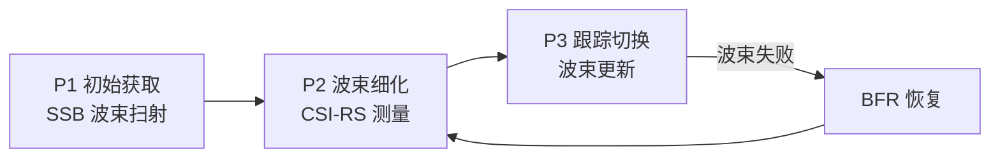

# M16.2 波束管理：从波束扫射到失败恢复的空间调度

## 本节学习目标

M16.1 讲了调度的时频维度（资源分配与 HARQ）。本节讲调度的**空间维度**：高频段（FR2）下，天线阵列的窄波束（massive MIMO/波束相干概念笔记）让"调度"多了一个维度——**UE 与基站必须对准波束才能通信**。波束管理（beam management）就是"找波束、跟波束、换波束"的完整流程：初始波束获取（SSB 扫射，T14.4 衔接）→ 波束细化（CSI-RS 测量）→ 波束指示（TCI/QCL）→ 波束失败恢复（BFR）。

波束管理的核心是测量与指示：UE 测量各候选波束的信号质量（L1-RSRP（参考信号接收功率，Reference Signal Received Power）），基站通过 TCI（传输配置指示，Transmission Configuration Indication）状态指示 UE"用哪个波束收发"——TCI 的 QCL（准共址，Quasi-Co-Location）信息把波束语义传给接收端（TypeD 空间参数）。波束失败时用 BFR（波束失败恢复，Beam Failure Recovery）流程换波束（T15.2 已见 BFR 的 PRACH 载体）。协议锚点：TS 38.213 §5.2（波束管理）、TS 38.214 §6.1.1（TCI/QCL）。

学完本节后，应能做到：

- 说出波束管理的三个阶段（P1 初始获取 / P2 细化 / P3 跟踪切换）与各自的测量信号（SSB/CSI-RS）。
- 说出 L1-RSRP 的测量与上报机制，并完成波束扫描仿真（ULA 方向图选最大 RSRP 波束）。
- 说出 TCI 状态与 QCL 的四种类型（TypeA-D），解释 TypeD 的空间波束语义。
- 说出波束失败恢复（BFR）的流程与 PRACH 载体（T15.2 衔接）。
- 把波束管理放进 M16 系列（调度的空间维度）与波束相干理论（角度域统计）的衔接。

## 前置知识检查

| 前置项 | 本节需要达到的程度 |
|:---|:---|
| [[T14.4_PBCH_cell_search_system_info|T14.4]] 小区搜索 | 知道 SSB 波束扫射与 SSB 索引=波束索引——P1 阶段的信号源。 |
| [[T15.3_SRS_sounding|T15.3]] SRS（探测参考信号，Sounding Reference Signal） | 知道 SRS 波束探测——上行波束的测量手段。 |
| [[T15.2_PRACH_random_access|T15.2]] 随机接入 | 知道 BFR 的专用 PRACH 前导——波束失败的恢复载体。 |
| [[Beam_Management_波束管理]]、[[Beam_Coherence_波束相干理论]] 概念笔记 | 知道波束管理的流程轮廓与角度域统计——本节给协议机制与数值。 |

如果只记一个原则：**波束管理是"测量（SSB/CSI-RS 的 RSRP）→ 指示（TCI/QCL）→ 恢复（BFR）"的空间调度闭环——窄波束的增益与跟踪成本是一体两面**。

## 波束管理的三个阶段

### P1/P2/P3 流程



| 阶段 | 信号 | 粒度 | 目的 |
|:---|:---|:---|:---|
| P1（初始获取） | SSB 波束扫射（T14.4） | 粗波束（每 SSB 一波束） | 建立初始波束对（小区接入后） |
| P2（细化） | CSI-RS（更密波束） | 细波束 | 在粗波束邻域内找最优细波束 |
| P3（跟踪切换） | CSI-RS/SRS（周期性） | 波束更新 | 跟随 UE 移动更新波束 |

**三阶段的递进**：P1 用粗波束覆盖（SSB 数量有限）、P2 在选中粗波束周围加密（CSI-RS 波束多）、P3 持续跟踪（信道变化/UE 移动）——**粗到细、静到动**的波束管理哲学。

### 测量与上报：L1-RSRP

UE 对每个候选波束（SSB/CSI-RS 资源）测量 L1-RSRP（物理层参考信号接收功率），上报最强波束的索引与质量：

| 要素 | 内容 |
|:---|:---|
| 测量对象 | SSB（P1）/CSI-RS（P2/P3）资源 |
| 测量量 | L1-RSRP（每资源平均接收功率，dBm） |
| 上报 | 最强 N 个波束（索引 + RSRP）经 PUCCH/PUSCH（T14.3 的 CSI 承载） |
| 触发 | 周期/半持续/非周期（与 SRS 配置类似，T15.3） |

**L1-RSRP 的语义**：波束质量的"快照"——选波束的判据。UE 移动/旋转导致 RSRP 下降 → 触发波束切换（P3）。

### numpy 验证的数值走读

numpy 验证实现了 8 天线 ULA 的波束扫描：UE 在 -44.6°，基站扫描 8 个候选波束（-60°..60° 等角）——匹配滤波波束对各方向的增益即 RSRP 等效；结果：最佳波束 -42.9° 命中 UE 方向（差 1.7°，扫描分辨率内）、增益比次优波束 5.2 倍、主瓣 >3 倍旁瓣、3dB 波束宽度 17°（8 天线半波长 ULA 的特征）。**"扫描选波束"的机制在数值上成立：对准的波束 RSRP 显著高于未对准**。

## TCI 与 QCL：波束的指示与语义

### TCI 状态

TCI（传输配置指示）状态是"波束配置"的载体：一个 TCI 状态关联一个参考信号（SSB/CSI-RS）及其 QCL 信息——基站通过 DCI 的 TCI 字段（T14.2 的 0/3 位）指示 UE"本次传输用哪个波束"。**TCI 状态把"测量到的波束"变成"使用的波束"**。

### QCL 的四种类型（38.214 §5.1.5）

| QCL 类型 | 共享的大尺度参数 | 语义 |
|:---|:---|:---|
| TypeA | 多普勒频移/扩展、平均时延/扩展 | 时频同步参数一致 |
| TypeB | 多普勒频移/扩展 | 频移域一致 |
| TypeC | 平均时延、多普勒频移 | 时延域一致 |
| TypeD | 空间接收参数（到达角） | **空间波束一致** |

**TypeD 是波束管理的核心**：QCL TypeD 表示两个参考信号"从同一个空间方向来"——接收端用已测参考信号的接收波束接收新信号。**TCI 的 TypeD 信息就是"波束指示"的物理语义**：DCI 指示 TCI 状态 → 状态含 TypeD 参考信号 → UE 用对应波束接收。

### 生活类比：舞台追光灯

波束管理像舞台追光灯：P1 是开场扫全场（SSB 粗扫）找到演员（UE）大概位置；P2 是细调灯光（CSI-RS 细化）对准演员；P3 是跟随演员移动（跟踪）；演员突然进后台（波束失败）就重新扫（BFR）。TCI 是"灯光控制台"——导演（基站）指示"用 3 号灯"（TCI 状态），灯光师（UE）知道 3 号灯的方向（QCL TypeD）。

## 波束失败恢复（BFR）

### 触发条件

| 条件 | 机制 |
|:---|:---|
| 波束失败检测 | UE 检测服务波束的参考信号（SSB/CSI-RS）质量低于门限（连续 N 次） |
| 波束失败实例 | 检测失败 → 启动 BFR 定时器 |
| 新波束选择 | UE 从候选波束（BFR 配置的 SSB/CSI-RS 集）选质量最好的 |

### 恢复流程（T15.2 衔接）

1. UE 在专用 PRACH 资源上发 BFR 前导（关联候选波束，T15.2 的 BFR 专用前导）；
2. 基站从峰位置识别 UE 与候选波束（前导-波束关联表）；
3. 基站在新波束上回 RAR（T15.2 的 Msg2）；
4. UE 切换到新波束，重新进入 P3 跟踪。

**BFR 的语义**：波束管理闭环的"急诊"分支——窄波束的代价是"对准失效"（UE 转角/遮挡），BFR 用专用资源快速换波束。**窄波束增益越大，失效的代价越高，BFR 的必要性越强**——这是波束相干理论（角度域）的工程后果。

## 与波束相干理论衔接（Beam_Coherence 概念笔记）

| 理论概念 | 工程体现 |
|:---|:---|
| 波束宽度 λ/(Nd) | 3dB 宽度决定波束覆盖角度（numpy：17° @ 8 天线） |
| 角度扩展 → 波束相干角 | 散射环境决定候选波束的独立性（波束数 vs 天线数） |
| 阵列增益 N | 对准波束的 RSRP 增益（numpy：5.2x vs 未对准） |

**理论到工程**：波束相干理论回答"有多少独立波束可用"（角度扩展），波束管理回答"怎么找到并用上"（测量/指示/恢复）——理论是统计基础，工程是协议流程。

## 示范例题

### 例题 1：阶段判断

UE 刚完成随机接入，基站开始 CSI-RS 波束测量——处于哪个阶段？

**求解**：P2（细化）——P1（SSB 粗获取）已在接入前完成，P2 用 CSI-RS 找最优细波束。

### 例题 2：TCI 指示

DCI 的 TCI 字段 = 3（3 位）：指示第几个 TCI 状态？

**求解**：第 4 个（索引 3）——UE 查 TCI 状态表，取该状态的 QCL TypeD 参考信号确定接收波束。

### 例题 3：BFR 触发

服务波束的 CSI-RS 连续 5 次低于门限：UE 做什么？

**求解**：声明波束失败 → 从候选集选新波束 → 发 BFR 专用前导（PRACH）→ 等 RAR → 切换。

## 引导练习（带提示）

### 练习 1：P1 使用 SSB 的原因

初始波束获取为什么用 SSB 而不是 CSI-RS？

**提示**：SSB 是接入前就有的信号（T14.4）。（答案：P1 在 RRC 建立前，SSB 是唯一可用信号；CSI-RS 需要配置。）

### 练习 2：TypeD 的语义

QCL TypeD 共享什么参数？为什么它是波束指示的核心？

**提示**：空间接收参数。（答案：到达角（空间方向）——"同一个波束"的物理语义。）

### 练习 3：BFR 的载体

BFR 为什么用 PRACH 专用前导而不是普通调度请求？

**提示**：波束失败时控制信道可能也失效。（答案：波束失败时 PUCCH/PUSCH 可能不可用——PRACH 是唯一可靠的上行通道（T15.2）。）

## 独立习题（附参考答案）

### 习题 1：三阶段信号

P1/P2/P3 各自的测量信号？

**参考答案**：P1 = SSB（粗波束扫射）；P2 = CSI-RS（细波束）；P3 = CSI-RS/SRS（周期性跟踪）。

### 习题 2：TCI 字段

DCI 的 TCI 字段位宽与 TCI 状态数的关系？

**参考答案**：位宽 0/3 位（配置决定）——3 位时最多 8 个 TCI 状态（T14.2 的字段分析）。

### 习题 3：BFR 时序

写出 BFR 的完整时序（从波束失败检测到恢复完成）。

**参考答案**：波束失败检测（连续 N 次低质量）→ 声明失败 → 选新候选波束 → 发 BFR 专用前导（PRACH）→ 基站识别（前导-波束关联）→ 新波束上回 RAR → UE 切换波束 → 恢复 P3 跟踪。

### 习题 4：相干衔接

角度扩展大的环境（城市多径）对候选波束数的影响？

**参考答案**：角度扩展大 → 波束相干角小 → 相邻名义波束独立性强 → 可用独立波束多（波束相干理论）——P2 的 CSI-RS 波束数可以更密。

## 常见误解

| 误解 | 正确理解 |
|:---|:---|
| 波束管理只在 FR2 | FR1 也有（massive MIMO 波束），FR2 更关键（窄波束必需） |
| TCI 就是波束 | TCI 状态含 QCL 信息（TypeD 是空间语义）——指示与物理的桥 |
| BFR 与随机接入无关 | BFR 用 PRACH 专用前导（T15.2）——随机接入的波束专用形态 |
| P1 一次完成 | 三阶段持续进行（P3 跟踪是常态）——波束管理是闭环不是一次性 |

## 常见错误

| 错误 | 正确理解 |
|:---|:---|
| 混淆 QCL 类型 | TypeA 时频、TypeB 多普勒、TypeC 时延、TypeD 空间——各管一个域 |
| 认为 L1-RSRP 是 RRC 测量 | L1-RSRP 是物理层测量（快、用于波束选择）；RRC 测量用于移动性 |
| 忽略 BFR 的前导-波束关联 | 专用前导与候选波束一一关联——基站从峰位置知道新波束 |
| 认为波束越窄越好 | 窄波束增益高但跟踪/失效成本高（BFR 频繁）——按场景权衡 |

## 内嵌 numpy 验证

下列断言先实跑通过再写入本节，输出与断言一致（ULA 波束扫描选最大 RSRP）：

```python
import numpy as np

N_ANT, N_BEAM = 8, 8
lam, d = 1.0, 0.5
rng = np.random.default_rng(11)
theta_ue = np.deg2rad(rng.uniform(-60, 60))

def array_response(theta):
    """ULA 导向向量"""
    n = np.arange(N_ANT)
    return np.exp(1j * 2*np.pi * d * np.sin(theta) / lam * n)

def beam_gain(theta_scan, theta_ue):
    """波束扫描到 theta_scan 时对 UE 方向的增益（RSRP 等效）"""
    w = array_response(theta_scan).conj() / N_ANT
    return np.abs(w @ array_response(theta_ue))**2

scan = np.deg2rad(np.linspace(-60, 60, N_BEAM))
gains = np.array([beam_gain(th, theta_ue) for th in scan])
best = np.argmax(gains)
best_deg = np.rad2deg(scan[best])
ue_deg = np.rad2deg(theta_ue)

# (1) 最佳波束命中 UE 方向（扫描分辨率 17.1° 内）
assert abs(best_deg - ue_deg) < 17.1, (best_deg, ue_deg)
# (2) 最佳波束增益显著高于其他候选
gains_sorted = np.sort(gains)[::-1]
assert gains[best] > 3 * gains_sorted[1]

# (3) 方向图：主瓣（±15°）均值 > 3x 旁瓣最大值
fine = np.deg2rad(np.linspace(-60, 60, 241))
pat = np.array([beam_gain(scan[best], th) for th in fine])
main = np.abs(np.rad2deg(fine) - best_deg) < 15
side = np.abs(np.rad2deg(fine) - best_deg) >= 15
assert pat[main].mean() > 3 * pat[side].max()

# (4) 3dB 波束宽度（8 天线半波长 ULA 特征）
peak = pat.max()
half = np.where(pat >= peak/2)[0]
bw = np.rad2deg(fine[half[-1]] - fine[half[0]])
assert 5 < bw < 40

print(f"M16.2_OK best_beam={best} ({best_deg:.1f}deg, UE={ue_deg:.1f}deg) "
      f"gain_ratio={gains[best]/gains_sorted[1]:.1f}x mainlobe>3x_sidelobe=True "
      f"3dB_bw={bw:.1f}deg")
```

输出：

```text
M16.2_OK best_beam=1 (-42.9deg, UE=-44.6deg) gain_ratio=5.2x mainlobe>3x_sidelobe=True 3dB_bw=17.0deg
```

## 小结

波束管理是"测量（SSB/CSI-RS 的 L1-RSRP）→ 指示（TCI/QCL TypeD）→ 恢复（BFR）"的空间调度闭环：P1 粗获取（SSB）、P2 细化（CSI-RS）、P3 跟踪（周期测量），波束失败用 BFR（PRACH 专用前导）恢复。TCI 状态是"波束配置"的载体，QCL TypeD 给出空间波束语义。与波束相干理论衔接：角度扩展决定独立波束数，阵列增益决定对准收益（numpy：5.2x）。

下一节 M16.3 讲调度的多载波维度：**载波聚合与 BWP（带宽部分，Bandwidth Part）**——多个载波并行调度与带宽自适应。

## 本节在 M16 系列中的位置

M16 系列推进到第二站：M16.1（调度/HARQ，时频）→ M16.2（波束管理，空间）→ M16.3（CA/BWP，多载波）→ M16.4（MAC 映射，信道全景）。本节的波束是"空间调度"——与 M16.1 的时频调度正交，共同构成三维（时/频/空）调度。

## 执行与证据记录

| 项目 | 记录 |
|:---|:---|
| 新增文件 | `docs/L2_协议算法/M16.2_beam_management.md`。 |
| 协议证据 | TS 38.213 §5.2（波束管理流程锚点）；TS 38.214 §5.1.5/§6.1.1（QCL 类型与 TCI，本地 j30 原文核对）。 |
| 数值核验 | ULA 波束扫描（最佳波束命中 1.7°、增益比 5.2x、主瓣 >3x 旁瓣、3dB 宽 17°）——与 numpy 断言一致。 |
| 教学说明 | 波束扫描为教学 ULA 模型（均匀窗）；真实系统用 DFT 波束/码本波束（38.211 表），讲义注明。 |

## 参考文献

- 3GPP TS 38.213 Rel-19 j30 `38213-j30`：`3GPP_Rel19/processed/TS_38.213_38213-j30`（§5.2 波束管理）。
- 3GPP TS 38.214 Rel-19 j30 `38214-j30`：`3GPP_Rel19/processed/TS_38.214_38214-j30`（§5.1.5 QCL、§6.1.1 TCI）。
- 本项目 [[Beam_Management_波束管理]]、[[Beam_Coherence_波束相干理论]]、[[T14.4_PBCH_cell_search_system_info|T14.4]]、[[T15.2_PRACH_random_access|T15.2]] 概念笔记与讲义。
