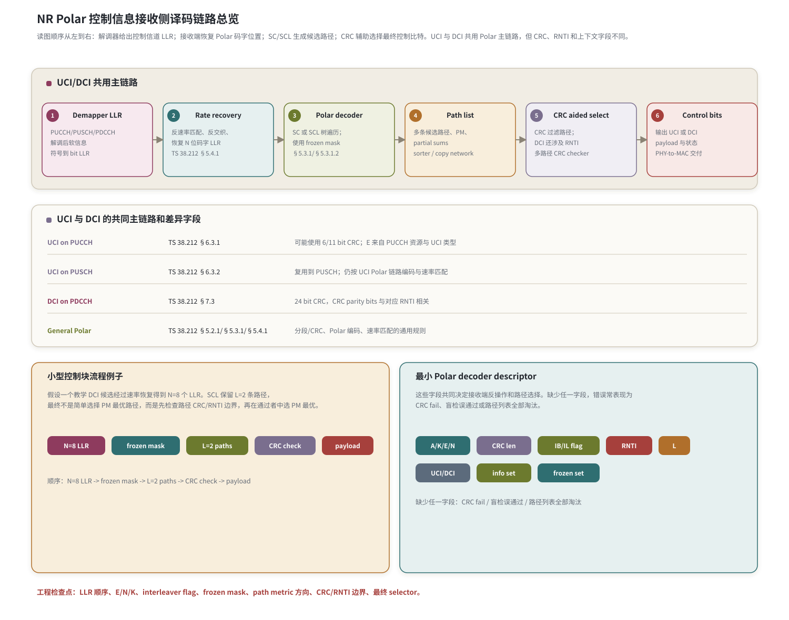

# T10.1 NR Polar 控制信息接收链路总览
## 本节学习目标

本节从控制信道解调器输出的软信息开始，建立 NR Polar控制信息接收侧译码链路。这里先展开本节第一次作为主角出现的术语：极化码是一类利用信道极化现象构造的纠错码；上行控制信息承载混合自动重传请求的确认信息、调度请求和信道状态信息等上行控制内容；下行控制信息承载调度、资源分配、冗余版本和 HARQ process 等下行控制命令；对数似然比是译码器输入软信息；循环冗余校验用于检错并辅助列表路径选择；无线网络临时标识（Radio Network Temporary Identifier, RNTI）参与 DCI CRC 边界；逐次消除译码（Successive Cancellation, SC）是 Polar 的基础树译码；逐次消除列表译码（Successive Cancellation List, SCL）保留多条候选路径；CRC 辅助 SCL（CRC-aided SCL, CA-SCL）用 CRC 从候选路径中选择最终控制比特；低密度奇偶校验码是 NR 数据业务主线；Turbo是 LTE 数据业务主线；传输块、码块、上行共享信道、下行共享信道、调制与编码方案、媒体接入控制层、寄存器传输级和专用集成电路会在本文作为对比或工程边界出现。

学完本节后，应能做到：

- 解释 Polar 的中文名、英文名、基本思想和它适合 NR 短控制块的原因。
- 画出从 demapper LLR 到速率恢复、子块解交织、Polar 译码、CRC 辅助路径选择和控制比特输出的接收链路。
- 区分 UCI 与 DCI 在本节中的协议边界：UCI 可能在 PUCCH 或 PUSCH 上承载，DCI 在 PDCCH 上承载，本节只讲影响 Polar 译码输入输出的部分。
- 说明 TS 38.212 §5.2.1、§5.3.1、§5.4.1、§6.3 和 §7.3 如何共同形成接收端 descriptor。
- 列出最小 Polar decoder descriptor：`A/K/E/N`、CRC 长度、interleaver flag、RNTI context、list size、information set 和 frozen set。
- 用一个小型控制块例子说明 CA-SCL 不是“只选路径度量最好”，而是先用 CRC/RNTI 边界过滤，再按路径度量选择。

本节只做总览，不把信道极化、可靠性序列、SC/SCL 公式、CA-SCL path metric 或 Polar rate recovery 的每个索引一次性写完。T10.2 到 T10.7 会逐项展开；T10.8 会把边界案例整理成调试清单。

## 前置知识检查

| 前置项 | 本节需要达到的程度 |
|:---|:---|
| LLR | 知道 LLR 的符号表示更像 0 还是 1，绝对值表示可靠度。 |
| CRC | 知道 CRC 是错误检测，不是独立纠错算法；在 SCL 中还能辅助路径选择。 |
| T3.5 NR Polar 分段与 CRC | 知道 UCI/DCI 控制信息会进入 Polar 链路，DCI 有 24 bit CRC 和 RNTI 边界。 |
| T4.2 图模型 | 知道 Polar 译码常用树模型理解，不同于 LDPC Tanner 图和 Turbo trellis。 |
| UCI/DCI 常识 | 知道 UCI 是上行控制信息，DCI 是下行控制信息；不要求掌握所有格式字段。 |


## 任务边界与 Prompt 覆盖

| Prompt 要求 | 本节覆盖位置 | 覆盖方式 |
|:---|:---|:---|
| 总览 NR Polar 控制信息接收链路 | “接收侧总链路图”“发送端协议顺序与接收端逆序” | 给出 LLR、rate recovery、Polar decode、CRC aided selection、output。 |
| 覆盖 UCI 与 DCI 路线图级背景 | “UCI 与 DCI 的协议分支” | 区分 PUCCH/PUSCH UCI 与 PDCCH DCI，只保留译码相关边界。 |
| 解释 Polar 是什么、为什么用于控制块 | “Polar 名称、来源与短控制块动机” | 从信道极化、短块低时延和 CA-SCL 解释。 |
| 接收链路图必须包含 CRC 辅助路径选择 | 图 T10.1-1 | 本节图表中明确 `CRC aided select` 节点。 |
| descriptor 包含 A/K/E/N、CRC 长度、interleaver flag、RNTI、list size | “最小 decoder descriptor v0” | 表格列字段、来源、错误后果。 |
| 小型控制块流程例子 | “小型控制块流程例子” | 给 N=8、L=2 的总览级路径选择例子。 |
| 常见错误 | “常见错误” | 包含 UCI/DCI 配置混淆、CRC 类型错、RNTI 边界错。 |
| 说明后续章节展开范围 | “本节与 T10.2-T10.8 的分工” | 明确各小节承接内容。 |

这张表是最低覆盖。正文额外补充协议证据、接收端伪代码、浮点/定点/RTL/ASIC 映射、验证方法、自测和执行记录。

## 资料与协议边界

本节使用 3GPP TS 38.212 Rel-19 `38212-j30`，本地处理目录为 `3GPP_Rel19/processed/TS_38.212_38212-j30`。涉及表格时，本节只复现总览需要的短表和子表，不把 T10.3/T10.7 的完整协议表提前展开。

| 协议位置 | 本地证据路径 |
| :--- | :--- |
| TS 38.212 Table 5.3-2 | `tables/table_0010.csv/html` |
| TS 38.212 §5.2.1 | `content.md:665-715` |
| TS 38.212 §5.3.1 | `content.md:815-837` |
| TS 38.212 §5.3.1.1 | `content.md:839-871`；`tables/table_0011.csv/html` |
| TS 38.212 §5.3.1.2 | `content.md:873-883`；`tables/table_0012.csv/html` |
| TS 38.212 §5.4.1 | `content.md:1019-1125` |
| TS 38.212 §6.3.1.2.1/§6.3.1.3.1/§6.3.1.4.1 | `content.md:2321-2387` |
| TS 38.212 §6.3.2.2.1/§6.3.2.3.1/§6.3.2.4.1 | `content.md` 中 §6.3.2 对应章节 |
| TS 38.212 §7.3.2-§7.3.4 | `content.md:7177-7207` |

证据边界：`content.md` 对若干公式符号抽取不完整，因此本节不声称复现了 §5.2.1、§5.3.1、§5.4.1 的全部 bit-exact 公式。涉及完整可靠性序列、sub-block interleaver pattern、puncturing/shortening/repetition 索引和 CA-SCL 路径度量时，分别由 T10.3、T10.7、T10.4-T10.6 复现和推导。

本地表格核验摘要：

| 文件 | SHA-256 | 本节状态 |
|:---|:---|:---|
| `tables/table_0010.csv` | `bb26fe3b738ebca1f2765184c63f5c6da554243cc6877bad4aca429369bbce75` | 本节复现全部 3 行。 |
| `tables/table_0011.csv` | `8e02409e9af34d772f60f9d387f3fe7ed17cbad14504fbe7481bba3b7e67475c` | 本节只作为 interleaving pattern 证据，不复现完整表。 |
| `tables/table_0012.csv` | `5df7ed346272365183c74ca5e832d94e651223738f05185a40c752d68a9f6a95` | 本节只复现前 16 项作为读表示例，完整表留 T10.3。 |
| `source.docx` | `d4b6f1d43946d4356efca1a90c2ee41e235e37171b638bc871173d122bf70a0d` | 作为必要时回查 Word XML/media 的源文件。 |

## Polar 名称、来源与短控制块动机

Polar Code 中文常译为“极化码”。“极化”不是天线极化，也不是调制星座的正负极性，而是信道可靠性的分化。Polar 的基本思想是：把多个二元输入信道组合起来，再递归拆分成一组合成 bit-channel。随着码长增大，有些 bit-channel 变得更可靠，有些变得更不可靠。发送端把真实信息放到可靠位置，把双方都知道的固定值放到不可靠位置。

Polar 码由 Erdal Arikan 在 2009 年提出。它在理论上重要，是因为它给出了构造可达容量码的一条明确路径；它在 NR 控制信道中重要，是因为短块控制信息需要低时延、高可靠和强检错边界。短控制块不像大数据 TB 那样可以依赖大块长并行 LDPC 迭代；它更看重较小码长下的路径搜索、CRC 辅助选择和可控延迟。

NR 控制信息与数据业务的差异如下：

| 对象 | 典型内容 | 编码家族 | 接收端关注点 |
|:---|:---|:---|:---|
| 数据业务 | UL-SCH/DL-SCH payload、MAC PDU | LDPC | 大吞吐、CB 并行、HARQ 软合并、TB CRC。 |
| UCI | HARQ-ACK、SR、CSI | block code 或 Polar | payload 短、资源紧、CRC 长度与 UCI 类型相关。 |
| DCI | 调度、资源、MCS、RV、HARQ process | Polar | 盲检、24 bit CRC、RNTI 归属、误通过风险。 |

这解释了为什么本模块单独讲 NR Polar：它不是 NR LDPC 的小参数变化，而是另一类控制信息译码链路。它的核心对象不是 CB/TB 大块数据，而是短控制 payload 加 CRC、frozen mask、information set、路径度量和最终 selector。

## 协议中的控制信息编码映射

TS 38.212 Table 5.3-2 给出控制信息与编码方案的顶层映射。本地 `table_0010.csv/html` 已核验，复现如下：

| Control Information | Coding scheme |
|:---|:---|
| DCI | Polar code |
| UCI | Block code |
| UCI | Polar code |

这张表的含义很有限但很关键：DCI 进入 Polar；UCI 可能进入小块 block code，也可能进入 Polar。本节只讲 UCI encoded by Polar code 和 DCI encoded by Polar code 的接收主链路。UCI 小块 block code 不属于本模块主线，后续若比较 UCI 小负载边界，会在 T10.8 中作为“无 CRC 小负载”或“非 Polar 分支”说明。

## 信道极化的最小直觉

用 $N=2$ 的极小例子建立直觉。发送端不直接把两个输入比特独立发出，而是做一个 GF(2) 混合：

$$
x_0=u_0\oplus u_1,\qquad x_1=u_1 .
\tag{1}
$$

这里 $\oplus$ 是异或，也是 GF(2) 加法。矩阵形式为：

$$
\mathbf{x}=\mathbf{u}\cdot\mathbf{F},\qquad
\mathbf{F}=
\begin{bmatrix}
1&0\\
1&1
\end{bmatrix}.
\tag{2}
$$

接收端若按 SC 顺序先判 $\hat{u}_0$，再利用 $\hat{u}_0$ 帮助判 $\hat{u}_1$，两个判断问题的可靠性不一样：第一个通常更弱，第二个通常更强。这就是最小极化现象。Polar 码把这个过程递归到 $N=2^n$，并用可靠性序列决定哪些位置放信息位，哪些位置放冻结位。

本节先不推导 SC 的 $f/g$ 函数，也不展开 $N=4/N=8$ 的完整树遍历。T10.2 会从这个直觉继续讲 frozen bit、information bit 和 Polar 变换；T10.4 会完整推导 SC。

本节总览图的完整标题为“NR Polar 控制信息接收侧译码链路总览”。图中还把协议分支面板标成“UCI 与 DCI 的共同主链路和差异字段”：共同主链路是 Demapper LLR、Rate recovery、Polar decoder、Path list、CRC aided select 和 Control bits；差异字段集中在 UCI on PUCCH、UCI on PUSCH、DCI on PDCCH 以及通用 Polar 分段、编码和速率匹配规则。

## 冻结位、信息位和 CRC 位

Polar 译码不能只看“收到几个 LLR”。接收端还必须知道哪些编码前位置是 frozen，哪些是 information。这里的 information bit 集合通常包含 payload 和 CRC；CRC 在 CA-SCL 中还参与最终路径选择。

| 名称 | 含义 | 接收端动作 |
|:---|:---|:---|
| frozen bit | 放在不可靠 bit-channel 上的固定值，通常为 0。 | SC/SCL 在该位置不自由分裂，按约束更新路径。 |
| information bit | 放在可靠 bit-channel 上的待恢复比特。 | SC 根据 LLR 判决；SCL 对 0/1 分裂并更新 path metric。 |
| CRC bit | 附加在 payload 后的检错比特，进入 information set。 | 最终对候选路径做 CRC check；DCI 还需处理 RNTI 相关边界。 |
| parity-check bit | TS 38.212 §5.3.1.2 中 Polar 编码内部的辅助校验位概念。 | 本节只定位，具体选择规则留 T10.3/T10.6。 |

TS 38.212 §5.3.1.2 说明 Polar sequence 按可靠性升序排列。本节只复现 `table_0012.csv` 前 16 项，说明表的读法：

| Reliability order index | Bit index |
|---:|---:|
| 0 | 0 |
| 1 | 1 |
| 2 | 2 |
| 3 | 4 |
| 4 | 8 |
| 5 | 16 |
| 6 | 32 |
| 7 | 3 |
| 8 | 5 |
| 9 | 64 |
| 10 | 9 |
| 11 | 6 |
| 12 | 17 |
| 13 | 10 |
| 14 | 18 |
| 15 | 128 |

读法：越靠前表示可靠性越低，越靠后表示可靠性越高。真实 NR 不能只用前 16 项；T10.3 会复现本项目需要的可靠性序列子集或完整结构化表，并给出 information set/frozen set 生成伪代码。

## 接收侧总链路图


| 内容 | 说明 |
|:---|:---|
| UCI on PUCCH | TS 38.212 §6.3.1；可能使用 6/11 bit CRC；E 来自 PUCCH 资源与 UCI 类型 |
| UCI on PUSCH | TS 38.212 §6.3.2；复用到 PUSCH；仍按 UCI Polar 链路编码与速率匹配 |
| DCI on PDCCH | TS 38.212 §7.3；24 bit CRC，CRC parity bits 与对应 RNTI 相关 |
| General Polar | TS 38.212 §5.2.1/§5.3.1/§5.4.1；分段/CRC、Polar 编码、速率匹配的通用规则 |
读图顺序从左到右：解调器给出 LLR；rate recovery 把速率匹配后的 LLR 放回 Polar 码字位置；Polar decoder 使用 frozen mask 做 SC/SCL 树遍历；path list 保存候选路径、路径度量和 partial sums；CRC aided select 根据 CRC/RNTI 边界过滤候选；最后输出 UCI 或 DCI payload 与状态。

本节图表中各节点的接收端含义如下：

| 节点 | 输入 | 输出 | 协议锚点 | 实现对象 |
|:---|:---|:---|:---|:---|
| Demapper LLR | 控制信道均衡符号、调制、噪声估计 | 顺序 LLR | TS 38.212 从编码/速率匹配输出反向处理，不规定 demapper 算法 | LLR normalizer、符号到 bit LLR mapper。 |
| Rate recovery | $E$ 个 LLR、interleaver flag、puncturing/shortening/repetition 规则 | $N$ 个 Polar codeword 位置 LLR | TS 38.212 §5.4.1 | deinterleaver、circular buffer、LLR init/accumulate。 |
| Polar decoder | $N$ 个 LLR、frozen mask、information set、list size | 一条或多条候选路径 | TS 38.212 §5.3.1/§5.3.1.2 | SC/SCL tree controller、LLR memory、partial sum memory。 |
| Path list | 候选比特、path metric、partial sums | 剪枝后的候选集合 | 算法实现层，协议要求输出 bit-exact | path memory、sorter、copy network。 |
| CRC aided select | 候选路径、CRC type、RNTI context | 通过 CRC/RNTI 的最佳候选 | TS 38.212 §5.1、§6.3、§7.3.2 | 多路径 CRC checker、final selector。 |
| Control bits | 被选中的 UCI/DCI payload | 控制信息和 pass/fail 状态 | TS 38.212 §6.3/§7.3 | PHY-to-MAC/control delivery interface。 |

## 发送端协议顺序与接收端逆序

TS 38.212 按发送端顺序定义比特序列，接收端要按逆序理解：

| 发送端动作 | 协议位置 | 接收端逆动作 | 接收端风险 |
|:---|:---|:---|:---|
| UCI/DCI payload 形成 | §6.3.1.1/§6.3.2.1/§7.3.1 | 确认控制信息类型和 payload 长度 $A$ | UCI/DCI context 错会导致 CRC 长度、RNTI 或资源解释错。 |
| CRC attachment | §5.2.1、§6.3.1.2.1、§7.3.2 | 对候选 payload+CRC 做 CRC/RNTI 检查 | CRC 类型错或 RNTI 边界错会误选路径。 |
| Polar channel coding | §5.3.1、§6.3.1.3.1、§7.3.3 | 使用同一 $N$、information set 和 frozen set 译码 | frozen mask 错时路径列表会系统性失败。 |
| Rate matching | §5.4.1、§6.3.1.4.1、§7.3.4 | 反 bit interleaving、反 bit selection、反 sub-block interleaving | puncturing/shortening/repetition 语义错会污染 LLR。 |
| Modulation/resource mapping | TS 38.211/38.213 背景 | demapper 输出 LLR，交给 Polar 链路 | 本节不展开物理资源映射，只使用译码输入。 |

接收端不能只凭 CRC fail 判断“Polar decoder 不行”。如果 rate recovery 地址错、interleaver flag 错、frozen mask 错或 RNTI context 错，一个正确的 SCL core 也会失败。

## UCI 与 DCI 的协议分支

UCI 和 DCI 共用通用 Polar 主链路，但 descriptor 来源不同。

### UCI

PUCCH 上的 UCI encoded by Polar code 在 TS 38.212 §6.3.1.2.1 进入 Polar code block segmentation and CRC attachment。协议文本说明：UCI payload 满足 Polar 分支时，按 §5.2.1 做分段和 CRC；当 payload 大小条件触发时，CRC 长度可以是 6 bit 或 11 bit。随后 §6.3.1.3.1 调用 §5.3.1 Polar coding，§6.3.1.4.1 调用 §5.4.1 rate matching。

PUSCH 上复用 UCI 时，TS 38.212 §6.3.2 有对应的 bit sequence generation、CRC attachment、channel coding 和 rate matching 章节。本节只定位这些入口，不展开 PUSCH 资源元素映射和 UCI 与 UL-SCH multiplexing 细节；这些属于控制/资源映射背景，只有影响 $A/K/E/N$、CRC 和 interleaver flag 时才进入 Polar decoder descriptor。

### DCI

DCI 在 TS 38.212 §7.3.2 做 CRC attachment。协议明确 DCI 的 CRC 长度为 24 bit，CRC parity bits 还会和对应 RNTI 形成关系。接收端做 DCI blind detection 时，CRC/RNTI 边界决定“这条候选是否属于当前 RNTI”。随后 §7.3.3 通过 §5.3.1 做 Polar coding，§7.3.4 通过 §5.4.1 做 rate matching。

DCI 的重点不是“路径 PM 最小就一定正确”。若 PM 最优路径的 CRC/RNTI 检查失败，而次优路径通过，CA-SCL 应选择通过 CRC/RNTI 的候选。T10.6 会完整展开该案例。

## 最小 decoder descriptor v0

| 字段 | 来源 | 含义 | 缺失或错误后果 |
|:---|:---|:---|:---|
| `context_type` | 调度/控制背景 | `UCI_PUCCH`、`UCI_PUSCH`、`DCI_PDCCH` 等。 | UCI/DCI 分支混淆，CRC/RNTI 和 E 计算错。 |
| `A` | payload 形成章节 | 原始控制 payload bit 数。 | CRC 长度、分段条件和输出长度错。 |
| `K` | CRC attachment 后 | 进入 Polar coding 的 bit 数，通常包含 payload 和 CRC。 | information set 大小错。 |
| `E` | rate matching 输出 | 空口实际承载的 coded bit 数。 | rate recovery 长度错，puncturing/repetition 判断错。 |
| `N` | Polar coding | Polar 母码长度，必须为 $2^n$。 | 树深、LLR memory 和 frozen mask 尺寸错。 |
| `crc_len` | §6.3/§7.3 | UCI 可能为 6/11，DCI 为 24。 | CA-SCL selector 错。 |
| `rnti_context` | DCI 背景 | DCI CRC/RNTI 归属检查。 | 盲检误通过或漏检。 |
| `i_il` / interleaver flag | §5.3.1.1/调用章节 | 是否使用 Polar input interleaving。 | 输入 bit 顺序错，CRC fail。 |
| `i_bil` / bit interleaver flag | §5.4.1/调用章节 | coded-bit interleaving 是否启用。 | rate recovery 反交织错。 |
| `list_size` | 实现配置 | SCL 保留路径数量 $L$。 | 过小导致路径耗尽，过大增加延迟和面积。 |
| `info_set` | 可靠性序列和规则 | information bit 位置集合。 | payload/CRC 位放错位置。 |
| `frozen_set` | information set 的互补 | frozen bit 位置集合。 | frozen 位错误分裂或错误强制。 |

工程上，`info_set` 和 `frozen_set` 可以由 `A/K/E/N`、可靠性序列和速率匹配规则生成，也可以作为 dump 中的 hash 或 mask 记录。调试时至少要 dump mask hash，否则 CRC fail 时很难判断是 SCL core 错还是 mask 生成错。

## 小型控制块流程例子

下面是总览级 toy 例子，不是 3GPP 一致性向量。设 rate recovery 后得到 $N=8$ 个 LLR，decoder 使用 $L=2$ 的 SCL。假设 frozen set 为：

$$
\mathcal{F}=\{0,1,2,4\}
\tag{3}
$$

information set 为：

$$
\mathcal{I}=\{3,5,6,7\}.
\tag{4}
$$

接收端含义是：位置 0、1、2、4 不允许自由承载 payload；位置 3、5、6、7 承载 payload 和 CRC 相关 bit。SCL 遍历时，frozen 位置只保留符合 frozen 值的路径；information 位置会分裂成 0/1 两个候选并更新 path metric。

设最后留下两条候选：

| path | candidate bits on $\mathcal{I}$ | PM | CRC/RNTI check | final decision |
|:---|:---|---:|:---:|:---|
| P0 | `[1,0,1,1]` | 1.2 | fail | 丢弃，即使 PM 更好。 |
| P1 | `[1,0,0,1]` | 1.9 | pass | 选择，因为通过 CRC/RNTI。 |

这里约定 PM 越小越好。这个例子解释 CA-SCL 的核心：CRC 是路径选择边界，不只是译码完成后的打印项。若实现只选 PM 最小的 P0，就会输出错误控制信息；若实现只看 CRC pass 不看 PM，在多个候选都 pass 时也可能选错。

## 接收端伪代码

```python
def nr_polar_receive(llr_rx, desc):
    assert desc.context_type in {"UCI_PUCCH", "UCI_PUSCH", "DCI_PDCCH"}
    assert desc.N & (desc.N - 1) == 0
    assert len(llr_rx) == desc.E

    llr_n = polar_rate_recover(
        llr_rx,
        N=desc.N,
        E=desc.E,
        i_bil=desc.i_bil,
        rate_match_mode=desc.rate_match_mode,
    )

    paths = polar_scl_decode(
        llr_n,
        frozen_set=desc.frozen_set,
        info_set=desc.info_set,
        list_size=desc.list_size,
    )

    selected = crc_aided_select(
        paths,
        crc_len=desc.crc_len,
        context_type=desc.context_type,
        rnti_context=desc.rnti_context,
    )

    if selected is None:
        return {"pass": False, "payload": None, "reason": "CRC_OR_RNTI_FAIL"}
    return {"pass": True, "payload": selected.payload_bits, "reason": "CRC_PASS"}
```

这段伪代码省略 SC/SCL 内部公式，但保留接收链路的真实边界：先反速率匹配，再按 frozen/info mask 译码，再做 CRC/RNTI selector。

## Python 可复现校验

```python
def ca_scl_select(paths):
    passing = [p for p in paths if p["crc_pass"]]
    if not passing:
        return None
    return min(passing, key=lambda p: p["pm"])


paths = [
    {"name": "P0", "bits": [1, 0, 1, 1], "pm": 1.2, "crc_pass": False},
    {"name": "P1", "bits": [1, 0, 0, 1], "pm": 1.9, "crc_pass": True},
    {"name": "P2", "bits": [0, 0, 0, 1], "pm": 2.4, "crc_pass": True},
]

selected = ca_scl_select(paths)
assert selected["name"] == "P1"
assert selected["bits"] == [1, 0, 0, 1]
print("T10.1_CA_SCL_SELECTOR_OK", selected["name"], selected["bits"])
```

该 toy 只验证 selector 逻辑：CRC/RNTI 失败路径即使 PM 更好也不能输出；多个通过者按 PM 选择。真实 CRC 多项式和 RNTI scrambling 由 T3.1/T3.5/T10.6 承接。

## 浮点仿真方案

| 检查项 | 最小方案 |
|:---|:---|
| LLR 输入 | 固定 seed 生成 $N=8$ 或 $N=16$ 的 toy LLR，保留符号和幅度。 |
| rate recovery | 先用 identity 模式验证链路，再加入 puncturing/shortening/repetition toy。 |
| SC/SCL | T10.4/T10.5 完整实现前，本节只检查 descriptor 和 selector。 |
| CRC selector | 构造 PM 最优但 CRC fail、次优 CRC pass 的路径表。 |
| UCI/DCI 分支 | 同一 payload bits 分别配置 UCI 和 DCI descriptor，检查 `crc_len`、`rnti_context` 字段。 |

仿真日志必须记录 `A/K/E/N`、`crc_len`、`i_il/i_bil`、`list_size`、`info_set_hash`、`frozen_set_hash`、`path_pm_list` 和 `crc_pass_list`。

## 定点化策略

Polar 定点化有三类主要对象：

| 对象 | 定点风险 | 本节建议 |
|:---|:---|:---|
| LLR | 输入缩放过大导致 f/g 饱和，缩放过小导致路径难分。 | dump `llr_min/max`、`sat_count`、scale。 |
| path metric | PM 累加位宽不足会改变路径排序。 | 明确 PM 越小越好或越大越好，统一饱和/截断策略。 |
| partial sums | bit pack 或路径复制错误会污染 g 函数。 | 每条路径独立 dump partial-sum hash。 |

本节不规定具体位宽。T18.4 会规划 NR Polar 定点模型，T19.3 会规划 RTL 微架构；本节只要求 descriptor 和日志字段足够支持 bit-exact 对比。

## RTL/ASIC 映射

| 模块 | 职责 | 关键调试信号 |
|:---|:---|:---|
| descriptor parser | 解析 UCI/DCI、`A/K/E/N`、CRC、RNTI、interleaver flag、list size。 | `context_type`, `A`, `K`, `E`, `N`, `crc_len`, `rnti_valid` |
| rate recovery | 反 sub-block interleaving、bit selection、coded-bit interleaving。 | `addr_trace_hash`, `unknown_count`, `repeat_count`, `shortened_count` |
| SCL tree controller | 控制 f/g 遍历、frozen 判决、information split。 | `node_id`, `bit_index`, `is_frozen`, `split_count` |
| path memory | 保存候选路径 bit、partial sums 和 PM。 | `path_id`, `pm`, `copy_src`, `copy_dst`, `partial_sum_hash` |
| sorter/pruner | 每个 information bit 后保留前 $L$ 条路径。 | `pm_sorted`, `pruned_path_ids`, `tie_break_rule` |
| CRC/final selector | 对候选路径做 CRC/RNTI 检查并选择输出。 | `crc_pass_vec`, `selected_path`, `rnti_context` |

Polar 硬件瓶颈通常不在一个大矩阵乘法，而在树遍历控制、路径复制、排序、partial-sum 访问和低延迟 selector。T10.5/T10.6/T19.3 会继续细化。

## 验证方法

| 验证层 | 方法 | 通过标准 |
|:---|:---|:---|
| descriptor directed | 构造 UCI 和 DCI 两类 descriptor。 | `crc_len`、`rnti_context`、`i_il/i_bil` 与预期一致。 |
| selector directed | 使用本文 P0/P1/P2 路径表。 | 选择 CRC pass 且 PM 最优的 P1。 |
| frozen mask directed | 构造 frozen 位被错误分裂的 case。 | checker 能报 `FROZEN_SPLIT_ERROR`。 |
| interleaver flag directed | 同一 LLR 分别打开/关闭 flag。 | 输出路径和 CRC 状态可解释地变化。 |
| UCI/DCI mismatch | 用 DCI payload 配 UCI CRC 或反之。 | 必须 CRC fail 或输出 context mismatch。 |

## 常见错误

| 错误 | 现象 | 定位字段 |
|:---|:---|:---|
| UCI/DCI 配置混淆 | CRC 长度、RNTI 检查和输出解释都错。 | `context_type`, `crc_len`, `rnti_context` |
| CRC 类型错 | 路径 PM 看似正常，但所有路径 CRC fail。 | `crc_len`, `crc_poly_id`, `crc_input_range` |
| RNTI 边界错 | DCI blind detection 误通过或漏检。 | `rnti_context`, `crc_scramble_mask`, `candidate_id` |
| 只选 PM 最优路径 | PM 最优但 CRC fail 的路径被输出。 | `pm_list`, `crc_pass_vec`, `selected_path` |
| frozen mask 反 | 路径大量被错误剪枝或错误分裂。 | `info_set_hash`, `frozen_set_hash`, `bit_index` |
| interleaver flag 漏用 | 高可靠场景仍 CRC fail，bit order 异常。 | `i_il`, `i_bil`, `addr_trace_hash` |
| PM 方向混淆 | sorter 保留最差路径。 | `pm_convention`, `pm_sorted` |

## 本节与 T10.2-T10.8 的分工

| 后续章节 | 承接内容 |
|:---|:---|
| T10.2 | 信道极化、frozen bit、information bit、$N=4/N=8$ 编码变换。 |
| T10.3 | TS 38.212 Table 5.3.1.2-1 可靠性序列核验、复现、info/frozen mask 生成。 |
| T10.4 | SC 译码树、$f/g$ LLR 函数、partial sums、$N=4$ 数值走读。 |
| T10.5 | SCL 路径分裂、PM 更新、排序、剪枝、$L=2$ 路径表。 |
| T10.6 | CA-SCL、CRC/RNTI 路径选择、误通过风险、多路径 CRC checker。 |
| T10.7 | Polar rate recovery：sub-block deinterleaving、bit collection、puncturing/shortening/repetition、coded-bit interleaving。 |
| T10.8 | 无 CRC 小负载、CRC 长度、list 耗尽、PM 并列、mask mismatch、UCI/DCI mismatch 等边界案例。 |

## 自测题

1. 为什么 NR Polar 控制信息译码不能只看 PM 最优路径？
2. UCI 与 DCI 在 Polar 主链路上有哪些共同点和差异？
3. `A/K/E/N` 四个字段分别代表什么？
4. frozen set 错误为什么会导致 CRC fail，而不一定表现为硬件越界？
5. T10.1 为什么不完整复现可靠性序列和 rate matching 表？

## 自测题参考答案

1. 因为 SCL 的路径度量只表示候选路径与 LLR 的一致性，控制信息还必须通过 CRC/RNTI 等协议边界；PM 最优但 CRC fail 的路径不能输出。
2. 共同点是都调用通用 Polar coding 和 rate matching；差异是 UCI 的 CRC 长度和 E 来源依赖 UCI/PUCCH/PUSCH 配置，DCI 使用 24 bit CRC 并涉及 RNTI 边界。
3. `A` 是原始 payload bit 数；`K` 是进入 Polar coding 的 bit 数，通常包含 CRC；`E` 是 rate matching 输出并在空口承载的 bit 数；`N` 是 Polar 母码长度。
4. frozen set 错时，SCL 会在错误位置强制或分裂路径，得到的候选可能长度和格式都合法，但 payload/CRC 关系错，因此最终 CRC fail。
5. 因为本节是总览课，完整可靠性序列和 rate matching 表需要逐表核验和更细索引推导，分别由 T10.3 和 T10.7 承接；总览课只复现必要子集并说明证据边界。

## 协议证据表

| 结论 | 协议依据 | 本地证据 |
|:---|:---|:---|
| DCI 使用 Polar，UCI 可使用 block code 或 Polar | TS 38.212 Table 5.3-2 | `tables/table_0010.csv/html` |
| Polar 分段和 CRC attachment 是通用入口 | TS 38.212 §5.2.1 | `content.md:665-715` |
| Polar channel coding 调用 §5.3.1 | TS 38.212 §5.3.1 | `content.md:815-837` |
| Polar sequence 按可靠性升序排列 | TS 38.212 §5.3.1.2 | `content.md:873-883`；`tables/table_0012.csv/html` |
| Polar rate matching 包含 sub-block interleaving、bit collection/selection 和 coded-bit interleaving | TS 38.212 §5.4.1 | `content.md:1019-1125` |
| PUCCH UCI Polar 分支调用 §5.2.1、§5.3.1、§5.4.1 | TS 38.212 §6.3.1.2.1、§6.3.1.3.1、§6.3.1.4.1 | `content.md:2321-2387` |
| DCI 使用 24 bit CRC、RNTI 边界、Polar coding 和 rate matching | TS 38.212 §7.3.2-§7.3.4 | `content.md:7177-7207` |

## 图示


## 执行与证据记录

| 项 | 记录 |
|:---|:---|
| 写作范围 | 新增 `docs/L2_协议算法/T10.1_NR_Polar_decoder_chain_overview.md`。 |
| Prompt 对齐 | 覆盖 LLR、rate recovery、sub-block deinterleaving、Polar decode、CRC aided selection、control output、UCI/DCI 背景、descriptor、小型流程例子和常见错误。 |
| 协议精读 | 已读取 TS 38.212 §5.2.1、§5.3.1、§5.3.1.1、§5.3.1.2、§5.4.1、§6.3.1、§6.3.2、§7.3.2-§7.3.4。 |
| 表格证据 | 已核验 `table_0010.csv` SHA-256 并在正文复现；`table_0011.csv`/`table_0012.csv` 已记录 SHA-256，完整复现留 T10.3/T10.7。 |
| Python toy | 正文片段输出 `T10.1_CA_SCL_SELECTOR_OK P1 [1, 0, 0, 1]`。 |
| 自动审计 | `python3 tools/audit_lesson_terms.py docs/L2_协议算法/T10.1_NR_Polar_decoder_chain_overview.md` 输出 `LESSON_TERM_AUDIT_OK`；`python3 tools/audit_markdown_headings.py docs/L2_协议算法/T10.1_NR_Polar_decoder_chain_overview.md` 输出 `MARKDOWN_HEADING_AUDIT_OK`；`python3 tools/audit_lesson_depth.py --strict docs/L2_协议算法/T10.1_NR_Polar_decoder_chain_overview.md` 输出 `LESSON_DEPTH_AUDIT_OK`；`python3 tools/audit_latex_render.py docs/L2_协议算法/T10.1_NR_Polar_decoder_chain_overview.md` 输出 `LATEX_RENDER_AUDIT_OK formulas=30`。 |
| 审核经理 | 待审核。 |

## 参考文献

1. 3GPP TS 38.212 Rel-19 `38212-j30`, Multiplexing and channel coding.
2. Erdal Arikan, “Channel Polarization: A Method for Constructing Capacity-Achieving Codes for Symmetric Binary-Input Memoryless Channels,” IEEE Transactions on Information Theory, 2009.
3. 本项目 T3.5：`docs/L1_基础/T3.5_NR_Polar_segmentation_crc.md`。
4. 本项目 T4.2：`docs/L1_基础/T4.2_graphs_trellises_trees_for_decoding.md`。
