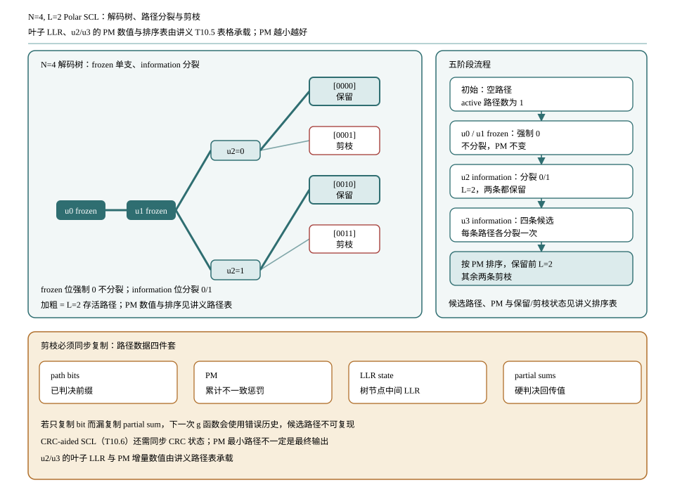

# T10.5 Polar SCL 译码
## 本节学习目标

本节讲Polar的逐次消除列表译码（Successive Cancellation List, SCL）。T10.4 的 SC 每个 information bit 只保留一个判决；一旦早期判错，后续 $g$ 函数会把错误 partial sum 带入右子树。SCL 的核心改进是：在 information bit 位置不急着只选 0 或 1，而是把多个候选路径保留下来，再用路径度量（Path Metric, PM）排序剪枝。

本节使用的工程缩写先统一说明：对数似然比是路径度量更新的输入软信息；循环冗余校验在本节只作为后续 T10.6 的最终选择边界，不参与本节 toy 例子的路径剪枝；寄存器传输级和专用集成电路用于描述硬件代价；静态随机存取存储器用于描述路径存储、LLR 存储和 partial sum 存储。

学完本节后，应能做到：

- 解释 SCL 相比 SC 解决的问题：单一路径早期判错不可恢复。
- 定义 path、PM、列表大小 $L$、split 和 prune。
- 说明 frozen bit 不分裂，information bit 分裂成 0/1 两条候选。
- 建立并坚持同一 PM 约定：本节约定 PM 越小越好。
- 用 $N=4,L=2$ 的 toy 例子走完路径分裂、PM 更新、排序和剪枝。
- 说明剪枝时必须同步复制路径 bit、LLR state、partial sum 和 CRC state。
- 讲清 sorter、path memory、copy network 和 partial sum memory 的硬件影响。

## 前置知识检查

| 前置项 | 本节需要达到的程度 |
|:---|:---|
| T10.4 | 能跟踪 SC 的 $f/g$、frozen 判决、information 判决和 partial sum。 |
| T10.3 | 知道 frozen set 和 information set 来自可靠性序列及协议构造。 |
| LLR | 知道 LLR 正负和幅度含义，能理解“候选 bit 与 LLR 方向一致时惩罚小”。 |
| Python 基础 | 能读懂列表路径扩展、排序和截断。 |

如果只记一个原则：**SCL 在 information bit 位置保留多条可能路径；PM 用来衡量路径和 LLR 证据是否一致；超过列表大小 $L$ 后按 PM 剪枝。**

## 任务边界与 Prompt 覆盖

| Prompt 要求 | 本节覆盖位置 | 覆盖方式 |
|:---|:---|:---|
| 讲解 SCL | “SCL 的译码对象” | 从 SC 早期判错不可恢复引出。 |
| 路径分裂 | “路径、分裂和剪枝” | frozen 不分裂，information 分裂。 |
| 路径度量 | “LLR 域 PM 更新” | 给精确式、近似式和 PM 越小越好约定。 |
| 列表大小和复杂度 | “列表大小 L 的工程含义”“复杂度与延迟” | 说明性能、面积、排序、复制代价。 |
| 玩具 PM 例子 | “数值例子：N=4, L=2 路径表” | 每一步列路径、PM、保留/剪枝状态。 |
| 排序对硬件影响 | “RTL/ASIC 映射” | sorter、path memory、copy network、partial sum memory。 |
| 伪代码 | “接收端伪代码” | 纯 Python toy SCL path manager。 |
| 常见错误 | “常见错误” | PM 方向反、状态未复制、frozen 错误分裂。 |

## 资料与协议边界

| 协议位置 | 本地证据路径 |
| :--- | :--- |
| TS 38.212 §5.3.1 | `3GPP_Rel19/processed/TS_38.212_38212-j30/content.md:815-837` |
| TS 38.212 §5.3.1.2 | `content.md:873-943` |
| TS 38.212 Table 5.3.1.2-1 | `tables/table_0012.csv/html` |
| TS 38.212 §5.4.1 | `content.md:1019-1125` |

协议边界说明：TS 38.212 规定 Polar 编码、构造、速率匹配和控制信息链路，但不规定接收机必须使用 SC、SCL 或某个具体 PM 公式。本节讲的是 NR Polar 接收端常用算法形态和硬件实现边界，不把 list size、sorter 结构、PM 近似或路径复制策略写成 3GPP 强制规则。

## SCL 的译码对象

SC 的状态可以理解为“一条路径”：

$$
p=[\hat{u}_0,\hat{u}_1,\ldots,\hat{u}_{i-1}].
\tag{1}
$$

到第 $i$ 个 bit 时，SC 根据当前叶子 LLR 和 frozen mask 只产生一个新 bit。SCL 则维护一个路径集合：

$$
\mathcal{P}_i=\{p_i^{(0)},p_i^{(1)},\ldots\}.
\tag{2}
$$

每条路径都有自己的：

| 状态 | 含义 | 剪枝时是否必须复制 |
|:---|:---|:---|
| path bits | 已判决的 $\hat{u}$ 前缀。 | 必须复制。 |
| PM | 该路径与 LLR 证据不一致的累计惩罚。 | 必须复制和更新。 |
| LLR state | 该路径下树节点的中间 LLR。 | 必须复制或使用指针共享。 |
| partial sum | 该路径下的硬编码回传值。 | 必须复制或使用路径索引重映射。 |
| CRC state | 若做在线 CRC 更新，记录路径的 CRC 寄存器。 | T10.6 使用，剪枝时必须同步。 |

基础 SCL 与 SC 的关系很直接：当 $L=1$ 时，SCL 每次只保留一条路径，行为退化为 SC。列表大小 $L$ 越大，越有机会保留“早期看起来较差但最终正确”的路径，但硬件排序、复制和存储开销也随之增加。

## 路径、分裂和剪枝

本节使用三个英文词，它们在硬件和软件日志中很常见：

| 词 | 中文含义 | 在 SCL 中的动作 |
|:---|:---|:---|
| path | 候选路径 | 一串已经判出的 $\hat{u}$ 前缀，加上 PM 和内部状态。 |
| split | 路径分裂 | information bit 位置把一条路径扩展成 bit=0 和 bit=1 两条。 |
| prune | 剪枝 | 候选路径数超过 $L$ 后，按 PM 排序保留前 $L$ 条。 |

对 frozen bit：

$$
i\in\mathcal{F}\quad\Rightarrow\quad \hat{u}_i=0,\ \text{no split}.
\tag{3}
$$

对 information bit：

$$
i\in\mathcal{I}\quad\Rightarrow\quad \hat{u}_i\in\{0,1\},\ \text{split}.
\tag{4}
$$

如果当前已有 $M$ 条路径，一个 information bit 会产生 $2M$ 条候选。随后：

$$
|\mathcal{P}_{i+1}|=\min(2M,L).
\tag{5}
$$

式 (5) 只说明数量，不说明质量。真正决定保留哪几条的是 PM 排序。

## LLR 域 PM 更新

本节约定 PM 越小越好。一个路径候选 bit $b\in\{0,1\}$ 与当前 LLR $L$ 的一致性可以用负对数似然表示。常见 LLR 域增量写成：

$$
\Delta PM(b,L)=\ln\left(1+\exp\left(-(1-2b)L\right)\right).
\tag{6}
$$

于是：

$$
PM_{\text{new}}=PM_{\text{old}}+\Delta PM(b,L).
\tag{7}
$$

式 (6) 的直观解释如下：

| 情况 | 例子 | $\Delta PM$ 行为 |
|:---|:---|:---|
| $L>0$ 且 $b=0$ | LLR 支持 0，候选也取 0。 | 惩罚小。 |
| $L>0$ 且 $b=1$ | LLR 支持 0，候选却取 1。 | 惩罚大，约为 $|L|$。 |
| $L<0$ 且 $b=1$ | LLR 支持 1，候选也取 1。 | 惩罚小。 |
| $L<0$ 且 $b=0$ | LLR 支持 1，候选却取 0。 | 惩罚大，约为 $|L|$。 |

硬件和快速模型常用近似：

$$
\Delta PM_{\text{approx}}(b,L)=
\begin{cases}
0, & b=\mathbf{1}[L<0],\\
|L|, & b\ne\mathbf{1}[L<0].
\end{cases}
\tag{8}
$$

其中 $\mathbf{1}[L<0]$ 是 LLR 对应的硬判决。式 (8) 是本节 toy 例子使用的 PM 更新。它的优势是只需要比较符号和加绝对值；代价是丢掉式 (6) 中的小修正项。

## 列表大小 L 的工程含义

列表大小 $L$ 是 SCL 的核心配置。它不是 Polar 协议表里的一个固定强制值，而是接收机实现和产品需求的选择。

| $L$ | 行为 | 工程后果 |
|---:|:---|:---|
| 1 | 退化为 SC。 | 存储和排序最简单，但性能较弱。 |
| 2/4 | 保留少量备选路径。 | 适合教学和低复杂度场景，排序简单。 |
| 8/16/32 | 常见控制信道实现会考虑的范围。 | 性能更好，但 path memory、sorter 和复制网络代价明显上升。 |

列表大小增加带来的不是单一乘法关系。$f/g$ 计算、LLR state、partial sum、路径 bit、PM、CRC state 都要按路径维度管理。若 $L$ 翻倍，排序候选数、复制带宽和 SRAM 读写压力也会增加。

## 数值例子：N=4, L=2 路径表

本例不是 3GPP 一致性向量，只用于讲清 SCL 的路径管理。设：

$$
\mathcal{F}=\{0,1\},\qquad \mathcal{I}=\{2,3\},\qquad L=2.
\tag{9}
$$

前两个 bit 是 frozen，后两个 bit 是 information。为聚焦 SCL 路径管理，本例直接给出每个路径在叶子处看到的 LLR：

| bit | 类型 | 路径上下文 | 叶子 LLR |
|:---|:---|:---|---:|
| $u_0$ | frozen | 初始路径 | 不影响 PM，强制 0 |
| $u_1$ | frozen | `[0]` | 不影响 PM，强制 0 |
| $u_2$ | information | `[0,0]` | $L(u_2)=-2.2$ |
| $u_3$ | information | `[0,0,0]` | $L(u_3)=+1.1$ |
| $u_3$ | information | `[0,0,1]` | $L(u_3)=+6.0$ |

### frozen 位处理

初始路径为空，PM 为 0：

$$
p=[] ,\quad PM=0.
\tag{10}
$$

$u_0$ 是 frozen：

$$
p=[0],\quad PM=0.
\tag{11}
$$

$u_1$ 也是 frozen：

$$
p=[0,0],\quad PM=0.
\tag{12}
$$

这两步都不分裂。如果实现把 frozen 位也分裂，那么到 $u_2$ 前就会产生 4 条没有协议意义的路径，浪费列表容量并污染 partial sum。

### u2 information 分裂

$u_2$ 的叶子 LLR 为：

$$
L(u_2)=-2.2.
\tag{13}
$$

LLR 为负，硬判决方向是 1。按式 (8)：

$$
\Delta PM(u_2=0)=2.2,\qquad \Delta PM(u_2=1)=0.
\tag{14}
$$

因此产生两条路径：

| path | PM | 状态 |
|:---|---:|:---|
| `[0,0,0]` | 2.2 | 保留 |
| `[0,0,1]` | 0.0 | 保留 |

因为 $L=2$，两条都保留。

### u3 information 分裂与剪枝

到 $u_3$ 时，两条路径各自分裂。注意它们的 $u_3$ LLR 可以不同，因为 SCL 中每条路径有不同 partial sum 和内部状态。

对路径 `[0,0,0]`：

$$
L(u_3\mid[0,0,0])=+1.1.
\tag{15}
$$

因此：

$$
PM([0,0,0,0])=2.2+0=2.2,
\tag{16}
$$

$$
PM([0,0,0,1])=2.2+1.1=3.3.
\tag{17}
$$

对路径 `[0,0,1]`：

$$
L(u_3\mid[0,0,1])=+6.0.
\tag{18}
$$

因此：

$$
PM([0,0,1,0])=0+0=0.0,
\tag{19}
$$

$$
PM([0,0,1,1])=0+6.0=6.0.
\tag{20}
$$

四条候选按 PM 从小到大排序：

| 排名 | path | PM | 结果 |
|---:|:---|---:|:---|
| 1 | `[0,0,1,0]` | 0.0 | 保留 |
| 2 | `[0,0,0,0]` | 2.2 | 保留 |
| 3 | `[0,0,0,1]` | 3.3 | 剪枝 |
| 4 | `[0,0,1,1]` | 6.0 | 剪枝 |

这一排序表是纯 PM 选择。若进入 T10.6 的 CRC-aided SCL，最终选择还要检查 CRC；PM 最小路径不一定是最终输出路径。

## 路径分裂图


| 内容 | 说明 |
|:---|:---|
| step | candidate path；u2 PM；u3 PM；total PM；status |
| path: [] | PM=0.00；active=1 |
| force 0 | path: [0]；PM=0.00；no split |
| force 0 | path: [0,0]；PM=0.00；no split |
| split to 0/1 | u2=0: PM=2.2；u2=1: PM=0.0；keep both |
| split each path | 4 candidates；sort by PM；keep best L=2 |
| after u3 | [0,0,0,0]；2.2；+0.0；2.2；pruned |
| after u3 | [0,0,0,1]；2.2；+1.1；3.3；pruned |
| after u3 | [0,0,1,0]；0.0；+0.0；0.0；kept #1 |
| after u3 | [0,0,1,1]；0.0；+6.0；6.0；kept #2 |
读图顺序从左到右：初始路径经过两个 frozen 位，保持单路径；到 $u_2$ 时分裂成两条路径；到 $u_3$ 时两条路径各自分裂成四条候选；最后按 PM 排序，只保留 $L=2$ 条。

本节图表中的工程检测点强调：排序器只比较 PM 还不够。剪枝时必须让 path bits、PM、LLR memory 指针、partial sum memory 和 CRC state 同步跟随保留路径。否则日志中可能显示“PM 排序正确”，但下一次 $g$ 函数使用的是另一条路径的 partial sum。

## 接收端伪代码

```python
def hard_bit(llr):
    return 0 if llr >= 0 else 1


def pm_delta(bit, llr):
    return 0.0 if bit == hard_bit(llr) else abs(llr)


def split_information(paths, llr_by_path, list_size):
    candidates = []
    for path in paths:
        key = tuple(path["bits"])
        llr = llr_by_path[key]
        for bit in (0, 1):
            candidates.append({
                "bits": path["bits"] + [bit],
                "pm": path["pm"] + pm_delta(bit, llr),
                "state": path["state"] + [f"split:{bit}"],
            })
    candidates.sort(key=lambda item: item["pm"])
    return candidates[:list_size]


paths = [{"bits": [], "pm": 0.0, "state": []}]

# u0, u1 are frozen.
for _ in range(2):
    for path in paths:
        path["bits"].append(0)
        path["state"].append("frozen")

# u2 information.
paths = split_information(paths, {(0, 0): -2.2}, list_size=2)

# u3 information; each surviving path owns its LLR state.
paths = split_information(
    paths,
    {
        (0, 0, 0): +1.1,
        (0, 0, 1): +6.0,
    },
    list_size=2,
)

assert paths[0]["bits"] == [0, 0, 1, 0]
assert paths[0]["pm"] == 0.0
assert paths[1]["bits"] == [0, 0, 0, 0]
assert paths[1]["pm"] == 2.2
print("T10.5_SCL_N4_L2_OK", [(p["bits"], p["pm"]) for p in paths])
```

这段代码只演示 path manager 和 PM 更新，不实现完整 Polar $f/g$ 树。完整工程中，每条 path 还要携带 LLR state、partial sum memory、CRC state 和有效标记；这些状态不能在剪枝时丢失。

## 复杂度与延迟

SCL 的复杂度来自四类扩张：

| 对象 | SC | SCL |
|:---|:---|:---|
| 路径数 | 1 条 | 最多 $L$ 条 |
| information bit | 一次硬判决 | 每条路径分裂 0/1 |
| 排序 | 不需要全局排序 | 每个 information bit 可能排序 $2L$ 个候选 |
| 存储 | 一份 LLR/partial sum | 多路径 LLR/partial sum 或共享指针机制 |

延迟不一定简单等于 SC 的 $L$ 倍。高性能实现会共享部分 $f/g$ 计算、采用 lazy copy、分阶段排序或桶排序。但从验证角度看，必须假设每条路径都有独立逻辑状态。任何“只复制 PM，不复制状态”的优化都应先由 directed test 证明正确。

## 浮点仿真方案

| 检查项 | 方法 | 期望 |
|:---|:---|:---|
| $L=1$ 退化 | 用同一输入跑 SCL $L=1$ 和 SC。 | 输出路径一致。 |
| frozen 不分裂 | 给 frozen 位强负 LLR。 | active path 数不增加。 |
| information 分裂 | 给 information 位 LLR。 | 每条路径扩展为 2 条候选。 |
| PM 方向 | 构造 $L=2$ toy。 | PM 越小越靠前。 |
| 状态复制 | 剪枝后继续跑一个 $g$ 节点。 | LLR trace 和 partial sum trace 对齐保留路径。 |
| CRC 接口 | 保存候选路径和 PM。 | T10.6 final selector 能继续读取候选。 |

最小 dump 字段：

| 字段 | 用途 |
|:---|:---|
| `bit_index`、`is_frozen` | 判断本次是否应分裂。 |
| `pre_path_count`、`candidate_count`、`post_path_count` | 检查路径数量。 |
| `candidate_pm[]`、`sort_order[]` | 检查 PM 排序方向。 |
| `path_bits[]` | 检查候选 bit 前缀。 |
| `llr_state_id[]`、`partial_sum_state_id[]` | 检查状态是否随路径复制。 |
| `pruned_path_id[]` | 复现剪枝行为。 |

## 定点化策略

PM 定点化的核心是范围、分辨率和饱和。

| 对象 | 定点策略 | 风险 |
|:---|:---|:---|
| LLR 输入 | 沿用 SC/SCL core 的 LLR 位宽。 | LLR 裁剪过强会让 PM 区分度下降。 |
| $\Delta PM$ | 可用 $|L|$ 近似或查表逼近式 (6)。 | 近似和查表版本混用导致 golden 不一致。 |
| PM 累加 | 使用比 LLR 更宽的无符号或有符号非负格式。 | 累加溢出后排序方向错。 |
| PM 饱和 | 超过最大值钳位到 `PM_MAX`。 | 多条饱和路径并列，tie-break 必须稳定。 |
| tie-break | 同 PM 时按 path id 或 bit 序固定。 | 不稳定排序造成回归不可复现。 |

若本节 toy 使用 6 bit LLR 幅度，而 $N$ 可能到 1024，PM 累加上界不能只按单个 LLR 设计。工程上常见策略是：PM 内部位宽足够覆盖若干大惩罚累加，并在接近上界时做统一归一化或饱和。无论采用哪种策略，验证都必须固定“PM 越小越好”的约定。

## RTL/ASIC 映射

| 模块 | 职责 | 主要风险 |
|:---|:---|:---|
| path memory | 保存每条路径的 bit 前缀或压缩 bit。 | 剪枝后路径重映射错。 |
| PM unit | 计算 $\Delta PM$ 并累加。 | PM 方向、位宽、饱和错。 |
| sorter | 从 $2L$ 候选中选前 $L$。 | comparator 方向反、tie-break 不稳定。 |
| copy network | 复制或重映射 LLR/partial sum/CRC state。 | 只复制 bits，漏复制状态。 |
| partial sum memory | 每条路径保留独立 partial sum。 | 路径共享时写后读冲突。 |
| LLR memory | 每条路径保留或共享中间 LLR。 | lazy copy 引用计数错。 |

排序对硬件的影响尤其直接。以 $L=8$ 为例，一个 information bit 最多产生 16 个候选。硬件需要在低延迟内完成 PM 计算、候选排序、路径选择和状态复制。如果 sorter 延迟太长，可能成为 Polar 控制信息译码的关键路径；如果使用分级排序或近似排序，必须证明不会改变 bit-exact 选择。

## 验证方法

| 测试 | 输入 | 期望 |
|:---|:---|:---|
| N=4,L=2 directed | 本节路径表。 | 输出 `[0,0,1,0]` 和 `[0,0,0,0]`，PM 为 0.0 和 2.2。 |
| frozen split guard | frozen 位输入任意 LLR。 | `candidate_count` 不翻倍。 |
| PM comparator direction | 候选 PM 为 0、2、5。 | 保留 PM 小的候选。 |
| tie-break | 多个候选 PM 相等。 | 排序稳定，可重复。 |
| path copy | 剪枝后继续执行右半树。 | path bits、LLR state、partial sum state 同步。 |
| L=1 equivalence | 同输入跑 SC 和 SCL L=1。 | 结果一致。 |

## 常见错误

| 错误 | 现象 | 定位方式 |
|:---|:---|:---|
| PM 方向反 | 最不可信路径被保留。 | 打印 `candidate_pm` 和 `sort_order`。 |
| frozen 位错误分裂 | active path 数在 frozen 位翻倍。 | 检查 `is_frozen` 和 `split_enable`。 |
| 剪枝后状态未同步 | 下一 bit 的 $g$ LLR 无法复现。 | 比对 `path_id`、`partial_sum_state_id` 和 `llr_state_id`。 |
| 只复制 bit 不复制 PM | 路径前缀正确但排序异常。 | 检查 copy network 的 PM write enable。 |
| PM 饱和后 tie-break 不稳定 | 同一随机种子回归结果不同。 | 固定同 PM 排序规则。 |
| L=1 不等于 SC | SCL 基础状态机错误。 | 用 T10.4 directed case 做等价测试。 |

## 与 CRC-aided SCL 的边界

本节到剪枝后保留 $L$ 条候选为止。若所有 information bit 都处理完，基础 SCL 可以选择 PM 最小路径作为输出。但 NR 控制信息通常还要利用 CRC/RNTI 边界进行最终选择。CRC-aided SCL 的规则不是“无条件选 PM 最小”，而是在候选路径中优先选择 CRC 通过的路径，再按 PM 或实现约定处理多个通过候选。

因此，本节的 PM 排序是候选管理机制；T10.6 的 CRC-aided selector 是最终输出机制。两者不能混淆。

## 自测题

1. SCL 相比 SC 主要解决什么问题？
2. frozen bit 和 information bit 在路径管理上有什么区别？
3. 本节 PM 约定是越小越好还是越大越好？
4. $L=2$ 时，一个 information bit 最多从两条路径扩展成几条候选？
5. 剪枝时为什么不能只复制 path bits？
6. 本节 toy 例子中，最终保留的两条路径和 PM 是什么？

## 自测题参考答案

1. 解决 SC 单路径早期判错不可恢复的问题，通过保留多条候选路径推迟最终选择。
2. frozen bit 强制为 0，不分裂；information bit 分裂为 0/1 两条候选并更新 PM。
3. 本节约定 PM 越小越好。
4. 两条路径各自分裂成 0/1，共 4 条候选，然后按 PM 保留 $L=2$ 条。
5. 因为后续 $g$ 函数和 CRC 更新依赖路径专属 LLR state、partial sum 和 CRC state；只复制 bits 会让状态错配。
6. `[0,0,1,0]` 的 PM 为 0.0，`[0,0,0,0]` 的 PM 为 2.2。

## 协议证据表

| 结论 | 协议依据 | 本地证据 |
|:---|:---|:---|
| NR Polar 编码使用 $G_N=F^{\otimes n}$ 且在 GF(2) 中执行 | TS 38.212 §5.3.1.2 | `content.md:873-943` |
| information/frozen 集合由 Polar sequence 和 §5.4.1.1 相关集合确定 | TS 38.212 §5.3.1.2 | `content.md:875-883` |
| 完整可靠性序列表由 Table 5.3.1.2-1 给出 | TS 38.212 Table 5.3.1.2-1 | `tables/table_0012.csv/html`；T10.3 已表格化复现 |
| SCL、PM 公式、sorter 和路径复制是接收端实现策略 | 协议未规定具体译码器实现 | 本节作为工程算法讲义，保持协议/实现边界 |

## 图示


## 执行与证据记录

| 项 | 记录 |
|:---|:---|
| 写作范围 | 新增 `docs/L2_协议算法/T10.5_Polar_SCL_decoding.md`。 |
| Prompt 对齐 | 覆盖 SCL、路径分裂、PM、剪枝、列表大小、复杂度、N=4/L=2 toy PM 例子、排序硬件影响、伪代码、定点化、RTL/ASIC、验证和常见错误。 |
| 协议精读 | 已读取 TS 38.212 §5.3.1、§5.3.1.2、§5.4.1；本节明确 SCL 是接收端算法，不是协议强制实现。 |
| Python toy | 正文片段已运行，输出 `T10.5_SCL_N4_L2_OK [([0, 0, 1, 0], 0.0), ([0, 0, 0, 0], 2.2)]`。 |
| 自动审计 | 已通过：`LESSON_TERM_AUDIT_OK`、`MARKDOWN_HEADING_AUDIT_OK`、`LESSON_DEPTH_AUDIT_OK`、`LATEX_RENDER_AUDIT_OK formulas=94`。 |
| 审核经理 | 待审核。 |

## 参考文献

1. 3GPP TS 38.212 Rel-19 `38212-j30`, Multiplexing and channel coding.
2. I. Tal and A. Vardy, "List Decoding of Polar Codes," IEEE Transactions on Information Theory, 2015.
3. 本项目 T10.3：`docs/L2_协议算法/T10.3_NR_Polar_reliability_sequence.md`。
4. 本项目 T10.4：`docs/L2_协议算法/T10.4_Polar_SC_decoding.md`。
