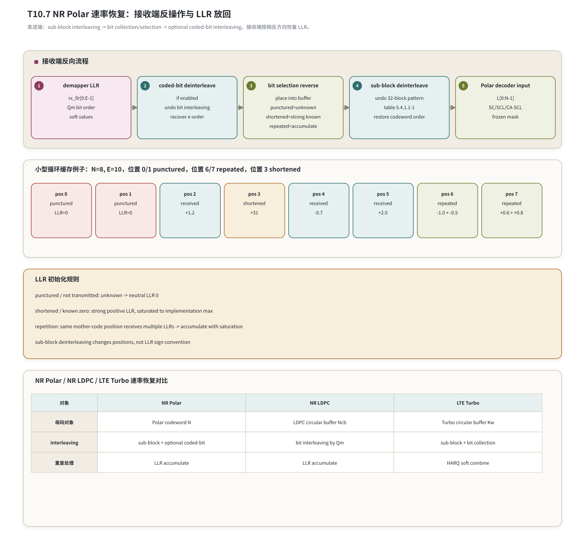

# T10.7 NR Polar 速率恢复
## 本节学习目标

本节讲 NR Polar速率匹配的接收侧反操作，也就是 Polar rate recovery。发送端在 TS 38.212 §5.4.1 中对 Polar coded bits 做 sub-block interleaving、bit collection/selection 和可选 coded-bit interleaving；接收端拿到的是解调器输出的对数似然比，必须把这些 LLR 按相反方向恢复到 Polar decoder 需要的 $N$ 个 codeword position。

本节使用的工程缩写先统一说明：逐次消除译码（Successive Cancellation, SC）、逐次消除列表译码（Successive Cancellation List, SCL）和循环冗余校验辅助 SCL（CRC-aided SCL, CA-SCL）是后续消费恢复后 LLR 的 Polar decoder；正交幅度调制的调制阶数会影响 coded-bit interleaving 的使用边界；寄存器传输级和专用集成电路用于描述硬件实现；本节还会对比低密度奇偶校验码、Turbo和混合自动重传请求软合并规则。

学完本节后，应能做到：

- 说明 Polar rate matching 的发送端三步和接收端反操作。
- 解释 sub-block deinterleaving、bit collection reverse 和 coded-bit deinterleaving 的区别。
- 说明 puncturing、shortening、repetition 对 LLR 初始化的不同影响。
- 复现 TS 38.212 Table 5.4.1.1-1 的 32 项 sub-block interleaver pattern，并解释每列含义。
- 给出小型循环缓存例子，包含 punctured、shortened 和 repeated 位置。
- 对比 NR Polar、NR LDPC 和 LTE Turbo rate recovery，避免混用规则。
- 给出 Python toy model、定点策略、RTL/ASIC 映射、验证方法和常见错误。

## 前置知识检查

| 前置项 | 本节需要达到的程度 |
|:---|:---|
| T10.1 | 知道 Polar 接收链路是 LLR -> rate recovery -> Polar decoder -> CA-SCL selector。 |
| T10.3 | 知道 $N$、$K$、information set 和 frozen set 的来源。 |
| T10.4/T10.5 | 知道 SC/SCL 需要 codeword-order LLR 作为输入。 |
| T2.16/T5.1 | 知道 LLR 可以被裁剪、量化、饱和和累加。 |

如果只记一个原则：**rate recovery 的目标不是重新译码，而是把空口顺序的 LLR 放回 Polar 母码位置；没有发送的位置要按语义初始化，重复发送的位置要累加。**

## 任务边界与 Prompt 覆盖

| Prompt 要求 | 本节覆盖位置 | 覆盖方式 |
|:---|:---|:---|
| Polar 速率匹配接收侧反操作 | “发送端步骤与接收端反操作” | 逐步反向说明。 |
| sub-block deinterleaving | “Sub-block deinterleaving” | 复现 Table 5.4.1.1-1。 |
| bit collection | “Bit collection reverse” | 讲 circular buffer 与 E/N 关系。 |
| puncturing/shortening/repetition | “三类速率匹配状态的 LLR 语义” | 给初始化和合并规则表。 |
| 配置时 bit interleaving | “Coded-bit deinterleaving” | 讲可选反交织和 Qm 边界。 |
| 小型循环缓存例子 | “数值例子：N=8, E=10” | 含 punctured、shortened、repeated。 |
| 流程图 | “发送端步骤与接收端反操作” | 用 Mermaid、循环缓存表和 LLR 语义表说明接收侧恢复流程。 |
| 对比 LDPC/LTE Turbo | “与 NR LDPC 和 LTE Turbo 的差异” | 规则差异表。 |
| Python toy model | “Python 可复现校验” | 输出恢复后的 LLR 数组。 |

## 资料与协议边界

| 协议位置 | 本地证据路径 |
| :--- | :--- |
| TS 38.212 §5.4.1 | `3GPP_Rel19/processed/TS_38.212_38212-j30/content.md:1019-1021` |
| TS 38.212 §5.4.1.1 | `content.md:1023-1039` |
| TS 38.212 Table 5.4.1.1-1 | `tables/table_0019.csv/html` |
| TS 38.212 §5.4.1.2 | `content.md:1081-1109` |
| TS 38.212 §5.4.1.3 | `content.md:1111-1125` |
| TS 38.212 §6.3.1.4.1/§6.3.2.4.1 | `content.md:2365-2387`; `content.md:2889` 附近 |
| TS 38.212 §7.3.4 | `content.md:7203-7207` |

本地表格核验：

| 文件 | SHA-256 | 说明 |
|:---|:---|:---|
| `tables/table_0019.csv` | `f5e4f0204280dc2d9a57793e4e4b2719711485824f56161501e33ea25f8f8aff` | Table 5.4.1.1-1 的 CSV 抽取。 |
| `tables/table_0019.html` | `53f9d3df14d5754bbc5777d4bb44c5cc24e34ce59bb4ba5585fe598266a33d82` | Table 5.4.1.1-1 的 HTML 抽取。 |

证据纠错记录：`tables/table_0013.csv` 是 LDPC lifting size set，不是 Polar sub-block interleaver pattern。本节使用 Word XML caption 附近核验，确认 Table 5.4.1.1-1 对应 `table_0019.csv/html`。

## 发送端步骤与接收端反操作

TS 38.212 §5.4.1 说明 Polar rate matching 由三部分组成：

| 发送端步骤 | 发送端对象 | 接收端反操作 |
|:---|:---|:---|
| sub-block interleaving | 将 Polar encoded bits 按 32 个 sub-block pattern 重排。 | sub-block deinterleaving，把 LLR 放回原 codeword order。 |
| bit collection / bit selection | 根据 $E$ 与 $N$ 选择、打孔、缩短或重复。 | bit selection reverse，把接收 LLR 放入母码位置，未发送位置初始化。 |
| interleaving of coded bits | 条件启用 coded-bit interleaving。 | coded-bit deinterleaving，先恢复 bit selection 输出顺序。 |

接收端实际顺序要从空口输出反着走：

$$
\text{rx LLR}
\rightarrow \text{coded-bit deinterleaving}
\rightarrow \text{bit selection reverse}
\rightarrow \text{sub-block deinterleaving}
\rightarrow \text{Polar decoder input}.
\tag{1}
$$

如果 coded-bit interleaving 没有启用，第一步直接跳过。无论是否启用，最终目标都是得到：

$$
\mathbf{L}=[L_0,L_1,\ldots,L_{N-1}],
\tag{2}
$$

其中 $L_i$ 对应 Polar codeword position $x_i$。

## Sub-block interleaver pattern 复现

TS 38.212 Table 5.4.1.1-1 的 32 项 pattern 本地复现如下：

| $j$ | $\Pi(j)$ | $j$ | $\Pi(j)$ | $j$ | $\Pi(j)$ | $j$ | $\Pi(j)$ |
|---:|---:|---:|---:|---:|---:|---:|---:|
| 0 | 0 | 4 | 3 | 8 | 8 | 12 | 10 |
| 1 | 1 | 5 | 5 | 9 | 16 | 13 | 18 |
| 2 | 2 | 6 | 6 | 10 | 9 | 14 | 11 |
| 3 | 4 | 7 | 7 | 11 | 17 | 15 | 19 |
| 16 | 12 | 20 | 14 | 24 | 24 | 28 | 27 |
| 17 | 20 | 21 | 22 | 25 | 25 | 29 | 29 |
| 18 | 13 | 22 | 15 | 26 | 26 | 30 | 30 |
| 19 | 21 | 23 | 23 | 27 | 28 | 31 | 31 |

列含义：

| 列 | 含义 |
|:---|:---|
| $j$ | 原 sub-block index。Polar coded bits 被划分为 32 个 sub-block。 |
| $\Pi(j)$ | interleaver pattern 给出的目标 sub-block index。 |

接收端 deinterleaving 的核心是反置换。若发送端把原 sub-block $j$ 放到 $\Pi(j)$，接收端就要把收到的 sub-block $\Pi(j)$ 放回 $j$。这不是 LLR 符号翻转，也不是可靠性序列；它只是位置重排。

## 三类速率匹配状态的 LLR 语义

Polar rate recovery 中最容易混淆的是 puncturing、shortening 和 repetition。

| 状态 | 发送端含义 | 接收端 LLR 初始化 |
|:---|:---|:---|
| puncturing | 某些 codeword position 没有发送。 | unknown，初始化为 0。 |
| shortening | 某些 codeword position 被固定为已知 0。 | known zero，初始化为强正 LLR，并饱和。 |
| repetition | $E>N$ 等场景下某些位置被多次发送。 | 同一母码位置 LLR 累加并饱和。 |

LLR 初始化规则可以写成：

$$
L_i=
\begin{cases}
0, & i\in\mathcal{P}_{\text{punctured}},\\
L_{\max}, & i\in\mathcal{S}_{\text{shortened}},\\
\sum_{m\in\mathcal{R}(i)} \ell_m, & i\in\mathcal{R}_{\text{repeated}},\\
\ell_i, & \text{normal received}.
\end{cases}
\tag{3}
$$

这里 $L_{\max}$ 是实现定义的正饱和值，表示“非常确信该位置为 0”。式 (3) 是接收端工程语义，不等同于协议公式逐字重写；它把协议的 bit selection 结果翻译成 decoder input LLR。

## Coded-bit deinterleaving

TS 38.212 §5.4.1.3 定义 interleaving of coded bits。接收端若 descriptor 指示该 interleaving 启用，就必须先做反交织，让 demapper 输出的 LLR 回到 bit selection output order。

这一层和 sub-block deinterleaving 不同：

| 层 | 操作对象 | 常见错误 |
|:---|:---|:---|
| coded-bit deinterleaving | rate matching 输出序列 $f$ 或空口 bit 顺序。 | 漏用 interleaver flag，导致每个调制符号内 bit LLR 顺序错。 |
| sub-block deinterleaving | Polar encoded codeword 的 32 个 sub-block。 | 使用错表或反置换方向错。 |

如果 coded-bit interleaving 用在高阶调制场景，错误的 bit order 会造成高信噪比下仍然 CRC fail，因为 LLR 的幅度看起来很强，但被送到了错误的 codeword position。

## 数值例子：N=8, E=10

本例是 toy，不是 3GPP 一致性向量。设 $N=8$，bit selection reverse 后得到以下状态：

| position | 状态 | 接收 LLR 操作 | 恢复后 LLR |
|---:|:---|:---|---:|
| 0 | punctured | 未发送，unknown | 0.0 |
| 1 | punctured | 未发送，unknown | 0.0 |
| 2 | received | 收到 $+1.2$ | +1.2 |
| 3 | shortened | 已知 0 | +31.0 |
| 4 | received | 收到 $-0.7$ | -0.7 |
| 5 | received | 收到 $+2.0$ | +2.0 |
| 6 | repeated | 收到 $-1.0$ 和 $-0.5$ | -1.5 |
| 7 | repeated | 收到 $+0.6$ 和 $+0.8$ | +1.4 |

如果实现把 punctured 位置填成强正 LLR，就等于告诉 SCL “这里几乎肯定是 0”，会把未知位置误当成 shortened。若把 shortened 位置填成 0，又会丢掉“该位置已知为 0”的强约束。若 repeated 位置采用覆盖而不是累加，会损失重发或重复带来的软信息增益。

## 速率恢复流程图


| 内容 | 说明 |
|:---|:---|
| punctured / not transmitted: unknown -> neutral LLR 0 | shortened / known zero: strong positive LLR, saturated to implementation max；repetition: same mother-code position receives multiple LLRs -> accumulate with saturation；sub-block deinterleaving changes positions, not LLR  |
| 母码对象 | Polar codeword N；LDPC circular buffer Ncb；Turbo circular buffer Kw |
| interleaving | sub-block + optional coded-bit；bit interleaving by Qm；sub-block + bit collection |
| 重复处理 | LLR accumulate；LLR accumulate；HARQ soft combine |
| rx_llr[0:E-1] | Qm bit order；soft values |
| if enabled | undo bit interleaving；recover e-order |
| place into buffer | punctured=unknown；shortened=strong known；repeated=accumulate |
| undo 32-block pattern | table 5.4.1.1-1；restore codeword order |
| L[0:N-1] | SC/SCL/CA-SCL；frozen mask |
上半部分展示接收端反操作顺序；中间展示 $N=8,E=10$ 的小型循环缓存例子；下半部分对比 NR Polar、NR LDPC 和 LTE Turbo 的 rate recovery 对象。

## 与 NR LDPC 和 LTE Turbo 的差异

| 对象 | NR Polar | NR LDPC | LTE Turbo |
|:---|:---|:---|:---|
| 母码对象 | Polar codeword 长度 $N$。 | LDPC circular buffer 长度 $N_{cb}$。 | Turbo circular buffer 长度 $K_w$。 |
| sub-block interleaving | 有 32 sub-block pattern。 | LDPC 主线不使用同一 Polar pattern。 | LTE Turbo 有自己的 sub-block interleaving。 |
| puncturing/shortening | 与 Polar bit selection 和 construction 相关。 | 与 LDPC rate matching、filler、limited buffer 相关。 | 与 Turbo `<NULL>`、puncturing、RV 规则相关。 |
| repetition | 同母码位置 LLR 累加。 | 同母码位置 LLR 累加。 | HARQ soft buffer 中累加或合并。 |
| decoder input | SC/SCL/CA-SCL 的 codeword-order LLR。 | LDPC BP/Min-Sum 的 variable-node LLR。 | Turbo decoder 的 systematic/parity LLR。 |

不能把 LDPC 的 $N_{cb}$、LTE Turbo 的 $K_w$ 或 Polar 的 $N$ 混成一个统一变量。三者都可能使用 circular buffer 或重复 LLR 累加，但协议表、地址生成、interleaving 和空洞语义不同。

## Python 可复现校验

```python
def recover_toy_polar_llr(max_llr=31.0):
    states = {
        0: ("punctured", []),
        1: ("punctured", []),
        2: ("received", [+1.2]),
        3: ("shortened", []),
        4: ("received", [-0.7]),
        5: ("received", [+2.0]),
        6: ("repeated", [-1.0, -0.5]),
        7: ("repeated", [+0.6, +0.8]),
    }
    out = []
    for i in range(8):
        kind, vals = states[i]
        if kind == "punctured":
            out.append(0.0)
        elif kind == "shortened":
            out.append(max_llr)
        else:
            acc = sum(vals)
            acc = min(max(acc, -max_llr), max_llr)
            out.append(acc)
    return out


llr = recover_toy_polar_llr()
assert llr == [0.0, 0.0, 1.2, 31.0, -0.7, 2.0, -1.5, 1.4]
print("T10.7_POLAR_RATE_RECOVERY_TOY_OK", llr)
```

## 浮点仿真方案

| 检查项 | 方法 | 期望 |
|:---|:---|:---|
| sub-block pattern | 用 Table 5.4.1.1-1 生成置换和反置换。 | 反置换后回到原序列。 |
| puncturing | 构造未发送位置。 | LLR 为 0。 |
| shortening | 构造已知 0 位置。 | LLR 为强正饱和值。 |
| repetition | 同一位置多次写入。 | LLR 累加并饱和。 |
| coded-bit interleaving flag | 打开/关闭 flag。 | 只有打开时执行反交织。 |

## 定点化策略

| 对象 | 定点策略 | 风险 |
|:---|:---|:---|
| punctured LLR | 精确写 0。 | 写成强正或强负会引入虚假证据。 |
| shortened LLR | 写 $+L_{\max}$。 | 符号约定反时会强制错误 bit。 |
| repeated LLR | 饱和累加。 | 覆盖而非累加会损失可靠度；回绕会翻符号。 |
| deinterleaver output | 保持 LLR 位宽和符号。 | 位置重排误写成符号处理。 |

若 6 bit signed LLR 范围为 $[-32,31]$，两个 repeated LLR $+24$ 和 $+18$ 的和应饱和为 $+31$，不能回绕为负值。

## RTL/ASIC 映射

| 模块 | 职责 | 必查信号 |
|:---|:---|:---|
| descriptor parser | 解析 $E,N,K$、interleaver flag、puncturing/shortening/repetition 状态。 | `E`, `N`, `K`, `i_bil`, `rate_match_mode` |
| coded-bit deinterleaver | 反转 §5.4.1.3 的 coded-bit interleaving。 | `rx_idx`, `e_idx`, `Qm`, `i_bil` |
| bit-selection restore | 把 LLR 放入母码 buffer。 | `buf_addr`, `write_en`, `acc_en`, `state` |
| sub-block deinterleaver | 使用 Table 5.4.1.1-1 反置换 32 个 sub-block。 | `subblk_in`, `subblk_out`, `pi_inv` |
| Polar input buffer | 输出 $N$ 个 codeword-order LLR。 | `llr_out[i]`, `valid`, `saturation_flag` |

硬件实现可以把 bit selection reverse 和 sub-block deinterleaving 合并成一个地址生成器，但验证时仍要分层 dump。否则 CRC fail 时很难判断是 circular buffer 放错、sub-block pattern 反了，还是 coded-bit deinterleaver 漏了。

## 验证方法

| 测试 | 输入 | 期望 |
|:---|:---|:---|
| Table 5.4.1.1-1 完整性 | `table_0019.csv`。 | 32 个 $j,\Pi(j)$，覆盖 0-31。 |
| Toy recovery | 本节 $N=8,E=10$。 | 输出 `[0.0,0.0,1.2,31.0,-0.7,2.0,-1.5,1.4]`。 |
| puncturing/shortening 反例 | 交换两类状态。 | directed test 必须失败。 |
| repetition 饱和 | 大幅度重复 LLR。 | 饱和而非回绕。 |
| interleaver flag | 打开/关闭 coded-bit deinterleaving。 | 输出位置按预期变化。 |

## 常见错误

| 错误 | 现象 | 定位方式 |
|:---|:---|:---|
| puncturing/shortening 反 | 高 SNR 仍 CRC fail，路径 PM 异常自信。 | dump `state`、`llr_init`。 |
| Table 5.4.1.1-1 用错表 | sub-block 位置整体错乱。 | 检查是否误用 LDPC `table_0013`。 |
| sub-block 方向反 | interleaver 和 deinterleaver 都使用同一方向。 | 用递增序列做 round-trip。 |
| interleaver flag 漏用 | 高阶调制场景 bit order 错。 | dump `i_bil` 和 coded-bit deinterleaver 输出。 |
| repeated 覆盖 | 重复位置只保留最后一次 LLR。 | 检查 `acc_en` 和 saturation flag。 |
| $E/N/K$ 混淆 | buffer 越界或 mask 尺寸错。 | descriptor dump 对齐 [[T10.1_NR_Polar_decoder_chain_overview|T10.1]] 字段。 |

## 自测题

1. Polar rate matching 的发送端三步是什么？
2. 接收端为什么要先做 coded-bit deinterleaving，再做 bit selection reverse？
3. punctured 和 shortened 位置的 LLR 初始化有什么不同？
4. repeated 位置为什么要累加 LLR？
5. 本节确认 Table 5.4.1.1-1 对应哪个本地表文件？
6. 为什么不能把 NR LDPC 的 $N_{cb}$ 当成 NR Polar 的 $N$？

## 自测题参考答案

1. sub-block interleaving、bit collection/selection、interleaving of coded bits。
2. 因为空口 demapper 输出先处在 coded-bit interleaving 后的顺序，必须先恢复到 bit selection output order，才能正确放回母码位置。
3. punctured 是未知，LLR 为 0；shortened 是已知 0，LLR 为强正饱和值。
4. 因为多次观测同一母码位置提供独立或近似独立软证据，LLR 在对数域中相加。
5. `tables/table_0019.csv/html`；`table_0013` 是 LDPC lifting size set，不是 Polar 表。
6. 它们属于不同码和不同 rate matching 规则；变量名相似但地址空间、表格和空洞语义不同。

## 协议证据表

| 结论 | 协议依据 | 本地证据 |
|:---|:---|:---|
| Polar rate matching 包含 sub-block interleaving、bit collection 和 bit interleaving | TS 38.212 §5.4.1 | `content.md:1019-1021` |
| Polar coded bits 被分成 32 个 sub-block，pattern 来自 Table 5.4.1.1-1 | TS 38.212 §5.4.1.1 | `content.md:1023-1039`; `tables/table_0019.csv/html` |
| Bit selection 写入 circular buffer，并处理 repetition/puncturing/shortening | TS 38.212 §5.4.1.2 | `content.md:1081-1109` |
| Coded-bit interleaving 在 §5.4.1.3 定义 | TS 38.212 §5.4.1.3 | `content.md:1111-1125` |
| UCI/DCI Polar 分支调用 §5.4.1 rate matching | TS 38.212 §6.3.1.4.1/§6.3.2.4.1/§7.3.4 | `content.md:2365-2387`; `content.md:2889`; `content.md:7203-7207` |

## 图示


## 执行与证据记录

| 项 | 记录 |
|:---|:---|
| 写作范围 | 新增 `docs/L2_协议算法/T10.7_NR_Polar_rate_recovery.md`。 |
| Prompt 对齐 | 覆盖 Polar rate recovery 接收端反操作、sub-block deinterleaving、bit collection reverse、puncturing/shortening/repetition、coded-bit deinterleaving、小型循环缓存例子、流程图、LDPC/LTE Turbo 对比、Python toy、定点、RTL/ASIC、验证和常见错误。 |
| 协议精读 | 已读取 TS 38.212 §5.4.1、§5.4.1.1、§5.4.1.2、§5.4.1.3、§6.3.1.4.1、§6.3.2.4.1、§7.3.4。 |
| 表格证据 | `table_0019.csv` SHA-256 `f5e4f0204280dc2d9a57793e4e4b2719711485824f56161501e33ea25f8f8aff`；`table_0019.html` SHA-256 `53f9d3df14d5754bbc5777d4bb44c5cc24e34ce59bb4ba5585fe598266a33d82`；已确认 `table_0013` 不是 Polar 表。 |
| Python toy | `T10.7_POLAR_RATE_RECOVERY_TOY_OK [0.0, 0.0, 1.2, 31.0, -0.7, 2.0, -1.5, 1.4]`。 |
| 自动审计 | `python3 tools/audit_lesson_terms.py docs/L2_协议算法/T10.7_NR_Polar_rate_recovery.md`；`python3 tools/audit_markdown_headings.py docs/L2_协议算法/T10.7_NR_Polar_rate_recovery.md`；`python3 tools/audit_lesson_depth.py --strict docs/L2_协议算法/T10.7_NR_Polar_rate_recovery.md`；`python3 tools/audit_latex_render.py docs/L2_协议算法/T10.7_NR_Polar_rate_recovery.md`。 |
| 审核经理 | 待审核。 |

## 参考文献

1. 3GPP TS 38.212 Rel-19 `38212-j30`, Multiplexing and channel coding.
2. 本项目 [[T10.1_NR_Polar_decoder_chain_overview|T10.1]]：`docs/L2_协议算法/T10.1_NR_Polar_decoder_chain_overview.md`。
3. 本项目 [[T10.3_NR_Polar_reliability_sequence|T10.3]]：`docs/L2_协议算法/T10.3_NR_Polar_reliability_sequence.md`。
4. 本项目 [[T10.6_CRC_aided_SCL_control_reliability|T10.6]]：`docs/L2_协议算法/T10.6_CRC_aided_SCL_control_reliability.md`。
