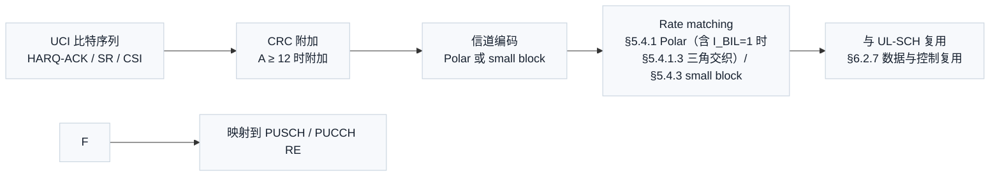
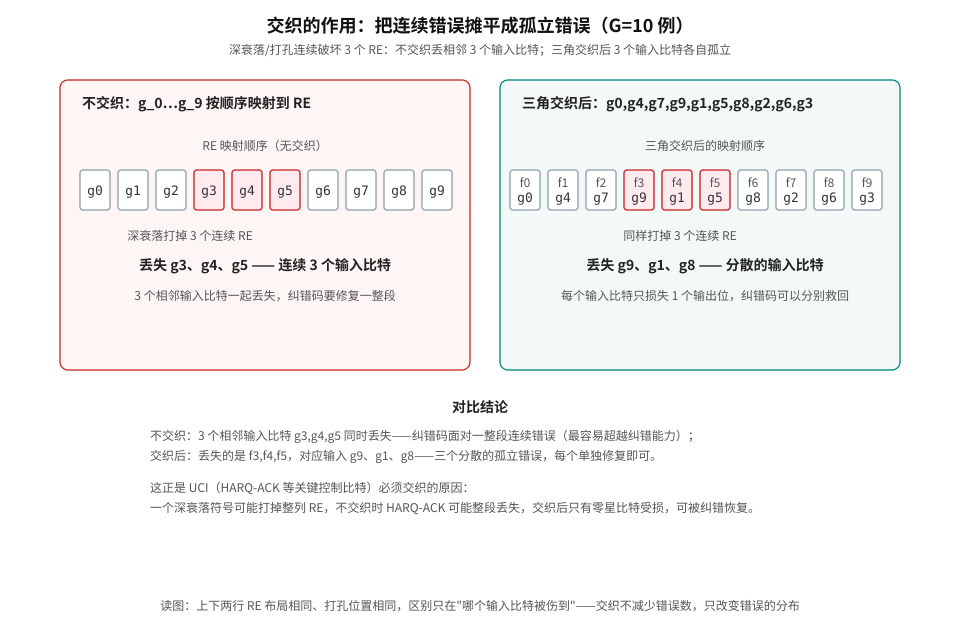
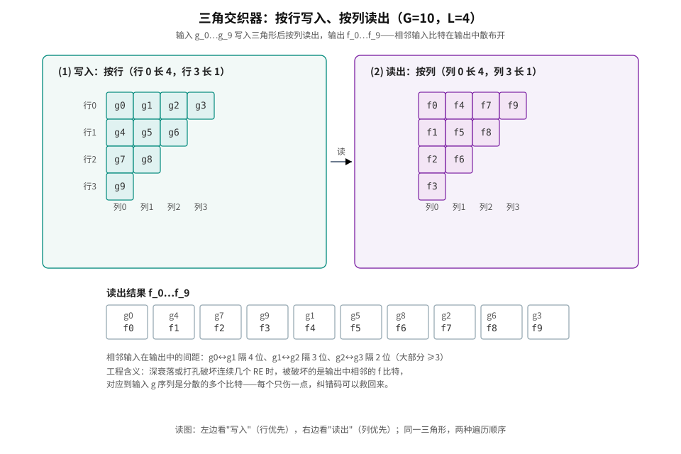

# T10.9 NR UCI 交织：三角交织器与 UCI 承载

## 本节学习目标

前几节把 NR Polar（极化码，Polar Code）的编码、rate recovery 和译码链讲完了。但译码器面对的并不总是数据业务：UE 还要在 PUSCH（物理上行共享信道，Physical Uplink Shared Channel）/PUCCH（物理上行控制信道，Physical Uplink Control Channel）上发送**上行控制信息（Uplink Control Information, UCI）**——HARQ-ACK 应答、调度请求（SR）和信道状态信息（CSI）。这些控制比特比数据更关键：一个 HARQ-ACK 错了，基站可能重传整个传输块。NR 为 UCI 设计了一个数据链路没有的专用结构——**三角交织器（triangular interleaver）**，把 UCI 比特在时频资源上散布开，抵抗深衰落和打孔。

学完本节后，应能做到：

- 说明 UCI 是什么、有哪些类型，以及它们在 PUCCH/PUSCH 上的承载位置。
- 画出 UCI 发送端编码链：CRC（循环冗余校验，Cyclic Redundancy Check）→ 编码（Polar 或 small block）→ rate matching → 交织 → 复用 → RE（资源元素，Resource Element）映射。
- 解释为什么 UCI 需要交织，以及为什么 NR 用三角交织而不是矩形块交织。
- 用 G=10 的数值例子完整走一遍三角交织器的按行写入、按列读出，并计算散布间距。
- 说清接收端如何解交织、解复用，以及哪些步骤是协议强制、哪些是接收机自由度。
- 按 TS 38.212 §5.4.1.3 协议原文核对三角交织器的写读规则，并说明它在 Polar rate matching 内部的位置（I_BIL=1 门控）。

## 前置知识检查

| 前置项 | 本节要求 |
|:---|:---|
| UCI 是什么 | 知道上行控制信息包括 HARQ-ACK、SR、CSI，是 UE 发给基站的反馈。 |
| Polar 编码 | 知道 UCI 常用 Polar 编码（A 较小时用 small block 编码），rate matching 见 [[T10.7_NR_Polar_rate_recovery|T10.7]]。 |
| 交织 | 知道交织是把比特顺序打散再传输，接收端按逆序恢复。 |
| PUSCH/PUCCH | 知道 PUSCH 传数据（可捎带 UCI），PUCCH 专门传控制信息。 |
| 深衰落 | 知道信道在某时刻/频率上可能整段变差，连续 RE 一起受损。 |

若需复习 Polar rate matching，可先读 [[T10.7_NR_Polar_rate_recovery|T10.7]] 的 circular buffer 与比特交织部分。

## UCI：译码器上游的控制反馈

**UCI 是什么**：上行控制信息是 UE 向基站报告的三类反馈：混合自动重传应答（HARQ-ACK，告诉基站下行传输是否译码成功）、调度请求（Scheduling Request, SR，UE 请求上行资源）、信道状态信息（Channel State Information, CSI，报告信道质量和推荐传输参数）。它们不是用户数据，但比用户数据更关键——基站依据它们决定重传和调度。

| UCI 类型 | 内容 | 错一个的后果 |
|:---|:---|:---|
| HARQ-ACK | 对下行 TB（传输块，Transport Block）/传输的应答（ACK/NACK） | 基站误判是否重传，可能丢数据或浪费资源。 |
| SR | 请求上行资源 | 上行数据排队等待，时延增大。 |
| CSI | CQI（信道质量指示，Channel Quality Indicator）/PMI（预编码矩阵指示，Precoding Matrix Indicator）/RI（秩指示，Rank Indicator）等信道反馈 | 基站按错误信道信息调度，链路性能下降。 |

UCI 的承载位置有两个：**PUCCH**（专门的控制信道，格式 0-4）和 **PUSCH**（数据信道捎带，与 UL-SCH（上行共享信道，Uplink Shared Channel）数据复用）。当 UE 同时有数据和 UCI 时，UCI 优先捎带在 PUSCH 上，不占额外资源；此时 UCI 比特必须**散布**在整个 PUSCH 区域里，而不是集中在资源边缘——这正是三角交织器的用武之地。

## UCI 发送端编码链总览

UCI 从比特到 RE 的处理链如下（协议流程，接收端按相反方向恢复）：



链路中每一级的输入输出：

| 级 | 输入 | 处理 | 输出 |
|:---|:---|:---|:---|
| CRC | UCI 比特 $a_0\ldots a_{A-1}$ | A≥12 时附加 CRC（长度 L 见协议） | $c_0\ldots c_{A+L-1}$ |
| 编码 | 带 CRC 的比特 | A+L ≤ 11 用 small block（RM 码），否则 Polar | 编码比特 $d_0\ldots d_{N-1}$ |
| Rate matching | 编码比特 | §5.4.1（Polar）或 §5.4.3（small block），输出长度 $E_{UCI}$ | $f_0\ldots f_{E-1}$ |
| 交织 | RM 输出 | **三角交织**（本节主角） | 交织后比特 $g_0\ldots g_{G-1}$ |
| 复用/映射 | 交织后比特 | 与 UL-SCH 数据复用，映射到 RE | PUSCH/PUCCH 物理资源 |

**接收端是精确的逆流程**：解映射取回 UCI 比特 → 解复用 → 解交织（按列写、按行读，与发送端相反）→ 逆 rate recovery → 译码 → CRC 校验 → 得到 $a$ 序列。解交织器不需要知道信道状态——交织规则完全由发送端确定，接收端按同一规则反向执行即可。

## 交织的动机：突发错误的分布问题

先回答一个基本问题：为什么不能把 UCI 比特按顺序直接映射到 RE？

因为无线信道有**突发错误**特性：深衰落、打孔（puncturing）或干扰常常一次破坏**连续多个 RE**。如果 HARQ-ACK 的比特恰好连续排列，一次深衰落就可能把整段 ACK/NACK 打掉——基站完全不知道 UE 是否收到，只能盲目重传，最坏的情况（连续 NACK 丢失）甚至会造成数据面断链。

交织的作用是**改变错误的分布，不减少错误的数量**：把"连续 3 个比特一起丢"变成"3 个孤立比特各丢 1 个"，后者是纠错码擅长处理的。下图是 G=10 教学例的直观对比（同一组 RE、同一打孔位置）：



左列不交织：打掉 RE 3-5 直接丢失输入比特 g3、g4、g5——三个相邻输入一起丢；右列三角交织后：同样打掉 RE 3-5，丢失的是输出 f3、f4、f5，对应输入 g9、g1、g8——三个分散的输入比特，各自孤立，纠错码可以分别修复。**交织不减少错误数，只改变错误的分布**——这是本节最重要的工程结论。

## 三角交织器：教学重建

**三角交织器（triangular interleaver）**是 NR 为 UCI 设计的专用交织结构。它的名字来自写入用的阵列形状：把比特按行写入一个**三角形**（行长度递减），再按列读出。

### 行数 L 的确定

设 UCI rate matching 输出（即待交织）的比特数为 $G$。三角交织器需要确定行数 $L$，使得三角形能容纳全部 $G$ 个比特：

$$
\frac{L(L+1)}{2} \geq G
\tag{1}
$$

$L$ 取满足式 (1) 的最小整数。例如 $G=10$：$L=4$ 时容量 $4\cdot5/2=10$ 正好够；$G=11$ 时 $L=4$ 容量 10 不够，取 $L=5$（容量 15，有 4 个空位）。

### 写入与读出规则

- **写入**：按行，从上到下。第 $i$ 行（$i=0,1,\ldots,L-1$）有 $L-i$ 个位置。比特 $g_0,g_1,\ldots,g_{G-1}$ 依次填入。
- **读出**：按列，从左到右。第 $j$ 列读出该列所有已填比特。

以 $G=10$、$L=4$ 为例，写入后的三角形（行 0 长 4，行 3 长 1）：

| 行 | 列 0 | 列 1 | 列 2 | 列 3 |
|:--:|:--:|:--:|:--:|:--:|
| 行 0 | g0 | g1 | g2 | g3 |
| 行 1 | g4 | g5 | g6 | — |
| 行 2 | g7 | g8 | — | — |
| 行 3 | g9 | — | — | — |

按列读出：列 0 取 g0,g4,g7,g9；列 1 取 g1,g5,g8；列 2 取 g2,g6；列 3 取 g3。输出序列为：

$$
f = [\,g_0,\ g_4,\ g_7,\ g_9,\ g_1,\ g_5,\ g_8,\ g_2,\ g_6,\ g_3\,]
\tag{2}
$$

下图把写入（左）和读出（右）画在一起：左面板格内是输入编号 g_i（即写入顺序），右面板格内是输出编号 f_i（即读出顺序）：



### 散布效果：相邻输入的输出间距

交织质量的关键指标：**相邻输入比特在输出序列中的间距**。上例中：

| 相邻输入 | 输出位置 | 间距 |
|:---|:---|:---|
| g0 → g1 | 位置 0 → 4 | 4 |
| g1 → g2 | 位置 4 → 7 | 3 |
| g2 → g3 | 位置 7 → 9 | 2 |
| g4 → g5 | 位置 1 → 5 | 4 |
| g5 → g6 | 位置 5 → 8 | 3 |
| g7 → g8 | 位置 2 → 6 | 4 |

相邻输入在输出中至少相隔 2 位，大部分相隔 3-4 位。工程含义："连续 3 个输出 RE 被破坏"的突发错误至多同时打掉一对相邻输入（如 G=10 中 g2↔g3 间距为 2，突发 {7,8,9} 会同时命中——但绝不会一次伤到三对相邻输入）。**三角形而不是矩形**的原因：三角形行长度递减，使列读出时不同列的起点错开，相邻输入在输出中的间距随位置渐变而不是固定值——对"任意长度的突发错误"都有更均匀的散布。

### 三角交织与块交织的对比

| 交织器 | 阵列形状 | 写/读 | 特性 | 用在 |
|:---|:---|:---|:---|:---|
| 块交织（block interleaver） | 矩形 $R \times C$ | 按行写、按列读 | 间距固定为列数 C；末尾补位规则简单 | LTE 比特交织、Polar 子块交织 |
| **三角交织器** | 三角形（行递减） | 按行写、按列读 | 间距渐变；对变长输入（G 任意）无浪费或少量空位 | **NR UCI**（本节） |
| QPP 交织 | 无阵列（置换多项式） | 按索引置换 | 代数结构，适合并行译码 | LTE Turbo（Turbo 码，Turbo Code）内部 |

块交织的间距是固定的（= 列数），输入长度必须是列的整数倍（或大量补位）；三角交织对**任意长度 G** 都能用最小容量三角形容纳（最多浪费 $L-1$ 个空位），且间距自然渐变——这正是 UCI 长度不定（每次 HARQ-ACK 比特数都不同）时选择三角形的原因。

## 数值例子：G=10 完整手算

**题目**：UCI rate matching 输出 $g = [0,1,2,3,4,5,6,7,8,9]$（为方便手算，用数值代替比特内容）。求 $L$、写入阵列、读出序列，并验证读出序列长度与散布。

**第一步，求 L**：$L(L+1)/2 \geq 10$ → $L=4$（$4\cdot5/2=10$）。

**第二步，写入**（按行）：

```
行0: 0 1 2 3
行1: 4 5 6
行2: 7 8
行3: 9
```

**第三步，读出**（按列）：列 0 → 0,4,7,9；列 1 → 1,5,8；列 2 → 2,6；列 3 → 3。

读出序列：$f = [0,4,7,9,1,5,8,2,6,3]$，长度 10 = G ✓。

**第四步，散布检查**：相邻输入 0→1 在输出中间距 4，1→2 间距 3，2→3 间距 2；4→5 间距 4，5→6 间距 3；7→8 间距 4。任何连续 3 个输出位（如 f3,f4,f5 = 9,1,8）最多包含一对相邻输入中的一个成员——与图 2 的结论一致。

**第五步，接收端解交织**：接收端把收到的 10 个比特按列写入同一三角形、按行读出，即恢复 $g$ 序列。写读规则互换方向即可，不需要任何信道信息。

## 接收端：解交织与解复用

接收端处理链是发送端的镜像：

| 步骤 | 动作 | 依据 |
|:---|:---|:---|
| 解映射 | 从 PUSCH/PUCCH RE 取回 UCI 位置的软信息 | 资源映射规则（协议强制） |
| 解复用 | 从 UL-SCH 数据中分出 UCI 比特（数据与 UCI 的 RE 划分） | §6.2.7 复用规则（协议强制） |
| **解交织** | 按列写入同一三角形、按行读出 | 与发送端写读互换（规则由发送端决定，接收端按同一参数执行） |
| 逆 rate recovery | 按 §5.4.1/§5.4.3 反向恢复编码比特（含去打孔、软合并） | 协议 rate matching 规则 |
| 译码 + CRC | Polar 或 small block 译码，CRC 校验，输出 $a$ 序列 | 与 [[T10.4_Polar_SC_decoding|T10.4]]-[[T10.7_NR_Polar_rate_recovery|T10.7]] 相同 |

工程注意点：

- **解交织不需要信道信息**：交织规则只依赖 $G$（由 $E_{UCI}$ 和复用结果确定），发送端与接收端对 $G$ 的取值必须一致——任何一侧算错 $G$，整个交织/解交织就错位。
- **UCI 与数据的软信息分开处理**：解复用后 UCI 比特的 LLR（对数似然比，Log-Likelihood Ratio）与 UL-SCH 数据的 LLR 走不同译码器（UCI 走 Polar/small block，数据走 LDPC（低密度奇偶校验码，Low-Density Parity-Check Code）/Turbo）。译码器接口上，UCI 是一个独立的 decoder 实例或独立任务。
- **交织后的 LLR 顺序**：解交织器同时作用于 LLR 序列的排列——接收端在解交织后，LLR 的顺序才与编码器输出顺序一致，之后才能送入译码器。顺序错位是 UCI 接收最典型的实现错误之一。

## 协议锚点

本节协议锚点全部核对自本地抽取件 `3GPP_Rel19/processed/TS_38.212_38212-j30/`。

### 锚点 1：UCI 编码链（TS 38.212 §6.3.1 / §6.3.2）

- **§6.3.1 UCI with UL-SCH**：UCI 与上行数据一起在 PUSCH 上传输时的处理链（CRC → 编码 → rate matching → 复用）。
- **§6.3.2 UCI without UL-SCH**：无数据时 UCI 在 PUSCH/PUCCH 上的处理。
- 本地证据：`full.md` §6.3.1.4.1 的 Table 6.3.1.4.1-1（E_UCI 取值表，含 CSI two parts 时 part1/part2 的 E_UCI 公式）已在上一节核对：Polar 编码 UCI 的 rate matching 输出长度 $E_r = \lfloor E_{UCI}/C_{UCI}\rfloor$，$I_{BIL}=1$。
- 接收端含义：UCI 的码块数 $C_{UCI}$ 与 $E_{UCI}$ 决定了解交织器规模，必须先解析。

### 锚点 2：Rate matching 位置（TS 38.212 §5.4.1 / §5.4.3）

- §5.4.1：Polar 码 rate matching（子块交织 → circular buffer → 比特交织，[[T10.7_NR_Polar_rate_recovery|T10.7]] 已精读）。
- §5.4.3：small block（RM 码）rate matching——§6.3.1.4.2 明确"Rate matching is performed according to Clause 5.4.3 by setting $E=E_{UCI}$"（本地抽取件 `full.md` 已核对）。
- 接收端含义：小 UCI（A+L ≤ 11）走 RM 码 + §5.4.3，大 UCI 走 Polar + §5.4.1——解交织前的 rate recovery 分支由 UCI 大小决定。

### 锚点 3：三角交织的协议位置（TS 38.212 §5.4.1.3）与复用映射（§6.2.7 / §6.3.2.6）

- **§5.4.1.3 Interleaving of coded bits**（本地抽取件 `content.md:1117-1160`、`full.md:1688-1730` 完整存在）：当 $I_{BIL}=1$ 时，rate matching 输出 $e_0,\ldots,e_{E-1}$ 按三角阵列交织——设 $T$ 为满足 $T(T+1)/2 \geq E$ 的最小整数，按行写入 $v(i,j)=e_k$（$i=0..T-1$，$j=0..T-1-i$），空位填 $\langle NULL\rangle$，再按列读出。**这与本讲义式 (1)(2) 的教学重建完全一致**——写读方向与 $T$ 判定公式已按协议原文核对，不再标注待核验。
- **位置归属**：交织发生在 **Polar rate matching（§5.4.1）内部**（bit selection 之后、$I_{BIL}=1$ 门控），不是 rate matching 与复用之间的独立链路级——本讲义链路图与表已按此修正。
- **§6.3.2.6 Multiplexing of coded UCI bits to PUSCH**：本地抽取件原文仅一句"multiplexed onto PUSCH according to the procedures in Clause 6.2.7"——UCI 到 PUSCH 的复用细节集中在 §6.2.7。
- **§6.2.7 Data and control multiplexing**：数据与控制复用的规程，含 UCI 与 UL-SCH 在 RE 上的交织安排。

### 锚点 4：协议强制 vs 接收机实现自由度

| 项目 | 归属 | 说明 |
|:---|:---|:---|
| UCI 类型定义、编码方案选择（Polar/small block） | 协议强制 | §6.3.1/§6.3.2 规定 |
| E_UCI、C_UCI 的确定 | 协议强制 | Table 6.3.1.4.1-1 等 |
| 交织规则（写读方式） | 协议强制（发送端） | 收发必须一致；写读规则已按 §5.4.1.3 原文核对 |
| 与 UL-SCH 的复用安排 | 协议强制 | §6.2.7 |
| 解交织的 LLR 处理顺序、软合并策略 | 接收机自由度 | 规则确定，实现自选 |

## 常见错误

| 错误 | 为什么错 | 正确做法 |
|:---|:---|:---|
| 把 UCI 当数据译码（走 LDPC/Turbo） | UCI 用 Polar/small block，数据用 LDPC/Turbo，编码结构完全不同。 | 按 UCI 类型选译码器（[[T11.5_decoder_selection_by_channel_type|T11.5]] 的 channel-type 选择）。 |
| 解交织顺序搞反（按行读） | 发送端按行写按列读，接收端必须按列写按行读。 | 解交织 = 写读互换，验证 G 与输出顺序。 |
| 用块交织的固定间距理解三角交织 | 三角交织间距渐变，没有固定列数。 | 按三角形几何推导每个位置的间距。 |
| 认为交织减少错误数 | 交织只改变错误分布，不减少错误数。 | 用"连续→孤立"表述，而不是"错误变少"。 |
| $G$ 算错导致收发错位 | $G$ 由 E_UCI 与复用共同决定，两侧必须一致。 | 接口日志保存 $G$、$L$、$E_{UCI}$，接收端解交织前断言一致。 |

## 最小仿真矩阵

| 维度 | 建议取值 | 覆盖目的 |
|:---|:---|:---|
| G | 10、11、15、20 | 覆盖 L=4/5/6 的容量边界与空位处理。 |
| 交织往返 | 随机输入 → 交织 → 解交织 | 验证写读互逆（任何 G 下输出等于输入）。 |
| 突发错误长度 | 2、3、5 个连续 RE | 验证散布效果随突发长度变化。 |
| UCI 类型 | HARQ-ACK only、CSI two parts | 覆盖 E_UCI 表的不同分支。 |
| 打孔位置 | 开头、中间、结尾 | 验证不同打孔位置的损失分布。 |

每个仿真点至少保存：$G$、$L$、写入阵列、读出序列、解交织往返一致性和散布间距表。若只保存最终 BLER（块错误率，Block Error Rate），无法定位是交织错误、解复用错误还是译码错误。

## 自测题

1. UCI 有哪三类？它们分别报告什么？
2. 为什么 UCI 比特不能按顺序直接映射到 RE？
3. 三角交织器的行数 L 如何确定？G=11 时 L 是多少，容量多少，空位几个？
4. G=6 时，写出三角交织的写入阵列和读出序列，并计算相邻输入输出间距。
5. 交织改变错误的什么属性？不改变什么？
6. 接收端解交织与发送端交织的关系是什么？需要信道信息吗？
7. 与块交织相比，三角交织对"变长输入"的优势是什么？
8. 三角交织器的协议位置在哪里？写读规则以哪个条款为准？

## 自测题参考答案

1. HARQ-ACK（下行传输应答）、SR（上行资源请求）、CSI（信道质量反馈）。
2. 深衰落/打孔会连续破坏多个 RE，连续排列的 UCI 比特会整段丢失；交织把连续错误摊平成孤立错误。
3. $L$ 取满足 $L(L+1)/2 \geq G$ 的最小整数。G=11 → L=5，容量 15，空位 4。
4. G=6 → L=3：行0=0,1,2；行1=3,4；行2=5。按列读出：0,3,5,1,4,2。相邻输入间距（按读出位置）：0→1 隔 3（pos0→3）、1→2 隔 2（pos3→5）、2→3 隔 2（pos5→1 环绕）、3→4 隔 3（pos1→4）、4→5 隔 2（pos4→2 环绕）。
5. 改变错误的**分布**（连续→孤立），不改变错误的**数量**。
6. 解交织是交织的逆过程（写读互换）；规则只依赖 G，不需要信道信息，但 G 必须收发一致。
7. 三角交织对任意长度 G 用最小容量三角形容纳（空位 ≤ L-1），间距渐变；块交织需要列数整数倍或大量补位。
8. 三角交织器在 TS 38.212 §5.4.1.3（Polar rate matching 内部，I_BIL=1 门控）；写读规则（T 判定 T(T+1)/2 ≥ E、按行写按列读、<NULL> 填充）已按本地抽取件 full.md §5.4.1.3 原文核对。

## 本节验收

| 验收项 | 通过标准 |
|:---|:---|
| UCI 全景 | 能说出三类 UCI、两种承载位置（PUCCH/PUSCH）和发送端编码链。 |
| 交织动机 | 能用"连续错误 → 孤立错误"解释交织作用，并说明不减少错误数。 |
| 三角交织手算 | 能对任意 G 求 L、写阵列、读序列、算散布间距。 |
| 接收端流程 | 能说明解交织（写读互换）与解复用、逆 RM、译码的衔接。 |
| 协议锚点 | 能定位 §6.3.1/§6.3.2/§6.2.7/§5.4.1/§5.4.3/§5.4.1.3，并说清三角交织在 rate matching 内部（I_BIL=1 门控）。 |
| 对比 | 能比较块交织与三角交织在固定/变长输入下的差异。 |

## 与相邻章节的衔接

本节是 UCI 承载链路的收束：编码侧衔接 [[T10.7_NR_Polar_rate_recovery|T10.7]]（Polar rate recovery，本节的 rate matching 阶段）与 [[T3.5_NR_Polar_segmentation_crc|T3.5]]（Polar 分段与 CRC）；解复用/RE 映射衔接 §6.2.7 的资源安排；UCI 译码与数据译码的选择衔接 [[T11.5_decoder_selection_by_channel_type|T11.5]]（按信道类型选译码器）。对译码器工程而言，UCI 是一条独立的小型链路——它复用 Polar 译码核，但输入来自解交织而非直接解映射，接口字段必须携带 $G$ 与交织参数。

## 资料与协议边界

本节全部协议依据来自 TS 38.212（§6.3.1/§6.3.2 UCI 编码链、Table 6.3.1.4.1-1 的 E_UCI 表、§5.4.1/§5.4.3 速率匹配、§5.4.1.3 三角交织、§6.2.7 数据与控制复用）。协议强制与实现自由的分界：

| 维度 | 归属 | 依据 |
|:---|:---|:---|
| UCI 类型、编码方案选择（Polar/small block）、E_UCI 与 C_UCI | 协议规定 | §6.3.1/§6.3.2、Table 6.3.1.4.1-1 |
| 三角交织的写读规则（T 判定、按行写按列读、空位填充） | 协议规定（收发必须一致） | §5.4.1.3 |
| UCI 与 UL-SCH 的复用安排 | 协议规定 | §6.2.7 |
| 解交织的 LLR 处理顺序、软合并策略 | 实现域 | 规则确定，实现自选 |
| 译码器架构与并行度、定点位宽、逆速率匹配的缓冲组织 | 实现域 | 接收机自选 |

接收端义务边界：解交织必须按 §5.4.1.3 的同一参数执行且 $G$ 收发一致（算错 $G$ 即整体错位）；解复用必须按 §6.2.7 分离 UCI 与数据；译码分支（Polar 或 small block）由 UCI 大小决定。解交织不需要信道信息，也不需要协议之外的任何配置——除此之外的译码器选型、位宽与调度都是接收机自由度。

## 执行与证据记录

| 项目 | 记录 |
|:---|:---|
| 新增文件 | `docs/L2_协议算法/T10.9_NR_UCI_interleaving_triangular.md`。 |
| 新增证据资产 | `docs/L2_协议算法/assets/T10.9_triangular_interleaver.svg`、`T10.9_interleaving_error_scatter.svg`（手绘 SVG，几何审计 R1-R9 通过，cairosvg 渲染验证通过）。 |
| 协议证据 | TS 38.212 §6.3.1/§6.3.1.4.1/§6.3.1.4.2/§6.3.2.6/§6.2.7/§5.4.1/§5.4.1.3/§5.4.3，本地 `3GPP_Rel19/processed/TS_38.212_38212-j30/full.md`（§5.4.1.3 已逐字核对）。 |
| 证据边界 | 三角交织器写读规则已按 §5.4.1.3 原文核对；E_UCI 表与 RM 条款已直接核对抽取件；UCI on PUSCH 的 RE 复用细节（§6.2.7）未逐位展开。 |
| LaTeX 审计 | `tools/audit_latex_render.py` 全检通过。 |

- 2026-08-14 审核整改：补“资料与协议边界”必选章节。

## 参考文献

- 3GPP TS 38.212, Rel-19, `38212-j30`, Multiplexing and channel coding, §6.3.1, §6.3.2, §6.2.7, §5.4.1, §5.4.3. Local path: `3GPP_Rel19/processed/TS_38.212_38212-j30`.
- 本项目 [[T10.7_NR_Polar_rate_recovery|T10.7]]（Polar rate recovery）、[[T3.5_NR_Polar_segmentation_crc|T3.5]]（Polar 分段与 CRC）、[[T11.5_decoder_selection_by_channel_type|T11.5]]（译码器按信道类型选择）。
