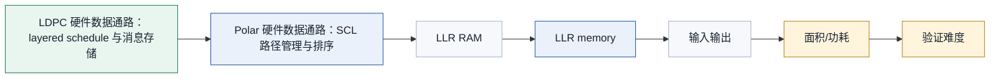
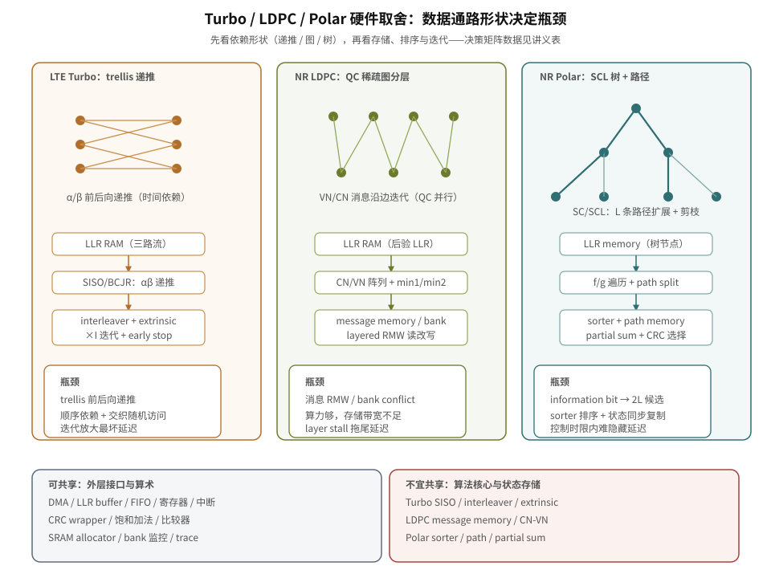

# T11.4 Turbo、LDPC、Polar 硬件架构取舍对比
## 本节学习目标

本节从接收端硬件架构角度对比 Turbo（Turbo 码，Turbo Code）、低密度奇偶校验码和 Polar（极化码，Polar Code）。这里先统一单篇缩写：对数似然比是三类译码器输入和中间状态的软信息；循环冗余校验是候选比特交付前的错误检测边界；传输块和码块决定译码任务的分块和调度粒度；混合自动重传请求影响 soft buffer、重传合并和复位/flush；上行共享信道和下行共享信道是数据业务主线；上行控制信息和下行控制信息是控制信息主线；块错误率用于性能验收；调制与编码方案和传输块大小影响码率、块长和硬件负载；媒体接入控制层是译码结果上交和 HARQ（混合自动重传请求，Hybrid Automatic Repeat Request）控制边界；静态随机存取存储器是 LLR（对数似然比，Log-Likelihood Ratio）、消息、路径和外信息的主要存储形态；寄存器传输级/专用集成电路用于描述硬件实现边界。

学完本节后，应能做到：

- 解释 Turbo 硬件为什么受软输入软输出（Soft-Input Soft-Output, SISO）递推、alpha/beta memory、交织器和迭代次数限制。
- 解释 LDPC（低密度奇偶校验码，Low-Density Parity-Check Code）硬件为什么高吞吐友好，以及为什么 message memory、layered schedule 和 bank conflict 仍然是主风险。
- 解释 Polar SCL（连续消除列表译码，Successive Cancellation List）为什么适合短控制块，以及为什么 sorter、path memory、partial sum memory 和 CRC（循环冗余校验，Cyclic Redundancy Check）selector 会让低延迟实现敏感。
- 从并行度、存储访问、排序、迭代/列表深度、延迟、吞吐、面积、功耗、控制复杂度和验证难度比较三类译码器。
- 判断统一译码子系统中哪些模块可以共享，哪些不宜共享。
- 做一个教学级周期估算，并说明估算边界。

如果只记一件事：**LDPC 高吞吐友好不是因为“公式更少”，而是因为稀疏图和 QC 结构能映射成宽并行；Polar SCL 延迟敏感不是因为块长大，而是因为路径分裂后的排序和状态复制很难在短控制时限内隐藏。**

## 前置知识检查

| 前置项 | 本节需要达到的程度 |
|:---|:---|
| T5.2/T5.3 | 知道 memory bank、吞吐、延迟、并行度和反压的基本含义。 |
| T6.7 | 知道 Turbo 两个 SISO 之间交换外信息，最大迭代次数影响最坏延迟。 |
| T8.7 | 知道 LDPC layered schedule、message memory、read-modify-write 和 bank conflict。 |
| T10.5/T10.6 | 知道 Polar SCL path split、path metric 排序、path memory、partial sum 和 CRC-aided final selector。 |
| T11.1 | 知道三类码的协议主场：LTE 数据主线是 Turbo，NR 数据主线是 LDPC，NR 控制主线是 Polar。 |

本节是工程对比课，不把某个 RTL（寄存器传输级，Register Transfer Level）微架构写成 3GPP 强制要求。协议证据只用于说明“为什么硬件要面对这些对象”：LTE Turbo 来自 TS 36.212 的 Turbo 编码结构，NR LDPC/Polar 来自 TS 38.212 的编码方案和编码结构。具体 pipeline 级数、bank 数、排序器拓扑、lazy-copy 策略和时钟频率属于实现选择。

## 任务边界与 Prompt 覆盖

| Prompt/台账要求 | 正文覆盖位置 | 扩展方式 |
|:---|:---|:---|
| 对比 Turbo、LDPC、Polar 硬件架构取舍 | 全文 | 按数据通路、瓶颈、决策矩阵和验证风险对比。 |
| 并行度、存储访问、排序、迭代/列表深度 | “三类硬件数据通路”到“工程决策矩阵” | 把算法结构映射到计算单元、存储和控制状态。 |
| 延迟、吞吐、功耗 | “吞吐和周期估算示例”与“工程决策矩阵” | 给教学估算式和定性功耗来源。 |
| 工程决策矩阵 | “工程决策矩阵” | 覆盖吞吐、时延、面积、功耗、存储、控制复杂度、验证难度。 |
| Turbo 瓶颈 | “Turbo 硬件通路” | 包含 SISO/BCJR（BCJR 算法，Bahl-Cocke-Jelinek-Raviv Algorithm）、alpha/beta memory、interleaver、extrinsic RAM、iteration controller。 |
| LDPC 瓶颈 | “LDPC 硬件通路” | 包含 layered controller、CN/VN、message memory、LLR RAM、bank conflict。 |
| Polar 瓶颈 | “Polar SCL 硬件通路” | 包含 tree controller、LLR memory、partial sum memory、path memory、sorter、CRC checker。 |
| 共享和不宜共享 | “统一译码子系统” | 明确 DMA（直接存储器访问，Direct Memory Access）、输入 LLR buffer、CRC checker、寄存器文件可共享，核心算法存储不宜共享。 |
| 验证影响对比 | “验证方法与最小 dump 包” | 对比外信息、bank conflict、PM 排序和复位/flush。 |
| 常见错误 | “常见错误” | 覆盖只看计算单元不看存储带宽、忽略 sorter、忽略 bank conflict、忽略复位/flush。 |

这张表是最低覆盖线。正文额外补协议前因后果、硬件动机、教学估算、定点化策略和自测题答案。

## 资料与协议边界

| 协议位置 | 本地证据路径 |
| :--- | :--- |
| TS 36.212 §5.1.3 | `3GPP_Rel19/processed/TS_36.212_36212-j30/content.md:693-705` |
| TS 36.212 §5.1.3.2 | `content.md:719-745` |
| TS 38.212 §5.3 | `3GPP_Rel19/processed/TS_38.212_38212-j30/content.md:807-813` |
| TS 38.212 §5.3.1 | `content.md:815-943` |
| TS 38.212 §5.3.2 | `content.md:947-989` |
| TS 38.212 §5.4.1/§5.4.2 | `content.md:1019-1323` |
| TS 38.212 §6.3/§7.3 | `content.md:2325-2399`; `content.md:2863-2889`; `content.md:7197-7241` |

边界说明：

- 3GPP 规定编码方案、编码结构、码块输入输出和速率匹配；不规定接收机必须用哪种 SISO 归一化、LDPC Min-Sum 变体、Polar sorter 拓扑或 SRAM（静态随机存取存储器，Static Random-Access Memory）bank 数。
- 本节使用 [[T11.1_Turbo_LDPC_Polar_algorithm_comparison|T11.1]] 已复现的 TS 36.212 Table 5.1.3-1/2 和 TS 38.212 Table 5.3-1/2 结论，不重复复现协议表。
- 本节的周期估算是教学估算，只用于理解趋势，不作为芯片性能承诺。

## 协议前因后果

硬件架构不是凭空选择的。协议先规定某类信息用哪类编码，编码结构再决定接收端必须保存哪些状态、怎样访问存储、能并行到什么程度。

LTE 数据主线使用 Turbo。Turbo 编码器由两个 8-state constituent encoders 和内部 interleaver 构成，接收端自然出现两个 SISO 译码视角、alpha/beta 前后向度量、外信息 RAM 和交织/解交织地址。它的强项是 LTE 时代成熟、性能稳定；硬件代价是半迭代顺序依赖和交织访问让最坏延迟受迭代次数放大。

NR 数据主线使用 LDPC。TS 38.212 的 LDPC 是基图加 lifting 的 QC-LDPC（准循环 LDPC，Quasi-Cyclic LDPC）结构。QC 结构把大矩阵分解成 row group、column group 和循环移位，天然适合并行处理多个局部索引；这就是 LDPC 高吞吐友好的协议和结构根源。但并行并不免费：check-node/variable-node 消息要反复读写，message memory 和 bank conflict 往往比计算单元更难。

NR 控制主线使用 Polar。Polar 的编码结构和可靠性序列适合短块控制信息；接收端 SC（逐次消除，Successive Cancellation）/SCL 不需要像 LDPC 那样跑大规模图消息，但 SCL 在 information bit 上会产生候选路径，必须快速排序并复制路径状态。控制信道对低延迟和误检敏感，所以 sorter、path memory、partial sum memory 和 CRC selector 是关键。

从硬件角度看，三类译码器的差异可以先归结为三种“依赖形状”。

| 依赖形状 | 对应码类 | 对硬件的后果 |
|:---|:---|:---|
| 沿时间 trellis 递推 | Turbo | 当前状态度量依赖前一时刻或后一时刻，不能任意打散成完全无关的小块。 |
| 沿稀疏图边更新 | LDPC | 许多边和局部索引可以并行，但必须保证同一变量节点或同一消息地址不被并发写坏。 |
| 沿二叉译码树和候选路径扩展 | Polar SCL | 树遍历本身有阶段依赖，候选路径扩展后还要排序、剪枝和同步复制状态。 |

这张表比“谁的公式复杂”更重要。硬件并行度首先由数据依赖决定，其次才由乘加、比较器、查表或 SRAM 端口数量决定。Turbo 的 trellis 递推让 SISO 核心内部存在前后向时间依赖；LDPC 的稀疏图把大问题拆成许多局部消息更新；Polar SCL 则把短块可靠性问题变成路径搜索和状态管理问题。

## 三类硬件数据通路

| 内容 | 说明 |
|:---|:---|
| Turbo 硬件数据通路：顺序 SISO 与交织外信息 | 瓶颈：trellis 前后向递推有顺序依赖；interleaver/deinterleaver 造成外信息 RAM 随机访问；迭代次数直接放大最坏延迟。 |
| LDPC 硬件数据通路：layered schedule 与消息存储 | 优势：QC-LDPC 的 row/column group 适合并行；瓶颈：message memory、read-modify-write、bank conflict 和 pipeline stall。 |
| Polar 硬件数据通路：SCL 路径管理与排序 | 瓶颈：information bit 分裂产生 2L 候选；sorter、path copy、partial sum 和 CRC state 必须同步重映射，控制延迟敏感。 |
| LLR RAM | SISO / BCJR；alpha/beta memory；interleaver；extrinsic RAM；iteration controller |
| LLR RAM | layered controller；check-node unit；variable-node update；message memory；bank conflict guard |
| LLR memory | SC/SCL tree controller；partial sum memory；path memory；sorter；CRC selector |
| 输入输出 | DMA、输入 LLR buffer、输出 hard bits FIFO、状态/中断寄存器；codec-specific decoder input layout |
| 并行度 | 受 trellis 顺序依赖限制；layer/edge/local index 并行友好；路径并行受 sorter 限制 |
| 面积/功耗 | SISO 和外信息 RAM 主导；CN/VN 阵列和 message RAM 主导；path memory、sorter、copy network 主导 |
| 验证难度 | 外信息/交织/迭代早停；bank conflict、message RMW、syndrome/CRC；PM 排序、路径复制、CRC selector |
上方三条硬件数据通路分别展示 Turbo、LDPC、Polar SCL 的主计算和存储对象；中部表格比较统一译码子系统中可共享和不宜共享的模块；下方工程决策矩阵覆盖并行度、延迟、吞吐、面积/功耗和验证难度。

统一译码子系统：可共享与不宜共享的边界必须提前写清。可共享的通常是外层 DMA、LLR buffer、hard bits FIFO、descriptor FIFO、配置寄存器、CRC checker wrapper、饱和加法、比较器、CRC 多项式单元的封装、顶层 SRAM allocator、bank 监控和 trace buffer；不宜共享的是 codec-specific decoder input layout、Turbo iteration、LDPC layer、Polar path schedule、Turbo SISO、LDPC CN/VN、Polar sorter/path memory、interleaver RAM、message memory 和 path copy memory。

### Turbo 硬件通路

Turbo 接收端的核心不是一个单次组合逻辑，而是两个 SISO decoder 的迭代系统。一个典型数据通路包括：

| 模块 | 作用 | 瓶颈 |
|:---|:---|:---|
| LLR RAM | 保存系统位、第一校验、第二校验 LLR。 | 三路访问和解速率匹配写入顺序。 |
| SISO/BCJR core | 执行 Log-MAP 或 Max-Log-MAP 前后向递推。 | trellis 状态递推顺序依赖。 |
| alpha/beta memory | 保存前向/后向状态度量。 | 窗口化、归一化和位宽。 |
| interleaver/deinterleaver | 在两个 SISO 之间重排外信息。 | 随机访问、bank conflict、地址表。 |
| extrinsic RAM | 保存半迭代外信息。 | read/write hazard、清零、双缓冲。 |
| iteration controller | 控制 SISO-1、SISO-2、CRC early stop 和最大迭代。 | 最坏延迟和资源占用。 |

Turbo 硬件最容易被低估的是 interleaver。计算核心可以复用一个 SISO 做两次半迭代，也可以放两个 SISO 提升吞吐；但外信息必须按内部交织器地址来回搬运。若 bank mapping 不好，交织访问会把计算单元饿住。

更具体地说，BCJR/Log-MAP 类 SISO 需要在 trellis 上计算前向度量 $\alpha$、后向度量 $\beta$ 和分支度量 $\gamma$。$\alpha_k$ 依赖 $\alpha_{k-1}$，$\beta_k$ 依赖 $\beta_{k+1}$，所以单条 trellis 不能像一组互不相关的加法那样随意并行。工程上可以用 sliding window、多个 CB（码块，Code Block）并行、多个 SISO core 或 window-level 并行来提高吞吐，但这些方法都会带来额外边界状态、RAM 端口、控制器和验证负担。

外信息 RAM 的角色也要讲清楚。第一个 SISO 给出的外信息不是最终硬判决，而是“除去本 SISO 已使用信息后，对另一个 SISO 有用的新证据”。这些外信息经过 interleaver 后送给第二个 SISO；第二个 SISO 的外信息再经过 deinterleaver 回到第一个 SISO 的顺序。只要地址错一拍、交织和解交织不互逆、或者同一份外信息被重复计入，迭代看起来仍然在运行，但 BLER（块错误率，Block Error Rate）会异常。

### LDPC 硬件通路

LDPC 接收端的优势来自稀疏图和 QC 规律。一个 layered LDPC decoder 通常包括：

| 模块 | 作用 | 瓶颈 |
|:---|:---|:---|
| LLR RAM | 保存变量节点 posterior LLR。 | 多 edge 并发读写。 |
| layered controller | 按 row group/layer 调度更新。 | layer 间依赖、pipeline stall。 |
| check-node unit | 计算符号、min1/min2 或 Min-Sum 变体。 | 比较树、符号异或、归一化/偏移。 |
| variable-node update | 从 LLR 中减旧消息、加新消息。 | read-modify-write 和 bypass。 |
| message memory | 保存旧 check-to-variable 消息。 | 容量、位宽、bank conflict。 |
| bank conflict guard | 仲裁同周期多个访问。 | stall、crossbar、bank mapping 复杂度。 |

LDPC 高吞吐友好的原因可以具体说成：许多 check-node 和 variable-node 更新可以在不同边或不同 local index 上并行；QC-LDPC 的循环移位让地址生成规律化。但如果 message memory 一次只能服务少数 bank，计算阵列再宽也会停等。工程上常见瓶颈是“算力足够，存储带宽不足”。

LDPC 的“高吞吐友好”不是说每一步都没有依赖。Layered schedule 中，当前 layer 更新后的 posterior LLR 会立即影响后续 layer，这就是 layered 比 flooding 往往收敛更快的原因；但同一个 layer 内，许多 check-node 对不同 local index 的处理具有规则地址关系，适合做成并行阵列。NR QC-LDPC 的 lifting size 让一个基图元素扩展成循环移位单位矩阵或全零块，硬件可以把“循环移位”实现为地址旋转或 barrel shifter，而不是存一个巨大随机矩阵。

真正麻烦的是消息读写一致性。一个典型 layered 更新会读取变量节点 posterior、读取旧的 check-to-variable message，先减旧消息，再用 check-node 算出新消息，最后把新消息加回 posterior 并写回 message memory。这个 read-modify-write 链条如果被 bank conflict 或 pipeline bypass 处理错，会造成数值不一致。由于 LDPC 通常追求高吞吐，很多错误只在特定 BG（基图，Base Graph）、`Zc`、layer、并行度组合下出现。

### Polar SCL 硬件通路

Polar SC/SCL 接收端围绕 tree traversal 和路径管理。SCL 的典型数据通路包括：

| 模块 | 作用 | 瓶颈 |
|:---|:---|:---|
| LLR memory | 保存树节点 LLR 或中间 LLR。 | 路径维度复制或 lazy-copy 引用。 |
| SC/SCL tree controller | 控制 $f/g$ 函数遍历、frozen/information bit 分支。 | 控制状态复杂，短延迟下难隐藏。 |
| partial sum memory | 保存每条路径的 partial sum。 | 右子树 $g$ 函数依赖路径历史。 |
| path memory | 保存候选路径 bit、PM、CRC state。 | 剪枝后重映射一致性。 |
| sorter | 从 $2L$ 候选中保留前 $L$。 | comparator 方向、tie-break、关键路径。 |
| CRC selector | 在 CRC/RNTI（无线网络临时标识，Radio Network Temporary Identifier）约束下选最终路径。 | PM 最优但 CRC fail 的选择边界。 |

Polar SCL 的硬件难点不是所有节点都大规模并行，而是路径状态必须“同生同灭”。当某个 information bit 让 $L$ 条路径分裂成最多 $2L$ 条候选时，sorter 输出的不只是候选编号；path bits、PM、LLR memory 指针、partial sum memory、CRC state 都要同步跟随保留路径。

SC 译码每次沿树使用 $f$ 和 $g$ 函数传播 LLR，再根据 frozen mask 或信息位判决当前 bit。SCL 在信息位处保留多条候选路径，相当于把“当前最可能的一个前缀”扩展成“当前最可能的一组前缀”。这能提升短块可靠性，但把硬件问题从单路径递推变成多路径管理：每条路径都有自己的 PM、partial sum、CRC state 和可能的 LLR/bit 状态。

Sorter 的风险来自两个层面。第一，$2L$ 选 $L$ 的比较网络会随 list size 增大而增加比较器数量或比较阶段；第二，排序结果必须驱动 path memory copy 或 lazy-copy pointer remap。若只排序 PM 数组，却没有同步复制 partial sum 或 CRC state，短例子可能通过，复杂控制块会在后续 $g$ 函数或 final selector 上失败。

## 工程决策矩阵

| 维度 | Turbo | LDPC | Polar SCL |
|:---|:---|:---|:---|
| 并行度 | trellis 前后向递推顺序依赖强；可通过多 SISO、多窗口、多 CB 并行提高。 | row group、column group、edge、local index 并行友好；受 layer 依赖和 bank 限制。 | 路径可并行，但每个 information bit 的 $2L$ 候选排序限制低延迟。 |
| 存储访问 | 外信息 RAM 和 interleaver/deinterleaver 地址重排突出。 | LLR RAM、message memory、read-modify-write、bank conflict 主导。 | LLR memory、partial sum memory、path memory、copy network 主导。 |
| 排序 | 通常不是主瓶颈。 | CN min1/min2 有局部比较树，但不是全局路径排序。 | sorter 是核心瓶颈之一，尤其 list size 较大时。 |
| 迭代/列表深度 | 迭代次数直接放大最坏延迟，early stop 降平均延迟。 | 迭代轮数和 layer stall 决定尾延迟。 | list size $L$ 增加路径数、排序和存储复制负担。 |
| 吞吐 | LTE 时代足够，宽带高吞吐需多核并行。 | 最适合 NR 数据业务宽并行高吞吐。 | 适合短控制块，通常不是长数据块吞吐主力。 |
| 面积 | SISO core、alpha/beta、extrinsic RAM 和 interleaver RAM。 | CN/VN 阵列、message memory、crossbar/bank。 | path memory、sorter、copy network、partial sum memory。 |
| 功耗 | 多轮迭代和随机 RAM 访问明显。 | 大规模并行和消息存储读写明显。 | sorter、路径复制和多路径 memory 访问明显。 |
| 控制复杂度 | 半迭代、交织、CRC early stop 和最大迭代。 | layer schedule、stall、RMW、syndrome early stop。 | tree traversal、path split/prune、CRC selector、tie-break。 |
| 验证难度 | 外信息定义、地址重排、早停和 TB（传输块，Transport Block）/CB 汇总。 | bank conflict、message 同步、syndrome/CRC、filler/shortening。 | PM 方向、排序稳定性、路径状态复制、CRC/RNTI 选择。 |

这张矩阵回答的是架构取舍，不是性能排名。对长数据业务，LDPC 的并行结构更容易堆吞吐；对短控制信息，Polar SCL 的列表搜索和 CRC 辅助选择更适合可靠控制块；对 LTE 数据链路，Turbo 是协议事实和系统代际选择。

若把图中的工程决策矩阵压缩成三行结论：延迟方面，Turbo 是“迭代次数放大最坏延迟”，LDPC 是“高吞吐但轮数和 stall 影响尾延迟”，Polar SCL 是“短块低延迟，排序关键路径敏感”；吞吐方面，Turbo 需要“多 SISO 或多 CB 并行提升”，LDPC “最适合宽并行数据业务”，Polar SCL “控制块吞吐够用，非长块主力”。这几句应进入评审 checklist，而不是只停留在图里。

## 统一译码子系统

一个芯片可以把 Turbo、LDPC、Polar 放在同一个译码子系统里，但“放在同一个子系统”不等于“共享同一个核心”。合理共享通常发生在外层接口、配置和监控；不宜共享的部分通常是算法核心和局部状态存储。

| 类别 | 可以共享 | 不宜共享 |
|:---|:---|:---|
| 输入输出 | DMA、输入 LLR buffer、输出 hard bits FIFO、backpressure 处理。 | codec-specific decoder input layout。 |
| 控制 | descriptor FIFO、寄存器文件、中断/status、trace trigger。 | Turbo iteration、LDPC layer schedule、Polar path schedule。 |
| 计算 | 饱和加法、比较器、CRC 多项式单元的封装。 | Turbo SISO、LDPC CN/VN、Polar sorter/path memory。 |
| 校验 | CRC wrapper、CRC 多项式单元的部分封装、结果上报接口。 | CRC 调用时机和候选选择策略完全共享。 |
| 存储管理 | 顶层 SRAM allocator、bank 监控、错误注入和 dump。 | Turbo extrinsic RAM、LDPC message memory、Polar path copy memory。 |
| 算术原语 | 饱和加法、比较器、min/max 单元、计数器。 | Turbo SISO、LDPC CN/VN update、Polar sorter/path memory。 |

共享策略要服务验证。一个统一 descriptor 可以包含 `rat`、`codec`、`channel_type`、`harq_id`、`tb_id`、`cb_id`、`llr_width`、`max_iter`、`list_size` 等字段，但每个 core 应只消费自己合法字段。把所有字段散落在 RTL 状态机里，会让跨 codec 复位、flush、错误注入和回归难以定位。

## 吞吐和周期估算示例

下面给教学估算。设一个 CB 或 Polar block 有 $B$ 个信息相关 bit，时钟频率相同，忽略输入输出 DMA 和 CRC 小开销。有效吞吐可粗略写成：

$$
\mathrm{Throughput}
\approx
\frac{B}{C_{\mathrm{decode}}/f_{\mathrm{clk}}}.
\tag{1}
$$

Turbo 的周期可估成：

$$
C_{\mathrm{Turbo}}
\approx
I_{\mathrm{used}}
\left(C_{\mathrm{SISO1}}+C_{\mathrm{perm}}+C_{\mathrm{SISO2}}+C_{\mathrm{deperm}}\right).
\tag{2}
$$

如果两个 SISO 复用同一个 core，$C_{\mathrm{SISO1}}$ 和 $C_{\mathrm{SISO2}}$ 串行出现；如果双 core 并行，还要看外信息 RAM 是否能提供足够带宽。$I_{\mathrm{used}}$ 是实际迭代次数，early stop 降低平均值，但最坏值仍接近 $I_{\max}$。

LDPC layered decoder 可粗略估成：

$$
C_{\mathrm{LDPC}}
\approx
I_{\mathrm{used}}
\sum_{\ell=0}^{L_{\mathrm{layer}}-1}
\left(C_{\mathrm{CN/VN}}(\ell)+C_{\mathrm{mem}}(\ell)+C_{\mathrm{stall}}(\ell)\right).
\tag{3}
$$

式 (3) 体现 LDPC 的真实工程点：计算阵列宽并不自动等于吞吐高，$C_{\mathrm{stall}}$ 可能由 bank conflict、RMW hazard 或 pipeline bubble 决定。

Polar SCL 可粗略估成：

$$
C_{\mathrm{Polar}}
\approx
C_{\mathrm{tree}}
+
\sum_{i\in\mathcal{A}}
\left(C_{\mathrm{split}}(i)+C_{\mathrm{sort}}(i)+C_{\mathrm{copy}}(i)\right)
+
C_{\mathrm{CRC\_sel}}.
\tag{4}
$$

其中 $\mathcal{A}$ 是 information bit 集合。list size 越大，$C_{\mathrm{sort}}$ 和 $C_{\mathrm{copy}}$ 越可能成为关键路径或多周期阶段。Polar 控制块短，所以总 bit 数不大；但控制信道的时限严，排序延迟很难被长块流水隐藏。工程估算必须先判断各阶段是串行相加、并行取最大，还是流水后按 initiation interval 计，不能把不同阶段的周期误乘在一起。

## 数值例子：教学级周期估算

下面用一组简化数值做手算。它不代表真实芯片，只用于训练“先看依赖和存储，再看计算阵列”的判断方式。

| 参数 | Turbo 教学值 | LDPC 教学值 | Polar SCL 教学值 |
|:---|:---|:---|:---|
| 任务规模 | $B=6144$ bit | $B=8448$ bit | $N=128,\ |\mathcal{A}|=64,\ L=8$ |
| 主要循环 | $I_{\mathrm{used}}=6$ 次迭代 | $I_{\mathrm{used}}=8$ 次迭代，$L_{\mathrm{layer}}=46$ | 树遍历一次，64 个信息位可能分裂 |
| 单阶段假设 | 每个 SISO 约 $K=6144$ cycle；交织/解交织各 $0.1K$ cycle | 每层 CN/VN 计算 80 cycle，memory stall 10 cycle | $C_{\mathrm{tree}}=254$ cycle；每个信息位 split/sort/copy 合计 5 cycle；final selector 16 cycle |

Turbo 估算：

$$
\begin{aligned}
C_{\mathrm{Turbo}}
&\approx 6\left(6144+0.1\cdot6144+6144+0.1\cdot6144\right)\\
&=6(13516.8)\\
&\approx 81101\ \mathrm{cycles}.
\end{aligned}
\tag{5}
$$

吞吐代理值为：

$$
\eta_{\mathrm{Turbo}}
\approx
\frac{6144}{81101}
\approx 0.076\ \mathrm{bit/cycle}.
\tag{6}
$$

这个数低不是因为 Turbo “不能做硬件”，而是因为教学假设采用了串行 SISO、显式交织搬运和 6 次迭代。若放两个 SISO core、窗口并行或多 CB 并行，吞吐会上升；但 interleaver RAM、extrinsic RAM 和调度验证也会变复杂。

LDPC 估算：

$$
\begin{aligned}
C_{\mathrm{LDPC}}
&\approx 8\cdot 46\cdot(80+10)\\
&=33120\ \mathrm{cycles},\\
\eta_{\mathrm{LDPC}}
&\approx \frac{8448}{33120}
\approx 0.255\ \mathrm{bit/cycle}.
\end{aligned}
\tag{7}
$$

若把每层 memory stall 从 10 cycle 增加到 30 cycle，则：

$$
C_{\mathrm{LDPC,stall}}
\approx 8\cdot46\cdot(80+30)
=40480\ \mathrm{cycles},
\quad
\eta\approx0.209\ \mathrm{bit/cycle}.
\tag{8}
$$

这说明 LDPC 的吞吐优势依赖存储系统能跟上并行阵列。只扩 CN/VN 计算单元而不扩 bank、crossbar、RMW bypass 和 conflict guard，RTL 实测会明显低于纸面估算。

Polar SCL 估算：

$$
\begin{aligned}
C_{\mathrm{Polar}}
&\approx 254+64\cdot5+16\\
&=590\ \mathrm{cycles}.
\end{aligned}
\tag{9}
$$

若只看 cycle 数，Polar SCL 很短；但它处理的是短控制块，不是长数据吞吐主力。更关键的是 list size 的影响。若 $L$ 从 8 增到 16，sort/copy 每信息位从 5 cycle 增到 9 cycle，则：

$$
C_{\mathrm{Polar},L=16}
\approx 254+64\cdot9+16
=846\ \mathrm{cycles}.
\tag{10}
$$

这 256 cycle 的增长发生在短控制任务内，不能像长 LDPC 数据块那样通过大吞吐流水轻易摊薄。因此 Polar SCL 的工程重点是 sorter 级数、copy map 延迟、path memory 端口和 final selector 时限。

把三个估算放在一起，结论不是“LDPC 永远最快、Polar 永远最短、Turbo 永远最慢”。正确结论是：Turbo 的延迟主要被迭代和交织外信息搬运放大；LDPC 的吞吐潜力来自稀疏 QC 并行，但受 memory stall 约束；Polar SCL 的总块长短，却对 sorter 和状态复制的局部延迟非常敏感。

## 定点化策略

三类译码器都使用定点 LLR，但定点风险不同。

| 对象 | Turbo | LDPC | Polar SCL |
|:---|:---|:---|:---|
| LLR 位宽 | channel/extrinsic/posterior 需要一致缩放。 | channel/posterior/message 可能不同位宽。 | LLR、PM、partial sum 分属不同格式。 |
| 饱和 | 外信息过强会导致迭代过度自信。 | CN/VN message 饱和会影响 syndrome 收敛。 | PM 饱和会影响排序，LLR 饱和影响路径分裂。 |
| 归一化/缩放 | Max-Log-MAP 可能需要修正或缩放。 | NMS（归一化最小和，Normalized Min-Sum）/OMS（偏移最小和，Offset Min-Sum）需要系数或 offset。 | PM 更新近似需要稳定 tie-break。 |
| 计数器 | `extrinsic_sat_count`、`posterior_sat_count` | `msg_sat_count`、`llr_sat_count`、`bank_stall_count` | `pm_sat_count`、`sort_tie_count`、`path_copy_count` |

定点验证不能只看最终 CRC pass。尤其是 Polar SCL，PM 饱和或 tie-break 不稳定可能让同一个随机种子在不同综合或仿真环境下选择不同路径；LDPC 的 message 饱和可能造成 early stop 轮数变化；Turbo 的外信息缩放可能改变平均迭代次数。

## RTL/ASIC 映射

| 子系统 | Turbo 映射 | LDPC 映射 | Polar SCL 映射 |
|:---|:---|:---|:---|
| 前端 LLR | 解速率匹配后三路 LLR buffer。 | rate recovery 后 CB LLR RAM。 | rate recovery 后 codeword LLR memory。 |
| 核心计算 | SISO/BCJR 或 Max-Log-MAP。 | CN/VN update、Min-Sum/NMS/OMS。 | $f/g$ tree、PM update、path split。 |
| 核心存储 | alpha/beta、extrinsic、interleaver RAM。 | message memory、LLR RAM、shift/address state。 | path memory、partial sum、LLR state、CRC state。 |
| 控制器 | half-iteration、early stop、max iteration。 | layer schedule、iteration、syndrome/CRC stop。 | tree traversal、sort/prune、final selector。 |
| 复位/flush | 新 CB/TB、HARQ flush、early stop release。 | new TB/CBG（码块组，Code Block Group）、HARQ soft buffer、layer pipeline flush。 | new block、path reset、CRC/RNTI selector reset。 |

ASIC（专用集成电路，Application-Specific Integrated Circuit）实现要把“平均吞吐”和“最坏延迟”分开看。Turbo early stop、LDPC syndrome early stop、Polar CRC-aided selector 都可能改善平均行为，但系统时限通常要按最坏或高分位延迟设计。功耗也不能只看乘加数量：SRAM 读写、crossbar、sorter 和 clock gating 往往决定最终能耗。

## 验证方法与最小 dump 包

| 验证对象 | Turbo dump | LDPC dump | Polar SCL dump |
|:---|:---|:---|:---|
| 输入 | 三路 LLR、interleaver index、CB length。 | LLR RAM、BG、`Zc`、layer、edge address。 | LLR memory、frozen mask、rate recovery mask。 |
| 中间状态 | alpha/beta、extrinsic、posterior、iteration id。 | old/new message、posterior LLR、syndrome、bank stall。 | path bits、PM、sort order、partial sum、CRC state。 |
| 控制 | SISO phase、early stop、max iteration、CRC input order。 | layer id、iteration id、RMW valid、pipeline stall。 | tree node、split/prune event、copy map、tie-break。 |
| 输出 | CB CRC、TB CRC、iteration used。 | CB CRC、TB CRC、syndrome pass、iteration used。 | CRC/RNTI pass、selected path id、PM。 |
| 负测试 | 交织地址反、外信息重复计数、早停错。 | bank conflict 注入、message RMW 错、layer 顺序错。 | sorter 方向反、path copy 漏状态、PM tie 不稳定。 |

验证影响对比：

- Turbo 要证明“外信息没有重复计数”和“交织地址正确”。
- LDPC 要证明“并行访问没有改变协议图连接”和“bank conflict 只带来 stall，不带来数据覆盖”。
- Polar 要证明“排序结果带着全套路径状态移动”，不能只证明 PM 数组排序正确。

## 常见错误

| 错误 | 典型后果 | 定位方式 |
|:---|:---|:---|
| 只看计算单元不看存储带宽 | 估算吞吐远高于 RTL 实测。 | dump bank conflict、stall、SRAM port utilization。 |
| 忽略 Turbo interleaver RAM | SISO core 空转或外信息错位。 | 检查 $\pi(k)$、反置换、extrinsic write/read address。 |
| 忽略 LDPC bank conflict | 宽并行阵列被 stall，或多写覆盖同一地址。 | directed bank conflict test、RMW hazard trace。 |
| 忽略 Polar sorter | list size 增大后控制时限不满足。 | sorter stage latency、sort order、tie-break trace。 |
| 只复制 Polar bits 不复制状态 | 路径前缀看似正确，后续 $g$ 函数和 CRC 错。 | dump copy map、partial sum、LLR pointer、CRC state。 |
| 把 early stop 当协议强制 | 不同实现行为被误判为协议错误。 | 在证据表中标注 early stop 是实现策略。 |
| 忽略复位/flush | HARQ 复用或异常中断后缓存污染。 | reset/flush directed test 和状态 RAM dump。 |
| 混用协议对象 | 用 LDPC `Ncb` 语义解释 Turbo 或 Polar 存储。 | descriptor 加 `rat/codec/channel_type` 并做合法性断言。 |

## 自测题

1. 为什么 LDPC 更容易做高吞吐并行实现？
2. 为什么 Polar SCL 的 sorter 会成为低延迟控制信道实现的风险？
3. Turbo 的 interleaver/deinterleaver 为什么是硬件瓶颈，而不是简单地址小模块？
4. 统一译码子系统中哪些模块可以共享？哪些不宜共享？
5. 如果 RTL 实测吞吐低于算法估算，最先应检查哪些日志？

## 自测题参考答案

1. LDPC 的 Tanner graph（Tanner 图，Tanner Graph）稀疏，NR QC-LDPC 还有 row group、column group 和循环移位规律，许多 CN/VN 更新可以并行映射到阵列。真正限制通常来自 message memory、LLR RAM 和 bank conflict。
2. SCL 在 information bit 上可能从 $L$ 条路径分裂成 $2L$ 条候选，sorter 要在短时间内选前 $L$ 条，并让 path bits、PM、LLR pointer、partial sum 和 CRC state 同步重映射。排序延迟和状态复制都可能成为关键路径。
3. Turbo interleaver/deinterleaver 要在两个 SISO 之间搬运外信息，访问模式由协议交织参数决定，常表现为随机 RAM 访问。若 bank mapping 或双缓冲设计不好，SISO core 会等待，或者外信息被错位读取。
4. 可共享 DMA、输入 LLR buffer、输出 FIFO、descriptor FIFO、寄存器文件、中断/status、CRC wrapper 和 trace buffer。不宜共享 Turbo SISO/interleaver、LDPC CN/VN/message memory、Polar sorter/path memory/partial sum memory 等核心状态。
5. 先检查 memory port utilization、bank conflict count、pipeline stall、backpressure、RMW hazard、sorter latency、path copy count 和 early stop/iteration used。不要只检查计算单元利用率。

## 协议证据表

| 结论 | 协议证据 | 本地路径 | 证据状态 |
|:---|:---|:---|:---|
| LTE 数据传输主线使用 Turbo，Turbo 编码器含两个 8-state constituent encoders 和 internal interleaver | TS 36.212 §5.1.3/§5.1.3.2 | `3GPP_Rel19/processed/TS_36.212_36212-j30/content.md:693-745` | 已核验文本；[[T11.1_Turbo_LDPC_Polar_algorithm_comparison|T11.1]] 已复现相关使用表。 |
| NR TrCH 和控制信息编码方案由 Table 5.3-1/5.3-2 给出 | TS 38.212 §5.3 | `3GPP_Rel19/processed/TS_38.212_38212-j30/content.md:807-813` | 已核验文本；[[T11.1_Turbo_LDPC_Polar_algorithm_comparison|T11.1]] 已复现相关使用表。 |
| NR Polar coding 和可靠性序列是控制信息硬件对象来源 | TS 38.212 §5.3.1/§5.3.1.2 | `content.md:815-943` | 已核验文本；[[T10.3_NR_Polar_reliability_sequence|T10.3]] 已完整表格化复现可靠性序列。 |
| NR LDPC 使用 BG1/BG2、lifting 和 QC parity-check matrix | TS 38.212 §5.3.2 | `content.md:947-989` | 已核验文本；[[T8.3_NR_LDPC_lifting_QC_matrix|T8.3]] 已表格化复现 BG1/BG2 shift table。 |
| LDPC/Polar rate matching 影响接收端 LLR memory 和地址恢复 | TS 38.212 §5.4.1/§5.4.2 | `content.md:1019-1323` | 已核验文本；[[T11.2_LTE_NR_rate_matching_comparison|T11.2]] 已对比 rate recovery。 |

## 图示

## 执行与证据记录

| 项目 | 记录 |
|:---|:---|
| 路线图卡片 | `2026-06-19-lte-nr-decoding-learning-roadmap.md` [[T11.4_decoder_hardware_tradeoff_comparison|T11.4]]。 |
| 本地协议 | TS 36.212 `36212-j30`；TS 38.212 `38212-j30`。 |
| 资产目检 | 已检查文本框和表格单元格文字水平/垂直居中、英文不硬拆、箭头端点贴合节点边界、表格字号可读、区块间距无接触。 |
| 协议表/图复现 | 本节复用 [[T11.1_Turbo_LDPC_Polar_algorithm_comparison|T11.1]]/[[T8.3_NR_LDPC_lifting_QC_matrix|T8.3]]/[[T10.3_NR_Polar_reliability_sequence|T10.3]] 已复现协议表图；本节自绘硬件数据通路和工程决策矩阵。 |
| 审计命令 | `python3 tools/audit_lesson_terms.py docs/L2_协议算法/T11.4_decoder_hardware_tradeoff_comparison.md`；`python3 tools/audit_markdown_headings.py docs/L2_协议算法/T11.4_decoder_hardware_tradeoff_comparison.md`；`python3 tools/audit_lesson_depth.py --strict docs/L2_协议算法/T11.4_decoder_hardware_tradeoff_comparison.md`；`python3 tools/audit_latex_render.py docs/L2_协议算法/T11.4_decoder_hardware_tradeoff_comparison.md`；`python3 tools/audit_reference_rebuilds.py docs/L2_协议算法/T11.4_decoder_hardware_tradeoff_comparison.md`。 |
| 审计结果 | `LESSON_TERM_AUDIT_OK`；`MARKDOWN_HEADING_AUDIT_OK`；`LESSON_DEPTH_AUDIT_OK`；`LATEX_RENDER_AUDIT_OK formulas=55`；引用重建审计输出 `REFERENCE_REBUILD_AUDIT_CANDIDATES`，候选项已由正文边界说明和协议证据表标注为复用 [[T11.1_Turbo_LDPC_Polar_algorithm_comparison|T11.1]]/[[T8.3_NR_LDPC_lifting_QC_matrix|T8.3]]/[[T10.3_NR_Polar_reliability_sequence|T10.3]] 已重建内容或本节自绘工程图。 |

## 参考文献

- 3GPP TS 36.212 V19.3.0, Multiplexing and channel coding, Rel-19，本地路径 `3GPP_Rel19/processed/TS_36.212_36212-j30`。
- 3GPP TS 38.212 V19.3.0, NR Multiplexing and channel coding, Rel-19，本地路径 `3GPP_Rel19/processed/TS_38.212_38212-j30`。
- `docs/L2_协议算法/T6.7_Turbo_iteration_extrinsic_stopping.md`。
- `docs/L2_协议算法/T8.7_layered_LDPC_decoding_schedule.md`。
- `docs/L2_协议算法/T10.5_Polar_SCL_decoding.md`。
