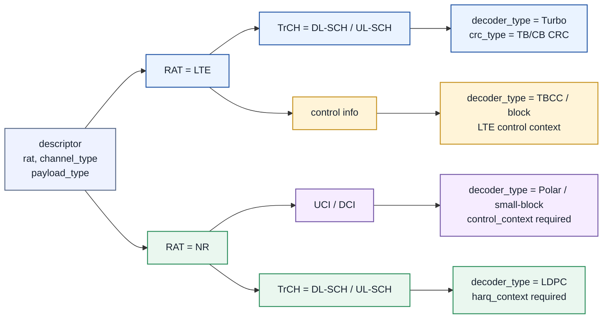
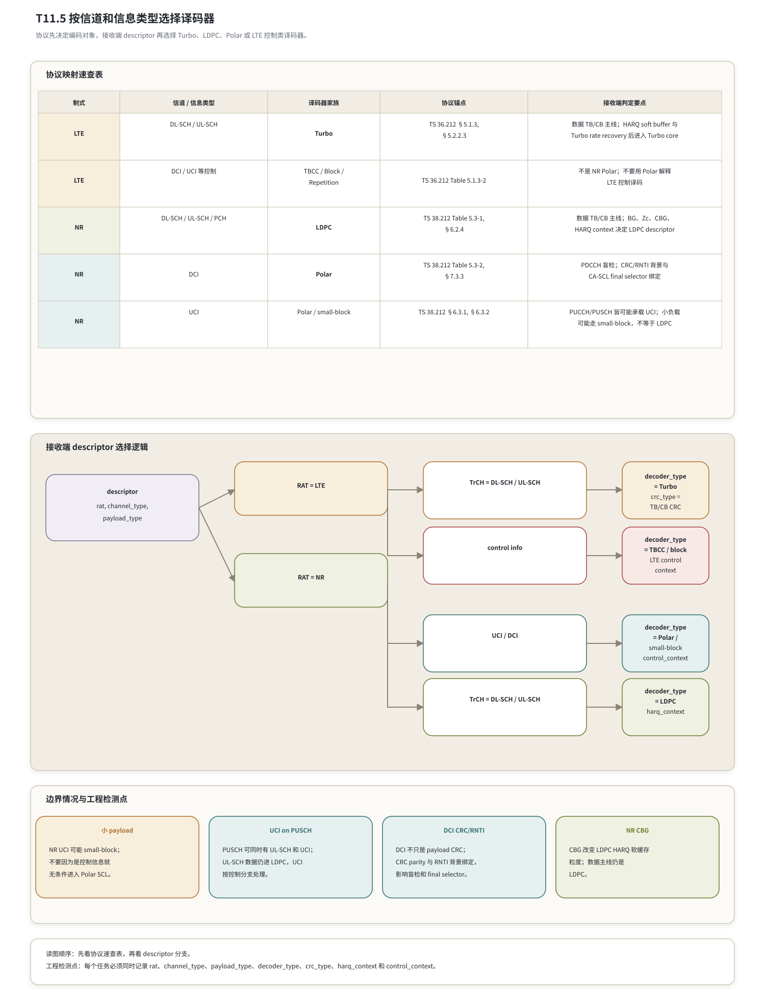

# T11.5 按信道和信息类型选择译码器
## 本节学习目标

本节把长期分散在 LTE、NR、数据链路、控制链路和硬件 descriptor 中的“译码器选择”统一起来。先统一本篇缩写和术语：Turbo是 LTE 数据传输主线使用的译码器家族；低密度奇偶校验码是 NR 数据传输主线使用的译码器家族；Polar是 NR 控制信息主线使用的译码器家族；混合自动重传请求决定数据软缓存和重传上下文；下行共享信道承载下行数据传输块；上行共享信道承载上行数据传输块；上行控制信息承载 HARQ 确认（HARQ Acknowledgement, HARQ-ACK）、信道状态信息（Channel State Information, CSI）、调度请求（Scheduling Request, SR）等上行控制比特；下行控制信息承载调度、功控、资源指示等下行控制比特；传输信道（Transport Channel, TrCH）是 TS 36.212/TS 38.212 中描述编码方案的协议对象；循环冗余校验是错误检测边界；无线网络临时标识（Radio Network Temporary Identifier, RNTI）会参与 DCI CRC 背景；传输块是媒体接入控制层与物理层之间的数据块；码块是译码器内部处理粒度；CBG是 NR 中可用于部分重传的 CB 分组；对数似然比是接收端软信息；调制与编码方案和传输块大小影响数据任务的码率、块长和译码负载；块错误率用于链路验收；寄存器传输级和专用集成电路用于描述硬件实现边界。

学完本节后，应能做到：

- 从 TS 36.212 和 TS 38.212 的协议表解释为什么“信道/信息类型”先于算法偏好决定译码器家族。
- 给 LTE DL-SCH/UL-SCH 选择 Turbo 译码器，并知道 LTE 控制信息不是 NR Polar 分支。
- 给 NR DL-SCH/UL-SCH/PCH 选择 LDPC 译码器，并知道 BG、Zc、HARQ、CBG 是 LDPC descriptor 的关键上下文。
- 给 NR DCI 选择 Polar 译码器，并说明 CRC/RNTI 背景对盲检和最终路径选择的影响。
- 给 NR UCI 选择 Polar 或 small-block 分支，并说明 UCI on PUSCH 时数据和控制不是同一个译码任务。
- 设计接收端 `decoder_type` 选择伪代码，避免跨制式、跨信息类型误分支。
- 为验证准备协议向量分类、descriptor 分支覆盖、错误注入和 status code。

本节的核心原则是：**接收端先根据协议对象识别任务，再选择译码器家族；不能因为输入都是 LLR，就把数据、控制、LTE、NR 的译码规则混在一起。**

## 前置知识检查

| 前置项 | 本节需要达到的程度 |
|:---|:---|
| T11.1 | 知道 LTE 数据主线是 Turbo，NR 数据主线是 LDPC，NR 控制主线是 Polar。 |
| T11.2 | 知道三类 rate recovery 的空洞语义不同，不能混用 circular buffer 规则。 |
| T11.3 | 知道 HARQ soft buffer 是数据译码状态，NR CBG 会改变重传粒度。 |
| T10.6 | 知道 DCI Polar 译码后的 CRC/RNTI final selector 边界。 |
| T10.8 | 知道 NR UCI/DCI descriptor 错配会导致 CRC、RNTI、mask 或 rate recovery 错误。 |

如果前置不熟，本节仍可以作为“分支总表”阅读，但不要把表格当成孤立索引。每个映射后面都有协议前因后果和接收端后果。

## 任务边界与 Prompt 覆盖

| Prompt/台账要求 | 正文覆盖位置 | 扩展方式 |
|:---|:---|:---|
| LTE/NR 信道和信息类型映射到译码器家族 | “协议映射速查表”和“协议证据表” | 覆盖 LTE TrCH、LTE 控制、NR TrCH、NR UCI、NR DCI。 |
| LTE DL-SCH/UL-SCH 到 Turbo | “LTE 数据传输的选择” | 解释 TB/CB/HARQ/Turbo core 的接收端后果。 |
| NR DL-SCH/UL-SCH 到 LDPC | “NR 数据传输的选择” | 解释 LDPC BG、Zc、CBG、rate recovery 和 soft buffer。 |
| NR UCI/DCI 到 Polar | “NR 控制信息的选择” | 区分 DCI Polar、UCI Polar 和 small-block 边界。 |
| 边界情况 | “边界情况” | 覆盖小 payload、UCI on PUSCH、DCI CRC/RNTI、NR CBG。 |
| 速查表 | “协议映射速查表”和图 T11.5-1 | 表格加图形化 descriptor 分支。 |
| 接收端选择逻辑 | “接收端选择伪代码” | 给可直接转 RTL/firmware 的判定结构。 |
| 工程接口字段 | “Descriptor 字段设计” | 包含 `rat`、`channel_type`、`payload_type`、`decoder_type`、`crc_type`、`harq_context`、`control_context`。 |
| 配置错误案例 | “配置错误案例” | 覆盖数据误送 Polar、控制误送 LDPC、CRC/RNTI 背景错、UCI on PUSCH 边界错。 |
| 验证方法 | “验证方法与最小 dump 包” | 覆盖协议向量分类、分支覆盖、错误注入和 status code。 |

本节是协议映射和接收端系统设计课。它复用 T11.1 已复现的 TS 36.212 Table 5.1.3-1/2 和 TS 38.212 Table 5.3-1/2，不重复完整重建大表；本节新增的是接收端选择逻辑、descriptor 字段、边界案例和验证方法。

## 资料与协议边界

| 协议位置 | 本地证据路径 |
| :--- | :--- |
| TS 36.212 §5.1.3 | `3GPP_Rel19/processed/TS_36.212_36212-j30/content.md:683-705` |
| TS 36.212 Table 5.1.3-1 | `3GPP_Rel19/processed/TS_36.212_36212-j30/tables/table_0007.csv/html` |
| TS 36.212 Table 5.1.3-2 | `tables/table_0008.csv/html` |
| TS 36.212 §5.2.2.3 | `content.md:1093-1101` |
| TS 36.212 §5.3.3.2-§5.3.3.4 | `content.md:5551-5581` |
| TS 38.212 §5.3 | `3GPP_Rel19/processed/TS_38.212_38212-j30/content.md:807-813` |
| TS 38.212 Table 5.3-1 | `3GPP_Rel19/processed/TS_38.212_38212-j30/tables/table_0009.csv/html` |
| TS 38.212 Table 5.3-2 | `tables/table_0010.csv/html` |
| TS 38.212 §6.2.4 | `content.md:1391-1401` |
| TS 38.212 §6.3.1/§6.3.2 | `content.md:2035-2105`; `content.md:2863-2889` |
| TS 38.212 §7.3.2-§7.3.4 | `content.md:7177-7203` |

边界说明：

- 本节讨论译码器家族选择，不展开调度器、搜索空间、PDCCH/PUCCH/PUSCH 资源映射或 TS 38.213/38.214 的完整控制信道流程。
- 本节使用“TBCC”表示尾咬卷积码（Tail Biting Convolutional Code）类 LTE 控制译码分支。它不是 Turbo，也不是 NR Polar。
- NR UCI 的 “Block code / Polar” 边界依赖 UCI 比特数和对应 §6.3 分支；本节给选择框架，具体小负载处理详见 T10.1/T10.8。
- NR BCH 在 TS 38.212 Table 5.3-1 中使用 Polar，但本路线图重点是 LTE/NR 数据和控制译码，因此仅在速查表中列边界，不展开 PBCH 课程。

## 协议前因后果

协议把“信息属于哪类对象”放在编码方案之前。接收端不能先想“我手里有一串 LLR，要不要用 LDPC 更快”，而要先回答三个问题：

1. 这是 LTE 还是 NR？
2. 这是传输信道上的数据 TB，还是控制信息 payload？
3. 若是控制信息，它是 LTE 控制、NR UCI，还是 NR DCI？

这三个问题决定接收端后续对象完全不同。数据 TB 需要 TB CRC、CB segmentation、HARQ soft buffer、rate recovery、CB CRC/TB CRC 汇总和 MAC 上交。控制信息更短，通常没有数据 TB 那样的 HARQ soft buffer 生命周期；DCI 还涉及盲检和 RNTI 背景，UCI 还涉及 PUCCH/PUSCH 背景和 HARQ-ACK/CSI/SR 等不同 payload 组合。

从系统代际看，LTE 数据主线使用 Turbo，是 LTE 协议设计事实；NR 数据主线转向 LDPC，是因为 NR 面向更高吞吐、更宽带宽和更强并行硬件目标。NR 控制信息使用 Polar，是因为控制信息通常短、低时延、高可靠且有 CRC/RNTI 或 UCI 语境辅助选择。这里的“选择”不是接收机自由偏好，而是协议编码方案已经确定；接收端只能选择匹配的译码器和 descriptor。

## 协议映射速查表




| 内容 | 说明 |
|:---|:---|
| descriptor | rat, channel_type；payload_type |
| decoder_type = Turbo | crc_type = TB/CB CRC |
| decoder_type = TBCC / block | LTE control context |
| decoder_type = Polar / small-block | control_context required |
| decoder_type = LDPC | harq_context required |
上方表格给 LTE/NR 数据与控制信息的译码器家族速查；中部给 descriptor 分支；下方列边界情况。

图 T11.5-1 的速查表按三列阅读：左列是协议锚点，中列是接收端判定要点，右列是最终译码器和上下文要求。这里把图中的字段直接写成正文表，防止 selector 只靠箭头图理解：

| 协议锚点 | 接收端判定要点 | 译码器与必需上下文 |
|:---|:---|:---|
| LTE TS 36.212 Table 5.1.3-1 | DL-SCH/UL-SCH 等数据 TrCH | `decoder_type=Turbo`，需要 TB/CB CRC、Turbo rate recovery、HARQ soft buffer。 |
| LTE TS 36.212 Table 5.1.3-2 | DCI / UCI 等控制 | LTE 控制信息不进入 NR Polar；按 TBCC、block 或 repetition 等 LTE control context 处理。 |
| NR TS 38.212 Table 5.3-1 | DL-SCH/UL-SCH/PCH 数据 | `decoder_type=LDPC`，需要 BG、Zc、Ncb/k0/RV、HARQ 和 CBG 上下文。 |
| NR TS 38.212 Table 5.3-2 | DCI / UCI 等控制 | DCI 进入 Polar/CA-SCL 并检查 CRC/RNTI；UCI 按 bit length 和物理承载进入 Polar 或 small-block。 |
| Descriptor 分支 | `rat`、`channel_type`、`payload_type` 必须先完整 | `decoder_type` 是 selector 输出，不是输入 LLR 自带属性；缺字段应报 descriptor incomplete。 |

协议映射表如下：

| 制式 | 信道/信息类型 | 协议编码方案 | 接收端译码器家族 | 主要上下文 |
|:---|:---|:---|:---|:---|
| LTE | DL-SCH | Turbo coding | Turbo | TB/CB、Turbo rate recovery、HARQ soft buffer、TB/CB CRC。 |
| LTE | UL-SCH | Turbo coding | Turbo | eNB/gNB 接收上行数据，TB/CB、Turbo core、UL HARQ。 |
| LTE | PCH/MCH/SL-SCH/SL-DCH | Turbo coding | Turbo | 仍是 LTE TrCH Turbo 分支，具体业务场景不同。 |
| LTE | BCH/SL-BCH | Tail biting convolutional coding | TBCC | LTE 广播类 TrCH，不走 Turbo 数据主线。 |
| LTE | DCI | Tail biting convolutional coding | TBCC | LTE PDCCH 控制信息，CRC parity 与 RNTI 背景相关。 |
| LTE | CFI/HI/UCI/SCI | Block/Repetition/TBCC 等 | LTE control decoder | LTE 控制分支，不使用 NR Polar 规则。 |
| NR | DL-SCH/UL-SCH/PCH | LDPC | LDPC | TB/CB、BG、Zc、LDPC rate recovery、HARQ soft buffer、CBG。 |
| NR | BCH | Polar code | Polar | PBCH 边界，本路线图不展开。 |
| NR | DCI | Polar code | Polar/CA-SCL | PDCCH 盲检、24-bit CRC、RNTI scrambling、final selector。 |
| NR | UCI | Block code / Polar code | small-block 或 Polar | PUCCH/PUSCH 背景、HARQ-ACK/CSI/SR/CG-UCI、比特数边界。 |

这张表的工程含义是：`decoder_type` 不是单独字段拍脑袋决定的，而是 `rat`、`channel_type`、`payload_type`、`crc_type`、`harq_context` 和 `control_context` 联合决定的。

## LTE 数据传输的选择

LTE 的 DL-SCH 和 UL-SCH 都属于数据传输主线。TS 36.212 Table 5.1.3-1 给出 UL-SCH、DL-SCH、PCH、MCH、SL-SCH、SL-DCH 使用 Turbo coding，码率 1/3。TS 36.212 §5.2.2.3 进一步说明 UL-SCH 的每个 code block individually turbo encoded according to §5.1.3.2。

接收端选择 Turbo 后，流程不是“把 LLR 输入 Turbo core”这么简单。至少要有以下上下文：

| 对象 | 接收端作用 | 错误后果 |
|:---|:---|:---|
| `channel_type=DL-SCH/UL-SCH` | 决定这是 LTE 数据 TB，而不是控制信息。 | 误走 TBCC/Polar 会完全错译。 |
| `harq_context` | 确定 HARQ process、RV、soft buffer 地址和是否新数据。 | 重传 LLR 合并错、旧缓存污染。 |
| `cb_id/C/K_r` | 确定 CB segmentation 和逐 CB Turbo 译码。 | CB 顺序错或 CRC 汇总错。 |
| `crc_type` | 区分 TB CRC 和 CB CRC。 | early stop 或 pass/fail 上报错误。 |
| `rate_recovery_context` | 反做 LTE Turbo rate matching，恢复三路流。 | puncturing、repetition、filler 语义混乱。 |

LTE 的 DCI 和 UCI 不应因为也来自物理层控制信道就被送进 Turbo 数据 core。TS 36.212 Table 5.1.3-2 显示 LTE DCI 使用 tail biting convolutional coding，CFI 使用 block code，HI 使用 repetition code，UCI 使用 block code 或 tail biting convolutional coding。换言之，LTE 控制信息需要 LTE control decoder 分支，而不是 NR Polar 分支。

## NR 数据传输的选择

NR 的 DL-SCH、UL-SCH 和 PCH 在 TS 38.212 Table 5.3-1 中映射到 LDPC。TS 38.212 §6.2.4 说明 UL-SCH 的 code blocks individually LDPC encoded according to §5.3.2；DL-SCH 对应 §7.2 链路也使用 LDPC 处理。

NR 数据任务进入 LDPC 分支后，descriptor 至少要带上：

| 字段 | 为什么需要 | 典型来源 |
|:---|:---|:---|
| `BG` | 选择 LDPC base graph 1 或 2。 | TS 38.212 §6.2.2/§7.2.2 和 MCS/TBS 背景。 |
| `Zc` | 决定 QC-LDPC lifting 和地址生成。 | TS 38.212 §5.2.2/§5.3.2。 |
| `Ncb/k0/rvid` | 决定 rate recovery、RV 起点和 circular buffer。 | TS 38.212 §5.4.2.1。 |
| `CBG mask` | 决定哪些 CB/CBG 本次更新、哪些保持历史 soft buffer。 | TS 38.214 CBG 背景和 TS 38.212 rate matching 分支。 |
| `harq_id/ndi` | 决定新传输还是重传，是否清 soft buffer。 | MAC/HARQ context。 |

这说明 NR 数据选择 LDPC 之后，仍然不能只传一个 `decoder_type=LDPC`。LDPC core 需要的 BG、Zc、layer schedule、filler、shortening、puncturing 和 HARQ soft buffer 状态都来自协议上下文。如果一个工程接口只传 `decoder_type`，调试时无法区分“算法没收敛”和“descriptor 把 RV 或 CBG 配错”。

## NR 控制信息的选择

NR 控制信息分成 DCI 和 UCI 两条主要背景。

DCI 在 TS 38.212 Table 5.3-2 中映射为 Polar code。TS 38.212 §7.3.2 给 DCI CRC attachment，§7.3.3 说明 DCI information bits are encoded via Polar coding according to §5.3.1。接收端对 DCI 的关键不是“Polar 解出一个 bit 串”就结束，而是要在 PDCCH 盲检背景下检查 CRC/RNTI。RNTI 背景不同，同一组 payload/CRC bit 的通过条件就可能不同。

UCI 在 TS 38.212 Table 5.3-2 中映射为 Block code / Polar code。TS 38.212 §6.3.1 覆盖 UCI on PUCCH，§6.3.2 覆盖 UCI on PUSCH。UCI 的关键边界是：同一个 PUSCH 可能同时携带 UL-SCH 数据和 UCI 控制信息，但这不意味着整条 PUSCH 只有一个译码器。UL-SCH 数据仍按 LDPC 数据链路处理，UCI 控制比特按 UCI 的 block/Polar 分支处理，然后在资源映射和解复用层面汇合。

控制信息选择 Polar 的工程原因可以概括为：

| 控制信息特征 | 对译码器选择的影响 |
|:---|:---|
| payload 短 | 需要短块性能好，且不能依赖大块图迭代摊薄开销。 |
| 低时延 | 控制结果影响调度、ACK/NACK、资源使用，不能拖到长数据译码后处理。 |
| 高可靠 | 错误控制信息会造成误调度、误 HARQ 反馈或错误资源使用。 |
| 盲检背景 | DCI 要结合 CRC/RNTI 判断候选是否属于当前 UE 或用途。 |
| 候选路径选择 | CA-SCL 可以利用 CRC 约束在多个 Polar 候选中选择最终路径。 |

UCI 的 small-block 例外也必须尊重。若信息比特数极小，协议可能使用 small-block coding，而不是 Polar SCL。工程实现中应让 `control_context` 明确记录 UCI payload type、bit length、PUCCH/PUSCH 背景和 chosen coding branch。

## 边界情况

边界情况与工程检测点要合在一起看：边界情况说明协议对象容易被误分支，工程检测点说明 selector 必须记录哪些字段才能证明没有误分支。下面四类边界都应该进入 directed regression，而不是只在文档里提示。

### 小 payload

NR UCI 小负载可能不走 Polar，而走 small-block coding。错误做法是看到 `payload_type=UCI` 就无条件送入 Polar SCL。正确做法是先按 TS 38.212 §6.3 的 UCI 分支和 payload size 判断 coding branch，再设置 `decoder_type=POLAR` 或 `decoder_type=SMALL_BLOCK`。

### UCI on PUSCH

PUSCH 可以同时承载 UL-SCH 和 UCI。此时接收端的 demapper 和解复用会产生不同任务：UL-SCH 数据任务进入 LDPC rate recovery/LDPC core；UCI 控制任务进入 UCI control decoder 分支。不能因为物理承载是 PUSCH 就把 UCI 当 LDPC 数据，也不能因为存在 UCI 就把整个 PUSCH 当 Polar。

### DCI CRC/RNTI

DCI 的 CRC parity bits 会和对应 RNTI 背景结合。接收端做 PDCCH 盲检时，Polar 译码输出候选比特后，还要按候选 RNTI 检查 CRC。若 `rnti_type`、search space、DCI format 或 payload size 背景错，即使 Polar core 数值正确，final selector 也会选错或误通过。

### NR CBG

CBG 是 NR 数据 HARQ 粒度的一部分，不改变“NR DL-SCH/UL-SCH 数据使用 LDPC”的事实。它改变的是哪些 CB/CBG 本次软缓存更新、哪些保持历史状态，以及 CRC/HARQ 上报如何汇总。CBG 逻辑不应泄漏到 Polar control decoder，也不能被 LTE Turbo HARQ 规则替代。

## 接收端选择伪代码

下面伪代码把协议映射变成工程分支。它故意先分 `rat`，再分数据/控制，避免把 NR UCI 和 LTE UCI、NR DCI 和 LTE DCI 混在一起。

```text
function select_decoder(desc):
    require desc.rat in {LTE, NR}
    require desc.channel_type or desc.payload_type

    if desc.rat == LTE:
        if desc.channel_type in {DL_SCH, UL_SCH, PCH, MCH, SL_SCH, SL_DCH}:
            return {
                decoder_type: TURBO,
                crc_type: LTE_TB_CB_CRC,
                require: {harq_context, cb_context, turbo_rate_recovery_context}
            }
        if desc.channel_type in {BCH, SL_BCH}:
            return {
                decoder_type: TBCC,
                crc_type: LTE_TRCH_CRC,
                require: {lte_broadcast_context}
            }
        if desc.payload_type in {DCI, CFI, HI, UCI, SCI}:
            return {
                decoder_type: LTE_CONTROL,
                crc_type: LTE_CONTROL_CRC,
                require: {lte_control_context, rnti_context_if_dci}
            }
        return error(UNSUPPORTED_LTE_CHANNEL_OR_PAYLOAD)

    if desc.rat == NR:
        if desc.channel_type in {DL_SCH, UL_SCH, PCH}:
            return {
                decoder_type: LDPC,
                crc_type: NR_TB_CB_CRC,
                require: {harq_context, bg, zc, ncb, rv, cbg_context}
            }
        if desc.channel_type == BCH:
            return {
                decoder_type: POLAR,
                crc_type: NR_BCH_CRC,
                require: {pbch_context}
            }
        if desc.payload_type == DCI:
            return {
                decoder_type: POLAR,
                crc_type: NR_DCI_CRC_RNTI,
                require: {dci_format, payload_size, rnti_context, search_space_context}
            }
        if desc.payload_type == UCI:
            branch = select_uci_branch(desc.uci_bit_length, desc.uci_payload_kind, desc.physical_channel)
            return {
                decoder_type: branch in {POLAR, SMALL_BLOCK},
                crc_type: NR_UCI_CRC_OR_NONE,
                require: {uci_context, physical_channel_context}
            }
        return error(UNSUPPORTED_NR_CHANNEL_OR_PAYLOAD)
```

伪代码中的 `require` 不只是文档说明，而应该变成仿真和 RTL 的断言。比如 `decoder_type=LDPC` 但缺 `BG/Zc`，不应让 core 用默认值继续跑；`payload_type=DCI` 但缺 `rnti_context`，也不应只报 CRC fail，而应报 descriptor 不完整。

## Descriptor 字段设计

| 字段 | 必填条件 | 作用 |
|:---|:---|:---|
| `rat` | 所有任务 | 区分 LTE 和 NR，防止跨制式规则混用。 |
| `channel_type` | TrCH 数据任务 | 例如 DL-SCH、UL-SCH、PCH、BCH。 |
| `payload_type` | 控制任务 | 例如 DCI、UCI、CFI、HI、SCI。 |
| `decoder_type` | selector 输出 | Turbo、LDPC、Polar、small-block、TBCC、LTE control。 |
| `crc_type` | 所有有 CRC 的任务 | TB CRC、CB CRC、DCI CRC/RNTI、UCI CRC、LTE control CRC。 |
| `harq_context` | 数据任务 | HARQ process、NDI、RV、soft buffer 地址、CBG mask。 |
| `control_context` | 控制任务 | DCI format、RNTI、search space、UCI payload kind、PUCCH/PUSCH 背景。 |
| `rate_recovery_context` | rate matched 输入 | LTE Turbo/NR LDPC/NR Polar 的反匹配参数。 |
| `status_code` | 输出 | 明确 pass、CRC fail、descriptor incomplete、unsupported branch、context mismatch。 |

工程上建议把 selector 输出和 core 输入分开。Selector 负责把协议对象翻译成 `decoder_type` 和 required context；core 负责执行对应译码。若让 core 自己猜协议上下文，后续错误会表现为随机 CRC fail，而不是可定位的 descriptor 错误。

## 数值例子：四个 descriptor 的分类走读

下面用四个极小 descriptor 走一遍 selector。这个例子不计算 BLER，也不计算译码结果，只训练“协议对象到译码器家族”的判定。

| 例子 | 输入 descriptor 摘要 | selector 判断 | 输出 |
|:---|:---|:---|:---|
| A | `rat=LTE, channel_type=DL-SCH, payload_type=data, rv=2, harq_id=5` | LTE + 数据 TrCH，查 TS 36.212 Table 5.1.3-1。 | `decoder_type=TURBO`，要求 LTE Turbo rate recovery 和 HARQ soft buffer。 |
| B | `rat=NR, channel_type=UL-SCH, payload_type=data, BG=2, Zc=64, rv=1` | NR + 数据 TrCH，查 TS 38.212 Table 5.3-1。 | `decoder_type=LDPC`，要求 BG/Zc/Ncb/k0/HARQ context。 |
| C | `rat=NR, payload_type=DCI, dci_format=1_1, rnti_type=C-RNTI` | NR + DCI，查 TS 38.212 Table 5.3-2 和 §7.3.2/§7.3.3。 | `decoder_type=POLAR`，要求 DCI payload size、CRC/RNTI 和 search-space 背景。 |
| D | `rat=NR, physical_channel=PUSCH, payload_type=UCI, uci_bits=2` | 物理承载是 PUSCH，但 payload 是 UCI；再按 §6.3 UCI 小负载分支判断。 | `decoder_type=SMALL_BLOCK` 或对应 UCI 小块分支，不进入 LDPC。 |

例子 D 最容易出错。`physical_channel=PUSCH` 只说明 UCI 在 PUSCH 上承载，不说明它是 UL-SCH 数据。若同一个 PUSCH 同时有 UL-SCH 和 UCI，接收端应产生两个逻辑任务：UL-SCH 数据任务进入 LDPC，UCI 控制任务进入 UCI small-block/Polar 分支。调试日志中至少要能看到：

| 任务 | `payload_type` | `decoder_type` | 必查上下文 |
|:---|:---|:---|:---|
| UL-SCH data task | `data` | `LDPC` | `BG/Zc/rv/Ncb/harq_context` |
| UCI control task | `UCI` | `SMALL_BLOCK` 或 `POLAR` | `uci_payload_kind/uci_bit_length/physical_channel` |

如果实现只生成一个 `decoder_type=LDPC` 的 PUSCH 任务，就会把 UCI 控制比特误当数据 CB 的一部分；如果只生成一个 `decoder_type=POLAR` 的 PUSCH 任务，又会丢失 UL-SCH 数据译码。正确实现必须把物理承载和逻辑 payload 分开。

## 配置错误案例

| 错误案例 | 触发方式 | 现象 | 正确定位 |
|:---|:---|:---|:---|
| 数据误送 Polar | NR DL-SCH descriptor 缺 `channel_type`，只按 “NR” 进入 Polar。 | Polar rate recovery mask、frozen mask 都不匹配，CRC fail。 | 检查 `channel_type=DL-SCH/UL-SCH` 应选 LDPC。 |
| 控制误送 LDPC | UCI on PUSCH 被当成 UL-SCH 数据 CB。 | LDPC BG/Zc 缺失或 syndrome 无意义。 | PUSCH 承载不等于 payload 是 UL-SCH；先解复用 UCI。 |
| LTE 控制误送 NR Polar | LTE DCI 被统一控制分支送入 Polar。 | RNTI/CRC 检查口径错误，盲检误报。 | `rat=LTE` 时 DCI 是 TBCC 控制分支。 |
| DCI CRC/RNTI 背景错 | Polar 输出正确，但使用错误 RNTI 或 DCI format 检查。 | PM 最优路径 CRC fail 或错误候选 pass。 | dump `rnti_type`、payload size、DCI format、CRC input order。 |
| HARQ context 缺失 | NR LDPC 重传只传 `decoder_type=LDPC`，缺 soft buffer/RV/CBG。 | 重传不增益，或旧 LLR 污染。 | selector 要求 `harq_context` 完整，否则报 descriptor incomplete。 |
| 跨制式 RV 规则混用 | 用 LTE Turbo circular buffer 规则处理 NR LDPC。 | LLR 放回地址错，CBG partial retransmission 错。 | `rat`、`decoder_type`、`rate_recovery_context` 必须联合断言。 |

## 定点化与 RTL/ASIC 映射

本节不是某个 core 的定点推导课，但 selector 仍会影响定点策略。

| 分支 | 定点关键点 | RTL/ASIC 映射 |
|:---|:---|:---|
| LTE Turbo | channel/extrinsic/posterior LLR 缩放一致，外信息饱和计数。 | Turbo core、interleaver address RAM、extrinsic RAM、iteration controller。 |
| NR LDPC | channel/message/posterior LLR 位宽，NMS/OMS 系数，soft combining 饱和。 | LDPC CN/VN array、message memory、LLR RAM、bank conflict guard。 |
| NR Polar | LLR、path metric、partial sum、CRC state，PM tie-break。 | SC/SCL tree controller、sorter、path memory、CRC/RNTI selector。 |
| LTE control/small-block | 短块硬判决或软判决、重复合并、TBCC 状态度量。 | 小型控制 decoder、CRC/RNTI checker、status FIFO。 |

顶层硬件建议做成：

- `descriptor_parser`：检查 `rat/channel_type/payload_type` 合法组合。
- `decoder_selector`：输出 `decoder_type`、`crc_type` 和 required context mask。
- `context_checker`：检查必填字段是否存在，缺失则不启动 core。
- `rate_recovery_dispatch`：按 Turbo/LDPC/Polar/small-block 分支调用对应反匹配。
- `core_dispatch`：启动相应译码 core，并把 status code 写回统一寄存器。

这样做的价值是把“协议选择错误”和“算法译码失败”分开。前者应在 core 启动前报错，后者才进入 BLER、CRC fail 或 syndrome fail 分析。

## 验证方法与最小 dump 包

| 验证层级 | 必测内容 | 通过标准 |
|:---|:---|:---|
| 协议向量分类 | LTE DL-SCH、LTE UL-SCH、LTE DCI、NR DL-SCH、NR UL-SCH、NR DCI、NR UCI。 | selector 输出的 `decoder_type/crc_type` 与协议表一致。 |
| descriptor 分支覆盖 | 所有合法组合、所有不支持组合、所有缺字段组合。 | 合法组合进入正确 core；非法组合返回明确 status code。 |
| 错误注入 | `rat` 错、`payload_type` 错、`rnti_context` 错、`harq_context` 缺、`BG/Zc` 缺。 | 不允许静默进入错误 core；错误码可定位字段。 |
| 数据链路回归 | LTE Turbo、NR LDPC 的新传和重传，含 HARQ/RV/CBG。 | soft buffer、CRC、iteration/syndrome 日志与预期一致。 |
| 控制链路回归 | NR DCI Polar、NR UCI Polar/small-block，LTE DCI TBCC。 | CRC/RNTI、UCI payload、list/small-block 分支正确。 |

最小 dump 包：

| 字段 | 数据任务 | 控制任务 |
|:---|:---|:---|
| 基本字段 | `rat`、`channel_type`、`decoder_type`、`crc_type` | `rat`、`payload_type`、`decoder_type`、`crc_type` |
| 上下文 | `harq_id`、`ndi`、`rv`、`tb_id`、`cb_id`、`cbg_id` | `dci_format`、`rnti_type`、`uci_payload_kind`、`physical_channel` |
| rate recovery | `Ncb/k0/E/BG/Zc` 或 LTE Turbo 三路恢复参数 | Polar/small-block rate recovery 参数 |
| core 状态 | iteration、syndrome、CB/TB CRC、saturation counters | path id、PM、CRC/RNTI pass、small-block decision |
| status | `OK/CRC_FAIL/SYNDROME_FAIL/CONTEXT_MISMATCH` | `OK/CRC_RNTI_FAIL/UNSUPPORTED_UCI_BRANCH/DESCRIPTOR_INCOMPLETE` |

## 常见错误

| 错误 | 为什么错 | 防护方式 |
|:---|:---|:---|
| 只用 `decoder_type` 选择 core | 缺少 `rat/channel_type/payload_type` 时无法判断协议对象。 | selector 输入必须包含协议对象字段，core 输入必须包含 context mask。 |
| 把所有 NR 控制都当 Polar | UCI 小负载可能走 small-block。 | `select_uci_branch()` 必须按 §6.3 分支和 bit length 判断。 |
| 把 UCI on PUSCH 当 LDPC | PUSCH 是物理承载，UCI 是控制 payload。 | 先解复用数据与控制，再分别派发译码任务。 |
| 把 LTE DCI 当 NR DCI | LTE DCI 是 TBCC 分支，NR DCI 是 Polar 分支。 | `rat=LTE/NR` 必须作为第一层分支。 |
| 只看 CRC fail 不看 descriptor | descriptor 错会伪装成算法译码失败。 | CRC fail dump 必须包含 selector 输入和 required context 检查结果。 |
| 遗漏 HARQ context | 数据重传无法正确软合并。 | 数据任务启动前断言 `harq_context` 完整。 |
| 混用 CBG 与 LTE CB 规则 | NR CBG 是 NR LDPC HARQ 粒度，LTE Turbo 没有同样语义。 | `rat` 和 `decoder_type` 联合约束 CBG 字段合法性。 |

## 自测题

1. 为什么接收端不能只根据“输入是一串 LLR”选择译码器？
2. LTE DL-SCH 和 NR DL-SCH 的译码器家族分别是什么？为什么不能混用？
3. NR UCI on PUSCH 时，为什么不能把整条 PUSCH 都当成 LDPC 数据任务？
4. DCI 的 CRC/RNTI 背景为什么必须进入 Polar final selector 的验证？
5. 一个 `decoder_type=LDPC` 的任务至少还应检查哪些 descriptor 字段？

## 自测题参考答案

1. LLR 只是软信息形式，不包含协议对象。不同协议对象有不同 rate recovery、CRC、HARQ、mask、RNTI 和输出边界。接收端必须先识别 `rat/channel_type/payload_type`，再选择译码器。
2. LTE DL-SCH 使用 Turbo，NR DL-SCH 使用 LDPC。这是 TS 36.212 和 TS 38.212 的编码方案事实；二者的 rate recovery、soft buffer、CB/CBG 和核心算法状态都不同。
3. PUSCH 是物理承载，可能同时承载 UL-SCH 数据和 UCI 控制。UL-SCH 数据走 LDPC，UCI 按 UCI 的 Polar 或 small-block 分支处理。
4. DCI 译码常处在 PDCCH 盲检背景下。Polar 输出候选后，CRC parity 与 RNTI 背景共同决定是否通过；RNTI 或 DCI format 错会导致误通过或误拒绝。
5. 至少检查 `rat=NR`、`channel_type=DL-SCH/UL-SCH/PCH`、`crc_type=NR_TB_CB_CRC`、`BG`、`Zc`、`Ncb/k0/rv`、`harq_context`、`cb_id`、`cbg_context` 和 rate recovery 参数。

## 协议证据表

| 结论 | 协议证据 | 本地路径 | 证据状态 |
|:---|:---|:---|:---|
| LTE TrCH 编码方案由 Table 5.1.3-1 给出，DL-SCH/UL-SCH 使用 Turbo | TS 36.212 §5.1.3, Table 5.1.3-1 | `3GPP_Rel19/processed/TS_36.212_36212-j30/content.md:683-705`; `tables/table_0007.csv/html` | 已核验；T11.1 已复现表格语义，本节复用。 |
| LTE UL-SCH code block individually turbo encoded | TS 36.212 §5.2.2.3 | `content.md:1093-1101` | 已核验文本。 |
| LTE DCI 是 CRC/RNTI + TBCC + rate matching 分支 | TS 36.212 §5.3.3.2-§5.3.3.4 | `content.md:5551-5581` | 已核验文本；本节不展开 LTE 控制译码公式。 |
| NR TrCH 编码方案由 Table 5.3-1 给出，DL-SCH/UL-SCH/PCH 使用 LDPC，BCH 使用 Polar | TS 38.212 §5.3, Table 5.3-1 | `3GPP_Rel19/processed/TS_38.212_38212-j30/content.md:807-813`; `tables/table_0009.csv/html` | 已核验；T11.1 已复现表格语义，本节复用。 |
| NR 控制信息编码方案由 Table 5.3-2 给出，DCI 使用 Polar，UCI 使用 Block code / Polar | TS 38.212 §5.3, Table 5.3-2 | `content.md:807-813`; `tables/table_0010.csv/html` | 已核验；T11.1 已复现表格语义，本节复用。 |
| NR UL-SCH code block individually LDPC encoded | TS 38.212 §6.2.4 | `content.md:1391-1401` | 已核验文本。 |
| NR UCI 分 PUCCH/PUSCH 背景 | TS 38.212 §6.3.1/§6.3.2 | `content.md:2035-2105`; `content.md:2863-2889` | 已核验文本；small-block/Polar 详细条件由 T10.1/T10.8 承接。 |
| NR DCI 使用 CRC/RNTI、Polar coding 和 rate matching | TS 38.212 §7.3.2-§7.3.4 | `content.md:7177-7203` | 已核验文本。 |

## 图示


## 执行与证据记录

| 项目 | 记录 |
|:---|:---|
| 路线图卡片 | `2026-06-19-lte-nr-decoding-learning-roadmap.md` T11.5。 |
| 本地协议 | TS 36.212 `36212-j30`；TS 38.212 `38212-j30`。 |
| 协议表复用 | TS 36.212 Table 5.1.3-1/2 已由 T11.1 复现；TS 38.212 Table 5.3-1/2 已由 T11.1 复现；本节复用并补 selector 逻辑。 |
| 资产目检 | 已检查表格单元格、节点、说明框文字水平/垂直居中；箭头端点贴合节点边界；表格字号可读；底部说明框留白充足；未见遮挡或局部接触。 |
| 审计命令 | `python3 tools/audit_lesson_terms.py docs/L2_协议算法/T11.5_decoder_selection_by_channel_type.md`；`python3 tools/audit_markdown_headings.py docs/L2_协议算法/T11.5_decoder_selection_by_channel_type.md`；`python3 tools/audit_lesson_depth.py --strict docs/L2_协议算法/T11.5_decoder_selection_by_channel_type.md`；`python3 tools/audit_latex_render.py docs/L2_协议算法/T11.5_decoder_selection_by_channel_type.md`；`python3 tools/audit_reference_rebuilds.py docs/L2_协议算法/T11.5_decoder_selection_by_channel_type.md`。 |
| 审计结果 | `LESSON_TERM_AUDIT_OK`；`MARKDOWN_HEADING_AUDIT_OK`；`LESSON_DEPTH_AUDIT_OK`；`LATEX_RENDER_AUDIT_OK formulas=0`；引用重建审计输出 `REFERENCE_REBUILD_AUDIT_CANDIDATES`，候选项已在正文标注为复用 T11.1 已复现协议表、仅列边界不展开 PBCH/调度器，或本节新增自绘 selector 图。 |

## 参考文献

- 3GPP TS 36.212 V19.3.0, Multiplexing and channel coding, Rel-19，本地路径 `3GPP_Rel19/processed/TS_36.212_36212-j30`。
- 3GPP TS 38.212 V19.3.0, NR Multiplexing and channel coding, Rel-19，本地路径 `3GPP_Rel19/processed/TS_38.212_38212-j30`。
- `docs/L2_协议算法/T10.1_NR_Polar_decoder_chain_overview.md`。
- `docs/L2_协议算法/T10.8_NR_Polar_decoder_edge_cases.md`。
- `docs/L2_协议算法/T11.1_Turbo_LDPC_Polar_algorithm_comparison.md`。
- `docs/L2_协议算法/T11.2_LTE_NR_rate_matching_comparison.md`。
- `docs/L2_协议算法/T11.3_HARQ_soft_buffer_comparison.md`。
