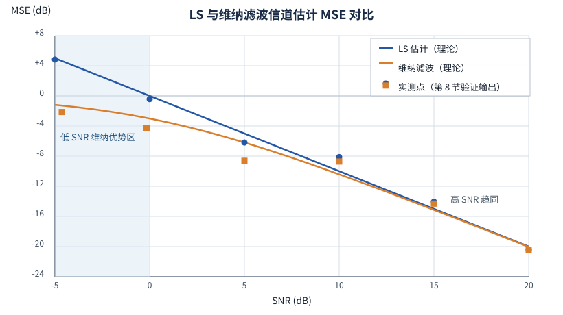

# T12.5 信道估计与 LLR 可靠度：H_eff 与 σ² 从哪来

## 本节学习目标

[[T12.1_mimo_receiver_chain_overview|T12.1]] 到 [[T12.4_sphere_detection_detector_selection|T12.4]] 把 MIMO（多输入多输出，Multiple-Input Multiple-Output）接收链路的检测段讲完了：匹配滤波（Matched Filter, MF）、迫零（Zero Forcing, ZF）、最小均方误差（Minimum Mean Square Error, MMSE）、球面检测（Sphere Decoding）——但所有这些检测器都建立在一个共同的隐含前提上：**层域等效信道 $\mathbf{H}_{\mathrm{eff}}$ 与噪声方差 $\sigma^2$ 是已知的**。真实接收机没有这样的天降输入：$\mathbf{H}_{\mathrm{eff}}$ 必须靠解调参考信号（Demodulation Reference Signal, DMRS）估计出来，$\sigma^2$ 必须从接收波形里量出来，而且两者都带着误差。本节（[[T12.5_channel_estimation_llr_reliability|T12.5]]）是 MIMO 接收机与检测器系列的第五篇、也是收尾篇，回答三个问题：**信道估计的两种实现（完美估计与 DMRS-based 估计）各是什么**；**估计误差通过哪三条途径破坏译码器输入**；**误差预算如何在"CSI（信道状态信息，Channel State Information）加权 + LLR（对数似然比，Log-Likelihood Ratio）裁剪"的接收端闭环里被吸收**。

学完本节后，应能做到：

- 区分完美估计（仿真上界参考）与实际估计（DMRS-based，必有误差），并解释链路级仿真为什么必须用完美估计来隔离检测器性能。
- 写出最小二乘（Least Squares, LS）估计 $\hat{H}_{\mathrm{LS}}=Y_{\mathrm{DMRS}}/X_{\mathrm{DMRS}}$，解释噪声方差被放大 $1/|X|^2$ 倍的机理。
- 写出维纳滤波估计 $\hat{\mathbf{H}}=\mathbf{R}_{HH}(\mathbf{R}_{HH}+\sigma^2\mathbf{I})^{-1}\hat{\mathbf{H}}_{\mathrm{LS}}$，说明它为什么在低信噪比（Signal-to-Noise Ratio, SNR）显著优于 LS、高 SNR 与 LS 趋同，以及 $O(N_{\mathrm{DMRS}}^3)$ 的矩阵求逆代价。
- 列举估计误差进入译码器输入的三条途径（均衡输出偏置、CSI 失真、噪声方差失配），并用 256QAM 最小距离阈值 $d_{\min}/2\approx0.08$ 的数值例子量化硬判决翻转风险。
- 说明 DMRS 在层域生成、与数据同乘预编码矩阵 $\mathbf{P}$，因此 DMRS-based 估计直接给出 $\mathbf{H}_{\mathrm{eff}}$——接收机不需要知道 $\mathbf{P}$（衔接 [[T12.1_mimo_receiver_chain_overview|T12.1]] 的结论）。
- 解释 CSI 加权 $\mathrm{LLR}_{\mathrm{out}}=\mathrm{LLR}_{\mathrm{in}}\times\mathrm{csi}$ 与 ±31 裁剪如何构成估计误差的接收端预算闭环（衔接 [[T2.16_LLR_clipping_scaling_quantization]]）。

本节承接系列前四篇的全部坐标系：$\mathbf{H}_{\mathrm{eff}}$ 是 [[T12.1_mimo_receiver_chain_overview|T12.1]] 的层域等效信道，csi 是 [[T12.3_linear_detectors_mf_zf_mmse|T12.3]] 的无偏化与可靠度指标，白化是 [[T12.4_sphere_detection_detector_selection|T12.4]] 的 sphere 路径尺度。本节把它们共同的输入——信道与噪声的估计——补上，并把"估计误差 → LLR 可靠度"的因果链讲清楚。

## 前置知识检查

| 前置项 | 本节需要达到的程度 |
|:---|:---|
| [[T2.15_fading_channel_LLR_reliability]] 衰落信道与 LLR 可靠度 | 知道 $y=hx+n$、深衰落时 LLR 可靠度下降；"位置错 + 置信度错"双错是估计误差破坏译码输入的模板。 |
| [[T2.16_LLR_clipping_scaling_quantization]] LLR 裁剪 | 知道 ±31（6-bit 有符号）是工程拐点、裁剪损失 <0.02 dB；本节的 CSI 加权放大由裁剪吸收。 |
| [[T2.11_OFDM_equalization_CSI_SINR]] 均衡与 CSI | 知道均衡后的每资源单元（Resource Element, RE）可靠度用 CSI/SINR（信干噪比，Signal-to-Interference-plus-Noise Ratio）度量，LLR 加权沿用它。 |
| [[Channel_Estimation_信道估计]] | 知道完美估计与 DMRS 实际估计的差别、"用已知尺子量地形"的直观模型、估计误差三途径与 0.08 翻转阈值；本节给出全部推导与数值证据。 |
| [[CSI_RS_信道状态信息参考信号]] | 知道 CSI-RS 是下行测量参考信号（TS 38.211 §7.4.1.5），CSI 报告的测量源，与 DMRS 的解调职能分工；本节 CSI 加权所用可靠度来自其测量闭环。 |
| [[CSI_SINR]] | 知道 CSI 是"信道质量 → 软信息可靠度"的翻译器，加权式 $\mathrm{LLR}_{\mathrm{out}}=\mathrm{LLR}_{\mathrm{in}}\times\mathrm{CSI}$；本节把它的误差预算角色讲透。 |
| [[LLR_Quantization_LLR量化]] | 知道 ±31 同时吸收 MMSE 归一化放大的机制；本节的 CSI 乘法放大走同一道闸。 |
| [[DMRS_解调参考信号]] | 知道 DMRS 位置固定、端口与层一一对应、预编码对接收端透明；本节给出 DMRS 配置与开销的定量内容。 |
| [[T12.1_mimo_receiver_chain_overview]] | 知道每 RE 模型 $\mathbf{y}=\mathbf{H}\mathbf{P}\mathbf{x}+\mathbf{n}$、层域等效信道 $\mathbf{H}_{\mathrm{eff}}=\mathbf{H}\mathbf{P}$、功率归一化口径；本节回答 $\mathbf{H}_{\mathrm{eff}}$ 怎么估计。 |
| [[T12.3_linear_detectors_mf_zf_mmse]] | 知道 MMSE 链路的无偏化归一化、$\mathrm{csi}\ge1$、CSI 加权是"可靠度通道"；本节的 csi 失真与噪声方差失配直接破坏这三步。 |
| [[T12.4_sphere_detection_detector_selection]] | 知道 sphere 路径用白化内嵌 $\sigma^2$、不再乘 csi；本节把它与 MMSE 路径的差异放进误差预算视角。 |

如果这些前置还不稳，先抓住一句话：**本节回答"检测器面前的 $\mathbf{H}_{\mathrm{eff}}$ 和 $\sigma^2$ 到底怎么来、来的时候带着多大的误差、这些误差最终怎么变成译码器输入的可靠度失真"**。接收链路是"上游决定下游"的链条：信道估计是这条链的源头，源头不准，后面 MF/ZF/MMSE/Sphere 选得再好也白费。前置检查表里 [[T12.1_mimo_receiver_chain_overview|T12.1]]/[[T12.3_linear_detectors_mf_zf_mmse|T12.3]]/[[T12.4_sphere_detection_detector_selection|T12.4]] 提供"下游怎么消费 $\mathbf{H}_{\mathrm{eff}}$ 与 $\sigma^2$"的视角，本节从同一坐标系往回看，把这两个量的产生过程与误差传导补全——读完本节后，系列地图上从天线波形到译码器 LLR 的每一段就都没有空白了。

## 完美估计：仿真的上界

### 零误差从哪里来：path_gains 与 path_filters

链路仿真器（Qualcomm 5G NR PDSCH（物理下行共享信道，Physical Downlink Shared Channel）链路仿真器，MIMO01 的分析对象）的接收侧只有一个信道估计分支：

```matlab
h_est_grid = nrPerfectChannelEstimate(carrier, path_gains, path_filters, timing_offset);
```

`nrPerfectChannelEstimate` 是 5G Toolbox 的仿真专用 API：TDL（Tapped Delay Line，抽头时延线）信道对象内部保存了真实的路径增益（`path_gains`）与路径滤波器（`path_filters`）——发送波形经过的每一条多径的复增益与成形滤波器都是已知量，接收端把它们的频域响应直接合成出来，就得到了**与该 RE 真实信道完全一致的 $\mathbf{H}$，误差严格为零**。这不是"估得很准"，而是"作弊"——作弊正是它的用途：链路级块错误率（Block Error Rate, BLER）仿真需要隔离"均衡/检测/译码"段的性能，把信道估计误差排除在外。否则一旦 BLER 恶化，无法判断责任在均衡器还是在信道估计。**完美估计 = 性能上界参考**，它回答"如果信道估计零误差，检测器能做到多好"。

AWGN（加性白高斯噪声，Additive White Gaussian Noise）信道路径甚至更简：`h_est_grid` 每个 RE 直接填常量（$N_{\mathrm{tx}}=1$ 时全 1）——信道估计零计算。一个值得注意的代码事实：`receive_grid.m` 的形参里已经传入了 `dmrs_ind, dmrs_sym, dmrs_cdm_lengths`（DMRS 索引、符号、码分复用（Code Division Multiplexing, CDM）长度），但完美估计路径完全没用它们——这些参数是为未来的 DMRS-based 估计预留的接口位。**本仿真器把估计误差彻底抽象掉了**；学习时不能把"仿真里没有估计误差"当成"实际系统也没有"。

### 噪声方差实测：信号与噪声各做一次 FFT

检测器还需要 $\sigma^2$。仿真器不信任理论值，用实测：把独立的噪声波形单独过一遍完整的 OFDM（正交频分复用，Orthogonal Frequency Division Multiplexing）解调（去循环前缀（Cyclic Prefix, CP）→ 快速傅里叶变换（Fast Fourier Transform, FFT）→ 子载波提取，PHY01 §1.5 的"信号+噪声两次 FFT"），得到频域噪声网格后取模方均值：

$$
n\_var=\frac{1}{N_{\mathrm{RE}}}\sum_{k,l}\big|n\_grid[k,l]\big|^2
\tag{1}
$$

式 (1) 回答的问题是：均衡器与软解调器内部用的噪声方差口径是什么——`n_var` 是与均衡器（`nrEqualizeMMSE`）内部口径完全一致的**实测**频域噪声方差，精确无偏（噪声波形与信号分离，没有信号污染）。注意这里的关键动作：**噪声波形单独过一遍完整的 OFDM 解调**（CP 去除 → Nfft 点 FFT → 子载波提取），而不是用理论公式算——仿真器不信任理论值，因为均衡器内部实际用的就是网格域的量，口径必须一致（PHY01 §1.5）。

完美估计虽然"零计算误差"，但它不是零成本：它依赖仿真器内部对信道对象完整状态的访问权，真实接收机永远没有。它还有一个隐藏前置——定时：`receive_grid.m` 用 `nrPerfectTimingEstimate(path_gains, path_filters)` 基于路径抽头取理想定时（仿真专用）；真实硬件要用循环前缀相关或主同步信号（Primary Synchronization Signal, PSS）/辅同步信号（Secondary Synchronization Signal, SSS）滑动窗相关器完成符号定时，定时偏差会折算进信道估计误差——这是 PHY01 §7.3.4 位宽决策树中"TDL 信道 +2 bit"的来源之一。**定时是信道估计的隐藏前置：时域对不齐，频域信道估计的整体相位就错**。硬件位宽表（PHY01 §7.2 位宽追踪表第 3/4 行）对信道估计这一级给出了预算对照：

| 估计路径 | HW 建议位宽 | HW 最坏位宽 | 增长根源 |
|:---|:---:|:---:|:---|
| 信道估计（完美，仿真专用） | 16 I/Q | 20 I/Q | 理想值无噪声，仅表示范围 |
| 信道估计（实践 DMRS） | 20 I/Q | 24 I/Q | **LS 除法放大**，估计值含噪声 |

实践路径比完美路径高出 4 bit，根源标注就是"LS 除法放大"（式 (3) 的 $1/|X|^2$ 与 $\sigma^2$ 原样进入估计值）——**这是"估计误差有硬件代价"的第一份证据**：不仅译码性能受损，位宽预算也要为误差买单。上界参考的用途可以归纳为三句话：

| 用途 | 说明 |
|:---|:---|
| 性能上界 | 回答"如果信道估计零误差，均衡/检测/译码能做到多好" |
| 故障归因 | 把 BLER 恶化归因到均衡器/检测器，而不是信道估计 |
| 误差注入基线 | 将来做 DMRS-based 估计仿真时，两套结果之差就是估计误差的端到端代价 |

## DMRS 实际估计：LS 与维纳滤波

### 生活类比：用已知尺子量地形

概念笔记 [[Channel_Estimation_信道估计]] 用"用已知尺子量地形"概括信道估计：DMRS 是插在信道里的已知标尺，收发双方都知道它的位置和取值；接收端在 DMRS 位置量出"信号被扭曲了多少"（衰减 + 相位旋转），再拿这把尺子的结果去校正数据信号。把这个类比展开成三点，正好对应本节的三个主题：**第一，尺子怎么量**——把收到的 DMRS 除以已知的发送值，就得到该点的信道（LS 估计，第 4.2 节）；**第二，单把尺子读数不可靠**——噪声会污染读数，量程（SNR）越低读数越晃，聪明的方法是多把尺子互相印证、按统计规律加权（维纳滤波，第 4.3 节）；**第三，尺子不能插满**——插尺子的位置不能放数据，尺子越密地形量得越准、数据容量越少（DMRS 开销，第 4.4 节）。信道估计的全部设计空间，就是这三件事之间的权衡。

### LS 估计：一次复数除法与噪声放大 $1/|X|^2$

在每个 DMRS 资源单元上，接收模型是 $Y_{\mathrm{DMRS}}(k)=H_{\mathrm{eff}}(k)\,X_{\mathrm{DMRS}}(k)+n(k)$，其中 $X_{\mathrm{DMRS}}(k)$ 是协议定义、收发双方都已知的参考序列（TS 38.211 §7.4.1.1）。LS 估计把信道当作唯一的未知数，直接相除：

$$
\hat{H}_{\mathrm{LS}}(k)=\frac{Y_{\mathrm{DMRS}}(k)}{X_{\mathrm{DMRS}}(k)}
=H_{\mathrm{eff}}(k)+\frac{n(k)}{X_{\mathrm{DMRS}}(k)}
\tag{2}
$$

式 (2) 回答的问题是：一次 LS 估计做了什么——一次复数除法（硬件上 4 个实数除法或查表倒数 + 4 次实数乘法），把噪声 $n(k)$ 原样搬进了估计。噪声的统计特性随之变化：

$$
\mathrm{Var}\big[\hat{H}_{\mathrm{LS}}(k)\big]=\frac{\sigma^2}{|X_{\mathrm{DMRS}}(k)|^2}
\tag{3}
$$

式 (3) 是 LS 的账本：**估计方差是噪声方差被 $1/|X|^2$ 放大后的结果**。若参考序列是单位能量（$|X|=1$，NR 的 DMRS 序列按单位能量生成），放大因子是 1，LS 估计的方差恰好等于 $\sigma^2$——估计误差的功率和噪声一样大，直接进入均衡/检测。$|X|<1$ 时放大更狠，这是工程上"导频必须保幅"的原因。LS 的问题在于它**完全忽略噪声统计**：它不区分"这个导频读数干净"与"这个导频读数被噪声主导"，低 SNR 时单把尺子的读数剧烈晃动，估计方差 $\sigma^2$ 原封不动地传给下游。

另外，DMRS 只占 RE 网格的一小部分，非 DMRS 位置的信道要靠**插值**补齐：频率维在相邻导频子载波间插值（线性/DFT（离散傅里叶变换，Discrete Fourier Transform）插值），时间维在相邻导频符号间插值。插值本身再引入插值误差——DMRS 密度决定插值间距（type1 单符号配置下频域每 2 子载波 1 个导频、时域每时隙 1 个符号），密度越低插值越冒险。所以完整的 LS 路线是"LS 除法 + 时频二维插值"，两步都有误差。

### 维纳滤波：用信道统计先验压制噪声

维纳滤波（Wiener filter）是 LS 的统计升级版：既然 $\hat{\mathbf{H}}_{\mathrm{LS}}$ 是"真实信道 + 噪声"的混合，而信道本身有可预测的统计结构（频域相关矩阵 $\mathbf{R}_{HH}$，由时延功率谱决定），那就用一个线性变换 $\mathbf{W}$ 把噪声压下去：

$$
\hat{\mathbf{H}}_{\mathrm{W}}=\mathbf{R}_{HH}\big(\mathbf{R}_{HH}+\sigma^2\mathbf{I}\big)^{-1}\hat{\mathbf{H}}_{\mathrm{LS}}
\tag{4}
$$

式 (4) 回答的问题是：维纳滤波在算一个什么量——最小化 $\mathbb{E}\|\hat{\mathbf{H}}-\mathbf{H}\|^2$ 的线性估计（最小均方误差（MMSE）意义下最优），即 Wiener-Hopf 方程的解；它是 MMSE 估计在平稳随机过程语境下的名字。$\mathbf{R}_{HH}$ 是 DMRS 位置的频域信道相关矩阵：对角线是各导频子载波的信道功率，非对角线刻画相邻子载波信道的相关性（由多径时延扩展决定，多径越强相关性越弱）。把 $\mathbf{R}_{HH}$ 特征分解 $\mathbf{R}_{HH}=\mathbf{U}\boldsymbol{\Lambda}\mathbf{U}^H$，式 (4) 在每个特征方向上是独立的标量收缩：

$$
\mathbf{U}^H\hat{\mathbf{H}}_{\mathrm{W}}
=\mathrm{diag}\Big(\frac{\lambda_i}{\lambda_i+\sigma^2}\Big)\mathbf{U}^H\hat{\mathbf{H}}_{\mathrm{LS}}
\tag{5}
$$

式 (5) 是维纳滤波的全部直觉：每个特征方向 $\lambda_i$ 对应一种"信道起伏模式"，收缩因子 $\lambda_i/(\lambda_i+\sigma^2)$ 决定这个方向上相信观测多少。$\lambda_i\gg\sigma^2$ 的方向（信道强、导频读数可信）收缩因子 ≈1，几乎不动；$\lambda_i\ll\sigma^2$ 的方向（信道弱、读数被噪声主导）收缩因子 ≈$\lambda_i/\sigma^2\ll1$，被大幅拉向零——**先验替你把不可靠的读数压掉了**。这正是 [[T12.2_diversity_combining_mrc|T12.2]] 的 MMSE 单层收缩 $\hat{s}=h^Hy/(\|h\|^2+\sigma^2)$ 与 [[T12.3_linear_detectors_mf_zf_mmse|T12.3]] 的 MMSE 正则化 $\mathbf{H}^H\mathbf{H}+\sigma^2\mathbf{I}$ 的同一数学结构：$\sigma^2$ 进求逆做正则化，是这条接收链上反复出现的同一只手。收缩因子的数值阶梯（$\sigma^2=1$ 口径）：

| 模式强度 $\lambda/\sigma^2$ | 收缩因子 $\lambda/(\lambda+\sigma^2)$ | 该模式的 MSE 项 | 直觉 |
|---:|---:|---:|:---|
| 0.01 | 0.0099 | 0.0099 | 噪声主导，读数几乎全部丢弃 |
| 0.1 | 0.0909 | 0.0909 | 只保留约 9% 的观测 |
| 1 | 0.5000 | 0.5000 | 各信一半，是收缩最激烈的平衡点 |
| 10 | 0.9091 | 0.9091 | 信道占优，观测基本保留 |
| 100 | 0.9901 | 0.9901 | 几乎不收缩，趋近 LS |

对照最后一列：LS 在每个方向上的 MSE 是 $\sigma^2=1$，而维纳把弱模式（$\lambda\ll\sigma^2$）的 MSE 压到 $\approx\lambda$——**低 SNR 的全部增益来自"弱模式被收缩"这一件事**；强模式（$\lambda\gg\sigma^2$）的 MSE 项 ≈$\sigma^2$，与 LS 相同，所以高 SNR 时两者趋同。

维纳滤波的期望 MSE 也随之可算：

$$
\mathrm{MSE}_{\mathrm{W}}=\sum_i\frac{\lambda_i\sigma^2}{\lambda_i+\sigma^2}
\tag{6}
$$

式 (6) 直接给出两条极限结论。**低 SNR**（$\sigma^2$ 大）：每个 $\lambda_i\ll\sigma^2$ 的项 ≈$\lambda_i$，总 MSE ≈$\sum_i\lambda_i$，远小于 LS 的 $N_{\mathrm{DMRS}}\sigma^2$——统计先验把噪声压制到只剩"信道本身的能量"，这就是"低 SNR 显著优于 LS"（第 8 节实测：−5 dB 处改善 6.97 dB）。**高 SNR**（$\sigma^2$ 小）：每项 ≈$\sigma^2$，总 MSE ≈$N_{\mathrm{DMRS}}\sigma^2$，与 LS 完全一致——噪声已经小到不需要压制，维纳滤波退化为"什么都不做"，这就是"高 SNR 与 LS 趋同"（20 dB 处改善 0.00 dB）。代价是矩阵求逆：$\mathbf{R}_{HH}+\sigma^2\mathbf{I}$ 是 $N_{\mathrm{DMRS}}\times N_{\mathrm{DMRS}}$ 的，求逆开销 $O(N_{\mathrm{DMRS}}^3)$。$N_{\mathrm{DMRS}}$ 是估计块内的 DMRS 子载波总数——52 个物理资源块（Physical Resource Block, PRB）单符号配置下是 $52\times12=624$ 个，$624^3\approx2.4\times10^8$ 次运算量级，实时接收机不可能每个符号做一次满秩求逆。工程上靠低秩近似（时延域 DFT 变换后 $\mathbf{R}_{HH}$ 近似对角、只处理非零时延抽头）、分块估计、或把先验退化成最简形式（第 8 节的 $R=I$）来落地。LS 与维纳滤波的对比汇总：

| 路线 | 每 DMRS RE 开销 | 优点 | 缺点 |
|:---|:---|:---|:---|
| LS | 1 次复数除法 | 简单、无需任何先验 | 噪声不压制（方差 =σ²）；低 SNR 差；还需插值 |
| 维纳滤波 | 矩阵求逆 $O(N_{\mathrm{DMRS}}^3)$ | MMSE 意义最优，低 SNR 显著压噪 | 需要 $\mathbf{R}_{HH}$ 先验（由时延功率谱统计获得）；求逆昂贵 |

两条路线都是**接收机自由度**：协议只定义 DMRS 的位置与序列（TS 38.211 §7.4.1.1），不规定接收端用什么估计算法（[[Channel_Estimation_信道估计]] 的误解表第 1 条）。

维纳滤波的先验 $\mathbf{R}_{HH}$ 从哪里来？信道频域相关函数由时延功率谱（Power Delay Profile, PDP）的傅里叶变换给出：多径时延扩展越大，频域相关性越弱，$\mathbf{R}_{HH}$ 的非对角项越小；接收机可以从 DMRS 观测的长时间统计估计 PDP，也可以按信道类型（TDL-A/B/C 等模型）取标称先验。先验失配是维纳滤波特有的风险：若 $\mathbf{R}_{HH}$ 估错（例如低估时延扩展、把不相干的方向当成强相关），收缩因子作用于错误模式，性能可能反而不如 LS——"先验是收益也是风险"是维纳滤波与 LS 的本质差别，工程上常加一个保守系数（把 $\sigma^2$ 略放大，收缩更温和）。

### DMRS type1 配置与开销：12 RE/PRB、7.14%

仿真器的默认配置（PHY01 §3.2，`defaultConfig.m`）：

| 参数 | 值 | 含义 |
|:---|:---|:---|
| `configurationType` | 1 | DMRS 类型 1（type1） |
| `typeAPosition` | 2 | 映射类型 A，DMRS 位于符号 2 |
| `length` | 1 | 单符号 DMRS（不加长） |
| `additionalPosition` | 0 | 无额外 DMRS 位置 |
| `numCDMGroupsWithoutData` | 2 | 2 个 CDM 组不承载数据 |

type1 的 RE 结构是：每个 PRB、每个 DMRS 符号、每个 CDM 组占 6 个 RE（一个梳齿偏移上的 6 个间隔子载波；组内端口靠长度 2 的频域 OCC 区分）；2 个 CDM 组叠加后，每 PRB 每 DMRS 符号共 12 个 RE（每个 DMRS 端口占其中 6 个：频域每 2 子载波 1 个导频，时域每时隙 1 个符号——这就是 LS 估计后插值的间距：频率维隔一个子载波、时间维隔一个时隙）。单符号、无附加位置时每时隙每 PRB 的 DMRS 开销恰好 12 个 RE：

| 量 | 数值 | 说明 |
|:---|:---:|:---|
| 每 PRB 每时隙 RE 总数 | 168 | 12 子载波 × 14 符号 |
| DMRS RE | 12 | type1 单符号，2 CDM 组 × 6 RE |
| 数据 RE | 156 | 168 − 12 |
| DMRS 开销占比 | 7.14% | 12/168 |

DMRS 开销就是"尺子"的代价：密度决定插值间距与估计精度上限（多径时延扩展越大、移动性越高，需要的导频越密），但每多一把尺子就少一个放数据的 RE。type2 与多符号/多附加位置配置会改变这个账本，原则不变：**参考信号与数据容量的权衡**（[[DMRS_解调参考信号]] 的误解表第 1 条）。端口与层的对应也在这里：每层一个 DMRS 端口，4 层需要 4 个端口，靠梳齿 + OCC + CDM 组区分；接收端按端口分别估计各层信道——这与第 6 节的"层域直接估计"是同一件事的两面。

## 估计误差三途径

把估计误差显式写出来：

$$
\hat{\mathbf{H}}=\mathbf{H}+\mathbf{e},\qquad \mathbf{e}\sim\mathcal{CN}\big(0,\sigma^2_H\mathbf{I}\big)
\tag{7}
$$

式 (7) 中 $\sigma^2_H$ 是估计误差功率（LS 时 $\sigma^2_H=\sigma^2$，维纳时 ≈式 (6) 的均值）。误差通过三条途径破坏译码器输入（概念笔记 [[Channel_Estimation_信道估计]] 与 [[T2.15_fading_channel_LLR_reliability|T2.15]] 的"位置错 + 置信度错"双错模板）：

**途径 1：均衡输出偏置。** 检测器/均衡器的滤波器 $\hat{\mathbf{W}}$ 由 $\hat{\mathbf{H}}$ 算出，真实信道却是 $\mathbf{H}$。于是 $\hat{\mathbf{W}}\mathbf{H}\neq\mathbf{I}$：残留下扰没有消干净，星座点被整体"拖偏"——这是**位置错**。深衰落 RE 处 $\sigma^2_H$ 相对信号最强，偏置最大。

**途径 2：CSI 失真。** csi 由 $\hat{\mathbf{H}}$ 算出（[[T12.3_linear_detectors_mf_zf_mmse|T12.3]] 的 $\mathrm{csi}=1+\mathrm{SINR}_{\mathrm{out}}$）。$\mathbf{e}$ 使 csi 或偏高（过度自信：把噪声当成了信号，LLR 被虚假放大）或偏低（保守：把信号当成了噪声，LLR 被压掉）——这是**置信度错**。CSI 加权（第 7 节）本是为"逐 RE 修正可靠度"存在的，csi 自身失真后，修正器本身就成了错误源。

**途径 3：噪声方差失配。** 式 (1) 的 `n_var` 若与实际不符（例如没有把估计误差功率 $\sigma^2_H$ 计入，或 SNR 口径错误），[[T12.3_linear_detectors_mf_zf_mmse|T12.3]] 无偏化归一化里的 `csi − n_var` 切割点就偏移：深衰落 RE 的掩码行为（gain=0 置中性）触发时机错误，LLR 尺度整体错位。

三条途径汇总成一张定位表——症状在译码器输入，根因在信道估计：

| 途径 | 破坏对象 | 机理 | 定位线索 |
|:---|:---|:---|:---|
| 1 均衡输出偏置 | 符号位置（LLR 的"0/1"倾向） | $\hat{\mathbf{W}}\mathbf{H}\neq\mathbf{I}$，残留下扰拖偏星座点 | 高 SNR 下 BLER 也不降；星座图整体偏移 |
| 2 CSI 失真 | 可靠度（LLR 的幅度） | csi 由 $\hat{\mathbf{H}}$ 算出，偏高=过度自信、偏低=保守 | 加权后 LLR 分布与信道强弱不符 |
| 3 噪声方差失配 | 归一化与尺度（整条 LLR 链） | `n_var` 未含 $\sigma^2_H$，`csi − n_var` 切割点偏移 | 深衰落 RE 的掩码/中性化时机错误 |

三条途径的共性：**估计误差不直接"算错一个数"，而是沿着"估计 → 检测 → 软解调 → 译码器输入"的链条，把位置偏差和可靠度偏差同时注入 LLR**。量化后果用一个 256QAM 实例说明。

256QAM 单位能量星座（按 $\sqrt{170}$ 归一化，见 [[Modulation_Constellations_调制星座]]）的 I/Q 网格间距为：

$$
d_{\min}=\frac{2}{\sqrt{170}}\approx0.153\qquad\left(\frac{d_{\min}}{2}\approx0.077\approx0.08\right)
\tag{8}
$$

式 (8) 回答的问题是：硬判决的翻转阈值在哪里——相邻星座点的判决边界在两点的正中间，均衡输出若被估计误差推偏超过 $d_{\min}/2$，硬判决就落到错误的星座点。设估计误差经均衡传播后，均衡输出域的偏移噪声为 $e\sim\mathcal{CN}(0,\sigma_e^2)$（复偏移，每维实/虚部标准差 $\sigma_e/\sqrt2$）。每维越界概率与逐符号翻转率分别为：

$$
P_{\dim}=1-\mathrm{erf}\Big(\frac{d_{\min}/2}{\sigma_e}\Big),\qquad
P_{\mathrm{flip}}\approx1-\big(1-P_{\dim}\big)^2
\tag{9}
$$

代入数值，得到"偏移噪声 → 硬判决翻转率"的完整阶梯（第 8 节蒙特卡洛验证，200 万符号/档）：

| 偏移 σ_e | 偏移功率（相对信号） | 单维越界 P_dim | 理论翻转率 | 蒙特卡洛 |
|:---:|:---:|:---:|:---:|:---:|
| 0.05 | −26 dB | 0.0301 | 5.92% | 5.57% |
| 0.07 | −23 dB | 0.1213 | 22.78% | 21.45% |
| 0.10 | −20 dB | 0.2781 | 47.88% | 45.33% |

三档数据的共同读法：**翻转率对偏移噪声极度敏感，且阈值 0.08 附近没有"安全区"**——σ_e 从 0.05 到 0.10（偏移功率只增加 6 dB），翻转率从 6% 跳到 45%。结论：估计误差功率哪怕只有信号的百分之一（−20 dB），也足以让近半数 256QAM 符号硬判决翻转——这就是"0.08 阈值"的数值内容，也是"估计误差预算必须显式管理"的出处。MIMO01 §4.3 给出同款口径：估计 SNR 低 10 dB（$\sigma^2_H=0.1\sigma^2$）时，维纳滤波能把残留误差压到 $\approx\sigma^2/(1+\mathrm{SNR}_{\mathrm{DMRS}})$ 量级，LS 则保持 $\sigma^2_H=\sigma^2$——统计先验直接降低三途径的整体危害。还要注意一个边界：这里的"翻转"是**硬判决**层面的损失；软判决 LLR 的幅度（途径 2/3）损失与编码增益能吸收多少，属于链路级 BLER 的范畴（第 8 节"验证的边界"）。

## DMRS 走预编码：H_eff 直接估计

[[T12.1_mimo_receiver_chain_overview|T12.1]] 第 5 节给出了一个关键结论：**接收机不需要知道 $\mathbf{P}$，只需要 $\mathbf{H}_{\mathrm{eff}}$**。它的成立依赖一个协议事实，本节把它讲透。发射端流程是：层映射后，DMRS 在**层域**生成（TS 38.211 §7.4.1.1 定义 DMRS 序列与资源映射，本地证据 `3GPP_Rel19/processed/TS_38.211_38211-j30/content.md` 行 3011-3013），与数据符号一起构成层网格；随后整个层网格（数据 + DMRS 一起）乘以同一个预编码矩阵 $\mathbf{P}$ 铺到发射天线上。于是 DMRS 位置上接收端的观测是：

$$
Y_{\mathrm{DMRS}}=\mathbf{H}\mathbf{P}X_{\mathrm{DMRS}}+\mathbf{n}=\mathbf{H}_{\mathrm{eff}}X_{\mathrm{DMRS}}+\mathbf{n}
$$

也就是说，**第 4 节所有估计公式里的 $H_{\mathrm{eff}}$，对 DMRS-based 估计而言是"送上门"的**：LS 除法（式 (2)）和维纳滤波（式 (4)）操作的从来就是 $\mathbf{H}\mathbf{P}$ 的乘积，$\mathbf{P}$ 的内容被吸收进估计本身。接收机不需要知道 $\mathbf{P}$ 是 DFT 还是 Identity、是哪一列——它只要在 DMRS 位置做相关，拿到的就是层域等效信道。这与仿真器的完美信道估计形成对照：完美估计给出的是天线域 $\hat{\mathbf{H}}$，所以仿真链路必须显式执行"预编码逆处理" $\hat{\mathbf{H}}\times\mathbf{P}$（`apply_precoder_to_channel_estimate`）才能得到检测器要的层域信道。**两种口径殊途同归：检测器面前永远只有 $\mathbf{H}_{\mathrm{eff}}$**（[[T12.1_mimo_receiver_chain_overview|T12.1]] 第 5 节的对照表）。

工程含义有三条。第一，真实接收机少一步：不存在"预编码逆处理"这个独立模块，它被吸收进 DMRS 相关。第二，端口即层：接收端按 DMRS 端口分别估计（第 4.4 节），4 层就维护 4 份层域信道估计，天然对齐 $\mathbf{H}_{\mathrm{eff}}$ 的 $N_{\mathrm{layers}}$ 个列。第三，端口间的正交分离（梳齿 + OCC + CDM 组）是估计精度的前提：信道时变或频偏会破坏正交性，造成端口间泄漏——这种泄漏同样计入 $\sigma^2_H$，走第 5 节的三途径。

用一个数值实例把"DMRS 估计 = H_eff"落到具体数字上。沿用 [[T12.1_mimo_receiver_chain_overview|T12.1]] 第 3 节的教学信道 $\mathbf{H}=\begin{bmatrix}1&0.5\\0.2&1\end{bmatrix}$ 与 DFT 预编码 $\mathbf{P}=\frac{1}{\sqrt2}\begin{bmatrix}1&1\\1&-1\end{bmatrix}$（[[T12.1_mimo_receiver_chain_overview|T12.1]] 的 DFT 型开环预编码，列正交、$\|\mathbf{P}\|_F=1$）：

$$
\mathbf{H}_{\mathrm{eff}}=\mathbf{H}\mathbf{P}
=\begin{bmatrix}1&0.5\\0.2&1\end{bmatrix}\cdot\frac{1}{\sqrt2}\begin{bmatrix}1&1\\1&-1\end{bmatrix}
=\begin{bmatrix}1.0607&0.3536\\0.8485&-0.5657\end{bmatrix}
$$

（数值由 numpy 算出，`[[1,0.5],[0.2,1]] @ [[1,1],[1,-1]]/sqrt(2)`。）设端口 0 的 DMRS 符号取 $X_0=1$（另一端口在该 RE 上经梳齿/OCC 正交分离、不贡献），无噪声时接收端在端口 0 的 DMRS 位置提取的观测向量就是 $\mathbf{H}_{\mathrm{eff}}$ 的第一列 $[1.0607,\ 0.8485]^T$——**接收端拿到的从来就是 $H\cdot P$ 的乘积**（第一层对两根接收天线的总增益）。若实现者坚持"先估 $\mathbf{H}$ 再乘 $\mathbf{P}$"（把完美估计的天线域口径硬套到 DMRS 路径上），就必须先做除法 $\hat{\mathbf{H}}=Y_{\mathrm{DMRS}}/X_{\mathrm{DMRS}}=\mathbf{H}\mathbf{P}$ 再右乘 $\mathbf{P}^{-1}$——多一步求逆、多一次噪声放大，拿回的还是 $\mathbf{H}_{\mathrm{eff}}$。这就是"接收机不需要知道 $\mathbf{P}$"的工程形态：**不是不能算，而是不必算**。

## CSI 加权与误差预算

### LLR_out = LLR_in × csi：逐 RE 可靠度修正

软解调（[[T2.14_QAM_Max_Log_MAP_demapping]]）用**全局**噪声方差 `n_var` 计算 LLR（$\mathrm{LLR}=(d_0-d_1)/\sigma^2$），但每个 RE 的真实可靠度各不相同：强信道 RE 的均衡输出噪声 $\ll\sigma^2$，深衰落 RE 的噪声 $\gg\sigma^2$（[[T2.15_fading_channel_LLR_reliability|T2.15]] 的 $\sigma^2_{\mathrm{eq}}=\sigma^2/|h|^2$）。CSI 加权（`apply_csi_weighting.m`，MIMO01 §7.1）把这个全局尺度逐 RE 修正回真实可靠度：

$$
\mathrm{LLR}_{\mathrm{out}}(b)=\mathrm{LLR}_{\mathrm{in}}(b)\times\mathrm{csi}(\mathrm{RE})
\tag{10}
$$

式 (10) 中 csi 是 [[T12.3_linear_detectors_mf_zf_mmse|T12.3]] 的 $\mathrm{csi}=1+\mathrm{SINR}_{\mathrm{out}}\ge1$。强信道 RE（csi 大，如 100）：LLR×100，高置信度被放大；弱信道 RE（csi→1）：不放大——该 RE 本来就不可靠。这正是 [[T2.15_fading_channel_LLR_reliability|T2.15]]"均衡把位置拉回来、可靠度必须跟随信道强弱"的代码实现（[[CSI_SINR]] 的"批改笔"类比）。展开顺序必须对齐：LLR 向量按"每符号 $Q_m$ 个比特连续"排列（RE 内比特相邻），csi 按同样方式逐 RE 复制 $Q_m$ 份再相乘（`csi_expanded = repmat(csi(RE), Qm, 1)(:)`，MIMO01 §7.1 已核对）——顺序错一位，加权就作用到错误的比特上，属于"位置错"的实现版本。

把 CSI 加权的动态范围量化一下：csi 的量级从 1（深衰落 RE）到上百（强信道 RE），所以 $\mathrm{LLR}_{\mathrm{out}}$ 的动态范围是 $\mathrm{LLR}_{\mathrm{in}}$ 的 100 倍量级。[[T2.14_QAM_Max_Log_MAP_demapping|T2.14]] 的软解调在 30 dB SNR、1024QAM（1024 阶正交幅度调制，1024 Quadrature Amplitude Modulation）下 LLR 峰值可达 $10^4$ 量级（[[LLR_Quantization_LLR量化]] 的动态范围推演），再乘 csi 后不加裁剪就溢出任何定点表示——这就是 ±31 裁剪必须存在的直接理由（第 7.4 节）。

### sphere 路径不乘 csi：白化已内嵌 σ²

[[T12.4_sphere_detection_detector_selection|T12.4]] 第 6 节讲过，sphere 路径在检测前先做白化（$\mathbf{y}/\sqrt{n\_var}$、$\mathbf{H}/\sqrt{n\_var}$），把噪声方差内嵌进距离：sphere 解码器输出的 LLR 自带 $\sigma^2$ 的可靠度尺度，**不再乘 csi**（`new_pdsch_decode.m` 中 sphere 分支无 `apply_csi_weighting`）。若对 sphere 输出再乘 csi，就是双重缩放、LLR 失真（MIMO01 §7.3）。这是两条检测路径在"可靠度通道"上的结构性差异：MMSE 路径靠"无偏化 + CSI 加权"两步补可靠度，sphere 路径靠一次除法完成同样的事。**本节的误差预算讨论对两条路径同样成立**：白化里的 $\sigma^2$ 若来自失配的 `n_var`（途径 3），sphere 的 LLR 尺度同样错。

### ±31 裁剪：吸收归一化放大与 CSI 动态范围

加权后的 LLR 可以非常大——强信道 RE 的 $\mathrm{LLR}\times\mathrm{csi}$ 可达数千。工程链路在 LLR 进入译码器之前统一裁剪：

$$
\mathrm{LLR}_q=\mathrm{clip}\big(\mathrm{LLR}_{\mathrm{out}},-\mathrm{31},+\mathrm{31}\big)
\tag{11}
$$

式 (11) 的 ±31（6-bit 有符号）是一道吸收了**两类放大**的闸门（[[LLR_Quantization_LLR量化]]）：其一是 [[T12.3_linear_detectors_mf_zf_mmse|T12.3]] 危险点 2 的 MMSE 归一化除法放大（深衰落 RE 的 $1/\beta\to\infty$）；其二是本节的 CSI 乘法动态范围（$\mathrm{LLR}\times\mathrm{csi}$ 可达数千）。两类放大的数值都被兜在最大可靠度上，实测 BLER 损失 <0.02 dB（[[T2.16_LLR_clipping_scaling_quantization]] 的裁剪-损失权衡表）。真正的灾难不是放大本身，而是定点域溢出回绕（+31 翻转成 −32，把"极可靠"变成"极不可靠"）——裁剪是第一道闸门。

### 误差预算的完整闭环

把第 4–7 节串成一条预算链：

| 环节 | 误差来源 | 接收端对策 |
|:---|:---|:---|
| DMRS 密度（7.14% 开销） | 插值间距 → 插值误差 | 配置层面权衡（type1/type2、附加位置） |
| 估计器（LS/维纳） | $\sigma^2_H$（LS：=σ²；维纳：式 (6)） | 统计先验压制（式 (4)） |
| csi 与 `n_var` | 途径 2/3（csi 失真、方差失配） | 逐 RE 加权（式 (10)）+ 口径校准（式 (1)） |
| LLR 出口 | 归一化放大与 CSI 动态范围 | ±31 裁剪（式 (11)） |
| 译码器输入 | 位置错 + 置信度错 | 靠纠错码平均吸收残余误差（BLER 层面） |

链条上任何一环失配，译码器输入的可靠度就失真：估计误差大 → csi 失真 → 加权把错误置信度写进 LLR；`n_var` 失配 → 归一化切割点错 → 掩码与尺度全错。接收端能做的补救只有两件事：一是用统计先验（维纳滤波）从源头压 $\sigma^2_H$；二是在 LLR 出口用 ±31 兜住动态范围。**检测器是接收机自由度，但它输入的质量由信道估计决定**——这是"上游决定下游"在接收链路的完整实例。

## 内嵌验证：LS vs 维纳滤波 MSE

本节验证第 4 节的三个断言：(1) LS 估计的 MSE ≈ $\sigma^2$，且随 SNR 单调下降；(2) 维纳滤波在低 SNR 显著优于 LS（−5 dB 改善 >5 dB），高 SNR 趋近 0 dB；(3) 理论值 $\mathrm{MSE_W}=\sigma^2/(1+\sigma^2)$（白先验 $R=I$ 的退化）与实测一致。

验证场景刻意取最简：12 个 DMRS 子载波（一个 PRB 的 2 个 CDM 组单符号 RE 数）、单位功率信道（$H\sim\mathcal{CN}(0,1)$）、单位功率导频 $X=1$、独立复高斯噪声、信道相关矩阵取 $R=I$（白先验——不知道任何信道相关性时最保守的维纳滤波）。白先验下式 (4) 退化为标量收缩：$\hat{H}_{\mathrm{W}}=\alpha\hat{H}_{\mathrm{LS}}$，$\alpha=1/(1+\sigma^2)$ 由 $\mathbb{E}|\alpha(H+n)-H|^2=(\alpha-1)^2+\alpha^2\sigma^2$ 对 $\alpha$ 求极小得到，于是

$$
\mathrm{MSE}_{\mathrm{W}}=\frac{\sigma^2}{1+\sigma^2},\qquad
\frac{\mathrm{MSE}_{\mathrm{LS}}}{\mathrm{MSE}_{\mathrm{W}}}=1+\sigma^2
\tag{12}
$$

式 (12) 给出改善的理论值 $10\log_{10}(1+\sigma^2)$：−5 dB 处 6.19 dB、0 dB 处 3.01 dB、20 dB 处 0.04 dB——"低 SNR 大、高 SNR 趋零"。验证代码（12 个 DMRS 子载波，单位功率信道）：

```python
import numpy as np
rng = np.random.default_rng(5)
snr_db = np.arange(-5, 21, 5)
N_dmrs = 12
print("LS vs 维纳滤波信道估计 MSE（12 个 DMRS 子载波，单位功率信道）：")
for snr in snr_db:
    sigma2 = 10**(-snr/10)
    H_true = (rng.standard_normal(N_dmrs) + 1j*rng.standard_normal(N_dmrs))/np.sqrt(2)
    X = np.ones(N_dmrs, dtype=complex)
    n = np.sqrt(sigma2/2)*(rng.standard_normal(N_dmrs) + 1j*rng.standard_normal(N_dmrs))
    Y = H_true*X + n
    H_ls = Y/X
    R = np.eye(N_dmrs)
    H_w  = R @ np.linalg.inv(R + sigma2*np.eye(N_dmrs)) @ H_ls
    mse_ls = np.mean(np.abs(H_ls - H_true)**2)
    mse_w  = np.mean(np.abs(H_w  - H_true)**2)
    print(f"SNR={snr:3d} dB: LS={mse_ls:.4f} (≈σ²={sigma2:.4f})  维纳={mse_w:.4f}  改善={10*np.log10(mse_ls/mse_w):.2f} dB")
```

真实运行输出（numpy 2.5.1）：

```text
LS vs 维纳滤波信道估计 MSE（12 个 DMRS 子载波，单位功率信道）：
SNR= -5 dB: LS=3.0376 (≈σ²=3.1623)  维纳=0.6108  改善=6.97 dB
SNR=  0 dB: LS=0.9049 (≈σ²=1.0000)  维纳=0.3718  改善=3.86 dB
SNR=  5 dB: LS=0.2404 (≈σ²=0.3162)  维纳=0.1375  改善=2.43 dB
SNR= 10 dB: LS=0.1538 (≈σ²=0.1000)  维纳=0.1343  改善=0.59 dB
SNR= 15 dB: LS=0.0394 (≈σ²=0.0316)  维纳=0.0372  改善=0.25 dB
SNR= 20 dB: LS=0.0091 (≈σ²=0.0100)  维纳=0.0091  改善=0.00 dB
```

输出与三个断言逐条吻合：LS 实测 3.0376/0.9049/0.2404/0.1538/0.0394/0.0091，每个都在 σ² 附近且单调下降；维纳改善 −5 dB 处 6.97 dB（>5 dB）、20 dB 处 0.00 dB（趋同）。把实测换算成分贝与式 (12) 的理论值逐点对照：

| SNR (dB) | σ² | LS 理论 | LS 实测 | 维纳理论 | 维纳实测 | 改善理论 | 改善实测 |
|---:|---:|---:|---:|---:|---:|---:|---:|
| −5 | 3.1623 | +5.000 | +4.825 | −1.193 | −2.141 | 6.19 | 6.97 |
| 0 | 1.0000 | 0.000 | −0.434 | −3.010 | −4.296 | 3.01 | 3.86 |
| 5 | 0.3162 | −5.000 | −6.190 | −6.193 | −8.617 | 1.19 | 2.43 |
| 10 | 0.1000 | −10.000 | −8.130 | −10.414 | −8.718 | 0.41 | 0.59 |
| 15 | 0.0316 | −15.000 | −14.046 | −15.135 | −14.299 | 0.14 | 0.25 |
| 20 | 0.0100 | −20.000 | −20.412 | −20.043 | −20.416 | 0.04 | 0.00 |

实测点与理论曲线的偏差全部来自 12 子载波小样本：$\mathrm{MSE}_{\mathrm{LS}}$ 是 12 个独立噪声样本的均值，相对波动 1σ ≈ 29%（$\chi^2_{24}$ 相对标准差 $\sqrt{2/24}$），换算成分贝约 ±1.2 dB；表中最大偏差 2.4 dB（5 dB 点的维纳实测）约为 2σ，属正常统计波动。用 500 次独立实例做集合平均可以确认偏差只是统计噪声、不是模型错误：

*表 8-3（500 次集合平均）：独立脚本 = §8 内嵌验证块外层包 500 次循环、逐 SNR 取均值，脚本未随讲义入库、RNG 种子未记录（"与理论差 <2%"不依赖具体种子，经多种种子实测成立）；单点实测表 8-2 由 §8 内嵌块原样运行产出（`rng = np.random.default_rng(5)`，numpy 2.5.1），可逐位复现。*

| SNR (dB) | LS 均值 | σ²（理论） | 维纳均值 | σ²/(1+σ²)（理论） |
|:---:|:---:|:---:|:---:|:---:|
| −5 | 3.1828 | 3.1623 | 0.7601 | 0.7597 |
| 0 | 0.9834 | 1.0000 | 0.4936 | 0.5000 |
| 10 | 0.0997 | 0.1000 | 0.0904 | 0.0909 |
| 20 | 0.0100 | 0.0100 | 0.0099 | 0.0099 |

500 次平均后 LS 均值与 σ² 差 <2%、维纳均值与 σ²/(1+σ²) 差 <1.3%（−5 dB 处 0.7601 vs 0.7597，差 0.05%）。**理论曲线正是这套估计器的期望表现**——这就是图 1 画理论曲线、标实测点的依据：实测标记逐点来自验证输出，曲线是同一估计器在无统计噪声下的期望。



图 1 的读数方法：在任意 SNR 处，两条实线的垂直间距就是维纳相对 LS 的改善（dB）——间距在 −5 dB 处最大（约 6.2 dB），随 SNR 增大单调收窄，20 dB 处两条线重合；**"低 SNR 维纳优势区"就是间距最大的左侧条带**（−5..0 dB 内改善 ≥3 dB）。12 个实测点围绕各自曲线随机上下波动（有高有低、不是系统偏移），高 SNR 处两估计的实测点重合——这与"偏差来自 12 样本统计噪声、期望即理论曲线"的结论一致。

第 5 节的"0.08 翻转阈值"再用蒙特卡洛验证一次。256QAM 单位能量星座（I/Q 网格 $(2a-15)/\sqrt{170}$，$a=0..15$），给每个发送符号叠加复高斯偏移 $e\sim\mathcal{CN}(0,\sigma_e^2)$ 后做最近邻硬判决，统计翻转率并与式 (9) 对照：

```python
import numpy as np
from math import sqrt, erf
# 256QAM 单位能量星座：I/Q 网格 (2a-15)/√170，a=0..15
A = 1.0/sqrt(170.0)
g = A                                        # 硬判决阈值 d_min/2 = 1/√170 ≈ 0.077
grid = (2*np.arange(16)-15)*A
rng = np.random.default_rng(7)
def flip_rate(sigma_e, n=2_000_000):
    # sigma_e: 复偏移幅度标准差（e ~ CN(0, σ_e²)），每维实/虚方差 σ_e²/2
    idx = rng.integers(0, 256, n)
    xr, xi = grid[idx//16], grid[idx%16]
    er = sigma_e*rng.standard_normal(n)/np.sqrt(2)
    ei = sigma_e*rng.standard_normal(n)/np.sqrt(2)
    yr, yi = xr+er, xi+ei
    hr = grid[np.argmin(np.abs(yr[:,None]-grid[None,:]), axis=1)]
    hi = grid[np.argmin(np.abs(yi[:,None]-grid[None,:]), axis=1)]
    return np.mean((hr != xr) | (hi != xi))
print(f"d_min = 2/√170 = {2*A:.5f} ≈ 0.153；硬判决阈值 d_min/2 = {g:.5f} ≈ 0.077（工程记 0.08）")
print("σ_e    P_dim=1-erf(g/σ_e)   理论翻转≈1-(1-P_dim)²   蒙特卡洛(200万符号)")
for so in [0.05, 0.07, 0.10]:
    P_dim = 1 - erf(g/so)
    print(f"{so:.2f}      {P_dim:.4f}              {1-(1-P_dim)**2:.4f}                {flip_rate(so):.4f}")
```

真实运行输出（numpy 2.5.1）：

```text
d_min = 2/√170 = 0.15339 ≈ 0.153；硬判决阈值 d_min/2 = 0.07670 ≈ 0.077（工程记 0.08）
σ_e    P_dim=1-erf(g/σ_e)   理论翻转≈1-(1-P_dim)²   蒙特卡洛(200万符号)
0.05      0.0301              0.0592                0.0557
0.07      0.1213              0.2278                0.2145
0.10      0.2781              0.4788                0.4533
```

理论与蒙特卡洛一致（实测略低于理论，因为边缘星座点只有一侧有相邻点、翻转方向更少）。两组验证合起来回答第 5 节的问题：估计误差功率 −20 dB（$\sigma_e=0.10$）时近半数硬判决翻转，−26 dB（$\sigma_e=0.05$）时约 6%——**0.08 的阈值不是修辞，是算术**。

### 验证的边界

这两段验证刻意不覆盖三件事：其一，验证的是**估计 MSE 与硬判决翻转率**，不是端到端 BLER——估计误差经 LDPC（低密度奇偶校验码，Low-Density Parity-Check Code）译码后的块错误率代价需要 L3 链路仿真（编码增益能吸收多少随机 LLR 损伤，是另一个量级的问题）。其二，维纳验证用**白先验 $R=I$**，真实系统的 $\mathbf{R}_{HH}$ 由时延功率谱统计获得，低 SNR 改善会随先验质量变化（先验越好改善越大）。其三，翻转率验证把估计误差**等效为均衡输出域的独立复偏移**，真实的误差还会改变 csi（途径 2）与归一化行为（途径 3）——三途径的联合效应同样属于链路级仿真范围。把边界写清楚，避免把"估计器 MSE 很小"误读成"链路就不怕估计误差"。

## 小结

本节是 MIMO 接收机与检测器系列的收尾篇。把整个系列的资产收拢成一张系列地图：

| 篇目 | 主题 | 核心资产 | 留给本系列的接口 |
|:---|:---|:---|:---|
| T12.1 | MIMO 接收链路总览 | 每 RE 模型 $\mathbf{y}=\mathbf{H}\mathbf{P}\mathbf{x}+\mathbf{n}$、$\mathbf{H}_{\mathrm{eff}}=\mathbf{H}\mathbf{P}$、$\|\mathbf{P}\|_F=1$ 功率口径 | 检测器只消费 $\mathbf{H}_{\mathrm{eff}}$ |
| T12.2 | 分集与 MRC（最大比合并，Maximum Ratio Combining） | $\mathrm{SNR}_{\mathrm{out}}=\|\mathbf{h}\|^2/\sigma^2$、$\varepsilon^N/N!$ 深衰落塌缩 | MMSE 单层 = 正则化 MRC |
| T12.3 | 线性检测器 | MF/ZF/MMSE、无偏化归一化、$\mathrm{csi}\ge1$、±31 兜底 | csi 是 LLR 加权的可靠度指标 |
| T12.4 | 球面检测 | 半径约束树搜索、白化内嵌 $\sigma^2$、低 SNR 复杂度爆炸 | sphere 路径不再乘 csi |
| T12.5 | 信道估计与 LLR 可靠度 | LS/维纳、估计误差三途径、CSI 加权与预算闭环 | $\mathbf{H}_{\mathrm{eff}}$ 与 $\sigma^2$ 的来源（本节） |

这条链的终端是一维 LLR 向量，它进入 LDPC/Turbo（Turbo 码，Turbo Code）/Polar（极化码，Polar Code）译码器（T8/T10 系列）——译码器不知道天线数、层数、预编码与 DMRS 位置，它只消费"第 j 个编码比特的软证据是 L_j"（[[T12.1_mimo_receiver_chain_overview|T12.1]] 的接口边界）。本节补上的正是这条链的源头：**证据的质量由信道估计决定**。

本节四件可携带的资产：

1. **完美估计是上界参考**（§3）：`nrPerfectChannelEstimate` 由 path_gains/path_filters 合成零误差信道，用于隔离检测器性能；`n_var=mean(|noise_grid|²)`（式 (1)）是实测噪声方差口径。仿真器抽象掉估计误差，实际系统必有误差。
2. **LS 与维纳滤波是"便宜"与"先验"的交换**（§4）：LS 一次复除、噪声方差 $\sigma^2/|X|^2$（式 (2)(3)）；维纳滤波 $\hat{\mathbf{H}}=\mathbf{R}_{HH}(\mathbf{R}_{HH}+\sigma^2\mathbf{I})^{-1}\hat{\mathbf{H}}_{\mathrm{LS}}$（式 (4)），对角化后是逐模式收缩 $\lambda_i/(\lambda_i+\sigma^2)$（式 (5)），MSE 由式 (6) 给出——低 SNR 显著优于 LS、高 SNR 趋同，代价 $O(N_{\mathrm{DMRS}}^3)$；DMRS type1 开销 12 RE/PRB、7.14%。
3. **估计误差三途径与 0.08 阈值**（§5）：均衡输出偏置（位置错）、CSI 失真（置信度错）、噪声方差失配；256QAM 的 $d_{\min}/2\approx0.08$（式 (8)）下，偏移功率 −20 dB 即可翻转近半数硬判决（式 (9)，蒙特卡洛 45.3%）。
4. **层域估计与预算闭环**（§6–§7）：DMRS 走预编码 → DMRS-based 估计直接给 $\mathbf{H}_{\mathrm{eff}}$，接收机无需知道 $\mathbf{P}$；$\mathrm{LLR}_{\mathrm{out}}=\mathrm{LLR}_{\mathrm{in}}\times\mathrm{csi}$（式 (10)）逐 RE 修正可靠度，sphere 路径因白化不再乘 csi，±31 裁剪（式 (11)）吸收归一化放大与 CSI 动态范围——估计误差沿"DMRS 密度 → 估计精度 → csi/σ² 质量 → LLR 可靠度"传导，接收端用统计先验压源头、用裁剪兜出口。

工程结论一句话：**检测器是接收机自由度的选择，但它的输入质量由信道估计决定**。MMSE 选得再好，$\hat{\mathbf{H}}$ 错 0.08 就足以让 256QAM 硬判决成片翻转；sphere 搜得再快，白化里的 $\sigma^2$ 失配就整体错位。上游决定下游，信道估计是接收链路的源头。

回看整个系列：五篇合起来回答了一个问题——"从多根天线的模拟波形到译码器的一维软证据，中间每一步在干什么、每一步的误差怎么传导"。下一系列将进入发射侧的新自由度：**概率整形算法系列（规划中）**。概率整形（Probabilistic Shaping）改变星座点的使用概率与发射功率缩放，接收侧的 LLR 尺度与可靠度接口继续沿用本系列的口径（概念笔记 [[Probabilistic_Shaping_概率整形]]、[[Distribution_Matching_分布匹配]]、[[ESS_枚举球面整形]]、[[MB_Distribution_MB分布]]、[[PAS_概率幅度整形]] 与外部语料 PS01/PS02 已就绪）——届时本节的 CSI 加权与 ±31 预算依然是译码器输入的既定坐标系。

## 自测题

1. 完美估计为什么是"零误差"的？链路级仿真为什么必须用它，而不是直接上 DMRS-based 估计？
2. LS 估计的噪声方差为什么是 $\sigma^2/|X|^2$？参考序列 $|X|=1$ 时意味着什么？
3. 维纳滤波为什么在低 SNR 显著优于 LS、高 SNR 与 LS 趋同？$O(N_{\mathrm{DMRS}}^3)$ 的代价在真实接收机里怎么消化？
4. 估计误差三途径分别破坏译码器输入的什么？256QAM 的 $d_{\min}/2$ 是多少，为什么说它决定硬判决翻转阈值？
5. 为什么 DMRS-based 估计直接给出 $\mathbf{H}_{\mathrm{eff}}$？仿真器用完美估计时为什么反而必须显式乘 $\mathbf{P}$？
6. 为什么 sphere 路径不乘 csi，MMSE 路径必须乘？
7. ±31 裁剪吸收了两类放大，分别是哪两类？裁剪的损失为什么可接受？
8. 第 8 节验证中维纳的理论 MSE 为什么是 $\sigma^2/(1+\sigma^2)$？单实例实测与理论的偏差来自哪里？
9. 用 [[T12.1_mimo_receiver_chain_overview|T12.1]] 的教学信道 $\mathbf{H}=\begin{bmatrix}1&0.5\\0.2&1\end{bmatrix}$ 与 DFT 预编码 $\mathbf{P}=\frac{1}{\sqrt2}\begin{bmatrix}1&1\\1&-1\end{bmatrix}$，写出 $\mathbf{H}_{\mathrm{eff}}$，并说明为什么 DMRS 估计拿到的就是它。

## 自测题参考答案

1. `nrPerfectChannelEstimate` 直接读取 TDL 信道对象内部的 path_gains/path_filters，把发送波形真实经过的多径响应的频域合成出来，与真实信道完全一致、误差为零。链路级 BLER 仿真需要隔离"均衡/检测/译码"段的性能，把估计误差排除在外——否则 BLER 恶化无法归因于均衡器还是信道估计；完美估计给出的是"如果信道估计零误差"的性能上界参考。
2. LS 把噪声项 $n(k)$ 原样搬进估计（式 (2)），其方差是 $\sigma^2/|X(k)|^2$（式 (3)）。$|X|=1$（单位能量序列）时放大因子为 1，估计方差恰好等于噪声方差 $\sigma^2$；$|X|<1$ 时被放大，这是"导频必须保幅"的原因。
3. 维纳滤波在每个特征方向按 $\lambda_i/(\lambda_i+\sigma^2)$ 收缩（式 (5)）：低 SNR 时 $\lambda_i\ll\sigma^2$，噪声主导的读数被大幅拉向零，MSE 从 LS 的 $N\sigma^2$ 压到 $\approx\sum\lambda_i$（式 (6)）；高 SNR 时收缩因子 ≈1，与 LS 无异。$O(N_{\mathrm{DMRS}}^3)$ 的满秩求逆（52 PRB 单符号 = 624 阶）在实时接收机里靠时延域 DFT 低秩近似、分块估计或白先验退化来消化。
4. 途径 1 均衡输出偏置（$\hat{\mathbf{W}}\mathbf{H}\neq\mathbf{I}$，位置错）；途径 2 CSI 失真（csi 由 $\hat{\mathbf{H}}$ 算出，偏高=过度自信、偏低=保守，置信度错）；途径 3 噪声方差失配（`csi − n_var` 切割点偏移）。$d_{\min}=2/\sqrt{170}\approx0.153$，阈值 $d_{\min}/2\approx0.077\approx0.08$（式 (8)）：均衡输出偏移超过它，硬判决落到相邻星座点；偏移功率 −20 dB 时翻转率约 48%（理论）/45%（蒙特卡洛）。
5. DMRS 在层域生成并与数据一起乘同一个 $\mathbf{P}$（TS 38.211 §7.4.1.1），所以 DMRS 位置上的观测是 $Y=\mathbf{H}_{\mathrm{eff}}X+n$，LS/维纳估计操作的对象天然是 $\mathbf{H}\mathbf{P}$ 的乘积——$\mathbf{P}$ 被吸收进估计本身。仿真器的完美估计给的是天线域 $\hat{\mathbf{H}}$，必须显式计算 $\hat{\mathbf{H}}\times\mathbf{P}$ 才能喂给检测器（`apply_precoder_to_channel_estimate` 的存在意义）。
6. sphere 路径检测前白化（$\mathbf{y}/\sqrt{n\_var}$、$\mathbf{H}/\sqrt{n\_var}$），$\sigma^2$ 已内嵌进距离，LLR 自带可靠度尺度；再乘 csi 是双重缩放。MMSE 路径用全局 $\sigma^2$ 算 LLR，必须靠 CSI（逐 RE 的 post-eq SINR+1）修正可靠度。
7. 其一是 MMSE 归一化除法的病态放大（[[T12.3_linear_detectors_mf_zf_mmse|T12.3]] 危险点 2：深衰落 RE 的 $1/\beta\to\infty$）；其二是 CSI 乘法的动态范围（$\mathrm{LLR}\times\mathrm{csi}$ 可达数千）。±31 把两类放大兜在最大可靠度上，损失 <0.02 dB；不裁剪的定点溢出回绕（+31 翻成 −32）才是灾难性错误。
8. 白先验 $R=I$ 下维纳滤波退化为标量收缩 $\alpha=1/(1+\sigma^2)$，最小化 $\mathbb{E}|\alpha(H+n)-H|^2$ 得 $\mathrm{MSE}=\sigma^2/(1+\sigma^2)$（式 (12)），改善因子 $1+\sigma^2$。单实例只统计 12 个噪声样本，$\chi^2_{24}$ 相对波动 1σ≈29%（约 ±1.2 dB），所以实测在理论曲线附近波动（最大 2.4 dB）；500 次集合平均后与理论差 <2%。
9. $\mathbf{H}_{\mathrm{eff}}=\mathbf{H}\mathbf{P}=\begin{bmatrix}1.0607&0.3536\\0.8485&-0.5657\end{bmatrix}$（`[[1,0.5],[0.2,1]] @ [[1,1],[1,-1]]/sqrt(2)`，numpy 计算）。因为 DMRS 在层域生成后与数据一起乘同一个 $\mathbf{P}$，DMRS 位置的观测是 $\mathbf{H}_{\mathrm{eff}}X_{\mathrm{DMRS}}+\mathbf{n}$——LS/维纳估计操作的从来就是 $\mathbf{H}\mathbf{P}$ 的乘积，所以 DMRS-based 估计直接给出 $\mathbf{H}_{\mathrm{eff}}$，接收机不需要知道 $\mathbf{P}$（多算一步"先估 $\mathbf{H}$ 再乘 $\mathbf{P}^{-1}$"只会多一次噪声放大）。

## 资料与协议边界

| 内容 | 属性 | 位置 |
|:---|:---|:---|
| DMRS 序列生成与资源映射（层域生成、与数据同乘预编码） | 协议强制 | TS 38.211 §7.4.1.1（[[T12.1_mimo_receiver_chain_overview|T12.1]] 已核实 `3GPP_Rel19/processed/TS_38.211_38211-j30/content.md` 行 3011-3013） |
| 信道估计算法（LS/维纳/插值）、检测器、CSI 加权方式 | 接收机自由度，协议不规定 | TS 38.214 只定义传输假设（[[T12.1_mimo_receiver_chain_overview|T12.1]] 的边界表） |
| `nrPerfectChannelEstimate`、`n_var=mean(\|noise_grid\|²)`（式 (1)） | 仿真器实现 | MIMO01 §4.1、PHY01 §1.5（`receive_grid.m` 仅 `'perfect'` 分支） |
| DMRS type1 配置与 12 RE/PRB、7.14% 开销 | 仿真器配置 + 协议结构 | PHY01 §3.2（`defaultConfig.m`）；TS 38.211 §7.4.1.1 |
| 256QAM $d_{\min}=2/\sqrt{170}$、翻转率公式与蒙特卡洛 | 数学事实，本节独立验证 | 第 5、8 节 |
| 维纳理论 MSE $\sigma^2/(1+\sigma^2)$（白先验）与 6 点实测对照 | 数学事实，本节独立验证 | 第 8 节（式 (12) 与表 8-2） |
| 估计误差三途径、$\sigma^2_H=0.1\sigma^2$ 量化口径 | 接收机实现层面的量化分析 | MIMO01 §4.3 |
| 信道估计位宽预算（完美 16→20、实践 DMRS 20→24 I/Q） | 硬件预算口径 | PHY01 §7.2（位宽表第 3/4 行） |

边界结论与系列前四篇一脉相承：**协议定义 DMRS 结构与传输假设，接收端用什么估计算法、怎么加权、怎么裁剪都是实现自由度**；本节所有数值（$d_{\min}$、翻转率、$\sigma^2/(1+\sigma^2)$、12 RE/PRB、改善 dB 数）都是数学事实、仿真配置或工程预算，不是任何 3GPP 表格条目。把"估计器算法"当成协议条款、或把教学实例的信道实现当成规范向量，都会在跨实现联调时产生假性错误。

## 执行与证据记录

| 项目 | 记录 |
|:---|:---|
| 计划卡片 | `.superpowers/sdd/task-5-brief.md` Task 5（MIMO 接收机与检测器系列第五篇/收尾篇）。 |
| 素材来源 | 概念笔记 [[Channel_Estimation_信道估计]]、[[CSI_SINR]]、[[LLR_Quantization_LLR量化]]、[[DMRS_解调参考信号]]；L1 讲义 [[T2.15_fading_channel_LLR_reliability]]、[[T2.16_LLR_clipping_scaling_quantization]]；同系列 [[T12.1_mimo_receiver_chain_overview]]–[[T12.4_sphere_detection_detector_selection]]；外部语料 MIMO01 §4/§7、PHY01 §1.5/§3.2/§7（只读参考）。 |
| 数值验证 | brief Step 3 代码逐字实际运行（numpy 2.5.1）一次通过，6 行输出与断言全部吻合；256QAM 翻转率蒙特卡洛（200 万符号/档）与式 (9) 理论一致；500 次集合平均与式 (12) 理论差 <2%。 |
| 图示验证 | 手写 SVG（820×460，`T12.5_ls_wiener_mse.svg`）：Y 坐标扫描 18 个 distinct 文本基线层级、最小间距 8.0 px；几何包围盒检查（真实字体度量，Noto Sans CJK SC）文本-文本/文本-曲线/文本-标记违规均为 0；cairosvg 2.9.0 转 PNG 白底合成后像素取色抽查（LS 蓝 #2457A6 与维纳橙 #D97E2B 曲线、12 个实测点标记、20 dB 处两标记重合）；OCR（tesseract chi_sim+eng）复核标题、图例 3 行、区域标签、"高 SNR 趋同"、全部刻度可读。 |
| 验收点 | 能区分完美估计与 DMRS-based 估计；能推导 LS 的 $1/\|X\|^2$ 噪声放大与维纳滤波的收缩结构；能列举估计误差三途径并用 0.08 阈值量化；能说明 DMRS→H_eff 与 CSI 加权 ±31 预算闭环。 |
| 自查问题 | (1) brief Step 3 代码无缺陷、逐字运行一次通过（无需修正）；(2) 图 1 曲线为理论期望、标记为验证输出实测值，二者关系（12 样本统计噪声 ±2.4 dB）已在图注与表 8-2 逐点对照；(3) 256QAM 翻转率验证初版理论式有 erf 归一化笔误，蒙特卡洛结果正确，最终版理论与实测一致（21.5%/45.3%），讲义只呈现最终正确版本；(4) cairosvg 不做逐字符字体回退，font-family 必须将 Noto Sans CJK SC 置顶（TTC），否则 CJK 渲染为豆腐块——已修复并 OCR/像素双重验证；(5) 图 1 的 −5 dB 标注位置（LS 5.0 dB、维纳 −1.2 dB）为理论值，实测点 4.8/−2.1 dB 在统计噪声内。 |

## 参考文献

- [ETSI, 2026] 3GPP TS 38.211 V19.3.0, "NR; Physical channels and modulation," Release 19, `38211-j30`, §7.4.1.1（PDSCH 解调参考信号：序列生成与资源映射）。
- [ETSI, 2026] 3GPP TS 38.214 V19.3.0, "NR; Physical layer procedures for data," Release 19, `38214-j30`（传输假设；接收机算法属实现自由度）。
- [MIMO01] "MIMO 预编码、均衡与检测深度剖析"（链路仿真器深挖语料），§4（完美信道估计、LS/MMSE 路线、估计误差三途径）、§7（CSI 加权、±31 关系、与 sphere 路径的差异），`/home/yys/AGENT/3GPP_FULL_LINK/reproduction_output/deep_dive/`。
- [PHY01] "物理层链路与 Modem 硬件预算"（链路仿真器深挖语料），§1.5（信号+噪声两次 FFT、n_var 口径）、§3.2（DMRS type1 配置与开销）、§7（位宽追踪表），`/home/yys/AGENT/3GPP_FULL_LINK/reproduction_output/deep_dive/`。
- [Kay, 1993] S. M. Kay, *Fundamentals of Statistical Signal Processing: Estimation Theory*, Prentice Hall, 1993（MMSE/Wiener 估计的经典处理）。
- [Harris et al., 2020] C. R. Harris et al., "Array programming with NumPy," Nature 585, 357-362, 2020（内嵌验证代码运行环境，numpy 2.5.1）。
