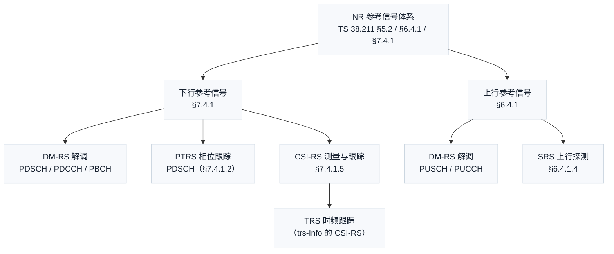
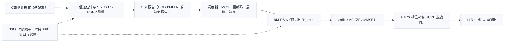

# T12.6 NR 参考信号体系：CSI-RS / PTRS / TRS

## 本节学习目标

[[T12.5_channel_estimation_llr_reliability|T12.5]] 收尾了 MIMO（多输入多输出，Multiple-Input Multiple-Output）接收机系列：它回答了"层域等效信道 $\mathbf{H}_{\mathrm{eff}}$ 与噪声方差 $\sigma^2$ 从哪来"——答案是解调参考信号（Demodulation Reference Signal, DM-RS）。但 DM-RS 只是 NR 参考信号家族里"管解调"的那一位。真实接收机在解调数据之前，还要回答另外三个问题：**信道现在有多好（测量）**、**时钟和频率还准不准（跟踪）**、**振荡器相位噪声有没有把星座转歪（相位补偿）**。本节的主角——信道状态信息参考信号（Channel State Information Reference Signal, CSI-RS）、相位跟踪参考信号（Phase Tracking Reference Signal, PTRS）、跟踪参考信号（Tracking Reference Signal, TRS）——分别回答这三个问题。本节把视野从"解调"拉宽到"测量、跟踪、相位补偿"，围绕 TS 38.211 §7.4.1（下行参考信号）与 §6.4.1（上行参考信号）精读三种信号的协议定义、用途分工与接收端用法，并把它们放进与 DM-RS、探测参考信号（Sounding Reference Signal, SRS）的体系对照中。

学完本节后，应能做到：

- 画出 NR 参考信号家族全图：下行（DM-RS / PTRS / CSI-RS / TRS）与上行（DM-RS / SRS）各管什么，并能说出 LTE 的广播式小区参考信号（Cell-specific Reference Signal, CRS）与 NR 按需式参考信号在哲学上的区别。
- 依据 TS 38.211 §7.4.1.5 复述 CSI-RS 的协议定义：序列生成（§7.4.1.5.2 的伪随机序列初始化公式）、资源映射（§7.4.1.5.3 的 $a_{k,l}=\beta w_f w_t r(m')$ 结构与端口编号 $p=3000+p'$）、资源要素（端口数、密度 $\rho$、CDM 类型、周期公式）。
- 计算 CSI-RS 的每 PRB（物理资源块，Physical Resource Block）参考 RE 数 $\mathrm{RE}_{\mathrm{PRB}}=N_{\mathrm{ports}}\,\rho/L_{\mathrm{CDM}}$，解释码分复用（Code Division Multiplexing, CDM）如何让多个端口共享同一批 RE，并用 numpy 断言验证。
- 依据 TS 38.211 §7.4.1.2 与 TS 38.214 §5.1.6.3 说出 PTRS 的序列来源（复用 DM-RS 序列）、映射条件（只在 PDSCH 的 RB、避开 DM-RS/CSI-RS/SSB）以及时间密度 $L_{\mathrm{PT-RS}}\in\{1,2,4\}$、频域密度 $K_{\mathrm{PT-RS}}\in\{2,4\}$ 随调度 MCS（调制与编码方案，Modulation and Coding Scheme）与带宽的配置规则。
- 解释 TRS 为什么"不是独立信号，而是配置了 trs-Info 的 CSI-RS"（§7.4.1.5.3 规定其 $\rho=3$、单端口、noCDM、双符号簇），并说明它如何衔接初始接入的主同步信号/辅同步信号（Primary/Secondary Synchronization Signal, PSS/SSS）粗同步与连接态的定时/频偏跟踪环路。
- 走通接收端两条链：链 1"测量 → 上报 → 调度"（CSI-RS/TRS 主导，衔接 [[Link_Adaptation_链路自适应与CQI]] 与 [[Beam_Management_波束管理]]）；链 2"估计 → 均衡 → LLR"（DM-RS/PTRS 主导，衔接 [[Channel_Estimation_信道估计]] 与 T12 系列检测器）。
- 完成 DM-RS / CSI-RS / PTRS / TRS / SRS 五类信号的体系对照表，并严格区分"协议强制"与"实现自由度"边界（协议定义序列与映射，接收端算法是自由度）。

## 前置知识检查

| 前置项 | 本节需要达到的程度 |
|:---|:---|
| [[Pilot_导频]] | 知道参考信号的"已知标尺"本质（收发双方各自独立生成同一序列）、"导频在协议族中的分布（五层职责）"一节的分层视角，以及"协议管放多少放哪、接收机管怎么用"的两层划分。 |
| [[T2.11_OFDM_equalization_CSI_SINR|T2.11]] 均衡与 CSI | 知道 LS（最小二乘，Least Squares）估计、时频插值、post-eq SINR（信干噪比，Signal-to-Interference-plus-Noise Ratio）到信道质量指示（Channel Quality Indicator, CQI）的折算链——CSI-RS 的测量链是同一数学。 |
| [[T12.5_channel_estimation_llr_reliability|T12.5]] 信道估计与 LLR | 知道 DM-RS 估计 $\hat{\mathbf{H}}_{\mathrm{eff}}$ 与 LLR（对数似然比，Log-Likelihood Ratio）可靠度的关系——本节链 2 的"估计→均衡→LLR"沿用该因果链。 |
| [[DMRS_解调参考信号]] | 知道 DM-RS 的 type1/type2、端口与层一一对应、预编码透明——本节用它做体系对照的"解调"基准。 |
| [[SRS_探测参考信号]] 与 [[T15.3_SRS_sounding|T15.3]] | 知道 SRS 是上行探测（梳状 comb 2/4/8、循环移位复用）——本节用它与下行 CSI-RS 做上下行对照。 |
| [[T2.7_OFDM_timing_synchronization|T2.7]] / [[T2.8_OFDM_CFO_SFO_frequency_synchronization|T2.8]] | 知道初始接入只做粗同步，连接态需要持续跟踪定时与频偏——TRS 就是驱动跟踪环路的持续参考。 |

如果只记一个原则：**NR 参考信号是"按用途分化"的——解调（DM-RS）、测量（CSI-RS）、相位（PTRS）、跟踪（TRS）、上行探测（SRS）各司其职；协议定义"序列是什么、放哪些 RE、几个端口"，接收端负责"用它们量出信道、算出可靠度"**。

## 参考信号家族：从"广播式导频"到"按需式参考信号"

### NR 从广播式 CRS 到按需式参考信号的演进动机

LTE 的参考信号设计是一套"广播式"方案：小区参考信号（CRS, Cell-specific Reference Signal）在每个下行子帧、每个 RB（资源块，Resource Block）里都占固定位置，同时服务于解调、测量与同步三件事。广播式的优点是简单可靠——接收端永远知道 CRS 在哪；代价是开销恒定且不可按需缩放：即使只调度一个用户，CRS 也占满全带宽，且多天线时每个天线端口都要一组 CRS，端口越多开销越大。

NR 换成了"按需式"哲学（[[Pilot_导频]] 的"五层职责"一节已给出分层视角）：每种用途配一种专用参考信号，各按各自的需求配置密度、端口与周期——**需要解调才放 DM-RS（随数据同传），需要测量才放 CSI-RS（按周期/触发），需要补偿相位才放 PTRS（随高阶调制出现），需要持续跟踪才放 TRS（连接态周期发送）**。广播式是"常开探照灯"，按需式是"按需开灯"。省下的 RE 全部还给数据。

### 家族全图



### 五类参考信号职责总表

| 参考信号 | 方向 | 协议章节（TS 38.211） | 一句话职责 | 与数据的关系 |
|:---|:---|:---|:---|:---|
| DM-RS（解调参考信号，Demodulation Reference Signal） | DL/UL | §7.4.1.1 / §6.4.1.1 | 解调当前传输：估计 $\mathbf{H}_{\mathrm{eff}}$ | 随数据同传、UE 专用 |
| PTRS（相位跟踪参考信号，Phase Tracking Reference Signal） | DL/UL | §7.4.1.2 / §6.4.1.2 | 补偿相位噪声的公共相位误差（Common Phase Error, CPE） | 随数据同传、按 MCS 出现 |
| CSI-RS（信道状态信息参考信号，Channel State Information Reference Signal） | DL | §7.4.1.5 | 下行测量：CSI 上报、波束管理、兼作 TRS | 独立发送、可多 UE 共用 |
| TRS（跟踪参考信号，Tracking Reference Signal） | DL | §7.4.1.5（trs-Info） | 连接态时频跟踪：驱动定时/频偏环路 | 独立周期发送、无独立序列 |
| SRS（探测参考信号，Sounding Reference Signal） | UL | §6.4.1.4 | 上行探测：频选调度、波束、TDD 互易性 | 独立发送、梳状采样 |

**本节的三个主角是 CSI-RS、PTRS、TRS**；DM-RS 与 SRS 作为对照基准在体系对照表（第 7 节）中收束。注意表里 TRS 的协议章节写的是"§7.4.1.5（trs-Info）"——这不是笔误，TRS 在 38.211 里根本没有独立小节，它只是 CSI-RS 的一种特殊配置，第 5 节详述。

### 生活类比：一支分工明确的手术团队

把一次下行传输想成一台手术：**DM-RS 是主刀医生的手电筒**（照见当前刀口——解调当次数据）；**CSI-RS 是术前体检报告**（评估病人整体状态——决定下次怎么配）；**PTRS 是水平仪**（手术台歪了就整体摆正——补偿相位噪声）；**TRS 是心电监护仪**（持续监测生命体征——保持时频同步不掉线）；**SRS 是病人从手术室传出的呼叫**（告诉护士台上状况——上行探测）。五种仪器用途不同、开启时机不同，但都基于同一个原理：**收发双方都知道"这里放的是什么"，用已知对照未知**。

## CSI-RS：下行测量的"体检设备"

### 协议定位与两种形态

CSI-RS 的协议定义在 TS 38.211 §7.4.1.5。§7.4.1.5.1 开篇就区分两种形态（本地 j30 `content.md` 行 3293-3297）：

- **非零功率 CSI-RS（Non-Zero-Power CSI-RS, NZP-CSI-RS）**：由 NZP-CSI-RS-Resource IE、CSI-RS-ResourceConfigMobility IE 或 TRS-ResourceSet IE 配置，真正发射已知序列供 UE 测量——**本节讨论的主体**；
- **零功率 CSI-RS（Zero-Power CSI-RS, ZP-CSI-RS）**：由 ZP-CSI-RS-Resource IE 配置，基站不发射任何能量，只把那些 RE 从 PDSCH 里"圈出来"（PDSCH 不得占用）。ZP-CSI-RS 的作用是保护与其冲突的其他信号（例如让干扰测量有干净的位置），UE 对非 PDSCH 的收发不受其影响。

一句话：**NZP 是"发出去的已知标尺"，ZP 是"留出来的空白保护区"**。

### 序列生成（§7.4.1.5.2）

UE 假设 CSI-RS 序列 $r(m)$ 由 §5.2.1 的伪随机序列 $c(n)$（Gold 序列）定义，在每个 OFDM 符号起点按如下方式初始化（本地 j30 行 3303-3307）：

$$
c_{\mathrm{init}}=2^{10}\left(N_{\mathrm{symb}}^{\mathrm{slot}}n_{s,f}^{\mu}+l+1\right)\left(2n_{\mathrm{ID}}+1\right)+n_{\mathrm{ID}}\pmod{2^{31}}
\tag{1}
$$

公式 (1) 回答的问题：**同一根 Gold 序列如何为不同小区、不同时刻生成互不相同的 CSI-RS？** 变量含义：$N_{\mathrm{symb}}^{\mathrm{slot}}$ 是一个时隙的 OFDM 符号数（常规 CP 下 14）；$n_{s,f}^{\mu}$ 是帧内时隙号；$l$ 是时隙内符号号；$n_{\mathrm{ID}}$ 由高层参数 scramblingID（或 sequenceGenerationConfig）给出，未配置时回退到小区 ID。收发双方用同一公式、同一参数各自独立生成——接收端不需要从信号里"猜"序列内容，这正是参考信号"已知性"的协议保障。

### 资源映射与端口（§7.4.1.5.3）

UE 假设序列映射到资源元素（Resource Element, RE）$(k,l)$ 上（本地 j30 行 3311-3313）：

$$
a_{k,l}^{(p,\mu)}=\beta_{\mathrm{CSI-RS}}\,w_f(k_q')\,w_t(l_q')\,r(m')
\tag{2}
$$

其中 $m'=n\alpha+k_q'+k_q\rho N_{\mathrm{sc}}^{\mathrm{RB}}$、$k=nN_{\mathrm{sc}}^{\mathrm{RB}}+k_q+k_q'$、$l=l_q+l_q'$，$n=0,1,\dots$。逐个符号解释：

- $\beta_{\mathrm{CSI-RS}}$：功率缩放因子（按 powerControlOffsetSS 满足相对 SSB 的功率偏置）；
- $w_f(k_q')$、$w_t(l_q')$：频域/时域正交覆盖码（由 CDM 类型决定，见下文）；
- $m'$ 的推进步长 $\alpha$：由密度 $\rho$ 与端口数 $N$ 决定（本地抽取文本为 $\alpha=\rho$（$N=1$）、$2\rho$（$N>1$），精确取值以原条文为准——**未核验**公式 XML 的逐字符还原）；
- $\rho$：密度（density 参数），取值见下节；
- $N_{\mathrm{sc}}^{\mathrm{RB}}$：每个 RB 的子载波数（12）。

映射的频域起点 $k=0$ 是公共资源块 0 的子载波 0；时域位置 $l_0\in\{0,\dots,13\}$、$l_1\in\{2,\dots,12\}$ 由 firstOFDMSymbolInTimeDomain / firstOFDMSymbolInTimeDomain2 给出。端口编号是独立的地址空间（本地 j30 行 3351-3353）：

$$
p=3000+p'
\tag{3}
$$

端口 $p=3000+p'$ 与 DM-RS 的端口 $1000+p'$（§7.4.1.1）刻意分开——**接收端从端口号一眼看出这是 CSI-RS 而不是 DM-RS**，两套端口空间互不混淆（§7.4.1.5.3 还明确规定："UE 不期望 CSI-RS 与 DM-RS 落在同一 RE 上"）。

### 资源要素：端口数 / 密度 / CDM 类型 / 周期

CSI-RS 的"长相"由四个参数族决定，全部由 RRC（无线资源控制，Radio Resource Control）配置：

| 资源要素 | 取值 | 说明 |
|:---|:---|:---|
| 端口数 $N$ | 1 / 2 / 4 / 8 / 12 / 16 / 24 / 32（可聚合至 48 / 64 / 128） | nrofPorts 参数；单资源最大 32 端口，更大的靠资源聚合（表 7.4.1.5.3-6） |
| 密度 $\rho$ | 0.5 / 1 / 3 | density 参数；每端口每 PRB 的 RE 数（$\rho=0.5$ 表示每 2 个 PRB 平均 1 个 RE） |
| CDM 类型 | noCDM / fd-CDM2 / cdm4-FD2-TD2 / cdm8-FD2-TD4 | cdm-Type 参数；决定 $w_f$、$w_t$ 与 CDM 组大小（表 7.4.1.5.3-2 至 -5） |
| 周期与偏移 | 周期 $T_{\mathrm{CSI-RS}}$（时隙）、偏移 $T_{\mathrm{offset}}$ | 仅周期/半持续形态需要；非周期由 DCI（下行控制信息，Downlink Control Information）触发 |

周期性的 CSI-RS 在满足下式的时隙发送（本地 j30 行 3383-3387）：

$$
\left(N_{\mathrm{slot}}^{\mathrm{frame},\mu}n_f+n_{s,f}^{\mu}-T_{\mathrm{offset}}\right)\bmod T_{\mathrm{CSI-RS}}=0
\tag{4}
$$

公式 (4) 回答的问题：**周期发送的信号如何避免与自身或其他周期信号"撞时隙"？** $N_{\mathrm{slot}}^{\mathrm{frame},\mu}n_f+n_{s,f}^{\mu}$ 是"帧号 + 时隙号"拼成的全局时隙计数，减去偏移后对周期取模为零的时隙才是 CSI-RS 出现的时隙——这保证收发双方对"哪些时隙有 CSI-RS"有完全一致的预期。注意 SRS 的时隙配置（§6.4.1.4.4）用了完全相同的结构（见第 7 节对照），这是 NR 参考信号时域配置的统一手法。

### 每 PRB 开销的数学：CDM 复用

CSI-RS 的参考 RE 数可以用一条简单公式算出来。设端口数 $N$、密度 $\rho$、CDM 组大小 $L_{\mathrm{CDM}}$（noCDM=1，fd-CDM2=2，cdm4-FD2-TD2=4，cdm8-FD2-TD4=8）：

$$
\mathrm{RE}_{\mathrm{PRB}}=\frac{N\,\rho}{L_{\mathrm{CDM}}}
\tag{5}
$$

公式 (5) 回答的问题：**每个 PRB 里到底有多少个 CSI-RS 参考 RE（不按端口重复计数）？** 直观理解：每端口每 PRB 本来要占 $\rho$ 个 RE，但 CDM 让 $L_{\mathrm{CDM}}$ 个端口共享同一批 RE（用正交覆盖码区分），所以实际 RE 数除以 $L_{\mathrm{CDM}}$。第 8 节的 numpy 验证逐行对照表 7.4.1.5.3-1（本地 `tables/table_0113.csv`）证实该式对 9 种典型组合全部成立，例如：

| 端口数 | $\rho$ | CDM 类型 | 每 PRB RE 数 | 表 7.4.1.5.3-1 对应行 |
|:---|:---|:---|:---|:---|
| 1 | 3 | noCDM | 3 | 行 1（TRS 结构：$k_0,k_0+4,k_0+8$） |
| 2 | 1 | fd-CDM2 | 1 | 行 3 |
| 8 | 1 | cdm4-FD2-TD2 | 2 | 行 8 |
| 24 | 1 | cdm8-FD2-TD4 | 3 | 行 15 |
| 32 | 1 | cdm4-FD2-TD2 | 8 | 行 17 |

数值实例：32 端口、$\rho=1$、cdm8 → $32\times1/8=4$ 个 RE/PRB；若 BWP（带宽部分，Bandwidth Part）有 100 个 PRB，一次 CSI-RS 事件占用 $4\times100=400$ 个 RE；一个 12 符号时隙有 $100\times12=1200$ 个 RE，瞬时占比 $400/1200\approx33.3\%$；若周期为 10 个时隙（15 kHz 子载波间隔下约 10 ms），平均占比只有 $33.3\%/10\approx3.3\%$。**瞬时占比吓人、平均占比可控**——这正是"周期配置"存在的意义，也是"测量开销 vs 测量新鲜度"权衡的量化入口。

### 三大用途与三种触发形态

CSI-RS 不是"一种信号三种配置"那么简单，它同时是三个下游流程的测量源（[[CSI_RS_信道状态信息参考信号]] 概念笔记的三大用途）：

| 用途 | UE 测什么 | 上报什么 | 下游决策 |
|:---|:---|:---|:---|
| CSI 测量 | 每 RB 的 SINR / 信道响应 | CQI / PMI（预编码矩阵指示，Precoding Matrix Indicator）/ RI（秩指示，Rank Indicator） | MCS（调制与编码方案，Modulation and Coding Scheme）选择、预编码、层数（[[Link_Adaptation_链路自适应与CQI]]） |
| 波束管理 | 各波束的层 1 参考信号接收功率（Layer 1 Reference Signal Received Power, L1-RSRP） | 波束索引 + RSRP | 波束切换 / 波束细化（[[Beam_Management_波束管理]]、[[T16.2_beam_management|T16.2]]） |
| 时频跟踪（trs-Info） | 定时 / 频偏观测量 | 不产生 CSI 上报 | 跟踪环路（第 5 节 TRS） |

触发形态与 SRS 完全平行：**周期**（RRC 配置周期自动发）、**半持续**（RRC 配置 + MAC CE 激活/去激活）、**非周期**（RRC 配置资源 + DCI 触发，按需启用）。三种形态的取舍也一样：周期简单但开销恒定，非周期省资源但依赖 DCI 触发时机。

## PTRS：对抗相位噪声的"水平仪"

### 相位噪声与公共相位误差：问题从哪来

高频段（频率范围 2（Frequency Range 2, FR2）毫米波）接收链路里，本地振荡器的相位噪声使每个符号的载波相位发生随机抖动。关键性质：**相位噪声对同一符号内的所有子载波施加同一个相位旋转**——这就是公共相位误差（CPE, Common Phase Error）。CPE 的后果是整片星座绕原点旋转，且每个符号的旋转角度不同。对低阶调制（QPSK）这点旋转还能容忍；对 256QAM 这类星座点间距很小的调制，即使零点几弧度的旋转也会让大量符号越过判决边界——**硬判决翻转、LLR 失真**（[[T2.17_OFDM_impairments_to_LLR|T2.17]] 的手算例子、[[T12.5_channel_estimation_llr_reliability|T12.5]] 的 $d_{\min}/2$ 翻转阈值都指向同一机理）。

DM-RS 能估计信道，但 DM-RS 密度太低、且不能保证每个符号都有，跟不上 CPE 的符号级变化。解决方案就是 PTRS：**在数据符号里塞进少量已知相位基准，接收端用它们估计每个符号的 CPE 并整体去旋转**。因为 CPE 在频域近似恒定，频域上不需要很密——这是 PTRS 密度远低于 DM-RS 的物理原因。

### 协议定义（TS 38.211 §7.4.1.2）

**序列来源**（§7.4.1.2.1，本地 j30 行 3163-3173）：PTRS 不生成新序列，直接复用 DM-RS 序列——子载波 $k$ 上的 PTRS 序列 $r_k$ 取 DM-RS 序列在位置 $(l_0,k)$ 的值，且 $r_k=r(2m+k')$（未配置 dmrs-TypeEnh 时）或 $r_k=r(4m+k')$（配置时）。**PTRS 是"借 DM-RS 的光"：序列同一根，位置不同、密度不同**。

**映射条件**（§7.4.1.2.2，本地 j30 行 3177-3187）：UE 假设 PTRS **只出现在 PDSCH 占用的 RB 里**，且仅当 TS 38.214 的过程指示 PTRS 使用时；映射到 $a_{k,l}^{(p,\mu)}=\beta_{\mathrm{PT-RS}}r_k$，前提是：

1. $l$ 在 PDSCH 分配的 OFDM 符号内；
2. 该 RE 不被 DM-RS、NZP-CSI-RS（用于移动性测量或非周期配置的除外）、ZP-CSI-RS、SS/PBCH（物理广播信道，Physical Broadcast Channel）块、已检测 PDCCH（物理下行控制信道，Physical Downlink Control Channel）占用。

**时间位置算法**（本地 j30 行 3189-3207）：从 PDSCH 起点开始，以步长 $L_{\mathrm{PT-RS}}\in\{1,2,4\}$ 选符号；若某候选符号区间与 DM-RS 符号重叠，则跳过并把参考点挪到 DM-RS 符号之后——**PTRS 时间位置是"按 $L_{\mathrm{PT-RS}}$ 步进、遇 DM-RS 让路"的迭代规则**。

**频域位置**：在调度 RB 从低到高编号的坐标系里，PTRS 子载波由 $k_{\mathrm{refRE}}$（表 7.4.1.2.2-1，默认 offset00 列）与 $K_{\mathrm{PT-RS}}\in\{2,4\}$（TS 38.214 给出）决定，并随关联 DM-RS 端口与 RNTI（无线网络临时标识，Radio Network Temporary Identifier）变化。

### 密度配置：$L_{\mathrm{PT-RS}}$ 与 $K_{\mathrm{PT-RS}}$ 的 MCS / 带宽映射规则

PTRS 的"放多密"由 TS 38.214 §5.1.6.3 的两张表决定（本地 `tables/table_0021.csv`、`table_0022.csv`，正文行 2111-2143）：

**表 5.1.6.3-1：时间密度（每 $L_{\mathrm{PT-RS}}$ 个符号一个 PTRS 符号）随调度 MCS 变化**

| 调度 MCS | 时间密度 $L_{\mathrm{PT-RS}}$ |
|:---|:---|
| $\mathrm{MCS}<\mathrm{ptrs\text{-}MCS}_1$ | PTRS 不存在 |
| $\mathrm{ptrs\text{-}MCS}_1\le\mathrm{MCS}<\mathrm{ptrs\text{-}MCS}_2$ | 4 |
| $\mathrm{ptrs\text{-}MCS}_2\le\mathrm{MCS}<\mathrm{ptrs\text{-}MCS}_3$ | 2 |
| $\mathrm{ptrs\text{-}MCS}_3\le\mathrm{MCS}\le\mathrm{ptrs\text{-}MCS}_4$ | 1 |

**表 5.1.6.3-2：频域密度（每 $K_{\mathrm{PT-RS}}$ 个 RB 一个 PTRS RB）随调度带宽变化**

| 调度带宽 | 频域密度 $K_{\mathrm{PT-RS}}$ |
|:---|:---|
| $N_{\mathrm{RB}}<N_{\mathrm{RB},0}$ | PTRS 不存在 |
| $N_{\mathrm{RB},0}\le N_{\mathrm{RB}}<N_{\mathrm{RB},1}$ | 2 |
| $N_{\mathrm{RB}}\ge N_{\mathrm{RB},1}$ | 4 |

读取这两张表的工程直觉：

1. **调制阶数越高（MCS 越大），$L_{\mathrm{PT-RS}}$ 越小（时间上越密）**——256QAM 对相位敏感，每个符号都要有相位基准；QPSK 可以不发 PTRS。阈值 $\mathrm{ptrs\text{-}MCS}_1$ 到 $\mathrm{ptrs\text{-}MCS}_4$ 由 PTRS-DownlinkConfig 配置（范围 0-29，对应不同的 MCS 表），**阈值相等即禁用对应档位**；
2. **带宽越大，$K_{\mathrm{PT-RS}}$ 越大（频域上越稀）**——因为 CPE 对频域所有子载波一致，频域只需少量采样点即可插值，带宽大时按比例稀疏化把开销控制在合理范围；
3. **默认值**：timeDensity 未配置 → $L_{\mathrm{PT-RS}}=1$；frequencyDensity 未配置 → $K_{\mathrm{PT-RS}}=2$；两者都未配置时以 $L=1$、$K=2$ 出现，且 MCS 低于对应表门槛（如表 5.1.3.1-1 的 MCS<10）或调度 RB 少于 3 个时 PTRS 不存在（本地行 2119-2129）；
4. **与 SCS（子载波间隔，Subcarrier Spacing）的关系**：38.214 §5.1.6.3 要求 UE 按能力上报"针对每个可用 SCS 的首选 MCS/带宽阈值"（本地行 2107）——**同一套密度规则、不同的阈值参数，按 SCS 分别配置**。物理上，SCS 越大符号越短、相位噪声在符号间的变化越快，时间密度（符号级）相应需要更密；但协议层面表达为"每 SCS 一套阈值"而不是直接给公式——这部分属于协议机制与物理直觉的对应，具体阈值取值是 UE 能力上报内容（**未核验** 38.306 中该能力字段的精确名称）。

数值实例：某 PDSCH 调度 MCS=16、带宽 50 RB，阈值配置 $\mathrm{ptrs\text{-}MCS}=[12,20,28,29]$、$N_{\mathrm{RB},0}=4$、$N_{\mathrm{RB},1}=100$。查表：MCS=16 落在 $[12,20)$ → $L_{\mathrm{PT-RS}}=4$；50 RB 落在 $[4,100)$ → $K_{\mathrm{PT-RS}}=2$。一个 12 符号、50 RB 的 PDSCH 里，PTRS 符号数约 $12/4=3$ 个，每符号约 $50/2=25$ 个 RE（教学简化，忽略与 DM-RS 的碰撞规避）——总共约 75 个 PTRS RE，而 DM-RS type1 双符号至少占 $12\times50\times2/12\times2\approx200$ 个 RE（按每符号每 PRB 2 个 DM-RS RE 计）。**PTRS 的开销量级是 DM-RS 的零头**——这正是"用最少的 RE 治最贵的病（相位噪声）"的设计。

### 接收端的相位补偿：CPE 估计与去旋转

接收端使用 PTRS 的流水线（接收机实现，协议只保证 PTRS 在已知位置）：

1. 从 PTRS RE 取接收值 $Y_{\mathrm{PTRS}}$，与已知序列 $r_k$ 共轭相乘得到该符号的相位观测量 $\hat{\theta}=\angle\left(Y_{\mathrm{PTRS}}/r_k\right)$（LS 意义上的相位估计）；
2. 同一符号内多个 PTRS RE 的相位估计合并（频域 CPE 近似恒定，可平均降噪）得到每符号 CPE 估计 $\hat{\theta}_l$；
3. 对符号 $l$ 的全部数据 RE 做相位去旋转：$\tilde{Y}_{k,l}=Y_{k,l}\,e^{-j\hat{\theta}_l}$；
4. 去旋转后的 $\tilde{Y}$ 进入均衡与 LLR 生成（链 2）。

因为 PTRS 与数据同走信道，其相位观测量恰好反映数据经历的相位旋转——这与 DM-RS"与数据同走预编码、估计等效信道"是同一个"同路才有代表性"原理（[[Pilot_导频]] 的"共同经历"一节）。

## TRS：时频跟踪的"里程桩"

### 连接态持续跟踪的必要性

初始接入时，UE 靠主同步信号/辅同步信号（Primary/Secondary Synchronization Signal, PSS/SSS）做一次粗同步（[[PSS_SSS_同步信号与小区搜索]]），拿到帧定时与小区 ID。但连接态不是静止的：UE 移动带来多普勒频移与定时漂移，UE 与基站时钟各自有微小偏差，这些都会让 FFT（快速傅里叶变换，Fast Fourier Transform）窗口与本地载波频率逐渐失准。失准的后果是子载波间干扰（Inter-Carrier Interference, ICI）与符号间干扰，直接劣化解调——所以连接态需要**周期性的、可预测的参考信号**驱动跟踪环路（锁相环（Phase-Locked Loop, PLL）类）持续微调。这就是 TRS 的定位（[[TRS_跟踪参考信号]] 概念笔记的"里程桩"类比：初始接入是问一次路，连接态是每隔一段看一次里程桩）。

### TRS = 配置了 trs-Info 的 CSI-RS

NR 协议**没有定义独立的 TRS 信号**。TRS 是 NZP-CSI-RS 的一种特殊配置：RRC 把某个 NZP-CSI-RS 资源的 trs-Info 置为 true（或直接用 TRS-ResourceSet IE 配置），该资源就承担 TRS 职责。§7.4.1.5.3 对 TRS 配置给出三条硬性结构规定（本地 j30 行 3329、3335、3337）：

- **密度 $\rho=3$、端口数 $N=1$**：每 PRB 3 个 RE（表 7.4.1.5.3-1 行 1 的 $k_0,k_0+4,k_0+8$ 结构），单端口——TRS 不需要多端口，它只提供相位/定时观测量；
- **CDM 类型为 noCDM**：不做码分复用，3 个 RE 全是同一端口的；
- **时域位置为双符号**：$l_0$（firstOFDMSymbolInTimeDomain）与 $l_0+4$（或 $l_1\in\{2,\dots,12\}$）两簇——**双符号结构便于接收端做前后相关**：两个相距已知符号数的 OFDM 符号在频域上相关，可同时提取定时（相位随子载波线性变化的斜率）与频偏（相位随符号线性变化的斜率）观测量。

周期由 CSI-ResourcePeriodicityAndOffset 等配置（常见 10 / 20 / 40 ms 量级），时隙公式就是式 (4)。**与普通 CSI-RS 的差异不在序列（同一 Gold 序列）而在用途与结构**：TRS 追求"可预测、周期密、结构固定"，普通 CSI-RS 追求"可配置端口/密度以服务 CSI 测量"。

### 与同步链路和跟踪环路的衔接

TRS 的观测量喂给两条跟踪环（接收机实现，协议不规定算法）：

| 跟踪对象 | 观测量来源 | 输出 | 衔接 |
|:---|:---|:---|:---|
| 定时跟踪 | 频域各子载波相位的斜率（多径时延导致的线性相位） | FFT 窗口微调 | [[Timing_Sync_定时同步]]、[[T2.7_OFDM_timing_synchronization|T2.7]] |
| 频偏跟踪 | 相邻 PTRS/TRS 符号间相位的增量 | CFO（载波频偏，Carrier Frequency Offset）精估计与补偿 | [[T2.8_OFDM_CFO_SFO_frequency_synchronization|T2.8]] |

[[Coherence_Bandwidth_Time_相干带宽与时间]] 决定跟踪更新的频率下限：TRS 周期必须远小于信道相干时间，否则跟踪环路追不上信道变化（高速 UE 需要更密的 TRS，与 SRS 周期选择是同一判据）。**TRS 是整个接收链的"时间基准供给者"**——它先保证 FFT 窗口与频偏正确，DM-RS/CSI-RS/PTRS 的测量才有意义。

## 接收端的两条链：测量 → 上报 → 调度 与 估计 → 均衡 → LLR

参考信号在接收端最终汇成两条并行的处理链，本节把它们画清楚。

### 链 1：测量 → 上报 → 调度（CSI-RS / TRS 主导）

1. 基站按配置发送 CSI-RS（周期/半持续/非周期）；
2. UE 在 CSI-RS 位置做 LS/MMSE 估计与插值（[[Channel_Estimation_信道估计]]），得到信道响应与每 RB 的 SINR；波束管理场景测各 CSI-RS 资源的 L1-RSRP；
3. UE 折算 CQI / PMI / RI（或波束报告）通过上行控制/数据上报给基站（[[T14.3_PUCCH_UCI_formats|T14.3]]）；
4. 基站调度器据此决定下一轮传输的 MCS、预编码矩阵、层数与波束（[[Link_Adaptation_链路自适应与CQI]]、[[Beam_Management_波束管理]]）；
5. TRS 全程维持 UE 的时频同步——链 1 的测量精度依赖链底的同步质量。

### 链 2：估计 → 均衡 → LLR（DM-RS / PTRS 主导）

1. UE 从 DM-RS 估计层域等效信道 $\hat{\mathbf{H}}_{\mathrm{eff}}$（含预编码，对接收端透明）；
2. 用 $\hat{\mathbf{H}}_{\mathrm{eff}}$ 做均衡（MF / ZF / MMSE / sphere，[[T12.1_mimo_receiver_chain_overview|T12.1]] 到 [[T12.4_sphere_detection_detector_selection|T12.4]]）；
3. PTRS 估计每符号 CPE 并去旋转，修正均衡输出；
4. 均衡输出（含 CSI 加权）映射为 LLR，进入译码器（[[T12.5_channel_estimation_llr_reliability|T12.5]] 的误差预算闭环）。



图注：实线是两条主链（链 1 在上、链 2 在下），虚线是 TRS 对两条链的"底座支撑"——跟踪质量差时，测量与解调同时劣化。**链 1 决定"下次怎么传"，链 2 决定"这次怎么解"**；CSI-RS/TRS 是链 1 的测量与底座，DM-RS/PTRS 是链 2 的估计与校正。两条链在"调度器 → 下一次传输配置"处闭环。

### 与三篇概念笔记的衔接

- [[Channel_Estimation_信道估计]]：链 1 与链 2 共用的数学底座——"用已知标尺量信道"；CSI-RS 的插值、DM-RS 的插值、SRS 的梳状插值都是同一套 LS/MMSE/插值工具在不同密度配置下的实例；
- [[Beam_Management_波束管理]]：链 1 的波束分支——CSI-RS 的 L1-RSRP 测量是波束选择/切换的输入，TRS 保证波束测量时的时频同步；
- [[Link_Adaptation_链路自适应与CQI]]：链 1 的决策分支——CSI 报告（CQI/PMI/RI）直接驱动 MCS 与预编码，是"测量 → 上报 → 调度"闭环的目的地。

## 体系对照：DM-RS / CSI-RS / PTRS / TRS / SRS 一张表

把五类信号放在同一张表里收束（对照基准：[[T15.3_SRS_sounding|T15.3]] 的参考信号对照表）：

| 维度 | DM-RS | CSI-RS | PTRS | TRS | SRS |
|:---|:---|:---|:---|:---|:---|
| 方向 | DL / UL | DL | DL / UL | DL | UL |
| 协议章节（38.211） | §7.4.1.1 / §6.4.1.1 | §7.4.1.5 | §7.4.1.2 / §6.4.1.2 | §7.4.1.5（trs-Info） | §6.4.1.4 |
| 序列 | Gold（§5.2.1） | Gold（§5.2.1） | 复用 DM-RS 序列 | Gold（同 CSI-RS） | ZC 低 PAPR（§5.2.2） |
| 端口编号 | $1000+p'$ | $3000+p'$ | 关联 DM-RS 端口 | 单端口（$N=1$） | $1000+i$ |
| 密度量级 | type1 每符号每 PRB 2 RE（双符号约 14% 开销） | $\rho\in\{0.5,1,3\}$，$\mathrm{RE}=N\rho/L_{\mathrm{CDM}}$ | $L\in\{1,2,4\}$、$K\in\{2,4\}$ | $\rho=3$、noCDM | comb 2/4/8（1/$K_{\mathrm{TC}}$ 子载波） |
| 服务对象 | 当次传输（UE 专用） | 小区内多 UE 共用 | 当次传输（UE 专用） | 单 UE 连接态 | 小区内多 UE 共用 |
| 与数据的关系 | 随数据同传 | 独立发送 | 随数据同传 | 独立周期发送 | 独立发送 |
| 接收端用途 | 解调（估计 $\mathbf{H}_{\mathrm{eff}}$） | 测量（CSI / 波束） | 相位补偿（CPE） | 时频跟踪 | 上行探测（频选 / 波束 / TDD 互易） |
| 触发形态 | 随调度（DCI 配置） | 周期 / 半持续 / 非周期 | 随 PDSCH/PUSCH 调度 | 周期（RRC） | 周期 / 半持续 / 非周期 |

**三对关键对照**：

1. **DM-RS vs CSI-RS（解调 vs 测量）**：前者"这包数据怎么解"（随数据、UE 专用、必须密到能插值出全时频信道），后者"下次传输怎么配"（独立、可共用、密度按测量需求缩放）——一个管当次，一个管未来；
2. **CSI-RS vs SRS（下行测量 vs 上行探测）**：同角色、反方向。下行 CSI-RS 由基站发、UE 测（上报 CSI）；上行 SRS 由 UE 发、基站测（直接用于调度与 TDD 互易性预编码）。TDD 下两者通过互易性合流：基站用 SRS 估计的上行信道反推下行预编码，省去部分 PMI 反馈（[[SRS_探测参考信号]] 的 TDD 互易性）；
3. **PTRS vs TRS（相位 vs 时频）**：都"跟踪"，但对象不同——PTRS 跟的是振荡器相位噪声（符号级、随数据、高频段必需），TRS 跟的是定时与频偏（时隙级、独立周期、连接态常开）。一个是"短时相位基准"，一个是"长期时间基准"。

SRS 的序列与映射（§6.4.1.4.2/§6.4.1.4.3）在 [[T15.3_SRS_sounding|T15.3]] 已精读（循环移位 $\alpha_i=2\pi\,n_{\mathrm{SRS}}^{\mathrm{cs},i}/n_{\mathrm{SRS}}^{\mathrm{cs,max}}$，最大移位数按表 6.4.1.4.2-1：comb-2 → 8、comb-4 → 12、comb-8 → 6；频域起点 $k_0=n_{\mathrm{shift}}N_{\mathrm{sc}}^{\mathrm{RB}}+k_{\mathrm{TC}}^{(p_i)}+k_{\mathrm{offset}}^{(l')}\pmod{K_{\mathrm{TC}}}$），本节不再重复，只强调对照结论：**同一套"序列 + 映射 + 触发"的参考信号设计语言，下行与上行各用一次，按用途配置出不同形态**。

## 示范例题

### 例题 1：CSI-RS 每 PRB 开销计算

某小区配置 32 端口 NZP-CSI-RS，$\rho=1$，cdm8-FD2-TD4。问：(1) 每 PRB 多少个参考 RE？(2) BWP 为 100 PRB 时一次 CSI-RS 事件占多少 RE？

**求解**：(1) 由式 (5)：$32\times1/8=4$ 个 RE/PRB（表 7.4.1.5.3-1 行 15 同构：24 端口 cdm8 → 3 RE/PRB，32 端口 cdm8 按同一公式为 4）。核对表行：32 端口 cdm8 对应 $k_0,k_1,k_2,k_3$ 四个频域位置 × CDM8 = 32 端口。✓ (2) $4\times100=400$ 个 RE；12 符号时隙占比 $400/1200\approx33.3\%$（瞬时），周期 10 时隙时平均 $3.3\%$。

### 例题 2：PTRS 密度查表

阈值配置 $\mathrm{ptrs\text{-}MCS}=[12,20,28,29]$、$N_{\mathrm{RB},0}=4$、$N_{\mathrm{RB},1}=100$。调度 MCS=16、带宽 50 RB，问 $L_{\mathrm{PT-RS}}$ 与 $K_{\mathrm{PT-RS}}$ 各是多少？

**求解**：MCS=16 落在 $[12,20)$ → 表 5.1.6.3-1 第二行 → $L_{\mathrm{PT-RS}}=4$；50 RB 落在 $[4,100)$ → 表 5.1.6.3-2 第二行 → $K_{\mathrm{PT-RS}}=2$。若调度 MCS 降到 8（<12），PTRS 不存在。

### 例题 3：TRS 配置识别

某 NZP-CSI-RS 资源：单端口、$\rho=3$、noCDM、时域位置 $l_0$ 与 $l_0+4$ 双符号。问：它能否作 TRS？协议依据是什么？

**求解**：能。§7.4.1.5.3 规定 TRS-ResourceSet 配置的 NZP-CSI-RS 必须 $\rho=3$、$N=1$、noCDM，时域位置 $l_0$ 与 $l_0+4$（或 $l_1\in\{2,\dots,12\}$）——该资源的三项结构恰好全部满足，是典型的 TRS 形态（即配置了 trs-Info 的 CSI-RS）。

## 引导练习（带提示）

### 练习 1：密度 0.5 的含义

CSI-RS 配置密度 $\rho=0.5$ 是什么意思？100 个 PRB 的 BWP 里该 CSI-RS 一共多少 RE（单端口、noCDM）？

**提示**：$\rho$ 是每端口每 PRB 的 RE 数，0.5 意味着"每 2 个 PRB 平均 1 个 RE"（协议在每隔一个 PRB 里放）。答案：$100\times0.5=50$ 个 RE。

### 练习 2：PTRS 的"不存在"条件

MCS 很低（如 QPSK）或带宽很小时，PTRS 为什么不发？

**提示**：低阶调制对 CPE 不敏感（星座点间距大），小带宽下 PTRS 的相位观测量太少、收益不抵开销。答案：表 5.1.6.3-1/2 的"PT-RS is not present"档位就是协议表达的该权衡；MCS < $\mathrm{ptrs\text{-}MCS}_1$ 或 $N_{\mathrm{RB}}<N_{\mathrm{RB},0}$ 时不发。

### 练习 3：两条链的分工

"CQI 上报"和"均衡"分别属于哪条链、由哪个参考信号支撑？

**提示**：链 1 管未来、链 2 管当次。答案：CQI 上报属链 1（CSI-RS 测量 → 上报 → 调度）；均衡属链 2（DM-RS 估计 → 均衡 → LLR），PTRS 在均衡后补相位修正。

## 独立习题（附参考答案）

### 习题 1：CDM 与开销

16 端口 CSI-RS、$\rho=1$、cdm4-FD2-TD2，每 PRB 多少 RE？与 8 端口 fd-CDM2、$\rho=1$ 相比呢？

**参考答案**：$16\times1/4=4$ 个 RE/PRB；$8\times1/2=4$ 个 RE/PRB——两种配置开销相同（都是 4 RE/PRB），但端口数翻倍，说明 **CDM 组越大，同样开销下能承载的端口越多**（正交覆盖码的复用收益）。

### 习题 2：PTRS 时间密度与调制阶数

为什么 256QAM 的 PDSCH 倾向 $L_{\mathrm{PT-RS}}=1$ 而 QPSK 可以不发 PTRS？

**参考答案**：星座点间距 $d_{\min}$ 随调制阶数急剧缩小，CPE 造成的旋转更容易越过判决边界（[[T12.5_channel_estimation_llr_reliability|T12.5]] 的 $d_{\min}/2$ 翻转判据）；256QAM 每个符号都需要相位基准（$L=1$ 表示每个符号都有 PTRS），QPSK 的 $d_{\min}$ 大、可容忍残余 CPE，不发 PTRS 省开销。

### 习题 3：TRS 与 PSS/SSS 的分工

初始接入的 PSS/SSS 粗同步与连接态的 TRS 跟踪，为什么不能互相替代？

**参考答案**：PSS/SSS 只在特定时隙出现（每 20 ms 的 SSB 突发内）、携带小区级信息，服务于初始接入的粗同步；TRS 由 RRC 按需配置（周期 10/20/40 ms 量级、结构固定、可宽带），服务于连接态的持续细跟踪。两者频率/定时精度量级不同（粗 vs 细），且 PSS/SSS 的密度与位置不可按 UE 需求缩放，TRS 可以。

## 常见误解

| 误解 | 正确理解 |
|:---|:---|
| CSI-RS 只用于 CSI 上报 | 还用于波束管理（L1-RSRP）与时频跟踪（trs-Info → TRS） |
| CSI-RS 是 UE 发的 | CSI-RS 是基站下行发送、UE 测量；上行对应 SRS（UE 发） |
| TRS 是独立信号 | TRS 无独立序列，是配置了 trs-Info（或 TRS-ResourceSet）的 NZP-CSI-RS，$\rho=3$、单端口、noCDM、双符号 |
| PTRS 密度越高越好 | PTRS 占数据 RE；密度按 MCS/带宽查表（$L\in\{1,2,4\}$、$K\in\{2,4\}$），低阶调制与小带宽不发 |
| PTRS 与 DM-RS 可以互换 | DM-RS 估计信道（频时二维插值），PTRS 估计每符号 CPE（频域近似恒定）——密度差一个量级，用途不同 |
| 端口号 3000 是"天线号" | 端口是逻辑参考信号端口（地址空间），$3000+p'$ 是 CSI-RS 的端口空间，与物理天线无一一对应 |
| 同步只在初始接入做 | 初始接入粗同步后，连接态靠 TRS 持续跟踪定时与频偏，否则 ICI/ISI 劣化解调 |
| ZP-CSI-RS 也发已知序列 | ZP 不发能量，只把 RE 从 PDSCH 圈出来（保护区）；发已知序列的是 NZP |

## 内嵌 numpy 验证

下列断言先实跑通过再写入本节（验证 CSI-RS 每 PRB 开销公式与 PTRS 密度表逻辑，输出与断言一致）：

```python
import numpy as np

# ---- (1) CSI-RS 每 PRB 参考 RE 数：RE_per_PRB = N_ports * rho / L_CDM ----
# 表 7.4.1.5.3-1 行语义（本地 tables/table_0113.csv 核对）：
#   (端口数 N, 密度 rho, CDM 组大小 L, 每 PRB RE 数)
rows = [
    (1, 3.0, 1, 3.0),   # TRS 结构：noCDM、rho=3 -> k0, k0+4, k0+8
    (1, 1.0, 1, 1.0),
    (1, 0.5, 1, 0.5),   # 密度 0.5：每 2 个 PRB 平均 1 个 RE
    (2, 1.0, 2, 1.0),   # fd-CDM2：2 端口共享 1 个 RE
    (4, 1.0, 2, 2.0),   # fd-CDM2 两 CDM 组
    (8, 1.0, 2, 4.0),
    (8, 1.0, 4, 2.0),   # cdm4-FD2-TD2
    (24, 1.0, 8, 3.0),  # cdm8-FD2-TD4
    (32, 1.0, 4, 8.0),
]
for N, rho, L, expect in rows:
    calc = N * rho / L
    assert abs(calc - expect) < 1e-9, (N, rho, L, calc, expect)

# ---- (2) PTRS 时间密度 L 随 MCS（38.214 表 5.1.6.3-1，阈值 ptrs-MCS1..4）----
ptrs_mcs = np.array([12, 20, 28, 29])   # 示例阈值（ptrs-MCS1..ptrs-MCS4）

def ptrs_time_density(mcs):
    if mcs < ptrs_mcs[0]:
        return 0          # PT-RS 不存在
    if mcs < ptrs_mcs[1]:
        return 4
    if mcs < ptrs_mcs[2]:
        return 2
    return 1

L_seq = [ptrs_time_density(m) for m in range(0, 30)]
assert all(x in (0, 1, 2, 4) for x in L_seq)
# 高阶调制（MCS 大）-> L 单调不增（时间上更密）；0 表示未出现，允许其后出现 4
assert all(L_seq[i] >= L_seq[i + 1] or L_seq[i] == 0 for i in range(len(L_seq) - 1))

# ---- (3) PTRS 频域密度 K 随带宽（38.214 表 5.1.6.3-2）----
nrb_thr = np.array([4, 100])            # NRB0, NRB1 示例阈值

def ptrs_freq_density(nrb):
    if nrb < nrb_thr[0]:
        return 0
    if nrb < nrb_thr[1]:
        return 2
    return 4

K_seq = [ptrs_freq_density(rb) for rb in range(1, 130)]
assert all(x in (0, 2, 4) for x in K_seq)

# ---- (4) PTRS RE 计数（教学简化：忽略与 DM-RS 的碰撞规避）----
N_RB, N_sym, L, K = 100, 12, 2, 4
n_ptrs_sym = N_sym // L
n_ptrs_re_per_sym = int(np.ceil(N_RB / K))
n_ptrs_re_total = n_ptrs_sym * n_ptrs_re_per_sym
assert n_ptrs_re_total == 150

# ---- (5) 开销：32 端口 CSI-RS（cdm8、rho=1）----
re_csi_inst = 32 * 1.0 / 8 * 100        # 4 RE/PRB x 100 PRB（瞬时）
total_re = 100 * 12                     # 100 PRB x 12 符号（一个时隙）
share_inst = re_csi_inst / total_re     # 瞬时占比
period_slots = 10                       # 周期 10 时隙（如 15 kHz SCS 下 10 ms）
share_avg = share_inst / period_slots   # 平均占比
assert abs(share_inst - 400 / 1200) < 1e-9
assert abs(share_avg - 400 / 1200 / 10) < 1e-9

print("T12.6_OK csi_re_prb_rows=9 ptrs_L_ok ptrs_K_ok "
      f"ptrs_re={n_ptrs_re_total} csi_share_inst={share_inst*100:.1f}% "
      f"csi_share_avg={share_avg*100:.2f}%")
```

输出：

```text
T12.6_OK csi_re_prb_rows=9 ptrs_L_ok ptrs_K_ok ptrs_re=150 csi_share_inst=33.3% csi_share_avg=3.33%
```

数值走读：(1) 九种端口/密度/CDM 组合的每 PRB RE 数与式 (5) 完全吻合（TRS 的 $\rho=3$ 单端口 → 3 RE/PRB；32 端口 cdm4 → 8 RE/PRB）；(2)(3) PTRS 时间密度 $L$ 随 MCS 增大而减小（更密）、频域密度 $K$ 随带宽增大而增大（更稀），与表 5.1.6.3-1/2 的档位逻辑一致；(4) $L=2$、$K=4$、100 RB × 12 符号的 PDSCH 约 150 个 PTRS RE（教学简化）；(5) 32 端口 cdm8 在 100 PRB 时瞬时占一个时隙的 33.3%，周期 10 时隙后平均仅 3.33%——**周期性是控制参考信号平均开销的关键旋钮**。

## 资料与协议边界

本节协议证据全部出自正文已引用的条款；边界按"协议规定 / 不规定（实现域）/ 接收端义务"三栏梳理：

| 边界 | 内容 |
|:---|:---|
| 协议规定 | CSI-RS 的序列（§7.4.1.5.2 式 (1)）、映射（§7.4.1.5.3 式 (2)、端口 $p=3000+p'$ 式 (3)）、资源要素取值域（端口 $N\in\{1,2,4,8,12,16,24,32\}$ 及聚合 48/64/128、密度 $\rho\in\{0.5,1,3\}$、CDM 类型四种、周期公式式 (4)）、TRS 结构（$\rho=3$、$N=1$、noCDM、双符号，§7.4.1.5.3）；PTRS 的序列来源（§7.4.1.2.1 复用 DM-RS 序列）、映射条件（§7.4.1.2.2 仅在 PDSCH RB、避开 DM-RS/NZP-CSI-RS/ZP-CSI-RS/SSB/PDCCH）、时间位置算法（$L_{\mathrm{PT-RS}}\in\{1,2,4\}$ 步进）；PTRS 密度表（TS 38.214 §5.1.6.3 表 5.1.6.3-1/2）与默认值（$L=1$、$K=2$）。 |
| 协议不规定（实现域） | CSI-RS/PTRS 的接收端估计算法（LS/MMSE/维纳、CPE 合并与去旋转、插值器）、跟踪环路算法（PLL 结构、环路带宽）、L1-RSRP 与 SINR 的折算细节、CSI 上报的量化——全部是 UE/基站实现；$\mathrm{ptrs\text{-}MCS}_i$ 与 $N_{\mathrm{RB},i}$ 阈值取值（协议给参数与档位，取值按 UE 能力与部署配置）。 |
| UE 必须执行 | 按 RRC 配置的端口/密度/CDM/周期在指定 RE 接收 CSI-RS 并假设其为已知序列；TRS 配置下用该 CSI-RS 维持定时/频偏跟踪能力（TS 38.214 §5.1.6 定义相关过程，本节未展开精读——见 [[T2.7_OFDM_timing_synchronization|T2.7]]/[[T2.8_OFDM_CFO_SFO_frequency_synchronization|T2.8]]）；按 §7.4.1.2.2 假设 PTRS 只在满足条件的 RE 出现。 |
| 未核验边界 | (1) 式 (2) 中 $\alpha$ 的精确取值规则（本地抽取文本为 $\alpha=\rho$（$N=1$）、$2\rho$（$N>1$），未逐一还原公式 XML，以原条文为准）；(2) 表 7.4.1.2.2-1 的 $k_{\mathrm{refRE}}$ 具体列值（本地 content.md 只有表格引用）；(3) 38.331 中 NZP-CSI-RS-Resource / TRS-ResourceSet / PTRS-DownlinkConfig 各 IE 的字段清单（本节只引用协议条款语义，未精读 38.331）；(4) UE 按 SCS 上报 PTRS 首选阈值的精确能力字段（38.306，未核验）。 |

边界结论：**协议把"序列是什么、放哪些 RE、几个端口、多密"规定到参数级，把"收到之后怎么估计、怎么补偿、怎么跟踪"全部留给实现**。本节的所有教学公式（式 (5) 开销、CPE 去旋转、跟踪环路）除注明条款出处外均为数学事实或接收机实现，不是 3GPP 规范条目。

## 小结

本节把 NR 参考信号话题从 [[T12.5_channel_estimation_llr_reliability|T12.5]] 的"解调（DM-RS）"扩展到"测量、相位、跟踪"三块：**CSI-RS 是下行测量源**（端口/密度/CDM/周期四个旋钮配置出从 1 端口 TRS 到 32 端口大规模测量的各种形态，式 (5) 给出开销的量化）；**PTRS 是相位噪声的"对症药"**（复用 DM-RS 序列、按 MCS/带宽查表决定 $L_{\mathrm{PT-RS}}/K_{\mathrm{PT-RS}}$，用最少 RE 治 CPE）；**TRS 是连接态的时间基准**（没有独立序列，只是 $\rho=3$、单端口、noCDM、双符号的 CSI-RS 配置）。三者在接收端汇成两条链：链 1"测量 → 上报 → 调度"（CSI-RS/TRS 主导，衔接 [[Link_Adaptation_链路自适应与CQI]] 与 [[Beam_Management_波束管理]]），链 2"估计 → 均衡 → LLR"（DM-RS/PTRS 主导，衔接 [[Channel_Estimation_信道估计]] 与 T12 系列检测器）。对照 [[DMRS_解调参考信号]] 与 [[SRS_探测参考信号]]，五类信号共享同一套"序列 + 映射 + 触发"设计语言，按用途配置出不同形态——这正是 NR 相对 LTE 广播式 CRS 的按需式哲学。

与系列前篇的接线：[[T12.5_channel_estimation_llr_reliability|T12.5]] 的 DM-RS 估计链在本节被"测量侧（CSI-RS）"与"校正侧（PTRS/TRS）"补全；[[T12.1_mimo_receiver_chain_overview|T12.1]] 的 MIMO 接收机需要 CSI-RS 提供每层 SINR（CSI 加权）与 TRS 保证同步才能正常工作。向后接线：波束管理（[[T16.2_beam_management|T16.2]]）使用 CSI-RS 的 L1-RSRP 测量，链路自适应（[[T16.1_scheduler_HARQ_process|T16.1]] 调度器）消费 CSI 报告——参考信号是"调度闭环"的测量半边，与 T15.3 的 SRS（上行半边）合起来构成完整闭环。

## 执行与证据记录

| 项目 | 记录 |
|:---|:---|
| 新增文件 | `docs/L2_协议算法/T12.6_reference_signal_family_CSI_RS_PTRS_TRS.md`。 |
| 协议证据 | TS 38.211 Rel-19 j30 本地 `3GPP_Rel19/processed/TS_38.211_38211-j30/content.md`：§7.4.1.1（DM-RS，行 3011-3157）、§7.4.1.2（PTRS，行 3159-3223）、§7.4.1.5（CSI-RS，行 3289-3401，含序列/映射/周期/端口公式）、§6.4.1.4（SRS，行 2461-2669）；`tables/table_0113.csv`（表 7.4.1.5.3-1 行语义）、`tables/table_0088/0089.csv`（DM-RS type1/type2）、`tables/table_0100.csv`（表 6.4.1.4.2-1 循环移位数）；TS 38.214 j30 `content.md` §5.1.6.3（PTRS 密度表，行 2103-2144）、`tables/table_0021/0022.csv`（表 5.1.6.3-1/2）。 |
| 数值核验 | 式 (5) 对表 7.4.1.5.3-1 九种组合成立（numpy 断言通过）；PTRS $L/K$ 档位逻辑断言通过；$L=2,K=4,100$RB 简化计数 150 RE；32 端口 cdm8 瞬时 33.3% / 周期 10 时隙平均 3.33%。实跑输出与正文一致。 |
| 图示验证 | 两个 Mermaid 块（家族树、两条链）：`bash tools/audit_mermaid_syntax.sh` 真实渲染验证。 |
| 自查审计 | `python3 tools/audit_circled_digits.py`（带圈数字 0）；`python3 tools/audit_latex_render.py`（全部公式 KaTeX 渲染通过）。 |
| 教学说明 | PTRS 密度阈值（ptrs-MCS/NRB 具体值）为示例配置；UE 按 SCS 上报阈值的能力字段、表 7.4.1.2.2-1 列值、38.331 IE 字段清单未核验（见"资料与协议边界"）。 |

## 参考文献

- [ETSI, 2026] 3GPP TS 38.211 V19.3.0 "NR; Physical channels and modulation," Release 19, `38211-j30`，§7.4.1（下行参考信号：DM-RS / PTRS / CSI-RS）、§6.4.1（上行参考信号：SRS），本地 `3GPP_Rel19/processed/TS_38.211_38211-j30/`。
- [ETSI, 2026] 3GPP TS 38.214 V19.3.0 "NR; Physical layer procedures for data," Release 19, `38214-j30`，§5.1.6.3（PT-RS 接收过程与密度表 5.1.6.3-1/2），本地 `3GPP_Rel19/processed/TS_38.214_38214-j30/`。
- [Harris et al., 2020] C. R. Harris et al., "Array programming with NumPy," Nature 585, 357-362, 2020（内嵌验证代码运行环境）。
- 本项目概念笔记：[[Pilot_导频]]、[[CSI_RS_信道状态信息参考信号]]、[[PTRS_相位跟踪参考信号]]、[[TRS_跟踪参考信号]]、[[DMRS_解调参考信号]]、[[SRS_探测参考信号]]、[[Channel_Estimation_信道估计]]、[[Beam_Management_波束管理]]、[[Link_Adaptation_链路自适应与CQI]]。
- 本项目讲义：[[T12.5_channel_estimation_llr_reliability|T12.5]]（估计误差与 LLR）、[[T15.3_SRS_sounding|T15.3]]（SRS 探测）、[[T16.2_beam_management|T16.2]]（波束管理）、[[T2.7_OFDM_timing_synchronization|T2.7]] / [[T2.8_OFDM_CFO_SFO_frequency_synchronization|T2.8]]（时频同步）。
