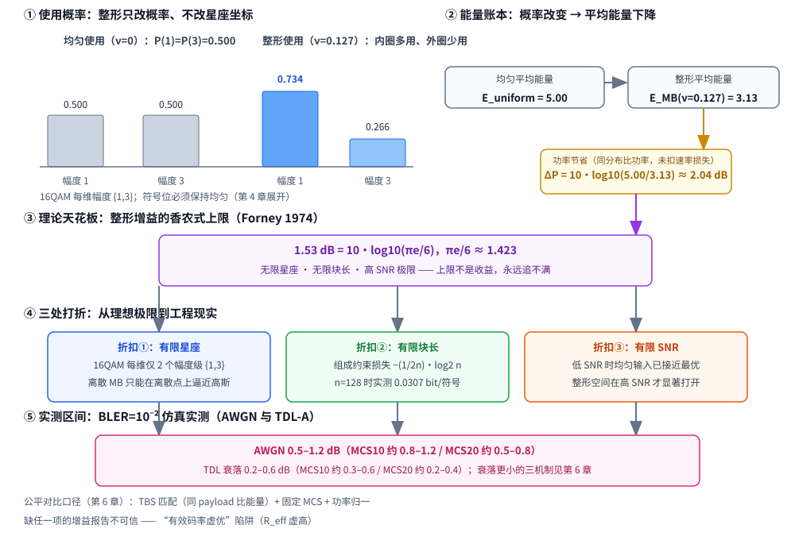

# T13.1 概率整形总览：整形增益的来源与边界

## 本节学习目标

M12 系列（[[T12.1_mimo_receiver_chain_overview|T12.1]]–[[T12.5_channel_estimation_llr_reliability|T12.5]]）讲完了多天线接收：检测器把每 RE（资源元素，Resource Element）的矩阵模型拆成层符号估计，软解调把符号变成一维 LLR（对数似然比，Log-Likelihood Ratio）送给译码器。整条链路有一个从未被质疑的前提：**每个星座点被等概率使用**。TS 38.211 §5.1 的 QAM（正交幅度调制，Quadrature Amplitude Modulation）映射是比特到星座点的确定性查表，接收端软解调（[[T2.14_QAM_Max_Log_MAP_demapping]] 的 Max-Log-MAP）也默认星座等概率。

本节（[[T13.1_probabilistic_shaping_overview_shaping_gain|T13.1]]）是概率整形（Probabilistic Shaping, PS）算法系列的第一篇，任务是回答一个"反直觉"的问题：**等概率使用星座，在功率受限信道下其实是一种可量化的浪费**。把内圈（低能量）点多用一点、外圈（高能量）点少用一点，不改星座坐标、只改使用概率，就能省下平均发射能量——省下的分贝就是整形增益（shaping gain）。但这份增益不是白拿的：理想上限 1.53 dB（$\pi e/6$）永远追不满，实测在 AWGN（加性白高斯噪声，Additive White Gaussian Noise）下只有 0.5–1.2 dB、衰落信道下只有 0.2–0.6 dB，而且每一分贝都要用速率损失（rate loss）去换。本节把这张"增益从哪里来、边界在哪里"的地图画出来。

学完本节后，应能做到：

- 解释"均匀使用星座是功率受限信道下可量化的浪费"这句话的容量论据（高斯输入最优、离散均匀输入次优），并给出 $M$-PAM 均匀平均能量 $E_{\mathrm{uniform}}=(M^2-1)/3$。
- 说出整形增益的理论上限 1.53 dB（$\pi e/6$）的来源（球 vs 立方体、无限维极限）及其全部前提（无限星座、无限块长、高 SNR（信噪比，Signal-to-Noise Ratio）），并解释"上限不是收益"。
- 列举 1.53 dB 的三处折扣（有限星座、有限块长、有限 SNR），各配一个具体数字或数量级。
- 记住并区分两组实测区间：AWGN 0.5–1.2 dB（MCS10 约 0.8–1.2、MCS20 约 0.5–0.8）与 TDL（抽头延迟线信道模型，Tapped Delay Line）衰落 0.2–0.6 dB（MCS10 约 0.3–0.6、MCS20 约 0.2–0.4），并说出衰落信道增益更小的三机制方向（第 6 章展开）。
- 区分概率整形（PS）与几何整形（Geometric Shaping, GS）：一个改使用概率、一个改星座坐标；说明为什么 GS 标准化困难而 PS 能贴着 NR 接口工作，并引用 DVB-S2X（CCDM+MB（麦克斯韦-玻尔兹曼，Maxwell-Boltzmann））作为商用先例。
- 用"以速率买能量"的账本解释整形增益的代价：$P(1)$=0.734 时熵从 1 跌到 0.835 bit/符号，净增益 = 功率节省 − 速率损失。
- 说出"增益报告必须公平对比"的三要素（TBS（传输块大小，Transport Block Size）匹配、固定 MCS（调制与编码方案，Modulation and Coding Scheme）、功率归一），以及缺 TBS 匹配时"有效码率虚优"陷阱的大意（第 6 章展开）。

本节与既有知识库的衔接：概念笔记 [[Probabilistic_Shaping_概率整形]] 是本节的知识骨架（整形增益、rate loss、四接入点、非标准属性、公平对比前提），[[Geometric_Shaping_几何整形]] 提供 PS 的对照路线，[[MB_Distribution_MB分布]] 与 [[Distribution_Matching_分布匹配]] 在第 2、3 章展开；M12 系列的接收链路（[[T12.1_mimo_receiver_chain_overview]]）是 PS 嵌入 NR 时"解调前"接入点的宿主，第 4 章会复用这张链路图。

与持久理解的呼应：本节把持久理解 U1 讲透——均匀使用星座不是"中性默认"而是可量化的浪费，整形增益的本质是让输入分布向容量最优形状（高斯）靠拢，1.53 dB 是这条逼近路线的理想上限、永远追不满，但 AWGN 下 0.5–1.2 dB 是真实可拿的、衰落下要再打折扣；同时为持久理解 U2 做铺垫——"以速率买能量"的账本（$P(1)$=0.734 时 H=0.835<1）在本节开账，第 2 章给出 ν 旋钮的完整数学。四个核心问题 Q1–Q4 在本节全部提出（见"系列地图"一节），后续各章逐一深化、第 6 章收束。

## 前置知识检查

| 前置项 | 本节需要达到的程度 |
|:---|:---|
| [[T2.9_AWGN_noise_scaling]] AWGN 噪声缩放 | 知道 SNR 由发射功率与噪声方差定义，$\sigma^2$ 是接收机按 SNR 口径反推的；整形增益本质上是在"同功率约束下比较输入分布"。 |
| [[T2.14_QAM_Max_Log_MAP_demapping]] QAM 软解调 | 知道 Max-Log-MAP 的 LLR 公式隐含星座点等概率假设——这是"接收端默认均匀先验"的来源，第 5 章要打破它。 |
| [[T2.15_fading_channel_LLR_reliability]] 衰落信道 | 知道 $y=hx+n$、瞬时 SNR 剧烈波动；衰落让整形增益缩水的三机制之一就是 SNR 依赖（第 6 章）。 |
| [[T2.16_LLR_clipping_scaling_quantization]] LLR 量化 | 知道 LLR 分布形状决定量化范围；整形后内层符号 LLR 更集中，量化分析留到第 5 章。 |
| [[Probabilistic_Shaping_概率整形]] | 知道整形增益 1.53 dB 上限、实测 0.5–1.2/0.2–0.6 dB、rate loss、四接入点、非标准属性、公平对比前提。 |
| [[Geometric_Shaping_几何整形]] | 知道 GS 改坐标、PS 改概率，GS 需协商新星座表（触及 TS 38.211 §5.1），DVB-S2X 走 PS 路线。 |
| [[Information_Theory_信息论基础]] | 知道熵、互信息、容量；知道高斯输入达到 AWGN 容量——本节"容量浪费"论证的起点。 |
| [[Modulation_Constellations_调制星座]] | 知道 NR QAM 星座与 label 由协议固定（TS 38.211 §5.1），星座坐标不是发射端可自由改动的。 |
| [[T12.1_mimo_receiver_chain_overview]] MIMO（多输入多输出，Multiple-Input Multiple-Output）接收链路 | 知道"解调前"是接收链路的一个环节（检测器输出 → 软解调 → LLR）；PS 的第 4 个接入点挂在它前面。 |

如果这些前置还不稳，先抓住一句话：**本节回答"同样功率、同样星座，为什么均匀使用是浪费，改使用概率能省多少、省下来的边界在哪里"**。前置知识里所有关于"星座等概率"的默认假设，正是本节要审问的对象。

## 均匀星座的容量浪费

### 容量视角：高斯输入才是最优的

考虑实 AWGN 信道 $Y=X+N$，$N\sim\mathcal{N}(0,\sigma^2)$，平均功率约束 $\mathbb{E}[X^2]\le P$。香农信道容量为

$$
C=\frac{1}{2}\log_2\left(1+\frac{P}{\sigma^2}\right)\quad[\text{bit/维}]
\tag{1}
$$

式 (1) 回答的问题是：这个功率受限信道每维最多可靠传多少比特。达到式 (1) 的输入分布是**高斯分布** $X\sim\mathcal{N}(0,P)$——不是均匀分布，也不是任何离散分布。

但物理系统只能用离散星座。LTE/NR 的 16QAM/64QAM/256QAM 以**等概率**使用每个星座点：$M$-PAM（每维 $M$ 个点，幅度 $\{\pm1,\pm3,\ldots,\pm(M-1)\}$）的平均能量为

$$
E_{\mathrm{uniform}}=\frac{1}{M}\sum_{a\in\mathcal{A}}a^2=\frac{M^2-1}{3}
\tag{2}
$$

式 (2) 的数值：16QAM 每维是 4-PAM（$\{\pm1,\pm3\}$），$E_{\mathrm{uniform}}=(16-1)/3=5$；64QAM 每维是 8-PAM，$E_{\mathrm{uniform}}=21$；256QAM 每维 16-PAM，$E_{\mathrm{uniform}}=85$。这些数字记住一组就够：**均匀 16QAM 每维平均能量是 5**——第 5 节的能量账本从这里起算。

现在关键问题来了：固定星座 $\mathcal{A}$，最大互信息是

$$
I(X;Y)=\max_{P_X} I(X;Y),\qquad X\in\mathcal{A}
\tag{3}
$$

式 (3) 的最优输入分布**不是均匀分布**，而是（近）高斯型分布——内圈点概率大、外圈点概率小。均匀输入与最优输入之间的互信息差，就是"概率整形可回收的容量"；这个差距在**高阶调制（大 $M$）+ 高 SNR** 时最大（PS01 §1.1：256QAM 在高 SNR 下的整形空间远大于 16QAM）。

### 这份浪费的回收路径

概率整形（Probabilistic Shaping, PS）是改变星座点**使用概率**的发射端技术：不改星座坐标（坐标由 TS 38.211 §5.1 固定），只让内圈（低能量）点多用、外圈（高能量）点少用，从而降低平均能量。省下的平均能量折算成分贝，就是整形增益（shaping gain）的来源（[[Probabilistic_Shaping_概率整形]]）。

一个直观类比：平时出门远近路线各半（均匀使用），平均耗能高；改成"近路多走、远路少走"（整形使用），平均耗能下降——但少看了远路的风景（信息量下降，rate loss）。调整幅度要按"省多少油 vs 少看多少风景"折中，这个折中的旋钮叫 $\nu$（第 2 章的 MB 分布），本节的账本开张先只讲比例。

一个常见误解是"PS 改变了星座坐标"：没有。星座坐标是协议的（TS 38.211 §5.1 固定），PS 只改使用概率——这正是它能贴着标准接口工作的原因（[[Modulation_Constellations_调制星座]]）。第 6 节（PS vs GS）会看到，另一条"改坐标"的路线（几何整形）恰恰因为动坐标而进不了标准。

本节的常见误解集中收编（与 [[Probabilistic_Shaping_概率整形]] 的概念笔记一致）：

| 误解 | 正确理解 |
|:---|:---|
| PS 改变星座坐标 | 坐标由 TS 38.211 §5.1 固定，PS 只改使用概率 |
| ν 是 MCS 表/RRC（无线资源控制，Radio Resource Control）字段 | ν 是算法参数，标准表没有也不会有 |
| 整形增益 1.53 dB 是实际收益 | 是无限极限；实测 AWGN 0.5–1.2 dB、衰落更低 |
| 内圈点越多越好 | 概率越偏 rate loss 越大，有最优 ν |
| PS 是 3GPP Rel-19 特性 | Rel-19 全套 TS 无 shaping 内容，PS 是 6G 候选 |
| PS 要改标准编码链路 | 只改 4 个接入点，NR 编码/OFDM（正交频分复用，Orthogonal Frequency Division Multiplexing）/检测器全复用——标准接口不动 |

其中"内圈点越多越好"会在第 8 节用账本正式驳倒，"只改 4 个接入点"是第 4 章的主题，其余各行本节已逐条给出证据。

## 1.53 dB 上限与 πe/6

### 球与立方体：高维空间的整形直觉

均匀使用 $M$-PAM 张成的乘积星座，在 $n$ 维信号空间里铺成一个"立方体"。而能量受限的最优信号集合是"球"——让两种集合的点数相同、比较它们各自的平均功率，就得到整形增益的几何上限（Forney 1974；推导详见 PS01 §7.1 式 (24)）。推导分四步：

1. **立方体的功率**：$n$ 维立方体边长为 $M$（每维 $M$-PAM），每维功率 $P_{\mathrm{cube}}=M^2/12$（$\{1,3,\ldots,M-1\}$ 均匀分布的方差，与式 (2) 同一口径的方差版本）。
2. **球的体积**：半径为 $r_n$ 的 $n$ 维球包含约 $\frac{\pi^{n/2}}{\Gamma(n/2+1)}r_n^n$ 个格点（$V_n=\pi^{n/2}/\Gamma(n/2+1)$ 是 $n$ 维单位球体积，$\Gamma$ 是伽马函数），令其等于 $M^n$ 得 $r_n^2\propto M^{2/n}$——点数相同时，球半径随维数增长得极慢。
3. **球的功率**：球内均匀分布的每维功率 $P_{\mathrm{sphere}}=r_n^2/(n+2)$（$n$ 维球内均匀分布的二阶矩）。
4. **取极限**：两者每维功率之比在 $n\to\infty$ 时趋于 $\pi e/6$（有限 $n$ 的修正项是 $O(n^{-1})$）：

$$
\lim_{n\to\infty}\frac{P_{\mathrm{cube}}}{P_{\mathrm{sphere}}}
=\lim_{n\to\infty}\frac{\pi e}{6}\left(1+O(n^{-1})\right)
=\frac{\pi e}{6}\approx 1.4233
\quad\Rightarrow\quad
10\log_{10}\frac{\pi e}{6}\approx 1.53\ \text{dB}
\tag{4}
$$

式 (4) 回答的问题是：理想整形（球）相对均匀使用（立方体）最多省多少功率。答案与 $M$ 无关（高 SNR 极限意义下），因此被称为"整形增益的香农式上限"。注意口径：1.53 dB 是**二维**（一个 QAM 符号 = 实部 + 虚部两维），每维折合 $10\log_{10}\sqrt{\pi e/6}\approx 0.765$ dB。

高维空间的直觉：维数越高，球的体积越集中在表面附近，同点数下球比立方体"胖"得少、占体积小，格点间距更宽——同样的点数、更低的平均功率。这就是整形增益的几何来源。

### 上限不是收益

**如实说明**：1.53 dB 是理想整形的理论上界（无限长块、连续星座、无限 SNR 极限），**不是**任何具体 PS 方案能直接拿到的增益（PS01 §1.3）。三个前提缺一不可：

1. **无限星座**：幅度级数无穷多，MB 分布才能连续化逼近高斯；
2. **无限块长**：组成约束（composition constraint）没有代价；
3. **高 SNR**：整形空间在高 SNR 才完全打开。

下一节的三处折扣，就是这三个前提被逐个拿掉后增益的缩水过程。[[Probabilistic_Shaping_概率整形]] 的"常见误解"表里把"1.53 dB 是实际收益"列为第一梯队误解——本节之后它应该变成常识性错误。

## 三折扣：从理想极限到工程现实

### 折扣(1)：有限星座

16QAM 每维只有 2 个幅度级 $\{1,3\}$，MB 分布只能在这两个离散点上逼近高斯；64QAM 有 4 个幅度级 $\{1,3,5,7\}$，逼近精度更高，但整形空间仍然有限。离散化的结果是：整形增益达不到连续极限。注意这里的另一面：高阶星座幅度级多，但同速率下被整形的比特占比不同（每符号 Qm（调制阶数，Modulation Order）比特里只有 k 个幅度 bit 整形、其余 unshaped），第 5 节的内嵌验证会看到 16QAM 反而给出最大的单配置功率节省（2.04 dB）——因为它整形比例最高、速率损失也最重。

### 折扣(2)：有限块长

真实系统把 bit 流切成有限长的块（本系列第 3 章 ESS（枚举球面整形，Enumerative Sphere Shaping）的块长 n=128 量级），每个块必须取"组成"固定的序列集合（能量受限球内的格点）。块越短，可枚举的组成越少，速率损失越大：组成约束损失的渐近式为

$$
L_{\mathrm{comp}}\sim\frac{1}{2n}\log_2 n\quad[\text{bit/符号}]
\tag{5}
$$

式 (5) 的数量级对照实测：n=128 时损失约 0.0307 bit/符号、n=116 时 0.0423、n=104 时 0.0469（PS01 §9.3 实测记录，第 3 章复现）。块长减四分之一，损失涨一半——这就是持久理解 U3 说的"有限块长不是工程实现的小缺陷，而是整形代价的固有组成部分"。第 3 章的分块与残差块合并规则（$n_{\max}+n_{\mathrm{last}}$ 偶数）本质都是在"凑长块"逼近熵。

### 折扣(3)：有限 SNR

整形增益在高 SNR 才显著：式 (4) 的 $\Delta P$ 随目标速率升高而增大，低速率/低 SNR 时最优输入本就接近低阶/二值，整形空间小。衰落信道下瞬时 SNR 剧烈波动，深衰落区间（低 SNR）贡献的速率权重高，而这些区间的整形增益趋近于 0——平均后总增益被稀释。这是第 6 章"衰落三机制"的第一条，另外两条（信道随机化 $I(X;hX+N)=\mathbb{E}_h[\cdot]$ 的高斯化效应、$\tilde\nu$ 正则补偿不完美）也将在第 6 章展开。

三处折扣的落点可以一句话串起来：**有限星座决定了"向高斯靠拢"的离散精度，有限块长决定了"每符号熵"的达成度，有限 SNR 决定了"整形空间"实际打开多少**——三者相乘，就是实测区间。

## 实测区间：AWGN 与 TDL

### 实测数值

本系列引用的实测数据来自仿真器复现（PS01 §7.2，analysis 04 的 BLER（块错误率，Block Error Rate）=10⁻² 仿真）：

| 场景 | 增益 @ BLER=10⁻² |
|:---|:---|
| AWGN，MCS10（64QAM+PS） | 约 0.8–1.2 dB |
| AWGN，MCS20（256QAM+PS） | 约 0.5–0.8 dB |
| TDL-A，MCS10 | 约 0.3–0.6 dB |
| TDL-A，MCS20 | 约 0.2–0.4 dB |

汇总口径：**AWGN 0.5–1.2 dB、TDL 衰落 0.2–0.6 dB**。注意同一信道下 MCS 越低增益越高（MCS10 的 64QAM 整形比例高于 MCS20 的 256QAM）：整形增益不是调制阶数的单调函数，而是"整形比特占比 × 速率损失"两个方向博弈的结果——这与第 8 节账本的口径一致。参考换算：1 dB @ 3.5 GHz 约等于 20–25% 覆盖半径增益——AWGN 场景下整形增益的 ROI 显著为正（第 6 章核算硬件账：+55% gates、+45% SRAM（静态随机存取存储器，Static Random-Access Memory）换 0.5–1.2 dB）。

还有一个必须声明的口径：这些数字是 BLER=10⁻² 的工作点增益，不是平均 SNR 增益，也不是吞吐增益。BLER 工作点越低（要求越可靠），可观察到的增益越小——高可靠区间里信道编码本身的冗余已经吃掉了一部分整形空间。报告或论文里如果只写"增益 X dB"而不给 BLER 工作点，同样属于不可信报告（第 6 章的审计清单要素）。

### 衰落信道增益更小的机制（预告）

三点机制（第 6 章完整展开）：(1)增益-SNR 依赖（深衰落低 SNR 区间增益趋零）；(2)信道随机化（$I(X;hX+N)=\mathbb{E}_h[I(X;hX+N\mid h)]$ 对输入分布敏感度下降，均匀与 MB 的可达速率差被"平均"压缩）；(3)工程补偿不完美（接收端用 $\tilde\nu=\nu\cdot\frac{2}{3}(2^{Q_m}-1)$ 正则化注入先验缓解，但补偿不完美时部分增益被吃掉，见 [[LLR_Prior_LLR先验]]）。

### 公平对比前提

任何增益报告必须满足三要素才可信：**TBS 匹配**（同 payload 比能量，不是同符号数比）、**固定 MCS**、**功率归一**。缺 TBS 匹配的典型陷阱是"有效码率虚优"：PS 的熵下降使有效码率 $R_{\mathrm{eff}}=\text{payload}/\text{TBS}$（完整定义见第 6 章式 (1)：$R_{\mathrm{eff}}=\text{payloadTBS}/(N_{\mathrm{RE}}\cdot Q_m)$）从标称码率掉下来（实测 MCS10 的 PS 表有效频谱效率 2.5704 vs 标称 4.5），不匹配 TBS 就把速率损失藏进了吞吐对比——第 6 章给出数值演示与审计清单。本节先立原则：**看到没写 TBS 匹配的增益数字，默认不可信**。

图 1 把本节整条链画成一张流向图：使用概率（均匀 vs 整形）→ 能量账本（5.00→3.13→2.04 dB）→ 理论天花板（1.53 dB）→ 三折扣 → 实测区间。



## 内嵌验证：功率节省量级与实测区间对照

『1.53 dB 上限与 πe/6』节说了 1.53 dB 是上限、『实测区间：AWGN 与 TDL』节给了实测区间，但"功率节省 2.04 dB 从哪来"还没落地。本节用 numpy 把能量账本算出来：对四个配置（16QAM/64QAM/256QAM/1024QAM（1024 阶正交幅度调制，1024 Quadrature Amplitude Modulation）），按 MB 分布 $P(a)\propto e^{-\nu a^2}$ 计算整形后的平均能量 $E_{\mathrm{MB}}$，再与均匀平均能量 $E_{\mathrm{uniform}}$ 对比。四个配置的 $\nu$ 与"未整形幅度位数 u"取自 PS01 §7.1 表（未整形幅度位的能量按递推 $E\leftarrow 4E+1$ 并入）。

先交代两个口径，避免数值对不上：

- 每维 PAM 点数 $M=2^{Q_m/2}$（16QAM 的 $Q_m=4$ → $M=4$），$E_{\mathrm{uniform}}=(M^2-1)/3$；
- 整形幅度级为 $\{1,3,\ldots,2^{k+1}-1\}$（k 个整形幅度位），MB 概率 $P(a)=e^{-\nu a^2}/Z$；有 u 个未整形幅度位时整体能量做 u 次 $E\leftarrow 4E+1$。

验证代码（与 PS01 §7.1 表逐行核对，断言容差 ±0.01 dB；注意 256QAM 一行在全精度下输出 1.72 dB（1.7150），素材表把 $E_{\mathrm{MB}}$ 截成 57.27 后得 1.71——同一数值的舍入差异，容差覆盖）：

```python
import numpy as np

def mb_energy(alphabet, nu):
    """MB 分布下幅度集合的平均能量 E_MB = sum(a^2 * P(a))。"""
    a = np.asarray(alphabet, dtype=float)
    w = np.exp(-nu * a**2)
    p = w / w.sum()
    return float(np.sum(p * a**2)), p

def full_energy(e_shaped, unshaped_bits):
    """未整形幅度位的能量递推 E <- 4E + 1，共 unshaped_bits 次。"""
    e = e_shaped
    for _ in range(unshaped_bits):
        e = 4.0 * e + 1.0
    return e

# (配置, Qm 每符号比特数, 整形幅度位数 k, nu, 未整形幅度位数 u) —— PS01 §7.1 表
configs = [
    ("16QAM",   4, 1, 0.1270, 0),
    ("64QAM",   6, 1, 0.0586, 1),
    ("256QAM",  8, 2, 0.0239, 1),
    ("1024QAM", 10, 2, 0.0084, 2),
]

# 理论上限 1.53 dB（Forney 1974：球形集合 vs 立方体集合）
gs = np.pi * np.e / 6.0
print(f"理想整形上限: pi*e/6 = {gs:.4f}  ->  10*log10 = {10*np.log10(gs):.2f} dB")
print(f"{'配置':<10}{'E_uniform':>10}{'E_MB':>10}{'功率节省(dB)':>12}   实测区间(BLER=10^-2)")
for name, qm, k, nu, u in configs:
    alphabet = np.arange(1, 2**(k+1), 2, dtype=float)     # 整形幅度级 {1,3,...,2^(k+1)-1}
    e_shaped, _ = mb_energy(alphabet, nu)
    e_mb  = full_energy(e_shaped, u)
    m     = int(2 ** (qm / 2))                            # 每维 PAM 点数
    e_uni = (m*m - 1) / 3.0                               # M-PAM 均匀平均能量
    dp    = 10 * np.log10(e_uni / e_mb)
    print(f"{name:<10}{e_uni:>10.2f}{e_mb:>10.2f}{dp:>12.2f}   AWGN 0.5-1.2 / TDL 0.2-0.6")

# 16QAM nu=0.127 的熵（每整形符号 bit）：P(1)=0.734 -> H=0.835 < 1
_, p16 = mb_energy(np.array([1.0, 3.0]), 0.127)
H = -np.sum(p16 * np.log2(p16))
print(f"\n16QAM nu=0.127: P(1)={p16[0]:.3f}  P(3)={p16[1]:.3f}  H={H:.3f} bit/符号 (均匀时为 1.000)")

# 断言：与 PS01 §7.1 逐行核对（功率节省 ±0.01 dB）
expect = {"16QAM": 2.04, "64QAM": 0.84, "256QAM": 1.71, "1024QAM": 0.59}
for name, qm, k, nu, u in configs:
    alphabet = np.arange(1, 2**(k+1), 2, dtype=float)
    e_mb = full_energy(mb_energy(alphabet, nu)[0], u)
    m = int(2 ** (qm / 2))
    dp = 10 * np.log10(((m*m - 1) / 3.0) / e_mb)
    assert abs(dp - expect[name]) < 0.01, (name, dp)
assert abs(H - 0.835) < 0.001 and abs(p16[0] - 0.734) < 0.001
assert abs(10*np.log10(gs) - 1.53) < 0.01
print("断言全部通过：功率节省 2.04/0.84/1.71/0.59 dB、H=0.835、上限 1.53 dB ✓")
```

真实运行输出（断言全部通过）：

```text
理想整形上限: pi*e/6 = 1.4233  ->  10*log10 = 1.53 dB
配置         E_uniform      E_MB    功率节省(dB)   实测区间(BLER=10^-2)
16QAM           5.00      3.13        2.04   AWGN 0.5-1.2 / TDL 0.2-0.6
64QAM          21.00     17.32        0.84   AWGN 0.5-1.2 / TDL 0.2-0.6
256QAM         85.00     57.27        1.72   AWGN 0.5-1.2 / TDL 0.2-0.6
1024QAM       341.00    297.77        0.59   AWGN 0.5-1.2 / TDL 0.2-0.6

16QAM nu=0.127: P(1)=0.734  P(3)=0.266  H=0.835 bit/符号 (均匀时为 1.000)
断言全部通过：功率节省 2.04/0.84/1.71/0.59 dB、H=0.835、上限 1.53 dB ✓
```

两组读法（教学要点）：

1. **功率节省量级**：四个配置的原始功率节省 0.59–2.04 dB，与实测 AWGN 区间 0.5–1.2 dB 同量级、但整体偏高——因为这是"同分布比功率"的上界口径，**还没有扣速率损失**。扣掉速率损失（熵从 1 跌到 0.835 等）后，净增益就落进 0.5–1.2 dB 的实测区间（PS01 §7.1 的换算说明）。
2. **账本开张**：16QAM ν=0.127 时 $P(1)$=0.734、$P(3)$=0.266，熵只有 0.835 bit/符号，小于均匀时的 1.000——**省下的 2.04 dB 是用每符号 0.165 bit 的信息率换来的**。这就是"以速率买能量"账本的第一行，第 8 节展开账本结构，第 2 章给出 ν 旋钮的完整数学。

## PS vs GS：两条逼近高斯的路线

逼近高斯输入分布有两条路线：改使用概率（概率整形，PS）或改星座坐标（几何整形，Geometric Shaping，GS）。[[Geometric_Shaping_几何整形]] 给出的对照表（与 PS01 §1.2 一致）：

| 维度 | 概率整形（PS） | 几何整形（GS） |
|:---|:---|:---|
| 星座点位置 | 固定（标准 QAM 网格，TS 38.211 §5.1） | 移动（同心圆、非均匀间距） |
| 使用概率 | 非均匀（MB 分布） | 均匀 |
| 实现位置 | 调制映射前：bit 流 → 符号流（distribution matcher） | 调制映射本身（星座定义） |
| 与协议兼容性 | 星座不变，可"外包"给任意调制 | 星座变了，需要 TX/RX 协商新星座表 + 修改解调参考 |
| 典型增益 | 0.5–1.2 dB（AWGN 实测） | 结构上类似，但标准化困难 |
| 主要代价 | 码率损失（整形 bit 的冗余）、编解码器延迟 | 星座点最小距离改变、峰均比变化 |

关键点：**PS 不改变星座几何，只改变符号的使用频率**，因此可以叠加在 NR 的 QAM 链路上，接收端只需在解调/均衡时知道发送概率（先验）即可——这是 3GPP 体系下 PS 被认为"最可工程化"的原因（PS01 §1.2）。

直观模型（[[Geometric_Shaping_几何整形]]）："改走法 vs 改路"。PS 是改变出行习惯——近路多走、远路少走，路网（星座坐标）不变；GS 是重新修路——改地图（星座形状）。修路要所有司机（TX/RX）都换新地图（协商新星座表 + 改解调参考），而改习惯只需约定各条路的走法频率（使用概率）。换地图的成本远高于改习惯，所以先落地的是 PS。

常见误解：

| 误解 | 正确理解 |
|:---|:---|
| GS 和 PS 是同类技术 | 一个改坐标、一个改概率——硬件与标准影响完全不同 |
| GS 一定比 PS 好 | 无标准支撑、协商成本高；PS 已获得大部分整形增益且兼容现有链路 |
| 星座是发射端自由决定的 | TS 38.211 §5.1 固定星座与 label——改动即标准变更 |

## DVB-S2X 先例与 3GPP 现状

### 商用先例：DVB-S2X 走的是 PS 路线

业界已商用的 PS 标准参考是 **DVB-S2X**（ETSI EN 302 307-2）：采用 CCDM（恒定成分分布匹配，Constant Composition Distribution Matcher）+ MB 分布（Maxwell-Boltzmann）——**走的是 PS 路线而非 GS**（[[Geometric_Shaping_几何整形]]；PS01 §1.4）。CCDM 是"分布匹配"家族的一员（本系列第 3 章的 ESS 是其枚举式变体，[[Distribution_Matching_分布匹配]] 与 [[ESS_枚举球面整形]] 有各自的概念笔记）；MB 分布正是第 2 章的主题（[[MB_Distribution_MB分布]]）。以太网 PAM-4 研究、G.hn/G.fast 讨论同样在 3GPP 体系之外。

### 3GPP 现状：grep 实证与 6G 候选

对本地 Rel-19 全套 TS 语料全量检索（`shap`、`geometric shaping`、`constellation shaping`、`distribution matching`、`maxwell` 等），**未发现任何概率整形/几何整形/分布匹配内容**（PS01 §1.4 的 grep 实证）；命中的 `shap` 全是 `offsetToPointA` 之类的参数名碎片。TS 38.211 §5.1 的 QAM 映射是比特到星座点的确定性查表，不含任何非均匀使用概率的概念。因此如实结论：**PS 全部环节不在 3GPP 标准中，是 6G 候选技术；它只贴标准接口（QAM label、加扰、MCS/TBS）工作**（[[Probabilistic_Shaping_概率整形]] 的"非标准属性"）。这正是第 4 章"四个接入点"架构的地基：不改标准链路，只在四处做替换。

## 以速率买能量：熵-功率账本的开场

第 5 节的内嵌验证已经把账本的第一行写出来了：16QAM ν=0.127 时 $P(1)$=0.734、熵 H=0.835 bit/符号 < 1。这一节把账本结构讲清楚，第 2 章给全部数学。

设幅度集合 $\{1,3\}$（16QAM 每维），均匀时熵恰为 1.000 bit/符号。整形后：

$$
H(\nu)=-\sum_{a}P_\nu(a)\log_2 P_\nu(a)
\tag{6}
$$

式 (6) 在 ν=0.127 处取 0.835——**每符号信息率损失 0.165 bit**。同时平均能量从 5.00 降到 3.13，功率节省 $\Delta P=10\log_{10}(5.00/3.13)\approx2.04$ dB。把这两列并排，就是"以速率买能量"的账本：

| 列 | 均匀（ν=0） | 整形（ν=0.127） | 变化 |
|:---|:---|:---|:---|
| 使用概率 $P(1)$/$P(3)$ | 0.500 / 0.500 | 0.734 / 0.266 | 内圈多用 |
| 平均能量 E | 5.00 | 3.13 | −2.04 dB |
| 熵 H [bit/符号] | 1.000 | 0.835 | −0.165 bit/符号 |

更一般地，固定目标码率 R（bit/维）时，MB 分布相对均匀分布的功率节省为（PS01 §7.1 式 (25)）：

$$
\Delta P_{\mathrm{shaping}}(R)=10\log_{10}\frac{E_{\mathrm{uniform}}}{E_{\mathrm{MB}}(\nu(R))}
\quad[\text{dB}]
\tag{7}
$$

其中 $\nu(R)$ 由熵方程 $H_\nu=2R-1$（每维）隐式确定。式 (7) 回答的问题是：**给定码率，整形最多省多少功率**——ν 不是越大越好，而是目标码率在熵-功率曲线上的一个取点。

"越偏越省"的直觉之所以错（[[Probabilistic_Shaping_概率整形]] 的"常见误解"表），是因为它只看了能量那一列：ν 增大，能量单调降、熵也单调降（第 2 章会证明 $dH/d\nu=-\nu\cdot\mathrm{Var}(A^2)\le 0$——整形增益与速率损失同源同消）。**不存在免费的整形**。第 2 章（MB 分布与熵-功率权衡）给出 ν 旋钮的完整数学。

账本在系统里还有第三条腿，本节只预告、第 6 章算账：**TBS 匹配闭环**。发射端以目标码率反解 ν（式 (7) 的 $\nu(R)$），整形后每符号熵下降，同一 TBS 的符号数就要增加——调度器必须按整形后的有效码率重新匹配 TBS，否则"同 TBS 比 SNR"的对比就把速率损失藏掉了（R_eff 虚优陷阱，见『公平对比前提』节）。所以账本的三列是：能量列（省多少 dB）、熵列（花多少 bit）、调度列（TBS 怎么匹配）——三列一起看，才是"以速率买能量"的完整交易。

## 系列地图：M13 六章预览

本节是 M13 概率整形系列的第一篇。六章分工与承载的持久理解：

| 章 | 主题 | 承载理解 | 关键内容 |
|:---|:---|:---|:---|
| 第 1 章（本节） | 整形增益的来源与边界 | U1 讲透、U2 铺垫 | 均匀星座的浪费、1.53 dB（πe/6）、三折扣、实测区间、PS vs GS、DVB-S2X、以速率买能量账本开张 |
| 第 2 章 | MB 分布与熵-功率权衡 | U2 讲透 | $P(a)=e^{-\nu a^2}/Z$ 拉格朗日对偶解、ν 旋钮、$dH/d\nu\le0$、{1,3} 数值表 |
| 第 3 章 | ESS 枚举球面整形 | U3、U4 | rank↔sequence 可逆枚举、DP 计数表、区间切割、有限块长 0.0307/0.0423/0.0469、残差块合并 |
| 第 4 章 | PS 嵌入 NR：四接入点与比特组织 | U5、U7 | SBPM（整形比特位置映射，Shaped Bit Position Mapping）、shaped mask、选择性加扰、parity-as-sign、四个接入点 |
| 第 5 章 | PS 接收机：LLR 先验与感知解调 | U6 讲透 | 均匀先验的系统性偏差、$P(s)$ 进 MAP（最大后验概率，Maximum A Posteriori）、$\tilde\nu$ 正则、完整平方 MAP |
| 第 6 章 | TBS 匹配与系统代价：ROI 核算 | U8 讲透、U1 深化、U7 收束 | 公平对比四要素、R_eff 虚优、硬件三本账、衰落三机制、表现性任务 |

四个核心问题的落点（第 1 章提出 → 各章深化 → 第 6 章收束）：

| 核心问题 | 提出（本节） | 深化 | 收束 |
|:---|:---|:---|:---|
| Q1 使用概率为何值得成为第三个自由度、功率是否白拿 | "均匀使用是浪费、增益有边界" | 第 2 章熵-功率账本、第 3 章块长代价 | 第 6 章 ROI |
| Q2 接收端需要"知道"多少、不感知会怎样 | "感知整形不是可选项"（第 6 节先验提示） | 第 5 章 LLR 先验 | 第 6 章公平对比 |
| Q3 为什么只改四处就能嵌入标准链路 | "贴标准接口工作、不改坐标" | 第 4 章四接入点 | 第 6 章边界收束 |
| Q4 每分贝增益花多少钱、什么场景值得 | "以速率买能量"账本开张 | 第 2/3/5 章 | 第 6 章三本账 |

与 M12 系列的衔接：PS 的接收端不是新链路——第 4 章的"解调前"接入点挂在 [[T12.1_mimo_receiver_chain_overview]] 的检测器与软解调之间，[[T12.3_linear_detectors_mf_zf_mmse]] 的 MMSE（最小均方误差，Minimum Mean Square Error）在第 5 章被扩展成带先验正则的版本（$\mathbf{R}_{hh}=\mathbf{G}^H\mathbf{G}+\tilde\nu\sigma^2\mathbf{I}$）；软解调则是 [[T2.14_QAM_Max_Log_MAP_demapping]] 的等概率假设被打破后的扩展。M12 系列练的是"矩阵模型与检测"，M13 系列练的是"符号统计与边界"——两条线在 LLR 处汇合。

## 示范例题

### 例 1（记忆）：列举 1.53 dB 的三处折扣与实测区间

**题目**：概率整形增益的理想上限是 1.53 dB。请列举"从理想上限到实测值"的三处折扣，并写出 AWGN 与 TDL 衰落两类信道下的实测区间。

**解答**：

三处折扣：

1. **有限星座**：16QAM 每维只有 2 个幅度级 {1,3}，MB 分布只能在离散点上逼近高斯，达不到连续星座的整形空间；
2. **有限块长**：组成约束损失 ~(1/2n)·log₂n，块越短损失越大（n=128 实测 0.0307 bit/符号，n=104 涨到 0.0469）；
3. **有限 SNR**：整形增益在高 SNR 才显著，低 SNR 时均匀输入已接近最优，整形空间打不开。

实测区间（BLER=10⁻² 仿真口径）：**AWGN 0.5–1.2 dB**（MCS10 约 0.8–1.2、MCS20 约 0.5–0.8）；**TDL 衰落 0.2–0.6 dB**（MCS10 约 0.3–0.6、MCS20 约 0.2–0.4）。

**点评**：这道题的考点不是背数字，而是建立"上限 → 折扣 → 实测"的三层结构：1.53 dB 回答"理想整形最多省多少"，三折扣回答"为什么拿不满"，实测区间回答"真实能拿多少"。

### 例 2（理解）：论证"内圈点越多越好"的错误

**题目**：有人说："整形增益来自内圈点被多用，那把 ν 调大、让内圈点用得更多，增益不是越来越大吗？"请论证这个说法错在哪里。

**解答**：这个说法只看了能量一列账。ν 增大确实让内圈（低能量）点概率更大、平均能量更低——但这同时让分布更"偏"，每符号熵 H 更低（ν=0.127 时 H=0.835 < 1，ν 再大会更低），即速率损失更大。整形增益的"净收益"是功率节省减去速率损失的换算结果：ΔP 只回答"同分布比功率"省了多少，没回答"省下的每一分贝花了几 bit 速率"。用账本语言：ν 越大，"以速率买能量"的单价越贵，超过某个折中点后净增益反而下降。**不存在免费的整形**：最优 ν 是目标码率下熵-功率权衡的取点（式 (7) 的 $\nu(R)$），不是越大越好。反例锚点：如果 ν→∞，能量趋近最小幅度、增益趋近 7 dB（16QAM 口径 10log₁₀(5/1)），但熵趋近 0——整条链路的信息率趋近 0，这样的"增益"没有意义。

**点评**：这道题要求把"增益"拆成两个正交的量（功率 vs 熵）再合起来看，是本章"以速率买能量"账本的核心思维。

## 引导练习

### 练习 1（理解）：判断正误——GS 的叠加性

**题目**：判断正误并说明理由："几何整形（GS）可以像概率整形一样直接叠加在 NR QAM 链路上，因为两者都只是发射端行为，不需要任何标准改动。"

**提示**：回顾 PS 与 GS 各自动了什么：PS 动的是使用概率（星座坐标不变，贴 TS 38.211 §5.1 接口工作），GS 动的是星座坐标本身。再想"星座定义在标准里属于哪一节、谁负责协商"。

**参考答案**：错误。GS 改变星座点位置，而星座与 label 由 TS 38.211 §5.1 固定——改动即标准变更：TX/RX 双方需要协商新星座表、接收端解调参考（解调器/均衡器的星座假设）也要同步修改，属于触及标准流程的大改动。PS 只改使用概率，星座坐标不变，可以"外包"给任意标准调制，接收端只需知道发送概率先验。所以"两者都只是发射端行为、不需标准改动"不成立：PS 贴接口、GS 动接口。

### 练习 2（理解）：概括 rate loss 账本

**题目**：已知 16QAM、ν=0.127 时 $P(1)$=0.734、$P(3)$=0.266、H=0.835 bit/符号、平均能量 3.13（均匀时为 5.00）。请用这三组数字概括"以速率买能量"账本的结构，并说明为什么 2.04 dB 不能直接当作净增益。

**提示**：账本两列——能量列从 5.00 到 3.13（省 2.04 dB），熵列从 1.000 到 0.835（每符号少 0.165 bit）。净增益要把速率损失的换算从功率节省里扣掉。

**参考答案**：账本分两列：能量列（5.00 → 3.13，节省 10log₁₀(5.00/3.13)≈2.04 dB）与熵列（1.000 → 0.835 bit/符号，损失 0.165 bit/符号）。2.04 dB 是"同分布比功率"的口径——比较的是同一个符号分布下两种功率定义，没有扣除熵下降带来的速率损失；扣除后净增益落入 AWGN 实测区间 0.5–1.2 dB。账本的含义：**每 1 dB 功率节省都有精确的熵代价**，ν 不是越大越好，而是目标码率在熵-功率曲线上的一个取点（式 (7)）。

## 独立习题

### 习 1（记忆）：列举三折扣

**题目**：列举 1.53 dB 整形增益上限的三处折扣，每处用一句话说明机理，并给其中一个具体数字或数量级。

**参考答案**：(1)有限星座——幅度级数有限（16QAM 每维仅 {1,3}），离散 MB 只能在离散点上逼近高斯；(2)有限块长——组成约束损失 ~(1/2n)·log₂n，n=128 时实测约 0.0307 bit/符号（n=104 时 0.0469）；(3)有限 SNR——整形增益在高 SNR 才显著，低 SNR 时均匀输入已接近最优，衰落深区间贡献的整形增益趋近 0。

### 习 2（理解）：判断正误——"1.53 dB 实际可拿"

**题目**：判断正误并说明理由："既然 16QAM 整形后功率节省达到 2.04 dB，超过了 1.53 dB 上限，说明 1.53 dB 是可以突破的，实际收益只会更多。"

**参考答案**：错误，两层原因。其一，1.53 dB 是**理想整形**（无限星座、无限块长、高 SNR 极限）在**同速率**口径下的香农式上限，实测 AWGN 0.5–1.2 dB、TDL 0.2–0.6 dB，从未达到上限；其二，2.04 dB 是**同分布比功率**的原始节省，没有扣除速率损失——ν=0.127 时熵已从 1.000 跌到 0.835 bit/符号，扣掉速率损失的换算后净增益落入 0.5–1.2 dB 区间。"2.04 > 1.53"不构成突破，因为两个数用的是不同口径（一个含速率损失、一个不含），把账本两列合并后上限仍然成立。

### 习 3（应用，numpy）：复现 ΔP≈2.04 dB 的能量账本

**题目**：用 numpy 计算 16QAM（每维幅度 {1,3}）、ν=0.127 的 MB 分布：(1)写出 $P(1)$、$P(3)$ 与熵 H；(2)计算功率节省 ΔP=10log₁₀(E_uniform/E_MB)，与 2.04 dB 核对；(3)把结果与 AWGN 实测区间 0.5–1.2 dB 对照，说明为什么原始节省高于实测。

**参考答案**（代码与输出；与本章"内嵌验证"同构，可对照）：

```python
import numpy as np

a = np.array([1.0, 3.0]); nu = 0.127
p = np.exp(-nu * a**2); p = p / p.sum()          # MB 分布
H = -np.sum(p * np.log2(p))                       # 熵
E_mb  = float(np.sum(p * a**2))                   # 整形平均能量
E_uni = (4**2 - 1) / 3.0                          # 4-PAM 均匀平均能量 = 5
dp = 10 * np.log10(E_uni / E_mb)
print(f"P(1)={p[0]:.3f}  P(3)={p[1]:.3f}  H={H:.3f} bit/符号")
print(f"E_uniform={E_uni:.2f}  E_MB={E_mb:.2f}  ΔP={dp:.2f} dB")
assert abs(p[0] - 0.734) < 0.001 and abs(H - 0.835) < 0.001
assert abs(dp - 2.04) < 0.01
print("与素材值核对通过")
```

```text
P(1)=0.734  P(3)=0.266  H=0.835 bit/符号
E_uniform=5.00  E_MB=3.13  ΔP=2.04 dB
与素材值核对通过
```

**说明**：2.04 dB 是"同分布比功率"的上界口径，未扣速率损失（H 从 1.000 跌到 0.835 就是代价）；净增益 = 功率节省 − 速率损失换算，落入实测 AWGN 0.5–1.2 dB。**评分要点**：$P(1)$=0.734±0.001、H=0.835±0.001、ΔP=2.04±0.01 dB，且能正确解释口径差异。

### 习 4（分析）：比较 PS 与 GS 的适用场景

**题目**：分别给出一个"PS 更适用"与一个"GS 可能更值得考虑"的场景，并说明你的判断依据（从标准兼容性、增益结构、代价三个维度分析）。

**参考答案**：PS 更适用的场景：任何受 3GPP 标准约束的蜂窝链路（PDSCH（物理下行共享信道，Physical Downlink Shared Channel）/PUSCH（物理上行共享信道，Physical Uplink Shared Channel））。依据：PS 不改星座坐标（TS 38.211 §5.1 固定），只贴标准接口（QAM label、加扰、MCS/TBS）工作，以四个接入点嵌入标准链路（第 4 章），接收端用先验感知解调（第 5 章）——标准化兼容性是决定性因素；GS 需要 TX/RX 协商新星座表、修改解调参考，触及标准流程，在 3GPP 语境下没有落地通道。GS 可能更值得考虑的场景：完全私有、无标准约束的链路（如内部点对点回传、非标光纤/线缆调制），此时协商成本为零，GS 可以直接设计"圆 QAM"等形状，把最小距离/峰均比（PAPR）按信道特性自由优化，不受 16QAM 网格约束；且 GS 没有 rate loss（使用概率保持均匀，熵不降）。代价维度：PS 的代价是速率损失 + 分布匹配器（编解码）硬件；GS 的代价是星座表替换 + 解调器重设计。**分析要点**：判断不是"谁好谁坏"，而是"标准化约束是否存在"决定路线选择——DVB-S2X 在标准语境下选了 PS 路线就是这一判断的实证。

## 小结

本节把概率整形的"增益来源与边界"立住了，四件核心资产留给后续篇目：

1. **均匀使用星座是可量化的浪费**：AWGN 容量由高斯输入达到（式 (1)），固定星座下最优输入是（近）高斯型的非均匀分布（式 (3)）；均匀使用只是"中性默认"的错觉，浪费量在高阶调制 + 高 SNR 时最大。
2. **1.53 dB 是永远追不满的上限**：球 vs 立方体的高维几何给出 $\pi e/6\approx1.4233$（式 (4)），前提是无限星座、无限块长、高 SNR；三处折扣逐条拿掉前提，实测 AWGN 0.5–1.2 dB、TDL 0.2–0.6 dB——上限回答"最多省多少"，实测回答"真实拿多少"。
3. **增益按"以速率买能量"记账**：16QAM ν=0.127 的能量账本（5.00→3.13→2.04 dB，熵 1.000→0.835）说明每一分贝功率节省都有精确的熵代价；ν 是旋钮、不是越大越好，最优 ν 是目标码率下的折中点（式 (7)）。
4. **PS 是贴着标准接口的 6G 候选**：改概率不改坐标，PS 与 GS（改坐标、需协商新星座表）分道扬镳；DVB-S2X（CCDM+MB）是商用先例；Rel-19 全套 TS 无 shaping 内容——PS 的工程化根子在"只贴接口、不动 spine"。

与持久理解的呼应：U1（均匀使用星座是功率受限信道下可量化的浪费；1.53 dB 是这条逼近路线永远追不满的理想上限，AWGN 0.5–1.2 dB 真实可拿、衰落再打折）在本节讲透；U2（整形是一笔"以速率买能量"的交易，账本由熵-功率权衡曲线管着）在本节开账——$P(1)$=0.734 时 H=0.835<1 只是第一行，第 2 章将给出 ν 旋钮的完整数学：MB 分布 $P(a)=e^{-\nu a^2}/Z$ 的拉格朗日对偶推导、熵-功率权衡曲线、$dH/d\nu=-\nu\cdot\mathrm{Var}(A^2)\le0$ 的同源同消证明，并复现 {1,3} 数值表（ν=0/0.127/0.3 三行）。

## 自测题

1. 为什么说"均匀使用星座"在功率受限信道下是一种可量化的浪费？固定星座时，最优输入分布应该接近什么形状？
2. 1.53 dB 上限的几何来源是什么（球 vs 立方体）？它成立需要哪三个前提？
3. 有限块长的代价大致随块长怎么变化？n=128 与 n=104 的实测速率损失分别是多少？
4. 为什么 AWGN 下整形增益（0.5–1.2 dB）高于 TDL 衰落信道（0.2–0.6 dB）？举出三机制中的任意两条。
5. PS 与 GS 的本质区别是什么？为什么 DVB-S2X 选择 PS 路线？
6. "2.04 dB 功率节省超过 1.53 dB 上限，所以上限可以突破"——这个说法错在哪？

## 自测题参考答案

1. AWGN 容量由高斯输入达到（式 (1)），而星座只能提供离散点；固定星座时最优输入是（近）高斯型的非均匀分布（式 (3)），均匀输入与最优输入之间的互信息差就是可回收的容量浪费，在高阶调制 + 高 SNR 时最大。
2. 均匀 $M$-PAM 张成立方体（每维功率 $M^2/12$），同点数的最优信号集合是球（每维功率 $r_n^2/(n+2)$），$n\to\infty$ 时两者每维功率之比趋于 $\pi e/6\approx1.4233$，即 10log₁₀(πe/6)≈1.53 dB。前提：无限星座、无限块长、高 SNR。
3. 组成约束损失 ~(1/2n)·log₂n，块越短损失越大：n=128 实测约 0.0307 bit/符号，n=104 约 0.0469 bit/符号（第 3 章复现）。
4. (1)整形增益在高 SNR 才显著，衰落深区间（低 SNR）增益趋近 0，平均后被稀释；(2)信道随机化 $I(X;hX+N)=\mathbb{E}_h[\cdot]$ 对输入分布敏感度下降（高斯化效应）；(3)$\tilde\nu$ 正则补偿不完美，部分增益被吃掉。
5. PS 改使用概率、不改星座坐标（TS 38.211 §5.1 固定）；GS 改星座坐标、需 TX/RX 协商新星座表并修改解调参考，触及标准流程。DVB-S2X 采用 CCDM+MB 分布，走的是标准化兼容的 PS 路线。
6. 两个数字口径不同：2.04 dB 是"同分布比功率"的原始节省（未扣速率损失，ν=0.127 时熵已从 1.000 跌到 0.835），1.53 dB 是"同速率"口径的理想上限；扣除速率损失后净增益落入 AWGN 0.5–1.2 dB 实测区间，上限并未被突破。

## 资料与协议边界

本节内容边界必须如实声明：

| 内容 | 属性 | 位置 |
|:---|:---|:---|
| 星座定义与 QAM label | 协议强制（PS 不改动它） | TS 38.211 Rel-19 §5.1 |
| MCS/TBS 表（PS 贴靠的调度接口） | 协议强制 | TS 38.214 Rel-19 §5.1.3 |
| 概率整形 / 几何整形 / 分布匹配 / 整形增益 | **非 3GPP 标准**（Rel-19 全套语料 grep 实证无 shaping 内容，6G 候选） | [[Probabilistic_Shaping_概率整形]]、[[Geometric_Shaping_几何整形]] |
| 1.53 dB 上限、三折扣、实测区间、ΔP 数值 | 素材/仿真口径（非协议数值） | PS01 §1.3、§7.1、§7.2；概念笔记 |
| ν=0.127、$P(1)$=0.734、E_MB=3.13、H=0.835 | 教学数值（与仿真器 ps_mcs_table1 的 MCS10 ν 对齐） | PS01 §2.5、§7.1 |
| 组成约束损失 ~(1/2n)log₂n 与 0.0307/0.0423/0.0469 | 素材/仿真实测（第 3 章复现） | PS01 §9.3、教材设计 U3 |

边界结论：本节全部"增益数字"都是仿真与素材口径，不是 3GPP 协议数值；协议在本文中只提供两个锚点——星座坐标固定（PS 不碰它）与调度接口（PS 贴它工作）。任何把 1.53 dB 当协议保证、或把 PS 当 Rel-19 特性的表述都是越界。

## 执行与证据记录

| 项目 | 记录 |
|:---|:---|
| 教材流程 | 概率整形算法系列（`ps-lectures/00-教材设计.md`）阶段 4 逐章写作，第 1 章（2+2+4 例题计划）。 |
| 素材来源 | 概念笔记 [[Probabilistic_Shaping_概率整形]]、[[Geometric_Shaping_几何整形]]；理论清单 `3GPP全流程_缩写概念理论清单.md`；外部语料 PS01 §1/§7（只读参考，`/home/yys/AGENT/3GPP_FULL_LINK/reproduction_output/deep_dive/PS01_ESS概率整形原理.md`）。 |
| 数值验证 | 内嵌 numpy 验证实际运行（numpy 2.5.1）：四配置功率节省 2.04/0.84/1.72/0.59 dB、πe/6→1.53 dB、H=0.835、$P(1)$=0.734，断言全部通过；256QAM 全精度 1.7150 与素材表截断口径 1.71 的舍入差异已在正文注明。 |
| 图示验证 | 手写 SVG `T13.1_shaping_gain_flow.svg`：Y 坐标扫描（distinct 层级 33 个，最小间距 8.0 px ≥ 8）、CJK 宽度估计的文本-文本重叠检查（0 处）、文本-矩形边界检查（0 处）、cairosvg 转 PNG 墨迹带结构核对（文字行距 12–22 px）、tesseract chi_sim OCR 复核（全部文字可读，ΔP 框两行 4x 放大 OCR 确认）。 |
| 死链检查 | 全部 wiki 内链目标存在（L1 [[T2.9_AWGN_noise_scaling|T2.9]]/[[T2.14_QAM_Max_Log_MAP_demapping|T2.14]]/[[T2.15_fading_channel_LLR_reliability|T2.15]]/[[T2.16_LLR_clipping_scaling_quantization|T2.16]]、概念笔记 8 篇、M12 [[T12.1_mimo_receiver_chain_overview|T12.1]]/[[T12.3_linear_detectors_mf_zf_mmse|T12.3]]）；[[T13.2_mb_distribution_entropy_power_tradeoff|T13.2]]–[[T13.6_tbs_matching_system_cost_roi|T13.6]] 未创建，正文一律用"第 N 章将……"文字承接、无链接。 |
| 验收点 | 能说出 1.53 dB 的来源与三折扣、AWGN/TDL 实测区间、PS vs GS 差异、以速率买能量账本；能复现 ΔP≈2.04 dB。 |

## 参考文献

- [Forney, 1974] 球形整形上界经典论证（$\pi e/6$），经 PS01 §1.3/§7.1 复述：`/home/yys/AGENT/3GPP_FULL_LINK/reproduction_output/deep_dive/PS01_ESS概率整形原理.md`。
- [PS01] "ESS 概率整形原理"深度剖析语料，§1（背景与 PS vs GS）、§2.5（ν 数值）、§7（整形增益理论），同上路径。
- [ETSI, 2026] 3GPP TS 38.211 V19.3.0 "NR; Physical channels and modulation"，§5.1（星座定义，PS 不改动的协议锚点）；TS 38.214 V19.3.0，§5.1.3（MCS/TBS）。
- [ETSI, 2014] ETSI EN 302 307-2（DVB-S2X），CCDM + MB 分布的商用 PS 先例。
- [Schulte and Böcherer, 2016] P. Schulte and G. Böcherer, "Constant composition distribution matching," IEEE Transactions on Information Theory, vol. 62, no. 1, 2016（DVB-S2X 所用匹配器家族背景）。
- [Harris et al., 2020] C. R. Harris et al., "Array programming with NumPy," Nature 585, 357-362, 2020（内嵌验证代码运行环境）。
