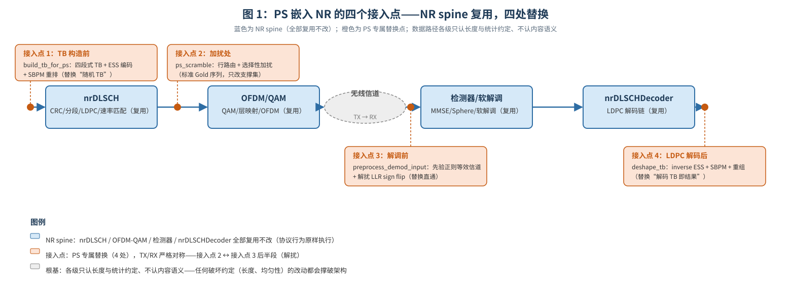

# T13.4 PS 嵌入 NR：四个接入点与比特组织

## 本节学习目标

第 3 章（[[T13.3_ess_enumerative_sphere_shaping]]）把 ESS（枚举球面整形，Enumerative Sphere Shaping）的"怎么整"讲透了：rank↔sequence 的可逆枚举、DP 计数表、区间切割，以及两个工程硬约束——编码 O(n) 串行 vs 解码 O(1) 可流水、**inverse ESS 必须排在 LDPC（低密度奇偶校验码，Low-Density Parity-Check Code）/CRC（循环冗余校验，Cyclic Redundancy Check）之后**。但 ESS 输出的只是"一串幅度 bit"，它还没有进入任何一条标准链路。本章回答第 3 章小结留下的两个"出口"：**ESS 输出的幅度序列如何按位置语义挂到 NR 的比特组织上**（SBPM（整形比特位置映射，Shaped Bit Position Mapping）、shaped mask、选择性加扰），以及**"LDPC/CRC 之后"这个接入点在标准链路里的精确位置**。

这引出一个更根本的问题：PS（概率整形，Probabilistic Shaping）是 6G 候选技术，不在 3GPP 标准里（[[Probabilistic_Shaping_概率整形]] 的"非标准属性"），但它凭什么能"嵌入"一条完全标准的 NR PDSCH（物理下行共享信道，Physical Downlink Shared Channel）链路？答案是一个四接入点架构：**PS 只改四处——TB（传输块，Transport Block）构造前、加扰处、解调前、LDPC 解码后——其余全部复用 NR spine**（nrDLSCH、OFDM（正交频分复用，Orthogonal Frequency Division Multiplexing）、检测器、nrDLSCHDecoder）。"只改四处"能成立，是因为 NR 数据路径的每一级只认输入的**长度与统计约定**、不认内容语义——TB 只是 bit 串、码字只是 bit 串、LLR（对数似然比，Log-Likelihood Ratio）只是软值，只要长度对、统计对，标准组件就照常工作。

但"嵌入"只是骨架，**比特组织**才是血肉：整形 bit 必须落在 QAM（正交幅度调制，Quadrature Amplitude Modulation）label 的幅度位（sign 位必须均匀）、必须躲开全量加扰的均匀化、parity 必须放在 sign 位——同一套"位置语义"原则在四个不同环节各落实一次。本章把这四次落实（SBPM、行路由、选择性加扰、parity-as-sign）逐个讲透，最后给出这套几何能否成立的可行性条件。

学完本节后，应能做到：

- 识别并列举 PS 的四个接入点（TB 构造前、加扰处、解调前、LDPC 解码后），说出每个接入点替换了什么、NR spine 中哪些组件原样复用。（Bloom：记忆；LO2）
- 解释"只改四处"成立的根基：NR 数据路径各级只认长度与统计约定、不认内容语义；任何破坏长度或统计约定的改动都会撑破这个架构。（Bloom：理解；U7）
- 说出四段式 TB（punctured / unshaped_before / shaped / unshaped_after）每段的含义，以及整形区为什么必须紧贴 LDPC 打孔前缀之后。（Bloom：理解）
- 用 4^k 块置换解释 SBPM 的 TX/RX 对称性，并手算一个小例子（如 16QAM k=1 的 8 位往返）。（Bloom：应用）
- 解释行路由与 shaped mask 如何把整形 bit 送到 QAM 幅度位，以及选择性加扰为什么是标准 Gold 加扰的叠加扩展层而非替代。（Bloom：理解；LO5）
- 解释 parity-as-sign 为什么是 PAS 的分工核心：parity 天然均匀、放 sign 位，整形与纠错互不干扰。（Bloom：理解）
- 把几何可行性条件（两个不等式）代入一组数值，判断一个整形配置是否可行。（Bloom：应用）

与持久理解的呼应：本章把 U5（**整形成败由 bit 的"位置语义"决定，而非 bit 值**——SBPM、行路由、选择性加扰、parity-as-sign 是同一原则在比特组织层上的四次落实，TX/RX 两端严格对称）与 U7（**PS 能嵌入 NR 的根本原因是数据路径各级只认长度与统计约定**——四个接入点的替换边界由此划定）讲透；同时承接 U4 的"逆映射必须在 LDPC/CRC 之后"（接入点 4 的精确位置）与第 1 章的 Q3（为什么只改四处就能嵌入标准链路、边界在哪里）。第 5 章将站在接入点 3 的位置上展开接收端先验（LLR prior 与感知解调），第 6 章用 TBS（传输块大小，Transport Block Size）匹配与硬件账本收束这套架构的工程代价。

## 前置知识检查

| 前置项 | 本节需要达到的程度 |
|:---|:---|
| [[T13.1_probabilistic_shaping_overview_shaping_gain]] 概率整形总览 | 知道 PS 只贴标准接口（QAM label、加扰、MCS（调制与编码方案，Modulation and Coding Scheme）/TBS）工作、不改星座坐标；"四个接入点"一词首次出现在该章。 |
| [[T13.2_mb_distribution_entropy_power_tradeoff]] MB（麦克斯韦-玻尔兹曼，Maxwell-Boltzmann）分布 | 知道 $\nu$ 定义非均匀使用概率 $P(a)\propto e^{-\nu a^2}$；本章的"统计约定"就是这些概率。 |
| [[T13.3_ess_enumerative_sphere_shaping]] ESS 枚举球面整形 | 知道 ESS 输出是幅度 bit 标签流、inverse ESS 必须排在 LDPC/CRC 之后（接入点 4 的位置依据）。 |
| [[T9.1_NR_LDPC_rate_recovery_overview]] LDPC 速率恢复 | 知道速率匹配输出顺序、打孔前缀 $2Z_c$、$E_r$/码字长度约定——四段式 TB 与行路由的几何载体。 |
| [[T8.1_NR_LDPC_decoder_chain_overview]] LDPC 译码链路 | 知道 nrDLSCH 编码链只吃 TB 并输出码字，对 TB 内容语义无感（接入点 1 成立的前提）。 |
| [[T2.14_QAM_Max_Log_MAP_demapping]] QAM 软解调 | 知道 QAM label 的位结构（sign 位/幅度位）与星座等概率假设（接入点 3 处被打破的前提）。 |
| [[T12.1_mimo_receiver_chain_overview]] MIMO 接收链路 | 知道检测器与软解调之间的位置——接入点 3 挂在它前面。 |
| [[SBPM_整形比特位置映射]] | 知道 4^k 块置换、TX/RX 对称、与标准交织的区别（本章展开其数学）。 |
| [[Selective_Scrambling_选择性加扰]] | 知道 shaped mask、行路由、LLR sign flip、叠加扩展层（本章展开其机制）。 |
| [[PAS_概率幅度整形]] | 知道 amplitude/sign 分工、parity-as-sign、systematic FEC 前提（本章展开其理由）。 |
| [[Probabilistic_Shaping_概率整形]] | 知道四个接入点架构与几何可行性条件的表述（本章给出完整机制）。 |

如果这些前置还不稳，先抓住一句话：**本章回答"ESS 输出的非均匀 bit 流，怎么放进一条标准的 NR 链路而不被链路内部的机械处理搅匀"——答案是四个接入点的替换加一整套位置语义的比特组织。**

## 从 ESS 输出到星座：位置语义的引入

第 3 章结束时，发射端手里有一样新东西：ESS 输出的幅度 bit 标签流——这些 bit 的统计是**非均匀**的（以 16QAM ν=0.127 为例，幅度位取 0 的概率约 0.734，取 1 约 0.266），整形增益就寄存在这份非均匀里。现在的问题不是"怎么生成"，而是"怎么送出去"：

1. **送到哪**：一条 NR PDSCH 链路的发射端是标准流水线——TB 构造 → CRC/分段 → LDPC 编码 → 速率匹配 → 加扰 → QAM 映射 → 层映射 → 预编码 → OFDM。ESS 的 bit 要插进这条流水线，但流水线每一级都有协议规定的行为。哪些级可以替换、哪些必须原样？
2. **坐在哪**：QAM 星座的每个符号有 $Q_m$ 个 bit 位，其中有些位控制正负（sign 位）、有些位控制幅度（幅度位）。同一个 bit 值，放在幅度位就承载整形统计、放在 sign 位就必须均匀——**决定整形成败的是 bit 的位置而非 bit 的值**，这就是持久理解 U5 说的"位置语义"。
3. **怎么保**：NR 的加扰是全比特 XOR，会把任何非均匀统计打成均匀——整形 bit 必须"躲"开加扰；而 LDPC 的 parity bit 天然均匀，正好可以放进必须均匀的 sign 位。

三个问题对应本章的三层内容：**四个接入点架构**（问题 1，U7）、**位置语义的比特组织**（问题 2，U5）、**选择性加扰与 parity-as-sign**（问题 3，U5 的两次落实）。图 1 先把整体架构画出来：一条横排的 NR spine，四个橙色接入点插在 spine 的四个位置。



## 四个接入点架构：PS 与 NR spine 的边界

PS 子系统的设计哲学可以概括为一句话：**把 PS 做成"数据路径上的四把手术刀"，而不是"另一条链路"**。12 个 PS 专属文件只出现在四个接入点，其余全部复用标准链路组件。四个接入点逐一分析：

### 接入点 1：TB 构造前（替换"随机 TB"为"整形 TB"）

NR 链路对 TB 的唯一要求是**长度等于 chain_tbs 且比特序列任意**。均匀路径用随机数生成 TB；PS 路径用 `build_tb_for_ps` 生成"几何受控"的 TB——其中一段是 ESS 编码输出（shaped 段），其余是原始载荷 bit（unshaped 段）。**nrDLSCH 编码器完全不感知差异**：它照常加 TB CRC、分段、LDPC 编码、速率匹配（[[T8.1_NR_LDPC_decoder_chain_overview]] 的整条链）。这就是接入点 1 的全部"手术"——把 TB 的内容换成整形几何的 bit 模式。

### 接入点 2：加扰处（替换"全量加扰"为"行路由 + 选择性加扰"）

NR 加扰用 Gold 序列对 G 个编码 bit **全部** XOR（TS 38.211 §7.3.1.1）。PS 不能照做：整形 bit 携带幅度信息，被 XOR 后幅度分布被打回均匀、整形增益消失。因此接入点 2 先做**行路由**（把整形 bit 摆到每个符号的幅度位），再只对非整形 bit XOR。注意：**Gold 序列本身不变**（同一 `get_pdsch_scrambling_sequence`），变的只是"加扰的支撑集"。接入点 2 的同一段代码还包含 PS 功率归一（$\sqrt{\text{psPowerScaling}}$，见"只改四处的根基"一节）。

### 接入点 3：解调前（插入等效信道预处理）

PS 先验（MB 分布）必须以正则项形式进入检测器。若直接改检测器内部，就破坏了复用。预处理函数把接收向量与信道估计替换为等效对 $(Y_{\mathrm{eq}}, H_{\mathrm{eq}})$，使得"带先验的 MAP（最大后验概率，Maximum A Posteriori）度量"恰好等于"标准检测器在等效信道上算的度量"——**检测器一行不改**，均匀路径则直通（ν̃=0 时退化为原输入）。注意"接入点 3.5"：解扰（descramble）发生在检测器之后、LDPC 解码之前，与接入点 3 同属 `new_pdsch_decode` 的函数体，与接入点 2 构成 TX/RX 镜像——本章的"四个接入点"框架里，解扰可视为接入点 3 的后半段，第 5 章会给出 LLR sign flip 的完整软域推导。

### 接入点 4：LDPC 解码后（恢复载荷 bit）

解码出的 TB 是 chain_tbs 长的"编码后" bit 串，其中 shaped 段是 ESS 码字。`deshape_tb` 按几何规划切段、SBPM 交织还原、ESS 解码（O(1) 查表）、重组为 payload_tbs 长的源 bit。**LDPC 解码器对此一无所知**——这正是第 3 章"inverse ESS 必须排在 LDPC/CRC 之后"的精确落点：接入点 4 是 LDPC 之后、数据交付之前的唯一位置。

### 复用 vs 修改清单

| 组件 | 处理方式 | 说明 |
|:---|:---|:---|
| nrDLSCH（CRC/分段/LDPC/速率匹配） | **复用，不改** | TB 只是"另一种 bit 模式"；CRC/分段/BG/Zc/速率匹配全部原样 |
| nrDLSCHDecoder（LDPC 解码链） | **复用，不改** | 输入是解扰后的 LLR 流，与均匀路径同构 |
| QAM 映射 / 层映射（nrSymbolModulate / nrLayerMap） | **复用，不改** | 星座与层映射完全按 TS 38.211 §5.1 定义 |
| OFDM 调制/解调、信道模型、信道估计、预编码 | **复用，不改** | PS 与信道物理无关 |
| 检测器（MMSE（最小均方误差，Minimum Mean Square Error）/Sphere）+ 软解调 | **复用，不改** | 先验通过预处理"伪装"进输入，检测器不感知 |
| Gold 加扰序列生成 | **复用** | PS 路径在初始化时生成一次并缓存 |
| 接入点 1、4（TB 构造/恢复） | **修改（替换）** | build_tb_for_ps / deshape_tb |
| 接入点 2、3（加扰/解调前） | **修改（替换）** | ps_scramble / preprocess_demod_input + ps_descramble |
| MCS/TBS 表 | **修改（PS 5 列扩展表）** | ps_mcs_table1/2 增加第 5 列 ν（第 6 章展开） |

## 只改四处的根基：长度与统计约定

为什么"只改四处"就足够？核心原因是：**NR 数据路径是"TB → 编码 → 加扰 → 映射 → 信道 → 检测 → 解扰 → 解码 → TB"的流水线，每一级只认输入输出的长度与统计约定，不认内容语义**。PS 的四个接入点各自独立、互不耦合，且都保持"长度/类型/顺序"约定不变，因此中间所有 NR 组件可以原样复用（持久理解 U7 的机制版）。

**长度约定**（接入点 1 维护）：TB 总长恒为 chain_tbs。PS 的载荷 bit 数是 payload_tbs，整形区放的是 ESS 编码输出（2kN_s 个 bit，含整形冗余），因此

$$
\text{chain\_tbs}=\text{payload\_tbs}+\sum_i \text{rateLoss}_i,
\qquad
\text{rateLoss}_i=2kN_s-\text{essNumInfoBits}_i
\tag{1}
$$

式 (1) 回答的问题是：TB 里多出来的整形冗余从哪来、为什么总数还是 chain_tbs。**TB 总长不变**，nrDLSCH 的分段、码长、速率匹配输出长度 $E_r$（Qm（调制阶数，Modulation Order）的整数倍）全部照旧——这就是接入点 1 之后一切组件"无感"的长度基础。

**统计约定**（接入点 2/3 维护）：星座上必须保持"幅度位非均匀、sign 位与 parity 均匀"的分工，且发送功率归一。PS 把平均能量压低后，若直接发射，接收端的 SNR（信噪比，Signal-to-Noise Ratio）定义与均匀路径不一致——因此接入点 2 末尾按 $\sqrt{\text{psPowerScaling}}$ 放大符号（其中 $\text{psPowerScaling}=E_{\mathrm{uniform}}/E_{\mathrm{avg}}$，能量比）、把平均能量拉回 1（实测 7–14×，即 +8.5~11.3 dB，与 PA back-off 的账在第 6 章核算）。接收端解调前按同一缩放因子缩回，否则先验正则项的量纲不对。

**边界**（U7 的收束）：任何破坏长度或统计约定的改动都会撑破这个架构。三个典型例子：(1)把整形区挪出打孔前缀之后——整形 bit 与符号错位，行路由的几何前提崩溃；(2)对整形位也做全量加扰——统计被均匀化，PS 退化为 uniform；(3)发射端整形、接收端照旧均匀解调——LLR 系统性偏差，增益变负（第 5 章）。这三条正是本章接下来要讲的比特组织的三个正面对应物。

## 四段式 TB：punctured / unshaped_before / shaped / unshaped_after

`build_tb_for_ps` 对每个 CB（码块，Code Block）组装四段，再按 CB 顺序拼接成 chain_tbs 长的 TB：

```
每 CB 的 TB 段（pre-LDPC 域，共 K−F−L_cb 个位置）:
|<-- punctured -->|<-- unshaped_before -->|<------ shaped ------>|<-- unshaped_after -->|
   1 .. 2Zc              （恒空）            2Zc+1 .. 2Zc+2kN_s    2Zc+2kN_s+1 .. K−F−L_cb
   LDPC 打孔前缀内       打孔之后、整形区之前   ESS 编码输出          剩余信息位（sign/未整形幅度）
   的载荷 bit            （防御性保留）        每符号 2k 个整形 bit   位 + 载荷 bit
```

四段不是随意划分，而是 LDPC 信息块（pre-LDPC 域，每 CB 长度 $K-F-L_{cb}$）的**位置分区在 TB 上的投影**，每个位置"属于 TB 载荷的 bit 数"由分段标签统计出来。三个关键几何事实：

1. **整形区起点紧贴打孔前缀**：`shaped_start = 2Z_c + 1`。速率匹配丢弃每 CB 前 $2Z_c$ 个 bit 后，码字的发送序列 = [信息位 $2Z_c+1..K-F$] + [校验位]，整形区恰好占据**发送序列的最前 $2kN_s$ bit**。若整形区起点后移，整形 bit 就会错位到非行首位置，行路由的前提被破坏。
2. **unshaped_before 恒空**：当前代码中 `shaped_start = prefix_len + 1`，打孔前缀与整形区之间没有空隙。保留这一段是几何的通用性与防御性——若未来允许整形区后移，统计立刻生效；当前配置下该段载荷恒为 0。
3. **打孔前缀是"免费载荷区"**：落在 $1..2Z_c$ 内的载荷 bit **不发送**（被速率匹配打孔），靠 LDPC 校验约束恢复——等于每 CB 白得 $2Z_c$ 个 bit 的容量，四段式第一段把这些 bit 放进了 TB。

## 位置语义：QAM label 的 sign 位与幅度位

现在把镜头拉到星座内部。NR 的 QAM 映射（TS 38.211 §5.1.4）把每 $Q_m$ 个 bit 映射为一个符号，bit 位有明确分工：

| 位 | 作用 | 概率特性 | PS 中的角色 |
|:---|:---|:---|:---|
| 1, 2（I/Q sign 位） | 决定象限正负 | 必须均匀（±1 各半） | 放 FEC parity（parity-as-sign） |
| 3 .. 2k+2（I/Q 幅度位） | 决定幅度电平（被整形） | **非均匀（MB 分布）** | 放 ESS 输出（shaped bits） |
| 2k+3 .. Qm（剩余幅度位） | 决定幅度电平（未整形） | 均匀 | 放原始载荷 bit（加扰保护） |

k 是每维被整形的幅度 bit 数（16QAM 的 k=1、64QAM 的 k=2 上限、1024QAM 的 k=4 上限），每符号整形 bit 数 = 2k。**为什么 shaped bits 必须落在幅度位**：概率整形控制的是"星座点被使用的频率"，而星座点的能量由幅度决定——只有控制幅度的 bit 才控制使用概率。把 shaped bits 放到 sign 位会同时犯两个错：sign 位必须 ±1 各半（星座对称性的要求，也是 parity 均匀性的归属），shaped bits 的非均匀统计放进 sign 位会让象限使用偏置、星座不对称；且 sign 位不在 shaped mask 保护范围内、会被加扰均匀化——整形白做。这就是 U5 的第一句话：**同一个 bit 值，放在幅度位就是整形载体、放在 sign 位就是均匀约束**。

## SBPM：4^k 块置换与 TX/RX 对称

ESS 编码器输出的是"幅度电平序列"的 bit 标签流。要让这些 bit 在 QAM 映射后真的成为幅度，必须把 ESS 输出流重排成"每符号 2k 个整形 bit 连续"的码字顺序。**SBPM（Shaped Bit Position Mapping，整形比特位置映射）**就是完成这个重排的矩形转置交织器（[[SBPM_整形比特位置映射]]）。

**块大小 4^k**：每符号 2k 个整形 bit，即 4^k = 2^{2k}。k=1 → 4（16QAM 每符号 2 个整形 bit），k=2 → 16（64QAM 4 个），k=3 → 64，k=4 → 256（1024QAM 8 个，上限）。块大小取 4^k 而非 2^k 的原因：一个 QAM 符号有 I、Q 两个维度，每维 k 个整形幅度 bit，共 2k 个；转置行宽必须等于"每符号整形 bit 数"，输出才能按符号对齐。

**矩形转置的数学**：设输入列向量 $\mathbf{x}\in\{0,1\}^{L}$，$L=2k\cdot N_s$（$N_s$ = 符号数，$q=2k$ 为每符号整形 bit 数，$N=L/q$）。两个函数互为逆：

$$
\text{TX 排列（ESS 位级主序 → 符号主序）:}\quad
y[(c-1)q + r] = x[(r-1)N + c],\qquad r\in[1,q],\ c\in[1,N]
\tag{2}
$$

$$
\text{RX 逆排列（符号主序 → 位级主序）:}\quad
y[(c-1)N + r] = x[(r-1)q + c],\qquad r\in[1,q],\ c\in[1,N]
\tag{3}
$$

两个映射的语义差别在**输出分组长度**：式 (2) 的输出按 q bit 分组（每符号一组），式 (3) 的输出按 N bit 分组（每维度的全部符号一组）。代入可验证二者互逆：interleave∘deinterleave = deinterleave∘interleave = id（内嵌验证给出数值证明）。一个 PS02 的数值例子（q=4, N=3）：$\mathbf{x}=[1..12]$，式 (3) 得 $[1\,5\,9\,2\,6\,10\,3\,7\,11\,4\,8\,12]$，再经式 (2) 还原 $[1..12]$。

**为什么 TX 用"位级主序 → 符号主序"这一侧**：ESS 编码器内部把 I/Q 两维的 bit 按位平面组织（先全部符号的第 1 个幅度 bit、再第 2 个……，`encode.m` 的转置展平），而码字要求符号主序（每符号 2k bit 连续，后续 Qm 分组才能把整形 bit 对齐到每符号前 2k 行）。于是 **TX 用 deinterleave 把 ESS 输出转成码字顺序，RX 用 interleave 还原给 ESS 解码器**——两个方向的对称性 = 一对互逆转置，任何一端用了另一侧，bit 顺序就整体错乱（U5 的"TX/RX 两端必须严格一致"）。

**与标准交织的区别**（习 4 详析）：TS 38.212 §5.4.2.2 的 LDPC bit interleaving 是标准步骤（速率匹配后的行/列交织）；SBPM 是非标准扩展（把整形 bit 放幅度位）——对象、位置、目的完全不同，SBPM 叠加在标准交织之后。

## 行路由与 shaped mask

SBPM 解决的是"ESS 输出内部的顺序"，行路由解决的是"整形 bit 在 QAM 符号内的位置"。把 nrDLSCH 输出的码字 $\mathbf{x}\in\{0,1\}^{G}$（G 是 Qm 的整数倍）重排为 $Q_m\times N$ 矩阵（列 j = 符号 j 的 $Q_m$ 个 bit）：

$$
\mathbf{R}=\operatorname{reshape}(\mathbf{x}, Q_m, N),\qquad
\mathbf{R}(i,j)=x[(j-1)Q_m + i]
\tag{4}
$$

利用第 4 节的几何（整形区占据发送序列最前 $2kN_s$ bit、即每符号前 2k 行），按行切分 $\mathbf{x}_s=\mathbf{R}(1:2k,\ :)$（整形行）与 $\mathbf{x}_p=\mathbf{R}(2k+1:Q_m,\ :)$（非整形行），路由输出（行重排）：

$$
\mathbf{y}=\begin{bmatrix}\mathbf{x}_p(1:2,\ :)\\ \mathbf{x}_s\\ \mathbf{x}_p(3:\mathrm{end},\ :)\end{bmatrix}
\tag{5}
$$

效果：每个符号的 bit 顺序从 `[整形(2k) | 非整形(Qm−2k)]` 变成 `[非整形符号位(2) | 整形幅度位(2k) | 非整形幅度位(Qm−2k−2)]`——正好匹配 NR QAM 星座的 bit 语义（b0/b1 为 I/Q 符号位），整形 bit 因此落在第 3..2+2k 位。

**shaped mask** 标记路由后哪些位置是整形位：`rows(3:(2+2k), :) = true`——一个周期为 Qm 的周期模式。TX 用它决定哪些位不参与加扰；RX 用它决定哪些 LLR 不做符号翻转。**硬件上无需存储 G bit 的全量掩码**（52PRB 全量约 40.6 KB）：只需 Qm bit 的周期模板 + 一个符号计数器在线生成。

**完整因果链**（为什么 TB 布局 + 行路由 = 整形 bit 恰好落在幅度位）：(1) TB 布局（接入点 1）把整形区放在每 CB 发送序列最前 $2kN_s$ bit；(2) LDPC 编码 + 速率匹配（复用）保持信息位顺序，整形区在码字中的相对位置不变；(3) 行路由（接入点 2）按 $Q_m$ 分组把前 2k 行搬到第 3..2+2k 行；(4) QAM 映射（复用）中幅度位恰在第 3..2+2k 位。**只要 TB 布局成立，后三步全部是自动的**——这就是"只改四个接入点"的深层原因：NR 链路的既有结构（打孔前缀、信息位顺序、Qm 分组、星座位序）被 PS 当作免费的几何工具使用。

## 选择性加扰：叠加扩展层与全比特加扰的破坏

标准加扰是**全比特 XOR**——shaped bits 被 XOR 后统计立即打散（均匀化），整形白做。选择性加扰的解法：用 shaped mask 标记"哪些行是 shaped 行"，**只对非 shaped 行做 XOR**（[[Selective_Scrambling_选择性加扰]]）：

$$
c_i = b_i \oplus g_i \cdot \mathbb{1}[\text{scramble\_mask}_i],\qquad
\text{scramble\_mask} = \neg\,\text{shaped\_mask}
\tag{6}
$$

两个必须分清的关系：

1. **与标准加扰的关系是"叠加扩展层"，不是替代**：标准 Gold 加扰（TS 38.211 §7.3.1.1）对非整形位照常执行其职责（统计均匀化、能量扩散）；选择性加扰是叠加其上的扩展层——序列完全相同（同一 Gold 生成器、同一 NID/RNTI（无线网络临时标识，Radio Network Temporary Identifier）），**只改支撑集**。判断"选择性加扰替代了标准加扰"是错误的（习 2 考点）。
2. **TX/RX 的对称性**：TX 对非整形位 XOR；RX 不需要硬判决解扰——在软域对对应行的 LLR 乘 ±1 即可（LLR sign flip，$L(b)=(1-2g)L(c)$，第 5 章给出完整推导）：$g=0$ 时 $L(b)=L(c)$，$g=1$ 时 $L(b)=-L(c)$。整形位 LLR 原样通过——它们从未被加扰，不需要也不允许翻转。**mask 两侧必须严格一致**：若 RX 把整形位也翻转，ESS 码字损坏，deshape 必失败。

为什么不能对全比特加扰"网开一面"？加扰负责统计均匀化、整形负责非均匀化——两者按行分工、各司其职：sign/未整形位被加扰后仍然均匀（与它们的角色一致），整形位跳过加扰（保住非均匀）。直观模型：标准加扰把整副牌洗乱，会毁掉 ESS 精心排出的概率分布；选择性加扰只洗非整形那一叠，shaped 牌原样保留，洗完再合回一副牌。

## parity-as-sign：PAS 的分工核心

位置语义还有一个"免费"的来源：**FEC 的 parity 是信息位的线性组合，天然近似均匀**。把 parity 放进必须均匀的 sign 位，既不破坏均匀性，又完成纠错——这就是 PAS（Probabilistic Amplitude Shaping，概率幅度整形）框架的核心分工（[[PAS_概率幅度整形]]）：

| 成分 | 概率特性 | 来源 | 位置 |
|:---|:---|:---|:---|
| amplitude bits | 非均匀（整形目标） | DM/ESS 输出 | 幅度位（shaped） |
| parity bits | 近似均匀 | FEC 编码 → sign 位 | sign 位（unshaped） |
| unshaped bits | 均匀 | 原始数据 | 剩余幅度位（加扰保护） |

三个要点：

1. **parity-as-sign 的成立前提是 systematic FEC**：系统码保留原始信息位（承载整形后的幅度信息）、parity 独立输出——PAS 才能把"整形通道"与"纠错通道"分开。NR LDPC 正是系统码（[[T8.1_NR_LDPC_decoder_chain_overview]]）。
2. **为什么 sign 不能整形**：符号 ±1 必须保持各半（星座对称、象限等概率），否则星座不对称且与 parity 的均匀性冲突；而"parity 放哪都行"也是错的——parity 放幅度位会干扰整形统计，放 sign 位是唯一两全的位置。
3. **PAS 是框架、ESS 是实现**：PAS 定义 amplitude/sign 分工（框架层），ESS 是 DM 的一种实现（映射层），SBPM/行路由是 bit 组装器（组织层）——ESS ⊂ DM ⊂ PAS，三者协作构成整形收发链路的组织方式。

## 几何可行性条件

比特组织讲完了，最后一个问题是：**一个整形配置（Qm、k、N_s、码长、Zc）在什么条件下几何上成立**？`plan_cb` 的两个不等式构成 PS 几何的可行性条件：

$$
\text{numParityBits} \le \underbrace{2N_s\left(\frac{Q_m}{2}-k\right) - L_{cb}}_{\text{unshaped\_budget}}
\tag{7}
$$

$$
2Z_c + 2kN_s \le K - F - L_{cb}
\tag{8}
$$

其中 numParityBits = $E_r - \min(E_r, K-F-2Z_c)$ 是本次传输实际发送的校验 bit 数（[[T9.1_NR_LDPC_rate_recovery_overview]] 的 $E_r$ 口径），$L_{cb}$ 是 CB CRC 长度（典型 24 bit）。

- **式 (7)（校验位装得下）**：每符号非整形位置共 $(Q_m-2k)N_s$ 个（2 个 sign 位 + 未整形幅度位），校验位 + CB CRC 必须装得下，因为载荷里未整形部分要占据剩余位置。
- **式 (8)（整形区放得下）**：整形区必须完整落在信息块内、且不越过 CB CRC 区——整形区起点 $2Z_c+1$、终点 $2Z_c+2kN_s$ 都必须在 $[1, K-F-L_{cb}]$ 内。

**一个值得注意的耦合**：在需要发送校验位的配置下（$E_r > K-F-2Z_c$，即常规码率），式 (7) 与式 (8) 代数等价——把 numParityBits = $E_r - (K-F-2Z_c)$ 与 $E_r = Q_mN_s$ 代入式 (7)，两边整理恰好得到式 (8)。两式是**同一预算的两面**：整形区占掉信息块的空间，剩余位置既要放未整形载荷、又要放校验位。只在极限高码率（$E_r \le K-F-2Z_c$，无校验位发送）下式 (7) 自动成立、式 (8) 单独把关。此外 `ess_state.numBitsPerCodeword > num_shaped_bits`（ESS 码字容量不足）同样报错。内嵌验证将把三组配置代入这两个条件。

## 内嵌验证：SBPM 4^k 置换互逆与几何可行性检查

本节用 numpy 做两件事：(1)模拟 SBPM 4^k 置换（含 16QAM k=1 的完整走查与互逆性随机验证）与行路由的置换性质；(2)把几何可行性条件代入三组数值。代码与素材口径逐项核对：

```python
import numpy as np

def sbpm_interleave(x, q):
    """MATLAB sbpm_interleave: a=reshape(x, L/q, q).'; y=a(:);  —— 位级主序 → 符号主序"""
    x = np.asarray(x).ravel(); N = len(x) // q
    return x.reshape(N, q, order='F').T.flatten(order='F')

def sbpm_deinterleave(x, q):
    """MATLAB sbpm_deinterleave: a=reshape(x, q, L/q).'; y=a(:); —— 符号主序 → 位级主序"""
    x = np.asarray(x).ravel(); N = len(x) // q
    return x.reshape(q, N, order='F').T.flatten(order='F')

def route_rows(x, Qm, k):
    """行路由：Qm×N 矩阵中把行 1..2k（整形行）搬到行 3..2+2k（幅度位）"""
    n_sym = len(x) // Qm
    rows = x.reshape(Qm, n_sym, order='F')
    x_s = rows[0:2*k, :]; x_p = rows[2*k:, :]
    return np.vstack([x_p[0:2, :], x_s, x_p[2:, :]]).flatten(order='F')

def inverse_route_rows(y, Qm, k):
    """行路由的逆：行 3..2+2k 搬回行 1..2k"""
    n_sym = len(y) // Qm
    rows = y.reshape(Qm, n_sym, order='F')
    x_s = rows[2:2+2*k, :]
    x_p = np.vstack([rows[0:2, :], rows[2+2*k:, :]])
    return np.vstack([x_s, x_p]).flatten(order='F')

# ---------- 1. PS02 §3.2 数值例子复现：q=4, N=3 ----------
x = np.arange(1, 13)
de = sbpm_deinterleave(x, 4)
print("PS02 例：deinterleave([1..12], q=4) =", de.tolist())
assert list(de) == [1, 5, 9, 2, 6, 10, 3, 7, 11, 4, 8, 12]
assert np.array_equal(sbpm_interleave(de, 4), x)
print("  interleave∘deinterleave = id ✓")

# ---------- 2. 16QAM k=1 走查：ESS 输出 → TX deinterleave → RX interleave ----------
# ESS 输出（per-symbol，I/Q 相邻）：sym1=(1,0) sym2=(1,1) sym3=(0,1) sym4=(0,0)
b = np.array([1, 0, 1, 1, 0, 1, 0, 0])
tb = sbpm_deinterleave(b, 2)                       # TX 写入 TB 整形区：位平面主序
print(f"16QAM k=1 走查：ESS 输出 b = {b.tolist()}")
print(f"  TX deinterleave(q=2) → TB 整形区 = {tb.tolist()}  (I 平面 {tb[:4].tolist()}, Q 平面 {tb[4:].tolist()})")
assert np.array_equal(sbpm_interleave(tb, 2), b)
print("  RX interleave 还原 =", sbpm_interleave(tb, 2).tolist(), "✓")

# ---------- 3. 互逆性随机验证 ----------
rng = np.random.default_rng(0)
for q, N in [(2, 4), (4, 3), (8, 7), (8, 16)]:
    x = rng.integers(0, 2, q * N)
    assert np.array_equal(sbpm_deinterleave(sbpm_interleave(x, q), q), x)
    assert np.array_equal(sbpm_interleave(sbpm_deinterleave(x, q), q), x)
print("互逆性：q∈{2,4,8}、4 组随机 bit 往返全部还原 ✓")

# ---------- 4. 行路由 + shaped mask 周期模式 ----------
Qm, k, N = 6, 1, 5
cw = rng.integers(0, 2, Qm * N)
routed = route_rows(cw, Qm, k)
assert np.array_equal(inverse_route_rows(routed, Qm, k), cw)
mask = np.zeros(Qm * N, dtype=bool).reshape(Qm, N, order='F')
mask[2:2+2*k, :] = True                            # shaped_mask：行 3..2+2k
print(f"行路由：{Qm}×{N} 矩阵，行 1..2k→行 3..2+2k；逆路由还原 ✓")
print(f"shaped_mask 周期模式（Qm={Qm} 位/符号，k={k}）：",
      "".join("1" if m else "0" for m in mask[:, 0]), "(行 3..4 = 幅度位)")

# ---------- 5. 几何可行性条件（PS02 §1.4 / plan_cb 口径） ----------
def plan_check(name, Qm, k, Ns, Er, K_minus_F, Zc, Lcb=24):
    prefix = 2 * Zc
    num_tx_sys = min(Er, K_minus_F - prefix)
    num_parity = max(0, Er - num_tx_sys)
    unshaped_budget = 2 * Ns * (Qm // 2 - k) - Lcb
    shaped_end = prefix + 2 * k * Ns
    cond1 = num_parity <= unshaped_budget
    cond2 = shaped_end <= K_minus_F - Lcb
    print(f"{name:<14} parity={num_parity:>5} ≤ {unshaped_budget:>5} ? {cond1}   "
          f"2Zc+2kN_s={shaped_end:>5} ≤ {K_minus_F-Lcb:>5} ? {cond2}")
    return cond1, cond2

print("\n几何可行性条件（L_cb=24）：")
cA = plan_check("64QAM k=1", 6, 1, 1000, 6000, 4000, 104)
cB = plan_check("1024QAM k=4", 10, 4, 400, 4000, 3400, 104)
cC = plan_check("64QAM k=2", 6, 2, 500, 3000, 3200, 208)
assert cA == (True, True) and cB == (False, False) and cC == (True, True)
print("断言：A 可行、B 不可行（两条件同破坏）、C 可行 —— 全部通过 ✓")
```

真实运行输出（断言全部通过）：

```text
PS02 例：deinterleave([1..12], q=4) = [1, 5, 9, 2, 6, 10, 3, 7, 11, 4, 8, 12]
  interleave∘deinterleave = id ✓
16QAM k=1 走查：ESS 输出 b = [1, 0, 1, 1, 0, 1, 0, 0]
  TX deinterleave(q=2) → TB 整形区 = [1, 1, 0, 0, 0, 1, 1, 0]  (I 平面 [1, 1, 0, 0], Q 平面 [0, 1, 1, 0])
  RX interleave 还原 = [1, 0, 1, 1, 0, 1, 0, 0] ✓
互逆性：q∈{2,4,8}、4 组随机 bit 往返全部还原 ✓
行路由：6×5 矩阵，行 1..2k→行 3..2+2k；逆路由还原 ✓
shaped_mask 周期模式（Qm=6 位/符号，k=1）： 001100 (行 3..4 = 幅度位)

几何可行性条件（L_cb=24）：
64QAM k=1      parity= 2208 ≤  3976 ? True   2Zc+2kN_s= 2208 ≤  3976 ? True
1024QAM k=4    parity=  808 ≤   776 ? False   2Zc+2kN_s= 3408 ≤  3376 ? False
64QAM k=2      parity=  216 ≤   976 ? True   2Zc+2kN_s= 2416 ≤  3176 ? True
断言：A 可行、B 不可行（两条件同破坏）、C 可行 —— 全部通过 ✓
```

两组读法（教学要点）：

1. **SBPM 是纯索引重排**：没有任何算术，只有矩形转置的地址生成（行列互换），互逆性在任意 q/N 组合下成立——这决定了它在硬件上只是双端口 SRAM（静态随机存取存储器，Static Random-Access Memory） + 计数器，不需要置换表 ROM（对比 LTE 子块交织的 32 列置换表）。16QAM k=1 的走查还揭示了语义：TX 侧把 ESS 的 per-symbol（I/Q 相邻）输出展开成位平面主序写入 TB 整形区，RX 侧做逆变换还原——两端各用式 (2)/式 (3) 的一侧。
2. **几何可行性两式在常规码率下同真同假**：三行配置的 cond1 与 cond2 布尔值完全一致（A/C 双真、B 双假）——印证了上一节的耦合观察：校验位预算与整形区空间是同一块预算的两面。B 组（1024QAM k=4）破坏的原因也清楚：2Zc+2kN_s = 3408 超过了信息块净长 3376，整形区放不下。

## 示范例题

### 例 1（应用）：16QAM k=1 SBPM 4^k 置换走查

**题目**：16QAM、k=1（每符号 2 个整形 bit，4^k=4）。ESS 输出为 8 个 bit 的幅度标签流 $\mathbf{b}=[1,0,1,1,0,1,0,0]$（按符号序：sym1=(1,0)、sym2=(1,1)、sym3=(0,1)、sym4=(0,0)）。(1)写出 TX 侧写入 TB 整形区的 bit 序（deinterleave，q=2k=2）；(2)写出 RX 侧还原后的 bit 序，并验证与 $\mathbf{b}$ 一致。

**解答**：

(1) TX deinterleave 按式 (3)（q=2, N=4）：输出按 N=4 分组，第 c 组取输入的第 $c,\ c+2,\ c+4,\ c+6$ 位：

- 第 1 组（c=1）：$y[1..4] = x[1], x[3], x[5], x[7] = 1, 1, 0, 0$；
- 第 2 组（c=2）：$y[5..8] = x[2], x[4], x[6], x[8] = 0, 1, 1, 0$。

写入 TB 整形区的 bit 序：$[1,1,0,0,\ 0,1,1,0]$——即 **I 位平面 [1,1,0,0] + Q 位平面 [0,1,1,0]**：先全部符号的 I 幅度 bit，再全部符号的 Q 幅度 bit。

(2) RX interleave 按式 (2)（q=2, N=4）：输出按 q=2 分组，第 r 组取输入的第 $r,\ r+4$ 位：

- 第 1 组（r=1）：$y[1], y[3], y[5], y[7] = 1, 1, 0, 0$（取 $z[1], z[2], z[3], z[4]$）；
- 第 2 组（r=2）：$y[2], y[4], y[6], y[8] = 0, 1, 1, 0$（取 $z[5], z[6], z[7], z[8]$）。

还原：$[1,0,1,1,0,1,0,0]=\mathbf{b}$ ✓——TX/RX 互逆，8 位往返无损（与内嵌验证第 2 段逐位一致）。

**点评**：这道题练的是"矩形转置的两个方向"：TX 展开成位平面（按 N 分组读出）、RX 收拢回符号（按 q 分组读出）。记住输出分组长度就能判断方向：**按 N 分组的是 deinterleave（TX 侧），按 q 分组的是 interleave（RX 侧）**。若两端方向用反，还原出的不是 $\mathbf{b}$ 而是它的某种乱序，ESS 解码将整体失败。

### 例 2（理解）：判断正误——shaped bits 放 sign 位

**题目**：判断正误并说明理由："把 shaped bits 放在 sign 位也一样有效，因为 sign 位和幅度位同属一个星座，整形统计都能作用到符号上。"

**解答**：错误，至少三层原因：

1. **sign 位必须均匀**：符号 ±1 必须各半，星座才对称、象限才等概率。shaped bits 是非均匀的（16QAM ν=0.127 时取 0 的概率约 0.734），放进 sign 位会让象限使用偏置、星座不对称——这本身就不是"整形"，而是畸变。
2. **sign 位是 parity 的家（parity-as-sign）**：FEC 的 parity 天然均匀、正好放 sign 位；把 shaped bits 占了 sign 位，parity 就无处可去，整形与纠错互相干扰。
3. **sign 位会被加扰均匀化**：选择性加扰只保护 shaped mask 标记的幅度位（行 3..2+2k），sign 位在加扰支撑集内——shaped bits 放进去会被 XOR 打回均匀，整形白做。

结论：**决定整形成败的是 bit 的位置而非 bit 的值**（U5）——shaped bits 只有放在幅度位才控制使用概率；SBPM 与行路由存在的意义就是"把整形 bit 送到该去的位置"。

**点评**：这道题对应学习目标 LO5 的判断正误题型。答题时抓住"位置语义"三连：幅度位（整形载体）→ sign 位（均匀约束 + parity 归属）→ 加扰（保护整形位、均匀化其余位）。

## 引导练习

### 练习 1（应用）：1024QAM k=4 置换

**题目**：1024QAM、k=4（每符号 2k=8 个整形 bit，4^k=256）。设 $N_s=3$ 个符号、输入 $\mathbf{x}=[1,2,\ldots,24]$（下标即内容，便于核对位置）。(1)写出 TX deinterleave（q=8）的输出分组；(2)指出 8 个分组中哪些是 I 维的 4 个位平面、哪些是 Q 维的 4 个位平面；(3)说明往返还原如何验证。

**提示**：式 (3) 输出按 N=3 分组，第 c 组（c=1..8）取输入的第 $c,\ c+8,\ c+16$ 个元素。先机械写出 8 组，再看每组对应哪个 bit 位置（每符号 8 bit = I 幅度的 4 bit + Q 幅度的 4 bit，位平面 1..4 属 I、5..8 属 Q）。

**参考答案**：

(1) 输出分组（8 组，每组 3 个元素）：

```
第1组 [1, 9, 17]   第2组 [2, 10, 18]   第3组 [3, 11, 19]   第4组 [4, 12, 20]
第5组 [5, 13, 21]  第6组 [6, 14, 22]  第7组 [7, 15, 23]   第8组 [8, 16, 24]
```

(2) 语义：第 1..4 组是 I 维的 4 个位平面（每平面 = 全部 3 个符号的第 j 个 I 幅度 bit），第 5..8 组是 Q 维的 4 个位平面。位平面 1..4 对应 QAM label 的第 3,5,7,9 位（I 幅度），位平面 5..8 对应第 4,6,8,10 位（Q 幅度）。

(3) 往返：对输出再做 RX interleave（式 (2)，按 q=8 分组、取每组的跨 N 元素），得到 $[1,2,\ldots,24]$ 原序——内嵌验证第 3 段对 (q=8, N=7/16) 的随机验证已证明互逆性在任意 N 下成立。**验证要点**：两端必须分别使用式 (2)/式 (3) 的对应侧，方向互换则还原失败。

### 练习 2（理解）：选择性加扰与标准加扰的关系

**题目**：判断正误并说明理由："选择性加扰用一套自定义的加扰序列替代了标准 Gold 加扰，因此 PS 链路不再使用 Gold 序列。"

**提示**：区分两个对象——加扰**序列**与加扰**支撑集**。标准加扰对全部 G 个 bit XOR；选择性加扰对哪些 bit XOR？序列本身换了吗？

**参考答案**：错误。选择性加扰**不替代、不改写标准加扰**，而是叠加其上的扩展层：Gold 序列完全复用（同一生成器、同一 NID/RNTI，序列逐 bit 相同），变的只是**支撑集**——shaped mask 标记的整形位（行 3..2+2k）跳过 XOR，其余位（sign 位 + 未整形幅度位）照常执行标准加扰。RX 侧同理：解扰仍是标准的 LLR 乘 ±1 机制（$L(b)=(1-2g)L(c)$），只是只作用于非整形位。因此"PS 链路不再使用 Gold 序列"不成立——**序列没换、换的是哪些位被加扰**。真正需要新增的只是 shaped mask（Qm bit 周期模板）与支撑集逻辑。

## 独立习题

### 习 1（记忆，LO2）：列举四个接入点与边界

**题目**：列举 PS 嵌入 NR 的四个接入点，每个接入点说明：(1)在标准链路的哪个位置；(2)替换了什么；(3)它两侧的 NR spine 组件分别是什么。

**参考答案**：(1)**接入点 1（TB 构造前）**——nrDLSCH 编码之前；把"随机 TB"替换为"四段式整形 TB"（build_tb_for_ps）；两侧 spine：TB 源 / nrDLSCH（CRC/分段/LDPC/速率匹配全复用）。(2)**接入点 2（加扰处）**——LDPC 编码与 QAM 映射之间；把"全量 Gold 加扰"替换为"行路由 + 选择性加扰"（ps_scramble）；两侧 spine：nrDLSCH 输出码字 / QAM 映射与层映射（复用）。(3)**接入点 3（解调前）**——信道与检测器之间；插入等效信道预处理（preprocess_demod_input，均匀路径直通），其后半段为解扰（ps_descramble，LLR sign flip）；两侧 spine：OFDM 解调输出 / 检测器 + 软解调（复用）。(4)**接入点 4（LDPC 解码后）**——nrDLSCHDecoder 之后、数据交付之前；把"解码 TB 即结果"替换为 deshape_tb（inverse ESS + SBPM + 重组）；两侧 spine：nrDLSCHDecoder / 数据交付（上层）。记忆锚：**TX 两个（1、2）、RX 两个（3、4），中间整条 spine 不动**。

### 习 2（理解，LO5）：判断正误——选择性加扰替代标准

**题目**：判断正误并说明理由："既然 PS 用选择性加扰，标准 Gold 加扰就可以删掉了，反正加扰的作用只是均匀化。"

**参考答案**：错误，两层原因。其一，选择性加扰是标准加扰的**叠加扩展层**：Gold 序列与生成方式完全复用（同一 `get_pdsch_scrambling_sequence`），只是支撑集从"全部 bit"收窄为"非整形位"——标准加扰对 sign 位与未整形幅度位照常执行，其均匀化职责并未取消。其二，"加扰的作用只是均匀化"是对加扰的误读：加扰（TS 38.211 §7.3.1.1）还承担小区间干扰随机化与能量扩散的协议职责；PS 只是把"均匀化"这一份职责按行分工——整形位跳过（保住非均匀）、其余位照常（保持均匀）。删除标准加扰会破坏协议行为与链路兼容性；正确的关系是"叠加、不替代"（U5 的第二次落实）。

### 习 3（应用，numpy）：几何可行性条件验证

**题目**：用 numpy 实现几何可行性检查（式 (7)(8)），代入三组配置并输出判定：(1)256QAM k=2（Qm=8，N_s=600，E_r=4800，K−F=5000，Zc=104）；(2)16QAM k=1（Qm=4，N_s=300，E_r=1200，K−F=1000，Zc=104）；(3)64QAM k=2（Qm=6，N_s=500，E_r=3000，K−F=2200，Zc=104）。L_cb=24。对不可行的一组，指出是哪个条件破坏、破坏的物理含义。

**参考答案**（代码与输出；与本章"内嵌验证"同构，可对照）：

```python
import numpy as np

def plan_check(name, Qm, k, Ns, Er, K_minus_F, Zc, Lcb=24):
    """式(7)(8) 几何可行性检查：返回 (条件1, 条件2)。"""
    prefix = 2 * Zc
    num_tx_sys  = min(Er, K_minus_F - prefix)          # 发送的系统位
    num_parity  = max(0, Er - num_tx_sys)              # 发送的校验位
    unshaped_budget = 2 * Ns * (Qm // 2 - k) - Lcb     # 未整形位置预算
    shaped_end  = prefix + 2 * k * Ns                  # 整形区终点（pre-LDPC 域）
    cond1 = num_parity <= unshaped_budget              # 式 (7)
    cond2 = shaped_end <= K_minus_F - Lcb              # 式 (8)
    print(f"{name:<12} parity={num_parity:>5}≤{unshaped_budget:>5} {cond1}"
          f"    2Zc+2kN_s={shaped_end:>5}≤{K_minus_F-Lcb:>5} {cond2}")
    return cond1, cond2

r1 = plan_check("256QAM k=2", 8, 2, 600, 4800, 5000, 104)
r2 = plan_check("16QAM k=1",  4, 1, 300, 1200, 1000, 104)
r3 = plan_check("64QAM k=2",  6, 2, 500, 3000, 2200, 104)
assert r1 == (True, True) and r2 == (True, True) and r3 == (False, False)
print("断言：(1)可行 (2)可行 (3)不可行 ✓")
```

```text
256QAM k=2   parity=    8≤ 2376 True    2Zc+2kN_s= 2608≤ 4976 True
16QAM k=1    parity=  408≤  576 True    2Zc+2kN_s=  808≤  976 True
64QAM k=2    parity= 1008≤  976 False    2Zc+2kN_s= 2208≤ 2176 False
断言：(1)可行 (2)可行 (3)不可行 ✓
```

**说明**：(3)组（64QAM k=2，N_s=500，K−F=2200）两式同时破坏：整形区 2Zc+2kN_s = 2208 超出了信息块净长 K−F−L_cb = 2176——**k=2 需要 2000 bit 的整形区，而信息块在打孔前缀之后只剩 2176 bit 的位置，整形区放不下**；同时校验位 1008 超出未整形预算 976——两式同破坏再次印证"同一预算的两面"。**评分要点**：三组布尔判定正确（(1)真(2)真(3)假），且能指出(3)组是整形区越界 + 校验位超预算、物理含义是"k 选得太大、块放不下"。

### 习 4（分析）：比较标准交织与 SBPM

**题目**：从标准属性、处理对象、在链路中的位置、目的四个维度比较 TS 38.212 §5.4.2.2 的 LDPC bit interleaving 与 SBPM，并说明两者为何不是一回事、PS 为什么需要"叠加"而非"借用"标准交织。

**参考答案**：(1)**标准属性**：LDPC bit interleaving 是协议强制步骤（TS 38.212 §5.4.2.2，rate recovery 必须与之对偶）；SBPM 是非 3GPP 标准的扩展（6G 候选），无标准小节。(2)**处理对象**：标准交织处理 LDPC 编码/速率匹配后的**编码 bit**（含校验位，全部 bit 一视同仁）；SBPM 只处理 **ESS 输出的整形 bit**（幅度标签流）。(3)**位置**：标准交织在速率匹配与加扰之间（接入点 2 之前的标准步骤）；SBPM 在接入点 1（TB 构造时，ESS 输出 → TB 整形区）与接入点 4（deshape 时还原）。(4)**目的**：标准交织是为了把突发错误打散、使编码 bit 与星座可靠性分级匹配（[[T2.14_QAM_Max_Log_MAP_demapping]] 的 bit-channel 讨论）；SBPM 是为了**位置语义**——把整形 bit 按每符号 2k 个连续的方式排布，使后续 Qm 分组与行路由能把它们精确落到 QAM 幅度位。**"叠加"而非"借用"的原因**：标准交织不认识"哪些 bit 是整形的"（它按行/列规则对全部 bit 作用），其置换会打乱 SBPM 建立的整形位结构；两者对象不同（全量 vs 整形子集）、目的不同（可靠性 vs 位置语义），强行借用会互相破坏——所以 PS 在标准交织**之后**再叠一层 SBPM，形成复合双射。**分析要点**：四个维度齐全 + 能说清"借不来"的机制原因（标准交织对整形位无感知）。

## 小结

本节把持久理解 U5、U7 一起讲透——PS 怎么嵌入标准链路、整形的统计怎么在比特组织层存活，六件核心资产留给后续篇目：

1. **四个接入点是架构的答案**：PS 只改 TB 构造前、加扰处、解调前、LDPC 解码后四处，NR spine（nrDLSCH/OFDM/检测器/nrDLSCHDecoder）全部复用——每个接入点替换什么、两侧 spine 是什么，一张清单讲完（图 1）。
2. **"只改四处"的根基是长度与统计约定**：chain_tbs = payload_tbs + ΣrateLoss 的长度账（式 (1)）与"幅度非均匀、sign/parity 均匀、功率归一"的统计账；任何破坏约定的改动都会撑破架构——这是 U7 的机制版。
3. **四段式 TB 是长度的落点**：punctured / unshaped_before / shaped / unshaped_after 四段是 pre-LDPC 信息块的位置分区投影；整形区紧贴打孔前缀之后（发送序列最前 2kN_s bit）、unshaped_before 恒空、打孔前缀是"免费载荷区"。
4. **SBPM 是位置语义的第一落点**（式 (2)(3)）：4^k 块矩形转置，TX 展开位平面、RX 收拢符号序，两端互逆（内嵌验证逐位证明）；与标准交织对象、位置、目的全不同。
5. **行路由与 shaped mask 是第二落点**（式 (4)(5)）：Qm×N 矩阵把前 2k 行（整形行）搬到第 3..2+2k 行（幅度位），mask 是 Qm bit 周期模式、硬件无需全量存储。
6. **选择性加扰与 parity-as-sign 是第三、四落点**（式 (6)）：标准 Gold 加扰的叠加扩展层（只改支撑集、不换序列、不替代），RX 用 LLR sign flip 软域对称；parity 天然均匀放 sign 位、systematic FEC 是前提——整形与纠错互不干扰。
7. **几何可行性条件是配置的答案**（式 (7)(8)）：numParityBits ≤ 2N_s(Qm/2−k)−L_cb 与 2Zc+2kN_s ≤ K−F−L_cb；常规码率下两式是同一预算的两面（内嵌验证三组配置同真同假实证）。

与持久理解的呼应：U5（决定整形成败的是 bit 的位置语义而非 bit 值——shaped bits 必须落在幅度位、sign 位必须均匀、加扰不得触碰整形位、parity 放 sign 位，四次落实全部由 TX/RX 对称性约束）在本节讲透；U7（PS 以四个接入点的替换嵌入标准链路、复用全部 NR spine，"只改四处"的边界在于任何破坏长度或统计约定的改动都会撑破架构）在本节立住机制；U4 的"逆映射必须在 LDPC/CRC 之后"落到了接入点 4 的精确位置。第 5 章承接本节接入点 3 的位置：接收端如何用整形先验感知解调（LLR prior、ν̃ 正则、LLR sign flip 的完整推导），第 6 章核算这套架构的调度与硬件账单。

## 自测题

1. 四个接入点分别在哪、替换了什么？为什么 nrDLSCH 与检测器可以"无感"复用？
2. "只改四处"成立的根基是什么？举出一个会撑破架构的改动。
3. 四段式 TB 的每一段在 pre-LDPC 域的什么位置？整形区为什么必须紧贴打孔前缀之后？
4. SBPM 的 TX 与 RX 各用式 (2)/式 (3) 的哪一侧？q=4, N=3、x=[1..12] 时 deinterleave 输出是什么？
5. 行路由把哪几行搬到哪几行？shaped mask 的周期模式是什么？
6. 为什么说选择性加扰是标准加扰的"叠加扩展层"？"替代"错在哪？
7. 为什么 parity 必须放 sign 位？如果把 shaped bits 放 sign 位会发生什么？
8. 写出几何可行性两式并解释每项含义；"两式同真同假"在什么条件下成立？

## 自测题参考答案

1. 接入点 1：TB 构造前（随机 TB → 四段式整形 TB）；接入点 2：加扰处（全量加扰 → 行路由 + 选择性加扰）；接入点 3：解调前（直通 → 等效信道预处理，后半段为解扰）；接入点 4：LDPC 解码后（解码 TB → deshape 恢复载荷）。nrDLSCH 只认 TB 长度与 bit 串、检测器只认等效信道对 (Y_eq, H_eq)——各级只认长度与统计约定、不认内容语义。
2. 根基：各级只认长度（chain_tbs、E_r、G 的 Qm 对齐）与统计（幅度非均匀/符号均匀/功率归一）约定。撑破的例子：整形区后移出打孔前缀之后（行路由几何崩溃）、对整形位全量加扰（统计均匀化，PS 退化）、接收端不感知先验（LLR 系统性偏差，第 5 章）。
3. punctured = 1..2Zc（打孔前缀内载荷）；unshaped_before = 打孔后、整形区前（当前恒空）；shaped = 2Zc+1..2Zc+2kN_s（ESS 输出）；unshaped_after = 2Zc+2kN_s+1..K−F−L_cb（sign/未整形幅度位）。整形区紧贴打孔前缀之后，才能保证速率匹配后它占据发送序列最前 2kN_s bit，Qm 分组后整形 bit 对齐每符号前 2k 行。
4. TX 用"位级主序 → 符号主序"（deinterleave，式 (3) 输出按 N 分组）；RX 用逆侧（interleave，式 (2) 输出按 q 分组）。q=4, N=3：deinterleave([1..12]) = [1,5,9,2,6,10,3,7,11,4,8,12]，再 interleave 还原 [1..12]。
5. 行 1..2k（整形行）搬到行 3..2+2k（幅度位），行 2k+1..2k+2 与 2k+3..Qm 保持在前 2 行与末尾；shaped mask 周期模式 = 行 3..2+2k 为 1（如 Qm=6, k=1 → 001100）。
6. 标准 Gold 加扰照常执行其职责（对非整形位），序列与生成方式完全复用，只改支撑集（shaped 位跳过 XOR）——叠加不替代；"替代"意味着删除标准步骤，会破坏协议行为，且"加扰只用于均匀化"是对其小区间随机化职责的误读。
7. parity 是信息位线性组合、天然均匀，放 sign 位既满足 sign 的均匀约束又完成纠错（PAS 分工）；shaped bits 放 sign 位会使象限使用偏置（星座不对称）、与 parity 争位置、且被加扰均匀化——整形失效。
8. numParityBits ≤ 2N_s(Qm/2−k)−L_cb（校验位 + CB CRC 装进未整形位置预算）且 2Zc+2kN_s ≤ K−F−L_cb（整形区完整落在信息块内、不越 CRC 区）。在发送校验位的常规码率（E_r > K−F−2Zc）下两式代数等价（同一预算的两面）；极限高码率下式 (7) 自动成立、式 (8) 单独把关。

## 资料与协议边界

本节内容边界必须如实声明：

| 内容 | 属性 | 位置 |
|:---|:---|:---|
| QAM label 位结构（sign 位/幅度位） | 协议强制（PS 不改动它） | TS 38.211 Rel-19 §5.1.4 |
| 标准 Gold 加扰（PS 叠加其上的基底） | 协议强制 | TS 38.211 Rel-19 §7.3.1.1 |
| LDPC bit interleaving（SBPM 的对照物） | 协议强制 | TS 38.212 Rel-19 §5.4.2.2 |
| TB/CB 粒度与 LDPC 打孔前缀 2Zc | 协议强制（接口锚） | TS 38.212 Rel-19 §5.2.2、§5.4.2 |
| 四个接入点、四段式 TB、行路由、shaped mask、选择性加扰、parity-as-sign、SBPM、几何可行性条件 | **非 3GPP 标准**（6G 候选；Rel-19 全套语料无 shaping 内容） | [[Probabilistic_Shaping_概率整形]]、[[SBPM_整形比特位置映射]]、[[Selective_Scrambling_选择性加扰]]、[[PAS_概率幅度整形]]；PS02 §1–§4 |
| q=4,N=3 例子（[1,5,9,…]）、16QAM k=1 走查 bit、几何配置 A/B/C 数值 | 教学数值（本文独立重算，与 PS02 §3.2 及仿真口径一致） | PS02 §3.2、本文内嵌验证 |
| 接入点代码位置（build_tb_for_ps / ps_scramble / preprocess_demod_input / deshape_tb） | 仿真实现口径（非协议规定） | PS02 §1.1、附录 A |
| 功率缩放 7–14×（+8.5~11.3 dB）与 PA back-off | 素材/仿真口径（第 6 章核算） | PS02 §7、理论清单 |

边界结论：本节全部"机制"（四个接入点、四段式 TB、SBPM/行路由/选择性加扰/parity-as-sign、几何可行性条件）都是 6G 候选技术的工程方案，不是 3GPP 协议内容；协议在本文中只提供三个锚点——QAM label 位结构（PS 不改动）、标准加扰（PS 叠加其上）、LDPC 交织（PS 不借用）。任何把 SBPM 当 Rel-19 特性、或把选择性加扰当协议步骤的表述都是越界。

## 执行与证据记录

| 项目 | 记录 |
|:---|:---|
| 教材流程 | 概率整形算法系列（`ps-lectures/00-教材设计.md`）阶段 4 逐章写作，第 4 章（2+2+4 例题计划；Bloom 梯度 1 记忆 + 3 理解 + 3 应用 + 1 分析）。 |
| 素材来源 | 概念笔记 [[Probabilistic_Shaping_概率整形]]、[[SBPM_整形比特位置映射]]、[[Selective_Scrambling_选择性加扰]]、[[PAS_概率幅度整形]]；理论清单 `3GPP全流程_缩写概念理论清单.md`（四接入点、四段式 TB、SBPM、选择性加扰行）；外部语料 PS02 §1–§4（只读参考，`/home/yys/AGENT/3GPP_FULL_LINK/reproduction_output/deep_dive/PS02_PS工程集成与嵌入NR链路.md`）；仿真器源码（`+toolbox/+ProbShaping/` 的 build_tb_for_ps.m / sbpm_interleave.m / ps_scramble.m / init.m plan_cb）用于机制核对。 |
| 数值验证 | 内嵌 numpy 验证实际运行（numpy 2.5.1）：(1)PS02 q=4,N=3 例子逐位复现；(2)16QAM k=1 走查（ESS 输出 [1,0,1,1,0,1,0,0] → 位平面 [1,1,0,0,0,1,1,0] → 还原）往返通过；(3)q∈{2,4,8} 随机互逆 4 组全过；(4)行路由 + 逆路由互逆、shaped mask 周期模式 001100；(5)几何可行性三组配置 A 真/B 假（两式同破坏）/C 真，断言全部通过。习 3 独立配置（256QAM k=2 真、16QAM k=1 真、64QAM k=2 假）另跑核对。 |
| 图示验证 | 手写 SVG `T13.4_four_access_points_link.svg`：Y 坐标扫描（distinct 层级 31 个，最小间距 8.0 px ≥ 8）、文本-文本重叠检查（0 处）、文本溢出矩形检查（0 处）、引线穿越矩形检查（0 处）、cairosvg 转 PNG 后白底合成墨迹带结构核对（23 个文本带、各带内无全宽异常墨迹）、tesseract chi_sim OCR 复核（全部文字可读，无乱码/缺字）。 |
| 死链检查 | 全部 wiki 内链目标存在（[[T13.1_probabilistic_shaping_overview_shaping_gain|T13.1]]–[[T13.3_ess_enumerative_sphere_shaping|T13.3]]、[[T8.1_NR_LDPC_decoder_chain_overview|T8.1]]、[[T9.1_NR_LDPC_rate_recovery_overview|T9.1]]、[[T12.1_mimo_receiver_chain_overview|T12.1]]、[[T2.14_QAM_Max_Log_MAP_demapping|T2.14]]、概念笔记 SBPM/Selective_Scrambling/PAS/Probabilistic_Shaping 等）；[[T13.5_ps_receiver_llr_prior|T13.5]]–[[T13.6_tbs_matching_system_cost_roi|T13.6]] 未创建，正文一律用"第 5 章将……"文字承接、无链接。 |
| 验收点 | 能画出四接入点架构并说明"只改四处"的边界（LO2/U7）；能手算 SBPM 4^k 置换往返并说出 TX/RX 对称（U5）；能解释行路由/shaped mask/选择性加扰/parity-as-sign 的位置语义（LO5）；能代入几何可行性条件判断配置可行（应用）。 |

## 参考文献

- [PS02] "PS 工程集成与嵌入 NR 链路"深度剖析语料，§1（四接入点/四段式 TB/几何事实）、§2（TBS 匹配）、§3（SBPM 交织）、§4（选择性加扰与 LLR sign flip）、§7（功率缩放）：`/home/yys/AGENT/3GPP_FULL_LINK/reproduction_output/deep_dive/PS02_PS工程集成与嵌入NR链路.md`。
- [ETSI, 2026] 3GPP TS 38.211 V19.x "NR; Physical channels and modulation"，§5.1.4（QAM label 位结构）、§7.3.1.1（标准加扰）；TS 38.212 V19.x，§5.2.2（TB/CB 粒度）、§5.4.2.2（LDPC bit interleaving）。
- [Schulte and Böcherer, 2016] P. Schulte and G. Böcherer, "Constant composition distribution matching," IEEE Transactions on Information Theory, vol. 62, no. 1, 2016（PAS/分布匹配框架背景）。
- [Harris et al., 2020] C. R. Harris et al., "Array programming with NumPy," Nature 585, 357-362, 2020（内嵌验证代码运行环境）。
