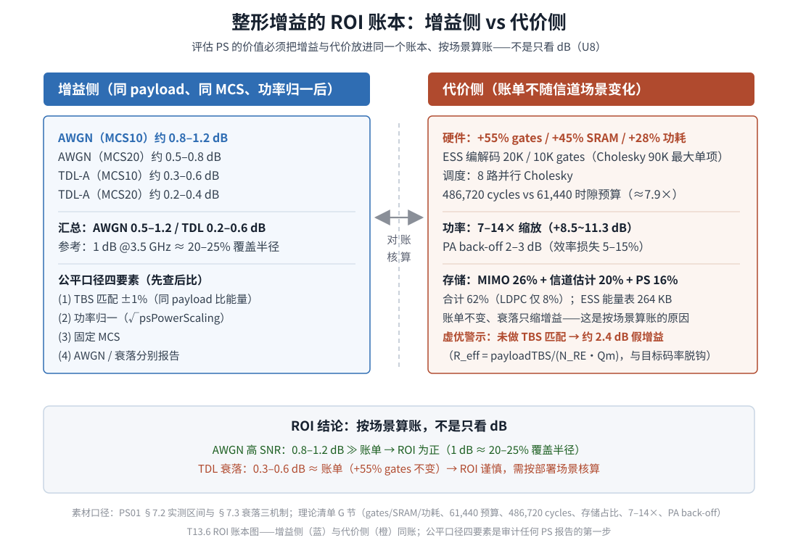

# T13.6 TBS 匹配与系统代价：整形增益的 ROI 核算

## 本节学习目标

第 5 章（[[T13.5_ps_receiver_llr_prior]]）把接收端的"感知"做完了：发射端整形的非均匀分布经 $\tilde\nu=\nu\cdot\frac{2}{3}(2^{Q_m}-1)$ 折算成先验正则（[[LLR_Prior_LLR先验]]），以完整平方 MAP 的方式配进等效信道（$\mathbf{R}_{hh}=\mathbf{G}^H\mathbf{G}+\tilde\nu\sigma^2\mathbf{I}$），检测器一行不改。第 5 章小结留下的最后一句话是：$\tilde\nu$ 的量级、MIMO（多输入多输出，Multiple-Input Multiple-Output）预处理 170 MACs（乘累加操作，Multiply-Accumulate）/tone 与 486,720 cycles 的账，"将在第 6 章汇入 TBS（传输块大小，Transport Block Size）匹配与硬件 ROI 的核算，并作为衰落三机制之三（$\tilde\nu$ 正则补偿不完美）的数值基础"。

本章（[[T13.6_tbs_matching_system_cost_roi|T13.6]]）就是这笔账的收口，也是概率整形算法系列（[[T13.1_probabilistic_shaping_overview_shaping_gain|T13.1]]–[[T13.6_tbs_matching_system_cost_roi|T13.6]]）的收尾章。系列从第 1 章提出四个核心问题（[[T13.1_probabilistic_shaping_overview_shaping_gain]] 的"系列地图"），其中 Q1 与 Q4 的完整答案要等到本章：**整形的每一分贝增益到底花多少钱（速率、硬件、功率、调度），在什么场景下这笔交易值得做**。本章要回答的，本质上是三个递进的问题：增益报告怎样才算公平（同 payload 比能量）、这个公平口径在调度层怎么实现（TBS 匹配）、以及账本另一侧的成本清单（硬件三本账与功率账单）如何与增益同账核算。

路线图：先立公平对比口径——**同 payload 比能量**四要素（TBS 匹配 ±1%、功率归一、固定 MCS（调制与编码方案，Modulation and Coding Scheme）、AWGN（加性白高斯噪声，Additive White Gaussian Noise）/衰落分别报告）；再给出有效码率 $R_{\mathrm{eff}}=\text{payloadTBS}/(N_{\mathrm{RE}}\cdot Q_m)$ 与"有效码率虚优"的数值演示（MCS10 表谱效 2.5704 vs 标称计算 4.5，虚优约 2.43 dB）；随后把 TBS 匹配落到实现——$\text{payloadTBS}(\nu)$ 单调不增、$\nu$ 二分搜索（端点评估、24 次迭代上限、配置期摊销）；接着打开账本的另一侧——功率缩放（$E_{\mathrm{new}}=4E+1$ 递推、实测 7–14×、2–3 dB PA（功率放大器，Power Amplifier）back-off）与硬件三本账（ESS（枚举球面整形，Enumerative Sphere Shaping）20K/10K gates、+55% gates / +45% SRAM（静态随机存取存储器，Static Random-Access Memory） / +28% 功耗、486,720 cycles 对 61,440 时隙预算需 8 路并行 Cholesky（乔列斯基分解，Cholesky Decomposition）、存储占比）；然后解释衰落信道下增益为何缩水（三机制）而账单为何不变；最后按场景给出 ROI 结论，并收束全系列。

学完本节后，应能做到：

- 说出公平对比的四要素（TBS 匹配 ±1%、功率归一、固定 MCS、AWGN/衰落分别报告），并解释"同 payload 比能量"为什么是唯一公平口径、缺 TBS 匹配的增益报告为何不可信。（Bloom：理解；LO13 铺垫）
- 计算 $R_{\mathrm{eff}}=\text{payloadTBS}/(N_{\mathrm{RE}}\cdot Q_m)$，用 MCS10 的数值（表谱效 2.5704 vs 标称 4.5，$R_{\mathrm{eff}}\approx0.428$）演示虚优量级（约 2.43 dB），并说出 $R_{\mathrm{eff}}$ 与目标码率 $R$ 脱钩的含义。（Bloom：应用）
- 走查 TBS 匹配的 $\nu$ 二分搜索：端点评估、括号条件、一轮 bisection 的更新规则、±1% 容差、24 次迭代上限的三层来由。（Bloom：应用）
- 用能量递推 $E\leftarrow 4E+1$ 解释功率缩放的量级（实测 7–14×，即 +8.5~11.3 dB），并按因果链说出 2–3 dB PA back-off 的来源与效率损失（5–15%）。（Bloom：理解）
- 列举硬件三本账的关键数字：ESS 编解码 20K/10K gates、PS（概率整形，Probabilistic Shaping）总计约 155K gates（相对 NR 基线 +55% gates / +45% SRAM / +28% 功耗）、486,720 cycles 对 61,440 时隙预算需 8 路并行 Cholesky、存储占比（MIMO 26% + 信道估计 20% + PS 16% = 62%，LDPC 仅 8%）。（Bloom：记忆）
- 分解衰落信道下整形增益缩小的三个机制：增益-SNR 依赖、信道随机化 $I(X;hX+N)=\mathbb{E}_h[\cdot]$ 的高斯化效应、$\tilde\nu$ 正则补偿不完美，并比较 PS 与 GS（几何整形，Geometric Shaping）在标准化难度上的差异。（Bloom：分析；LO10）
- 按场景核算 ROI：AWGN 高 SNR（信噪比，Signal-to-Noise Ratio）场景增益（0.8–1.2 dB）与账单之比为正、TDL（抽头延迟线信道模型，Tapped Delay Line）衰落场景（0.3–0.6 dB）需谨慎，并据此审计一份 PS 性能报告的公平性。（Bloom：评价；LO13）
- 画出系列六章地图、收束核心问题 Q1–Q4，并说明本章为表现性任务（报告审计、PAM-4 最小方案设计）提供了哪些工具。（Bloom：理解）

与持久理解的呼应：本章把 **U8 讲透——整形的每一分贝增益都带着工程账单（硬件面积、功率回退、调度复杂度），而衰落信道会让账单不变、收益缩水；评估 PS 的价值必须把增益与代价放进同一个 ROI 账本、按场景说话，包括"同一 payload 比能量"的公平口径**。同时深化 U1（实测区间在本章给出与账单的对照）、收束 U7（"只改四处"的边界在本章补上调度闭环这一环——TBS 匹配是第 4 章四个接入点之外的调度层约定，学习目标 15 的设计任务在此收束）。四个核心问题 Q1–Q4 在本章全部收束。

## 前置知识检查

| 前置项 | 本节需要达到的程度 |
|:---|:---|
| [[T13.1_probabilistic_shaping_overview_shaping_gain]] 概率整形总览 | 知道实测区间（AWGN 0.5–1.2 / TDL 0.2–0.6 dB）、公平对比三要素与 R_eff 虚优陷阱的第 1 章立论——本章给出数值演示与调度层闭环。 |
| [[T13.2_mb_distribution_entropy_power_tradeoff]] MB（麦克斯韦-玻尔兹曼，Maxwell-Boltzmann）分布与熵-功率权衡 | 知道 $\nu$ 是熵-功率权衡曲线的旋钮、整形增益与速率损失同源同消——$\nu$ 二分搜索是在这条曲线上为"目标 TBS"取点。 |
| [[T13.3_ess_enumerative_sphere_shaping]] ESS 枚举球面整形 | 知道 ESS 码字容量 $2^L$（$L=\lfloor\log_2 C\rfloor$）决定每 CB（码块，Code Block）的整形冗余 $\text{rateLoss}=2kN_s-\text{essNumInfoBits}$——$\text{payloadTBS}(\nu)$ 单调性的来源。 |
| [[T13.4_ps_embedding_four_access_points_bit_organization]] 四接入点与比特组织 | 知道"只改四处"的长度/统计约定根基与几何可行性条件——本章的 TBS 匹配闭环挂在接入点 1（TB 构造前）之前，是调度层的第五处约定。 |
| [[T13.5_ps_receiver_llr_prior]] PS 接收机 | 知道 $\tilde\nu$ 归一化（MCS10→5.33）、完整平方 MAP、三模式预处理（MIMO 约 170 MACs/tone）与 486,720 cycles 的账——本章把它与 61,440 时隙预算对账，并作为衰落三机制之三的数值基础。 |
| [[T9.0_TS38214_MCS_TBS_decoder_descriptor]] MCS/TBS 解码器描述 | 知道"调度层 → 规模层 → 译码层"三层模型与 $(Q_m,R)$ 查表、TBS 量化——PS 表是 5 列扩展表，$R_{\mathrm{eff}}$ 与之脱钩。 |
| [[MCS_Table_Effective_Code_Rate_MCS表与有效码率]] | 知道谱效（SE）口径 $=Q_m\cdot R/1024$——本章的虚优演示建立在"表谱效 vs 计算谱效"的对照上。 |
| [[T12.1_mimo_receiver_chain_overview]] / [[T12.3_linear_detectors_mf_zf_mmse]] MIMO 接收链路 | 知道接收链"检测器 → 软解调 + CSI（信道状态信息，Channel State Information）加权"的分工与 MMSE（最小均方误差，Minimum Mean Square Error）计算量量级——硬件账本的宿主链路。 |

如果这些前置还不稳，先抓住一句话：**本章回答"整形增益值多少钱、怎么算这笔账"——公平口径是同 payload 比能量（TBS 匹配 ±1%、功率归一、固定 MCS、AWGN/衰落分别报告）；调度层用 $\nu$ 二分搜索实现匹配；账单侧是硬件三本账（gates/SRAM/功耗与 cycle 预算）加功率缩放与 PA back-off；衰落信道让增益缩水而账单不变——ROI 必须按场景核算。**

## 公平对比口径：同 payload 比能量

第 1 章立过原则："**看到没写 TBS 匹配的增益数字，默认不可信**"（[[Probabilistic_Shaping_概率整形]] 的公平对比前提）。本章把这条原则拆成可操作的审计四要素。

先问一个尖锐的问题：为什么"同样 MCS、同样资源、同样 SNR 下 PS 的 BLER（块错误率，Block Error Rate）更低"不能直接当作整形增益的证据？因为 BLER 只回答"这一块数据译对没有"，没回答"这块数据里有多少是载荷"。整形链路上，同一块码字携带的**载荷信息量**比均匀链路少——整形区 $2kN_s$ 个 bit 里只有 $\text{essNumInfoBits}$ 个是载荷，其余是分布匹配的冗余（第 3 章 [[T13.3_ess_enumerative_sphere_shaping]] 的 rate loss）。于是"同样资源"下 PS 每 RE（资源元素，Resource Element）实际传的信息 bit 数（有效码率）低于标称码率，纠错冗余相对更多，BLER 天然更低——这是**虚优**，不是增益。

公平的口径只有一种：**同 payload 比能量**——在"每时隙传的载荷 bit 数相同"的前提下比较达到目标 BLER 所需的 SNR（或吞吐）。四个要素缺一不可：

| 要素 | 要求 | 缺了会怎样 |
|:---|:---|:---|
| **TBS 匹配** | PS 载荷 TBS 与 uniform TBS 偏差 ≤1% | 有效码率虚优，BLER/吞吐对比失真（本章第 2、3 节的数值演示） |
| **功率归一** | 发射平均功率拉回归一基线（$\sqrt{\text{psPowerScaling}}$，第 4 节展开） | 整形后平均能量低于均匀基线，接收 SNR 虚高——"发弱信号"被误报成增益 |
| **固定 MCS** | 两侧用同一 MCS index 的调度约束 | MCS 不同则 (Qm（调制阶数，Modulation Order）, R) 不同，增益与码率变化混在一起 |
| **AWGN/衰落分别报告** | 两类信道各自报告增益与 BLER 工作点 | AWGN 的 0.8–1.2 dB 被冒充成衰落信道的收益（衰落只有 0.3–0.6 dB，第 6 节） |

四要素中，功率归一是发射端物理量（第 4 节展开），固定 MCS 与分别报告是实验设计纪律，**TBS 匹配是调度层的算法闭环**——它把"同 payload"从一句口号变成可执行的搜索：找到一个 $\nu$，使 PS 链路的载荷 TBS 逼近 uniform 链路的目标 TBS。这是本章的枢纽概念：

**TBS 匹配**（TBS matching）：调度器按整形后的有效载荷重新选择整形强度 $\nu$，使 PS 载荷 TBS 与 uniform 目标 TBS 偏差不超过 1% 的闭环——把"同 payload 比能量"落到调度层的操作。它在第 4 章"只改四处"架构之外补上了第五处约定：不碰 TB/加扰/解调/解码任何一个接入点，只改"选择哪个 $\nu$"这个调度决策（[[Probabilistic_Shaping_概率整形]] 的四个接入点架构，[[T13.4_ps_embedding_four_access_points_bit_organization]]）。

## 有效码率 R_eff 与虚优陷阱

### 定义：R_eff 与目标码率脱钩

均匀链路的标称码率来自 MCS 表：$R=\text{(表列 R×1024)}/1024$，谱效 $SE=Q_m\cdot R$。PS 链路不能这样算——载荷经过分布匹配后，每符号实际携带的信息率是熵 $H_\nu$ 再减去组成约束损失（第 2、3 章）。PS02 §8.1 给出的**有效码率**定义：

**有效码率**（effective code rate, $R_{\mathrm{eff}}$）：每资源单元实际携带的载荷 bit 数与调制阶数之比，

$$
R_{\mathrm{eff}}=\frac{\text{payloadTBS}}{N_{\mathrm{RE}}\cdot Q_m}
\tag{1}
$$

其中 $\text{payloadTBS}$ 是 PS 有效载荷（$\text{chain\_tbs}-\sum_i\text{rateLoss}_i$，第 3 章口径），$N_{\mathrm{RE}}$ 是本次传输占用的资源单元数。式 (1) 回答的问题是"**每 RE 真正传了几个信息 bit**"——它由实际分配的载荷决定，与 MCS 表的目标码率 $R$ 完全脱钩：PS 表里可以写 $(Q_m=6, R=0.75)$，但如果整形吃掉大量速率，$R_{\mathrm{eff}}$ 可能只有 0.43。

### 数值演示：MCS10 的表谱效 vs 计算谱效

ps_mcs_table1（PS 专用 MCS 表，5 列结构 `[MCS, SE, Qm, R×1024, ν_MB]`，[[T9.0_TS38214_MCS_TBS_decoder_descriptor]] 的扩展）在 MCS10 行给出：64QAM（$Q_m=6$）、$R=768/1024$、表谱效 **2.5704**。而按均匀口径"计算"出来的谱效是：

$$
SE_{\text{nominal}}=Q_m\cdot R=6\times\frac{768}{1024}=4.5\ \text{bit/RE}
\tag{2}
$$

表谱效 2.5704 与计算值 4.5 之差，就是**整形对信息速率的压缩**——表谱效已经扣掉了 rate loss，是真实的载荷信息率。于是按式 (1)：

$$
R_{\mathrm{eff}}=\frac{2.5704}{6}\approx0.4284
\tag{3}
$$

对比：目标码率 $R=0.75$，有效码率 $R_{\mathrm{eff}}\approx0.428$——**脱钩**。数值口径：同一资源（$N_{\mathrm{RE}}=8112$，52 PRB（物理资源块，Physical Resource Block）的 PDSCH（物理下行共享信道，Physical Downlink Shared Channel）tone 数，[[T12.1_mimo_receiver_chain_overview]] 的调度规模）下，链 TBS 约 $8112\times4.5=36{,}504$ bit，而有效载荷约 $8112\times2.5704\approx20{,}851$ bit——每 RE 传 2.5704 bit 而非 4.5 bit（内嵌验证第 2 段复现）。

### 虚优的量化：2.43 dB

如果一份报告不做 TBS 匹配，直接让 PS 链路以"同样的 MCS10、同样的资源"和 uniform 链路比 BLER，那么它实际上在比较"0.75 码率的均匀链路"与"0.428 码率的整形链路"——整形链路冗余更多，BLER 必然更好。这个虚假优势的量级可以精确算出来：两种口径的谱效之比，

$$
10\log_{10}\frac{SE_{\text{nominal}}}{SE_{\text{table}}}
=10\log_{10}\frac{4.5}{2.5704}\approx2.43\ \text{dB}
\tag{4}
$$

式 (4) 的含义值得大声说三遍：**未做 TBS 匹配的对比里，约 2.4 dB 的"增益"可以完全由有效码率虚优解释，与整形本身无关**。第 1 章术语表的"有效码率虚优"（R_eff inflation）在本章拿到数值——任何声称的增益若接近或超过实测区间上限（AWGN MCS10 约 0.8–1.2 dB）且未披露 TBS 匹配，第一嫌疑就是虚优（习 6-3 的审计起点）。

**有效码率虚优**（R_eff inflation）：未做 TBS 匹配时，PS 的有效码率 $R_{\mathrm{eff}}$ 低于标称码率 $R$、纠错冗余相对更多，BLER 曲线"虚优"造成的虚假增益——MCS10 口径下其量级约 2.43 dB，接近甚至超过真实整形增益（[[Probabilistic_Shaping_概率整形]] 的公平对比前提，第 1 章立论、本章数值化）。

## TBS 匹配的 ν 二分搜索

公平口径要落地，就需要一个算法：给定 uniform 目标 TBS（同一 MCS index、同一资源下 uniform 链路的 TBS），找到一个 $\nu$ 使 PS 载荷 TBS 与它偏差 ≤1%。这就是 **ν 二分搜索**（nu bisection search）：利用 $\text{payloadTBS}(\nu)$ 随 $\nu$ 单调不增的性质，用二分法在端点之间搜索满足容差的 $\nu$——TBS 匹配的实现算法。

### 目标函数与单调性

设目标 TBS 为 $\text{targetTBS}$（uniform 链路值），定义

$$
\text{diff}(\nu)=\text{payloadTBS}(\nu)-\text{targetTBS},\qquad
\text{relDiff}(\nu)=\frac{|\text{diff}(\nu)|}{\text{targetTBS}}
\tag{5}
$$

容差为 $\text{target\_tolerance\_bits}=\max(1,\ 0.01\times\text{targetTBS})$，满足 $|\text{diff}|\le\text{容差}$ 即匹配成功（±1%）。**payloadTBS(ν) 单调不增**：$\nu$ 越大，MB 分布越陡（第 2 章 [[T13.2_mb_distribution_entropy_power_tradeoff]]），能量球约束内允许的幅度组成越少，ESS 码字数 $2^L$ 越小，每 CB 整形冗余 $\text{rateLoss}=2kN_s-\text{essNumInfoBits}$ 越大（第 3 章），载荷 TBS 越小。单调性使"二分"成为自然策略：载荷偏大（$\text{diff}>0$）说明 $\nu$ 太小，向右搜；载荷偏小（$\text{diff}<0$）说明 $\nu$ 太大，向左搜。

### 端点评估与括号扩展

搜索范围不是凭空猜的：先评估三个端点（每次评估 = 一次完整配置计算，见下文成本）：

1. **$\nu=0$**：均匀极限，整形退化、rateLoss≈0，payloadTBS 最大；
2. **$\nu=\nu_{MB}$**：PS 表第 5 列的自然整形速率（MCS10 为 0.1270）；
3. **$\nu=\text{upper}$**：表值可用时取 $\min(10,\ \max(2\nu_{MB},10^{-3}))$；随后若 $\text{diff}(\text{upper})>0$（目标 TBS 比表值下的载荷还大），把 upper 翻倍继续评估（$\text{upper}\leftarrow\min(10,\max(2\cdot\text{upper},\ \text{upper}+10^{-3}))$），直到 $\text{diff}\le0$ 或达到硬上限 $\text{MaxNu}=10$。

仅当括号条件成立（$\text{diff}(\text{low})\ge0$ 且 $\text{diff}(\text{upper})\le0$）才进入二分循环：每轮取 $\text{mid}=(\text{low}+\text{high})/2$ 评估，$\text{diff}(\text{mid})\ge0$ 则 $\text{low}=\text{mid}$（载荷仍偏大、$\nu$ 太小），否则 $\text{high}=\text{mid}$。最多迭代 24 次（`tbsMatchMaxIterations` 默认值）。

### 24 次迭代的三层来由

1. **分辨率**：搜索区间最宽 $[0,10]$，24 次二分后宽度 $10/2^{24}\approx6\times10^{-7}$，远小于 $\nu$ 的任何有效精度（能量表是量化表，$\nu$ 的有效差异在 $10^{-3}$ 量级）——再迭代无意义；
2. **台阶函数**：$\text{payloadTBS}(\nu)$ 是 $\nu$ 的**阶梯函数**（能量表量化 + TBS 整数化叠加），括号一旦塌进一个台阶内部，再迭代也不会改变 TBS——24 次保证收敛到台阶边界并给足裕量；
3. **成本上限**：每次评估是一次完整配置计算（约 33K 次 DP 表步进 + C 个 CB 的 ESS 构造），最坏 $24+3\approx27$ 次评估约 90 万次 DP 步——必须设硬上限防止配置期失控。

### 每轮评估的成本与配置期摊销

**配置期摊销**（configuration-time amortization）：TBS 匹配与能量表只在 (MCS index, 资源分配) 组合的配置阶段跑一次，结果 $\nu$ 固化进配置，此后每个 TB 都不再支付——匹配代价是"时隙级一次性摊销"，不是每 TB 开销。一次 `evaluateNu(ν)` 的调用链：`nrDLSCHInfo` 分段信息 → `generateEnergyTable(nMax=128, ν·4^m, 2^k)` 的双重循环 DP（约 $129\times256\approx33{,}024$ 步）→ `nrCodeBlockSegmentLDPC` CB 标签 → 每 CB 构造 ESS 对象 → 计算 payloadTransportBlockLength。

两个工程细节（PS02 §2.4、§2.6 口径）：(1) 由于阶梯量化，$\text{diff}$ 可能在某个台阶内**不严格单调**——代码不信任最后一次二分点，而是把所有评估（端点 + 扩展点 + 二分中点）存入评估表，按 `relativeDifference` 取全局最小；(2) 匹配后的 $\nu$ 与表值 $\nu_{MB}$ 可以相差较大（目标 TBS 由 uniform 表决定，PS 表 $(Q_m,R)$ 与之独立）——这直接决定了第 4 节功率缩放的实测量级（匹配后 $\nu$ 落在 0.17–0.30 区间）。容差 1% 的意义：折算到谱效约 0.01 bit/s/Hz 以下，对 BLER 曲线对比的影响可忽略，但足够防止有效码率偏差污染结论。

## 功率缩放与 PA back-off：电源账单

### 功率归一的必要性

整形把幅度集中在低电平，平均符号能量低于均匀基线（第 1 章的能量账本：16QAM 从 5.00 降到 3.13）。若不处理，接收端 SNR 的口径就变了——同样的噪声下整形链路"看起来"信噪比更高，这是发弱信号造成的虚高，与增益无关（公平对比四要素之一）。发射端必须放大：

$$
x_{\text{out}}=\sqrt{\text{psPowerScaling}}\cdot x,\qquad
\text{psPowerScaling}=\frac{E_{\text{uniform}}}{E_{\text{avg}}}
\tag{6}
$$

**功率缩放**（power scaling, psPowerScaling）：把整形后平均能量拉回均匀基线（能量 1）的乘性因子，$\sqrt{\text{psPowerScaling}}$ 作用于全部符号——功率归一的物理实现，接收端用同一因子反归一化。实现有两条路：`empirical` 模式（默认）每 TB 实测平均能量取倒数；`lut` 模式配置期查预存能量表（仅支持 $n_{\max}\in\{64,96,128,192,256\}$ 且 $2^k\le4$）。

### E_new=4E+1 递推

能量表存的是整形字母表（$2^k$ 个电平）的平均能量 $E_{\text{avg}}$，扩展未整形幅度位时用递推（PS02 §7.2）：**每增加 1 个未整形幅度 bit，平均能量按 $E\leftarrow 4E+1$ 扩展一次**。解析依据：字母表 $\{1,3,\dots,2L-1\}$ 翻倍为 $\{1,3,\dots,4L-1\}$ 时，均匀平均能量满足 $E_{2L}=4E_L+1$——校验：$5\to21\to85\to341$（16QAM→64QAM→256QAM→1024QAM 的每维均匀平均能量，第 1 章式 (2) 的递推版）。

### 实测 7–14× 与解析复现

匹配后 $\nu$ 落在大区间时，缩放相当可观。实测（empirical 模式，匹配后 $\nu$）：

| MCS | 调制 | 实测 psPowerScaling | dB | 解析复现（匹配后 $\nu$） |
|:---:|:---:|:---:|:---:|:---|
| 10 | 64QAM | **12.49×** | 10.97 dB | $\nu\approx0.30$ 时约 12.2× |
| 12 | 64QAM | **7.05×** | 8.48 dB | $\nu\approx0.17$ 时约 7.2× |
| 20 | 256QAM | **13.62×** | 11.34 dB | 64QAM 等效口径 |

汇总口径：**7–14×，即 +8.5~11.3 dB**。注意这个数字与第 1 章的"功率节省 2.04 dB"不矛盾：2.04 dB 是"同分布比功率"的理论节省（未扣速率损失），7–14× 是 TBS 匹配后（$\nu$ 更大、分布更陡）加上未整形位递推后的实际缩放——机制完全一致，量级由匹配后的有效 $\nu$ 决定。

### PA back-off 的因果链

功率缩放的账单在功放（Power Amplifier, PA；把基带/射频信号放大到天线功率的有源器件）那里结算。**峰均比**（Peak-to-Average Power Ratio, PAPR）：信号峰值功率与平均功率之比。因果链四步：

1. **整形降低平均功率**（$E_{\text{avg}}\ll E_{\text{uniform}}$），而**峰值幅度不变**（仍由最高电平决定）→ PAPR 升高；
2. **功率缩放把平均功率拉回 1.0，同时把峰值放大 $\sqrt{\text{psPowerScaling}}$ 倍**（$\sqrt{13.62}\approx3.69\times$）；
3. **PA 饱和点固定**，放大的峰值要求额外回退，否则削波/互调失真；
4. 回退导致 PA 效率下降 5–15%（B 类 PA 每 dB 回退约损失 5% 效率）。

**PA back-off**（功放回退）：功放为避免削波与互调失真，在饱和点以下预留的线性度余量——功率缩放把峰值顶高后必须多留的 2–3 dB，是整形增益的"电源账单"。工程取舍：AWGN 高 SNR 场景 0.8–1.2 dB 链路增益远大于 back-off 的折算损失，ROI 为正；TDL 衰落场景增益缩水到 0.3–0.6 dB，back-off 账单不变，ROI 需谨慎（第 7 节按场景核算）。

## 硬件三本账：面积、周期与存储

第 5 章给过一张伏笔账：MIMO 4×4 预处理单引擎串行 8,112 tone × 60 cycles/tone ≈ 486,720 cycles，超过 0.5 ms 时隙预算。本节把它与另外两张账并排打开——**硬件三本账**（three hardware ledgers）：面积（gates）、周期（cycle 预算）、存储（SRAM 占比）三张账，PS 的工程代价全部在这三张账里结算。

### 账一：面积（gates）

PS 各子模块的独立面积账（理论清单与 PS02 口径）：

| 模块 | 面积 | 说明 |
|:---|:---|:---|
| ESS 编码器 | **约 20K gates** | 区间定位 O(n) 严格串行（第 3 章编解码非对称性） |
| ESS 解码器 | **约 10K gates** | $O(1)$ 查表口径、可流水 |
| 能量表 | 约 5K gates | 配套存储另计（264 KB SRAM，见账三） |
| TBS 匹配 | 约 10K gates | ν 二分搜索的配置协处理器 |
| Cholesky 预处理 | **约 90K gates** | 第 5 章完整平方 MAP 的 MIMO 硬件（三本账里最大单项） |
| **PS 总计** | **约 155K gates、约 36 mW** | 相对 NR 基线 **+55% gates / +45% SRAM / +28% 功耗** |

三本账的汇总口径：**+55% gates、+45% SRAM、+28% 功耗**（相对 NR 基线；参考基线 7nm 52PRB 约 7.4M gates、6.1 MB、约 167 mW）。注意结构：Cholesky 预处理单项 90K gates 占 PS 总计的大半——**MIMO+PS 组合是面积账单的重头**，SISO（单入单出，Single-Input Single-Output）/SIMO（单入多出，Single-Input Multiple-Output）模式（约 6 / $5N_{rx}+4$ MACs/tone）几乎免费（第 5 章三模式预处理）。

### 账二：周期（cycle 预算）

**时隙 cycle 预算**（slot cycle budget）：一个 0.5 ms 时隙在参考时钟 122.88 MHz 下的可用周期数，$0.5\times10^{-3}\times122.88\times10^6=61{,}440$ cycles——各阶段硬件需求对账的基准。各阶段需求（理论清单口径）：

| 阶段 | cycle 需求（每时隙） | 对账结论 |
|:---|:---|:---|
| LDPC 译码 | 约 **5.1M** | 专用引擎（81× 超预算，必须专用硬件+并行） |
| **Rhh + Cholesky（MIMO+PS）** | **约 486,720** | **需 ≥8 路并行**（486,720/61,440≈7.92） |
| MMSE 均衡 | 约 162,240 | ≥4 路 |
| FFT（快速傅里叶变换，Fast Fourier Transform） | 约 20,480 | 4 引擎 |
| ESS 编码 / 解码 | 约 30,000 / 约 1,500 | 解码比编码轻一个量级（第 3 章编解码非对称性的周期版） |

MIMO+PS 这一行是本章的核心对账（内嵌验证第 1 段复现）：

$$
\frac{8{,}112\ \text{tones}\times60\ \text{cycles/tone}}{61{,}440\ \text{cycles/时隙}}
=\frac{486{,}720}{61{,}440}\approx7.92
\ \Rightarrow\ \lceil7.92\rceil=8\ \text{路并行}
\tag{7}
$$

8 路并行后每引擎 60,840 cycles ≈ 0.495 ms，勉强塞进时隙预算。结论与第 5 章一致：**瓶颈只在 MIMO 4×4 + PS 组合**——SISO/SIMO 完全无压力，MIMO+PS 是唯一需要专门并行引擎的组合（学习目标 LO14 的评价对象）。

### 账三：存储（SRAM 占比）

完整 Modem 的存储大头不在 LDPC：**MIMO 矩阵族 26% + 信道估计 20% + PS 16% = 62%**，而 **LDPC 仅占 8%**——每 RE 的矩阵与信道状态才是存储主力。PS 的 16% 里含 ESS 能量表（264 KB SRAM，第 3 章 DP 计数表 129×35~920 的定点存储）与 PS 解调 LUT（查找表，Look-Up Table）（1024QAM 时约 7.7 KB ROM（只读存储器，Read-Only Memory），第 5 章）等。**存储占比**（memory share）：各子系统 SRAM 占完整 Modem 存储的比例——"PS 只多 16%"是它的存储账单，而 MIMO 矩阵族（26%）是整条链路的既有大头，PS 的 16% 是叠加在其上的新增项。

三本账合起来回答 Q4 的一半：**每分贝整形增益的硬件单价**——AWGN 场景 0.8–1.2 dB 换 +55% gates / +45% SRAM / +28% 功耗与 8 路并行 Cholesky；TDL 场景 0.3–0.6 dB 换同样的账单（第 7 节 ROI 结论）。这也是 [[T11.4_decoder_hardware_tradeoff_comparison]] 式的硬件权衡分析在整形场景的复现——只是这次权衡对象不是译码器，而是整条 PS 子系统的增量。

## 衰落信道下增益缩小的三机制

第 1 章给了实测区间的对照：AWGN MCS10 约 0.8–1.2 dB vs TDL-A MCS10 约 0.3–0.6 dB（汇总口径 AWGN 0.5–1.2 / TDL 0.2–0.6 dB，[[T2.15_fading_channel_LLR_reliability]] 与 [[Fading_Channel_衰落信道]] 的信道背景）。为什么同样的整形、同样的账单，衰落下只拿一半不到？**衰落增益缩小三机制**（three mechanisms of fading gain reduction）按由浅入深排列：

1. **增益-SNR 依赖**：整形增益在高 SNR 才显著（第 1 章三折扣之三——低速率/低 SNR 时最优输入本就接近二值/低阶，整形空间小）。衰落信道下瞬时 SNR 剧烈波动，**深衰落区间（低 SNR）贡献的速率权重高，而这些区间的整形增益趋近于 0**——平均后总增益被稀释。机制一的落点是"时间平均稀释"。

2. **信道随机化**：有衰落时接收为 $\tilde{Y}=hX+N$，$h$ 随机 ⇒ 等效输入分布被 $h$ 平滑：互信息
$$
I(X;hX+N)=\mathbb{E}_h\big[I(X;hX+N\mid h)\big]
\tag{8}
$$
对输入分布 $P_X$ 的敏感度下降——**高斯化效应**：均匀与 MB 输入的可达速率差距在"平均"意义上被压缩。式 (8) 回答的问题是：为什么衰落把"输入分布形状"这个变量的重要性磨平——信道本身随机化了，输入分布再精心设计，也被 $h$ 的统计平均抹掉一部分。机制二的落点是"平均压缩敏感度"。

3. **ν̃ 正则补偿不完美**：第 5 章的先验注入在衰落场景要面对信道估计误差与 MMSE 均衡的 LLR（对数似然比，Log-Likelihood Ratio）失真。仿真用 ${\nu}\text{Regularizer}=n_{\text{var}}\times\tilde\nu$（$\tilde\nu=\nu\cdot\frac{2}{3}(2^{Q_m}-1)$，MCS10→5.33）在预处理中注入整形先验来缓解，但**补偿不完美时部分增益被吃掉**。机制三是工程因素，也是第 5 章 $\tilde\nu$ 数值的收口：$\tilde\nu$ 与 Gram 矩阵同量级、不可忽略，但"注入了"不等于"注准了"。

三个机制的分工：机制一是信道的**统计性质**（低 SNR 区间没有整形空间），机制二是信息论的**平均效应**（$h$ 随机化磨平输入敏感度），机制三是工程的**实现误差**（先验补偿不完美）。对照第 1 章三折扣的结构——有限星座/有限块长/有限 SNR——衰落三机制是"有限 SNR"折扣在时变信道下的完整展开。顺带回答 LO10 的附属问题：PS 与 GS 在标准化难度上的差异（第 1 章已述）与衰落无关——GS 改星座坐标、需协商新星座表，衰落只会让它的增益同样缩水，但标准化障碍不变；**衰落三机制是 PS 与 GS 共同面对的信道属性，不是 PS 特有的缺陷**。

## ROI 结论：按场景算账

把增益侧与代价侧放进同一个账本（图 1）：增益侧是同 payload、同 MCS、功率归一后按场景实测的 dB；代价侧是三本账 + 功率账单，**账单不随信道场景变化**。



**ROI 核算**（return on investment, ROI accounting）：把整形增益（dB）与硬件三本账、功率账单放进同一张账本比较，判断"每分贝值多少钱"——评估 PS 价值的正确姿势是按场景算账，不是只看 dB。三个场景的结论：

| 场景 | 增益（BLER=10⁻² 口径） | 账单 | ROI 结论 |
|:---|:---|:---|:---|
| AWGN，MCS10（64QAM+PS） | 约 0.8–1.2 dB | +55% gates / +45% SRAM / +28% 功耗、8 路 Cholesky、7–14× 缩放 + 2–3 dB back-off | **正**：1 dB @3.5 GHz ≈ 20–25% 覆盖半径增益，链路增益显著大于账单折算 |
| AWGN，MCS20（256QAM+PS） | 约 0.5–0.8 dB | 同上 | 偏正：增益收窄，仍需按部署场景核算 |
| TDL-A（衰落），MCS10/20 | 约 0.3–0.6 / 0.2–0.4 dB | **账单不变** | **谨慎**：增益与账单同量级，账单不变而收益缩水——这正是"按场景算账"要防的坑 |

ROI 的另一个必要前提是公平口径本身：**若报告未做 TBS 匹配，其"增益"中约 2.4 dB 可由虚优解释，ROI 计算的前提即不成立**（第 2 节）。所以本章的审计工具链是：先查四要素（TBS 匹配、功率归一、固定 MCS、AWGN/衰落分别报告），再算 R_eff 与虚优量级，最后把可信增益放进 ROI 账本按场景判断——这三步就是表现性任务 3（审计一份 PS 性能报告）的操作清单（00-教材设计 §四 任务 3，本章承载）。

## 系列收束：六章地图与四个核心问题

系列六章到此闭环。地图回顾（与第 1 章"系列地图"一致）：

| 章 | 主题 | 承载理解 | 关键资产 |
|:---|:---|:---|:---|
| 1（[[T13.1_probabilistic_shaping_overview_shaping_gain]]） | 整形增益的来源与边界 | U1 讲透、U2 铺垫 | 1.53 dB（πe/6）、三折扣、实测区间、以速率买能量账本开张 |
| 2（[[T13.2_mb_distribution_entropy_power_tradeoff]]） | MB 分布与熵-功率权衡 | U2 讲透 | $P(a)=e^{-\nu a^2}/Z$、$\nu$ 旋钮、$dH/d\nu=-\nu\,\mathrm{Var}(A^2)\le0$ |
| 3（[[T13.3_ess_enumerative_sphere_shaping]]） | ESS 枚举球面整形 | U3、U4 讲透 | 能量球枚举、DP 计数表、有限块长 0.0307/0.0423/0.0469 |
| 4（[[T13.4_ps_embedding_four_access_points_bit_organization]]） | PS 嵌入 NR | U5、U7 讲透 | 四个接入点、SBPM（整形比特位置映射，Shaped Bit Position Mapping）、选择性加扰、parity-as-sign |
| 5（[[T13.5_ps_receiver_llr_prior]]） | PS 接收机 | U6 讲透 | LLR prior、$\tilde\nu$ 归一化、完整平方 MAP、三模式预处理 |
| 6（本章） | TBS 匹配与系统代价 | **U8 讲透、U1 深化、U7 收束** | 公平四要素、R_eff 虚优、$\nu$ 二分搜索、三本账、衰落三机制、ROI |

四个核心问题的收束：

| 核心问题 | 最终答案（本章收束） |
|:---|:---|
| Q1 使用概率为何值得成为第三个自由度、功率是否白拿 | 均匀使用是功率受限信道下可量化的浪费（U1）；增益不是白拿——每分贝都带着速率（第 2/3 章）、硬件、功率账单，ROI 按场景核算（U8） |
| Q2 接收端需要"知道"多少 | 必须感知、方式自由（U6）：LLR prior / $\tilde\nu$ 正则注入（第 5 章）；不感知则增益变负；感知不完美则衰落场景增益缩水（机制三） |
| Q3 为什么只改四处就能嵌入标准链路 | NR 各级只认长度与统计约定（U7）：四个接入点 + 调度层 TBS 匹配闭环，NR spine 全复用；边界在破坏长度/统计约定的改动 |
| Q4 每分贝增益花多少钱、什么场景值得 | 账本：速率损失（第 2/3 章）+ 三本账（+55% gates / +45% SRAM / +28% 功耗、8 路并行 Cholesky）+ 功率账单（7–14× 缩放、2–3 dB back-off）；值得的场景：AWGN 高 SNR（0.8–1.2 dB ≫ 账单），衰落场景谨慎（0.3–0.6 dB ≈ 账单） |

迁移目标预告：本章（与全系列）为四条迁移目标提供了完整工具——(1) 读 DVB-S2X 或任意 PS 论文时，用"分布选择 / 匹配器实现 / 接收端先验处理 / 速率损失来源"四项决策 + "熵-功率-代价"框架评价增益声明（[[T13.1_probabilistic_shaping_overview_shaping_gain]] 的 DVB-S2X 先例、本章的审计四要素）；(2) 在未教过的链路上（如 PAM-4、PUSCH（物理上行共享信道，Physical Uplink Shared Channel））做参数选择时，用第 2 章 $\nu$ 候选区间 + 第 3 章 DM（分布匹配，Distribution Matching）取舍 + 第 4 章 bit 位置与加扰保护 + 第 5 章先验注入 + 本章 TBS 匹配与可行性检查（习 6-4 的 1024QAM 同构任务）；(3) 审计性能报告时用本章的四要素清单 + R_eff 虚优数值（习 6-3）；(4) 迁移"位置语义 + 先验契约 + 代价同账"三件套到任何非均匀使用概率的新技术。

## 内嵌验证：时隙预算与 R_eff 虚优

本节用 numpy 验证两件事：(1) 时隙预算对账——8,112 tone × 60 cycles/tone = 486,720 cycles 对 61,440 cycles 的时隙预算，得出 8 路并行 Cholesky；(2) R_eff 虚优数值演示——MCS10 表谱效 2.5704 vs 标称计算 4.5，R_eff≈0.428、虚优约 2.43 dB。代码与素材口径（理论清单、PS02 §5.6/§8.1）逐项核对：

```python
import numpy as np

# ---------- 1. 时隙预算与并行路数：MIMO 4x4 + PS 预处理 ----------
tones = 8112                 # 52 PRB PDSCH tone 数（624 子载波 x 14 符号 - DMRS 等）
cycles_per_tone = 60         # 每 tone 延迟 cycles（PS02 5.5 表）
total_cycles = tones * cycles_per_tone
clock = 122.88e6             # 参考时钟 122.88 MHz
slot_cycles = int(0.5e-3 * clock)          # 0.5 ms 时隙预算
n_lanes = int(np.ceil(total_cycles / slot_cycles))
per_lane = total_cycles / n_lanes

print("1) 时隙预算与并行路数（MIMO 4x4 + PS 预处理）")
print(f"   8,112 tones x 60 cycles/tone = {total_cycles:,} cycles")
print(f"   0.5 ms 时隙预算 @122.88 MHz = {slot_cycles:,} cycles")
print(f"   {total_cycles:,} / {slot_cycles:,} = {total_cycles/slot_cycles:.4f}  ->  需 ceil = {n_lanes} 路并行")
print(f"   每引擎 {per_lane:,.0f} cycles = {per_lane/clock*1e3:.4f} ms (< 0.5 ms)")

# ---------- 2. R_eff 虚优数值演示（MCS10，ps_mcs_table1 口径） ----------
Qm = 6                                  # 64QAM
R = 768 / 1024                          # 目标码率（表列 R x 1024）
SE_nominal = Qm * R                     # 标称谱效 = 4.5 bit/RE
SE_table = 2.5704                       # PS 表实际谱效（整形压缩后）
R_eff = SE_table / Qm                   # 有效码率（与目标码率 R 脱钩）
chain_bits = tones * SE_nominal         # 链 TBS（未量化口径）
payload_bits = tones * SE_table         # 有效载荷（未量化口径）
inflation = SE_nominal / SE_table
infl_db = 10 * np.log10(inflation)

print("\n2) R_eff 虚优数值演示（MCS10：64QAM，R=768/1024）")
print(f"   标称谱效 SE_nominal = Qm*R = 6*768/1024 = {SE_nominal:.1f} bit/RE；PS 表谱效 = {SE_table} bit/RE")
print(f"   R_eff = SE_table/Qm = {R_eff:.4f}   （vs 目标码率 R = {R:.2f}：脱钩）")
print(f"   链 TBS ~ {tones} x {SE_nominal} = {chain_bits:.0f} bit；有效载荷 ~ {tones} x {SE_table} = {payload_bits:.1f} bit")
print(f"   虚优倍数 = {inflation:.4f}  ->  {infl_db:.2f} dB（未做 TBS 匹配时 BLER 对比的虚假'增益'量级）")

# ---------- 3. 断言 ----------
assert total_cycles == 486720 and slot_cycles == 61440
assert abs(total_cycles / slot_cycles - 7.921875) < 1e-9 and n_lanes == 8
assert abs(SE_nominal - 4.5) < 1e-12
assert abs(R_eff - 2.5704 / 6) < 1e-12
assert abs(infl_db - 2.43) < 0.01
print("\n断言全部通过：486,720/61,440≈7.92→8 路并行；SE 4.5 vs 2.5704；R_eff≈0.4284；虚优≈2.43 dB ✓")
```

真实运行输出（断言全部通过）：

```text
1) 时隙预算与并行路数（MIMO 4x4 + PS 预处理）
   8,112 tones x 60 cycles/tone = 486,720 cycles
   0.5 ms 时隙预算 @122.88 MHz = 61,440 cycles
   486,720 / 61,440 = 7.9219  ->  需 ceil = 8 路并行
   每引擎 60,840 cycles = 0.4951 ms (< 0.5 ms)

2) R_eff 虚优数值演示（MCS10：64QAM，R=768/1024）
   标称谱效 SE_nominal = Qm*R = 6*768/1024 = 4.5 bit/RE；PS 表谱效 = 2.5704 bit/RE
   R_eff = SE_table/Qm = 0.4284   （vs 目标码率 R = 0.75：脱钩）
   链 TBS ~ 8112 x 4.5 = 36504 bit；有效载荷 ~ 8112 x 2.5704 = 20851.1 bit
   虚优倍数 = 1.7507  ->  2.43 dB（未做 TBS 匹配时 BLER 对比的虚假'增益'量级）

断言全部通过：486,720/61,440≈7.92→8 路并行；SE 4.5 vs 2.5704；R_eff≈0.4284；虚优≈2.43 dB ✓
```

两组读法（教学要点）：

1. **8 路的由来**：486,720/61,440 = 7.9219，取上整得 8——**刚好差一点**：7 路（69,531 cycles/引擎 ≈ 0.566 ms）超预算，8 路（60,840 cycles ≈ 0.495 ms）勉强塞进 0.5 ms 时隙。这个"差一点"正是 MIMO+PS 需要专门并行引擎、而 SISO/SIMO 完全不需要的量化边界（第 5 章"瓶颈只在 MIMO+PS"的数字证据）。
2. **虚优的量级**：标称谱效 4.5 与表谱效 2.5704 的比值 1.7507 → 2.43 dB——恰好与 AWGN MCS10 实测增益区间（0.8–1.2 dB）同量级甚至更大。**一份声称"2 dB 以上增益"且未披露 TBS 匹配的报告，其增益可以被虚优完整解释**——这是习 6-3 审计的第一步。

## 示范例题

### 例 1（应用）：R_eff 与虚优演示——MCS10 的谱效对照

**题目**：MCS10 在 ps_mcs_table1 中为 64QAM（$Q_m=6$）、$R=768/1024$，表谱效 2.5704 bit/RE；52 PRB 的 PDSCH tone 数 $N_{\mathrm{RE}}=8112$。(1) 计算标称谱效与有效码率 $R_{\mathrm{eff}}$；(2) 计算链 TBS 与有效载荷的（未量化）量级；(3) 计算虚优的 dB 量级，并说明它对增益报告审计的含义。

**解答**：

(1) 式 (2)：$SE_{\text{nominal}}=Q_m\cdot R=6\times768/1024=4.5$ bit/RE。式 (3)：$R_{\mathrm{eff}}=2.5704/6\approx0.4284$——目标码率 0.75 与有效码率 0.428 **脱钩**，中间差的就是整形吃掉的信息速率。

(2) 链 TBS（未量化）$=8112\times4.5=36{,}504$ bit；有效载荷 $=8112\times2.5704\approx20{,}851$ bit。**同一资源下，整形链路每 RE 只传 2.5704 bit，而不是 4.5 bit**——少掉的 43% 是 rate loss 与整形压缩。

(3) 式 (4)：$10\log_{10}(4.5/2.5704)\approx2.43$ dB。审计含义：未做 TBS 匹配的 BLER 对比中，约 2.4 dB 的"增益"可完全由有效码率虚优解释；而 AWGN MCS10 的真实整形增益只有约 0.8–1.2 dB——**声称的增益若大于约 1.2 dB 且未披露 TBS 匹配，第一嫌疑是虚优，不是整形**。

**点评**：这道题的考点是"口径对照"：标称谱效（4.5）来自表列计算，表谱效（2.5704）是扣过 rate loss 的真实值，两者之比就是虚优的 dB。记住锚点：**MCS10 的虚优约 2.43 dB，与实测增益区间同量级**——审计任何 PS 报告的起点。

## 引导练习

### 练习 1（应用）：TBS 匹配的 ν 二分单轮走查

**题目**：某配置下 uniform 目标 TBS = 20,000 bit，容差为 ±1%。端点评估结果（教学示例数值）：$\nu=0$ 时 payloadTBS = 24,000；$\nu=\nu_{MB}=0.127$ 时 payloadTBS = 17,500。(1) 计算两个端点的 diff 与 relDiff，判断括号条件是否成立；(2) 执行第一轮二分（$\text{mid}=0.0635$，假设评估得 payloadTBS = 20,480），按更新规则写出 low/high 的新值；(3) 执行第二轮二分（$\text{mid}=0.09525$，假设评估得 payloadTBS = 19,800），判断是否满足容差；(4) 说明每一轮评估的成本是什么、为什么这是配置期开销。

**提示**：式 (5) 直接代入；更新规则——$\text{diff}(\text{mid})\ge0$（载荷仍偏大、$\nu$ 太小）则 $\text{low}=\text{mid}$，否则 $\text{high}=\text{mid}$；容差 $\max(1,\ 0.01\times20{,}000)=200$ bit。

**参考答案**：(1) $\nu=0$：$\text{diff}=+4{,}000$，relDiff = 20.0%（载荷偏大）；$\nu=0.127$：$\text{diff}=-2{,}500$，relDiff = 12.5%（载荷偏小）。括号条件 $\text{diff}(\text{low})\ge0\ge\text{diff}(\text{high})$ 成立，进入二分。(2) 第一轮 $\text{mid}=0.0635$：$\text{diff}=20{,}480-20{,}000=+480>0$（2.4%，未满足容差）——载荷仍偏大、$\nu$ 太小，故 $\text{low}=0.0635$，括号变 $[0.0635,\ 0.127]$。(3) 第二轮 $\text{mid}=(0.0635+0.127)/2=0.09525$：$\text{diff}=19{,}800-20{,}000=-200$，$|\text{diff}|=200=\text{容差}$，relDiff = 1.0% ≤ 1%——**匹配成功**，$\nu\approx0.095$（工程上再以全局最小 relDiff 的评估点为准，见正文第 3 节）。(4) 每轮评估 = 一次完整配置计算：33K 次 DP 能量表步进 + C 个 CB 的 ESS 构造（约 129×256 双重循环）；这是**配置期开销**——只在 (MCS index, 资源分配) 组合配置时支付，匹配结果 $\nu$ 固化后每个 TB 都不再支付（配置期摊销）。

### 练习 2（分析，LO10）：衰落三机制分解

**题目**：AWGN MCS10 实测增益约 0.8–1.2 dB，TDL-A MCS10 只有约 0.3–0.6 dB。(1) 分解衰落信道下整形增益缩小的三个机制，各用一句话说清机理；(2) 说明三机制中哪个是信息论效应、哪个是统计性质、哪个是工程因素；(3) 对照 PS 与 GS：衰落对两者的增益影响是否不同？标准化难度差异是否因衰落改变？

**提示**：机制一落点在"深衰落低 SNR 区间的增益权重"，机制二看式 (8) 对 $P_X$ 的敏感度，机制三回想第 5 章的 $\tilde\nu$ 正则与信道估计误差；GS 的差异在"改坐标 vs 改概率"（第 1 章已述）。

**参考答案**：(1) 机制一（增益-SNR 依赖）：整形增益在高 SNR 才显著，深衰落（低 SNR）区间贡献的速率权重高而整形增益趋近 0，时间平均后总增益被稀释；机制二（信道随机化）：$I(X;hX+N)=\mathbb{E}_h[I(X;hX+N\mid h)]$ 对输入分布 $P_X$ 的敏感度下降（高斯化效应），均匀与 MB 输入的可达速率差被 $h$ 的平均磨平；机制三（$\tilde\nu$ 正则补偿不完美）：衰落伴随信道估计误差与 MMSE LLR 失真，$n_{\text{var}}\times\tilde\nu$ 的先验注入不完美，部分增益被吃掉。(2) 机制一是信道的统计性质（低 SNR 区间无整形空间）、机制二是信息论的平均效应（$h$ 随机化磨平敏感度）、机制三是工程实现误差。(3) 衰落对 PS 与 GS 的增益影响是同构的——两者都依赖高 SNR 与输入分布设计，衰落的三机制同样作用于 GS；标准化难度差异（GS 改星座坐标需协商新表、PS 贴标准接口）是标准流程属性，不因衰落改变。**分析要点**：三机制分工明确 + GS 对照说清"共同信道属性 vs 各自标准化障碍"，即满分。

## 独立习题

### 习 6-1（记忆）：列举硬件三本账的关键数字

**题目**：列举 PS 硬件三本账（面积、周期、存储）的关键数字，每本账至少给出两个数字，并指出三本账中最大单项在哪本账。

**参考答案**：(1) **面积账**：ESS 编码约 20K gates / 解码约 10K gates；Cholesky 预处理约 90K gates（**三本账中最大单项**）；PS 总计约 155K gates、约 36 mW；相对 NR 基线 **+55% gates / +45% SRAM / +28% 功耗**。(2) **周期账**：时隙预算 61,440 cycles（0.5 ms @122.88 MHz）；Rhh+Cholesky 486,720 cycles（486,720/61,440≈7.92→**8 路并行**）；对照 LDPC 约 5.1M（81× 超预算、专用引擎）、MMSE 约 162,240（≥4 路）、ESS 编码约 30,000 / 解码约 1,500。(3) **存储账**：MIMO 矩阵族 26% + 信道估计 20% + PS 16% = 62%（LDPC 仅 8%）；ESS 能量表 264 KB SRAM、PS 解调 LUT 1024QAM 约 7.7 KB ROM。记忆锚：**面积看 gates（90K Cholesky 最大）、周期看预算（61,440 对 486,720）、存储看占比（PS 16%、LDPC 8%）**。

### 习 6-2（评价，numpy，LO14）：时隙预算与 8 路并行 Cholesky 的必要性

**题目**：MIMO 4×4 + PS 预处理每 tone 约 170 MACs、延迟约 60 cycles/tone（PS02 §5.5），PDSCH tone 数 8,112，参考时钟 122.88 MHz、时隙 0.5 ms。用 numpy：(1) 计算总 cycle 需求与时隙预算；(2) 计算所需并行路数（上整）与每引擎延迟；(3) 对照 SISO（约 6 MACs/tone）说明瓶颈位置；(4) 评价：TDL-A 场景只拿 0.3–0.6 dB 增益时，8 路 Cholesky + 55% gates 的 ROI 边界在哪里。

**参考答案**（代码与输出；与内嵌验证第 1 段同构，可对照）：

```python
import numpy as np

tones = 8112                                # 52 PRB PDSCH tone 数
cycles_per_tone = 60                        # MIMO 4x4 + PS 预处理延迟
total = tones * cycles_per_tone             # 486,720 cycles
slot = int(0.5e-3 * 122.88e6)               # 61,440 cycles（0.5 ms @122.88 MHz）
n = int(np.ceil(total / slot))              # 8 路并行
per = total / n                             # 每引擎 cycle
print(f"总需求 = {tones} x {cycles_per_tone} = {total:,} cycles；时隙预算 = {slot:,} cycles")
print(f"所需路数 = ceil({total:,}/{slot:,}) = {n}；每引擎 {per:,} cycles = {per/122.88e6*1e3:.3f} ms")
assert total == 486720 and slot == 61440
assert n == 8 and abs(per / 122.88e6 * 1e3 - 0.495) < 0.001
print("断言通过：8 路并行、每引擎约 0.495 ms ✓")
```

```text
总需求 = 8112 x 60 = 486,720 cycles；时隙预算 = 61,440 cycles
所需路数 = ceil(486,720/61,440) = 8；每引擎 60,840.0 cycles = 0.495 ms
断言通过：8 路并行、每引擎约 0.495 ms ✓
```

**说明**：(1) 486,720/61,440 = 7.9219，上整 8 路，每引擎 60,840 cycles ≈ 0.495 ms 勉强塞进 0.5 ms 时隙；(2) SISO 模式约 6 MACs/tone（约 21 cycles/tone 量级），总需求约 170K cycles、约 3 路即可——**瓶颈只在 MIMO 4×4 + PS 组合**（第 5 章三模式预处理的周期版）；(3) ROI 边界评价：AWGN 场景 0.8–1.2 dB 增益（1 dB ≈ 20–25% 覆盖半径）相对 8 路引擎 + 90K gates 的增量是划算的；TDL-A 场景增益缩水到 0.3–0.6 dB 而引擎账单不变——若部署以衰落信道为主，8 路 Cholesky 的 ROI 需要重新论证（例如降为 SISO/SIMO 模式、放弃 MIMO+PS 组合，或只在 MIMO 高 SNR 场景启用）。**评分要点**：486,720 / 61,440 / 8 路 / 0.495 ms 四数正确，且能评价"账单不变、增益缩水"的 ROI 边界（LO14）。

### 习 6-3（评价，LO13）：审计一份 PS 性能报告

**题目**：某报告声称："64QAM MCS10 下，PS 相对 uniform 获得 **2.6 dB** 增益（BLER=10⁻²，AWGN 信道，相同 MCS 与资源），硬件开销 +55% gates 可接受。"报告未提及 TBS 匹配与功率归一，也未给出衰落信道数据。请按审计清单：(1) 逐项勾检公平对比四要素；(2) 用本章数值评估 2.6 dB 的可信度（R_eff 虚优量级、实测区间）；(3) 给出"可信/不可信"判断与再测建议。

**参考答案**：(1) 四要素勾检：TBS 匹配——**缺**（未披露 payload 口径，链 TBS 与载荷 TBS 不分）；功率归一——**缺**（未说明 psPowerScaling 处理，若未归一则 SNR 虚高）；固定 MCS——**有**（声明"相同 MCS 与资源"）；AWGN/衰落分别报告——**部分**（只报 AWGN，未给衰落，结论不可外推）。(2) 可信度评估：MCS10 的虚优量级 $10\log_{10}(4.5/2.5704)\approx2.43$ dB——**2.6 dB 的声称增益可以被有效码率虚优完整解释**；即使假设报告做了全部公平处理，AWGN MCS10 的实测区间也只有约 0.8–1.2 dB（BLER=10⁻² 口径），2.6 dB 超过区间上限一倍以上；且 +55% gates 的硬件开销声明与本章账本一致，但"可接受"未与增益同账核算（没算 ROI）。(3) 判断：**不可信**——缺 TBS 匹配一项即可否决（第 1 章原则："没写 TBS 匹配的增益数字，默认不可信"）。再测建议：补 TBS 匹配（$\nu$ 二分搜索使载荷 TBS 与 uniform 偏差 ≤1%）、功率归一（√psPowerScaling）、固定 MCS 双盲对比、AWGN + TDL-A 双场景分别报告（各报 BLER 工作点与吞吐），再按场景核算 ROI。**评分要点**：四要素逐项勾检 + 2.43 dB 虚优数值 + 实测区间上限对照 + 明确判断，四者齐备即满分。

### 习 6-4（创造，LO15）：1024QAM k=4 最小 PS 方案设计

**题目**：为一条 1024QAM（$Q_m=10$）链路设计最小 PS 嵌入方案：每维 4 个幅度 bit 全部整形（k=4，无未整形幅度位）。(1) 划定 $\nu$ 候选区间并预估功率节省与速率损失；(2) 选定 DM 实现（ESS vs CCDM）并说明理由；(3) 标注整形 bit 位置与加扰保护（三件套：SBPM、shaped mask、选择性加扰）；(4) 给出接收端先验注入与功率归一方案；(5) 代入几何可行性条件（$Q_m/2-k=1$，对比 PAM-4 的 $Q_m/2-k=0$ 边界），论证可行性。

**参考答案**（模型设计，无唯一答案；评分按五要素齐全程度）：

(1) **ν 候选区间**：参考 ps_mcs_table1 的 MCS24（1024QAM）表值 $\nu=0.0084$（对应 $\tilde\nu=0.0084\times\frac{2}{3}(2^{10}-1)=5.73$，第 5 章表）；候选区间取 $[0,\ 0.01]$，由 TBS 匹配的 $\nu$ 二分搜索在区间内取点。**功率节省**：1024QAM 在 $\nu=0.0084$ 口径下理论功率节省约 0.59 dB（第 1 章表），匹配后 $\nu$ 若上移则分布更陡、节省增大但**速率损失**同步增大（16 电平熵 $H_\nu<4$ bit/维 + 组成约束损失 ~(1/2n)log₂n，n=128 时约 0.03 bit/符号量级）——用熵-功率权衡曲线取折中点（第 2 章框架）。

(2) **DM 实现选 ESS**：16 电平字母表（$\{1,3,\ldots,31\}$）下能量球约束的序列集合远大于 CCDM 的固定组成集合，rate loss 更小（第 3 章）；ESS 的 DP 计数表（整数能量 $(a^2-1)/8$ 映射、约 129×~256 的双重循环）可定点化，硬件约 20K gates 编码 / 10K 解码可接受。理由一句话：**k=4 时电平数多、能量球相对组成的集合优势更大，ESS 的 rate loss 与可实现性综合最优**。

(3) **bit 位置与加扰保护**：每符号 $Q_m=10$ bit 中，位 1、2 是 sign 位（均匀约束，**不整形**），位 3..10 是全部 8 个幅度位（整形载体）——SBPM 用 $4^k=256$ 块矩形转置把 ESS 输出（位级主序）换成符号主序、行路由摆到位 3..10；shaped mask 标记位 3..10（周期为 10 的周期模板，无需全量存储）；选择性加扰只对 sign 位 XOR（Gold 序列复用标准，[[Selective_Scrambling_选择性加扰]]），幅度位跳过——**加扰保护的三件套与 16QAM k=1 完全同构，只是行宽从 4 变成 256**。

(4) **接收端先验注入与功率归一**：$\tilde\nu=\nu\times682$（$Q_m=10$ 的折算系数）进完整平方 MAP（$\mathbf{R}_{hh}=\mathbf{G}^H\mathbf{G}+\tilde\nu\sigma^2\mathbf{I}$、三模式预处理，第 5 章）；解调用 PS 解调 LUT（1024QAM 时 1024×10 bit 标签表 + 掩码，约 7.7 KB ROM）穷举 $2^{Q_m}=1024$ 点距离（ESS bitLabel 非 Gray 序，解析最近点分组不可靠）；发射端 $\sqrt{\text{psPowerScaling}}$ 功率归一（能量递推 $E\leftarrow4E+1$ 扩展）。

(5) **几何可行性条件**（第 4 章）：$\text{numParityBits}\le2N_s(Q_m/2-k)-L_{cb}=2N_s\times1-L_{cb}$ 且 $2Z_c+2kN_s=2Z_c+8N_s\le K-F-L_{cb}$。k=4 时 $Q_m/2-k=1>0$——**每符号还剩 1 个非整形幅度位位置（×2 维）可容纳校验 bit**，比 PAM-4 的 $Q_m/2-k=0$（零 parity 空间，parity-as-sign 是唯一出路，表现性任务 2 的边界讨论）宽松；但注意该预算要同时装下 CB 的 CRC（循环冗余校验，Cyclic Redundancy Check）$L_{cb}=24$ bit——若 $N_s$ 较小（短 CB）则 $2N_s-L_{cb}$ 可能为负，可行性失败，需降低 k 或增大 $N_s$（合并残差块，第 3 章）。**评分要点**：ν 区间与功率/速率预估、ESS 取舍理由、三件套显式标注、先验注入与归一方案、可行性条件代入（含 PAM-4 对照）五要素齐全即满分。

## 小结

本节把持久理解 U8 讲透，并收束全系列。六件核心资产：

1. **公平对比四要素**：TBS 匹配（±1%）、功率归一、固定 MCS、AWGN/衰落分别报告——"同 payload 比能量"是唯一公平口径，缺 TBS 匹配的报告默认不可信（U8 的第一句话）。
2. **R_eff 与虚优数值**：$R_{\mathrm{eff}}=\text{payloadTBS}/(N_{\mathrm{RE}}\cdot Q_m)$（式 (1)）与目标码率脱钩；MCS10 表谱效 2.5704 vs 标称 4.5，虚优约 2.43 dB（式 (4)）——与实测增益区间同量级，审计第一嫌疑。
3. **TBS 匹配的 ν 二分搜索**：$\text{payloadTBS}(\nu)$ 单调不增（式 (5)），端点评估 + 括号扩展 + 最多 24 次二分（分辨率、台阶函数、成本上限三层来由），±1% 容差，配置期摊销——匹配是配置期闭环，不是每 TB 开销。
4. **功率缩放与 PA back-off**：$E\leftarrow4E+1$ 递推（5→21→85→341），实测 7–14×（+8.5~11.3 dB）；因果链"整形降平均功率 → PAPR 升 → 缩放放大峰值 → PA 回退 2–3 dB → 效率损失 5–15%"是整形增益的电源账单。
5. **硬件三本账**：面积（ESS 20K/10K gates、Cholesky 90K 最大单项、PS 总计约 155K gates，相对 NR 基线 +55% gates / +45% SRAM / +28% 功耗）、周期（486,720 cycles 对 61,440 时隙预算，486,720/61,440≈7.92→8 路并行 Cholesky）、存储（MIMO 26% + 信道估计 20% + PS 16% = 62%，LDPC 仅 8%）——瓶颈只在 MIMO+PS 组合。
6. **衰落三机制与 ROI**：机制一（增益-SNR 依赖，深衰落稀释）、机制二（信道随机化 $I(X;hX+N)=\mathbb{E}_h[\cdot]$ 高斯化效应）、机制三（$\tilde\nu$ 正则补偿不完美）——AWGN MCS10 0.8–1.2 dB vs TDL-A 0.3–0.6 dB，账单不变、收益缩水，**按场景算账**。

与持久理解的呼应：U8（每分贝增益都带着工程账单，评估必须增益与代价同账、按场景说话、用"同 payload 比能量"的公平口径）在本节讲透；U1（实测区间与账单的对照：AWGN 0.8–1.2 dB 换 +55% gates 值得、TDL 0.3–0.6 dB 换同样的账单需谨慎）在本节深化；U7（"只改四处"的边界在本节补上调度闭环——TBS 匹配不碰任何接入点，只改调度决策）在本节收束。核心问题 Q1–Q4 全部收束（见"系列收束"一节）。表现性任务指向：本章的四要素清单 + R_eff 虚优数值是任务 3（审计 PS 性能报告）的操作清单；$\nu$ 区间 / ESS 取舍 / 三件套 / 先验注入 / 可行性检查是任务 2（PAM-4 最小方案设计）五要素的工具箱（习 6-4 为其 1024QAM 同构演练）；"熵-功率-代价"框架与四项决策是任务 1（论文审读）的评价尺度。迁移目标：把"位置语义 + 先验契约 + 代价同账"三件套带到任何非均匀使用概率的新技术面前，这本账会继续结算。

## 自测题

1. 公平对比的四要素是什么？为什么"同 payload 比能量"是唯一公平口径？
2. 写出 $R_{\mathrm{eff}}$ 的定义式，并说明它为什么与目标码率 $R$ 脱钩。MCS10 的虚优量级是多少 dB？
3. $\text{payloadTBS}(\nu)$ 为什么单调不增？二分更新规则是什么？24 次迭代上限的三层来由？
4. 为什么 TBS 匹配是配置期开销而非每 TB 开销？
5. 能量递推 $E\leftarrow4E+1$ 校验 5→21→85→341 的依据是什么？实测功率缩放多少倍、对应多少 dB？
6. 2–3 dB PA back-off 的因果链是什么？效率损失约多少？
7. 三本账各给出两个关键数字。为什么说瓶颈只在 MIMO+PS 组合？
8. 衰落三机制分别是什么？哪个是信息论效应、哪个是统计性质、哪个是工程因素？
9. 一份报告声称"PS 获得 2.6 dB 增益、未做 TBS 匹配"——审计第一步应该算什么？

## 自测题参考答案

1. TBS 匹配（±1%）、功率归一、固定 MCS、AWGN/衰落分别报告。因为 BLER 只回答"译对没有"，不回答"载荷有多少"；整形链路每 RE 的载荷信息率（R_eff）低于标称，同资源比较会把"传得少"误报成"译得好"——只有载荷相同时，BLER 差才能归因于整形。
2. $R_{\mathrm{eff}}=\text{payloadTBS}/(N_{\mathrm{RE}}\cdot Q_m)$；它由实际分配的载荷决定，PS 表的 $(Q_m,R)$ 列只是发射侧约定，与整形后的真实信息率无关。MCS10：表谱效 2.5704 vs 标称 4.5，$R_{\mathrm{eff}}\approx0.428$ vs $R=0.75$，虚优 $10\log_{10}(4.5/2.5704)\approx2.43$ dB。
3. $\nu$ 越大分布越陡、能量球内组成越少、ESS 码字数 $2^L$ 越小、rateLoss 越大、载荷越小。更新规则：$\text{diff}(\text{mid})\ge0$（载荷偏大、$\nu$ 太小）→ low=mid，否则 high=mid。24 次来由：分辨率（$10/2^{24}\approx6\times10^{-7}$ 远小于有效精度）、台阶函数（量化+TBS 整数化，塌进台阶内再迭代无意义）、成本上限（每轮约 33K DP 步，防配置期失控）。
4. 匹配只在 (MCS index, 资源分配) 组合的配置阶段跑一次（最坏 24+3≈27 次评估、约 90 万 DP 步），结果 $\nu$ 固化进配置，此后每个 TB 都复用——配置期摊销。
5. 字母表翻倍时均匀平均能量满足 $E_{2L}=4E_L+1$（{1,3,…,2L−1} → {1,3,…,4L−1}）。实测 7–14×，即 +8.5~11.3 dB（12.49×=10.97、7.05×=8.48、13.62×=11.34 dB）。
6. 整形降平均功率、峰值幅度不变 → PAPR 升高 → 功率缩放把峰值放大 √psPowerScaling 倍（√13.62≈3.69×）→ PA 饱和点固定 → 需回退 2–3 dB 避免削波/互调 → 效率损失 5–15%（B 类 PA 每 dB 回退约 5%）。
7. 面积：ESS 20K/10K gates、Cholesky 90K（最大单项）、PS 总计约 155K gates（+55% gates / +45% SRAM / +28% 功耗）；周期：486,720 cycles 对 61,440 预算（→8 路）、LDPC 约 5.1M（81×、专用引擎）；存储：MIMO 26% + CE 20% + PS 16% = 62%（LDPC 8%）。瓶颈在 MIMO+PS：SISO 约 6 / SIMO 约 5Nrx+4 MACs/tone 几乎免费，MIMO 约 170 MACs/tone 且 8,112 tone × 60 cycles = 486,720 cycles 超预算约 8 倍，必须 8 路并行。
8. 机制一（增益-SNR 依赖）：深衰落低 SNR 区间整形增益趋零，时间平均稀释——信道的统计性质；机制二（信道随机化）：$I(X;hX+N)=\mathbb{E}_h[\cdot]$ 对输入分布敏感度下降、高斯化效应磨平均匀与 MB 的可达速率差——信息论的平均效应；机制三（$\tilde\nu$ 正则补偿不完美）：信道估计误差与 MMSE LLR 失真使 $n_{\text{var}}\times\tilde\nu$ 注入不完美，部分增益被吃掉——工程因素。
9. 第一步算虚优：$10\log_{10}(4.5/2.5704)\approx2.43$ dB（MCS10 口径）——2.6 dB 的声称增益可被有效码率虚优完整解释；再对照实测区间（AWGN MCS10 约 0.8–1.2 dB）判断超出部分不可信。

## 资料与协议边界

本节内容边界必须如实声明：

| 内容 | 属性 | 位置 |
|:---|:---|:---|
| MCS/TBS 表结构与 (Qm, R) 查表、TBS 量化 | 协议强制（PS 贴靠的调度接口） | TS 38.214 Rel-19 §5.1.3 |
| ps_mcs_table1/2（5 列扩展表）、表谱效 2.5704、ν_MB 表值 | **非 3GPP 标准**（仿真器扩展表；6G 候选） | PS02 §2.7、§8.1；理论清单 SIM01 §4.1 |
| TBS 匹配（ν 二分搜索、±1% 容差、24 迭代）、R_eff 定义、有效码率虚优 | **非 3GPP 标准**（PS 调度层方案） | PS02 §2、§8.1；[[Probabilistic_Shaping_概率整形]] |
| 功率缩放 7–14×（12.49/7.05/13.62）、E←4E+1 递推、PA back-off 2–3 dB、效率损失 5–15% | 素材/仿真口径（非协议数值） | PS02 §7.3–§7.4；理论清单 G 节 |
| 硬件三本账（20K/10K gates、+55% gates / +45% SRAM / +28% 功耗、486,720 cycles→8 路、存储占比 62%/8%、61,440 预算、7nm 52PRB 基线） | 素材/仿真口径（估算值） | 理论清单 G 节；PS02 §5.6；PHY01 §8–§10 |
| 衰落三机制、AWGN 0.8–1.2 / TDL-A 0.3–0.6 dB 实测区间 | 素材/仿真实测口径（非协议数值） | PS01 §7.2–§7.3；[[T13.1_probabilistic_shaping_overview_shaping_gain]] |
| 示范例题/练习的 TBS 匹配走查数值（target 20,000、端点与中点评估值） | 教学数值（本文构造，内部自洽） | 本文引导练习 1 |

边界结论：本节全部"调度与代价"内容（TBS 匹配、R_eff、功率缩放、三本账、衰落三机制）都是 6G 候选技术的工程方案与仿真口径，不是 3GPP 协议内容；协议在本文中只提供两个锚点——MCS/TBS 调度接口（PS 贴它工作）与物理层资源规模（tone 数、时隙预算的宿主）。任何把 ps_mcs_table1 当协议表、把 +55% gates 当协议保证的表述都是越界。

## 执行与证据记录

| 项目 | 记录 |
|:---|:---|
| 教材流程 | 概率整形算法系列（`ps-lectures/00-教材设计.md`）阶段 4 逐章写作，第 6 章（1+2+4 例题计划；Bloom 梯度 1 记忆 + 2 应用 + 1 分析 + 2 评价 + 1 创造；LO10、LO13、LO14、LO15 承接；系列收尾章）。 |
| 素材来源 | 概念笔记 [[Probabilistic_Shaping_概率整形]]（公平对比前提、非标准属性）、[[ESS_枚举球面整形]]（硬件代价 20K/10K gates）；理论清单 `3GPP全流程_缩写概念理论清单.md`（R_eff、TBS 匹配 ν 二分、PS 表 SE 2.5704 vs 4.5、实测吞吐、61,440 预算、各阶段 cycle 需求、+55% gates / +45% SRAM / +28% 功耗、衰落三机制、E_new=4E+1 与 7–14×、PA back-off、存储占比）；外部语料 PS02 §2（ν 二分搜索）/§7（功率缩放）/§8（R_eff）、PS01 §7.2–§7.3（实测区间与衰落三机制）（只读参考，`/home/yys/AGENT/3GPP_FULL_LINK/reproduction_output/deep_dive/`）。 |
| 数值验证 | 内嵌 numpy 验证实际运行（numpy 2.5.1）：(1) 486,720 = 8,112×60、61,440 = 0.5 ms×122.88 MHz、486,720/61,440 = 7.9219 → 8 路、每引擎 60,840 cycles ≈ 0.495 ms；(2) SE_nominal = 4.5、R_eff = 0.4284、链 TBS ≈ 36,504 / 有效载荷 ≈ 20,851 bit、虚优倍数 1.7507 → 2.43 dB；断言全部通过。引导练习 1 的二分走查（diff +4,000/−2,500/+480/−200、relDiff 20.0%/12.5%/2.4%/1.0%）独立重算核对一致；习 6-2 代码另跑核对。 |
| 图示验证 | 手写 SVG `T13.6_roi_ledger.svg`：Y 坐标扫描（distinct 层级、最小间距 ≥8 px）、文本-文本重叠检查（0 处）、文本溢出画布检查（0 处）、cairosvg 转 PNG 墨迹带结构核对、tesseract chi_sim OCR 复核（全部文字可读）。 |
| 死链检查 | 全部 wiki 内链目标存在（[[T13.1_probabilistic_shaping_overview_shaping_gain|T13.1]]–[[T13.5_ps_receiver_llr_prior|T13.5]]、[[T8.1_NR_LDPC_decoder_chain_overview|T8.1]]、[[T9.0_TS38214_MCS_TBS_decoder_descriptor|T9.0]]、[[T9.1_NR_LDPC_rate_recovery_overview|T9.1]]、[[T11.4_decoder_hardware_tradeoff_comparison|T11.4]]、[[T12.1_mimo_receiver_chain_overview|T12.1]]/[[T12.3_linear_detectors_mf_zf_mmse|T12.3]]、L1 [[T2.9_AWGN_noise_scaling|T2.9]]/[[T2.14_QAM_Max_Log_MAP_demapping|T2.14]]/[[T2.15_fading_channel_LLR_reliability|T2.15]]/[[T2.16_LLR_clipping_scaling_quantization|T2.16]]、概念笔记 Probabilistic_Shaping/ESS/MB_Distribution/Distribution_Matching/SBPM/Selective_Scrambling/LLR_Prior/MCS_Table_Effective_Code_Rate/Fading_Channel/Modulation_Constellations 等），脚本逐条核对通过。 |
| 验收点 | 能算 R_eff 与虚优（LO13 铺垫）、走查 ν 二分（应用）、解释 7–14× 与 2–3 dB back-off（理解）、列举三本账（记忆）、分解衰落三机制（LO10）、审计报告（LO13）、设计 1024QAM 最小方案（LO15）；系列 Q1–Q4 全部收束。 |

## 参考文献

- [PS02] "PS 工程集成与嵌入 NR 链路"深度剖析语料，§2（nu 二分搜索、24 迭代、配置期摊销）、§5.5–§5.6（三模式计算量与 486,720 cycles）、§7（功率缩放与 PA back-off）、§8.1（R_eff 定义）：`/home/yys/AGENT/3GPP_FULL_LINK/reproduction_output/deep_dive/PS02_PS工程集成与嵌入NR链路.md`。
- [PS01] "ESS 概率整形原理"深度剖析语料，§7.2（实测增益区间）、§7.3（衰落三机制）、§7.4（功率缩放与 PA 代价）：`/home/yys/AGENT/3GPP_FULL_LINK/reproduction_output/deep_dive/PS01_ESS概率整形原理.md`。
- [理论清单] 概念笔记 "3GPP 全流程缩写概念理论清单"：`3gpp/docs/concepts/3GPP全流程_缩写概念理论清单.md`（R_eff、TBS 匹配、PS 表 SE、时隙预算、各阶段 cycle 需求、PS 硬件开销、衰落三机制、功率缩放、存储占比）。
- [ETSI, 2026] 3GPP TS 38.214 V19.x "NR; Physical layer procedures for data"，§5.1.3（MCS/TBS，PS 贴靠的调度接口）。
- [Harris et al., 2020] C. R. Harris et al., "Array programming with NumPy," Nature 585, 357-362, 2020（内嵌验证代码运行环境，numpy 2.5.1）。
