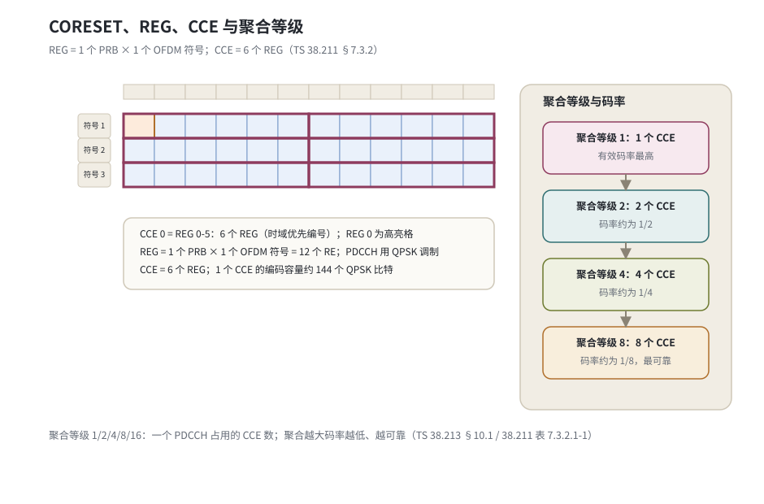
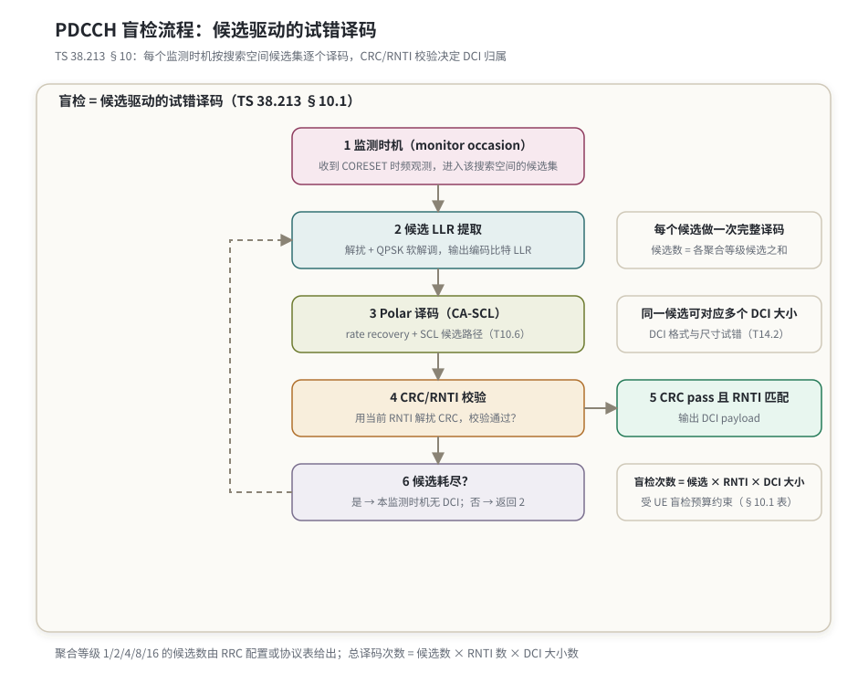

# T14.1 PDCCH 盲检

## 本节学习目标

本系列从 T9 的 descriptor 走到 T14 的控制信道族。T14.1 讲的是控制面调度入口的机制：PDCCH（物理下行控制信道，Physical Downlink Control Channel）如何把 DCI（下行控制信息，Downlink Control Information）送到 UE，而 UE 又如何在没有显式寻址的条件下把它认出来。核心答案是盲检（blind decoding）：UE 不知道 DCI 有多大、发给谁、放在哪个位置，就按照 RRC（无线资源控制，Radio Resource Control）配置的候选集逐个试错，用 CRC（循环冗余校验，Cyclic Redundancy Check）加扰的 RNTI（无线网络临时标识，Radio Network Temporary Identifier）判断"这是不是给我的"。

盲检发生在 CORESET（控制资源集，Control Resource Set）给出的时频区域里。这片区域由 REG（资源元素组，Resource Element Group）和 CCE（控制信道单元，Control Channel Element）两级粒度划分：REG 是 1 个 PRB（物理资源块，Physical Resource Block）乘 1 个 OFDM（正交频分复用，Orthogonal Frequency Division Multiplexing）符号；CCE 由 6 个 REG 组成，是 PDCCH 分配的最小单位。一个 PDCCH 占用的 CCE 数称为聚合等级（Aggregation Level, AL），取 1/2/4/8/16——聚合越大，编码码率越低，抗噪声能力越强。DCI 先附加 24 位 CRC，CRC 校验位再与 RNTI 形成关系（TS 38.212 §7.3.2），随后进入 Polar（极化码，Polar Code）编码链路，用 QPSK（正交相移键控，Quadrature Phase Shift Keying）调制发射。

盲检候选的译码落在 [[T10.6_CRC_aided_SCL_control_reliability|T10.6]] 建立的 CA-SCL（CRC 辅助连续消除列表译码，CRC-aided Successive Cancellation List）框架里：SCL（连续消除列表译码，Successive Cancellation List）为每个候选生成多条路径，CRC/RNTI 在最终选择时把关——先过滤通过校验的路径，再在其中选路径度量最优的一条。本节把"搜索空间给出一组候选位置"与"每个候选做一次 CA-SCL 译码"两件事接起来，就是盲检的完整图景。

学完本节后，应能做到：

- 解释为什么控制信道需要盲检而数据信道不需要，并对比两者的"寻址"方式。
- 说出 REG、REG 束、CCE 与聚合等级的定义，以及 1/2/4/8/16 五个聚合等级与有效码率的关系。
- 根据聚合等级与候选数，计算一个监测时机（monitor occasion）的总候选数，并对照 UE 盲检预算判断配置是否合法。
- 写出搜索空间候选 CCE 位置公式，并手工推演 CSS（公共搜索空间，Common Search Space）与 USS（UE 专用搜索空间，UE-specific Search Space）各一个数值例子。
- 描述盲检的完整流程：解调 → Polar 译码 → CRC/RNTI 校验 → DCI 大小试错。
- 说明盲检复杂度等于候选数乘 RNTI 数乘 DCI 大小数，并解释协议如何用 UE 能力上限约束它。
- 把本节流程接到 T10.1/T10.6 的 Polar 控制译码链路上，指出 CRC/RNTI 边界在最终选择中的作用。

## 前置知识检查

| 前置项 | 本节需要达到的程度 |
|:---|:---|
| [[T2.6_from_resource_grid_to_decoder_LLR|T2.6]] 资源网格与 LLR（对数似然比，Log-Likelihood Ratio） | 知道 RE（资源元素，Resource Element）承载调制符号、解调器输出 LLR。 |
| [[T3.5_NR_Polar_segmentation_crc|T3.5]] NR Polar 分段与 CRC | 知道 DCI 的 24 位 CRC 附加在 payload 后进入 Polar 编码链路。 |
| [[T9.0_TS38214_MCS_TBS_decoder_descriptor|T9.0]] descriptor | 知道译码任务边界由调度字段决定；本节把"候选位置"加入任务边界。 |
| [[T10.1_NR_Polar_decoder_chain_overview|T10.1]] 控制译码链路 | 知道 rate recovery、Polar 译码、CRC/RNTI 选择是接收侧三段。 |
| [[T10.6_CRC_aided_SCL_control_reliability|T10.6]] CA-SCL 与 CRC/RNTI 边界 | 知道盲检候选的最终选择是"在 CRC/RNTI 通过的路径中选 PM 最优"。 |

如果只记一个原则：**盲检不是随机猜测，而是按搜索空间配置的确定候选集逐个试错；每一次尝试都是一次完整的解调、Polar 译码与 CRC/RNTI 校验。**

## 盲检的必要性：无寻址信道的试错设计

### 控制信息没有"收件人字段"

数据信道的接收很简单：PDSCH（物理下行共享信道，Physical Downlink Shared Channel）在哪里、用什么 MCS（调制与编码方案，Modulation and Coding Scheme）、分配给谁，都由 DCI 显式告诉 UE。换句话说，数据信道的"地址"是显式调度出来的。

控制信道则不同。DCI 本身没有任何"收件人"字段——它不携带 UE 的标识，也没有"这是发给 UE 7 的消息"这种声明。收件人的身份被藏在了 CRC 加扰的 RNTI 里：发送端用某个 RNTI 的比特序列对 DCI 的 24 位 CRC 校验位做异或（scrambling），接收端只有用同一个 RNTI 解扰并让 CRC 通过，才能确认这条 DCI 属于自己。于是协议必须选择一条与数据信道完全不同的路：不告诉 UE 去读哪里，而是让 UE 在所有可能的位置上试一遍。

### 与数据信道显式调度的对比

| 对比项 | 控制信道 PDCCH | 数据信道 PDSCH |
|:---|:---|:---|
| 位置 | 盲检：UE 按候选集试探 | 显式：由调度它的 DCI 指出资源分配 |
| 收件人 | 藏在 CRC 加扰的 RNTI 里 | 无需判断归属（归属由 DCI 决定） |
| 编码 | Polar 码（NR） | LDPC（低密度奇偶校验码，Low-Density Parity-Check Code）码（NR 数据） |
| 调制 | 固定 QPSK | 随 MCS 变化的 QPSK/16QAM/64QAM/256QAM 等 |
| 调度入口 | 一切调度指令的来源 | 被调度对象 |

这张表的本质是：PDCCH 位于调度链的入口，它没有上游给它指路；而 PDSCH 位于调度链的下游，它的"地址"由入口处的 DCI 显式给出。正因如此，数据信道可以收到"读第 x 个 RB 到第 y 个 RB"的指令，而控制信道只能收到"在哪些候选位置里找一找"的配置。

### 显式地址字段方案的代价

一个自然的反问是：既然要认收件人，为什么不直接在 DCI 里放一个 UE 标识字段？试想若 DCI 自带 16 位 UE 标识，会发生什么：

| 方案 | 做法 | 代价 |
|:---|:---|:---|
| 显式地址字段 | DCI 里携带收件人 ID | 每个 UE 必须读完整个控制区的所有 DCI 才能知道哪些与自己有关；控制区越大，每个 UE 的读取负担越重；地址字段本身占用控制资源 |
| 盲检 + RNTI | 位置与归属都用"试错"解决 | UE 只在自己搜索空间的候选集内尝试，读取范围被约束；代价是每次试错都要做一次完整译码 |

盲检的妙处在于把"找位置"和"认归属"合二为一：候选位置约束了读取范围，RNTI 校验完成了归属判断。代价（重复译码）由协议用候选数上限与聚合等级配置来控制，收益是控制信令的零显式寻址开销——这正是 LTE 与 NR 二十多年共同的工程选择。

### 历史动机：从 LTE 继承的试错传统

盲检不是 NR 的发明。LTE 的 PDCCH 同样是盲检：UE 在公共搜索空间（Common Search Space, CSS）和 UE 专用搜索空间（UE-specific Search Space, USS）中，按固定的候选数表试探（LTE USS 在聚合等级 1/2/4/8 上各有 6/6/2/2 个候选，聚合等级 16 无候选）。当时的动机是控制信令零配置开销：如果基站要"先给每个 UE 发一条寻址消息，再发真正的调度消息"，控制开销会翻倍，而且寻址消息本身又需要寻址。盲检把两步变成一步：UE 自己找，找到即确认归属。NR 继承了这一设计，同时把候选位置从固定公式改成 RRC 可配置，把候选数从固定表改成按搜索空间集配置，并把编码从咬尾卷积码换成 Polar 码——机制不变，灵活性和可靠性都提高了。

### 生活类比：没有门牌号的集体邮箱

想象一栋楼的集体邮箱：邮差（基站）把信（DCI）放进某个格子（候选位置），但信箱上没有门牌号——居民（UE）不知道自己家的格子是哪一个。于是每天到固定时间（监测时机），居民按物业贴出的"格子清单"（搜索空间候选集）逐个格子开锁试一遍，每把锁的锁芯（RNTI）形状不同：能打开的那一格就是自己的信。数据信道则像挂号信：信封上明确写着地址和收件人，投递过程是显式可追踪的。

### 常见误解

| 误解 | 正确理解 |
|:---|:---|
| 盲检 = 随机猜测 | 盲检按 RRC 配置的确定候选集试探，候选位置与候选数都是协议规定的确定集合。 |
| RNTI 是 DCI 里的地址字段 | RNTI 不在 DCI payload 里，它加扰在 CRC 校验位上（TS 38.212 §7.3.2）。 |
| PDCCH 只调度下行 | PDCCH 承载的 DCI 既调度下行（DL grant）也调度上行（UL grant）。 |
| 聚合等级越大越好 | 聚合大更可靠，但占用 CCE 多、频谱效率低，调度器按信道质量在 1/2/4/8/16 间自适应。 |

## CORESET、REG 与 CCE：控制信道的时频砖块

### CORESET：控制信道圈定的时频区域

UE 不是在整个 BWP（带宽部分，Bandwidth Part）里盲检，而是在一个或多个 CORESET 里盲检。CORESET 是一个时频资源块：频域是位图选择的 RB 组集合（frequencyDomainResources 以 6 个 RB 为一组，任意位组合都能选中对应的 RB 组，无连续性要求），时域是 1-3 个 OFDM 符号（duration 参数；3 符号只在与 dmrs-TypeA-Position 等于 pos3 同时配置时支持）。每个 CORESET 独立配置 CCE 到 REG 的映射方式（交织或非交织），并关联一个或多个搜索空间集。

初始接入阶段的 CORESET 0 由 MIB（主信息块，Master Information Block）里的 pdcch-ConfigSIB1 给出，对应的 Type0-PDCCH CSS 承载 SIB（系统信息块，System Information Block）1 的调度信息——这是 UE 开机后盲检的第一站，由 [[PBCH_MIB_广播信道]] 把广播链路接到这里。

### REG 与 CCE：两级资源粒度

TS 38.211 §7.3.2.2 给出两个基本定义：

| 概念 | 定义 | 容量 |
|:---|:---|:---|
| REG | 1 个 PRB 乘 1 个 OFDM 符号；REG 在 CORESET 内按符号优先（time-first）编号 | 12 个 RE（其中部分 RE 留给 DM-RS（解调参考信号，Demodulation Reference Signal）） |
| CCE | 6 个 REG 组成一个 CCE | 72 个 RE，约 144 个 QPSK 编码比特 |

REG 到 CCE 的映射由 REG 束（REG bundle）描述：非交织映射时 REG 束大小固定为 6；交织映射时 REG 束大小 $L_{\text{bundle}} \in \{2, 6\}$（1/2 符号 CORESET）或 $\{3, 6\}$（3 符号 CORESET），束内 REG 经交织器散开到整个 CORESET 以对抗频率选择性衰落。无论哪种映射，CCE 恒等于 6 个 REG。

### 一个教学计算：CORESET 的 CCE 容量

CORESET 的 CCE 总数等于 REG 总数除以 6。设一个 CORESET 频域 48 个 PRB、时域 2 个符号，则：

| 量 | 计算 | 结果 |
|:---|:---|:---|
| REG 总数 | 48 PRB × 2 符号 | 96 个 REG |
| CCE 总数 | 96 / 6 | 16 个 CCE |
| 聚合等级 4 的最大并发 PDCCH | 16 / 4 | 4 个 |

这个计算同时解释了为什么聚合等级受 CORESET 尺寸约束：16 个 CCE 的 CORESET 放不下三个聚合等级 8 的 PDCCH（3×8=24>16），也放不下两个聚合等级 16 的 PDCCH（2×16=32>16）；一个聚合等级 16 的 PDCCH 恰好耗尽整个 CORESET。调度器在选择聚合等级时必须先看 CORESET 容量，这就是"聚合等级自适应"的物理边界。

### 聚合等级与有效码率

一个 PDCCH 占用的 CCE 数称为聚合等级（Aggregation Level, AL），取 $L \in \{1, 2, 4, 8, 16\}$（TS 38.211 表 7.3.2.1-1）。聚合等级决定了编码比特的多少：payload 加 24 位 CRC 后经 Polar 编码与速率匹配，恰好填充 $L$ 个 CCE 的编码容量。设 DCI payload（不含 CRC）为 $A$ 位，QPSK 下每个 CCE 有 $72 \times 2 = 144$ 个编码比特位，则聚合等级 $L$ 的有效码率为：

$$
R_{\text{eff}}(L) = \frac{A + 24}{144 L}
\tag{1}
$$

（教学简化：忽略 PDCCH DM-RS 占用的 RE，真实速率匹配按 38.212 §5.4.1 扣除；此处量级关系不受影响。）

取 $A = 40$ 位（不含 CRC 的 DCI payload），各聚合等级的有效码率：

| 聚合等级 $L$ | 编码比特 $144L$ | 有效码率 $R_{\text{eff}}$ | 工程语义 |
|---:|---:|---:|:---|
| 1 | 144 | 0.444 | 码率最高，只适合信道很好的 UE |
| 2 | 288 | 0.222 | 码率减半 |
| 4 | 576 | 0.111 | 典型初始接入取值 |
| 8 | 1152 | 0.0556 | 信道较差时使用 |
| 16 | 2304 | 0.0278 | 码率最低，最可靠，只用于恶劣信道 |



## 搜索空间与监测时机

### 搜索空间的类型：CSS 与 USS

UE 在一个 CORESET 上按若干搜索空间集（search space set）盲检。每个搜索空间集由 RRC 的 SearchSpace IE 配置：关联哪个 CORESET、在哪些时隙与符号上监测（监测时机）、每个聚合等级放几个候选（nrofCandidates 的 aggregationLevel1..16，取值 {0,1,2,3,4,5,6,8}）、监测哪些 DCI 格式（dci-Formats）、以及是公共搜索空间还是 UE 专用搜索空间。

| 类型 | 用途 | 典型承载内容 |
|:---|:---|:---|
| CSS（公共搜索空间，Common Search Space） | 所有 UE 都监测，位置与 RNTI 确定 | SI-RNTI 调度 SIB、P-RNTI 寻呼、RA-RNTI 随机接入响应、SFI-RNTI 时隙格式指示 |
| USS（UE 专用搜索空间，UE-specific Search Space） | 单 UE 的调度指令 | C-RNTI 加扰的 DL/UL grant |

CSS 又细分为 Type0（searchSpaceSIB1 关联 CORESET 0）、Type0A、Type1、Type2、Type3 等类型，每个类型服务于一个广播类功能：

| CSS 类型 | 承载内容 | 关联 RNTI |
|:---|:---|:---|
| Type0-PDCCH CSS | SIB1 调度 | SI-RNTI |
| Type0A-PDCCH CSS | 其他系统信息调度 | SI-RNTI |
| Type1-PDCCH CSS | 随机接入响应 | RA-RNTI |
| Type2-PDCCH CSS | 寻呼 | P-RNTI |
| Type3-PDCCH CSS | 组公共信令（时隙格式、中断、TPC 等） | SFI-RNTI、INT-RNTI、TPC-RNTI 等 |

协议规定：由 searchSpaceSIB1 等配置的 CSS 的聚合等级与每聚合等级最大候选数由 **TS 38.213 表 10.1-1** 给出。本节已对照本地 Rel-19 原文核验该表：

| CCE 聚合等级 | 最大候选数 |
|---:|---:|
| 4 | 4 |
| 8 | 2 |
| 16 | 1 |

即在聚合等级 1/2/4/8/16 上对应候选数向量 [0, 0, 4, 2, 1]，一个 Type0-PDCCH CSS 每个监测时机共 7 个候选。USS 的候选数则由 RRC 显式配置，例如配置 [6, 6, 2, 2, 0]（与 LTE USS 的固定分布 6/6/2/2/0 对照）。

### 监测时机（monitor occasion）

"什么时候盲检"由两个参数共同决定：monitoringSlotPeriodicityAndOffset 给出按槽（slot）的周期与偏移，monitoringSymbolsWithinSlot 给出每个监测时隙内 CORESET 起始符号的 14 位位图。两者合起来确定一个监测时机集合：时隙周期的每个命中时隙内，位图指出的每个起始符号对应一个监测时机。每个监测时机内，UE 对该搜索空间集的所有候选各做一次完整译码尝试。

以 15 kHz 子载波间隔、周期 2 时隙、偏移 0 为例：UE 在时隙 0、2、4、… 上监测。若 monitoringSymbolsWithinSlot 位图在位置 0 与 7 置 1（位图从左到右对应符号 0-13），则每个命中时隙产生 2 个监测时机：一个以符号 0 为起始，一个以符号 7 为起始（假设 CORESET 时域 1 个符号）。若 CORESET 为 2 符号，则第二个时机的 CORESET 落在符号 7-8。协议还规定搜索空间的 duration 缺省为 1 个时隙（即每个周期内连续监测 duration 个时隙）。监测周期越长、每时隙监测的符号越少，盲检次数越少、功耗越低，但调度延迟越大——这是网络配置搜索空间时的主要权衡。

### 候选集与候选位置公式

一个搜索空间集在聚合等级 $L$ 上有 $M_s^{(L)}$ 个候选，监测时机内该集合的候选总数为各聚合等级候选数之和：

$$
C_s = \sum_{L \in \{1,2,4,8,16\}} M_s^{(L)}
\tag{2}
$$

候选不是一个任意位置，而是 CORESET 内的确定 CCE 集合。TS 38.213 §10.1 给出候选 $m_{s,n_{\text{CI}}}^{(L)}$（$m_{s,n_{\text{CI}}}^{(L)}=0,\dots,M_{s,\max}^{(L)}-1$）的起始 CCE 索引公式：

$$
L \cdot \left\{ \left( Y_{p,n_{s,f}^\mu} + \left\lfloor \frac{m_{s,n_{\text{CI}}} \cdot N_{\text{CCE},p}}{L \cdot M_{s,\max}^{(L)}} \right\rfloor + n_{\text{CI}} \right) \bmod \left\lfloor \frac{N_{\text{CCE},p}}{L} \right\rfloor \right\} + i
\tag{3}
$$

其中 $i = 0, \dots, L-1$ 遍历候选内的 CCE，$N_{\text{CCE},p}$ 是 CORESET $p$ 的 CCE 总数，$n_{\text{CI}}$ 是载波指示字段值（无跨载波调度时为 0）。$Y_{p,n_{s,f}^\mu}$ 是哈希量：对 CSS 恒为 0；对 USS 按 CORESET 索引 $p$ 与时隙号递推：

$$
Y_{p,n_{s,f}^\mu} = (A_p \cdot Y_{p,n_{s,f-1}^\mu}) \bmod D, \quad Y_{p,-1} = n_{\text{RNTI}} \neq 0
\tag{4}
$$

其中 $A_p = 39827$（$p \bmod 3 = 0$）、$39829$（$p \bmod 3 = 1$）、$39839$（$p \bmod 3 = 2$），$D = 65537$。公式 (3)(4) 的工程意义：CSS 的候选位置对所有 UE 相同（所以广播类 DCI 人人都能找到）；USS 的候选位置随 RNTI 与 CORESET 索引散列（所以不同 UE 的候选尽量错开，降低相互冲突概率）。

## 盲检流程与 RNTI 机制

### 候选驱动的五步流程

每个监测时机，UE 对候选集里的每个候选执行完整译码。流程图如图 2。



1. 提取候选 LLR：按公式 (3) 定位候选的 CCE，收集对应 REG 上的 RE，做解扰与 QPSK 软解调，输出编码比特 LLR。
2. Polar 译码：按该候选假设的 DCI 大小与速率匹配参数做 rate recovery，然后运行 Polar 译码（SC 或 [[T10.5_Polar_SCL_decoding|T10.5]] 的 SCL 译码），得到候选 bit 序列。
3. CRC/RNTI 校验：用当前假设的 RNTI 对候选的 24 位 CRC 校验位解扰，再做 CRC 校验。
4. DCI 大小匹配：若 CRC 通过，还需确认该候选的 bit 数与假设的 DCI 格式尺寸一致（多个 DCI 格式尺寸并存时需逐个试）。
5. 输出或继续：CRC pass 且 RNTI 匹配且尺寸匹配 → 输出 DCI payload，交付上层；否则试下一个候选。全部候选失败 → 本监测时机没有发给本 UE 的 DCI。

### RNTI：锁芯里的收件人

TS 38.212 §7.3.2 规定：DCI 先附加 24 位 CRC，然后 CRC 校验位与对应 RNTI 的比特序列异或（scrambling）。接收端对每个候选，用自己掌握的 RNTI 集合逐个解扰尝试：解扰后 CRC 通过，说明这条 DCI 的"锁芯"与当前 RNTI 匹配。常用 RNTI 与用途（RNTI 的完整清单与用法以 TS 38.321 §7.1 表 7.1-1/7.1-2 为准，此处只列本节涉及的常用值）：

| RNTI | 用途 | 搜索空间 |
|:---|:---|:---|
| C-RNTI | 已连接 UE 的上下行调度 | USS（也见于 Type1-PDCCH CSS） |
| SI-RNTI | SIB 广播调度 | Type0-PDCCH CSS |
| RA-RNTI | 随机接入响应 | Type1-PDCCH CSS |
| P-RNTI | 寻呼 | Type2-PDCCH CSS |
| SFI-RNTI | 时隙格式指示 | Type3-PDCCH CSS 或 USS |

### DCI 大小试错

DCI 尺寸不是任意的：协议只允许有限种 DCI 格式尺寸（DCI format 0_0/1_0 的 fallback 尺寸与 0_1/1_1/0_2/1_2 的配置尺寸等，见后续 [[DCI_下行控制信息]] 与 T14.2）。搜索空间配置里 dci-Formats 字段限定监测哪些格式，每个候选的每次译码都要在可能的尺寸上尝试：因为速率匹配与 Polar 码长取决于尺寸，译码器必须先假设一个尺寸，才能知道把 LLR 按多长切分。这就是"大小试错"进入复杂度乘积的原因。

### DCI 尺寸必须限定的原因

如果把 DCI 尺寸放开为任意长度，盲检就失去了可行性：每个候选要在无穷多种长度上试错，而且 CRC 校验必须在正确长度上才能通过。协议因此把 DCI 尺寸约束为有限集合，并通过两种机制收口：

1. **格式家族限定**：每个搜索空间集通过 dci-Formats 只监测有限的格式组合（如只有 fallback 的 0_0/1_0，或配置的 0_1/1_1），格式到尺寸的映射由 T14.2 展开。
2. **尺寸对齐**：多个格式被允许共享同一尺寸（size alignment），减少 UE 需要尝试的尺寸数——这是复杂度优化与协议设计耦合的典型例子。

UE 侧的实际动作是：对每个候选，先按可能尺寸集合中的第一个尺寸做一次完整译码尝试（rate recovery + Polar + CRC/RNTI），失败后换下一个尺寸。因此"候选数 × RNTI 数 × 尺寸数"就是单监测时机的译码次数上界。

## 盲检复杂度分析

### 复杂度乘积公式

盲检的总译码次数是三个维度的乘积：

$$
B = C_{\text{monitor}} \times R_{\text{RNTI}} \times S_{\text{DCI}}
\tag{5}
$$

其中 $C_{\text{monitor}}$ 是监测时机内的候选总数，$R_{\text{RNTI}}$ 是需要尝试的 RNTI 数，$S_{\text{DCI}}$ 是每个候选需要尝试的 DCI 尺寸数。数值例子：若一个监测时机有 23 个候选，UE 需尝试 2 个 RNTI（如 C-RNTI 与 CS-RNTI），每个候选对应 2 个 DCI 尺寸，则单监测时机最多 92 次完整译码。这就是"盲"的代价——每一次试错都是解调、Polar 译码与 CRC 校验的完整流水。

### 数值例子：一个监测时机的总候选数

设小区配置了两个搜索空间集：Type0-PDCCH CSS（按表 10.1-1，候选向量 [0,0,4,2,1]，合计 7）与一个 USS（RRC 配置 [6,6,2,2,0]，合计 16）。按公式 (2)，单监测时机总候选数：

$$
C_s = (0+0+4+2+1) + (6+6+2+2+0) = 7 + 16 = 23
\tag{6}
$$

### UE 能力上限：表 10.1-2 / 10.1-3

盲检预算必须有上限，否则功耗与延迟失控。TS 38.213 §10.1 规定（本地 Rel-19 原文核验）：单个服务小区上，UE 每时隙监测的 PDCCH 候选数不超过表 10.1-2 的 $M_{\text{PDCCH,max,slot},\mu}$，非重叠 CCE 数不超过表 10.1-3 的 $C_{\text{PDCCH,max,slot},\mu}$：

| SCS 配置 $\mu$ | 每时隙最大候选数（表 10.1-2） | 每时隙最大非重叠 CCE 数（表 10.1-3） |
|---:|---:|---:|
| 0（15 kHz） | 44 | 56 |
| 1（30 kHz） | 36 | 56 |
| 2（60 kHz） | 22 | 48 |
| 3（120 kHz） | 20 | 32 |

监测预算的约束用不等式表示为：

$$
C_{\text{monitored}} \le M_{\text{PDCCH,max,slot},\mu}, \qquad N_{\text{CCE,non-overlapped}} \le C_{\text{PDCCH,max,slot},\mu}
\tag{7}
$$

网络配置搜索空间时隐式受此约束：候选太多、监测太密的配置在协议上不合法，UE 也不被期望执行。

### 三个维度的工程代价

盲检复杂度公式 (5) 的三个因子对应三种不同的工程代价，增大任何一个都会线性增加译码工作量：

| 维度 | 增大它的收益 | 工程代价 |
|:---|:---|:---|
| 候选数 $C_{\text{monitor}}$ | 给调度器更多放置 DCI 的灵活位置，降低候选冲突 | 每监测时机译码次数增加，功耗与延迟上升 |
| RNTI 数 $R_{\text{RNTI}}$ | 同时监听多种调度类型（调度、配置授权、SPS 释放等） | 每个候选的解扰与 CRC 校验翻倍 |
| DCI 尺寸数 $S_{\text{DCI}}$ | 支持更多格式组合 | 每个候选的 rate recovery 与 Polar 译码翻倍 |

沿用前面的数值例子：23 个候选、2 个 RNTI、2 个尺寸，单监测时机最多 $23 \times 2 \times 2 = 92$ 次完整译码。若把候选数加到预算上限 44（$\mu = 0$），则最多 176 次。注意这只是一个搜索空间集的监测时机；UE 通常同时配置多个搜索空间集与多个 CORESET，但表 10.1-2/10.1-3 的预算按每时隙总量核算——多集合并存的合计仍然受预算约束。这也是"协议规定候选数上限"的直接动机：盲检复杂度必须可预测、可预算。

### numpy 验证

下面的代码复算本节全部数值（表 10.1-1 候选数、USS 例子、预算检查、有效码率、候选位置），断言全部通过：

```python
import numpy as np

al_levels = np.array([1, 2, 4, 8, 16])

# TS 38.213 表 10.1-1（searchSpaceSIB1 的 Type0-PDCCH CSS）：
# 聚合等级 4/8/16 对应候选数 4/2/1，即向量 [0, 0, 4, 2, 1]
css_candidates = np.array([0, 0, 4, 2, 1])
css_total = int(css_candidates.sum())
assert css_total == 7

# USS 配置例子（nrofCandidates 合法取值，与 LTE USS 固定分布 6/6/2/2/0 对照）
uss_candidates = np.array([6, 6, 2, 2, 0])
uss_total = int(uss_candidates.sum())
assert uss_total == 16

# 公式 (2)：监测时机总候选数 = 各搜索空间集候选数之和
total_per_occasion = css_total + uss_total
assert total_per_occasion == 23

# 公式 (7)：表 10.1-2，mu=0（15 kHz）每时隙最多 44 个候选
budget_mu0 = 44
assert total_per_occasion <= budget_mu0

# CORESET 容量：48 PRB x 2 符号 = 96 REG = 16 个 CCE（每 CCE 6 个 REG）
assert 48 * 2 // 6 == 16

# 公式 (1)：A=40 位 DCI payload + 24 位 CRC；QPSK 下每 CCE 容量 144 编码比特
A = 40
coded_bits_per_cc = 6 * 12 * 2   # 6 REG x 12 RE x 2 bit
rate = (A + 24) / (coded_bits_per_cc * al_levels)
expected = np.array([64/144, 64/288, 64/576, 64/1152, 64/2304])
assert np.allclose(rate, expected)

# 公式 (3)(4)：候选 CCE 起始位置。教学例 N_CCE,p = 24, AL = 4, M = 4
N_CCE, L, M = 24, 4, 4
starts_css = [L * ((0 + (m * N_CCE // (L * M))) % (N_CCE // L)) for m in range(M)]
assert starts_css == [0, 4, 12, 16]

# USS 哈希：Y_{-1} = n_RNTI = 100, A_p = 39827 (p mod 3 = 0), D = 65537
Y = (39827 * 100) % 65537
assert Y == 50480
starts_uss = [L * ((Y + (m * N_CCE // (L * M))) % (N_CCE // L)) for m in range(M)]
assert starts_uss == [8, 12, 20, 0]

print("T14.1_BLIND_DECODE_OK css_total=%d uss_total=%d total=%d budget=%d"
      % (css_total, uss_total, total_per_occasion, budget_mu0))
print("rate L=1..16:", np.round(rate, 4))
print("T14.1_SS_HASH_OK css_starts=%s uss_starts=%s Y=%d"
      % (starts_css, starts_uss, Y))
```

运行输出（与本机一致）：

```
T14.1_BLIND_DECODE_OK css_total=7 uss_total=16 total=23 budget=44
rate L=1..16: [0.4444 0.2222 0.1111 0.0556 0.0278]
T14.1_SS_HASH_OK css_starts=[0, 4, 12, 16] uss_starts=[8, 12, 20, 0] Y=50480
```

## 接收端实现视角

### 与 Polar 控制译码链路的衔接

把本节盲检流程接到 [[T10.1_NR_Polar_decoder_chain_overview|T10.1]] 建立的接收侧链路上：盲检的"候选 LLR 提取"对应链路前端的解调与 rate recovery；"Polar 译码"对应 SC/SCL 译码；"CRC/RNTI 校验"对应 [[T10.6_CRC_aided_SCL_control_reliability|T10.6]] 的 final selector 边界。T10.6 的结论在此处是硬约束：**不能只选 PM 最优路径输出，必须先在 CRC/RNTI 通过的候选中选择**。盲检语境下，一条候选的全部路径都 CRC fail，就等于这个候选没有命中；某条路径 CRC pass 但 RNTI 不匹配，同样不能输出为当前 UE 的 DCI。

### 每候选译码的任务边界

从 [[T9.0_TS38214_MCS_TBS_decoder_descriptor|T9.0]] 的视角看，每个候选的一次尝试是一个完整译码任务，descriptor 由以下要素拼出：

| descriptor 要素 | 来源 | 本节对应 |
|:---|:---|:---|
| 候选位置（CCE 集合） | 公式 (3) 计算 | 监测时机内逐个遍历 |
| LLR 长度与 rate recovery 参数 | 假设的 DCI 尺寸 | DCI 大小试错 |
| CRC 类型与 RNTI context | 假设的 RNTI | CRC/RNTI 校验 |
| Polar 码长 N 与 information set | DCI 尺寸 + 配置 | Polar 译码 |

### 误通过风险与实现自由度

24 位 CRC 使随机错误候选误通过的概率量级约为 $2^{-24} \approx 5.96 \times 10^{-8}$（沿用 [[T10.6_CRC_aided_SCL_control_reliability|T10.6]] 的量级估计，非完整链路误检公式）。乘以盲检次数后仍是可接受的小概率，但实现上通常还要叠加 RNTI 上下文检查与 DCI 尺寸校验，防止"CRC 撞通"的极端情况。接收机内部用多少并行度、是否做候选间共享译码资源、是否早停，属于实现自由度——协议只约束"监测哪些候选、最多多少次"，不约束"怎么译"。

### 早停与功耗

盲检的功耗压力主要来自"大部分候选都会失败"：实际发给本 UE 的 DCI 通常只有一个，其余候选的译码都白做了。实现上常见的降功耗手段有三类：

| 手段 | 做法 | 风险 |
|:---|:---|:---|
| 信道质量预筛 | 先对候选的 DM-RS 做信道估计与能量检测，明显不可信的候选不译码 | 估计错误会漏掉真实 DCI，需留安全阈值 |
| 译码早期终止 | 译码过程中路径度量发散到不可能通过时提前丢弃 | 必须保证不会把可能通过 CRC 的路径提前删掉（T10.6 的 early pruning 同类约束） |
| 尺寸优先排序 | 先尝试最可能的 DCI 尺寸，命中即停止 | 排序假设在特殊配置下可能失效，仍需回退 |

这三类手段都只优化"怎么译"，不改变协议要求的"译哪些"——盲检预算 (7) 与候选集 (3)(4) 始终是约束面。

## 常见错误

| 错误 | 为什么错 | 正确做法 |
|:---|:---|:---|
| 把盲检当成随机猜测 | 候选位置与候选数由 RRC 配置与协议表确定，是确定集合。 | 用公式 (3)(4) 计算候选位置，理解确定性。 |
| 只看 CRC 不看 RNTI 就输出 DCI | CRC 撞通或属于其他 UE 的 DCI 会被误执行。 | 沿用 T10.6 的 final selector：先过滤 CRC/RNTI pass 再选 PM 最优。 |
| 把聚合等级当成发射功率 | 聚合等级改变的是编码码率（冗余量），不是功率。 | 用公式 (1) 计算有效码率，理解冗余与可靠性关系。 |
| 以为 USS 位置公式与 CSS 相同 | CSS 的哈希量恒为 0，USS 随 RNTI 散列。 | 分别用 Y=0 与 Y 递推计算两类位置。 |
| 忽略 UE 盲检预算 | 候选总数超出表 10.1-2/10.1-3 上限的配置协议上不合法。 | 配置后核算每时隙候选数与非重叠 CCE 数。 |
| 以为每候选只译一次 | 每个候选可能对应多个 RNTI 与多个 DCI 尺寸。 | 用公式 (5) 核算总译码次数上界。 |

## 示范例题

### 例题 1：聚合等级与有效码率

设 DCI payload 为 $A = 40$ 位（不含 CRC），信道较差，调度器选择聚合等级 8。计算编码比特总数与有效码率。

**解答**：编码比特总数 $= 144 \times 8 = 1152$ 位；有效码率按公式 (1)：

$$
R_{\text{eff}}(8) = \frac{40 + 24}{144 \times 8} = \frac{64}{1152} \approx 0.0556
$$

对照表：聚合等级 1 时 $R_{\text{eff}}(1) = 64/144 \approx 0.444$。从 1 到 8，码率下降 8 倍，冗余增加 8 倍——这就是"聚合等级越大越可靠"的数值来源。

### 例题 2：CSS 候选位置计算

CORESET 共 $N_{\text{CCE},p} = 24$ 个 CCE，Type0-PDCCH CSS 在聚合等级 4 上有 $M_{s,\max}^{(4)} = 4$ 个候选。求 4 个候选的起始 CCE 索引。

**解答**：CSS 的哈希量 $Y = 0$，$n_{\text{CI}} = 0$。公式 (3) 中 $\lfloor N_{\text{CCE},p}/L \rfloor = 6$，$\lfloor m \cdot 24/(4 \cdot 4) \rfloor = \lfloor 1.5m \rfloor$：

| 候选 $m$ | $\lfloor 1.5m \rfloor$ | $(0 + \lfloor 1.5m \rfloor) \bmod 6$ | 起始 CCE |
|---:|---:|---:|---:|
| 0 | 0 | 0 | 0 |
| 1 | 1 | 1 | 4 |
| 2 | 3 | 3 | 12 |
| 3 | 4 | 4 | 16 |

即候选占用的 CCE 区间为 [0-3]、[4-7]、[12-15]、[16-19]（每个候选 4 个 CCE）。与 numpy 块中 `starts_css == [0, 4, 12, 16]` 一致。

## 引导练习

1. 把例题 2 的 CORESET 换成 $N_{\text{CCE},p} = 16$，聚合等级 2，候选数 4。提示：$\lfloor 16/2 \rfloor = 8$，括号内余数落在 $\{0, 1, 2, 3\} \times 2$（即 $\{0, 2, 4, 6\}$），候选起始 CCE 再乘 $L=2$；先写 CSS 情况，再想 USS 的 $Y$ 会怎么改变余数。
2. 用公式 (5) 估算：监测时机总候选数 23、需尝试 2 个 RNTI、每个候选 2 个 DCI 尺寸，最多多少次完整译码？提示：乘积即答案，注意"最多"与"实际通常更少"的区别。
3. 对照表 10.1-2：若一个 15 kHz（$\mu = 0$）小区给某 UE 配置了 3 个搜索空间集，合计候选数 23，是否合法？若再加一个 30 候选的 USS，会发生什么？提示：44 是上限，超限配置协议上不合法，需调小候选数或监测周期。

## 独立习题

1. 计算 $A = 25$ 位 DCI payload 在聚合等级 2 与 16 下的有效码率，并说明哪个更抗噪声。
2. 一个 USS 配置候选向量 [4, 4, 2, 1, 0]，同 CORESET 上还有一个 Type0-PDCCH CSS（表 10.1-1）。求单监测时机总候选数，并判断 $\mu = 2$（60 kHz）时是否超过每时隙候选预算（提示：表 10.1-2）。
3. 用公式 (3)(4) 手算：$N_{\text{CCE},p} = 24$、聚合等级 2、候选数 6、$n_{\text{RNTI}} = 100$ 的 USS 在时隙 0 的前 3 个候选起始 CCE。提示：$Y_0 = (39827 \times 100) \bmod 65537 = 50480$，$\lfloor 24/2 \rfloor = 12$，$\lfloor m \cdot 24/(2 \cdot 6) \rfloor = 2m$。
4. 为什么 CSS 的候选位置对全体 UE 相同而 USS 的候选位置随 RNTI 散列？从广播接收与冲突规避两个角度回答。
5. 某接收机实现"候选按 PM 最小直接输出"，不检查 RNTI。结合 T10.6 的结论说明这种实现的错误后果。

## 独立习题参考答案

1. $R_{\text{eff}}(2) = 49/288 \approx 0.170$；$R_{\text{eff}}(16) = 49/2304 \approx 0.0213$。聚合等级 16 码率低、冗余大，更抗噪声。
2. 总候选数 $= (4+4+2+1+0) + (4+2+1) = 11 + 7 = 18$；$\mu = 2$ 时预算为 22，$18 \le 22$，合法。
3. $Y_0 = 50480$；$\lfloor m \cdot 24/12 \rfloor = 2m$；余数 $(50480 + 2m) \bmod 12$：50480 mod 12 = 8（50472 = 12 × 4206），故 m=0: 8 → 起始 CCE $2 \times 8 = 16$；m=1: 10 → 20；m=2: 0 → 0。前 3 个候选起始 CCE 为 16、20、0。
4. CSS 承载广播类 DCI，所有 UE 都要能在一个确定位置找到它们，故位置必须确定且相同；USS 承载单 UE 调度，位置随 RNTI 散列可让不同 UE 的候选尽量错开，降低相互冲突（两个 UE 的候选撞在同一 CCE 区间时，基站只能调度其中一个）。
5. 只按 PM 输出会漏掉 RNTI 归属约束：CRC 撞通的随机候选或属于其他 UE 的 DCI 会被误当作自己的调度指令执行，可能按错误资源收发、错误理解 HARQ（混合自动重传请求，Hybrid Automatic Repeat Request）过程，甚至执行错误随机接入过程。正确做法是 T10.6 的 final selector：先过滤 CRC/RNTI pass，再选 PM 最优。

## 小结

本节回答了一个问题：控制信道没有地址，靠什么把 DCI 送到正确的 UE？答案是"试错 + 归属校验"：搜索空间把试错范围约束成确定候选集，聚合等级把可靠性变成可调参数，CRC/RNTI 校验把归属判断放在每次试错的出口。三个协议锚点各司其职——TS 38.211 §7.3.2 定义时频结构（REG/CCE/聚合等级），TS 38.213 §10 定义搜索空间、监测时机与候选公式，TS 38.212 §7.3.2 定义 CRC/RNTI 边界。

回到本节开头的问题，值得记住的持久理解是：**控制信道把"归属判断"从"寻址阶段"搬到了"译码出口"**。数据信道在调度时就确定归属，控制信道在译码后才确定归属——这一步"后移"换来了零寻址开销与配置灵活性，代价是接收端必须按预算做可预测的重复译码。理解了这一交换，就理解了盲检的全部工程形态：为什么候选集是确定的、为什么聚合等级是码率问题、为什么 RNTI 藏在 CRC 里、为什么复杂度必须由协议预算约束。

盲检是控制面调度链的入口：它拿到的是"这条 DCI 属于我"的判定与 DCI payload；接下来，payload 里的字段（资源分配、MCS、HARQ 参数、TBS（传输块大小，Transport Block Size））如何构成译码任务描述，由 T9.0 的 descriptor 框架接住；DCI 格式与尺寸的完整清单将在下一节 T14.2（DCI 格式与大小）展开。再往后，[[DCI_下行控制信息]] 概念笔记给出字段语义的全貌，[[Scheduling_Grant_调度与授权]] 把 DCI 落到调度流程。控制信道族的下一站，就是把"盲检找到了什么"变成"调度了什么"。

## 本节验收

| 验收项 | 通过标准 |
|:---|:---|
| 机制 | 能解释为什么控制信道需要盲检而数据信道不需要，并对比寻址方式。 |
| 结构 | 能说出 REG、CCE、聚合等级的定义，并用公式 (1) 计算任意聚合等级的有效码率。 |
| 搜索空间 | 能区分 CSS/USS 与各 CSS 类型，说出表 10.1-1 的候选数与表 10.1-2/10.1-3 的预算。 |
| 数值 | 能复算 numpy 块的全部断言（7/16/23/44、码率表、候选位置 [0,4,12,16] 与 [8,12,20,0]）。 |
| 流程 | 能画出盲检五步流程并说明每步输入输出。 |
| 衔接 | 能把本节接到 T10.1/T10.6 的 Polar 控制译码链路，指出 CRC/RNTI 边界的作用。 |

## 资料与协议边界

| 资料 | 本地路径 | 边界 |
| :--- | :--- | :--- |
| TS 38.213 Rel-19 §10.1 | `3GPP_Rel19/specs/38213-j30.docx`（表 10.1-1/10.1-2/10.1-3 数值已核验） | 本节不复现 §10 全部规则，只取盲检相关的候选、监测时机与预算。 |
| TS 38.211 Rel-19 §7.3.2 | `3GPP_Rel19/specs/38211-j30.docx`（表 7.3.2.1-1 聚合等级） | REG/CCE 定义与 REG 束映射；不展开交织器细节。 |
| TS 38.212 Rel-19 §7.3.2 | `3GPP_Rel19/processed/TS_38.212_38212-j30/content.md:7177-7195` | DCI 24 位 CRC 与 RNTI 边界；编码细节见 T10 系列。 |
| TS 38.321 Rel-19 §7.1 | `3GPP_Rel19/specs/38321-j20.docx`（表 7.1-1/7.1-2 已对照本地原文核验） | RNTI 值的完整清单与用途；本节只列常用 RNTI。 |
| [[T10.6_CRC_aided_SCL_control_reliability|T10.6]] | `docs/L2_协议算法/T10.6_CRC_aided_SCL_control_reliability.md` | CRC/RNTI 的 final selector 边界，本节直接沿用。 |
| 概念笔记 | `docs/concepts/PDCCH_物理下行控制信道.md`、`docs/concepts/DCI_下行控制信息.md` | 本节的深化底座；双向 wikilink 衔接。 |

## 执行与证据记录

| 项 | 记录 |
|:---|:---|
| 写作范围 | 新增 `docs/L2_协议算法/T14.1_PDCCH_blind_decoding.md` + 两张手绘 SVG（盲检流程图、CCE 聚合示意）。 |
| 协议核验 | 表 10.1-1（[0,0,4,2,1]）、表 10.1-2（44/36/22/20）、表 10.1-3（56/56/48/32）、哈希常量（39827/39829/39839、65537）均对照本地 Rel-19 docx 原文确认。 |
| numpy 验证 | 正文内嵌代码本机实跑通过：`T14.1_BLIND_DECODE_OK`、`T14.1_SS_HASH_OK`，断言全部成立。 |
| SVG 审计 | 两图 `python3 tools/audit_svg_layout.py` 均输出 `SVG_LAYOUT_AUDIT_PASS / ALL_PASS`；cairosvg 渲染 PNG 成功。 |
| 自动审计 | 待跑：术语首现、圈号、LaTeX 渲染、标题结构、链接完整性。 |
| 审核经理 | 待审核。 |

## 参考文献

1. 3GPP TS 38.213 Rel-19 `38213-j30`, NR; Physical layer procedures for control, §10.1.
2. 3GPP TS 38.211 Rel-19 `38211-j30`, NR; Physical channels and modulation, §7.3.2.
3. 3GPP TS 38.212 Rel-19 `38212-j30`, NR; Multiplexing and channel coding, §7.3.2.
4. 3GPP TS 38.331 Rel-19 `38331-j20`, NR; RRC protocol specification, SearchSpace IE.
5. 本项目概念笔记 [[PDCCH_物理下行控制信道]]：`docs/concepts/PDCCH_物理下行控制信道.md`。
6. 本项目 [[T10.6_CRC_aided_SCL_control_reliability|T10.6]]：`docs/L2_协议算法/T10.6_CRC_aided_SCL_control_reliability.md`。
7. 本项目 [[T9.0_TS38214_MCS_TBS_decoder_descriptor|T9.0]]：`docs/L2_协议算法/T9.0_TS38214_MCS_TBS_decoder_descriptor.md`。
8. 3GPP TS 38.321 Rel-19 `38321-j20`, NR; Medium Access Control (MAC) protocol specification, §7.1.
