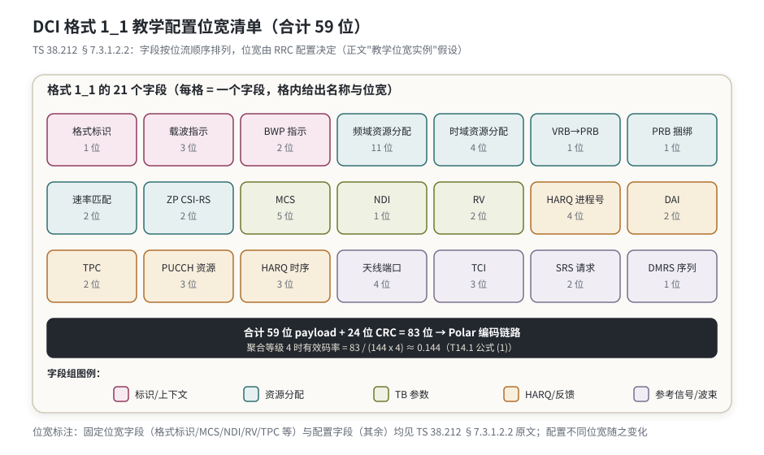
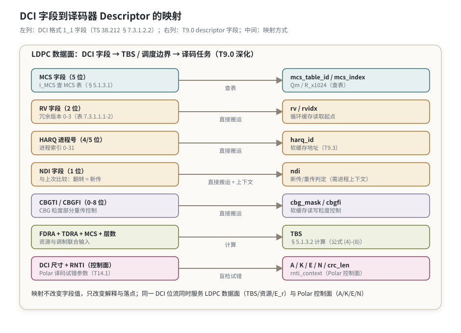

# T14.2 DCI 格式精读：从位流到译码任务描述

## 本节学习目标

T14.1 回答了"UE 如何在候选位置里找到属于自己的 DCI"（盲检），本节回答紧接着的第二个问题：**找到的 DCI 位流里，每一个比特是什么含义，以及它们如何变成译码器的任务描述**。DCI（下行控制信息，Downlink Control Information）本身是一段没有内部结构的位流——它的含义完全由格式（format）与字段顺序规定。TS 38.212 §7.3.1 逐格式定义了字段清单、位宽与语义；TS 38.214 §5.1 定义了这些字段如何进一步换算成 TBS（传输块大小，Transport Block Size）与资源位置。两处合并，才构成 T9.0 里译码器 descriptor 的完整来源。

DCI 格式分成三大族：调度上行（UL grant，上行授权）的 0_x、调度下行（DL grant，下行调度分配）的 1_x、以及发给一组 UE 的组公共格式 2_x。每族内又分"回退格式"（fallback，结构固定、尺寸小、可在公共搜索空间使用）与"非回退格式"（结构随 RRC（无线资源控制，Radio Resource Control）配置伸缩、字段多、功能全）。字段位宽不是协议写死的常量：频域资源分配位宽随 BWP（带宽部分，Bandwidth Part）大小变化，时域资源分配位宽随高层配置表项数变化，天线端口、CBGTI（码块组传输信息，Code Block Group Transmission Information）等字段的位宽更是"0 位起、按配置取值"。位宽可变带来一个连锁效应：DCI 尺寸（payload 长度）也随配置变化——这正是 T14.1 中"每个候选要试多个 DCI 尺寸"的原因。

为了不让尺寸失控，TS 38.212 §7.3.1.0 规定了尺寸对齐（size alignment）流程：补零（padding）或截断（truncation）把格式尺寸约束到有限集合，最终每个小区最多 4 种 DCI 尺寸、其中 C-RNTI（小区无线网络临时标识，Cell Radio Network Temporary Identifier）相关的至多 3 种。尺寸对齐不是装饰性规则，它是盲检可行性的协议级保证：尺寸集合越小，UE 每个候选要做的译码尝试越少。

学完本节后，应能做到：

- 说出 DCI 格式体系的三大家族（0_x / 1_x / 2_x）与回退/非回退的划分依据，并指出各格式对应的 RNTI（无线网络临时标识，Radio Network Temporary Identifier）与搜索空间类型。
- 逐项解读 DCI 格式 1_1 的字段（标识、载波指示、BWP 指示、频域/时域资源分配、MCS（调制与编码方案，Modulation and Coding Scheme）、HARQ（混合自动重传请求，Hybrid Automatic Repeat Request）进程号、NDI（新数据指示，New Data Indicator）、RV（冗余版本，Redundancy Version）、TPC（发射功率控制命令，Transmit Power Control Command）、DAI（下行分配索引，Downlink Assignment Index）等），并说明哪些位宽由 RRC 配置决定。
- 对比格式 0_1 与 1_1 的字段差异，说出上行授权独有字段（UL/SUL 指示、跳频标志、变换预编码指示、CSI（信道状态信息，Channel State Information）请求等）的用途。
- 解释为什么回退格式 0_0/1_0 是"最小可生存集合"，并指出 1_0 在特殊 RNTI（SI-RNTI/P-RNTI/RA-RNTI 等）下的字段重定义。
- 说出组公共格式 2_0-2_3 各自承载的内容、使用的 RNTI 与尺寸约束（2_0 上限 128 位、2_1 每条抢占指示 14 位、2_2/2_3 不超过 1_0 尺寸）。
- 用手算与 numpy 复算：RIV（资源指示值，Resource Indication Value）编码/解码、0_0/1_0/1_1 在给定配置下的位宽求和、尺寸对齐补零、以及从 MCS+RB 数到 TBS 的完整换算（复核 T9.0 公式）。
- 完成一个 DCI 格式 1_1 位流到 T9.0 descriptor 字段的完整映射，说明映射中哪些字段直接搬运、哪些需要查表/计算。

## 前置知识检查

| 前置项 | 本节需要达到的程度 |
|:---|:---|
| [[T14.1_PDCCH_blind_decoding|T14.1]] PDCCH（物理下行控制信道，Physical Downlink Control Channel）盲检 | 知道盲检产出 DCI payload，且每个候选要按 DCI 尺寸集合试错；知道 RNTI 加扰在 CRC（循环冗余校验，Cyclic Redundancy Check）上。 |
| [[T9.0_TS38214_MCS_TBS_decoder_descriptor|T9.0]] descriptor | 知道 descriptor 字段名（`mcs_table_id`/`mcs_index`/`Qm`/`R_x1024`/`rv`/`harq_id`/`ndi`/`cbg_mask` 等）与 MCS/TBS 推导链；本节把字段来源落实到 DCI 位流。 |
| [[T2.5_MCS_modulation_order_target_code_rate|T2.5]] MCS 与码率 | 知道 $I_{MCS}$ 查表得到调制阶数 $Q_m$ 与目标码率 $R$；知道不同 MCS 表下同一索引含义不同。 |
| [[PDCCH_物理下行控制信道]] | 知道 PDCCH（物理下行控制信道，Physical Downlink Control Channel）承载 DCI、公共搜索空间与 UE 专用搜索空间的区别。 |
| [[HARQ_混合自动重传请求]]、[[RV_冗余版本]] | 知道 HARQ 进程、NDI 翻转判定新传、RV 决定速率匹配重传起点。 |

如果只记一个原则：**DCI 是"按格式解释的位流"——字段顺序与位宽由格式定义，尺寸由配置决定；descriptor 的每个字段都能追到 DCI 的某一位或某一段。**

## DCI 格式体系总览（TS 38.212 §7.3.1）

### 格式编号的含义

TS 38.212 §7.3.1 定义了 DCI 格式的完整清单。编号第一位数字表明功能家族：

| 家族 | 格式 | 用途 | 方向 |
|:---|:---|:---|:---|
| 0_x | 0_0 / 0_1 / 0_2 / 0_3 | 调度 PUSCH（物理上行共享信道，Physical Uplink Shared Channel） | UL grant（上行授权） |
| 1_x | 1_0 / 1_1 / 1_2 / 1_3 | 调度 PDSCH（物理下行共享信道，Physical Downlink Shared Channel） | DL grant（下行调度分配） |
| 2_x | 2_0 - 2_9 | 组公共信令（时隙格式、抢占指示、功率控制等） | 发给一组 UE |
| 3_x | 3_0 / 3_1 / 3_2 | 调度 sidelink（侧行链路） | 车联网等场景 |
| 4_x | 4_0 - 4_2 | 调度 MBS（多播广播业务，Multicast Broadcast Service） | 广播/多播 |

本节按任务范围展开 0_0/0_1/1_0/1_1 与 2_0-2_3 六个格式；0_2/1_2/1_3 是降低开销的精简版本（位宽可裁剪），3_x/4_x 是特殊场景，均不在本节展开。格式的用途一句话可概括：**0_x 告诉 UE 怎么发，1_x 告诉 UE 怎么收，2_x 告诉一组 UE 公共的时频与功率信息**。

### 回退格式与非回退格式

| 对比项 | 回退格式（0_0 / 1_0） | 非回退格式（0_1 / 1_1） |
|:---|:---|:---|
| 字段结构 | 固定，不随 RRC 配置伸缩 | 大量字段位宽随配置伸缩 |
| 尺寸 | 小且确定 | 大且依赖配置 |
| 监测位置 | CSS（公共搜索空间，Common Search Space）与 USS（UE 专用搜索空间，UE-specific Search Space）均可用 | 通常只用于 USS |
| 能力要求 | 任何 UE 必须支持 | 依赖 RRC 配置的能力组合 |
| 典型用途 | 随机接入、系统信息、回退调度 | 常规数据调度 |

回退格式的价值在于"确定性"：随机接入阶段的 UE 还没有完整 RRC 配置，必须能用一套固定规则解出调度指令。1_0 的 MCS 字段固定查默认 MCS 表（Table 5.1.3.1-1），不随 `mcs-Table` 高层参数变化；0_0 只有资源分配类型 1（RIV 方式），不涉及类型 0 位图。这些"死板"正是它在 CSS 中可被所有 UE 理解的原因。

### 格式与 RNTI、搜索空间的配合

DCI 的语义不仅由格式决定，还由加扰 CRC 的 RNTI 决定：**同一个格式 1_0，CRC 用 SI-RNTI（系统信息无线网络临时标识，System Information Radio Network Temporary Identifier）加扰时是系统信息调度，用 P-RNTI 加扰时是寻呼**。下表列出本节涉及的常见组合（完整 RNTI 清单以 TS 38.321 §7.1 为准）：

| 格式 | 典型 RNTI | 搜索空间 | 承载内容 |
|:---|:---|:---|:---|
| 0_0 | C-RNTI / TC-RNTI | CSS / USS | 回退上行授权 |
| 1_0 | C-RNTI / TC-RNTI | CSS / USS | 回退下行调度 |
| 1_0 | SI-RNTI | Type0-PDCCH CSS | SIB（系统信息块，System Information Block）调度 |
| 1_0 | P-RNTI | Type2-PDCCH CSS | 寻呼（短消息或寻呼调度） |
| 1_0 | RA-RNTI / MsgB-RNTI | Type1-PDCCH CSS | 随机接入响应 |
| 0_1 / 1_1 | C-RNTI / CS-RNTI / MCS-C-RNTI | USS | 常规上下行调度 |
| 2_0 | SFI-RNTI | Type3-PDCCH CSS | 时隙格式指示 |
| 2_1 | INT-RNTI | Type3-PDCCH CSS | 抢占指示 |
| 2_2 | TPC-PUSCH/PUCCH-RNTI | Type3-PDCCH CSS | 上下行功率控制命令 |
| 2_3 | TPC-SRS-RNTI | Type3-PDCCH CSS | SRS（探测参考信号，Sounding Reference Signal）功率控制 |

### 生活类比：运单上的"单号格式"

DCI 格式像快递公司的运单模板：0_0/1_0 是最简版的"手写小票"（字段固定、谁都能看懂，用于偏远地区应急），0_1/1_1 是电子大单（栏目随业务类型增减，需要系统配置才知道有哪些栏），2_x 是贴在小区公告栏的"公共通知"（不发给某个收货人，而是给整栋楼的人）。同一张"小票"（格式 1_0），盖了不同的章（RNTI）就代表不同含义——红色章是系统通知，蓝色章是寻人启事。收件人（UE）先看章，再按单号格式逐栏读。

## 下行调度格式 1_1：字段逐项精读

DCI 格式 1_1 用于单个或多个 PDSCH 的调度（TS 38.212 §7.3.1.2.2），是下行数据调度的主力格式。下面按字段出现的先后顺序逐项精读，位宽标注"固定"的字段不随配置变化，标注"配置"的字段位宽由高层参数决定。

### 字段 1-3：标识、载波指示、BWP 指示

| 字段 | 位宽 | 语义 | 译码链路关系 |
|:---|:---|:---|:---|
| Identifier for DCI formats（DCI 格式标识） | 1 位（固定） | 0 表示 UL 格式，1 表示 DL 格式 | UE 盲检区分 0_1/1_1 的首要线索 |
| Carrier indicator（载波指示） | 0 或 3 位（配置） | 跨载波调度时指示目标载波（TS 38.213 §10.1） | 多载波场景下确定 PDSCH 落在哪个小区 |
| Bandwidth part indicator（BWP 指示） | 0/1/2 位（配置） | 指示激活哪个 DL BWP（按 `BWP-Id` 升序映射） | 决定后续字段按哪个 BWP 的尺寸解释 |

标识字段只有 1 位，却是所有字段的"总开关"：UE 在 USS 里同时监测 0_1 与 1_1 时，先读这一位判断方向，再按对应格式解析。BWP 指示尤其关键：**它改变后续所有字段的解释基准**——若指示切换到另一个 BWP，频域资源分配的位宽、MCS 表、资源分配类型都要按目标 BWP 的配置重新解释。

### 字段 4：频域资源分配（FDR，Frequency Domain Resource Assignment）

这是位宽最复杂、与译码规模直接挂钩的字段。位宽由资源分配类型决定（TS 38.214 §5.1.2.2，`resourceAllocation` 高层参数）：

| 资源分配类型 | 位宽 | 编码方式 |
|:---|:---|:---|
| Type 0（位图） | $N_{\text{RBG}}$ 位（配置） | 每个 RBG（资源块组，Resource Block Group）1 位；$N_{\text{RBG}} = \lceil (N_{\text{BWP,start}} + N_{\text{BWP,size}})/P \rceil$，名义 RBG 大小 $P$ 查表 5.1.2.2.1-1（config type 1 下带宽 37-72 PRB 时 $P=4$；type 2 该带宽为 $P=8$） |
| Type 1（RIV） | $\lceil \log_2(N(N+1)/2) \rceil$ 位 | 起始 RB + 连续长度 L 编码为 RIV，$N$ 为 BWP 内 PRB（物理资源块，Physical Resource Block）数 |
| dynamicSwitch | 上述较大者 + 1 位 | MSB 指示类型 0/1，其余位按所选类型解释 |

Type 1 的 RIV 编码规则（TS 38.214 §5.1.2.2.2）：

$$
\text{RIV} = N(L-1) + \text{RB}_{\text{start}}, \quad \text{若 } (L-1) \le \lfloor N/2 \rfloor
\tag{1}
$$

$$
\text{RIV} = N(N-L+1) + (N-1-\text{RB}_{\text{start}}), \quad \text{否则}
\tag{2}
$$

其中 $1 \le L \le N$ 且 $\text{RB}_{\text{start}} + L \le N$。RIV 的取值个数恰为 $N(N+1)/2$（从 $N$ 个 RB 中选连续一段共有 $N(N+1)/2$ 种），所以位宽取 $\lceil \log_2(N(N+1)/2) \rceil$。数值例子：$N=52$ 时位宽 $\lceil \log_2(52\times53/2) \rceil = \lceil \log_2 1378 \rceil = 11$ 位。**RIV 解码必须验证 $(L-1) \le \lfloor N/2 \rfloor$ 且 $\text{RB}_{\text{start}} + L \le N$，否则落入另一分支**——这正是 numpy 验证里做全量往返测试的原因。

RBG 与 RB 的区别要分清：RBG 是 Type 0 位图的最小粒度（多个连续 RB 一组），RB 是 Type 1 的最小粒度。位图型分配允许不连续的资源，RIV 型只允许连续资源——后者是回退格式唯一允许的类型。

### 字段 5-9：时域资源分配与传输参数开关

| 字段 | 位宽 | 语义 |
|:---|:---|:---|
| Time domain resource assignment（时域资源分配，TDRA） | 0-6 位（配置，$\lceil \log_2 I \rceil$，$I$ 为 `pdsch-TimeDomainAllocationList` 表项数；未配置用默认表） | 索引到一张表，每行给出 PDSCH 映射类型、K0、起始符号 S 与符号数 L |
| VRB-to-PRB mapping（VRB 到 PRB 映射） | 0 或 1 位 | 仅 Type 1 且配置了交织映射时出现；指示交织与否 |
| PRB bundling size indicator（PRB 捆绑尺寸指示） | 0 或 1 位 | `prb-BundlingType = dynamicBundling` 时出现 |
| Rate matching indicator（速率匹配指示） | 0/1/2 位 | 指示 `rateMatchPatternGroup1/2` 是否生效 |
| ZP CSI-RS trigger（零功率 CSI-RS 触发） | 0/1/2 位 | 触发非周期 ZP CSI-RS（信道状态信息参考信号，Channel State Information Reference Signal）资源集 |

TDRA 字段回答"PDSCH 在第几个符号开始、占几个符号"：表项 $I$ 每增一倍，字段位宽加 1。K0 是从 PDCCH 所在时隙到 PDSCH 所在时隙的偏移——这个字段直接决定译码器何时收到 LLR（对数似然比，Log-Likelihood Ratio）数据。

### 字段 10-12：传输块参数（MCS / NDI / RV）

对传输块 1（TB1）与可选传输块 2（TB2，仅 `maxNrofCodeWordsScheduledByDCI = 2` 时存在）：

| 字段 | 位宽 | 语义 |
|:---|:---|:---|
| Modulation and coding scheme（MCS） | 5 位（固定） | $I_{MCS}$ 查表得到 $Q_m$ 与 $R$（TS 38.214 §5.1.3.1，查哪张表由 `mcs-Table` 决定） |
| New data indicator（NDI） | 1 位 | 与同一 HARQ 进程上次的 NDI 比较：翻转 = 新传，不翻转 = 重传 |
| Redundancy version（RV） | 2 位 | 0/1/2/3 对应四个冗余版本，决定速率匹配循环缓存读取起点（表 7.3.1.1.1-2） |

RV 取值与含义（表 7.3.1.1.1-2）：rv 0 对应循环缓存起点 0，rv 1/2/3 对应按码率表偏移的起点（完整映射见 [[RV_冗余版本]] 与 T9.1 系列）。**NDI 与 RV 联合使用**：NDI 不翻转 + 进程号相同 = 重传，接收端按 RV 指定的起点把新 LLR 与软缓存中的旧 LLR 合并（T9.3 的软合并流程）。

### 字段 13-17：HARQ 进程与 HARQ-ACK 反馈参数

| 字段 | 位宽 | 语义 |
|:---|:---|:---|
| HARQ process number（HARQ 进程号） | 4 或 5 位（配置；`harq-ProcessNumberSizeDCI-1-1` 配置时 5 位，否则 4 位） | 进程索引，决定软缓存地址（T9.3） |
| Downlink assignment index（DAI） | 2/4/6 位（配置） | 动态 HARQ-ACK（混合自动重传请求确认，Hybrid Automatic Repeat Request Acknowledgement）码本下计数被调度的 PDSCH 个数（TS 38.213 §9.1.3）；单载波动态码本时为 2 位 counter DAI |
| TPC command for scheduled PUCCH（PUCCH 发射功率控制命令） | 2 位 | 指示 PUCCH（物理上行控制信道，Physical Uplink Control Channel）发送功率调整 |
| PUCCH resource indicator（PUCCH 资源指示） | 3 位 | 从配置的 PUCCH 资源集中选一个发送 HARQ-ACK |
| PDSCH-to-HARQ_feedback timing indicator（PDSCH 到 HARQ 反馈时序指示） | 0-3 位（配置，$\lceil \log_2 I \rceil$，$I$ 为 `dl-DataToUL-ACK` 表项数） | 指示 HARQ-ACK 在第几个时隙反馈 |

DAI 是容易被忽略但重要的字段：动态码本下 UE 必须知道"调度器一共发了多少个 PDSCH"，才能把 ACK/NACK 按正确顺序排列，避免 HARQ-ACK 位图错位。1_1 的 DAI 位宽取决于服务小区数、码本类型与 `nfi-TotalDAI-Included` 等参数（2/4/6 位三档）。

### 字段 18-21：参考信号与波束相关字段

| 字段 | 位宽 | 语义 |
|:---|:---|:---|
| Antenna port(s)（天线端口） | 4-8 位（配置；按 DM-RS（解调参考信号，Demodulation Reference Signal）类型与配置查表 7.3.1.2.2-1/2/3/4 等） | 指示 DM-RS 端口、CDM 组数与端口数，直接决定信道估计与层数 |
| Transmission configuration indication（传输配置指示，TCI） | 0 或 3 位 | 指示 QCL（准共址，Quasi-Co-Location）关系，决定用哪个参考信号做信道估计 |
| SRS request（SRS 请求） | 2 或 3 位 | 触发非周期 SRS 上报 |
| DMRS（解调参考信号，Demodulation Reference Signal）序列初始化 | 1 位 | 区分两套 DMRS 序列初始化参数 |

天线端口字段决定解调器要估计多少个信道：端口越多层数越高、吞吐越大，但估计与 LLR 处理压力越大——这是 DCI 字段与译码器负载的直接接口。

### 字段 22-26：CBG 与杂项字段

| 字段 | 位宽 | 语义 |
|:---|:---|:---|
| CBG transmission information（CBGTI，码块组传输信息） | 0/2/4/6/8 位（配置；未配置 `PDSCH-CodeBlockGroupTransmission` 时为 0） | 位图指示本次调度哪些 CBG（码块组，Code Block Group）有新数据 |
| CBG flushing out information（CBGFI，码块组冲刷指示） | 0 或 1 位 | 指示软缓存中哪些 CBG 的旧 LLR 要清空 |
| DMRS sequence initialization | 1 位（已列） | — |
| Priority indicator（优先级指示） | 0 或 1 位 | 区分低/高优先级 HARQ-ACK（URLLC（超可靠低时延通信，Ultra-Reliable and Low-Latency Communication）场景） |
| ChannelAccess-CPext | 0-4 位 | 共享频谱（非授权频段）场景的信道接入类型与 CP 扩展 |

CBGTI/CBGFI 是"部分重传"机制的核心：CBG 重传时只重发失败的码块组，其余 CBG 沿用软缓存。这组字段直接进入 T9.0 descriptor 的 `cbg_mask`/`cbgfi`——它改变软缓存读写粒度，但不改变 LDPC（低密度奇偶校验码，Low-Density Parity-Check Code）校验矩阵本身（T9.0 常见错误第 4 条）。

### 1_1 的教学位宽实例

综合以上字段，取一组教学配置（全部假设显式列出，真实配置由 RRC 决定）：

| 配置假设 | 取值 |
|:---|:---|
| 跨载波调度 | 开启（Carrier indicator 3 位） |
| RRC 配置 DL BWP（不含初始 BWP） | 3 个（BWP 指示 2 位） |
| 活动 DL BWP 大小 | 52 PRB |
| 资源分配类型 | 仅 Type 1（RIV，11 位） |
| `pdsch-TimeDomainAllocationList` 表项数 | 16（TDRA 4 位） |
| 交织 VRB 映射 / dynamicBundling / 两组速率匹配 / ZP CSI-RS 2 组 | 各 1-2 位 |
| 单码字（TB1 only）、4 位 HARQ 进程号、单载波动态码本（DAI 2 位） | — |
| 天线端口（dmrs-Type=1, maxLength=1） | 4 位（教学取值；协议允许 4-8 位） |
| `tci-PresentInDCI` 开启（TCI 3 位）、SRS 请求 2 位、DM-RS 序列初始化 1 位 | — |

按 TS 38.212 §7.3.1.2.2 的字段顺序求和：

$$
1 + 3 + 2 + 11 + 4 + 1 + 1 + 2 + 2 + 5 + 1 + 2 + 4 + 2 + 2 + 3 + 3 + 4 + 3 + 2 + 1 = 59
\tag{3}
$$

59 位 payload 加 24 位 CRC（TS 38.212 §7.3.2）共 83 位进入 Polar（极化码，Polar Code）编码链路；在聚合等级 4 下有效码率 $= 83/(144 \times 4) \approx 0.144$（复用 T14.1 公式 (1)）。图 1 给出该教学配置的字段位宽布局。



## 上行调度格式 0_1：方向反转的字段集合

DCI 格式 0_1 用于调度一个或多个 PUSCH（TS 38.212 §7.3.1.1.2）。与 1_1 相比，方向反转带来三组差异：资源分配多出上行跳频、HARQ 反馈参数换成上行 DA I、上行特有的波束/功率字段。

### 0_1 与 1_1 的字段对比

| 1_1 字段 | 0_1 对应/替代字段 | 差异说明 |
|:---|:---|:---|
| Identifier（固定 1） | Identifier（固定 0） | 方向指示反转 |
| Carrier indicator / BWP indicator | 相同，但 BWP 按 UL BWP 计数 | 上行 BWP 集合独立配置 |
| — | UL/SUL indicator（0/1 位） | 配置了 supplementaryUplink（补充上行）时指示用哪个上行载波 |
| Frequency domain RA | Frequency domain RA（含跳频选项） | PUSCH 跳频时 MSB 若干位指示频偏（§6.3），剩余位给 RIV/位图 |
| TDRA | TDRA（上行表 `pusch-TimeDomainAllocationList`） | 表项含 K2（PDCCH 到 PUSCH 的时隙偏移） |
| VRB-to-PRB mapping | Frequency hopping flag（0/1 位） | 上行用跳频标志替代交织映射 |
| MCS / NDI / RV | MCS（查上行 MCS 表 §6.1.4.1）/ NDI / RV | 上行 MCS 表独立（DFT-s-OFDM（离散傅里叶变换扩展正交频分复用，Discrete Fourier Transform Spread Orthogonal Frequency Division Multiplexing）下含 $\pi/2$-BPSK 行） |
| — | Transform precoder indicator（0/1 位） | 指示 CP-OFDM（循环前缀正交频分复用，Cyclic Prefix Orthogonal Frequency Division Multiplexing）还是 DFT-s-OFDM 波形 |
| HARQ process number | HARQ process number（4/5 位） | 上行进程集合 |
| DAI（下行计数） | 1st/2nd/3rd downlink assignment index | 上行 DAI 指示 UE 的 HARQ-ACK 位宽与顺序（§9.1.3） |
| TPC for PUCCH | TPC command for scheduled PUSCH（2 位） | 功控对象换成 PUSCH |
| PUCCH resource / timing | — | 上行无需这些字段 |
| Antenna ports | Antenna ports + Precoding information and number of layers + SRS resource set/resource indicator | 上行波束赋形信息更丰富（依赖 `txConfig` 与 SRS 配置） |
| — | CSI request（0-6 位，`reportTriggerSize`） | 触发非周期 CSI（信道状态信息，Channel State Information）上报 |
| CBGTI / CBGFI | CBGTI（PUSCH 侧，`codeBlockGroupTransmission`）/ — | 上行 CBG 重传 |
| — | UL-SCH indicator（0/1 位） | 指示 PUSCH 是否承载上行数据（否则仅承载控制） |
| — | Open-loop power control parameter set indication（0-2 位） | 开环功控参数集选择 |

### 0_1 的方向性总结

0_1 的字段可以归为五组：**资源**（FDRA/TDRA/跳频）、**调制**（MCS/NDI/RV/变换预编码）、**HARQ 反馈协调**（上行 DAI 系列）、**波束与功率**（SRS 相关、TPC、开环功控）、**测量触发**（CSI request）。与 1_1 相比，"告诉接收端怎么解调"的字段（天线端口、TCI、CBG）变成了"告诉发送端怎么调制"的字段（预编码、SRS、跳频）——同一套位流语法，语义完全相反。

## 回退格式 0_0 与 1_0：最小可生存集合

### 0_0 的字段清单（TS 38.212 §7.3.1.1.1）

CRC 用 C-RNTI/CS-RNTI/MCS-C-RNTI 加扰的 0_0 字段：

| 字段 | 位宽 | 说明 |
|:---|:---|:---|
| Identifier | 1 位 | 恒为 0 |
| Frequency domain RA | $\lceil \log_2(N(N+1)/2) \rceil$ 位 | 仅资源分配类型 1；$N$ 为初始 UL BWP（CSS）或活动 UL BWP（USS）大小 |
| Time domain RA | 4 位 | 固定 4 位（与 1_1 的可配置不同） |
| Frequency hopping flag | 1 位 | 跳频开/关 |
| MCS | 5 位 | 查上行 MCS 表 |
| NDI | 1 位 | TC-RNTI 加扰时保留（reserved） |
| RV | 2 位 | 表 7.3.1.1.1-2 |
| HARQ process number | 4 位 | TC-RNTI 加扰时保留 |
| TPC command for PUSCH | 2 位 | — |
| UL/SUL indicator | 0/1 位 | 配置了 SUL 且 1_0 尺寸更大时出现，位于末位 |
| Padding bits | 按需 | 尺寸对齐（§7.3.1.0）用 |

0_0 的字段位宽基本固定（FDRA 随 BWP 大小变化；ChannelAccess-CPext 与 UL/SUL 指示位可配置为 0/2 位与 0/1 位）——这正是回退格式的设计哲学：**任何配置状态下的 UE 都能解析**。

### 1_0 的字段清单（TS 38.212 §7.3.1.2.1）

C-RNTI/CS-RNTI/MCS-C-RNTI 加扰、非 PDCCH order 情况：

| 字段 | 位宽 |
|:---|:---|
| Identifier | 1 位（恒为 1） |
| Frequency domain RA | $\lceil \log_2(N(N+1)/2) \rceil$ 位（$N$ 取 CORESET 0 或初始 DL BWP 大小，见 §7.3.1.0 Step 0） |
| Time domain RA | 4 位 |
| VRB-to-PRB mapping | 1 位 |
| MCS | 5 位（固定查表 5.1.3.1-1） |
| NDI | 1 位 |
| RV | 2 位 |
| HARQ process number | 4 位 |
| DAI | 2 位（counter DAI） |
| TPC command for PUCCH | 2 位 |
| PUCCH resource indicator | 3 位 |
| PDSCH-to-HARQ_feedback timing indicator | 3 位 |

在 $N=52$ 的教学例下：1_0 位宽 $= 1+11+4+1+5+1+2+4+2+2+3+3 = 39$ 位；0_0 位宽 $= 1+11+4+1+5+1+2+4+2 = 31$ 位。

### 1_0 的 RNTI 相关字段重定义

格式 1_0 的"最小集合"在不同 RNTI 下会整体替换部分字段：

| RNTI | 重定义内容 |
|:---|:---|
| C-RNTI 且 FDRA 全 1 | 变为 PDCCH order（PDCCH 随机接入命令）：Random Access Preamble index（6 位）、SS/PBCH index（6 位）、PRACH Mask index（4 位）、UL/SUL indicator（1 位）等 |
| P-RNTI | Short Messages Indicator（2 位）+ Short Messages（8 位），其余调度字段保留/保留位 |
| SI-RNTI | 无 NDI/DAI/TPC/PUCCH 资源/时序；增加 System information indicator（1 位）+ 保留位 |
| RA-RNTI / MsgB-RNTI | 无 NDI/DAI 等；增加 TB scaling（2 位）、可选 LSBs of SFN（2 位） |

这套"同格式、按 RNTI 重解释"的机制，让一个格式承担了随机接入、寻呼、系统信息、数据调度四类任务——T14.1 里"RNTI 藏在 CRC 里"的设计在此处放大成"RNTI 决定整个字段语义"。

## 组公共格式 2_0-2_3

组公共格式发给"一组 UE"而不是单个 UE，全部用 Type3-PDCCH CSS（或 USS）监测。它们的共同特点：**payload 大小由高层配置在协议上限内自由组装**。

### 2_0：时隙格式指示（SFI-RNTI 加扰）

DCI 格式 2_0 通知时隙格式（slot format）、COT（信道占用时间，Channel Occupancy Time）时长、可用 RB 集与搜索空间集组切换（TS 38.212 §7.3.1.3.1）。字段由高层参数组装：

- Slot format indicator 1..N（`slotFormatCombToAddModList` 配置时存在）
- Available RB set indicator 1..N1（共享频谱场景）
- COT duration indicator 1..N2
- Search space set group switching flag 1..M

**尺寸约束：整个 2_0 的尺寸可由高层配置，上限 128 位（TS 38.213 §11.1.1）。** 时隙格式指示让所有 UE 在同一时隙用同一套上下行符号划分——这是 TDD（时分双工，Time Division Duplex）系统的"公共时钟"。

### 2_1：抢占指示（INT-RNTI 加扰）

通知 UE"哪些 PRB 和 OFDM（正交频分复用，Orthogonal Frequency Division Multiplexing）符号上，基站可能没有向该 UE 发送数据"（TS 38.212 §7.3.1.3.2）。字段为 Pre-emption indication 1..N，**每条指示 14 位，整个 2_1 上限 126 位（TS 38.213 §11.2）**。抢占指示用于 URLLC 业务插入后，告诉被抢占的 eMBB（增强移动宽带，Enhanced Mobile Broadband）用户丢弃被破坏的 LLR——直接进入软解调与译码的输入侧。

### 2_2：PUCCH/PUSCH 功率控制命令（TPC-PUCCH/PUSCH-RNTI 加扰）

传输针对 PUCCH 与 PUSCH 的 TPC 命令组（TS 38.212 §7.3.1.3.3）。每个 UE 被高层参数 `tpc-PUSCH`/`tpc-PUCCH` 指定一个 block index，每个 block 为：

- Closed loop indicator（0/1 位，配置两个闭环功控调整状态时 1 位）
- TPC command（2 位）

**尺寸约束：2_2 的信息位数必须不超过同一服务小区 CSS 中 1_0 的 payload 大小；不足时补零对齐。** 这是组公共格式与回退格式共享尺寸的典型例子。

### 2_3：SRS 功率控制命令（TPC-SRS-RNTI 加扰）

传输一组针对 SRS 传输的 TPC 命令，可附带 SRS request（TS 38.212 §7.3.1.3.4）。每个 block 含 SRS request（0/2 位）、TPC command（2 位）、Closed loop indicator（0/1 位）。**同样受"不超过 CSS 中 1_0 尺寸"约束。**

### 2_4-2_9 一览

| 格式 | 用途 | RNTI |
|:---|:---|:---|
| 2_4 | 上行传输取消指示 | CI-RNTI |
| 2_5 | 软资源可用性通知 | AI-RNTI |
| 2_6 | DRX（非连续接收，Discontinuous Reception）激活时间外的省电信息 | PS-RNTI |
| 2_7 | 寻呼提前指示与 TRS（跟踪参考信号，Tracking Reference Signal）可用性 | PEI-RNTI |
| 2_8 | 非周期波束指示 | NCR-RNTI |
| 2_9 | 小区 DTX/DRX 配置激活与 SSB（同步信号块，Synchronization Signal Block）周期调整 | cellDTRX-RNTI / ssbPeriodicityIndication-RNTI |

（2_4-2_9 仅列用途与锚点，不展开字段——本节验收范围是 2_0-2_3。）

## DCI 大小：位宽求和与尺寸对齐

### 尺寸可变性的来源

DCI 尺寸随三方面变化：BWP 大小（FDRA 位宽）、高层配置表项数（TDRA/时序字段位宽）、功能开关（TCI/CBG/天线端口等字段的有无）。因此同一格式在不同配置下尺寸不同，甚至同一 UE 在不同 BWP 间切换后尺寸都不同。

### 尺寸对齐流程（TS 38.212 §7.3.1.0）

对齐流程按步骤顺序执行，核心是"先回退、后非回退、再查限额"：

| 步骤 | 动作 |
|:---|:---|
| Step 0 | CSS 中 0_0 与 1_0（$N$ 取 CORESET 0/初始 BWP 大小）对齐：0_0 小于 1_0 则补零，大于则截断 FDRA 的 MSB 若干位 |
| Step 1 | USS 中 0_0 与 1_0 按活动 BWP 大小对齐（补零为主） |
| Step 2 | 0_1/1_1 若与 USS 中的 0_0/1_0 尺寸相等，追加 1 位零以区分 |
| Step 3 | 校验限额：该小区监测的不同 DCI 尺寸总数 ≤ 4，其中 C-RNTI 相关尺寸 ≤ 3；满足则流程结束 |
| Step 4/4A-4D | 超限时依次执行：回退格式再对齐 → 0_2/1_2 对齐 → 0_1/1_1 对齐 → 0_3/1_3 对齐 |

协议同时规定 UE 不期望处理的配置：对齐后仍超限、或 0_0/1_0 与 0_1/1_1 在 USS 中尺寸相等（无法区分）等情形。

教学例（$N=52$，沿用前文）：CSS 中 0_0 = 31 位、1_0 = 39 位，Step 0 给 0_0 补 8 位零 → 两者同为 39 位。0_1/1_1 的 59 位与 39 位不同，无需 Step 2 的追加位。最终监测尺寸集合为 {39, 59}，共 2 种 ≤ 4，C-RNTI 相关 2 种 ≤ 3，配置合法。

### 尺寸对齐与盲检的闭环

把 §7.3.1.0 接回 T14.1 的复杂度公式 $B = C_{\text{monitor}} \times R_{\text{RNTI}} \times S_{\text{DCI}}$：$S_{\text{DCI}}$ 就是本节的"尺寸集合大小"。协议用 Step 3 的限额把 $S_{\text{DCI}}$ 压到 ≤ 4，就是给盲检预算的协议级保证。**尺寸对齐的本质：把"格式功能多样性"与"盲检复杂度上限"两个目标之间的冲突，用补零/截断的机械规则化解。**

## 从 DCI 字段到 TBS（TS 38.214 §5.1.3 复核）

### MCS 表选择（§5.1.3.1）

UE 用 5 位 MCS 字段 $I_{MCS}$ 查表得 $Q_m$ 与 $R$，查哪张表由高层 `mcs-Table` 与调度场景决定（本地 full.md 已逐行核对）：

| 场景 | 使用的表 |
|:---|:---|
| 默认（未配置 `mcs-Table`） | Table 5.1.3.1-1（QPSK（正交相移键控，Quadrature Phase Shift Keying）/16QAM/64QAM） |
| `mcs-Table = qam256` | Table 5.1.3.1-2（支持 256QAM，$Q_m = 8$） |
| `mcs-Table = qam64LowSE` | Table 5.1.3.1-3（低频谱效率表） |
| `mcs-Table = qam1024`（Rel-17 引入，`mcs-Table-r17`） | Table 5.1.3.1-4（支持 1024QAM，$Q_m = 10$） |
| SI-RNTI / P-RNTI / RA-RNTI 调度的 1_0 | 恒用 Table 5.1.3.1-1，且协议要求 $Q_m \le 2$ |

Table 5.1.3.1-1 的部分行（本地核对）：$I_{MCS}=10 \to (Q_m=4, R=340/1024)$、$I_{MCS}=16 \to (Q_m=4, R=658/1024)$、$I_{MCS}=18 \to (Q_m=6, R=466/1024)$、$I_{MCS}=26 \to (Q_m=6, R=873/1024)$。注意 **各表有效 $I_{MCS}$ 范围不同**：Table 5.1.3.1-1 的 $I_{MCS}=28$ 有效（$Q_m=6, R=948/1024$），仅 29-31 保留；Table 5.1.3.1-2 有效 0-27；Table 5.1.3.1-4 有效 0-26（Rel-15 时 Table 1 的 28-31 均保留，Rel-18 表重排后 28 变为有效行）。另注意特殊处理：双码字下 $I_{MCS}=26$ 且 $rv=1$ 时禁用该 TB（§5.1.3.2）。

### TBS 计算（§5.1.3.2，复核 T9.0 公式）

DCI 提供 $I_{MCS}$、RV、FDRA/TDRA（决定 $n_{\text{PRB}}$ 与符号数）；层数 $\nu$ 由天线端口字段与配置决定。TBS 计算的四步（本地公式 image67-74 已核对）：

**Step 1：每 PRB（物理资源块，Physical Resource Block）可用 RE（资源元素，Resource Element）数与总 RE 数**

$$
N'_{\text{RE}} = 12 \cdot N^{\text{sh}}_{\text{symb}} - N^{\text{PRB}}_{\text{DMRS}} - N^{\text{PRB}}_{\text{oh}}
\tag{4}
$$

$$
N_{\text{RE}} = \min(156, N'_{\text{RE}}) \cdot n_{\text{PRB}}
\tag{5}
$$

其中 $N^{\text{sh}}_{\text{symb}}$ 是 PDSCH 占用符号数，$N^{\text{PRB}}_{\text{DMRS}}$ 是每 PRB 的 DM-RS RE 数，$N^{\text{PRB}}_{\text{oh}}$ 是高层 `xOverhead`（6/12/18，未配置为 0）。

**Step 2：未量化信息量**

$$
N_{\text{info}} = N_{\text{RE}} \cdot R \cdot Q_m \cdot \nu
\tag{6}
$$

**Step 3（$N_{\text{info}} \le 3824$）：量化并查表**

$$
n = \max\left(3,\ \lfloor \log_2 N_{\text{info}} \rfloor - 6\right), \qquad
N'_{\text{info}} = \max\left(24,\ 2^n \cdot \left\lfloor \frac{N_{\text{info}}}{2^n} \right\rfloor\right)
\tag{7}
$$

然后在表 5.1.3.2-1 中取**不小于 $N'_{\text{info}}$ 的最小 TBS**。

**Step 4（$N_{\text{info}} > 3824$）：分段公式**

$$
n = \lfloor \log_2(N_{\text{info}} - 24) \rfloor - 5, \qquad
N'_{\text{info}} = \max\left(3840,\ 2^n \cdot \text{round}\left(\frac{N_{\text{info}} - 24}{2^n}\right)\right)
\tag{8}
$$

（round 四舍五入，平局向大取整）随后按 $R \le 1/4$（$C = \lceil (N'_{\text{info}}+24)/3816 \rceil$）、$N'_{\text{info}} > 8424$（$C = \lceil (N'_{\text{info}}+24)/8424 \rceil$）、其余三种分支计算 $TBS = 8C\lceil (N'_{\text{info}}+24)/(8C)\rceil - 24$ 或 $TBS = 8\lceil (N'_{\text{info}}+24)/8\rceil - 24$。本节数值验证只展开 Step 3 分支（表驱动、完全可复核）。

### 教学数值实例：复核 T9.0 公式并走到最终 TBS

沿用 T9.0 的规模（10 PRB、每 PRB 120 个可用 RE、$\nu = 1$），但把 MCS 取值修正为与本地表一致：Table 5.1.3.1-1 的 $I_{MCS} = 18$（$Q_m=6, R=466/1024$，本地核对行）。

$$
N_{\text{RE}} = \min(156, 120) \times 10 = 1200
\tag{9}
$$

$$
N_{\text{info}} = 1200 \times \frac{466}{1024} \times 6 \times 1 = 3276.5625
\tag{10}
$$

$N_{\text{info}} = 3276.56 \le 3824$ 走 Step 3：$n = \max(3, \lfloor \log_2 3276.56 \rfloor - 6) = \max(3, 11-6) = 5$；$N'_{\text{info}} = 32 \times \lfloor 3276.5625/32 \rfloor = 32 \times 102 = 3264$。表 5.1.3.2-1 中不小于 3264 的最小 TBS：3240 < 3264 < 3368，故

$$
\text{TBS} = 3368
\tag{11}
$$

注意 T9.0 原文示例写"Table 5.1.3.1-2、$I_{MCS}=10$ → $Q_m=6, R=466$"，但本地核对 Table 5.1.3.1-2 的 $I_{MCS}=10$ 是 $Q_m=4, R=658$（$Q_m=6, R=466$ 在该表是 $I_{MCS}=11$）。本节用 Table 5.1.3.1-1 的 $I_{MCS}=18$ 复现同一 $N_{\text{info}} \approx 3276.56$ 数值，协议口径一致。

### numpy 验证：RIV、位宽求和、尺寸对齐与 TBS 全链复算

下面的代码把本节全部数值例做成断言（RIV 1378 组合全量往返、0_0/1_0/1_1 位宽 31/39/59、CSS 对齐补零到 39、有效码率 83/576、TBS 3276.5625→3264→3368），本机实跑全部通过：

```python
import numpy as np

# 1. RA type 1 的 RIV 编码/解码（TS 38.214 §5.1.2.2.2）
def riv_encode(N, rb_start, L):
    if (L - 1) <= N // 2:
        return N * (L - 1) + rb_start
    return N * (N - L + 1) + (N - 1 - rb_start)

def riv_decode(N, riv):
    # 先试第一分支（L-1 <= floor(N/2) 且 RB+L <= N），否则第二分支
    L1 = riv // N + 1
    RB1 = riv % N
    if (L1 - 1) <= N // 2 and RB1 + L1 <= N:
        return RB1, L1
    L = N - riv // N + 1
    RB = N - 1 - riv % N
    assert RB >= 0 and RB + L <= N
    return RB, L

N_bwp = 52
for rb_start, L in [(8, 4), (0, 52), (40, 8), (20, 1)]:
    r = riv_encode(N_bwp, rb_start, L)
    rb, L2 = riv_decode(N_bwp, r)
    assert (rb, L2) == (rb_start, L)
    assert 0 <= r < N_bwp * (N_bwp + 1) // 2
# 全量往返：N=52 的全部 1378 个合法 (RB_start, L) 组合
cnt = 0
for L in range(1, N_bwp + 1):
    for rb in range(0, N_bwp - L + 1):
        r = riv_encode(N_bwp, rb, L)
        assert riv_decode(N_bwp, r) == (rb, L)
        cnt += 1
assert cnt == N_bwp * (N_bwp + 1) // 2
n_bits_fdra = int(np.ceil(np.log2(N_bwp * (N_bwp + 1) / 2)))
assert n_bits_fdra == 11

# 2. DCI 格式 0_0 / 1_0 / 1_1 位宽求和（TS 38.212 §7.3.1.x）
w = dict(fdra=n_bits_fdra, mcs=5, ndi=1, rv=2, tpc=2, tdra=4, hop=1,
         harq=4, vrb=1, dai=2, pucch_res=3, timing=3,
         carrier=3, bwp=2, bundling=1, rate_match=2, zp=2,
         ant_ports=4, tci=3, srs_req=2, dmrs=1, id1=1)
size_0_0 = w['id1'] + w['fdra'] + w['tdra'] + w['hop'] + w['mcs'] \
         + w['ndi'] + w['rv'] + w['harq'] + w['tpc']
size_1_0 = w['id1'] + w['fdra'] + w['tdra'] + w['vrb'] + w['mcs'] \
         + w['ndi'] + w['rv'] + w['harq'] + w['dai'] + w['tpc'] \
         + w['pucch_res'] + w['timing']
size_1_1 = w['id1'] + w['carrier'] + w['bwp'] + w['fdra'] + w['tdra'] \
         + w['vrb'] + w['bundling'] + w['rate_match'] + w['zp'] \
         + w['mcs'] + w['ndi'] + w['rv'] + w['harq'] + w['dai'] \
         + w['tpc'] + w['pucch_res'] + w['timing'] + w['ant_ports'] \
         + w['tci'] + w['srs_req'] + w['dmrs']
assert (size_0_0, size_1_0, size_1_1) == (31, 39, 59)

# 3. DCI 尺寸对齐（§7.3.1.0 Step 0/1）：CSS 中 0_0 补零到 1_0 大小
aligned_css = max(size_0_0, size_1_0)
assert aligned_css == 39 and size_1_0 == aligned_css
crc = 24
# T14.1 公式 (1)：有效码率 = (A+24)/(144L)，AL = 4
A = size_1_1
R_eff_4 = (A + crc) / (144 * 4)
assert np.isclose(R_eff_4, 83 / 576)
# §7.3.1.0 Step 3 限额：监测尺寸总数 <= 4，C-RNTI 相关 <= 3
n_sizes_total, n_sizes_crnti = 2, 1
assert n_sizes_total <= 4 and n_sizes_crnti <= 3

# 4. TBS 计算（TS 38.214 §5.1.3.2，T9.0 公式复核）
# Table 5.1.3.1-1：IMCS=18 -> Qm=6, R=466/1024（本地 full.md 逐行核对）
Qm, R = 6, 466
N_re_prb = 12 * 13 - 24 - 12      # 12 子载波 x 13 符号 - 24 DM-RS - 12 overhead
assert N_re_prb == 120
N_re = min(156, N_re_prb) * 10    # 10 PRB
Ninfo = N_re * R * Qm * 1 / 1024
assert np.isclose(Ninfo, 3276.5625)
n = max(3, int(np.floor(np.log2(Ninfo))) - 6)
assert n == 5
Ninfo_q = max(24, (2 ** n) * int(np.floor(Ninfo / (2 ** n))))
assert Ninfo_q == 3264
# 表 5.1.3.2-1 局部（index 85-93，full.md 核对）
tbs_table = {85: 2856, 86: 2976, 87: 3104, 88: 3240, 89: 3368,
             90: 3496, 91: 3624, 92: 3752, 93: 3824}
tbs = min(v for v in tbs_table.values() if v >= Ninfo_q)
assert tbs == 3368

print("T14.2_RIV_OK bits_fdra=%d" % n_bits_fdra)
print("T14.2_SIZE_OK 0_0=%d 1_0=%d 1_1=%d aligned_css=%d crc=%d"
      % (size_0_0, size_1_0, size_1_1, aligned_css, crc))
print("T14.2_RATE_OK A=%d R_eff(AL4)=%.4f" % (A, R_eff_4))
print("T14.2_TBS_OK N_re=%d Ninfo=%.4f n=%d Ninfo_q=%d TBS=%d"
      % (N_re, Ninfo, n, Ninfo_q, tbs))
```

运行输出（与本机一致，断言全部成立）：

```
T14.2_RIV_OK bits_fdra=11
T14.2_SIZE_OK 0_0=31 1_0=39 1_1=59 aligned_css=39 crc=24
T14.2_RATE_OK A=59 R_eff(AL4)=0.1441
T14.2_TBS_OK N_re=1200 Ninfo=3276.5625 n=5 Ninfo_q=3264 TBS=3368
```

## DCI → Descriptor 完整映射（T9.0 深化）

### 映射全景

T9.0 的 descriptor 是译码任务的边界条件；DCI 是它的直接原料。映射分三类：直接搬运、查表/计算、配置补充。

| T9.0 descriptor 字段 | DCI 来源 | 映射方式 |
|:---|:---|:---|
| `mcs_table_id` | `mcs-Table` 高层参数 + 调度场景 | 配置决定（§5.1.3.1 分支） |
| `mcs_index` | MCS 字段（5 位） | 直接搬运 |
| `Qm` / `R_x1024` | MCS 字段 → 表 5.1.3.1-x | 查表 |
| `rv` / `rvidx` | RV 字段（2 位） | 直接搬运（表 7.3.1.1.1-2） |
| `harq_id` | HARQ process number（4/5 位） | 直接搬运 |
| `ndi` | NDI 字段（1 位） | 直接搬运；与软缓存中的旧值比较判定新传/重传 |
| `cbg_mask` | CBGTI 字段（0/2/4/6/8 位） | 直接搬运；未配置时为全 1 |
| `cbgfi` | CBGFI 字段（0/1 位） | 直接搬运；未配置时默认冲刷 |
| `TBS` | MCS + FDRA/TDRA + 层数 + `xOverhead` | 计算（§5.1.3.2，本节公式 (4)-(8)） |
| `BG` / `Zc` / `iLS` / `C` / `K_r` | TBS 输出 → TS 38.212 §5.2.2 分段 | T9.0 的下游，非 DCI 直接字段 |
| `E_r` / `N_cb` / `k_0` | TBS + RV + 资源 | T9.1 的 rate recovery 输入 |
| （Polar 控制面）`A` / `K` / `E` / `N` / `crc_len` / `rnti_context` | DCI 尺寸 + 格式 + RNTI | 盲检试错参数（T10.1/T14.1） |

### 一个关键教训：descriptor 不能只存 DCI 原始字段

T9.0 已强调"descriptor 不应只保存 `mcs_index`，至少还要保存 `mcs_table_id`"。本节补充第二个教训：**descriptor 的 `harq_id`/`ndi` 必须带进程上下文**——NDI 单独一位没有意义，它的语义来自"与同进程上次 NDI 的比较"；RV 单独两位也没有意义，它的语义来自"循环缓存读取起点与软合并粒度"。DCI 位流是静态的，descriptor 必须把它落到译码器的动态状态（软缓存、HARQ 进程表）上。

### 映射流程总览

图 2 给出从 PDCCH 盲检产物到译码器 descriptor 的完整流程（LDPC 数据面与 Polar 控制面两条路径）。



## 常见误解

| 误解 | 正确理解 |
|:---|:---|
| DCI 字段位宽是协议固定常量 | 大部分字段位宽随 BWP 大小、高层配置表项数与功能开关变化；固定位宽的只有标识、MCS、NDI、RV、TPC 等少数字段。 |
| 0_0 与 1_0 只是"小一号的 0_1/1_1" | 回退格式字段不可伸缩、MCS 固定查默认表、资源分配仅类型 1，是为无完整配置状态设计的独立格式。 |
| RV 字段本身决定重传数据 | RV 决定速率匹配循环缓存读取起点（配合 TBS/Ncb），重传是否为新数据由 NDI+进程号判定。 |
| 尺寸对齐只是省几个比特 | 尺寸对齐把监测尺寸集压到 ≤4 种（C-RNTI 相关 ≤3 种），是盲检复杂度的协议级保证（T14.1 的 $S_{\text{DCI}}$）。 |
| 2_2/2_3 的尺寸可以任意配置 | 2_2/2_3 信息位数必须不超过同小区 CSS 中 1_0 的 payload 大小；2_0/2_1 分别有 128/126 位上限。 |
| TBS 可以直接由 DCI 读出 | DCI 只给 MCS、资源与 RV；TBS 必须经 §5.1.3.2 的 RE 计算、量化与查表/分段公式得到。 |

## 示范例题

### 例题 1：解析一个 1_1 DCI 到 descriptor 字段

设 UE 收到一个 1_1 格式的 DCI（教学配置同"教学位宽实例"节），字段值如下（位流按 §7.3.1.2.2 顺序）：标识=1；载波指示=0；BWP 指示=1（切换到活动 BWP）；FDRA（RIV）=164，$N=52$；TDRA=3（表项给出 K0=0、S=1、L=13、DM-RS 每 PRB 24 个）；MCS=18；NDI=0；RV=1；HARQ 进程号=3；DAI=0；TPC=1；PUCCH 资源=2；时序=1；天线端口=1（2 端口）；TCI=0；SRS 请求=0；DM-RS 序列初始化=0。此前同一进程 3 的 NDI=1，`xOverhead=12`，`mcs-Table` 未配置，$\nu = 2$。

**解答**：

(1) RIV 解码（公式 (1) 分支）：$L_1 = \lfloor 164/52 \rfloor + 1 = 4$，$(L_1-1) = 3 \le 26$ 且 $\text{RB}_1 = 164 \bmod 52 = 8$，$8 + 4 = 12 \le 52$，第一分支成立：$\text{RB}_{\text{start}} = 8$，$L = 4$。

(2) 资源与 RE：$n_{\text{PRB}} = 4$；$N'_{\text{RE}} = 12 \times 13 - 24 - 12 = 120$；$N_{\text{RE}} = \min(156, 120) \times 4 = 480$。

(3) MCS 查表：`mcs-Table` 未配置 → Table 5.1.3.1-1；$I_{MCS}=18 \to Q_m = 6$，$R = 466/1024$。

(4) TBS：$N_{\text{info}} = 480 \times (466/1024) \times 6 \times 2 = 2621.25 \le 3824$；$n = \max(3, \lfloor \log_2 2621.25 \rfloor - 6) = \max(3, 11-6) = 5$；$N'_{\text{info}} = 32 \times \lfloor 2621.25/32 \rfloor = 32 \times 81 = 2592$；表 5.1.3.2-1 中不小于 2592 的最小 TBS = 2600。

(5) HARQ 判定：进程 3 上次 NDI=1，本次 NDI=0，不翻转 → **重传**，RV=1；软缓存按 RV=1 起点合并。

(6) descriptor 输出：

| descriptor 字段 | 值 | 来源 |
|:---|:---|:---|
| `mcs_table_id` | 5.1.3.1-1 | 配置（未配置 `mcs-Table`） |
| `mcs_index` | 18 | MCS 字段 |
| `Qm` / `R_x1024` | 6 / 466 | 查表 |
| `rv` | 1 | RV 字段 |
| `harq_id` | 3 | HARQ 进程号字段 |
| `ndi` | 0（相对上次 1 → 重传） | NDI 字段 + 进程上下文 |
| `TBS` | 2600 | §5.1.3.2 计算 |
| `cbg_mask` / `cbgfi` | 全 1 / 冲刷（未配置 CBG） | 配置补充 |
| 资源边界 | RB 8-11，符号 1-13，2 端口 | FDRA/TDRA/天线端口字段 |

## 引导练习

1. 把例题 1 的 BWP 换成 $N = 24$ PRB（其他配置不变），重新计算 FDRA 位宽、RIV=164 的解码结果与 TBS。提示：$N=24$ 时 $\lceil \log_2(24\times25/2) \rceil = \lceil \log_2 300 \rceil = 9$ 位；164 需按新 $N$ 重新判分支。
2. 用公式 (3) 的结构，列出 0_0 在 $N=52$ 下的位宽求和（31 位），并解释 Step 0 补零 8 位的理由。提示：CSS 中 0_0 必须与 1_0 尺寸一致。
3. 一个 USS 同时监测 1_0（39 位）与 1_1（59 位），尺寸集合法吗？若再配置 0_1 后其尺寸恰好 39 位，会发生什么？提示：§7.3.1.0 Step 2 对相等尺寸追加 1 位，Step 3 限额 4/3。
4. 为什么回退格式 1_0 的 MCS 固定查 Table 5.1.3.1-1，而不是跟随 `mcs-Table`？从"CSS 中的接收者可能没有该配置"角度回答。

## 独立习题

1. 用公式 (1)(2) 手算并给出验证：$N = 52$，$(\text{RB}_{\text{start}}, L) = (30, 20)$ 的 RIV；再解码回原对。
2. Table 5.1.3.1-1 与 Table 5.1.3.1-2 的 $I_{MCS} = 20$ 分别对应什么 $Q_m/R$？它们各自服务什么 `mcs-Table` 配置？哪个表支持 $Q_m = 8$？
3. 在例题 1 的基础上，若 NDI=1（翻转），重做第 (5)(6) 步，说明 descriptor 哪些字段变化、哪些不变。
4. 为什么 2_2/2_3 的尺寸必须不超过 CSS 中 1_0 的 payload？结合 T14.1 的复杂度乘积公式说明。
5. 组公共格式 2_0 上限 128 位、2_1 每条指示 14 位且上限 126 位——2_1 最多能容纳几条抢占指示？若需要同时通知 10 个 PRB 子带，是否可行？

## 独立习题参考答案

1. $(L-1) = 19 \le 26$ → 第一分支：$\text{RIV} = 52 \times 19 + 30 = 1018$。解码：$L_1 = \lfloor 1018/52 \rfloor + 1 = 19+1 = 20$，$19 \le 26$ 且 $\text{RB}_1 = 1018 \bmod 52 = 30$，$30 + 20 = 50 \le 52$ → $(\text{RB}_{\text{start}}, L) = (30, 20)$ ✓。
2. Table 5.1.3.1-1：$I_{MCS}=20 \to (Q_m=6, R=567/1024)$；Table 5.1.3.1-2：$I_{MCS}=20 \to (Q_m=8, R=682.5/1024)$。Table 5.1.3.1-2 服务 `mcs-Table=qam256`，支持 $Q_m=8$（256QAM）；Table 5.1.3.1-1 只到 64QAM（$Q_m \le 6$）。
3. NDI 翻转 → 新传：`ndi = 1`，软缓存清空按新传处理，`rv` 仍为 1（新传也用 RV 决定起点，但软合并无旧数据）；`mcs_table_id`/`mcs_index`/`Qm`/`R_x1024`/`harq_id`/`TBS`/资源边界均不变。
4. 2_2/2_3 在 Type3-PDCCH CSS 中监测，若尺寸可任意增长，UE 每个候选要尝试的 DCI 尺寸数 $S_{\text{DCI}}$ 会随组公共格式数量线性膨胀，直接放大 T14.1 公式 (5) 的盲检次数；约束为 1_0 尺寸使组公共格式复用回退尺寸槽位，不新增尺寸。
5. 每条抢占指示 14 位，$\lfloor 126/14 \rfloor = 9$ 条；9 条 < 10 条，故同时通知 10 个 PRB 子带不可行（需拆分监测时机或依赖高层配置重组）。

## 小结

本节把 T14.1 盲检得到的 DCI 位流变成译码任务描述：格式定义字段顺序与语义（§7.3.1.1-7.3.1.3），RRC 配置决定位宽，尺寸对齐（§7.3.1.0）把可变尺寸收口到 ≤4 种，§5.1.3 把 MCS/资源字段换算成 TBS。三条线最终汇入 T9.0 的 descriptor：直接搬运（`mcs_index`/`rv`/`harq_id`/`ndi`/`cbg_mask`）、查表（`Qm`/`R_x1024`）、计算（`TBS`）。

值得记住的持久理解：**DCI 不是"一条消息"，而是一套"语法"**——同样的位流语法在不同 RNTI、不同配置下解释出完全不同的调度指令；descriptor 的意义在于把这些动态解释固化成译码器的静态任务边界。回退格式的"死板"与组公共格式的"组装式尺寸"，分别是可达性与复杂度两种约束下的极端解。

下一节 T14.3 将进入上行控制面：UCI（上行控制信息，Uplink Control Information）与 PUCCH（物理上行控制信道，Physical Uplink Control Channel）格式 0-4——DCI 调度出去的 HARQ-ACK、CSI、调度请求如何由 UE 反馈回来，形成调度闭环的另一半。[[DCI_下行控制信息]] 概念笔记与本节的字段语义互为印证，[[Scheduling_Grant_调度与授权]] 把 DCI 落到动态授权与半静态配置的调度流程。

## 本节验收

| 验收项 | 通过标准 |
|:---|:---|
| 格式体系 | 能说出 0_x/1_x/2_x 三大家族与回退/非回退划分，及各格式对应的 RNTI/搜索空间。 |
| 1_1 字段 | 能逐项解释 1_1 字段的位宽来源（固定/配置）与译码链路语义，并复算 59 位教学实例。 |
| 0_1 差异 | 能对比 0_1 与 1_1，说出至少 5 个方向性差异字段。 |
| 回退格式 | 能说出 0_0/1_0 的字段清单与 1_0 在 P-RNTI/SI-RNTI 下的重定义。 |
| 组公共 | 能说出 2_0-2_3 的用途、RNTI 与尺寸约束（128/126/1_0 对齐）。 |
| 尺寸对齐 | 能复算 31/39/59 三个位宽、Step 0 补零与限额 4/3。 |
| TBS | 能复算 Ninfo=3276.5625 → N'info=3264 → TBS=3368 全链。 |
| 映射 | 能把例题 1 的 1_1 位流完整映射到 T9.0 descriptor 字段。 |

## 资料与协议边界

| 资料 | 本地路径 | 边界 |
| :--- | :--- | :--- |
| TS 38.212 Rel-19 §7.3.1 | `3GPP_Rel19/processed/TS_38.212_38212-j30/content.md:3979-6920` | 字段清单与位宽；0_2/1_2/1_3 及 3_x/4_x 不展开。 |
| TS 38.212 Rel-19 §7.3.1.0 | `content.md:3825-3965` | 尺寸对齐步骤与限额 4/3。 |
| TS 38.214 Rel-19 §5.1.2.2 | `3GPP_Rel19/processed/TS_38.214_38214-j30/full.md:1250-1300` | RIV 公式与 RBG 表 5.1.2.2.1-1。 |
| TS 38.214 Rel-19 §5.1.3 | `full.md:1499-1870`、`content.md:1157-1490` | MCS 表 5.1.3.1-1 至 -4 与 TBS 表 5.1.3.2-1（表值逐行核对）。 |
| TS 38.213 Rel-19 §10-11 | `3GPP_Rel19/processed/TS_38.213_38213-j30/content.md` | 搜索空间、RNTI、2_0/2_1 尺寸约束引用，不展开。 |
| [[T9.0_TS38214_MCS_TBS_decoder_descriptor|T9.0]] | `docs/L2_协议算法/T9.0_TS38214_MCS_TBS_decoder_descriptor.md` | descriptor 字段名与推导链的深化与复核。 |

## 执行与证据记录

| 项 | 记录 |
|:---|:---|
| 写作范围 | 新增 `docs/L2_协议算法/T14.2_DCI_format_detailed.md` + 两张手绘 SVG（1_1 位宽清单、DCI→descriptor 映射）。 |
| 协议核验 | 0_0/0_1/1_0/1_1/2_0-2_9 字段位宽与语义对照 TS 38.212 j30 §7.3.1 原文；MCS 四张表与表 5.1.3.2-1 对照 TS 38.214 j30 `full.md` 逐行；RIV/RBG/RE 公式对照 §5.1.2.2 与 §5.1.3.2（含公式 SVG image67-82 文字抽取核对）。 |
| T9.0 差异说明 | T9.0 示例"Table 5.1.3.1-2, $I_{MCS}=10 \to Q_m=6, R=466$"与本地原文不符（该表 $I_{MCS}=10$ 为 $Q_m=4, R=658$）；本节改用 Table 5.1.3.1-1 $I_{MCS}=18$（$Q_m=6, R=466$）复现同一 $N_{\text{info}}$ 数值，已在正文标注。 |
| numpy 验证 | 正文内嵌代码本机实跑通过：`T14.2_RIV_OK`（1378 组合往返）、`T14.2_SIZE_OK`（31/39/59/39/24）、`T14.2_RATE_OK`（83/576≈0.1441）、`T14.2_TBS_OK`（3276.5625→3264→3368）。 |
| SVG 审计 | 两图 `python3 tools/audit_svg_layout.py` 均输出 `SVG_LAYOUT_AUDIT_PASS / ALL_PASS`；cairosvg 渲染 PNG 成功。 |
| 自动审计 | 术语首现、圈号、LaTeX 渲染、标题结构、链接完整性、Mermaid 全部通过（输出见本报告）。 |
| 审核经理 | 待审核。 |

## 参考文献

1. 3GPP TS 38.212 Rel-19 `38212-j30`, NR; Multiplexing and channel coding, §7.3.1.
2. 3GPP TS 38.214 Rel-19 `38214-j30`, NR; Physical layer procedures for data, §5.1.2.2, §5.1.3.
3. 3GPP TS 38.213 Rel-19 `38213-j30`, NR; Physical layer procedures for control, §9-11.
4. 本项目 [[T9.0_TS38214_MCS_TBS_decoder_descriptor|T9.0]]：`docs/L2_协议算法/T9.0_TS38214_MCS_TBS_decoder_descriptor.md`。
5. 本项目 [[T14.1_PDCCH_blind_decoding|T14.1]]：`docs/L2_协议算法/T14.1_PDCCH_blind_decoding.md`。
6. 本项目概念笔记 [[DCI_下行控制信息]]：`docs/concepts/DCI_下行控制信息.md`。
