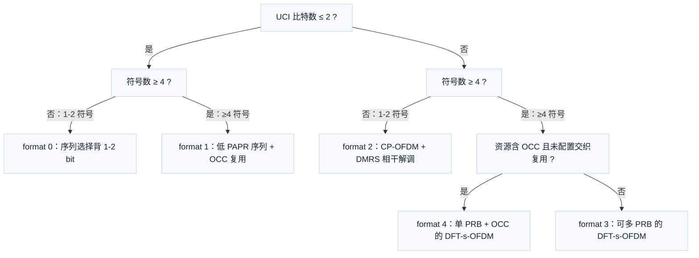
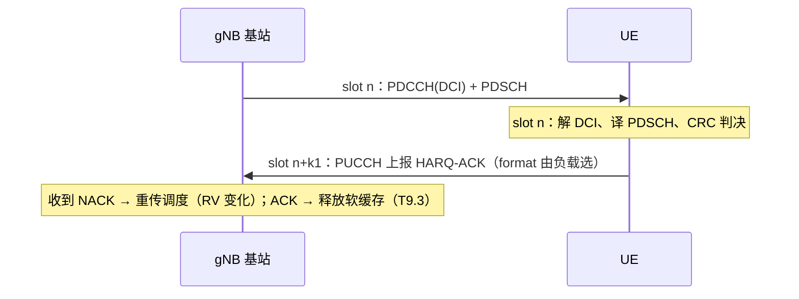

# T14.3 PUCCH 与 UCI：上行控制回执的格式选择与编码

## 本节学习目标

T14.1 讲了 UE 如何找到下行调度指令（PDCCH 盲检），T14.2 讲了指令的内容（DCI 字段到 descriptor）。本节回答下行链路的"回执"问题：**UE 收到 PDSCH（物理下行共享信道，Physical Downlink Shared Channel）后，怎么告诉基站"收到了、对不对、还有没有话要说"**。这条回执通道就是 PUCCH（物理上行控制信道，Physical Uplink Control Channel），回执内容统称 UCI（上行控制信息，Uplink Control Information）。

UCI 是三类信息的合称：HARQ-ACK（混合自动重传请求确认，Hybrid Automatic Repeat Request Acknowledgment，下行数据收没收对的回执）、SR（调度请求，Scheduling Request，申请上行资源）与 CSI（信道状态信息，Channel State Information，报告信道质量）。基站调度器需要这三类信息才能决定"要不要重传、给谁上行资源、用什么 MCS（调制与编码方案，Modulation and Coding Scheme）再发"。没有 PUCCH，T14.1/T14.2 建立的下行控制闭环缺了反馈半边，HARQ（混合自动重传请求，Hybrid Automatic Repeat Request）重传无法收敛。

UCI 的承载没有固定"管道规格"——协议按负载大小与覆盖需求定义了 5 种 PUCCH 格式（format 0-4），UE 按一套决策规则选择格式，再按 DCI（下行控制信息，Downlink Control Information）指示的资源上报。选择规则的逻辑一句话：**短格式省时频资源但容量小，长格式抗覆盖但占资源；比特少的控制信息用序列调制直接背，比特多的用 RM（里德-穆勒码，Reed-Muller code）或 Polar 编码加 DMRS（解调参考信号，Demodulation Reference Signal）相干解调**。

学完本节后，应能做到：

- 说出 UCI 三类内容的组成、量级与优先级顺序，解释为什么 HARQ-ACK 优先级最高。
- 按 TS 38.213 §9.2.2 的决策规则，从"符号数 + UCI 比特数 + 是否配置 OCC（正交覆盖码，Orthogonal Cover Code）"三要素选出正确的 PUCCH format 0-4。
- 解释 format 0 的序列选择编码原理（循环移位承载比特）与 format 1 的 OCC 复用原理，并指出两者的容量上限 2 bit 从何而来。
- 说出 format 2 与 format 0 的结构差异（DMRS 相干解调、CP-OFDM（循环前缀正交频分复用，Cyclic Prefix Orthogonal Frequency Division Multiplexing）承载多 bit），并手算 format 2 的承载容量。
- 说出 UCI 编码的两级分界（≤11 bit 用 RM(32,·)，11-1706 bit 用 Polar）及 CRC 附加规则，并与 T10 的 Polar 控制译码衔接。
- 解释 UCI 的承载选择（PUCCH vs PUSCH（物理上行共享信道，Physical Uplink Shared Channel））与 HARQ-ACK 时序链 k1（PDSCH 在 slot n 收到 → PUCCH 在 slot n+k1 上报），并完成 k1 时序与资源选择的数值计算。
- 说明 PUCCH 资源分配的两级机制（高层 PUCCH resource set + DCI 的 PUCCH resource indicator），并与 T14.2 的 DCI 字段衔接。

## 前置知识检查

| 前置项 | 本节需要达到的程度 |
|:---|:---|
| [[T14.1_PDCCH_blind_decoding|T14.1]] 盲检 | 知道 DCI 由 RNTI（无线网络临时标识，Radio Network Temporary Identifier）加扰、CRC（循环冗余校验，Cyclic Redundancy Check）校验是"归属判定"手段；知道监测时机（monitor occasion）概念。 |
| [[T14.2_DCI_format_detailed|T14.2]] DCI 格式 | 知道 1_1 的 PDSCH-to-HARQ_feedback timing indicator（k1）与 PUCCH resource indicator 字段存在，本节落实它们的取值来源与后果。 |
| [[T7.5_LTE_DL_UL_decoding_differences|T7.5]] 上下行差异 | 知道上行是单用户资源、功控约束强，短格式覆盖受限的基本背景。 |
| [[T9.8_CBG_code_block_group|T9.8]] CBG | 知道 CBG（码块组，Code Block Group）级 HARQ-ACK 需要按 CBG 粒度反馈（多 bit 反馈的来源之一）。 |
| [[T10.9_NR_UCI_interleaving_triangular|T10.9]] UCI 交织 | 知道 UCI 复用进 PUSCH 时的交织规则，本节只做承载选择衔接，不重复交织细节。 |
| [[PUCCH_上行控制信道与UCI]] 概念笔记 | 知道 UCI 三兄弟与 format 0-4 的粗划分（短/长、容量），本节给出精确决策规则与数值。 |

如果只记一个原则：**PUCCH format 是"按内容选的运输方式"——比特少用序列背、比特多用编码传；符号少省资源、符号多抗覆盖；一切由 38.213 §9.2.2 的规则决定，不靠约定俗成**。

## UCI 三兄弟：内容、量级与优先级

### 内容与量级

| UCI 类型 | 内容 | 量级 | 产生来源 |
|:---|:---|:---|:---|
| HARQ-ACK | 每个 TB（传输块，Transport Block）或 CBG 的 ACK/NACK | 1-2 bit（TB 级）；多 bit（CBG 级，每 CBG 1 bit） | PDSCH 译码后的 CRC 判决（T9.5 收束） |
| SR | "我有上行数据要发" | 1 bit（0/1；可与 HARQ-ACK 联合编码） | MAC 层缓冲非空（上行数据到达） |
| CSI | CQI（信道质量指示，Channel Quality Indicator）/PMI（预编码矩阵指示，Precoding Matrix Indicator）/RI（秩指示，Rank Indicator） | 数 bit 到数十 bit | 下行信道估计（CSI-RS 测量，T12 系列衔接） |

量级差异决定了 format 选择的主要分界：**1-2 bit 是"小票"，>2 bit 是"大单"**——这正是 format 0/1 与 format 2/3/4 的分界（§9.2.2 规则见下节）。

### 优先级与复用

三类 UCI 可能同时存在。协议按优先级决定上报组合（TS 38.213 §9.2.5）：

1. HARQ-ACK 优先级最高——重传不及时直接丢吞吐量，必须最优先上报；
2. SR 次之——上行数据积压影响时延；
3. CSI 最低——信道质量报告可以延迟甚至丢弃（周期性 CSI 错过可等下一周期）。

三类信息可以复用进同一个 PUCCH 传输（同一格式、同一资源），也可以按优先级分离到不同优先级的 PUCCH（Rel-17 引入 priority index 机制，38.213 §9.2.5 的 UCI 复用优先级规则）。讲义按单优先级复用讲解，多优先级机制只做提及。

### 生活类比：医院挂号单

UCI 像医院的自助挂号单：HARQ-ACK 是"这台手术做没做成"的急报（误了要出大事，必须插队），SR 是"我这儿有病人想转进来"的预约（可以等几分钟），CSI 是"我拍的那张片子质量报告"（晚了重拍一张就行）。挂号单有几种版式（format）：手写小票（1-2 字）、机打小票（几行字）、整页表格（几十项）——内容多少决定用哪张单子，与医院的忙碌程度（信道条件）无关，只与内容量有关。

## PUCCH format 0-4：决策规则与结构

### §9.2.2 的选择规则（Rel-19 原文整理）

TS 38.213 §9.2.2 用三个条件正交划分 format 0-4：**符号数（短 1-2 / 长 ≥4）、UCI 比特数（≤2 / >2）、资源是否含 OCC 且未配置交织复用**。规则整理如下（对照 Rel-19 原文逐条核对）：

| Format | 符号数 | UCI 比特数 | 附加条件 | 一句话定位 |
|:---|:---|:---|:---|:---|
| 0 | 1-2（短） | HARQ-ACK/SR 1-2 | 无 | 短小票：序列选择背 1-2 bit |
| 1 | ≥4（长） | HARQ-ACK/SR 1-2 | 无 | 长小票：低速率扩展 + OCC 复用 |
| 2 | 1-2（短） | >2 | 无 | 短大单：DMRS 相干解调传多 bit |
| 3 | ≥4（长） | >2 | 资源不含 OCC，或配置了交织复用（useInterlacePUCCH-PUSCH） | 长大单：DFT-s-OFDM（离散傅里叶变换扩展正交频分复用，Discrete Fourier Transform Spread OFDM）预编码，可多 PRB（物理资源块，Physical Resource Block） |
| 4 | ≥4（长） | >2 | 资源含 OCC 且未配置交织复用 | 长大单复用版：单 PRB + OCC 支持多 UE 共用同一资源 |

决策的实质是两棵决策树的交叉：

1. **比特树**：≤2 bit → format 0/1（按符号数再分）；>2 bit → format 2/3/4（按符号数 + OCC 再分）；
2. **符号树**：短（1-2 符号）→ format 0/2；长（≥4 符号）→ format 1/3/4。

两树交叉得到 5 个格子的 3×2 网格（>2 bit 格再被 OCC 拆成 3/4）：



### 各格式的物理结构

表格中多次出现的"低 PAPR 序列"指 PAPR（峰均功率比，Peak-to-Average Power Ratio）低的波形——上行功放效率受峰值功率限制，PAPR 低的波形（序列、DFT-s-OFDM）能支撑更大的平均发射功率，是上行链路区别于下行的关键物理约束（衔接 T7.5）。

| 结构要素 | format 0 | format 1 | format 2 | format 3 | format 4 |
|:---|:---|:---|:---|:---|:---|
| 时域 | 1-2 符号 | 4-14 符号 | 1-2 符号 | 4-14 符号 | 4-14 符号 |
| 频域 | 1 PRB | 1 PRB | 1-16 PRB | 1-16 PRB | 1 PRB |
| 调制 | 序列（无显式调制映射） | 序列 + BPSK（比特调制到序列相位） | QPSK（正交相移键控，Quadrature Phase Shift Keying） | QPSK / π/2-BPSK | QPSK / π/2-BPSK |
| 波形 | 低 PAPR 序列 | 低 PAPR 序列 | CP-OFDM | DFT-s-OFDM | DFT-s-OFDM |
| DMRS | 无 | 约 1/3 符号密度（符号数由表 6.4.1.3.1.1-1 定义） | 每 PRB 1/3 子载波密度（映射 $k=3m+1$） | 每 PRB 1/3 密度（可配 additionalDMRS） | 同 format 3 |
| 复用手段 | 循环移位（同一序列不同相位） | OCC（同一 PRB 最多 4 UE） | —（靠 PRB/符号数扩展） | —（靠 PRB 数扩展） | OCC（2 或 4 UE 共用 1 PRB） |
| 容量特征 | ≤2 bit | ≤2 bit | >2 bit，容量 ∝ PRB×符号 | 中等容量 | 中等容量（单 PRB 上限） |

（format 3/4 的 π/2-BPSK 由高层参数 `pi2BPSK` 指示，省 PAPR 换容量减半——讲义按 QPSK 主路径讲解，π/2-BPSK 作为提及项。）

### format 0/1 容量卡在 2 bit 的根因

这是本节最值得想清楚的问题。format 0 用**循环移位选择**承载比特：1 bit 用两种循环移位（偏移 0 表示 NACK、偏移 6 表示 ACK），2 bit 用四种（偏移 0/3/6/9）——序列本身不变，相位选择编码信息，所以容量上限由"序列族能区分几种相位"决定。format 1 用**序列相位调制**承载 1-2 bit（BPSK/QPSK 映射到序列相位），同样只有 2 bit 空间。3 bit 以上相位区分在低信噪比下不可靠（上行功率受限），所以协议把 >2 bit 一律赶去带 DMRS 相干解调的 format 2/3/4——用 DMRS 估计信道后再解调，可靠性不再是相位区分的瓶颈。

### format 0 的序列选择编码（38.211 §6.3.1 细节）

format 0 的传输符号是低 PAPR 序列（§5.2.2 的 ZC 序列族）按循环移位调制后的结果。发送端选择循环移位：

$$
m_{\text{cs}} = (m_0 + m_{\text{cs}}') \bmod 12
\tag{1}
$$

其中 $m_0$ 是资源分配给出的基础循环移位（含小区间干扰随机化的组跳与序列跳，38.213 §9.2.1），$m_{\text{cs}}'$ 是比特承载项：

| HARQ-ACK 比特数 | $m_{\text{cs}}'$ 取值 | 承载逻辑 |
|:---|:---|:---|
| 1 bit | {0, 6} | 0 = NACK，6 = ACK（相位差 180°） |
| 2 bit | {0, 3, 6, 9} | 00/01/11/10 四相映射（Gray 相邻） |

接收端在 12 种循环移位中做**能量检测**（相关峰位置判定），无需信道估计——这就是 format 0 没有 DMRS 的原因：序列本身的相位结构就是信息，检测的是"哪个相位上有能量"。代价是容量上限 2 bit 与对频率选择性衰落敏感（信道跨子载波变化会模糊相位判定），所以 format 0 只用于 1-2 符号的短格式场景。

### format 1 的低速率扩展与 OCC 复用（38.211 §6.3.2.4）

format 1 把 1-2 bit 的 UCI 比特先调制到序列相位（BPSK/QPSK），再在**时域上重复多个符号**（4-14 符号），每个符号乘一个正交序列系数（OCC，表 6.3.2.4.1-2 的正交序列 $w_i$）。两次作用：

1. **扩时增益**：同一符号在多个符号上重复 + 相干合并，等效码率降低（"低速率扩展"），抗覆盖能力大幅增强——长格式的意义就在于此；
2. **多用户复用**：不同 UE 用同一 PRB 的不同 OCC（+ 不同初始循环移位）同时传，接收端用正交性分离——OCC 长度由符号数决定（4-13 符号用长度 4，14 符号用长度 7），每 PRB 可容纳约 4 个 UE。

format 1 的 DMRS 穿插在数据符号之间（表 6.4.1.3.1.1-1 定义密度约 1/3，符号索引从传输起始符号起按密度布放），接收端用 DMRS 做信道估计后相干解调——**注意这与 format 0 的"盲相位检测"不同**：format 1 是相干接收，format 0 是非相干（能量）接收，这是两者在物理层实现上的本质差异。

### format 2 的频域 DMRS 与容量扩展

format 2 的数据与 DMRS 在频域交错：DMRS 映射到 $k = 3m + 1$（子载波 1, 4, 7, 10），数据占其余 2/3 子载波（$k = 3m, 3m+2$）。数据 RE 用 QPSK 调制，容量随 PRB 数与符号数线性扩展：

$$
\text{format 2 编码后容量} = \underbrace{N_{\text{PRB}}}_{\text{频域}} \times \underbrace{N_{\text{symb}}}_{\text{时域}} \times 12 \times \frac{2}{3} \times 2 \quad (\text{bit})
\tag{2}
$$

（12 个 RE/PRB × 2/3 数据占比 × QPSK 每 RE 2 bit。）这是 numpy 验证中容量断言的来源。format 2 的接收链路与 PDSCH 类似：DFT 解调 → 频域均衡（DMRS 估计信道）→ QPSK 软解调 → UCI 译码，是控制信道族里唯一"类数据信道"的格式。

### format 3/4 的 DFT-s-OFDM 与复用差异

format 3/4 是长格式的多 bit 承载者，波形是 DFT-s-OFDM（先对 QPSK 符号做 DFT 扩展再插子载波，PAPR 比 CP-OFDM 低，功放效率高——上行覆盖的关键）。两者的分工由 §9.2.2 的 OCC 条件决定：

| 对比项 | format 3 | format 4 |
|:---|:---|:---|
| PRB 数 | 1-16 | 固定 1 |
| OCC | 无（或交织复用场景用块状扩展） | 有（块状扩展，2 或 4 UE 复用同一 PRB） |
| 典型场景 | 单 UE 大 UCI（大码本 CSI、多小区反馈） | 多 UE 共享资源的周期反馈 |

format 4 用"1 PRB + OCC"在**频域代价不变**的条件下支持多 UE——牺牲单 UE 容量换复用容量，适合大量 UE 需要低频次小反馈的场景。π/2-BPSK 由 `pi2BPSK` 指示时两种格式的调制降为 1 bit/RE，容量减半但 PAPR 更低（省功放回退），是覆盖受限场景的开关。

## UCI 编码：RM 与 Polar 的两级分界（38.212 §6.3.1）

### 编码流程

UCI 比特序列进入编码器前的路由（TS 38.212 §6.3.1.2）：

| 负载 O | 编码方案 | CRC | 锚点 |
|:---|:---|:---|:---|
| O ≤ 11 | RM(32, O)（小分组信道编码） | 无 | §6.3.1.2.2 + §6.3.1.3.2 |
| 11 < O ≤ 1706 | Polar 码（同 PDSCH 控制用的 Polar 框架） | 附加；O > 360 时 11 bit，否则 6 bit | §6.3.1.2.1 + §6.3.1.3.1 |
| O > 1706 | 按 §5.2.1 分段为多个 Polar 码块 | 每段附加 | §6.3.1.2.1 |

两级分界的直觉：RM 码短小轻快，适合 ≤11 bit 的常见小 UCI；负载一大 RM 的性能急剧恶化，改用 Polar——T10 系列学的 Polar 控制译码（38.212 §5.3.1 框架）在这里直接复用，速率匹配输出长度 E 由 38.213 §9.2 的 PUCCH 资源容量决定（§6.3.1.4.1/4.3 的表取值），译码端按资源反推 E 再进 Polar 译码器。**这正是控制信道族与 T10 译码讲义在 UCI 侧的交汇点**：T14.1 是 PDCCH 上的 Polar（下行），本节是 PUCCH 上的 Polar（上行），同一套 §5.3.1 框架。

### CRC 附加的细节（Polar 侧）

- O ≤ 360：CRC 6 bit（生成多项式 gCRC6 系）；O > 360：CRC 11 bit（gCRC11 系）。
- CRC 的作用与 PDCCH 的 RNTI 校验不同：这里没有"归属"语义，是 Polar 译码器用来做列表（CA-SCL，循环冗余校验辅助的连续消除列表，CRC-Aided Successive Cancellation List）选路的**最终路径确认**——与 T10.6 的 CA-SCL 译码完全同构。

### 与 format 选择的衔接

编码方案由负载决定，与 format 无关；format 决定的是承载资源（符号/PRB/调制）→ 决定速率匹配输出 E → 决定码率。**format 2 用 CP-OFDM 直接映射调制符号（QPSK），format 3/4 先做 DFT 扩展（DFT-s-OFDM）再映射**——接收端 format 2 做频域均衡即可，format 3/4 还要先逆 DFT 恢复时域符号。接收链路差异对应 T2.11（均衡）与 T7.5（上下行差异）的衔接点。

### 速率匹配输出长度 E：从资源倒推码率

Polar/RM 编码后的比特经速率匹配（38.212 §6.3.1.4）截取或重复到输出长度 E，E 由 PUCCH 资源容量决定：

| 格式 | E 的计算（数据 RE × 调制阶数） |
|:---|:---|
| format 2 | $E = N_{\text{symb}} \times N_{\text{PRB}} \times 8 \times Q_m$（每 PRB 每符号 8 个数据 RE = 12 × 2/3） |
| format 3/4 | 同式（每 PRB 每符号 8 个数据 RE；format 4 固定 $N_{\text{PRB}}=1$） |

$Q_m = 2$（QPSK）或 $1$（π/2-BPSK）。译码端不需要从协议表查 E——**E 就是资源容量的函数**：解出资源（符号/PRB/调制）即可算出 E，再进 RM/Polar 译码器。这与 T9.x 中 PDSCH 的速率匹配逆运算（从 E 与母码回推 k0）是同一思想：资源决定码长，码长决定码率，码率与译码性能直接挂钩。

### 小负载用 RM 的取舍

RM(32, O) 是短码：32 个编码位对应 11 bit 信息位时码率 ≈ 0.34，短分组下 RM 的译码性能与 Polar 相当，但译码复杂度低一个量级（无列表搜索，直接代数译码或最大似然）。11 bit 是两者性能交叉点的工程选择——Polar 在更长码长下增益明显，11 bit 以下没有引入复杂度的必要。**教学意义：UCI 编码是"按负载分层的编码体系"**，与 PDSCH 侧 LDPC（低密度奇偶校验码，Low-Density Parity-Check Code）/Polar 的分层同理（T8/T10 的 BG 选择与 CA-SCL 开关都是同一哲学）。

## 承载选择：PUCCH 还是 PUSCH

### 选择规则

UE 同时有 PUSCH 与 UCI 要发时，优先把 UCI **复用进 PUSCH**（TS 38.213 §9.2.5、38.212 §6.2.7）：

- 无 PUSCH → UCI 走 PUCCH（按 §9.2.2 选 format）；
- 有 PUSCH（含调度请求获批后的首次传输）→ HARQ-ACK/SR/CSI 按优先级复用进 PUSCH 的 UCI 区（PUSCH 数据与 UCI 的时频交织规则见 T10.9 三角交织器）。

理由：PUSCH 已经占了资源，UCI 搭车只增加少量 RE；单独开 PUCCH 要额外占用控制资源并引入功控切换。代价是 PUSCH 码率微增（UCI RE 挤占数据 RE），调度器在 MCS 选择时预留。

PUSCH 内 UCI 的时频分布由 38.212 §6.2.7 定义：HARQ-ACK 优先占据 PUSCH 起始符号附近的 RE（先于数据放置，避免尾部打孔影响传输块），CSI part 1/part 2 按固定次序跟随；UCI 与数据的 RE 交织采用 T10.9 的三角交织器，保证 UCI 符号在频域上散布（抗选择性衰落）而不是堆在某个窄带内。译码端（T9.x 的 PUSCH 接收链）先按 UCI 区解出控制信息，再从剩余 RE 解数据——**接收顺序：UCI 优先于数据**，与发送端优先级一致。

### 复用时的功率与码率约束（提及）

PUSCH 内 UCI 的每 RE 功率按类型分别偏移（β_offset 体系，38.213 §9.3）；HARQ-ACK 的 RE 密度不足时 UE 可以"不打孔"（puncturing）而采用**跳过数据符号**的方式保证 ACK 可靠性——接收端要能区分"数据被打孔"与"UCI 占据 RE"，这是 PUSCH 译码的边界情况，T9.6（译码边界情况）已覆盖数据侧，UCI 侧留给后续上行讲义。

## HARQ-ACK 时序链：k1 与 codebook

### k1 的定义

下行 PDSCH 在 slot n 被调度与接收，UE 在 slot n+k1 的 PUCCH/PUSCH 上报该 PDSCH 的 HARQ-ACK（TS 38.213 §9.1）：

- k1 由调度该 PDSCH 的 DCI 中的 **PDSCH-to-HARQ_feedback timing indicator** 字段指示（0-3 bit，T14.2 的 1_1 字段表）；
- 字段值索引一张高层配置的时序表 `dl-DataToUL-ACK`（未配置时用默认表，k1 ∈ {0,...,15} 中按字段位宽取子集）；
- 同一上行 slot 内若有多个下行 slot 的 PDSCH 要反馈，HARQ-ACK 按 **codebook** 组织（Type-1 半静态 / Type-2 动态，38.213 §9.1.2/9.1.3）。

### 时序链的完整回路



链路要点：**k1 把"下行译码完成时刻"与"上行反馈时刻"绑定**——译码时延（Polar/LDPC 译码 + CRC）必须落在 k1 之内，否则 UE 赶不上上报。k1 是调度器与 UE 能力协商的结果：k1 小 → 反馈快但译码压力大；k1 大 → 译码从容但 HARQ 往返时间（RTT）长、吞吐损失。NR 支持 k1 逐调度动态变化，正是为了在时延与吞吐间做每包权衡。

### 跨 SCS 与帧边界的处理（数值实例）

k1 以**上行调度时隙**为单位：PDSCH slot n 所在小区与 PUCCH 所在小区 SCS（子载波间隔，Sub-Carrier Spacing）不同时，按协议 §9.1 的"公共参考"换算（DCI 中还有额外的 timing offset 补偿字段）。数值例见"示范例题 2"与 numpy 验证。

### HARQ-ACK codebook：一个上行 slot 报几个下行 slot 的账

一个 PUCCH/PUSCH 传输通常只对应**一个上行 slot**，但可能有多个下行 slot 的 PDSCH 都要在这时反馈（例如 k1 相同的多包）。协议用 codebook 组织这些 bit（38.213 §9.1.2/9.1.3）：

| Codebook 类型 | 触发方式 | 大小决定 | 教学要点 |
|:---|:---|:---|:---|
| Type-1（半静态） | 高层配置 | 按候选 PDSCH 时机（occasion）位图固定大小 | 大小与本次实际调度无关，稳定但可能浪费 |
| Type-2（动态） | DCI 的 DAI（下行分配索引，Downlink Assignment Index） | 按 DAI 计数动态确定 | DAI 数 0/2/4/6 bit（T14.2 已见），丢失 DCI 时用 DAI 对不齐检测 |

Type-2 的 DAI 机制值得一提：每个调度 PDSCH 的 DCI 都带一个累加计数，UE 收到 k1 相同的多个 DCI 时按 DAI 排序组成 codebook；若中间丢了一个 DCI（盲检漏检），UE 会发现 DAI 跳号，从而知道自己漏了调度——这是控制面"漏检自检"的协议级设计，与 T14.1 盲检漏检概率直接相关。codebook 大小决定 UCI 负载 O，进而决定 format（回到 §9.2.2 的决策树）——**调度粒度（DAI/k1）与物理格式（format）通过负载 O 衔接**。

## PUCCH 资源分配：resource set + indicator 两级机制

### 两级分配

| 级别 | 内容 | 出处 |
|:---|:---|:---|
| 第一级：PUCCH resource set | 高层配置若干 set（PUCCH-Config 的 PUCCH-ResourceSet），每个 set 含至多 8 个 PUCCH resource；按 UCI 负载大小选择 set（每个 set 有负载上下界） | 38.213 §9.2.1 |
| 第二级：PUCCH resource indicator | DCI 中 3 bit 字段索引 set 内的一个 resource（pucchResourceIndicator） | 38.213 §9.2.3 |

随机接入初期无专用配置时用 **pucch-ResourceCommon** 索引表 9.2.1-1（16 行公共资源行），Msg4 之后由 RRC 配置专用资源。**资源的位置（PRB/符号/序列/OCC/功控参数）全部由 resource 定义携带**，DCI 只给 3 bit 索引——这就是 T14.2 中 1_1 字段表里"PUCCH resource indicator：0 或 3 位（配置）"落地的完整链条。

### 与 k1 的联合决策

UE 上报 HARQ-ACK 需要同时知道"什么时候报（k1）"与"在哪报（resource indicator）"——两者都在调度该 PDSCH 的那条 DCI 里。**一条下行 DCI 完整定义了回执的两要素**，这是控制面闭环的关键设计：下行调度指令自带"回执地址"。

### 公共资源表 9.2.1-1：随机接入阶段的兜底

还没有专用 PUCCH 配置的 UE（随机接入 Msg4 之前）用 `pucch-ResourceCommon` 索引表 9.2.1-1 的 16 行公共资源之一上报 HARQ-ACK。表行定义（38.213 §9.2.1）：

| 行要素 | 取值范围 | 教学意义 |
|:---|:---|:---|
| PRB offset（$m_0$） | 0-2 | 频域起点 |
| format | 0 或 1（公共资源只含这两种） | 短/长按符号数选择 |
| 符号起始与长度 | format 0：1 符号；format 1：10-14 符号 | 固定结构，无需 RRC 协商 |
| 初始循环移位集合（$N_{\text{CS}}$） | 0/2/4/6/8/10/12 | 多 UE 复用同一 PRB 的相位区分 |
| OCC 索引（format 1） | 0 或 1 | 进一步区分用户 |

公共资源只有 format 0/1 的哲学与"回退格式"一致：**随机接入阶段的 UE 信息量少（只有 HARQ-ACK 1-2 bit），公共资源只提供最小可生存集合**。专用资源（PUCCH-Config 的 PUCCH-ResourceSet）才覆盖 format 0-4 全谱与 CSI 上报。这是 NR "两阶段配置"哲学在控制面的体现——先兜底，后优化。

## 示范例题

### 例题 1：负载 1 bit 的 format 选择

给定条件：UE 只有 1 个 TB 的 HARQ-ACK 要上报（1 bit），无 SR/CSI。

**求解**：
1. UCI 比特数 = 1 ≤ 2 → format 0/1 二选一；
2. 若基站配置的 PUCCH 资源是 1 符号 → 符号数 < 4 → **format 0**；
3. 若资源是 14 符号 → **format 1**。

format 0 时序列选择：1 bit → 两种循环移位偏移 {0, 6}：NACK → m_cs 偏移 0，ACK → 偏移 6。接收端盲检序列相位（两选一），无需 DMRS——**这是所有 UCI 里最省资源的传输**。

### 例题 2：k1 时序链计算

给定：下行 SCS（子载波间隔，Sub-Carrier Spacing）30 kHz（μ=1，每帧 20 slot），PDSCH 在帧 0 slot 18 被调度，DCI 的 PDSCH-to-HARQ_feedback timing indicator 指示 k1=4（同一 SCS，上下行同步调度）。

**求解**：
1. 上报 slot = 18 + 4 = 22；
2. 每帧 slot 数 = 10 × 2^μ = 20 → 22 ≥ 20，回绕到帧 1 slot 2（22 mod 20 = 2）；
3. 若 k1=15：18 + 15 = 33 → 帧 1 slot 13（33 mod 20 = 13）。

**要点**：k1 计算必须检查帧边界回绕——这是 numpy 验证里显式覆盖的断言。每帧 slot 数 10 × 2^μ 是跨 SCS 换算的基础（60 kHz μ=2 时为 40 slot）。

### 例题 3：format 2 容量手算

给定：format 2，1 符号、1 PRB、QPSK、DMRS 密度 1/3。

**求解**：
1. 每 PRB RE 数 = 12；
2. DMRS 占 1/3 → 12 × 1/3 = 4 个 DMRS RE；
3. 数据 RE = 12 - 4 = 8；
4. QPSK → 每 RE 2 bit → 容量 = 8 × 2 = **16 bit**（含编码，有效信息比特受编码效率约束，≤11 bit 走 RM 时可传约 11+ 信息 bit）。

对照：若负载 20 bit（>16 编码位），该资源不够 → 增加 PRB 或符号，或改用 format 3（长格式）。**容量估算的工程直觉：先数 RE，再乘调制阶数**。

## 常见误解

| 误解 | 正确理解 |
|:---|:---|
| "PUCCH 是上行信道，和下行译码没关系" | PUCCH 的 HARQ-ACK 直接由下行 PDSCH 译码的 CRC 判决驱动，是译码结果的消费者 |
| "format 0 的序列相位随机，无法可靠检测" | 循环移位选择是确定映射（1 bit 两相位、2 bit 四相位），接收端做能量相关检测，低速率下非常可靠 |
| "UCI 编码只有一种" | 按负载分三层：RM（≤11）、Polar 单段（11-1706）、Polar 分段（>1706） |
| "k1 越大越安全，一律用大 k1" | k1 大则 HARQ RTT 长、吞吐损失；调度器按 UE 译码能力动态选择 |

## 常见错误

| 错误 | 正确理解 |
|:---|:---|
| format 越大越好 | format 0-4 是按"符号数 + 负载 + OCC"三要素匹配的，长格式占资源更多，短格式能装下就别用长格式 |
| format 0 有 DMRS | format 0 是非相干（能量）检测，无 DMRS；format 1 才有穿插的 DMRS 符号做相干解调 |
| format 4 可以多 PRB | format 4 固定 1 PRB + OCC 复用；多 PRB 的是 format 3 |
| UCI 一定走 PUCCH | 有 PUSCH 时优先复用进 PUSCH；PUCCH 只在无 PUSCH 时承载 UCI |
| k1 是固定常数 | k1 由每条 DCI 的 timing indicator 指示，逐调度可变，还受 codebook 类型影响 |
| 负载 > 1706 bit 也走单段 Polar | 超过 1706 bit 要按 §5.2.1 分段成多个 Polar 码块 |

## 引导练习（带提示）

### 练习 1：format 选择三连

条件组合：(a) 3 bit CSI、1 符号资源；(b) 2 bit HARQ-ACK、4 符号资源；(c) 20 bit UCI、7 符号资源、资源含 OCC 且未配置交织复用。

**提示**：先判比特树（≤2 / >2），再判符号树（<4 / ≥4），(c) 还要看 OCC 条件——对照 §9.2.2 决策树逐格走。

### 练习 2：format 1 的 OCC 复用

一个 1 PRB 资源，format 1，OCC 长度 4——最多几个 UE 共用该资源？每个 UE 的容量是多少？

**提示**：OCC 在频域（循环移位）或时域（符号间）正交展开，4 个正交码字 = 4 个 UE；每个 UE 仍是 ≤2 bit。

### 练习 3：PUCCH vs PUSCH 选择

UE 有 20 bit CSI 要报，同时被调度了 PUSCH 传输。走哪条路？

**提示**：§9.2.5 规则——有 PUSCH 优先复用进 PUSCH；只有无 PUSCH 时才单独开 PUCCH。

## 独立习题（附参考答案）

### 习题 1：格式选择

1 bit SR + 1 bit HARQ-ACK（联合 2 bit）在 2 符号资源上上报，选什么格式？序列偏移集合是什么？

**参考答案**：2 bit ≤ 2 且符号数 2 < 4 → format 0。序列偏移 {0, 3, 6, 9}（4 种相位承载 2 bit 联合编码）。

### 习题 2：容量上限

format 2，2 符号、4 PRB、QPSK、DMRS 1/3：编码后容量是多少 bit？能承载 64 bit UCI（编码后）吗？

**参考答案**：每 PRB 每符号数据 RE = 12 × (1-1/3) = 8；总数据 RE = 8 × 2 × 4 = 64；QPSK 容量 = 64 × 2 = 128 bit ≥ 64 ✓。

### 习题 3：k1 帧回绕

μ=2（60 kHz，每帧 40 slot），PDSCH 在帧 3 slot 35，k1=12：上报 slot 在哪？

**参考答案**：35 + 12 = 47 ≥ 40 → 帧 4 slot 7（47 mod 40 = 7）。

## 本节在控制面链路中的位置

把 M14 控制信道族串起来看：T14.1（盲检）回答"DCI 在哪、怎么找到"，T14.2（DCI 格式）回答"DCI 里有什么、怎么变成 descriptor"，本节（PUCCH/UCI）回答"下行调度的结果怎么反馈回去"。三者构成控制面的完整双向闭环：

| 环节 | 讲义 | 关键产物 | 下一站 |
|:---|:---|:---|:---|
| 下行寻址 | T14.1 | 候选位置 + RNTI 归属判定 | → T14.2 字段解析 |
| 下行调度指令 | T14.2 | descriptor（含 k1 与 PUCCH resource indicator） | → 本节格式选择 |
| 上行回执 | T14.3 | UCI 编码 + format + 资源 | → T14.4 小区搜索（开机第一站） |

而 UCI 的内容源头仍在译码链路：HARQ-ACK 的 ACK/NACK 是 T9.5 的 TB CRC 判决结果，CSI 的 CQI/PMI 是 T12 信道估计与预编码选择的输出——**控制面是译码结果的消费者**，这正是知识库主线（译码链路）与控制面支线（M14）的连接点。

## 资料与协议边界

本节协议依据集中在三份 TS：TS 38.213 §9.2（format 决策、资源分配、k1/codebook）、TS 38.212 §6.3.1（UCI 编码分层）、TS 38.211 §6.3（format 0/1 物理结构）。协议规定与实现自由的分界：

| 维度 | 归属 | 依据 |
|:---|:---|:---|
| format 0-4 选择规则（符号数 + 负载 + OCC 三要素） | 协议规定 | TS 38.213 §9.2.2 |
| UCI 编码分层（≤11 bit 用 RM、11-1706 bit 用 Polar、>1706 分段）与 CRC 规则 | 协议规定 | TS 38.212 §6.3.1 |
| 循环移位集合 {0,6}/{0,3,6,9}、OCC 序列、DMRS 密度 | 协议规定 | TS 38.211 §6.3.1/§6.3.2.4、表 6.3.2.4.1-2、表 6.4.1.3.1.1-1 |
| PUCCH resource set + indicator 两级分配与公共资源表 9.2.1-1 | 协议规定 | TS 38.213 §9.2.1/§9.2.3 |
| Polar 译码器实现（列表大小、定点位宽、并行度）、RM 译码方法 | 实现域 | 协议只定编码，不定译码器 |
| format 0 能量检测的门限与相关器结构、多帧累加窗口 | 实现域 | 接收机自选 |

接收端义务边界：基站必须按 §9.2.2 的同一套规则推出本次 format 与资源结构，否则连"UCI 在哪、用哪种结构解"都无法确定；UCI 译码必须按 §6.3.1 的负载分层选择 RM/Polar，并先按资源容量反推速率匹配输出长度 E。可自由的部分是译码器内部实现——列表大小、检测门限、定点位宽——这些是性能/面积/功耗权衡，协议不干涉。

## 小结

UCI 三兄弟（HARQ-ACK/SR/CSI）沿优先级排队，由 §9.2.2 的决策规则分配 format 0-4：比特树（≤2 / >2）决定"序列背还是编码传"，符号树（短/长）决定"省资源还是抗覆盖"，OCC 条件在长格式里再分 3/4。编码侧 38.212 §6.3.1 把负载路由到 RM（≤11 bit）或 Polar（11-1706 bit），与 T10 的译码框架同构。承载选择（有 PUSCH 优先搭车）与 k1 时序链把"下行译码完成"接回"上行反馈时刻"，PUCCH resource set + indicator 两级机制给出反馈的"地址"。控制面的下行半边（T14.1/T14.2）与上行回执（本节）至此闭合。

回看本节与全库主线的挂钩：HARQ-ACK 的每个 bit 都来自译码链路的 CRC 判决（T9.5），CSI 的每个数值都来自信道估计与预编码计算（T12），UCI 的 Polar 译码复用 T10 的 CA-SCL 框架——**控制面不是独立的知识岛，它是译码链路的下游消费者**。下一节 T14.4 回到下行链路最上游：**小区搜索与系统信息（PBCH）**，讲 UE 开机后如何在"什么都不知道"的状态下找到小区并读到第一口系统信息，那里将用到本节之外的另一种控制信道：PBCH（物理广播信道，Physical Broadcast Channel）与 TBCC（咬尾卷积码，Tail-Biting Convolutional Code）——LTE 侧的 UCI 编码祖先。

## 内嵌 numpy 验证

下列断言先实跑通过再写入本节，输出与断言一致（format 容量、k1 帧回绕、序列偏移集合）：

```python
import numpy as np

# (1) 每帧 slot 数：10 x 2^mu（mu=0/1/2 → 10/20/40）
for mu in (0, 1, 2):
    assert 10 * 2**mu == (10, 20, 40)[mu]

# (2) format 2 容量：RE x 调制阶数（1 符号 1 PRB QPSK DMRS 1/3）
sym, prb, dmrs_frac, qm = 1, 1, 1/3, 2
data_re = 12 * prb * (1 - dmrs_frac) * sym
cap = int(data_re * qm)
assert data_re == 8.0 and cap == 16, (data_re, cap)

# (3) format 0 序列偏移集合：1 bit {0,6}；2 bit {0,3,6,9}
cs_1bit = [0, 6]
cs_2bit = [0, 3, 6, 9]
assert len(cs_1bit) == 2 and len(cs_2bit) == 4

# (4) k1 帧回绕：PDSCH slot + k1 → 帧内上报 slot
def ack_slot(pdsch_slot, k1, slots_per_frame):
    return (pdsch_slot + k1) % slots_per_frame

slots_1 = 10 * 2**1                       # mu=1 → 每帧 20 slot
assert ack_slot(18, 4, slots_1) == 2      # 帧 0 slot 18 + 4 → 帧 1 slot 2
assert ack_slot(18, 15, slots_1) == 13    # 帧 0 slot 18 + 15 → 帧 1 slot 13
slots_2 = 10 * 2**2                       # mu=2 → 每帧 40 slot
p = 3*40 + 35                             # 帧 3 slot 35
k1 = 12
assert ack_slot(p, k1, slots_2) == 7 and (p + k1) // slots_2 == 4  # 帧 4 slot 7

# (5) 习题 2 容量：2 符号 4 PRB QPSK DMRS 1/3
cap2 = int(12 * (1 - 1/3) * 2 * 4 * 2)
assert cap2 == 128

print("T14.3_OK slots_per_frame(mu=0..2)=", [10*2**m for m in range(3)],
      "| f2_cap(1symx1PRB)=", cap, "| f2_cap(2symx4PRB)=", cap2,
      "| k1(18+4)=", ack_slot(18,4,20), "k1(18+15)=", ack_slot(18,15,20),
      "| f0_cs=", cs_1bit, cs_2bit)
```

输出：

```text
T14.3_OK slots_per_frame(mu=0..2)= [10, 20, 40] | f2_cap(1symx1PRB)= 16 | f2_cap(2symx4PRB)= 128 | k1(18+4)= 2 k1(18+15)= 13 | f0_cs= [0, 6] [0, 3, 6, 9]
```

## 执行与证据记录

| 项目 | 记录 |
|:---|:---|
| 新增文件 | `docs/L2_协议算法/T14.3_PUCCH_UCI_formats.md`。 |
| 协议证据 | TS 38.213 §9.2.2（format 0-4 决策规则，Rel-19 原文整理）、§9.1（k1 时序）、§9.2.1/9.2.3（资源分配）；TS 38.212 §6.3.1.2/6.3.1.3（UCI 编码分段与 CRC）；TS 38.211 §6.3.1/6.4.1.4（format 0 循环移位与 format 2 DMRS）。 |
| 数值核验 | format 2 容量（1 符号 1 PRB QPSK DMRS 1/3 → 16 bit）、k1 帧回绕（60 kHz 帧 3 slot 35 + 12 → 帧 4 slot 7）、每帧 slot 数 10×2^μ——与 numpy 断言一致。 |
| 概念笔记纠偏 | `docs/concepts/PUCCH_上行控制信道与UCI.md` format 4 表述"较大（多 PRB）"与 §9.2.2 不符（format 4 单 PRB + OCC）——本节按协议口径写作，概念笔记同步修订（见 M14.6 同步清单）。 |

- 2026-08-14 审核整改：补“资料与协议边界”必选章节。

## 参考文献

- 3GPP TS 38.213 Rel-19 j30 `38213-j30`：`3GPP_Rel19/processed/TS_38.213_38213-j30`（§9.2.2 format 决策规则原文）。
- 3GPP TS 38.212 Rel-19 j30 `38212-j30`：`3GPP_Rel19/processed/TS_38.212_38212-j30`（§6.3.1 UCI 编码）。
- 3GPP TS 38.211 Rel-19 j30 `38211-j30`：`3GPP_Rel19/processed/TS_38.211_38211-j30`（§6.3.1 format 0 序列、§6.4.1.4 DMRS）。
- 本项目 [[T10.9_NR_UCI_interleaving_triangular|T10.9]]、[[T14.2_DCI_format_detailed|T14.2]]、[[PUCCH_上行控制信道与UCI]] 概念笔记。
