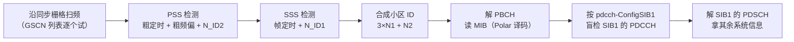

# T14.4 小区搜索与系统信息：从"什么都不知道"到第一口系统信息

## 本节学习目标

T14.1-T14.3 讲的盲检、DCI（下行控制信息，Downlink Control Information）、PUCCH（物理上行控制信道，Physical Uplink Control Channel）都假设 UE 已经**在一个小区里正常工作**。但 UE 开机的第一刻不是这样：它不知道自己在哪个频率、不知道定时、不知道小区 ID（物理小区标识，Physical Cell Identity）、不知道任何配置。本节回答全链路最上游的问题：**UE 如何从零开始找到小区、确认身份、读到第一口系统信息**。

答案是一条固定的流程：沿**同步栅格**（global synchronization raster）扫频找 SSB（同步信号块，Synchronization Signal Block）→ 用 PSS（主同步信号，Primary Synchronization Signal）做粗定时与粗频偏并拿到 $N_{\mathrm{ID}}^{(2)}$ → 用 SSS（辅同步信号，Secondary Synchronization Signal）补帧定时并拿到 $N_{\mathrm{ID}}^{(1)}$ → 由两者合成物理小区 ID → 解 PBCH（物理广播信道，Physical Broadcast Channel）读 MIB（主信息块，Master Information Block）→ 按 MIB 的 pdcch-ConfigSIB1 去盲检 SIB1（系统信息块 1，System Information Block 1）的 PDCCH → 解 SIB1 拿其余配置。整条链路是"先同步、后广播、再调度"的递进：每一步只依赖前一步的产出，没有任何外部假设。

编码侧，NR 的 PBCH 用 Polar 码（与 PDCCH 同族，T10 框架直接复用），LTE 的 PBCH 用 TBCC（咬尾卷积码，Tail-Biting Convolutional Code）——本节讲 NR 主线（Polar），LTE 的 TBCC 编码细节留给 T14.5 专题，本节只做对照提及。

学完本节后，应能做到：

- 按顺序说出小区搜索的完整流程（扫频 → PSS → SSS → 小区 ID → PBCH/MIB → SIB1），并指出每一步的产出与下一步的输入。
- 说出 GSCN（全球同步信道号，Global Synchronization Channel Number）与 SSB 频域位置的关系，完成 GSCN ↔ 频率的换算（对照 38.101-1 表 5.4.3.1-1）。
- 说明 PSS/SSS 的序列结构（长度 127 的 m 序列、3 个 $N_{\mathrm{ID}}^{(2)}$ 与 336 个 $N_{\mathrm{ID}}^{(1)}$）与小区 ID 合成公式 $N_{\mathrm{ID}}^{\mathrm{cell}} = 3N_{\mathrm{ID}}^{(1)} + N_{\mathrm{ID}}^{(2)}$，并完成反向拆解。
- 说出 SSB 的时频结构（4 符号 × 240 子载波 = PSS + SSS + PBCH + PBCH DM-RS）与 SSB 索引（多波束）机制。
- 说出 PBCH 载荷 32 bit 的组成（MIB 23 bit + 附加 8 bit + 保留 1 bit）、CRC（gCRC24C）与 Polar 编码参数（母码 512、速率匹配 864 bit），并与 T10 的 Polar 框架衔接。
- 逐项解读 MIB 的 6 个字段（systemFrameNumber/subCarrierSpacingCommon/ssb-SubcarrierOffset/dmrs-TypeA-Position/pdcch-ConfigSIB1）及 SFN 高低位拼接规则。
- 说明系统信息层级（MIB → SIB1 → 其他 SIB）与 pdcch-ConfigSIB1 的 CORESET（控制资源集，Control Resource Set）0 + 搜索空间 0 机制，并指出 LTE 侧 PBCH 用 TBCC 的对照。
- 把小区搜索与接收链路衔接：PSS/SSS 相关峰是 T2.7（定时）与 T2.8（CFO（载波频偏，Carrier Frequency Offset））的输入，解 PBCH 需要先完成信道估计。

## 前置知识检查

| 前置项 | 本节需要达到的程度 |
|:---|:---|
| [[T2.7_OFDM_timing_synchronization|T2.7]] 定时同步 | 知道符号级/帧级定时同步的概念与相关峰检测的基本思想，PSS/SSS 检测是它的具体信号源。 |
| [[T2.8_OFDM_CFO_SFO_frequency_synchronization|T2.8]] 频偏同步 | 知道 CFO 的估计与补偿原理，PSS 相关峰的相位承载粗频偏信息。 |
| [[T10.6_CRC_aided_SCL_control_reliability|T10.6]] Polar 控制译码 | 知道 Polar 译码的 CA-SCL（循环冗余校验辅助的连续消除列表，CRC-Aided Successive Cancellation List）框架，PBCH 的 Polar 译码与 PDCCH 同构。 |
| [[T14.1_PDCCH_blind_decoding|T14.1]] 盲检 | 知道 PDCCH 盲检与 RNTI（无线网络临时标识，Radio Network Temporary Identifier）机制，SIB1 的获取要盲检其 PDCCH（SI-RNTI（系统信息无线网络临时标识，System Information Radio Network Temporary Identifier）加扰）。 |
| [[PSS_SSS_同步信号与小区搜索]]、[[PBCH_MIB_广播信道]] 概念笔记 | 知道小区搜索与 PBCH/MIB 的粗轮廓，本节给精确数值与编码细节。 |

如果只记一个原则：**小区搜索是"层层解锁"的过程——频率（栅格）→ 定时（PSS/SSS）→ 身份（小区 ID）→ 系统信息（MIB→SIB1），每一步都只用前一步的产出，UE 在解锁前不需要任何先验配置**。

## 小区搜索流程总览

### 六步链路



各步产出与输入：

| 步骤 | 输入 | 产出 | 关键机制 |
|:---|:---|:---|:---|
| 1 扫频 | 频段内的 GSCN 列表 | 候选 SSB 位置 | 同步栅格（38.101-1 §5.4.3.1） |
| 2 PSS 检测 | 候选位置时域采样 | 符号级粗定时、粗频偏、$N_{\mathrm{ID}}^{(2)}$ | 长度 127 m 序列相关（38.211 §7.4.2） |
| 3 SSS 检测 | 与 PSS 对齐的符号 | 帧定时（SFN（系统帧号，System Frame Number）对齐）、$N_{\mathrm{ID}}^{(1)}$ | 两个 m 序列交织（38.211 §7.4.2） |
| 4 小区 ID | $N_{\mathrm{ID}}^{(1)}, N_{\mathrm{ID}}^{(2)}$ | $N_{\mathrm{ID}}^{\mathrm{cell}}$（1008 个） | $3N_{\mathrm{ID}}^{(1)} + N_{\mathrm{ID}}^{(2)}$ |
| 5 解 PBCH | SSB 内 PBCH 符号 + 小区 ID（解扰） | MIB（32 bit 载荷） | Polar 译码 + CRC24C |
| 6 读 SIB1 | MIB 的 pdcch-ConfigSIB1 | SIB1 的 PDCCH/PDSCH（物理下行共享信道，Physical Downlink Shared Channel）配置 | CORESET 0 + 搜索空间 0 盲检 |
| 7 解 SIB1 | PDSCH（物理下行共享信道，Physical Downlink Shared Channel）接收 | 接入所需全部公共配置 | LDPC（低密度奇偶校验码，Low-Density Parity-Check Code）译码（T9 系列） |

### 同步栅格与 GSCN：搜"哪里"

同步栅格定义 SSB 可以出现的频域位置（38.101-1 §5.4.3.1，本地 j60 表 5.4.3.1-1 核对）：

| 频率范围 | SSB 参考频率 $f_{\text{SSB}}$ | GSCN | GSCN 范围 |
|:---|:---|:---|:---|
| 0 - 3000 MHz | $N \times 1200\,\text{kHz} + M \times 50\,\text{kHz}$（N=1:2499，M∈{1,3,5}） | $3N + (M-3)/2$ | 22 - 7498 |
| 3000 - 24250 MHz | $3000\,\text{MHz} + N \times 1.44\,\text{MHz}$（N=0:14756） | $7499 + N$ | 7499 - 22255 |

设计哲学：**同步栅格比信道栅格（100 kHz）稀疏**——SSB 不必落在每个信道上，只要落在栅格点上。UE 扫频时遍历 GSCN 列表（而不是按 100 kHz 全频段扫），候选数大幅减少，搜索时间显著缩短。栅格步长随频段升高而加大（1.2 MHz → 1.44 MHz），因为高频段带宽大、频点稀疏。

### 生活类比：深夜找电台

小区搜索像深夜到陌生城市找广播电台：先按频率表（GSCN 列表）拧一圈旋钮（扫频），听到"沙沙"中有一点信号（PSS 相关峰）就停下来，确认台标（SSS 的 $N_{\mathrm{ID}}^{(1)}$）与频道身份（小区 ID），再听报时与节目导播（MIB），最后按导播提示调到下一个频道听完整节目（SIB1）。找台不需要知道电台的全部节目单——**一步步来，每步只需要上一步的信息**。

## PSS/SSS 与小区 ID：身份从何而来

### PSS：粗定时 + 粗频偏 + $N_{\mathrm{ID}}^{(2)}$

PSS 是长度 127 的 m 序列（BPSK（二进制相移键控，Binary Phase Shift Keying）调制，38.211 §7.4.2.1），3 个取值对应 $N_{\mathrm{ID}}^{(2)} \in \{0, 1, 2\}$。UE 在候选时频位置做滑动相关：相关峰的位置给出**符号级粗定时**（OFDM（正交频分复用，Orthogonal Frequency Division Multiplexing）符号边界），峰的相位旋转给出**粗频偏估计**（频偏使序列在频域整体平移，相关峰偏移量 ∝ 频偏），峰对应的序列序号给出 $N_{\mathrm{ID}}^{(2)}$。PSS 只用 3 种序列（而不是 1008 种）是刻意的：**第一步检测要轻**——3 选 1 的相关计算量只有 1008 选 1 的三百分之一，且 PSS 位置的频偏容忍度可以放宽。

### SSS：帧定时 + $N_{\mathrm{ID}}^{(1)}$

SSS 由两个 m 序列交织而成（长度 127，38.211 §7.4.2.3），携带 $N_{\mathrm{ID}}^{(1)} \in \{0, \ldots, 335\}$。SSS 在 SSB 中紧跟 PSS 之后（见下节结构），PSS 已给出符号定时，SSS 检测在此基础上完成**帧级定时**（确定 SSB 在 10 ms 帧内的位置）并解出 $N_{\mathrm{ID}}^{(1)}$。两个 m 序列的交织设计让 SSS 的 336 个取值在低信噪比下有良好的互相关系数（正交性好），这是 SSS 可靠性高于 PSS 的原因之一。

### 小区 ID 合成

$$
N_{\mathrm{ID}}^{\mathrm{cell}} = 3 N_{\mathrm{ID}}^{(1)} + N_{\mathrm{ID}}^{(2)}, \quad N_{\mathrm{ID}}^{(1)} \in \{0,\ldots,335\},\ N_{\mathrm{ID}}^{(2)} \in \{0,1,2\}
\tag{1}
$$

共 $336 \times 3 = 1008$ 个小区 ID。反向拆解：$N_{\mathrm{ID}}^{(2)} = N_{\mathrm{ID}}^{\mathrm{cell}} \bmod 3$，$N_{\mathrm{ID}}^{(1)} = \lfloor N_{\mathrm{ID}}^{\mathrm{cell}} / 3 \rfloor$。小区 ID 是 PBCH 解扰与参考信号序列生成（DM-RS（解调参考信号，Demodulation Reference Signal）、CSI-RS（信道状态信息参考信号，Channel State Information Reference Signal））的种子，所以**必须先有 ID 才能解 PBCH**——这就是小区搜索顺序固定的根本原因。

### SSB 时频结构（38.211 §7.4.3）

SSB = PSS + SSS + PBCH + PBCH DM-RS，占 **4 个 OFDM 符号 × 240 子载波（20 RB（资源块，Resource Block））**：

| 符号（相对） | 子载波范围 | 内容 |
|:---|:---|:---|
| 0 | 56-182（127 个子载波） | PSS |
| 1 | 全部 240 | PBCH（含 DM-RS） |
| 2 | 56-182 | SSS；两侧 48+48 子载波为 PBCH |
| 3 | 全部 240 | PBCH（含 DM-RS） |

PBCH 符号中 DM-RS 按 4 个子载波间隔插入（每 4 个 RE（资源元素，Resource Element）1 个 DM-RS，位置由小区 ID 决定），用于 PBCH 解调的信道估计；PBCH DM-RS 序列还**隐式携带 SSB 索引**（多波束场景下 UE 通过 DM-RS 序号知道当前 SSB 是第几个波束，T14.4 之后的波束管理衔接点）。

SSB 在时域按**突发集**（burst set）周期发送（5/10/20/40/80/160 ms 可配），突发集内最多 64 个 SSB（Lmax，按频段配置）对应 64 个波束方向——**一个 SSB = 一个波束的同步+广播**，多波束小区通过时分扫射覆盖全小区。

### SSB 索引的携带：DM-RS 与载荷的分工（38.213 §4.1）

SSB 突发集内的每个 SSB 有唯一索引（0 到 Lmax-1），UE 需要知道自己是哪个波束的 SSB。索引位被拆成两半携带：

| 部分 | 携带方式 | 位宽 |
|:---|:---|:---|
| 低 LSB 位 | PBCH DM-RS 序列序号（一对一映射） | Lmax=4 时 2 位；Lmax>4 时 3 位 |
| 高 MSB 位 | PBCH 载荷附加位 | Lmax=10：1 位（aA+7）；Lmax=20：2 位；Lmax=64：3 位（aA+5..aA+7） |

Lmax 与频段/子载波间隔的对应（38.213 §4.1，本地核对）：FR1/FR2 非共享频谱场景 Lmax 取 4 或 8（按 SSB 模式 Case A-G 与 SCS 组合）；共享频谱（FR1）场景取 8/10/20。**设计含义：DM-RS 序列只有 8 个序号（3 bit），载荷位只有 3 bit——两者拼接才是完整索引，这解释了 T14.2/T14.4 里 PBCH 载荷附加位为什么随 Lmax 变化**：不是载荷设计随意，而是"波束索引位数随场景伸缩"。

### 生活类比：楼层指示牌

SSB 索引像大楼的楼层指示牌：楼矮（Lmax=4）时指示牌只写"低区/高区"（DM-RS 2 位就够）；楼高（Lmax=64）时要分"区 + 层"两级写（DM-RS 3 位低层号 + 载荷 3 位高层号）。电梯（UE）看到指示牌就知道自己在几楼（哪个波束）。

## PBCH 结构与编码：32 bit 载荷的无线化

### 载荷组成（38.212 §7.1.1）

PBCH 载荷共 **32 bit**：

| 组成 | 位数 | 内容 |
|:---|:---|:---|
| MIB（高层） | 23 bit | systemFrameNumber 高 6 位等 6 个字段（下节详读） |
| SFN 低 4 位 | 4 bit | PBCH 附加位，与 MIB 内高 6 位拼接成完整 SFN |
| 半帧位 | 1 bit | 指示 SSB 在前/后半帧 |
| Lmax 相关位 | 3 bit | 按 Lmax 取值承载 SSB 索引位或 $k_{\text{SSB}}$ 的 MSB |
| 保留位 | 1 bit | 置 0 |

关键点：**SFN 的 10 bit 被拆成两半**——高 6 位在 MIB 里（每帧重复，10 ms 周期），低 4 位在 PBCH 附加位里（由 QPSK（正交相移键控，Quadrature Phase Shift Keying）符号相位组合携带）。UE 要把两半拼起来才得到完整 SFN。SSB 索引位按 Lmax 配置变化：Lmax=10 时 3 bit 附加位为 $k_{\text{SSB}}$ MSB + 保留 + SSB 索引 MSB；Lmax=64 时 3 位全是 SSB 索引位——**同一载荷结构，按配置解析**。

### 编码链（38.212 §7.1.3-7.1.5）

| 环节 | 参数 | 说明 |
|:---|:---|:---|
| CRC 附加 | 24 bit，gCRC24C | 与 PDCCH 同生成多项式（T3.5 已见） |
| 信道编码 | Polar（38.212 §5.3.1），母码 N=512 | 与 PDCCH 同框架（T10 系列），信息位 32+24=56 bit |
| 速率匹配 | E=864 bit | 对应 432 个 QPSK 符号 → 432 个数据 RE（3 个 PBCH 符号内的数据 RE） |
| 加扰 | 初始化 $c_{\text{init}} = N_{\mathrm{ID}}^{\mathrm{cell}}$ | 需要小区 ID——再次说明必须先 PSS/SSS 后 PBCH |

（§7.1.5 的 E=864：PBCH 数据 RE 总量 = 432，每个承载 1 个 QPSK 符号 2 bit → 864 bit。432 RE 的构成：符号 1/3 各 240 子载波中的非 DM-RS RE + 符号 2 的两侧 96 子载波，减 DM-RS 后恰为 432。）

**译码端视角**：UE 在 SSB 位置提取 PBCH RE → 用 PBCH DM-RS 做信道估计与均衡（T2.11 衔接）→ 解扰（用小区 ID）→ QPSK 软解调得到 864 个 LLR（对数似然比，Log-Likelihood Ratio）→ Polar 逆速率匹配（864 → 512 母码，T10.4 衔接）→ CA-SCL 译码 → CRC24C 校验 → 得到 32 bit 载荷。**整条链与 PDCCH 盲检的单次候选译码同构**，区别只是不需要盲检（位置由 SSB 栅格固定）与 E 值不同。

### LTE 对照：TBCC 编码（36.212 §5.1.3.1）

LTE 的 PBCH 用 TBCC（咬尾卷积码，Tail-Biting Convolutional Code）编码：MIB 24 bit → CRC 16 bit（gCRC16 系）→ 咬尾卷积编码（约束长度 7、生成多项式 g0/g1/g2、码率 1/3）→ 速率匹配到 480 bit → QPSK。与 NR 的 Polar 相比：编码增益略低、无列表译码（Viterbi（维特比算法，Viterbi Algorithm）/BCJR（Bahl-Cocke-Jelinek-Raviv 算法）直接译码），但实现简单、40 ms 周期内 4 次重复带来时间分集。**TBCC 的译码细节是 T14.5 的专题**，本节只记住"LTE 广播=TBCC、NR 广播=Polar"的分水岭。

## MIB 字段精读（38.331 §6.2.2）

### 六个字段

| 字段 | 位数 | 含义 | 用途 |
|:---|:---|:---|:---|
| systemFrameNumber | 6 bit | SFN 高 6 位（低 4 位由 PBCH 附加位携带） | 帧定时对齐 |
| subCarrierSpacingCommon | 1 bit | 0 = 15 kHz，1 = 30 kHz | SIB1/PRACH（物理随机接入信道，Physical Random Access Channel）的公共子载波间隔 |
| ssb-SubcarrierOffset | 4 bit | SSB 与资源网格点 A（Point A）的频域偏移（单位：子载波） | 把 SSB 位置映射到公共资源网格 |
| dmrs-TypeA-Position | 1 bit | DM-RS Type A 的首个 DM-RS 符号位置（pos2/pos3） | PDSCH 解调配置（影响 SIB1 解调） |
| pdcch-ConfigSIB1 | 8 bit | CORESET 0 + 搜索空间 0 的配置索引 | 指向 SIB1 的 PDCCH |
| （备用位） | 1-2 bit | 置 0 | 载荷对齐 |

### SFN 拼接

MIB 内 6 位（SFN 高 6 位，10 ms 分辨率）+ PBCH 附加 4 位（低 4 位）= 10 bit SFN（0-1023，10 ms 一帧 → 10.24 s 循环）。UE 接收 40 ms 窗口内的多个 PBCH 副本（40 ms 内 SFN 低 2 位固定的 4 次重复）合并译码提高可靠性——**SFN 低位的差分特性是 PBCH 时间分集合并的基础**（NR 中 80 ms 周期内 4 个不同 SFN 低 2 位的 PBCH 副本构成软合并窗口）。

### 生活类比：报时与频道

MIB 像电台的整点报时 + 频道导播：报出"现在几点"（SFN）、"本台制式"（子载波间隔）、"信号偏移校准"（ssb-SubcarrierOffset）和"下一档节目在哪个频段"（pdcch-ConfigSIB1）。听众（UE）听完报时就能对表（帧定时），按导播提示调台（盲检 SIB1 的 PDCCH）。

## 系统信息层级：MIB → SIB1 → 其他 SIB

### 层级结构

| 层级 | 内容 | 获取方式 | 周期 |
|:---|:---|:---|:---|
| MIB | 最少接入参数（上节 6 字段） | SSB 内 PBCH 直接解 | 与 SSB 同周期 |
| SIB1 | 小区接入、PLMN（公共陆地移动网络，Public Land Mobile Network）列表、其他 SIB 的调度信息 | MIB 的 pdcch-ConfigSIB1 → 盲检 PDCCH（SI-RNTI）→ 解 PDSCH | 160 ms（默认） |
| SIB2-SIB9 等 | 重选、频率、邻区、定位等扩展配置 | SIB1 的 si-SchedulingInfo 列表 | 按配置 |
| 其他系统信息 | 按需请求（on-demand SI） | SIB1 的 si-RequestConfig | 请求触发 |

### pdcch-ConfigSIB1 的机制（衔接 T14.1）

pdcch-ConfigSIB1 的 8 bit 拆成两个 4 bit 索引：前 4 位选 **CORESET 0**（控制资源集 0，38.213 §13 的预定义配置表），后 4 位选**搜索空间 0**。两者都是协议预定义的行——**UE 不需要任何 RRC（无线资源控制，Radio Resource Control）配置就能解 SIB1 的 PDCCH**，这延续了"回退/最小可生存"哲学（T14.2 的 0_0/1_0 同一思想）。SIB1 的 PDCCH 用 SI-RNTI 加扰（T14.1 的 RNTI 体系），盲检 Type0-PDCCH 公共搜索空间（T14.1 已见 searchSpaceSIB1 的候选数）。

### SIB1 的内容（38.331 §6.2.2 节选）

SIB1 是"接入层的第二口信息"，承载 UE 决定"这个小区能不能进、怎么进"所需的一切：

| SIB1 内分组 | 内容 | 用途 |
|:---|:---|:---|
| cellSelectionInfo | 小区选择/重选的最小接收电平（q-RxLevMin）与偏移 | 决定是否驻留该小区 |
| plmn-IdentityList | 该小区广播的 PLMN（公共陆地移动网络，Public Land Mobile Network）列表 | UE 找自己的运营商 |
| frequencyInfoUL/DL | 上行/下行频点（ARFCN（绝对射频信道号，Absolute Radio Frequency Channel Number））与带宽 | 后续接入的频域锚点 |
| pdcch-ConfigCommon | 公共 PDCCH 配置（除 CORESET 0 外的公共搜索空间） | 后续公共信令盲检 |
| si-SchedulingInfo | 其他 SIB（SIB2-SIB9 等）的周期、窗口与映射 | 系统信息层级的分发表 |
| si-RequestConfig | 按需 SI 的请求资源配置（PRACH 前导或专用 DCI） | on-demand 系统信息 |
| tdd-UL-DL-ConfigurationCommon | TDD（时分双工，Time Division Duplex）帧结构 | 上下行配比 |

### 按需系统信息（on-demand SI）

NR 允许部分 SIB 不持续广播（省广播资源），UE 需要时用 **si-RequestConfig** 里配置的资源发起请求（专用 PRACH（物理随机接入信道，Physical Random Access Channel）前导或调度请求），基站收到后按需广播对应 SIB。这是"最小广播 + 按需分发"的系统信息哲学——**MIB/SIB1 是永远在线的骨架，其余 SIB 按需充填**。对接收链路的意义：UE 的状态机多了一个"请求系统信息"分支，接入流程（RRC（无线资源控制，Radio Resource Control）建立前）的时序链拉长。

### SIB 的接收窗口机制

非必选 SIB 不在每帧都发——它们按 si-SchedulingInfo 里配置的**周期与窗口**调度：每个 SIB 在一个时长为 si-WindowLength（1-320 ms）的窗口内重复发送若干次，UE 在窗口内任意时刻开始监听都能收到（窗口内的重复提供时间分集）。UE 的接收策略：

1. 从 SIB1 读出 si-SchedulingInfo → 知道每个 SIB 的周期、窗口起点与窗口长度；
2. 在窗口内盲检对应 SI-RNTI 的 PDCCH → 得到 SIB 的 PDSCH 调度；
3. 译 PDSCH 拿 SIB 内容；窗口内多次重复可软合并（同 SFN 对应位相同）。

这个"窗口 + 重复"机制是系统信息节能的核心：广播只占窗口那段时间，其余时间基站可静默。对译码链路的意义：SIB 接收是"周期性的突发译码任务"，译码器无需常开（与 PDCCH 盲检的周期性监测同构）。

### 重选与测量：小区搜索的重复调用

UE 驻留后并非一劳永逸——RRC 空闲态要持续做**小区重选**（idle-mode mobility）与**测量**：

| 场景 | 触发 | 动作 |
|:---|:---|:---|
| 同频重选 | 服务小区信号低于门限（S 准则） | 对同频邻区做测量（SSB 信号强度） |
| 异频重选 | 同频无合适小区 | 按邻区频率列表做异频小区搜索（新 GSCN） |
| 异系统重选 | 无 NR 小区 | LTE/其他 RAT 的小区搜索（36.211 流程） |

每次重选本质是**重复本节的全流程**（PSS/SSS → 小区 ID → PBCH → SIB1 比较），只是目标列表（邻区表）已知，不需要盲目扫全栅格。这正是"小区搜索是公共原语"的含义——初始接入、重选、切换（RRC 连接态）都调用它，区别只是候选集的已知程度。

### 接收端视角：从 MIB 到 SIB1 的完整译码

1. 解 MIB → 知道子载波间隔（SIB1 用公共 SCS）、CORESET 0/搜索空间 0、Point A 偏移（把 SSB 栅格映射到资源网格）；
2. 在 CORESET 0 上按 Type0-PDCCH CSS 的候选做盲检（SI-RNTI 解扰 + CRC 校验）→ 得到 SIB1 的 DCI 1_0；
3. 按 DCI 的调度信息（频域/时域/MCS（调制与编码方案，Modulation and Coding Scheme）/HARQ（混合自动重传请求，Hybrid Automatic Repeat Request））解 SIB1 的 PDSCH（LDPC 译码，T9 系列）→ 得到 SIB1 内容。

这条链**把 M14 控制信道族的每一站都用上了**：SSB 栅格（本节）→ 盲检（T14.1）→ DCI 解析（T14.2）→ PDSCH 译码（T9 主线）→ 后续调度（T14.3 的反馈）。

## LTE 对照：两代同步与广播信号

| 对比项 | LTE | NR |
|:---|:---|:---|
| PSS 序列 | 长度 62 的 Zadoff-Chu 序列（3 个 root 索引） | 长度 127 的 m 序列（3 个取值） |
| SSS 序列 | 两个 m 序列（伪随机交织） | 两个 m 序列（Gold 式交织） |
| 小区 ID 数量 | 504（168×3） | 1008（336×3） |
| SSB 结构 | PSS/SSS 在子帧 0/5 的固定符号，PBCH 独立占前 4 符号 | PSS+SSS+PBCH+DM-RS 合体 SSB（4 符号 × 240 子载波） |
| PBCH 编码 | TBCC（K=7，码率 1/3） | Polar（N=512，E=864） |
| PBCH 周期 | 40 ms（4 帧重复，SFN 低 2 位不变） | 与 SSB 突发集同周期（5-160 ms） |
| 波束 | 无（全向/扇区广播） | SSB 索引（Lmax 4-64 波束） |

对照要点：**LTE 的同步/广播结构是"平面"的**（同步信号 + 广播信道分开放、固定位置、无波束），**NR 是"立体"的**（SSB 合体、位置可配、多波束）——但"先同步 → 后身份 → 再系统信息"的因果链两代完全一致。T14.5 将展开 LTE 侧 PBCH 的 TBCC 编码器与译码器，本表是它的小区搜索背景。

## 接收端流程：与 T2.7/T2.8 的衔接

小区搜索不是孤立的"协议流程"，它是接收链路同步算法的信号源：

| 接收算法 | 信号源 | 衔接点 |
|:---|:---|:---|
| 粗定时（T2.7） | PSS 相关峰 | 峰位置 → 符号边界粗估计 |
| 粗频偏（T2.8） | PSS 相关峰相位 | 峰相位旋转 → CFO 粗估计（后续跟踪环路细化） |
| 帧定时 | SSS 相关（与 PSS 对齐） | SSS 在帧内固定位置 → SFN 对齐 |
| 信道估计 | PBCH DM-RS | 每个 SSB 波束的独立信道估计 |
| 精同步跟踪 | DM-RS/CSI-RS（接入后） | T2.7/T2.8 的环路从粗估计启动 |

要点：**小区搜索给出的同步精度是"够用"级别**（符号级 + 粗频偏），后续的精细同步（环路跟踪）在接入后由 DM-RS/CSI-RS 驱动——这是"粗同步 → 精同步"两级同步的完整叙事（T2.7 的开篇就是这条链路）。

### 假设检测与相关器实现

接收端的小区搜索核心是**假设检测**：在每个候选位置，对每个假设（$N_{\mathrm{ID}}^{(2)}$ 的 3 种 PSS 序列 × 半帧位置的 2 种假设）做滑动相关，取相关能量最大的假设为检测结果。实现要点：

| 环节 | 实现方式 | 复杂度特征 |
|:---|:---|:---|
| PSS 相关 | 频域相关（FFT 后与 3 种序列逐点共轭乘加） | 3 次长度 127 的相关，可用频域并行 |
| 半帧假设 | PSS 出现位置在帧内有 2 种可能，用 SSS 位置区分 | 相关峰候选 × 2 |
| SSS 相关 | 与 336 种 SSS 序列相关（或分两段相关降复杂度） | 336 次相关，通常用部分相关 + 峰值截断 |
| PBCH DM-RS 信道估计 | 已知 DM-RS 位置插值 | 每个 SSB 独立处理 |

检测门限与虚警权衡：门限高则漏检（搜索时间变长），门限低则虚警（误报小区导致后续解码失败）。工程上常用**多帧累加**（多个 SSB 周期的相关峰合并）提高低信噪比下的检测概率——这与 T14.3 的 PBCH 时间分集合并是同一思想：时间上重复的信号是免费的增益。

## 常见误解

| 误解 | 正确理解 |
|:---|:---|
| "小区搜索只需要一次" | 开机初始搜索只是第一步；小区重选、异频/异系统测量都要反复做小区搜索（RRC 空闲态周期性测量） |
| "SSB 在帧内位置固定" | SSB 突发集的时域位置由 Case A-G 模式决定（38.213 §4.1），随 SCS 与频段变化 |
| "PBCH 需要信道估计才能解" | 对——PBCH DM-RS 就是干这个的；这也是 PBCH 需要 SSB 内 DM-RS 的原因 |
| "GSCN 与 ARFCN 是同一个数" | GSCN 是同步栅格编号（SSB 位置），ARFCN 是信道栅格编号（载波中心）——两者换算关系见 38.101-1 |
| "LTE 与 NR 的小区搜索流程不同" | 因果链完全相同（同步→ID→广播→系统信息），只是序列类型、ID 数量与 SSB 结构不同 |
| "PBCH 的 Polar 与 PDCCH 的 Polar 不同" | 同一套 38.212 §5.3.1 框架，只是母码长度/速率匹配 E 不同（PBCH N=512/E=864），译码器硬件可复用 |
| "SSB 索引只在多波束场景有意义" | 单波束也要索引（Lmax≥1），只是 Lmax=1 时索引恒 0；DM-RS 序列机制不变 |

## 示范例题

### 例题 1：小区 ID 合成与拆解

给定：SSS 检测得到 $N_{\mathrm{ID}}^{(1)} = 300$，PSS 检测得到 $N_{\mathrm{ID}}^{(2)} = 2$。

**求解**：
1. $N_{\mathrm{ID}}^{\mathrm{cell}} = 3 \times 300 + 2 = 902$；
2. 反向验证：$902 \bmod 3 = 2$ ✓（$N_{\mathrm{ID}}^{(2)}$），$\lfloor 902/3 \rfloor = 300$ ✓（$N_{\mathrm{ID}}^{(1)}$）；
3. 这个小区 ID 随后用于 PBCH 解扰初始化 $c_{\text{init}} = 902$。

### 例题 2：GSCN 与频率换算

给定：band n78 小区的 SSB 在 GSCN = 7899（3000-24250 MHz 段）。

**求解**：
1. $N = \text{GSCN} - 7499 = 400$；
2. $f_{\text{SSB}} = 3000 + 400 \times 1.44 = 3576$ MHz；
3. 反向验证：3576 MHz ∈ [3000, 24250] ✓，且该频率落在 n78（3300-3800 MHz）内。

### 例题 3：PBCH 编码长度链

给定：PBCH 载荷 A=32 bit。

**求解**：
1. 加 CRC 24 bit → 56 bit 信息位；
2. Polar 编码母码 N=512（§5.3.1，n=9）→ 512 编码位；
3. 速率匹配到 E=864 bit（重复 + 截取，T10.4 的速率匹配逆运算反向）；
4. 864 bit ÷ 2（QPSK）= 432 符号 = 432 数据 RE——与 SSB 内 PBCH 数据 RE 数吻合（自洽校验）。

## 引导练习（带提示）

### 练习 1：小区 ID 拆解

已知 $N_{\mathrm{ID}}^{\mathrm{cell}} = 504$，拆出 $N_{\mathrm{ID}}^{(1)}$ 与 $N_{\mathrm{ID}}^{(2)}$。

**提示**：$N_{\mathrm{ID}}^{(2)} = N_{\mathrm{ID}}^{\mathrm{cell}} \bmod 3$；$N_{\mathrm{ID}}^{(1)} = \lfloor N_{\mathrm{ID}}^{\mathrm{cell}} / 3 \rfloor$。（答案：N1=168，N2=0。）

### 练习 2：GSCN 反向换算

给定 0-3000 MHz 段的 GSCN = 1800（N=600, M=3），SSB 频率是多少？

**提示**：$f = 600 \times 1.2\,\text{MHz} + 3 \times 0.05\,\text{MHz}$。（答案：720.15 MHz。）

### 练习 3：SFN 拼接

MIB 的 systemFrameNumber 高 6 位 = 0b010010（二进制 18），PBCH 附加位低 4 位 = 0b0101（5）。完整 SFN 是多少？

**提示**：SFN = 高 6 位 × 16 + 低 4 位。（答案：18×16 + 5 = 293。）

## 独立习题（附参考答案）

### 习题 1：小区 ID 边界

小区 ID 的取值范围是多少？$N_{\mathrm{ID}}^{(1)} = 0, N_{\mathrm{ID}}^{(2)} = 0$ 和 $N_{\mathrm{ID}}^{(1)} = 335, N_{\mathrm{ID}}^{(2)} = 2$ 各对应多少？

**参考答案**：范围 0-1007（共 1008 个）。最小：3×0+0 = 0；最大：3×335+2 = 1007。

### 习题 2：GSCN 段判定

SSB 频率 3.8 GHz（3800 MHz）落在哪个 GSCN 段？对应 GSCN 是多少（该段内取整）？

**参考答案**：3800 MHz ∈ [3000, 24250] MHz → 第二段。N = (3800-3000)/1.44 ≈ 555.56 → 表内取整后最接近的栅格点 N=556 → GSCN = 7499+556 = 8055，f = 3000+556×1.44 = 3800.64 MHz（栅格步长 1.44 MHz 的量化误差）。实际部署按表 5.4.3.3-1 的频段专用栅格挑选合法点。

### 习题 3：PBCH 载荷组成

Lmax=64 时，PBCH 32 bit 载荷中 SSB 索引占多少位？SFN 如何拼出 10 bit？

**参考答案**：Lmax=64 → 3 bit 附加位全部承载 SSB 索引位（6th/5th/4th bit）；SFN = MIB 高 6 位（a0-a5）+ PBCH 附加低 4 位（SFN 的 4th-1st LSB）。

## 常见错误

| 错误 | 正确理解 |
|:---|:---|
| PSS 就能完成同步 | PSS 只给符号级粗定时与粗频偏，帧定时要 SSS，精同步靠接入后的跟踪环路 |
| 小区 ID 从 PBCH 读 | 小区 ID 由 PSS+SSS 直接推导，PBCH 的解扰反而需要小区 ID——顺序不可逆 |
| PBCH 载荷全是 MIB | 32 bit = MIB 23 + 附加 8（SFN 低 4/半帧/SSB 索引）+ 保留 1 |
| NR 与 LTE 的 PBCH 编码相同 | NR 用 Polar（N=512, E=864），LTE 用 TBCC（K=7, 480 bit） |
| SSB 只有 PSS+SSS | SSB 是 4 符号 × 240 子载波 = PSS+SSS+PBCH+PBCH DM-RS 一体块 |
| SIB1 直接广播 | SIB1 由 PDCCH 调度（SI-RNTI），MIB 只给 CORESET 0/搜索空间 0 的索引 |

## 内嵌 numpy 验证

下列断言先实跑通过再写入本节，输出与断言一致（小区 ID、GSCN 换算、PBCH 编码链）：

```python
import numpy as np

# (1) 小区 ID 合成/拆解：3*N1 + N2，共 1008 个
assert 336 * 3 == 1008
n1, n2 = 300, 2
cell_id = 3 * n1 + n2
assert cell_id == 902
assert cell_id % 3 == n2 and cell_id // 3 == n1          # 反向拆解
assert 3 * 335 + 2 == 1007                                # 最大 ID
assert np.all([3*n1+n2 in range(1008) for n1 in (0,335) for n2 in (0,2)])

# (2) GSCN -> 频率（3000-24250 MHz 段：f = 3000 + N*1.44，GSCN = 7499 + N）
gscn = 7899
n = gscn - 7499
f_mhz = 3000 + n * 1.44
assert n == 400 and abs(f_mhz - 3576.0) < 1e-9
# 0-3000 MHz 段：f = N*1.2MHz + M*0.05MHz，GSCN = 3N + (M-3)/2
f_low = 600 * 1.2 + 3 * 0.05
assert abs(f_low - 720.15) < 1e-9 and 3*600 + (3-3)//2 == 1800

# (3) PBCH 编码链：A=32 + CRC24 = 56 -> Polar N=512 -> E=864 -> QPSK 432 符号
a = 32
info_bits = a + 24
n_polar = 512
e = 864
assert info_bits == 56 and n_polar == 512 and e == 864
assert e // 2 == 432                                    # QPSK 符号数 = 数据 RE 数

# (4) SFN 拼接：高 6 位 * 16 + 低 4 位
sfn = 0b010010 * 16 + 0b0101
assert sfn == 293

print("T14.4_OK cell_id=", cell_id, "| gscn7899->", f_mhz, "MHz | gscn1800->", f_low,
      "MHz | pbch:", info_bits, "->", n_polar, "->", e, "->", e//2, "sym | sfn=", sfn)
```

输出：

```text
T14.4_OK cell_id= 902 | gscn7899-> 3576.0 MHz | gscn1800-> 720.15 MHz | pbch: 56 -> 512 -> 864 -> 432 sym | sfn= 293
```

## 本节在接收链路中的位置

把本节放到全库主线的坐标系里：T2.7/T2.8 讲同步算法（怎么实现），本节讲同步信号（是什么、在哪、怎么用）；T10 讲 Polar 译码（怎么译），本节讲 PBCH 用它在哪译（N=512/E=864 的具体实例）；T14.1 讲盲检（怎么找 DCI），本节讲 SIB1 用它找第一口系统信息（CORESET 0/搜索空间 0）。**本节是"协议流程"与"接收算法"两条线的首次大会师**——此前讲义要么偏算法（T2/T10），要么偏协议（T12/T13），而小区搜索必须两者同时出场才能讲清。

### 本节与前序讲义的依赖图

小区搜索的每一步都踩在前序讲义的肩膀上：同步栅格（[[Spectrum_and_Frequency_Point_频谱与频点]]）→ 相关检测（T2.7/T2.8）→ Polar 译码（T10.6）→ 盲检（T14.1）→ DCI 解析（T14.2）→ LDPC 译码（T9 系列）。读者若在某步卡住，回看对应的前序讲义即可——本节的依赖是单向无环的，这是知识库教学顺序设计的直接体现。

## 资料与协议边界

本节协议依据分散在五份 TS：TS 38.101-1 §5.4.3.1（同步栅格）、TS 38.211 §7.4.2/§7.4.3（PSS/SSS/SSB）、TS 38.212 §7.1（PBCH 载荷与编码）、TS 38.331 §6.2.2（MIB 字段）、TS 38.213 §4.1/§13（SSB 索引、CORESET 0）。协议规定与实现自由的分界：

| 维度 | 归属 | 依据 |
|:---|:---|:---|
| GSCN 栅格与 SSB 参考频率换算 | 协议规定 | TS 38.101-1 §5.4.3.1、表 5.4.3.1-1 |
| PSS/SSS 序列与小区 ID 合成公式 | 协议规定 | TS 38.211 §7.4.2 |
| SSB 时频结构、PBCH 载荷 32 bit 与 Polar 编码参数（N=512、E=864） | 协议规定 | TS 38.211 §7.4.3、TS 38.212 §7.1 |
| MIB 六字段与 pdcch-ConfigSIB1 的索引机制 | 协议规定 | TS 38.331 §6.2.2、TS 38.213 §13 |
| PSS/SSS 相关器实现（频域相关、部分相关、多帧累加）与检测门限 | 实现域 | 协议只定序列，不定检测器 |
| Polar 译码器实现（CA-SCL 列表大小、定点位宽）、扫频并行度 | 实现域 | 接收机自选 |

接收端义务边界：搜索顺序被协议语义锁死——必须先 PSS/SSS 拿到小区 ID 才能解扰 PBCH，必须按 MIB 的 pdcch-ConfigSIB1 在 CORESET 0/搜索空间 0 盲检 SIB1 的 PDCCH。可自由的部分：相关器结构与复杂度削减、检测门限（漏检/虚警权衡）、多帧累加窗口——这些决定搜索速度与功耗，协议不规定。

## 小结

先做一次全流程的"纸上演练"作为收束：UE 开机 → 在频段内按 GSCN 列表找到 SSB（同步栅格）→ PSS 相关给出粗定时、粗频偏与 $N_{\mathrm{ID}}^{(2)}$ → SSS 给出帧定时与 $N_{\mathrm{ID}}^{(1)}$ → 合成小区 ID → 用小区 ID 解扰并译 PBCH（Polar，N=512/E=864）得到 32 bit 载荷 → 拼出 SFN、解析 MIB 六字段 → 按 pdcch-ConfigSIB1 在 CORESET 0/搜索空间 0 盲检 SI-RNTI 的 PDCCH → 解 SIB1 的 PDSCH → 拿到接入所需的全部公共配置。十步以内，从"什么都不知道"到"可以接入"——而且每一步都有协议锚点（38.101-1 §5.4.3.1 → 38.211 §7.4.2 → §7.4.3 → 38.212 §7.1 → 38.331 §6.2.2），没有一步依赖约定俗成。

小区搜索把 UE 从"零先验"带到"可以接入"：同步栅格给出候选位置（GSCN），PSS/SSS 用相关检测给出定时、频偏与小区 ID（$3N_{\mathrm{ID}}^{(1)} + N_{\mathrm{ID}}^{(2)}$），PBCH 用 Polar 编码（N=512/E=864）把 32 bit 载荷（MIB 23 + 附加 8 + 保留 1）送到 UE 手里，MIB 的 pdcch-ConfigSIB1 把 UE 导向 SIB1 的 PDCCH 盲检。每一步都是下一步的解锁钥匙，且都不需要外部先验——这是"最小可生存"哲学在接入层的体现，与回退格式（T14.2）、公共 PUCCH 资源（T14.3）一脉相承。

回望本节与 M14 前站的衔接：T14.1 的盲检在 SSB 栅格之后第一次亮相（SIB1 的 PDCCH），T14.2 的 DCI 格式在 SIB1 调度中第一次被完整使用（DCI 1_0），T14.3 的回执在接入后第一次真正上路——M14 控制信道族在本节完成了从"设计"到"实战"的串联。

下一节 T14.5 是本批次的收官：**TBCC 译码**——LTE 控制面的编码祖先（LTE PBCH/PDCCH 的咬尾卷积码），讲清"咬尾"是什么、环形网格如何译码、Viterbi 与 BCJR 两种译码器如何适配咬尾结构，并把它与 NR 的 Polar 控制编码（T14.1/T14.4 已用）放在同一坐标系里对照。

## 执行与证据记录

| 项目 | 记录 |
|:---|:---|
| 新增文件 | `docs/L2_协议算法/T14.4_PBCH_cell_search_system_info.md`。 |
| 协议证据 | TS 38.101-1 §5.4.3.1（GSCN 表 5.4.3.1-1，本地 j60 表核对：0-3000 MHz 段 GSCN=3N+(M-3)/2；3000-24250 MHz 段 GSCN=7499+N）；TS 38.211 §7.4.2/7.4.3（PSS/SSS/SSB）；TS 38.212 §7.1.1-7.1.5（PBCH 载荷/CRC24C/Polar/E=864）；TS 38.331 §6.2.2（MIB 字段）；TS 36.212 §5.1.3.1（LTE TBCC 对照，细节见 T14.5）。 |
| 数值核验 | 小区 ID 1008 个与拆解、GSCN 7899→3576 MHz、GSCN 1800→720.15 MHz、PBCH 32+24→56→512→864→432、SFN 拼接 293——与 numpy 断言一致。 |

- 2026-08-14 审核整改：补“资料与协议边界”必选章节。

## 参考文献

- 3GPP TS 38.101-1 Rel-19 j60 `38101-1-j60`：`3GPP_Rel19/processed/TS_38.101_38101-1-j60_s00-0504`（§5.4.3.1 同步栅格）。
- 3GPP TS 38.211 Rel-19 j30 `38211-j30`：`3GPP_Rel19/processed/TS_38.211_38211-j30`（§7.4.2/7.4.3）。
- 3GPP TS 38.212 Rel-19 j30 `38212-j30`：`3GPP_Rel19/processed/TS_38.212_38212-j30`（§7.1）。
- 3GPP TS 38.331 Rel-19 j20 `38331-j20`：`3GPP_Rel19/processed/TS_38.331_38331-j20`（§6.2.2）。
- 本项目 [[PSS_SSS_同步信号与小区搜索]]、[[PBCH_MIB_广播信道]]、[[T14.1_PDCCH_blind_decoding|T14.1]]、[[T10.6_CRC_aided_SCL_control_reliability|T10.6]] 概念笔记与讲义。
