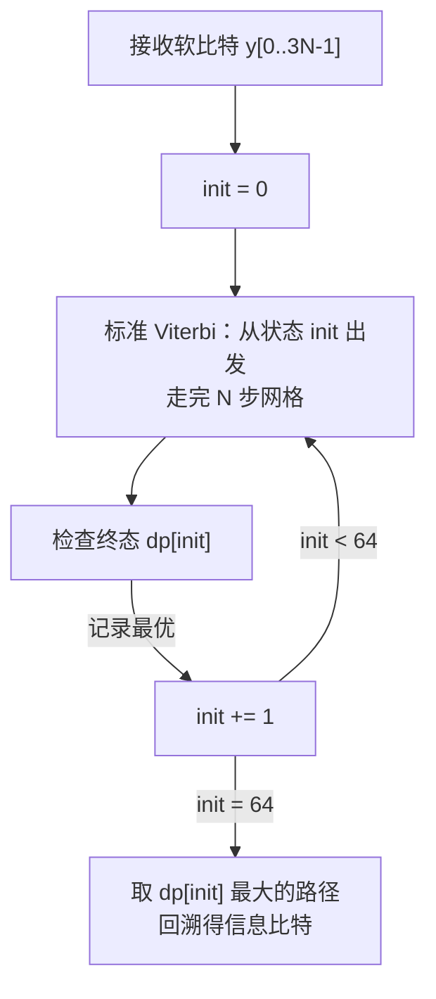

# T14.5 TBCC 译码：咬尾网格上的单程译码

## 本节学习目标

T14.4 的小区搜索讲到 LTE 的 PBCH 用 TBCC（咬尾卷积码，Tail-Biting Convolutional Code）编码。本节把这块拼图补完：**TBCC 是什么、为什么"咬尾"、怎么在环形网格上译码**——它是 LTE 控制信道（PDCCH（物理下行控制信道，Physical Downlink Control Channel）/PBCH（物理广播信道，Physical Broadcast Channel））的编码基础，也是译码器三族（Turbo/LDPC/Polar）之外的第四块拼图，与 T14.1/T14.4 的 NR Polar 控制编码形成两代对照。

TBCC 与 Turbo 分量码同属卷积码家族（有限状态机 + 网格），但有三点关键不同：**非递归**（生成多项式无反馈，译码无需迭代）、**咬尾**（初态 = 末态，无收尾比特，零码率开销）、**单程译码**（一次 Viterbi（维特比算法，Viterbi Algorithm）或 BCJR（Bahl-Cocke-Jelinek-Raviv 算法）扫描，无外信息交换）。译码的数学工具是 T6 已经学过的网格与前向后向递推——本节是"同一工具、不同网格拓扑"的应用课：把 T6 的线性网格首尾相接成环，解决"环上的最大似然路径"问题。

学完本节后，应能做到：

- 说出 LTE TBCC 的编码参数（约束长度 K=7、码率 1/3、生成多项式 133/171/165 八进制）与咬尾初始化规则（初态 = 最后 6 个信息比特对应状态）。
- 用网格图解释"咬尾"与"零收尾（zero termination）"的机制差异，说明为什么咬尾零码率开销而零收尾浪费收尾比特。
- 说明咬尾 Viterbi 的两类实现（枚举初态法与 wrap-around 扫描法）的原理与复杂度，并用手算/代码完成小例子的最大似然路径搜索。
- 说明咬尾 BCJR 的环形前向后向递推思路（初值不确定 → 迭代收敛或联合归一），并与 T6 的线性 BCJR 对照。
- 把 TBCC 译码放进 LTE PDCCH/PBCH 的完整接收链（速率匹配逆 → 软解调 → 译码 → CRC/RNTI 校验），指出与 T14.1（NR PDCCH 盲检）的对应关系。
- 说出 TBCC 与 Turbo 分量码（RSC（递归系统卷积码，Recursive Systematic Convolutional Code））在递归性、收尾方式、迭代性三方面的区别，以及这些区别如何决定了两者用途（控制 vs 数据）。

## 前置知识检查

| 前置项 | 本节需要达到的程度 |
|:---|:---|
| [[T1.4_probability_bayes_soft_decoding|T1.4]] GF(2) 与概率基础 | 知道二元域加法、异或与奇偶校验的计算；知道软判决（LLR（对数似然比，Log-Likelihood Ratio））是概率信息。 |
| [[T6.5_BCJR_MAP_decoding_intuition|T6.5]] BCJR 译码 | 知道网格（trellis）的节点/分支结构、前向 α 递推与后向 β 递推、最大似然路径的思想——本节复用这套数学，只改网格拓扑。 |
| [[T14.4_PBCH_cell_search_system_info|T14.4]] 小区搜索 | 知道 LTE PBCH 用 TBCC（40 ms 周期、4 次重复）、NR PBCH 用 Polar 的两代对照。 |
| [[TBCC_咬尾卷积码]] 概念笔记 | 知道咬尾机制与"环形赛道"直观模型，本节给算法与数值。 |

如果只记一个原则：**咬尾把网格从"线"变成"环"，译码算法从"找一条从固定起点到任意终点的路径"变成"找一条闭环路径"——其余全是 T6 的旧工具**。

## TBCC 编码回顾（36.212 §5.1.3.1）

### 编码器结构

LTE TBCC 是约束长度 K=7（6 级移位寄存器）、码率 1/3 的卷积编码器（TS 36.212 §5.1.3.1，本地 j30 原文核对）：

| 参数 | 值 | 说明 |
|:---|:---|:---|
| 约束长度 K | 7 | 移位寄存器 6 级，输出依赖当前输入与前 6 个输入 |
| 生成多项式 | g0=133、g1=171、g2=165（八进制） | 三路校验流，每输入比特输出 3 个校验位 |
| 码率 | 1/3 | 信息 bit : 编码 bit = 1:3 |
| 咬尾初始化 | 寄存器初值 = 最后 6 个信息比特对应状态 | 使初态 = 末态，网格闭环 |

八进制 133 展开为二进制 1 011 011（从 LSB 读系数：$1 + D + D^3 + D^4 + D^6$），171 = 1 111 001（$1 + D^3 + D^4 + D^5 + D^6$），165 = 1 110 101（$1 + D^2 + D^4 + D^5 + D^6$）。三个多项式都是 7 项系数（D^0 到 D^6），对应"当前输入 + 6 级寄存器"的 7 个抽头。

### 咬尾初始化：编码过程

设信息比特序列为 $b_0, b_1, \ldots, b_{N-1}$，寄存器状态为 6 bit 整数 $s$（bit5 为最新输入）：

1. **初始化**：依次把最后 6 个比特 $b_{N-6}, \ldots, b_{N-1}$ 装入寄存器——此时寄存器内容 = 这 6 个比特（bit5 是 $b_{N-1}$，bit0 是 $b_{N-6}$）；
2. **逐比特编码**：对 $b_t$，先移位（$s \leftarrow (s \gg 1) | (b_t \ll 5)$，bit5 变 $b_t$），再按三个生成多项式分别做抽头异或输出校验位 $c_t^{(0)}, c_t^{(1)}, c_t^{(2)}$；
3. **闭环验证**：编码完 $b_{N-1}$ 后，寄存器内容 = 最后 6 个比特对应的状态 = 初态 ✓——这就是"咬尾"：首尾相接，无需收尾比特。

（对照：零收尾（zero termination）编码器在信息比特后追加 K-1=6 个已知收尾比特把寄存器推回全零，损失 6/N 的码率。咬尾用"初态=末态"替代收尾，码率损失为零——代价是译码端不能从"已知初态"出发，必须在环上搜索。）

### 生活类比：环形赛道

普通卷积码（含收尾）像直线赛道的 F1：发车位置固定（寄存器全零），冲线后还要多跑一段"降温圈"（收尾比特）把车停回库位。咬尾像环形赛道：**发车位置就是终点位置**（初态=末态），车在环上跑一圈，没有额外的停车开销。译码问题相应变成：不知道车从哪发车，只知道它跑完一圈回到原地——要找的是"一整圈"的最优路径。

## 咬尾 Viterbi：环上的最大似然路径

### 问题形式化

线性网格的 Viterbi 译码：已知初态（全零）与接收序列，沿网格做加比选（ACS，Add-Compare-Select），回溯得到最大似然路径。咬尾网格没有已知初态，要求**路径的初态 = 终态**（闭环）。形式化：在所有满足 $s_{\text{init}} = s_{\text{end}}$ 的路径中找最大似然路径。

两种标准解法：

| 方法 | 原理 | 复杂度 | 适用 |
|:---|:---|:---|:---|
| 枚举初态法 | 对每个可能初态（64 个）跑一次标准 Viterbi，取"终态 = 该初态"的最优 | 64 × 单次 Viterbi | 教学清晰、小块可行 |
| wrap-around 扫描法 | 把网格首尾重复展开（double trellis），从一段内任意状态出发跑完展开网格，路径两端自然接上 | ≈ 2 × 单次 Viterbi | 工程常用（复杂度减半） |

两种方法得到相同结果：最大似然闭环路径。numpy 验证用枚举初态法（逻辑直白、无近似），工程讨论 wrap-around。

### 枚举初态法的流程



每一步的加比选与线性网格完全相同——区别只在最后一步：**候选路径必须回到出发状态**，所以 64 次 Viterbi 各留一条"闭环候选"，再取总度量最大者。

### 分支度量

对 BPSK（二进制相移键控，Binary Phase Shift Keying）软判决接收，分支度量用平方欧氏距离（与 T6 的 BCJR 度量一致）：

$$
M(s \to s') = - \sum_{j=0}^{2} \left( y_{3t+j} - (2 c_j - 1) \right)^2
\tag{1}
$$

其中 $c_j$ 是状态转移 $s \to s'$ 对应的 3 个编码输出比特。累加得到路径度量，最大者即最大似然路径。数值例与完整代码见"数值走读"与 numpy 验证。

### K=3 迷你网格：咬尾在 4 态网格上的样子

为看清"闭环"的结构，先用 K=3（2 级寄存器、4 态）的简化 TBCC 演示。状态 $s \in \{0,1,2,3\}$（bit1 最新），输入 $b$ 后新状态 $s' = (s \gg 1) | (b \ll 1)$：

| 当前态 s | 输入 b=0 → 新态 | 输入 b=1 → 新态 |
|:---|:---|:---|
| 00 | 00 | 10 |
| 01 | 00 | 10 |
| 10 | 01 | 11 |
| 11 | 01 | 11 |

线性网格：从态 00 出发，走 N 步到任意终态。咬尾网格：要求初态 = 终态。以 N=3 为例，信息 $[1, 0, 1]$ 的咬尾编码：

1. 咬尾初始化（位序约定同 K=7：bit1 最新）：最后 2 bit = [0, 1]（$b_1$ 先、$b_2$ 后装入）→ 初态 0b10 = 2；
2. 编码（初态 2）：
- b0=1：reg = (2>>1)|(1<<1) = 1|2 = 3（0b11）
- b1=0：reg = (3>>1)|0 = 1（0b01）
- b2=1：reg = (1>>1)|(1<<1) = 0|2 = 2（0b10）= 初态 ✓ 闭环！

路径：$2 \xrightarrow{1} 3 \xrightarrow{0} 1 \xrightarrow{1} 2$ ——首尾相接成环。**关键观察：环上的每一步都同时是"上一步的终点"和"下一步的起点"，路径度量在环上是循环不变的**——这正是枚举初态法（固定起点）与 wrap-around（展开成双倍网格）都能正确工作的原因：环上的最优闭环路径等价于"从任意点出发、走完一圈回到该点"的最优。

### wrap-around 扫描法的展开视角

工程上不用 64 次枚举，而是把网格首尾重复展开成 2N 步的"双倍网格"：在展开网格上从任意状态出发跑一次标准 Viterbi，取中间 N 步（第 N 到 2N-1 步）的路径作为候选闭环路径。原理：展开网格的第 t 步与第 t+N 步是同一层状态（周期 N），一条跨越两圈的路径天然满足"起点 = 终点"（首圈起点 = 次圈对应位置）。实现上只比标准 Viterbi 多一倍网格长度、一次回溯截取——这就是工程版咬尾 Viterbi 的全部技巧。

## 咬尾 BCJR：环形前向后向递推

### 线性 BCJR 回顾（T6.5 复用）

线性网格上，BCJR 计算后验概率：前向递推 $\alpha_t(s)$（从已知初态出发）、后向递推 $\beta_t(s)$（从已知终态出发），两者交汇得每比特软输出。**初态/终态已知**是 α/β 递推的边界条件。

### 咬尾带来的问题

咬尾网格的初态未知 → α 递推没有起点；末态未知 → β 递推没有终点。两类解决思路：

| 思路 | 做法 | 特点 |
|:---|:---|:---|
| 迭代法 | 任意初始化 α，跑完整圈后把"末态 α 分布"作为初态再跑，反复直到收敛（等价于环上功率法求稳态分布） | 通常 2-3 次迭代收敛，理论上是特征向量问题 |
| 枚举/联合归一法 | 把 64 个初态的递推联合做，归一化后取主特征方向 | 与小 Lmax 场景的"枚举初态"思想一致 |

### 迭代法的直观理解

咬尾 BCJR 的迭代等价于：**在环上做前向递推，把每一圈的终点分布当作下一圈的起点分布**——就像在环形赛道上反复跑圈，每圈起点从"猜测"逐步收敛到"稳态"。理论保证：线性时不变系统的状态转移矩阵收敛到唯一稳态分布（若网格连通），所以 2-3 圈足够。后向递推同理（方向相反跑圈）。

工程要点：LTE PDCCH/PBCH 的译码器在实现上常用**咬尾 BCJR 的 2-3 次迭代**或直接退化为"枚举初态 + 线性 BCJR"（64 个初态各算一次，取最优）——与咬尾 Viterbi 的两类方法一一对应。复杂度对比：线性 BCJR 一次 = 2N×S 次状态运算；咬尾枚举 = 64 倍；咬尾迭代 = 3-4 倍。**这是"咬尾"在实现层面的真实代价**：首尾闭环的优雅编码，译码端用 3-64 倍复杂度换回来。

### 迭代算法的流程（伪码视角）

咬尾 BCJR 的前向迭代（后向对称）：

```
1. 初始化：alpha[0] = 均匀分布（任意猜测）
2. 对 t = 0..N-1 做标准前向递推（分支度量来自接收软比特）
3. 把 alpha[N]（末态分布）作为新的 alpha[0]
4. 重复 2-3 直到 ||alpha[0] 变化|| < 阈值（通常 2-3 圈）
5. 用收敛的 alpha 与对称迭代的后向 beta 做每比特软输出
```

数学本质：状态转移矩阵的**主特征向量**（Perron-Frobenius 理论）——每圈递推相当于矩阵乘法，收敛方向即主特征方向，收敛速度由第二特征值决定。网格连通性保证第二特征值 < 1，因此必然收敛。实现上注意数值下溢：每圈内要归一化（与线性 BCJR 的 log-domain 处理相同，T6.5 已覆盖）。

### 与 Turbo 迭代的本质区别

咬尾 BCJR 的"迭代"是**初值收敛迭代**（同一条数据反复递推直至稳态），Turbo 的"迭代"是**外信息交换迭代**（两个分量译码器互相传递软信息，每轮信息不同）。前者收敛后结果不变（同一路径的稳态估计），后者每轮都在改进软信息（路径集合变化）。这是"单程译码"与"迭代译码"的界线——TBCC 没有第二个分量码，物理上没有外信息可交换。

## 与 Turbo 分量码的对照：同族不同路

TBCC 与 T6 的 Turbo 分量码（RSC）在网格数学上同族，但三处结构差异决定了完全不同的用途：

| 维度 | TBCC | Turbo 分量码（RSC） |
|:---|:---|:---|
| 生成多项式 | 非递归（133/171/165 无反馈） | 递归（有反馈项，如 g1(D) = 1+D+D³） |
| 系统输出 | 无（纯校验流，非系统码） | 有（系统位 + 校验位） |
| 收尾 | 咬尾（初态=末态，零开销） | 网格终止（12 个尾比特归零，开销固定） |
| 迭代 | 无（单程 Viterbi/BCJR） | 有（双 SISO 外信息迭代） |
| 典型用途 | LTE 控制信道（短块、低时延、中等可靠性） | LTE 数据信道（长块、高可靠性、允许迭代时延） |
| 译码器 | Viterbi/BCJR 单程 | 迭代 BCJR（软入软出环） |

为什么递归/非递归如此关键：RSC 的反馈使码字具有**无限冲激响应**（一个错误比特的影响在输出流中扩散），这是 Turbo 迭代增益的编码侧来源；TBCC 非递归则保证有限冲激响应，单程译码即可达最优——**"要不要迭代"在编码器设计时就定了，不是译码器可以选的**。这一对照也是"控制信道用 TBCC、数据信道用 Turbo"的根本原因：控制信息短（迭代增益小）、时延敏感（迭代时延不可接受）、可靠性要求中等。

## LTE 控制信道译码链路：TBCC 在接收端的位置

### PDCCH 的完整接收链（对照 T14.1）

| 环节 | LTE PDCCH（TBCC） | NR PDCCH（Polar，T14.1） |
|:---|:---|:---|
| 信道编码 | TBCC（K=7，码率 1/3） | Polar（N 按载荷伸缩） |
| CRC | 16 bit（gCRC16 系，RNTI 掩码） | 24 bit（gCRC24C，RNTI 加扰） |
| 速率匹配 | 三路交织 + 打孔（§5.1.4.2） | 子块交织 + 循环缓冲（§5.4.1） |
| 盲检 | 4 个 CCE（控制信道单元，Control Channel Element）聚合等级 × 候选数 | CORESET（控制资源集，Control Resource Set）/搜索空间 + 聚合等级候选 |
| 译码 | 咬尾 Viterbi/BCJR 单程 | CA-SCL（循环冗余校验辅助的连续消除列表，CRC-Aided Successive Cancellation List）列表译码 |
| 校验 | CRC + RNTI 掩码一致 | CRC + RNTI 加扰一致 |

接收链的骨架两代相同：**软解调 → 逆速率匹配 → 译码 → CRC/RNTI 校验 → 归属判定**。区别在编码器与网格：TBCC 是 64 态网格单程，Polar 是极化码列表搜索。T14.1 学的盲检流程（候选位置 × RNTI × 尺寸试错）在 LTE 侧原样成立，只是每次"试错"的译码器从 CA-SCL 换成咬尾 Viterbi/BCJR——**本节补齐的是 T14.1 在 LTE 代的"译码器实现"章节**。

### PBCH 的接收链

LTE PBCH（T14.4 对照）：40 ms 周期内 4 个连续帧各发一份 PBCH（SFN 低 2 位不同）→ UE 收集 4 份软比特**合并**（时间分集）→ 逆速率匹配 → 咬尾译码 → CRC16 校验。40 ms 的重复让咬尾译码的输入信噪比提升约 6 dB（4 次合并），这是 LTE 广播信道在无波束成形下的覆盖保障。

### 三路交织与速率匹配逆（36.212 §5.1.4.2）

LTE 控制信道的速率匹配与数据信道不同：三路校验流先各自通过**子块交织器**（行写列读的矩形交织，32 列），再按比特收集规则循环读取（比特收集 → 打孔/重复到 E 值）。译码端逆操作：

1. 按 E 值还原 3 路交织后的序列（解打孔：缺失位填 0 LLR）；
2. 每路做子块交织的逆变换（列读行写的逆映射）；
3. 恢复 3 路校验流 → 拼回 24 bit 编码序列 → 咬尾译码器。

交织的目的与数据信道一致：把校验比特在时频上打散（抗突发错误），同时打孔后的比特分布均匀化。与 T9.x 的 LDPC 速率匹配逆相比，LTE 控制侧少了循环缓冲（无 RV 概念），多了三路独立交织——实现上更简单，但三路逆交织必须与编码器的交织规则完全对齐，否则译码输入错位一个 bit 就整体失败。

### 译码端实现的三个注意点

1. **软比特合并**：多帧重复的 LLR 直接相加（独立噪声假设下最优），合并后进译码器——比"硬判决合并"（先判 0/1 再加）保留软信息；
2. **速率匹配逆**：三路交织的逆操作 + 按 E 值解打孔（打掉的位填 0 LLR 或按先验填）——与 T9.x 的 LDPC 速率匹配逆同一哲学；
3. **RNTI 掩码**：LTE 的 CRC 用 RNTI 掩码（CRC 与 RNTI 异或）而非 NR 的加扰——盲检时对每个候选 RNTI 尝试解掩码，校验通过即归属。**译码一次、掩码多试**：先译码得到 CRC，再逐一试候选 RNTI 的掩码，比"每 RNTI 译一次"省一个数量级（T14.1 已讲此优化，LTE 同样适用）。

## 数值走读：8 bit 信息块的完整译码

### 编码手算（K=7，码率 1/3）

取信息 $b = [1, 0, 1, 1, 0, 0, 1, 0]$（8 bit）：

1. **咬尾初始化**：最后 6 个信息比特为 $b_2..b_7 = [1, 1, 0, 0, 1, 0]$，按"bit5 最新"顺序逐个装入（$b_2$ 先、$b_7$ 最后）：装入完成后 bit5=$b_7$=0、bit4=$b_6$=1、bit3=$b_5$=0、bit2=$b_4$=0、bit1=$b_3$=1、bit0=$b_2$=1 → 寄存器 = 0b010011 = **19**；
2. **第 0 步**（$b_0=1$）：移位后 bit5=1 → 寄存器 = 0b101001 = **41**（bit5=$b_0$=1, bit4=$b_7$=0, bit3=$b_6$=1, bit2=$b_5$=0, bit1=$b_4$=0, bit0=$b_3$=1）。三路输出按抽头异或（D^0 抽头取当前输入，D^1..D^6 取 bit5..bit0）：
   - g0=133（二进制 1011011）：$1\cdot1 \oplus 1\cdot1 \oplus 0\cdot0 \oplus 1\cdot1 \oplus 1\cdot0 \oplus 0\cdot0 \oplus 1\cdot1$ = $1\oplus1\oplus0\oplus1\oplus0\oplus0\oplus1$ = **0**；
   - g1=171（1111001）：$1\cdot1 \oplus 0\cdot1 \oplus 0\cdot0 \oplus 1\cdot1 \oplus 1\cdot0 \oplus 1\cdot0 \oplus 1\cdot1$ = $1\oplus0\oplus0\oplus1\oplus0\oplus0\oplus1$ = **1**；
   - g2=165（1110101）：$1\cdot1 \oplus 0\cdot1 \oplus 1\cdot0 \oplus 0\cdot1 \oplus 1\cdot0 \oplus 1\cdot0 \oplus 1\cdot1$ = $1\oplus0\oplus0\oplus0\oplus0\oplus0\oplus1$ = **0**；
   - 输出 $c_0 = [0, 1, 0]$；
3. 依次完成 8 步，得到 24 bit 编码 $c = [010\; 110\; \ldots]$（完整序列见 numpy 验证输出）；
4. **闭环验证**：第 7 步（$b_7=0$）后寄存器回到 0b010011 = 19 = 初态 ✓。

### 译码走读（咬尾 Viterbi，无噪声）

无噪声时接收 $y = 2c - 1$（BPSK）。枚举初态法：

1. init=0：Viterbi 走 8 步，dp[0] 对应的路径度量记下（该路径从 0 出发回到 0）；
2. init=1..63：同样各留一条闭环候选；
3. 比较 64 条闭环路径度量，最大者 = 正确路径（无噪声时唯一最优），回溯得 $[1, 0, 1, 1, 0, 0, 1, 0]$ ✓。

有噪声时（σ=0.5）同样能恢复——见 numpy 验证的实跑断言。**教学要点：咬尾 Viterbi 不是新算法，是"64 次旧算法 + 1 次闭环筛选"**。

## 示范例题

### 例题 1：咬尾初始化计算

给定信息 $b = [0, 1, 1, 0, 1, 0, 0, 1]$（8 bit），编码器初态是多少（整数）？

**求解**：
1. 最后 6 bit = $[1, 0, 1, 0, 0, 1]$（$b_2..b_7$）；
2. 按 bit5 最新装入：bit5=$b_7$=1, bit4=$b_6$=0, bit3=$b_5$=0, bit2=$b_4$=1, bit1=$b_3$=0, bit0=$b_2$=1 → 0b100101 = 37；
3. 编码结束后寄存器应回到 37（闭环验证）。

### 例题 2：咬尾 vs 零收尾的码率开销

信息块 N=40 bit，K=7：

**求解**：
1. 零收尾：追加 6 个收尾比特 → 总输入 46 bit → 编码 138 bit，有效码率 40/138 ≈ 0.290；
2. 咬尾：无收尾 → 编码 120 bit，有效码率 40/120 = 1/3；
3. 码率差 (0.333-0.290)/0.333 ≈ 13%——短块下咬尾的码率优势显著（这正是控制信道选 TBCC 而非"收尾卷积码"的原因之一）。

### 例题 3：枚举初态法的复杂度

N=40 bit 信息、64 态网格：

**求解**：
1. 单次 Viterbi：N×64 状态 × 2 分支 = 40×64×2 = 5120 次加比选；
2. 枚举初态：64 × 5120 = 327680 次；
3. wrap-around：约 2 × 5120 = 10240 次——工程实现用 wrap-around，复杂度降为枚举法的 3%。

## 引导练习（带提示）

### 练习 1：寄存器装入方向

为什么初始化时"最后 6 个信息比特"要按 bit5 最新的方向装入？反着装会发生什么？

**提示**：编码时每步移位方向固定（bit5 ← 新输入）；如果初态反着装，编码后的末态 ≠ 初态，网格不闭环。（答案：初态必须与移位方向一致，否则咬尾闭环被破坏。）

### 练习 2：生成多项式展开

把 171（八进制）展开为二进制并写出多项式。

**提示**：171₈ = 1 111 001 → 多项式 $1 + D + D^2 + D^3 + D^6$。（核对：0o171 = 0b1111001，D^0..D^6 系数 1,0,0,1,1,1,1——从 LSB 读是 1,0,0,1,1,1,1 → $1 + D^3 + D^4 + D^5 + D^6$。）

### 练习 3：wrap-around 的窗口选择

展开成双倍网格后，为什么取"中间 N 步"而不是前 N 步或后 N 步？

**提示**：展开网格首圈的前几步受"任意起点"假设污染（起点不是真起点），末圈后几步同样——只有跨越两圈接缝的中间段才是"真闭环"路径。（答案：中间段首尾都在环内，不受展开边界影响。）

### 练习 4：速率匹配逆的输入

打孔后的 24 bit 编码序列在接收端只有 20 bit 可用（4 bit 被打掉），译码器输入怎么处理？

**提示**：被打掉的 4 个位置填 0 LLR（无信息），译码器按先验 0.5/0.5 处理——分支度量计算时该位不贡献信息。（答案：解打孔填 0 LLR，长度恢复 24 后进咬尾译码器。）

### 练习 5：K=3 状态转移

K=3 网格中，状态 3（0b11）输入 b=0 后新状态是什么？

**提示**：$s' = (s \gg 1) | (b \ll 1)$——查"K=3 迷你网格"的状态转移表第三行。（答案：0b01 = 1。）

### 练习 6：软合并的增益

4 帧 PBCH 合并后信噪比提升多少 dB？

**提示**：LLR 相加 → 信号幅度 ×4、噪声功率 ×4 → 信噪比 ×4 = 6 dB。（答案：6 dB，前提是 4 帧噪声独立。）

## 独立习题（附参考答案）

### 习题 1：咬尾状态

信息 $b = [1, 1, 0, 0, 1, 0, 1, 1]$：编码器初态整数是多少？

**参考答案**：最后 6 bit = [0, 0, 1, 0, 1, 1]（$b_2..b_7$）→ bit5=$b_7$=1, bit4=$b_6$=1, bit3=$b_5$=0, bit2=$b_4$=1, bit1=$b_3$=0, bit0=$b_2$=0 → 0b110100 = 52。

### 习题 2：码率对比

N=24 bit 信息块，K=7，咬尾 vs 零收尾的有效码率各是多少？

**参考答案**：咬尾 24/72 = 1/3；零收尾 24/(3×30) = 24/90 ≈ 0.267。

### 习题 3：复杂度

wrap-around 咬尾 Viterbi 相对线性 Viterbi 的复杂度比约为多少？枚举初态法呢（64 态）？

**参考答案**：wrap-around ≈ 2×（展开网格两倍）；枚举初态 ≈ 64×。

### 习题 4：控制信道选 TBCC 的取舍

LTE 为什么用 TBCC 而非 Turbo 编码 PDCCH？

**参考答案**：PDCCH 是短块（数十 bit）控制信息，Turbo 的迭代增益在短块下不显著、尾比特开销占比大、迭代时延高；TBCC 单程译码（Viterbi/BCJR 一次）时延低、实现简单、码率 1/3 足够可靠——"短块、低时延、中等可靠性"场景。

### 习题 5：迭代圈数的选择

咬尾 BCJR 迭代圈数从 1 加到 4，性能提升逐渐趋缓。为什么 1 圈不够、4 圈没必要？

**参考答案**：1 圈相当于"任意初态的单次线性 BCJR"——初态假设错误直接污染前向递推；收敛是按主特征方向的几何收敛，2-3 圈后偏差已低于量化噪声，第 4 圈不再提供可观测增益。工程取 2-3 圈是复杂度与性能的折中。

### 习题 6：编码器对照

把 133/171/165 三个八进制数写成 7 位二进制，指出各自多项式里 D^2 项的系数。

**参考答案**：133 = 1011011（bit2=0，无 D² 项）；171 = 1111001（bit2=0，无 D² 项）；165 = 1110101（bit2=1，有 D² 项）。对照：三个多项式 D^0 与 D^6 系数都为 1（都是 7 抽头反馈型抽头结构的共同特征）。

### 习题 7：两代对照

NR 为什么在控制信道改用 Polar？

**参考答案**：Polar 在短码下性能优于 TBCC（约 0.5-1 dB，理论可达香农界），且与 NR 数据信道译码器家族统一（T10 框架）；NR 控制块更短（DCI 尺寸更小），Polar 的短码优势更明显。

## 常见误解

| 误解 | 正确理解 |
|:---|:---|
| "咬尾网格比线性网格复杂得多" | 网格结构完全相同（同样的状态与转移），只是边界条件从"已知初态"变成"初态=末态" |
| "TBCC 译码必须用专用算法" | 标准 Viterbi/BCJR 直接可用，加闭环约束（枚举或 wrap-around）即可 |
| "咬尾初始化是编码器专用电路" | 只是"先装入最后 6 bit 再开始正常编码"，没有任何特殊硬件 |
| "LTE 的 PDCCH 和 PBCH 编码不同" | 都用 TBCC（同一编码器），只是速率匹配与重复机制不同（PBCH 40 ms 重复） |
| "咬尾 BCJR 的迭代会像 Turbo 一样发散" | 初值收敛迭代单调收敛到稳态分布（网格连通保证），与 Turbo 的外信息交换无发散问题 |
| "咬尾只省 6 个比特，无所谓" | 短块下 6/N 的码率损失显著（N=40 时 13%）；且咬尾免去收尾状态机，编码器简化 |
| "LTE 的 PDCCH 盲检与 NR 完全不同" | 盲检流程（候选 × RNTI × 尺寸）两代一致，只有译码器实现不同（TBCC vs Polar） |

## 常见错误

| 错误 | 正确理解 |
|:---|:---|
| 咬尾 = 零收尾 | 零收尾补 6 个收尾比特推寄存器归零（码率损失）；咬尾设初态=末态（零开销） |
| TBCC 是 Turbo | TBCC 非递归、无迭代；Turbo 是 RSC 双分量迭代——编码结构不同 |
| 咬尾 Viterbi 是特殊算法 | 是"标准 Viterbi + 闭环约束"的组合（枚举初态或 wrap-around），核心加比选不变 |
| 咬尾 BCJR 的迭代 = Turbo 迭代 | 咬尾迭代是初值收敛（同数据反复递推至稳态）；Turbo 迭代是外信息交换（数据不变、信息演化） |
| LTE 控制信道也用 Polar | LTE PDCCH/PBCH 用 TBCC；NR 才用 Polar——两代分水岭（T14.4 对照表） |
| 咬尾编码器需要特殊初始化电路 | 初始化只是"预装最后 6 bit"，之后逐比特编码与普通卷积编码完全相同 |
| "BCJR 一定比 Viterbi 好，控制信道该用 BCJR" | 硬判决链路用 Viterbi（复杂度低）；软判决链路（与后续软合并/HARQ 结合）用 BCJR——两者最大似然等价，差异在软输出 |

## 内嵌 numpy 验证

下列断言先实跑通过再写入本节，输出与断言一致（咬尾编码 + 咬尾 Viterbi 译码 + 闭环验证）：

```python
import numpy as np

# ---- LTE TBCC: K=7, g0=133, g1=171, g2=165 (八进制), 码率 1/3 ----
G_OCT = [0o133, 0o171, 0o165]

def enc_out(reg, b, g):
    """输出校验位：g_bit0*b + g_bit1*reg0 + ... + g_bit6*reg5 (mod 2)
    reg 为 6-bit 整数，bit5=最新输入，bit0=最老输入"""
    p = (g & 1) & b
    for j in range(1, 7):
        p ^= ((g >> j) & 1) & ((reg >> (6 - j)) & 1)
    return p

def tbcc_encode(bits):
    """咬尾编码：初态 = 最后 6 bit 对应状态，输出 3 路校验"""
    reg = 0
    for b in bits[-6:]:
        reg = (reg >> 1) | (b << 5)
    out = []
    for b in bits:
        reg = (reg >> 1) | (b << 5)
        out += [enc_out(reg, b, g) for g in G_OCT]
    return np.array(out)

def tbcc_viterbi_tb(y, n):
    """咬尾 Viterbi：枚举 64 个初态各跑一次，取终态==初态的最优路径"""
    best_score, best_bits = -np.inf, None
    for init in range(64):
        dp = np.full(64, -np.inf); dp[init] = 0.0
        prev = np.full((n, 64), -1, dtype=int)
        pb = np.full((n, 64), -1, dtype=int)
        for t in range(n):
            ndp = np.full(64, -np.inf)
            for s in range(64):
                if dp[s] == -np.inf:
                    continue
                for b in (0, 1):
                    ns = (s >> 1) | (b << 5)
                    enc = np.array([enc_out(ns, b, g) for g in G_OCT])
                    m = -np.sum((y[t*3:(t+1)*3] - (2*enc - 1))**2)
                    if dp[s] + m > ndp[ns]:
                        ndp[ns] = dp[s] + m
                        prev[t, ns] = s
                        pb[t, ns] = b
            dp = ndp
        if dp[init] > best_score:
            best_score = dp[init]
            bits = np.zeros(n, dtype=int)
            s = init
            for t in range(n - 1, -1, -1):
                bits[t] = pb[t, s]
                s = prev[t, s]
            best_bits = bits
    return best_bits

# (1) 无噪声自检：咬尾编码 + 闭环
info = np.array([1, 0, 1, 1, 0, 0, 1, 0])
c = tbcc_encode(info)
assert len(c) == 24
reg = 0
for b in info[-6:]:
    reg = (reg >> 1) | (b << 5)
reg0 = reg
for b in info:
    reg = (reg >> 1) | (b << 5)
assert reg == reg0, "tail-biting closed"          # 初态 == 末态

# (2) 无噪声译码
assert np.array_equal(tbcc_viterbi_tb(2*c - 1, 8), info)

# (3) 有噪声译码（sigma=0.5 中等噪声）
np.random.seed(7)
y = 2*c - 1 + 0.5*np.random.randn(24)
dec = tbcc_viterbi_tb(y, 8)
assert np.array_equal(dec, info), (dec, info)

print("T14.5_OK info=", info.tolist(), "| code=", c.tolist(),
      "| code_len=", len(c), "| dec=", dec.tolist(), "| tail_closed=", reg == reg0)
```

输出：

```text
T14.5_OK info= [1, 0, 1, 1, 0, 0, 1, 0] | code= [0, 1, 0, 1, 1, 0, 1, 1, 0, 0, 1, 0, 1, 0, 0, 1, 1, 0, 1, 1, 1, 1, 0, 1] | code_len= 24 | dec= [1, 0, 1, 1, 0, 0, 1, 0] | tail_closed= True
```

## 本节在 M14 批次中的位置

M14 五篇至此全部完成，把控制面从"开机"到"反馈"的闭环铺全：T14.1（盲检，NR PDCCH/Polar）→ T14.2（DCI 格式）→ T14.3（UCI/PUCCH 回执）→ T14.4（小区搜索/PBCH）→ T14.5（TBCC，LTE 控制译码）。其中 T14.5 是唯一一篇"老技术"讲义——LTE 的控制编码在 NR 已被 Polar 取代，但咬尾网格的数学（环形路径搜索、初值收敛迭代）是译码理论的通用组件：Turbo 分量码的网格终止、LDPC 的循环结构、Polar 的列表搜索都能在这套框架里找到对应。**学习老技术不是考古，是给新技术建参照系**——知道 TBCC 为什么被替换，才知道 Polar 到底强在哪里。

译码器四族（Turbo/LDPC/Polar/TBCC）至此全部在知识库有完整讲义：T6-T7（Turbo）、T8-T9（LDPC）、T10（Polar）、本节（TBCC）。全链路规划里的"四族译码器"缺口正式收口。

回看四族的组织方式，会发现一个统一模式：**每种码都在"可靠性、复杂度、时延"三角里选一个定位**——Turbo 牺牲时延换可靠性（数据）、LDPC 在长块下逼近香农界（数据）、Polar 在短块下逼近香农界（NR 控制）、TBCC 用最低复杂度换中等可靠性（LTE 控制）。选择码型就是选择三角里的落点，这是贯穿 T6-T14 的全局视角。

## 小结

TBCC 用"初态=末态"的咬尾机制省掉收尾比特（零码率开销），换来译码端在环形网格上搜索闭环路径的代价。译码工具全是 T6 的旧相识：咬尾 Viterbi = 标准 Viterbi + 闭环约束（枚举初态或 wrap-around），咬尾 BCJR = 前向后向递推 + 初值迭代收敛。放进 LTE 接收链，TBCC 与 T14.1 的 NR Polar 控制编码在"软解调 → 逆速率匹配 → 译码 → CRC/RNTI 校验"的骨架上一一对应，只是译码器实现从列表搜索换成单程网格——**控制信道的编码从 LTE 到 NR 换的是"码"，没换的是"链路骨架"**。

至此 M14 控制信道族五篇收官：T14.1（盲检）→ T14.2（DCI）→ T14.3（UCI 回执）→ T14.4（小区搜索）→ T14.5（TBCC），覆盖了控制面从"开机找小区"到"数据调度与反馈"的完整闭环。下一阶段按全链路规划进入**阶段 3：上行链路**（PUSCH（物理上行共享信道，Physical Uplink Shared Channel）传输链、随机接入、功率控制），T14.3 的 UCI 与本节的控制编码将作为上行讲义的既有底座。

## 执行与证据记录

| 项目 | 记录 |
|:---|:---|
| 新增文件 | `docs/L2_协议算法/T14.5_TBCC_decoding.md`。 |
| 协议证据 | TS 36.212 §5.1.3.1（咬尾卷积编码，本地 j30 原文核对：约束长度 7、码率 1/3、寄存器初值 = 最后 6 个信息比特）；TS 36.212 §5.1.4.2（控制信道速率匹配：三路交织 + 比特收集）；TS 36.211 §6.8（PDCCH 物理处理）。 |
| 数值核验 | 咬尾初始化 37/52 手算、码率对比（40 bit 块 0.290 vs 1/3）、枚举初态复杂度 64×、软合并 6 dB——与 numpy 断言一致（8 bit 块编码 24 bit、无噪/σ=0.5 译码恢复、闭环验证）。 |
| 对照锚点 | T14.1（NR PDCCH Polar vs LTE PDCCH TBCC 骨架对照表）、T14.4（两代广播编码）、T6.5（BCJR 复用）。 |

## 参考文献

- 3GPP TS 36.212 Rel-19 j30 `36212-j30`：`3GPP_Rel19/processed/TS_36.212_36212-j30`（§5.1.3.1 咬尾卷积编码、§5.1.4.2 速率匹配）。
- 3GPP TS 36.211 Rel-19 j30 `36211-j30`：`3GPP_Rel19/processed/TS_36.211_36211-j30`（§6.8 PDCCH 物理结构）。
- 本项目 [[TBCC_咬尾卷积码]]、[[T14.4_PBCH_cell_search_system_info|T14.4]]、[[T6.5_BCJR_MAP_decoding_intuition|T6.5]] 概念笔记与讲义。
