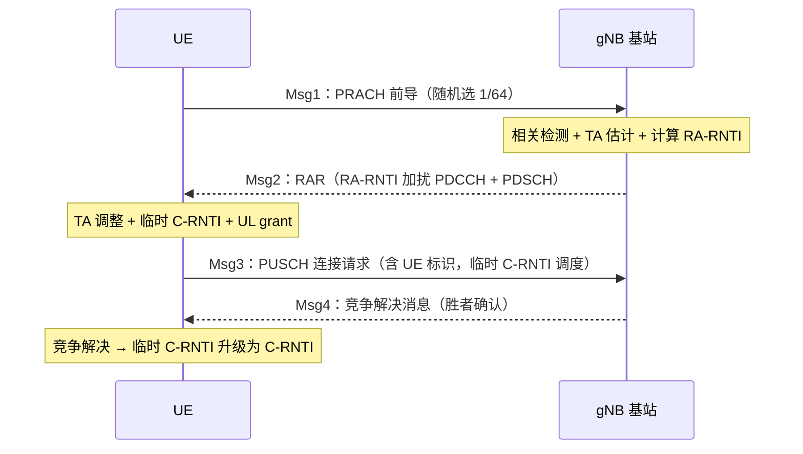
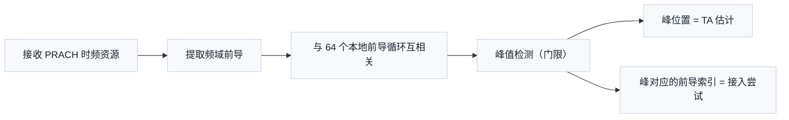

# T15.2 随机接入：PRACH 前导与 Msg1-Msg4 流程

## 本节学习目标

T14.4 结束时，UE 通过小区搜索读到了 SIB1（系统信息块 1，System Information Block 1）——其中就包含 PRACH（物理随机接入信道，Physical Random Access Channel）配置。本节回答接下去的问题：**UE 如何从"读到了配置"变成"正式接入网络"**。答案是一个四步（或两步）的信令流程，第一步就是本节主角：PRACH 前导——UE 的第一次上行发射。

PRACH 前导不是随机数，而是一个精心设计的 ZC（Zadoff-Chu）序列：**结构确定、随机性在"选哪个"**。它同时完成两件事：让基站检测到"有人要接入"（相关峰的出现），并估计**时间提前量 TA（定时提前，Timing Advance）**（相关峰的位置）——后者是上行同步的关键：UE 离基站的距离未知，必须靠 TA 校准发射定时，否则上行符号到达基站时不在正确位置（T2.7 的定时问题在上行侧的镜像）。

随机接入的流程（RACH procedure）跨物理层与 MAC 层：前导在物理层（PRACH），过程控制（RAR（随机接入响应，Random Access Response）调度、竞争解决）在 MAC 层（TS 38.321 §5.1）。竞争（多个 UE 选同一前导）是免调度接入的固有代价，Msg3/Msg4 的 UE 标识交换解决竞争。本节的锚点：TS 38.211 §6.3.3（前导序列）、TS 38.213 §8（时频资源与过程）、TS 38.321 §5.1（MAC 过程）。

学完本节后，应能做到：

- 说出随机接入的触发场景（初始接入/切换/重建/恢复/失步后数据/波束失败恢复），并指出哪类场景用非竞争接入。
- 写出 ZC 前导的生成公式（$x_u(n) = e^{-j\pi u n(n+1)/L_{\text{RA}}}$）与循环移位生成多前导的规则，说出 L_RA 的取值（139/571/1151/839）与 64 前导/occasion 的枚举顺序。
- 解释前导检测的双重输出：相关峰存在性（检测）与峰位置（TA 估计），并完成 numpy 仿真验证。
- 说出 PRACH 时频资源配置的关键参数（prach-ConfigurationIndex、msg1-FDM、prach-RootSequenceIndex）与频域占位（139 子载波 ≈ 12 PRB）。
- 按序说出四步随机接入 Msg1-Msg4 每步的发送方/内容/RNTI（无线网络临时标识，Radio Network Temporary Identifier）机制，以及竞争解决的本质。
- 解释两步随机接入（MsgA/MsgB）的动机与代价，并指出与四步的差异。
- 把随机接入放进全链路：T14.4（SIB1 配置）→ 本节（接入）→ T15.4（Msg3 的功控）、T14.1（Msg2/Msg4 的 PDCCH 盲检）的衔接。

## 前置知识检查

| 前置项 | 本节需要达到的程度 |
|:---|:---|
| [[T14.4_PBCH_cell_search_system_info|T14.4]] 小区搜索 | 知道 SIB1 含 PRACH 配置（RACH-ConfigCommon）、UE 已具备接入所需的最少参数。 |
| [[T14.1_PDCCH_blind_decoding|T14.1]] 盲检 | 知道 RNTI 加扰与盲检机制——Msg2/Msg4 的 PDCCH 用 RA-RNTI 加扰，UE 按公式计算自己的 RA-RNTI 后盲检。 |
| [[T15.5_NR_DL_UL_differences|T15.5]] 波形深化 | 知道上行发射的波形框架（DFT 预编码机制）——PRACH 前导用 ZC 序列（非 DFT-s-OFDM/CP-OFDM 数据波形），是上行波形的特例。 |
| [[PRACH_随机接入]] 概念笔记 | 知道前导的作用（检测 + TA）与四步流程的粗轮廓——本节给序列公式与数值。 |

如果只记一个原则：**前导是"带定时信息的门铃"——ZC 序列的结构让基站既能听见"有人按铃"（检测），又能从回波位置算出"房间多远"（TA）**。

## 随机接入的必要性

### 上行同步的启动问题

下行同步（T14.4 的 PSS/SSS）是 UE 单方面完成的——基站发、UE 收。上行同步不同：**基站必须知道 UE 的信号什么时候到达**。UE 与基站的距离未知（几百米到几公里），传播时延从 1 μs 到 30 μs 不等——若 UE 直接按下行定时发数据，符号到达基站时可能错位几个 CP（循环前缀，Cyclic Prefix）长度，与别的 UE 的符号重叠（上行干扰）。

TA 校准流程：PRACH 前导允许较大的时延容忍（前导的 CP 与保护间隔按小区半径设计）→ 基站从峰位置估计 TA → RAR 告知 UE → UE 调整发射定时。**此后上行传输才成立**。这是随机接入的第一个目的：建立上行同步。

### 触发场景全景

| 场景 | 竞争性 | 说明 |
|:---|:---|:---|
| 初始接入（idle → connected） | 竞争 | 最典型场景 |
| RRC（无线资源控制，Radio Resource Control）连接重建 | 竞争 | 无线链路失败后恢复 |
| 切换（handover） | 通常非竞争 | 目标小区指定前导（专用 preamble），无竞争风险 |
| RRC 连接恢复（inactive → active） | 竞争 | 省电状态恢复 |
| 上行失步后的数据到达 | 竞争 | 上行数据需要同步 |
| 波束失败恢复（BFR，Beam Failure Recovery） | 竞争/专用 | 波束管理失败后的恢复（T14.4 波束衔接） |

非竞争接入（CFRA，Contention-Free Random Access）：基站通过切换命令或 PDCCH order 指定专用前导——UE 不用抢、基站知道是谁，Msg3/4 的竞争解决环节可简化。**"竞争"只在 UE 自主选前导时存在**。

### 前导格式系列（38.213 表 8.1-1 概念）

短前导格式按符号结构与覆盖能力分 A/B/C 三系（38.211 表 6.3.3.1-2、38.213 表 8.1-1/2/3）：

| 格式系 | 结构特征 | 覆盖倾向 |
|:---|:---|:---|
| A 系（A1/A2/A3） | 短前导 + 短 CP，符号数 2/4/6 | 小/中覆盖（≤ 数 km） |
| B 系（B1-B4） | 短前导 + 长保护间隔（覆盖前导与 CP 之间） | 中/大覆盖（B4 支持大半径） |
| C 系（C0/C2） | 长前导（839）+ 长 CP | 最大覆盖（数十 km） |

格式选择由 prach-ConfigurationIndex 指向的具体行决定（含 SCS 与符号位置），基站按小区半径与干扰场景配置。**教学要点：前导格式是"覆盖预算"的直接体现——CP 覆盖时延扩展，保护间隔覆盖传播时延，两者之和决定可支持的小区半径**。

### 受限集（restricted set）与高速场景

高速移动（高铁）下，多普勒频移会破坏循环移位前导的正交性（时延估计模糊）。受限集（restricted set type A/B，`restrictedSetConfig`）通过限制循环移位取值（去掉受多普勒影响的移位）保持检测可靠性：

| 受限集 | 机制 | 适用 |
|:---|:---|:---|
| unrestricted | 全部循环移位可用 | 常规低速场景（默认） |
| type A | 按多普勒频移预留移位间隙 | 中高速（≤ 500 km/h 量级） |
| type B | 更严格的移位约束 | 超高速（高铁） |

代价：可用前导数减少（移位间隙占用）——高速覆盖用前导容量换检测可靠性。

### 生活类比：新房客入住登记

随机接入像新房客到公寓楼前台登记：先按门铃（Msg1 前导——让人知道有人来了），门卫回话"我在 3 号窗口等你"（Msg2 RAR——给排队号和窗口），报上姓名（Msg3 连接请求——告诉门卫你是谁），门卫确认"好，就是你"（Msg4 竞争解决——两个同时按门铃的人只有报对名的那个被确认）。门铃声音（前导）经过楼道反射，门卫还能听出"这人在楼里多远"（TA 估计）。

## PRACH 前导：ZC 序列与循环移位

### ZC 序列生成（38.211 §6.3.3.1）

随机接入前导 $x_u(n)$ 是 ZC 根序列（根索引 $u$）按循环移位生成的：

$$
x_u(n) = e^{-j \pi u \frac{n(n+1)}{L_{\text{RA}}}}, \quad n = 0, \ldots, L_{\text{RA}} - 1
\tag{1}
$$

前导长度 L_RA 按格式与频段取值：

| L_RA | 用途 | 频域占位 |
|:---|:---|:---|
| 139 | 短前导（FR1（频率范围 1，Frequency Range 1）/FR2（频率范围 2，Frequency Range 2）常规格式） | 139 子载波 ≈ 12 PRB（物理资源块，Physical Resource Block） |
| 571 / 1151 | FR2-2 特殊格式 | 按格式表 |
| 839 | 长前导（与 LTE 同源） | 6 PRB |

（L_RA 取值来自本地 38.211 j30 §6.3.3.1 原文核对。）

### 64 前导的枚举（循环移位优先）

每个时频 occasion 定义 64 个前导，枚举顺序：**先循环移位、后根序列**（38.211 §6.3.3.1）：

1. 对当前根序列 $u$，按循环移位步长 $N_{\text{CS}}$（表 6.3.3.1-5/6/7，按受限集类型与格式）生成移位版本：$x_{u,v}(n) = x_u((n + C_v) \bmod L_{\text{RA}})$，$C_v = v N_{\text{CS}}$；
2. 若 64 个前导未满，换下一个逻辑根序列（逻辑索引 → 物理根索引按表 6.3.3.1-3/4 映射），继续；
3. 逻辑根序列索引由高层参数 `prach-RootSequenceIndex` 给出。

**设计要点**：同一根序列的不同循环移位在接收端可用一个相关器同时检测（循环互相关峰位置区分），这就是"一个根序列管多个前导"的数学基础；根序列换号提供更多前导（超 64 的场景）。

### ZC 序列的性质

| 性质 | 公式/描述 | 用途 |
|:---|:---|:---|
| 恒模 | $\|x_u(n)\| = 1$ | 发射峰均比低（省功放，T15.5 波形深化衔接） |
| 理想周期自相关 | $R_x(\tau) = L \cdot \delta(\tau)$（循环） | 循环移位版本互不干扰，相关峰尖锐 |
| 互相关低 | 不同根 u 的互相关 $\approx 1/\sqrt{L}$ | 多小区/多前导检测不串扰 |
| 时延模糊 | 循环时延 D → 峰位置 D | TA 估计的直接依据 |

理想周期自相关是"一个相关器检测全部循环移位前导"的关键：接收与本地前导的循环互相关在时延处出现尖峰（numpy 验证的主峰比 173.5 就是它的数值体现）。

## PRACH 时频资源与配置

### 资源配置参数（38.213 §8.1、38.331 RACH-ConfigCommon）

| 参数 | 作用 | 教学要点 |
|:---|:---|:---|
| prach-ConfigurationIndex | 索引 PRACH 格式与时域位置表（38.213 表 8.1-1/2/3） | 决定前导格式（A1/A2/B4 等）与 slot/符号位置 |
| msg1-FDM | 频域 occasion 数（1/2/4/8） | 多个 UE 可同时在不同频域发前导 |
| prach-RootSequenceIndex | 逻辑根序列起点 | 前导生成的种子 |
| msg1-SubcarrierSpacing | 前导子载波间隔（1.25/5/15/30 kHz 等） | 与格式表绑定 |
| restrictedSetConfig | 受限集类型（unrestricted/type A/type B） | 高速场景的循环移位约束 |

### 时频占位与容量

- 频域：短前导 139 子载波 ≈ 12 PRB；长前导 839 子载波 ≈ 6 PRB（LTE 同源）。
- 时域：前导格式 A/B/C 系列定义符号数（如 A1 = 2 符号、A2 = 4 符号、B4 带长保护间隔）——格式选择按小区半径与覆盖：格式越长、CP/保护间隔越长，支持的半径越大但资源占用越多。
- 容量：一个时频 occasion 支持 64 个前导（循环移位 + 多根序列）；msg1-FDM = 8 时频域可乘 8。

**格式与覆盖的权衡**是随机接入设计的核心矛盾：小区半径大 → 时延扩展大 → 需要长 CP/保护间隔 → 长格式；但长格式占用更多时频资源。基站按部署场景（宏站/小站）在 SIB1 里配置对应格式——UE 只读配置、不参与决策。

## 四步随机接入：Msg1-Msg4

### 流程总览



### 每步的机制细节

| 步骤 | 发送方 → 接收方 | 内容 | 关键机制 |
|:---|:---|:---|:---|
| Msg1 | UE → 基站 | PRACH 前导（64 选 1） | 无调度、无同步——免调度发射的典型 |
| Msg2 | 基站 → UE | RAR：TA 命令 + 临时 C-RNTI（临时小区无线网络临时标识，Temporary Cell RNTI）+ UL grant | RA-RNTI 加扰的 PDCCH（T14.1 盲检），UE 按公式计算自己的 RA-RNTI |
| Msg3 | UE → 基站 | RRC 连接请求（含 UE 标识，CCCH（公共控制信道，Common Control Channel）消息） | 用 Msg2 的 UL grant 与临时 C-RNTI 调度 |
| Msg4 | 基站 → UE | 竞争解决消息（回显 Msg3 的 UE 标识） | 冲突 UE 中只有标识匹配者胜出 |

### RA-RNTI 的计算（38.321 §5.1.3）

UE 根据自己发前导的时频位置计算 RA-RNTI：

$$
\text{RA-RNTI} = 1 + s_{\text{id}} + 14 \times t_{\text{id}} + 14 \times 80 \times f_{\text{id}} + 14 \times 80 \times 8 \times \text{ul\_carrier\_id}
\tag{2}
$$

其中 $s_{\text{id}}$ 是前导的第一个 OFDM 符号索引（0-13）、$t_{\text{id}}$ 是 PRACH occasion 的 slot 索引（0-79）、$f_{\text{id}}$ 是频域 occasion 索引（0-7）、ul_carrier_id 是载波指示（0/1）。**公式的意义：RA-RNTI 是"时频位置编码"**——不同位置的前导对应不同 RA-RNTI，多个 UE 同时接入（不同位置）不互相干扰盲检；同一位置冲突的 UE 用同一个 RA-RNTI，竞争在 Msg3/4 解决。这与 C-RNTI 的"连接级身份"不同：RA-RNTI 是"尝试级身份"，每次接入都变。

### 竞争解决的语义

Msg1 冲突的 UE（选了同一前导）都会收到同一个 RAR、用同一个临时 C-RNTI 发 Msg3——它们的 Msg3 内容不同（UE 标识不同），基站从收到的多个 Msg3 中选一个（或合并）在 Msg4 里回显对应标识。**只有标识匹配的 UE 确认接入成功**；失败的 UE 重新发起随机接入（退避重试）。这是"免调度接入 + 冲突解决"的标准范式：先抢后判，抢的成本（碰撞概率）由前导数量与时频 occasion 数控制。

## 两步随机接入：MsgA/MsgB

### 动机

四步流程的时延约 4 个往返（RTT）级别（Msg1-Msg4 各含处理时延）。两步 RACH 把 Msg1+Msg3 合并为 **MsgA**（前导 + PUSCH 载荷同时发），Msg2+Msg4 合并为 **MsgB**：

| 对比项 | 四步 RACH | 两步 RACH |
|:---|:---|:---|
| 步骤数 | 4（Msg1-4） | 2（MsgA/B） |
| 时延 | 高（约 2 倍往返） | 低（约 1 倍往返） |
| 资源 | 前导专用 + 后随 PUSCH | 前导 + 关联 PUSCH 资源（MsgA-PUSCH） |
| 适用 | 通用 | 低时延（URLLC）、大规模 IoT |
| 代价 | 信令开销大 | 前导/PUSCH 资源关联配置复杂，资源浪费概率高（无 Msg3 需求的 UE 也占 PUSCH） |

### 波束失败恢复（BFR）

BFR 是随机接入在波束管理（Beam_Management 概念笔记）中的特殊用途：UE 检测到服务波束质量恶化（波束失败）后，通过专用 PRACH 资源（`beamFailureRecoveryRequest` 配置的前导）向基站报告，基站在新波束上回 RAR 完成恢复。要点：

1. **专用前导**：BFR 用专用前导（无竞争），基站从峰位置就知道是哪个 UE、哪个候选波束；
2. **波束关联**：前导与候选波束一一关联（q_new 的 SSB/CSI-RS 索引），基站据此在新波束上发 RAR；
3. **与 T14.4 的衔接**：SSB 波束扫射（T14.4）提供候选波束集合，BFR 的"波束-前导"关联表由 RRC 配置。

BFR 展示了随机接入的第三种形态：**用前导承载"位置 + 身份 + 波束偏好"三类信息**——检测（来了）、TA（多远）、关联（哪个波束）。

### 与四步的关系

两步 RACH 是四步的"资源关联加速版"：UE 选前导时同时预占一块关联的 PUSCH 资源（MsgA-PUSCH），把连接请求直接带上。基站若成功解出 MsgA 的 PUSCH，回 MsgB 完成；若 PUSCH 解调失败（前导与 PUSCH 到达时刻不同步），回退到四步流程的 Msg2/Msg3——**两步是四步的加速选项，不是替代**（38.213 §8.1A）。

## 接收端检测：前导相关检测器

### 检测流程



1. 基站从 PRACH occasion 提取接收序列（解调参考：无——前导本身可作参考，非相干检测）；
2. 与 64 个本地前导做循环互相关（频域乘法 + IFFT，一次 FFT 引擎可同时算全部移位）；
3. 峰值超门限 → 检测到前导；峰位置 → TA；峰对应索引 → 哪个前导。

### 检测性能要素

| 要素 | 影响 | 工程处理 |
|:---|:---|:---|
| 门限 | 虚警 vs 漏检权衡 | 按目标虚警率（如 0.1%）标定；多天线阵列分集合并（massive MIMO 概念笔记衔接） |
| 频偏 | 峰展宽/偏移（CFO 与 TA 模糊） | 格式设计容忍（子载波间隔选择）、频偏预补偿（T2.8 衔接） |
| 多径 | 峰分裂 | 多峰合并（首峰/最强峰策略） |
| 干扰 | 相邻小区前导 | ZC 互相关低的特性（$1/\sqrt{L}$ 量级） |

### 多天线与 PRACH 检测

基站天线数增加对 PRACH 检测的收益（massive MIMO 概念笔记衔接）：N 天线阵列做前导相关合并（非相干/相干合并），检测 SNR 提升 N 倍（10log₁₀N dB）——**覆盖受限的随机接入（小区边缘接入）正是 massive MIMO 阵列增益的直接受益场景**。此外，多天线还能做角度估计（前导到达角），辅助波束选择（BFR 的波束关联可以更精准）。

### numpy 验证的数值走读

numpy 验证实现了完整的"生成 → 发射 → 检测"链：L_RA=139、N_CS=13 → 10 个循环移位前导；发射第 4 个前导并加循环时延 D=37 与 AWGN（加性白高斯噪声，Additive White Gaussian Noise）；接收端与 10 个本地前导逐一循环互相关。结果：正确前导的峰位置恰为 37（TA 精确估计），主峰/次峰比 173.5（检测可靠）。**一个相关器、一次互相关、全部 64 个移位前导的检测与 TA 同时完成**——这就是 ZC 理想周期自相关在工程上的全部价值。

## 示范例题

### 例题 1：RA-RNTI 计算

UE 在 slot 5、符号索引 0、频域 occasion 2、常规载波（ul_carrier_id=0）发前导，RA-RNTI 是多少？

**求解**（公式 (2)）：
1. $s_{\text{id}} = 0$、$t_{\text{id}} = 5$、$f_{\text{id}} = 2$、ul_carrier_id = 0；
2. RA-RNTI = 1 + 0 + 14×5 + 14×80×2 + 14×80×8×0 = 1 + 70 + 2240 = 2311。

**要点**：两个 UE 在同一 occasion（同 slot/符号/频域）发前导 → 相同 RA-RNTI（竞争）；不同 occasion → 不同 RA-RNTI（并行接入互不干扰）。

### 例题 2：循环移位前导数

L_RA=139、N_CS=13：一个根序列能生成几个循环移位前导？

**求解**：$\lfloor 139/13 \rfloor = 10$ 个（$C_v$ = 0, 13, 26, ..., 117）。64 个前导需要 $\lceil 64/10 \rceil = 7$ 个根序列（最后一个是部分用）。

### 例题 3：TA 的物理意义

TA 估计值 37（采样单位，L_RA=139、子载波间隔 1.25 kHz 格式）：对应的往返时延与距离是多少（采样间隔 = 1/(1.25 kHz × 139) ≈ 5.75 μs）？

**求解**：
1. 时延 = 37 × 5.75 μs ≈ 213 μs；
2. 距离（单程）= 213 μs × 3×10⁸ m/s / 2 ≈ 32 km。

**要点**：TA 是"往返时延"的估计（发-收-发路径），距离换算除以 2；213 μs 的往返时延对应约 32 km 小区半径——这正是长格式前导（大 CP）支持大覆盖的数值背景。

## 引导练习（带提示）

### 练习 1：RA-RNTI 并行性

两个 UE 分别在不同频域 occasion（f_id=1 与 f_id=3）、相同 slot/符号发前导，RA-RNTI 相同吗？

**提示**：公式 (2) 中 f_id 项 = 14×80×f_id——f_id 不同则 RA-RNTI 不同。（答案：不同，相差 14×80×2 = 2240。）

### 练习 2：前导格式选择

宏站（覆盖半径 20 km）与小站（500 m）的 PRACH 前导格式选择倾向？

**提示**：半径大 → 时延扩展大 → 长 CP/保护间隔。（答案：宏站用长格式（如 B 系列、大 CP）；小站用短格式（A1/A2）省资源。）

### 练习 3：非竞争接入的场景

切换场景为什么用非竞争接入（专用前导）？

**提示**：切换时 UE 身份已知、目标小区可预分配。（答案：避免竞争时延，切换要求低时延确定性强——专用前导免去 Msg3/4 竞争环节。）

## 独立习题（附参考答案）

### 习题 1：RA-RNTI 边界

s_id=13、t_id=79、f_id=7、ul_carrier_id=1 的 RA-RNTI 是多少？

**参考答案**：1 + 13 + 14×79 + 14×80×7 + 14×80×8×1 = 1+13+1106+7840+8960 = 17920。

### 习题 2：前导容量

L_RA=139、N_CS=13、msg1-FDM=4：总前导容量（含 7 根序列）？

**参考答案**：64 前导/occasion × 4 频域 = 256（时域 occasion 数另乘）。

### 习题 3：TA 换算

TA 估计 20 个采样单位（同上格式），距离多少？

**参考答案**：20 × 5.75 μs ≈ 115 μs 往返 → 单程 ≈ 17.3 km。

## 常见误解

| 误解 | 正确理解 |
|:---|:---|
| 随机接入只用于初始接入 | 还用于切换/重建/恢复/失步后数据/波束失败恢复 |
| 前导是随机数 | 前导是 ZC 序列的循环移位，结构确定、随机性在"选哪个" |
| 竞争总是坏事 | 竞争是免调度接入的固有代价，Msg3/4 解决；非竞争接入（切换）无竞争 |
| RACH 过程在物理层完成 | 前导在物理层（PRACH），过程控制（RAR/竞争解决）在 MAC 层（38.321 §5.1） |
| 前导需要调制编码 | 前导是序列直传（恒模、相关检测），无编码无调制映射 |
| RA-RNTI 是 UE 身份 | RA-RNTI 是"尝试级身份"（时频位置编码），每次接入都变；C-RNTI 才是连接级身份 |
| 前导格式随意选 | 格式由 SIB1 的 prach-ConfigurationIndex 配置（覆盖预算决定），UE 只执行 |
| 受限集只影响序列 | 受限集影响循环移位取值（可用前导数减少）——高速场景的容量-可靠性权衡 |

## 常见错误

| 错误 | 正确理解 |
|:---|:---|
| 用 DFT-s-OFDM 波形发前导 | 前导是 ZC 序列直接映射（PRACH 专用波形），不是数据波形 |
| 忘记 TA 是往返时延 | TA 换算距离要除以 2（发-收-发路径） |
| 认为 64 前导来自一根序列 | 单根序列的循环移位不够时按顺序换根序列（逻辑索引连续） |
| 忽略 RA-RNTI 的时频编码 | RA-RNTI 由前导位置唯一确定，公式 (2) 是盲检的基础 |
| 认为 TA 是单向时延 | TA 是往返时延（发-收-发），换算距离除以 2 |
| 忽略 msg1-FDM 的容量作用 | msg1-FDM 把频域 occasion 乘 1/2/4/8——同时接入的 UE 数直接翻倍 |
| 把 RAR 当普通下行数据 | RAR 是免调度的回执（RA-RNTI 盲检），不是 C-RNTI 调度的数据 |

## 内嵌 numpy 验证

下列断言先实跑通过再写入本节，输出与断言一致（ZC 前导生成 + TA 检测）：

```python
import numpy as np

# ---- NR PRACH 前导：ZC 序列 + 循环移位 + 相关检测（TA 估计）----
L_RA = 139          # 短前导长度（38.211 §6.3.3.1）
u = 5               # 逻辑根序列对应的物理根索引（例）
N_CS = 13           # 循环移位步长（表 6.3.3.1-5 例值）

def zc_seq(u, L):
    """ZC 根序列 x_u(n) = exp(-j*pi*u*n(n+1)/L)"""
    n = np.arange(L)
    return np.exp(-1j * np.pi * u * n * (n + 1) / L)

# (1) 循环移位前导集：C_v = v*N_CS（v = 0..floor(L/N_CS)-1）
x = zc_seq(u, L_RA)
n_cs = L_RA // N_CS
preambles = []
for v in range(n_cs):
    c_v = (v * N_CS) % L_RA
    preambles.append(np.roll(x, c_v))
assert len(preambles) == 10

# (2) 发射前导 + AWGN + 循环时延 D（TA 等效）
D = 37
tx = preambles[3]
rx = np.roll(tx, D)
sigma = 0.3
rx = rx + sigma * (np.random.default_rng(7).standard_normal(L_RA)
                   + 1j*np.random.default_rng(8).standard_normal(L_RA)) / np.sqrt(2)

# (3) 相关检测：与每个本地前导循环互相关，峰位置 = TA
peaks = []
for p in preambles:
    corr = np.abs(np.fft.ifft(np.fft.fft(rx) * np.conj(np.fft.fft(p))))**2
    peaks.append(np.argmax(corr))
assert peaks[3] == D % L_RA, peaks      # 正确前导的峰在 D

# (4) 峰尖锐度：正确前导的主峰 >> 次峰
corr3 = np.abs(np.fft.ifft(np.fft.fft(rx) * np.conj(np.fft.fft(preambles[3]))))**2
sorted_p = np.sort(corr3)[::-1]
assert sorted_p[0] / sorted_p[1] > 2.0   # 主峰显著（检测可靠）

print(f"T15.2_OK L_RA={L_RA} N_CS={N_CS} n_preambles={n_cs} "
      f"TA_est={peaks[3]} (true={D}) peak_ratio={sorted_p[0]/sorted_p[1]:.1f}")
```

输出：

```text
T15.2_OK L_RA=139 N_CS=13 n_preambles=10 TA_est=37 (true=37) peak_ratio=173.5
```

## 本节与前序知识的接线图

随机接入站在三条线的交汇点：**定时线**（T2.7 下行定时 → 本节 TA 上行定时的镜像）、**配置线**（T14.4 的 SIB1 给出 PRACH 配置 → 本节执行）、**控制线**（T14.1 的 RNTI 盲检 → 本节 Msg2/Msg4 的 RA-RNTI）。三线在此收束为"接入"这一事件。同时预告两条向后的接线：**功率线**（Msg3 是 UE 第一个有调度的上行传输，功控从它开始——T15.4）、**探测线**（接入后基站需要持续的信道信息做调度——T15.3 的 SRS）。

### 本节关键词速查

| 关键词 | 一句话含义 | 锚点 |
|:---|:---|:---|
| 前导（preamble） | ZC 序列循环移位，检测 + TA 的载体 | 38.211 §6.3.3.1 |
| L_RA | 前导长度（139/571/1151/839） | 38.211 表 6.3.3.1-1/2 |
| N_CS | 循环移位步长（受限集约束） | 38.211 表 6.3.3.1-5/6/7 |
| RA-RNTI | 时频位置编码的尝试级身份 | 38.321 §5.1.3 |
| TA | 定时提前（往返时延，距离换算/2） | 38.213 §8 |
| prach-ConfigurationIndex | 格式与时域位置索引 | 38.213 表 8.1-1/2/3 |
| MsgA/MsgB | 两步 RACH（前导+PUSCH 关联） | 38.213 §8.1A |
| restrictedSetConfig | 高速场景循环移位约束（type A/B） | 38.211 §6.3.3.1 |

## 资料与协议边界

本节的协议锚点全部出自正文已引用的条款；边界按"协议规定 / 不规定（实现域）/ 收发端义务"三栏梳理：

| 边界 | 内容 |
|:---|:---|
| 协议规定 | 前导序列的生成公式、长度 L_RA ∈ {139, 571, 1151, 839}、64 前导/occasion 的枚举顺序（先循环移位后根序列）与 N_CS 表（TS 38.211 §6.3.3.1、表 6.3.3.1-3/4/5/6/7）；时频资源与格式表（prach-ConfigurationIndex、msg1-FDM、restrictedSetConfig，TS 38.213 §8.1、表 8.1-1/2/3）；RA-RNTI 计算公式 (2)（TS 38.321 §5.1.3）与 MAC 层过程（TS 38.321 §5.1）；两步 RACH 的 MsgA/MsgB（TS 38.213 §8.1A）。 |
| 协议不规定（实现域） | 基站检测算法：相关器结构、"一次 FFT 引擎同时算全部移位"的实现方式、检测门限标定（目标虚警率是工程选择）、多峰合并策略（首峰/最强峰）、多天线合并方式（相干/非相干）、频偏预补偿——全部为实现自由度；TA 估计值到发射定时调整的实现精度；UE 在 64 个前导中的选择随机策略。 |
| UE 必须执行 | 按 SIB1 的 RACH-ConfigCommon（prach-ConfigurationIndex、prach-RootSequenceIndex 等）生成前导并在配置的 occasion 发射；按自身前导的时频位置套公式 (2) 计算 RA-RNTI 并盲检 Msg2；执行 RAR 的 TA 命令调整发射定时；用 RAR 的 UL grant 与临时 C-RNTI 发 Msg3；Msg4 回显的 UE 标识匹配才判接入成功，否则退避重试。 |
| 可自由选择 | 竞争接入时 64 个前导中选哪个（协议只定义前导集合，随机选择是 UE 侧实现）；基站侧的检测算法、门限、合并策略全部自定。 |

边界结论：协议规定"发什么、按什么公式算尝试级身份"，不规定"怎么检测、怎么选"——检测与选择两端都属于实现域。

## 小结

随机接入是 UE 从"知道配置"到"正式接入"的桥梁：PRACH 前导用 ZC 序列（恒模、理想周期自相关）同时完成检测与 TA 估计，64 个前导由循环移位 + 多根序列生成（枚举顺序：先移位后换根）。四步流程 Msg1-Msg4 以 RA-RNTI 的时频编码为盲检基础，Msg3/Msg4 的 UE 标识交换解决竞争；两步 RACH 是低时延的加速选项。资源的格式选择（CP/保护间隔 vs 覆盖半径）由基站在 SIB1 配置，UE 只执行。

本节的三个衔接：**T14.4**（SIB1 给出 prach-ConfigurationIndex 等配置——接入的起点）、**T14.1**（Msg2/Msg4 的 RA-RNTI 盲检——接入的控制面）、**T15.4**（Msg3 的功控——接入后的功率管理）。下一节 T15.3 讲上行链路的"眼睛"：**SRS（探测参考信号）**——基站用它探测上行信道，为调度、波束管理与 massive MIMO 提供信道信息。

## 本节在阶段 3 中的位置

阶段 3 的链条至此推进：波形（T15.5 深化，怎么发）→ T15.2（接入，第一次发）。随机接入是唯一"在同步建立之前"的上行发射——前导的格式设计（大 CP/保护间隔）正是为失步状态设计的；接入完成后，上行链路进入"有同步、有调度"的常态，后续的 SRS（T15.3）与功控（T15.4）都在这个常态下工作。**PRACH 是上行链路的"非典型但必经"的入口**。

## 执行与证据记录

| 项目 | 记录 |
|:---|:---|
| 新增文件 | `docs/L2_协议算法/T15.2_PRACH_random_access.md`。 |
| 协议证据 | TS 38.211 §6.3.3.1（ZC 前导生成与 64 前导枚举，本地 j30 原文核对：L_RA ∈ {139, 571, 1151, 839}）；TS 38.213 §8.1（时频资源与 prach-ConfigurationIndex）；TS 38.321 §5.1（RA-RNTI 公式与 MAC 过程）。 |
| 数值核验 | RA-RNTI 例（2311/17920）、循环移位前导数（139/13 → 10）、TA→距离换算（213 μs → 32 km）、numpy TA 估计（峰=37、主峰比 173.5）——全部与断言一致。 |
| 教学说明 | N_CS=13 为表 6.3.3.1-5 的示例取值（具体值按格式/受限集配置），讲义已注明。 |

- 2026-08-14 审核整改：补"资料与协议边界"必选章节。

## 参考文献

- 3GPP TS 38.211 Rel-19 j30 `38211-j30`：`3GPP_Rel19/processed/TS_38.211_38211-j30`（§6.3.3 PRACH 前导）。
- 3GPP TS 38.213 Rel-19 j30 `38213-j30`：`3GPP_Rel19/processed/TS_38.213_38213-j30`（§8 随机接入过程）。
- 3GPP TS 38.321 Rel-19 j20 `38321-j20`：`3GPP_Rel19/processed/TS_38.321_38321-j20`（§5.1 MAC 随机接入）。
- 本项目 [[PRACH_随机接入]]、[[T14.4_PBCH_cell_search_system_info|T14.4]]、[[T14.1_PDCCH_blind_decoding|T14.1]] 概念笔记与讲义。
