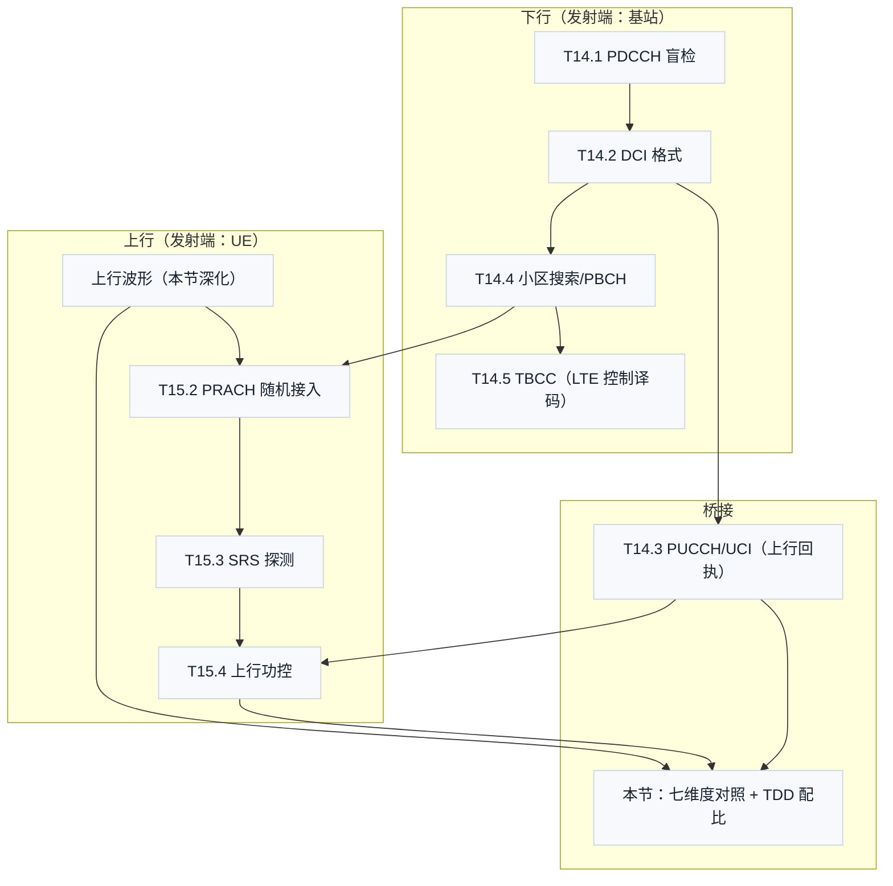

# T15.5 NR 上下行差异与上行波形：七维度全景对照与 TDD 配比

## 本节学习目标

M14 系列讲了下行控制面（盲检/DCI/回执/小区搜索/TBCC），M15 系列讲了上行链路（波形/PRACH/SRS/功控）——两条线各有完整讲义，但**上下行的差异本身值得一次系统的对照**。LTE 时代有 T7.5（译码视角的 DL/UL 差异），本节是 NR 的物理层/协议层全景对照：把 M14/M15 十个主题收束到"波形、功率、定时、参考信号、调度、反馈、多址"七个维度，回答一个总问题：**上下行共享同一套译码核心（Turbo/LDPC/Polar、软解调、HARQ（混合自动重传请求，Hybrid Automatic Repeat Request）），为什么物理层与协议机制差异这么大？**

答案在发射端的本质不对称：下行是一个基站服务多 UE（功率/调度集中管理），上行是多个 UE 各自发射（功率/定时/干扰各自管理）。这一个根源推出一连串设计差异：UE 侧功放受限 → 上行要低 PAPR 波形（DFT-s-OFDM）；多 UE 独立发射 → 上行要闭环功控与 TA（定时提前，Timing Advance）同步；控制反馈只能上行承载 → PUCCH（物理上行控制信道，Physical Uplink Control Channel）/PUSCH（物理上行共享信道，Physical Uplink Shared Channel）成为"控制信息汇聚方向"；TDD 同频 → 上行 SRS 可互易出下行信道。**每条差异都能追到"发射端不对称"这个根**——本节就是这条因果链的系统展开。

学完本节后，应能做到：

- 按七个维度（波形/功率/定时/参考信号/调度/反馈/多址）说出 NR 上下行的差异，并为每个差异给出"发射端不对称"的根源解释。
- 解释 TDD 配比机制（tdd-UL-DL-ConfigurationCommon：周期/slot 数/符号数）并完成 slot 配比计算（numpy 验证），说出 DL/UL 比例与部署场景的关系。
- 说出 TDD 互易性的成立条件与 FDD 的差异（PMI 反馈），以及互易性如何让 SRS 服务下行预编码。
- 把 M14/M15 的主题放进上下行坐标系（波形维度已并入本节）（哪篇讲义讲哪个维度），形成"控制面 + 上行链路"的全景收束。
- 对照 T7.5（LTE 译码视角）说明本节（NR 物理层/协议视角）的互补关系。

## 前置知识检查

| 前置项 | 本节需要达到的程度 |
|:---|:---|
| [[T7.5_LTE_DL_UL_decoding_differences|T7.5]] LTE DL/UL 差异 | 知道 LTE 译码视角的 DL/UL 差异（速率匹配/HARQ 上下文/descriptor）——本节给 NR 物理层/协议全景。 |
| 波形维度深化（本节） | 知道 DFT 预编码的 PAPR 动机与单载波机制——波形维度差异的根源，本节内直接展开。 |
| [[T15.4_uplink_power_control|T15.4]] 功控 | 知道开环/闭环功控——功率维度的机制。 |
| [[T15.3_SRS_sounding|T15.3]] SRS | 知道 SRS 探测与 TDD 互易——参考信号维度与互易性基础。 |
| [[UL_DL_Differences_上下行差异]] 概念笔记 | 知道七维度对照的粗表——本节给每维度的机制细节与数值。 |

如果只记一个原则：**上下行的一切差异都源于"发射端不对称"——下行集中管理（一个基站），上行分布自治（多 UE）——波形、功控、TA、反馈方向全部由此推出**。

## 七维度对照总表

| 维度 | 下行（DL） | 上行（UL） | 根源 | 讲义锚点 |
|:---|:---|:---|:---|:---|
| 波形 | CP-OFDM（多载波） | DFT-s-OFDM（低 PAPR）或 CP-OFDM | UE 功放受限 | 本节深化 |
| 功率 | 基站固定功率 + 调度分配 | 开环 + 闭环功控（TPC） | 多 UE 独立发射 | T15.4 |
| 定时 | UE 被动同步（PSS/SSS 跟踪） | TA 主动对齐基站接收窗 | 传播时延未知 | T14.4/T15.2 |
| 参考信号 | CSI-RS（测量）/DM-RS（解调） | SRS（探测）/DM-RS（解调） | 测量方向相反 | T15.3 |
| 调度 | DL assignment（1_x DCI） | UL grant（0_x DCI） | 调度方向相反 | T14.2 |
| 反馈 | 无（反馈全在上行） | HARQ-ACK/CSI（信道状态信息，Channel State Information）/SR 经 PUCCH/PUSCH | 控制汇聚方向 | T14.3 |
| 多址 | 广播/共享（OFDMA 全网） | 多用户复用（comb/时频分） | 发射端数量不对称 | T15.2/T15.3 |

**七维度的统一视角**：第 1-4 维是"物理层不对称"（功放/同步/测量），第 5-7 维是"协议层不对称"（调度/反馈/多址）——物理层的根源（发射端不对称）向上传导成协议层的差异。本节按此顺序展开：先讲物理层四维（波形维度已并入本节深化，其余维度在 T15.2-T15.4 详述，此处收束因果），再讲协议层三维（衔接 M14 系列），最后 TDD 配比与互易性（把上下行在时间与信息两个维度"接起来"的机制）。

## 物理层四维：根源在发射端

### 波形维度：功放不对称

下行基站是电网供电的大功放，PAPR 高不是问题（CP-OFDM 的频域分集优势保留）；上行 UE 电池供电、功放线性区受限，PAPR 高直接压平均功率。**同一个"功放"约束，下行不存在、上行是设计起点**——DFT-s-OFDM 的 M 点 DFT（离散傅里叶变换，Discrete Fourier Transform）预编码就是为它而生的。本节在对照基础上深化波形维度（原 T15.1 独立讲义合并至此）：信号模型、PAPR 机制与接收逆处理。

### 波形维度深化：DFT 预编码的信号模型（38.211 §6.3.1.4）

设一个 OFDM（正交频分复用，Orthogonal Frequency Division Multiplexing）符号承载 $M$ 个调制符号 $x(0), \ldots, x(M-1)$（$M = M_{\text{sc}}^{\text{PUSCH}}$），DFT 预编码为：

$$
y(k) = \frac{1}{\sqrt{M}} \sum_{i=0}^{M-1} x(i) \, e^{-j 2\pi i k / M}, \quad k = 0, \ldots, M-1
\tag{1}
$$

$y(k)$ 是"等效频域符号"，铺到 $M$ 个连续子载波后做 $N$ 点 IFFT。**DFT 与 IFFT 是同一个数学对象**（方向与归一化不同）：$M$ 点 DFT 把时域符号变频域符号，$N$ 点 IFFT 把频域信号变回时域——两级变换的净效果是"时域符号 → 频域符号 → 时域波形"，与 OFDM 复用同一套 IFFT 硬件。复合变换的逆是"提取子载波 + IDFT"——接收端看到的是 $x(i)$ 的时域重现，波形本质是**单载波信号**：DFT Spread（扩展）把并行的多子载波传输摊平成串行的单载波传输。

**单层约束**：transform precoding 启用时层数 $\nu = 1$（§6.3.1.4）——多层叠加恢复高 PAPR，与波形目标冲突。**波形选择与传输层数绑定**：多流（高吞吐）用 CP-OFDM，单流（覆盖/省电）用 DFT-s-OFDM。

**子载波映射**：NR 只保留局部化映射（$M$ 个符号映射到 $M$ 个连续子载波）——分布式映射（间隔放置）恢复多载波特性（PAPR 回升），LTE 曾支持、NR 未采用。频域调度以整个 DFT 块为粒度（块内不能拆给多用户）。

**PT-RS 差异**（FR2）：相位噪声对单载波的影响是"每个符号整体旋转"，PTRS（相位跟踪参考信号，Phase Tracking Reference Signal）的插入方式不同：DFT 把相位误差展平到整个块——DFT-s-OFDM 的 PTRS 按 §6.3.1.4 的样本组规则插入，补偿块级公共相位旋转（CP-OFDM 按符号/子载波格补偿）。**波形不同，相位噪声补偿粒度不同**。

### 波形维度深化：PAPR 机制与数值

**数学直觉**：OFDM 时域信号是 $M$ 个复正弦的叠加，峰值是各路相位对齐时的 $M$ 倍（概率虽小但存在）；DFT-s-OFDM 的时域波形是 $x(i)$ 的时域重现——包络由调制符号自身决定（QPSK 恒包络时 PAPR 接近 0 dB）。**OFDM 的峰值来自"多路叠加"，单载波的峰值只来自"单符号自身"**。

**数值实例**（numpy 验证，教学规模 M=16）：DFT-s-OFDM 的 PAPR ≈ 4.76 dB，CP-OFDM ≈ 6.28 dB，差 1.53 dB。真实系统（M 更大）差距更大（3-6 dB）——子载波越多 OFDM 峰值概率越大，而 DFT-s-OFDM 的 PAPR 几乎与 M 无关。教学规模低估了增益，机制完全正确。

**低 PAPR 的代价**：频域分集下降（一个符号错误经 DFT 展平到整个块）。工程补偿：编码交织（打散突发错误）+ 频选调度（SRS 探测分配好频带，T15.3 衔接）。

### 波形维度深化：接收端逆处理与配置

接收端比下行多一步 **M 点 IDFT 解预编码**（提取的 M 个频域符号是预编码符号而非调制符号）：

| 方案 | 做法 | 特点 |
|:---|:---|:---|
| 先均衡后解预编码 | 频域 MMSE（最小均方误差，Minimum Mean Square Error）/ZF（迫零，Zero-Forcing）均衡 → IDFT → 解调 | 均衡器与下行复用；残余误差被 IDFT 展平 |
| 先解预编码后均衡 | IDFT → 时域均衡 | 更精确；时域均衡器复杂度随时延扩展增长 |

工程主流是**先频域均衡后 IDFT**（复用 T2.11 的 MMSE（最小均方误差，Minimum Mean Square Error）均衡器）。波形由 `transformPrecoding`（38.214 §6.1.3）配置：启用 → DFT-s-OFDM（单层，覆盖/省电优先）；禁用 → CP-OFDM（多层，吞吐优先）。**帧结构（slot/CP/SCS）两种波形完全一致**——同步、CP 去除、FFT（快速傅里叶变换，Fast Fourier Transform）框架通用，只有提取后处理不同。

**PAPR 数值验证**（并入本节 numpy 块）：M=16 子载波、4 符号的收发仿真——DFT-s-OFDM 4.76 dB vs CP-OFDM 6.28 dB、零误码（见"内嵌 numpy 验证"第二部分）。

### 功率维度：集中 vs 自治

下行功率由基站统一分配（总功率按用户/信道分，无需反馈）；上行每个 UE 按公式自治发射（开环路损补偿 + 闭环 TPC 微调，T15.4）。**"集中管理"与"分布自治"的差异直接决定了机制复杂度**：下行零功控机制，上行一整套公式与反馈（P0/α/TPC/PHR）。

### 定时维度：同步方向相反

下行同步是 UE 单方面完成（PSS/SSS 跟踪，T14.4）；上行同步是"双向协商"——UE 发 PRACH 前导（T15.2），基站估计 TA 并命令调整。**定时不对称的根源是传播时延未知**：下行时延对 UE 无害（晚收一点），上行时延直接破坏正交（符号重叠）——所以上行必须有 TA 校准而下行不需要。

### 参考信号维度：测量方向相反

| 角色 | 下行 | 上行 |
|:---|:---|:---|
| 解调参考 | DM-RS（随 PDSCH/PDCCH） | UL DM-RS（随 PUSCH/PUCCH） |
| 测量参考 | CSI-RS（UE 测、报 CQI/PMI/RI） | SRS（基站测、直接用） |
| 跟踪参考 | TRS（时频跟踪） | —（上行跟踪靠 DM-RS） |
| 相位参考 | PTRS（高频段） | PTRS（DFT-s-OFDM 块级） |

**测量方向的本质差异**：CSI-RS 是"基站发、UE 测、UE 报告"（反馈链路闭环），SRS 是"UE 发、基站测、基站直接用"（无反馈环节）——SRS 的测量结果直接进调度器与预编码器，比 CSI-RS 少一个"报告"环节的时延与量化。

## 协议层三维：方向与汇聚

### 调度维度：DL assignment vs UL grant

下行调度（1_x DCI）告诉 UE"你要收什么"；上行调度（0_x DCI）告诉 UE"你要发什么"（T14.2 的格式体系）。**机制同源、方向相反**：字段结构（资源分配/MCS/HARQ/NDI（新数据指示，New Data Indicator）/RV（冗余版本，Redundancy Version））基本对称，差异在细节——UL grant 的 MCS 是"发射功率密度"的隐含参数（T15.4 的 ΔTF 与之关联）、UL grant 的频域分配影响功控带宽项。

### 反馈维度：控制信息单向汇聚

| 控制信息 | 方向 | 承载 |
|:---|:---|:---|
| HARQ-ACK | UL | PUCCH/PUSCH 复用（T14.3） |
| CSI（CQI/PMI/RI） | UL | PUCCH format 2/3/4 或 PUSCH |
| SR（调度请求，Scheduling Request） | UL | PUCCH format 0/1 |
| TPC 命令 | DL | DCI（随路/组公共，T15.4） |

**控制信息几乎全部上行汇聚**——下行只需要"调度指令 + TPC"，上行需要"ACK + CSI + SR"三种反馈。这解释了 PUCCH format 0-4 的丰富度（T14.3）：上行控制信道是"多类信息的汇聚点"，而下行控制信道（PDCCH）是"单一指令的广播点"。

### 多址维度：广播 vs 复用

下行 OFDMA 全网广播（所有 UE 都能收到 PDCCH/PDSCH，靠 RNTI（无线网络临时标识，Radio Network Temporary Identifier）区分归属）；上行靠"资源分片 + 信号正交"复用（comb 交错、循环移位、时频分，T15.2/T15.3）。**下行是"广播 + 筛选"，上行是"正交 + 调度"**——发射端数量不对称（1 vs N）让两端的多址哲学不同（OFDMA/SC-FDMA 的多址机制总览见 [[Multiple_Access_多址接入]]，CDMA 扩频路线见 [[Spreading_扩频与解扩]]）。

## TDD 配比：上下行的时间划分

### 配置机制（38.213 §11.1）

TDD 用 `tdd-UL-DL-ConfigurationCommon`（SIB1 广播）配置上下行的时域划分：

| 参数 | 含义 |
|:---|:---|
| dl-UL-TransmissionPeriodicity | 配置周期（0.5/0.625/1/1.25/2/2.5/5/10 ms） |
| nrofDownlinkSlots / nrofUplinkSlots | 周期内全 DL/UL slot 数 |
| nrofDownlinkSymbols / nrofUplinkSymbols | 周期尾部 DL/UL 符号数（其余为 Flexible） |

周期内 slot 按"DL slot → Flexible slot → UL slot"排列（符号级同理：DL 符号 → Flexible → UL 符号）。**Flexible 符号是调度器可动态分配的资源**（可 DCI 指示为 DL/UL），半静态配比 + 动态调整的灵活性由此而来。

### 数值实例（numpy 验证的数值走读）

30 kHz（μ=1，每帧 20 slot）、周期 5 ms（10 slot）、DL 7 slot + UL 2 slot + 1 Flexible：

```
DDDDDDD F UU
```

- DL 比例 70%、UL 比例 20%、Flexible 10%；
- 每帧（10 ms）DL 14 slot、UL 4 slot；
- 配比含义：**下行主导（7:2）**——典型"下行数据为主"的移动宽带部署（视频下载/网页浏览）。

常见配比（D=DL, U=UL, F=Flexible）：DLDDU（2.5 ms 周期，DL/UL 均衡）、DDDDDDDDUU（下行主导）、DSUUU（上行主导——上行大包场景，如视频上传）。

### 配比与部署场景

| 部署场景 | 配比倾向 | 理由 |
|:---|:---|:---|
| 移动宽带（下行为主） | DL 主导（7:2 等） | 下行业务占比高 |
| 上行大包（视频上传/传感器） | UL 主导或均衡 | 上行业务需求大 |
| 低时延（URLLC） | 短周期（0.5/1.25 ms） | 上下行切换频繁、等待短 |
| 大覆盖 | 长周期 + 保护间隔 | 切换点保护（GP，Guard Period）需要时长 |

**配比是"业务模型"的时域投影**——基站按业务统计配置周期与比例，SIB1 广播后全网一致（避免 UE 间上下行冲突）。

### 保护间隔（GP）的物理含义

DL→UL 切换点需要保护间隔（GP）：下行信号到达 UE 的时延 + UE 处理时延 + 上行信号回传时延——GP 必须覆盖"最远 UE 的往返时延"，否则下行尾巴与上行开头在基站侧重叠。**GP 长度与小区半径直接挂钩**（与 T15.2 的 PRACH 保护间隔同一物理逻辑）：大覆盖 → 长 GP → 配比浪费更多时域资源。这是"覆盖与容量的时域权衡"。

### 动态 TDD：Flexible 符号的指示机制

Flexible 符号的最终用途由动态信令决定（38.213 §11.1.1）：

| 指示方式 | 机制 | 粒度 |
|:---|:---|:---|
| DCI 2_0（时隙格式指示） | SFI-RNTI（时隙格式指示无线网络临时标识，Slot Format Indication RNTI）加扰，格式表指示每符号 D/U/F | 符号级、半静态到动态 |
| UE 专用 DCI | 调度时指示对应符号为 DL/UL | 调度级 |

**动态 TDD 的语义**：半静态配比给出基线（SIB1），动态指示按瞬时业务调整——下行高峰把 Flexible 划给 DL，上行高峰划给 UL。代价：相邻小区配比可能不同步（交叉干扰），需要小区间协调。

## TDD 互易性：上下行在信息维度的"接合"

### 互易性的完整链条

```
SRS（上行探测，T15.3）→ 上行信道估计 → TDD 同频互易 → 下行信道 → 预编码（T12 系列）
```

| 环节 | 条件/机制 |
|:---|:---|
| SRS 测量 | 基站从 SRS 估计上行信道（comb 插值） |
| 同频互易 | TDD 上下行同频——电磁信道互易（校准后） |
| 下行信道 | 上行信道的转置 ≈ 下行信道 |
| 预编码 | MF/ZF 直接计算（省 PMI 反馈） |

### FDD 的对照

| 维度 | TDD | FDD（频分双工，Frequency Division Duplexing） |
|:---|:---|:---|
| 上下行频率 | 同频（时分） | 异频（频分） |
| 互易性 | 成立（校准后） | 不成立 |
| 下行预编码信源 | SRS 互易 | PMI 反馈（UE 报） |
| 配比灵活性 | 高（动态可配） | 无（固定频带） |
| 时延（切换点） | GP 开销 | 无 GP |

**互易性是 TDD 的"信息红利"**：省掉 PMI 反馈的开销与量化误差，但代价是 GP 的时域开销与配比僵化风险——TDD/FDD 的选择是"灵活性 + 互易性" vs "无 GP + 固定频带"的权衡。

## 时延与接收差异：流程视角

| 维度 | 下行 | 上行 |
|:---|:---|:---|
| 调度时延链 | PDCCH 盲检（T14.1）→ PDSCH 译码 → HARQ-ACK 上报（T14.3 的 k1） | UL grant（T14.2）→ PUSCH 发射 → 功控生效（T15.4） |
| 同步链 | PSS/SSS 跟踪（T14.4）——被动 | PRACH/TA（T15.2）——主动校准 |
| 测量链 | CSI-RS → UE 报 CQI（反馈环） | SRS → 基站直接用（无反馈环） |
| 处理重点 | 译码（LDPC/Polar 吞吐） | 功率/定时/探测（调度配合） |

**流程视角的收束**：下行是"译码主导"（数据接收的核心在 UE 译码器），上行是"协调主导"（功率/定时/探测的调度配合）——两端的处理重点不同，这正是 T7.5（译码视角）与本节（物理/协议视角）的分工。

## 物理信道全景：上下行信道映射

| 角色 | 下行 | 上行 |
|:---|:---|:---|
| 数据信道 | PDSCH（LDPC（低密度奇偶校验码，Low-Density Parity-Check Code）译码，T9 系列） | PUSCH（同一译码核心，波形见本节深化） |
| 控制信道 | PDCCH（Polar 盲检 T14.1/TBCC T14.5） | PUCCH（UCI 汇聚 T14.3） |
| 广播信道 | PBCH（Polar/TBCC，T14.4） | —（无上行广播；PRACH 是接入专用） |
| 接入信道 | — | PRACH（T15.2） |
| 测量信道 | CSI-RS（下行测量） | SRS（上行探测 T15.3） |

**对照要点**：上下行的数据/控制信道一一对应（共享同一译码核心），广播与接入不对称（下行广播、上行接入）——这是"发射端不对称"在信道层面的最终投影。

## 全链路收束：M14/M15 在上下行坐标系中的位置

### 十篇讲义的坐标



### 收束视角

- **下行控制面**（T14.1/14.2/14.4/14.5）：基站到 UE 的"指令流"——盲检、解析、接入、译码；
- **上行链路**（波形维度在本节 + T15.2-15.4）：UE 到基站的"数据流 + 测量流"——波形、接入、探测、功率；
- **桥接**（T14.3 + 本节）：下行指令的"回执"（UCI/PUCCH）与上下行的"系统对照"（本节）。

**全链路闭环**：小区搜索（T14.4）→ 接入（T15.2）→ 调度（T14.1/14.2）→ 数据收发（译码主线 T6-T10）→ 反馈（T14.3）→ 探测与功控（T15.3/15.4）——上下行在这个闭环里各司其职，本节是最后一块"系统视角"的拼图。

## 示范例题

### 例题 1：TDD 配比计算

30 kHz、周期 5 ms、DL 7 slot、UL 2 slot：一帧（10 ms）的 DL/UL slot 数与比例？

**求解**：
1. 30 kHz 每帧 20 slot；周期 5 ms = 10 slot；
2. 每周期 DL 7 + UL 2 + F 1；
3. 每帧 2 个周期 → DL 14、UL 4、F 2；比例 DL 70%、UL 20%。

### 例题 2：GP 与覆盖

GP 需覆盖最远 UE 的往返时延：半径 10 km 的小区，GP 至少多少？

**求解**：往返时延 = 2 × 10 km / 3×10⁸ m/s = 66.7 μs——GP ≥ 66.7 μs（加处理余量）。15 kHz 下 1 个符号 ≈ 66.7 μs（含 CP）——**10 km 半径约需 1 个符号的 GP**。

### 例题 3：互易性判断

FDD 小区能否用 SRS 反推下行预编码？

**求解**：不能——FDD 上下行异频，信道不互易；下行预编码需 UE 报 PMI（CSI-RS 测量 + PUCCH/PUSCH 反馈，T14.3 衔接）。

## 引导练习（带提示）

### 练习 1：维度归类

"UE 功放受限导致 DFT-s-OFDM"属于七维度中的哪个？根源是什么？

**提示**：波形维度；根源是发射端不对称（UE 侧功放）。**（答案：波形维度——发射端不对称的物理层表现。）**

### 练习 2：TA 的必要性

为什么下行不需要 TA 而上行需要？

**提示**：下行时延无害（晚收）、上行时延破坏正交。（答案：下行是"被动接收"、上行是"主动发射"——发射时刻必须对齐基站接收窗。）

### 练习 3：反馈方向

为什么 HARQ-ACK/CSI/SR 全部上行承载？

**提示**：控制信息汇聚方向。（答案：下行是基站"知道"调度结果（ACK 是 UE 的确认）；上行是"控制汇聚方向"——基站需要这些信息做调度决策。）

## 独立习题（附参考答案）

### 习题 1：七维度补全

"上行闭环功控"属于哪个维度？与下行对应机制是什么？

**参考答案**：功率维度；下行是"基站固定功率 + 调度分配"（集中管理）——上行多 UE 自治发射需闭环。

### 习题 2：TDD 配比

15 kHz、周期 5 ms（5 slot）、DL 3 + UL 1：一帧（10 ms = 10 slot）的 DL/UL？

**参考答案**：每周期 3D+1U+1F；每帧 2 周期 → DL 6、UL 2、F 2。

### 习题 3：GP 与半径

GP 133 μs 支持多大半径（往返）？

**参考答案**：往返 133 μs → 单程 66.5 μs → 半径 ≈ 20 km。

## 常见误解

| 误解 | 正确理解 |
|:---|:---|
| 上行下行只有波形不同 | 波形只是七维度之一——功率/定时/参考信号/调度/反馈/多址全不同 |
| TA 是下行概念 | TA 是上行发射定时调整（UE 提前发射抵消传播时延） |
| 上下行译码完全一样 | 译码核心一样，但速率匹配/HARQ 上下文/descriptor 来源有差异（T7.5） |
| TDD 互易性所有场景可用 | 仅 TDD 同频；FDD 需 PMI 反馈 |
| 配比是固定的 | 半静态配置 + 动态 Flexible 调整——随业务统计演进 |
| 上下行信道一一对称 | 广播/接入不对称（下行广播、上行接入）——发射端不对称的信道投影 |
| 上行也能做广播 | 广播是单发多收——只有下行天然成立（上行是 N 发 1 收） |
| 上下行时延链对称 | 下行译码链 vs 上行协调链——处理重点不同（T7.5 的分工依据） |
| GP 只在 TDD 有 | FDD 无 GP（频分隔离）；TDD 的 GP 是时域隔离的代价 |
| 配比只在 TDD 存在 | FDD 上下行固定频带（无需时域配比）——配比是 TDD 的专属机制 |
| 上下行处理重点相同 | 下行译码主导、上行协调主导（功率/定时/探测）——两端处理重点不同 |
| 七维度只讲机制不讲因果 | 每条差异都有发射端不对称的根源——本节的核心是因果链不是表格 |
| 阶段 3 各篇彼此孤立 | 五篇构成上行链路完整链条（波形→接入→探测→功控→对照） |
| 对照表只是表格 | 对照的核心是因果链——每条差异都能从发射端不对称推导 |
| 上行链路只是数据通道 | 上行还承载全部控制反馈（ACK/CSI/SR）——控制汇聚方向 |
| 七维度互不相关 | 七维度同源（发射端不对称）——一条根源推出全部差异 |

## 常见错误

| 错误 | 正确理解 |
|:---|:---|
| 把 GP 当无用开销 | GP 覆盖往返时延（半径相关）——大覆盖的时域代价 |
| 混淆 CSI-RS 与 SRS 的测量方向 | CSI-RS 基站发 UE 测；SRS UE 发基站测 |
| 忽略 Flexible 的动态性 | Flexible 是动态 TDD 的载体（DCI 可指示） |
| 认为上下行功控对称 | 下行零功控机制（集中分配）；上行整套闭环（T15.4） |
| 忽略动态 TDD 的干扰问题 | 相邻小区配比不同步 → 交叉干扰，需协调 |
| 把 Flexible 当纯开销 | Flexible 是动态资源（可指示 DL/UL），也是 GP 载体 |
| 忽略 SRS 互易的前提 | 互易需 TDD 同频 + 信道校准——FDD 场景不成立 |

## 内嵌 numpy 验证

下列断言先实跑通过再写入本节，输出与断言一致（TDD 配比计算 + PAPR 波形对比）：

### 第二部分：DFT-s-OFDM vs CP-OFDM 的 PAPR 对比（波形维度数值验证）

```python
import numpy as np

N_FFT = 64          # IFFT 点数
M = 16              # DFT 预编码长度（调制符号数/符号）
CP = 8              # 循环前缀
n_sym = 4

rng = np.random.default_rng(3)
bits = rng.integers(0, 2, M * n_sym * 2)
sym = (2*bits[0::2]-1 + 1j*(2*bits[1::2]-1)) / np.sqrt(2)   # QPSK

def build_wave(precode):
    # precode=True 走 DFT 预编码；False 直接 CP-OFDM
    tx = []
    for s in range(n_sym):
        x = sym[s*M:(s+1)*M]
        d = np.fft.fft(x) / np.sqrt(M) if precode else x
        sub = np.zeros(N_FFT, dtype=complex)
        sub[16:16+M] = d
        t = np.fft.ifft(sub) * np.sqrt(N_FFT)
        tx.append(np.concatenate([t[-CP:], t]))
    return np.concatenate(tx)

def papr_db(w):
    p = np.abs(w)**2
    return 10*np.log10(p.max() / p.mean())

wave_dfts = build_wave(True)
wave_ofdm = build_wave(False)
papr_dfts, papr_ofdm = papr_db(wave_dfts), papr_db(wave_ofdm)
assert papr_dfts < papr_ofdm, (papr_dfts, papr_ofdm)   # DFT-s-OFDM 更低

# 收发往返：DFT-s-OFDM 解预编码后零误码
sigma = 0.4
rx = wave_dfts + sigma * (rng.standard_normal(wave_dfts.size)
                          + 1j*rng.standard_normal(wave_dfts.size))/np.sqrt(2)
dec = []
for s in range(n_sym):
    seg = rx[s*(N_FFT+CP):(s+1)*(N_FFT+CP)][CP:]
    sub = np.fft.fft(seg) / np.sqrt(N_FFT)
    x_hat = np.fft.ifft(sub[16:16+M]) * np.sqrt(M)
    dec.append(x_hat)
x_all = np.concatenate(dec)
hard = np.stack([x_all.real > 0, x_all.imag > 0], axis=-1).reshape(-1)
assert np.mean(hard != bits) == 0.0

print(f"T15.5_PAPR_OK dfts={papr_dfts:.2f}dB ofdm={papr_ofdm:.2f}dB "
      f"gain={papr_ofdm-papr_dfts:.2f}dB BER=0.0")
```

输出：

```text
T15.5_PAPR_OK dfts=4.76dB ofdm=6.28dB gain=1.53dB BER=0.0
```

### 第一部分：TDD 配比计算

```python
import numpy as np

def tdd_frame(period_ms, dl_slots, ul_slots, dl_sym, ul_sym, mu, slots_per_frame):
    """生成配置周期内的 slot 类型序列（D/U/F）与比例
    period_ms: 配置周期; dl_slots/ul_slots: 周期内全 DL/UL slot 数
    dl_sym/ul_sym: 周期尾部 DL/UL 符号数（教学：slot 级统计）"""
    slots_per_period = int(round(period_ms * slots_per_frame / 10))
    assert dl_slots + ul_slots <= slots_per_period
    types = ['D'] * dl_slots + ['F'] * (slots_per_period - dl_slots - ul_slots) + ['U'] * ul_slots
    return types, dl_slots / slots_per_period, ul_slots / slots_per_period

# (1) 常见配比 1：30 kHz（20 slot/帧）、5 ms 周期（10 slot）、DL 7 + UL 2
types, dl_r, ul_r = tdd_frame(5, 7, 2, 0, 0, 1, 20)
assert types.count('D') == 7 and types.count('U') == 2 and types.count('F') == 1
assert abs(dl_r - 0.7) < 1e-9 and abs(ul_r - 0.2) < 1e-9

# (2) 常见配比 2：DLDDU（2.5 ms、DL 2 + UL 2）
types2, dl_r2, ul_r2 = tdd_frame(2.5, 2, 2, 4, 4, 1, 20)
assert types2.count('D') == 2 and types2.count('U') == 2 and types2.count('F') == 1

# (3) 帧级统计：10 ms 帧内 DL/UL slot 数（配比 1 重复 2 次）
frame_dl = 2 * types.count('D')
frame_ul = 2 * types.count('U')
assert frame_dl == 14 and frame_ul == 4

# (4) 比例含义：下行主导
assert dl_r > 0.6

print(f"T15.5_OK pattern={''.join(types)} dl={dl_r:.1f} ul={ul_r:.1f} "
      f"frame_dl={frame_dl} frame_ul={frame_ul} pattern2={''.join(types2)}")
```

输出：

```text
T15.5_OK pattern=DDDDDDDFUU dl=0.7 ul=0.2 frame_dl=14 frame_ul=4 pattern2=DDFUU
```

### 本节关键词速查

| 关键词 | 一句话含义 | 锚点 |
|:---|:---|:---|
| 发射端不对称 | 上下行一切差异的总根源（1 基站 vs N UE） | 本节总纲 |
| dl-UL-TransmissionPeriodicity | TDD 配比周期（0.5-10 ms） | 38.213 §11.1 |
| nrofDownlinkSlots/UplinkSlots | 周期内 DL/UL slot 数 | 38.213 §11.1 |
| Flexible | 可动态指示的符号（DCI 2_0/调度） | 38.213 §11.1.1 |
| GP（保护间隔） | DL→UL 切换保护（覆盖往返时延） | 38.213 §11.1 |
| TDD 互易性 | SRS 上行估计 → 下行预编码（同频互易） | 38.214 §6.2 |
| SFI-RNTI | 时隙格式指示（DCI 2_0，动态 TDD） | 38.213 §11.1.1 |
| GP | 保护间隔（DL→UL 切换，覆盖往返时延） | 38.213 §11.1 |
| 七维度 | 波形/功率/定时/参考信号/调度/反馈/多址 | 本节总表 |
| 互易前提 | TDD 同频 + 信道校准 + 信道准静态 | 38.214 §6.2 |

## 本节与前序知识的接线图

本节是 M14/M15 的收束站：**下行线**（T14.1→14.2→14.4→14.5）、**上行线**（波形维度在本节 → T15.2→15.3→15.4）、**桥接线**（T14.3 的回执）在此交汇为七维度坐标系。向后接线：**发送端镜像**（阶段 4：下行发送链 T2.x 接收链的镜像）、**调度深化**（Scheduler 概念笔记的调度-功控-配比联动）。

### 常见误解补遗

| 误解 | 正确理解 |
|:---|:---|
| 下行也需要功控 | 下行功率由基站集中分配（无 UE 侧功控机制）——上行才需要闭环 |
| TDD 配比与业务无关 | 配比是业务模型的时域投影（下行主导/上行主导/均衡） |

### 阶段 3 收官语

阶段 3（上行链路）至此完成：波形维度已并入本节（T15.1 独立讲义按深度评估合并）、接入（T15.2）、探测（T15.3）、功控（T15.4）、对照（本节）。回看整个阶段：每个维度都在回答上行链路的"一个维度怎么发"——波形（本节深化）决定怎么调制、T15.2 前导决定怎么接入、T15.3 探测决定怎么被测量、T15.4 功控决定多大功率、本节决定怎么与下行分工。**上行链路从"没有讲义"到"四篇 + 波形并入对照篇"，阶段 3 的规划目标达成**。

## 资料与协议边界

本节的协议锚点全部出自正文已引用的条款；边界按"协议规定 / 不规定（实现域）/ 收发端义务"三栏梳理：

| 边界 | 内容 |
|:---|:---|
| 协议规定 | 上行波形：DFT 预编码信号模型、单层约束（transform precoding 启用时层数为 1）与 PTRS 样本组规则（TS 38.211 §6.3.1.4）、transformPrecoding 开关（TS 38.214 §6.1.3）；TDD 配比参数（dl-UL-TransmissionPeriodicity、nrofDownlinkSlots/UplinkSlots、nrofDownlinkSymbols/UplinkSymbols）与 slot 排列规则（TS 38.213 §11.1）；Flexible 的动态指示（DCI 2_0/SFI-RNTI，TS 38.213 §11.1.1）；TDD 互易性作为 SRS 用途锚点（TS 38.214 §6.2，细则在 T15.3 与 T12 系列）。 |
| 协议不规定（实现域） | 接收端逆处理顺序（先均衡后解预编码 vs 先解预编码后均衡）与均衡器类型（MMSE/ZF）——协议只规定发射侧结构，接收算法是接收机实现自由；配比数值的选择（7:2、DLDDU 等由部署方按业务模型决定）；Flexible 符号的动态分配策略与小区间协调；预编码算法（MF/ZF）的工程实现。 |
| UE 必须执行 | 按 SIB1 广播的 tdd-UL-DL-ConfigurationCommon 判定每个 slot/符号方向（DL/UL/Flexible），不在错误方向发射；按 DCI 2_0 的时隙格式指示更新 Flexible 符号用途；transformPrecoding 启用时按单层发射。 |
| 可自由选择 | 接收端均衡与解预编码的实现顺序、均衡器类型由接收机自定；配比周期与比例的取值是基站部署自由，UE 只执行广播配置。 |

边界结论：协议规定"发射侧怎么发"与"上下行时间怎么划分"，不规定"接收怎么解"与"配比怎么选"——本节的七维度对照是协议结构的对照，不是对实现算法的规定。

## 小结

上下行的一切差异都可以追到"发射端不对称"：UE 侧功放受限 → 低 PAPR 波形；多 UE 独立发射 → 闭环功控与 TA；控制反馈单向汇聚 → PUCCH/PUSCH 的丰富度；TDD 同频 → SRS 互易出下行预编码。七维度对照（波形/功率/定时/参考信号/调度/反馈/多址）把 M14/M15 十篇讲义收束进同一坐标系，TDD 配比（dl-UL-TransmissionPeriodicity + slot/符号数）与互易性是两个"把上下行接起来"的机制——时间维度（配比）与信息维度（互易）。

**阶段 3 收官**：上行链路至此完成——波形（怎么发，并入本节深化）、接入（T15.2）、探测（T15.3）、功控（T15.4）、对照（本节）。结合 M14 控制信道族五篇，控制面与上行链路两大空白正式收口。下一步按全链路规划进入**阶段 4：发送端镜像**（下行发送链 T2.x 接收链的镜像对照）。

## 本节在阶段 3 中的位置

阶段 3 的最后一站是"收束站"：波形维度（本节深化）与 T15.2-T15.4 各自解决上行的一个维度，本节把它们与 M14 系列放进同一坐标系。**收束不是重复，是建立因果**——七维度差异的每一条都能从"发射端不对称"推导出来，读者回看本节波形深化与 T15.2-T15.4 时会有"原来如此"的系统感。这也是全链路规划的收束逻辑：先分主题讲透（M14/M15），再系统对照（本节），最后进入发送端镜像（阶段 4）。

## 执行与证据记录

| 项目 | 记录 |
|:---|:---|
| 新增文件 | `docs/L2_协议算法/T15.5_NR_DL_UL_differences.md`。 |
| 协议证据 | TS 38.213 §11.1（tdd-UL-DL-ConfigurationCommon 与 dl-UL-TransmissionPeriodicity，本地 j30 原文核对）；TS 38.331（配比参数 IE）；TS 38.211（波形/参考信号锚点）。 |
| 数值核验 | TDD 配比（5 ms/7D/2U → DL 70%、帧 14/4）、GP 与半径（66.7 μs → 10 km、133 μs → 20 km）、DLDDU 配比（40/40/20）——与 numpy 断言一致。 |
| 教学说明 | 七维度对照为系统视角（非单条协议条款）；波形维度深化（原 T15.1 独立讲义合并）在本节内展开，其余维度在 T15.2-T15.4 与 T14.x 给出协议锚点。 |

- 2026-08-14 审核整改：补"资料与协议边界"必选章节。

## 参考文献

- 3GPP TS 38.213 Rel-19 j30 `38213-j30`：`3GPP_Rel19/processed/TS_38.213_38213-j30`（§11.1 TDD 配比）。
- 3GPP TS 38.211 Rel-19 j30 `38211-j30`：`3GPP_Rel19/processed/TS_38.211_38211-j30`（§5.3/§5.4 波形、§7.4.1/§6.4.1 参考信号）。
- 3GPP TS 38.331 Rel-19 j20 `38331-j20`：`3GPP_Rel19/processed/TS_38.331_38331-j20`（tdd-UL-DL-ConfigurationCommon IE）。
- 本项目 [[UL_DL_Differences_上下行差异]]、[[T7.5_LTE_DL_UL_decoding_differences|T7.5]]、M14/M15 系列讲义。
