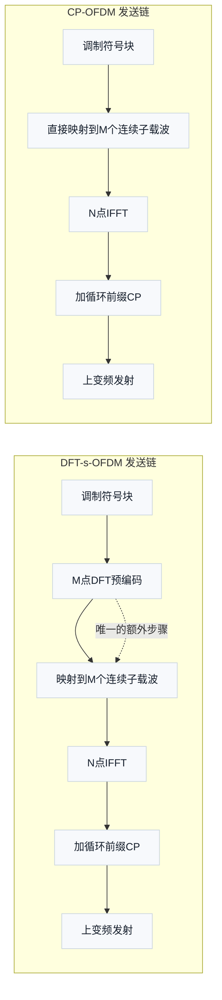

# T15.6 DFT-s-OFDM 上行波形

## 本节学习目标

[[T15.5_NR_DL_UL_differences|T15.5]] 的七维度对照里，波形维度只画了三根粗线：上行用 DFT-s-OFDM（离散傅里叶变换扩展正交频分复用，Discrete Fourier Transform Spread OFDM）降低 PAPR（峰均功率比，Peak-to-Average Power Ratio）、transform precoding 使能时层数限制为 1、PT-RS（相位跟踪参考信号，Phase Tracking Reference Signal）按块级插入。本节把这条粗线升级为一次完整精读：协议在哪里定义这个波形、M 点 DFT（离散傅里叶变换，Discrete Fourier Transform）的数学长什么样、为什么它真的能降低 PAPR、接收端因此多做什么、这个"开关"由谁在什么时候拨动。概念笔记 [[DFT_sOFDM_上行波形]] 给了处理链的速写，本节给出可手算、可仿真、可对照协议的完整版。

本节回答一个总问题：**NR 上行明明可以复用下行那套 CP-OFDM（循环前缀正交频分复用，Cyclic Prefix OFDM）发射机，为什么协议还要定义 DFT-s-OFDM 这个"多一道 DFT"的波形，并且把它和层数、调制集合、参考信号设计绑在一起？**

学完本节后，应能做到：

- 用"功放效率与覆盖"一句话说清上行为什么需要低 PAPR 波形，并完成回退量与平均功率的手算。
- 写出 TS 38.211 §6.3.1.4 的变换预编码（transform precoding）M 点 DFT 公式，逐符号解释每个量，并说出 DFT 点数约束。
- 画出 DFT-s-OFDM 发送链（调制 → M 点 DFT → 子载波映射 → N 点 IFFT → 加 CP）与 CP-OFDM 的差异点。
- 用"DFT 后再 IFFT 复合近似恒等"与"相量叠加 vs 单符号"两种直觉解释单载波性质与 PAPR 降低机理。
- 完成 CP-OFDM 与 DFT-s-OFDM 的对照表（PAPR、频选均衡、多用户复用、兼容性四维为主）。
- 说出 transform precoding 开关的 RRC（无线资源控制，Radio Resource Control）配置字段、DCI 动态指示字段与 38.214 §6.1.3 的回退规则。
- 说出接收端在 DFT-s-OFDM 下必须多做的 IDFT（逆离散傅里叶变换，Inverse Discrete Fourier Transform）解预编码步骤，以及 DM-RS（解调参考信号，Demodulation Reference Signal）在变换预编码使能时改用低 PAPR 序列的协议依据。
- 实跑内嵌 numpy 仿真，验证 DFT-s-OFDM 的 PAPR 低于 CP-OFDM、符号采样点恒包络、频选信道下频域均衡加 IDFT 往返零误码。

## 前置知识检查

| 前置项 | 本节需要达到的程度 |
|:---|:---|
| [[T2.18_OFDM_PAPR_power_amplifier|T2.18]] PAPR、功放回退 | 知道 PAPR 定义（式 1/2）、功放回退的必要性、EVM/ACLR 的关系；本节直接引用这些结论。 |
| [[T15.5_NR_DL_UL_differences|T15.5]] 波形维度粗线 | 知道上行低 PAPR 动机、transform precoding 单层约束、PT-RS 差异三条结论；本节给协议原文与推导。 |
| [[DFT_sOFDM_上行波形]] 概念笔记 | 知道"调制符号 → DFT 预编码 → 子载波映射 → IFFT → 加 CP"的处理链速写与 SC-FDMA（单载波频分多址，Single Carrier Frequency Division Multiple Access）关系。 |
| IFFT/FFT（快速傅里叶变换，Fast Fourier Transform）概念 | 能说出 OFDM（正交频分复用，Orthogonal Frequency Division Multiplexing）时域信号是多个子载波复指数叠加（IFFT（逆快速傅里叶变换，Inverse Fast Fourier Transform）的求和结构），叠加产生峰值。 |
| 调制映射 | 知道 QPSK（正交相移键控，Quadrature Phase Shift Keying）恒包络、16QAM（16 阶正交幅度调制，16 Quadrature Amplitude Modulation）幅度分档（见 [[Modulation_Mapping_调制映射]]）。 |
| 频域均衡与软解调 | 知道接收端对每个子载波做均衡后生成 LLR（对数似然比，Log-Likelihood Ratio）的基本流程（衔接 T2.11 系列与译码主线）。 |

如果"PAPR 为什么高、功放为什么必须回退"还不熟，先回到 [[T2.18_OFDM_PAPR_power_amplifier|T2.18]] 的合唱团类比与 4 载波同相例子；本节在它的结论上继续，不再重复展开。概念笔记 [[UL_DL_Differences_上下行差异]] 提供了本节与功控、定时等其余维度的对照语境。

## 上行采用低 PAPR 波形的工程动机：功放效率与覆盖

### 问题设定：OFDM 发射机在上下行的不同处境

**白话引入。** 下行基站是电网供电的大功放，芯片和散热预算宽裕；上行 UE（用户设备，User Equipment）是电池供电的小功放，发射功率被电池、热设计和法规上限（例如 FR1 常见的 23 dBm 等级）同时约束。把同样的平均功率送到天线，PAPR 高的波形需要更大的峰值余量，功放必须"回退"（backoff）到离饱和点更远的地方工作，平均输出功率就被压低了。T2.18 已经给出定义：功放回退量必须不小于波形 PAPR，否则峰值进入压缩区产生失真。**下行牺牲一点功放效率没关系，上行每 1 dB 平均功率都直接折算成覆盖半径**——这就是波形差异的工程根源，也就是 [[UL_DL_Differences_上下行差异]] 里"发射端不对称"的第一条表现。

### 回退、效率与覆盖的数值链

**公式回答什么问题：** 给定功放线性区峰值预算 $P_{\mathrm{peak}}$ 和波形 PAPR，平均发射功率最多能定多少？功放直流功耗 $P_{\mathrm{DC}}$ 里有多少变成有用的射频输出功率？

$$
P_{\mathrm{avg}}=\frac{P_{\mathrm{peak}}}{\mathrm{PAPR}}
\tag{1}
$$

$$
\eta=\frac{P_{\mathrm{out}}}{P_{\mathrm{DC}}}
\tag{2}
$$

- $P_{\mathrm{avg}}$：平均发射功率（射频输出，W）；
- $P_{\mathrm{peak}}$：功放线性区允许的峰值功率（W）——由器件饱和点与线性度要求决定；
- $\mathrm{PAPR}$：峰值功率与平均功率之比（线性值，非 dB）；
- $\eta$：功放效率——同样的电池电流下，$\eta$ 越高，射频输出越大；
- $P_{\mathrm{DC}}$：直流输入功率（电池侧）。

**数值实例（可手算）。** 设功放峰值预算 $P_{\mathrm{peak}} = 1\ \mathrm{W}$。

- 若波形 PAPR = 8 dB（CP-OFDM 的典型量级，工程观察值，非协议规定），则 $\mathrm{PAPR}=10^{0.8}\approx 6.31$，平均功率 $P_{\mathrm{avg}}=1/6.31\approx 0.158\ \mathrm{W}$；
- 若波形 PAPR = 2.55 dB（16QAM 单载波的 PAPR，见 T2.18 式 13），则 $P_{\mathrm{avg}}=10^{-0.255}\approx 0.556\ \mathrm{W}$。

两种波形的平均功率之比为 $0.556/0.158\approx 3.5$，即约 5.5 dB。**同样的功放、同样的电池，DFT-s-OFDM 可以多发射约 5.5 dB 平均功率。** 在自由空间路径损耗模型下，5.5 dB 对应覆盖半径约扩大 $10^{5.5/20}\approx 1.9$ 倍（路径损耗按距离平方增长，每 6 dB 翻一倍半径）。这不是协议数字，而是"波形 PAPR 差异 → 平均功率差异 → 覆盖差异"的工程量级链条，用于建立直觉。

**为什么功率按"比"而不是按"幅度"记账：** 功放的饱和能力、散热、电池电流都按功率计量，所以峰值/平均用功率比（T2.18 式 1/2）。幅度翻倍对应 PAPR 增加 $10\log_{10}4\approx 6.02\ \mathrm{dB}$。

### 边界：协议规定面与发射机自由度

PAPR 的度量方式、功放回退量、DPD（数字预失真，Digital Pre-Distortion）系数、PA 模型全部属于发射机实现域，协议不规定（T2.18 的边界表已给出同一结论）。协议通过三处**结构性**干预影响 PAPR：调制方式（π/2-BPSK，仅 transform precoding 使能时可用，见下文 Table 6.3.1.2-1）、参考信号序列（低 PAPR 序列，§5.2.2/§5.2.3）、以及本节主角——上行波形选择（transform precoding，§6.3.1.4）。

## 从 CP-OFDM 到 DFT-s-OFDM：一条指令的距离

### 概念四要素

| 要素 | 内容 |
|:---|:---|
| 定义 | 在 OFDM 调制之前，对每个 OFDM 符号内的 $M$ 个调制符号先做 $M$ 点 DFT，把结果铺到 $M$ 个连续子载波上，再走 IFFT（逆快速傅里叶变换，Inverse Fast Fourier Transform）与加 CP（循环前缀，Cyclic Prefix）。 |
| 直觉 | "把并行多车道（多子载波）运输，改造成串行单车道列车"：货物（调制符号）排成一列整体出发，速度均匀、油耗低（PAPR 低、功放省电）。 |
| 可数例子 | M=4 的 DFT 手算（见"变换预编码的数学"节）：输入恒 1 的四符号块变换后能量集中在第 0 个子载波，时域波形回到恒包络。 |
| 边界 | DFT-s-OFDM 仍然是 OFDM 帧结构（同样的 slot、CP、子载波间隔），只改了"频域符号到 IFFT 输入之间"的处理；接收端需要补做 IDFT 逆变换。 |

### 发送链对比图



两条链只有一处不同：DFT-s-OFDM 在子载波映射前多了一个 $M$ 点 DFT（图中 B 框，虚线标注"唯一的额外步骤"）。CP、IFFT、上变频、资源网格全部复用同一套 OFDM 硬件与帧结构——这正是 [[DFT_sOFDM_上行波形]] 概念笔记说的"与 OFDMA（正交频分多址，Orthogonal Frequency Division Multiple Access）共用同一 IFFT 平台"。LTE 时代的 SC-FDMA（单载波频分多址，Single Carrier Frequency Division Multiple Access，TS 36.211 §5.6）是同一技术家族的前身，NR 的 DFT-s-OFDM 是它的延续，区别只在 NR 把它作为"可开关的选项"而不是唯一波形。

**一句话总结本节：** DFT-s-OFDM 不是新调制，不是新帧结构，而是在 OFDM 链路上加一道 DFT 预编码，把"多子载波并行传输"的波形改造成"等效单载波"传输。

## 变换预编码的数学：M 点 DFT

### 协议公式（TS 38.211 §6.3.1.4）

**公式回答什么问题：** 一个 OFDM 符号里要传 $M$ 个调制符号 $x_l^{(0)}(i)$，如何在发到子载波之前把它们"铺开"，使时域波形呈现单载波性质？

本地协议原文（`3GPP_Rel19/processed/TS_38.211_38211-j30/content.md` §6.3.1.4，第 1463 行附近）规定变换预编码按下式施加：

$$
y_l^{(0)}(k)=\frac{1}{\sqrt{M_{sc,l}^{\mathrm{PUSCH}}}}\sum_{i=0}^{M_{sc,l}^{\mathrm{PUSCH}}-1}x_l^{(0)}(i)\,e^{-j\frac{2\pi i k}{M_{sc,l}^{\mathrm{PUSCH}}}},\qquad k=0,\ldots,M_{sc,l}^{\mathrm{PUSCH}}-1
\tag{3}
$$

- $x_l^{(0)}(i)$：OFDM 符号 $l$ 内、变换预编码之前的第 $i$ 个复调制符号（单层 $\lambda=0$，见下文层数约束）；
- $M_{sc,l}^{\mathrm{PUSCH}}$：符号 $l$ 内 PUSCH（物理上行共享信道，Physical Uplink Shared Channel）占用的子载波数，等于 $M_{RB}^{\mathrm{PUSCH}}N_{sc}^{RB}$（PRB（物理资源块，Physical Resource Block）数 × 每 PRB 子载波数 12）；符号被 muting resource 占用时减半（§6.3.1.4 末段）；
- $y_l^{(0)}(k)$：变换预编码后的第 $k$ 个"等效频域符号"，按 $k$ 递增顺序拼接后进入子载波映射（§6.3.1.6）；
- $e^{-j2\pi i k/M}$：$M$ 点 DFT 的旋转因子；$1/\sqrt{M}$：归一化因子，保证变换前后功率不变（Parseval 定理）。

**用教学记号重写一遍（更易读的通用形式）：** 设 $x_m$ 是第 $m$ 个调制符号，$X_k$ 是第 $k$ 个 DFT 输出：

$$
X_k=\frac{1}{\sqrt{M}}\sum_{m=0}^{M-1}x_m\,e^{-j\frac{2\pi mk}{M}},\qquad k=0,\ldots,M-1
\tag{4}
$$

式 (4) 与式 (3) 完全同构，只是变量名不同；教学与代码里习惯用式 (4) 的形式。

**为什么归一化因子是 $1/\sqrt{M}$：** 若 $x_m$ 的功率为 1，则 $\sum_k |X_k|^2=\sum_m |x_m|^2$（DFT 是酉变换）。归一化保证"调制符号的平均功率 = 子载波上的平均功率"，接收端功率标定不随波形选择漂移。

### DFT 点数的协议约束

**公式回答什么问题：** 调度器给 PUSCH 分配了 $M_{RB}^{\mathrm{PUSCH}}$ 个 PRB，对应的 DFT 点数 $M_{sc}^{\mathrm{PUSCH}}=12M_{RB}^{\mathrm{PUSCH}}$ 是否任意取值都合法？

§6.3.1.4 规定 $M_{sc}^{\mathrm{PUSCH}}$ 必须满足（content.md 第 1469-1471 行附近，原文公式字符在抽取件中以文本形式呈现）：

$$
M_{sc}^{\mathrm{PUSCH}}=2^{\alpha_2}\,3^{\alpha_3}\,5^{\alpha_5}
\tag{5}
$$

其中 $\alpha_2,\alpha_3,\alpha_5$ 是非负整数。即 DFT 点数只能含质因子 2、3、5（数学上称为"5-光滑数"）。12、24、36、48、60、72、96……都合法，例如 $12=2^2\cdot3$、$72=2^3\cdot3^2$。**动机（实现域解释，非协议明说）：** 点数只含小质因子意味着 DFT 可以用基-2/基-3/基-5 的 FFT（快速傅里叶变换，Fast Fourier Transform）分解实现，UE 的变换预编码硬件不必支持任意点数的通用 DFT。这是协议为"可高效实现"预留的结构性约束。

### 手算实例：M=4 的 DFT

**示范：** 设 $M=4$，调制符号为全 1 的恒包络块 $x=(1,1,1,1)$。按式 (4)：

$$
X_k=\frac{1}{2}\sum_{m=0}^{3}e^{-j\frac{2\pi mk}{4}}=\frac{1}{2}\left(1+e^{-j\frac{\pi k}{2}}+e^{-j\pi k}+e^{-j\frac{3\pi k}{2}}\right)
\tag{6}
$$

逐项代入 $k=0,1,2,3$：$X_0=(1/2)(1+1+1+1)=2$；$X_1=(1/2)(1-j-1+j)=0$；$X_2=(1/2)(1-1+1-1)=0$；$X_3=0$。结果：

$$
X=(2,\,0,\,0,\,0)
\tag{7}
$$

**读法：** 常数序列的能量全部集中到第 0 个"频率槽"。把这 4 个值铺到 4 个子载波上做 IFFT，时域采样在符号采样点处恰好还原出恒包络的 $x_m$——这就是下一节"单载波性质"的数值预览。反过来的例子（$x=(1,j,-1,-j)$ 的 DFT 能量集中在第 1 个槽）留给独立习题。

### 条款归属核对（未核验说明）

任务卡片把"变换预编码的 DFT 定义"标注为 **TS 38.211 §5.3.3**；核对本地 Rel-19 j30 抽取件，§5.3.3 实际标题为 "OFDM baseband signal generation for RIM-RS"（RIM-RS 的 OFDM 基带信号生成，与变换预编码无关，content.md 第 1269 行）。**变换预编码的 DFT 定义在本地 j30 中位于 §6.3.1.4**（本讲义以 §6.3.1.4 为准）。任务卡片中的 §5.3.3 归属与本地原文不符，原因未核验（可能是引用版本差异或笔误），特此标注，不按卡片照抄。

## 单载波性质与 PAPR 降低的直觉

### 直觉一：DFT 后接 IFFT，复合变换近似"恒等"

**公式回答什么问题：** DFT-s-OFDM 的时域波形到底是什么？它和原来的调制符号是什么关系？

发送端对调制符号 $x_m$ 做 $M$ 点 DFT 得到 $X_k$（式 4），把 $X_k$ 铺到 $M$ 个连续子载波后做 $N$ 点 IFFT。IFFT 的离散形式是：

$$
t[n]=\frac{1}{\sqrt{N}}\sum_{k=0}^{N-1}S_k\,e^{j\frac{2\pi kn}{N}}
\tag{8}
$$

其中 $S_k$ 是第 $k$ 个子载波上的值（$M$ 个位置为 $X_k$，其余为 0）。**关键观察：** DFT 是"时域→频域"，IFFT 是"频域→时域"，符号方向相反、归一化互相配合。在符号采样点 $n=m\cdot(N/M)$ 处，两段变换的净效果是：

$$
t[m\cdot N/M]\;\propto\;x_m
\tag{9}
$$

即 **DFT-s-OFDM 发射波形的符号采样点，直接就是原来的调制符号**（局部化映射下相差一个由映射起始子载波决定的公共相位斜坡，幅度不受影响）。发射机绕了一圈 DFT 再 IFFT，等效于"把符号直接发出去"——这正是"单载波"一词的含义：每个时刻的波形主要由**一个**调制符号决定，而不是 $M$ 个子载波的叠加。

### 直觉二：相量叠加 vs 单符号

T2.18 已经讲过：CP-OFDM 的时域采样是 $M$ 个复指数（相量）之和，$N$ 越大、相位组合越丰富，"很多相量局部同向"的小概率峰值越容易出现，PAPR 随子载波数增长。DFT-s-OFDM 则相反——符号采样点的幅度只由当前调制符号决定：

- QPSK 符号恒包络（四个星座点幅度相同），所以 DFT-s-OFDM 的符号采样点包络恒定，PAPR 的理论下限接近 0 dB；
- 16QAM 符号幅度分三档（T2.18 算出单载波 PAPR ≈ 2.55 dB），DFT-s-OFDM 的 PAPR 也落在单载波水平，而不是叠加水平。

**一句话：OFDM 的峰值来自"多路叠加"，单载波的峰值只来自"单符号自身"。** DFT 预编码把前者改造成后者，这就是 PAPR 降低的全部秘密。

### 数值预览：符号采样点包络

内嵌 numpy 验证（见后文）给出了 16 子载波教学规模的实测：DFT-s-OFDM 的符号采样点包络最大值/最小值 = 1.0000（严格恒包络），CP-OFDM 同一点集的最大/最小 ≈ 6.39（seed=7 实测，数值随随机数据变化，量级结论不变）。也就是说在符号采样时刻，CP-OFDM 的瞬时功率起伏可达数十倍，而 DFT-s-OFDM 完全平坦。

### 低 PAPR 的代价：频域分集下降与误差展平

单载波性质不是免费的：

| 代价 | 机理 | 工程补偿 |
|:---|:---|:---|
| 频域分集下降 | 一个调制符号的能量经 DFT 展平到整个 DFT 块，不再像 CP-OFDM 那样"一个符号占一个子载波、深衰落只伤一个符号" | 编码交织打散突发错误 + 频选调度（SRS 探测选好频带，衔接 [[T15.3_SRS_sounding|T15.3]]） |
| 误差展平 | 接收端 IDFT 解预编码会把某个子载波上的深衰落/干扰"摊"到所有符号 | 频域均衡在 IDFT 之前做（见"对接收端的影响"节） |
| 只能单层 | transform precoding 使能时层数 $\upsilon=1$（§6.3.1.4），多层叠加会恢复高 PAPR，与波形目标冲突 | 多流高吞吐场景改用 CP-OFDM |

**协议证据（单层约束）：** §6.3.1.4 原文（content.md 第 1455 行）："If transform precoding is enabled according to 6.1.3 of [6, TS38.214], $\upsilon=1$"。即变换预编码使能时层数恒为 1——波形选择与传输层数在协议层面绑定：多流用 CP-OFDM，单流（覆盖/省电优先）用 DFT-s-OFDM。

## 协议规定的上行 PUSCH 信号生成链

### 全链节与条款

PUSCH 的发送处理链在 TS 38.211 §6.3.1 按序定义，本节把它逐节对照（本地证据：`content.md`）：

| 步骤 | 条款 | 本节的关注点 |
|:---|:---|:---|
| 加扰 | §6.3.1.1 | 每码字比特加扰，UCI（上行控制信息，Uplink Control Information）占位符处理；两种波形共用 |
| 调制 | §6.3.1.2 + Table 6.3.1.2-1 | 调制集合随 transform precoding 开关变化（见下表） |
| 符号间覆盖码 | §6.3.1.2a | 重复传输的 OCC（正交覆盖码，Orthogonal Cover Code）处理 |
| 层映射 | §6.3.1.3 | 码字映射到最多 4 层；transform precoding 使能时 $\upsilon=1$ |
| 变换预编码 | §6.3.1.4 | 本节主角：式 (3) 的 M 点 DFT；PT-RS 样本占位；DFT 点数约束式 (5) |
| 预编码 | §6.3.1.5 | 天线端口预编码矩阵 W（codebook/非 codebook）；与波形正交兼容 |
| 映射到虚拟 RB | §6.3.1.6 | 按 $k$ 递增顺序映射到分配的虚拟资源块，避开 DM-RS/PT-RS/muting 资源 |
| 虚拟到物理 RB | §6.3.1.7 | **非交织映射**（non-interleaved VRB-to-PRB mapping）——保证分配保持连续、单载波性质不被破坏 |
| OFDM 基带生成 | §5.3.1 | 时域连续信号（所有子载波复指数之和的连续时间版） |
| 调制与上变频 | §5.4 | 上变频到载波；NOTE 允许 UE 按实现滤波（content.md 第 1315 行：基带信号部分"should be filtered per UE implementation"） |

**§6.3.1.7 非交织映射的意义：** DFT 输出的 $M$ 个符号必须落在**连续**的子载波上，单载波性质才成立。若像 LTE 某些场景那样把符号分散到不连续的子载波（分布式映射），时域波形会重新变成多载波叠加、PAPR 回升。§6.3.1.7 规定非交织映射，与 38.214 §6.1.3 中"资源分配类型 0（位图分配，可能不连续）时不得指示 transform precoding 使能"的约束互为表里（见下文开关节）。

### Table 6.3.1.2-1 复现：调制集合随波形开关变化

本地表格证据：`tables/table_0017.html`（即 Table 6.3.1.2-1 "Supported modulation schemes"，已按行核对列向归属）。

| 变换预编码关闭（transform precoding disabled） | | 变换预编码使能（transform precoding enabled） | |
|:---|:---|:---|:---|
| 调制方式 | 调制阶数 $Q_m$ | 调制方式 | 调制阶数 $Q_m$ |
| — | — | π/2-BPSK | 1 |
| QPSK | 2 | QPSK | 2 |
| 16QAM | 4 | 16QAM | 4 |
| 64QAM | 6 | 64QAM | 6 |
| 256QAM | 8 | 256QAM | 8 |

**读表结论：**

1. π/2-BPSK（π/2 二进制相移键控，π/2 Binary Phase Shift Keying）**只在 transform precoding 使能列出现**——它是为单载波波形度身定做的低 PAPR 调制（T2.18 锚点 2 讲过：相邻符号相位差只有 ±90°，避免 180° 过零的包络凹陷），与 DFT-s-OFDM 的恒包络目标匹配；
2. 两列都支持 QPSK/16QAM/64QAM/256QAM——波形的选择不改变常规调制集合；
3. 本表在 j30 中最高到 256QAM；§5.1.7 定义了 1024QAM 的符号映射（content.md 第 1053 行），但 **1024QAM 在本表两列中均未出现，其 PUSCH 适用条件本地未进一步核验**（标注未核验，不以 §5.1.7 的存在推断 PUSCH 可用性）。

**接收端含义：** 解调端必须知道 transform precoding 开关状态才能确定调制集合合法性（例如看到 π/2-BPSK 就应推断发送端使能了变换预编码），并据此选择解调路径。

## 与 CP-OFDM 的对照

### 四维对照表

| 维度 | CP-OFDM | DFT-s-OFDM | 差异的根源 |
|:---|:---|:---|:---|
| PAPR | 高（多子载波叠加，8-11 dB 量级，工程观察值） | 低（单载波性质，接近调制符号自身水平；QPSK 接近 0 dB，16QAM ≈ 2.55 dB） | 时域采样由"多相量之和"变为"单符号决定" |
| 频选均衡 | 每子载波独立均衡（深衰落只伤该子载波上的符号） | 仍需频域均衡，但均衡后要补 IDFT；深衰落经 IDFT 展平到整块符号 | DFT 展平了频域与符号域的映射关系 |
| 多用户复用 | 子载波级粒度：同一符号内不同子载波可分给不同用户 | DFT 块级粒度：$M$ 个符号作为一个整体映射，块内不能拆给多用户 | 单载波性质要求连续分配，调度粒度上升 |
| 兼容性 | 基线波形，所有场景可用 | 与 CP-OFDM 共用帧结构/CP/资源网格/IFFT 硬件；开关按 38.214 §6.1.3 配置 | 同一 OFDM 平台上的附加变换 |
| 层数与流数 | 最多 4 层（多层 MIMO 吞吐） | 使能时 $\upsilon=1$（单层） | §6.3.1.4 协议绑定 |
| 参考信号 | DM-RS 用伪随机序列（§6.4.1.1.1.1） | DM-RS 用低 PAPR 序列（§6.4.1.1.1.2，见下文） | 参考信号与数据共用功放预算 |
| 典型场景 | 下行默认；上行多流/高吞吐 | 上行覆盖受限、功率受限、省电场景 | 发射端不对称（[[UL_DL_Differences_上下行差异]]） |

### 对照的工程读法

**PAPR 维度**是本节主角，已在前文展开。**频选均衡维度**要特别注意：DFT-s-OFDM 不是"免均衡"，而是"均衡还是要做，但均衡的目标变了"——频域均衡恢复的是 $y_l^{(0)}(k)$（预编码符号），必须再补 IDFT 才回到调制符号 $x_l^{(0)}(i)$。**多用户复用维度**解释了为什么上行调度通常按"整块 PRB 连续分配"进行：把 DFT 块拆开等于破坏单载波性质。**兼容性维度**强调这不是"两套物理层"，而是一个物理层上的两个波形选项——UE 与基站之间的同步、CP 去除、FFT 前端完全共用。

## transform precoding 开关：RRC 配置与 DCI 动态指示

### 配置字段（TS 38.331）

开关的静态配置来自 RRC 高层参数，本地证据：`3GPP_Rel19/processed/TS_38.331_38331-j20/content.md`。

| 字段 | ASN.1 | 出现位置 | 用途 |
|:---|:---|:---|:---|
| `transformPrecoder` | `ENUMERATED {enabled, disabled} OPTIONAL -- Need S` | PUSCH-Config（第 52053 行附近）；configuredGrantConfig 中亦有（第 40053 行附近） | 动态调度 / 配置授权 PUSCH 的波形开关 |
| `msg3-transformPrecoder` | `ENUMERATED {enabled} OPTIONAL -- Need R` | RACH 配置（第 53017 行附近） | Msg3 / 回退场景的波形（配置了即启用） |
| `mcs-TableTransformPrecoder` | `ENUMERATED {qam256, qam64LowSE}` | PUSCH-Config | transform precoding 使能时的 MCS（调制与编码方案，Modulation and Coding Scheme）表选择 |
| `dynamicTransformPrecoderFieldPresenceDCI-0-1` / `DCI-0-2` | — | pusch-Config | 使能后允许 DCI 逐次调度动态切换波形 |

### 生效规则（TS 38.214 §6.1.3）

**公式回答什么问题：** UE 收到一次 PUSCH 调度（或配置授权）时，怎么确定这次传输到底用哪种波形？本地原文核对自 `3GPP_Rel19/processed/TS_38.214_38214-j30/content.md` §6.1.3（第 6795-6827 行），按调度类型给出决策链：

| 调度类型 | 波形决定依据 |
|:---|:---|
| Msg3（RAR UL grant / fallbackRAR / DCI 0_0 + TC-RNTI） | 高层参数 `msg3-transformPrecoder` |
| MsgA PUSCH | `msgA-TransformPrecoder`；未配置则按 `msg3-transformPrecoder` |
| 动态调度，DCI 0_0（C-RNTI 等加扰） | 按 BWP 内 rach-ConfigCommon 的 `msg3-transformPrecoder` |
| 动态调度，DCI 0_1/0_2 且配置了 `dynamicTransformPrecoderFieldPresenceDCI-0-1/0-2` = enabled | 按 DCI 中的 **Transform precoder indicator 字段**（逐次调度动态切换） |
| 动态调度，其余情况 | 配置了 `transformPrecoder`（pusch-Config）则按它；未配置则按 `msg3-transformPrecoder` |
| 配置授权（configured grant） | 配置了 `transformPrecoder`（configuredGrantConfig）则按它；未配置则按 `msg3-transformPrecoder` |

**两条硬约束（§6.1.3 原文）：**

1. 若 `resourceAllocation` 为资源分配类型 0（位图分配，PRB 可能不连续），或 DM-RS 类型为 type 2，**UE 不期望** DCI 的 Transform precoder indicator 字段指示 transform precoding 使能——即非连续分配 / DM-RS type 2 与 DFT-s-OFDM 不兼容；
2. 若使能了 transform precoding，UE 忽略 `dmrs-TypeEnh`（若配置）对本次 PUSCH 的 DM-RS 影响（§6.1.3 第 6815 行附近）。

**为什么有"动态指示"这一层：** 覆盖优先（波形省功率）与吞吐优先（CP-OFDM 多层）的折中不必绑死在半静态 RRC 上——网络可以在一次调度里临时切到低 PAPR 波形（例如边缘用户、功率受限时刻），下一次调度再切回来。**注意：** 即便 DCI 字段存在，`resourceAllocationType0` / DM-RS type 2 两个条件仍然封死了使能路径，说明协议把"单载波性质必须成立"放在比动态性更高的优先级。

**未核验边界：** `msg3-transformPrecoder` 未配置时的默认行为由 TS 38.214 §8.3（随机接入过程）决定，本节未核对 §8.3 原文，标注未核验；工程实现通常按默认禁用（CP-OFDM）处理，但该默认不属于本节已核验的协议证据。

## 对接收端的影响：均衡、解预编码与参考信号

### 接收链图


接收端相对 CP-OFDM 只多一步：**IDFT 解预编码**（图中 E 框，虚线标注）。这是协议隐含的接收义务——协议定义发射侧做了 DFT（式 3），接收侧要恢复调制符号就必须做逆变换；但**具体放在均衡之前还是之后、用什么均衡器，协议不规定**（实现域，见边界节）。

### 频域均衡 vs 时域均衡

| 方案 | 处理顺序 | 特点 |
|:---|:---|:---|
| 先均衡后解预编码（FDE，频域均衡，Frequency-Domain Equalization） | 每子载波 MMSE（最小均方误差，Minimum Mean Square Error）/ZF（迫零，Zero-Forcing）均衡 → M 点 IDFT → 软解调 | 均衡器与 CP-OFDM 完全复用；残余误差与噪声经 IDFT 展平到整块符号 |
| 先解预编码后均衡（TDE，时域均衡，Time-Domain Equalization） | M 点 IDFT → 时域均衡器 → 软解调 | 更精确地处理符号间干扰，但时域均衡器抽头数随时延扩展增长，复杂度高 |

**工程主流是先频域均衡后 IDFT**（复用下行/CP-OFDM 的均衡器，改动最小）。频域均衡的标准形式（MMSE，教学记号）：

$$
z_k=\frac{H_k^*\,y_k}{|H_k|^2+\sigma^2}
\tag{10}
$$

- $y_k$：第 $k$ 个子载波上接收到的预编码符号（含信道与噪声）；
- $H_k$：该子载波的信道估计（来自 DM-RS）；
- $\sigma^2$：噪声方差估计；
- $z_k$：均衡后的估计；transform precoding 使能时对 $z_k$ 做 M 点 IDFT 才得到调制符号估计。

**误差展平的工程含义：** 若某个子载波深衰落（$|H_k|^2$ 很小），MMSE 会压低该子载波权重避免噪声放大，但 IDFT 之后这个"没吃饱"的信息会分摊到全部 $M$ 个符号——表现是整块符号的可靠度均匀下降，而不是个别符号崩溃。对译码链路来说，这意味着 DFT-s-OFDM 下 LLR 的"块级相关性"更强，软解调时按块统计噪声更合理（接收机实现自由度）。

### DM-RS 低 PAPR 序列的协议依据与序列族选择

**协议依据：** §6.4.1.1.1.2 "Sequence generation when transform precoding is enabled"（content.md 第 2077-2129 行）。变换预编码使能时，PUSCH DM-RS 序列改用**低 PAPR 序列** $r_{u,v}^{(\alpha,\delta)}(n)$，且 $\delta=1$：

| 条件 | 序列来源 | 说明 |
|:---|:---|:---|
| 配置了 `dmrs-UplinkTransformPrecoding` 且 PUSCH 用 π/2-BPSK，且非 Msg3、非公共搜索空间 DCI 0_0 调度 | §5.2.3 类型 2 | 由 π/2-BPSK 符号经 IDFT 得到的序列（低 PAPR 类型 2） |
| 其余情况 | §5.2.2 类型 1，$\alpha=0$ | ZC（Zadoff-Chu）基序列加循环移位的类型 1 序列 |

**为什么：** DM-RS 与数据符号走**同一条** DFT-s-OFDM 发射链、共用同一个功放峰值预算。若参考信号是高 PAPR 的伪随机序列，功放被迫为它留回退余量，数据波形省下来的功率余量又还回去了——协议因此为参考信号也选用低 PAPR 序列，保证整条上行链路（数据 + 参考）的 PAPR 收益一致。

**类型 2 序列的数学（§5.2.3）：**

$$
r_{u,v}(n)=\frac{1}{\sqrt{M}}\sum_{i=0}^{M-1}\hat{r}_{u,v}(i)\,e^{-j\frac{2\pi i n}{M}},\qquad n=0,\ldots,M-1
\tag{11}
$$

其中 $M\ge 30$ 时 $\hat{r}_{u,v}(i)$ 取 §5.1.1 的 π/2-BPSK 符号（§5.2.3.1），$M\in\{6,12,18,24\}$ 时查表（§5.2.3.2）。**注意式 (11) 与式 (4) 的相似性：** 低 PAPR 类型 2 序列本身就是一个"把 π/2-BPSK 符号做 DFT"的产物——它和 DFT-s-OFDM 数据路径共享同一套"先铺开再还原"的数学，这正是两类信号能共用同一低 PAPR 链路的原因。

**接收端必须做什么：** 按序列组号 $u$、序列号 $v$、循环移位 $\alpha$ 复现同一序列，用于每子载波信道估计 $H_k$（式 10 的输入）；同时依据开关状态选择 DM-RS 序列族（类型 1/2），不能想当然用伪随机序列。

**条款归属核对（未核验说明）：** 任务卡片把"DM-RS 在 DFT-s-OFDM 下的低 PAPR 序列"标注为 §6.4.1.1.2；核对本地 j30，§6.4.1.1.2 标题为 "(void)"（空条款，content.md 第 2131 行），实际内容位于 **§6.4.1.1.1.2**（transform precoding 使能分支的序列生成）。本讲义以 §6.4.1.1.1.2 为准，卡片中的 §6.4.1.1.2 归属与本地原文不符，标注未核验。

### 与 CP-OFDM 接收链的其余差异

- **PT-RS：** transform precoding 使能时，PT-RS 按 §6.3.1.4 / §6.4.1.2.2.2 的"样本组"规则插入，补偿块级公共相位旋转；CP-OFDM 则按符号/子载波粒度插入（衔接 T15.5 波形维度深化的结论）。
- **解调路径分叉：** 接收端必须从调度信息（DCI 的 Transform precoder indicator 字段或 RRC 配置）确定本次 PUSCH 的波形，再决定是否执行 IDFT 解预编码——把 DFT-s-OFDM 当 CP-OFDM 直接解调是经典错误（T2.18 常见错误表已列出同类）。

## 内嵌 numpy 验证

下列代码先本地实跑通过再写入本节；断言与输出一致（PAPR 对比 + 单载波恒包络 + 频选信道往返零误码）：

```python
import numpy as np

rng = np.random.default_rng(7)          # 固定种子，保证可复现

def qpsk(bits):
    # QPSK 符号：每 2 比特 -> 1 个恒包络复符号（功率归一化为 1）
    return (2*bits[:, 0] - 1 + 1j*(2*bits[:, 1] - 1)) / np.sqrt(2)

def tx_symbol(sym, M, N_FFT, CP, start, precode):
    """单个 OFDM 符号发送链：可选 M 点 DFT 预编码 -> 局部化子载波映射 -> IFFT -> 加 CP
    @param sym     长度为 M 的调制符号
    @param precode True=DFT-s-OFDM（先 M 点 DFT），False=CP-OFDM（直接映射）"""
    d = np.fft.fft(sym) / np.sqrt(M) if precode else sym
    sub = np.zeros(N_FFT, dtype=complex)
    sub[start:start + M] = d
    t = np.fft.ifft(sub) * np.sqrt(N_FFT)
    return np.concatenate([t[-CP:], t])

def papr_db(w):
    p = np.abs(w) ** 2
    return 10 * np.log10(p.max() / p.mean())

def run_case(M, N_FFT, start, n_sym, CP):
    bits = rng.integers(0, 2, (M * n_sym, 2))
    s = qpsk(bits)
    w_d = np.concatenate([tx_symbol(s[i*M:(i+1)*M], M, N_FFT, CP, start, True)
                          for i in range(n_sym)])
    w_o = np.concatenate([tx_symbol(s[i*M:(i+1)*M], M, N_FFT, CP, start, False)
                          for i in range(n_sym)])
    return papr_db(w_d), papr_db(w_o)

# (1) PAPR 对比：两个教学规模下 DFT-s-OFDM 都必须低于 CP-OFDM
p_d16, p_o16 = run_case(16, 64, 16, 8, 8)
p_d64, p_o64 = run_case(64, 256, 64, 8, 32)
assert p_d16 < p_o16, (p_d16, p_o16)
assert p_d64 < p_o64, (p_d64, p_o64)

# (2) 单载波性质：符号采样点包络 DFT-s-OFDM 严格恒包络，CP-OFDM 剧烈起伏
M, N_FFT, start, CP = 16, 64, 16, 8
x = qpsk(rng.integers(0, 2, (M, 2)))
d = np.fft.fft(x) / np.sqrt(M)
sub = np.zeros(N_FFT, dtype=complex); sub[start:start + M] = d
t_d = np.fft.ifft(sub) * np.sqrt(N_FFT)
sub2 = np.zeros(N_FFT, dtype=complex); sub2[start:start + M] = x
t_o = np.fft.ifft(sub2) * np.sqrt(N_FFT)
idx = np.arange(0, N_FFT, N_FFT // M)   # 符号采样点（过采样比 N_FFT/M = 4）
env_d = np.abs(t_d[idx]); env_o = np.abs(t_o[idx])
assert abs(env_d.max() / env_d.min() - 1.0) < 1e-9      # 恒包络
assert env_o.max() / env_o.min() > 2.0                  # 叠加起伏

# (3) 频选信道 + AWGN 往返：MMSE 频域均衡 + IDFT 解预编码，零误码
k = np.arange(M)
H = 0.6 + 0.4 * np.exp(-1j * 2 * np.pi * k / M)   # 频选信道（子载波间增益不同）
sigma = 0.1                                       # 噪声每维标准差（SNR 约 20 dB）
bits = rng.integers(0, 2, (M, 2))
x = qpsk(bits)
d = np.fft.fft(x) / np.sqrt(M)
Y = H * d + sigma * (rng.standard_normal(M) + 1j * rng.standard_normal(M)) / np.sqrt(2)
z = Y * np.conj(H) / (np.abs(H) ** 2 + sigma ** 2)     # MMSE 频域均衡
x_hat = np.fft.ifft(z) * np.sqrt(M)                    # M 点 IDFT 解预编码
hard = np.stack([x_hat.real > 0, x_hat.imag > 0], axis=-1).reshape(-1)
assert np.mean(hard != bits.reshape(-1)) == 0.0

print(f"T15.6_PAPR_OK M=16 dfts={p_d16:.2f}dB ofdm={p_o16:.2f}dB "
      f"gain={p_o16-p_d16:.2f}dB | M=64 dfts={p_d64:.2f}dB ofdm={p_o64:.2f}dB "
      f"gain={p_o64-p_d64:.2f}dB")
print(f"T15.6_ENV_OK dfts 符号点包络 max/min={env_d.max()/env_d.min():.4f} "
      f"ofdm max/min={env_o.max()/env_o.min():.4f}")
print("T15.6_RX_OK freq-selective channel + MMSE FDE + IDFT, BER=0.000")
```

输出（seed=7 实测）：

```text
T15.6_PAPR_OK M=16 dfts=5.68dB ofdm=8.00dB gain=2.32dB | M=64 dfts=7.07dB ofdm=8.98dB gain=1.91dB
T15.6_ENV_OK dfts 符号点包络 max/min=1.0000 ofdm max/min=6.3914
T15.6_RX_OK freq-selective channel + MMSE FDE + IDFT, BER=0.000
```

**读数要点：**

1. 两个教学规模下 DFT-s-OFDM 的 PAPR 都低于 CP-OFDM（增益 1.9-2.3 dB）。绝对数值受过采样比（N_FFT/M=4）与矩形频谱影响，**真实系统的增益通常更大（3-6 dB，工程量级观察，非协议规定）**——频谱成形（脉冲成形/滤波）属于 §5.4 NOTE 允许的 UE 实现域，教学仿真未建模；
2. 符号采样点包络 1.0000 vs 6.3914 直观验证"单载波性质"：DFT-s-OFDM 的每个符号采样点由单个调制符号决定，CP-OFDM 是多子载波叠加（本组数据由内嵌脚本 seed=7 实测，数值随随机数据变化，恒包络结论不变）；
3. 频选信道下，MMSE 频域均衡 + IDFT 解预编码可零误码恢复——验证接收链"先均衡后解预编码"路线的正确性。

## 常见误解

| 误解 | 正确理解 |
|:---|:---|
| DFT-s-OFDM 就是 OFDM 加个变换 | 变换改变了波形本质——从多载波叠加变为等效单载波，PAPR、多用户复用粒度、接收处理全部改变 |
| NR 上行只用 DFT-s-OFDM | 上行可配 CP-OFDM（transformPrecoder=disabled）；DFT-s-OFDM 是覆盖/省电选项，不是唯一波形 |
| SC-FDMA 和 DFT-s-OFDM 是两种技术 | 同一技术家族：LTE 叫 SC-FDMA（TS 36.211 §5.6），NR 叫 DFT-s-OFDM，数学同构 |
| 低 PAPR 没有代价 | 频域分集下降、误差展平、只能单层——波形选择是"功放效率 vs 吞吐/分集"的折中 |
| DFT-s-OFDM 不需要均衡 | 频域均衡仍要做，只是均衡目标是预编码符号，之后必须补 IDFT 才到调制符号 |
| 接收端漏做 IDFT 也能解调 | 漏掉 IDFT，符号全部错位（T2.18 常见错误表同款）——必须按开关状态决定解预编码 |
| transform precoding 只能 RRC 静态配置 | 还有 DCI 的 Transform precoder indicator 字段动态切换（38.214 §6.1.3） |
| 任何资源分配都能用 DFT-s-OFDM | 资源分配类型 0（可能不连续）或 DM-RS type 2 时协议禁止使能（UE 不期望） |
| π/2-BPSK 任何上行都能用 | Table 6.3.1.2-1 规定它只在 transform precoding 使能列出现 |
| PAPR 数值是协议规定的 | PAPR 度量与回退量是发射机实现域；协议只结构性规定波形/调制/序列，验收面是 EVM/ACLR（T2.18） |

## 例题

### 示范例题

**例题 1：M=4 的 DFT 手算。** 输入符号块 $x=(1,1,1,1)$，写出 $X=(X_0,X_1,X_2,X_3)$。

**求解：** 按式 (4) 逐项代入（见"变换预编码的数学"节的手算过程），$X_0=2$，$X_1=X_2=X_3=0$，即 $X=(2,0,0,0)$。常数序列能量集中在第 0 个子载波槽，说明 DFT 把"直流"信号压缩到单个频点——时域恒包络，频域单点能量。

**例题 2：功放回退与平均功率。** 功放峰值预算 1 W，CP-OFDM 波形 PAPR=8 dB。平均发射功率是多少？换成 PAPR=2.55 dB 的 DFT-s-OFDM（16QAM 单载波水平）呢？差多少 dB？

**求解：** PAPR=8 dB → $\mathrm{PAPR}=10^{0.8}\approx 6.31$ → $P_{\mathrm{avg}}=1/6.31\approx 0.158$ W。PAPR=2.55 dB → $P_{\mathrm{avg}}=10^{-0.255}\approx 0.556$ W。比值 $0.556/0.158\approx 3.5$，即约 5.5 dB——同样的功放与电池，DFT-s-OFDM 多发射约 5.5 dB 平均功率（对应自由空间覆盖半径约 1.9 倍，工程量级）。

**例题 3：接收链判断。** DFT-s-OFDM 的 PUSCH 接收，为什么"提取子载波 → 直接软解调"是错的？正确的最小流程是什么？

**求解：** 提取出的频域符号是预编码符号 $y_l^{(0)}(k)$ 而非调制符号——直接软解调相当于把 DFT 输出当调制符号，符号错位。正确最小流程：提取子载波 → 频域均衡（MMSE/ZF，式 10）→ M 点 IDFT 解预编码（式 3 的逆）→ 软解调生成 LLR → 译码。均衡与解预编码的顺序、均衡器类型属接收机实现自由度。

### 引导练习（带提示）

**练习 1：DFT 的"移频"性质。** 输入 $x=(1,j,-1,-j)$ 的 M=4 DFT 结果是什么？提示：先写出 $e^{-j\pi k/2}$ 的周期表（$1,-j,-1,j$），再逐 $k$ 求和。（答案：$X=(0,2,0,0)$——能量集中在第 1 个槽；$x_m=e^{j\pi m/2}$ 是频率 1 的复指数序列，DFT 把它变成单点冲激。）

**练习 2：单载波性质的判据。** 一个未知上行波形，在符号采样点测得包络恒定、PAPR≈2.5 dB、且接收端必须做 IDFT 才能解调。它更可能是哪种波形？提示：三条特征分别对应哪个知识点？（答案：DFT-s-OFDM——恒包络是单载波性质、低 PAPR 是波形收益、IDFT 是接收端必须的逆处理。）

**练习 3：配置来源归类。** 以下四种情况各按什么字段确定波形：(a) Msg3；(b) 配置授权 PUSCH；(c) DCI 0_1 且 dynamicTransformPrecoderFieldPresenceDCI-0-1 使能；(d) DCI 0_1 且该字段未使能。提示：查 38.214 §6.1.3 决策链。（答案：(a) msg3-transformPrecoder；(b) transformPrecoder in configuredGrantConfig，未配置回退 msg3-transformPrecoder；(c) DCI 的 Transform precoder indicator 字段；(d) transformPrecoder in pusch-Config，未配置回退 msg3-transformPrecoder。）

### 独立习题（附参考答案）

**习题 1：8 载波同相 PAPR。** 8 个子载波在某采样时刻全部同相，$1/\sqrt{8}$ 归一化下峰值幅度和 PAPR（dB）各是多少？

**参考答案：** 峰值幅度 $8/\sqrt{8}=2\sqrt{2}\approx 2.83$，峰值功率 8；平均功率归一化为 1，PAPR=8，即 $10\log_{10}8\approx 9.03$ dB——比 4 载波例子的 6.02 dB 又高 3 dB，体现"子载波越多、叠加峰值越猛"（对比 DFT-s-OFDM 的符号点恒包络）。

**习题 2：DFT 点数合法性。** $M_{sc}^{\mathrm{PUSCH}}=96$ 是否满足式 (5)？$M_{sc}^{\mathrm{PUSCH}}=84$ 呢？

**参考答案：** $96=2^5\cdot3$ 满足（只含质因子 2、3）；$84=2^2\cdot3\cdot7$ 含质因子 7，不满足——84 个 PRB×12 的分配方式中，若算出 84 点 DFT 即非法，调度器需调整分配。

**习题 3：波形与层数。** 一个小区边缘用户需要最大覆盖，网络应如何配置其 PUSCH？为什么不能同时要 2 层 MIMO 和低 PAPR？

**参考答案：** 配置 transformPrecoder=enabled（必要时配合 DCI 动态指示）获得低 PAPR 波形，牺牲吞吐换平均功率与覆盖；协议 §6.3.1.4 规定使能时层数 $\upsilon=1$，2 层叠加会恢复多载波式高峰值、抵消单载波收益，因此两者不可兼得——多流场景应切回 CP-OFDM。

## 资料与协议边界

| 边界 | 内容 |
|:---|:---|
| 协议规定 | 变换预编码的 M 点 DFT 公式与单层约束（TS 38.211 §6.3.1.4，式 3）；DFT 点数 5-光滑约束（式 5）；调制集合随开关变化（§6.3.1.2 Table 6.3.1.2-1，π/2-BPSK 仅使能列）；非交织 VRB-PRB 映射（§6.3.1.7）；DM-RS 使能时改用低 PAPR 序列（§6.4.1.1.1.2，§5.2.2/§5.2.3）；PT-RS 样本组规则（§6.3.1.4/§6.4.1.2.2.2）；开关配置字段与生效规则（TS 38.331 PUSCH-Config / TS 38.214 §6.1.3）。 |
| 协议不规定（实现域） | PAPR 度量、功放回退量、DPD/PA 模型（T2.18 同款结论）；接收端均衡与解预编码的实现顺序（FDE 后 IDFT vs IDFT 后 TDE）与均衡器类型（MMSE/ZF）；发射机滤波/脉冲成形（§5.4 NOTE 允许按 UE 实现滤波）；波形选择的调度策略（何时切 DFT-s-OFDM）。 |
| UE 必须执行 | 按 38.214 §6.1.3 的决策链确定每次 PUSCH 的波形；使能时按单层发射、用低 PAPR DM-RS 序列、按 π/2-BPSK 旋转规律调制；资源分配类型 0 或 DM-RS type 2 时不期望使能。 |
| 接收端义务 | 按开关状态决定是否补 M 点 IDFT 解预编码；用正确序列族做信道估计；把 DFT-s-OFDM 当 CP-OFDM 解调属实现错误（协议隐含的接收义务）。 |
| 未核验边界 | (1) 任务卡片把 DFT 定义标注为 §5.3.3，本地 j30 §5.3.3 为 RIM-RS 基带生成，实际为 §6.3.1.4——按本地原文为准，卡片归属未核验；(2) 任务卡片把 DM-RS 低 PAPR 序列标注为 §6.4.1.1.2，本地 j30 该条为 (void)，实际为 §6.4.1.1.1.2——按本地原文为准；(3) 1024QAM 在 §5.1.7 有符号映射，但 Table 6.3.1.2-1 两列最高 256QAM，其 PUSCH 适用条件未核验；(4) msg3-transformPrecoder 未配置时的默认行为在 TS 38.214 §8.3，未核对原文。 |

**边界结论：** 协议规定"波形长什么样、开关怎么拨、参考信号用什么序列"（强制面），并给出发射质量验收面（EVM/ACLR，TS 38.104，T2.18 已列）；至于"怎么压低 PAPR、接收端先均衡还是先解预编码"属于实现域。本节的 DFT 公式、单层约束、调制集合、开关决策链全部核验自本地 Rel-19 j30/j20 抽取件原文。

## 小结

DFT-s-OFDM 是 NR 上行应对"功放效率与覆盖"约束的波形答案：在 OFDM 链路上加一道 M 点 DFT（式 3，TS 38.211 §6.3.1.4），把"多子载波并行叠加"改造成"等效单载波传输"——符号采样点包络由单个调制符号决定，PAPR 从叠加水平降到单载波水平，同样的功放与电池可以多发射约 5.5 dB 平均功率（工程量级）。低 PAPR 不是免费的：频域分集下降、误差经 IDFT 展平、层数绑定为 1，因此协议把波形开关（TS 38.331 `transformPrecoder` / TS 38.214 §6.1.3 决策链，含 DCI 动态指示）与调制集合（π/2-BPSK 仅使能列）、参考信号（低 PAPR 序列 §6.4.1.1.1.2）绑成一个整体设计。接收端只多一步 IDFT 解预编码，顺序与均衡器类型属实现自由度。

**与前后文的衔接：** 波形维度从 [[T15.5_NR_DL_UL_differences|T15.5]] 的粗线升级为完整精读，PAPR 机理承接 [[T2.18_OFDM_PAPR_power_amplifier|T2.18]]，频域分集补偿衔接 [[T15.3_SRS_sounding|T15.3]] 的频选调度，功控链路衔接 [[T15.4_uplink_power_control|T15.4]]（平均功率是开环功控的输入之一）。概念笔记 [[DFT_sOFDM_上行波形]]、[[UL_DL_Differences_上下行差异]]、[[Modulation_Mapping_调制映射]] 分别是本节的速写版、语境版与调制基础。**下一步**进入阶段 4 的发送端镜像（下行发送链与本节波形维度的镜像对照），届时本节将是"上行半边"波形的最终答案页。

## 执行与证据记录

| 项目 | 记录 |
|:---|:---|
| 新增文件 | `docs/L2_协议算法/T15.6_DFT_sOFDM_uplink_waveform.md`（本文件）。 |
| 协议证据 | TS 38.211 j30 `content.md`：§6.3.1.4（变换预编码 DFT 公式，第 1461-1473 行；单层约束第 1455 行；muting 资源第 1473 行）、§6.3.1.2 + `tables/table_0017.html`（Table 6.3.1.2-1 逐行核对列向归属）、§6.3.1.7（非交织映射，第 1625 行）、§6.4.1.1.1.2（transform precoding 使能 DM-RS 序列，第 2077-2129 行）、§5.2.2/§5.2.3（低 PAPR 序列，第 1067-1133 行）、§5.3.1（OFDM 基带生成，第 1137 行）、§5.4（上变频与滤波 NOTE，第 1315 行）、§5.1.7（1024QAM 映射，第 1053 行）。TS 38.331 j20 `content.md`：transformPrecoder（第 52053 行）、msg3-transformPrecoder（第 53017 行）、mcs-TableTransformPrecoder。TS 38.214 j30 `content.md` §6.1.3（第 6795-6827 行，波形决定链与两条硬约束）。 |
| numpy 验证 | 内嵌脚本实跑（seed=7）：PAPR 对比 M=16 增益 2.32 dB、M=64 增益 1.91 dB（断言 dfts<ofdm 通过）；符号采样点包络 max/min=1.0000 vs 6.3914（恒包络断言通过）；频选信道 + MMSE FDE + IDFT 往返 BER=0.000（断言通过）。输出见"内嵌 numpy 验证"节，与实跑一致。 |
| 审计工具 | `python3 tools/audit_circled_digits.py docs/L2_协议算法/T15.6_DFT_sOFDM_uplink_waveform.md`：通过（0 处带圈数字）。`python3 tools/audit_latex_render.py docs/L2_协议算法/T15.6_DFT_sOFDM_uplink_waveform.md`：通过（公式定界符平衡、标签 1-11 连续、KaTeX 渲染无错误，134 条公式）。`python3 tools/audit_lesson_terms.py`：通过。`python3 tools/audit_markdown_headings.py`：通过。`bash tools/audit_mermaid_syntax.sh docs/L2_协议算法`：通过（mmdc + chrome-headless-shell 可用，L2 目录 58 个 Mermaid 块全部渲染成功，含本讲义 2 块）。 |
| 自检说明 | 本讲义 2 个 Mermaid 块均使用 `id["text"]` 引号节点、节点文本无半角括号；`audit_mermaid_syntax.sh` 实跑通过（mmdc 与 puppeteer Chromium 均在环境中可用），无验证缺口。 |
| 条款归属勘误 | 任务卡片两处章节号与本地 j30 不符，已按本地原文修正并标注未核验：(1) 变换预编码 DFT 定义实为 §6.3.1.4（卡片写 §5.3.3，该条为 RIM-RS 基带生成）；(2) DM-RS 低 PAPR 序列实为 §6.4.1.1.1.2（卡片写 §6.4.1.1.2，该条为 (void)）。 |
| 概念笔记 | 已核对并 wikilink：[[DFT_sOFDM_上行波形]]、[[UL_DL_Differences_上下行差异]]、[[Modulation_Mapping_调制映射]]；`docs/concepts/OFDM_正交频分复用.md` 本地不存在，未链接（任务卡片标注"若存在"）。 |

## 参考文献

- [3GPP, 2026] 3GPP TS 38.211, Rel-19, `38211-j30`, Physical channels and modulation, §5.1.7, §5.2.2, §5.2.3, §5.3.1, §5.4, §6.3.1.1-§6.3.1.7, §6.4.1.1. Local path: `3GPP_Rel19/processed/TS_38.211_38211-j30`.
- [3GPP, 2026] 3GPP TS 38.214, Rel-19, `38214-j30`, Physical layer procedures for data, §6.1.3. Local path: `3GPP_Rel19/processed/TS_38.214_38214-j30`.
- [3GPP, 2026] 3GPP TS 38.331, Rel-19, `38331-j20`, Radio Resource Control (RRC) protocol specification, PUSCH-Config（transformPrecoder、mcs-TableTransformPrecoder、dynamicTransformPrecoderFieldPresenceDCI-0-1/0-2）、msg3-transformPrecoder. Local path: `3GPP_Rel19/processed/TS_38.331_38331-j20`.
- [3GPP, 2026] 3GPP TS 36.211, Rel-19, SC-FDMA 上行波形前身（§5.6），仅作概念对照，未复现其公式。Local path: `3GPP_Rel19/processed/TS_36.211_36211-j30_s06-s08`.
- 本项目 [[DFT_sOFDM_上行波形]]、[[UL_DL_Differences_上下行差异]]、[[Modulation_Mapping_调制映射]] 概念笔记；[[T2.18_OFDM_PAPR_power_amplifier|T2.18]]、[[T15.5_NR_DL_UL_differences|T15.5]] 讲义。
