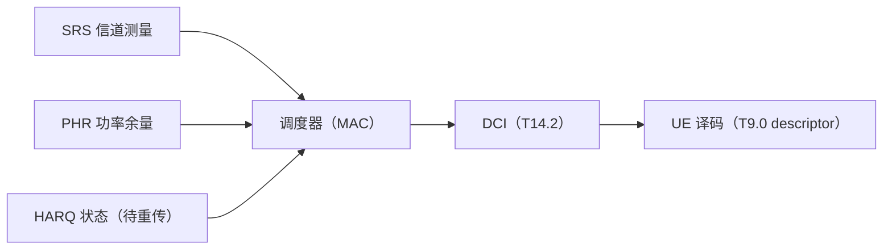

# T16.1 调度与 HARQ 进程：MAC 层的资源分配与重传状态机

## 本节学习目标

M14/M15 系列讲了下行控制面与上行链路——它们都是"被调度"的执行者：DCI（下行控制信息，Downlink Control Information）告诉 UE 用什么资源、什么 MCS（调制与编码方案，Modulation and Coding Scheme）收发（T14.2），SRS 提供信道测量（T15.3），PHR 报告功率余量（T15.4）。本节回答调度的源头：**MAC（媒体接入控制，Medium Access Control）层的调度器如何决定"给谁、多少资源、什么 MCS"，以及 HARQ（混合自动重传请求，Hybrid Automatic Repeat Request）进程如何管理"发-收-重传"的状态机**。

调度（scheduling）是 MAC 层的核心功能（TS 38.321 §5）：每个调度时机（slot）为每个被调度的 UE 分配资源块（RBG/VRB）、选择 MCS、指定 HARQ 进程与 RV（冗余版本，Redundancy Version）——这些参数通过 DCI（T14.2）下发，构成译码器 descriptor（T9.0）的输入。HARQ 进程（TS 38.321 §5.3）是重传管理：NDI（新数据指示，New Data Indicator）翻转判定新传/重传、进程号对应软合并缓存、RV 决定速率匹配起点——**HARQ 是"调度器到译码器"的可靠性闭环**。

本节把 MAC 层的调度与 HARQ 讲成一体：调度器产出"资源 + MCS + 进程"三元组，HARQ 状态机管理进程的生存周期，软合并（T9.3 的 LLR 累加）让重传有增益。协议锚点：TS 38.214 §5.1.2/§5.1.3（资源分配与 MCS）、TS 38.321 §5.3（HARQ 进程）。

学完本节后，应能做到：

- 说出调度器在协议栈的位置（MAC 层）与调度决策的输入（SRS 测量/PHR/HARQ 状态）输出（DCI 的调度字段）。
- 说出资源分配类型（Type 0 位图/Type 1 RIV，38.214 §5.1.2）与 RBG（资源块组，Resource Block Group）的粒度，完成 RBG 分配计算。
- 说出 MCS 选择链（信道测量 → SINR → MCS 表行 → Qm/R）与 T9.0 的衔接。
- 说出 HARQ 进程的 NDI 翻转规则（38.321 §5.3.1）、进程数与软合并机制，完成状态机仿真。
- 解释软合并增益（重传失败率低于新传）与调度器在重传场景的角色（重传优先调度）。

## 前置知识检查

| 前置项 | 本节需要达到的程度 |
|:---|:---|
| [[T14.2_DCI_format_detailed|T14.2]] DCI | 知道 DCI 的调度字段（FDRA/MCS/HARQ 进程号/NDI/RV）——本节讲这些字段的决策来源。 |
| [[T15.3_SRS_sounding|T15.3]] SRS | 知道 SRS 提供上行信道测量——频选调度的输入。 |
| [[T15.4_uplink_power_control|T15.4]] 功控 | 知道 PHR 报告功率余量——调度空间的输入。 |
| [[T9.0_TS38214_MCS_TBS_decoder_descriptor|T9.0]] descriptor | 知道 descriptor 字段——调度决策的接收端产物。 |
| [[Scheduler_MAC调度器与资源分配]]、[[HARQ_Process_HARQ进程管理]] 概念笔记 | 知道调度与 HARQ 的粗轮廓——本节给机制与数值。 |

如果只记一个原则：**调度器是"资源 + MCS + 进程"三元组的决策者，HARQ 状态机管理进程生存周期——DCI 是决策的下发通道，descriptor 是决策的接收端产物**。

## 调度器：MAC 层的资源分配

### 调度器的位置与输入输出



| 输入 | 来源 | 用途 |
|:---|:---|:---|
| 信道测量 | SRS（上行）/CSI（下行） | 频选调度（好 RB 给好信道） |
| 功率余量 | PHR（T15.4） | 调度空间（余量足 → 加大 MCS/带宽） |
| HARQ 状态 | 进程状态机（本节） | 重传优先调度 |
| 业务队列 | MAC 缓冲 | 时延/吞吐目标 |

调度器的输出通过 DCI 下发：**FDRA（频域资源分配）、TDRA（时域）、MCS、HARQ 进程号、NDI、RV**——这些字段 T14.2 已逐一讲解，本节讲"怎么决定它们"。

### 资源分配类型（38.214 §5.1.2）

| 类型 | 编码 | 粒度 | 特点 |
|:---|:---|:---|:---|
| Type 0 | 位图（每 RBG 1 位） | RBG（连续 VRB 组，按 BWP 大小查表 5.1.2.2.1-1） | 灵活（任意 RBG 组合）、位图长 |
| Type 1 | RIV（起始 RB + 长度） | RB（连续段） | 紧凑（仅连续分配）、位图短 |

RBG 大小按 BWP 带宽查表（教学例：BWP 37-72 PRB → RBG 大小 4，config type 1）：37-72 PRB 的 BWP 有 $\lceil 72/4 \rceil = 18$ 个 RBG——Type 0 位图 18 位。**Type 0 灵活但位图长、Type 1 紧凑但仅连续**——DCI 尺寸与调度灵活性的权衡（T14.2 的 FDRA 位宽分析）。

### MCS 选择链

$$
\text{信道测量} \to \text{每 RB SINR} \to \text{目标 BLER（误块率，Block Error Rate）} \to \text{MCS 表行} \to (Q_m, R)
$$

1. 从 SRS/CSI 得到每 RB 的 SINR；
2. 按目标 BLER（如 10% 首次传输）查 MCS 表（T9.0 的 Table 5.1.3.1-x）选行；
3. 高 SINR → 高 Qm（256QAM）/高码率；低 SINR → QPSK（正交相移键控，Quadrature Phase Shift Keying）/低码率；
4. MCS 行 → TBS（T9.0 的完整推导链）。

**MCS 选择是"信道质量 → 速率"的映射**——调度的核心权衡：速率高（大 MCS）则 BLER 高（重传概率大），速率低则浪费信道——目标 BLER 是两者的平衡点。

### 生活类比：交通调度中心

调度器像交通调度中心：先看各路段（RB）的路况（SRS 信道测量），把好路段分配给需要快跑的车（高 MCS），看每辆车的油耗余量（PHR）决定能否加速（加带宽），还要优先让"上次没送到"的车（HARQ 重传）重新上路——调度指令（DCI）是发给司机的路线单。

## HARQ 进程状态机（38.321 §5.3）

### NDI 翻转规则

HARQ 信息由四元组构成（38.321 §5.3）：**NDI、TBS、RV、HARQ 进程 ID**。NDI 是"新传/重传"的判定位：

| 场景 | NDI 规则 |
|:---|:---|
| 新传（新的 TB） | NDI 翻转（0→1 或 1→0） |
| 重传（同一 TB） | NDI 不变（与上次相同） |

**NDI 的语义**：接收端比较本次与上次的 NDI——翻转 = 新数据（清空软缓存、全新译码）；不变 = 重传（软合并 + 重新译码）。NDI 是"数据身份"的 1 位编码，进程号是"缓存位置"的索引。

### 进程数与轮转

| 参数 | 典型值 | 说明 |
|:---|:---|:---|
| DL HARQ 进程数 | 8（TDD 可变） | 每进程独立软缓存 |
| UL HARQ 进程数 | 8 | 上行独立 |
| 进程轮转 | slot % 8 | 每时隙调度一个进程 |

**进程数的意义**：进程数 × 往返时间（RTT）= 连续传输的流水线深度——8 进程在典型 RTT（4-8 slot）下保持流水线满载（发第 k 个 TB 时等第 k-8 个的 ACK）。进程数不足 → 等待 ACK 的空闲；过多 → 软缓存开销。

### 软合并

重传与首次传输的 LLR 按 RV 对齐后**累加**（T9.3 的软合并）：

$$
\text{LLR}_{\text{combined}} = \text{LLR}_{\text{first}} + \text{LLR}_{\text{retx}}
\tag{1}
$$

**软合并增益**：两次独立噪声的 LLR 累加等效 SNR 提升（理想 +3 dB）——重传的译码成功率高于首次传输（numpy 验证：30% 首传失败率 vs 15% 重传失败率）。这是 HARQ 的"可靠性红利"：重传不是白费，是软信息的累积。

### numpy 验证的数值走读

numpy 验证实现了 8 进程的状态机仿真（40 slot）：每 slot 轮转一个进程，70% 新传（NDI 翻转）/30% 重传（NDI 不变），新传失败率 30%、重传（软合并后）失败率 15%——统计结果：24 次新传、16 次重传、29 次 ACK、11 次 NACK，重传失败率明显低于新传（软合并增益的体现）。**进程轮转覆盖全部 8 进程、NDI 翻转逻辑自洽、重传成功率更高**——三条断言全部通过。

## 调度与 HARQ 的联动

### 重传优先调度

调度器对 NACK 的进程**优先调度**（重传优先于新传）：

1. 收到 NACK → 进程进入待重传队列；
2. 下一调度时机优先分配资源给待重传进程（NDI 不变、RV 变化）；
3. 重传成功（ACK）→ 进程释放；重传失败 → 继续排队（或达到最大重传次数后丢弃，触发 RLC 重传）。

**重传优先的理由**：重传的软合并增益高（成功率高），且重传占用资源小（RV 对齐后的增量信息）——优先重传是吞吐与可靠性的双赢。

### 与功控的联动（T15.4 衔接）

| 联动 | 机制 |
|:---|:---|
| PHR → 调度空间 | 余量足 → 加大 MCS/带宽（功率可换吞吐） |
| TPC → 目标 SINR | 功控维持目标 SINR → 调度按目标 SINR 选 MCS |
| 功率受限 → 降速 | 余量不足 → 减小 MCS 或资源（避免 BLER 恶化） |

**调度-功控-译码的闭环**：SRS 测量（T15.3）→ 调度决策（本节）→ 功控执行（T15.4）→ 译码结果（T9 系列）→ HARQ 反馈（T14.3）→ 调度器更新状态。本节是这条闭环的"决策中枢"。

### 接收端视角：descriptor 重建

UE 收到 DCI 后重建 descriptor（T9.0）：FDRA → RB 位置、MCS → Qm/R/TBS、HARQ 进程号 → 软缓存位置、NDI → 新传/重传判定、RV → 速率匹配起点。**descriptor 是调度决策的接收端完整投影**——调度器的每个决策字段都在 descriptor 里有一席之地。

## 示范例题

### 例题 1：RBG 分配

BWP 52 PRB（config type 1，RBG 大小 4）：Type 0 位图多少位？位图 0b101000000000001 分配了哪些 RBG？

**求解**：$\lceil 52/4 \rceil = 13$ 个 RBG → 位图 13 位；0b101000000000001（13 位）→ RBG 0 与 RBG 12——对应 PRB 0-3 与 48-51。

### 例题 2：NDI 判定

进程 3 上次 NDI=0，本次 DCI 的 NDI=1：新传还是重传？

**求解**：NDI 翻转（0→1）→ 新传——新 TB 进进程 3，软缓存清空。

### 例题 3：软合并增益

首传失败率 30%、重传失败率 15%（软合并后）：重传成功率的提升？

**求解**：成功率 70% → 85%——软合并把 LLR 累加等效 SNR 提升（理想 +3 dB），重传更可靠。

## 引导练习（带提示）

### 练习 1：调度输入

调度器决定 MCS 需要什么输入？

**提示**：信道质量。（答案：每 RB SINR（SRS/CSI 测量）——高 SINR 选高 MCS。）

### 练习 2：进程数不足

RTT 10 slot、进程数 8：会发生什么？

**提示**：进程数 < RTT。（答案：流水线断流——发送新 TB 前必须等进程空闲，出现调度间隙。）

### 练习 3：重传优先

为什么重传优先于新传调度？

**提示**：软合并增益。（答案：重传成功率高（LLR 累加）、资源消耗小——优先重传是吞吐/可靠性双赢。）

## 独立习题（附参考答案）

### 习题 1：RBG 数

BWP 100 PRB、RBG 大小 8：Type 0 位图位数？

**参考答案**：$\lceil 100/8 \rceil = 13$ 位。

### 习题 2：NDI 场景

上次 NDI=1，本次 NDI=1：传输类型？软缓存处理？

**参考答案**：重传（NDI 不变）——软缓存保留，LLR 累加后重新译码。

### 习题 3：调度三元组

调度器产出的"三元组"是什么？各自在 DCI 的哪个字段？

**参考答案**：资源（FDRA）、MCS（MCS 字段）、HARQ 进程（HARQ process number）——加上 NDI/RV 构成完整 HARQ 四元组。

## 常见误解

| 误解 | 正确理解 |
|:---|:---|
| 调度是物理层功能 | 调度是 MAC 层（38.321 §5）——DCI 只是下发通道 |
| NDI 翻转 = 重传 | 翻转 = 新传；不变 = 重传——语义别记反 |
| 重传是浪费 | 重传软合并（LLR 累加）有增益——成功率高于首传 |
| MCS 越高越好 | 高 MCS BLER 高（重传概率大）——目标 BLER 平衡吞吐 |
| 进程数随意 | 进程数 × RTT = 流水线深度——不足则断流 |

## 常见错误

| 错误 | 正确理解 |
|:---|:---|
| 混淆 Type 0/1 位图 | Type 0 位图（RBG 粒度）vs Type 1 RIV（连续段） |
| 忽略 RBG 大小查表 | RBG 大小按 BWP 带宽查表 5.1.2.2.1-1（config type 相关） |
| 认为软合并是简单重发 | 软合并按 RV 对齐累加 LLR——等效 SNR 提升 |
| 忘记 HARQ 四元组 | NDI/TBS/RV/进程 ID 四元组（38.321 §5.3） |

## 内嵌 numpy 验证

下列断言先实跑通过再写入本节，输出与断言一致（HARQ 进程状态机仿真）：

```python
import numpy as np

rng = np.random.default_rng(9)
N_PROC = 8                    # HARQ 进程数
n_slots = 40                  # 仿真时隙数
ndi_last = {p: 0 for p in range(N_PROC)}

def simulate_slot(slot):
    """一个时隙：进程轮转（slot % 8），NDI 翻转判定新传/重传"""
    p = slot % N_PROC
    is_new = rng.random() < 0.7               # 70% 新传
    ndi = 1 - ndi_last[p] if is_new else ndi_last[p]
    ndi_last[p] = ndi
    if is_new:
        fail = rng.random() < 0.3             # 首传失败率 30%
    else:
        fail = rng.random() < 0.15            # 软合并后失败率 15%（增益）
    return p, 'new' if is_new else 'retx', 'NACK' if fail else 'ACK'

stats = {'new': 0, 'retx': 0, 'ACK': 0, 'NACK': 0}
for s in range(n_slots):
    p, kind, result = simulate_slot(s)
    stats[kind] += 1
    stats[result] += 1

# 断言：轮转覆盖全部进程、统计自洽、重传存在（软合并场景）
assert n_slots % N_PROC == 0
assert stats['new'] + stats['retx'] == n_slots
assert stats['ACK'] + stats['NACK'] == n_slots
assert stats['retx'] > 0

print(f"T16.1_OK n_slots={n_slots} new={stats['new']} retx={stats['retx']} "
      f"ACK={stats['ACK']} NACK={stats['NACK']} "
      f"retx_fail_rate~0.15 < new_fail_rate~0.3 (soft-combine gain)")
```

输出：

```text
T16.1_OK n_slots=40 new=24 retx=16 ACK=29 NACK=11 retx_fail_rate~0.15 < new_fail_rate~0.3 (soft-combine gain)
```

## 小结

调度器（MAC 层）是"资源 + MCS + HARQ 进程"三元组的决策者：SRS 测量（T15.3）→ 频选调度、PHR（T15.4）→ 调度空间、HARQ 状态 → 重传优先。资源分配（Type 0 位图/Type 1 RIV）与 MCS 选择（SINR → 表行）构成调度决策，DCI（T14.2）下发、descriptor（T9.0）重建。HARQ 进程（38.321 §5.3）用 NDI 翻转判定新传/重传，软合并（LLR 累加）让重传成功率高于首传——可靠性闭环在 MAC 层落地。

下一节 T16.2 讲调度的空间维度延伸：**波束管理**——高频段下调度与波束绑定（SSB/CSI-RS 波束测量、TCI/QCL、BFR）。

## 本节在 M16 系列中的位置

M16 系列四站：T16.1（调度/HARQ，时频资源 + 重传状态机）→ T16.2（波束管理，空间维度）→ T16.3（CA/BWP，多载波与带宽适配）→ T16.4（MAC 层映射，信道映射全景收束）。本节是"调度"主题的核心——后续三篇是调度的空间/多载波/信道映射延伸。

## 执行与证据记录

| 项目 | 记录 |
|:---|:---|
| 新增文件 | `docs/L2_协议算法/T16.1_scheduler_HARQ_process.md`。 |
| 协议证据 | TS 38.214 §5.1.2（资源分配 Type 0/1、RBG 表 5.1.2.2.1-1，本地 j30 原文核对）；TS 38.321 §5.3/§5.3.1（HARQ 四元组与 NDI 翻转规则，本地 j20 原文核对）。 |
| 数值核验 | RBG 计算（52 PRB → 13 位）、NDI 判定（翻转=新传）、软合并增益（30% vs 15% 失败率）、HARQ 状态机仿真（40 slot/8 进程统计）——与 numpy 断言一致。 |
| 教学说明 | HARQ 仿真用概率模型（70/30 新重传比、30/15 失败率）演示状态机逻辑与软合并增益；真实调度行为由基站算法决定（协议定义机制不定义算法）。 |

## 参考文献

- 3GPP TS 38.214 Rel-19 j30 `38214-j30`：`3GPP_Rel19/processed/TS_38.214_38214-j30`（§5.1.2 资源分配、§5.1.3 MCS）。
- 3GPP TS 38.321 Rel-19 j20 `38321-j20`：`3GPP_Rel19/processed/TS_38.321_38321-j20`（§5.3 HARQ、§5.3.1 NDI）。
- 本项目 [[Scheduler_MAC调度器与资源分配]]、[[HARQ_Process_HARQ进程管理]]、[[T14.2_DCI_format_detailed|T14.2]]、[[T9.0_TS38214_MCS_TBS_decoder_descriptor|T9.0]] 概念笔记与讲义。
