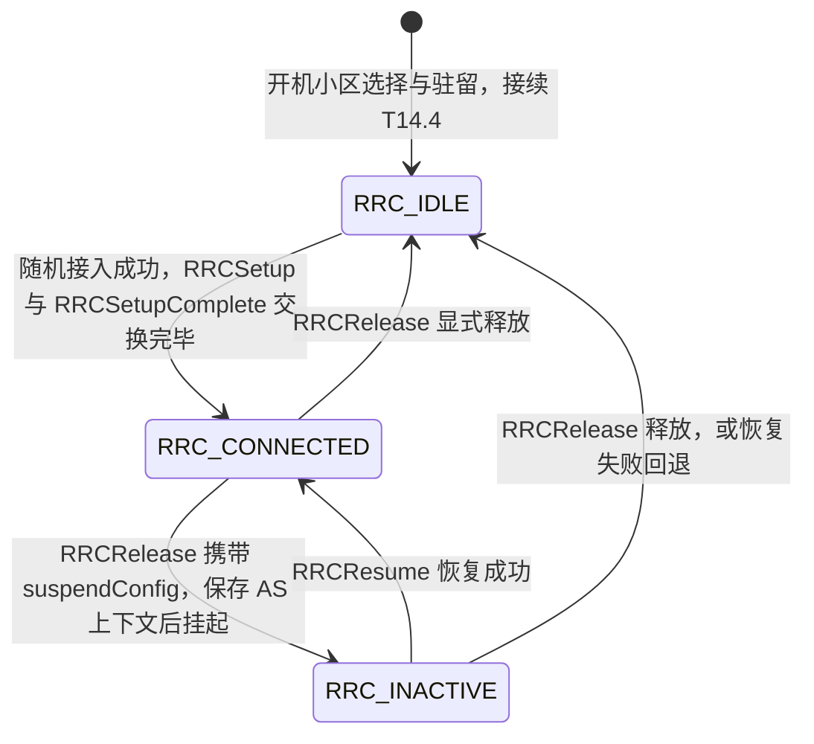
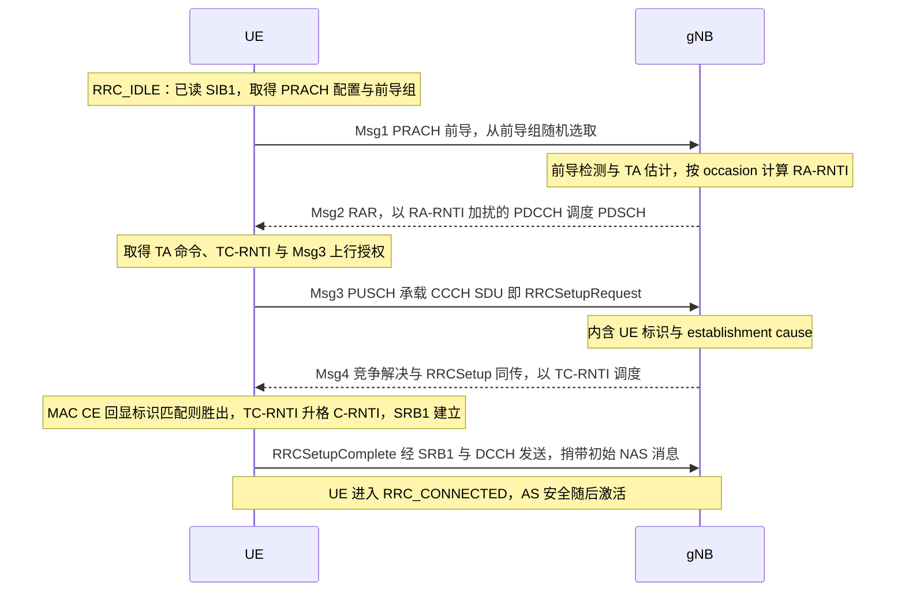

# T16.6 从随机接入到 RRC 连接建立：MAC 过程机与状态迁移

## 本节学习目标

T15.2 讲完了随机接入的物理侧：前导（preamble）的 ZC（Zadoff-Chu）序列、PRACH（物理随机接入信道，Physical Random Access Channel）时频配置，以及 Msg1-Msg4 的消息轮廓。但"消息轮廓"不等于"能接入"——真正的接入是一台**过程机**在运转：MAC（媒体接入控制，Medium Access Control）层在 TS 38.321 §5.1 里定义了一套带状态、带计数、带定时器的随机接入过程（Random Access procedure），UE 依据触发场景选择竞争式还是非竞争式接入，失败时按退避与功率爬升重试；过程走通之后，接力棒交到 RRC（无线资源控制，Radio Resource Control）层（TS 38.331），完成 RRC 状态迁移与连接建立三消息闭环，UE 才真正"上线"。

本节承接 T15.2，不再复述前导物理与资源配置（需要时回查即可），把叙事切点放在两件事上：**MAC 层随机接入过程机怎么运转**（触发选择、重传、退避、竞争解决、RA-RNTI 的时频寻址），**以及 RRC 层怎么把它收束成一条可用的连接**（RRC_IDLE/RRC_INACTIVE/RRC_CONNECTED 三态迁移、SRB0/SRB1 与 RRCSetupRequest/RRCSetup/RRCSetupComplete 三消息）。协议锚点：TS 38.321 §5.1（MAC 随机接入过程）、TS 38.331 §4.2（UE 状态与信令无线承载）、TS 38.331 §5.3.3（RRC 连接建立）。

学完本节后，应能做到：

- 说出随机接入由 MAC 层以"过程机"方式控制，列出 38.321 §5.1.1-§5.1.6 的过程阶段与各自的协议职责。
- 区分竞争式（CBRA，Contention-Based Random Access）与非竞争式（CFRA，Contention-Free Random Access）的触发与选择逻辑，说出专用前导由网络经哪些通道交给 UE。
- 解释过程机的计数与定时要素（发送计数、功率爬升、RAR（随机接入响应，Random Access Response）响应窗口、竞争解决定时器、退避）各自解决什么问题，指出数值由 RRC 配置下发而非协议写死。
- 用 RA-RNTI（随机接入无线网络临时标识，Random Access Radio Network Temporary Identifier）公式完成手算，并用 numpy 穷举验证"时频位置到 RA-RNTI 是双射"。
- 说清竞争解决"竞争什么、谁赢"：Msg3 的两种标识携带方式、Msg4 的裁决判据、胜者的临时 C-RNTI 升格与败者的重新发起。
- 解释 RRC 三态（RRC_IDLE/RRC_INACTIVE/RRC_CONNECTED）的职责差别与状态迁移的协议触发，画出状态迁移图。
- 说出 SRB0（信令无线承载 0，Signalling Radio Bearer 0）与 SRB1 的定位，按序复述 RRCSetupRequest/RRCSetup/RRCSetupComplete 三消息的职责划分与承载信道。
- 把本节放进全链路：小区搜索（T14.4）产出的 SIB1 → 随机接入（T15.2 + 本节）→ 连接建立（本节）→ MAC 调度（T16.1）与信道映射（T16.4）的接力。

## 前置知识检查

| 前置项 | 本节需要达到的程度 |
|:---|:---|
| [[T15.2_PRACH_random_access\|T15.2]] 随机接入（前导物理与 Msg1-Msg4 概览） | 知道前导检测与 TA（定时提前，Timing Advance）估计、Msg1-Msg4 的发送方/内容/RNTI（无线网络临时标识，Radio Network Temporary Identifier）机制、两步接入与 BFR 的概貌——本节不再复述，转而讲 MAC 过程机与 RRC 闭环。 |
| [[T14.4_PBCH_cell_search_system_info\|T14.4]] 小区搜索 | 知道 UE 通过小区搜索读到 SIB1（系统信息块 1，System Information Block 1），其中含 RACH-ConfigCommon 与 PRACH 配置——本节假设 UE 已具备接入所需参数。 |
| [[T16.1_scheduler_HARQ_process\|T16.1]] 调度/HARQ（混合自动重传请求，Hybrid Automatic Repeat Request） | 知道调度在 MAC 层、DCI（下行控制信息，Downlink Control Information）调度 PDSCH/PUSCH——Msg2/Msg4 的资源正是调度产物，接入成功后调度以 C-RNTI 寻址。 |
| [[T16.4_MAC_layer_mapping\|T16.4]] MAC 信道映射 | 知道 CCCH/DCCH 等逻辑信道经传输信道到物理信道的映射与 MAC PDU 复用——Msg3 的 CCCH SDU 正是这条映射的实例。 |
| [[T14.1_PDCCH_blind_decoding\|T14.1]] 盲检 | 知道 PDCCH（物理下行控制信道，Physical Downlink Control Channel）用 RNTI 加扰、UE 盲检自己的 RNTI——RA-RNTI/TC-RNTI 的监听就是盲检的应用。 |
| [[PRACH_随机接入]] 概念笔记 | 知道 PRACH 承载接入前导、随机接入的粗流程。 |
| [[Protocol_Stack_协议栈]] 概念笔记 | 知道 RRC/MAC/物理层的纵向分层关系——本节是分层协作的实例。 |

如果只记一个原则：**随机接入不是"发一条消息"，而是 MAC 层的一台带记忆的过程机——它记得自己试了几次、该不该提高功率、该不该退避，并且只在这台过程机走通之后，RRC 层的状态机才向前迁移一步**。

## 从"检测到前导"到"接入完成"：两层协议的接力

### 物理层给出证据，MAC 层控制过程

T15.2 结束时，UE 具备了"发前导、收 RAR（随机接入响应，Random Access Response）"的物理能力，我们也看到了 Msg1-Msg4 的宏观流程。但协议没有把它定义成一条"发完就完"的消息链，而是定义成一个**带状态的 MAC 过程**。为什么？因为一次接入尝试大概率会失败：前导可能没被基站检测到（覆盖边缘）、两个 UE 可能选了同一个前导（碰撞）、RAR 可能在响应窗口内根本没来——协议必须回答"失败了怎么办"，而"怎么办"需要记忆：这次是第几次尝试、要不要提高发射功率、要不要随机等一会儿再试、试到上限之后向谁报告。这些记忆与决策就是 MAC 过程机的内容，全部写在 TS 38.321 §5.1。

反过来说，MAC 过程机只负责到"这次接入尝试的胜负判定"为止；接入成功之后"这条连接怎么建立、UE 处在什么状态"，是 RRC 层（TS 38.331）的职责。**物理层（TS 38.211/38.213）给出前导检测与 TA 的证据，MAC 层（38.321 §5.1）把证据组织成一次受控的接入尝试，RRC 层（38.331 §5.3.3）把成功的尝试收束成 RRC 连接**——三层各管一段，这就是 [[Protocol_Stack_协议栈]] 里分层协作的活例子。

### 过程机的阶段骨架（38.321 §5.1.1-§5.1.6）

38.321 把随机接入过程组织成六个阶段（Rel-19 文本在小节编号上有插入扩展，主干如下）：

| 阶段 | 38.321 条款 | 过程机的动作 |
|:---|:---|:---|
| 初始化 | §5.1.1 | 收到触发后判定走 CBRA 还是 CFRA，复位过程变量（如功率爬升计数置 1） |
| 资源选择 | §5.1.2 | 选 PRACH occasion 与前导：CFRA 用网络给的专用前导，CBRA 从广播的前导组中随机选 |
| 前导发送 | §5.1.3 | 按目标接收功率发射前导，记录 occasion，计算 RA-RNTI |
| RAR 接收 | §5.1.4 | 在 ra-ResponseWindow 内监听以 RA-RNTI 加扰的 PDCCH/PDSCH；失败则退避、计数、爬升后回到资源选择 |
| 竞争解决 | §5.1.5 | 发 Msg3 后在竞争解决定时器内等 Msg4 裁决，匹配者胜出、升格标识 |
| 过程完成 | §5.1.6 | 成功则通知高层（RRC），失败到上限则向高层指示随机接入问题 |

注意这张表的读法：它不是又一次 Msg1-Msg4 复述（那在 [[T15.2_PRACH_random_access|T15.2]]），而是**过程机自己的骨架**——每一行对应"过程机内部的一个状态与一组记忆变量"，箭头是回环（失败→退避→重试）而不是单向流水线。前导发送与 RAR 接收之间、Msg3 与 Msg4 之间，都存在"等一个窗口、超时怎么办"的决策点，这正是 5.1.4 与 5.1.5 两节的篇幅远大于其余小节的原因。

### 分工速查：一条接入消息对应哪一层、哪一份 TS

把"环节 → 层 → 规范锚点 → 覆盖位置"收敛成一张速查表，方便回查：

| 环节/消息 | 主导层 | 规范锚点 | 覆盖位置 |
|:---|:---|:---|:---|
| 前导生成与检测、TA 估计 | 物理层 | 38.211 §6.3.3、38.213 §8 | T15.2 |
| 接入触发与 CBRA/CFRA 选择 | MAC | 38.321 §5.1.1/§5.1.2 | 本节 |
| RA-RNTI 计算 | MAC | 38.321 §5.1.3 | 本节（式 (2)） |
| RAR 接收窗口与退避 | MAC | 38.321 §5.1.4 | 本节 |
| 竞争解决与 C-RNTI 升格 | MAC | 38.321 §5.1.5 | 本节 |
| RRC 状态与迁移 | RRC | 38.331 §4.2.1 | 本节 |
| 连接建立三消息 | RRC | 38.331 §5.3.3 | 本节 |
| SRB0/SRB1 定义 | RRC | 38.331 §4.2.2 | 本节 |

### 触发与选择逻辑：谁决定 CBRA 还是 CFRA

过程机的初始化（§5.1.1）第一步是回答"这次接入用哪种方式"。38.321 语义上的选择逻辑一句话可以概括：**若本次触发恰好存在网络预先配置的专用前导（dedicated preamble），走非竞争的 CFRA；否则走竞争的 CBRA，UE 自己从广播前导池里选**。UE 不是自由选择，而是看触发事件带没带"网络给的资源"。

网络把专用前导交给 UE，主要有三条通道：

| 通道 | 场景 | 专用前导的作用 |
|:---|:---|:---|
| 切换命令（RRCReconfiguration 携带同步重配） | 切换（handover） | 目标小区预先为 UE 留好前导，避免在新小区与别的 UE 抢 |
| PDCCH order | 下行数据到达而 UE 上行失步（connected 态） | 网络直接点名该 UE 发起 CFRA，恢复上行同步 |
| BFR 专用配置（beamFailureRecoveryConfig） | 波束失败恢复（BFR，Beam Failure Recovery） | 专用前导同时上报"哪个 UE、哪个候选波束"（T15.2 的 BFR 衔接） |

其余场景——初始接入（RRC_IDLE → 建立）、RRC 连接重建、从 RRC_INACTIVE 恢复、上行失步后的自主数据发送——UE 没有专用前导，一律 CBRA。T15.2 用一张"场景 × 竞争性"表列过结论，这里补的是**决策机制**：竞争性不是场景自带的属性，而是"有没有专用前导可用"的推论；专用前导是网络侧的资源预分配，天然免竞争。

一个容易混淆的点：CFRA 不是没有竞争解决消息的资格，而是**不需要**——基站从专用前导的峰位置就能认出是哪个 UE（无身份歧义），Msg3/Msg4 的标识交换环节可以简化甚至跳过（38.321 对 CFRA 的竞争解决判据是"收到以 C-RNTI 寻址的 PDCCH"即可，见 §5.1.5）。竞争的根源在 §5.1.2：CBRA 里多个 UE 可能从同一个前导池选出同一个前导。

## MAC 过程机的记忆要素：计数、定时与退避

### 为什么过程机需要记忆

想象多个 UE 同时在覆盖边缘发起接入：若每个 UE 只试一次就放弃，接入成功率太低；若失败后立刻全力重试，所有 UE 的重传会撞在一起形成"重传风暴"，把本来可用的前导资源彻底堵死。过程机需要三个旋钮来平衡"坚持"与"退让"：**计数**（试到几次该放弃）、**功率爬升**（每次重试稍微提高一点被听见的概率，而不是一次拉满）、**退避**（失败后随机等一会儿再试，让竞争者错开）。三个旋钮的数值都不写死在 38.321 里，而是由 RRC 配置（RACH-ConfigCommon 等 IE）经 SIB1 广播下发——网络按小区负荷与覆盖目标调参，UE 只读配置执行。

### 生活类比：总是打不通的热线电话

想象一部永远占线的订票热线。打不通时，理性的做法不是挂断后立刻重拨（所有人同时重拨只会让线路更堵），而是**随机等几秒再拨**——这就是退避；每重拨一次前，先把声音提高一点、让接线员更容易听清——这就是功率爬升；拨了很多次仍然不通，就不再死磕这部热线，改发短信或换渠道——这就是"达到发送上限后把问题交给 RRC，由高层决定换路"。整个重拨策略由你根据"这条热线平时忙不忙"来定（网络按负荷配置），而不是由电话机写死。

### 三组记忆要素（数值由 RRC 下发，38.331 枚举已核对）

| 要素 | 38.321 中的角色 | 数值来源（38.331 RACH-ConfigCommon，ASN.1 枚举已核对） | 解决什么问题 |
|:---|:---|:---|:---|
| 前导发送计数 | PREAMBLE_TRANSMISSION_COUNTER：已发前导次数 | 上限 preambleTransMax：38.331 枚举 n3/n4/n5/n6/n7/n8/n10/n20/n50/n100/n200（离散档） | 防止无限重试：到上限仍未成功则向高层指示随机接入问题 |
| 功率爬升计数 | PREAMBLE_POWER_RAMPING_COUNTER：累进发射功率 | 步长 powerRampingStep：38.331 枚举 dB0/dB2/dB4/dB6；基础值 preambleReceivedTargetPower 由网络配置 | 每次重试按步长提高目标接收功率，覆盖边缘 UE 最终能被听见 |
| RAR 响应窗口 | 发完前导后在此窗口内监听 RAR | ra-ResponseWindow：38.331 枚举 sl1/sl2/sl4/sl8/sl10/sl20/sl40/sl80（1-80 slot 的离散档，Rel-16/17 另有扩展枚举） | 限定"等多久算 RAR 丢失"，避免无限等 |
| 竞争解决定时器 | 发完 Msg3 后在此窗口内等 Msg4 裁决 | ra-ContentionResolutionTimer：38.331 枚举 sf8/sf16/sf24/sf32/sf40/sf48/sf56/sf64（8-64 子帧离散档） | 限定"等多久算竞争失败"，失败即丢弃临时标识重新发起 |

表中的枚举取值来自本地 38.331 ASN.1 核对（RACH-ConfigCommon 字段），**具体生效值由网络在 SIB1 中配置**——讲义不为任何小区背书某个确定数值；38.321 §5.1 只定义这些旋钮的语义与联动，不定义它们的取值。

### 功率爬升的累进结构

38.321 §5.1.3 把前导的目标接收功率定义为一个随发送次数累进的量（教学记号，含义与规格一致）：

$$
\tilde{P}_{\text{RA}} = P_{\text{tar}} + \Delta_{\text{pre}} + (N_{\text{ramp}} - 1) \cdot \Delta_{\text{step}} \tag{1}
$$

其中 $P_{\text{tar}}$ 是网络广播的 preambleReceivedTargetPower（基站期望收到的前导功率），$\Delta_{\text{pre}}$ 是前导格式相关的增量，$N_{\text{ramp}}$ 是第几次发送（PREAMBLE_POWER_RAMPING_COUNTER），$\Delta_{\text{step}}$ 是 powerRampingStep。第一次发送（$N_{\text{ramp}} = 1$）不加步长；每失败一次 $N_{\text{ramp}}$ 加 1，功率按 $\Delta_{\text{step}}$ 上抬一档，直到成功或触顶。这与 [[T15.4_uplink_power_control|T15.4]] 的功控哲学一致：**能小声就不大声，听不见才逐级加码**——避免一上来就用大功率制造干扰。

### 退避（backoff）：失败后的"错峰重试"

RAR（Msg2）里若携带退避指示（BI，Backoff Indicator，位于 RAR 的 MAC 子头），UE 就把退避上限记为 PREAMBLE_BACKOFF（BI 字段按 38.321 的映射表换算，正文引用 Table 7.2-1），随后按 0 到该上限之间的均匀分布随机选一个退避时长，等满后再回到资源选择阶段（38.321 §5.1.4）。**随机化是关键**：如果所有失败 UE 都等同一个固定时长，它们会在同一时刻再次撞车；均匀随机把重试时刻打散，宏观上等效于把冲突的 UE 群"错峰疏散"。

### 失败路径一览

把过程机的记忆要素与失败路径对照，可以看清每个旋钮的用武之地：

| 失败形态 | 过程机怎么知道 | 过程机的处置 |
|:---|:---|:---|
| (1) 前导没被检测到 / RAR 丢失 | ra-ResponseWindow 内没等到以 RA-RNTI 寻址的 RAR | 若 RAR 带 BI 则退避；发送计数加 1；功率爬升一档；回资源选择重选前导重发 |
| (2) Msg3 竞争失败 | 竞争解决定时器内没等到匹配的 Msg4 裁决 | 视为本轮竞争失败：丢弃临时标识，退避后从"资源选择"重新开始整轮 |
| (3) 达到发送上限 | PREAMBLE_TRANSMISSION_COUNTER 触顶（preambleTransMax） | MAC 向高层（RRC）指示随机接入问题，由 RRC 按状态机决定重试、换小区或宣告失败 |

路径 (3) 是"过程机"与"状态机"的接缝：MAC 的记忆耗尽后，决策权交还 RRC——这也预告了本节的第二主角：**RRC 层用状态机管理"要不要再试一次、在哪个状态再试"**。

### 过程机走查：从失败到成功的一次完整轮回

把上面的要素放进一条时间线，看过程机怎么把"失败"消化成"受控的重试"。以下数值均为**示例配置**（真实取值由 SIB1 的 RACH-ConfigCommon 下发，见"三组记忆要素"表）：preambleTransMax = n8、powerRampingStep = dB4、ra-ResponseWindow = sl10、ra-ContentionResolutionTimer = sf64。设 UE 处于覆盖边缘、第一次发送功率不足：

(1) 第 1 次尝试：发送计数与功率爬升计数都置 1，目标接收功率为基础值；随机选前导 A 发出。ra-ResponseWindow 内没有等到以 RA-RNTI 寻址的 RAR → 判"RAR 丢失"（失败路径 (1)）；

(2) 重试决策：RAR 没来、拿不到 BI，直接按"计数加 1、功率爬升一档"处理：计数到 2、目标接收功率提高 4 dB；回到资源选择（§5.1.2 → §5.1.3 的回环），换 occasion、重新随机选前导 B，重发；

(3) 第 2 次尝试：前导 B 被检测到，RAR 到达（含 Msg3 上行授权与 TC-RNTI）。但另一个 UE 恰好在同一 occasion 也选了前导 B——竞争开始（竞争的完整链条见下节）；

(4) Msg3 阶段：两个 UE 用同一块上行授权发出各自的 CCCH SDU，互相干扰；gNB 只解出其中一个。Msg4 回显的是那一个的标识，本 UE 标识不匹配 → 竞争解决定时器内判失败（失败路径 (2)）；

(5) 再次重试决策：本 UE 丢弃 TC-RNTI；这次 RAR 带 BI，按退避上限内均匀随机等一个时长（错峰）；等待结束后计数到 3、功率再爬升一档（累计 +8 dB），换 occasion、重选前导 C 重发；

(6) 第 3 次尝试：前导 C 无竞争，RAR 到达、Msg3 独享上行授权；Msg4 回显本 UE 的标识 → 竞争解决成功，TC-RNTI 升格为 C-RNTI，过程机进入"完成"（§5.1.6），把成功上报 RRC。

把每一时刻过程机的记忆变量写成快照，就是"过程机的状态"：

| 时刻 | 发送计数 | 功率爬升计数 | 目标接收功率（示例） | 本 UE 当前的无线侧身份 |
|:---|:---|:---|:---|:---|
| 第 1 次发前导 A 前 | 1 | 1 | 基础值 | 无（发完才得到 RA-RNTI） |
| RAR 丢失、重发前导 B 前 | 2 | 2 | 基础值 + 4 dB | 新 occasion 的新 RA-RNTI |
| 竞争失败、退避等待中 | 3 | 3 | 基础值 + 8 dB（下次生效） | 无（TC-RNTI 已丢弃） |
| 第 3 次发前导 C 前 | 3 | 3 | 基础值 + 8 dB | 新 occasion 的新 RA-RNTI |
| 竞争解决成功后 | 已成功 | 已成功 | 不再适用 | C-RNTI（由 TC-RNTI 升格） |

这份快照就是"过程机"区别于"一串孤立消息"的地方：**任何时刻 UE 都能回答"我试了几次、功率到哪一档、正在等哪个窗口、手里握的是什么身份"**——这些记忆变量构成 38.321 §5.1 的状态空间，也是实现侧 RACH 状态机的软件骨架。

## RA-RNTI：接入尝试的时频地址

### 从"邮箱号"说起

UE 发出前导后，怎么知道基站回的 RAR 是发给自己的？基站怎么知道该把 RAR 寻址到谁？答案是：双方都不需要知道对方——**RA-RNTI 由 PRACH occasion 的时频位置直接算出，UE 与基站各自独立计算、必然得到同一个号码**。它像挂号信的取件码：号码不发给收件人，而是由"你投进哪个邮筒"唯一决定，邮局按邮筒编号广播取件通知，投信人自己算得出自己的取件码。正因为如此，随机接入才不需要任何事先协商的身份分配——这正是"免调度接入"的根基（RA-RNTI 机制轮廓见 [[T15.2_PRACH_random_access|T15.2]]，本节给公式、数值与唯一性证明）。

38.321 §5.1.3 给出计算公式：

$$
\text{RA-RNTI} = 1 + s_{\text{id}} + 14 \times t_{\text{id}} + 14 \times 80 \times f_{\text{id}} + 14 \times 80 \times 8 \times \text{ul\_carrier\_id} \tag{2}
$$

四个自变量就是前导所在 PRACH occasion 的"四维坐标"：

| 变量 | 含义 | 取值 |
|:---|:---|:---|
| $s_{\text{id}}$ | PRACH occasion 首个 OFDM（正交频分复用，Orthogonal Frequency Division Multiplexing）符号在帧内的符号索引 | 0-13（14 个符号） |
| $t_{\text{id}}$ | PRACH occasion 首个时隙在帧内的时隙索引 | 0-79（协议常量上界：80 slot/帧） |
| $f_{\text{id}}$ | PRACH occasion 在频域的索引 | 0-7（msg1-FDM 最多 8 个频域 occasion） |
| ul_carrier_id | 载波指示 | 0 = 常规上行 NUL，1 = 补充上行 SUL |

### 为什么这是"混合进制编码"

把式 (2) 看成四维坐标的编码：$s_{\text{id}}$ 是"个位"（基 14），$t_{\text{id}}$ 是"十位"（基 80），$f_{\text{id}}$ 是"百位"（基 8），ul_carrier_id 是"千位"（基 2）。每一维取满自己的基数，进位到下一维——这正是混合进制（mixed-radix）计数。**混合进制编码的数学性质是双射**：不同的四元组 $(s_{\text{id}}, t_{\text{id}}, f_{\text{id}}, \text{ul\_carrier\_id})$ 一定映射到不同的 RA-RNTI，且值域恰好是 $[1, 14 \times 80 \times 8 \times 2] = [1, 17920]$。RA-RNTI 总量 17920 远小于 16 位 RNTI 空间的 65536——随机接入只占其中一小段。

三个推论值得记住：

(1) **免协商一致**：UE 按自己发射的 occasion 算，基站按检测到前导的 occasion 算，两侧无地址协商即得同一号码；

(2) **时频地址而非 UE 地址**：同一时刻、同一 PRACH occasion 上即使只有一个 UE，号码也由位置决定——RA-RNTI 与"是谁"无关，因此是"尝试级身份"，每次接入都会变，与连接级的 C-RNTI 本质不同（[[T15.2_PRACH_random_access|T15.2]] 的对照在此深化为数值层面）；

(3) **碰撞是设计内的**：两个 UE 若在同一 occasion 选了同一前导，它们算出的 RA-RNTI 相同、读到同一个 RAR——这不是缺陷，竞争解决（Msg4）正是为这种情形准备的。RA-RNTI 唯一性保证的是"不同 occasion 的尝试不互相干扰盲检"，不是"不同 UE 不冲突"。

### 手算三例

代入式 (2)（全部与下文 numpy 输出的采样断言一致）：

- $(s_{\text{id}}=0,\ t_{\text{id}}=0,\ f_{\text{id}}=0,\ \text{ul}=0)$：$\text{RA-RNTI} = 1 + 0 + 0 + 0 + 0 = 1$；
- $(s_{\text{id}}=6,\ t_{\text{id}}=1,\ f_{\text{id}}=0,\ \text{ul}=0)$：$1 + 6 + 14 \times 1 = 21$；
- $(s_{\text{id}}=0,\ t_{\text{id}}=0,\ f_{\text{id}}=1,\ \text{ul}=0)$：$1 + 0 + 0 + 14 \times 80 = 1121$；
- 最大组合 $(s_{\text{id}}=13,\ t_{\text{id}}=79,\ f_{\text{id}}=7,\ \text{ul}=1)$：$1 + 13 + 14 \times 79 + 14 \times 80 \times 7 + 14 \times 80 \times 8 = 17920$。

### numpy 验证：双射性穷举断言

下列代码先在本机实跑通过再写入本节（python3 + numpy，全空间穷举 17920 个四元组），输出与断言一致：

```python
import numpy as np

s = np.arange(14, dtype=np.int64)   # s_id：PRACH occasion 首个 OFDM 符号索引 [0,14)
t = np.arange(80, dtype=np.int64)   # t_id：系统帧内首个时隙索引 [0,80)
f = np.arange(8, dtype=np.int64)    # f_id：频域 PRACH occasion 索引 [0,8)
c = np.arange(2, dtype=np.int64)    # ul_carrier_id：0 = NUL，1 = SUL

# 广播穷举 14*80*8*2 = 17920 个 (s_id, t_id, f_id, ul_carrier_id) 组合
S, T, F, C = np.meshgrid(s, t, f, c, indexing="ij")
ra_rnti = 1 + S + 14 * T + 14 * 80 * F + 14 * 80 * 8 * C
flat = ra_rnti.ravel()

# 双射断言：值域恰为 [1, 17920] 且无重复
assert flat.min() == 1 and flat.max() == 17920
assert len(np.unique(flat)) == flat.size == 14 * 80 * 8 * 2

def r(s_id, t_id, f_id, ul_carrier_id):
    return 1 + s_id + 14 * t_id + 14 * 80 * f_id + 14 * 80 * 8 * ul_carrier_id

# 与讲义手算一致的四组采样
assert r(0, 0, 0, 0) == 1        # 全零 -> 1（RA-RNTI 下限）
assert r(6, 1, 0, 0) == 21
assert r(0, 0, 1, 0) == 1121
assert r(13, 79, 7, 1) == 17920  # 最大组合 -> 17920（RA-RNTI 上限）

print("T16.6_OK ra_rnti_bijection=True min=1 max=17920 unique=17920 "
      "samples=(0,0,0,0)->1,(6,1,0,0)->21,(0,0,1,0)->1121,(13,79,7,1)->17920")
```

输出：

```text
T16.6_OK ra_rnti_bijection=True min=1 max=17920 unique=17920 samples=(0,0,0,0)->1,(6,1,0,0)->21,(0,0,1,0)->1121,(13,79,7,1)->17920
```

数值结论：RA-RNTI 是"PRACH 时频位置 → [1,17920] 整数"的双射，17920 个可能值互不重叠——盲检（[[T14.1_PDCCH_blind_decoding|T14.1]]）时 UE 只需按自己的 occasion 算一个号码去监听，不会收到别的 occasion 的 RAR。注意上面的 numpy 采样断言（1、21、1121、17920）与"手算三例"完全一致——手算与程序互相独立重算、结论吻合（本知识库对数值实例的硬约定）。

### 容量直觉：17920 是怎么乘出来的

RA-RNTI 地址空间的上界来自四维坐标的基数之积：14（符号索引）× 80（时隙索引）× 8（频域 occasion）× 2（载波）= 17920。两点边界要讲清楚：

(1) 这是**地址空间上界**，不是"一帧里实际同时可用的 occasion 数"——一帧的实际时隙数随子载波间隔而变，PRACH occasion 只落在 prach-ConfigurationIndex 允许的符号/时隙上，实际数量通常远小于该上界；

(2) 每个 occasion 内部还有最多 64 个前导可供选择（T15.2 的 occasion 容量），但 RA-RNTI 只寻址到"occasion"这一级——同一 occasion 里"选哪个前导"靠随机性区分，撞车（两个 UE 选同一个）由竞争解决兜底。

由此看清三层机制的互补：RA-RNTI 的双射保证**不同 occasion 的尝试互不串扰**（盲检不串号）；前导选择的随机性决定**同一 occasion 内的撞车概率**；竞争解决收拾**撞车后的裁决与重来**——容量、概率、裁决三个问题各由一个机制回答，这正是"免调度接入"能成立的结构原因。

## 竞争解决：Msg3 的标识与 Msg4 的裁决

### 竞争什么：同一前导、同一地址、同一块上行资源

把前两节拼起来看竞争的完整链条：两个 UE 在同一个 PRACH occasion 选了同一个前导（§5.1.2 的随机选择撞车）→ 基站检测到的"峰"无法区分它们 → 两者按同一 occasion 算出**同一个 RA-RNTI** → 都读到同一个 RAR、拿到同一个 TC-RNTI（临时 C-RNTI，Temporary C-RNTI）与同一个 Msg3 上行授权 → 两者的 Msg3 只能发在同一块上行资源上，互相干扰，基站至多解出其中一个。**竞争的本质是：免调度接入里，UE 的身份（选了哪个前导）不足以唯一确定"是谁"，必须靠 Msg3 里主动亮出的更高层标识来区分。**

### 谁赢：Msg4 回显谁的标识，谁就赢

38.321 §5.1.5 的裁决判据按 Msg3 携带的标识分两种（本地 Rel-19 原文核对）：

| Msg3 携带的标识 | 适用情形 | 38.321 §5.1.5 的成功判据 |
|:---|:---|:---|
| C-RNTI MAC CE | UE 已有 C-RNTI（如连接态失步后由 PDCCH order/自主发起的接入） | 收到以该 C-RNTI 寻址的 PDCCH（含新传上行授权）即视为竞争解决成功 |
| CCCH SDU（含 UE 竞争解决标识） | UE 无 C-RNTI（典型：RRC_IDLE 初始接入的 RRCSetupRequest） | 收到以 TC-RNTI 寻址的 PDCCH，且 MAC CE 中的 UE 竞争解决标识（UE Contention Resolution Identity，取 Msg3 中 UL CCCH SDU 的前 48 bit）与自己所发一致，才判成功 |

"谁赢"因此有一个精确的答案：**赢家不是基站"选"出来的幸运儿，而是"Msg4 里回显的标识恰好等于自己 Msg3 标识"的那个 UE**。对初始接入，Msg4 的 MAC CE 回显的是某个 UE 的 CCCH SDU 前 48 bit——只有那个 UE 能匹配上；其余 UE 读到不匹配的标识（或干脆等不到以自己 TC-RNTI 寻址的 PDCCH），竞争解决定时器到期或标识失配，即判失败：丢弃 TC-RNTI、按退避重新发起整轮随机接入（回 §5.1.2）。若基站两个 Msg3 都没解出来，则没有回显——双方都判失败、都退避重来。

### 胜者的身份升格：TC-RNTI 变成 C-RNTI

对无 C-RNTI 的初始接入，胜者在成功裁决后执行身份升格：**把 C-RNTI 设置为 TC-RNTI 的值**（38.321 §5.1.5 原文语义"set the C-RNTI to the value of the TEMPORARY_C-RNTI"），并丢弃"临时"称号。此后 UE 从"尝试级身份"（RA-RNTI）经"临时连接级身份"（TC-RNTI）正式升为"连接级身份"（C-RNTI，小区无线网络临时标识，Cell Radio Network Temporary Identifier）——gNB 后续所有针对该 UE 的 PDCCH 调度都用这个 C-RNTI 寻址（[[Scheduler_MAC调度器与资源分配]] 的调度对象自此确定）。失败的 UE 则丢弃 TC-RNTI，下一轮从新前导、新 RA-RNTI 重新开始。

身份接力可以总结为一条链：**RA-RNTI（这一次尝试的时频地址）→ TC-RNTI（本次接入的临时身份）→ C-RNTI（连接期内的常驻身份）**。竞争解决是这条链上唯一一次"有裁决"的跃迁。

### 两层在同一传输块上的缝合：Msg4 的一鱼两吃

把视角切到"一次下行传输块里装了什么"，竞争解决与连接建立其实发生在同一块比特上。初始接入的 Msg4（DL-SCH 传输块）由 gNB 侧组装，里面既含**竞争解决 MAC CE**（回显的 UE 竞争解决标识），也含 **CCCH SDU——也就是 RRCSetup**；整个传输块以 TC-RNTI 调度（PDCCH 寻址）。UE 侧 MAC 按 §5.1.5 的判据先比对 MAC CE：标识匹配 → 判竞争解决成功、把 C-RNTI 设为 TC-RNTI 的值，并**完成该 MAC PDU 的拆解与分发**（38.321 §5.1.5 原文语义"finish the disassembly and demultiplexing of the MAC PDU"）；拆解出的 CCCH SDU（RRCSetup）随后交付 RRC 层处理。**一次下行传输，MAC 层用它裁决"你是谁"，RRC 层用它批准"你上线"**——两个闭环共享同一帧比特，这正是 Msg4 在协议里同时承担竞争解决与建链双重角色的结构原因。

补一个容易误解的点：竞争解决放在 MAC 层而不是 RRC 层，不是巧合——裁决的对象是"这次传输的调度身份"（该用哪个 RNTI 继续调度、要不要升格 C-RNTI），这是逐传输级的 MAC 职责；MAC 甚至不需要读懂 CCCH SDU 的内容，只需拿前 48 bit 当"指纹"比对。RRC 层要等 MAC 把 SDU 拆出来、确认这是发给自己的 RRCSetup，才开始建链动作——两层各管各的语义，靠传输块结构衔接。

### 三组易混概念的辨析

| 易混对 | 区别 |
|:---|:---|
| RA-RNTI 唯一 vs 独占 | RA-RNTI 在"occasion 坐标"上是双射（不同坐标必不同号），但不独占：同一 occasion 的多个 UE 共享同一号码——唯一性针对坐标、不针对 UE |
| 竞争解决成功 vs 连接建立成功 | 前者是 MAC 层裁决（38.321 §5.1.5：标识匹配、C-RNTI 升格）；后者是 RRC 层确认（38.331：收到 RRCSetup、发出 RRCSetupComplete）——Msg4 里两者同帧发生，但判据与层级不同 |
| CFRA 无竞争 vs 不走过程机 | CFRA 只是免去 Msg3/Msg4 的竞争裁决（判据简化为"以 C-RNTI 寻址的 PDCCH"），过程机的计数/退避/响应窗口等骨架仍然适用——"非竞争"修饰的是身份歧义，不是流程本身 |

## RRC 状态：RRC_IDLE、RRC_INACTIVE 与 RRC_CONNECTED

### 三态的定义与职责（38.331 §4.2.1）

随机接入走通、连接建立之前，必须先弄清 UE 站在哪个状态。38.331 §4.2.1 定义 NR 的 UE 状态（UE states）及其迁移：一条 RRC 连接建立起来之后，UE 处于 RRC_CONNECTED 或 RRC_INACTIVE；没有 RRC 连接则处于 RRC_IDLE。三态的职责差异可以用"连接、上下文、寻呼、移动性"四个问题刻画：

| 状态 | RRC 连接与资源 | 上下文（context）存放 | 寻呼与可达性 | 移动性 |
|:---|:---|:---|:---|:---|
| RRC_IDLE | 无 RRC 连接、无专用资源 | UE 侧无 AS 上下文（接入层上下文，Access Stratum context） | 核心网（CN）级可达：CN 寻呼、注册区粒度 | UE 自主小区选择/重选 |
| RRC_INACTIVE | RRC 连接被挂起（suspend），资源释放 | UE 与网络（gNB）双侧保存 UE Inactive AS 上下文（含 C-RNTI 等，用于快速恢复） | RAN 级可达：在 RNA（RAN 通知区，RAN-based Notification Area）内由 gNB 寻呼 | UE 自主小区重选，跨 RNA 需做 RNA 更新 |
| RRC_CONNECTED | RRC 连接建立，SRB/DRB 与专用资源就绪 | UE 上下文在 gNB，可被网络调度 | 网络直接寻址（C-RNTI 调度） | 网络控制的切换（handover） |

### 状态迁移的协议触发

状态之间不是自由游走，每一次迁移都由具体的 RRC 信令或过程触发。主线五条（Rel-19 语义，38.331 §4.2.1 与 §5.3 各过程）：

| 迁移 | 触发 | 关键信令/过程 |
|:---|:---|:---|
| RRC_IDLE → RRC_CONNECTED | 初始接入 + 连接建立成功 | 随机接入 → RRCSetupRequest/RRCSetup/RRCSetupComplete（§5.3.3，本节主角） |
| RRC_CONNECTED → RRC_IDLE | 显式释放 | RRCRelease（不带挂起配置） |
| RRC_CONNECTED → RRC_INACTIVE | 挂起连接、保存上下文 | RRCRelease 携带 suspendConfig |
| RRC_INACTIVE → RRC_CONNECTED | 恢复连接 | RRCResume 过程（§5.3.13 相关；经随机接入或 SDT 等触发） |
| RRC_INACTIVE → RRC_IDLE | 释放或恢复失败回退 | RRCRelease；或恢复/RNA 更新失败后的回退处理 |

另有 RRC_CONNECTED 内部不迁移但有"重建"分支：无线链路失败（RLF，Radio Link Failure）后 UE 发起 RRC 连接重建（§5.3.7），重建失败到上限则跌落 RRC_IDLE。状态图如下：



### 为什么要 INACTIVE 这一态

RRC_INACTIVE 是 LTE 没有的第三态（LTE 只有 IDLE/CONNECTED），它回答的问题是"连接频繁中断的代价"。如果每次收发小数据都从 IDLE 完整走一遍"注册级"接入，信令开销远大于数据本身；如果一直留在 CONNECTED，又浪费空口资源与 UE 功耗。INACTIVE 取中间路线：**把 CN 侧的连接保持住、把 AS 上下文存在两侧，但释放空口专用资源，让 UE 用 RAN 寻呼保持可达**——恢复时只需轻量重接入（上下文现成、C-RNTI 可复用），比从 IDLE 重建快一个数量级的信令量。可以类比：IDLE 是"退房注销"（下次入住要重新登记全套），INACTIVE 是"行李寄存、房间保留"（人走了但回来很快），CONNECTED 是"正在使用房间"。

### INACTIVE 的日常：RAN 寻呼与 RNA 更新

INACTIVE 态 UE 没有活动连接，但网络仍然要能找到它，靠两个机制（38.331 §5.3 的寻呼与恢复语义，本地原文核对）：

(1) **RAN 寻呼**：UE 在 RNA 内的小区间移动不需要通知网络（小区重选即可，与 IDLE 类似）；但当网络需要它（如下行数据到达 gNB），就在整个 RNA 范围内寻呼它。UE 按寻呼时机（paging occasion）周期性监听寻呼信道，收到与自己匹配的寻呼后决定恢复连接（INACTIVE → CONNECTED）或做一次 RNA 更新。与 IDLE 对照：IDLE 由核心网以注册区粒度寻呼，INACTIVE 由 gNB 以 RNA 粒度寻呼——**寻呼粒度从"省电粗粒度"变成"快速细粒度"，正是第三态存在的意义**；

(2) **RNA 更新**：UE 重选到不属于当前 RNA 的小区时，发起 RNA 更新（经随机接入发送 RRCResumeRequest，携带 rna-Update 原因），让网络更新对它的跟踪。若网络认为应当继续挂起，会以 RRCRelease（仍含 suspendConfig）把 UE 送回 RRC_INACTIVE——注意这是"保持 INACTIVE 的同时刷新跟踪记录"，不是迁到别的状态（38.331 §5.3.8 原文核对：RRCRelease 可使正在尝试恢复/RNA 更新的 INACTIVE UE 回到 INACTIVE）。

这两个机制让 INACTIVE 达到"省电（不监听调度）却不失联（RNA 内可被找到）"的平衡；它们也解释了为什么 INACTIVE 的恢复走的是同一套随机接入过程机——恢复、RNA 更新、RAN 寻呼应答，全都以一次接入尝试开场，只是 RRC 层收尾的消息不同（见下）。

### 建链与恢复：同一套接入过程，两种 RRC 收尾

RRC_INACTIVE 里的 UE 也要做随机接入，但 RRC 层的收尾与初始建链不同：它发出的是 RRCResumeRequest（同样经 CCCH 作为 Msg3 上行），请求"恢复我挂起的上下文"而不是"从零建立"。网络的回应有三种（38.331 §5.3.13 的语义）：同意恢复 → RRCResume，UE 用存档的 UE Inactive AS 上下文直接回 RRC_CONNECTED（重新激活 AS 安全、重建 SRB/DRB）；需要回退 → RRCSetup，按初始建链重新配置；释放 → RRCRelease（可挂回 INACTIVE 或放到 IDLE）。与初始建链并排对照：

| 维度 | RRC_IDLE 初始建链 | RRC_INACTIVE 恢复 |
|:---|:---|:---|
| Msg3 携带的 RRC 消息 | RRCSetupRequest（ue-Identity + establishment cause） | RRCResumeRequest（携带恢复标识与恢复原因，如 RNA 更新） |
| 网络侧依据 | 无 UE 上下文，需向核心网取 | 双侧存档的 UE Inactive AS 上下文 |
| 成功后的收尾 | RRCSetup 建立 SRB1 → RRCSetupComplete 捎带初始 NAS | RRCResume 重新激活安全、重建 SRB/DRB |
| 失败回退 | 停在 RRC_IDLE 重试或放弃 | 可回退到 RRCSetup（按初始建链）或 RRCRelease |

这段对照回答一个常见疑问："INACTIVE 的 UE 恢复为什么快？"——快在 RRC 层：**MAC 过程机跑的还是同一套随机接入，省掉的是上下文重建与核心网交互**。

### 三态与无线侧资源的对照

把三态放到"无线侧资源与身份"的维度再切一刀，与状态迁移表互为补充：

| 状态 | 空口专用资源 | 无线侧常驻身份 | 谁负责找到 UE | 主要进出途径 |
|:---|:---|:---|:---|:---|
| RRC_IDLE | 无（只在接入时临时占用 PRACH/PUSCH） | 无 C-RNTI（每次接入现取 RA-RNTI → TC-RNTI → C-RNTI） | 核心网寻呼（注册区粒度） | 开机驻留进入；RRCRelease 释放到 IDLE |
| RRC_INACTIVE | 已释放，但双侧存档可恢复上下文 | C-RNTI 等存于 UE Inactive AS 上下文（恢复时复用） | gNB 在 RNA 内做 RAN 寻呼 | RRCRelease 带 suspendConfig 挂起进入；RRCResume 恢复出去 |
| RRC_CONNECTED | SRB/DRB 与调度资源全就绪 | C-RNTI（竞争解决升格而来，或切换时更新） | 网络直接以 C-RNTI 调度寻址 | 初始建链/恢复进入；RRCRelease 离开 |

要点：**身份与资源是解耦的**——RRC_IDLE 没有 C-RNTI，接入时只能靠临时机制（RA-RNTI/TC-RNTI）过渡；RRC_INACTIVE 虽无活动资源，却把 C-RNTI 与上下文"存档"，恢复时不必再从零建立调度身份；RRC_CONNECTED 里 C-RNTI 是常态身份，[[Scheduler_MAC调度器与资源分配]] 的一切调度都建立在它之上。

## 连接建立三消息：RRCSetupRequest、RRCSetup、RRCSetupComplete

### SRB0 与 SRB1 首次出场

连接建立的载体是信令无线承载（SRB，Signalling Radio Bearer）。38.331 §4.2.2 定义：SRB 是只用于传输 RRC 与 NAS（非接入层，Non-Access Stratum）消息的无线承载。其中本节只用到前两个：

- **SRB0（信令无线承载 0，Signalling Radio Bearer 0）**：用于走 CCCH（公共控制信道，Common Control Channel）逻辑信道的 RRC 消息，上下行都有。SRB0 无安全可言——它承载的消息（RRCSetupRequest、RRCSetup、RRCReject 等）发生在 AS 安全激活之前，且 CCCH 上不配置加密与完整性保护；
- **SRB1（信令无线承载 1，Signalling Radio Bearer 1）**：用于走 DCCH（专用控制信道，Dedicated Control Channel）的 RRC 消息，也承载 SRB2 建立前的 NAS 消息（如 RRCSetupComplete 里捎带的初始 NAS 消息）。SRB1 由 RRCSetup 配置建立，AS 安全激活后其上的消息由 PDCP（分组数据汇聚协议，Packet Data Convergence Protocol）做完整性保护与加密。

一句话分工：**SRB0 是"认识你之前"的公共信箱（CCCH，无安全），SRB1 是"认识你之后"的专属信道（DCCH，可加安全）**。CCCH/DCCH → UL-SCH（上行共享信道，Uplink Shared Channel）/DL-SCH（下行共享信道，Downlink Shared Channel）→ PUSCH/PDSCH 的映射在 [[MAC_Layer_Mapping_MAC层映射]] 有全景，本节只在三消息里用实例。

### 三消息闭环（38.331 §5.3.3）

连接建立在 RRC_IDLE 发起，经三条消息完成（对应 §5.3.3.2-§5.3.3.4）：

| 消息 | 方向 | 逻辑信道（SRB） | 职责与关键内容 |
|:---|:---|:---|:---|
| RRCSetupRequest | UE → 网络 | CCCH（SRB0），作为随机接入 Msg3 发送 | 亮出 UE 标识（ue-Identity：5G-S-TMSI 或随机值）与建立原因（establishmentCause，如 emergency、highPriorityAccess、mt-Access、mo-Signalling、mo-Data 等枚举），请求建立连接 |
| RRCSetup | 网络 → UE | CCCH（SRB0），作为竞争解决 Msg4 同传 | 建立 SRB1（配置 radioBearerConfig）、下发主小区组与公共/专用配置；UE 收讫后即处于连接建立态 |
| RRCSetupComplete | UE → 网络 | DCCH（SRB1） | 回执建立完成：上报所选 PLMN、注册的 AMF 等，并捎带初始 NAS 消息（dedicatedNAS-Message）递交给核心网 |

三消息的职责划分可以浓缩为一句：**第一条（RRCSetupRequest）是"我要上线，我是谁、为什么来"，第二条（RRCSetup）是"批准上线，把你的专属信道配好"，第三条（RRCSetupComplete）是"上线完成，把我对核心网要说的话（NAS）带上去"**。

### establishment cause 与网络的准入

RRCSetupRequest 里的建立原因（establishment cause）是网络准入控制的第一手输入：UE 按自己发起的业务类型填（紧急呼叫、高优先级接入、被叫、主叫信令、主叫数据等，38.331 的枚举在版本间扩充），网络据此决定是否接受、是否做拥塞控制/优先级排队。它是"网络不信任 UE 自报家门、但信任业务分类"的折中——UE 的完整身份要到 RRCSetupComplete 才随 NAS 消息交底。

### 收到 RRCSetup 之后：建链完成与 AS 安全的先后

三消息交换完，UE 进入 RRC_CONNECTED，但"连接建立完成"不等于"安全就绪"。38.331 明言（§5.3.3 引言，本地原文核对）：连接建立只涉及 SRB1 的建立，且**网络在完成与核心网的 NG 连接建立（拿到 UE 上下文）之前不会激活 AS 安全**——因此初始阶段 SRB1 上的消息还没有完整性保护与加密。完整时序是：

(1) RRCSetupComplete 把初始 NAS 消息（如注册请求）经 SRB1/DCCH 捎带给网络——RRC 层的建链工作完成，球到了核心网；

(2) 核心网完成注册与鉴权，把 UE 上下文交给 gNB——网络侧此时才"认识"这个 UE；

(3) gNB 发起 AS 安全激活（38.331 §5.3.1.2 AS Security 的 SecurityModeCommand/SecurityModeComplete 交换），此后 SRB1 及后续承载上的 RRC/NAS 消息由 PDCP（分组数据汇聚协议，Packet Data Convergence Protocol）做完整性保护与加密；

(4) 安全就绪后，网络才通过 RRCReconfiguration（§5.3.5）配置 DRB 等承载，业务数据开始流动。

把这条时序与本节主线对照：**随机接入与连接建立解决"能不能上线"（身份与承载），AS 安全解决"上线之后说话可不可信"（保护）**——前者是本节主题，后者是控制面在 L3 工程层的延续。这也解释了为什么 SRB0 上的消息（RRCSetupRequest/RRCSetup/RRCReject）天然明文：它们发生在信任建立之前，协议把安全边界画在 SRB1 建立与 AS 安全激活之间。

### 时序全景（四步随机接入 + 连接建立）

竞争式初始接入与连接建立在同一张时序图上合流——**Msg4 同时是竞争解决（MAC 层裁决）与 RRCSetup（RRC 层建链）的载体**，一次下行传输完成两层闭环：



对照 38.321 §5.1.5 与 38.331 §5.3.3 的衔接点：Msg3 这个 MAC 层"带上行授权发的传输块"，其内容恰好是 RRC 层的 RRCSetupRequest（CCCH SDU）——两层在同一消息上缝合；Msg4 同理，MAC 的竞争解决 MAC CE 与 RRC 的 RRCSetup 同在一个下行传输块。**竞争解决定时器（MAC，38.321 §5.1.5）与连接建立等待（RRC 的 T300，38.331 §5.3.3）并行计时**：前者管"这次接入谁赢"，后者管"这条连接建不建得成"。

### 失败的另外两种结局

连接建立不是只有成功一条路：

(1) **网络拒绝**：网络因拥塞等原因可回 RRCReject（38.331 §5.3.3.5，经 CCCH 下行），UE 停在 RRC_IDLE，可能被指示等待一段时间后再试；

(2) **T300 超时**：UE 发出 RRCSetupRequest 后启动 T300（RRC 层定时器，值由网络配置、可经系统信息或专用信令下发），在 T300 内既没收到 RRCSetup 也没收到 RRCReject（或触发 38.331 §5.3.3.7 的超时处理），视为本次建立失败——UE 可依接入控制规则重试或放弃。MAC 层的竞争解决定时器与 RRC 层的 T300 一短一长，前者先裁决"尝试"的胜负，后者兜底"连接"的成败。

## 交汇：从小区搜索到可传数据

把本节放进既有的接入链，一次初始接入从开机到可传数据要穿过哪些讲义：

1. [[T14.4_PBCH_cell_search_system_info|T14.4]] 小区搜索：UE 读 SIB1，拿到 RACH-ConfigCommon（前导组、PRACH 配置、上述计数/定时/退避参数）与公共配置——接入的"原料清单"；
2. [[T15.2_PRACH_random_access|T15.2]] 随机接入物理侧：ZC 前导的生成与检测、PRACH 时频资源、TA 估计——接入的"物理引擎"；
3. 本节 MAC 过程机：触发选择（CBRA/CFRA）、重传与退避、RA-RNTI 寻址、竞争解决——接入的"控制中枢"；
4. 本节 RRC 闭环：状态迁移与三消息建链，SRB1 就绪——接入的"收尾与上线"；
5. [[T16.1_scheduler_HARQ_process|T16.1]] 调度：建链之后，gNB 以 C-RNTI 对 UE 做常规调度（Msg2/Msg4 那种接入专用调度让位于普通上下行调度）——[[Scheduler_MAC调度器与资源分配]] 的调度对象确定；
6. [[T16.4_MAC_layer_mapping|T16.4]] 信道映射：这条链路上每个消息都走"逻辑信道 → 传输信道 → 物理信道"的三层映射（CCCH → UL-SCH → PUSCH 承载 Msg3，DCCH → UL-SCH → PUSCH 承载 RRCSetupComplete），[[PRACH_随机接入]] 与 [[MAC_Layer_Mapping_MAC层映射]] 提供概念底座。

这条链的接口语义值得收束：**T14.4 产出"配置"，T15.2 产出"同步与身份原料"，MAC 过程机产出"一次成功的接入尝试"，RRC 状态机把它变成"一条带 SRB1 的连接"，调度器从此用 C-RNTI 驱动一切传输**。每一跳的交接点都是协议定义的（配置 IE、RA-RNTI、TC-RNTI、C-RNTI、SRB），没有任何一跳依赖实现约定。

### 读法提示：接入问题为什么要同时翻两份协议

本节把同一件事（接入）拆给了两份协议：38.321 管"尝试怎么被组织"（触发、重传、退避、窗口、裁决），38.331 管"尝试成功之后连接怎么建立"（状态、SRB、三消息、安全时序）。只翻其中一份会得到残缺的答案：问"Msg3 的传输块里装什么、怎么拆"要看 38.321（MAC PDU 与 CCCH SDU 的组装/分发）；问"RRCSetupRequest 有哪些字段、为什么由这个状态发出"要看 38.331（§5.3.3 与消息定义）。**分层协议阅读的基本功是"先定位层，再定位条款"**：对每一条消息先问"它由哪一层产生、为哪一层服务"，再决定翻哪份 TS——这与 [[T0.1_LTE_NR_decoder_protocol_reading_map|T0.1]] 的"问题 → 协议分册"读图法一致：接入类问题先落 MAC/RRC 两册，再按本节的分工速查表下沉到条款。

### 与 LTE 的对照：同一副骨架

LTE 的随机接入与连接建立是同一副骨架的早期版本：36.321 §5.1 的随机接入过程、36.331 的连接建立三消息（RRCConnectionRequest/RRCConnectionSetup/RRCConnectionSetupComplete）以及 SRB0/SRB1 的分工，与 NR 高度同构。NR 的增量集中在三处：多出 RRC_INACTIVE 第三态与 RRCResume 恢复族（含 RAN 寻呼与 RNA 更新）；随机接入多了两步（MsgA/MsgB）与波束相关触发（T15.2）；前导与 occasion 的资源维度随新频段扩展。**骨架不变说明分层设计稳定，增量集中在"上层状态"与"接入形态"两端**——读协议时用 LTE 旧骨架打底、按 NR 增量清单做差，比逐字对照两份规范快得多。

## 资料与协议边界

本节大量涉及"过程"与"配置"，把三层边界说清楚，防止把实现习惯当成协议要求：

- **协议规定（机制层）**：随机接入作为 MAC 过程的阶段划分与回环（38.321 §5.1.1-§5.1.6）；RA-RNTI 计算式（38.321 §5.1.3，式 (2) 的四维坐标与 17920 上限）；退避语义（BI 字段按 38.321 映射表换算、均匀随机选取）；竞争解决判据与身份升格（38.321 §5.1.5：C-RNTI MAC CE 分支、CCCH SDU 分支、前 48 bit 竞争解决标识、胜者把 C-RNTI 设为 TC-RNTI 的值）；RRC 三态与迁移定义（38.331 §4.2.1）；SRB0/SRB1 的信道归属（38.331 §4.2.2：SRB0 走 CCCH、SRB1 走 DCCH）；连接建立三消息的过程语义（38.331 §5.3.3.2-§5.3.3.5）。
- **协议不规定（配置与实现域）**：各计数/定时/功率参数的取值（preambleTransMax、powerRampingStep、ra-ResponseWindow、ra-ContentionResolutionTimer 等的枚举由 38.331 RACH-ConfigCommon 定义，**生效值由网络在 SIB1 中配置**）；退避随机数怎么生成、功率爬升的调度粒度；gNB 对同时竞争者的实际解码策略、Msg4 裁决的对象选择（协议只定义"回显谁谁赢"的判据）；网络准入/拥塞控制策略（establishment cause 只是输入）。这些属于网络实现与部署调参，讲义不背书具体数值。
- **接收端义务边界（UE 侧）**：按 occasion 独立计算 RA-RNTI 并在 ra-ResponseWindow 内监听（38.321 §5.1.4）；失败时按计数、爬升、退避回环，触顶时向 RRC 指示随机接入问题；发 Msg3 后在竞争解决定时器内监听以 TC-RNTI 寻址的 PDCCH、比对竞争解决标识，胜则升格 C-RNTI、败则丢弃 TC-RNTI 并重新发起（§5.1.5）；RRC 侧在 T300 内等待 RRCSetup/RRCReject，超时或拒绝按 38.331 §5.3.3 处理。
- **接收端义务边界（gNB 侧）**：检测前导、按 occasion 计算同一 RA-RNTI、在窗口内给出 RAR；对 CBRA 的 Msg3 必须准备竞争解决回显（胜者的标识），使竞争解决判据可执行；建链时按 §5.3.3 下发 RRCSetup（含 SRB1 配置），并可把 RRCSetup 与竞争解决同传于 Msg4。

## 示范例题

### 例题 1：RA-RNTI 的手算与逆推

(1) 一个 UE 的 PRACH occasion 坐标为 $s_{\text{id}}=10,\ t_{\text{id}}=3,\ f_{\text{id}}=2,\ \text{ul\_carrier\_id}=0$，求 RA-RNTI。(2) 若收到 RA-RNTI = 2293，反推 occasion 坐标。

**求解**：

(1) 代入式 (2)：

$$
\text{RA-RNTI} = 1 + 10 + 14 \times 3 + 14 \times 80 \times 2 + 0 = 1 + 10 + 42 + 2240 = 2293
$$

(2) 逆推是混合进制解码：先减 1 得 2292。个位（基 14）：$2292 \bmod 14 = 10$ → $s_{\text{id}} = 10$；商 $2292 \div 14 = 163$。下一位（基 80）：$163 \bmod 80 = 3$ → $t_{\text{id}} = 3$；商 $163 \div 80 = 2$。再下一位（基 8）：$2 \bmod 8 = 2$ → $f_{\text{id}} = 2$；商为 0 → ul_carrier_id = 0。故坐标为 $(10, 3, 2, 0)$，与 (1) 互逆。

### 例题 2：从开机到可传数据，身份与承载的接力

按序写出"UE 开机 → 能传第一条用户数据"之间，无线侧身份与信令承载的每一次跃迁。

**求解**：过程按七个环节（全部可回到本节与前置讲义锚点）：

(1) 小区搜索读到 SIB1（[[T14.4_PBCH_cell_search_system_info|T14.4]]），取得 RACH-ConfigCommon——此刻 UE 无任何无线侧身份；

(2) 触发初始接入，无专用前导 → CBRA；从广播前导组随机选前导，在选定的 occasion 上发 Msg1（[[T15.2_PRACH_random_access|T15.2]] 物理侧）——尝试级身份 RA-RNTI 由 occasion 算出；

(3) 收到 RAR，取得 TC-RNTI 与 Msg3 上行授权——身份升为"临时连接级"；

(4) Msg3 携带 CCCH SDU（RRCSetupRequest，含 establishment cause）——RRC 层首次出场，走 SRB0；

(5) Msg4 同传竞争解决（MAC CE 回显标识）与 RRCSetup（配置 SRB1）——MAC 层裁决胜出：C-RNTI 取 TC-RNTI 的值；RRC 层批准建链：SRB1 就绪；

(6) RRCSetupComplete 经 SRB1（DCCH）上发，捎带初始 NAS 消息——NAS 递交核心网，进入 RRC_CONNECTED；

(7) gNB 从此以 C-RNTI 调度该 UE（[[T16.1_scheduler_HARQ_process|T16.1]]），SRB1 之上的 RRC/NAS 与后续建立的 DRB 承载用户数据。

## 引导练习（带提示）

### 练习 1：触发场景归类

以下场景分别走 CBRA 还是 CFRA：切换；RRC_IDLE 初始接入；PDCCH order 触发；RRC_INACTIVE 恢复；波束失败恢复（网络配了专用前导）。

**提示**：判据只有一条——本次触发有没有网络预先下发的专用前导。（答案：切换通常 CFRA（目标小区专用前导）；初始接入 CBRA；PDCCH order CFRA；RRC_INACTIVE 恢复 CBRA（无专用前导）；配置了专用前导的 BFR 走 CFRA，否则回退 CBRA。）

### 练习 2：竞争失败者的行为

两个 UE 在同一 occasion 选了同一前导，Msg4 回显了 UE-A 的标识。UE-B 在竞争解决定时器内等到了以自己 TC-RNTI 寻址的 PDCCH，但 MAC CE 标识不匹配。UE-B 接下来做什么？

**提示**：对照 38.321 §5.1.5 的失配分支。（答案：竞争解决判为不成功——丢弃 TC-RNTI，按退避（若 RAR 带 BI）回到资源选择重新发起整轮随机接入，重新选前导与 occasion、重新计算 RA-RNTI。）

## 独立习题（附参考答案）

### 习题 1：RA-RNTI 坐标解码

已知某次接入的 RA-RNTI = 8961，请解码出 occasion 坐标（四元组）。

**参考答案**：先减 1 得 8960。8960 中含 $14 \times 80 \times 8 = 8960$ 的完整一份 → 这是 ul_carrier_id = 1 的整段偏移，故 ul_carrier_id = 1、其余三坐标为 0：$(s_{\text{id}}=0,\ t_{\text{id}}=0,\ f_{\text{id}}=0,\ \text{ul\_carrier\_id}=1)$。代入式 (2) 验证：$1 + 0 + 0 + 0 + 8960 = 8961$。这也说明 SUL（补充上行）与 NUL 的接入尝试用同一公式、靠最高位维度区分。

### 习题 2：过程机的接缝

MAC 的竞争解决定时器与 RRC 的 T300 并行计时，若竞争解决已判失败（MAC 丢弃 TC-RNTI），RRC 层随后会发生什么？反过来，若竞争解决成功但 T300 超时呢？

**参考答案**：前者：MAC 判失败意味着 Msg4 里没有本 UE 的 RRCSetup（或根本没等到），UE 回到资源选择重新发起整轮随机接入——新一轮会带新的 RRCSetupRequest，RRC 的 T300 也随之重启（若高层仍要建链）；竞争解决失败本身不直接终结 RRC 建链意愿，它终结的是"这一次尝试"。后者：竞争解决成功（C-RNTI 已升格）而 T300 超时，说明 RRCSetup 在 RRC 层未被确认收到（如承载 Msg4 的传输虽让 MAC 胜出、但 RRC 消息校验/处理未完成），按 38.331 §5.3.3.7 走 T300 超时处理——建链失败，UE 按接入控制规则重试或放弃；此时 C-RNTI 是否继续有效取决于后续流程（38.331 对失败后的状态与资源处置有规定），讲义不展开边界细节。**两层定时器一管"尝试"、一管"连接"，失败路径不同、后果不同，这正是分层协议的接缝。**

## 小结

随机接入在协议里从来不是"发一条消息"，而是 MAC 层一台带记忆的过程机：38.321 §5.1.1-§5.1.6 定义触发选择（CBRA/CFRA）、资源选择、前导发送、RAR 接收、竞争解决与过程完成六个阶段，计数（preambleTransMax）、功率爬升（powerRampingStep）、响应窗口（ra-ResponseWindow）、竞争解决定时器（ra-ContentionResolutionTimer）与退避（BI）是它的记忆与旋钮，数值一律由 RRC 在 SIB1 配置下发。RA-RNTI 用混合进制把 PRACH occasion 编码成 [1,17920] 的双射地址，是免调度接入免协商的数学基础；竞争解决用 Msg4 回显标识裁决"谁赢"，胜者把 TC-RNTI 升格为 C-RNTI。

过程机走通之后，接力棒交给 RRC 状态机：RRC_IDLE/RRC_INACTIVE/RRC_CONNECTED 三态由 38.331 §4.2.1 定义，初始接入走 RRC_IDLE → RRC_CONNECTED；SRB0（CCCH，无安全）与 SRB1（DCCH，可加安全）承载连接建立三消息——RRCSetupRequest（亮身份与原因）→ RRCSetup（配 SRB1）→ RRCSetupComplete（捎带 NAS 上线）。Msg4 同时是竞争解决与 RRCSetup 的载体，MAC 的裁决与 RRC 的建链在一次下行传输里合流。

本节把 [[Protocol_Stack_协议栈]] 的分层协作落实成一条可走的链路：T14.4 出配置、T15.2 出物理引擎、MAC 过程机出受控尝试、RRC 状态机出连接、调度（T16.1）与信道映射（T16.4）从此以 C-RNTI 驱动。控制面到这里完成了"接入-建链"的主干；后续在 L3 工程层，这套状态机将落地为 RRC/MAC 的软件实现——注册流程、AS 安全激活（RRCSetupComplete 之后）、INACTIVE 的恢复与 RNA 更新，都是在这条主干上生长出来的工程分支。
