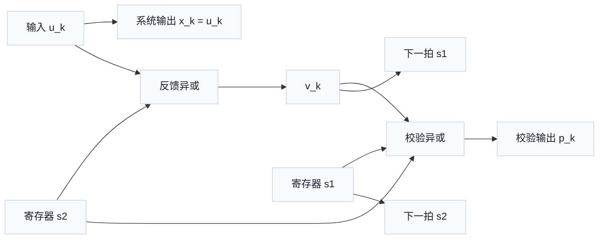
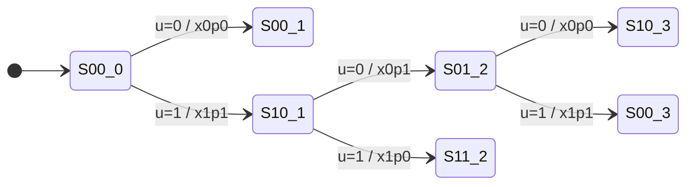
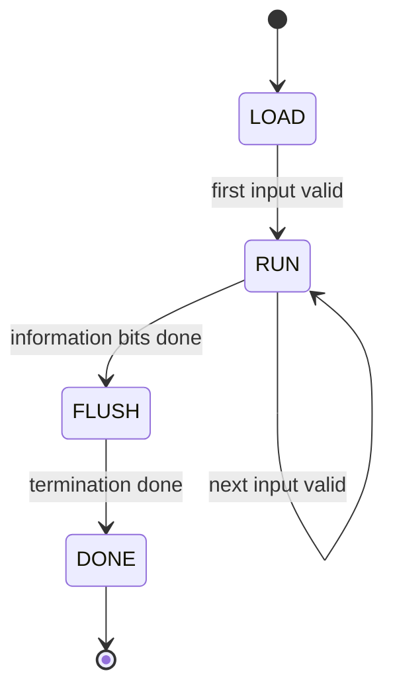

# T6.2 递归系统卷积码基础
## 本节学习目标

本节讲递归系统卷积码（Recursive Systematic Convolutional code, RSC）。RSC 是理解 LTE Turbo的最小结构单元：Turbo 编码器不是一个神秘的大公式，而是两个 RSC 组成编码器、一个内部交织器和网格终止规则组合起来的并行级联卷积码。

学完本节后，应能做到：

- 解释“系统”“卷积”“递归”三个词在 RSC 中分别表示什么。
- 用移位寄存器状态手算一个玩具 RSC 的下一状态和校验比特。
- 画出状态转移和网格图，理解译码器为何沿网格寻找最可信路径。
- 把玩具 RSC 的概念连接到 TS 36.212 Rel-19 `36212-j30` §5.1.3.2.1 中两个 8 状态组成编码器。
- 说明 RSC 对对数似然比、循环冗余校验、寄存器传输级和专用集成电路实现的直接影响。

如果只记住一句话：RSC 每输入一个信息比特，就原样输出一个系统比特，同时根据当前输入和寄存器记忆输出一个校验比特；“递归”让当前输入会通过反馈影响未来多个校验比特，这正是 Turbo 迭代译码能够积累约束的基础。

## 前置知识检查

| 前置项 | 本节需要达到的程度 |
|:---|:---|
| 二进制异或 | 知道 $1\oplus1=0$、$1\oplus0=1$。 |
| 移位寄存器 | 能理解每输入一个比特，寄存器内容向后移动一格。 |
| 状态机 | 知道状态表示“过去信息的压缩记忆”。 |
| LLR | 知道它是软信息，不是硬判决。 |
| Turbo 码 | 知道 LTE Turbo 编码器由两个组成编码器构成，本节解释组成编码器的基础。 |

本节只用二进制域运算。二进制域中加法就是异或，乘法就是与。为了避免抽象过早，后文先用一个 2 个寄存器的玩具 RSC 手算，再连接到 LTE 的 8 状态组成编码器。

## 资料与协议边界

RSC 的数学定义本身属于编码理论背景；LTE 对具体 Turbo 编码器结构给出协议规定。协议定位如下：

| 协议位置 | 本地证据路径 |
| :--- | :--- |
| TS 36.212 Rel-19 `36212-j30` §5.1.3 | `3GPP_Rel19/processed/TS_36.212_36212-j30/content.md` lines 683-703 |
| TS 36.212 Rel-19 `36212-j30` §5.1.3.2.1 | `sections.jsonl` paragraph 403，`content.md` lines 721-745 |
| TS 36.212 Rel-19 `36212-j30` Figure 5.1.3-2 | Word XML 邻近段落和 relationship `rId87 -> media/image79.wmf` |

边界也要说清：TS 36.212 没有把 RSC 教材式推导展开给读者，它直接规定 LTE Turbo 编码器结构。下面的玩具 RSC 是教学模型，不是 LTE 合法编码器；任何用玩具模型得到的输出序列都不能当作协议测试向量。

## RSC 名称和工程动机

“系统”表示输入信息比特会原样成为输出的一路。若输入为 $u_k$，系统输出就是：

$$
x_k=u_k
\tag{1}
$$

式 (1) 回答“系统码为什么叫系统”。系统路让接收端直接看到每个信息位的软证据；校验路提供额外约束。若系统路很可靠，译码器可少依赖校验；若系统路受噪声影响，校验路和递归记忆能帮助修正。

“卷积”表示当前输出不只由当前输入决定，还由过去若干输入决定。移位寄存器保存的过去比特就像一个短记忆。若有 $m$ 个寄存器，状态数量为：

$$
N_{\mathrm{state}}=2^m
\tag{2}
$$

式 (2) 回答“为什么 LTE 组成编码器叫 8 状态”。8 状态意味着 $2^3=8$，也就是有 3 个记忆寄存器。状态越多，记忆越长，约束越强，但译码复杂度和硬件存储也越大。

“递归”表示编码器有反馈。当前输入先和某些寄存器内容异或，形成反馈后的内部输入，再进入寄存器和校验计算。反馈让一个输入错误的影响在后续多个时刻继续出现，从而把短突发错误扩散到更长的校验模式中。Turbo 码再用交织器打散位置，使两个组成编码器看到不同的错误排列。

## 玩具 RSC 结构

为了手算，先用 2 个寄存器的玩具 RSC。它不是 LTE 结构，只用于理解状态和校验。设两个寄存器为 $s_{1,k}$、$s_{2,k}$，输入为 $u_k$。定义反馈内部比特：

$$
v_k=u_k\oplus s_{2,k}
\tag{3}
$$

式 (3) 回答“递归反馈怎样改变当前进入寄存器的值”。若 $s_{2,k}=0$，则 $v_k=u_k$；若 $s_{2,k}=1$，则 $v_k$ 与 $u_k$ 相反。

定义校验比特：

$$
p_k=v_k\oplus s_{1,k}\oplus s_{2,k}
\tag{4}
$$

式 (4) 回答“校验比特怎样把当前和历史信息混合”。它不是简单重复输入，而是当前内部比特和两个记忆比特的异或。

定义状态更新：

$$
s_{2,k+1}=s_{1,k},\quad s_{1,k+1}=v_k
\tag{5}
$$

式 (5) 回答“移位寄存器怎样进入下一拍”。新的第一个寄存器保存 $v_k$，旧的第一个寄存器移动到第二个寄存器。



## 手算例子：四个输入比特的编码过程

设初始状态为 $(s_{1,0},s_{2,0})=(0,0)$，输入序列为：

$$
\mathbf{u}=[1,0,1,1]
\tag{6}
$$

逐拍计算如下：

| 时刻 $k$ | 状态 $(s_{1,k},s_{2,k})$ | 输入 $u_k$ | $v_k=u_k\oplus s_{2,k}$ | 系统 $x_k$ | 校验 $p_k$ | 下一状态 |
|---:|:---:|---:|---:|---:|---:|:---:|
| 0 | (0,0) | 1 | 1 | 1 | 1 | (1,0) |
| 1 | (1,0) | 0 | 0 | 0 | 1 | (0,1) |
| 2 | (0,1) | 1 | 0 | 1 | 1 | (0,0) |
| 3 | (0,0) | 1 | 1 | 1 | 1 | (1,0) |

因此系统输出是：

$$
\mathbf{x}=[1,0,1,1]
\tag{7}
$$

校验输出是：

$$
\mathbf{p}=[1,1,1,1]
\tag{8}
$$

这个例子展示了系统路和校验路的不同职责。系统路保留输入本身，校验路提供跨时间的约束。注意 $k=1$ 时输入 $u_1=0$，但校验 $p_1=1$，因为历史状态 $(1,0)$ 参与了校验。

## 状态转移和网格图

2 个寄存器有 4 个状态：00、01、10、11。每个状态面对输入 0 或 1 都有一条转移边。对上面的玩具 RSC，可列出状态转移表：

| 当前状态 | 输入 0 后的输出 $(x,p)$ 和下一状态 | 输入 1 后的输出 $(x,p)$ 和下一状态 |
|:---:|:---|:---|
| 00 | $(0,0)\rightarrow00$ | $(1,1)\rightarrow10$ |
| 01 | $(0,0)\rightarrow10$ | $(1,1)\rightarrow00$ |
| 10 | $(0,1)\rightarrow01$ | $(1,0)\rightarrow11$ |
| 11 | $(0,1)\rightarrow11$ | $(1,0)\rightarrow01$ |

网格图把这张表按时间展开。每一列是一个时刻，每个节点是一个状态，边表示输入和输出。译码器收到带噪声的系统 LLR 和校验 LLR 后，会评估每条边的可信度，然后在网格上累积路径度量。



这个 Mermaid 图只画了部分路径，用于显示“状态随时间展开”的直觉。完整网格每个状态每拍都有两条出边。后续 Log-MAP 会在这样的网格上计算前向度量、后向度量和每个比特的后验 LLR。

## 生成多项式的直觉

卷积码常用生成多项式描述抽头。对零基础读者，可以先把多项式看成“哪些寄存器参与异或”的清单。若写成：

$$
g(D)=1+D+D^2
\tag{9}
$$

其中 $D$ 代表延迟一拍，$D^2$ 代表延迟两拍。式 (9) 表示当前值、延迟一拍值、延迟两拍值都参与异或。若某项不存在，例如 $1+D^2$，就表示延迟一拍的寄存器不参与。

RSC 与普通前馈卷积码的差别是还有反馈多项式。可以抽象为：

$$
G(D)=\left[1,\frac{g_p(D)}{g_f(D)}\right]
\tag{10}
$$

式 (10) 回答“RSC 的系统路和校验路怎样同时表示”。方括号里的 1 表示系统输出原样保留输入；分式表示校验路由前馈多项式 $g_p(D)$ 和反馈多项式 $g_f(D)$ 共同决定。分式不是普通实数除法，而是二进制多项式意义下的递归滤波表示。

## 接收端视角下的 RSC 约束

接收端看到的不是编码器状态，而是每个时刻的系统 LLR 和校验 LLR。对于某条网格边，假设该边预测系统比特为 $x_k$、校验比特为 $p_k$。若接收机约定正 LLR 支持 0、负 LLR 支持 1，则该边的简单硬件友好度量可以写成：

$$
\gamma_k = (1-2x_k)L^{(x)}_k + (1-2p_k)L^{(p)}_k
\tag{11}
$$

式 (11) 回答“某条边与接收软信息有多一致”。当预测比特为 0 时，系数 $1-2b=1$，正 LLR 增加度量；当预测比特为 1 时，系数 $1-2b=-1$，负 LLR 增加度量。这个度量是教学化简，完整 MAP 译码还要加先验信息和归一化处理。

若只有系统路，译码器只能逐位看 $L^{(x)}_k$。有了 RSC 校验路，译码器还能问：“某个输入序列在状态机上能否产生收到的校验模式？”这就是网格译码的核心。

## LTE Turbo 的连接

TS 36.212 Rel-19 `36212-j30` §5.1.3.2.1 规定 LTE Turbo 编码器是 Parallel Concatenated Convolutional Code，中文可译为并行级联卷积码（Parallel Concatenated Convolutional Code, PCCC）。它包含两个 8 状态组成编码器和一个 Turbo 内部交织器，编码率为 1/3。

把本节玩具 RSC 映射到 LTE 时，需要替换三件事：

| 玩具 RSC | LTE Turbo 组成编码器 |
|:---|:---|
| 2 个寄存器，4 状态 | 3 个寄存器，8 状态 |
| 人工定义的反馈和校验抽头 | Figure 5.1.3-2 中规定的反馈和校验连接 |
| 单个编码器 | 两个组成编码器并行工作，第二个编码器输入为内部交织后的比特 |

LTE Turbo 输出三路：系统路、第一组成编码器校验路、第二组成编码器校验路。接收端也要恢复三路 LLR 后才能进行迭代译码。

## 算法伪代码

玩具 RSC 编码伪代码如下：

```text
state s1 = 0
state s2 = 0
for each input bit u[k]:
    v = u[k] xor s2
    x[k] = u[k]
    p[k] = v xor s1 xor s2
    next_s2 = s1
    next_s1 = v
    s1 = next_s1
    s2 = next_s2
```

对应的接收端网格准备伪代码如下：

```text
for each time k:
    for each state s:
        for each candidate input u in {0, 1}:
            compute predicted systematic bit x
            compute predicted parity bit p
            compute next state s_next
            compute branch metric from systematic and parity LLRs
            store edge (k, s, u, s_next, metric)
```

这段伪代码的时间复杂度为 $O(K\cdot2^m\cdot2)$，其中 $K$ 是输入长度，$m$ 是寄存器个数。LTE 组成编码器 $m=3$，每个时刻有 8 个状态、每个状态 2 条候选边，这是 Turbo 译码器硬件规模的基础。

## 浮点仿真

本节建议的浮点仿真只验证玩具 RSC 状态转移，不生成 LTE 协议向量。

| 项目 | 建议值 |
|:---|:---|
| 依赖 | Python 3 标准库。 |
| 随机种子 | `20260620`。 |
| 输入 | 固定序列 `[1,0,1,1]` 和若干随机比特序列。 |
| 输出 | 系统比特、校验比特、状态轨迹、状态转移表。 |
| 验收阈值 | 固定序列输出必须等于式 (7)、式 (8)；所有状态转移落在合法状态集合。 |

可复现实验命令建议为：

```text
python3 tools/rsc_toy_trace.py --seed 20260620 --input 1011
```

本次任务只编写讲义，不新增脚本。后续若实现脚本，应把每个寄存器更新步骤打印成表格，便于与本节手算例子逐行对比。

## 定点化策略

RSC 编码本身是二进制逻辑，不需要定点数；定点问题出现在 RSC 对应的软输入软输出译码器。分支度量、前向度量、后向度量和外信息都可能使用定点表示。

定点化需要关注：

| 对象 | 定点风险 | 工程建议 |
|:---|:---|:---|
| 分支度量 $\gamma_k$ | 多个 LLR 相加后溢出 | 使用比输入 LLR 更宽的内部位宽。 |
| 路径度量 | 随 $K$ 累积变大 | 每拍归一化或减去最大值。 |
| 外信息 | 迭代中正反馈过强 | 加缩放、裁剪和饱和检查。 |
| 状态索引 | 状态编码错误 | 使用断言覆盖全部 $2^m$ 状态。 |

以式 (11) 为例，若系统和校验 LLR 都是 6 bit 定点数，两个数相加可能需要 7 bit 才不溢出。若还加入先验项，内部位宽应继续增加。位宽不是协议字段，但它决定译码性能和硬件面积。

## RTL/ASIC 架构映射

玩具 RSC 的编码器硬件很小，只需要异或门和触发器；真正占面积的是对应的软输入软输出译码器。硬件结构可以拆成：

| 结构 | 功能 | LTE 影响 |
|:---|:---|:---|
| 状态转移表 | 保存每个状态和输入对应的下一状态、系统比特、校验比特 | 8 状态每拍 16 条边，可硬编码。 |
| 分支度量单元 | 根据 LLR 和候选边输出计算度量 | 需要符号翻转、加法和饱和。 |
| 前向/后向度量存储 | 保存网格路径概率或近似度量 | 决定存储容量和访问带宽。 |
| 外信息存储 | 保存迭代间交换的信息 | 需要和内部交织地址生成器配合。 |

编码器状态更新可以用状态机描述：



这里的 FLUSH 对应网格终止概念，LTE 具体终止规则在 [[T6.3_LTE_Turbo_encoder_trellis_termination|T6.3]] 讲解。本节只强调 RSC 有状态，因此必须处理编码结束时状态如何收尾；否则译码器不知道最后几拍的边界条件。

## 验证方法

验证 RSC 基础模块时，不应一上来跑随机大规模仿真。推荐三层验证：

| 层级 | 验证对象 | 验收 |
|:---|:---|:---|
| 手算向量 | `[1,0,1,1]` | 输出和状态轨迹与表格一致。 |
| 穷举状态 | 4 状态或 8 状态全部输入 0/1 | 下一状态合法且转移表无缺项。 |
| 软度量符号 | 给定正负 LLR 和候选边 | 预测比特与 LLR 越一致，分支度量越高。 |

代表性用例 1：初始状态全零、输入 `1011`。输出为系统 `1011`、校验 `1111`、最终状态 `10`。边界条件是无终止比特。验证方式是逐拍断言。失败案例是先移位后计算校验，导致全部校验错位。

代表性用例 2：穷举所有 4 个状态和输入 0/1。输出为 8 条转移边。边界条件是状态编码顺序必须固定。验证方式是转移表对比。失败案例是把状态 `(s1,s2)` 写成 `(s2,s1)`，导致网格边连接错误。

## 常见错误

| 错误 | 根因 | 后果 |
|:---|:---|:---|
| 把系统码理解为只输出原始比特 | 忽略校验路 | 无法解释 Turbo 的纠错能力。 |
| 把递归理解为软件函数递归调用 | 术语误解 | 看不懂反馈寄存器。 |
| 先更新寄存器再算校验 | 时序顺序错误 | 输出比特整体不匹配。 |
| 状态位顺序不固定 | 文档和代码约定不一致 | 译码器转移表错位。 |
| 把玩具 RSC 当 LTE 向量 | 教学模型和协议模型混淆 | 协议一致性测试必然失败。 |

## 自测题

1. RSC 中“系统”二字表示什么？
2. 2 个寄存器的玩具 RSC 有多少个状态？LTE 8 状态组成编码器对应多少个寄存器？
3. 给定状态 $(s_1,s_2)=(1,0)$ 和输入 $u=1$，按本节玩具模型计算 $v$、$p$ 和下一状态。
4. 接收端为什么需要网格图，而不是只看每个比特的 LLR 符号？

## 自测题参考答案

1. 表示输入信息比特原样作为一路输出，系统输出 $x_k=u_k$。
2. 2 个寄存器有 $2^2=4$ 个状态。LTE 8 状态表示 $2^3=8$，对应 3 个寄存器。
3. $v=1\oplus0=1$，$p=1\oplus1\oplus0=0$，下一状态为 $(1,1)$。
4. 因为 RSC 校验比特把当前和历史输入连接成跨时间约束。网格图能同时利用系统 LLR、校验 LLR 和状态转移合法性，逐位符号判断无法利用这些约束。
## 执行与证据记录

| 项目 | 记录 |
|:---|:---|
| 本地协议 | `3GPP_Rel19/specs/36212-j30.docx`，`3GPP_Rel19/processed/TS_36.212_36212-j30/source.docx`。 |
| 抽取证据 | `content.md` lines 683-745，`sections.jsonl` paragraph 380、403。 |
| 图证据 | Figure 5.1.3-2 通过 Word XML 邻近段落和 relationship `rId87 -> media/image79.wmf` 定位；[[T6.3_LTE_Turbo_encoder_trellis_termination|T6.3]] 已重建为 `docs/L2_协议算法/assets/T6.3_TS36.212_Figure_5.1.3-2_turbo_encoder_rebuild.svg`（手绘 SVG，替代原 PIL 渲染 PNG 与 `tools/archive_python_drawing/figures/render_lte_turbo_encoder_structure.py`），本节保留玩具 RSC 图用于理论入门。 |
| 教学模型声明 | 本节 2 寄存器 RSC 是非 LTE 玩具例子，仅用于手算状态转移。 |
| 审计计划 | 完稿后运行术语、标题、深度和 LaTeX 渲染审计。 |

## 协议证据表

| 结论 | TS 36.212 Rel-19 `36212-j30` 证据 | 本地路径 |
|:---|:---|:---|
| Turbo 编码是 TS 36.212 信道编码方案之一 | §5.1.3 | `content.md` lines 683-699 |
| Turbo 编码输出流索引为 0、1、2 | §5.1.3 | `content.md` lines 697-699 |
| Turbo 编码器编码率为 1/3 | §5.1.3.2.1 | `content.md` lines 721-737 |
| Turbo 编码器为 PCCC，含两个 8 状态组成编码器和内部交织器 | §5.1.3.2.1，Figure 5.1.3-2 | `sections.jsonl` paragraph 403，`media/image79.wmf`；[[T6.3_LTE_Turbo_encoder_trellis_termination|T6.3]] 本地重建图 `docs/L2_协议算法/assets/T6.3_TS36.212_Figure_5.1.3-2_turbo_encoder_rebuild.svg` |
| 第二组成编码器输入来自 Turbo 内部交织器输出 | §5.1.3.2.1 | `content.md` lines 743-745 |

## 参考文献

- [3GPP, 2026] 3GPP TS 36.212 V19.3.0, `36212-j30`, "E-UTRA; Multiplexing and channel coding", Release 19, March 2026.
- [Bahl, 1974] L. R. Bahl, J. Cocke, F. Jelinek, and J. Raviv, "Optimal decoding of linear codes for minimizing symbol error rate", IEEE Transactions on Information Theory, 1974.
- [Berrou, 1993] C. Berrou, A. Glavieux, and P. Thitimajshima, "Near Shannon limit error-correcting coding and decoding: Turbo-codes", IEEE International Conference on Communications, 1993.
