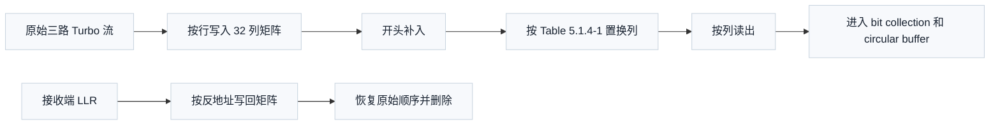

# T7.2 LTE 子块解交织器与循环缓存
## 本节学习目标

本节学习 LTE Turbo（Turbo 码，Turbo Code）速率匹配中的子块交织器，以及接收端如何做子块解交织。子块交织器可以理解为一个“先按行写入、再换列、最后按列读出”的重排器。它不改变每个比特的值，只改变比特出现的位置。这样做的工程目的，是把相邻编码比特分散到不同发送位置，降低连续信道错误对译码器的集中打击。

本节还要讲清三个容易混淆的“空”：

| 名称 | 所在阶段 | 接收端语义 |
|:---|:---|:---|
| 分段 filler | 码块分段和 Turbo 编码输入侧 | 属于码块构造占位，和后续循环冗余校验关系由分段规则决定。 |
| 子块交织 `<NULL>` | 子块交织矩阵补齐阶段 | 只为填满交织矩阵，不是业务 0，输出和抽取时应跳过或删除。 |
| 未接收对数似然比 | 速率匹配打孔或 RV（冗余版本，Redundancy Version）未覆盖位置 | LLR（对数似然比，Log-Likelihood Ratio）未知/擦除软信息，不是硬填 0。 |

学完后应能做到：

- 解释 32 列置换表中每个数字的含义。
- 手算一个小矩阵的交织和解交织。
- 说明 `<NULL>` 只属于子块交织矩阵填充，不是业务 0。
- 把循环缓存地址映射回系统流、第一校验流和第二校验流。
- 说明列置换表用错后会产生怎样的接收端失败。

## 前置知识检查

| 前置项 | 本节需要达到的程度 |
|:---|:---|
| 矩阵行列 | 能理解第几行第几列。 |
| 置换 | 知道它是重新排列，不改变元素本身。 |
| LLR | 知道它是接收端软信息。 |
| 解速率匹配 | 知道收到的 LLR 要先放回循环缓存。 |
| 混合自动重传请求 | HARQ（混合自动重传请求，Hybrid Automatic Repeat Request）在本节只作为软缓存背景，详细合并见 [[T7.3_LTE_HARQ_soft_buffer_RV|T7.3]]。 |

如果只记住一句话：子块解交织不是“猜比特”，而是按照发送端矩阵写入、列置换、列读出的反方向，把软信息放回原始顺序；矩阵补齐的 `<NULL>` 必须被识别为结构空洞。

## 资料与协议边界

本节依据 TS 36.212 Rel-19 `36212-j30` §5.1.4.1.1 和 Table 5.1.4-1。协议文本规定 sub-block interleaver 的输入为长度 $D$ 的比特序列，矩阵列数为 32，行数取能容纳输入长度的最小整数；若矩阵容量大于 $D$，前面补入 `<NULL>`；随后按 Table 5.1.4-1 执行列间置换，再按列读出。

| 协议对象 | 本地路径 |
| :--- | :--- |
| TS 36.212 Rel-19 §5.1.4.1.1 | `3GPP_Rel19/processed/TS_36.212_36212-j30/content.md` 段落 791-815 |
| TS 36.212 Rel-19 Table 5.1.4-1 | `3GPP_Rel19/processed/TS_36.212_36212-j30/tables/table_0010.csv`、`table_0010.html` |
| TS 36.212 Rel-19 §5.1.4.1.2 | `3GPP_Rel19/processed/TS_36.212_36212-j30/content.md` 段落 817-965 |

协议边界：TS 36.212 规定比特重排和 `<NULL>` 跳过规则；接收机内部怎样存储 `null_mask`、怎样并行读取、怎样组织静态随机存取存储器、寄存器传输级状态机和专用集成电路实现，是实现选择，但必须保持 bit-exact 地址关系。

## 子块交织器的结构

子块交织器有四个动作：

1. 固定矩阵列数为 32。
2. 计算行数，使矩阵总格子数至少能放下输入序列。
3. 若格子数多于输入比特数，在矩阵开头补 `<NULL>`，再把实际比特按行写入。
4. 按协议置换列，然后按列读出。

这个流程可用接收端视角重建：



接收端不需要把 `<NULL>` 当成一个可译码的比特。它只需要知道哪些输出位置来自 `<NULL>`，在 rate matching 抽取和 deinterleaving 时跳过这些位置。

## 32 列置换表的含义

TS 36.212 Rel-19 Table 5.1.4-1 给出列数为 32 时的 inter-column permutation pattern。协议文字说明 $P(j)$ 是第 $j$ 个置换后列对应的原始列位置。换言之，置换后矩阵的第 $j$ 列，来自置换前矩阵的第 $P(j)$ 列。

正文复现如下：

| 置换后列 $j$ | 0 | 1 | 2 | 3 | 4 | 5 | 6 | 7 | 8 | 9 | 10 | 11 | 12 | 13 | 14 | 15 |
|---:|---:|---:|---:|---:|---:|---:|---:|---:|---:|---:|---:|---:|---:|---:|---:|---:|
| 原始列 $P(j)$ | 0 | 16 | 8 | 24 | 4 | 20 | 12 | 28 | 2 | 18 | 10 | 26 | 6 | 22 | 14 | 30 |

| 置换后列 $j$ | 16 | 17 | 18 | 19 | 20 | 21 | 22 | 23 | 24 | 25 | 26 | 27 | 28 | 29 | 30 | 31 |
|---:|---:|---:|---:|---:|---:|---:|---:|---:|---:|---:|---:|---:|---:|---:|---:|---:|
| 原始列 $P(j)$ | 1 | 17 | 9 | 25 | 5 | 21 | 13 | 29 | 3 | 19 | 11 | 27 | 7 | 23 | 15 | 31 |

例如 $P(1)=16$，含义不是“原始第 1 列放到第 16 列”，而是“置换后第 1 列来自原始第 16 列”。接收端构造反置换时要小心方向。若记反了，所有列读出顺序都会错，后续 Turbo 译码器的校验关系被破坏。

## 数学定义与推导

设输入序列长度为 $D$，列数为 $C_{\mathrm{sub}}=32$。行数选择为：

$$
R_{\mathrm{sub}}=\left\lceil\frac{D}{C_{\mathrm{sub}}}\right\rceil
\tag{1}
$$

式 (1) 回答“需要多少行才能放下输入”。矩阵容量为：

$$
K_{\Pi}=R_{\mathrm{sub}}C_{\mathrm{sub}}
\tag{2}
$$

式 (2) 是 3GPP LTE Turbo 子块交织里的规范长度。规范和很多实现笔记里常写成 $K_{\Pi}$，工程文本里也常被键入成 `K_pi`。它表示**单一路 Turbo 编码流经过子块交织后的长度**，等于矩阵总格子数，因此包含 `<NULL>` 补位位置。

由式 (2) 可直接推出 `K_pi` 的一个常用性质：**$K_{\Pi}$ 恒为 32 的倍数**。因为矩阵列数固定为 $C_{\mathrm{sub}}=32$，行数 $R_{\mathrm{sub}}$ 是正整数，所以 $K_{\Pi}=32R_{\mathrm{sub}}$ 必能被 32 整除。例如 $D=44$ 时 $R_{\mathrm{sub}}=2$，$K_{\Pi}=64=2\times32$（见 [[T6.8_LTE_Turbo_decoder_numeric_walkthrough|T6.8]] 数值例）。注意不要把 `K_pi` 和 Turbo **内部交织器**长度 $K$（TS 36.212 Table 5.1.3-3）混为一谈：$K$ 是编码器/内部交织器输入长度，取值 40–6144、步长 8/16/32/64，只保证 8 的倍数（如 $K=40$、$K=56$ 都不是 32 的倍数）；`K_pi` 是速率匹配侧子块交织输出长度，两者是不同层的量。

需要补入的 `<NULL>` 数量为：

$$
N_{\mathrm{D}}=K_{\Pi}-D
\tag{3}
$$

式 (3) 中的 $N_{\mathrm{D}}$ 不是数据长度，也不是业务 0 数量，而是矩阵为了凑齐完整行列所需的结构占位数量。发送端把 `<NULL>` 放在写入序列的前部，然后按行写入矩阵。

按行写入时，线性位置 $n$ 对应矩阵位置：

$$
r=\left\lfloor\frac{n}{C_{\mathrm{sub}}}\right\rfloor,\quad c=n\bmod C_{\mathrm{sub}}
\tag{4}
$$

列置换后，第 $j$ 个输出列来自原始列 $P(j)$。按列读出时，置换后线性输出次序可描述为：

$$
v[q]=M_{\mathrm{orig}}\left[q\bmod R_{\mathrm{sub}},\ P\left(\left\lfloor\frac{q}{R_{\mathrm{sub}}}\right\rfloor\right)\right]
\tag{5}
$$

式 (5) 的作用是把“按列读出”翻译成地址公式。$q$ 是交织输出序号，$q\bmod R_{\mathrm{sub}}$ 给出行号，$\lfloor q/R_{\mathrm{sub}}\rfloor$ 给出置换后列号，再用 $P(\cdot)$ 找到原始列。

接收端解交织要反过来：已知输出序号 $q$ 的 LLR，先算出它来自原始矩阵的哪一格，再把 LLR 写回该格。最后按行读出，并删除前 $N_{\mathrm{D}}$ 个 `<NULL>` 位置。

## 校验位、系统位与 $K_{\Pi}$

LTE Turbo 编码器输出三路码流：一路系统位流和两路校验位流。这里的“校验位”指 Turbo parity bits，也就是两个组成编码器产生的冗余比特；它们不是 CRC（循环冗余校验，Cyclic Redundancy Check）parity bits。CRC parity bits 用于 TB（传输块，Transport Block）/CB（码块，Code Block）级检错，Turbo 校验位则是后续迭代译码要直接使用的两路软输入。

对每一路 Turbo 流，子块交织器都使用相同的 32 列规则和同一个长度定义，所以三路交织输出各自的长度都是 $K_{\Pi}$：

| 流 | 含义 | 子块交织后长度 | 接收端用途 |
|:---|:---|:---:|:---|
| 系统位流 | 原始信息位顺序对应的编码输出 | $K_{\Pi}$ | 为 Turbo 译码器提供 systematic LLR。 |
| 第一校验位流 | 第一组成编码器产生的 parity stream | $K_{\Pi}$ | 为第一个 SISO（软入软出，Soft-Input Soft-Output）/trellis 视角提供校验约束。 |
| 第二校验位流 | 第二组成编码器产生的 parity stream | $K_{\Pi}$ | 为交织视角提供另一组校验约束。 |

TS 36.212 §5.1.4.1.2 再把这三路交织结果做 bit collection。教学上可以记成完整 circular buffer 的长度为：

$$
K_w=3K_{\Pi}
\tag{6}
$$

式 (6) 很重要，因为它解释了 `K_pi` 和循环缓存长度不是同一个量。`K_pi` 是每一路子块交织后的长度；$K_w$ 是系统位和两路校验位全部收集后的总长度。若实现把 $K_{\Pi}$ 误当成整个 circular buffer 长度，就会漏掉两路校验位；若把 $K_w$ 误当成单一路长度，拆流和解交织都会错位。

## 数值例子：小矩阵交织与反交织

这是教学例子，为了手算把列数改成 4，不是规范 LTE 的 32 列矩阵。设输入为 6 个比特标签：

```text
x0 x1 x2 x3 x4 x5
```

矩阵列数 $C=4$，行数 $R=\lceil 6/4\rceil=2$，容量为 8，需要两个 `<NULL>`。写入序列为：

```text
<NULL> <NULL> x0 x1 x2 x3 x4 x5
```

按行写入矩阵：

| 行/列 | 0 | 1 | 2 | 3 |
|:---:|:---:|:---:|:---:|:---:|
| 0 | `<NULL>` | `<NULL>` | `x0` | `x1` |
| 1 | `x2` | `x3` | `x4` | `x5` |

假设教学置换为 $P=[0,2,1,3]$，即置换后第 0 列来自原始 0 列，第 1 列来自原始 2 列，第 2 列来自原始 1 列，第 3 列来自原始 3 列。置换后矩阵为：

| 行/列 | 0 | 1 | 2 | 3 |
|:---:|:---:|:---:|:---:|:---:|
| 0 | `<NULL>` | `x0` | `<NULL>` | `x1` |
| 1 | `x2` | `x4` | `x3` | `x5` |

按列读出得到：

```text
<NULL>, x2, x0, x4, <NULL>, x3, x1, x5
```

发送端后续抽取时会跳过 `<NULL>`。若接收端收回交织输出位置的 LLR，例如：

```text
v = [N, +2.0, -1.0, +0.5, N, -2.5, +1.5, +3.0]
```

其中 `N` 表示 `<NULL>`，接收端按输出序号写回原始矩阵位置：

| 输出序号 | 值 | 原始矩阵位置 | 说明 |
|---:|:---:|:---:|:---|
| 0 | N | (0,0) | `<NULL>`，删除 |
| 1 | +2.0 | (1,0) | `x2` |
| 2 | -1.0 | (0,2) | `x0` |
| 3 | +0.5 | (1,2) | `x4` |
| 4 | N | (0,1) | `<NULL>`，删除 |
| 5 | -2.5 | (1,1) | `x3` |
| 6 | +1.5 | (0,3) | `x1` |
| 7 | +3.0 | (1,3) | `x5` |

按原矩阵行读出并删除前两个 `<NULL>` 后，恢复为：

```text
x0=-1.0, x1=+1.5, x2=+2.0, x3=-2.5, x4=+0.5, x5=+3.0
```

这就是子块解交织的本质：恢复顺序，不改变 LLR 数值语义。

## 三种空洞的工程对比

| 空洞类型 | 协议位置 | 是否业务 0 | 是否进入 Turbo 译码软输入 | 接收端处理 |
|:---|:---|:---:|:---:|:---|
| 分段 filler | CB segmentation 和 Turbo encoder 输入侧 | 否 | 相关位置按分段/编码规则处理 | 后续码块重组时删除或按协议约束解释。 |
| `<NULL>` | §5.1.4.1.1 sub-block interleaver 矩阵补齐 | 否 | 否 | 生成 null mask，rate matching 抽取时跳过，解交织后删除。 |
| 未接收 LLR | §5.1.4.1.2 bit selection 或 HARQ RV 未覆盖 | 否 | 是，以未知软信息形式影响译码 | soft buffer 保持中性 LLR，等待重传或由译码约束推断。 |

最重要的区别是：`<NULL>` 不代表一个编码比特，它只是矩阵占位；未接收 LLR 代表一个真实编码比特的位置，但本次没有观测。前者应删除，后者应保留位置并给中性软信息。

## 循环缓存与三路流拆分

TS 36.212 §5.1.4.1.2 在子块交织输出后生成 circular buffer。教学上可以把循环缓存理解为三段内容的组合：系统流交织结果、第一校验流交织结果、第二校验流交织结果按协议顺序收集，每段长度都是 $K_{\Pi}$，因此完整 circular buffer 长度为 $K_w=3K_{\Pi}$。接收端先在循环缓存域完成 LLR 写回和软合并，再拆回三路流，最后分别执行子块解交织。

拆分时要保留两个掩码：

| 掩码 | 作用 | 错误后果 |
|:---|:---|:---|
| `null_mask` | 标出 `<NULL>` 派生位置 | LLR 错位或消费数量错误。 |
| `valid_rx_mask` | 标出本次或历史传输已观测位置 | 把未知位置当可靠观测。 |

这两个掩码不是同一件事。`null_mask` 是协议结构固定产生的；`valid_rx_mask` 随本次 RV、资源长度和 HARQ 历史变化。

更完整的接收端状态应至少区分四类位置：

| 状态 | 来源 | 是否保留坐标 | Turbo 输入含义 |
|:---|:---|:---:|:---|
| known | 本次或历史 RV 已观测 | 是 | 使用 soft buffer 中累加后的 LLR。 |
| repeated | 同一地址多次观测 | 是 | 使用饱和累加后的 LLR，并记录命中次数。 |
| unknown | 有效编码位但当前未观测 | 是 | 使用中性 LLR，不能删除坐标。 |
| null | 子块交织 `<NULL>` | 否 | 删除或跳过，不能成为 Turbo 输入。 |

这张状态表解释了为什么“循环缓存图里画空格”还不够：unknown 和 null 都可能没有普通接收 LLR，但前者是译码器需要保留的母码坐标，后者是矩阵补齐占位。若把 unknown 删除，三路 Turbo 输入长度会短；若把 null 保留，后续地址会整体偏移。

## 接收端逆流程

```text
输入:
  soft_buf          已完成解速率匹配后的循环缓存 LLR
  stream_layout     系统流、第一校验流、第二校验流的边界
  P[0:31]           Table 5.1.4-1 列置换
  null_count        子块交织补入的 <NULL> 数量

过程:
  for each stream in three Turbo streams:
      1. 取出该 stream 的交织后 LLR 序列
      2. 建立 R_sub x 32 矩阵
      3. 按交织输出序号 q 计算原始矩阵位置
      4. 将 LLR 写回原始矩阵位置
      5. 按行读出
      6. 删除前 null_count 个 <NULL> 位置
      7. 输出原始顺序 LLR 给 Turbo 译码器
```

真实实现会把步骤 2 到 5 优化成地址生成，不一定真的搬动矩阵。只要地址关系和 null 删除语义一致，矩阵只是教学模型。

## 列置换错误失败案例

设前面教学例子中正确置换为 $P=[0,2,1,3]$，工程师误用反方向，把它理解为“原始列 $j$ 去置换后列 $P(j)$”。这个例子恰好部分对称，错误不明显；真实 LTE 32 列表不是随便可逆同形，方向错会让大部分列地址错位。

失败表现通常不是某一个比特翻转，而是整列软信息被送到错误原始位置。Turbo 译码器依赖系统比特和两路校验比特之间的时间关系，列错位会破坏 trellis 约束，导致迭代无法收敛。工程上可能看到：

- 低信噪比下块错误率异常偏高。
- 高信噪比下仍存在 error floor。
- 某些码块长度刚好无需 `<NULL>` 时表现较好，有 `<NULL>` 时明显恶化。
- 不同 `rvidx` 的重传无法带来预期增益。

## 浮点仿真

建议先写两个互逆函数：`subblock_interleave(labels)` 和 `subblock_deinterleave(llrs)`。用标签而不是随机比特开始验证，因为标签能直接暴露地址错误。

验收方式：

```text
输入标签: x0, x1, ..., xD-1
前向交织: 得到 v，其中包含 <NULL> 派生位置
反向解交织: 删除 <NULL> 后必须恢复 x0, x1, ..., xD-1
```

然后再把标签换成浮点 LLR，检查数值没有被改变，只是位置改变。随机测试应覆盖 $D<32$、$D=32$、$D=33$、$D$ 接近最大码块长度等边界。

## 定点化策略

子块解交织本身不做加法，也不改变 LLR 位宽。它的定点风险主要来自控制信号：

| 风险 | 说明 | 验证 |
|:---|:---|:---|
| `<NULL>` 写使能错误 | 把无效格子写入 soft buffer 或译码输入。 | 标签仿真中检查输出长度等于 $D$。 |
| 地址位宽不足 | 32 列和多行矩阵地址被截断。 | 最大 $D$ 边界下扫描所有地址。 |
| mask 与数据不同步 | LLR 流水线延迟后 mask 没有同拍延迟。 | RTL（寄存器传输级，Register Transfer Level）仿真中加入随机 stall。 |

未知/擦除 LLR 的中性 0 可以保留到 Turbo 译码输入，但 `<NULL>` 不能作为中性 0 混入输入序列。前者是真实编码位置缺观测，后者不是编码位置。

## RTL/ASIC 架构映射

硬件可以用地址生成器替代真实矩阵。每个输出序号 $q$ 生成一个原始地址 `(row, col)`，再映射为线性地址。若 `linear < null_count`，该位置是 `<NULL>`，不向下游发 valid。否则输出地址为 `linear - null_count`。

| 模块 | 功能 | 关键检查 |
|:---|:---|:---|
| `perm_rom` | 保存 32 个 $P(j)$ | ROM（只读存储器，Read-Only Memory）内容必须等于 Table 5.1.4-1。 |
| `q_to_addr` | 从输出序号生成原始矩阵地址 | 行列除法可用计数器替代。 |
| `null_filter` | 删除 `<NULL>` 派生位置 | valid 与 LLR 同步。 |
| `stream_router` | 三路 Turbo 流选择 | 系统流和校验流边界正确。 |

吞吐较高的设计会并行生成多个地址。并行时要检查多个地址是否落到同一个 SRAM（静态随机存取存储器，Static Random-Access Memory）bank；若发生冲突，需要重排、复制或增加端口。

## 验证方法

| 验证层 | 输入 | 预期 | 失败案例 |
|:---|:---|:---|:---|
| 标签模型 | `x0..xD-1` | 交织后再解交织恢复原顺序 | 列置换方向反。 |
| 浮点 LLR | 随机 LLR，固定种子 | 数值集合不变，顺序恢复 | `<NULL>` 被当成 LLR 消费。 |
| 定点模型 | 边界 LLR 和随机 stall | 位宽不变，valid 同步 | mask 延迟少一拍。 |
| RTL | 最大长度、最小长度、跨行长度 | 地址不越界，输出数量正确 | $D=33$ 时 null_count 算错。 |

## 常见错误

| 错误 | 后果 | 修正 |
|:---|:---|:---|
| 把 $P(j)$ 方向理解反 | 列错位，译码失败 | 使用“置换后列来自原始列”的定义写单元测试。 |
| 把 `<NULL>` 当业务 0 | 输入多出错误软信息 | `<NULL>` 只生成 mask，不生成译码 LLR。 |
| 把 `<NULL>` 和未发送位置合并成一个概念 | 删除真实编码位置或保留结构空洞 | 分别维护 `null_mask` 和 `valid_rx_mask`。 |
| 只测 $D$ 是 32 的倍数 | 漏掉 `<NULL>` 逻辑 | 必测 $D=1,31,32,33,63,64,65$。 |

## 工程思考题

1. 若 $D=33$，32 列矩阵需要几行，补几个 `<NULL>`？
2. Table 5.1.4-1 中 $P(16)=1$ 表示哪个列来自哪个列？
3. 未发送 LLR 和 `<NULL>` 都可能在软件数组里显示为 0，它们的语义差别是什么？
4. 若 RTL 中 `valid` 比 LLR 早一拍，会出现什么数据错位？

## 工程思考题参考答案

1. 需要 $R_{\mathrm{sub}}=\lceil 33/32\rceil=2$ 行，矩阵容量为 $64$，因此需要补 $N_D=64-33=31$ 个 `<NULL>`。这些 `<NULL>` 用于补齐矩阵，不是业务位。
2. $P(16)=1$ 表示置换后第 16 列来自置换前的原始第 1 列。这里的方向是“置换后列索引 -> 原始列索引”，不能反过来理解。
3. 未发送 LLR 对应真实编码位，只是本次没有观测，应保留编码位位置并用 unknown/中性软信息表示；`<NULL>` 是交织矩阵补位，不是编码位，读出时必须跳过。两者数值都可能显示为 0，但 mask 语义完全不同。
4. `valid` 早一拍会让当前 LLR 被标记成前一个位置的有效数据，形成地址与数据错配。后果通常是交织/解交织后 LLR 整体错位，CRC fail 且定位困难。

## 自测题

1. `<NULL>` 是否是业务比特 0？
2. 用 Table 5.1.4-1 说明置换后第 5 列来自原始第几列。
3. 教学 4 列例子中，`x4` 在交织输出序列的第几个位置？
4. 子块解交织后，输出长度应是矩阵容量还是原输入长度 $D$？

## 自测题参考答案

1. 不是。`<NULL>` 是交织矩阵补齐占位，不是编码比特，也不是业务 0。
2. $P(5)=20$，置换后第 5 列来自原始第 20 列。
3. `x4` 在输出序列第 3 个位置，按 0 起始序号是 3。
4. 应是原输入长度 $D$；前面补入的 `<NULL>` 必须删除。
## 执行与证据记录

| 项目 | 记录 |
|:---|:---|
| 写作范围 | 仅 `docs/L2_协议算法/T7.2_LTE_subblock_deinterleaver_circular_buffer.md`。 |
| 协议读取 | 已读取 TS 36.212 Rel-19 `36212-j30` §5.1.4.1.1 和 §5.1.4.1.2 周边文本。 |
| 表格核验 | 已读取 `tables/table_0010.csv` 和 `tables/table_0010.html`，并在正文复现 32 列置换表。 |
| 公式边界 | 协议抽取文本中的部分公式符号缺失；正文使用可审计的教学公式重建矩阵行列和反地址关系。 |
| 审计结果 | T7 全量已通过 `LESSON_TERM_AUDIT_OK`、`MARKDOWN_HEADING_AUDIT_OK`、`LESSON_DEPTH_AUDIT_OK`、`LATEX_RENDER_AUDIT_OK formulas=434`；引用重建审计输出 `REFERENCE_REBUILD_AUDIT_CANDIDATES`，本节已在正文复现 Table 5.1.4-1。 |

## 协议证据表

| 结论 | 协议证据 | 本地证据 |
|:---|:---|:---|
| 子块交织输入长度记为 $D$，矩阵列数为 32 | TS 36.212 Rel-19 `36212-j30` §5.1.4.1.1 | `content.md` 段落 791-805 |
| 矩阵容量不足时补入 `<NULL>` | TS 36.212 Rel-19 `36212-j30` §5.1.4.1.1 | `content.md` 段落 799-803 |
| $K_{\Pi}$（工程中常写作 `K_pi`）是每一路子块交织输出长度，等于 $R_{\mathrm{sub}}C_{\mathrm{sub}}$ | TS 36.212 Rel-19 `36212-j30` §5.1.4.1.1 | `content.md` 段落 791-815；正文按规范语义重建符号。 |
| $P(j)$ 表示第 $j$ 个置换后列的原始列位置 | TS 36.212 Rel-19 `36212-j30` §5.1.4.1.1 | `content.md` 段落 805-807 |
| 输出按列从置换后矩阵读出 | TS 36.212 Rel-19 `36212-j30` §5.1.4.1.1 | `content.md` 段落 807-813 |
| bit collection 使用系统位流和两路校验位流形成 circular buffer | TS 36.212 Rel-19 `36212-j30` §5.1.4.1.2 | `content.md` 段落 817-825 |
| 32 列置换模式为正文复现的序列 | TS 36.212 Rel-19 `36212-j30` Table 5.1.4-1 | `tables/table_0010.csv`、`table_0010.html` |

## 参考文献

- [Berrou, 1993] C. Berrou, A. Glavieux, and P. Thitimajshima, "Near Shannon Limit Error-Correcting Coding and Decoding: Turbo-Codes," IEEE International Conference on Communications, 1993.
- [ETSI, 2026] 3GPP TS 36.212 V19.3.0, "E-UTRA; Multiplexing and channel coding," Release 19, `36212-j30`, §5.1.4.1.1, §5.1.4.1.2, Table 5.1.4-1.
- [Lin, 2004] S. Lin and D. J. Costello, "Error Control Coding," 2nd edition, Pearson, 2004.
