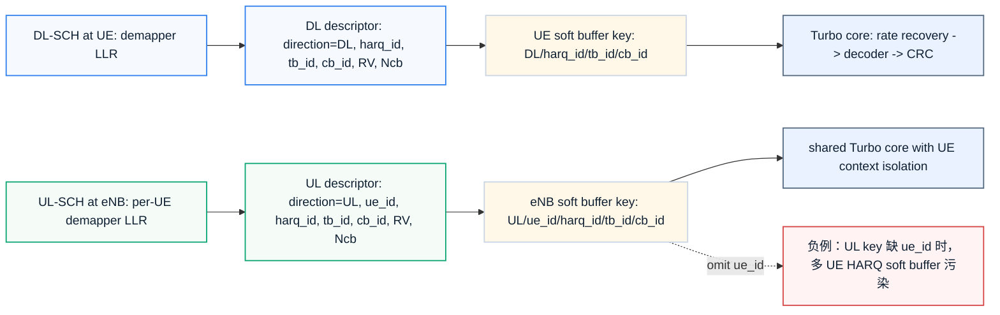
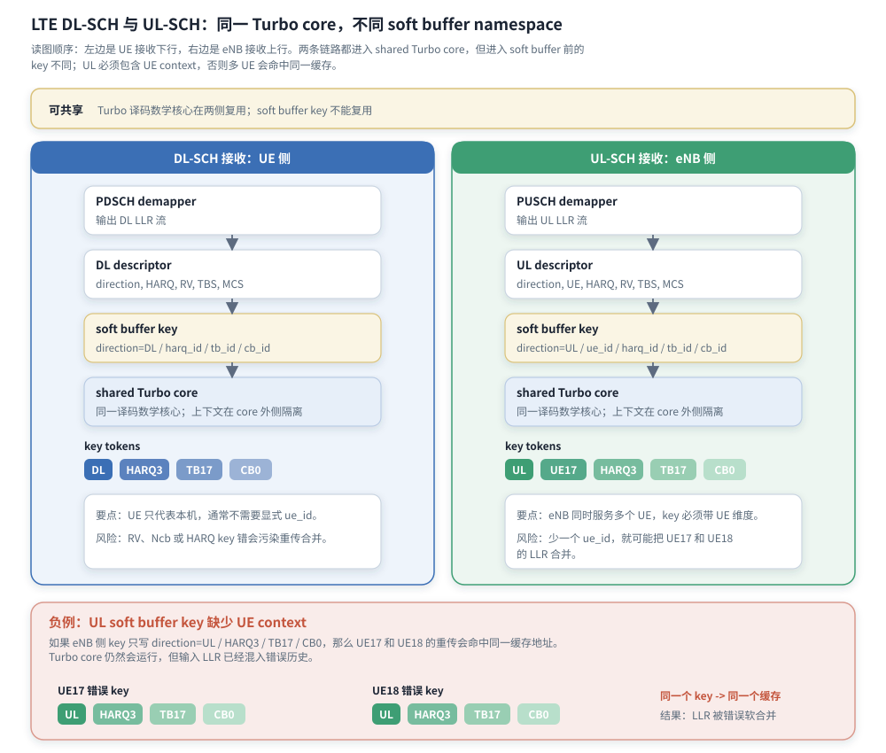

# T7.5 LTE 下行与上行译码差异
## 本节学习目标

本节从接收机视角对比 LTE 下行共享信道与上行共享信道的 Turbo译码差异。这里的重点不是证明“下行有一个 Turbo 算法、上行有另一个 Turbo 算法”，而是讲清同一个 LTE Turbo 译码核心放在不同接收系统中时，协议链路、参数来源、混合自动重传请求上下文、软缓存索引、反馈时限和验证重点如何改变。

本节后文使用以下缩写：传输块、码块、循环冗余校验、对数似然比、调制与编码方案、传输块大小、块错误率、加性白高斯噪声、静态随机存取存储器、寄存器传输级和专用集成电路。


- 指出 TS 36.212 Rel-19 中 UL-SCH 和 DL-SCH 的处理链路位置，并解释它们如何复用通用 CRC、分段、Turbo 编码、速率匹配和码块串接规则。
- 区分“Turbo 核心算法可复用”和“接收端上下文不能混用”。
- 列出 LTE Turbo 译码器从物理层控制、调度上下文和媒体接入控制层/HARQ 状态获得的关键参数。
- 解释 TS 36.213 和 TS 36.321 在本节中为什么作为边界影响译码器，而不展开成调度器设计。
- 设计 DL/UL descriptor、最小 dump 包、错误注入测试和验证 checklist。

## 前置知识检查

| 前置项 | 本节需要达到的程度 |
|:---|:---|
| LTE Turbo 链路 | 知道接收端大体要做解速率匹配、软合并、Turbo 译码、CB CRC、CB 重组和 TB CRC。 |
| DL-SCH/UL-SCH | 知道 DL-SCH 是基站到终端的数据共享信道，UL-SCH 是终端到基站的数据共享信道。 |
| HARQ | 知道 HARQ 用 CRC 成功/失败结果驱动重传，重传软信息需要与旧软信息合并。 |
| LLR | 知道 LLR 是译码器输入软信息，符号和幅度都会影响译码。 |
| MAC/PHY 边界 | 知道调度、HARQ 进程、反馈和资源位置不是 Turbo 核心算法内部产生的。 |

## 资料与协议边界

| 协议位置 | 本地证据 |
| :--- | :--- |
| TS 36.212 Rel-19 `36212-j30` §5.1.1 | `3GPP_Rel19/processed/TS_36.212_36212-j30/content.md` |
| TS 36.212 §5.1.2 | `3GPP_Rel19/processed/TS_36.212_36212-j30/content.md` |
| TS 36.212 §5.1.3.2 | `3GPP_Rel19/processed/TS_36.212_36212-j30/content.md` |
| TS 36.212 §5.1.4.1 | `3GPP_Rel19/processed/TS_36.212_36212-j30/content.md` |
| TS 36.212 §5.1.5 | `3GPP_Rel19/processed/TS_36.212_36212-j30/content.md` |
| TS 36.212 §5.2.2 | `3GPP_Rel19/processed/TS_36.212_36212-j30/content.md` |
| TS 36.212 §5.3.2 | `3GPP_Rel19/processed/TS_36.212_36212-j30/content.md` |
| TS 36.213 Rel-19 §8.3、§8.6、§8.6.1 | `3GPP_Rel19/processed/TS_36.213_36213-j30_s08-s09/content.md` |
| TS 36.321 Rel-19 §4.3.2、§4.4、§5.3.2.1、§5.3.2.2、§5.4.2.1 | `3GPP_Rel19/processed/TS_36.321_36321-j20/content.md` |

协议边界必须明确：TS 36.212 决定 TB 如何附 CRC、如何分段、如何 Turbo 编码、如何速率匹配、如何 CB 串接，因此它直接决定译码器的反向 bit 流程。TS 36.213/36.321 决定很多控制参数和时序背景，例如 HARQ 进程、反馈期限、资源与 MCS/RV 来源；这些会影响译码器 descriptor 和状态机，但本节不把调度器或 MAC HARQ entity 设计写成 Turbo 译码算法。

## 下行与上行的概念来源

“下行”和“上行”是无线链路方向，不是编码算法名称。下行指基站发送、终端接收；上行指终端发送、基站接收。放到 LTE Turbo 译码器里，方向首先决定“译码器运行在哪一端”：

- DL-SCH 译码器运行在用户设备（User Equipment, UE）接收机中，面对的是基站发来的 PDSCH 软信息。
- UL-SCH 译码器运行在演进型基站（evolved NodeB, eNB）接收机中，面对的是 UE 发来的 PUSCH 软信息。

这两个接收机都可以复用 Turbo 译码核心，因为 TS 36.212 的底层分段、Turbo coding、rate matching 和 CB concatenation 机制是共同的。但它们不能简单共用同一套外围上下文：UE 侧通常更受功耗、面积和软缓存大小限制；eNB 侧通常更受多 UE 并发、总吞吐、调度队列和软缓存隔离压力影响。

一个容易犯的错误是把 DL/UL 差异理解成“一个是下行公式，一个是上行公式”。更准确的理解是：共同的数学核心在不同系统边界里被调用，外围 descriptor 和状态管理不同。

## TS 36.212 中的共同骨架

TS 36.212 的 §5.1 提供通用过程：CRC calculation、code block segmentation、channel coding、rate matching 和 code block concatenation。UL-SCH 的 §5.2.2 和 DL-SCH/PCH/MCH 的 §5.3.2 再把这些通用过程组合到具体传输信道中。

从发送端看，UL-SCH 和 DL-SCH 的共同骨架可以写成：

```text
TB CRC attachment
  -> code block segmentation and CB CRC attachment
  -> Turbo channel coding
  -> rate matching for each coded block
  -> code block concatenation
```

从接收端看，译码器要做反向流程：

```text
received LLR stream
  -> code block de-concatenation
  -> de-rate matching and HARQ soft combining
  -> Turbo decoding per CB
  -> CB CRC checking
  -> CB reassembly by r order
  -> TB CRC checking
  -> pass/fail report to upper control
```

这就是“算法核心相似”的协议依据。DL/UL 的差异主要出现在接收端 LLR 来源、控制参数来源、HARQ 进程管理、软缓存索引、反馈或调度后果。

## UL-SCH 协议精读

TS 36.212 §5.2.2 描述 UL-SCH transport channel 的处理结构。协议文本给出的发送端步骤包括 TB CRC attachment、code block segmentation and CB CRC attachment、channel coding、rate matching 和 code block concatenation。§5.2.2.3 明确 code blocks delivered to channel coding，并且每个 code block individually turbo encoded according to §5.1.3.2；§5.2.2.4 又说明 Turbo coded blocks are delivered to the rate matching block，并 individually rate matched according to §5.1.4.1；§5.2.2.5 指向 §5.1.5 的 code block concatenation。

接收端反推时，eNB 对 PUSCH 解调后得到 UL-SCH 的 LLR 流。译码器不能只知道“这是 Turbo LLR”，还必须知道这个 LLR 流属于哪个 UE、哪个 UL HARQ 进程、哪个 TB、哪个 CB、哪个 RV 和哪个资源上下文。否则多 UE 并发时，软缓存很容易串包。

UL-SCH 的工程重点通常包括：

- UE context：同一 eNB 同时接收多个 UE，上行 soft buffer key 不能只有 HARQ ID。
- PUSCH 资源和层映射：接收端 LLR 组织来自物理层解调和资源映射结果。
- 并发吞吐：多个 UE 或多个 TB 可能进入同一 Turbo 引擎队列。
- 反馈/调度后果：TB CRC fail 会影响后续上行重传调度，而不是 UE 本地自行决定。

本节不展开 PUSCH 调度器或上行功控，但这些控制背景必须进入 descriptor 或外围状态。

## DL-SCH 协议精读

TS 36.212 §5.3.2 描述 DL-SCH、PCH、MCH transport channels 的处理结构。对 DL-SCH 来说，发送端同样经过 TB CRC attachment、code block segmentation and CB CRC attachment、channel coding、rate matching 和 code block concatenation。§5.3.2.3 指向 Turbo coding，§5.3.2.4 指向 rate matching，§5.3.2.5 指向 code block concatenation。

接收端反推时，UE 对 PDSCH 解调后得到 DL-SCH 的 LLR 流。UE 侧的译码器需要根据下行控制和配置得到 TB size、MCS、RV、HARQ process ID、码字/层相关信息和软缓存限制。它与 UL-SCH 的差异不在 Turbo 内核，而在 UE 侧硬件资源和 HARQ 反馈时限。

DL-SCH 的工程重点通常包括：

- UE 软缓存能力：TS 36.212 §5.1.4.1.2 中 $N_{IR}$、$N_{soft}$、$N_{cb}$ 影响 DL-SCH 软缓存大小。
- RV 和 soft combining：DL 重传要把 LLR 放回对应循环缓存位置。
- 反馈期限：UE 必须在规定时序内给出 ACK/NACK，译码延迟直接影响系统行为。
- 功耗与面积：UE 侧 Turbo 译码器往往比 eNB 侧更受功耗和片上存储约束。

DL-SCH 也可能有多码字、多层、不同传输模式等系统背景；本节只保留会影响译码 descriptor 和 LLR 组织的部分。

## 接收机视角对比

| 项目 | DL-SCH 接收 | UL-SCH 接收 |
|:---|:---|:---|
| 接收端 | UE | eNB |
| 发送端 | eNB | UE |
| 物理信道背景 | PDSCH | PUSCH |
| TS 36.212 主锚点 | §5.3.2 | §5.2.2 |
| Turbo 核心 | 可复用 | 可复用 |
| LLR 来源 | UE 对下行数据解调 | eNB 对上行数据解调 |
| HARQ 软缓存 key | `direction=DL`、`harq_id`、`tb_id`、`cb_id` | `direction=UL`、`ue_id`、`harq_id`、`tb_id`、`cb_id` |
| 主要压力 | UE 功耗、面积、软缓存、反馈时限 | 多 UE 并发、吞吐、队列、上下文隔离 |
| CRC fail 后果 | UE 侧反馈失败并等待重传 | eNB 侧触发上行调度/重传处理 |
| 常见错误 | RV/软缓存位置错、UE category 限制漏用 | UE context 漏用、多用户 soft buffer 污染 |

这张表的核心结论是：算法入口可以相似，但 descriptor 必须不同。尤其是 UL-SCH，如果 soft buffer key 缺少 `ue_id`，两个 UE 使用相同 HARQ ID 时就可能互相污染。

下图把这个差异画成接收端对象关系。阅读时首先观察左右两条链路的 LLR 来源，再看 descriptor 如何进入 soft buffer key，最后看底部红色负例：UL 如果不带 UE context，两个 UE 会命中同一个缓存条目。




| 内容 | 说明 |
|:---|:---|
| DL 链路 | UE 接收 DL-SCH，LLR 来源是 UE 下行解调；soft buffer key 至少包含 `direction=DL`、`harq_id`、`tb_id`、`cb_id`。 |
| UL 链路 | eNB 接收 UL-SCH，LLR 来源是某个 UE 的上行解调；soft buffer key 必须额外包含 `ue_id`。 |
| 共用部分 | Turbo core、rate recovery、CB CRC/TB CRC 逻辑可以复用，但 descriptor 和 soft buffer namespace 不能共用。 |
| 方向专属压力 | DL 侧关注 UE 功耗、面积、反馈时限；UL 侧关注多 UE 并发、上下文隔离和队列。 |
| 红色负例 | 若 UL soft buffer key 缺少 `ue_id`，两个 UE 使用相同 HARQ ID 时可能写入同一个缓存条目。 |
| 最小检查 | dump 中必须能同时看到 `direction`、`ue_id`、`harq_id`、`tb_id`、`cb_id`、`RV/Ncb/E_r` 和 CRC 结果。 |

图中的 `key tokens` 是 soft buffer namespace 的可见组成单元，而不是普通标签。DL 侧 key tokens 为 `DL / HARQ3 / TB17 / CB0`，表示 UE 本机只需在下行方向、HARQ 进程、TB 和 CB 维度内隔离；UL 侧 key tokens 为 `UL / UE17 / HARQ3 / TB17 / CB0`，表示 eNB 接收机必须把 UE 维度并入 key，否则多用户会共享同一 HARQ 软缓存条目。

负例中的两行错误 key 必须逐字进入测试用例：

| 负例对象 | 错误 key tokens | 为什么错 |
|:---|:---|:---|
| UE17 错误 key | `UL / HARQ3 / TB17 / CB0` | 少了 `UE17` 维度，无法证明这条 LLR 历史来自 UE17。 |
| UE18 错误 key | `UL / HARQ3 / TB17 / CB0` | 少了 `UE18` 维度，和 UE17 命中完全相同的缓存 key。 |
| 结果：LLR 被错误软合并 | UE17 与 UE18 的历史 LLR 被当成同一 CB 的多次观测 | Turbo core 仍会运行，但输入已经不是同一编码比特的同一 HARQ 历史，CRC fail 应定位为 key 设计错误。 |
## 译码器最小 descriptor

建议把 DL/UL 共同字段和方向专属字段合在一个显式 descriptor 中，而不是让 Turbo 内核从全局状态读取。

| 字段 | DL-SCH | UL-SCH | 来源边界 | 错误后果 |
|:---|:---:|:---:|:---|:---|
| `direction` | 必需 | 必需 | 接收链路配置 | 日志和 soft buffer namespace 混乱。 |
| `ue_id` | UE 本机可省略或固定 | 必需 | eNB UE context/MAC | 多 UE soft buffer 串包。 |
| `harq_id` | 必需 | 必需 | HARQ entity/物理层过程 | 重传 LLR 合并到错误缓存。 |
| `tb_id` | 建议 | 建议 | 实现策略 | dump 无法关联 TB CRC 和 CB 现场。 |
| `mcs`/`Qm` | 必需 | 必需 | 调度/物理层控制 | LLR 数量、解复用和码率判断错。 |
| `rv`/`rvidx` | 必需 | 必需 | 调度/HARQ 状态 | 循环缓存起点错，重传性能下降。 |
| `tb_size` | 必需 | 必需 | 调度/TBS 计算 | 分段、CRC 输入长度和重组错。 |
| `C`、`K_r`、`F` | 必需 | 必需 | TS 36.212 §5.1.2 反推 | CB 数、filler 删除和拼接错。 |
| `E_r` | 必需 | 必需 | 资源分配和 rate matching | 每个 CB LLR 分配错。 |
| `Ncb` | DL 尤其关键 | 必需 | TS 36.212 §5.1.4.1.2/软缓存能力 | 地址空间和 unknown mask 错。 |
| `deadline` | 必需 | 必需 | TS 36.213/实现策略 | timeout 和反馈时限不可验证。 |

descriptor 的设计原则是：Turbo core 只消费每个 CB 的软信息、长度和迭代参数；外围控制负责把方向、HARQ、UE、MCS、RV 和软缓存地址变成正确的 CB 输入。

## 参数来源与职责边界

| 参数 | 对译码器的作用 | TS 36.212 直接规定 | TS 36.213/36.321 或实现背景 |
|:---|:---|:---:|:---|
| TB size | 分段、TB CRC 输入长度 | 间接使用 | TBS/MCS/资源配置来源在物理层过程和调度背景。 |
| $C,K_r,F$ | CB 数量、长度、filler | 是，§5.1.2 | 实现保存 descriptor。 |
| Turbo interleaver 参数 | Turbo core 地址 | 是，§5.1.3.2.3/Table 5.1.3-3 | 实现查表和验证。 |
| $E_r$ | 每个 CB 接收 LLR 数 | 是，rate matching 结构定义 | 资源和调制决定总量。 |
| `rvidx` | 循环缓存起点 | 是，§5.1.4.1.2 | RV 字段和 HARQ 状态来自控制背景。 |
| HARQ ID | soft buffer key | 否 | HARQ entity/物理层过程。 |
| `ue_id` | UL 多用户隔离 | 否 | eNB 实现/MAC 上下文。 |
| 最大迭代次数 | Turbo 延迟/性能取舍 | 否 | 实现策略。 |
| timeout | 是否交付或失败 | 否 | 系统时限和实现策略。 |

这个表防止两类混淆：不能把实现策略说成协议强制，也不能因为 TS 36.212 不规定 HARQ ID 就让译码器忽略 HARQ ID。

## 小型例子：同一个 Turbo Core 的两种上下文

假设同一 Turbo core 的数学接口是：

$$
\mathrm{TurboCore}(\mathbf{L}_r,K_r,I_{\max})\rightarrow(\hat{\mathbf{u}}_r,\mathrm{cb\_crc\_pass})
\tag{1}
$$

其中 $\mathbf{L}_r$ 是第 $r$ 个 CB 的输入 LLR，$K_r$ 是该 CB 长度，$I_{\max}$ 是最大迭代次数，输出是硬判比特和 CB CRC 状态。这个接口没有 `direction`、`ue_id` 或 `harq_id`，因为这些不是 Turbo 算法本身。

但外围接收链路必须提供上下文。DL-SCH 的一个 descriptor 可以写成：

$$
\mathrm{desc}_{DL}=(direction=DL,\ harq\_id=3,\ rvidx=2,\ tb\_size=10001,\ C=2)
\tag{2}
$$

UL-SCH 的对应 descriptor 至少还要带 UE 上下文：

$$
\mathrm{desc}_{UL}=(direction=UL,\ ue\_id=17,\ harq\_id=3,\ rvidx=2,\ tb\_size=10001,\ C=2)
\tag{3}
$$

如果把式 (3) 的 `ue_id` 去掉，两个 UE 同时使用 `harq_id=3` 时就可能访问同一 soft buffer 条目。Turbo core 仍然会正常运行，但输入已经来自错误历史软信息，因此 CB CRC 或 TB CRC fail 是外围上下文错误的结果，不是 Turbo 递推公式本身突然失效。

## 数值例子：同一 TB 长度的不同系统压力

沿用前文 T3.3 的分段结论，假设某个 TB 经过 TB CRC 后进入分段的长度为 $B=10001$，可得到一个教学分段结果：

$$
C=2,\quad L=24,\quad K_0=5056,\quad K_1=5056,\quad F=63
\tag{4}
$$

无论这个 TB 属于 DL-SCH 还是 UL-SCH，CB 级 descriptor 都会包含：

$$
\mathrm{cb\_desc}_r=(r,K_r,F_r,L)
\tag{5}
$$

其中 $r=0,1$，$F_0=63$，$F_1=0$。接收端都必须按 $r=0$、$r=1$ 的顺序重组，且只删除 CB0 开头 filler。

差异在系统压力：

- DL-SCH：UE 可能只有有限软缓存和功耗预算，重传 soft combining 要在反馈期限前完成。
- UL-SCH：eNB 可能同时处理多个 UE 的两个 CB、多 HARQ 进程和不同 RV，必须保证 `ue_id/harq_id/cb_id` 隔离。

所以同一个式 (4) 在 DL 中更像“单接收机资源受限问题”，在 UL 中更像“多上下文并发隔离问题”。

## 接收端流程对比

| 阶段 | DL-SCH UE 接收流程 | UL-SCH eNB 接收流程 | 必查证据 |
|:---|:---|:---|:---|
| 控制锁存 | 从下行控制和配置得到资源、MCS、RV、HARQ ID、TB size | 从上行调度、UE context 和接收配置得到资源、MCS、RV、HARQ ID、TB size | control snapshot、descriptor hash |
| LLR 生成 | PDSCH demapper 输出 DL-SCH LLR | PUSCH demapper 输出 UL-SCH LLR | LLR count、Qm、layer/codeword mapping |
| CB 切分 | 按 $E_r$ 拆分到各 CB | 按 $E_r$ 拆分到各 UE/CB | `E_r`、CB offset |
| 解速率匹配 | 用 RV 和 soft buffer 恢复 CB 软信息 | 用 UE/HARQ/RV 和 soft buffer 恢复 CB 软信息 | `rvidx`、$k_0$、$N_{cb}$、soft before/after |
| Turbo 译码 | 每个 CB 进入 Turbo core | 每个 UE 的每个 CB 进入 Turbo core | `iter_count`、CB CRC |
| 重组与 TB CRC | 按 $r$ 顺序重组并检查 TB CRC | 按 UE/TB/CB 层级重组并检查 TB CRC | reassembly order、TB CRC input |
| 上报 | UE 侧形成 pass/fail 和反馈边界 | eNB 侧形成 pass/fail 和调度反馈边界 | final status、deadline、error code |

流程上最危险的是“控制锁存”和“软缓存”。如果 descriptor 在一次译码中被调度更新覆盖，或者 soft buffer key 少了方向/UE 维度，后续 Turbo 译码器只能处理错误输入。

## 伪代码

```text
function lte_turbo_receive(direction, control, rx_llr_stream):
    desc = build_descriptor(direction, control)
    assert desc.direction in {DL, UL}
    assert desc.harq_id is valid
    if desc.direction == UL:
        assert desc.ue_id is valid

    cb_descs = derive_segmentation_from_tb_size(desc.tb_size)
    split_llrs = split_by_rate_matched_lengths(rx_llr_stream, cb_descs, desc)

    decoded_blocks = []
    for cb in cb_descs ordered by cb.r:
        key = soft_buffer_key(desc.direction, desc.ue_id, desc.harq_id, desc.tb_id, cb.r)
        soft_input = de_rate_match_and_combine(split_llrs[cb.r], cb, desc.rvidx, key)
        bits, cb_crc_pass = turbo_decode_and_check(soft_input, cb)
        decoded_blocks.append((cb.r, bits, cb_crc_pass))

    if any cb_crc_pass is false:
        return fail_with_dump("CB_CRC_FAIL", desc, decoded_blocks)

    tb_candidate = reassemble_by_r_order(decoded_blocks)
    if check_tb_crc(tb_candidate) is false:
        return fail_with_dump("TB_CRC_FAIL", desc, decoded_blocks)

    release_or_mark_soft_buffer(desc)
    return pass_to_upper_layer(desc, tb_candidate)
```

这里的 `soft_buffer_key` 是 DL/UL 差异最集中的地方。DL UE 侧可以不显式保存 `ue_id`，因为接收机只代表本 UE；UL eNB 侧必须把 `ue_id` 或等价上下文放进 key。

## 典型失败案例

| 案例 | 触发条件 | 现象 | 必查字段 | 修复方向 |
|:---|:---|:---|:---|:---|
| DL RV 错 | UE 锁存的 RV 与本次传输不一致 | 重传后 BLER 不降反升 | `direction`、`harq_id`、`rvidx`、$k_0$、soft before/after | RV 必须进入地址生成，不只写日志。 |
| UL UE context 缺失 | eNB soft buffer key 只有 HARQ ID | 两个 UE 交替失败，日志看似随机 | `ue_id`、`harq_id`、`tb_id`、CB CRC | key 增加 UE 维度，负测试覆盖相同 HARQ ID 的不同 UE。 |
| DL/UL descriptor 复用错误 | 同一配置结构未清空方向专属字段 | 单方向测试 pass，混合方向测试 fail | descriptor dump、字段 valid mask | descriptor 加 valid bit 和方向断言。 |
| MCS/Qm 错 | LLR 数量与 rate matching 预期不一致 | CB offset 后续全错，TB CRC fail | `mcs`、`Qm`、$G$、$E_r$、LLR count | 控制锁存后做长度一致性检查。 |
| 按完成顺序重组 | 多 CB 并行译码，CB1 先完成 | CB CRC pass 但 TB CRC fail | `r`、completion time、reassembly order | 重组必须按 CB 编号 $r$。 |
| timeout 被当作 CRC fail | 达到反馈期限但错误码不区分 | 难以判断性能不足还是地址错误 | `deadline`、`iter_count`、cycle count、error code | timeout 单独上报并保留现场。 |

这些案例共同说明：DL/UL 的很多失败不是 Turbo core 公式问题，而是外围上下文字段不完整或锁存时机错误。

## 最小 dump 包

| 类别 | 字段 | DL 是否需要 | UL 是否需要 | 用途 |
|:---|:---|:---:|:---:|:---|
| 基本上下文 | `direction`, `tb_id`, `harq_id`, `attempt` | 是 | 是 | 关联一次接收尝试。 |
| UL 上下文 | `ue_id`, `cell_id` 或等价上下文 | 可选 | 是 | 防止多 UE soft buffer 串包。 |
| 调制与资源 | `mcs`, `Qm`, `G`, layer/codeword id | 是 | 是 | 检查 LLR 数量和解复用。 |
| 分段 | `C`, `K_r`, `F`, `r` | 是 | 是 | 检查 CB 长度和重组。 |
| 速率恢复 | `E_r`, `Ncb`, `rvidx`, `k0` | 是 | 是 | 检查 RV 和 soft buffer 地址。 |
| 软缓存 | key、before/after hash、sat_count | 是 | 是 | 检查重传合并和污染。 |
| 译码状态 | `iter_count`, CB CRC, timeout | 是 | 是 | 区分不收敛、CRC fail 和超时。 |
| 重组状态 | reassembly order、TB CRC input length、first mismatch | 是 | 是 | 定位 CB 拼接和 TB CRC。 |

只有 final CRC fail 的日志不足以定位 DL/UL 差异问题；必须能从 direction 和 control snapshot 一直追到 soft buffer 和重组。

## 浮点仿真方案

| 测试族 | DL 重点 | UL 重点 | 通过标准 |
|:---|:---|:---|:---|
| 单 TB 无噪声 | 验证 DL descriptor 到 TB CRC 的无误路径 | 验证 UL descriptor 到 TB CRC 的无误路径 | TB CRC pass，CB 顺序和长度正确。 |
| RV 重传 | UE soft buffer 以 HARQ ID 隔离 | eNB soft buffer 以 UE+HARQ 隔离 | RV 位置正确，软合并提升可靠度。 |
| 错误注入 | 错 RV、错 $N_{cb}$、错 MCS | 错 `ue_id`、错 HARQ ID、错 MCS | 必须 fail 且错误码可定位。 |
| 并发与乱序 | 多 HARQ 进程交错 | 多 UE、多 CB 乱序完成 | 无 soft buffer 污染，重组按 $r$。 |
| 延迟统计 | 单 TB worst-case latency | 队列吞吐和 per-UE latency | timeout 与 CRC fail 分开记录。 |

浮点仿真先用无噪声向量确认协议地址和 descriptor，再加入 AWGN 噪声或真实链路 LLR 看性能曲线。若无噪声都 fail，说明不是信道噪声问题。

## 定点化策略

| 对象 | DL 风险 | UL 风险 | 策略 |
|:---|:---|:---|:---|
| LLR 缩放 | UE 位宽较小，容易饱和或性能损失 | eNB 多天线合并后动态范围更大 | 每次记录输入 scale、clip 和 `sat_count`。 |
| 软缓存 | UE category 和 $N_{soft}$ 限制更显著 | 多 UE 共享大 SRAM，key 错风险更高 | key 显式包含 direction 和 UL UE context。 |
| 迭代次数 | 功耗与反馈期限约束 | 并发吞吐与队列约束 | 分别统计 DL/UL 迭代分布，不共用单一阈值假设。 |
| CRC 输入 | filler 删除或 CB 顺序错 | UE context 错导致 TB 拼接错 | dump CRC input hash 和 reassembly order。 |
| timeout | UE 反馈迟到 | eNB 队列阻塞 | timeout 单独计数，不能伪装成 CRC fail。 |

定点化时，方向不是数值算法参数，但它影响位宽预算、缓存预算和调度预算。测试报告应分方向统计，而不是只给总 BLER。

## 硬件映射

建议 RTL/ASIC 结构把 Turbo core 和上下文控制分开：

```text
control/context latch
  -> descriptor builder
  -> LLR splitter and de-rate matcher
  -> HARQ soft buffer
  -> shared Turbo core
  -> CB CRC and TB reassembly
  -> status/interrupt
```

| 硬件对象 | DL/UL 差异 | 推荐检查 |
|:---|:---|:---|
| descriptor register | UL 需要 UE context，DL 可固定 | start 后 descriptor 不被覆盖。 |
| soft buffer SRAM | DL 多 HARQ，UL 多 UE 多 HARQ | key 冲突断言和地址 trace。 |
| LLR input FIFO | 来源分别是 PDSCH/PUSCH demapper | LLR count 与 $E_r$ 一致。 |
| Turbo core | 可共享 | 输入 CB 长度、LLR 符号和迭代控制一致。 |
| completion scoreboard | 多 CB 可乱序完成 | reassembly 只按 $r$ 读取。 |
| status/error code | pass/fail/timeout/context error | timeout、CRC fail、descriptor error 分开编码。 |

共享 Turbo core 能节省面积，但不能共享未隔离的状态。若 soft buffer、descriptor FIFO 或 scoreboard 没有方向/UE 维度，共享核心会放大上下文污染。

## 验证方法

| 验证项 | 最小向量 | 通过标准 |
|:---|:---|:---|
| DL 单 TB pass | 无噪声 DL-SCH descriptor | TB CRC pass，soft buffer key 正确。 |
| UL 单 TB pass | 无噪声 UL-SCH descriptor | TB CRC pass，包含 UE context。 |
| 相同 HARQ ID 不同方向 | DL 与 UL 同时使用 `harq_id=3` | soft buffer namespace 不冲突。 |
| 相同 HARQ ID 不同 UE | `ue_id=17` 和 `ue_id=18` 同时译码 | UL soft buffer 不互相污染。 |
| 错 RV 负测试 | 故意把 RV2 当 RV0 | 回归 fail，错误定位到 $k_0$/soft buffer。 |
| 错 MCS/Qm 负测试 | LLR count 与 $E_r$ 不一致 | descriptor 检查提前 fail。 |
| 多 CB 乱序完成 | CB1 先完成、CB0 后完成 | TB 仍按 $r$ 顺序重组。 |
| timeout | 限制最大周期 | timeout 不交付 TB，错误码独立。 |

验证必须同时覆盖 pass 和 fail。只跑单方向单 TB pass，无法证明 DL/UL 上下文隔离是正确的。

## 常见错误

| 错误 | 后果 | 修正 |
|:---|:---|:---|
| 认为 DL/UL Turbo 算法完全不同 | 重复设计核心，增加验证和面积成本 | 复用 Turbo core，把差异放在 descriptor 和控制。 |
| 认为 DL/UL 只是同一测试换名字 | 漏掉 UE context、软缓存和反馈时限 | 分方向构造测试矩阵。 |
| UL soft buffer key 缺少 `ue_id` | 多 UE 使用相同 HARQ ID 时串包 | key 包含 UE/context 维度。 |
| RV 只记录在日志中 | 解速率匹配仍使用旧地址 | RV 必须进入 $k_0$ 和地址生成器。 |
| MCS/Qm 未参与 LLR 长度校验 | 解复用错位后才在 CRC 暴露 | 控制锁存阶段检查 $G$、$E_r$、LLR count。 |
| timeout 与 CRC fail 混用 | 无法区分性能不足和输入错误 | 独立 timeout 状态和 dump。 |
| 按完成顺序拼接 CB | 并行译码时 TB 顺序错 | 只按 CB 编号 $r$ 拼接。 |

## 工业用例

| 用例 | 场景 | 本节方法的价值 |
|:---|:---|:---|
| UE 下行 bring-up | 某些 RV 重传后 BLER 反而变差 | 用 DL descriptor、$k_0$、$N_{cb}$ 和 soft before/after 判断是 RV 地址还是 Turbo core 问题。 |
| eNB 上行多用户压测 | 两个 UE 交替出现 UL-SCH CRC fail | 用 `ue_id/harq_id/cb_id` soft buffer key 和 dump 包定位上下文污染。 |

## 工程思考题

1. 为什么 DL-SCH 与 UL-SCH 可以复用 Turbo 核心译码器？
2. 为什么复用 Turbo core 不等于 DL/UL 测试可以完全复用？
3. 基站侧 UL 译码比 UE 侧 DL 译码更容易遇到什么上下文隔离问题？
4. 如果 HARQ ID 或 UE context 错，为什么 Turbo core 本身无法自动修复？
5. 本节为什么把 TS 36.213/36.321 标成边界，而不是展开调度器设计？
6. 为什么多 CB 并行译码时不能按完成顺序拼接？

## 工程思考题参考答案

1. TS 36.212 对 UL-SCH 和 DL-SCH 都使用通用 CRC、分段、Turbo coding、rate matching 和 CB concatenation 机制；接收端反操作共享解速率匹配和 Turbo 译码核心。
2. 外围上下文不同。DL/UL 的控制来源、soft buffer key、UE context、反馈时限、并发规模和资源约束不同，测试必须覆盖这些系统差异。
3. eNB 同时接收多个 UE，多 UE 可能使用相同 HARQ ID 或相似 TB 参数；若 key 缺少 UE 维度，软缓存会互相污染。
4. Turbo core 只处理输入 LLR 和 CB 配置。HARQ ID 或 UE context 错会让输入 LLR 来自错误软缓存，核心算法无法知道这些 LLR 的历史来源。
5. 本节聚焦 TS 36.212 的译码反向 bit 流程。TS 36.213/36.321 影响参数和时序，但完整调度器/MAC HARQ entity 需要专门章节精读。
6. 协议重组按 CB 编号 $r$ 定义。完成顺序是实现调度结果，不是协议顺序；按完成顺序拼接会导致 TB payload 块间交换。

## 自测题

1. UL-SCH 在 TS 36.212 中对应哪个主章节？
2. DL-SCH 在 TS 36.212 中对应哪个主章节？
3. DL/UL 差异主要在 Turbo 核心算法还是接收端上下文？
4. UL-SCH soft buffer key 为什么通常需要 `ue_id`？
5. 错误 RV 为什么会导致重传性能下降？
6. timeout 后是否可以把当前硬判结果继续交付？

## 自测题参考答案

1. §5.2.2。
2. §5.3.2。
3. 主要在接收端上下文。Turbo 核心算法可复用，但 descriptor、soft buffer、反馈和并发管理不同。
4. 因为 eNB 同时服务多个 UE，不同 UE 可能使用相同 HARQ ID；缺少 `ue_id` 会导致 soft buffer 串包。
5. RV 决定循环缓存读取和写回区域；错 RV 会把 LLR 放到错误编码位位置，重传不再补充正确校验信息。
6. 不可以。timeout 是失败状态，应阻止 TB 交付并保存现场。

## 本节验收

| 验收项 | 通过标准 |
|:---|:---|
| 协议链路 | 能指出 UL-SCH §5.2.2、DL-SCH §5.3.2，以及它们复用 §5.1 通用过程。 |
| 参数来源 | 能列出 TB size、MCS/Qm、RV、HARQ ID、$E_r$、$N_{cb}$、UE context 等译码参数。 |
| 系统差异 | 能解释 UE 侧 DL 和 eNB 侧 UL 的功耗、吞吐、软缓存和并发差异。 |
| descriptor | 能设计 DL/UL 最小 descriptor，并说明每个字段错误后果。 |
| 验证设计 | 能给出 DL/UL pass、错 RV、错 MCS、soft buffer 污染、timeout 等测试。 |

## 路线图 Prompt 覆盖记录

| Prompt 要求 | 正文证据 |
|:---|:---|
| 从接收机视角对比 LTE DL-SCH 与 UL-SCH 译码 | “接收机视角对比”“接收端流程对比”。 |
| 信道路径 | “下行与上行的概念来源”“UL-SCH 协议精读”“DL-SCH 协议精读”。 |
| HARQ 时序/配置背景 | “资料与协议边界”“参数来源与职责边界”“典型失败案例”。 |
| 码块处理 | “TS 36.212 中的共同骨架”“数值例子”“接收端流程对比”。 |
| TS 36.213/36.321 边界 | “资料与协议边界”“参数来源与职责边界”。 |
| 避免展开调度器设计 | 多处明确标注只保留影响 descriptor 和译码器状态的边界。 |
| 仿真、定点、RTL/ASIC、验证和证据记录 | “浮点仿真方案”“定点化策略”“硬件映射”“验证方法”“执行与证据记录”。 |

## 协议证据表

| 证据 | 已用结论 | 边界 |
|:---|:---|:---|
| TS 36.212 §5.1.1 | CRC 是 UL/DL TB/CB 错误检测的共同基础。 | CRC 多项式细节不在本节展开。 |
| TS 36.212 §5.1.2 | 分段、CB CRC、filler 和 CB 编号顺序是 UL/DL 共同基础。 | 详细分段手算承接 T3.3/T7.4。 |
| TS 36.212 §5.1.3.2 | UL/DL 共享 Turbo coding 规则。 | Turbo 内核推导承接 T6。 |
| TS 36.212 §5.1.4.1 | Turbo coded transport channels 的 rate matching 是 DL/UL 共同译码反操作基础。 | RV/soft buffer 细节承接 T7.3/T7.6。 |
| TS 36.212 §5.2.2 | UL-SCH 使用 TB CRC、分段、Turbo coding、rate matching、CB concatenation。 | PUSCH 调度和时序不是 TS 36.212 主体。 |
| TS 36.212 §5.3.2 | DL-SCH 使用相同类型的处理链。 | PCH/MCH 不在本节展开；DL 控制信息不展开。 |
| TS 36.213 §8.3 | HARQ-ACK 与 PUSCH 传输存在时序关联，ACK/NACK 会向高层交付。 | 本节只用作反馈时序和边界证据，不展开 PHICH 资源映射表。 |
| TS 36.213 §8.6、§8.6.1 | UL-SCH 的调制阶数、RV 和 TBS 由物理层控制字段与相关表确定。 | 表 8.6.1-1/3 的完整复现留给调度/MCS 专题；本节只说明 descriptor 字段来源。 |
| TS 36.321 §4.3.2、§4.4 | MAC 与物理层之间包含 HARQ feedback 服务，MAC 支持 error correction through HARQ。 | 不把 MAC 功能清单误写成 Turbo 内核算法。 |
| TS 36.321 §5.3.2.1、§5.3.2.2 | DL HARQ entity 维护并行 HARQ processes；DL 重传会与 soft buffer 中当前数据合并，失败产生 NACK。 | 本节只用来解释 DL soft buffer key 和反馈边界。 |
| TS 36.321 §5.4.2.1 | UL HARQ entity 路由 ACK/NACK、MCS 和 resource 到对应 HARQ process。 | 本节只用来解释 UL descriptor 需要 UE/context/HARQ 维度。 |

## 图示


## 执行与证据记录

| 项目 | 记录 |
|:---|:---|
| 路线图卡片 | 使用 T7.5。 |
| 本地协议 | `3GPP_Rel19/processed/TS_36.212_36212-j30/content.md`。 |
| 协议检索 | 使用 TS 36.212 §5.1.1、§5.1.2、§5.1.3.2、§5.1.4.1、§5.1.5、§5.2.2、§5.3.2；TS 36.213 §8.3、§8.6、§8.6.1；TS 36.321 §4.3.2、§4.4、§5.3.2.1、§5.3.2.2、§5.4.2.1。 |
| 边界声明 | TS 36.213/36.321 的精确锚点已核验；本节只把它们作为 HARQ/PHY/MAC 系统边界和 descriptor 字段来源，不展开完整调度器或 MAC HARQ entity 设计。 |
| 教学模型 | 自写 DL/UL descriptor、接收流程对比、软缓存污染案例、数值例子和验证矩阵。 |
| 图表资产 | `docs/L2_协议算法/assets/T7.5_LTE_DL_UL_decoder_context.svg`（手绘 SVG，替代原 `tools/figures/render_lte_dl_ul_decoder_context.py` 生成的 PNG）；已按全局视觉审计要求重画并目检：箭头垂直、文本框尺寸协调、说明框不压边。 |
| 审计结果 | T7 全量已通过 `LESSON_TERM_AUDIT_OK`、`MARKDOWN_HEADING_AUDIT_OK`、`LESSON_DEPTH_AUDIT_OK`、`LATEX_RENDER_AUDIT_OK formulas=434`；T7.5 单篇 LaTeX 审计 `LATEX_RENDER_AUDIT_OK formulas=46`。 |
| 审核经理复核 | Critical = 0；TS 36.213/36.321 精确锚点已在阶段 4 补入，相关结论限定为系统边界和参数来源，不作为 TS 36.212 译码公式替代。 |

## 参考文献

- [3GPP, 2026a] 3GPP TS 36.212, Rel-19, `36212-j30`, Multiplexing and channel coding, §5.1.1-§5.1.5, §5.2.2, §5.3.2. Local path: `3GPP_Rel19/processed/TS_36.212_36212-j30`.
- [3GPP, 2026b] 3GPP TS 36.321, Rel-19, `36321-j20`, MAC protocol specification. Local path: `3GPP_Rel19/processed/TS_36.321_36321-j20`.
