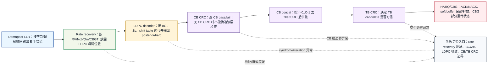
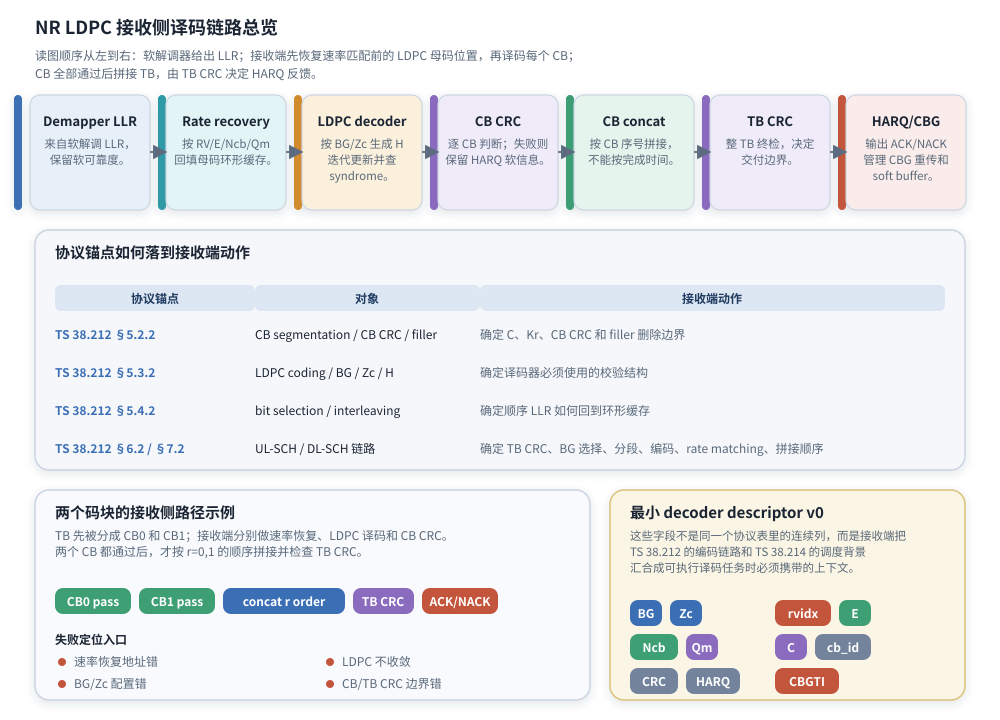

# T8.1 NR LDPC 译码链路总览
## 本节学习目标

本节从解调器已经输出软信息的位置开始，建立 NR 数据业务低密度奇偶校验码接收侧译码链路。这里的软信息用对数似然比表示：LLR 的符号表示更像 0 还是更像 1，绝对值表示接收机有多可靠。LDPC 译码器不会只吃一串硬判决 0/1，它需要这些可靠度数字在校验关系里反复传播。

学完本节后，应能做到：

- 解释 LDPC 的中文名、英文全称、缩写、基本思想和“低密度”的含义。
- 画出从软解调器（demapper）LLR 到速率恢复（rate recovery）、LDPC 译码、码块循环冗余校验、CB 拼接、TB CRC 和混合自动重传请求反馈的接收侧链路。
- 把每个接收端步骤映射到 TS 38.212 Rel-19 `38212-j30` 的章节，而不是只记一个协议目录。
- 说明调制与编码方案、冗余版本、传输块大小和CBG为什么来自 TS 38.214 的调度背景，而不是 LDPC 算法内部。
- 根据一个两个 CB 的小例子说清“每个 CB 独立译码；若协议为该 CB 附加了 CB CRC，就先做 CB CRC；最后按 CB 序号拼接并检查 TB CRC”的路径。
- 列出最小 decoder descriptor v0，并说明字段缺失时会造成什么工程故障。

本节只做总览，不把基图选择、提升大小、准循环矩阵、Belief Propagation、Min-Sum 和 layered schedule 的细节一次性讲完。那些内容分别由 T8.2 到 T8.8 承接。本节的目标是先建立正确地图：每个后续算法细节究竟在接收链路的哪个位置工作。

## 前置知识检查

| 前置项 | 本节需要达到的程度 |
|:---|:---|
| LLR | 知道它是软信息，不是硬比特；正负号表示倾向，绝对值表示可靠度。 |
| CRC | 知道它用于错误检测，不负责把错误纠正回来。 |
| TB 和 CB | 知道一个 TB 可能被拆成多个 CB；每个 CB 独立编码、译码和检查。 |
| T3.4 NR LDPC 分段 | 知道 NR 数据业务会使用 LDPC 的 CB segmentation、CB CRC 和 filler。 |
| T4.1 迭代译码 | 知道迭代译码会反复更新软信息，但本节不要求掌握具体更新公式。 |
| HARQ | 知道重传时接收端会保留旧软信息，并和新传输做软合并。 |

如果这些前置还不稳，先抓住一句话：NR LDPC 接收链路的输入是“按空口顺序收到的 LLR 流”，输出是“通过 CRC 检查的 TB 候选”；中间最重要的工作是把顺序 LLR 恢复到每个 LDPC CB 的母码位置，再用 LDPC 校验关系迭代判断。

## 路线图 Prompt 覆盖表

| Prompt 要求 | 本节覆盖位置 | 覆盖方式 |
|:---|:---|:---|
| 从解调器 LLR 输入开始 | “从 demapper LLR 开始” | 明确起点是软解调 LLR，不是硬比特，也不是协议发送端比特。 |
| 总览 NR LDPC 接收侧链路 | “接收侧总链路图”和图 T8.1-1 | 给出 rate recovery、LDPC core、CB CRC、CB concat、TB CRC、HARQ/CBG 的完整路径。 |
| 讲速率恢复 | “Rate recovery 的位置” | 解释接收端把顺序 LLR 放回 LDPC circular buffer 和母码位置。 |
| 讲 LDPC 译码 | “LDPC 译码器在链路中的契约” | 说明输入、输出、BG/Zc/H 的关系和 syndrome/iteration 的总览。 |
| 讲 CB CRC | “CB CRC 与 TB CRC 的层级” | 说明 CB CRC 是条件性检查：协议附加 CB CRC 时才逐 CB 检查；无 CB CRC 时不能伪造该层 pass/fail。 |
| 讲码块拼接 | “两个 CB 的教学例子” | 展示 CB0/CB1 通过后按 CB 序号拼接。 |
| 讲 TB CRC | “CB CRC 与 TB CRC 的层级” | 说明 TB CRC 是交付和 HARQ ACK/NACK 的最终边界。 |
| 讲可选 CBG 处理 | “CBG 在本节中的位置” | 说明 CBG 是 TS 38.214 的部分重传粒度，T9.3 详细展开。 |
| 映射到 TS 38.212 clause | “资料与协议边界”和“协议证据表” | 给出 §5.2.2、§5.3.2、§5.4.2、§6.2.1-§6.2.6、§7.2.1-§7.2.6 的本地路径和接收端意义。 |
| 按弹性审计清单取舍并拓展 | 全文 | 补充 LDPC 理论引入、NR 选择 LDPC 的原因、descriptor、失败定位、仿真、定点、寄存器传输级/专用集成电路、验证和证据记录。 |

这张表只表示最低覆盖。正文会继续补充背景、对象模型、数值例子、失败模式和实现边界，避免把 T8.1 写成协议索引。

## LDPC 名称、来源与基本思想

LDPC 是 Low-Density Parity-Check Code 的缩写，中文常译为“低密度奇偶校验码”。它的名字包含三层意思：

| 关键词 | 含义 |
|:---|:---|
| Parity-check | 码字必须满足一组奇偶校验方程。每条方程要求若干比特的 GF(2) 异或结果满足约束。 |
| Low-density | 校验矩阵里的 `1` 很少，大多数位置是 `0`。每个校验方程只连接少量比特。 |
| Code | 它是一类纠错码。发送端加入冗余校验结构，接收端利用这些结构从噪声中恢复信息。 |

“低密度”不是说数据业务低速，也不是说码率低，而是说奇偶校验矩阵 $H$ 很稀疏。稀疏矩阵带来的直接好处是：每个变量节点只和少数校验节点相连，每次迭代只需要沿着这些边更新消息。若矩阵很密，译码器每轮要处理大量连接，硬件吞吐和功耗都会很难接受。

LDPC 的思想可以追溯到 Robert G. Gallager 在 1960 年代提出的 low-density parity-check codes。早期受限于计算和硬件条件，LDPC 没有马上成为主流；后来随着迭代译码、稀疏图算法和芯片并行能力成熟，LDPC 重新成为高速数据通信里的重要纠错码。NR 数据业务选择 LDPC，不是因为它名字新，而是因为它适合高吞吐、长块、并行硬件和软信息迭代译码。

## NR 数据业务采用 LDPC 的工程动因

LTE 数据业务主要使用 Turbo，而 NR 数据业务主要使用 LDPC。这里不要把它理解成“新标准随便换了一个码”。NR 面向更宽带宽、更高峰值速率、更灵活的码率和更多并行接收场景，译码器不能只关注误码性能，还要关注吞吐、延迟、存储访问和可并行实现。

LDPC 对 NR 数据业务有几个工程优势：

| 需求 | LDPC 的匹配点 | 接收端后果 |
|:---|:---|:---|
| 高吞吐 | 稀疏图上的校验节点和变量节点可以并行更新。 | LDPC core 可以做多层、多并行度流水。 |
| 长块性能 | 大块长下 LDPC 迭代译码性能较好。 | 大 TB 分成 CB 后，每个 CB 可独立译码。 |
| 硬件友好 | NR 使用准循环 LDPC 结构，地址生成有规律。 | 真实实现通常保存 base graph 和 shift value，不保存完整大矩阵。 |
| HARQ 增量冗余 | rate matching circular buffer 可选择不同 RV 区域。 | soft buffer 保存各母码位置 LLR，重传时合并。 |
| 多码率适配 | 通过 BG、提升大小、rate matching、puncturing/shortening 适配。 | descriptor 必须携带 BG、Zc、E、Ncb、RV 等字段。 |

这也解释了为什么本模块先讲协议链路，再讲算法。LDPC 算法不是孤立跑在一个矩阵上；它被 TS 38.212 的分段、基图、提升、rate matching、CB/TB CRC 包围。接收端只要某个外围字段错，内部 Min-Sum 算得再漂亮也会失败。

## NR LDPC 适用和不适用链路

NR 里不能把“LDPC”泛化成“所有信道编码”。TS 38.212 Table 5.3-1/5.3-2 和 §6.2/§7.2 的链路说明共同给出边界：LDPC 主线服务数据传输信道，控制链路另有Polar或 small block coding 分支。

| 链路对象 | 物理信道 | 是否属于本章 NR LDPC 主线 | 接收端含义 |
|:---|:---|:---:|:---|
| 上行共享信道 | PUSCH | 是 | 走 TB CRC、BG 选择、CB segmentation、LDPC、rate matching 和 CB concatenation。 |
| 下行共享信道 | PDSCH | 是 | 与 UL-SCH 同类，方向不同导致 MCS/RV/CBG 调度来源不同。 |
| 寻呼信道（Paging Channel, PCH） | PDSCH | 是 | TS 38.212 §7.2 将 DL-SCH/PCH 放在同一 LDPC 数据链路中。 |
| 下行控制信息 | PDCCH | 否 | DCI 属于控制信息，走 Polar 主线，不进入 T8/T9 的 LDPC descriptor。 |
| 广播信道（Broadcast Channel, BCH）/PBCH | PBCH | 否 | BCH/PBCH 使用 Polar 相关控制链路，不使用本章 LDPC 数据链路。 |
| 上行控制信息 | PUCCH/PUSCH multiplexing | 否 | UCI 有 Polar 或 small block coding 分支；即使复用到 PUSCH，也不是 UL-SCH LDPC CB 本身。 |

工程上最危险的错误是把 DCI/BCH/UCI 的 LLR 送进 LDPC rate recovery。它们可能同样来自 demapper，也可能同样有 CRC，但编码对象、CRC 位置、rate matching 和译码算法完全不同。descriptor parser 应先判断 `channel_type` 或 `payload_family`，再决定进入 LDPC、Polar 还是 small block path。

## 通用 LDPC 术语与 NR 协议术语对照

同一个词在算法教材、TS 38.212 和工程 descriptor 中的落点不同。下面的表把本章后续会反复使用的术语先对齐。

| 通用 LDPC 概念 | NR LDPC 协议术语 | 接收端 descriptor 字段 | 本章使用方式 |
|:---|:---|:---|:---|
| Tanner 图模板 | Base Graph 1/2，简称 BG1/BG2 | `BG` 或 `bg_id` | 决定 row group、column group 和使用哪张 shift table。 |
| 提升因子 | lifting size $Z_c$ | `Zc` | 把每个 BG 元素展开成 $Z_c\times Z_c$ 子矩阵，决定地址周期。 |
| lifted matrix family 的表列 | set index $i_{\mathrm{LS}}$ | `iLS` | 由 $Z_c$ 唯一确定，用来选择 Table 5.3.2-2/3 的 shift value 列。 |
| 循环置换矩阵指数 | shift value $V_{i,j}$，接收端常用 $P_{i,j}=V_{i,j}\bmod Z_c$ | `shift`、`row_group`、`column_group` | 生成准循环连接和 layered decoder 地址。 |
| 母码 | LDPC encoded output before rate matching | `N`、`mother_len`、`ldpc_llr[0:N-1]` | rate recovery 的目标坐标系；未发送位置仍是母码变量节点。 |
| shortened/known input | filler bits in code block segmentation | `filler_mask`、`known_mask` | filler 是非 payload 已知位置，译码前按已知 0 或 mask 固定，交付前剥离。 |
| puncturing | first $2Z_c$ puncturing 和 rate matching 未选择位置 | `puncture_mask`、`unknown_mask` | first $2Z_c$ 是 NR LDPC 编码输出前两个 lifting columns 的系统性打孔语义；接收端不能把它们当 filler。 |
| circular-buffer shortening | limited-buffer rate matching | `Ncb`、`ILBRM` | `Ncb` 可能小于完整母码地址空间，RV 地址必须模 `Ncb`。 |

这张表有一个核心原则：filler、puncturing 和 repetition 都会表现为“某些位置没有普通的新观测”，但接收端 LLR 语义不同。filler 是已知约束；punctured/unsent 是未知；repetition 是同一母码位置的多次观测应累加。把三者都写成 `0` 而不带 mask，是 LDPC 接收链路最常见的隐藏 bug。

## 资料与协议边界

本节精读 TS 38.212 Rel-19 `38212-j30` 的 NR LDPC 数据链路，并把 TS 38.214 Rel-19 `38214-j30` 作为调度背景引用。协议定位如下：

| 协议位置 | 本地证据路径 |
| :--- | :--- |
| TS 38.212 §5 General procedures | `3GPP_Rel19/processed/TS_38.212_38212-j30/content.md` 行 633-635 |
| TS 38.212 §5.1 CRC calculation | `3GPP_Rel19/processed/TS_38.212_38212-j30/content.md` 行 637-661 |
| TS 38.212 §5.2.2 Low density parity check coding | `3GPP_Rel19/processed/TS_38.212_38212-j30/content.md` 行 717-805 |
| TS 38.212 §5.3.2 Low density parity check coding | `3GPP_Rel19/processed/TS_38.212_38212-j30/content.md` 行 945-989 |
| TS 38.212 §5.4.2 Rate matching for LDPC code | `3GPP_Rel19/processed/TS_38.212_38212-j30/content.md` 行 1175-1323 |
| TS 38.212 §6.2.1-§6.2.6 上行共享信道 | `3GPP_Rel19/processed/TS_38.212_38212-j30/content.md` 行 1359-1411 |
| TS 38.212 §7.2.1-§7.2.6 下行共享信道/寻呼信道（Paging Channel, PCH） | `3GPP_Rel19/processed/TS_38.212_38212-j30/content.md` 行 3737-3781 |
| TS 38.214 §5.1.7/§6.1.5 | `3GPP_Rel19/processed/TS_38.214_38214-j30/content.md`，§5.1.7 行 2407-2437；§6.1.5 行 7099-7125 |

边界要明确：TS 38.212 主要规定编码链路和比特序列如何生成，接收端必须实现等价逆过程；TS 38.214 提供 MCS、TBS、RV、CBG 等调度和过程背景。3GPP 不规定某个芯片内部 LLR 位宽、静态随机存取存储器bank 数、layered schedule 流水深度、最大迭代次数、early-stop 阈值、RTL 状态机或 ASIC 面积目标。这些属于实现策略，但必须保持协议 bit-exact 的输入输出关系。

## 从软解调 LLR 开始

接收端进入本节时，物理层已经完成同步、信道估计、均衡、层解映射和软解调。LDPC 链路看到的起点可以抽象成：

$$
\mathbf{L}^{\mathrm{rx}}=\left[L_0,L_1,\ldots,L_{E-1}\right]
\tag{1}
$$

式 (1) 回答的问题是：一次传输给某个 CB 或某组 CB 提供了多少个软观测。$E$ 是本次 rate matching 后实际承载的编码比特数量，$L_j$ 是第 $j$ 个接收编码比特的 LLR。$E$ 不是 TB payload 长度，不是 CB 长度，也不是 LDPC 母码长度。它受资源分配、调制阶数、层数、RV、CBG 调度和 rate matching 共同影响。

软解调输出的顺序是“空口和调制映射后的顺序”。LDPC decoder 需要的顺序是“每个 CB 的母码位置顺序”。因此接收端第一大任务不是马上迭代译码，而是做速率恢复：把顺序 LLR 放回 LDPC 环形缓存和母码位置。

本节先给几个贯穿后续章节的 descriptor 字段直觉，避免读者只看到缩写：

| 字段 | 中文解释 | 本节只需要知道什么 |
|:---|:---|:---|
| `BG` | 基图（Base Graph） | 选择 BG1 还是 BG2，决定 LDPC 校验矩阵模板。 |
| `Zc` | 提升大小（lifting size） | 决定基本节图表中一个元素扩展成多大的循环移位子矩阵。 |
| `RV` / `rvidx` | 冗余版本（redundancy version）及其索引 | 决定本次从 LDPC rate matching 环形缓存的哪个区域读取或恢复。 |
| `Ncb` | code block circular buffer 可用长度 | 决定本 CB 的 rate recovery 地址范围。 |
| `Qm` | 调制阶数（modulation order） | 决定一个调制符号承载几个编码比特，也影响 bit interleaving。 |
| syndrome | 校验综合 | 用来检查当前硬判决是否满足 LDPC 校验矩阵。 |
| posterior LLR | 后验 LLR | LDPC 迭代后综合信道信息和校验信息得到的软判决。 |

## 接收侧总链路图

本节总览图的主题是“NR LDPC 接收侧译码链路总览”：从 demapper 输出的顺序 LLR 开始，经过 rate recovery、LDPC decoder、条件性 CB CRC、CB concat、TB CRC，最后进入 HARQ/CBG 状态管理。这个标题强调两点：第一，本节站在接收侧看 TS 38.212 的发送端定义；第二，LDPC core 只是链路中间一环，前后的速率恢复、CRC 和 HARQ 状态同样决定译码是否可信。




| 内容 | 说明 |
|:---|:---|
| 主链路 | `Demapper LLR -> Rate recovery -> LDPC decoder -> CB CRC -> CB concat -> TB CRC -> HARQ/CBG`。失败定位不是正常尾节点，而是从多个阶段分叉出来的诊断入口。 |
| 两码块示例 | 若 `CB0 pass` 且 `CB1 pass`，concat 必须按 `r=0,1` 顺序去掉 CB CRC/filler 后拼接，再做 TB CRC；任一 CB fail 会影响 TB candidate 可信度。 |
| descriptor 字段 | `BG`、`Zc`、`rvidx/RV`、`E`、`Ncb`、`Qm`、`C`、`cb_id`、CRC 模式、HARQ process、CBGTI/CBG mask 共同定义 rate recovery 和 decoder 坐标系。 |
| 协议锚点 §5.2.2 | CB segmentation、CB CRC、filler；确定 `C`、`Kr`、CB CRC 和 filler 删除边界。 |
| 协议锚点 §5.3.2 | LDPC coding、BG、$Z_c$、$H$；确定译码器必须使用的校验结构。 |
| 协议锚点 §5.4.2 | bit selection/interleaving；确定顺序 LLR 如何回到 LDPC 环形缓存和母码位置。 |
| 协议锚点 §6.2/§7.2 | UL-SCH/DL-SCH 链路；确定 TB CRC、BG 选择、分段、编码、rate matching 和拼接顺序。 |
| 协议锚点 TS 38.214 | §5.1.7/§6.1.5 提供 CBG、CBGTI、MCS、RV、TBS 等译码上下文来源。 |
| 失败定位 | 速率恢复地址错、BG/Zc 配置错、LDPC syndrome 不收敛、CB CRC 与 TB CRC 边界错，是四类最小排查入口。 |
接收侧链路从左到右为：demapper LLR 是输入；rate recovery 恢复母码位置；LDPC decoder 按 BG 和 Zc 对每个 CB 迭代；CB CRC 判断单个 CB；CB concat 按 CB 序号拼接；TB CRC 决定交付边界；HARQ/CBG 处理控制 soft buffer 生命周期和部分重传边界，并向媒体接入控制层反馈最终译码状态。

本节图表中每个节点都对应一个接收端对象：

| 节点 | 输入 | 输出 | 协议锚点 | 实现对象 |
|:---|:---|:---|:---|:---|
| Demapper LLR | 均衡后的符号、调制方式、噪声估计 | 顺序 LLR 流 | TS 38.212 不规定软解调算法，后续从 rate matching 输出序列反向处理 | demapper、LLR normalizer、deinterleaver 输入 FIFO。 |
| Rate recovery | LLR、$E$、$N_{\mathrm{cb}}$、`rvidx`、$Q_m$、CBGTI | LDPC 母码位置 LLR | TS 38.212 §5.4.2 | circular-buffer address generator、mask、soft combiner。 |
| LDPC decoder | BG、Zc、母码 LLR、filler/shortening/puncturing mask | CB 硬判决、posterior LLR、syndrome 状态 | TS 38.212 §5.3.2 | layered/min-sum core、message memory、syndrome checker。 |
| CB CRC | 单个 CB 的硬判决有效位；仅当协议为该 CB 附加 CRC 时存在 | CB pass/fail 或 no-CB-CRC 状态 | TS 38.212 §5.2.2 和 §5.1 | CRC checker、CB status RAM。 |
| CB concat | 通过条件性 CB CRC 或无 CB CRC 场景下的 CB payload | TB candidate | TS 38.212 §5.5、§6.2.6、§7.2.6 | reorder/concat buffer。 |
| TB CRC | TB candidate | TB pass/fail | TS 38.212 §6.2.1、§7.2.1 | TB CRC checker、HARQ feedback trigger。 |
| HARQ/CBG | TB/CB status、soft buffer、CBG mask | ACK/NACK、保留或释放软信息 | TS 38.214 §5.1.7/§6.1.5 | HARQ context table、CBG state、soft buffer namespace。 |

本节结构是接收端教学重建，不是 TS 38.212 原图。TS 38.212 按发送端步骤定义比特序列；接收端实现要把它反向理解。

图中的协议锚点区回答“协议锚点如何落到接收端动作”。它不是单纯列章节号，而是把每个协议位置转成接收端必须执行或验证的动作：

| 协议锚点 | 图中对象 | 接收端动作 |
|:---|:---|:---|
| TS 38.212 §5.2.2 | CB segmentation / CB CRC / filler | 确定 `C`、`Kr`、CB CRC 和 filler 删除边界。 |
| TS 38.212 §5.3.2 | LDPC coding / BG / Zc / H | 确定译码器必须使用的校验结构。 |
| TS 38.212 §5.4.2 | bit selection / interleaving | 确定顺序 LLR 如何回到环形缓存。 |
| TS 38.212 §6.2 / §7.2 | UL-SCH / DL-SCH 链路 | 确定 TB CRC、BG 选择、分段、编码、rate matching、拼接顺序。 |
| TS 38.214 §5.1.7 / §6.1.5 | CBG and scheduling context | 提供 CBG、CBGTI、MCS/RV/TBS 等译码上下文来源。 |

## 发送端协议顺序与接收端逆序

协议通常按发送端顺序写，因为标准要定义“发出去的比特序列是什么”。接收端要按逆序恢复：

| 发送端协议动作 | 发送端输出 | 接收端逆动作 | 接收端输出 |
|:---|:---|:---|:---|
| TB CRC attachment | 带 TB CRC 的 TB | TB CRC check | 整个 TB pass/fail。 |
| LDPC base graph selection | BG1 或 BG2 | 使用同一个 BG 配置 decoder | 正确的校验结构。 |
| CB segmentation and optional CB CRC | $C$ 个 CB、每个 $K_r$、可能有 filler，可能附加 CB CRC | 若有 CB CRC 则检查并去除；无 CB CRC 则不能伪造该层检查；去除 filler | 每个 CB payload。 |
| LDPC channel coding | LDPC 母码比特 $d_r$ | LDPC iterative decoding | 每个 CB 的估计比特。 |
| Rate matching | $E_r$ 个待映射比特 | Rate recovery | 母码位置 LLR。 |
| Code block concatenation | 按 CB 顺序拼接后的发送比特流 | 按 CB 边界切分接收 LLR | 每个 CB 的 LLR 子流。 |

这个表有一个重要后果：接收端不能只凭 LLR 数组长度猜配置。BG、Zc、CB 数、每个 CB 的 $E_r$、filler 数、RV、CBG 是否发送，都必须来自同一个调度和协议上下文。只要上下文不同步，后续所有公式都会在错误对象上运行。

## Rate recovery 的位置

TS 38.212 §5.4.2 规定 LDPC rate matching 由 bit selection 和 bit interleaving 组成。发送端把 LDPC 编码输出写入 circular buffer，再根据 RV 起点和 $E$ 选择输出；接收端要反过来做：

$$
L_{\mathrm{buf}}\left[a(j)\right] \leftarrow L_j,\quad j=0,1,\ldots,E-1
\tag{2}
$$

式 (2) 回答的问题是：第 $j$ 个收到的 LLR 应放回 LDPC 母码缓冲区的哪个地址。$a(j)$ 是由 `rvidx`、$N_{\mathrm{cb}}$、bit interleaving、CBG 是否发送、filler/shortening/puncturing 规则共同决定的地址。T9.1 和 T9.2 会详细推导 $a(j)$；本节先说明它在链路中的位置。

若某个母码位置本次没有发送，接收端通常给它中性 LLR：

$$
L_{\mathrm{unknown}}=0
\tag{3}
$$

式 (3) 的 $0$ 不是业务比特 0，而是“没有证据”。若同一母码位置因 repetition 或 HARQ 重传被观测多次，接收端做软合并：

$$
L_{\mathrm{comb}}=\mathrm{sat}\left(L_{\mathrm{old}}+L_{\mathrm{new}}\right)
\tag{4}
$$

式 (4) 中 $\mathrm{sat}(\cdot)$ 表示定点饱和。浮点模型可以直接相加；硬件实现必须限制位宽，避免溢出。

## LDPC 译码器在链路中的契约

对第 $r$ 个 CB，LDPC decoder 的输入不是“TB 的第几位”，而是一个完整译码任务：

| 输入字段 | 含义 | 错误后果 |
|:---|:---|:---|
| `BG` | 使用 Base Graph 1 还是 Base Graph 2。 | 校验矩阵结构错，syndrome 很难收敛。 |
| `Zc` | lifting size，一个基图元素扩展成 $Z_c \times Z_c$ 子矩阵。 | 地址周期和矩阵尺寸错。 |
| $\mathbf{L}_r$ | 当前 CB 母码位置的 LLR 数组。 | LLR 放错地址时，译码器在错误图上解释证据。 |
| filler/shortening/puncturing mask | 哪些位置是已知、未知或不可输出。 | 把 unknown 当强 0、把 filler 留进 payload，CRC 异常。 |
| `max_iter` 和 early-stop 配置 | 工程迭代上限和停止策略。 | 过早停止导致性能损失，过晚停止浪费吞吐。 |

LDPC decoder 的核心检查对象是奇偶校验矩阵 $H$：

$$
H\hat{\mathbf{x}}^{T}=\mathbf{0}\quad \text{over GF(2)}
\tag{5}
$$

式 (5) 回答的问题是：译码器当前硬判决 $\hat{\mathbf{x}}$ 是否满足 LDPC 校验关系。这里的 GF(2) 表示二元有限域，加法就是异或。若 syndrome 为零，说明候选码字满足 LDPC 校验；但是否能交付业务数据，还要继续看 CB CRC 和 TB CRC。LDPC syndrome 和 CRC 都是错误检测，但层次不同：syndrome 检查的是 LDPC 码字约束，CRC 检查的是业务块附加的检错约束。

## CB CRC 与 TB CRC 的层级

CB CRC 和 TB CRC 不能混成一个“CRC pass/fail”标志，还要注意 CB CRC 不是无条件存在。TS 38.212 §5.2.2 的逻辑是：当输入超过最大 code block size 需要分段时，会给每个 CB 附加额外 CRC；若没有触发这种附加 CB CRC 的场景，接收端不能凭空产生“CB CRC pass/fail”这一层判决。

| 检查 | 输入边界 | 作用 | 接收端动作 |
|:---|:---|:---|:---|
| CB CRC | 单个 CB 的译码输出，且该 CB 按协议实际附加了 CRC 位 | 判断单个 CB 是否可信 | 有 CB CRC 时，任一 required CB CRC 失败，当前 TB 通常不能交付；无 CB CRC 时跳过该检查。 |
| 无 CB CRC 场景 | 单个 CB 的译码输出不含额外 CB CRC | 不提供逐 CB CRC 判决 | 依靠 LDPC syndrome/decoder 状态和最终 TB CRC 控制交付边界。 |
| TB CRC | 所有 CB 去除可选 CB CRC/filler 后按序拼接得到的 TB candidate | 判断整个 TB 是否可信 | 通过才交付 MAC，并产生成功反馈边界。 |

一个重要调试现象是：在存在 CB CRC 的分段场景中，所有 CB CRC 通过但 TB CRC 失败，往往不是 LDPC core 的单 CB 迭代错误，而是 CB 拼接顺序、filler 删除、TB CRC 输入边界或多 TB/多 codeword 上下文错。相反，如果某一个 CB CRC 失败，问题可能在该 CB 的 rate recovery、BG/Zc、LLR 符号、迭代配置或信道质量。若没有 CB CRC，就不要在日志里写“CB CRC pass”；应写 `cb_crc_present=false`，并把最终交付判断放到 TB CRC。

## CBG 在本节中的位置

CBG 是 Code Block Group 的缩写，中文可译为“码块组”。它把一个 TB 内的若干 CB 分成组，允许部分重传，而不是每次都重传整个 TB。TS 38.214 §5.1.7 说明 PDSCH 的 CBG 配置、CBG 与 CB 的分组、CBGTI 字段以及 CBGFI 是否允许和旧实例合并；§6.1.5 行 7099-7125 给 PUSCH 的相应背景。

本节只建立 CBG 的接收端位置：CBG 不改变 LDPC 的校验矩阵，不改变单个 CB 的译码算法；它改变的是“本次哪些 CB 或 CBG 有新的 LLR、哪些 soft buffer 保持旧值、哪些旧实例可以合并”。具体 CBG mask、部分重传和 soft buffer key 会在 T9.3 详细展开。

## 两个 CB 的教学例子

两个码块的接收侧路径示例可以把上面的总链路落到最小对象上：TB 被拆成 CB0 和 CB1 后，两个 CB 分别完成速率恢复、LDPC 译码和条件性 CB CRC；只有 required CB 都满足交付条件时，接收端才按 `r=0,1` 的协议顺序拼接并检查 TB CRC。

假设一个 TB 被分成两个 CB：`CB0` 和 `CB1`，并且该分段场景按协议给每个 CB 附加了 CB CRC。这只是教学例子，不是 NR 一致性测试向量；其中 `BG1`、`Zc=32`、`E_0=1200` 和 `E_1=1184` 是为了说明对象流转而设定的教学值，不来自未复现的协议表，也不能当作规范向量。

| 项目 | CB0 | CB1 |
|:---|:---:|:---:|
| BG | BG1 | BG1 |
| `Zc` | 32 | 32 |
| 本次收到 LLR 数 $E_r$ | 1200 | 1184 |
| LDPC 迭代结果 | syndrome pass | syndrome pass |
| CB CRC | pass | pass |
| 输出 payload 顺序 | 第 0 段 | 第 1 段 |

接收端流程为：

1. 从 demapper LLR 流中切出属于 CB0 的 $E_0=1200$ 个 LLR，以及属于 CB1 的 $E_1=1184$ 个 LLR。
2. 分别按同一个 TB descriptor 中的 `BG=BG1`、`Zc=32`、RV 和 $N_{\mathrm{cb}}$ 做 rate recovery。
3. 对 CB0 和 CB1 分别运行 LDPC 译码；因为这个教学场景假设存在 CB CRC，所以分别做 CB CRC。
4. 两个 required CB 都 pass 后，去除可选 CB CRC 和 filler，按 `r=0` 在前、`r=1` 在后的顺序拼接。
5. 对拼接得到的 TB candidate 做 TB CRC。TB CRC pass 才能交付；否则保留 HARQ soft buffer 并等待重传。

如果 CB1 先译码完成，仍然不能把 CB1 放在 CB0 前面。协议拼接顺序由 CB 序号决定，不由硬件完成时间决定。

## 最小 decoder descriptor v0

为了让软件模型、RTL 和 ASIC 验证说同一种语言，本节定义一个最小 decoder descriptor v0。它不是 3GPP 的单一协议结构，而是接收端从 TS 38.212/38.214 相关字段汇总出来的译码任务描述。

| 字段 | 来源 | 用途 | 缺失或错误后果 |
|:---|:---|:---|:---|
| `direction` | PUSCH/PDSCH 上下文 | 区分 UL-SCH、DL-SCH/PCH 路径 | 上下行 soft buffer 或调度字段混用。 |
| `harq_id` | HARQ 过程 | 索引 soft buffer 生命周期 | 重传写到错误 TB 历史。 |
| `tb_id` / `cw_id` | 多 TB/多 codeword 上下文 | 区分同一时刻多个 TB | 拼接、CRC 或 feedback 串扰。 |
| `cb_id` | TS 38.212 segmentation | 索引 CB 译码任务 | CB 顺序错或状态覆盖。 |
| `BG` | TS 38.212 §6.2.2/§7.2.2 | 选择 BG1/BG2 表和 decoder 配置 | H 矩阵错。 |
| `Zc` | TS 38.212 §5.2.2/§5.3.2 | 决定 QC-LDPC 展开尺寸和地址周期 | 地址、bank、矩阵尺寸错。 |
| `E` | TS 38.212 §5.4.2、§6.2.5、§7.2.5 | 本 CB 本次接收 LLR 数 | LLR 切分错。 |
| `Ncb` | TS 38.212 §5.4.2 | circular buffer 可用长度 | RV 地址错、soft buffer 越界。 |
| `rvidx` | TS 38.212 §5.4.2 / TS 38.214 调度背景 | 选择 RV 起点 | 重传补错区域。 |
| `Qm` | TS 38.214 MCS 背景 | bit interleaving/deinterleaving | LLR bit order 错。 |
| `C` | TS 38.212 §5.2.2 | TB 内 CB 数量 | 拼接边界错。 |
| `cb_crc_present` | TS 38.212 §5.2.2 | 标记当前 CB 是否实际附加 CB CRC | 无 CB CRC 场景被误报 CB pass/fail。 |
| `crc_type` | TS 38.212 §5.1/§6.2.1/§7.2.1 | 选择 CRC 长度和多项式 | CRC pass/fail 无意义。 |
| `cbg_id` / `cbg_mask` | TS 38.214 §5.1.7/§6.1.5 | CBG 部分重传控制 | 未重传 CBG 被清空或错误合并。 |

后续 T8/T9/T11 会复用这张表。每当发现译码失败，第一步不是怀疑 LDPC 算法，而是先确认 descriptor 是否自洽。

## 接收端伪代码

```text
for each scheduled transport block:
    build decoder descriptor from TS 38.212 chain and TS 38.214 scheduling context
    collect demapper LLRs for this TB/codeword

    for each code block r in protocol order:
        if CBG is configured and CB r is not present in this transmission:
            keep previous HARQ soft buffer for this CB
            continue

        slice E_r LLRs for CB r
        undo bit interleaving according to Qm
        restore LDPC circular-buffer positions using rvidx and Ncb
        combine with HARQ soft buffer using saturating LLR addition
        initialize unknown, shortened and filler-related positions correctly

        run LDPC decoder with BG, Zc and masks
        compute hard decision and syndrome
        if cb_crc_present for CB r:
            check CB CRC and record cb_status[r]
        else:
            record cb_status[r] as no_cb_crc and keep decoded payload candidate

    if every required CB is acceptable:
        remove optional CB CRC and filler
        concatenate CB payloads in r = 0..C-1 order
        check TB CRC
        if TB CRC passes:
            release HARQ soft buffer and deliver TB
        else:
            keep HARQ soft buffer and request/expect retransmission
    else:
        keep HARQ soft buffer and request/expect retransmission
```

这段伪代码刻意从接收端写起。TS 38.212 的发送端 bit sequence 公式是基准，但工程实现的控制流必须围绕“收到的 LLR 如何变成可验证 TB”组织。

## 浮点仿真方案

T8.1 的浮点仿真不要求实现完整 NR conformance receiver，而是验证链路对象和边界是否正确。

| 检查项 | 建议方法 | 通过标准 |
|:---|:---|:---|
| LLR 切分 | 人工构造两个 CB 的 $E_0/E_1$，检查切片范围 | CB0/CB1 不重叠、不缺失。 |
| Rate recovery 地址 | 构造小 circular buffer 和 RV 起点 | 每个 LLR 落到预期母码地址。 |
| Unknown 位置 | 人工留下未发送位置 | 未发送位置 LLR 为 0，且 mask 标记为 unknown。 |
| CB CRC/TB CRC 层级 | 用 toy CRC 或已有 T3.1 CRC 函数 | 有 CB CRC 时单 CB 失败阻断 TB 交付；无 CB CRC 时不生成伪 CB pass/fail，最终由 TB CRC 判断交付。 |
| HARQ soft combine | 两次传输命中同一地址 | 浮点 LLR 等于两次观测之和。 |

最小 Python 片段如下，用于检查两个 CB 的切分和拼接顺序：

```python
rx_llr = list(range(10))
E = [4, 6]
offset = 0
cb_llr = []
for er in E:
    cb_llr.append(rx_llr[offset:offset + er])
    offset += er
assert cb_llr[0] == [0, 1, 2, 3]
assert cb_llr[1] == [4, 5, 6, 7, 8, 9]

decoded_payload = {
    0: ["CB0_bit0", "CB0_bit1"],
    1: ["CB1_bit0", "CB1_bit1"],
}
tb_candidate = decoded_payload[0] + decoded_payload[1]
assert tb_candidate == ["CB0_bit0", "CB0_bit1", "CB1_bit0", "CB1_bit1"]
print("T8_1_TOY_CHAIN_OK")
```

完整 L3 仿真再引入真实 BG、Zc、rate matching 和 LDPC 迭代。本节的验收重点是链路对象不要错位。

## 定点化策略

LDPC 接收链路的定点化首先影响 LLR。常见实现会把浮点 LLR 量化为有符号整数，例如 6 bit、7 bit 或 8 bit。具体位宽不是 TS 38.212 强制项，但语义必须一致。

| 定点对象 | 策略 | 风险 |
|:---|:---|:---|
| 输入 LLR | 统一符号约定、缩放和裁剪范围 | 符号反会导致高信噪比仍失败。 |
| Unknown 位置 | 设为中性 0，并保留 mask | 当成强 0 会制造虚假证据。 |
| HARQ 合并 | 使用饱和加法 | 不饱和会溢出；过早饱和会损失重传纠错能力。 |
| LDPC message | check-to-variable 和 variable-to-check 消息单独规划位宽 | 消息过窄导致性能损失，过宽增加 SRAM 和功耗。 |
| Syndrome/CRC 状态 | 保持硬逻辑，不用软量化 | 状态跨 CB/TB 串扰会导致错误 ACK/NACK。 |

定点验证至少要覆盖三类输入：全弱 LLR、强正/强负 LLR、HARQ 多次合并接近饱和的 LLR。只用随机块错误率曲线不足以定位定点错误，还需要 dump 每个 CB 的最大/最小 LLR、饱和计数、syndrome weight 和 CRC 状态。

## RTL/ASIC 映射

从 RTL/ASIC 角度看，T8.1 的链路可以拆成几类硬件对象：

| 硬件对象 | 功能 | 关键验证点 |
|:---|:---|:---|
| LLR input FIFO | 接收 demapper 输出并按 CB 切片 | $E_r$ 边界、backpressure、Qm 对齐。 |
| Rate recovery address generator | 生成 circular buffer 写回地址 | `rvidx`、$N_{\mathrm{cb}}$、bit interleaving、CBG mask。 |
| HARQ soft buffer SRAM | 保存母码位置 LLR | key 隔离、读改写、饱和合并、清空时机。 |
| LDPC message memory | 保存 layered/min-sum 消息 | bank conflict、读写端口、layer 顺序。 |
| LDPC compute core | check-node/variable-node 更新 | min1/min2、符号、归一化或 offset。 |
| Syndrome checker | 检查 $H\hat{x}^T=0$ | 与 decoder 地址表一致，不能用错 BG/Zc。 |
| CRC checker | 条件性检查 CB CRC，并检查 TB CRC | `cb_crc_present`、输入边界、CB 顺序、filler 删除。 |
| Status/feedback block | 生成 CB/TB 状态和 HARQ 边界 | ACK/NACK、CBG 状态、soft buffer release。 |

关键原则是：LDPC core 可以高度复用，但上下文不能丢。`harq_id/tb_id/cbg_id/cb_id/addr` 这样的 key 不完整时，硬件看起来仍在正常跑，实际输入已经混入错误历史软信息。

## 验证方法

T8.1 的验证分三层：

| 层级 | 验证内容 | 最小证据 |
|:---|:---|:---|
| 协议链路 | 每个步骤能映射到 TS 38.212/38.214 | 协议证据表、本地路径、章节行号。 |
| 软件模型 | LLR 切分、rate recovery、CB/TB CRC 层级正确 | toy case 输出、断言、descriptor dump。 |
| 硬件/RTL | 地址、soft buffer、状态机和 core 交互正确 | waveform、SRAM dump、syndrome/CRC/status log。 |

最小 dump 包建议包含：

| 字段 | 用途 |
|:---|:---|
| `direction, harq_id, tb_id, cb_id, cbg_id` | 定位 soft buffer namespace。 |
| `BG, Zc, K, N, E, Ncb, rvidx, Qm` | 定位矩阵和 rate recovery 配置。 |
| `rx_llr_min/max, saturation_count` | 定位 LLR 缩放和饱和问题。 |
| `unknown_count, shortened_count, filler_count` | 定位 mask 语义。 |
| `iteration_count, syndrome_weight` | 定位 LDPC 是否收敛。 |
| `cb_crc_present, cb_crc_status, tb_crc_status` | 定位错误发生层级，并避免无 CB CRC 场景误报。 |

## 常见错误

| 错误 | 现象 | 定位方式 |
|:---|:---|:---|
| 把 demapper 输出当硬比特 | BLER 性能极差，迭代没有收益 | 检查 decoder 输入是否只有 0/1，而不是 LLR。 |
| BG 选择错 | syndrome 长期不收敛；有 CB CRC 时 CB CRC fail | dump `BG`、payload size、coding rate，并对照 T8.2。 |
| Zc 错 | 地址周期、矩阵尺寸、bank 访问全错 | dump `Zc`、lift set、BG table index，并对照 T8.3。 |
| Rate recovery 地址错 | 某些 RV 总失败，或高信噪比仍失败 | 固定 LLR pattern 检查地址回填。 |
| Unknown 当硬 0 | 译码器被不存在证据偏置 | 检查 unknown mask 和中性 LLR。 |
| CB 拼接按完成时间排序 | 存在 CB CRC 时所有 CB pass 但 TB CRC fail；无 CB CRC 时直接表现为 TB CRC fail | dump CB concat 顺序。 |
| CBG 未传输却清 soft buffer | 部分重传性能异常 | dump CBGTI、CBGFI、soft buffer before/after。 |
| LLR 符号约定反 | 高信噪比下稳定失败 | 用全强正/全强负模式做 sanity check。 |

## 自测题

1. LDPC 名称中的 “low-density” 指什么？它为什么对硬件有利？
2. 为什么 NR LDPC 接收端不能直接把 demapper LLR 送进 LDPC core？
3. CB CRC 和 TB CRC 的职责有什么区别？CB CRC 是否总是存在？
4. 如果存在 CB CRC 的两个 CB 都通过，但 TB CRC 失败，优先怀疑哪些问题？
5. CBG 改变的是 LDPC 算法本身，还是 HARQ/soft buffer 的重传粒度？
6. 最小 decoder descriptor 中为什么必须包含 `BG`、`Zc`、`E`、`Ncb` 和 `rvidx`？

## 自测题参考答案

1. “低密度”指校验矩阵 $H$ 中 `1` 的数量相对很少，矩阵稀疏。这样每个节点只连接少量边，迭代更新可以并行，存储和计算量更适合高吞吐硬件。
2. demapper LLR 是空口接收顺序；LDPC core 需要母码位置顺序。必须先按 TS 38.212 的 rate matching 逆过程，把 LLR 放回 circular buffer 和 LDPC 母码位置。
3. CB CRC 判断单个 CB 的译码结果是否可信，但它只在协议实际给 CB 附加 CRC 时存在；无 CB CRC 场景不能伪造逐 CB CRC 结论。TB CRC 判断所有 CB 去除可选 CB CRC/filler 并按序拼接后的整个 TB 是否可信。
4. 优先怀疑 CB 拼接顺序、filler 删除、TB CRC 输入边界、多 TB/多 codeword 上下文、descriptor 串扰，而不是马上怀疑单个 LDPC core 算法。
5. CBG 主要改变 HARQ/soft buffer 的部分重传粒度和状态管理；它不改变单个 CB 的 LDPC 校验矩阵和迭代译码算法。
6. `BG` 和 `Zc` 决定 LDPC 校验结构；`E` 决定本次 LLR 数；`Ncb` 和 `rvidx` 决定 circular buffer 地址和 RV 起点。少任何一个字段，rate recovery 或 decoder 配置都可能错。

## 协议证据表

| 结论 | 协议依据 | 本地证据 |
|:---|:---|:---|
| NR channel coding 包含 error detection、error correcting、rate matching、interleaving 等环节 | TS 38.212 §5 | `3GPP_Rel19/processed/TS_38.212_38212-j30/content.md` 行 633-635 |
| LDPC CB segmentation 会在超过最大 CB 尺寸时分段，并可为每个 CB 附加 CRC | TS 38.212 §5.2.2 | `3GPP_Rel19/processed/TS_38.212_38212-j30/content.md` 行 717-805 |
| LDPC 编码使用 BG1/BG2、lifting size、QC-LDPC parity-check matrix | TS 38.212 §5.3.2 | `3GPP_Rel19/processed/TS_38.212_38212-j30/content.md` 行 945-989 |
| LDPC rate matching 由 bit selection 和 bit interleaving 组成，并使用 circular buffer 与 RV | TS 38.212 §5.4.2 | `3GPP_Rel19/processed/TS_38.212_38212-j30/content.md` 行 1175-1323 |
| UL-SCH 数据链路包含 TB CRC、BG 选择、分段、编码、rate matching、CB concatenation | TS 38.212 §6.2.1-§6.2.6 | `3GPP_Rel19/processed/TS_38.212_38212-j30/content.md` 行 1359-1411 |
| DL-SCH/PCH 数据链路包含 TB CRC、BG 选择、分段、编码、rate matching、CB concatenation | TS 38.212 §7.2.1-§7.2.6 | `3GPP_Rel19/processed/TS_38.212_38212-j30/content.md` 行 3737-3781 |
| PDSCH CBG 接收由 TS 38.214 给出，包括 CBG 分组、CBGTI 和 CBGFI | TS 38.214 §5.1.7 | `3GPP_Rel19/processed/TS_38.214_38214-j30/content.md` 行 2407-2437 |
| PUSCH CBG 传输由 TS 38.214 给出，包括 CBG 分组和下行控制信息 format 0_1 的 CBGTI | TS 38.214 §6.1.5 | `3GPP_Rel19/processed/TS_38.214_38214-j30/content.md` 行 7099-7125 |

## 图示


## 执行与证据记录

| 项目 | 记录 |
|:---|:---|
| 路线图卡片 | `2026-06-19-lte-nr-decoding-learning-roadmap.md` T8.1：Prompt 要求从 demapper LLR 开始，总览 rate recovery、LDPC、CB CRC、CB concat、TB CRC 和可选 CBG。 |
| 本地协议检索 | 使用 `rg`、`nl -ba` 和 `sed` 定位 TS 38.212 §5.1、§5.2.2、§5.3.2、§5.4.2、§6.2、§7.2，以及 TS 38.214 §5.1.7 和 §6.1.5。 |
| 协议表/公式边界 | 本节是链路总览，不复现 TS 38.212 Table 5.3.2-1/2/3、Table 5.4.2.1-1/2 或 TS 38.214 MCS/TBS 表；本节不依据这些表给出任何规范数值结论，教学例子中的 `BG1/Zc=32/E=1200/E=1184` 不是规范向量；这些表在 T8.2/T8.3/T9/T11 使用具体值时重建。 |
| 验收点 | 能画出 NR LDPC 接收链路，并把每步映射到 TS 38.212 clause；能解释 descriptor 字段和 CB/TB CRC 层级。 |
| 审核经理复核 | Critical=0；Important=2 已修复：CB CRC 已改为条件性流程并新增 `cb_crc_present`；TS 38.214 §6.1.5 已补 `content.md` 行 7099-7125 精确证据。Minor 已处理：补 descriptor 字段解释，并明确教学数值不是规范向量。 |
| 自动审计 | `python3 tools/audit_lesson_terms.py docs/L2_协议算法/T8.1_NR_LDPC_decoder_chain_overview.md` 输出 `LESSON_TERM_AUDIT_OK`；`python3 tools/audit_markdown_headings.py docs/L2_协议算法/T8.1_NR_LDPC_decoder_chain_overview.md` 输出 `MARKDOWN_HEADING_AUDIT_OK`；`python3 tools/audit_lesson_depth.py --strict docs/L2_协议算法/T8.1_NR_LDPC_decoder_chain_overview.md` 输出 `LESSON_DEPTH_AUDIT_OK`；`python3 tools/audit_latex_render.py docs/L2_协议算法/T8.1_NR_LDPC_decoder_chain_overview.md` 输出 `LATEX_RENDER_AUDIT_OK formulas=40`。 |

## 参考文献

- [ETSI, 2026] 3GPP TS 38.212 V19.3.0, "NR; Multiplexing and channel coding," Release 19, `38212-j30`, §5.1, §5.2.2, §5.3.2, §5.4.2, §6.2, §7.2.
- [ETSI, 2026] 3GPP TS 38.214 V19.3.0, "NR; Physical layer procedures for data," Release 19, `38214-j30`, §5.1.7, §6.1.5.
- [Gallager, 1962] R. G. Gallager, "Low-Density Parity-Check Codes," IRE Transactions on Information Theory, 1962.
- [Richardson and Urbanke, 2008] T. Richardson and R. Urbanke, *Modern Coding Theory*, Cambridge University Press, 2008.
