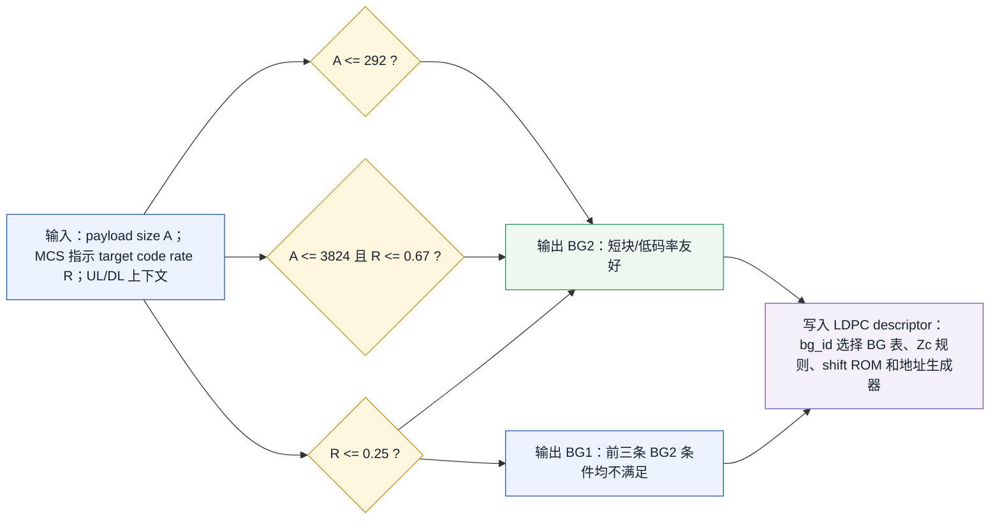
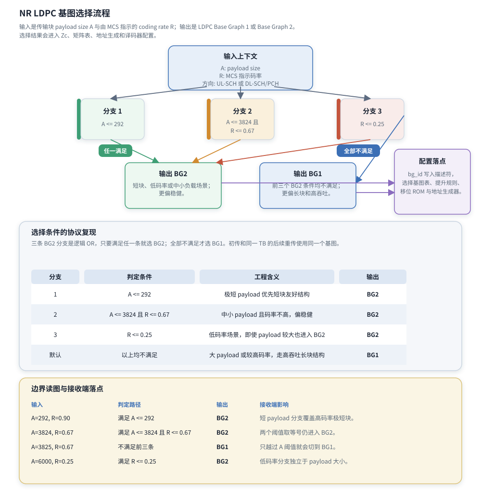

# T8.2 NR LDPC 基图选择
## 本节学习目标

本节讲低密度奇偶校验码在 NR 数据业务中的第一项结构性选择：基图（Base Graph, BG）。BG 不是译码器里的某个调参旋钮，而是后续提升大小、准循环校验矩阵、地址生成、速率匹配和迭代译码共同依赖的模板选择。选错 BG，后面的提升大小 `Zc`、校验矩阵 $H$、循环移位表、码块长度解释都会跟着错。

学完本节后，应能做到：

- 解释 Base Graph 1 和 Base Graph 2 的含义，并说清 BG 与完整校验矩阵 $H$ 的区别。
- 按 TS 38.212 Rel-19 `38212-j30` §6.2.2 和 §7.2.2 复现 BG1/BG2 选择逻辑。
- 说明负载大小 $A$ 和目标码率 $R$ 如何进入判断，以及 $R$ 为什么来自调制与编码方案上下文。
- 解释 NR 使用两个 BG 的工程动机：短块、低码率、中小负载和长块高吞吐不是同一个最优结构。
- 对给定 $(A,R)$ 条件选择 BG，并解释若选错会造成哪些接收端故障。
- 写出 `select_base_graph(...)` 的参考实现，并设计边界扫描验证。
- 说明 BG 字段如何进入寄存器传输级/专用集成电路的配置寄存器、矩阵表选择和地址生成器。

本节不是 [[T8.3_NR_LDPC_lifting_QC_matrix|T8.3]] 的提升大小精读，也不是 [[T8.5_LDPC_sum_product_BP|T8.5]]/[[T8.6_LDPC_MS_NMS_OMS|T8.6]] 的迭代算法推导。这里先把“选择哪张基图模板”这件事讲透，因为后续所有 LDPC 译码对象都建立在这个选择之上。

## 前置知识检查

| 前置项 | 本节需要达到的程度 |
|:---|:---|
| 传输块 | 知道物理层一次数据传输处理的业务块称为 TB，TB 会先附加循环冗余校验。 |
| 码块 | 知道一个 TB 可能被分成多个 CB，每个 CB 独立进入 LDPC 编码和译码。 |
| 码率 | 知道码率大致表示信息比特占编码后比特的比例；码率越低，冗余越多。 |
| LDPC | 知道 LDPC 由稀疏奇偶校验矩阵定义，译码器利用校验关系迭代更新软信息。 |
| 有限域 GF(2) | 知道奇偶校验计算在二元有限域中进行，加法等价于异或。 |
| T8.1 | 知道 NR LDPC 接收侧链路包含速率恢复、LDPC 译码、CB CRC、CB 拼接、TB CRC 和混合自动重传请求/CBG 状态。 |

LDPC 基图的核心对象关系是：BG 是小模板，`Zc` 是放大倍数，完整 $H$ 是把 BG 里的每个有效元素替换成 $Z_c \times Z_c$ 循环移位矩阵后得到的大矩阵。接收端真正做 syndrome 和消息传递时面对的是 $H$ 的结构，但硬件通常不会存完整 $H$。

## 路线图 Prompt 覆盖表

| Prompt 要求 | 本节覆盖位置 | 覆盖方式 |
|:---|:---|:---|
| 讲解 Base Graph 1 和 Base Graph 2 | “BG 与完整校验矩阵的关系”“BG1/BG2 的工程分工” | 解释 BG 是模板，列 BG1/BG2 矩阵尺寸、适配场景和接收端影响。 |
| 讲 NR 使用两个基图的原因 | “两张基图的协议与工程动机” | 从短块、低码率、中小负载、长块高吞吐、硬件并行和矩阵结构说明原因。 |
| 讲负载大小和码率如何指导选择 | “协议选择条件的完整复现” | 复现 $A \le 292$、$A \le 3824 \land R \le 0.67$、$R \le 0.25$ 三个 BG2 分支。 |
| 包含上下行协议依据 | “资料与协议边界”“协议证据表” | 分别给上行共享信道§6.2.2 和下行共享信道/PCH §7.2.2，本地路径和 Word XML 证据。 |
| 包含边界选择例子 | “教学例子：四个输入的分支走读” | 给 $A=292$、$A=3824,R=0.67$、$A=3825,R=0.67$、$A=6000,R=0.25$。 |
| 按弹性审计清单取舍并拓展 | 全文 | 补理论解释、对象模型、流程图、伪代码、浮点/定点验证、RTL/ASIC 映射、常见错误和证据记录。 |

这张表只表示最低覆盖。正文还会补充为什么不能用浮点比较偷懒、初传和重传 BG 一致性、错误 BG 的可观测现象和最小调试字段。

## 资料与协议边界

本节精读 TS 38.212 Rel-19 `38212-j30` 的 LDPC BG 选择条款，并引用 TS 38.214 Rel-19 `38214-j30` 说明 $R$ 的来源。

| 协议位置 | 本地证据路径 |
| :--- | :--- |
| TS 38.212 §6.2.1 UL-SCH TB CRC attachment | `3GPP_Rel19/processed/TS_38.212_38212-j30/content.md` 行 1361-1365 |
| TS 38.212 §6.2.2 UL-SCH LDPC base graph selection | `3GPP_Rel19/processed/TS_38.212_38212-j30/content.md` 行 1371-1379；`source.docx` 段落 P8989-P8993 |
| TS 38.212 §7.2.1 DL-SCH/PCH TB CRC attachment | `3GPP_Rel19/processed/TS_38.212_38212-j30/content.md` 行 3737-3741 |
| TS 38.212 §7.2.2 DL-SCH/PCH LDPC base graph selection | `3GPP_Rel19/processed/TS_38.212_38212-j30/content.md` 行 3747-3755；`source.docx` 段落 P14032-P14036 |
| TS 38.212 §5.2.2 Low density parity check coding | `3GPP_Rel19/processed/TS_38.212_38212-j30/content.md` 行 717-775 |
| TS 38.212 §5.3.2 Low density parity check coding | `3GPP_Rel19/processed/TS_38.212_38212-j30/content.md` 行 945-989 |
| TS 38.214 §5.1.3.1 | `3GPP_Rel19/processed/TS_38.214_38214-j30/content.md` 行 1259-1383 |
| TS 38.214 §6.1.4.1 | `3GPP_Rel19/processed/TS_38.214_38214-j30/content.md` 行 6891-7027 |

本地 `content.md` 对 §6.2.2 和 §7.2.2 的公式抽取不完整：行 1375 和行 3751 只保留了 “if , or if  and , or if , LDPC base graph 2 is used” 的文本骨架。已用 `source.docx` 的 Word XML 核验公式位置，并把段落号、关系 ID、媒体文件、SHA-256 和人工转写条件固化在 `docs/audits/T8.2_NR_LDPC_BG_selection_formula_evidence.md`。因此正文复现选择条件时，不只依赖 `content.md` 的空壳文本，而是使用 Word XML/media 证据链加人工转写记录。

协议边界也要明确：TS 38.212 规定选 BG 的逻辑和后续编码结构；TS 38.214 规定调度如何给出 $R$。协议不规定实现必须用哪个比较器位宽、是否把比较结果打一拍、是否把 `bg_id` 放在第几个配置寄存器。这些是工程实现，但必须保证对所有边界输入给出与协议相同的 BG。

## BG 与完整校验矩阵的关系

Base Graph 直译为“基图”，也常说“基矩阵模板”。它不是完整的 LDPC 校验矩阵 $H$。完整 $H$ 会随着提升大小 $Z_c$ 变大；BG 只是告诉你哪些行列组之间有连接，以及连接处的循环移位值应从哪张协议表查。

可以把三层对象分开看：

| 层次 | 对象 | 尺寸/内容 | 接收端用途 |
|:---|:---|:---|:---|
| 基图层 | BG1 或 BG2 | TS 38.212 §5.3.2 规定 BG1 的基矩阵为 46 行、68 列；BG2 为 42 行、52 列。 | 决定使用哪套 row group、column group、shift table 和码块结构。 |
| 提升层 | $Z_c$ | 从 TS 38.212 Table 5.3.2-1 的 lifting size set 中选择。 | 决定一个基图元素扩展为多大的子矩阵，也决定地址周期。 |
| 完整矩阵层 | $H$ | 把 BG 中的 0 替换为全零矩阵，把有效元素替换为 $Z_c \times Z_c$ 循环移位单位矩阵。 | syndrome、变量节点/校验节点消息传递、layered schedule 和地址生成的实际结构。 |

协议 §5.3.2 对 BG1/BG2 的矩阵尺寸给出了关键事实：BG1 基矩阵有 46 个 row groups 和 68 个 column groups；BG2 有 42 个 row groups 和 52 个 column groups。这里的“行/列”还不是完整 $H$ 的 bit-level 行/列。如果 $Z_c=384$，BG1 展开后的完整矩阵列组会对应 $68 \times 384$ 个 bit-level 列，行组会对应 $46 \times 384$ 个 bit-level 行。硬件不会把这样的大矩阵逐元素存下来，而是存 BG 表、shift value、`Zc` 和地址生成规则。

一个常见误解是把 BG 当成“码率”。BG 与码率有关，但 BG 本身不是码率。BG 是结构模板；码率还会受到 TB/CB 尺寸、CRC、filler、shortening、puncturing、rate matching 和资源分配影响。另一个误解是把 BG 当成“上行用一个、下行用一个”。这也不对。UL-SCH 和 DL-SCH/PCH 使用相同的三分支选择条件，只是 $R$ 的调度来源分别落在 TS 38.214 的 PUSCH 和 PDSCH 条款。

## 两张基图的协议与工程动机

NR 数据业务需要覆盖的场景跨度很大：有很短的控制相关数据承载，也有大吞吐业务；有码率很低、冗余很多的覆盖增强场景，也有码率较高、吞吐优先的场景。若只使用一张基图，短块和低码率场景很难同时兼顾译码性能、填充开销和硬件效率；若为每种场景定义很多张图，协议复杂度、验证成本、硬件表存储和互操作风险又会上升。两张 BG 是一种折中：结构数量少，但覆盖关键场景。

BG1 可以理解为偏向较大负载和较高吞吐的结构。它的基矩阵列组更多，适合较大的 CB 尺寸和更高吞吐路径。BG2 可以理解为偏向短块、中小负载和低码率的结构。它不是“性能总是更好”的图，而是在协议规定的短 payload 或低码率分支中更合适。工程上，这种划分让接收端先用很少的条件把译码任务路由到正确结构，再由后续 `Zc` 和 rate recovery 细化到具体 CB。

| 维度 | BG1 倾向 | BG2 倾向 | 接收端后果 |
|:---|:---|:---|:---|
| 负载大小 | 较大 payload 或中高码率场景 | 极短 payload、中小 payload 且码率不高、低码率场景 | `bg_id` 决定后续 CB segmentation 和 lifting 解释。 |
| 基矩阵规模 | 46 行、68 列 | 42 行、52 列 | row/column group 数不同，layer loop 和地址生成边界不同。 |
| 码率适配 | 更适合长块和较高吞吐路径 | 更适合低码率和短块稳健路径 | 低码率分支 $R \le 0.25$ 会直接进入 BG2。 |
| 硬件并行 | 更多列组，适合大块并行处理 | 列组更少，短块时减少不必要结构开销 | message memory、shift ROM bank 和 layer 控制都需要按 BG 切换。 |
| 错误后果 | 错用 BG2 会造成尺寸和地址错配 | 错用 BG1 会造成短块结构错配 | syndrome 不收敛、CB CRC/TB CRC 失败、HARQ soft buffer 难以定位。 |

这个动机也解释了协议选择条件的形状：它不是只按 $A$ 划线，也不是只按 $R$ 划线，而是同时用“极短块”“中小负载低/中码率”“任意负载低码率”三类分支覆盖 BG2，剩余场景交给 BG1。

## BG 选择后的术语生命周期

BG 选择不是只输出一个 `1/2` 标签。它会沿着 segmentation、lifting、mother code、rate matching 和 decoder schedule 一直传下去。下面按生命周期串起来：

| 阶段 | 关键术语 | 与 BG 的关系 | 接收端风险 |
|:---|:---|:---|:---|
| TB 输入 | $A$、$B$、$R$ | $A$ 是 TB payload size；$B$ 是加 TB CRC 后进入 CB segmentation 的长度；$R$ 是 MCS 指示的 target code rate。BG 选择看 $A$ 和 $R$，不是看 $B/E$。 | 把 $B$ 或本次发送长度 $E$ 当 $A$ 会让 292/3824 边界错。 |
| CB segmentation | $K_{\mathrm{cb}}$、$K_b$ | BG1/BG2 对应不同最大 CB size 和不同 $K_b$ 规则，进而影响 filler 数。 | `Kcb/Kb` 错会让 filler mask 和 CB 数不一致。 |
| lifting | $Z_c$、$i_{\mathrm{LS}}$ | $K_bZ_c$ 必须容纳当前 CB 输入；找到 $Z_c$ 后由 Table 5.3.2-1 得到 $i_{\mathrm{LS}}$。 | `Zc` 与 `iLS` 不匹配会选错 shift value 列。 |
| matrix | shift value $V_{i,j}$ | BG 选择 Table 5.3.2-2 或 5.3.2-3；$i_{\mathrm{LS}}$ 选择列；接收端实际使用 $P_{i,j}=V_{i,j}\bmod Z_c$。 | BG 表错用时 row/column 数和所有边连接都错。 |
| mother code | $N$、first $2Z_c$ puncturing | 完整 LDPC 编码输出先形成母码位置；NR LDPC rate matching 不发送前 $2Z_c$ 个系统位区域，这是 puncturing/unknown 语义，不是 filler。 | first $2Z_c$ 被强制为 filler 0 会污染 payload 推断。 |
| rate matching | $N_{\mathrm{cb}}$、$E_r$、RV | `Ncb` 是 circular buffer 可用长度，可能因 limited-buffer rate matching 小于完整母码范围；$E_r$ 是本 CB 本次输出长度。 | 用 $N$ 取模代替 `Ncb` 会使 RV 地址错。 |

因此，`BG` 是一条协议因果链的起点，不是一个孤立配置位。工程 dump 里至少要把 `A/B/R/Kcb/Kb/Zc/iLS/N/Ncb/E/rv` 一起保存，否则最后看到 CRC fail 时无法判断问题来自 BG 分支、lifting、filler、puncturing 还是 rate recovery。

## 协议选择条件的完整复现

TS 38.212 §6.2.2 和 §7.2.2 的选择逻辑可以复现为下面的布尔表达式。令 $A$ 表示 TB payload size，令 $R$ 表示由 MCS index 指示的 target code rate：

$$
\mathrm{BG2} =
(A \le 292)
\lor
(A \le 3824 \land R \le 0.67)
\lor
(R \le 0.25)
\tag{1}
$$

式 (1) 回答的问题是：什么情况下使用 LDPC Base Graph 2。三条分支是逻辑或，只要满足任意一条就选 BG2。若三条分支全部不满足，则使用 BG1：

$$
\mathrm{BG1} = \lnot \mathrm{BG2}
\tag{2}
$$

也可以写成“选择条件的协议复现”表。这里的三条 BG2 分支是逻辑 OR，只要满足任一条就选 BG2；全部不满足才选 BG1。初传和同一 TB 的后续重传使用同一个基图。

| 分支 | 判定条件 | 工程含义 | 输出 |
|:---|:---|:---|:---|
| 1 | $A \le 292$ | 极短 payload 优先短块友好结构 | BG2 |
| 2 | $A \le 3824$ 且 $R \le 0.67$ | 中小 payload 且码率不高，偏稳健 | BG2 |
| 3 | $R \le 0.25$ | 低码率场景，即使 payload 较大也进入 BG2 | BG2 |
| 默认 | 以上均不满足 | 大 payload 或较高码率，走高吞吐长块结构 | BG1 |

“判定顺序”只是实现时便于写代码的顺序。协议含义是三条 BG2 条件的逻辑或，不要求硬件一定按这个顺序串行比较。硬件可以并行计算三个比较结果，然后做或门；软件参考模型可以按上表顺序返回第一个命中原因。

还有一个容易漏掉的细节：§6.2.2 和 §7.2.2 都把规则用于 initial transmission of a transport block，并说明 subsequent re-transmission of the same transport block 也使用同一选择。接收端不能在重传时因为 MCS 字段、冗余版本或调度上下文变化而重新选择另一个 BG。HARQ soft buffer 里的旧软信息是按同一个 BG、同一个 `Zc` 和同一套母码位置解释的；重传改 BG 会让旧新对数似然比无法在同一坐标系中合并。

NR LDPC 基图选择流程如下。输入是传输块 payload size $A$ 与由 MCS 指示的 coding rate $R$；输出是 LDPC Base Graph 1 或 Base Graph 2。选择结果会进入 `Zc`、矩阵表、地址生成和译码器配置。



| 内容 | 说明 |
|:---|:---|
| 输入 | $A$ 是 TB payload size；$R$ 是由 MCS 语义给出的 target code rate；方向上下文只用于定位 UL/DL 的 MCS 来源。 |
| BG2 分支 1 | $A \le 292$，极短 payload 即使码率较高也选 BG2。 |
| BG2 分支 2 | $A \le 3824$ 且 $R \le 0.67$，中小 payload 且码率不高时选 BG2。 |
| BG2 分支 3 | $R \le 0.25$，低码率场景独立命中 BG2。 |
| 默认分支 | 三条 BG2 条件全部不满足时输出 BG1。 |
| descriptor 落点 | `bg_id` 后续选择 Table 5.3.2-2/3、lifting size 规则、shift ROM、rate recovery 母码坐标和 decoder 地址生成器。 |
| 边界例 | $A=292,R=0.90$ 选 BG2；$A=3824,R=0.67$ 选 BG2；$A=3825,R=0.67$ 选 BG1；$A=6000,R=0.25$ 选 BG2。 |
本节流程顺序是：输入 $A$、$R$ 和方向上下文；三条 BG2 分支任一命中则输出 BG2；三条均不命中则输出 BG1；输出 `bg_id` 后进入 descriptor、基图表、lifting 规则、shift ROM 和地址生成器。

边界读图与接收端落点要按下表检查。`判定路径` 不是调试日志的装饰字段，而是解释为什么当前 TB 进入 BG1 或 BG2 的最短证据；`接收端影响` 则说明该选择会影响后续哪类 descriptor 和硬件配置。

| 输入 | 判定路径 | 输出 | 接收端影响 |
|:---|:---|:---|:---|
| $A=292,\ R=0.90$ | 满足 $A \le 292$ | BG2 | 短 payload 分支覆盖高码率极短块。 |
| $A=3824,\ R=0.67$ | 满足 $A \le 3824$ 且 $R \le 0.67$ | BG2 | 两个阈值取等号仍进入 BG2。 |
| $A=3825,\ R=0.67$ | 不满足前三条 | BG1 | 只越过 $A$ 阈值就会切到 BG1。 |
| $A=6000,\ R=0.25$ | 满足 $R \le 0.25$ | BG2 | 低码率分支独立于 payload 大小。 |

## $A$ 与 $R$ 的来源

$A$ 不是“编码后的比特数”，也不是“本次实际发送的编码比特数 $E$”。TS 38.212 §6.2.1 和 §7.2.1 都在 TB CRC attachment 处把 $A$ 描述为 payload size。直观地说，$A$ 是 TB 进入物理层加 CRC 之前的业务负载长度。BG 选择发生在 TB CRC 之后、CB segmentation 之前，因此协议用原始 payload size $A$ 做分支条件。

$R$ 也不能由接收端随意用 $A/E$ 估计。§6.2.2 明确说上行初传的 coding rate $R$ 由 TS 38.214 §6.1.4.1 的 MCS index 指示；§7.2.2 明确说下行初传的 $R$ 由 TS 38.214 §5.1.3.1 的 MCS index 指示。换言之，$R$ 是调度/MCS 语义里的 target code rate，不是译码器事后从软信息长度反推出来的浮点数。

| 输入 | 协议来源 | 不是 | 接收端获取方式 |
|:---|:---|:---|:---|
| $A$ | TS 38.212 §6.2.1 或 §7.2.1 的 payload size | 不是 $E$，不是 CB 长度，不能把 TB CRC 或 CB CRC 随便算进去 | 来自 TB size/传输块大小和媒体接入控制层/PHY 交付上下文。 |
| $R$ | TS 38.214 §6.1.4.1 或 §5.1.3.1 的 target code rate | 不是实时测得的信道质量，也不是实际 rate matching 后的简单比值 | 来自 MCS table 选择、MCS index 和方向上下文。 |
| 方向 | UL-SCH、DL-SCH/PCH | 不是 BG 的直接分支条件 | 用来定位 $R$ 的 TS 38.214 条款和 TB 流程。 |
| 重传上下文 | 同一 TB 的 HARQ process | 不是重新选 BG 的理由 | 从初传 descriptor 或 HARQ context 继承 `bg_id`。 |

工程实现里建议把 $R$ 表示为整数或有理数，而不是二进制浮点。例如 MCS 表常以 `R x 1024` 或类似缩放形式给出目标码率，参考模型可以把阈值也写成缩放整数来比较。这样可以避免 `0.67` 在浮点里不可精确表示导致的边界分支不稳定。

一个稳健的比较方式是：

$$
R \le 0.67 \quad \Longleftrightarrow \quad 100 R_{\mathrm{num}} \le 67 R_{\mathrm{den}}
\tag{3}
$$

$$
R \le 0.25 \quad \Longleftrightarrow \quad 4 R_{\mathrm{num}} \le R_{\mathrm{den}}
\tag{4}
$$

式 (3) 和式 (4) 回答的是实现层如何避免浮点比较误差。若内部直接用 `R_x1024`，也可以把阈值写成经过统一取整策略的整数阈值，但必须在 golden model、RTL 和验证向量之间保持一致。

## 教学例子：四个输入的分支走读

下面的例子不是协议一致性向量，只用于训练分支判断。每个例子都列出输入、判断过程、输出 BG 和选错后的接收端后果。

| 例子 | 输入 | 判断过程 | 输出 | 若选错的后果 |
|:---|:---|:---|:---|:---|
| 极短 payload | $A=200,\ R=0.90$ | 命中 $A \le 292$，不需要再看后两条分支。 | BG2 | 若错选 BG1，短块会进入错误基矩阵结构，后续 `Zc`、filler 和 syndrome 检查坐标系全错。 |
| 中小 payload 中码率 | $A=1000,\ R=0.50$ | 不一定命中极短分支，但满足 $A \le 3824$ 且 $R \le 0.67$。 | BG2 | 若错选 BG1，CB segmentation 和 LDPC matrix 配置与发送端不一致，CB CRC/TB CRC 高概率失败。 |
| 默认 BG1 | $A=5000,\ R=0.50$ | $A>292$；$A>3824$；$R>0.25$。三条 BG2 分支均不满足。 | BG1 | 若错选 BG2，硬件会用 42x52 基图解释本应使用 BG1 的结构，message memory 和地址访问边界错误。 |
| 大 payload 低码率 | $A=6000,\ R=0.20$ | 前两条不满足或不完全满足，但 $R \le 0.25$。 | BG2 | 若只按 $A>3824$ 简化为 BG1，会漏掉低码率分支，造成低码率场景系统性失败。 |

边界值要特别小心：

| 输入 | 结果 | 原因 |
|:---|:---|:---|
| $A=292,\ R=0.90$ | BG2 | 第一条使用小于等于，等号命中。 |
| $A=293,\ R=0.90$ | BG1 | 第一条刚越界；第二条的 $R \le 0.67$ 不满足；第三条不满足。 |
| $A=3824,\ R=0.67$ | BG2 | 第二条两个阈值都取等号，仍命中。 |
| $A=3825,\ R=0.67$ | BG1 | 第二条的 $A \le 3824$ 不满足，第三条也不满足。 |
| $A=3825,\ R=0.25$ | BG2 | 虽然越过 3824，但第三条低码率分支命中。 |

这些边界例子是单元测试必须覆盖的最小集合。它们能捕获三类常见 bug：把 `<=` 写成 `<`、漏掉低码率分支、把三个 BG2 条件误写成逻辑与。

## 接收端流程与 descriptor 落点

BG 选择在接收端不是孤立函数，而是 TB/CB descriptor 生成的一部分。一个典型接收端流程如下：

1. 从调度上下文和 TB size 计算或读取 payload size $A$。
2. 按方向定位 $R$：PUSCH 使用 TS 38.214 §6.1.4.1，PDSCH 使用 §5.1.3.1。
3. 若这是同一 TB 的重传，优先读取初传时保存的 `bg_id`；同时检查新调度上下文没有破坏同一 TB 的一致性。
4. 初传时按式 (1) 生成 `bg_id`。
5. 把 `bg_id` 写入 TB descriptor 和每个 CB descriptor。
6. 后续 CB segmentation、`Zc` 选择、rate recovery、LDPC matrix table、syndrome checker 和 decoder core 都使用同一个 `bg_id`。

最小 descriptor 字段如下：

| 字段 | 来源 | 使用位置 | 错误现象 |
|:---|:---|:---|:---|
| `tb_id` / `harq_id` | 调度与 HARQ context | 区分初传/重传、soft buffer namespace | 重传继承错 BG，旧新软信息合并到不同坐标系。 |
| `direction` | PUSCH/PDSCH/PCH 上下文 | 定位 $R$ 的协议条款 | 用错 MCS table 或 target code rate。 |
| `A` | TS 38.212 §6.2.1/§7.2.1 | BG 选择、TB CRC 输入边界 | 把 TB CRC 也算入 $A$，边界条件偏移。 |
| `R_num/R_den` 或 `R_scaled` | TS 38.214 MCS table | BG 选择 | 浮点比较导致 $0.67$、$0.25$ 边界不稳定。 |
| `bg_id` | TS 38.212 §6.2.2/§7.2.2 | `Zc`、BG table、shift ROM、decoder core | syndrome 不收敛、CRC 失败、地址越界。 |
| `C`、`cb_id` | CB segmentation | 每个 CB 的 LDPC 任务划分 | CB 数和 BG/Zc 组合不一致。 |

接收端日志中建议保存 `bg_select_reason`，例如 `A_LE_292`、`A_LE_3824_AND_R_LE_067`、`R_LE_025` 或 `DEFAULT_BG1`。这不是协议字段，但对定位边界 bug 很有价值。

## 伪代码与参考实现

下面的 Python 片段给出教学参考。真实实现应使用与 MCS 表一致的定点或整数码率表示。

```python
from dataclasses import dataclass
from fractions import Fraction


@dataclass(frozen=True)
class BaseGraphDecision:
    bg: int
    reason: str


def select_base_graph(A: int, R: Fraction, retransmission_bg: int | None = None) -> BaseGraphDecision:
    if A <= 0:
        raise ValueError("A must be a positive payload size")

    if retransmission_bg is not None:
        if retransmission_bg not in (1, 2):
            raise ValueError("saved retransmission BG must be 1 or 2")
        return BaseGraphDecision(retransmission_bg, "reuse_initial_transmission_bg")

    if A <= 292:
        return BaseGraphDecision(2, "A <= 292")
    if A <= 3824 and R <= Fraction(67, 100):
        return BaseGraphDecision(2, "A <= 3824 and R <= 0.67")
    if R <= Fraction(1, 4):
        return BaseGraphDecision(2, "R <= 0.25")
    return BaseGraphDecision(1, "otherwise")
```

这段代码有三个设计点：

- `R` 用 `Fraction` 表示，避免二进制浮点边界误差。
- 重传时可以传入 `retransmission_bg`，表达“同一 TB 的后续重传复用初传 BG”。
- 返回 `reason`，便于测试覆盖和现场日志定位。

边界扫描测试可以写成：

```python
tests = [
    (292, Fraction(90, 100), 2),
    (293, Fraction(90, 100), 1),
    (3824, Fraction(67, 100), 2),
    (3825, Fraction(67, 100), 1),
    (3825, Fraction(25, 100), 2),
    (6000, Fraction(26, 100), 1),
]

for A, R, expected_bg in tests:
    decision = select_base_graph(A, R)
    assert decision.bg == expected_bg, (A, R, decision)
```

如果 RTL 用 `R_x1024`，则 golden model 要明确阈值换算和取整策略。不能让 C model 用浮点 `0.67`，RTL 用整数 686，验证脚本又用另一个四舍五入值；这会在边界用例里造成“模型互相不一致”。

## 浮点仿真与协议分支验证

[[T8.2_NR_LDPC_base_graph_selection|T8.2]] 本身没有误块率曲线，也不直接跑 LDPC 迭代性能仿真；它的浮点/参考模型验证重点是分支覆盖和上下文一致性。建议最小验证集包括：

| 验证项 | 输入集合 | 预期检查 |
|:---|:---|:---|
| 极短 payload 分支 | $A \in \{1, 292\}$，$R$ 取高码率和低码率 | 全部 BG2，原因应为第一分支。 |
| 极短边界后一位 | $A=293$，$R=0.90$ | BG1，证明第一分支没有写成 $A<293$ 或漏判。 |
| 中小负载码率边界 | $A \in \{3823,3824,3825\}$，$R \in \{0.67,0.6701\}$ | 只在 $A \le 3824$ 且 $R \le 0.67$ 时命中第二分支。 |
| 低码率独立分支 | $A \in \{3825,10000\}$，$R \in \{0.25,0.2501\}$ | $R=0.25$ BG2；略高于 0.25 时若前两条不满足则 BG1。 |
| 重传一致性 | 初传保存 BG1 或 BG2，重传给出不同 MCS 上下文 | 复用初传 `bg_id`，并在日志记录复用原因。 |
| 方向一致性 | 同一 $(A,R)$ 分别走 UL-SCH 和 DL-SCH/PCH | BG 结果相同；证据条款和 $R$ 来源不同。 |

如果要把分支验证接到完整 LDPC 仿真，建议至少做两个 sanity check：同一 TB 用正确 BG 能在高信噪比下通过 CB/TB CRC；人为强制错误 BG 时，解码器应出现 syndrome 不收敛、CRC fail 或配置尺寸断言，而不是静默输出 pass。

## 定点化策略

BG 选择的定点化重点不是软信息位宽，而是比较输入的一致表示。$A$ 是整数，风险很小；$R$ 来自 MCS 表，风险在于不同模块对码率阈值的缩放和舍入不一致。

| 风险 | 典型错误 | 建议策略 |
|:---|:---|:---|
| `0.67` 浮点误差 | 软件 `float` 比较边界，`0.6700000001` 导致分支翻转 | 用有理数、整数交叉相乘或统一 `R_scaled`。 |
| 阈值取整不统一 | C model 使用 `floor(0.67*1024)`，RTL 使用 `round` | 在公共头文件或寄存器 spec 中定义阈值常量和比较方向。 |
| 等号处理错误 | 把 $R \le 0.25$ 写成 $R < 0.25$ | 边界测试固定包含 $0.25$ 和 $0.67$。 |
| 重传重新计算 | 重传 MCS 上下文变化导致 `bg_id` 翻转 | HARQ context 保存初传 `bg_id`，重传路径优先复用。 |
| $A$ 边界误算 | 把 TB CRC 位也加入 $A$ 后再比较 | descriptor 同时记录 `A_payload` 和 `B_after_tb_crc`，禁止混用。 |

这里不涉及对数似然比的饱和或量化，因为 BG 选择发生在 LDPC core 使用 LLR 之前。LLR 定点化会在 [[T8.6_LDPC_MS_NMS_OMS|T8.6]]、[[T9.1_NR_LDPC_rate_recovery_overview|T9.1]] 和 [[T9.2_NR_LDPC_circular_buffer_states|T9.2]] 继续展开。

## RTL/ASIC 映射

硬件里 BG 选择通常是 TB descriptor 生成路径的一段组合/时序逻辑，而不是 LDPC core 内部迭代时才临时判断。一个常见映射如下：

| 硬件对象 | 输入 | 输出/控制 | 验证关注点 |
|:---|:---|:---|:---|
| BG select block | `A_payload`、`R_scaled`、`is_retx`、`saved_bg_id` | `bg_id`、`bg_select_reason` | 三个 BG2 分支、默认 BG1、重传复用。 |
| Descriptor register file | `bg_id`、`A`、`R`、`harq_id`、`tb_id` | 每个 CB 译码任务的配置字段 | 初传/重传一致性，跨 TB 不串扰。 |
| Base graph table selector | `bg_id` | 选择 BG1/BG2 的 row/column/shift 表 | BG1/BG2 表不能互换。 |
| Lifting-size controller | `bg_id`、CB size、lifting set | `Zc`、set index | BG2 的 $K_b$ 分支和 lifting 规则不能套用 BG1。 |
| Address generator | `bg_id`、`Zc`、layer、column group | message memory 和 LLR memory 地址 | row group 数、column group 数和 bank 映射不越界。 |
| Syndrome checker | `bg_id`、`Zc`、hard decision | syndrome weight | 错 BG 应被 syndrome/CRC 或配置断言捕获。 |

这里的 $K_b$ 是 TS 38.212 §5.2.2 中 BG2 选择 lifting size 时使用的中间参数，本节只指出它受 `bg_id` 影响，具体取值分支和 $Z_c$ 选择留到 [[T8.3_NR_LDPC_lifting_QC_matrix|T8.3]] 展开。

若实现采用 layered schedule，`bg_id` 会影响 layer loop 的上限和每层访问的 column group 列表。BG1 的 46 个 row groups 和 BG2 的 42 个 row groups 不可混用。若某个 bug 把 BG1 的 row count 用在 BG2 任务上，轻则读到空表项，重则访问非法 memory bank；若刚好没有越界，也会因为校验关系错误导致 syndrome 不收敛。

## 常见错误与定位方式

| 错误 | 现场现象 | 最小 dump 字段 | 定位方式 |
|:---|:---|:---|:---|
| 漏掉 $R \le 0.25$ 分支 | 大 payload 低码率场景系统性 CRC fail | `A`、`R_scaled`、`bg_id`、`reason`、MCS table id | 用 $A=6000,R=0.25$ 边界例子复现。 |
| 把三个 BG2 条件写成逻辑与 | 只有极少数场景进入 BG2 | 分支布尔值 `b0/b1/b2` | 检查 OR/AND gate 或软件 if 条件。 |
| 等号处理错误 | $A=292$、$A=3824,R=0.67$、$R=0.25$ 处与 golden 不一致 | 原始输入和比较结果 | 对每个阈值做 `-1/0/+1` 扫描。 |
| $A$ 使用错误 | 所有接近 292/3824 的 TB 边界异常 | `A_payload`、`B_after_tb_crc`、CB count | 确认 BG 选择使用 payload size，而不是加 CRC 后长度。 |
| 重传重选 BG | 初传能过或接近收敛，重传合并后更差 | HARQ ID、NDI、initial `bg_id`、retx `bg_id` | 检查 HARQ context 是否保存并复用初传 BG。 |
| 用错方向的 MCS 表 | 某些 UL 或 DL 调度异常 | direction、MCS table id、MCS index、`R_scaled` | 核对 TS 38.214 §6.1.4.1/§5.1.3.1 路径。 |
| BG 与 `Zc` 不一致 | 地址越界、syndrome 不收敛、CB CRC fail | `bg_id`、`Zc`、lifting set index、row/column count | 对比 [[T8.3_NR_LDPC_lifting_QC_matrix|T8.3]] 的 lifting 规则和 BG shift table。 |

定位时不要只看最后 TB CRC fail。BG 错误通常在更早的配置层就有痕迹：`bg_id` 与 `Zc` 不匹配、base graph table select 错、layer count 错、rate recovery 恢复出的母码长度与 decoder 期望不一致。把这些字段放进最小 dump，可以把问题从“LDPC 性能差”缩小到“BG 分支错误”。

## 自测题

1. Base Graph 与完整校验矩阵 $H$ 有什么区别？
2. 给定 $A=293,\ R=0.66$，应选择 BG1 还是 BG2？说明判断路径。
3. 给定 $A=5000,\ R=0.25$，应选择 BG1 还是 BG2？为什么不能只按 $A>3824$ 判断？
4. 为什么同一 TB 的后续重传不能重新选择另一个 BG？
5. 为什么实现里不建议直接用浮点 `0.67` 做边界比较？
6. 错选 BG 后，接收端最可能在哪些地方表现出异常？

## 自测题参考答案

1. BG 是小的基矩阵模板，描述 row group、column group 和连接结构；完整 $H$ 是结合 $Z_c$ 后，把 BG 中的有效元素替换为 $Z_c \times Z_c$ 循环移位矩阵得到的 bit-level 校验矩阵。硬件通常保存 BG/shift 表和地址规则，不保存完整 $H$。
2. $A=293$ 不满足 $A \le 292$；$A=293 \le 3824$ 且 $R=0.66 \le 0.67$，命中第二条 BG2 分支，因此选择 BG2。
3. 选择 BG2。虽然 $A=5000>3824$，但 $R=0.25$ 命中第三条低码率分支。只按 payload 阈值判断会漏掉协议明确规定的低码率 BG2 条件。
4. HARQ 重传需要和初传 soft buffer 在同一个母码位置坐标系中合并。若重传重新选择 BG，`Zc`、$H$、rate recovery 地址和 message memory 结构都可能变化，旧新 LLR 无法正确合并。
5. `0.67` 在二进制浮点中不可精确表示，边界附近可能因为舍入导致软件、RTL 和验证脚本分支不一致。应使用有理数、交叉相乘或统一缩放整数比较。
6. 典型异常包括 `Zc` 选择错误、base graph table 错选、地址生成越界、syndrome 不收敛、CB CRC 或 TB CRC 失败、重传软合并性能反而变差。

## 协议证据表

| 结论 | 协议证据 | 本地核验 |
|:---|:---|:---|
| UL-SCH 的 BG 选择由 TS 38.212 §6.2.2 规定 | §6.2.2 指出 initial transmission 和 subsequent re-transmission of the same TB 按条件使用 BG1/BG2，$R$ 来自 TS 38.214 §6.1.4.1，$A$ 来自 §6.2.1 | `content.md` 行 1371-1379；Word XML 段落 P8989-P8993，公式 OLE/WMF 见 P8991。 |
| DL-SCH/PCH 的 BG 选择由 TS 38.212 §7.2.2 规定 | §7.2.2 指出 initial transmission 和 subsequent re-transmission of the same TB 按条件使用 BG1/BG2，$R$ 来自 TS 38.214 §5.1.3.1，$A$ 来自 §7.2.1 | `content.md` 行 3747-3755；Word XML 段落 P14032-P14036，公式 OLE/WMF 见 P14034。 |
| BG2 条件为 $A \le 292$、$A \le 3824 \land R \le 0.67$、$R \le 0.25$ | TS 38.212 §6.2.2/§7.2.2 的基图选择条款 | `content.md` 抽取公式文本不完整；`docs/audits/T8.2_NR_LDPC_BG_selection_formula_evidence.md` 已记录 Word XML 段落、关系 ID、媒体 SHA-256 和人工转写映射。 |
| BG1 是 BG2 三分支均不满足时的默认选择 | TS 38.212 §6.2.2/§7.2.2 的 otherwise 分支 | `content.md` 行 1377 和 3753。 |
| BG1/BG2 对应不同基矩阵尺寸 | TS 38.212 §5.3.2 说明 BG1 为 46 行 68 列，BG2 为 42 行 52 列 | `content.md` 行 971-977。 |
| 完整 $H$ 由 BG、$Z_c$ 和循环移位矩阵构造 | TS 38.212 §5.3.2 说明 0 元素替换为全零矩阵，1 元素替换为循环移位单位矩阵 | `content.md` 行 977-989。 |
| $R$ 由 MCS index 指示 | TS 38.214 §5.1.3.1 与 §6.1.4.1 | `content.md` 行 1259-1383、6891-7027。 |

## 图示


## 执行与证据记录

| 项目 | 记录 |
|:---|:---|
| 路线图卡片 | `2026-06-19-lte-nr-decoding-learning-roadmap.md` [[T8.2_NR_LDPC_base_graph_selection|T8.2]]，Prompt/产出/验收/3GPP 证据已覆盖。 |
| 讲义文件 | `docs/L2_协议算法/T8.2_NR_LDPC_base_graph_selection.md`。 |
| 协议来源 | TS 38.212 Rel-19 `38212-j30` §5.2.2、§5.3.2、§6.2.1、§6.2.2、§7.2.1、§7.2.2；TS 38.214 Rel-19 `38214-j30` §5.1.3.1、§6.1.4.1。 |
| 本地路径 | `3GPP_Rel19/processed/TS_38.212_38212-j30/content.md`、`source.docx`、`document.xml`；`3GPP_Rel19/processed/TS_38.214_38214-j30/content.md`。 |
| Word XML 公式证据 | UL §6.2.2：P8991，`oleObject555.bin`-`oleObject558.bin`，`media/image391.wmf`-`media/image394.wmf`；DL §7.2.2：P14034，`oleObject1715.bin`-`oleObject1718.bin`，`media/image982.wmf`/`image392.wmf`/`image393.wmf`/`image394.wmf`；详见 `docs/audits/T8.2_NR_LDPC_BG_selection_formula_evidence.md`。 |
| 图表资产 | `docs/L2_协议算法/assets/T8.2_NR_LDPC_base_graph_selection_flow.svg`（手绘 SVG，替代原 `tools/figures/render_nr_ldpc_base_graph_selection.py` 生成的 PNG）。 |
| 待后续章节展开 | [[T8.3_NR_LDPC_lifting_QC_matrix|T8.3]] 复现 Table 5.3.2-1/2/3 的 lifting 和 BG shift 表；[[T9.1_NR_LDPC_rate_recovery_overview|T9.1]]/[[T9.2_NR_LDPC_circular_buffer_states|T9.2]] 展开 rate recovery 与 circular buffer；T9/T11 使用 TS 38.214 具体 MCS/TBS/RV/CBG 表值时重建相关表格子集。 |
| 审核经理复核 | Critical=0、Important=2、Minor=2；已修复公式证据链不够可复核、图表面板贴边、PCH 漏写和 $K_b$ 未定义。 |
| 单篇审计 | `python3 tools/audit_lesson_terms.py docs/L2_协议算法/T8.2_NR_LDPC_base_graph_selection.md` 输出 `LESSON_TERM_AUDIT_OK`；`python3 tools/audit_markdown_headings.py docs/L2_协议算法/T8.2_NR_LDPC_base_graph_selection.md` 输出 `MARKDOWN_HEADING_AUDIT_OK`；`python3 tools/audit_lesson_depth.py --strict docs/L2_协议算法/T8.2_NR_LDPC_base_graph_selection.md` 输出 `LESSON_DEPTH_AUDIT_OK`；`python3 tools/audit_latex_render.py docs/L2_协议算法/T8.2_NR_LDPC_base_graph_selection.md docs/audits/T8.2_NR_LDPC_BG_selection_formula_evidence.md` 输出 `LATEX_RENDER_AUDIT_OK formulas=157`。 |

## 参考文献

1. 3GPP TS 38.212 Rel-19 `38212-j30`, “NR; Multiplexing and channel coding”, §5.2.2, §5.3.2, §6.2.1, §6.2.2, §7.2.1, §7.2.2.
2. 3GPP TS 38.214 Rel-19 `38214-j30`, “NR; Physical layer procedures for data”, §5.1.3.1, §6.1.4.1.
3. R. G. Gallager, “Low-Density Parity-Check Codes”, IRE Transactions on Information Theory, 1962.
