# T8.3 NR LDPC 提升大小与 QC-LDPC 矩阵构造
## 本节学习目标

本节讲 NR 低密度奇偶校验码从“基图模板”变成“译码器真正使用的奇偶校验矩阵”的过程。[[T8.2_NR_LDPC_base_graph_selection|T8.2]] 已经解决选 Base Graph 1 还是 Base Graph 2；本节继续回答三个问题：提升大小 $Z_c$ 是什么，准循环 LDPC（Quasi-Cyclic LDPC, QC-LDPC）为什么适合硬件，TS 38.212 Table 5.3.2-1/2/3 如何共同定义完整校验矩阵 $H$。

学完本节后，应能做到：

- 解释 lifting size $Z_c$ 的含义：一个基图元素扩展成 $Z_c \times Z_c$ 子矩阵。
- 解释 QC-LDPC 的 quasi-cyclic 含义，以及循环移位结构为什么利于地址生成。
- 读懂 TS 38.212 Table 5.3.2-1/2/3：set index、lifting size set、row index、column index、shift value 分别是什么。
- 区分 `-1`、协议表里的 `0` 和空白单元：`-1` 是零矩阵，`0` 是零移位单位矩阵，空白 row index 是表格排版延续。
- 用一个 $2 \times 3$ 玩具基矩阵和 $Z_c=4$ 手算展开后的完整 $H$。
- 写出生成循环移位单位矩阵和完整 $H$ 的 Python 片段，并检查行列权重。
- 说明接收端为什么必须知道 `BG`、`iLS`、`Zc` 和 shift value，错误时会出现哪些 syndrome、地址和循环冗余校验问题。
- 说明寄存器传输级/专用集成电路中 base graph table、shift ROM、barrel shifter/address offset 和 bank 地址之间的关系。

本节仍然不是 Belief Propagation 或 Min-Sum 的消息更新推导。它解决的是“消息传递图从哪里来”。如果 $H$ 构造错，后面的算法再精细也只是在错误图上迭代。

## 前置知识检查

| 前置项 | 本节需要达到的程度 |
|:---|:---|
| T8.2 基图选择 | 知道 `BG=1/2` 来自 payload size $A$ 和 target code rate $R$ 的协议分支。 |
| GF(2) | 知道奇偶校验矩阵乘法在二元有限域中进行，加法等价于异或。 |
| 单位矩阵 | 知道单位矩阵主对角线上为 1，其余为 0。 |
| 循环移位 | 知道一行或一列移出边界后会从另一侧回到矩阵内。 |
| 奇偶校验矩阵 $H$ | 知道 $H\hat{\mathbf{x}}^T=\mathbf{0}$ 表示候选码字满足 LDPC 校验约束。 |

如果这些前置还不稳，先抓住一句话：NR 不把完整 $H$ 一项一项写在协议里，而是用“BG 表 + lifting size + shift value”生成一个规律很强的大矩阵。这个规律就是 QC-LDPC 的核心。

## 路线图 Prompt 覆盖表

| Prompt 要求 | 本节覆盖位置 | 覆盖方式 |
|:---|:---|:---|
| 讲解提升大小 | “提升大小的含义” | 解释 $Z_c$、矩阵尺寸、码块尺寸、并行度和地址周期。 |
| 讲解准循环 LDPC | “QC-LDPC 的结构直觉” | 解释循环移位单位矩阵、准循环连接和硬件友好性。 |
| 讲解基矩阵 | “基图表与完整矩阵的层级” | 区分 BG/base matrix、shift table 和完整 $H$。 |
| 讲解循环置换矩阵 | “循环移位单位矩阵手算” | 给 $Z_c=4$、shift=0/1/2 的矩阵。 |
| 讲解奇偶校验矩阵展开 | “玩具基矩阵展开例子” | 从 $2 \times 3$ 玩具基矩阵展开到 $8 \times 12$ 完整 $H$。 |
| 包含玩具基矩阵展开例子 | “玩具基矩阵展开例子”和图 T8.3-3 | 给出矩阵、替换规则、完整结果和 Python 复现。 |
| Table 5.3.2-1/2/3 复现前必须核验 | “协议表格复现与列含义” | 核验 `table_0013/0014/0015.csv/html`，记录行列数、哈希、表格化复现和每列含义。 |
| 按弹性审计清单取舍并拓展 | 全文 | 补理论解释、协议证据、接收端 descriptor、定点/RTL、验证、常见错误、自测题和执行记录。 |

这张表只表示最低覆盖。正文继续拓展协议表的读法、错误现象和硬件落点，避免把三张表变成孤立索引。

## 资料与协议边界

本节精读 TS 38.212 Rel-19 `38212-j30` §5.3.2，并引用 §5.2.2 的 lifting size 选择入口。协议证据如下：

| 协议位置 | 本地证据路径 |
| :--- | :--- |
| TS 38.212 §5.2.2 | `3GPP_Rel19/processed/TS_38.212_38212-j30/content.md` 行 747-775 |
| TS 38.212 §5.3.2 | `3GPP_Rel19/processed/TS_38.212_38212-j30/content.md` 行 948-989 |
| Table 5.3.2-1 | `tables/table_0013.csv` 和 `tables/table_0013.html` |
| Table 5.3.2-2 | `tables/table_0014.csv` 和 `tables/table_0014.html` |
| Table 5.3.2-3 | `tables/table_0015.csv` 和 `tables/table_0015.html` |

抽取边界要明确：`content.md` 对 §5.2.2 和 §5.3.2 的部分公式符号有丢失，例如行 771 和 951-977 的变量名不完整。本节涉及的协议表格已从 CSV/HTML 核验并表格化复现；涉及公式时，正文会用协议语义重建符号关系，并把完整表格证据作为可复核来源。[[T8.3_NR_LDPC_lifting_QC_matrix|T8.3]] 不重建 Table 5.3.2-2/3 的每个 shift value 为 Markdown 文本，因为协议原表很长；正文插入完整表格化复现，并解释每列含义和读表方法。

## 提升大小的含义

提升大小 $Z_c$ 的英文是 lifting size。lifting 直译是“提升”或“放大”：把基图上的一个元素提升为一个 $Z_c \times Z_c$ 的小矩阵。若基图有 $m_b$ 个行组和 $n_b$ 个列组，展开后的完整校验矩阵尺寸就是：

$$
H \in \{0,1\}^{m_b Z_c \times n_b Z_c}
\tag{1}
$$

式 (1) 回答的问题是：$Z_c$ 如何把基图尺寸变成 bit-level 矩阵尺寸。对 BG1，TS 38.212 §5.3.2 给出 $m_b=46$、$n_b=68$；对 BG2，$m_b=42$、$n_b=52$。因此：

$$
\begin{aligned}
H_{\mathrm{BG1}} &\in \{0,1\}^{46Z_c \times 68Z_c},\\
H_{\mathrm{BG2}} &\in \{0,1\}^{42Z_c \times 52Z_c}.
\end{aligned}
\tag{2}
$$

这里的 $Z_c$ 同时影响三件事：

| 影响对象 | $Z_c$ 的作用 | 接收端后果 |
|:---|:---|:---|
| CB 尺寸适配 | 协议选择最小可用 $Z_c$，让信息位和 filler 能放入基图列组。 | `Zc` 错会导致 CB 期望长度错、filler mask 错。 |
| 矩阵尺寸 | 每个 row/column group 扩展为 $Z_c$ 个 bit-level 行/列。 | syndrome checker、layer loop、memory depth 都依赖 $Z_c$。 |
| 并行度与地址周期 | 循环移位矩阵内的地址都按 $\bmod Z_c$ 循环。 | 硬件可用模加法和 barrel shifter 生成地址。 |

一个直觉例子：如果 BG 某个位置有连接，$Z_c=4$ 时它不是一条边，而是一组 4 条规律连接；$Z_c=384$ 时它是一组 384 条规律连接。基图决定“哪些组相连”，$Z_c$ 决定“每组有多少个 bit-level 节点”。

## Table 5.3.2-1 的本地复现

Table 5.3.2-1 给出 set index $i_{\mathrm{LS}}$ 和允许的 $Z_c$ 集合。协议流程先找到包含当前 $Z_c$ 的 set，再用这个 set index 去 Table 5.3.2-2 或 Table 5.3.2-3 查 shift value。

| Set index $i_{\mathrm{LS}}$ | Set of lifting sizes $Z_c$ |
|:---|:---|
| 0 | 2, 4, 8, 16, 32, 64, 128, 256 |
| 1 | 3, 6, 12, 24, 48, 96, 192, 384 |
| 2 | 5, 10, 20, 40, 80, 160, 320 |
| 3 | 7, 14, 28, 56, 112, 224 |
| 4 | 9, 18, 36, 72, 144, 288 |
| 5 | 11, 22, 44, 88, 176, 352 |
| 6 | 13, 26, 52, 104, 208 |
| 7 | 15, 30, 60, 120, 240 |

每列含义如下：

| 列 | 含义 | 读表注意 |
|:---|:---|:---|
| Set index $i_{\mathrm{LS}}$ | lifting size set 的编号，范围 0 到 7。 | 它不是 $Z_c$，而是查 shift table 的列组编号。 |
| Set of lifting sizes $Z_c$ | 该 set 下允许的提升大小集合。 | 例如 $Z_c=384$ 属于 set 1；$Z_c=256$ 属于 set 0。 |

`iLS` 或 $i_{\mathrm{LS}}$ 的存在，是为了让不同 $Z_c$ 共用同一张 BG shift table。协议不是给每个 $Z_c$ 单独定义一张大表，而是把 $Z_c$ 分成 8 组，每组用一列 shift value 规则。

## Table 5.3.2-2/3 的本地复现与列含义

Table 5.3.2-2 和 Table 5.3.2-3 是本节最重要的协议表。它们不是完整 $H$，而是“基本节图表中哪些位置有 1，以及每个 set index 下该位置的循环移位值”。本地复现如下：


| 表项 | BG1 Table 5.3.2-2 的正文等价说明 |
|:---|:---|
| 表格用途 | 给 Base Graph 1 的非零基图位置和 8 个 lifting-size set 下的 shift value；它定义 BG1 的 QC-LDPC 边连接，不是完整 bit-level $H$。 |
| 本地结构证据 | `table_0014.csv/html`，161 行、20 列；正文按 PDF 原页裁剪为 3 张分片，完整拼接图仍保留为 `assets/T8.3_TS38.212_Table_5.3.2-2_BG1_shift_table.png`。 |
| 半栏列结构 | `Row index`、`Column index`、`Set index 0`、`1`、`2`、`3`、`4`、`5`、`6`、`7`。双栏拼在同一行，因此 PNG 中横向出现两组相同列头。 |
| Row index | 基矩阵 row group。空白 row index 不是缺失值，而是延续上一条非空 row index。 |
| Column index | 基矩阵 column group。与 row index 组成一个有效 BG1 edge 位置。 |
| Set index 0-7 | 由 Table 5.3.2-1 根据当前 $Z_c$ 找到 $i_{\mathrm{LS}}$，再读取对应 set-index 列的 shift value。 |
| 数值 `0` | 有效零移位 $P^0$，不能当成无连接或空项删除。 |
| 未列出位置 | 表中没有列出的 `(row,column)` 是基矩阵零元素，展开为 $Z_c\times Z_c$ 全零子块。 |
| 接收端使用 | `BG=1` 时，descriptor 给出 `Zc`，查 `iLS`，再逐 edge 读取 `(row,column,shift)` 生成 layered schedule、message memory 地址和 syndrome checker 连接。 |

图 T8.3-1：TS 38.212 Table 5.3.2-2 的 Word/PDF 原表截图式复现。正文展示的是 3 张按原 PDF 片段拆开的分图，避免单张超高长表在页面宽度内缩放到不可读；完整拼接图仍由同一脚本保留作证据。输入来自 `3GPP_Rel19/processed/TS_38.212_38212-j30/source.pdf` 第 21-23 页，脚本为 `tools/figures/render_nr_ldpc_bg_tables_from_pdf.py`；`tables/table_0014.csv/html` 用于结构化核验。该表用于 LDPC Base Graph 1。


| 表项 | BG2 Table 5.3.2-3 的正文等价说明 |
|:---|:---|
| 表格用途 | 给 Base Graph 2 的非零基图位置和 8 个 lifting-size set 下的 shift value；它定义 BG2 的 QC-LDPC 边连接。 |
| 本地结构证据 | `table_0015.csv/html`，102 行、20 列；正文按 PDF 原页裁剪为 2 张分片，完整拼接图仍保留为 `assets/T8.3_TS38.212_Table_5.3.2-3_BG2_shift_table.png`。 |
| 半栏列结构 | `Row index`、`Column index`、`Set index 0` 到 `Set index 7`。PNG 中左右半栏是同一表的连续记录，不是两张不同表。 |
| Row/Column 范围 | BG2 的 row group 数和 column group 数小于 BG1；接收端不能把 BG1 row/column 上限套到 BG2。 |
| Set index 选择 | `Zc` 先映射到唯一 $i_{\mathrm{LS}}$，然后取该列 shift value；同一 `(row,column)` 在不同 set 下可有不同 shift。 |
| 数值 `0` 与空白 | `0` 是有效 shift；空白 row index 继承上一行 row group；未列出的 `(row,column)` 才表示无连接。 |
| 接收端使用 | `BG=2` 时选本表，生成 BG2 edge list、shift ROM 读数、rate-recovery 后的母码 LLR 访问地址和 syndrome 检查路径。 |
| 与 BG1 的差异 | 表更短、矩阵行列组更少，适合短块/低码率分支；不能只替换表名而复用 BG1 的 row count、column count 或 edge pointer。 |

图 T8.3-2：TS 38.212 Table 5.3.2-3 的 Word/PDF 原表截图式复现。正文展示的是 2 张按原 PDF 片段拆开的分图，避免单张长图在页面宽度内缩放到不可读；完整拼接图仍由同一脚本保留作证据。输入来自 `3GPP_Rel19/processed/TS_38.212_38212-j30/source.pdf` 第 23-24 页，脚本为 `tools/figures/render_nr_ldpc_bg_tables_from_pdf.py`；`tables/table_0015.csv/html` 用于结构化核验。该表用于 LDPC Base Graph 2。

读这两张表时，要按行理解：

| 列 | 含义 | 接收端用途 |
|:---|:---|:---|
| Row index | 基矩阵行组索引 $i$。空白表示延续上一条非空 row index，这是协议原表的紧凑排版方式。 | 决定属于哪一个 check-node layer 或 row group。 |
| Column index | 基矩阵列组索引 $j$。 | 决定连接到哪一个 variable-node column group。 |
| Set index 0-7 | 对应 $i_{\mathrm{LS}}=0,\ldots,7$ 的 shift value。 | 当 $Z_c$ 属于某个 lifting set，就取该列的 shift value。 |
| shift value | 非负整数 $V_{i,j}$。 | 用于生成 $Z_c \times Z_c$ 循环移位单位矩阵。 |

表中数值 `0` 是有效 shift value，表示不移位的单位矩阵，不是“没有连接”。没有连接的位置不在表中列出；从完整基矩阵角度看，这些未列出的位置是 0 元素，展开为全零子矩阵。正文和图里有时用 `-1` 表示教学基矩阵中的“无连接/零矩阵”，这是工程和教学常用写法；协议 Table 5.3.2-2/3 原表并不靠 `-1` 单元列出所有无连接位置，而是只列非零连接。

## BG 五子矩阵和 Raptor-like 结构

NR LDPC 的 BG1/BG2 不只是任意稀疏表。工程文献和实现中常把基矩阵按列区和行区理解为五个子矩阵区域 A/B/C/D/E，用来说明编码端如何快速生成 parity，以及接收端为什么按 layer 和 column group 组织内存。这里的 A/B/C/D/E 是教学分区名称，不是 TS 38.212 表格里的列名；协议证据仍然是 Table 5.3.2-2/3 的 row/column/shift values。

| 区域 | 结构角色 | 与 parity 的关系 | 接收端用途 |
|:---|:---|:---|:---|
| A | 信息位到核心校验行的连接区 | 系统位和核心 parity 方程耦合，是早期迭代主要证据入口。 | rate recovery 恢复系统位对数似然比后，A 区边决定这些 LLR 如何进入前若干 layers。 |
| B | 核心 parity 的近似双对角区 | 支撑编码端用低复杂度递推求出核心 parity。 | layered schedule 中 B 区连接通常更密集，message memory 和 bank mapping 要重点覆盖。 |
| C | 信息位到扩展校验行的连接区 | 把系统位继续连接到扩展 parity 方程。 | 混合自动重传请求的增量冗余（Incremental Redundancy, IR）后续 RV 覆盖更多扩展 parity 时，C 区帮助新证据反馈到系统位。 |
| D | 核心 parity 到扩展校验行的连接区 | 让扩展 parity 不只是孤立冗余，而是受核心 parity 约束。 | 接收端能通过核心 parity 与扩展 parity 的共同约束改进 unknown 系统位。 |
| E | 扩展 parity 的双对角或近似双对角区 | 形成 Raptor-like 扩展：随着发送更多 parity，母码可从高码率扩展到低码率。 | rate matching 和 HARQ 可以逐步暴露更多扩展 parity；decoder 不换码，只增加母码位置证据。 |

“核心 parity”可以理解为在母码前段必须支撑基本码结构的 parity bits；“扩展 parity”是在 Raptor-like 扩展区继续追加的 parity bits。Raptor-like 不是说 NR LDPC 变成了 Raptor code，而是说 BG 的右侧扩展 parity 区具备类似“逐步追加冗余”的形状：发送端 rate matching 可根据资源和 RV 选择不同母码区域，接收端则把收到的 LLR 放回同一母码坐标系。

双对角/近似双对角结构的意义主要在编码端：它让 parity 求解可以递推，而不是对一个巨大稀疏矩阵做通用高斯消元。接收端不执行编码求解，但仍受这个结构影响。它决定 $H$ 的稀疏连接、layer 访问顺序、message memory 形状、核心/扩展 parity 的 coverage 统计，以及 IR-HARQ 重传时哪些 parity 区域逐步变成 observed。


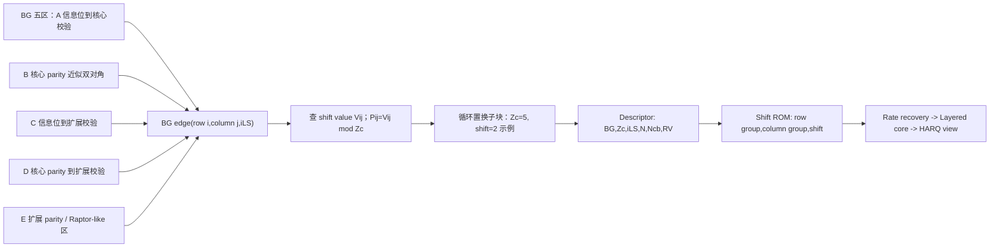

| 内容 | 说明 |
|:---|:---|
| BG 五区结构 | A 区连接 systematic columns 与 core rows；B 区是核心 parity 近似双对角；C/D/E 把 systematic、core parity、extension parity 接到扩展行，形成 Raptor-like 扩展。 |
| 列/行分区 | 本节图表中横向标注 systematic columns、core parity、extension parity；纵向标注 core rows 和 extension rows。 |
| QC lifting 输入 | 一个 BG edge 由 row index、column index 和 $i_{\mathrm{LS}}$ 定位；shift table 给出 $V_{i,j}$。 |
| QC lifting 规则 | $P_{i,j}=V_{i,j}\bmod Z_c$；`0` 是有效零移位；缺失 BG entry 展开为 all-zero block。 |
| 地址示例 | 本节图表中例子取 $Z_c=5$、shift=2；接收端地址形如 `base(column)+(local+shift) mod Zc`。 |
| 接收端用途 | Descriptor 给出 `BG,Zc,iLS,N,Ncb,RV`；Shift ROM 给出 row/column/shift；rate recovery 填 mother-code LLR 和 mask；layered core 做 RMW LLR/message memory；HARQ view 统计 new/repeated/unknown parity coverage。 |
左侧把 BG 分为 A/B/C/D/E 五个区域，中间展示一个有效 BG 元素如何通过 $Z_c$ 和 shift value 展开为循环移位单位矩阵，右侧展示接收端使用顺序：descriptor 选择 BG/$Z_c$/$i_{\mathrm{LS}}$，shift ROM 生成 edge schedule，rate recovery 填充 mother-code LLR，layered decoder 访问 message memory。图是结构教学，不是 TS 38.212 原图。

## QC-LDPC 的结构直觉

QC-LDPC 中 QC 是 Quasi-Cyclic 的缩写，中文可译为“准循环”。“准”表示它不是整个码字随便循环一下就完全不变，而是矩阵由很多循环结构的小块拼成；“循环”表示每个有效小块都是单位矩阵的循环移位版本。

协议 §5.3.2 的替换规则可以写成：

$$
B_{i,j}=0 \Rightarrow H_{i,j}=\mathbf{0}_{Z_c \times Z_c}
\tag{3}
$$

$$
B_{i,j}=1 \Rightarrow H_{i,j}=P^{V_{i,j}}
\tag{4}
$$

式 (3) 和式 (4) 回答的问题是：基本节图表中的一个元素如何变成完整 $H$ 的一个子块。$\mathbf{0}_{Z_c \times Z_c}$ 是全零矩阵；$P^{V_{i,j}}$ 是把 $Z_c \times Z_c$ 单位矩阵向右循环移位 $V_{i,j}$ 次得到的循环置换矩阵。$V_{i,j}$ 来自 Table 5.3.2-2 或 5.3.2-3，具体取哪一列由 $i_{\mathrm{LS}}$ 决定。

把循环移位写成元素公式更清楚。令 $P^p$ 是大小为 $Z_c$ 的右循环移位单位矩阵，则：

$$
P^p_{r,c} =
\begin{cases}
1, & c \equiv r+p \pmod{Z_c},\\
0, & \text{otherwise}.
\end{cases}
\tag{5}
$$

式 (5) 的意义是：第 $r$ 行的 1 出现在列 $(r+p)\bmod Z_c$。这就是硬件友好的地方：不需要查一个 $Z_c \times Z_c$ 的子矩阵，只要做一次模加法。

## 循环移位单位矩阵手算

取 $Z_c=4$。不移位的单位矩阵是：

$$
P^0 =
\begin{bmatrix}
1&0&0&0\\
0&1&0&0\\
0&0&1&0\\
0&0&0&1
\end{bmatrix}
\tag{6}
$$

右移 1 次得到：

$$
P^1 =
\begin{bmatrix}
0&1&0&0\\
0&0&1&0\\
0&0&0&1\\
1&0&0&0
\end{bmatrix}
\tag{7}
$$

右移 2 次得到：

$$
P^2 =
\begin{bmatrix}
0&0&1&0\\
0&0&0&1\\
1&0&0&0\\
0&1&0&0
\end{bmatrix}
\tag{8}
$$

这三个矩阵每行每列都只有一个 1。这个性质很重要：一个有效基图元素不会把一个变量节点连接到任意多的校验节点，而是用一组规则连接维持稀疏结构。若 shift 方向写反，$P^1$ 会变成左移 1 次；行列权重仍然可能看起来正确，但 syndrome、译码性能和协议一致性会错。

## 玩具基矩阵展开手算例子

本节图中这一部分的标题是“QC-LDPC 玩具基矩阵展开示例”。图中还明确标注 `rows: upper=core, lower=extension`：上半部分表示核心校验行区域，下半部分表示扩展校验行区域；这个标注只服务于教学分区，协议依据仍是 Table 5.3.2-2/3 的 row/column/shift values。

为了把过程看清楚，取一个教学基矩阵：

$$
B =
\begin{bmatrix}
0 & -1 & 2\\
1 & 0 & -1
\end{bmatrix}, \quad Z_c=4.
\tag{9}
$$

这里的 `-1` 是教学标记，表示该位置没有连接，展开为全零矩阵；非负数表示 shift value。因此：

$$
H =
\begin{bmatrix}
P^0 & \mathbf{0} & P^2\\
P^1 & P^0 & \mathbf{0}
\end{bmatrix}.
\tag{10}
$$

代入式 (6)-(8)，完整 $H$ 是一个 $8 \times 12$ 矩阵：

$$
H =
\begin{bmatrix}
1&0&0&0&0&0&0&0&0&0&1&0\\
0&1&0&0&0&0&0&0&0&0&0&1\\
0&0&1&0&0&0&0&0&1&0&0&0\\
0&0&0&1&0&0&0&0&0&1&0&0\\
0&1&0&0&1&0&0&0&0&0&0&0\\
0&0&1&0&0&1&0&0&0&0&0&0\\
0&0&0&1&0&0&1&0&0&0&0&0\\
1&0&0&0&0&0&0&1&0&0&0&0
\end{bmatrix}.
\tag{11}
$$


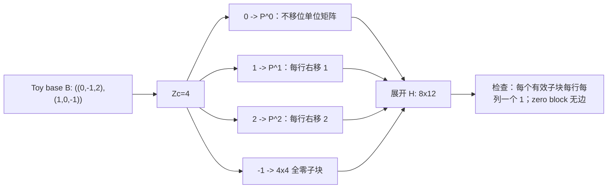

| 内容 | 说明 |
|:---|:---|
| toy 输入 | $B=\begin{bmatrix}0&-1&2\\1&0&-1\end{bmatrix}$，$Z_c=4$；因此 $2\times3$ 基矩阵展开为 $8\times12$ 完整 $H$。 |
| 子块替换 | `0` 替换为 $P^0$；`1` 替换为 $P^1$；`2` 替换为 $P^2$；`-1` 替换为 $4\times4$ 全零子块。 |
| 读图要点 | `-1` 不是 shift=-1；`0` 是有效 shift value；$p=2$ 表示每行的 1 向右循环移动 2 格。 |
| 完整矩阵结构 | $H=\begin{bmatrix}P^0&0&P^2\\P^1&P^0&0\end{bmatrix}$，与正文式 (10)-(11) 对应。 |
| 工程含义 | 真实 NR 不保存完整 $H$，而保存 BG 表、$i_{\mathrm{LS}}$、$Z_c$ 和 shift value；地址生成器用模 $Z_c$ 加法生成循环移位后的列地址。 |
阅读时首先观察左侧 $B$，再看中间每个子块如何替换为 $P^0$、$P^1$、$P^2$ 或 zero block。真实 NR 的 BG 表远大于这个玩具例子，但替换规则完全同类。

## 接收端流程与 descriptor 落点

[[T8.3_NR_LDPC_lifting_QC_matrix|T8.3]] 在接收端落到一个明确的对象：LDPC decoder config。它至少要包含：

| 字段 | 来源 | 用途 | 错误后果 |
|:---|:---|:---|:---|
| `BG` | [[T8.2_NR_LDPC_base_graph_selection|T8.2]] 基图选择 | 选择 Table 5.3.2-2 或 5.3.2-3 | BG 表错用，行列组数和 shift value 全错。 |
| `Zc` | §5.2.2/§5.3.2 lifting size 选择 | 决定子矩阵大小、地址周期和并行粒度 | 地址周期错、矩阵尺寸错。 |
| `iLS` | Table 5.3.2-1 | 选择 shift table 的 set index 列 | 同一 row/column 连接取错移位值。 |
| `row_group_count` | BG1=46、BG2=42 | layer loop 上限 | layer 数错，syndrome 计算不完整或越界。 |
| `col_group_count` | BG1=68、BG2=52 | variable group 地址范围 | message memory 深度和列组访问错。 |
| `shift_value` | Table 5.3.2-2/3 | 循环移位地址生成 | shift 方向或数值错导致 syndrome 不收敛。 |

接收端流程可以概括为：

1. 从传输块/CB descriptor 读取 `BG` 和 `Zc`。
2. 在 Table 5.3.2-1 中找到包含 `Zc` 的 `iLS`。
3. 根据 `BG` 选择 Table 5.3.2-2 或 Table 5.3.2-3。
4. 对每个列出的 `(row_index, column_index)`，读取 `iLS` 对应的 shift value。
5. 构造或隐式表示 $P^{V_{i,j}}$。
6. LDPC core 在 layered schedule 或 flooding schedule 中按这些连接更新消息。
7. syndrome checker 用同一套连接关系检查 $H\hat{\mathbf{x}}^T$。

真实硬件通常不会真的生成完整 $H$ 数组。软件 golden model 可以生成完整 $H$ 方便调试；RTL/ASIC 通常只保存连接表和 shift value，然后按需生成地址。

## Python 片段与可执行检查

下面的 Python 片段能生成循环移位单位矩阵和玩具 $H$，并检查行列权重。

```python
def circulant_identity(zc: int, shift: int) -> list[list[int]]:
    return [
        [1 if col == (row + shift) % zc else 0 for col in range(zc)]
        for row in range(zc)
    ]


def zero_block(zc: int) -> list[list[int]]:
    return [[0 for _ in range(zc)] for _ in range(zc)]


def expand_base_matrix(base: list[list[int]], zc: int) -> list[list[int]]:
    out_rows = len(base) * zc
    out_cols = len(base[0]) * zc
    H = [[0 for _ in range(out_cols)] for _ in range(out_rows)]
    for br, row in enumerate(base):
        for bc, shift in enumerate(row):
            block = zero_block(zc) if shift < 0 else circulant_identity(zc, shift)
            for r in range(zc):
                for c in range(zc):
                    H[br * zc + r][bc * zc + c] = block[r][c]
    return H


base = [[0, -1, 2], [1, 0, -1]]
H = expand_base_matrix(base, 4)
assert len(H) == 8 and len(H[0]) == 12
assert all(sum(row) == 2 for row in H)
assert [sum(H[r][c] for r in range(8)) for c in range(12)] == [2, 2, 2, 2, 1, 1, 1, 1, 1, 1, 1, 1]
```

这段检查说明两件事：每个 bit-level 行连接两个变量节点；前 4 列因为基本节图表中第 0 列有两个有效子块，所以列权重为 2，后 8 列各只有一个有效子块，所以列权重为 1。真实 NR 的行列权重由 Table 5.3.2-2/3 决定，不能拿玩具权重类推真实性能。

## 浮点仿真与结构验证

本节的“浮点仿真”不是块错误率曲线，而是结构生成验证。建议最小检查如下：

| 验证项 | 方法 | 期望 |
|:---|:---|:---|
| Table 5.3.2-1 解析 | 遍历所有 $Z_c$，确认每个值只属于一个 set index。 | `Zc -> iLS` 唯一。 |
| BG1/BG2 表解析 | 检查 row/column/set-index 列数、空白 row index 延续规则。 | 能得到 `(row, col, iLS, shift)` 记录。 |
| shift 范围 | 对每个记录检查 $0 \le V_{i,j}$，并在使用时按 $\bmod Z_c$ 解释。 | 不出现负 shift；0 被保留为有效移位。 |
| toy H 生成 | 用式 (9)-(11) 复现本文玩具矩阵。 | 与正文矩阵逐项一致。 |
| syndrome sanity | 随机生成 $\hat{\mathbf{x}}$，计算 $H\hat{\mathbf{x}}^T$；单比特翻转后 syndrome 改变。 | syndrome 计算对结构变化敏感。 |
| 方向错误负测 | 人为把右移改成左移。 | 行列权重仍可能通过，但 syndrome/golden matrix 对比失败。 |

如果后续接入完整 NR LDPC golden model，还应对每个 `BG/Zc/iLS` 组合生成稀疏边表，比较边数量、row group 范围、column group 范围和 shift value 列选择是否与协议表一致。

## 定点化策略

[[T8.3_NR_LDPC_lifting_QC_matrix|T8.3]] 的定点化重点不是对数似然比数值，而是地址和索引位宽。需要注意：

| 对象 | 位宽/表示风险 | 建议 |
|:---|:---|:---|
| `Zc` | 最大值可到 384。 | 至少 9 bit 无符号表示，或用枚举索引加查表。 |
| `iLS` | 0 到 7。 | 3 bit 足够，必须由 `Zc` 唯一映射。 |
| `row_index` | BG1 最大 45，BG2 最大 41。 | 6 bit 足够，但表选择要区分 BG。 |
| `column_index` | BG1 最大 67，BG2 最大 51。 | 7 bit 足够，地址生成要用 BG-specific 上限。 |
| `shift_value` | 表中数值可能大于当前 $Z_c$。 | 使用时按 $\bmod Z_c$ 或协议定义的移位函数解释；不要直接当物理地址。 |
| address offset | $base + (local + shift) \bmod Z_c$ | 模加法必须和右移方向一致。 |

一个常见硬件 bug 是把 shift value 先截断到某个位宽，再做模运算。正确做法是保证截断不会改变对当前 $Z_c$ 的模结果，或者先用足够位宽保存表值再求模。

## RTL/ASIC 映射

QC-LDPC 的硬件优势来自“结构化稀疏”。RTL/ASIC 常见映射如下：

| 模块 | 输入 | 输出 | 关键检查 |
|:---|:---|:---|:---|
| `zc_ils_lut` | `Zc` | `iLS` | Table 5.3.2-1 完整覆盖，非法 `Zc` 断言。 |
| `bg_table_rom` | `BG`、row pointer | `(row_index,column_index)` 列表 | BG1/BG2 表分开，row count 不混用。 |
| `shift_rom` | `BG`、`iLS`、edge index | shift value | set index 列选择正确，0 shift 保留。 |
| address generator | variable base、local index、shift | memory address | 使用 $(local+shift)\bmod Z_c$。 |
| barrel shifter / permutation network | LLR/message vector | 循环对齐后的向量 | 方向与协议右移一致。 |
| syndrome checker | hard bits、edge table | syndrome weight | 与 decoder core 使用同一套表。 |

硬件并不需要实例化完整 $H$。对于一个 layer，控制器读取该 layer 的 column groups 和 shift values；message memory 给出对应变量节点的 LLR 或消息；barrel shifter 做循环对齐；check-node unit 更新；最后按反向地址写回。若 bank conflict 出现，需要通过列组排程、bank 映射或流水停顿解决，但不能改变协议表定义的连接关系。

## 常见错误与定位方式

| 错误 | 现象 | 最小 dump 字段 | 定位方式 |
|:---|:---|:---|:---|
| `Zc` 选错 | decoder 输入长度、syndrome 维度、地址周期全错 | `BG`、`Zc`、`iLS`、CB size、filler count | 先查 Table 5.3.2-1，再核对 §5.2.2 的 $K_b$ 逻辑。 |
| `iLS` 选错 | 行列范围看似正确，但 shift 全部偏错 | `Zc`、`iLS`、前几个 shift value | 用已知 `Zc` 反查 set index。 |
| `-1` 与 `0` 混淆 | 把有效零移位当成无连接，边数量减少 | edge count、zero shift count | 表中 `0` 必须保留为有效 shift。 |
| shift 方向反 | 行列权重正确，但 syndrome/golden 对比失败 | shift direction、edge list、toy matrix | 用 $Z_c=4,p=1$ 的手算矩阵检查。 |
| BG 表错用 | BG1/BG2 row/column group 数不匹配 | `BG`、table id、row count、col count | BG1 用 Table 5.3.2-2，BG2 用 Table 5.3.2-3。 |
| 空白 row index 解析错 | 部分边丢失或挂到错误 row group | 原始 CSV 行、解析后 row index | 空白 row index 继承上一条非空 row index。 |
| 完整 $H$ 存储爆炸 | 仿真可跑，硬件资源不可接受 | memory estimate | RTL 应存边表/shift ROM，不存 bit-level 全矩阵。 |

## 自测题

1. $Z_c$ 在 NR LDPC 中解决什么问题？
2. Table 5.3.2-1 的 set index 和 $Z_c$ 是什么关系？
3. Table 5.3.2-2/3 中的数值 `0` 表示没有连接吗？
4. 给 $Z_c=4$，写出 $P^1$ 的矩阵。
5. 为什么 QC-LDPC 对硬件地址生成友好？
6. shift 方向反了，为什么行列权重检查可能仍然通过？

## 自测题参考答案

1. $Z_c$ 把小的基图元素放大为 $Z_c \times Z_c$ 子矩阵，使同一套 BG 能适配不同 CB 尺寸；它也决定完整 $H$ 的尺寸、地址周期和并行粒度。
2. Table 5.3.2-1 把允许的 $Z_c$ 分成 8 个 set。先由 $Z_c$ 找到唯一 set index $i_{\mathrm{LS}}$，再用 $i_{\mathrm{LS}}$ 去 Table 5.3.2-2/3 选择 shift value 列。
3. 不是。`0` 是有效 shift value，表示 $P^0$，即不移位的单位矩阵。没有连接的位置是不在表中列出的基矩阵 0 元素，教学中常用 `-1` 表示。
4. $P^1=\begin{bmatrix}0&1&0&0\\0&0&1&0\\0&0&0&1\\1&0&0&0\end{bmatrix}$。
5. 因为每个有效子块都是循环移位单位矩阵，地址可以用 $(local+shift)\bmod Z_c$ 生成，不需要保存完整子矩阵。
6. 左移和右移都会保持每行每列一个 1，所以行列权重仍可能正确；但具体连接对象变了，syndrome 和协议 golden matrix 对比会失败。

## 协议证据表

| 结论 | 协议证据 | 本地核验 |
|:---|:---|:---|
| $Z_c$ 来自 lifting size set | TS 38.212 §5.2.2/§5.3.2，Table 5.3.2-1 | `tables/table_0013.csv/html`，9 行 2 列，已全文复现。 |
| BG1 基矩阵尺寸为 46 行 68 列 | TS 38.212 §5.3.2 | `content.md` 行 971-977。 |
| BG2 基矩阵尺寸为 42 行 52 列 | TS 38.212 §5.3.2 | `content.md` 行 971-977。 |
| BG1 使用 Table 5.3.2-2 的 row/column/shift values | TS 38.212 §5.3.2 | `tables/table_0014.csv/html`，161 行 20 列，图 T8.3-1。 |
| BG2 使用 Table 5.3.2-3 的 row/column/shift values | TS 38.212 §5.3.2 | `tables/table_0015.csv/html`，102 行 20 列，图 T8.3-2。 |
| 基图 0 元素替换为全零矩阵，有效元素替换为循环移位单位矩阵 | TS 38.212 §5.3.2 | `content.md` 行 977-989；正文式 (3)-(5) 复述。 |

## 图示
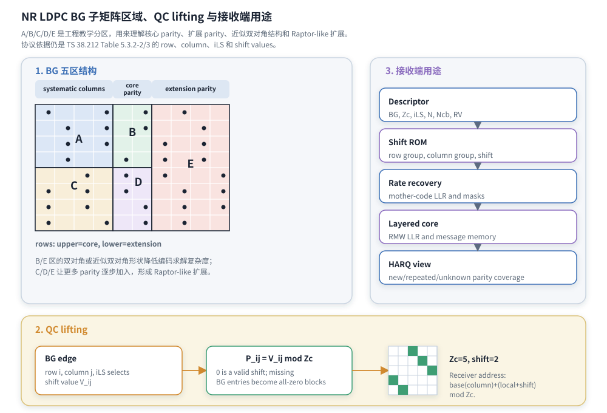
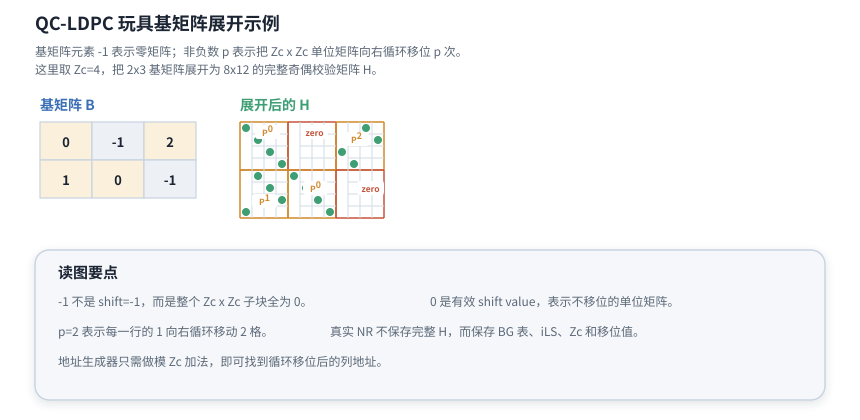
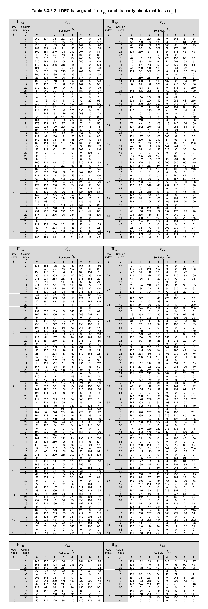
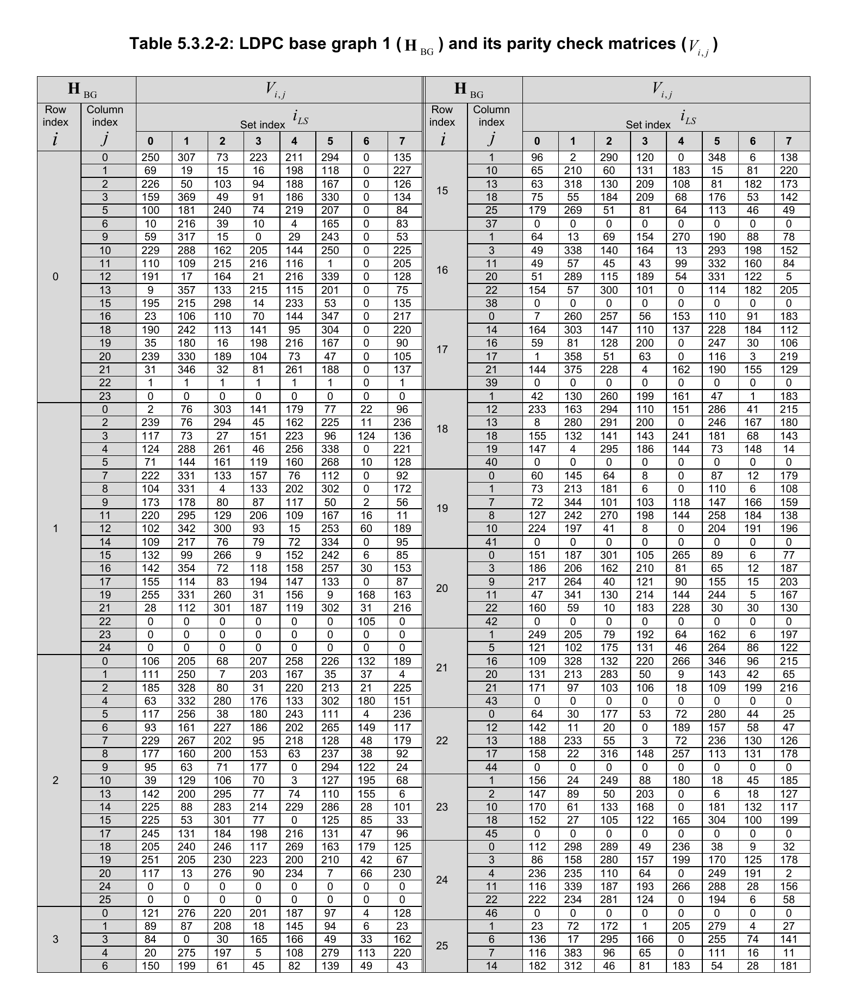
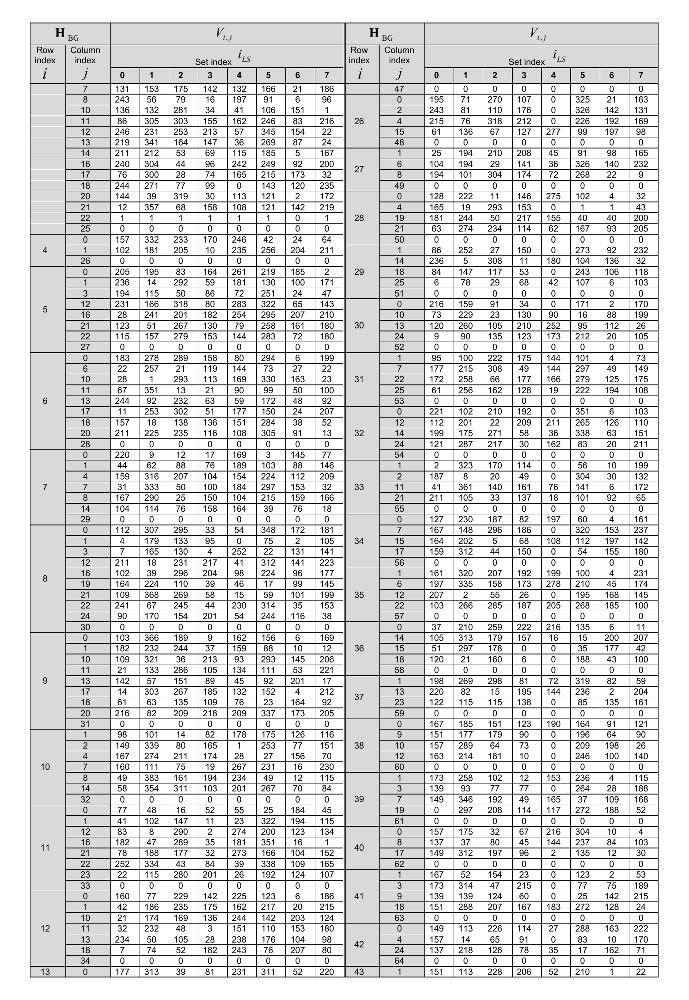
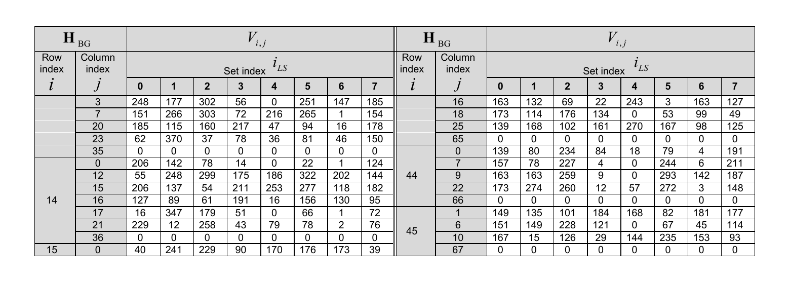
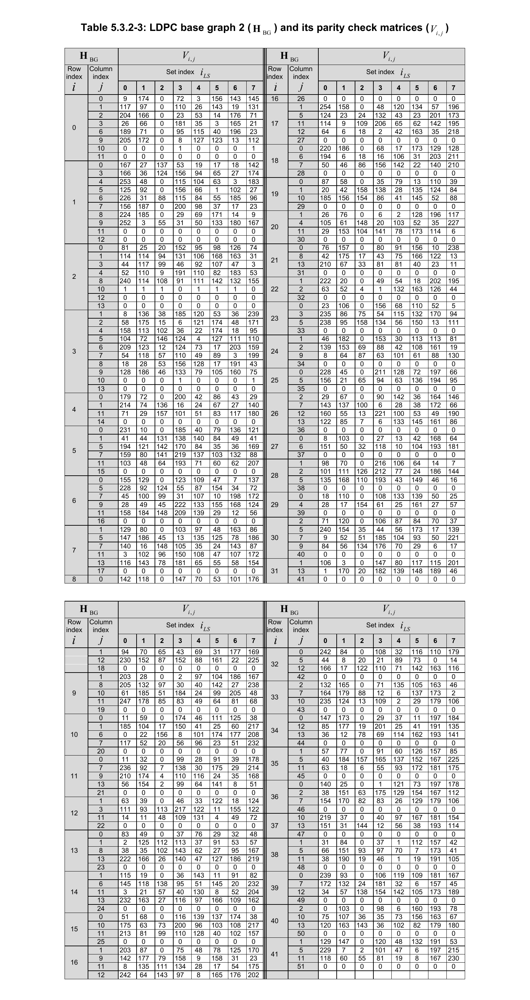
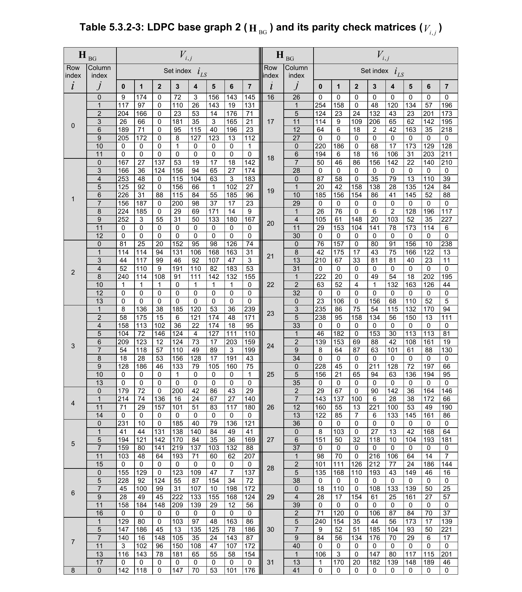
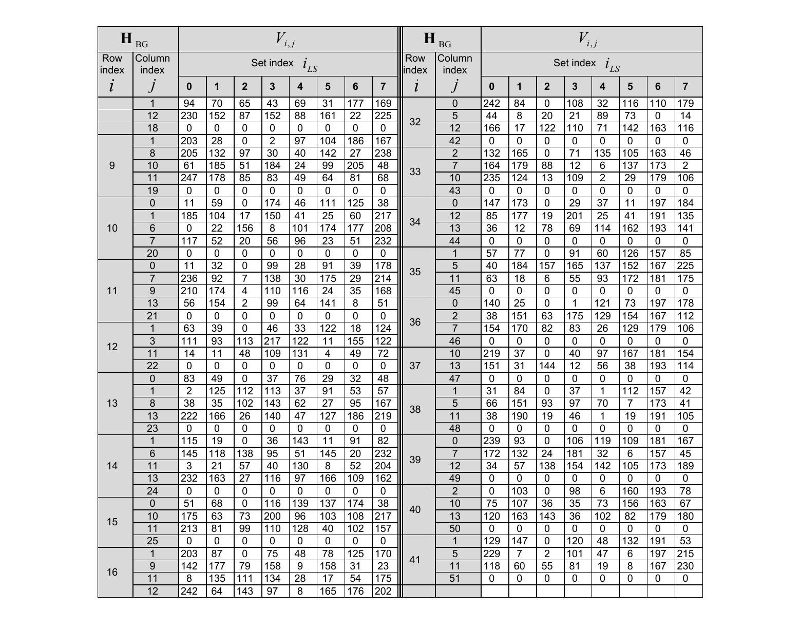

## 执行与证据记录

| 项目 | 记录 |
|:---|:---|
| 路线图卡片 | `2026-06-19-lte-nr-decoding-learning-roadmap.md` [[T8.3_NR_LDPC_lifting_QC_matrix|T8.3]]，Prompt/产出/验收/3GPP 证据已覆盖。 |
| 讲义文件 | `docs/L2_协议算法/T8.3_NR_LDPC_lifting_QC_matrix.md`。 |
| 协议来源 | TS 38.212 Rel-19 `38212-j30` §5.2.2、§5.3.2、Table 5.3.2-1/2/3。 |
| 本地表格证据 | `tables/table_0013.csv/html`、`tables/table_0014.csv/html`、`tables/table_0015.csv/html`；CSV 行列数和 SHA-256 已记录在“资料与协议边界”。 |
| 图表资产 | `tools/figures/render_nr_ldpc_bg_tables_from_pdf.py` 生成 `docs/L2_协议算法/assets/T8.3_TS38.212_Table_5.3.2-2_BG1_shift_table.png`、`docs/L2_协议算法/assets/T8.3_TS38.212_Table_5.3.2-3_BG2_shift_table.png`；`docs/L2_协议算法/assets/T8.3_NR_LDPC_BG_regions_QC_receiver.svg`、`docs/L2_协议算法/assets/T8.3_NR_LDPC_toy_QC_expansion.svg`（手绘 SVG，替代原 `tools/figures/render_nr_ldpc_lifting_qc_matrix.py` 生成的 PNG）。 |
| 单篇审计 | `python3 tools/audit_lesson_terms.py docs/L2_协议算法/T8.3_NR_LDPC_lifting_QC_matrix.md` 输出 `LESSON_TERM_AUDIT_OK`；`python3 tools/audit_markdown_headings.py docs/L2_协议算法/T8.3_NR_LDPC_lifting_QC_matrix.md` 输出 `MARKDOWN_HEADING_AUDIT_OK`；`python3 tools/audit_lesson_depth.py --strict docs/L2_协议算法/T8.3_NR_LDPC_lifting_QC_matrix.md` 输出 `LESSON_DEPTH_AUDIT_OK`；`python3 tools/audit_latex_render.py docs/L2_协议算法/T8.3_NR_LDPC_lifting_QC_matrix.md` 输出 `LATEX_RENDER_AUDIT_OK formulas=128`。 |

## 参考文献

1. 3GPP TS 38.212 Rel-19 `38212-j30`, “NR; Multiplexing and channel coding”, §5.2.2, §5.3.2, Table 5.3.2-1, Table 5.3.2-2, Table 5.3.2-3.
2. R. G. Gallager, “Low-Density Parity-Check Codes”, IRE Transactions on Information Theory, 1962.
