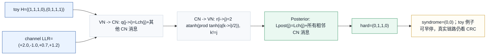
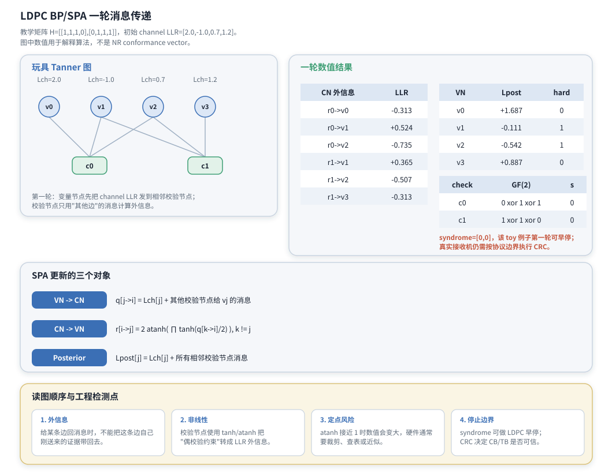

# T8.5 LDPC 和积置信传播
## 本节学习目标

本节讲低密度奇偶校验码的经典软判决译码算法：置信传播（Belief Propagation, BP）和和积算法（Sum-Product Algorithm, SPA）。[[T8.4_LDPC_Tanner_graph_message_passing|T8.4]] 已经把奇偶校验矩阵 $H$ 画成 Tanner 图；本节继续讲图上每条边如何传递对数似然比消息，变量节点如何合并来自多个校验节点的外信息，校验节点为什么需要 $\tanh$ 和 $\operatorname{atanh}$ 这样的非线性函数，以及 syndrome 检查在迭代停止中的位置。

学完本节后，应能做到：

- 解释 BP 和 SPA 的中文含义、适用图模型和工程用途。
- 区分 channel LLR、variable-to-check message、check-to-variable message、posterior LLR 和 extrinsic message。
- 从“同一条校验方程要求偶校验成立”的概率直觉，理解校验节点更新为什么是非线性的。
- 写出 LLR 域变量节点更新、校验节点更新、后验 LLR 和 syndrome 检查公式。
- 用一个小型 Tanner 图手算一轮 BP/SPA，列出每条边的消息。
- 说明 maximum iteration、syndrome early stop 和循环冗余校验之间的边界。
- 写出至少一轮 toy BP 的 Python 浮点验证片段。
- 说明 $\tanh/\operatorname{atanh}$ 在定点和硬件实现中的风险，以及为何后续会引出 Min-Sum 近似。

本节是算法理论课，但仍要保持协议边界：TS 38.212 规定 NR LDPC 的矩阵结构和 rate matching，不规定接收端必须使用 BP、SPA、Min-Sum 或 layered schedule。本文讲的是从协议定义的 $H$ 出发，接收机可以采用的一类主流软判决译码算法。

## 前置知识检查

| 前置项 | 本节需要达到的程度 |
|:---|:---|
| T1.5 LLR | 知道 $L=\log(P(b=0)/P(b=1))$，正值更像 0，负值更像 1。 |
| T8.4 Tanner 图 | 知道变量节点对应 $H$ 的列，校验节点对应 $H$ 的行，$H_{i,j}=1$ 对应一条边。 |
| GF(2) syndrome | 知道 $H\hat{\mathbf{x}}^T=\mathbf{0}$ 表示候选码字满足 LDPC 校验。 |
| 概率独立性 | 知道多个独立证据在概率域相乘，在 LLR 域通常变成相加。 |
| 双曲函数 | 不需要熟悉数学细节，只需知道 $\tanh(x)$ 把实数压到 $(-1,1)$，$\operatorname{atanh}(x)$ 是它的反函数。 |

如果 $\tanh$ 和 $\operatorname{atanh}$ 还陌生，先把它们理解成“把校验方程的概率约束转换成 LLR 消息的函数”。本节会解释它们为什么出现，[[T8.6_LDPC_MS_NMS_OMS|T8.6]] 再讲工程上如何避开昂贵函数。

本节的概率底座来自 [[T1.4_probability_bayes_soft_decoding|T1.4]]/[[T1.5_LLR_soft_decision|T1.5]]。变量节点把多份近似独立证据相乘，转到 LLR 域后成为加法；校验节点要在满足偶校验的所有未知变量组合上求和，这就是边缘化；posterior LLR 再由概率比值转成一个带符号可靠度。若直接背 SPA 公式而不理解这些来源，很容易把外信息排除项或 LLR 符号写错。

## 路线图 Prompt 覆盖表

| Prompt 要求 | 本节覆盖位置 | 覆盖方式 |
|:---|:---|:---|
| 推导 LLR 域 LDPC 置信传播 | “变量节点更新推导”和“校验节点更新推导” | 从概率/外信息直觉过渡到 LLR 域公式。 |
| 包括变量节点更新 | “变量节点更新推导” | 给 $q_{j\to i}$ 和 posterior LLR 的求和公式。 |
| 包括校验节点更新 | “校验节点更新推导” | 给 $\tanh/\operatorname{atanh}$ 公式和符号/幅度直觉。 |
| 包括后验 LLR | “后验 LLR 与硬判决” | 给 $L_j^{\mathrm{post}}$ 和 hard decision。 |
| 包括 syndrome 检查 | “syndrome early stop 与 CRC 边界” | 说明 syndrome 全零、CRC 边界和最大迭代。 |
| 用直觉解释 tanh/atanh | “校验节点的概率直觉” | 解释偶校验约束如何形成非线性外信息。 |
| 提示定点实现风险 | “定点化策略”和“硬件映射” | 说明 atanh 接近 1、饱和、查表和近似风险。 |
| 按弹性审计清单取舍并拓展 | 全文 | 补协议边界、toy 数值走读、Python、验证、常见错误、自测题和执行记录。 |

这张表只表示最低覆盖。正文还会对比 Turbo的 Bahl-Cocke-Jelinek-Raviv（BCJR）/最大后验概率（Maximum A Posteriori, MAP）译码和 LDPC BP 的共同点与差异，帮助把 T6/T8 的算法线索连起来。

## 资料与协议边界

本节算法依据来自 LDPC 的 Tanner 图和概率图模型，协议锚点来自 TS 38.212 Rel-19 `38212-j30` §5.3.2。协议定义的是码结构，不定义译码算法；因此本文中的 BP/SPA 公式是接收机实现理论，不是 3GPP 逐条强制流程。

| 协议位置 | 本地证据路径 |
| :--- | :--- |
| TS 38.212 §5.3.2 | `3GPP_Rel19/processed/TS_38.212_38212-j30/content.md` 行 948-989 |
| Table 5.3.2-1 | `3GPP_Rel19/processed/TS_38.212_38212-j30/tables/table_0013.csv/html` |
| Table 5.3.2-2/3 | 同目录 `table_0014.csv/html` 和 `table_0015.csv/html` |
| TS 38.212 §5.4.2.1 | `content.md` 行 1175-1309 |

本节的 toy 矩阵、LLR 数字和 Python 片段都是教学例子，不是 NR conformance vector。真实 NR 接收机的 $H$ 来自 BG1/BG2、$Z_c$、`iLS` 和 shift table，message schedule 通常按 QC-LDPC 结构隐式生成。

后续在衰落或加性白高斯噪声信道、二进制相移键控/正交幅度调制软解调下进入 BP 的仍然是同一种 LLR 接口；本节不展开调制和噪声缩放。

## BP 和 SPA 的基本含义

Belief Propagation 直译是“置信传播”。这里的 belief 不是主观信念，而是某个比特取 0 或取 1 的概率倾向；propagation 表示这种倾向沿图的边传播。LDPC Tanner 图天然适合 BP：变量节点保存“比特更像 0 还是 1”的信息，校验节点保存“相邻比特必须满足偶校验”的约束。

Sum-Product Algorithm 直译是“和积算法”。sum-product 这个名字来自概率图模型：计算边缘概率时，会把不同可能状态求和，把独立因子相乘。LDPC 的 Tanner 图上，变量节点像“把多个证据相乘后归一化”，校验节点像“在满足偶校验的所有其他比特组合上求和”。转到 LLR 域后，变量节点的乘法变成加法；校验节点的求和与乘积组合变成 $\tanh/\operatorname{atanh}$ 形式。

可以先用一句话理解：

| 节点 | 直觉任务 | LLR 域表现 |
|:---|:---|:---|
| 变量节点 | 汇总所有独立证据，判断某个比特更像 0 还是 1。 | LLR 相加。 |
| 校验节点 | 根据“相邻比特异或为 0”的约束，推断某个变量应该是什么。 | 符号由其他输入符号决定，幅度由其他输入可靠度共同决定。 |

这也是 LDPC BP 与 Turbo BCJR 的共同点：二者都不只传硬比特，而是传软信息；二者都要避免把同一份证据重复算回自己。差异在于，Turbo 码沿 trellis 做前向/后向状态递推，LDPC 沿 Tanner 图做局部节点更新。

## 消息与符号约定

本文采用与 [[T1.5_LLR_soft_decision|T1.5]] 一致的 LLR 符号约定：

$$
L_j^{\mathrm{ch}}=
\log\frac{P(x_j=0\mid y_j)}{P(x_j=1\mid y_j)}.
\tag{1}
$$

式 (1) 回答的问题是：只看信道观测 $y_j$，比特 $x_j$ 更像 0 还是 1。若 $L_j^{\mathrm{ch}}>0$，更像 0；若 $L_j^{\mathrm{ch}}<0$，更像 1；绝对值越大，可靠度越高。

在 Tanner 图上定义两个邻接集合：

$$
\mathcal{N}(i)=\{j:H_{i,j}=1\},
\tag{2}
$$

$$
\mathcal{M}(j)=\{i:H_{i,j}=1\}.
\tag{3}
$$

式 (2) 是校验节点 $c_i$ 相邻的变量节点集合；式 (3) 是变量节点 $v_j$ 相邻的校验节点集合。消息记号如下：

| 记号 | 中文含义 | 方向 | 作用 |
|:---|:---|:---|:---|
| $L_j^{\mathrm{ch}}$ | 信道 LLR | demapper/rate recovery 到变量节点 | 初始观测证据。 |
| $q_{j\to i}^{(t)}$ | 变量到校验消息 | $v_j\to c_i$ | 变量节点给某条校验方程的外信息。 |
| $r_{i\to j}^{(t)}$ | 校验到变量消息 | $c_i\to v_j$ | 校验方程基于其他变量给 $v_j$ 的外信息。 |
| $L_j^{\mathrm{post},(t)}$ | 后验 LLR | 变量节点到硬判决 | 当前迭代后对 $x_j$ 的总判断。 |

外信息原则贯穿全部公式：给某条边发消息时，不把这条边刚送来的消息再带回去。

## 变量节点更新推导

变量节点的任务最直观。一个比特 $x_j$ 收到三类证据：信道自己的证据 $L_j^{\mathrm{ch}}$，以及所有相邻校验节点传回来的消息。若这些外部证据在近似意义下独立，那么概率域的证据相乘；转到 LLR 域后就是相加。

从概率域看，变量节点给校验节点的消息是一个二元分布：

$$
\mu_{j\to i}^{(t)}(x_j)
\propto
P(y_j|x_j)
\prod_{i'\in\mathcal{M}(j)\setminus\{i\}}
\nu_{i'\to j}^{(t-1)}(x_j),
\quad x_j\in\{0,1\}.
\tag{4}
$$

式 (4) 回答的问题是：若暂时不使用校验节点 $c_i$ 的反馈，其他所有证据会让 $x_j$ 更像 0 还是更像 1。$P(y_j|x_j)$ 是信道似然，$\nu_{i'\to j}$ 是其他校验节点传来的概率消息。转成 LLR 后，概率乘积变成对数相加：

变量节点给校验节点 $c_i$ 的消息为：

$$
q_{j\to i}^{(t)}=
L_j^{\mathrm{ch}}+
\sum_{i'\in\mathcal{M}(j)\setminus\{i\}} r_{i'\to j}^{(t-1)}.
\tag{5}
$$

式 (5) 回答的问题是：变量节点 $v_j$ 给校验节点 $c_i$ 报告自己目前有多像 0 或 1，但不能包含 $c_i$ 上一轮刚告诉 $v_j$ 的消息。若包含，就会把 $c_i$ 的证据绕回 $c_i$，形成回声信息。

第一轮常用初始化是：

$$
q_{j\to i}^{(0)}=L_j^{\mathrm{ch}}, \quad i\in\mathcal{M}(j).
\tag{6}
$$

式 (6) 表示第一轮还没有校验节点返回消息，变量节点只能先把信道 LLR 发给所有相邻校验节点。

后验 LLR 用于当前迭代的硬判决：

$$
L_j^{\mathrm{post},(t)}=
L_j^{\mathrm{ch}}+
\sum_{i\in\mathcal{M}(j)} r_{i\to j}^{(t)}.
\tag{7}
$$

式 (7) 和式 (5) 的差别在于：后验 LLR 是变量节点自己的最终判断，应该使用所有相邻校验节点消息；而 $q_{j\to i}$ 是发给某个校验节点的外信息，要排除接收方自己的消息。

硬判决采用：

$$
\hat{x}_j^{(t)}=
\begin{cases}
0, & L_j^{\mathrm{post},(t)}\ge 0,\\
1, & L_j^{\mathrm{post},(t)}<0.
\end{cases}
\tag{8}
$$

式 (8) 的 tie-break 采用 $L=0$ 判 0，只是工程约定。若系统采用相反 LLR 符号，判决方向必须同步反转。

## 校验节点的概率直觉

校验节点 $c_i$ 表示一条约束：

$$
\bigoplus_{j\in\mathcal{N}(i)} x_j=0.
\tag{9}
$$

式 (9) 表示相邻比特中 1 的个数必须为偶数。校验节点给某个变量 $x_j$ 发消息时，应该只看其他变量 $\mathcal{N}(i)\setminus\{j\}$。直觉如下：

- 若其他变量强烈暗示“它们的异或已经是 0”，那么为了让总异或为 0，$x_j$ 应该更像 0。
- 若其他变量强烈暗示“它们的异或是 1”，那么 $x_j$ 应该更像 1。
- 若其他变量里有一个非常不可靠，那么校验节点对 $x_j$ 的推断也会变弱。

这说明校验节点输出的符号来自其他输入符号的组合，输出幅度受其他输入中最不可靠证据的限制。严格的 SPA 公式不是简单取最小值，而是用 $\tanh/\operatorname{atanh}$ 精确表达概率求和；[[T8.6_LDPC_MS_NMS_OMS|T8.6]] 的 Min-Sum 正是对这个精确公式的近似。

## 校验节点更新推导

对校验节点 $c_i$ 到变量节点 $v_j$ 的消息，LLR 域 SPA 更新为：

概率域先写成边缘化。令 $x_{\mathcal{N}(i)\setminus j}$ 表示除 $x_j$ 之外的相邻变量组合，则：

$$
\nu_{i\to j}^{(t)}(x_j)
\propto
\sum_{x_{\mathcal{N}(i)\setminus j}}
\mathbf{1}\left[
x_j\oplus
\bigoplus_{j'\in\mathcal{N}(i)\setminus\{j\}}x_{j'}=0
\right]
\prod_{j'\in\mathcal{N}(i)\setminus\{j\}}
\mu_{j'\to i}^{(t)}(x_{j'}).
\tag{10}
$$

式 (10) 回答的问题是：在校验方程必须成立时，所有“其他变量”的可能取值组合会给 $x_j$ 带来多大概率支持。这个求和就是 Sum-Product 中的 sum；组合概率的乘积就是 product。把式 (10) 对 $x_j=0$ 和 $x_j=1$ 的比值取对数，得到 LLR 域校验节点更新：

$$
r_{i\to j}^{(t)}
=
2\operatorname{atanh}
\left(
\prod_{j'\in\mathcal{N}(i)\setminus\{j\}}
\tanh\frac{q_{j'\to i}^{(t)}}{2}
\right).
\tag{11}
$$

式 (11) 回答的问题是：在第 $i$ 条偶校验方程必须成立的前提下，其他变量节点的软信息会给 $x_j$ 带来什么外信息。公式里有三个关键点。

第一，输入先经过 $\tanh(q/2)$。当 $|q|$ 很大时，$\tanh(q/2)$ 接近 $+1$ 或 $-1$，表示强可靠；当 $q$ 接近 0 时，$\tanh(q/2)$ 接近 0，表示不可靠。

第二，多个输入相乘。乘积的符号表示其他变量的异或倾向，乘积的幅度表示这些输入共同有多可靠。只要其中一个输入接近 0，乘积幅度就会变小，输出也会变弱。

第三，再用 $2\operatorname{atanh}(\cdot)$ 转回 LLR 域。$\operatorname{atanh}$ 在输入接近 $+1$ 或 $-1$ 时会迅速变大，这就是定点实现需要裁剪和饱和的根源。

对度数为 3 的校验节点，若 $c_i$ 连接 $v_a,v_b,v_c$，则：

$$
r_{i\to a}
=
2\operatorname{atanh}
\left(
\tanh\frac{q_{b\to i}}{2}
\tanh\frac{q_{c\to i}}{2}
\right).
\tag{12}
$$

式 (12) 清楚展示了外信息原则：给 $v_a$ 的消息只用 $v_b$ 和 $v_c$ 的消息。

## 一轮数值走读

本节使用一个 $2\times4$ 的教学矩阵：

$$
H=
\begin{bmatrix}
1&1&1&0\\
0&1&1&1
\end{bmatrix}.
\tag{13}
$$

它对应两个校验方程：

$$
c_0:\ x_0\oplus x_1\oplus x_2=0,
\tag{14}
$$

$$
c_1:\ x_1\oplus x_2\oplus x_3=0.
\tag{15}
$$

初始 channel LLR 取：

$$
\mathbf{L}^{\mathrm{ch}}=
\begin{bmatrix}
2.0&-1.0&0.7&1.2
\end{bmatrix}.
\tag{16}
$$

按本文符号约定，$v_0$ 和 $v_3$ 比较像 0，$v_1$ 比较像 1，$v_2$ 略像 0。第一轮初始化：

$$
q_{j\to i}^{(0)}=L_j^{\mathrm{ch}}.
\tag{17}
$$




| 内容 | 说明 |
|:---|:---|
| 图结构 | 变量节点 $v_0..v_3$；校验节点 $c_0,c_1$；$c_0$ 连接 $v_0,v_1,v_2$，$c_1$ 连接 $v_1,v_2,v_3$。 |
| 初始 LLR | $L^{ch}=[+2.0,-1.0,+0.7,+1.2]$；第一轮 $q_{j\to i}^{(0)}=L_j^{ch}$。 |
| SPA 公式对象 | VN-to-CN 排除目标 CN 的反馈；CN-to-VN 排除目标 VN 的输入；posterior 使用所有相邻 CN 消息。 |
| CN 外信息 | $r_{0\to0}=-0.313$，$r_{0\to1}=+0.524$，$r_{0\to2}=-0.735$，$r_{1\to1}=+0.365$，$r_{1\to2}=-0.507$，$r_{1\to3}=-0.313$。 |
| posterior 表 | $v_0:+1.687\to0$；$v_1:-0.111\to1$；$v_2:-0.542\to1$；$v_3:+0.887\to0$。 |
| syndrome 表 | $c_0:0\oplus1\oplus1=0$；$c_1:1\oplus1\oplus0=0$；toy syndrome 为 $[0,0]$。 |
| 工程检测点 | 外信息不得带回自身证据；$\operatorname{atanh}$ 接近 1 时需 LUT/裁剪/饱和；syndrome 可做 LDPC 早停，但 CB/TB 是否可信由 CRC 边界决定。 |
这张图的总标题是“LDPC BP/SPA 一轮消息传递”。左侧分区标题为“玩具 Tanner 图”，中间分区标题为“SPA 更新的三个对象”，右侧数值分区标题为“一轮数值结果”，底部说明区标题为“读图顺序与工程检测点”。左侧是 toy Tanner 图，中间是 SPA 三类更新对象，右侧是校验节点外信息、后验 LLR、硬判决和 syndrome。本节图表中数值用于解释算法，不是 NR conformance vector。

### 校验节点消息手算

先算 $c_0$。它连接 $v_0,v_1,v_2$。给 $v_0$ 的消息排除 $v_0$ 自己：

$$
r_{0\to0}
=2\operatorname{atanh}
\left(
\tanh\frac{-1.0}{2}
\tanh\frac{0.7}{2}
\right)
\approx -0.313.
\tag{18}
$$

给 $v_1$ 的消息排除 $v_1$ 自己：

$$
r_{0\to1}
=2\operatorname{atanh}
\left(
\tanh\frac{2.0}{2}
\tanh\frac{0.7}{2}
\right)
\approx 0.524.
\tag{19}
$$

给 $v_2$ 的消息排除 $v_2$ 自己：

$$
r_{0\to2}
=2\operatorname{atanh}
\left(
\tanh\frac{2.0}{2}
\tanh\frac{-1.0}{2}
\right)
\approx -0.735.
\tag{20}
$$

再算 $c_1$，它连接 $v_1,v_2,v_3$：

$$
r_{1\to1}
=2\operatorname{atanh}
\left(
\tanh\frac{0.7}{2}
\tanh\frac{1.2}{2}
\right)
\approx 0.365.
\tag{21}
$$

$$
r_{1\to2}
=2\operatorname{atanh}
\left(
\tanh\frac{-1.0}{2}
\tanh\frac{1.2}{2}
\right)
\approx -0.507.
\tag{22}
$$

$$
r_{1\to3}
=2\operatorname{atanh}
\left(
\tanh\frac{-1.0}{2}
\tanh\frac{0.7}{2}
\right)
\approx -0.313.
\tag{23}
$$

这些符号很有解释力。比如 $r_{0\to2}$ 为负，表示 $c_0$ 根据 $v_0$ 偏 0、$v_1$ 偏 1 的组合，推断 $v_2$ 应该更像 1，才能让 $x_0\oplus x_1\oplus x_2=0$。

### 后验 LLR、硬判决与 syndrome

变量节点汇总所有相邻校验节点消息：

$$
L_0^{\mathrm{post}}=2.0+r_{0\to0}\approx1.687.
\tag{24}
$$

$$
L_1^{\mathrm{post}}=-1.0+r_{0\to1}+r_{1\to1}\approx-0.111.
\tag{25}
$$

$$
L_2^{\mathrm{post}}=0.7+r_{0\to2}+r_{1\to2}\approx-0.542.
\tag{26}
$$

$$
L_3^{\mathrm{post}}=1.2+r_{1\to3}\approx0.887.
\tag{27}
$$

因此硬判决为：

$$
\hat{\mathbf{x}}=
\begin{bmatrix}
0&1&1&0
\end{bmatrix}.
\tag{28}
$$

计算 syndrome：

$$
s_0=0\oplus1\oplus1=0,
\tag{29}
$$

$$
s_1=1\oplus1\oplus0=0.
\tag{30}
$$

所以 $\mathbf{s}^T=[0,0]$，这个 toy 例子第一轮就满足 LDPC 校验。真实接收机还要继续执行码块CRC 和TB CRC 边界；syndrome 只表示候选码字满足 $H$ 的约束，不等价于业务块一定正确。

如果没有早停，下一拍变量节点会把这一轮校验节点返回的外信息重新组合成新的 variable-to-check 消息。按式 (4) 逐边计算：

| 下一轮边消息 | 计算 | 数值 |
|:---|:---|:---:|
| $q_{0\to0}^{(1)}$ | $L_0^{\mathrm{ch}}$，因为 $v_0$ 只连 $c_0$ | +2.000 |
| $q_{1\to0}^{(1)}$ | $L_1^{\mathrm{ch}}+r_{1\to1}$ | -0.635 |
| $q_{1\to1}^{(1)}$ | $L_1^{\mathrm{ch}}+r_{0\to1}$ | -0.476 |
| $q_{2\to0}^{(1)}$ | $L_2^{\mathrm{ch}}+r_{1\to2}$ | +0.193 |
| $q_{2\to1}^{(1)}$ | $L_2^{\mathrm{ch}}+r_{0\to2}$ | -0.035 |
| $q_{3\to1}^{(1)}$ | $L_3^{\mathrm{ch}}$，因为 $v_3$ 只连 $c_1$ | +1.200 |

这张表补齐了一轮消息闭环：初始化 $q^{(0)}$、校验节点输出 $r^{(1)}$、后验 LLR 与 syndrome，以及若继续迭代时要送出的 $q^{(1)}$。它也再次体现外信息原则：例如 $q_{1\to0}^{(1)}$ 只能使用另一个校验节点 $c_1$ 给 $v_1$ 的消息，不能使用 $c_0$ 给 $v_1$ 的消息。

## Python 浮点一轮 BP

下面的 Python 片段复现图 T8.5-1 的数值。它可以作为公式和手算的最小 golden check。

```python
import math


H = [
    [1, 1, 1, 0],
    [0, 1, 1, 1],
]
llr_ch = [2.0, -1.0, 0.7, 1.2]

rows = [ [j for j, value in enumerate(row) if value] for row in H]
cols = [ [i for i, row in enumerate(H) if row[j]] for j in range(len(llr_ch))]

q = {(j, i): llr_ch[j] for i, js in enumerate(rows) for j in js}
r = {}
for i, js in enumerate(rows):
    for j in js:
        product = 1.0
        for k in js:
            if k != j:
                product *= math.tanh(q[(k, i)] / 2.0)
        r[(i, j)] = 2.0 * math.atanh(product)

posterior = []
for j in range(len(llr_ch)):
    posterior.append(llr_ch[j] + sum(r[(i, j)] for i in cols[j]))

q_next = {}
for j in range(len(llr_ch)):
    for i in cols[j]:
        q_next[(j, i)] = llr_ch[j] + sum(r[(i2, j)] for i2 in cols[j] if i2 != i)

hard = [0 if value >= 0 else 1 for value in posterior]
syndrome = [
    sum(hij & bit for hij, bit in zip(row, hard)) % 2
    for row in H
]

assert [round(r[(0, 0)], 3), round(r[(0, 1)], 3), round(r[(0, 2)], 3)] == [-0.313, 0.524, -0.735]
assert [round(x, 3) for x in posterior] == [1.687, -0.111, -0.542, 0.887]
assert [round(q_next[key], 3) for key in sorted(q_next)] == [2.0, -0.635, -0.476, 0.193, -0.035, 1.2]
assert hard == [0, 1, 1, 0]
assert syndrome == [0, 0]
print("T8.5_TOY_BP_OK")
```

预期输出：

```text
T8.5_TOY_BP_OK
```

这段代码没有做多轮迭代，也没有处理 rate recovery、filler mask 或 fixed-point saturation。它验证一件事：LLR 域 SPA 的初始化 $q^{(0)}$、校验节点输出、下一轮 $q^{(1)}$、后验 LLR 和 syndrome 计算与正文一致。

## syndrome early stop 与 CRC 边界

LDPC 迭代译码通常有三个停止相关对象：

| 对象 | 所在位置 | 作用 | 边界 |
|:---|:---|:---|:---|
| maximum iteration | decoder core 内部 | 防止无限迭代，控制最坏时延 | 达到上限仍不收敛，输出失败或低可信候选。 |
| syndrome early stop | decoder core 内部 | 检查 $H\hat{\mathbf{x}}^T=\mathbf{0}$，可提前停止 LDPC 迭代 | 是码约束检查，不是业务完整性检查。 |
| CB/TB CRC | LDPC core 之后 | 检查 CB 或 TB 的完整性 | 决定交付、重组和混合自动重传请求反馈边界；完整 NR 链路还可能有可选CBG级反馈粒度。 |

伪代码如下：

```text
for iter in 1..max_iter:
    run check-node update
    run variable-node update
    hard = decision(posterior_llr)
    syndrome = H_times_x_mod2(hard)
    if syndrome == 0:
        decoder_status = LDPC_CONVERGED
        break

extract information bits
remove filler positions
run CB CRC and then TB CRC at protocol boundaries
```

工程上是否每轮都算 syndrome、是否隔几轮算一次、是否在 early stop 后仍跑固定轮数以便流水对齐，都是实现策略。协议要求接收结果在相应边界满足 CRC 和业务流程，不规定 decoder core 的内部停止策略。

## 与 Turbo BCJR 的联系和差异

T6 讲过 Turbo 码的 BCJR/MAP 译码。LDPC BP 与 Turbo BCJR 都属于软输入软输出思想，但对象不同。

| 对比项 | Turbo BCJR/MAP | LDPC BP/SPA |
|:---|:---|:---|
| 图结构 | trellis 状态图 | Tanner 二分图 |
| 局部约束 | RSC 编码器状态转移 | 奇偶校验方程 |
| 消息方向 | 前向 metric、后向 metric、外信息 | variable-to-check、check-to-variable |
| 迭代对象 | 两个 constituent decoder 交换外信息 | VN/CN 沿边迭代交换消息 |
| 停止依据 | 迭代次数、CRC、外信息稳定性 | 迭代次数、syndrome、CRC |
| 硬件特点 | trellis 递推依赖强 | QC-LDPC 结构利于并行和分层调度 |

共同原则是：软信息必须避免“把自己传回自己”。Turbo 译码中叫 extrinsic information；LDPC BP 中体现在式 (4) 和式 (9) 的集合排除项。

## DE/EXIT 分析边界与 BEC 递推

密度进化（Density Evolution, DE）和外信息转移图（Extrinsic Information Transfer, EXIT chart）是分析 LDPC 迭代译码收敛的方法，不是 TS 38.212 的协议输出。3GPP 规定 BG、$Z_c$、shift table、rate matching 和 interleaving；它不规定某个接收机的 DE 阈值、EXIT 曲线或 $\alpha/\beta$ 最优值。没有本项目仿真日志、随机种子、脚本和输出时，本章只能写方法和 toy 递推，不能声称 NR LDPC 在某个 SNR 下达到某个性能结论。

二进制擦除信道（Binary Erasure Channel, BEC）是入门 DE 最容易手算的例子。设规则 LDPC 的变量节点度为 $d_v$、校验节点度为 $d_c$，信道擦除概率为 $\epsilon$。令 $x_t$ 表示第 $t$ 轮变量到校验消息仍为 erased 的概率，则 BEC 上的 BP 递推可写为：

$$
x_{t+1}
=
\epsilon
\left(
1-\left(1-x_t\right)^{d_c-1}
\right)^{d_v-1}.
\tag{31}
$$

式 (31) 回答的问题是：经过一轮校验节点和变量节点消息更新后，一条边上的擦除概率是否下降。直觉分两步：

| 步骤 | BEC 上的消息事件 | 概率项 |
|:---|:---|:---|
| CN to VN | 只有当其他 $d_c-1$ 条输入全都已知时，校验节点才能恢复目标变量；否则输出 erased。 | $1-(1-x_t)^{d_c-1}$ |
| VN to CN | 变量节点给某个校验节点发 erased，要求信道本身 erased，且其他 $d_v-1$ 个校验消息都 erased。 | $\epsilon(\cdot)^{d_v-1}$ |

若对某个 $\epsilon$，从 $x_0=\epsilon$ 开始递推后 $x_t\to0$，则这个 ensemble 在 BEC toy 模型下可收敛；若递推停在非零固定点，则表示擦除无法完全消除。threshold 就是“仍能收敛到 0 的最大 $\epsilon$”的概念。真实 NR LDPC 是有限长度、非规则、QC 结构，并且实际信道常是加性白高斯噪声或正交幅度调制软解调下的 LLR，不是 BEC；因此 BEC DE 只能作为理解 BP 收敛语言的最小模型。

EXIT 图从 mutual information 角度观察 variable-node unit（VNU）和 check-node unit（CNU）的外信息能否互相推进，常用于比较迭代 decoder 的收敛通道。它和 DE 一样属于分析工具。工程报告若要写 DE/EXIT，必须至少记录：BG、$Z_c$ 或 ensemble 描述、channel model、LLR scaling、decoder algorithm、iteration cap、网格/seed、输出曲线文件和版本哈希。

## 浮点仿真方案

BP/SPA 的浮点模型建议分三层验证：

| 层级 | 验证内容 | 期望 |
|:---|:---|:---|
| toy formula | 用本文 $2\times4$ 矩阵复现一轮消息 | 输出 `T8.5_TOY_BP_OK`。 |
| matrix-driven | 从任意小 $H$ 自动生成 `rows/cols/edge_table` | 边数量、邻接关系和 syndrome 与完整矩阵一致。 |
| NR-structure | 从 TS 38.212 BG/shift table 生成 QC-LDPC edge schedule | 不显式保存完整大 $H$，但 syndrome 与稀疏边表一致。 |

浮点模型要记录：

- LLR 符号约定。
- 最大迭代次数。
- syndrome 检查频率。
- 是否使用 flooding schedule 或 layered schedule。
- 是否启用 damping、裁剪或归一化近似。
- rate recovery 后的 unknown mask 和 filler mask。

如果浮点模型和后续 bit-exact 模型对不上，先不要直接怀疑 Min-Sum 参数，应该先核查 $H$ 构造、edge direction、LLR 符号和外信息排除项。

## 定点化策略

SPA 精确公式对硬件不友好，主要有四个风险：

| 风险 | 原因 | 工程处理 |
|:---|:---|:---|
| $\tanh$ 昂贵 | 需要非线性函数计算 | 查表、分段近似，或改用 Min-Sum。 |
| $\operatorname{atanh}$ 接近边界发散 | 输入乘积接近 $\pm1$ 时输出很大 | 对输入乘积和输出 LLR 做裁剪。 |
| 多项求和溢出 | VN update 和 posterior LLR 会累加多条消息 | 使用 guard bits 和饱和加法。 |
| 符号约定易反 | 不同模块可能采用相反 LLR 符号 | descriptor 和接口文档必须固定符号约定。 |

一个基本定点策略是：

| 对象 | 建议 |
|:---|:---|
| channel LLR | 入口裁剪，例如映射到 signed 6-8 bit 范围。 |
| edge message | 使用 signed 定点，所有加法采用 saturating add。 |
| $\tanh/\operatorname{atanh}$ | 若保留 SPA，用查找表（Look-Up Table, LUT）或分段线性近似；若资源紧，转 [[T8.6_LDPC_MS_NMS_OMS|T8.6]] 的 Min-Sum/NMS/OMS。 |
| posterior LLR | 内部保留更多 guard bits，输出 hard decision 前裁剪。 |
| syndrome | 使用 XOR tree，不用 LLR 数值。 |

需要特别注意：定点饱和不是可有可无的美化。wrap-around 会把大正数变成负数，直接翻转硬判决方向。

## 硬件映射

BP/SPA 在寄存器传输级/专用集成电路中通常分成以下模块：

| 模块 | 输入 | 输出 | 关键风险 |
|:---|:---|:---|:---|
| edge scheduler | BG、$Z_c$、shift table、schedule mode | row/column/edge 访问顺序 | BG 表错用、shift 方向错。 |
| VN update unit | channel LLR、CN messages | $q_{j\to i}$、posterior LLR | 加法溢出、外信息排除错误。 |
| CN update unit | $q_{j\to i}$ | $r_{i\to j}$ | $\tanh/\operatorname{atanh}$ 近似误差、符号错。 |
| message memory | edge index、layer index | VN/CN messages | bank conflict、读写生命周期错。 |
| syndrome checker | hard bits、edge schedule | syndrome status | 与 decoder schedule 不一致。 |
| CRC checker | decoded CB/TB bits | CRC status | 把 syndrome 通过误当 CRC 通过。 |

实际 NR LDPC 高吞吐实现通常不会采用朴素 flooding SPA，因为 message memory 和非线性函数代价高。常见路线是 layered schedule 加 Min-Sum 或归一化/偏移 Min-Sum；这些是 [[T8.6_LDPC_MS_NMS_OMS|T8.6]] 和 [[T8.7_layered_LDPC_decoding_schedule|T8.7]] 的主题。本节仍然重要，因为 Min-Sum 是从 SPA 校验节点公式近似出来的，不理解式 (9)，就很难理解 Min-Sum 为什么“符号相乘、幅度取最小”。

## 常见错误与定位方式

| 错误 | 现象 | 最小 dump 字段 | 定位方式 |
|:---|:---|:---|:---|
| 把 message 当硬比特 | 迭代没有软可靠度变化，性能接近硬判决 | edge message、posterior LLR | 检查 q/r 是否保留幅度和符号。 |
| channel/extrinsic 混淆 | 过度自信，少量迭代后 LLR 爆大 | $L^{ch}$、$q$、$r$ 分量 | 式 (4) 必须排除接收方消息。 |
| 回声信息 | 错误收敛或块错误率异常 | 每条边输入来源 | 给 $c_i$ 的消息不能包含 $c_i$ 刚返回的消息。 |
| LLR 符号约定反 | syndrome 可能不收敛，CRC 大量失败 | demapper sign、hard decision sign | 用单比特强正/强负 LLR 测 hard decision。 |
| $\operatorname{atanh}$ 未裁剪 | NaN、Inf 或定点溢出 | tanh product、CN output | 对乘积接近 $\pm1$ 的输入做 clipping。 |
| syndrome 与 CRC 边界混淆 | syndrome 通过后直接交付 TB | syndrome status、CB CRC、TB CRC | syndrome 是 LDPC 内部码约束，CRC 是业务完整性。 |
| filler/unknown LLR 混淆 | CB CRC 异常或 payload 偏移 | unknown mask、filler mask | punctured 用中性 LLR，filler 用已知 0/mask 并剥离。 |

## 自测题

1. BP 和 SPA 分别是什么意思？它们在 LDPC Tanner 图上解决什么问题？
2. 为什么变量节点更新在 LLR 域是求和？
3. 为什么校验节点更新不能只是普通求和？
4. 式 (9) 中为什么要排除 $j$ 自己？
5. 本节 toy 例子里，为什么 $r_{0\to2}$ 是负值？
6. syndrome early stop 和 CRC 检查的边界是什么？
7. $\operatorname{atanh}$ 对定点实现有什么风险？

## 自测题参考答案

1. BP 是置信传播，表示软概率倾向沿图传播；SPA 是和积算法，表示在概率图上通过求和与乘积计算边缘概率。LDPC Tanner 图上，它们用于让变量节点和校验节点交换 LLR 外信息，逐步逼近满足 $H$ 的码字。
2. 变量节点汇总多个近似独立证据。概率域中独立证据相乘，取对数后变成 LLR 相加。
3. 校验节点表达偶校验约束，需要在其他变量所有满足约束的组合上做概率求和；转到 LLR 域后形成 $\tanh/\operatorname{atanh}$ 非线性公式，而不是简单相加。
4. 这是外信息原则。给 $c_i$ 的消息若包含 $c_i$ 刚发来的消息，就会把同一证据绕回去重复计算，造成过度自信。
5. $c_0$ 连接 $v_0,v_1,v_2$。$v_0$ 强烈偏 0，$v_1$ 偏 1。为了让 $x_0\oplus x_1\oplus x_2=0$，$v_2$ 更应偏 1，因此给 $v_2$ 的 LLR 为负。
6. syndrome early stop 检查候选硬判决是否满足 LDPC 校验矩阵 $H$；CRC 检查 CB/TB 业务数据完整性。syndrome 可用于 decoder 内部早停，CRC 决定交付和 HARQ 反馈边界。
7. $\operatorname{atanh}(x)$ 在 $x$ 接近 $\pm1$ 时输出幅度迅速变大，可能导致浮点 Inf/NaN 或定点溢出。工程实现需要 clipping、saturation、查表近似或使用 Min-Sum 类近似。

## 协议证据表

| 结论 | 协议证据 | 本地核验 |
|:---|:---|:---|
| NR LDPC 的 $H$ 由 BG、$Z_c$ 和 shift table 构造 | TS 38.212 §5.3.2 | `content.md` 行 948-989；[[T8.3_NR_LDPC_lifting_QC_matrix|T8.3]] 已重建 Table 5.3.2-1/2/3。 |
| LDPC 编码在 GF(2) 中执行 | TS 38.212 §5.3.2 | `content.md` 行 948-989；[[T8.4_LDPC_Tanner_graph_message_passing|T8.4]] 已用 syndrome 手算解释。 |
| BP 输入位于 LDPC 母码位置是接收端实现推论 | TS 38.212 §5.4.2.1 | `content.md` 行 1175-1309 描述发送侧 LDPC circular buffer、rate matching output 和 RV 起点；由此可推得接收机若要按 $H$ 的边运行 BP，需要把接收 LLR 恢复到相同的 $H$ 列位置。 |
| BP/SPA 不是 3GPP 规范指定的唯一译码算法 | TS 38.212 只定义编码、rate matching 和结构 | 本节作为接收机算法理论讲义，明确协议/实现边界。 |

## 图示


## 执行与证据记录

| 项目 | 记录 |
|:---|:---|
| 路线图卡片 | `2026-06-19-lte-nr-decoding-learning-roadmap.md` [[T8.5_LDPC_sum_product_BP|T8.5]]，Prompt/产出/验收/3GPP 证据已覆盖。 |
| 讲义文件 | `docs/L2_协议算法/T8.5_LDPC_sum_product_BP.md`。 |
| 协议来源 | TS 38.212 Rel-19 `38212-j30` §5.3.2、§5.4.2.1。 |
| 图表资产 | `docs/L2_协议算法/assets/T8.5_LDPC_BP_SPA_one_round.svg`（手绘 SVG，替代原 `tools/archive_python_drawing/figures/render_ldpc_bp_spa_round.py` 生成的 PNG）。 |
| Python 校验 | 已执行正文 toy BP 片段，覆盖 $q^{(0)}$、$r$、$q^{(1)}$、posterior、hard decision 和 syndrome，输出 `T8.5_TOY_BP_OK`。 |
| 资产文件检查 | SVG 几何审计通过（五项检查）；`cairosvg` 渲染验证通过。 |
| 单篇审计 | `python3 tools/audit_lesson_terms.py docs/L2_协议算法/T8.5_LDPC_sum_product_BP.md` 输出 `LESSON_TERM_AUDIT_OK`；`python3 tools/audit_markdown_headings.py docs/L2_协议算法/T8.5_LDPC_sum_product_BP.md` 输出 `MARKDOWN_HEADING_AUDIT_OK`；`python3 tools/audit_lesson_depth.py --strict docs/L2_协议算法/T8.5_LDPC_sum_product_BP.md` 输出 `LESSON_DEPTH_AUDIT_OK`；`python3 tools/audit_latex_render.py docs/L2_协议算法/T8.5_LDPC_sum_product_BP.md` 输出 `LATEX_RENDER_AUDIT_OK formulas=196`。 |
| 审核经理复核 | Critical=0；Important=2 已修复：补齐 $q^{(1)}$ 数值闭环，把 §5.4.2.1 rate recovery 表述收回为接收端实现推论；Minor 已处理：补 BCJR/MAP/LUT 全称、集合差花括号、CBG 边界提示。 |

## 参考文献

1. 3GPP TS 38.212 Rel-19 `38212-j30`, “NR; Multiplexing and channel coding”, §5.3.2, §5.4.2.1, Table 5.3.2-1, Table 5.3.2-2, Table 5.3.2-3.
2. R. G. Gallager, “Low-Density Parity-Check Codes”, IRE Transactions on Information Theory, 1962.
3. R. M. Tanner, “A Recursive Approach to Low Complexity Codes”, IEEE Transactions on Information Theory, 1981.
4. F. R. Kschischang, B. J. Frey, and H.-A. Loeliger, “Factor Graphs and the Sum-Product Algorithm”, IEEE Transactions on Information Theory, 2001.
