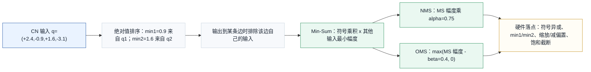
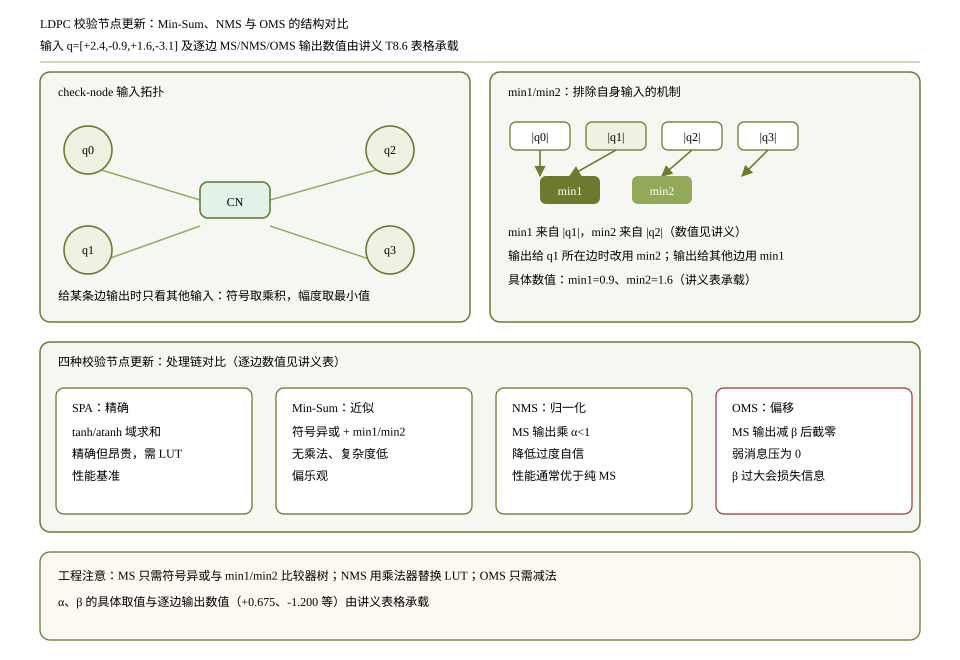

# T8.6 LDPC Min-Sum、归一化 Min-Sum 与偏移 Min-Sum
## 本节学习目标

本节讲低密度奇偶校验码译码中最常见的校验节点近似算法：Min-Sum、归一化 Min-Sum（Normalized Min-Sum, NMS）和偏移 Min-Sum（Offset Min-Sum, OMS）。[[T8.5_LDPC_sum_product_BP|T8.5]] 已经给出和积算法（Sum-Product Algorithm, SPA）的精确校验节点公式：

$$
r_{i\to j}
=
2\operatorname{atanh}
\left(
\prod_{j'\in\mathcal{N}(i)\setminus j}
\tanh\frac{q_{j'\to i}}{2}
\right).
\tag{1}
$$

式 (1) 数学上准确，但工程上昂贵：它需要 $\tanh$、$\operatorname{atanh}$、乘法、查表或分段近似。Min-Sum 的目标是抓住式 (1) 最重要的两个结构：输出符号由其他输入符号共同决定，输出幅度主要受其他输入中最不可靠的那个限制。

学完本节后，应能做到：

- 解释 Min-Sum 为什么从 SPA 校验节点复杂度中被引出。
- 写出校验节点输出符号的计算方式：其他输入符号相乘，硬件中通常用符号位异或实现。
- 写出校验节点输出幅度的计算方式：取其他输入绝对值的最小值。
- 解释 min1/min2 技巧：最小值来自当前输出边自身时，必须改用次小值。
- 用同一组输入计算 Min-Sum、NMS 和 OMS 输出。
- 说明 NMS 的归一化系数为什么通常小于 1，OMS 的 offset 为什么不能过大。
- 比较 SPA、Min-Sum、NMS、OMS 的性能、复杂度和硬件资源取舍。
- 给出定点位宽、饱和、截断和寄存器传输级/专用集成电路映射的关键检查点。

本节是算法实现课，不是新的 3GPP 协议规则。TS 38.212 规定 NR LDPC 的 $H$ 矩阵结构；Min-Sum/NMS/OMS 是接收机为了降低复杂度而采用的实现策略。

## 前置知识检查

| 前置项 | 本节需要达到的程度 |
|:---|:---|
| T8.5 BP/SPA | 知道校验节点精确公式里有 $\tanh/\operatorname{atanh}$，且输出给某条边时要排除自身输入。 |
| 对数似然比 | 知道对数似然比的符号表示更像 0 或 1，幅度表示可靠度。 |
| Tanner 图 | 知道校验节点连接多条边，每条边都有输入消息 $q_{j\to i}$ 和输出消息 $r_{i\to j}$。 |
| 定点数 | 知道硬件中 LLR 和消息通常有有限位宽，溢出需要饱和而不是回绕。 |
| 比较器树 | 知道在一组数中找最小值和次小值可以用比较器结构实现。 |

如果 [[T8.5_LDPC_sum_product_BP|T8.5]] 的 SPA 公式还不熟，先抓住一句话：Min-Sum 不是重新定义 LDPC 码，而是在同一个 Tanner 图上用更便宜的方式近似校验节点输出。

## 路线图 Prompt 覆盖表

| Prompt 要求 | 本节覆盖位置 | 覆盖方式 |
|:---|:---|:---|
| 讲解 Min-Sum 近似 | “从 SPA 到 Min-Sum” | 从 $\tanh/\operatorname{atanh}$ 复杂度引出符号和最小幅度近似。 |
| 讲解符号乘积 | “符号规则” | 给符号公式，并说明硬件中用符号位异或。 |
| 讲解最小值/次小值技巧 | “min1/min2 机制” | 解释最小值来自自身输入时必须使用次小值。 |
| 讲解归一化 Min-Sum | “归一化 Min-Sum” | 给 $\alpha$ 缩放公式，说明 $\alpha<1$ 用于降低过度自信。 |
| 讲解偏移 Min-Sum | “偏移 Min-Sum” | 给 $\beta$ 偏移公式，说明 offset 太大会压掉弱消息。 |
| 讨论性能/复杂度取舍 | “性能、复杂度和硬件取舍” | 对比 SPA、MS、NMS、OMS 的函数、比较器、乘法和性能风险。 |
| 包含 check-node 数值例子 | “同一组输入的数值例子” | 用 $[2.4,-0.9,1.6,-3.1]$ 逐边计算三种输出。 |
| 按弹性审计清单取舍并拓展 | 全文 | 补协议边界、Python、定点、RTL/ASIC、验证、失败案例、自测题和执行记录。 |

这张表只表示最低覆盖。正文还会把 Min-Sum 的硬件 min1/min2 实现、饱和策略和失败定位单独展开，避免只停留在公式层面。

## 资料与协议边界

本节依托 TS 38.212 Rel-19 `38212-j30` §5.3.2 的 LDPC 矩阵结构，但 Min-Sum/NMS/OMS 本身不是 3GPP 规范指定的译码算法。

| 内容 | 协议地位 | 本节处理方式 |
|:---|:---|:---|
| LDPC $H$ 矩阵、BG1/BG2、$Z_c$ 和 shift table | TS 38.212 §5.3.2 规范内容 | 作为 Tanner 图和校验节点邻接关系的来源。 |
| SPA/BP、Min-Sum、NMS、OMS | 接收机算法实现 | 解释理论和工程映射，不写成协议强制要求。 |
| syndrome 检查 | 来自 $H\hat{\mathbf{x}}^T=\mathbf{0}$ 的码约束 | 可作为接收机 early stop 策略，具体检查频率由实现决定。 |

本地证据如下：

| 协议位置 | 本地证据路径 |
| :--- | :--- |
| TS 38.212 §5.3.2 | `3GPP_Rel19/processed/TS_38.212_38212-j30/content.md` 行 948-989 |
| Table 5.3.2-1 | `tables/table_0013.csv/html` |
| Table 5.3.2-2/3 | `tables/table_0014.csv/html`、`tables/table_0015.csv/html` |

本文的数值例子只演示一个校验节点更新，不是 NR conformance vector。真实 NR 硬件会把这些 check-node update 单元嵌入 BG row/layer、$Z_c$ 并行向量和 message memory 读写流程中。

## 从 SPA 到 Min-Sum

先回看 SPA 校验节点公式。对校验节点 $c_i$，输出给变量 $v_j$ 的消息是：

$$
r_{i\to j}
=
2\operatorname{atanh}
\left(
\prod_{j'\in\mathcal{N}(i)\setminus j}
\tanh\frac{q_{j'\to i}}{2}
\right).
\tag{2}
$$

式 (2) 有两个可观察规律。

第一，输出符号由其他输入符号决定。因为 $\tanh(x)$ 保持 $x$ 的符号，乘积的符号就是其他输入符号的乘积：

$$
\operatorname{sign}(r_{i\to j})
=
\prod_{j'\in\mathcal{N}(i)\setminus j}
\operatorname{sign}(q_{j'\to i}).
\tag{3}
$$

第二，输出幅度被最不可靠的输入限制。若其他输入中有一个 $|q|$ 很小，则 $\tanh(|q|/2)$ 很小，乘积幅度被拉低；即使其他输入很可靠，输出也不能非常可靠。Min-Sum 把这个直觉近似成：

$$
|r_{i\to j}|
\approx
\min_{j'\in\mathcal{N}(i)\setminus j}
|q_{j'\to i}|.
\tag{4}
$$

把式 (3) 和式 (4) 合起来，就是 Min-Sum：

$$
r_{i\to j}^{\mathrm{MS}}
=
\left(
\prod_{j'\in\mathcal{N}(i)\setminus j}
\operatorname{sign}(q_{j'\to i})
\right)
\min_{j'\in\mathcal{N}(i)\setminus j}
|q_{j'\to i}|.
\tag{5}
$$

式 (5) 回答的问题是：不用 $\tanh/\operatorname{atanh}$，如何近似校验节点给某条边的外信息。它只需要符号处理和最小值比较，因此非常适合硬件。

## 符号规则

本文采用 $L=\log(P(b=0)/P(b=1))$ 的 LLR 符号约定。对 Min-Sum 来说，符号只关心正负：

$$
\operatorname{sign}(x)=
\begin{cases}
+1, & x\ge 0,\\
-1, & x<0.
\end{cases}
\tag{6}
$$

若校验节点输出给 $v_j$，只看其他输入。假设其他输入的负号个数为 $n_-$，则：

$$
\operatorname{sign}(r_{i\to j}^{\mathrm{MS}})
=
(-1)^{n_-}.
\tag{7}
$$

式 (7) 表示负号个数为偶数时输出为正，负号个数为奇数时输出为负。硬件里通常不真的做乘法，而是对符号位做异或。若采用“1 表示负号”的符号位，则其他输入符号位异或的结果就是输出符号位。

这个规则与偶校验直觉一致：若其他变量整体倾向的异或为 0，当前变量应倾向 0；若其他变量整体倾向的异或为 1，当前变量应倾向 1。

## min1/min2 机制

Min-Sum 的朴素写法要求每条输出边都在“其他输入”里找最小幅度。如果校验节点度数为 $d_c$，逐边重算会很浪费。硬件常用 min1/min2 技巧：

1. 扫描所有输入幅度，找到最小值 `min1`、最小值所在边 `idx_min1` 和次小值 `min2`。
2. 输出给非 `idx_min1` 的边时，幅度用 `min1`。
3. 输出给 `idx_min1` 自己时，必须排除自身输入，所以幅度用 `min2`。

用公式写为：

$$
m_1=\min_{k\in\mathcal{N}(i)} |q_{k\to i}|,
\tag{8}
$$

$$
k_1=\arg\min_{k\in\mathcal{N}(i)} |q_{k\to i}|,
\tag{9}
$$

$$
m_2=\min_{k\in\mathcal{N}(i)\setminus k_1} |q_{k\to i}|.
\tag{10}
$$

输出给 $j$ 的幅度为：

$$
M_{i\to j}=
\begin{cases}
m_2, & j=k_1,\\
m_1, & j\ne k_1.
\end{cases}
\tag{11}
$$

式 (11) 是硬件实现 Min-Sum 的核心。若输出给唯一最小值所在边时仍使用 `min1`，就等价于把该边自己的消息带回自己，违反外信息原则。若存在并列最小值，排除自身后的数值可能仍等于 `min1`，但实现仍必须按目标边排除自身来选择来源，或者定义稳定的 tie-break 规则；不能因为数值相等就省略来源检查。

## 归一化 Min-Sum

纯 Min-Sum 往往比 SPA 更“自信”。原因是式 (4) 只取最小幅度，忽略了 SPA 中其他输入通过 $\tanh/\operatorname{atanh}$ 产生的修正项。为了降低过度自信，NMS 对 Min-Sum 输出乘一个系数 $\alpha$：

$$
r_{i\to j}^{\mathrm{NMS}}
=
\alpha r_{i\to j}^{\mathrm{MS}},
\quad 0<\alpha<1.
\tag{12}
$$

式 (12) 的工程含义是：保留 Min-Sum 的符号和 min1/min2 结构，但把幅度缩小。$\alpha$ 通常通过仿真调参，不是 TS 38.212 给出的协议常数。$\alpha$ 太接近 1 时接近纯 Min-Sum，过度自信问题仍在；$\alpha$ 太小会把有效外信息削弱，收敛变慢或性能下降。

## 偏移 Min-Sum

OMS 不乘系数，而是在幅度上减去一个 offset $\beta$，并截到 0：

$$
r_{i\to j}^{\mathrm{OMS}}
=
\operatorname{sign}(r_{i\to j}^{\mathrm{MS}})
\max(|r_{i\to j}^{\mathrm{MS}}|-\beta,0),
\quad \beta\ge0.
\tag{13}
$$

式 (13) 的直觉是：Min-Sum 的幅度偏大，先减掉一个固定置信度余量；如果原本就很弱，减完为负就截成 0，表示这条校验暂时不给强外信息。$\beta$ 太小修正不足，$\beta$ 太大会把大量弱但有用的消息压成 0，导致收敛能力下降。

NMS 和 OMS 的选择是实现策略。NMS 需要乘法或移位近似；OMS 需要减法和比较截零。某些硬件更偏好 OMS，因为减法和 `max(.,0)` 比乘法简单；某些实现用可配置 $\alpha/\beta$ 适配不同码率和信道条件。

## 同一组输入的数值例子

取一个校验节点，输入消息为：

$$
\mathbf{q}=
\begin{bmatrix}
+2.4&-0.9&+1.6&-3.1
\end{bmatrix}.
\tag{14}
$$

绝对值为：

$$
|\mathbf{q}|=
\begin{bmatrix}
2.4&0.9&1.6&3.1
\end{bmatrix}.
\tag{15}
$$

因此：

$$
m_1=0.9,\quad k_1=1,\quad m_2=1.6.
\tag{16}
$$

这里 `min1` 来自 $q_1=-0.9$，`min2` 来自 $q_2=+1.6$。若输出给 $q_1$ 所在边，幅度必须用 1.6；输出给其他边，幅度用 0.9。




| 内容 | 说明 |
|:---|:---|
| 输入 | $q=[+2.4,-0.9,+1.6,-3.1]$，绝对值为 $[2.4,0.9,1.6,3.1]$。 |
| min1/min2 | `min1=0.9` 来自 $q_1$；`min2=1.6` 来自 $q_2$。输出给 $q_1$ 时必须用 `min2`，输出给其他边使用 `min1`。 |
| to $q_0$ | 其他输入 $[-0.9,+1.6,-3.1]$，符号为正，幅度 0.9；MS/NMS/OMS 分别为 $+0.900,+0.675,+0.500$。 |
| to $q_1$ | 其他输入 $[+2.4,+1.6,-3.1]$，符号为负，幅度 1.6；MS/NMS/OMS 分别为 $-1.600,-1.200,-1.200$。 |
| to $q_2$ | 其他输入 $[+2.4,-0.9,-3.1]$，符号为正，幅度 0.9；MS/NMS/OMS 分别为 $+0.900,+0.675,+0.500$。 |
| to $q_3$ | 其他输入 $[+2.4,-0.9,+1.6]$，符号为负，幅度 0.9；MS/NMS/OMS 分别为 $-0.900,-0.675,-0.500$。 |
| 工程取舍 | SPA 精确但昂贵；Min-Sum 低复杂度但偏乐观；NMS 用 $\alpha<1$ 降低过度自信；OMS 用 $\beta$ 减偏置并截零。 |
本节图表中先展示 check-node 输入，再展示 min1/min2 机制和同一组输入下三种算法的输出。

设 NMS 的 $\alpha=0.75$，OMS 的 $\beta=0.4$。逐边计算如下：

下表完整展开“同一组输入下的三种输出”这一栏：`to q0`、`to q1`、`to q2`、`to q3` 是校验节点分别给四条输入边返回外信息时的可见输出边标签。

| 输出边 | 其他输入 | 符号 | 幅度 | MS | NMS | OMS |
|:---|:---|:---:|:---:|:---:|:---:|:---:|
| to q0 | $[-0.9,+1.6,-3.1]$ | $+$ | 0.9 | +0.900 | +0.675 | +0.500 |
| to q1 | $[+2.4,+1.6,-3.1]$ | $-$ | 1.6 | -1.600 | -1.200 | -1.200 |
| to q2 | $[+2.4,-0.9,-3.1]$ | $+$ | 0.9 | +0.900 | +0.675 | +0.500 |
| to q3 | $[+2.4,-0.9,+1.6]$ | $-$ | 0.9 | -0.900 | -0.675 | -0.500 |

以输出给 $q_1$ 为例，其他输入是 $+2.4,+1.6,-3.1$。负号个数为 1，所以输出为负；其他输入绝对值的最小值是 1.6，所以 MS 输出为 -1.6。NMS 乘 $\alpha=0.75$ 得 -1.2；OMS 减 $\beta=0.4$ 后也是 -1.2。

## Python 校验片段

下面的 Python 片段复现本节数值表。

```python
def min_sum_variants(inputs, alpha=0.75, beta=0.4):
    outputs = []
    for target in range(len(inputs)):
        others = [value for idx, value in enumerate(inputs) if idx != target]
        sign = 1
        for value in others:
            sign *= 1 if value >= 0 else -1
        magnitude = min(abs(value) for value in others)
        ms = sign * magnitude
        nms = alpha * ms
        oms = sign * max(magnitude - beta, 0.0)
        outputs.append((round(ms, 3), round(nms, 3), round(oms, 3)))
    return outputs


inputs = [2.4, -0.9, 1.6, -3.1]
assert min_sum_variants(inputs) == [
    (0.9, 0.675, 0.5),
    (-1.6, -1.2, -1.2),
    (0.9, 0.675, 0.5),
    (-0.9, -0.675, -0.5),
]
print("T8.6_MIN_SUM_VARIANTS_OK")
```

预期输出：

```text
T8.6_MIN_SUM_VARIANTS_OK
```

这段代码按“逐边排除自身”的朴素方式写，便于阅读。真实硬件不会每条边重新扫描所有输入，而会用 min1/min2、整体符号和每边符号修正来减少比较次数。

## 性能、复杂度和硬件取舍

| 算法 | 校验节点核心计算 | 性能倾向 | 硬件复杂度 | 典型风险 |
|:---|:---|:---|:---|:---|
| SPA | $\tanh$、乘积、$\operatorname{atanh}$ | 最接近概率精确 BP | 最高，需要 LUT/函数近似 | 函数近似、溢出和延迟。 |
| Min-Sum | 符号乘积、min1/min2 | 常比 SPA 过度自信 | 低，比较器和异或为主 | 幅度偏大，误收敛。 |
| NMS | Min-Sum 后乘 $\alpha$ | 常优于纯 Min-Sum | 中，需乘法或移位近似 | $\alpha$ 太小削弱消息。 |
| OMS | Min-Sum 后减 $\beta$ 并截零 | 常优于纯 Min-Sum | 中，需减法和比较截零 | $\beta$ 太大压掉弱消息。 |

从硬件角度看，SPA 的问题不是“不能做”，而是吞吐、面积、功耗和时序压力都大。NR LDPC 译码器通常追求高吞吐和高度并行，校验节点数量多、边数量多、迭代次数多，因此每条边上少一个函数近似都很有价值。

从性能角度看，Min-Sum 类近似不是无损替代。纯 Min-Sum 容易把校验节点输出幅度估得偏大，导致 posterior LLR 过早饱和。NMS 和 OMS 都是在降低这种过度自信，只是一个用乘法缩放，一个用减法偏移。

## 近似误差、trapping set 与 error floor

Min-Sum 类算法的误差不只体现在平均块错误率曲线平移。它还会改变某些小子图上的消息动力学。若短环内的少量变量节点被强噪声或错误初始化推向同一个错误方向，过度自信的 CNU 输出可能让这些节点互相强化，syndrome weight 停在一个小但非零的值；这类有限长度失败常用 trapping set 和 absorbing set 描述。

| 概念 | 定义性描述 | 与 MS/NMS/OMS 的关系 | dump 线索 |
|:---|:---|:---|:---|
| trapping set | 一组变量节点在迭代后仍保持错误，诱导子本节图表中只剩少量 unsatisfied check nodes。 | 过大的 Min-Sum 幅度可能让错误子图更难逃离。 | `error_vn_set`、unsatisfied CN 列表、局部 edge list。 |
| absorbing set | 更强的 trapping set：错误变量从 satisfied checks 收到的支持多于从 unsatisfied checks 收到的纠正。 | $\alpha$ 太大或 $\beta$ 太小会增强 satisfied checks 的错误支持。 | 每个错误 VN 的 satisfied/unsatisfied 邻居计数。 |
| error floor | 高 SNR 区域错误率下降变慢或变平的现象。 | 可能由 trapping/absorbing sets、定点饱和、LLR scaling、max-iteration 等共同导致。 | 高 SNR failure bundle，而不是单条循环冗余校验fail 日志。 |

这里必须保留证据边界：没有本项目的长仿真日志，不能说某个 BG/$Z_c$/算法参数“已经证明没有 error floor”。可以写的是诊断模板：在高 SNR 失败样本里保存错误比特集合、局部 Tanner 子图、每轮 syndrome weight、LLR 饱和计数和 directed replay seed。若失败总集中在少数小子图，再进一步做 trapping set 搜索。

一个最小高 SNR failure dump 建议包含：

| 字段 | 用途 |
|:---|:---|
| `snr_db`, `channel_seed`, `noise_snapshot_hash` | 证明失败可 replay，避免把随机现象写成结构结论。 |
| `algorithm`, `alpha`, `beta`, `quant_profile` | 区分 SPA/MS/NMS/OMS 和定点参数。 |
| `syndrome_weight_per_iter` | 判断停滞、震荡还是 late convergence miss。 |
| `error_vn_indices`, `unsatisfied_cn_indices` | 构造错误诱导子图。 |
| `local_edges`, `cycle_hits`, `girth_estimate_local` | 分析短环和 trapping set 候选。 |
| `sat_count_per_iter`, `max_abs_llr_per_iter` | 判断是否由饱和或过度自信触发。 |

## 定点化策略

Min-Sum 类算法虽然比 SPA 简单，但定点风险仍然明显。

| 对象 | 风险 | 建议 |
|:---|:---|:---|
| 输入 LLR | demapper 或 soft buffer 输入幅度过大 | 入口裁剪到 decoder 支持范围。 |
| 符号位 | 正负号约定与 hard decision 不一致 | descriptor 固定 LLR 符号约定，并用强正/强负单元测试。 |
| min1/min2 | 相等最小值或 index tie 处理不一致 | 明确定义 tie-break，验证不影响排除自身规则。 |
| NMS $\alpha$ | 乘法量化误差 | 用定点系数，例如 Q 格式；记录舍入模式。 |
| OMS $\beta$ | offset 量化或过大 | $\max(m-\beta,0)$ 必须饱和到 0，不能下溢成负幅度。 |
| VN 累加 | 多条消息相加溢出 | 使用 guard bits 和 saturating add。 |
| 输出消息 | 截断导致性能损失 | 先内部高精度，再统一裁剪到 message memory 位宽。 |

一个常见策略是：channel LLR 用 6-8 bit signed，内部 VN 累加多保留 1-2 个 guard bits，CN 输出裁剪到 message memory 位宽。具体位宽不是协议规定，必须通过浮点、定点和 bit-exact 回归共同确定。

## RTL/ASIC 映射

Min-Sum 校验节点单元在寄存器传输级/专用集成电路中通常包含：

| 子模块 | 功能 | 检查点 |
|:---|:---|:---|
| sign XOR tree | 计算所有输入符号异或和每条输出符号 | 每条输出必须排除自身符号。 |
| abs unit | 取输入幅度 | 最小负数取绝对值要防溢出。 |
| min tree | 找 `min1`、`idx_min1`、`min2` | tie-break 和 min2 选择必须稳定。 |
| magnitude select | 对 `idx_min1` 输出用 `min2`，其他用 `min1` | 这是最容易出错的外信息点。 |
| NMS scale | 乘 $\alpha$ 或移位加近似 | 系数量化和舍入模式固定。 |
| OMS offset | 减 $\beta$ 后截零 | `magnitude < beta` 时输出 0。 |
| saturator | 输出裁剪到 message 位宽 | 禁止 wrap-around。 |

min1/min2 可以在一个 layer 或一个 row group 的并行向量上展开。对 QC-LDPC 来说，同一 base graph edge 对应 $Z_c$ 个 bit-level 位置，硬件常按 $Z_c$ 并行度或分片并行度处理一组消息。bank conflict、layered schedule 和 read-modify-write 生命周期会在 [[T8.7_layered_LDPC_decoding_schedule|T8.7]] 继续展开。

## 失败案例

| 失败案例 | 现象 | 最小 dump 字段 | 定位方式 |
|:---|:---|:---|:---|
| 符号异或错 | syndrome 长期不收敛，或强 LLR 测试方向反 | 输入符号位、输出符号位、LLR 约定 | 用全正、单负、双负输入测试符号表。 |
| min2 选择错 | 输出给最小值所在边时幅度过小或回声信息 | `min1`、`idx_min1`、`min2`、target edge | 构造唯一最小值例子，例如本文 $q_1=-0.9$。 |
| offset 过大 | 很多 OMS 输出变 0，迭代无力 | $\beta$、zero-output count、iteration count | 扫描不同 $\beta$ 的收敛和错误率。 |
| normalization 太小 | 外信息整体过弱，收敛慢 | $\alpha$、average message magnitude | 对比 $\alpha=1$、0.875、0.75 等曲线。 |
| 饱和策略错误 | LLR wrap-around，硬判决突变 | input/output max、overflow flag | 所有加法和缩放后裁剪必须饱和。 |
| 把参数写成协议常数 | 不同场景无法调优 | build config、decoder descriptor | $\alpha/\beta$ 是实现参数，不是 TS 38.212 强制值。 |

## 浮点与定点验证方法

| 验证层 | 检查内容 | 期望 |
|:---|:---|:---|
| toy check-node | 用本文输入复现 MS/NMS/OMS 表 | 输出 `T8.6_MIN_SUM_VARIANTS_OK`。 |
| random check-node | 随机输入下比较朴素逐边扫描与 min1/min2 实现 | 完全一致。 |
| sign stress | 全正、单负、双负、多负输入 | 符号符合 $(-1)^{n_-}$。 |
| tie stress | 两个输入幅度相同且为最小值 | tie-break 稳定，输出不使用自身消息。 |
| saturation stress | 输入接近最大幅度 | 不 wrap-around，输出被正确裁剪。 |
| algorithm sweep | SPA、MS、NMS、OMS 在同一浮点链路下比较 | 记录性能/复杂度取舍，不把某一参数写死为协议。 |

RTL bit-exact 验证要单独覆盖 min1/min2，因为这是与数学公式最容易脱节的地方。建议生成包含 `inputs`、`target_edge`、`sign_all`、`sign_excluding_target`、`min1`、`idx_min1`、`min2`、`selected_min`、`scaled_or_offset_value`、`saturated_output` 的 dump。

## 自测题

1. Min-Sum 从 SPA 校验节点公式中保留了哪两个核心结构？
2. 为什么输出给最小值所在边时要用 min2？
3. 对输入 $[+2.4,-0.9,+1.6,-3.1]$，输出给 $q_1$ 的 Min-Sum 符号和幅度分别是什么？
4. NMS 的 $\alpha$ 为什么通常小于 1？
5. OMS 的 $\beta$ 为什么不能过大？
6. Min-Sum 与 SPA 的硬件复杂度主要差在哪里？
7. $\alpha/\beta$ 是 3GPP 协议常数吗？

## 自测题参考答案

1. 保留了符号结构和最小可靠度结构：符号由其他输入符号乘积决定，幅度近似为其他输入绝对值的最小值。
2. 因为输出给某条边时必须排除这条边自己的输入。若最小值来自目标边，继续用 min1 就把自身消息带回自己，违反外信息原则，所以要改用 min2。
3. 输出给 $q_1$ 时，其他输入为 $+2.4,+1.6,-3.1$。负号个数为 1，所以符号为负；最小幅度为 1.6，所以 Min-Sum 输出为 -1.6。
4. 纯 Min-Sum 往往比 SPA 更过度自信，$\alpha<1$ 用来缩小校验节点输出幅度，补偿近似带来的幅度偏大。
5. $\beta$ 过大会把许多弱但仍有用的消息压成 0，导致外信息不足、收敛变慢或性能下降。
6. SPA 需要 $\tanh/\operatorname{atanh}$、乘积和函数近似；Min-Sum 主要需要符号异或、绝对值、min1/min2 比较和饱和，硬件更便宜。
7. 不是。$\alpha/\beta$ 是接收机实现参数，需要仿真和定点回归确定；TS 38.212 不规定具体译码算法或这些参数。

## 协议证据表

| 结论 | 协议证据 | 本地核验 |
|:---|:---|:---|
| NR LDPC 的 Tanner 图结构来自 $H$ | TS 38.212 §5.3.2 | `content.md` 行 948-989；[[T8.3_NR_LDPC_lifting_QC_matrix|T8.3]]/[[T8.4_LDPC_Tanner_graph_message_passing|T8.4]] 已解释 BG、$Z_c$ 和 Tanner 图。 |
| Min-Sum/NMS/OMS 不是 3GPP 规范强制算法 | TS 38.212 规定编码和 rate matching，不规定接收机内部 BP 近似 | 本节明确作为算法实现课处理。 |
| syndrome 检查仍基于 $H\hat{\mathbf{x}}^T$ | TS 38.212 §5.3.2 的 $H$ 构造 | 本节只修改 check-node 软消息近似，不改变码约束。 |

## 图示


## 执行与证据记录

| 项目 | 记录 |
|:---|:---|
| 路线图卡片 | `2026-06-19-lte-nr-decoding-learning-roadmap.md` [[T8.6_LDPC_MS_NMS_OMS|T8.6]]，Prompt/产出/验收/3GPP 证据已覆盖。 |
| 讲义文件 | `docs/L2_协议算法/T8.6_LDPC_MS_NMS_OMS.md`。 |
| 协议来源 | TS 38.212 Rel-19 `38212-j30` §5.3.2；本节算法不作为规范译码算法。 |
| 图表资产 | `docs/L2_协议算法/assets/T8.6_LDPC_MS_NMS_OMS_compare.svg`（手绘 SVG，替代原 `tools/archive_python_drawing/figures/render_ldpc_min_sum_variants.py` 生成的 PNG）。 |
| Python 校验 | 已执行正文 Min-Sum variants 片段，输出 `T8.6_MIN_SUM_VARIANTS_OK`。 |
| 资产文件检查 | SVG 几何审计通过（五项检查）；`cairosvg` 渲染验证通过。 |
| 单篇审计 | `python3 tools/audit_lesson_terms.py docs/L2_协议算法/T8.6_LDPC_MS_NMS_OMS.md` 输出 `LESSON_TERM_AUDIT_OK`；`python3 tools/audit_markdown_headings.py docs/L2_协议算法/T8.6_LDPC_MS_NMS_OMS.md` 输出 `MARKDOWN_HEADING_AUDIT_OK`；`python3 tools/audit_lesson_depth.py --strict docs/L2_协议算法/T8.6_LDPC_MS_NMS_OMS.md` 输出 `LESSON_DEPTH_AUDIT_OK`；`python3 tools/audit_latex_render.py docs/L2_协议算法/T8.6_LDPC_MS_NMS_OMS.md` 输出 `LATEX_RENDER_AUDIT_OK formulas=109`。 |
| 审核经理复核 | Critical=0、Important=0；已按 Minor 建议补充并列最小值 tie-break 和来源检查说明，复审计仍全部通过。 |

## 参考文献

1. 3GPP TS 38.212 Rel-19 `38212-j30`, “NR; Multiplexing and channel coding”, §5.3.2, Table 5.3.2-1, Table 5.3.2-2, Table 5.3.2-3.
2. R. G. Gallager, “Low-Density Parity-Check Codes”, IRE Transactions on Information Theory, 1962.
3. J. Chen and M. P. C. Fossorier, “Near Optimum Universal Belief Propagation Based Decoding of Low-Density Parity Check Codes”, IEEE Transactions on Communications, 2002.
4. M. P. C. Fossorier, M. Mihaljevic, and H. Imai, “Reduced Complexity Iterative Decoding of Low-Density Parity Check Codes Based on Belief Propagation”, IEEE Transactions on Communications, 1999.
