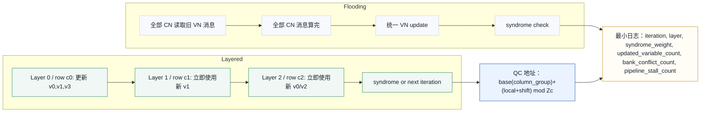
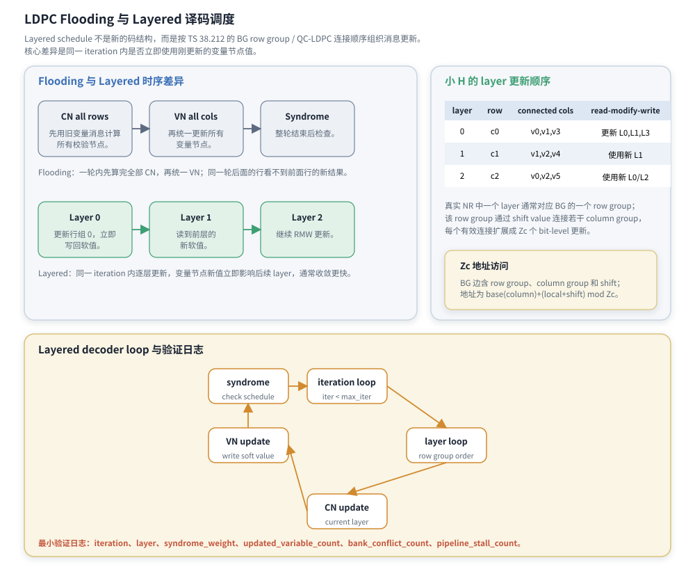

# T8.7 LDPC 分层译码调度
## 本节学习目标

本节讲低密度奇偶校验码译码器的消息更新调度：泛洪式调度（flooding schedule）和分层调度（layered schedule）。[[T8.5_LDPC_sum_product_BP|T8.5]]/[[T8.6_LDPC_MS_NMS_OMS|T8.6]] 已经讲了校验节点和变量节点如何计算消息；本节回答另一个工程问题：这些节点按什么顺序更新，什么时候写回变量节点值，什么时候检查 syndrome，以及为什么NR工程实现常把准循环低密度奇偶校验码（Quasi-Cyclic LDPC, QC-LDPC）的基图（Base Graph, BG）row group 映射成 layer。

学完本节后，应能做到：

- 区分 flooding schedule 和 layered schedule 的更新时序。
- 解释 layered schedule 为什么通常收敛更快：同一 iteration 内后续 layer 能看到前面 layer 更新后的变量节点值。
- 说明 layer 与 TS 38.212 LDPC base graph row group 的关系。
- 结合提升大小 $Z_c$ 解释一个 layer 内如何访问 column group 和 bit-level 地址。
- 用一个小型 $H$ 矩阵列出 layered 更新顺序。
- 写出 layered decoder loop 的伪代码，包括 iteration loop、layer loop、check-node update、variable update 和 syndrome check。
- 区分 syndrome early stop 与循环冗余校验early stop 的不同层次。
- 说明寄存器传输级/专用集成电路中的 bank conflict、read-modify-write、pipeline stall 和 layer parallelism。
- 列出最小验证日志字段：`iteration`、`layer`、`syndrome_weight`、`updated_variable_count` 等。

本节不是新的3GPP 协议规则。TS 38.212 定义 LDPC 的 base graph、lifting 和 $H$；flooding 或 layered 是接收机实现如何组织同一张 Tanner 图上的消息更新。

## 前置知识检查

| 前置项 | 本节需要达到的程度 |
|:---|:---|
| T8.3 QC-LDPC | 知道真实 NR 的 $H$ 由 BG row/column group、$Z_c$ 和 shift value 展开。 |
| T8.4 Tanner 图 | 知道 $H$ 的一行是一条校验方程，一列是变量节点，$H_{i,j}=1$ 是边。 |
| T8.5 BP/SPA | 知道变量节点和校验节点沿边交换对数似然比消息。 |
| T8.6 Min-Sum | 知道工程上常用 Min-Sum 类 check-node unit 代替精确 SPA。 |
| 存储读写 | 知道同一个变量节点 LLR 可能被多个 layer 读取和写回。 |

如果前置还不稳，先抓住一句话：layered schedule 不改变码，也不改变 $H$；它改变的是“先更新哪一批校验行，以及更新后是否立刻写回变量节点”。

调度问题本质上是“证据什么时候生效”的问题。两个译码器可以使用完全相同的 $H$、相同的 Min-Sum check-node unit 和相同的初始 LLR，只因为写回顺序不同，收敛速度、存储压力和流水停顿就会不同。因此本节虽然有协议锚点，但重点不是把 TS 38.212 当索引，而是解释协议定义的 QC-LDPC 结构为什么能被组织成工程上可流水的 layer。

## 路线图 Prompt 覆盖表

| Prompt 要求 | 本节覆盖位置 | 覆盖方式 |
|:---|:---|:---|
| 讲解 flooding 与 layered LDPC 译码调度 | “两种调度的时序差异” | 对比一轮内 CN/VN 更新顺序。 |
| 说明 layered 收敛更快 | “layered 收敛更快的原因” | 解释同一 iteration 内新 LLR 立即影响后续 layer。 |
| QC 行如何映射到层 | “layer 与 base graph row group” | 说明一个 BG row group 通常对应一个 layer。 |
| 消息存储如何变化 | “消息存储和 read-modify-write” | 对比 flooding 的全量 message memory 与 layered 的复用方式。 |
| 包含小型 layered 更新表 | “小型 H 的 layered 更新例子” | 给 3 行小矩阵、layer 顺序、连接变量和更新说明。 |
| 工程取舍 | “RTL/ASIC 映射”和“验证方法” | 补 bank conflict、pipeline、parallelism、日志字段。 |

这张表只表示最低覆盖。正文还会补 syndrome/CRC 边界、Zc 地址公式、伪代码和常见错误。

## 资料与协议边界

本节的协议锚点仍是 TS 38.212 Rel-19 `38212-j30` §5.3.2。协议定义了 base graph、lifting size、循环置换矩阵和完整 $H$ 的构造；调度方式是接收端实现策略。

| 协议位置 | 本地证据路径 |
| :--- | :--- |
| TS 38.212 §5.3.2 | `3GPP_Rel19/processed/TS_38.212_38212-j30/content.md` 行 948-989 |
| Table 5.3.2-1 | `tables/table_0013.csv/html` |
| Table 5.3.2-2/3 | `tables/table_0014.csv/html`、`tables/table_0015.csv/html` |

本节使用的“小 $H$”和流程图是教学例子，不是 NR conformance vector。真实 NR 中 BG1 有 46 个 row group，BG2 有 42 个 row group；每个 row group 展开成 $Z_c$ 条 bit-level 校验行。

## 两种调度的时序差异

Flooding schedule 可以直译为“泛洪式调度”。它的做法是：一轮 iteration 内，先用上一轮变量节点消息计算所有校验节点消息，再统一更新所有变量节点。

Layered schedule 可以译为“分层调度”。它的做法是：把校验矩阵按行组分成多个 layer；处理完一个 layer 后，立即把该 layer 对变量节点的影响写回，然后下一个 layer 读取这些新值。

| 对比项 | Flooding | Layered |
|:---|:---|:---|
| 一轮内的更新顺序 | 先所有 CN，再所有 VN | 一层一层 CN/VN read-modify-write |
| 后续行能否看到前面行的新值 | 同一轮内看不到 | 同一轮内能看到 |
| 收敛速度 | 通常需要更多 iteration | 通常较少 iteration |
| message memory | 往往保留较完整的 edge messages | 可复用更多存储，按 layer 生命周期管理 |
| 控制复杂度 | 时序较直观 | 需要处理 read-modify-write、bank conflict 和 pipeline stall |
| syndrome 检查 | 常在整轮后检查 | 可整轮后检查，也可按实现做分层/周期性检查 |

实际实现里还会看到 shuffled schedule。它介于 flooding 和严格 layered 之间，可以按 variable groups、check groups 或子层顺序交错更新。

| 调度 | 更新粒度 | 收敛特征 | 存储/冲突特征 | 适用提醒 |
|:---|:---|:---|:---|:---|
| Flooding | 全部 CN 阶段后再 VN 阶段 | 信息传播慢一些，但阶段边界清晰。 | message memory 生命周期较长，读写相位容易分开。 | 适合教学和参考模型，硬件吞吐可能受 message memory 压力限制。 |
| Layered | 按 row group/layer 立即 read-modify-write | 同一 iteration 内利用新消息，通常更快收敛。 | RMW、read-after-write hazard、bank conflict 更突出。 | NR QC-LDPC 常见硬件路线，但 schedule 是实现策略。 |
| Shuffled | 按子组交错更新，粒度介于二者之间 | 可能在收敛和并行度之间折中。 | 依赖具体 shuffle order，验证更复杂。 | 必须保存 order/hash，不能把本地顺序误写成 3GPP 强制。 |

三者都不改变 TS 38.212 定义的 $H$。区别只在“何时读取旧消息、何时写回新消息、后续节点是否马上看到新值”。因此验证时要把 `schedule_mode`、`layer_order_hash`、`rmw_policy` 写进配置或 dump。

图 T8.7-1 展示了这两种时序。

Flooding 路径依次是 `CN all rows`、`VN all cols`、`Syndrome`：先用旧变量消息计算所有校验节点，再统一更新所有变量节点，整轮结束后检查。Layered 路径依次是 `Layer 0`、`Layer 1`、`Layer 2`：`Layer 0` 更新行组 0，立即写回软值；`Layer 1` 读到前层的新软值；`Layer 2` 继续 read-modify-write（RMW）更新。



| 内容 | 说明 |
|:---|:---|
| Flooding 路径 | 一轮内先对全部 CN 计算消息，再统一 VN update，最后做 syndrome；阶段边界清晰但信息传播慢。 |
| Layered 路径 | 按 row group/layer 顺序做 read-modify-write，一个 layer 写回的新软值会被后续 layer 立即看到。 |
| layer 0 | 对应 $c_0$，连接 $v_0,v_1,v_3$，更新 $L_0,L_1,L_3$。 |
| layer 1 | 对应 $c_1$，连接 $v_1,v_2,v_4$，会使用 layer 0 刚写回的新 $L_1$。 |
| layer 2 | 对应 $c_2$，连接 $v_0,v_2,v_5$，会使用前面 layer 已更新的相关变量。 |
| QC 地址 | 每条边的向量访问由 `base(column_group)+(local+shift) mod Zc` 生成；shift 来自 BG/iLS 表。 |
| decoder loop | `iter < max_iter` 时进入 layer loop；每层做 CN update、VN read-modify-write、message writeback；可在层末或轮末检查 syndrome。 |
| 验证日志 | 至少记录 `iteration`、`layer`、`syndrome_weight`、`updated_variable_count`、`bank_conflict_count`、`pipeline_stall_count`，否则无法复现调度差异。 |
本节图表中左侧对比两种更新顺序，右侧给出小型 layered 更新表，底部给出 decoder loop 和最小验证日志字段。

右侧的小 $H$ 更新顺序可直接读成三行：layer 0 的 row `c0` 连接 `v0,v1,v3` 并“更新 L0,L1,L3”；layer 1 的 row `c1` 连接 `v1,v2,v4` 并使用新 L1；layer 2 的 row `c2` 连接 `v0,v2,v5` 并使用新 L0/L2。这里的 `v1,v2,v4` 和 `v0,v2,v5` 是教学矩阵中的列集合，真实 NR 会替换为 BG column group 与 shift 展开后的 $Z_c$ 个 bit-level 地址。

### Zc 地址访问

BG 边含 row group、column group 和 shift；地址为 `base(column)+(local+shift) mod Zc`。这个访问式说明一个 layer 内不是随意扫描完整 $H$，而是按 column group 的 base 地址和该边 shift 生成 $Z_c$ 个循环偏移位置。

### Layered decoder loop 与验证日志

Layered decoder loop 的控制链路是 `iteration loop`、`layer loop`、`CN update`、`VN update`、`syndrome`：只要 `iter < max_iter`，就按 row group order 进入 layer loop；当前 layer 完成 CN update 后写 soft value，随后在合法检查点执行 syndrome check schedule。最小验证日志字段包括 `iteration`、`layer`、`syndrome_weight`、`updated_variable_count`、`bank_conflict_count`、`pipeline_stall_count`。

## layered 收敛更快的原因

以变量节点 LLR 为例。设 $L_j$ 是变量节点 $v_j$ 当前的总 LLR，某个 layer 更新后会产生对 $L_j$ 的修正。Flooding 中，这个修正要等到整轮 CN 都算完后才统一反映到变量节点；同一轮后面的校验行仍然看旧 $L_j$。

Layered 中，一个 layer 更新完成后立即写回：

$$
L_j \leftarrow L_j - r_{old,i\to j} + r_{new,i\to j}.
\tag{1}
$$

式 (1) 是 layered read-modify-write 的核心。它回答的问题是：同一条边的旧 check-to-variable 消息已经包含在 $L_j$ 里，当前 layer 算出新消息后，不能简单相加，而要先减掉旧消息，再加上新消息。这样 $L_j$ 始终代表“当前已经处理过的 layer 给出的最新总证据”。

后续 layer 读取到的是更新后的 $L_j$，所以一次 layered iteration 内的信息传播更及时。这就是 layered 通常收敛更快的主要原因。它不是改变了 LDPC 码，而是更快地利用了同一轮中已经得到的新外信息。

一个小数值例子更直观。假设某条边更新前，变量节点总 LLR 为：

$$
L_j=1.20,
\tag{2}
$$

上一轮这个 layer 对它的旧消息是：

$$
r_{old,i\to j}=0.30,
\tag{3}
$$

当前 layer 重新计算后得到：

$$
r_{new,i\to j}=-0.50.
\tag{4}
$$

若直接相加，会得到 $1.20+(-0.50)=0.70$，旧的 $+0.30$ 仍然残留在 $L_j$ 中。正确的 read-modify-write 是：

$$
L_j \leftarrow 1.20-0.30-0.50=0.40.
\tag{5}
$$

这个例子说明 layered 不是“每层都往 LLR 上累加一遍”，而是“用新外信息替换旧外信息”。这也是调试 layered decoder 时必须同时 dump `old_R`、`new_R` 和 `old_L/new_L` 的原因。

## layer 与 base graph row group

TS 38.212 §5.3.2 给出 BG1/BG2 的 base graph 行列组，以及每个有效 `(row, column)` 的 shift value。工程上，一个 layer 通常对应 base graph 的一个 row group。对 BG1，row group 索引范围是 0 到 45；对 BG2，row group 索引范围是 0 到 41。

一个 row group 不是一条 bit-level 校验方程，而是一组 $Z_c$ 条规律相似的校验行。若某个 row group 连接多个 column group，每个连接都有一个 shift value。处理该 layer 时，硬件会对 local index：

$$
\ell=0,1,\ldots,Z_c-1
\tag{6}
$$

访问相应变量地址：

$$
addr = base(column\_group) + ((\ell + shift)\bmod Z_c).
\tag{7}
$$

式 (7) 表示 QC-LDPC 的地址生成规律。它比保存完整 $H$ 更适合硬件：只需 row group、column group、shift value 和 local index，就能找到 bit-level 变量节点位置。

## 小型 H 的 layered 更新例子

取 [[T8.4_LDPC_Tanner_graph_message_passing|T8.4]] 的教学矩阵：

$$
H =
\begin{bmatrix}
1&1&0&1&0&0\\
0&1&1&0&1&0\\
1&0&1&0&0&1
\end{bmatrix}.
\tag{8}
$$

把每一行当作一个 layer，更新顺序如下：

| layer | row | 连接变量 | read-modify-write 说明 |
|:---:|:---:|:---|:---|
| 0 | $c_0$ | $v_0,v_1,v_3$ | 更新 $L_0,L_1,L_3$，写回后供后续 layer 使用。 |
| 1 | $c_1$ | $v_1,v_2,v_4$ | 读取到 layer 0 更新后的 $L_1$，再更新 $L_1,L_2,L_4$。 |
| 2 | $c_2$ | $v_0,v_2,v_5$ | 读取到 layer 0/1 更新后的 $L_0,L_2$，再更新 $L_0,L_2,L_5$。 |

这个例子虽然小，但已经包含 layered 的关键：变量节点 $v_1$ 被 layer 0 和 layer 1 共享，$v_0$ 被 layer 0 和 layer 2 共享，$v_2$ 被 layer 1 和 layer 2 共享。Layered 调度让共享变量在同一 iteration 内更快传播新信息。

## 消息存储和 read-modify-write

在 flooding 中，常需保留较完整的 edge message，至少要能在整轮 CN/VN 阶段访问上一轮或当前轮所需的 check-to-variable 与 variable-to-check 信息。具体实现不一定同时长期保存完整 V2C 和 C2V；V2C 也可能由 channel LLR 与 incoming C2V 现场重算。总体上，flooding 的存储生命周期比 layered 更接近“整轮统一更新”，因此存储压力通常更大。

在 layered Min-Sum 中，常见做法是保存：

| 存储对象 | 作用 | 生命周期 |
|:---|:---|:---|
| channel LLR memory | 保存原始信道证据 | 整个码块译码期间不变。 |
| variable LLR memory | 保存当前总 LLR $L_j$ | 每处理一个 layer 都可能被更新。 |
| check message memory | 保存旧 $r_{i\to j}$ | 当前 layer read-modify-write 时读旧值、写新值。 |
| edge schedule ROM | 保存 row group、column group、shift | 整个 decoder 配置期间只读。 |
| syndrome buffer | 保存当前硬判决或 syndrome 统计 | 按实现选择整轮或周期性更新。 |

式 (1) 说明了为什么需要旧 $r_{old}$。若只把新 $r_{new}$ 加到 $L_j$ 上，旧消息仍留在 $L_j$ 里，会重复计算同一 layer 的证据。若忘记写回 $r_{new}$，下一次处理该 layer 时又会减错旧值。

## 伪代码

下面的伪代码以 layered Min-Sum 为例，强调调度和存储，不展开 [[T8.6_LDPC_MS_NMS_OMS|T8.6]] 的 min1/min2 内部细节。

```text
input:
  L_ch[n_cols]
  edge_schedule[layer]        # row group -> connected column groups and shifts
  R_old[layer][edge][local]   # old check-to-variable messages
  max_iter

L = L_ch
for iter in 1..max_iter:
    for layer in 0..num_layers-1:
        edges = edge_schedule[layer]
        updated_variable_count = 0
        bank_conflict_count = 0
        pipeline_stall_count = 0
        for local in 0..Zc-1:
            # gather variable beliefs for this layer
            for edge in edges:
                j = address(edge.column_group, local, edge.shift)
                q[edge] = L[j] - R_old[layer][edge][local]

            R_new = check_node_update(q)

            for edge in edges:
                j = address(edge.column_group, local, edge.shift)
                L[j] = q[edge] + R_new[edge]
                R_old[layer][edge][local] = R_new[edge]
                updated_variable_count += 1

        log_layer(iter, layer, updated_variable_count,
                  bank_conflict_count, pipeline_stall_count)

    hard = decision(L)
    syndrome_weight = syndrome_check(hard, edge_schedule)
    log_iteration(iter, layer="all", syndrome_weight=syndrome_weight)
    if syndrome_weight == 0:
        break

extract information bits
if code-block segmentation added CB CRC:
    run CB CRC after information-bit extraction and filler removal
run transport-block (TB) CRC after code-block concatenation
```

这里 `q[edge] = L[j] - R_old[...]` 和 `L[j] = q[edge] + R_new[edge]` 合起来就是式 (1)。这也是 layered 与简单“把所有消息加起来”的最大不同。

## syndrome early stop 与 CRC early stop

syndrome early stop 和 CRC early stop 常被混用，必须分开。这里先明确边界对象：传输块是协议交付给物理层编码链路的大块数据，码块是在 TB 分段后进入 LDPC 译码器的单个处理单元。

| 对象 | 检查位置 | 检查内容 | 工程用途 |
|:---|:---|:---|:---|
| syndrome early stop | LDPC decoder core 内部 | $H\hat{\mathbf{x}}^T=\mathbf{0}$ | 判断当前硬判决是否满足 LDPC 码约束，可提前停止迭代。 |
| CB CRC | LDPC 译码、信息位抽取和 filler removal 之后 | 条件性 CB 数据完整性 | 只有当本 TB 被分成多个 CB 并附加 CB CRC 时才检查；单 CB 场景不应假设必有 CB CRC。 |
| 传输块 CRC | CB concat 之后 | 传输块数据完整性 | 决定交付和混合自动重传请求反馈边界。 |

Layered schedule 可以在每个 iteration 结束后检查 syndrome，也可以按若干 layer 周期做调试统计；这是实现策略。用于 early stop 的通过条件应是对完整 $H$ 的 syndrome 为 0；只检查当前 layer 或已处理 layer 只能作为调试/统计，不能等价于整码块通过。CRC 不能替代 syndrome 的码约束语义，syndrome 也不能替代 CRC 的业务完整性语义。

## RTL/ASIC 映射

Layered LDPC decoder 的硬件风险主要在存储和时序：

| 模块/风险 | 含义 | 检查点 |
|:---|:---|:---|
| bank conflict | 同一 cycle 多个 edge 访问同一 memory bank | bank mapping、stall 计数、冲突仲裁。 |
| read-modify-write | 同一变量 LLR 读旧值、减旧消息、加新消息、写回 | 读写旁路、写后读 hazard、R_old 同步。 |
| pipeline stall | CN update、VN update、memory access 延迟不匹配 | valid/ready、bubble、flush。 |
| layer parallelism | 同时处理多个 row group 或 local index | layer 间变量共享时不能破坏依赖。 |
| syndrome checker | 使用 hard decision 和 edge schedule 检查约束 | 与 decoder edge schedule 等价。 |
| message memory width | R_old 和 LLR 的定点位宽 | 饱和、舍入和 sign convention。 |

NR QC-LDPC 的优势是地址规律强，但 bank conflict 仍然存在。若两个 column group 或两个 local index 映射到同一个 bank，硬件要么 stall，要么通过更复杂的 bank mapping 和 crossbar 避开冲突。无论采取哪种策略，都不能改变 TS 38.212 定义的连接关系。

## 浮点仿真与定点策略

**浮点仿真**应以 [[T8.5_LDPC_sum_product_BP|T8.5]]（SPA/BP）和 [[T8.6_LDPC_MS_NMS_OMS|T8.6]]（MS/NMS/OMS）的浮点模型为 baseline，将 layered schedule 作为独立变量对比：

- 同一条 BG、$Z_c$、码率和 Eb/N0 下，对比 flooding SPA、flooding MS、layered SPA 和 layered MS 的 BLER、FER、平均迭代次数和 syndrome stop rate。
- layered 收敛更快，但必须确认它不会在某些 corner case（如高码率小 $Z_c$、大量 punctured bit）下比 flooding 更差。
- 浮点仿真必须输出逐层消息 trace（至少前 3 次迭代的每层 CN→VN 和 VN→CN 消息直方图），用于解释 layered 为何在特定层出现消息震荡。

**定点策略**围绕 layered schedule 的特有风险展开：

| 风险点 | 原因 | 防御 |
|:---|:---|:---|
| 层间消息饱和 | 同一列在相邻层被反复更新，累积增量可能超过 flooding 的 $I_{\text{max}}$ 倍 | CN 和 VN 消息使用对称饱和，并在每层结束后做一次 soft clipping；饱和阈值比 flooding 收严 10-20% |
| 层序精度损失 | layered 使用逐层写入的 R_new，flooding 使用全矩阵 R_old；定点截断方向不同会让两种调度在迭代后期产生系统性偏差 | layered fixed 和 flooding fixed 在 [[T18.3_NR_LDPC_fixed_point_model_plan|T18.3]] 的 $I_{\text{max}}$ 和位宽配置下逐 checkpoint 对比；允许 layered 比 flooding 早 1-2 次迭代收敛，但不允许最终 hard bits 不一致 |
| R_new 写回位宽 | layered 的 R_new 写回后当层就被下一层当 R_old 读走，rounding error 在层间传播 | R_new 写回前统一做 nearest-even rounding；保存整数域 R_old/R_new snapshot 供 [[T18.6_bit_exact_regression_harness|T18.6]] bit-exact regression 比对 |

定点模型验收要求：Python fixed layered 与 Python float layered 的 BLER 损失在 [[T18.3_NR_LDPC_fixed_point_model_plan|T18.3]] 定义的容差内；C/C++ fixed layered 与 Python fixed layered 在 $N=10^4$ 帧上 checkpoint 一致。

## 最小验证日志

Layered decoder 的 bug 很多来自“时序看起来对，某一层却用了旧值”。建议最小日志至少包含：

| 字段 | 含义 | 用途 |
|:---|:---|:---|
| `iteration` | 当前迭代编号 | 定位收敛在哪一轮发生。 |
| `layer` | 当前 row group/layer | 定位哪一层出现异常。 |
| `updated_variable_count` | 本层写回的变量节点数 | 检查 edge schedule 和无连接项/实现 mask 是否误跳。 |
| `syndrome_weight` | syndrome 中 1 的个数 | 观察总体收敛趋势、停滞、反复震荡或突增；不要求逐 iteration 单调下降。 |
| `bank_conflict_count` | 本层或本轮 bank conflict 次数 | 定位吞吐下降和 stall。 |
| `pipeline_stall_count` | pipeline 停顿次数 | 定位 valid/ready 或 hazard。 |
| `max_abs_llr` | 当前 LLR 最大幅度 | 检查饱和和过度自信。 |

最小日志不需要保存所有 edge messages，但在定位疑难问题时，应能打开更详细 dump：`row_group`、`column_group`、`shift`、`local`、`old_R`、`q`、`new_R`、`old_L`、`new_L`。

## 常见错误与定位方式

| 错误 | 现象 | 最小 dump 字段 | 定位方式 |
|:---|:---|:---|:---|
| 旧值/新值混用 | layered 性能退化成 flooding 或不收敛 | `old_L`、`old_R`、`new_R`、`new_L` | 检查式 (1) 是否实现为减旧加新。 |
| layer 顺序错 | syndrome 曲线异常，特定 BG/Zc 才失败 | `layer`、row group、edge list | 与设计选定的 layer order 以及 TS Table 5.3.2-2/3 的 row/column/shift 连接关系对齐；不要把 TS 表行序写成协议强制译码顺序。 |
| syndrome 检查时机错 | 提前停在未完整更新状态 | `iteration`、`layer`、syndrome check point | 明确只在整轮后或合法检查点 early stop。 |
| bank conflict 未处理 | 吞吐低或数据被覆盖 | bank id、stall、write enable | 加冲突仲裁或调整 bank mapping。 |
| read-after-write hazard | 后续 layer 读不到上一层新值 | write cycle、read cycle、bypass | 加旁路或 pipeline stall。 |
| R_old 未同步 | LLR 幅度逐层漂移，过度自信 | old/new message dump | 每次写回 LLR 同步更新 message memory。 |
| shift 地址错 | 部分 layer syndrome 一直失败 | column group、shift、local address | 用 [[T8.3_NR_LDPC_lifting_QC_matrix|T8.3]] 的 QC 展开 toy matrix 对比。 |

## 自测题

1. Flooding schedule 和 layered schedule 在一轮 iteration 内的主要区别是什么？
2. 为什么 layered schedule 通常收敛更快？
3. 一个 NR LDPC layer 通常对应协议结构中的什么对象？
4. 式 (1) 为什么要减掉旧消息再加新消息？
5. syndrome early stop 和 CRC early stop 的边界是什么？
6. `updated_variable_count` 和 `syndrome_weight` 为什么是最小验证日志字段？
7. bank conflict 会影响协议定义的连接关系吗？

## 自测题参考答案

1. Flooding 一轮内先算完所有校验节点，再统一更新变量节点；layered 按 layer 逐层更新，每层处理后立即写回变量节点值。
2. 因为同一 iteration 内后续 layer 能看到前面 layer 更新后的 LLR，新信息传播更快，通常需要更少 iteration。
3. 通常对应 base graph 的一个 row group。该 row group 经 $Z_c$ 提升后对应 $Z_c$ 条 bit-level 校验行。
4. 因为当前变量 LLR 中已经包含旧的 $r_{old,i\to j}$。若只加新消息，会重复计算该 layer 的旧证据；减旧加新才能保持总 LLR 一致。
5. syndrome early stop 检查 LDPC 码约束 $H\hat{\mathbf{x}}^T=\mathbf{0}$，用于 decoder 内部停止；CRC 检查 CB/TB 数据完整性，用于交付和 HARQ 反馈边界。CB CRC 是条件性的，只有分段并附加 CB CRC 时才存在。
6. `updated_variable_count` 能发现 layer 访问数量、mask 或 edge schedule 错误；`syndrome_weight` 能观察总体收敛趋势、停滞、震荡或突增，但不要求单调下降。
7. 不能。bank conflict 是硬件存储访问问题，只能通过 stall、bank mapping、crossbar 或调度优化解决，不能改变 TS 38.212 定义的边连接。

## 协议证据表

| 结论 | 协议证据 | 本地核验 |
|:---|:---|:---|
| BG1/BG2 的 $H$ 行列组来自 TS 38.212 §5.3.2 | TS 38.212 §5.3.2 | `content.md` 行 948-989；[[T8.3_NR_LDPC_lifting_QC_matrix|T8.3]] 已解释 BG1=46 row groups、BG2=42 row groups。 |
| layer 与 row group 的映射是接收端实现策略 | TS 38.212 定义 $H$，不定义 decoder schedule | 本节明确 layered/flooding 不是协议强制算法。 |
| $Z_c$ 和 shift value 决定 layer 内 bit-level 地址 | TS 38.212 §5.3.2、Table 5.3.2-1/2/3 | [[T8.3_NR_LDPC_lifting_QC_matrix|T8.3]] 已重建 lifting set 和 BG shift table。 |

## 图示


## 执行与证据记录

| 项目 | 记录 |
|:---|:---|
| 路线图卡片 | `2026-06-19-lte-nr-decoding-learning-roadmap.md` [[T8.7_layered_LDPC_decoding_schedule|T8.7]]，Prompt/产出/验收/3GPP 证据已覆盖。 |
| 讲义文件 | `docs/L2_协议算法/T8.7_layered_LDPC_decoding_schedule.md`。 |
| 协议来源 | TS 38.212 Rel-19 `38212-j30` §5.3.2、Table 5.3.2-1/2/3；本节调度为实现策略。 |
| 图表资产 | `docs/L2_协议算法/assets/T8.7_LDPC_layered_schedule_flow.svg`（手绘 SVG，替代原 `tools/archive_python_drawing/figures/render_ldpc_layered_schedule.py` 生成的 PNG）。 |
| 单篇审计 | `python3 tools/audit_lesson_terms.py docs/L2_协议算法/T8.7_layered_LDPC_decoding_schedule.md` 输出 `LESSON_TERM_AUDIT_OK`；`python3 tools/audit_markdown_headings.py docs/L2_协议算法/T8.7_layered_LDPC_decoding_schedule.md` 输出 `MARKDOWN_HEADING_AUDIT_OK`；`python3 tools/audit_lesson_depth.py --strict docs/L2_协议算法/T8.7_layered_LDPC_decoding_schedule.md` 输出 `LESSON_DEPTH_AUDIT_OK`；`python3 tools/audit_latex_render.py docs/L2_协议算法/T8.7_layered_LDPC_decoding_schedule.md` 输出 `LATEX_RENDER_AUDIT_OK formulas=63`。 |

## 参考文献

1. 3GPP TS 38.212 Rel-19 `38212-j30`, “NR; Multiplexing and channel coding”, §5.3.2, Table 5.3.2-1, Table 5.3.2-2, Table 5.3.2-3.
2. R. G. Gallager, “Low-Density Parity-Check Codes”, IRE Transactions on Information Theory, 1962.
3. D. E. Hocevar, “A Reduced Complexity Decoder Architecture via Layered Decoding of LDPC Codes”, IEEE Workshop on Signal Processing Systems, 2004.
