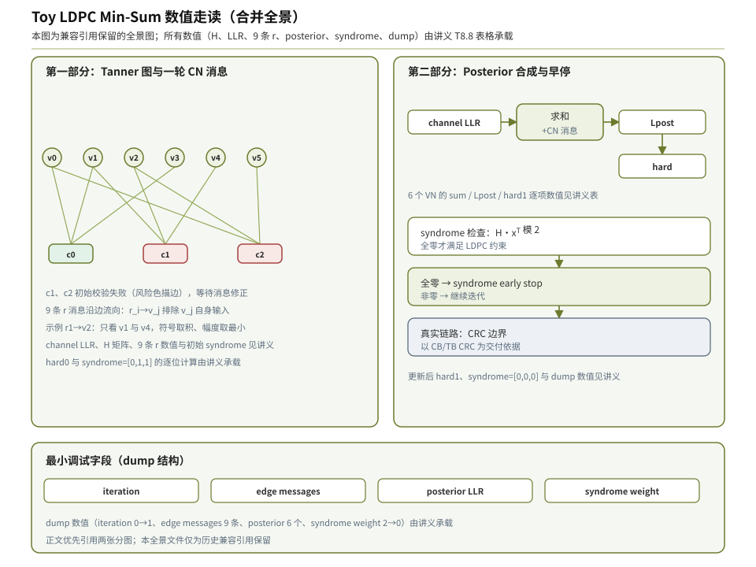
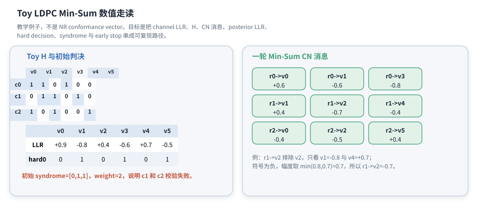
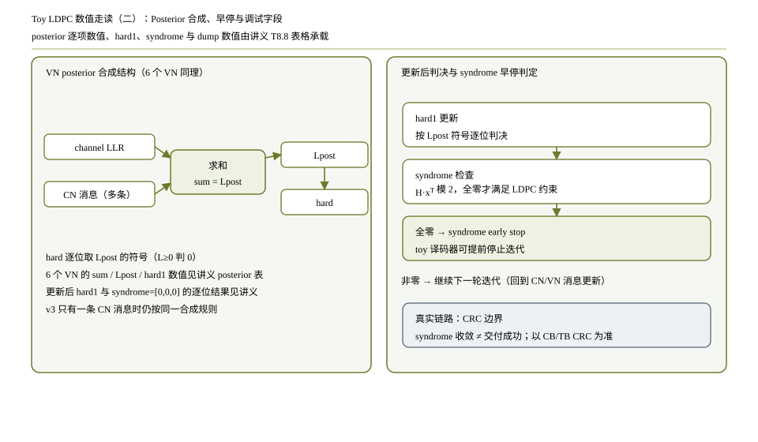

# T8.8 NR LDPC 译码数值走读
## 本节学习目标

本节是一个低密度奇偶校验码译码的手算走读。它的目标不是再讲一遍基图、提升、Tanner 图或 Min-Sum，而是把这些概念串成一条可追踪的数字路径：信道对数似然比进来，奇偶校验矩阵 $H$ 给出边连接，校验节点（Check Node, CN）产生外信息，变量节点（Variable Node, VN）合成后验 LLR，硬判决得到候选比特，syndrome 检查决定是否可以 early stop。

本节后半部分会把这个 toy 例子放到接收端工程边界里：循环冗余校验用于信息位完整性检查，混合自动重传请求反馈依赖最终传输块结果，寄存器传输级/专用集成电路实现则要关心定点、饱和、消息存储和调试 dump。

**本节所有矩阵和数字都是教学例子，不是 NRconformance vector。**真实 NR 的矩阵来自 TS 38.212 §5.3.2 的 Base Graph 1/2（BG1/BG2）、提升大小 $Z_c$ 和 shift table；本节用一个 $3\times6$ 的小矩阵，是为了让每条边的消息都能手算出来。

学完本节后，应能做到：

- 给定一个小型 $H$、一组 channel LLR，计算初始 hard decision。
- 用含 2 个元素的伽罗瓦域（Galois Field with 2 elements, GF(2)）syndrome 判断哪些校验方程失败。
- 对每个 CN 手算一轮 Min-Sum 消息。
- 对每个 VN 合成 posterior LLR，并重新硬判决。
- 再次计算 syndrome，解释 syndrome early stop 的含义和边界。
- 说明 toy $H$ 与真实 NR BG/$Z_c$/$H$ 的对应关系和差异。
- 写出最小 Python 校验脚本，复现正文中的所有关键数字。
- 知道调试时至少要 dump `iteration`、`edge_messages`、`posterior_llr` 和 `syndrome_weight`。

本节是算法教学和工程调试桥梁，不新增 3GPP 协议规则。协议规定码结构，接收端选择具体的置信传播（Belief Propagation, BP）、和积算法（Sum-Product Algorithm, SPA）、Min-Sum、Normalized Min-Sum 或 Offset Min-Sum 实现。

## 前置知识检查

| 前置项 | 本节需要达到的程度 |
|:---|:---|
| T8.4 Tanner 图与 syndrome | 知道 $H_{i,j}=1$ 表示 CN $c_i$ 与 VN $v_j$ 之间有一条边。 |
| T8.5 BP/SPA | 知道置信传播（Belief Propagation, BP）/和积算法（Sum-Product Algorithm, SPA）消息沿边传递，给某条边的输出不能使用这条边自己的输入。 |
| T8.6 Min-Sum | 知道 CN 输出符号来自其他输入符号，幅度取其他输入绝对值的最小值。 |
| T8.7 调度 | 知道本节的“一轮”可以理解为一次教学化 flooding 更新；真实实现可能采用 layered read-modify-write。 |
| LLR 符号约定 | 本文采用 $L=\log(P(b=0)/P(b=1))$：$L\ge0$ 判 0，$L<0$ 判 1。 |

如果只记一件事：本节每个数字都代表一条“证据”。LLR 的符号告诉译码器更相信 0 还是 1，LLR 的幅度告诉译码器有多相信，CN 消息告诉某个校验方程对某个比特的外部约束，syndrome 告诉硬判决是否满足所有校验方程。

## 路线图 Prompt 覆盖表

| Prompt 要求 | 本节覆盖位置 | 覆盖方式 |
|:---|:---|:---|
| 玩具 LDPC 数值走读 | 全文 | 使用 $3\times6$ toy $H$，逐步计算。 |
| 信道 LLR | “输入：toy H 与 channel LLR” | 给 6 个 channel LLR 并解释符号/幅度。 |
| 奇偶校验矩阵 | “输入：toy H 与 channel LLR” | 给完整 $H$ 和每行连接关系。 |
| CN 更新 | “一轮 Min-Sum CN 更新” | 逐行逐边计算 9 条 CN 消息。 |
| VN 更新 | “VN posterior LLR 合成” | 对 6 个变量节点逐个求 posterior。 |
| 硬判决 | “初始 hard decision”和“更新后的 hard decision” | 给初始与更新后 hard decision。 |
| syndrome 和早停 | “syndrome 计算”和“syndrome early stop 边界” | 手算初始/更新后 syndrome，并说明 early stop 不能替代 CRC。 |
| 明确教学例子，不是 NR 向量 | 开头和协议边界 | 多次标注 toy example，不作为规范一致性向量。 |
| 弹性审计清单 | 后半部分 | 补协议证据、Python、定点、RTL/ASIC、验证、常见错误、自测答案和执行记录。 |

这张表只是最低覆盖。正文额外补充真实 NR 对应关系、调试 dump 字段、定点饱和风险、RTL/ASIC 映射和失败定位。

## 资料与协议边界

本节引用 TS 38.212 Rel-19 `38212-j30` §5.3.2，只用于说明真实 NR LDPC 的矩阵来源。协议文本说明：LDPC 编码在 GF(2) 中执行；BG1 的 base matrix 有 46 个 row group 和 68 个 column group，BG2 有 42 个 row group 和 52 个 column group；完整 $H$ 由 base matrix 中的 0/1 元素替换成 $Z_c\times Z_c$ 零矩阵或循环置换矩阵得到。

| 协议位置 | 本地证据路径 |
| :--- | :--- |
| TS 38.212 §5.3.2 | `3GPP_Rel19/processed/TS_38.212_38212-j30/content.md` 行 948-989 |
| Table 5.3.2-1 | `3GPP_Rel19/processed/TS_38.212_38212-j30/tables/table_0013.csv/html` |
| Table 5.3.2-2/3 | `3GPP_Rel19/processed/TS_38.212_38212-j30/tables/table_0014.csv/html`、`table_0015.csv/html` |

本节 toy $H$ 与真实 NR 的关系如下：

| 对象 | toy 例子 | 真实 NR |
|:---|:---|:---|
| base structure | 直接给 $3\times6$ 的 $H$ | 先选 BG1/BG2，再按 $Z_c$ 和 shift 展开。 |
| 行含义 | 3 个 CN：$c_0,c_1,c_2$ | BG1/2 的 row group 展开为大量 bit-level CN。 |
| 列含义 | 6 个 VN：$v_0,\ldots,v_5$ | BG column group 展开为 $68Z_c$ 或 $52Z_c$ 个列位置。 |
| 边 | $H_{i,j}=1$ 直接表示边 | shift table 中的非零项展开成 $Z_c$ 条规律连接。 |
| 数值目的 | 手算一轮 Min-Sum | 工程验证真实 decoder 的局部逻辑、日志字段和符号约定。 |

## 输入：toy H 与 channel LLR

本节使用的 toy parity-check matrix 是：

$$
H =
\begin{bmatrix}
1&1&0&1&0&0\\
0&1&1&0&1&0\\
1&0&1&0&0&1
\end{bmatrix}.
\tag{1}
$$

式 (1) 有 3 行、6 列。第 0 行连接 $v_0,v_1,v_3$，第 1 行连接 $v_1,v_2,v_4$，第 2 行连接 $v_0,v_2,v_5$。这就是 Tanner 图的边集合：

| CN | 连接的 VN | 对应校验方程 |
|:---:|:---|:---|
| $c_0$ | $v_0,v_1,v_3$ | $b_0\oplus b_1\oplus b_3=0$ |
| $c_1$ | $v_1,v_2,v_4$ | $b_1\oplus b_2\oplus b_4=0$ |
| $c_2$ | $v_0,v_2,v_5$ | $b_0\oplus b_2\oplus b_5=0$ |

channel LLR 取为：

$$
\mathbf{L}_{ch}
=
\begin{bmatrix}
+0.9&-0.8&+0.4&-0.6&+0.7&-0.5
\end{bmatrix}.
\tag{2}
$$

每个数字的含义如下：

| VN | channel LLR | 直觉解释 |
|:---:|:---:|:---|
| $v_0$ | $+0.9$ | 更相信 $b_0=0$，可靠度中等。 |
| $v_1$ | $-0.8$ | 更相信 $b_1=1$，可靠度中等。 |
| $v_2$ | $+0.4$ | 略微相信 $b_2=0$，证据较弱。 |
| $v_3$ | $-0.6$ | 更相信 $b_3=1$。 |
| $v_4$ | $+0.7$ | 更相信 $b_4=0$。 |
| $v_5$ | $-0.5$ | 更相信 $b_5=1$，证据较弱。 |

图 T8.8-1 把本节的所有主要数字放在一张图里，便于对照正文手算。第一张分图标题是“Toy H 与初始判决”，用于放置 toy $H$、channel LLR、初始 hard decision 和初始 syndrome；第二张分图标题是“Posterior、早停与调试字段”，承接 9 条 CN 消息，展示 VN posterior 合成、更新后 hard decision、syndrome early stop 和最小 dump 字段。图中 posterior 区块标题写作“Posterior、硬判决与早停”，强调 posterior LLR、硬判决和停止条件不能拆开看。

```mermaid
%%{init: {'theme': 'default'}}%%
flowchart LR
H["toy H: 3x6；c0=(v0,v1,v3), c1=(v1,v2,v4), c2=(v0,v2,v5)"]
INIT["Lch=[+0.9,-0.8,+0.4,-0.6,+0.7,-0.5]；hard0=[0,1,0,1,0,1]"]
S0["initial syndrome=[0,1,1], weight=2"]
CN["一轮 Min-Sum：计算 9 条 CN->VN 消息"]
POST["posterior LLR 合成；hard1=[0,1,1,1,0,1]"]
S1["updated syndrome=[0,0,0]；toy early stop"]
DBG["dump: iteration 0->1, edge messages=9, posterior LLR=6, syndrome weight 2->0"]
H --> INIT
INIT --> S0
S0 --> CN
CN --> POST
POST --> S1
S1 --> DBG

classDef matrix fill:#EAF3FF,stroke:#2457A6,color:#17212F;
classDef syndrome fill:#FFECEF,stroke:#C64B59,color:#17212F;
classDef msg fill:#EAF8EF,stroke:#2D8F5D,color:#17212F;
classDef posterior fill:#F3EAFE,stroke:#7457A6,color:#17212F;
classDef debug fill:#FFFDF6,stroke:#C69220,color:#17212F;
class H,INIT matrix;
class S0,S1 syndrome;
class CN msg;
class POST posterior;
class DBG debug;
```




| 内容 | 说明 |
|:---|:---|
| toy H | $\begin{bmatrix}1&1&0&1&0&0\\0&1&1&0&1&0\\1&0&1&0&0&1\end{bmatrix}$；三条 CN 分别连接 $(v_0,v_1,v_3)$、$(v_1,v_2,v_4)$、$(v_0,v_2,v_5)$。 |
| 初始输入 | $L^{ch}=[+0.9,-0.8,+0.4,-0.6,+0.7,-0.5]$；按 $L\ge0$ 判 0 得 `hard0=[0,1,0,1,0,1]`。 |
| 初始 syndrome | $s_0=0\oplus1\oplus1=0$；$s_1=1\oplus0\oplus0=1$；$s_2=0\oplus0\oplus1=1$；因此 `syndrome=[0,1,1]`，weight 为 2。 |
| r0->v0 | +0.6 |
| r0->v1 | -0.6 |
| r0->v3 | -0.8 |
| r1->v1 | +0.4 |
| r1->v2 | -0.7 |
| r1->v4 | -0.4 |
| r2->v0 | -0.4 |
| r2->v2 | -0.5 |
| r2->v5 | +0.4 |
| posterior 表 | $v_0:+1.1\to0$；$v_1:-1.0\to1$；$v_2:-0.8\to1$；$v_3:-1.4\to1$；$v_4:+0.3\to0$；$v_5:-0.1\to1$。 |
| 更新后结果 | `hard1=[0,1,1,1,0,1]`；三行 syndrome 全为 0；toy 译码器可 syndrome early stop，真实 NR 仍需 CRC 边界。 |
| 调试字段 | `iteration:0->1`；`edge messages:9 条 r`；`posterior LLR:6 个`；`syndrome weight:2->0`。 |
第一张图覆盖 toy $H$、初始 LLR、初始 hard decision、初始 syndrome 和 9 条 CN 消息；第二张图覆盖 posterior LLR、更新后 hard decision、syndrome early stop 和最小调试字段。脚本仍保留兼容用的合并资产，但正文使用两张分图，避免单张高图在页面宽度内缩放后表格变小。

## 初始 hard decision

本文采用的硬判决规则是：

$$
\hat{b}_j =
\begin{cases}
0, & L_j \ge 0,\\
1, & L_j < 0.
\end{cases}
\tag{3}
$$

把式 (2) 代入式 (3)，得到初始 hard decision：

$$
\hat{\mathbf{b}}^{(0)}
=
\begin{bmatrix}
0&1&0&1&0&1
\end{bmatrix}.
\tag{4}
$$

这里 $v_2$ 的 LLR 为 $+0.4$，虽然判成 0，但幅度小，表示这个 0 不够可靠；$v_5$ 的 LLR 为 $-0.5$，判成 1，也不算很可靠。Min-Sum 后面会用校验方程给这些弱位置补充外信息。

## 初始 syndrome 计算

syndrome 定义为：

$$
\mathbf{s}=H\hat{\mathbf{b}}^T \pmod 2.
\tag{5}
$$

式 (5) 的意思是：每一行校验方程把连接到的 hard bits 做异或；结果为 0 表示这一行满足偶校验，结果为 1 表示这一行失败。

逐行计算：

$$
s_0=b_0\oplus b_1\oplus b_3
=0\oplus1\oplus1=0,
\tag{6}
$$

$$
s_1=b_1\oplus b_2\oplus b_4
=1\oplus0\oplus0=1,
\tag{7}
$$

$$
s_2=b_0\oplus b_2\oplus b_5
=0\oplus0\oplus1=1.
\tag{8}
$$

所以：

$$
\mathbf{s}^{(0)}
=
\begin{bmatrix}
0&1&1
\end{bmatrix},
\quad
w_H(\mathbf{s}^{(0)})=2.
\tag{9}
$$

$w_H(\mathbf{s})$ 是 syndrome weight，也就是 syndrome 中 1 的个数。初始 syndrome weight 为 2，说明 3 条校验方程中有 2 条不满足，译码器不能 early stop。

## 一轮 Min-Sum CN 更新

本节使用 flooding 风格的一轮 Min-Sum：从第 0 轮到第 1 轮时，先令变量到校验消息 $q_{j\to i}^{(0)}=L_{ch,j}$，所以本轮 CN 可以直接用 channel LLR 代入，然后所有 VN 一起合成 posterior。这样便于手算。真实 NR 实现常采用 T8.7 的 layered 调度；layered 时会把旧消息替换为新消息并立即写回变量 LLR，但单条 CN 的 Min-Sum 计算规则相同。

一般多轮 Min-Sum CN 更新公式应写成 VN-to-CN 消息形式：

$$
r_{i\to j}^{(t)}
=
\left(
\prod_{j'\in\mathcal{N}(i)\setminus j}
\operatorname{sign}(q_{j'\to i}^{(t)})
\right)
\min_{j'\in\mathcal{N}(i)\setminus j}
|q_{j'\to i}^{(t)}|.
\tag{10}
$$

式 (10) 回答的问题是：校验节点 $c_i$ 给变量 $v_j$ 的外信息是什么。它必须排除 $v_j$ 自己，只使用同一校验方程里的其他变量证据。本节是第一轮教学例子，因此后续手算把 $q_{j\to i}^{(0)}$ 直接代入为 $L_{ch,j}$；多轮实现中，$q_{j\to i}^{(t)}$ 会包含上一轮或当前调度下的 VN-to-CN 外信息，不能每轮都只读 channel LLR。

### CN c0 的消息

$c_0$ 连接 $v_0,v_1,v_3$，对应 LLR 为：

$$
L_0=+0.9,\quad L_1=-0.8,\quad L_3=-0.6.
\tag{11}
$$

输出给 $v_0$ 时，排除 $v_0$，只看 $v_1=-0.8$ 和 $v_3=-0.6$。两个负号相乘为正，幅度取 $\min(0.8,0.6)=0.6$：

$$
r_{0\to0}=+0.6.
\tag{12}
$$

输出给 $v_1$ 时，排除 $v_1$，只看 $v_0=+0.9$ 和 $v_3=-0.6$。一正一负，符号为负，幅度取 $\min(0.9,0.6)=0.6$：

$$
r_{0\to1}=-0.6.
\tag{13}
$$

输出给 $v_3$ 时，排除 $v_3$，只看 $v_0=+0.9$ 和 $v_1=-0.8$。符号为负，幅度取 $\min(0.9,0.8)=0.8$：

$$
r_{0\to3}=-0.8.
\tag{14}
$$

### CN c1 的消息

$c_1$ 连接 $v_1,v_2,v_4$，对应 LLR 为：

$$
L_1=-0.8,\quad L_2=+0.4,\quad L_4=+0.7.
\tag{15}
$$

输出给 $v_1$：排除 $v_1$，看 $v_2=+0.4$ 和 $v_4=+0.7$，符号为正，幅度 $\min(0.4,0.7)=0.4$：

$$
r_{1\to1}=+0.4.
\tag{16}
$$

输出给 $v_2$：排除 $v_2$，看 $v_1=-0.8$ 和 $v_4=+0.7$，符号为负，幅度 $\min(0.8,0.7)=0.7$：

$$
r_{1\to2}=-0.7.
\tag{17}
$$

输出给 $v_4$：排除 $v_4$，看 $v_1=-0.8$ 和 $v_2=+0.4$，符号为负，幅度 $\min(0.8,0.4)=0.4$：

$$
r_{1\to4}=-0.4.
\tag{18}
$$

### CN c2 的消息

$c_2$ 连接 $v_0,v_2,v_5$，对应 LLR 为：

$$
L_0=+0.9,\quad L_2=+0.4,\quad L_5=-0.5.
\tag{19}
$$

输出给 $v_0$：排除 $v_0$，看 $v_2=+0.4$ 和 $v_5=-0.5$，符号为负，幅度 $\min(0.4,0.5)=0.4$：

$$
r_{2\to0}=-0.4.
\tag{20}
$$

输出给 $v_2$：排除 $v_2$，看 $v_0=+0.9$ 和 $v_5=-0.5$，符号为负，幅度 $\min(0.9,0.5)=0.5$：

$$
r_{2\to2}=-0.5.
\tag{21}
$$

输出给 $v_5$：排除 $v_5$，看 $v_0=+0.9$ 和 $v_2=+0.4$，符号为正，幅度 $\min(0.9,0.4)=0.4$：

$$
r_{2\to5}=+0.4.
\tag{22}
$$

汇总 9 条 CN 消息：

| edge | 消息 | 解释 |
|:---:|:---:|:---|
| $r_{0\to0}$ | $+0.6$ | $c_0$ 认为 $v_0$ 应更偏 0。 |
| $r_{0\to1}$ | $-0.6$ | $c_0$ 认为 $v_1$ 应更偏 1。 |
| $r_{0\to3}$ | $-0.8$ | $c_0$ 强化 $v_3=1$。 |
| $r_{1\to1}$ | $+0.4$ | $c_1$ 对 $v_1$ 给出较弱的 0 倾向。 |
| $r_{1\to2}$ | $-0.7$ | $c_1$ 认为 $v_2$ 应翻向 1。 |
| $r_{1\to4}$ | $-0.4$ | $c_1$ 对 $v_4$ 给出较弱的 1 倾向。 |
| $r_{2\to0}$ | $-0.4$ | $c_2$ 对 $v_0$ 给出较弱的 1 倾向。 |
| $r_{2\to2}$ | $-0.5$ | $c_2$ 也支持 $v_2$ 翻向 1。 |
| $r_{2\to5}$ | $+0.4$ | $c_2$ 稍微削弱 $v_5=1$ 的信道证据。 |

关键观察是 $v_2$：信道 LLR 原本只有 $+0.4$，两个校验节点都给它负消息，合成后它很可能从 0 翻成 1。

## VN posterior LLR 合成

一轮 CN 消息后，变量节点把信道证据和所有 incoming CN 消息相加：

$$
L_j^{post}
=
L_{ch,j}
+
\sum_{i\in\mathcal{N}(j)}
r_{i\to j}.
\tag{23}
$$

式 (23) 回答的问题是：所有已知证据合起来后，变量 $v_j$ 更像 0 还是 1。

逐个变量计算：

$$
L_0^{post}=+0.9+r_{0\to0}+r_{2\to0}
=+0.9+0.6-0.4=+1.1,
\tag{24}
$$

$$
L_1^{post}=-0.8+r_{0\to1}+r_{1\to1}
=-0.8-0.6+0.4=-1.0,
\tag{25}
$$

$$
L_2^{post}=+0.4+r_{1\to2}+r_{2\to2}
=+0.4-0.7-0.5=-0.8,
\tag{26}
$$

$$
L_3^{post}=-0.6+r_{0\to3}
=-0.6-0.8=-1.4,
\tag{27}
$$

$$
L_4^{post}=+0.7+r_{1\to4}
=+0.7-0.4=+0.3,
\tag{28}
$$

$$
L_5^{post}=-0.5+r_{2\to5}
=-0.5+0.4=-0.1.
\tag{29}
$$

所以：

$$
\mathbf{L}^{post}
=
\begin{bmatrix}
+1.1&-1.0&-0.8&-1.4&+0.3&-0.1
\end{bmatrix}.
\tag{30}
$$

注意两个细节：

- $v_2$ 从 $+0.4$ 变成 $-0.8$，硬判决从 0 翻成 1，这是本轮真正修正 syndrome 的关键。
- $v_5$ 从 $-0.5$ 变成 $-0.1$，仍判 1，但可靠度变弱；这说明校验外信息不一定总是“加强”原信道判断。

## 更新后的 hard decision 与 syndrome

按式 (3) 再次硬判决：

$$
\hat{\mathbf{b}}^{(1)}
=
\begin{bmatrix}
0&1&1&1&0&1
\end{bmatrix}.
\tag{31}
$$

重新计算 syndrome：

$$
s_0^{(1)}
=0\oplus1\oplus1=0,
\tag{32}
$$

$$
s_1^{(1)}
=1\oplus1\oplus0=0,
\tag{33}
$$

$$
s_2^{(1)}
=0\oplus1\oplus1=0.
\tag{34}
$$

因此：

$$
\mathbf{s}^{(1)}
=
\begin{bmatrix}
0&0&0
\end{bmatrix},
\quad
w_H(\mathbf{s}^{(1)})=0.
\tag{35}
$$

在这个 toy decoder 中，syndrome 为 0 表示当前 hard decision 满足所有 LDPC 校验方程，可以 syndrome early stop。真实接收链路还不能只凭 syndrome 交付数据：信息位抽取、filler removal、码块循环冗余校验条件检查、CB 拼接和TB CRC 仍然有各自边界。

## syndrome early stop 的边界

syndrome early stop 检查的是 LDPC 码约束：

$$
H\hat{\mathbf{b}}^T=\mathbf{0}.
\tag{36}
$$

它回答“当前硬判决是不是一个合法码字候选”。CRC 回答的是“抽取出来的业务比特是否通过端到端完整性检查”。两者不能互相替代。

| 检查 | 输入 | 通过含义 | 不能替代什么 |
|:---|:---|:---|:---|
| syndrome | 完整 LDPC 变量节点向量的 hard decision | 满足 $H\hat{\mathbf{b}}^T=0$ | 不能替代 CB/TB CRC。 |
| CB CRC | CB 信息位，且只有协议分段添加 CB CRC 时存在 | 单个 CB 数据完整性通过 | 不能证明 LDPC 所有校验都按预期实现。 |
| TB CRC | CB 拼接后的 TB 信息位 | TB 交付边界通过 | 不能定位是哪一层 CN/VN 消息出错。 |

工程调试中，syndrome weight 从 2 到 0 是强信号；如果数据链路 CRC 仍失败，下一步应检查信息位抽取、filler removal、CB concat 顺序、CRC polynomial、CRC length、bit order、initial/final convention，而不是简单判定 Min-Sum 算错。CRC scrambling/masking 属于控制信道语境，本节不把它作为 NR LDPC 数据信道的默认排查项。

## Python 可复现校验

下面的 Python 片段复现本文所有关键数字。它刻意使用显式循环，方便对照正文，不追求速度。

```python
H = [
    [1, 1, 0, 1, 0, 0],
    [0, 1, 1, 0, 1, 0],
    [1, 0, 1, 0, 0, 1],
]
L = [0.9, -0.8, 0.4, -0.6, 0.7, -0.5]
rows = [[0, 1, 3], [1, 2, 4], [0, 2, 5]]
cols = [[0, 2], [0, 1], [1, 2], [0], [1], [2]]

def hard(llr):
    return [0 if x >= 0 else 1 for x in llr]

def syndrome(bits):
    return [sum(bits[j] for j, h in enumerate(row) if h) % 2 for row in H]

initial_hard = hard(L)
initial_syndrome = syndrome(initial_hard)

messages = {}
for i, js in enumerate(rows):
    for j in js:
        others = [k for k in js if k != j]
        sign = 1
        mag = min(abs(L[k]) for k in others)
        for k in others:
            if L[k] < 0:
                sign *= -1
        messages[(i, j)] = sign * mag

posterior = []
for j, checks in enumerate(cols):
    posterior.append(round(L[j] + sum(messages[(i, j)] for i in checks), 10))

updated_hard = hard(posterior)
updated_syndrome = syndrome(updated_hard)

expected_messages = {
    (0, 0): 0.6, (0, 1): -0.6, (0, 3): -0.8,
    (1, 1): 0.4, (1, 2): -0.7, (1, 4): -0.4,
    (2, 0): -0.4, (2, 2): -0.5, (2, 5): 0.4,
}
assert initial_hard == [0, 1, 0, 1, 0, 1]
assert initial_syndrome == [0, 1, 1]
assert messages == expected_messages
assert posterior == [1.1, -1.0, -0.8, -1.4, 0.3, -0.1]
assert updated_hard == [0, 1, 1, 1, 0, 1]
assert updated_syndrome == [0, 0, 0]
print("T8.8_NUMERIC_WALKTHROUGH_OK")
```

预期输出：

```text
T8.8_NUMERIC_WALKTHROUGH_OK
```

## 接收端流程视角

把 toy 例子放回接收端，流程可以看成：

| 步骤 | toy 例子中的对象 | 真实 NR 接收端对象 |
|:---|:---|:---|
| 软解调输出 | 6 个 channel LLR | rate recovery 后放回完整 $H$ 列位置对应的 LLR。 |
| 矩阵/边集合 | 直接给 $H$ | 由 BG、$Z_c$、shift table 和 edge schedule 生成。 |
| CN 更新 | 9 条 Min-Sum 消息 | 大量 CN unit 或 layered schedule 批量处理。 |
| VN 更新 | 6 个 posterior LLR | variable LLR memory read-modify-write。 |
| hard decision | 6 个 bit | 完整 CB encoded-bit positions 的 hard decision。 |
| syndrome | 3 bit | 完整 $H$ syndrome 或实现选定的等价 checker。 |
| CRC 边界 | 本节不做 CRC | 信息位抽取后进行 CB/TB CRC 检查。 |

这张表强调一个工程边界：算法 toy 例子验证的是 CN/VN/syndrome 逻辑，不验证 NR 的 rate recovery、BG selection、$Z_c$ selection、filler handling、码块拼接或 HARQ 软合并。

## NR 单 CB 成功路径演示

前面的 toy $H$ 只证明一轮 Min-Sum 数字能手算，还没有把 NR 一个 CB 从 BG 选择、lifting、rate recovery、LDPC 迭代、syndrome 到 CRC pass 串起来。下面补一个单 CB no-noise smoke walkthrough。它仍然不伪装成完整 conformance vector：正文不展开 BG2 的全部 bit-level $H$ 和所有 edge message，但每个协议描述符字段都能回到 TS 38.212/T8.2/T3.4/T9。

设一个 NR LDPC 单 CB case：

| 字段 | 取值 | 说明 |
|:---|:---:|:---|
| payload size $A$ | 1000 | 用于 BG selection。 |
| target code rate $R$ | 0.50 | 来自调制与编码方案上下文；这里只固定为教学输入。 |
| TB CRC 后长度 $B$ | 1024 | 假设附加 24 bit TB CRC 后进入 LDPC segmentation。 |
| HARQ/RV | RV0 / no-noise | smoke case，不做重传合并。 |
| 预期 BG | BG2 | 因为 $A\le3824$ 且 $R\le0.67$。 |

先做 BG selection：

```text
A = 1000 > 292
A = 1000 <= 3824 and R = 0.50 <= 0.67  => BG2
R = 0.50 > 0.25                         => 第三分支不命中，但已由第二分支选 BG2
```

然后做单 CB segmentation。BG2 的最大 CB size 是 $K_{\mathrm{cb}}=3840$，而 $B=1024$，所以：

```text
C = 1
L = 0
B' = 1024
K' = 1024
```

BG2 且 $B>640$ 时，$K_b=10$。选择最小合法 $Z_c$ 使 $K_bZ_c\ge K'$：

```text
10 * 96  = 960   不够
10 * 104 = 1040  满足
```

因此：

| 字段 | 取值 | 说明 |
|:---|---:|:---|
| BG | 2 | 选择 Table 5.3.2-3 的 BG2 shift table。 |
| $K_b$ | 10 | BG2 且 $B>640$。 |
| $Z_c$ | 104 | Table 5.3.2-1 中满足 $10Z_c\ge1024$ 的最小 lifting size。 |
| $i_{\mathrm{LS}}$ | 6 | $Z_c=104$ 属于 set index 6。 |
| LDPC 输入长度 $K$ | 1040 | BG2 的 $K=10Z_c$。 |
| filler $F$ | 16 | $F=K-K'=1040-1024$。 |
| mother-code transmitted coordinate base | $N=50Z_c=5200$ | BG2 LDPC 编码输出长度形式；前 $2Z_c$ puncturing/unknown 语义由 rate recovery 处理。 |

接收端成功路径如下：

| 步骤 | 输入 | 处理 | 输出/检查点 |
|:---|:---|:---|:---|
| 1. Descriptor resolve | `A=1000,R=0.50,B=1024,rv=0` | BG selection、segmentation、lifting | `BG=2,Zc=104,iLS=6,K=1040,F=16,N=5200`。 |
| 2. Rate recovery | demapper LLR、RV0、`Ncb/E/Qm` | 反 bit selection、软合并、known/unknown/filler mask 恢复 | LDPC mother-position LLR，filler 16 位标记为已知 0，不交付 payload。 |
| 3. Matrix schedule | `BG=2,Zc=104,iLS=6` | 读取 BG2 shift table，生成 edge/layer schedule | `H_hash`、`edge_schedule_hash`、row/column group 边界。 |
| 4. LDPC iteration | rate-recovered LLR | layered Min-Sum/NMS/OMS 或 BP 实现策略 | `syndrome_weight_per_iter` 下降；no-noise smoke 预期很快到 0。 |
| 5. Hard decision | posterior LLR | 对完整 CB hard bits 做 syndrome | `syndrome=0`，说明 LDPC 码约束通过。 |
| 6. CRC and reassembly | 前 $K'=1024$ 中的有效 TB+CRC 比特 | 删除 16 个 filler，按 TB CRC 检查 | `tb_crc_pass=true`，`stop_reason=SYNDROME_AND_CRC_PASS`。 |

一个最小成功 trace 可以写成：

```text
case_id = nr_ldpc_bg2_zc104_single_cb_no_noise
A = 1000
B = 1024
R = 0.50
BG = 2
Zc = 104
iLS = 6
K = 1040
F = 16
N = 5200
rv = 0
iteration_0: syndrome_weight = nonzero_or_unchecked
iteration_1: syndrome_weight = 0
crc: tb_crc_pass = true
final: decoded_payload_len = 1000, stop_reason = SYNDROME_AND_CRC_PASS
```

这个 walkthrough 的价值在于把“BG/Zc 选对”和“LDPC 算法收敛”分开验收。若 no-noise case 失败，排查顺序应是：`A/R` 是否选出 BG2，`Zc/iLS` 是否为 `104/6`，filler 16 位是否只作为已知 0 参与约束而不进入 TB CRC，rate recovery 是否把 RV0 地址写回同一母码坐标，最后才看 CN/VN 消息公式。

## 浮点仿真方案

浮点模型的目标不是达到最佳性能，而是建立可解释的 golden reference：

| 验证项 | 方法 | 通过标准 |
|:---|:---|:---|
| sign convention | 用已知 LLR 正负和 hard decision 对照 | $L\ge0$ 判 0，$L<0$ 判 1。 |
| CN Min-Sum | 对每条边排除自身输入后手算 | 9 条消息等于表中数值。 |
| VN posterior | channel LLR 加 incoming CN 消息 | posterior 等于 $[1.1,-1.0,-0.8,-1.4,0.3,-0.1]$。 |
| syndrome | GF(2) 行异或 | 初始 $[0,1,1]$，更新后 $[0,0,0]$。 |
| 日志字段 | 输出 iteration、edge messages、posterior、syndrome weight | 能定位每一步数值来源。 |

后续把 toy 例子扩展到真实 NR 时，建议先让浮点模型支持任意 sparse $H$，再接入 T8.3 的 BG/$Z_c$/shift 展开；不要一开始就把协议矩阵、rate recovery、定点和 layered pipeline 全部混在一起调试。

## 定点化策略

本节数字是浮点数，但硬件里 LLR 和消息通常是定点数。最小策略如下：

| 风险 | toy 例子中的表现 | 定点实现建议 |
|:---|:---|:---|
| 缩放 | $0.1$、$0.3$ 这类小数不能直接用整数表示 | 先选 scale，例如 0.1 LLR 对应 1 个整数单位。 |
| 饱和 | 多轮迭代后 LLR 幅度可能不断增大 | posterior 加法使用饱和，不使用回绕。 |
| 符号 | 正 LLR 判 0，负 LLR 判 1 | sign bit 与 hard decision 逻辑必须统一。 |
| min 比较 | 比较的是绝对值，不是原始带符号数 | CN unit 先取幅度和符号，再做 min1/min2。 |
| 量化误差 | $-0.1$ 这种弱证据可能被量化成 0 | 弱 LLR 的 tie-break 规则必须定义并测试。 |

例如把 scale 设为 10，则式 (30) 的 posterior 变成整数：

$$
\begin{bmatrix}
11&-10&-8&-14&3&-1
\end{bmatrix}.
\tag{37}
$$

如果消息位宽只允许 $[-7,7]$，则 $+11$、$-10$、$-8$、$-14$ 都会饱和，hard decision 可能仍正确，但后续迭代的可靠度排序会变。定点验证不能只看 CRC pass，还要看饱和计数、最大幅度和 syndrome 曲线。

## RTL/ASIC 映射

寄存器传输级/专用集成电路实现可以把本节 toy 例子映射成以下对象：

| RTL/ASIC 对象 | toy 映射 | 真实 NR 映射 |
|:---|:---|:---|
| LLR memory | 6 个 channel/posterior LLR | $68Z_c$ 或 $52Z_c$ 个 $H$ 列位置对应的 LLR。 |
| edge schedule | 9 条边 `(check, variable)` | BG row group、column group、shift、local index。 |
| CN unit | 3 个度数为 3 的 Min-Sum 更新 | 多个并行 check-node processing elements。 |
| VN adder | 对 incoming CN 消息求和 | layered read-modify-write 或 flooding VN stage。 |
| hard decision | 6 个 sign check | 完整 CB hard decision vector。 |
| syndrome checker | 3 行 GF(2) XOR | 完整 $H$ 或等价 sparse checker。 |
| debug trace | 本节表格中的 9 条消息和 6 个 posterior | 可按 layer/edge/window 打开局部 dump。 |

最小 RTL 回归可以把本节数据固化成一个 directed test：输入 6 个定点 LLR 和 9 条 edge schedule，检查一轮后 9 条 CN 消息、6 个 posterior、hard decision 和 syndrome weight。这个测试很小，但能抓到符号约定反、排除自身输入漏做、绝对值比较错、posterior 加法漏边等基础错误。

## 最小调试字段

真实 decoder 不可能每轮都保存所有消息，但定位问题时至少应能打开以下字段：

调试字段与真实 NR 对应关系必须写清：本例只跑一轮 Min-Sum；真实 NR 由 `BG/Zc/shift` 生成大量边；toy posterior LLR 只有 6 个，而真实 NR 是 `68Zc` 或 `52Zc` 个 $H$ 列位置；syndrome weight 从 `2 -> 0` 只说明 LDPC 约束通过，早停只说明 LDPC 约束通过，不能替代 CB CRC、TB CRC、filler removal 和最终交付边界。

| 字段 | 本节取值 | 用途 |
|:---|:---|:---|
| `iteration` | `0 -> 1` | 确认当前是一轮更新前后。 |
| `edge_messages` | 9 条 $r_{i\to j}$ | 定位 CN 符号、min 和排除自身输入是否正确。 |
| `posterior_llr` | 6 个 posterior LLR | 定位 VN 合成和饱和。 |
| `hard_decision` | 初始 `[0,1,0,1,0,1]`，更新后 `[0,1,1,1,0,1]` | 观察哪些 bit 被翻转。 |
| `syndrome` | `[0,1,1] -> [0,0,0]` | 判断约束是否被修正。 |
| `syndrome_weight` | `2 -> 0` | 作为收敛趋势指标。 |
| `max_abs_llr` | `1.4` | 检查是否接近定点饱和。 |

若真实 NR case syndrome 不降反升，先抽一小段 edge schedule 做类似本节的局部复算：固定输入 LLR、固定一行或一个 layer，人工复现 CN/VN 数字，再逐步扩大到完整 $H$。

## 常见错误与定位方式

| 错误 | 现象 | 最小定位办法 |
|:---|:---|:---|
| LLR 符号约定反了 | hard decision 全体倾向相反，syndrome/CRC 大量失败 | 用式 (3) 的正负规则做 directed test。 |
| CN 输出没有排除自身输入 | 消息幅度偏大，性能异常乐观或不收敛 | 对 $r_{1\to2}$ 这类边检查是否排除了 $v_2$。 |
| 绝对值 min 写成带符号 min | 负数被错误当成更小 | dump `abs(L)`、`min1/min2`。 |
| VN posterior 漏加一条边 | 某个变量翻转失败 | 对照 `cols` 列表检查 incoming edges。 |
| syndrome 在实数 LLR 上算 | syndrome 结果无意义 | syndrome 必须在 hard bits 上做 GF(2) XOR。 |
| early stop 只看局部行 | 提前停止但完整 $H$ 不通过 | early stop pass 条件必须覆盖完整 $H$ 或等价完整 checker。 |
| 定点回绕 | LLR 突然变号 | 加饱和计数和最大幅度日志。 |

## 自测题

1. 为什么本节的 toy $H$ 不是 NR conformance vector？
2. 初始 hard decision 为什么是 $[0,1,0,1,0,1]$？
3. 初始 syndrome 的 $s_1$ 为什么等于 1？
4. 计算 $r_{1\to2}$ 时为什么不能使用 $v_2$ 自己的 LLR？
5. 为什么 $v_2$ 在一轮后从 0 翻成 1？
6. 更新后 syndrome 为 0 是否意味着真实接收链路可以直接进入 HARQ 成功反馈边界？
7. 如果定点实现把 $-0.1$ 量化成 0，应该检查什么？

## 自测题参考答案

1. 因为本节 $H$ 是人为构造的 $3\times6$ 小矩阵，只用于手算 CN/VN/syndrome；真实 NR $H$ 来自 TS 38.212 §5.3.2 的 BG1/BG2、$Z_c$ 和 shift table。
2. 本文采用 $L\ge0$ 判 0、$L<0$ 判 1。式 (2) 中 6 个 LLR 的符号依次为正、负、正、负、正、负，所以得到 $[0,1,0,1,0,1]$。
3. $s_1$ 对应 $b_1\oplus b_2\oplus b_4=1\oplus0\oplus0=1$，表示第 1 行偶校验失败。
4. CN 给某条边的消息必须是外信息，只能使用同一校验方程中其他变量的证据；使用 $v_2$ 自己会把自身证据绕回自身。
5. 因为 $v_2$ 收到 $r_{1\to2}=-0.7$ 和 $r_{2\to2}=-0.5$，posterior 为 $+0.4-0.7-0.5=-0.8$，符号从正变负。
6. 不能。syndrome 为 0 只说明 LDPC 码约束通过；真实接收链路还要做信息位抽取、filler removal、条件性 CB CRC、CB concat 和 TB CRC。本篇只强调 syndrome 不直接决定 HARQ ACK/NACK；真实链路还要结合 TB/CBG 配置、CRC 结果和 HARQ process 状态。
7. 要检查零值 tie-break、hard decision 规则、弱 LLR 的量化误差、syndrome 是否稳定，以及是否需要保留更多 fractional bits 或调整 scale。

## 协议证据表

| 结论 | 协议证据 | 本地核验 |
|:---|:---|:---|
| 真实 NR LDPC $H$ 来自 BG、$Z_c$ 和 shift table | TS 38.212 §5.3.2 | `content.md` 行 948-989；T8.3 已重建 Table 5.3.2-1/2/3。 |
| 本节 toy $H$ 不是规范向量 | TS 38.212 定义真实 base graph 和 lifting，不定义本节小矩阵 | 正文开头、协议边界和流程视角均标注 teaching example。 |
| LDPC syndrome 使用 GF(2) 约束 | TS 38.212 §5.3.2 说明编码在 GF(2) 中执行，并生成满足校验矩阵约束的 parity bits | 本节用 $H\hat{\mathbf{b}}^T\bmod2$ 做 syndrome 教学。 |
| Min-Sum 是接收端实现策略 | TS 38.212 定义码结构，不指定接收端译码算法 | 本节明确算法不作为协议强制要求。 |

## 图示




## 执行与证据记录

| 项目 | 记录 |
|:---|:---|
| 路线图卡片 | `2026-06-19-lte-nr-decoding-learning-roadmap.md` T8.8，Prompt/产出/验收/3GPP 证据已覆盖。 |
| 讲义文件 | `docs/L2_协议算法/T8.8_NR_LDPC_decoder_numeric_walkthrough.md`。 |
| 协议来源 | TS 38.212 Rel-19 `38212-j30` §5.3.2；本节 toy $H$ 为教学例子，不是规范 NR 向量。 |
| 图表资产 | `docs/L2_协议算法/assets/T8.8_LDPC_numeric_walkthrough_part1.svg`、`docs/L2_协议算法/assets/T8.8_LDPC_numeric_walkthrough_part2.svg` 和兼容合并图 `docs/L2_协议算法/assets/T8.8_LDPC_numeric_walkthrough.svg`（手绘 SVG，替代原 `tools/figures/render_ldpc_numeric_walkthrough.py` 生成的 PNG）。 |
| 资产目检 | 图 T8.8-1 已拆为两张正文分图：part1 检查顶部说明、矩阵、初始 LLR/hard 表和 CN message 表；part2 检查 posterior 表、早停说明和调试字段表。两张图均避免单张超高图缩放造成的小字问题。 |
| Python 数值校验 | 正文 Python 片段输出 `T8.8_NUMERIC_WALKTHROUGH_OK`。 |
| 审核经理复核 | 初审 Critical=0、Important=3；已修复“列空间”数学术语误用、CRC mask 控制信道语境混入数据信道排查、CN 公式容易误解为每轮只用 channel LLR，以及正文说明拆行问题。复核确认 Critical=0、Important=0；图表 Minor 已关闭。 |
| 单篇审计 | `python3 tools/audit_lesson_terms.py docs/L2_协议算法/T8.8_NR_LDPC_decoder_numeric_walkthrough.md` 输出 `LESSON_TERM_AUDIT_OK`；`python3 tools/audit_markdown_headings.py docs/L2_协议算法/T8.8_NR_LDPC_decoder_numeric_walkthrough.md` 输出 `MARKDOWN_HEADING_AUDIT_OK`；`python3 tools/audit_lesson_depth.py --strict docs/L2_协议算法/T8.8_NR_LDPC_decoder_numeric_walkthrough.md` 输出 `LESSON_DEPTH_AUDIT_OK`；`python3 tools/audit_latex_render.py docs/L2_协议算法/T8.8_NR_LDPC_decoder_numeric_walkthrough.md` 输出 `LATEX_RENDER_AUDIT_OK formulas=263`。 |

## 参考文献

1. 3GPP TS 38.212 Rel-19 `38212-j30`, “NR; Multiplexing and channel coding”, §5.3.2, Table 5.3.2-1, Table 5.3.2-2, Table 5.3.2-3.
2. R. G. Gallager, “Low-Density Parity-Check Codes”, IRE Transactions on Information Theory, 1962.
3. T. Richardson and R. Urbanke, “Modern Coding Theory”, Cambridge University Press, 2008.
