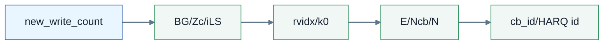
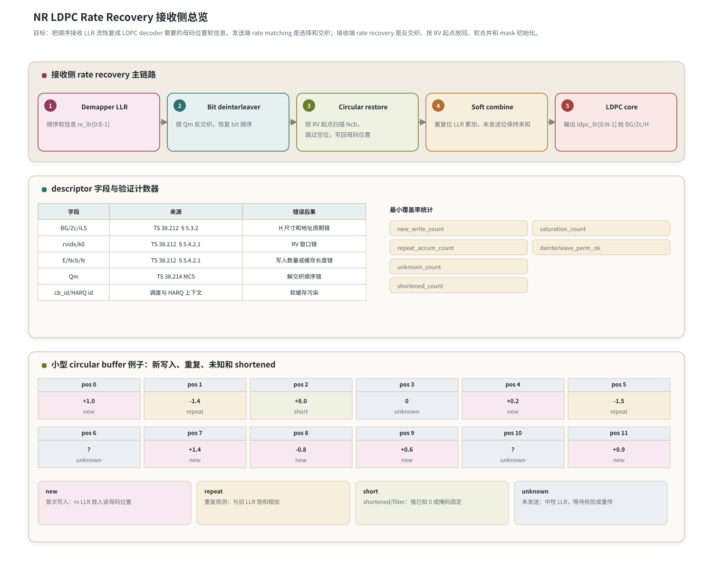

# T9.1 NR LDPC 速率恢复总览
## 本节学习目标

本节讲 NR 数据业务低密度奇偶校验码译码前的速率恢复。这里的“速率恢复”不是 3GPP 在接收端逐行规定的一段解码程序，而是工程实现对发送端速率匹配（rate matching）的反向处理：发送端从 LDPC（低密度奇偶校验码，Low-Density Parity-Check Code）编码后的母码比特中选择一段、按调制阶数交织后发出去；接收端从解调器给出的顺序对数似然比开始，把这些软信息放回 LDPC 母码位置，形成 LDPC decoder 能直接读取的输入数组。

学完本节后，应能做到：

- 说明速率恢复的目标：把 `rx_llr[0:E-1]` 恢复为 `ldpc_llr[0:N-1]` 或等价的软缓存视图。
- 区分发送端 bit selection、bit interleaving 与接收端 circular buffer restore、bit deinterleaving、soft combining。
- 解释 `E`、`Ncb`、`N`、`K` 的不同含义，以及它们为什么不能混用。
- 说明冗余版本（Redundancy Version, RV）如何决定 circular buffer 中的扫描起点或窗口区域。
- 区分 puncturing、shortening、repetition 和 filler/`<NULL>`，并知道它们在 LLR（对数似然比，Log-Likelihood Ratio）初始化中的不同后果。
- 用一个小 circular buffer 例子手算新写入、重复累加、未知位置和 shortened 位置。
- 写出包含地址扫描、mask 判断、LLR 写回和饱和累加的接收端伪代码。
- 列出浮点仿真、定点化、寄存器传输级/专用集成电路映射和验证计数器。

如果只记一件事：**速率恢复不是把收到的 LLR 直接顺序喂给 LDPC core，而是先根据协议定义的速率匹配轨迹，把每个收到的 LLR 放回它原本对应的母码位置。**

## 前置知识检查

本节第一次使用的单篇技术缩写先统一说明：混合自动重传请求负责跨重传保留和合并软信息；循环冗余校验负责译码后的完整性检查；码块是 LDPC decoder 的逐块处理对象；传输块是媒体接入控制层与物理层之间一次数据传输的上层数据单元。

| 前置项 | 本节需要达到的程度 |
|:---|:---|
| T4.3 软合并基础 | 知道 HARQ（混合自动重传请求，Hybrid Automatic Repeat Request）重传可以给同一编码比特补充新的 LLR 证据。 |
| T8.1 NR LDPC 接收链路 | 知道接收链路大致是 demapper LLR -> rate recovery -> LDPC decoder -> CB（码块，Code Block）CRC（循环冗余校验，Cyclic Redundancy Check）-> TB（传输块，Transport Block）CRC。 |
| T8.3 BG 和提升 | 知道基图（Base Graph, BG）和提升大小 $Z_c$ 决定完整 LDPC 校验矩阵和母码长度。 |
| T8.4 Tanner 图 | 知道 LDPC decoder 的输入位置对应完整 $H$ 的变量节点。 |
| T2.16 LLR 量化 | 知道 LLR 可以裁剪、缩放、量化，重复累加时必须考虑饱和。 |

若这些前置项还不稳，本节仍可以先学“对象如何移动”：`rx_llr` 是顺序收到的一维数组，`soft_buffer` 是按母码位置寻址的缓存，`ldpc_llr` 是 LDPC core 读取的软信息向量。

## 路线图 Prompt 覆盖表

| Prompt 要求 | 本节覆盖位置 | 覆盖方式 |
|:---|:---|:---|
| NR LDPC 接收侧速率匹配反操作 | 全文 | 从接收端 LLR 输入开始讲发送端 rate matching 的反向处理。 |
| 比特选择反操作 | “bit selection 的接收端反向理解” | 用 circular buffer 地址扫描和 mask 判断解释。 |
| circular buffer | “接收端对象模型”和“小型 circular buffer 例子” | 给 12 位置 toy buffer，含未发送和重复。 |
| 冗余版本 | “RV 起点与窗口选择” | 解释 RV 改变扫描起点，不在本节完整复现 Table 5.4.2.1-2 数值。 |
| bit deinterleaving | “bit interleaving 的反操作” | 说明按 $Q_m$ 恢复 bit selection 顺序。 |
| limited-buffer rate matching | “有限缓存速率匹配的接收端后果” | 说明 `Ncb` 可能小于母码长度，地址生成必须使用实际 circular buffer 长度。 |
| soft combining | “LLR 初始化和软合并规则” | 区分首次写入、重复累加、未知、shortened。 |
| Learner can explain where received LLRs are inserted | “对象转换”和例子 | 明确 `rx_llr[k]` 被插入 `soft_buffer[addr]`，再形成 `ldpc_llr`。 |

这张表只是最低覆盖。正文额外补充协议前因后果、descriptor 字段、失败模式、覆盖率计数、定点饱和、RTL（寄存器传输级，Register Transfer Level）/ASIC（专用集成电路，Application-Specific Integrated Circuit）地址生成和审计证据。

## 资料与协议边界

本节依据 3GPP Rel-19 本地抽取资料：

| 协议位置 | 本地证据路径 |
| :--- | :--- |
| TS 38.212 §5.4.2 | `3GPP_Rel19/processed/TS_38.212_38212-j30/content.md` 行 1175-1177 |
| TS 38.212 §5.4.2.1 | `3GPP_Rel19/processed/TS_38.212_38212-j30/content.md` 行 1179-1309 |
| TS 38.212 §5.4.2.2 | `3GPP_Rel19/processed/TS_38.212_38212-j30/content.md` 行 1311-1323 |
| TS 38.212 §6.2.5 | `3GPP_Rel19/processed/TS_38.212_38212-j30/content.md` 行 1397-1407 |
| TS 38.212 §7.2.5 | `3GPP_Rel19/processed/TS_38.212_38212-j30/content.md` 行 3771-3775 |
| TS 38.214 §5.1.3 | `3GPP_Rel19/processed/TS_38.214_38214-j30/content.md` 行 1157-1167 |
| TS 38.214 §6.1.4 | `3GPP_Rel19/processed/TS_38.214_38214-j30/content.md` 行 6829-6839 |

边界说明：

- TS 38.212 定义发送端 rate matching 过程；接收端 rate recovery 是实现上的反向恢复流程。本文不会把工程伪代码伪装成 3GPP 强制接收端算法。
- 当前 `content.md` 在 §5.4.2.1 的若干公式符号抽取不完整，因此本节只使用已核验的章节语义和本地行号。`k_0` 具体表值、Table 5.4.2.1-1/2 的完整重建留给后续需要 bit-exact 表值的章节。
- 本节是总览。[[T9.2_NR_LDPC_circular_buffer_states|T9.2]] 会专门展开 puncturing、shortening、repetition；[[T9.3_NR_LDPC_HARQ_soft_buffer_RV_k0|T9.3]] 会专门展开 HARQ soft buffer、RV 和CBG（码块组，Code Block Group）。

## 协议前因后果

LDPC 编码器输出的是一个比实际无线资源更长、更固定结构的母码序列。无线调度却每次只给一个有限的传输机会：资源块数量、调制阶数、层数、目标码率、HARQ 第几次传输都会改变这次能发多少个 coded bits。速率匹配就是把“固定结构的编码输出”和“本次可发送的物理资源”接起来。

从发送端看，TS 38.212 §5.4.2 把 LDPC rate matching 分成两步：

1. bit selection：把编码输出写入 circular buffer，再根据 RV 起点和本次长度 $E_r$ 选择要发送的比特。
2. bit interleaving：按调制阶数 $Q_m$ 重新排列比特，使它们适配高阶调制符号的 bit position。

从接收端看，顺序正好相反：

1. demapper 先给出按物理接收顺序排列的 LLR。
2. bit deinterleaver 按 $Q_m$ 反交织，恢复 bit selection 输出顺序。
3. circular buffer restore 按 RV 起点扫描，把每个 LLR 写回对应母码位置。
4. soft combining 把重复收到的同一位置 LLR 累加或饱和累加。
5. LDPC core 读取母码位置的 LLR、known/unknown mask 和 shortened mask，开始迭代译码。

这就是本节的核心因果：协议规定发送端如何从母码中抽取发送序列，接收端必须按同一条轨迹反推每个 LLR 的母码地址，否则 LDPC decoder 读到的变量节点证据就会错位。

## 接收端对象模型

速率恢复中最容易混淆的是对象名称。下面的表按接收端数据生命周期排列。

| 对象 | 长度 | 来源 | 含义 |
|:---|:---:|:---|:---|
| `rx_llr[0:E-1]` | $E$ | demapper | 本次传输收到的顺序 LLR。它还没有放回 LDPC 母码位置。 |
| `deint_llr[0:E-1]` | $E$ | bit deinterleaver | 反交织后的 LLR，顺序对应发送端 bit selection 输出。 |
| `soft_buffer[0:N_{cb}-1]` | $N_{cb}$ | HARQ/code-block context | circular buffer 视图；同一 code block、同一 HARQ 进程的软信息在这里累积。 |
| `ldpc_llr[0:N-1]` | $N$ | decoder input formatter | LDPC core 读取的母码位置 LLR；可能由 `soft_buffer` 加 mask 扩展得到。 |
| `unknown_mask[0:N-1]` | $N$ | rate recovery | 标识从未观测的位置，通常给中性 LLR。 |
| `known_mask[0:N-1]` | $N$ | segmentation/LDPC input rule | 标识 shortened 或 filler 形成的已知约束位置。 |

四个长度的区别如下：

| 符号 | 中文含义 | 接收端使用方式 |
|:---:|:---|:---|
| $K$ | LDPC code block 输入域长度，包含分段、CB CRC、filler/shortening 后进入 LDPC 编码结构的输入侧长度。 | 用于确定哪些信息位或 filler 位是已知约束。具体计算在 [[T3.4_NR_LDPC_segmentation_rules|T3.4]]/[[T8.2_NR_LDPC_base_graph_selection|T8.2]]/[[T8.3_NR_LDPC_lifting_QC_matrix|T8.3]] 已铺垫。 |
| $N$ | LDPC 编码后的母码位置数量，等价于完整 $H$ 的变量节点输入长度。 | LDPC core 最终需要 $N$ 个位置的 LLR 或等价 mask。 |
| $N_{cb}$ | circular buffer 长度。limited-buffer rate matching 时它可能小于完整母码可用长度。 | 地址扫描必须模 $N_{cb}$，不能模 $N$。 |
| $E$ | 本次传输该 code block 实际输出或接收的 rate-matched bits 数。 | `rx_llr` 的长度，也是本次需要反交织和写回的 LLR 数量。 |

如果把 $E$ 当成 $N$，LDPC core 会缺少大量位置；如果把 $N$ 当成 $N_{cb}$，limited-buffer 场景会读写越界或写到协议没有纳入 circular buffer 的区域；如果把 $K$ 当成 $N$，会把校验位位置丢掉。

## 发送端与接收端的逆向关系

| 发送端 rate matching 动作 | 接收端 rate recovery 动作 | 工程检查点 |
|:---|:---|:---|
| LDPC encoded bits 写入 circular buffer | 初始化 `soft_buffer`、`unknown_mask`、`known_mask` | `Ncb`、`N`、shortened/filler mask 必须一致。 |
| 根据 RV 计算起点并扫描 circular buffer | 用同一 RV 起点反向产生写回地址序列 | `rvidx`、BG、`Ncb` 错会导致整窗错位。 |
| 跳过不可发送或 filler/`<NULL>` 位置 | 对这些位置不消耗 `rx_llr`，并按 mask 初始化 | skip 规则错会造成从第一个 skip 后全部错位。 |
| 输出 $E_r$ 个 selected bits | 将 $E_r$ 个 deinterleaved LLR 写入对应地址 | `write_count` 必须等于 $E_r$。 |
| 按 $Q_m$ 做 bit interleaving | 按 $Q_m$ 做 bit deinterleaving | permutation 必须是双射，`deinterleave_perm_ok=True`。 |
| HARQ 重传可能再次选择相同地址 | 同地址 LLR 累加或饱和累加 | `repeat_accum_count` 和 saturation 需要统计。 |

注意：bit selection 的反操作不是“逆函数”意义上的还原发送端未发送比特。未发送比特根本没有观测，接收端只能把它们标为 unknown 或给中性 LLR。rate recovery 真正恢复的是“已观测 LLR 到母码地址的对应关系”。

## bit interleaving 的反操作

TS 38.212 §5.4.2.2 指出 bit interleaving 与调制阶数 $Q_m$ 有关。$Q_m$ 是一个调制符号承载的比特数，例如 16QAM 时 $Q_m=4$，64QAM 时 $Q_m=6$，256QAM 时 $Q_m=8$，1024QAM（1024 阶正交幅度调制，1024 Quadrature Amplitude Modulation）时 $Q_m=10$。TS 38.214 §5.1.3 和 §6.1.4 说明下行和上行的 $Q_m$ 来自调度字段或配置授权流程。

接收端不能直接把 demapper 输出的 `rx_llr` 放入 circular buffer，因为 demapper 输出顺序对应调制符号 bit position。必须先做 bit deinterleaving，得到与发送端 bit selection 输出一致的顺序：

$$
\texttt{deint\_llr}[\pi_{\mathrm{deint}}(k)] = \texttt{rx\_llr}[k],
\quad 0\le k < E.
\tag{1}
$$

式 (1) 回答的问题是：第 $k$ 个 demapper LLR 在 bit selection 顺序里应该排到哪里。$\pi_{\mathrm{deint}}(\cdot)$ 直接表示接收端反交织映射，不是 TS 38.212 发送端正向交织索引；它由 §5.4.2.2 的交织规则反向得到。工程上必须验证 $\pi_{\mathrm{deint}}$ 是 $0,\ldots,E-1$ 上的双射；如果出现重复目标或漏目标，后续 circular buffer 地址即使正确也会写入错误 LLR。

本节不展开具体 interleaver 公式的每个索引，[[T9.2_NR_LDPC_circular_buffer_states|T9.2]] 会继续细化。这里要先建立边界：**bit deinterleaver 只改变这 $E$ 个 LLR 的内部顺序，不决定它们属于 circular buffer 的哪些地址；地址由 bit selection/RV 扫描决定。**

## bit selection 的接收端反向理解

发送端 bit selection 可以抽象为：

$$
\texttt{selected}[t] = \texttt{cbuf}[\operatorname{addr}(t)],
\quad 0\le t<E,
\tag{2}
$$

其中 $\operatorname{addr}(t)$ 由 RV 起点、circular buffer 长度 $N_{cb}$、skip 规则和已输出数量共同决定。接收端反向处理就是：

$$
\texttt{soft\_buffer}[\operatorname{addr}(t)]
\leftarrow
\operatorname{combine}\left(
\texttt{soft\_buffer}[\operatorname{addr}(t)],
\texttt{deint\_llr}[t]
\right).
\tag{3}
$$

式 (3) 不是普通覆盖写。若该地址第一次观测，写入新 LLR；若该地址在 HARQ 重传中已经有旧 LLR，则执行软合并：

$$
L_{\text{new}} =
\operatorname{sat}\left(L_{\text{old}} + L_{\text{rx}}\right).
\tag{4}
$$

式 (4) 回答的问题是：同一个编码比特被多次观测时，接收端如何合并证据。浮点模型里可以直接相加；定点硬件里必须加饱和函数 $\operatorname{sat}(\cdot)$，防止溢出反转符号或破坏后续 Min-Sum 比较。

## RV 起点与窗口选择

RV 是 HARQ 中用来改变发送窗口的索引。NR LDPC 数据传输中 RV 取值来自调度上下文：下行 PDSCH（物理下行共享信道，Physical Downlink Shared Channel）场景由 TS 38.214 §5.1.3 的 DCI（下行控制信息，Downlink Control Information）/调度流程确定，上行 PUSCH（物理上行共享信道，Physical Uplink Shared Channel）场景由 TS 38.214 §6.1.4 的 DCI 或 configured grant 规则确定。TS 38.212 §5.4.2.1 再把 RV 与 LDPC BG 一起用于确定 circular buffer 的起点。

工程上可以把 RV 理解为 circular buffer 上的不同起点/区域选择：

- RV0 常用于初传，从一个规定起点开始发送一段。
- RV1/RV2/RV3 用不同起点，尽量让重传补充前一次没覆盖或被打孔的校验信息。
- 如果新窗口和旧窗口有重叠，同一母码位置会被重复观测，需要 LLR 累加。
- 如果某些位置仍未被任何窗口覆盖，它们仍是 unknown，不能填强 0 或强 1。

本节不复现 Table 5.4.2.1-2 的具体起点数值，因为本地 `content.md` 的公式符号抽取不完整。后续若 [[T9.3_NR_LDPC_HARQ_soft_buffer_RV_k0|T9.3]] 要使用具体 RV 起点表，会先从 `source.docx`、表格 HTML/CSV 或 Word XML 重建表格，再写入正文。

## LLR 初始化和软合并规则

rate recovery 输出给 LDPC core 前，需要为每个母码位置建立状态。四类位置的初始化不能混淆。

| 状态 | 含义 | LLR 处理 | 常见错误 |
|:---|:---|:---|:---|
| observed/new | 本次第一次收到该母码位置的观测 | 写入 `deint_llr[t]` | 写入地址错位。 |
| repeated | 旧传输或本次回绕中已经观测过同一位置 | 与旧 LLR 相加，定点中饱和 | 覆盖旧 LLR，丢掉 HARQ 增益。 |
| punctured/unsent | 该位置没有被发送或本次没有观测 | 保持中性 LLR，通常为 0，并置 unknown mask | 当成业务 0，填强正 LLR。 |
| shortened/filler | 该位置在编码输入侧是已知固定约束或填充形成的已知位 | 给强已知 LLR，或通过 known mask 固定 | 当成 unknown，削弱约束。 |
| skipped filler/`<NULL>` in selection | 发送端扫描时不输出该位置 | 不消耗 `deint_llr`，地址继续扫描 | 消耗一个 LLR，导致后续全部错位。 |

这里要特别区分 puncturing 和 shortening。puncturing 的意思是“这个编码比特没有观测”，接收端不知道它是 0 还是 1，所以 LLR 应接近 0。shortening/filler 的意思是“这个位置由协议分段或编码结构固定为已知值”，接收端虽然没从空口观测它，却知道它应满足某个固定约束，因此可以给强 LLR 或 mask 固定。

## mother code、puncturing、shortening 和 repetition

mother code 是 rate matching 之前的 LDPC 编码输出坐标系。接收端做 rate recovery 的目标不是“还原发送端比特流”，而是把本次收到的 $E$ 个 LLR 放回 mother-code 地址空间，并为没收到的位置建立正确状态。

| 操作 | 发送端含义 | 接收端 LLR 语义 | 与 NR LDPC 的关系 |
|:---|:---|:---|:---|
| Puncturing | mother-code 某些编码位不发送 | unknown，中性 LLR 或 unknown mask | first $2Z_c$ puncturing 和 RV 窗口未覆盖位置都属于没有观测，不能强制为 0。 |
| Shortening | 某些输入侧位置固定为已知值并不承载 payload | known，强已知 LLR 或 known mask | filler bits 是 segmentation 引入的非 payload 已知 0，译码后必须剥离。 |
| Repetition | 同一 mother-code 位置多次发送或多次命中 | 证据累加，定点饱和 | HARQ soft combining 和 circular buffer 回绕都可能产生 repeated coverage。 |
| Selection | 从 circular buffer 扫描并输出 $E_r$ 个 bits | 只对 selected 地址消费 LLR | skip/filler 位置不消耗 `deint_llr`。 |

first $2Z_c$ puncturing 特别容易被误解。它不是“前 $2Z_c$ 个 filler bits”，而是 mother-code 中按协议不进入 circular buffer 输出的系统性区域。接收端仍保留这些变量节点位置，让 LDPC 校验关系和其他 parity 证据去推断它们；初始化应是 unknown 或由专用 puncture mask 表示。

## RM/de-RM roundtrip 小工具

下面的 toy 工具只验证 rate matching 和 de-rate matching 的地址/状态闭环，不是 NR 完整公式。它适合放在单元测试里捕捉“punctured 当 shortened”“repetition 覆盖旧值”“skip 消耗 LLR”等错误。

```python
def toy_rate_match(mother, start, e, skip_addrs=()):
    selected = []
    addr_trace = []
    ncb = len(mother)
    addr = start % ncb
    while len(selected) < e:
        if addr not in skip_addrs:
            selected.append(mother[addr])
            addr_trace.append(addr)
        addr = (addr + 1) % ncb
    return selected, addr_trace


def toy_derate_match(llr, addr_trace, ncb, known_addrs=()):
    soft = [0.0] * ncb
    observed = [False] * ncb
    known = [False] * ncb
    for addr in known_addrs:
        known[addr] = True
        soft[addr] = 99.0
    for value, addr in zip(llr, addr_trace):
        soft[addr] += value
        observed[addr] = True
    return soft, observed, known


mother = list(range(8))
bits, trace = toy_rate_match(mother, start=6, e=6, skip_addrs={0})
assert trace == [6, 7, 1, 2, 3, 4]
soft, observed, known = toy_derate_match([1, 1, -1, 2, -2, 3], trace, 8, known_addrs={0})
assert observed == [False, True, True, True, True, False, True, True]
assert known[0] and soft[0] == 99.0
print("T9.1_RM_DERM_ROUNDTRIP_TOY_OK", trace)
```

这个片段刻意让地址从 6 开始并跳过 0。正确结果是 0 号地址仍是 known/shortened，不消耗 LLR；1/2/3/4/6/7 是 observed；5 是 punctured/unknown。真实 NR 实现把 `start` 换成 Table 5.4.2.1-2 的 `k0`，把 `skip_addrs` 换成协议的 `<NULL>`/filler skip 规则，把 `ncb` 换成实际 `Ncb`。

## 接收侧流程图

图 T9.1-1 给出本节主链路和一个 12 位置 toy circular buffer。本节图表中 `new` 表示首次写入，`repeat` 表示重复累加，`short` 表示 shortened/filler 已知约束，`unknown` 表示未发送或未观测。




descriptor 与验证计数器需要同时覆盖控制字段、字段来源和错误后果。descriptor 字段如下：

| 字段 | 来源 | 错误后果 |
|:---|:---|:---|
| BG/Zc/iLS | TS 38.212 §5.3.2 | H 尺寸和地址周期错 |
| rvidx/k0 | TS 38.212 §5.4.2.1 | RV 窗口错 |
| E/Ncb/N | TS 38.212 §5.4.2.1 | 写入数量或缓存长度错 |
| Qm（调制阶数，Modulation Order） | TS 38.214 MCS（调制与编码方案，Modulation and Coding Scheme） | 解交织顺序错 |
| cb_id/HARQ id | 调度与 HARQ 上下文 | 软缓存污染 |

小型 circular buffer 的 12 个位置状态依次是：`new`、`repeat`、`short`、`unknown`、`new`、`repeat`、`unknown`、`new`、`new`、`new`、`unknown`、`new`。

最小覆盖率统计至少包含：`new_write_count`、`repeat_accum_count`、`unknown_count`、`shortened_count`、`saturation_count`、`deinterleave_perm_ok`。

读图顺序如下：

1. 左上主链路先从 `Demapper LLR` 进入 `Bit deinterleaver`。
2. `Circular restore` 用 RV、`Ncb` 和 mask 生成写回地址。
3. `Soft combine` 对重复地址执行 LLR 累加或饱和。
4. `LDPC core` 读取按母码位置排列的 `ldpc_llr[0:N-1]`。
5. 下半部分 descriptor 表列出最容易导致错位的字段，右侧计数器是最小覆盖率检查。

## 小型 circular buffer 例子

为了手算，本节使用一个 toy circular buffer：

$$
N=N_{cb}=12,\quad E=9.
\tag{5}
$$

设本次 bit deinterleaving 后的 LLR 为：

$$
\texttt{deint\_llr}
=
[+1.0,\ -0.5,\ +0.2,\ -1.1,\ +1.4,\ -0.8,\ +0.6,\ +0.9,\ -0.7].
\tag{6}
$$

本例人为设定 RV 扫描得到的 9 个写回地址为：

$$
\texttt{addr}
=
[0,\ 1,\ 4,\ 5,\ 7,\ 8,\ 9,\ 11,\ 1].
\tag{7}
$$

这里地址 1 出现两次，表示重复观测；地址 3、6、10 未出现，表示本次未发送或未观测；地址 2 设为 shortened 已知 0，不由 `deint_llr` 消耗。

初始状态：

| 位置 | 初始 LLR | 初始状态 |
|:---:|---:|:---|
| 0 | 0.0 | unknown |
| 1 | -0.2 | old observed |
| 2 | +8.0 | shortened known zero |
| 3 | 0.0 | unknown |
| 4 | 0.0 | unknown |
| 5 | -0.4 | old observed |
| 6 | 0.0 | unknown |
| 7 | 0.0 | unknown |
| 8 | 0.0 | unknown |
| 9 | 0.0 | unknown |
| 10 | 0.0 | unknown |
| 11 | 0.0 | unknown |

逐个写回：

| $t$ | `addr[t]` | `deint_llr[t]` | 动作 | 写回后 LLR |
|---:|---:|---:|:---|---:|
| 0 | 0 | +1.0 | 首次写入 | +1.0 |
| 1 | 1 | -0.5 | 重复累加到旧值 -0.2 | -0.7 |
| 2 | 4 | +0.2 | 首次写入 | +0.2 |
| 3 | 5 | -1.1 | 重复累加到旧值 -0.4 | -1.5 |
| 4 | 7 | +1.4 | 首次写入 | +1.4 |
| 5 | 8 | -0.8 | 首次写入 | -0.8 |
| 6 | 9 | +0.6 | 首次写入 | +0.6 |
| 7 | 11 | +0.9 | 首次写入 | +0.9 |
| 8 | 1 | -0.7 | 再次重复累加 | -1.4 |

最终 soft buffer 是：

$$
\texttt{soft\_buffer}
=
[+1.0,\ -1.4,\ +8.0,\ 0,\ +0.2,\ -1.5,\ 0,\ +1.4,\ -0.8,\ +0.6,\ 0,\ +0.9].
\tag{8}
$$

覆盖率统计为：

| 统计项 | 值 | 含义 |
|:---|---:|:---|
| `new_write_count` | 6 | 地址 0、4、7、8、9、11 首次观测。 |
| `repeat_accum_count` | 3 | 地址 1 两次、地址 5 一次与旧值累加。 |
| `unknown_count` | 3 | 地址 3、6、10 未观测。 |
| `shortened_count` | 1 | 地址 2 是已知 shortened 位置。 |
| `saturation_count` | 0 | 本例浮点不触发定点饱和。 |

这个例子展示了本节验收的核心：收到的 LLR 不是按 `t=0,1,2,...` 顺序塞给 LDPC core，而是按 `addr[t]` 插入对应母码位置；重复地址累加，没出现的地址保持 unknown，shortened 地址保持已知约束。

## 接收端伪代码

下面是总览级伪代码。真实实现需要把 `make_addr_stream()` 换成 TS 38.212 §5.4.2.1 的 bit selection 地址生成器，并把 `deinterleave()` 换成 §5.4.2.2 的反交织器。

```python
def nr_ldpc_rate_recovery(rx_llr, desc, old_soft_buffer):
    """
    desc fields:
      BG, Zc, iLS, rvidx, E, Ncb, N, K, Qm, layer,
      cb_id, tb_id, harq_id, limited_buffer_rm
    """
    assert len(rx_llr) == desc.E

    deint_llr = deinterleave(rx_llr, desc.Qm)
    assert is_permutation_ok(desc.E, desc.Qm)

    soft = old_soft_buffer.copy()
    observed = [False] * desc.Ncb

    stats = {
        "new_write_count": 0,
        "repeat_accum_count": 0,
        "unknown_count": 0,
        "shortened_count": 0,
        "saturation_count": 0,
    }

    t = 0
    for addr in make_addr_stream(desc.rvidx, desc.BG, desc.Ncb):
        if t == desc.E:
            break

        if is_skipped_filler_or_null(addr, desc):
            continue

        value = deint_llr[t]
        if observed[addr] or has_prior_observation(addr, old_soft_buffer):
            soft[addr], saturated = sat_add(soft[addr], value, desc.llr_min, desc.llr_max)
            stats["repeat_accum_count"] += 1
            stats["saturation_count"] += int(saturated)
        else:
            soft[addr] = value
            stats["new_write_count"] += 1
        observed[addr] = True
        t += 1

    assert t == desc.E

    ldpc_llr = [0.0] * desc.N
    for pos in range(desc.N):
        if is_shortened_or_known_zero(pos, desc):
            ldpc_llr[pos] = desc.known_zero_llr
            stats["shortened_count"] += 1
        elif pos < desc.Ncb and (observed[pos] or has_prior_observation(pos, old_soft_buffer)):
            ldpc_llr[pos] = soft[pos]
        else:
            ldpc_llr[pos] = 0.0
            stats["unknown_count"] += 1

    return ldpc_llr, soft, stats
```

三个断言很关键：

- `len(rx_llr) == E` 防止调度长度和 demapper 输出不一致。
- `is_permutation_ok()` 防止 bit deinterleaver 漏写或重复写。
- `t == E` 防止 skip 规则错误导致 LLR 没消耗完或多消耗。

## Python 可复现校验

下面的 Python 片段复现正文 toy 例子。它不是 3GPP bit-exact rate recovery，只验证本节对象模型、写回/累加规则和覆盖率统计。

```python
def sat_add(a, b, lo=-31.0, hi=31.0):
    v = a + b
    if v > hi:
        return hi, True
    if v < lo:
        return lo, True
    return v, False


N = 12
Ncb = 12
E = 9
deint_llr = [+1.0, -0.5, +0.2, -1.1, +1.4, -0.8, +0.6, +0.9, -0.7]
addr = [0, 1, 4, 5, 7, 8, 9, 11, 1]
shortened = {2}
old = [0.0] * Ncb
old[1] = -0.2
old[5] = -0.4
soft = old[:]
observed = [False] * Ncb
stats = {
    "new_write_count": 0,
    "repeat_accum_count": 0,
    "unknown_count": 0,
    "shortened_count": 0,
    "saturation_count": 0,
}

for t, a in enumerate(addr):
    if observed[a] or old[a] != 0.0:
        soft[a], sat = sat_add(soft[a], deint_llr[t])
        stats["repeat_accum_count"] += 1
        stats["saturation_count"] += int(sat)
    else:
        soft[a] = deint_llr[t]
        stats["new_write_count"] += 1
    observed[a] = True

ldpc_llr = [0.0] * N
for pos in range(N):
    if pos in shortened:
        ldpc_llr[pos] = +8.0
        stats["shortened_count"] += 1
    elif observed[pos] or old[pos] != 0.0:
        ldpc_llr[pos] = soft[pos]
    else:
        ldpc_llr[pos] = 0.0
        stats["unknown_count"] += 1

expected = [+1.0, -1.4, +8.0, 0.0, +0.2, -1.5, 0.0, +1.4, -0.8, +0.6, 0.0, +0.9]
assert ldpc_llr == expected, ldpc_llr
assert stats == {
    "new_write_count": 6,
    "repeat_accum_count": 3,
    "unknown_count": 3,
    "shortened_count": 1,
    "saturation_count": 0,
}, stats
print("T9.1_RATE_RECOVERY_TOY_OK")
```

预期输出：

```text
T9.1_RATE_RECOVERY_TOY_OK
```

## 浮点仿真方案

总览级浮点仿真不需要立即跑完整 LDPC 块错误率曲线，但必须检查 rate recovery 的可逆轨迹和 LLR 语义。

| 检查项 | 输入 | 验收 |
|:---|:---|:---|
| bit deinterleaver 双射 | 固定 $E,Q_m$ 的索引表 | 每个目标索引出现一次，`deinterleave_perm_ok=True`。 |
| 写回数量 | `rx_llr`、`addr_stream`、skip mask | 消耗 LLR 数量严格等于 $E$。 |
| 新写入/重复覆盖 | toy HARQ 两次传输 | `new_write_count`、`repeat_accum_count` 与人工期望一致。 |
| unknown 初始化 | 未覆盖地址集合 | 未覆盖位置 LLR 为 0 或带 unknown mask，不得强制判 0。 |
| shortened 初始化 | shortened/filler mask | 已知 0 位置给强正 LLR 或 known mask。 |
| limited-buffer 场景 | `Ncb<N` | 地址生成模 `Ncb`，不访问 `Ncb..N-1` 的 circular buffer。 |

如果把 rate recovery 接到 toy LDPC core，可以增加一个 directed test：同一 payload 在无噪声下，发送端 rate matching 后接收端 rate recovery 的 `ldpc_llr` 硬判决应与母码位置一致；加入 puncturing 后，只有 unknown 位置可不确定，observed 和 known 位置必须一致。

## 定点化策略

定点化关注的不是公式本身，而是证据累积是否被错误量化。

| 项目 | 建议策略 | 失败现象 |
|:---|:---|:---|
| LLR 输入位宽 | 先用 6-8 bit signed LLR 做设计空间扫描 | 位宽过低导致弱证据全被量化成 0。 |
| 缩放 | demapper 与 decoder 共用明确 scale contract | LLR 幅度过大导致 early saturation。 |
| repeated accumulation | 使用饱和加法，不使用回绕加法 | 溢出后符号反转，CRC 随机失败。 |
| unknown | 用 0 LLR 或独立 unknown mask | unknown 被误当强 0，BLER（块错误率，Block Error Rate）偏乐观且不可复现。 |
| shortened | 用强 LLR 或 known mask，并在 decoder 内固定 | shortened 被误当 unknown，迭代收敛变慢或失败。 |
| debug dump | 记录累加前后 LLR 和 saturation flag | 重传问题无法定位到 rate recovery 还是 LDPC core。 |

定点仿真至少要覆盖三组 directed cases：

1. `+28 + +10` 在 6 bit signed LLR 中饱和为 `+31`。
2. `-30 + -8` 饱和为 `-32`。
3. `+20 + -18` 不饱和，结果接近 `+2`，表示两次观测证据相互抵消。

## RTL/ASIC 映射

NR LDPC rate recovery 在 RTL/ASIC 中通常不是一个单独“算术大核”，而是一个地址生成、mask、RAM 写回和饱和累加模块。

| 模块 | 输入 | 输出 | 关键风险 |
|:---|:---|:---|:---|
| descriptor register | `BG`、`Zc`、`iLS`、`rvidx`、`E`、`Ncb`、`N`、`K`、`Qm`、`cb_id`、`harq_id` | 本次 CB 的控制上下文 | HARQ ID 或 CB ID 错导致软缓存污染。 |
| bit deinterleaver | `rx_llr`、$Q_m$ | `deint_llr` | 置换错误导致每个地址拿到错 LLR。 |
| address generator | `rvidx`、BG、`Ncb`、skip mask | circular buffer address | `Ncb` 和 $N$ 混用、RV 起点错。 |
| mask unit | filler/shortened/unknown metadata | skip、known、unknown 标志 | skip 消耗 LLR 或 shortened 当 unknown。 |
| LLR RAM | old/new soft information | soft buffer 更新 | bank 冲突、读改写时序错误。 |
| saturating adder | old LLR、new LLR | combined LLR、sat flag | 回绕溢出、符号扩展错误。 |
| output formatter | `soft_buffer`、mask | `ldpc_llr[0:N-1]` | LDPC core 读到未初始化位置。 |

最小状态机可以分为：

1. `LOAD_DESC`：锁存 descriptor，清空本次统计计数器。
2. `DEINTERLEAVE`：按 $Q_m$ 反交织接收 LLR。
3. `SCAN_ADDR`：按 RV 起点和 `Ncb` 生成候选地址。
4. `MASK_CHECK`：判断是否 skip、known、unknown。
5. `READ_MODIFY_WRITE`：首次写入或重复饱和累加。
6. `FORMAT_LDPC_INPUT`：生成 LDPC core 输入 LLR 和 mask。
7. `REPORT`：输出统计、错误码和 ready。

如果做多 CB 并行，`harq_id + tb_id + cb_id` 必须进入 soft buffer bank 选择。只用 `cb_id` 不够，因为不同 HARQ 进程可能同时保留同一个 code block index 的旧软信息。

## 常见错误

| 错误 | 现象 | 定位方式 |
|:---|:---|:---|
| `rx_llr` 未反交织直接写回 | 高阶调制下 BLER 明显异常，正交相移键控可能不易暴露 | 打印 `deinterleave_perm_ok` 和前 32 个置换索引。 |
| `Ncb` 与 $N$ 混用 | limited-buffer 场景越界或窗口错位 | 对 `addr < Ncb` 加断言。 |
| RV 起点使用旧传输值 | 初传可过，重传后反而更差 | dump `rvidx`、`k0`、`addr[0:16]`。 |
| skip 位置消耗 LLR | 从第一个 skipped filler 后全部错位 | 比较 `write_count`、`skip_count`、`E`。 |
| punctured 当 shortened | 未发送位置被强制为 0，仿真虚假乐观 | 检查 unknown mask 和 known mask 是否互斥。 |
| repeated 覆盖旧值 | HARQ 重传没有合并增益 | 检查 `repeat_accum_count` 和 old/new LLR dump。 |
| 饱和加法回绕 | 强正加强正变成负值 | directed test 覆盖最大/最小 LLR。 |
| HARQ/CB 上下文错 | 一个 TB 的重传污染另一个 TB | soft buffer key 必须包含 `harq_id`、`tb_id`、`cb_id`。 |

## 自测题

1. `rx_llr[0:E-1]` 与 `ldpc_llr[0:N-1]` 的根本区别是什么？
2. 为什么 punctured/unsent 位置不能填强正 LLR？
3. RV 在 circular buffer 中改变的是什么？
4. bit deinterleaving 和 circular buffer restore 谁决定 LLR 的母码地址？
5. 如果同一个地址在 HARQ 重传中再次收到 LLR，接收端应覆盖还是累加？
6. limited-buffer rate matching 下，地址生成为什么必须使用 `Ncb` 而不是 $N$？
7. [[T9.1_NR_LDPC_rate_recovery_overview|T9.1]] toy 例子中地址 1 最终 LLR 为什么是 -1.4？
8. RTL 调试 dump 至少要包含哪些字段才能定位 rate recovery 错位？

## 自测题参考答案

1. `rx_llr` 是 demapper 输出的顺序接收软信息，长度为本次传输的 $E$；`ldpc_llr` 是按 LDPC 母码位置排列的 decoder 输入，长度为 $N$。
2. punctured/unsent 表示没有观测，不知道该位置是 0 还是 1；强正 LLR 会把它伪装成“非常相信 0”，破坏译码。
3. RV 改变 bit selection 在 circular buffer 中的起点或窗口区域，使重传尽量补充不同母码位置。
4. bit deinterleaving 只恢复 $E$ 个 LLR 的 bit selection 顺序；母码地址由 RV/circular buffer 的 bit selection 反向扫描决定。
5. 应累加，定点实现中使用饱和累加。覆盖会丢掉前一次观测证据。
6. `Ncb` 是实际 circular buffer 长度，limited-buffer rate matching 时可能小于 $N$；地址生成模错长度会错位或越界。
7. 地址 1 初始旧值为 -0.2，两次收到 -0.5 和 -0.7，所以 $-0.2-0.5-0.7=-1.4$。
8. 至少包含 `BG`、`Zc`、`rvidx`、`E`、`Ncb`、`Qm`、`harq_id`、`cb_id`、前若干地址、skip/known/unknown mask、old LLR、new LLR、combined LLR、saturation flag 和覆盖率计数。

## 协议证据表

| 结论 | 协议依据 | 本地证据 | 状态 |
|:---|:---|:---|:---|
| LDPC rate matching 由 bit selection 和 bit interleaving 组成 | TS 38.212 Rel-19 §5.4.2 | `3GPP_Rel19/processed/TS_38.212_38212-j30/content.md:1175-1177` | 已核验。 |
| 编码后比特写入 circular buffer | TS 38.212 Rel-19 §5.4.2.1 | `3GPP_Rel19/processed/TS_38.212_38212-j30/content.md:1179-1183` | 已核验语义，公式符号抽取不完整。 |
| `E_r` 与 CB scheduling/CBGTI、层数、调制阶数和可用 coded bits 相关 | TS 38.212 Rel-19 §5.4.2.1 | `3GPP_Rel19/processed/TS_38.212_38212-j30/content.md:1251-1287` | 已核验语义，具体公式需 Word XML 复核后重建。 |
| RV 取值 0/1/2/3 并决定起点表 | TS 38.212 Rel-19 §5.4.2.1 Table 5.4.2.1-2 | `3GPP_Rel19/processed/TS_38.212_38212-j30/content.md:1289-1309` | 已核验章节存在；表值未在本节复现。 |
| bit interleaving 与 $Q_m$ 相关 | TS 38.212 Rel-19 §5.4.2.2 | `3GPP_Rel19/processed/TS_38.212_38212-j30/content.md:1311-1323` | 已核验语义，详细索引后续 [[T9.2_NR_LDPC_circular_buffer_states|T9.2]] 展开。 |
| UL-SCH（上行共享信道，Uplink Shared Channel）逐 CB 调用 §5.4.2，limited-buffer rate matching 影响 `ILBRM` | TS 38.212 Rel-19 §6.2.5 | `3GPP_Rel19/processed/TS_38.212_38212-j30/content.md:1397-1407` | 已核验语义。 |
| DL-SCH（下行共享信道，Downlink Shared Channel）/PCH 逐 CB 调用 §5.4.2 | TS 38.212 Rel-19 §7.2.5 | `3GPP_Rel19/processed/TS_38.212_38212-j30/content.md:3771-3775` | 已核验。 |
| PDSCH 的 $Q_m$、RV、TBS（传输块大小，Transport Block Size）来自调度流程 | TS 38.214 Rel-19 §5.1.3 | `3GPP_Rel19/processed/TS_38.214_38214-j30/content.md:1157-1167` | 已核验。 |
| PUSCH 的 $Q_m$、RV、TBS 来自 DCI/configured grant 等流程 | TS 38.214 Rel-19 §6.1.4 | `3GPP_Rel19/processed/TS_38.214_38214-j30/content.md:6829-6839` | 已核验。 |

## 图示


## 执行与证据记录

| 项目 | 记录 |
|:---|:---|
| 讲义文件 | `docs/L2_协议算法/T9.1_NR_LDPC_rate_recovery_overview.md` |
| 路线图卡片 | `2026-06-19-lte-nr-decoding-learning-roadmap.md` [[T9.1_NR_LDPC_rate_recovery_overview|T9.1]] |
| 工作登记 | `docs/audits/lte_nr_decoding_remaining_work_register.md` [[T9.1_NR_LDPC_rate_recovery_overview|T9.1]] |
| 协议资料 | `3GPP_Rel19/processed/TS_38.212_38212-j30/content.md`、`3GPP_Rel19/processed/TS_38.214_38214-j30/content.md` |
| 图资产 | `docs/L2_协议算法/assets/T9.1_NR_LDPC_rate_recovery_overview.svg`（手绘 SVG，替代原 PIL 渲染 PNG，render 脚本已随迁移删除） |
| Python toy 校验 | 已运行正文内嵌等价片段，输出 `T9.1_RATE_RECOVERY_TOY_OK`。 |
| 单篇审计 | 已运行 `python3 tools/audit_lesson_terms.py docs/L2_协议算法/T9.1_NR_LDPC_rate_recovery_overview.md` -> `LESSON_TERM_AUDIT_OK`；`python3 tools/audit_markdown_headings.py docs/L2_协议算法/T9.1_NR_LDPC_rate_recovery_overview.md` -> `MARKDOWN_HEADING_AUDIT_OK`；`python3 tools/audit_lesson_depth.py --strict docs/L2_协议算法/T9.1_NR_LDPC_rate_recovery_overview.md` -> `LESSON_DEPTH_AUDIT_OK`；`python3 tools/audit_latex_render.py docs/L2_协议算法/T9.1_NR_LDPC_rate_recovery_overview.md` -> `LATEX_RENDER_AUDIT_OK formulas=73`。 |
| 审核经理复核 | 初审 Critical=0、Important=3、Minor=2；已修复图文 toy 语义不一致、执行记录未闭环、协议证据路径不自包含，以及反交织映射符号歧义。 |

## 参考文献

- 3GPP TS 38.212 Rel-19 `38212-j30`, Multiplexing and channel coding, §5.4.2, §5.4.2.1, §5.4.2.2, §6.2.5, §7.2.5. 本地路径：`3GPP_Rel19/processed/TS_38.212_38212-j30`。
- 3GPP TS 38.214 Rel-19 `38214-j30`, Physical layer procedures for data, §5.1.3, §6.1.4. 本地路径：`3GPP_Rel19/processed/TS_38.214_38214-j30`。
- Gallager, R. G., 1962. Low-density parity-check codes. IRE Transactions on Information Theory.
- Richardson, T. and Urbanke, R., 2008. Modern Coding Theory. Cambridge University Press.
