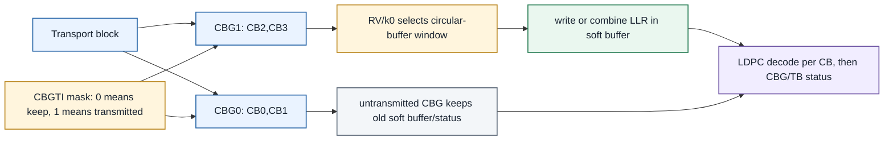
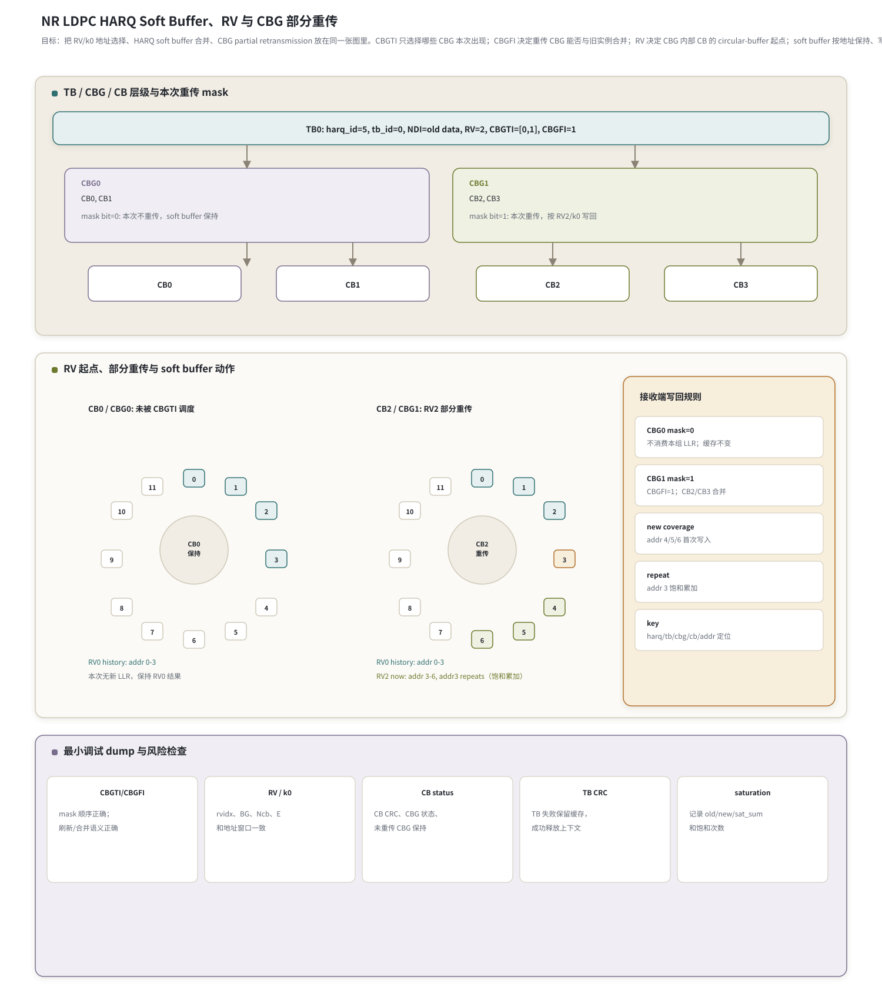

# T9.3 NR LDPC HARQ 软缓存、RV k0 与 CBG 部分重传
## 本节学习目标

本节使用的单篇技术缩写先统一说明：低密度奇偶校验码（Low-Density Parity-Check, LDPC，[[LDPC_低密度奇偶校验码]]）是 NR 数据业务的信道编码；Turbo 是 LTE 数据业务使用的译码对照对象；混合自动重传请求（Hybrid Automatic Repeat reQuest, HARQ，[[HARQ_混合自动重传请求]]）是在译码失败后保留软信息并支持重传合并的机制；对数似然比（Log-Likelihood Ratio, LLR，[[LLR_对数似然比]]）是软缓存（soft buffer，[[Soft_Buffer_软缓存]]）保存的软信息；传输块（Transport Block, TB，[[TB_传输块]]）是调度和循环冗余校验交付的基本数据块；码块（Code Block, CB，[[CB_码块]]）是 TB 分段后送入 LDPC 编码/译码的子块；码块组（Code Block Group, CBG，[[CBG_码块组]]）是 NR 为部分重传引入的 CB 分组；下行控制信息（Downlink Control Information, DCI）携带译码控制字段；调制与编码方案（Modulation and Coding Scheme, MCS，[[MCS_Table_Effective_Code_Rate_MCS表与有效码率]]）和传输块大小（Transport Block Size, TBS）决定分段、码率和本次可用比特数；码块组传输信息（Code Block Group Transmission Information, CBGTI）指示本次哪些 CBG 被传输；码块组刷新信息（Code Block Group Flushing Out Information, CBGFI）在下行 CBG 重传中指示旧 CBG 实例是否可与本次合并；新数据指示（New Data Indicator, NDI）用于区分新 TB 和旧 TB 重传；冗余版本（Redundancy Version, RV，[[RV_冗余版本]]）决定本次从 LDPC circular buffer 的哪个起点选择编码比特；上行共享信道（Uplink Shared Channel, UL-SCH）和下行共享信道（Downlink Shared Channel, DL-SCH）是 TS 38.212/38.214 中承载 LDPC TB 的主要数据信道；块错误率（Block Error Rate, BLER）用于后续链路仿真评估；静态随机存取存储器（Static Random-Access Memory, SRAM）是硬件 soft buffer 的常见存储形态；寄存器传输级（Register Transfer Level, RTL）/专用集成电路（Application-Specific Integrated Circuit, ASIC）实现要把这些字段落成地址生成、软缓存、mask、饱和加法和释放控制。

本节只抓一个接收端核心问题：同一个 HARQ process 上，NR LDPC 的重传到来时，译码器怎样根据 `rvidx/k0` 把 LLR 放回正确的 circular-buffer 地址，并怎样根据 CBG mask 只更新被调度的 CB，保留未调度 CBG 的旧 soft buffer。

学完本节后，应能做到：

- 解释 RV 不是“第几次重传”的别名，而是 LDPC rate matching circular buffer 的起点选择。
- 解释 `k0` 是 RV 变成地址窗口的桥梁，接收端必须用同一 `k0` 反向放置 LLR。
- 说明 HARQ soft buffer 为什么必须按 `(harq_id, tb_id, cbg_id, cb_id, addr)` 管理，而不能只按 LLR 流顺序管理。
- 说明 CBG 为什么存在：当一个 TB 被切成多个 CB 时，只重传失败相关的一部分 CB 可以降低空口开销和译码工作量。
- 解释 CBGTI mask 中 `0/1` 对接收侧 soft buffer 的影响：未传输 CBG 保持不变，传输 CBG 再按 CBGFI 判断旧实例是否可合并。
- 手算一个 toy `k0` 例子：新覆盖、重复覆盖、未重传 CBG 保持，以及定点饱和。
- 列出最小调试 dump：CBGTI mask、CBGFI、RV/k0、CB status、TB CRC、soft buffer 写前写后摘要和 saturation count。
- 说明 LTE [[T7.3_LTE_HARQ_soft_buffer_RV|T7.3]] 与 NR [[T9.3_NR_LDPC_HARQ_soft_buffer_RV_k0|T9.3]] 的共同点和差异，尤其是 LTE 没有 NR-style CBG partial retransmission 粒度。

如果只记一件事：**HARQ 合并不是“把新 LLR 加到旧数组末尾”，而是“按协议身份和 RV 地址，把同一编码比特位置的证据累加；没有被 CBGTI 调度的 CBG 不产生新证据，必须保持旧缓存；下行 CBG 重传还要看 CBGFI 是否允许与旧实例合并”。**

## 前置知识检查

| 前置项 | 本节需要达到的程度 |
|:---|:---|
| T4.3 HARQ soft combining 基础 | 知道 CRC fail 后 soft buffer 保留，重传 LLR 应与历史证据合并。 |
| T7.3 LTE HARQ 软缓存与冗余版本 | 知道 LTE Turbo 也使用 circular buffer/RV/soft buffer，但没有 NR CBG partial retransmission 这种粒度。 |
| T9.1 NR LDPC 速率恢复总览 | 知道接收端从 `rx_llr` 经过 bit deinterleaving 和 bit selection 反操作写回 LDPC soft buffer。 |
| T9.2 NR LDPC circular buffer 状态 | 知道 unknown、shortened/known、repeated 三类位置不能混用。 |
| T8.1 NR LDPC 接收链路总览 | 知道 TB 分段为 CB，每个 CB 独立 LDPC 译码，最后做 CB/TB CRC 处理。 |

本节不要求先掌握 TS 38.214 的所有调度细节。这里把调度层只保留为译码器需要消费的字段：`harq_id`、`tb_id`、`rvidx`、`new_data_indicator`、`cbg_mask`、`E`、`Q_m`、`Ncb`、`BG`、`Zc` 和 CB/CBG 映射。

## 任务边界与 Prompt 覆盖

roadmap 的 [[T9.3_NR_LDPC_HARQ_soft_buffer_RV_k0|T9.3]] 卡片聚焦 NR LDPC HARQ soft buffer、RV、`k0`、有限缓存和 toy LLR 放置例子。当前执行登记表把 [[T9.3_NR_LDPC_HARQ_soft_buffer_RV_k0|T9.3]] 扩展为“NR HARQ Soft Buffer、RV、CBG”，并要求本节覆盖 CBG partial retransmission、状态字段、失败案例和最小 dump。后续 [[T9.4_NR_LDPC_bit_deinterleaving|T9.4]] 仍会专门深化 CBG handling；本节先把 CBG 放在 HARQ/RV 软缓存主线里讲清楚。

| 要求来源 | 原子要求 | 正文覆盖位置 |
|:---|:---|:---|
| roadmap T9.3 | 讲解 NR LDPC RV、`k0`、circular buffer 起点 | “RV、k0 与 circular buffer 起点”。 |
| roadmap T9.3 | 讲解 HARQ soft combining、有限缓存行为和重传处理 | “HARQ soft buffer 的接收端职责”“有限缓存与 `Ncb`”。 |
| roadmap T9.3 | 包含 toy `k0` LLR 放置例子 | “小型 CBG mask 与 toy k0 例子”“Python 可复现校验”。 |
| 登记表 T9.3 | 说明 CBG、CB 与 TB 的层级关系 | “TB、CB 与 CBG 的层级”。 |
| 登记表 T9.3 | 画 TB -> CBG -> CB -> circular buffer -> soft buffer 图 | “NR HARQ soft buffer 图”。 |
| 登记表 T9.3 | 对比 LTE [[T7.3_LTE_HARQ_soft_buffer_RV|T7.3]] | “与 LTE [[T7.3_LTE_HARQ_soft_buffer_RV|T7.3]] 的共同点和差异”。 |
| 登记表 T9.3 | 说明 CBG 未重传保持不变 | “CBG partial retransmission 的接收端语义”。 |
| 协议补充边界 | 说明 PDSCH CBGFI 的 flush/combine 语义 | “CBG partial retransmission 的接收端语义”“接收端伪代码”“验证方法与最小 dump 包”。 |
| 登记表 T9.3 | 列状态字段和 soft buffer key | “HARQ soft buffer descriptor”。 |
| 登记表 T9.3 | 讨论定点饱和 | “定点化策略”。 |
| 登记表 T9.3 | 给失败案例和最小日志 | “常见错误”“验证方法与最小 dump 包”。 |

这张表是最低覆盖。正文额外补充协议前因后果、协议证据表、RTL/ASIC 映射、浮点仿真方案和自测题答案。

## 资料与协议边界

本节精读 TS 38.212 Rel-19 `38212-j30` 和 TS 38.214 Rel-19 `38214-j30` 的相关条款。两份协议的分工不同：

- TS 38.212 规定信道编码和 rate matching。对 [[T9.3_NR_LDPC_HARQ_soft_buffer_RV_k0|T9.3]] 来说，它回答“给定某个 CB、RV、`Ncb`、`E` 后，本次从 circular buffer 选择哪些编码位置”。
- TS 38.214 规定物理层过程中的调制阶数、码率、TBS、RV 字段、CBG 分组和 CBGTI 解释。对 [[T9.3_NR_LDPC_HARQ_soft_buffer_RV_k0|T9.3]] 来说，它回答“接收端怎么知道本次是哪个 RV、哪些 CBG 出现、哪些 CB 被调度”。

| 协议位置 | 本地证据路径 |
| :--- | :--- |
| TS 38.212 缩写表 | `3GPP_Rel19/processed/TS_38.212_38212-j30/content.md:461-503` |
| TS 38.212 §5.4.2.1 | `3GPP_Rel19/processed/TS_38.212_38212-j30/content.md:1179-1309` |
| TS 38.212 §6.2.5 | `3GPP_Rel19/processed/TS_38.212_38212-j30/content.md:1397-1407` |
| TS 38.212 §7.2.5 | `3GPP_Rel19/processed/TS_38.212_38212-j30/content.md:3771-3775` |
| TS 38.214 §5.1.3 | `3GPP_Rel19/processed/TS_38.214_38214-j30/content.md:1157-1211` |
| TS 38.214 §5.1.7.1/§5.1.7.2 | `3GPP_Rel19/processed/TS_38.214_38214-j30/content.md:2407-2437` |
| TS 38.214 §6.1.4 | `3GPP_Rel19/processed/TS_38.214_38214-j30/content.md:6829-6841` |
| TS 38.214 §6.1.5.1/§6.1.5.2 | `3GPP_Rel19/processed/TS_38.214_38214-j30/content.md:7099-7125` |

边界说明：

- 协议规定的是发送侧 bit selection 和控制字段语义；接收端 soft buffer 的物理 SRAM bank、LLR 位宽、压缩方式、饱和阈值不是 3GPP 直接规定，但必须保持相同编码位置的软信息语义。
- TS 38.212 的 `content.md` 对 Table 5.4.2.1-2 的公式符号抽取不完整，`tables/table_0016.csv` 和 `table_0017.csv` 也未能保留完整公式内容。因此本节复现的是人工核验后的协议公式形式，并把真实数值例子写成 toy 参数，不冒充 bit-exact 3GPP 向量。
- 本节不会展开 TS 38.214 的全部调度器规则、HARQ-ACK 时序和 RRC 配置树。只讲它们如何影响译码器 descriptor。

## 协议前因后果

NR 数据业务使用 LDPC 后，一个 TB 往往会被分成多个 CB。每个 CB 单独编码、单独 rate match，接收端也通常逐 CB 做 rate recovery 和 LDPC 译码。HARQ 加入后，接收端还要跨多次传输保留历史 LLR。

如果没有 HARQ soft buffer，第一次译码失败后，前一次收到的软信息会被丢掉，第二次重传只能单独译码。这样重传只能靠“重新试一次”，而不是把两次观测合并成更强证据。HARQ soft combining 的价值在于：

$$
L_{\mathrm{combined}}[a]
= L_{\mathrm{old}}[a] + L_{\mathrm{new}}[a],
\tag{1}
$$

其中 $a$ 是同一编码比特位置。式 (1) 只在位置相同且同属同一 TB/CB/HARQ 上下文时成立。如果 RV 或 CBG mask 解释错，接收端可能把 $L_{\mathrm{new}}$ 加到错误位置，LLR 幅度变大但 CRC 更难通过。

NR 又引入 CBG。原因很工程：一个大 TB 有很多 CB，某次传输可能只有部分 CB 失败或需要补充冗余。如果每次都重传整个 TB，会浪费空口资源和接收端算力。CBG 把多个 CB 分成组，调度信息可以指示哪些组本次出现。译码器的后果是：soft buffer 更新粒度从“整个 TB 全部 CB”变成“被 CBGTI 指示的 CBG 中的 CB”。

因此 [[T9.3_NR_LDPC_HARQ_soft_buffer_RV_k0|T9.3]] 的协议链条是：

```text
DCI / configured grant
  -> harq_id, NDI, rv, MCS/TBS, CBGTI, CBGFI if present
  -> TB segmentation gives C CBs
  -> CBG grouping maps CBs to CBGs
  -> TS 38.212 rate matching gives k0 and addresses per scheduled CB
  -> receiver writes/accumulates LLR in soft buffer
  -> LDPC decoder + CB CRC + TB CRC decide ACK/NACK and buffer release
```

## TB、CB 与 CBG 的层级

TB 是调度和最终 CRC 交付层级。TB 太大时，TS 38.212 的分段过程把它切成多个 CB。每个 CB 有自己的 LDPC 编码块、rate matching 输出长度和译码结果。CBG 是若干 CB 的分组，服务于基于 CBG 的重传控制。

层级关系可以写成：

```text
TB
  CBG0
    CB0
    CB1
  CBG1
    CB2
    CB3
```

CBG 的关键不是给 LDPC 增加一种新码。CBG 不改变 LDPC 校验矩阵，也不改变单个 CB 的 BP/Min-Sum 译码算法。它改变的是 HARQ 重传和 soft buffer 更新的控制边界：某个 CBG 本次没有被传输时，组内 CB 的 soft buffer 不应写入新 LLR；某个 CBG 被传输时，组内每个 CB 按本次 RV 进行 rate recovery 和 soft combining。

TS 38.214 §5.1.7.2 对 PDSCH 重传说明 CBGTI 指示哪些 CBG 出现在传输中，`0` 表示对应 CBG 不传输，`1` 表示传输。同一段还定义 CBGFI：若该字段存在，`CBGFI=0` 表示被重传的相同 CBG 早前接收实例可能已损坏，接收端不能简单把旧实例当作可合并证据；`CBGFI=1` 表示本次重传 CBG 可与早前实例合并。§6.1.5.2 对 PUSCH 也给出 CBGTI 对应规则，并说明 bit order 从 MSB 映射到 CBG#0 往后。译码器实现必须把这些 bit order 和 flush/combine 语义固化到 descriptor 解析中，否则最常见错误就是“本该保持的 CBG 被覆盖，本该更新的 CBG 没有新证据”，或“本该 flush 的旧 CBG 仍被累加”。

## HARQ soft buffer 的接收端职责

HARQ soft buffer 保存的不是硬判决比特，而是按编码位置组织的 LLR。对 NR LDPC，至少需要区分以下对象：

| 对象 | 作用 | 错误理解 |
|:---|:---|:---|
| `harq_id` | 区分并发 HARQ process | 只按 `cb_id` 存储，导致不同 TB 串扰。 |
| `tb_id` | 区分同一调度中的 TB/codeword | 双 TB 或多 PDSCH 场景中混淆上下文。 |
| `cbg_id` | CBG partial retransmission 粒度 | 把未传输 CBG 也清空或覆盖。 |
| `cb_id` | 单个 LDPC 编码块 | 组内 CB 映射错导致 CRC fail。 |
| `addr` | circular buffer 编码位置 | 按 LLR 流序号写入，重传无法对齐。 |
| `rvidx` | 本次 RV 编号 | 把 RV 当重传次数，假设固定顺序。 |
| `new_data_indicator` | 新 TB 还是旧 TB 重传 | 新 TB 未清旧缓存，或重传误清缓存。 |
| `cbg_mask` | 本次出现的 CBG 集合 | mask bit order 反了。 |
| `cbg_flush_info` | PDSCH CBGFI，指示旧实例是否可合并 | CBGFI=0 时仍累加旧 LLR。 |

接收端动作可以概括为：

1. 解析调度字段，得到 `harq_id`、`tb_id`、`rvidx`、NDI、MCS/TBS、资源、CBGTI，以及 PDSCH 场景中可能存在的 CBGFI。
2. 若 NDI 表示新数据，清空对应 HARQ/TB 上下文的 soft buffer 和 CB/CBG 状态。
3. 根据 TB segmentation 得到 CB 数量和 CB 到 CBG 的映射。
4. 对每个 CBG，若 `cbg_mask[cbg_id]=0`，组内 CB 不消费本次 LLR，soft buffer 保持。
5. 若 `cbg_mask[cbg_id]=1`，先检查 CBGFI：若存在且指示旧实例不可合并，需要 flush 或隔离该 CBG 的旧软信息；若不存在或指示可合并，组内每个 CB 根据 TS 38.212 §5.4.2 生成本次 RV 地址轨迹并与旧实例合并。
6. 对可合并的地址首次命中写入新 LLR，对重复命中做饱和累加，对本次未命中地址保持历史值。
7. LDPC decoder 使用合并后的 CB LLR 和 filler/known/unknown mask。
8. CB CRC 和 TB CRC 决定 ACK/NACK、CBG 后续重传状态和 soft buffer 释放。

## RV、k0 与 circular buffer 起点

TS 38.212 §5.4.2.1 把 `rvid` 定义为本次 transmission 的 redundancy version number，取值为 `0,1,2,3`。协议随后用 Table 5.4.2.1-2 根据 `rvid` 和 LDPC base graph 给出 starting position `k0`。接收端把这个过程反过来理解：`rvidx` 先决定 `k0`，`k0` 再决定本次接收 LLR 应回填到 circular buffer 的哪段地址。

人工复核后的 Table 5.4.2.1-2 公式形式如下。这里的 $N_{\mathrm{cb}}$ 是当前 CB 的 circular buffer 长度，$Z_c$ 是 lifting size，$\lfloor\cdot\rfloor$ 表示向下取整。`k0` 需要按 $Z_c$ 对齐；如果漏掉 $Z_c$，`k0` 可能不是 lifting size 的整数倍，RV 起点会落在错误的 lifted column 边界上。

| `rvid` | LDPC BG1 的 $k_0$ | LDPC BG2 的 $k_0$ | 接收端直观 |
|:---:|:---|:---|:---|
| 0 | $0$ | $0$ | 从开头附近取第一组冗余。 |
| 1 | $\left\lfloor 17N_{\mathrm{cb}}/(66Z_c) \right\rfloor Z_c$ | $\left\lfloor 13N_{\mathrm{cb}}/(50Z_c) \right\rfloor Z_c$ | 从约四分之一处开始，并对齐到 $Z_c$。 |
| 2 | $\left\lfloor 33N_{\mathrm{cb}}/(66Z_c) \right\rfloor Z_c$ | $\left\lfloor 25N_{\mathrm{cb}}/(50Z_c) \right\rfloor Z_c$ | 从约二分之一处开始，并对齐到 $Z_c$。 |
| 3 | $\left\lfloor 56N_{\mathrm{cb}}/(66Z_c) \right\rfloor Z_c$ | $\left\lfloor 43N_{\mathrm{cb}}/(50Z_c) \right\rfloor Z_c$ | 从靠后位置开始，可能环绕到前面。 |

这张表要和 toy 例子区分开。真实实现必须按协议表和 `Ncb`、`Zc` 计算；下面用于教学的 `Ncb=12, k0_rv2=3` 是为了手算清楚，不是协议规定的真实 BG1/BG2 参数。

抽象地说，本次第 $t$ 个接收 LLR 的候选地址为：

$$
a_t = (k_0 + s_t) \bmod N_{\mathrm{cb}},
\tag{2}
$$

其中 $s_t$ 是 bit selection 扫描中第 $t$ 个实际被发送的有效位置偏移。若扫描遇到 filler 或未调度 CB，发送端不会输出对应比特；接收端也不能凭空产生 LLR。对被传输的 CB，收到的 LLR 放置规则是：

$$
L_{\mathrm{soft}}[a_t]
\leftarrow
\operatorname{sat}\left(
L_{\mathrm{soft}}[a_t] + L_{\mathrm{rx}}[t]
\right)
\quad \text{if } a_t \text{ was observed before},
\tag{3}
$$

首次观测时可以看成旧值为 0 且 `observed_mask[a_t]=0`，写入后置 1。未观测位置保持 `LLR=0, observed_mask=0`，这表示没有证据，不是业务比特 0。

## 有限缓存与 Ncb

`Ncb` 是当前 CB 的 circular buffer 可用长度。TS 38.212 §5.4.2.1 根据 limited-buffer rate matching 配置、lifting size、base graph 和相关能力参数确定 `Ncb`。对接收端来说，`Ncb` 同时影响两件事：

- 地址取模边界：式 (2) 的地址不能超过 `0..Ncb-1`。
- 可保留软信息的范围：超出 `Ncb` 的母码位置不会进入该 CB 的 soft buffer 管理。

这就是为什么 HARQ soft buffer 不能只保存“本次收到的 $E$ 个 LLR”。$E$ 是本次传输长度，`Ncb` 是跨重传保留的地址空间。一个 CB 可能第一次收到 4 个 LLR，第二次再收到 4 个 LLR；如果两个 RV 覆盖不同地址，soft buffer 中已观测位置会增加；如果两个 RV 部分重叠，重叠地址会累加。

有限缓存速率匹配（Limited-Buffer Rate Matching, LBRM）的关键不是“少收一点 LLR”，而是改变 circular buffer 的地址空间。`Ncb` 变小后，同一个 `rvidx` 通过 Table 5.4.2.1-2 计算出的 `k0` 也会随之变化，RV 窗口覆盖区域、回绕位置和重复地址比例都会变。最小测试不能只覆盖 `Ncb=N`，还要覆盖 `Ncb<N` 的场景。

| 场景 | 地址空间 | RV 覆盖后果 | 必查字段 |
|:---|:---|:---|:---|
| 非 LBRM | `Ncb` 接近完整母码 circular buffer | RV 窗口按完整空间分散 | `N`, `Ncb`, `rvidx`, `k0`, `E` |
| LBRM | `Ncb` 被能力或配置封顶 | RV 起点和窗口在较小空间内重新分布，重复覆盖可能增加 | `ILBRM`, `Ncb`, `k0`, `wrap_count`, `repeat_count` |
| CBG partial retransmission + LBRM | 部分 CB 本次不更新，更新的 CB 使用较小 `Ncb` | 未传 CBG 保持历史；已传 CBG 的地址不能越过 `Ncb-1` | `CBGTI`, `cbg_id`, `Ncb`, before/after hash |

## IR-HARQ 与 Chase Combining

增量冗余混合自动重传请求（Incremental Redundancy HARQ, IR-HARQ）和 Chase Combining 都会把多次传输的软信息合并，但概率证据不同。

| 机制 | 重传内容 | 接收端合并对象 | 对 LDPC rate recovery 的含义 |
|:---|:---|:---|:---|
| Chase Combining | 重传基本相同编码位置 | 同一 mother-code 地址反复累加，提高同一证据置信度 | 地址 trace 高度重叠，`repeat_count` 高。 |
| IR-HARQ | 不同 RV 发送不同冗余区域，可能部分重叠 | 新地址增加 coverage，重叠地址累加 | `new_coverage` 和 `repeat_coverage` 都要统计。 |

NR LDPC 的 RV/k0/circular buffer 机制主要服务 IR-HARQ：RV1/2/3 尝试暴露不同 parity 区域，让 decoder 看到更多 mother-code 约束。若资源或 `Ncb` 导致窗口重叠，重叠位置仍按 Chase-style same-bit LLR accumulation 累加。工程报告应分别记录 `new_coverage`、`repeat_coverage` 和 `unknown_count`，否则看不出一次重传是在补新冗余还是只是在加强旧位置。

## CBG partial retransmission 的接收端语义

CBG partial retransmission 是本节区别于 LTE [[T7.3_LTE_HARQ_soft_buffer_RV|T7.3]] 的重点。它不改变单个 CB 的 rate recovery 公式，而是在 rate recovery 之前先决定“哪些 CB 本次有 LLR 输入”。

设一个 TB 有 4 个 CB，分成 2 个 CBG：

| CBG | 包含的 CB | CBGTI mask bit | 本次动作 |
|:---|:---|:---:|:---|
| CBG0 | CB0, CB1 | 0 | 本次不传输，CB0/CB1 soft buffer 保持。 |
| CBG1 | CB2, CB3 | 1 | 本次传输，CB2/CB3 按 RV2 地址写回 LLR。 |

注意这里的“保持”非常具体：不是清零，不是重新初始化，不是用空 LLR 覆盖，而是保持上一次 HARQ 状态下的 soft buffer、observed mask、saturation count 和 CB status。若 CBG0 的历史 CB0 已经 CRC pass，工程实现可以标记它在本次重传中无需再次译码；若需要为了 TB 级一致性重组，也要使用历史软信息或历史 hard result，而不是生成新 LLR。

CBGTI mask 的 bit order 也必须严谨。TS 38.214 对 PDSCH/PUSCH 都说明 CBG 从 CBG#0 开始按顺序映射，相关字段从 MSB 对应 CBG#0。实现中若把 mask 当 LSB-first，会把 CBG0 和 CBG1 的动作互换。

## NR HARQ soft buffer 图

图 T9.3-1 把本节的对象关系放在一张图里：TB 被分成 CBG 和 CB；CBGTI mask 决定哪些 CBG 本次出现；出现的 CBG 内部 CB 按 RV/k0 选择 circular buffer 区域；soft buffer 对新覆盖写入，对重复覆盖累加，对未传输 CBG 保持。




| 内容 | 说明 |
|:---|:---|
| TB/CBG 分解 | toy TB 有 4 个 CB，分成 CBG0=`CB0,CB1` 和 CBG1=`CB2,CB3`。 |
| CBGTI mask | mask bit 为 0 的 CBG 本次不传输，soft buffer 和 CB status 保持；mask bit 为 1 的 CBG 按本次 RV/k0 写入或合并 LLR。 |
| RV/k0 | RV 决定 circular buffer 起点窗口，k0 地址必须和 TS 38.212 rate matching/recovery 坐标一致。 |
| soft combining | 新覆盖写入 unknown 位置，重复覆盖做 LLR 累加并记录 saturation/coverage，未传输 CBG 不能清零。 |
| CBG 部分重传边界 | CBG0 未传输时可复用历史 soft/hard/status；CBG1 本次传输后更新 CB2/CB3 的软信息和状态。 |
| 最小 dump | `harq_id`、`cbg_id`、`cbgti_bit`、`cb_id`、`rv/k0`、`addr_range`、`observed_mask`、`combine_count`、`cb_crc`。 |

接收端写回规则必须落成可审计的状态表，而不能只写成一句“按 RV 合并”。在本节 toy 图中，这个规则框逐项对应如下：

| 条目 | 本节图中的原始规则 | 接收端动作 |
|:---|:---|:---|
| `CBG0 mask=0` | 不消费本组 LLR；缓存不变 | CB0/CB1 不从 `rx_llr` 队列取数，也不改 soft buffer、observed mask、CB status 和 saturation 计数。 |
| `CBG1 mask=1` | CBGFI=1；CB2/CB3 合并 | CB2/CB3 被本次 CBGTI 调度，且 PDSCH 场景假设 CBGFI 允许与旧实例合并，因此进入 RV2 地址写回流程。 |
| `new coverage` | addr 4/5/6 首次写入 | 对 CB2/CB3 来说，RV2 的地址窗口覆盖 `3,4,5,6`；其中 `addr4/addr5/addr6` 历史未观测，本次把新 LLR 写入并置 `observed_mask=1`。 |
| `repeat` | addr 3 饱和累加 | `addr3` 已被 RV0 观测，本次 RV2 再次命中同一 mother-code 位置，必须做 `sat_add(old,new)`，并递增 repeat/saturation 相关统计。 |
| `key` | harq/tb/cbg/cb/addr 定位 | debug 和硬件访问至少要能还原 `(harq_id,tb_id,cbg_id,cb_id,addr)`；其中 `addr` 定位编码比特位置，`cbg_id/cbg_mask` 定位本次是否允许更新。 |

因此图里的 `RV2 now: addr 3-6, addr3 repeats` 不是一条装饰性说明，而是本节 toy 状态机的核心约束：当前重传窗口从 `addr3` 到 `addr6`，`addr3` 与 RV0 历史重叠，`addr4/addr5/addr6` 才是新增覆盖。若实现把四个 RV2 LLR 顺序追加到数组末尾，或者把 `addr3` 当成新地址，就会同时破坏 IR-HARQ 覆盖统计和同位 LLR 合并。
## 小型 CBG mask 与 toy k0 例子

下面给一个完全可手算的 toy 例子。它不是真实 3GPP 参数，只用来说明接收端状态更新。

设一个 TB 有 4 个 CB，CBG0={CB0,CB1}，CBG1={CB2,CB3}。每个 CB 的 circular buffer 长度 `Ncb=12`。历史 RV0 已经传过所有 CBG，当前重传是 RV2，CBGTI mask `[0,1]` 表示只重传 CBG1；PDSCH 场景中假设 `CBGFI=1`，因此本次 CBG1 可以与旧实例合并。toy 起点为：

| RV | toy `k0` | `E` | 命中地址 |
|:---:|:---:|:---:|:---|
| RV0 | 0 | 4 | 0, 1, 2, 3 |
| RV2 | 3 | 4 | 3, 4, 5, 6 |

历史 soft buffer 摘要：

| CB | CBG | 历史已观测地址和值 |
|:---:|:---:|:---|
| CB0 | CBG0 | addr0=+1.1, addr1=-0.7, addr2=+0.5, addr3=-1.0 |
| CB1 | CBG0 | addr0=-0.4, addr1=+0.8, addr2=+1.2, addr3=-0.9 |
| CB2 | CBG1 | addr0=+0.9, addr1=-0.6, addr2=+1.0, addr3=-0.5 |
| CB3 | CBG1 | addr0=-1.2, addr1=+0.4, addr2=-0.8, addr3=+0.7 |

本次 RV2 只给 CBG1 新 LLR：

| CB | 本次 RV2 LLR 流 | 地址 | 动作 |
|:---:|:---|:---|:---|
| CB2 | `+1.0, -1.5, +0.6, -0.4` | 3, 4, 5, 6 | addr3 与 RV0 历史重叠，addr4/5/6 新覆盖。 |
| CB3 | `-0.5, +1.1, -0.7, +0.9` | 3, 4, 5, 6 | addr3 与 RV0 历史重叠，addr4/5/6 新覆盖。 |

若 soft buffer 使用 4 bit 有符号定点，范围为 `[-8,+7]`，CB2 的 addr3 历史 `-0.5` 量化为 `-1`，本次 `+1.0` 量化为 `+1`，合并得到 `0`。CB3 的 addr3 历史 `+0.7` 量化为 `+1`，本次 `-0.5` 量化为 `-1`，合并也得到 `0`。如果某地址历史为 `+7`，新值为 `+3`，数学和为 `+10`，硬件必须饱和到 `+7`，不能补码回绕成负数。

最终动作总结：

| 项 | 正确结果 |
|:---|:---|
| CBG0 | CB0/CB1 完全保持，write_count=0。 |
| CBG1 CB2 | addr3 重复合并后变为 `0`，addr4/5/6 新写入。 |
| CBG1 CB3 | addr3 重复合并后变为 `0`，addr4/5/6 新写入。 |
| 未观测地址 | 仍为 neutral LLR 0 且 `observed_mask=0`。 |
| saturation | 只在超出定点范围时计数。 |

这个例子说明三种状态同时存在：CBG 未调度保持、新 RV 产生新覆盖、重叠位置重复累加。

## 接收端伪代码

下面伪代码故意保留工程字段名，便于后续 C/C++ model 或 RTL descriptor 对齐：

```text
Input:
  desc:
    harq_id, tb_id
    new_data_indicator
    rvidx
    bg, zc, ncb
    cbg_mask[M]
    cbg_flush_info[M]     optional for PDSCH CBGFI
    cb_to_cbg[cb_id]
    E[cb_id]
  rx_llr[cb_id][0..E-1] for scheduled CBs
  soft_buffer[harq_id][tb_id][cb_id][addr]
  observed_mask[harq_id][tb_id][cb_id][addr]

Procedure:
  if desc.new_data_indicator toggles for this harq_id/tb_id:
      clear soft_buffer, observed_mask, cb_status, cbg_status

  for each cb_id in TB:
      cbg_id = cb_to_cbg[cb_id]

      if desc.cbg_mask[cbg_id] == 0:
          keep soft_buffer[harq_id][tb_id][cb_id][:]
          mark cb_status[cb_id].not_scheduled_this_tx = true
          continue

      if desc.cbg_flush_info_present and desc.cbg_flush_info[cbg_id] == 0:
          clear or isolate old instances of this CBG before writing new LLR
          clear observed_mask for CBs in this CBG according to implementation policy

      k0 = protocol_k0(desc.rvidx, desc.bg, desc.ncb)
      addrs = rate_recovery_addresses(k0, desc.ncb, desc.E[cb_id], filler_mask[cb_id])

      for t, addr in enumerate(addrs):
          old = soft_buffer[harq_id][tb_id][cb_id][addr]
          new = rx_llr[cb_id][t]
          if observed_mask[harq_id][tb_id][cb_id][addr] == 0:
              soft_buffer[...] = quantize_or_clip(new)
              observed_mask[...] = 1
              stats.new_coverage += 1
          else:
              soft_buffer[...] = sat_add(old, new)
              stats.repeat_coverage += 1

      run LDPC decoder for scheduled or required CBs
      update CB CRC status

  if all required CBs pass and TB CRC passes:
      release HARQ soft buffer context
  else:
      keep context for later retransmission
```

工程实现中常会把 `soft_buffer[...]` 的物理地址折叠成：

$$
\mathrm{phys\_addr}
= \mathrm{base}(harq\_id,tb\_id,cb\_id)
+ addr.
\tag{4}
$$

如果支持 CBG partial retransmission，`cbg_id` 虽然不一定直接进入物理地址，但必须进入控制状态和 debug key。否则你无法证明“本次没有调度的 CBG 为什么没有写”。

## Python 可复现校验

下面代码复现本节 toy 例子，并检查四件事：CBG0 未变、CBG1 被更新、重复地址累加、定点饱和不回绕。

```python
def sat_add(a, b, lo=-8, hi=7):
    return max(lo, min(hi, a + b))


N = 12
cbg_of_cb = {0: 0, 1: 0, 2: 1, 3: 1}
cbg_mask = {0: 0, 1: 1}
cbg_flush_info = {0: 1, 1: 1}  # CBGFI=1 means combinable for the retransmitted CBG.
k0_rv2 = 3
E = 4
addr = [(k0_rv2 + i) % N for i in range(E)]

soft = {
    0: [0] * N,
    1: [0] * N,
    2: [0] * N,
    3: [0] * N,
}
observed = {cb: [0] * N for cb in soft}

history = {
    0: {0: +1, 1: -1, 2: +1, 3: -1},
    1: {0: 0, 1: +1, 2: +1, 3: -1},
    2: {0: +1, 1: -1, 2: +1, 3: -1},
    3: {0: -1, 1: 0, 2: -1, 3: +1},
}
for cb, values in history.items():
    for a, value in values.items():
        soft[cb][a] = value
        observed[cb][a] = 1

before_cbg0 = {cb: soft[cb][:] for cb in (0, 1)}
rx = {
    2: [+1, -2, +1, 0],
    3: [-1, +1, -1, +1],
}

stats = {
    "new_coverage": 0,
    "repeat_coverage": 0,
    "held_cbg_count": 0,
    "held_cb_count": 0,
    "saturation_count": 0,
}

held_cbgs = set()
for cb in range(4):
    cbg = cbg_of_cb[cb]
    if cbg_mask[cbg] == 0:
        held_cbgs.add(cbg)
        stats["held_cb_count"] += 1
        continue
    if cbg_flush_info[cbg] == 0:
        for i in range(N):
            soft[cb][i] = 0
            observed[cb][i] = 0
    for llr, a in zip(rx[cb], addr):
        old = soft[cb][a]
        if observed[cb][a]:
            out = sat_add(old, llr)
            stats["repeat_coverage"] += 1
        else:
            out = sat_add(0, llr)
            observed[cb][a] = 1
            stats["new_coverage"] += 1
        if out != old + llr and observed[cb][a]:
            stats["saturation_count"] += 1
        soft[cb][a] = out

assert soft[0] == before_cbg0[0]
assert soft[1] == before_cbg0[1]
stats["held_cbg_count"] = len(held_cbgs)
assert soft[2][3:7] == [0, -2, +1, 0]
assert soft[3][3:7] == [0, +1, -1, +1]
assert stats == {
    "new_coverage": 6,
    "repeat_coverage": 2,
    "held_cbg_count": 1,
    "held_cb_count": 2,
    "saturation_count": 0,
}

assert sat_add(+7, +3) == +7
assert sat_add(-8, -3) == -8
print("T9.3_HARQ_CBG_RV_TOY_OK", soft[2][3:7], stats)
```

预期输出：

```text
T9.3_HARQ_CBG_RV_TOY_OK [0, -2, 1, 0] {'new_coverage': 6, 'repeat_coverage': 2, 'held_cbg_count': 1, 'held_cb_count': 2, 'saturation_count': 0}
```

## 与 LTE [[T7.3_LTE_HARQ_soft_buffer_RV|T7.3]] 的共同点和差异

LTE [[T7.3_LTE_HARQ_soft_buffer_RV|T7.3]] 和 NR [[T9.3_NR_LDPC_HARQ_soft_buffer_RV_k0|T9.3]] 的共同点是：都要按 HARQ process 保存 LLR，RV 改变 circular buffer 选择区域，同一编码位置的重传证据要累加或饱和。

差异在于：

| 维度 | LTE [[T7.3_LTE_HARQ_soft_buffer_RV|T7.3]] | NR [[T9.3_NR_LDPC_HARQ_soft_buffer_RV_k0|T9.3]] |
|:---|:---|:---|
| 编码家族 | Turbo code | LDPC code |
| RV 入口 | TS 36.212 Turbo rate matching `rvidx` | TS 38.212 LDPC rate matching `rvid/k0` |
| soft buffer 组织 | 以 TB/CB/Turbo circular buffer 为主 | 以 TB/CB/LDPC circular buffer 为主，并受 CBG 控制影响 |
| 部分重传粒度 | 没有 NR-style CBG partial retransmission | TS 38.214 支持 CBG based PDSCH/PUSCH transmission |
| 译码控制风险 | `Ncb/k0/<NULL>`、HARQ process 复用 | 额外增加 CBGTI bit order、CBG 未调度保持、CBG status 管理 |

因此不能把 LTE [[T7.3_LTE_HARQ_soft_buffer_RV|T7.3]] 的软缓存逻辑直接复制成 NR [[T9.3_NR_LDPC_HARQ_soft_buffer_RV_k0|T9.3]]。共同的“按地址累加”可以复用思想，但 NR 的 descriptor 必须增加 CBG 维度和 CBGTI mask 解释。

## 浮点仿真方案

浮点 golden model 应先验证地址和状态，再验证 BLER。建议分三层：

| 层级 | 输入 | 检查点 |
|:---|:---|:---|
| toy 单元层 | 固定 `Ncb=12`、固定 `k0`、固定 CBG mask | 地址、保持、累加、饱和前浮点和。 |
| 协议参数层 | TS 38.212 真实 BG、`Ncb`、`E`、RV | RV0/1/2/3 地址覆盖统计、unknown/known/repeated 计数。 |
| 链路层 | demapper LLR、rate recovery、LDPC decoder、CRC | 初传 fail 后重传 soft combining 改善，CBG 未传输不改变历史状态。 |

浮点模型的日志至少要包含：

```text
seed, snr_db, harq_id, tb_id, ndi, rvidx, bg, zc, ncb,
cbg_mask, cbg_flush_info, cb_id, cbg_id, E, k0,
new_coverage_count, repeat_coverage_count, held_cbg_count, held_cb_count,
cb_crc, tb_crc
```

如果链路 BLER 异常，先不要直接怀疑 LDPC Min-Sum 核心。应先对比 RV 地址轨迹、CBGTI mask 解释和 soft buffer 写前写后摘要。

## 定点化策略

定点实现中，soft buffer 通常比 demapper 输出保存更久，且跨重传累加，因此溢出风险比单次 LLR 更高。建议定义：

$$
\operatorname{sat}_{[L_{\min},L_{\max}]}(x)
= \min\left(L_{\max}, \max(L_{\min}, x)\right).
\tag{5}
$$

定点合并为：

$$
L_{\mathrm{soft}}[a]
\leftarrow
\operatorname{sat}_{[L_{\min},L_{\max}]}
\left(L_{\mathrm{old}}[a] + L_{\mathrm{new}}[a]\right).
\tag{6}
$$

例子：6 bit signed soft buffer 的范围是 `[-32,+31]`。若旧值 `+28`，新值 `+10`，输出应为 `+31`；若旧值 `-30`，新值 `-8`，输出应为 `-32`。绝不能补码回绕。

CBG 场景还要注意未传输 CBG 的定点状态保持。若某 CBG mask=0，组内 CB 的 saturation count、observed mask 和 soft buffer 数值都不应因为本次重传改变。验证中要专门比较 `before_cbg0 == after_cbg0`。

## RTL/ASIC 映射

RTL/ASIC 实现可以把本节拆成几个模块：

| 模块 | 输入 | 输出 | 关键风险 |
|:---|:---|:---|:---|
| HARQ context table | `harq_id`、NDI、TB status | clear/keep/release 控制 | HARQ process 复用未清旧 TB。 |
| CBG mask decoder | CBGTI field、CBGFI、TB/CBG 配置 | `cbg_valid[M]`、`cbg_combinable[M]` | MSB/LSB 顺序反，或 CBGFI=0 仍合并旧实例。 |
| CB scheduler | `cbg_valid`、CB-to-CBG map | scheduled CB 列表 | 未调度 CB 仍消费 LLR。 |
| RV/k0 generator | `rvidx`、BG、`Ncb` | `k0` | RV 表或 BG 分支错误。 |
| address generator | `k0`、`E`、filler/skip mask | soft buffer address stream | 环绕、跳过、`E` 计数错。 |
| soft combiner | old LLR、new LLR、observed | write/sat_add/keep | 覆盖旧值或回绕溢出。 |
| CRC/status manager | CB CRC、TB CRC、CBG status | ACK/NACK、release/retain | TB fail 后误释放。 |

SRAM bank 规划要考虑三类访问：本次 LLR 写入、LDPC decoder 读取、HARQ 重传读改写。如果每拍多个 LLR 写入，地址可能落在同一 bank。工程上可以多 bank 化、做写合并队列或降低并行度，但外部语义必须保持按 `(harq_id,tb_id,cb_id,addr)` 的饱和累加。

## 验证方法与最小 dump 包

验证不能只看最终 TB CRC。一个 RV/CBG 错位可能导致 CRC fail，但最终症状和 LDPC 核心错误很像。脚本图底部把这一组检查命名为“最小调试 dump 与风险检查”，意思是每次 HARQ 合并失败时，日志必须能同时回答“谁被调度、地址怎么走、旧值如何合并、哪些状态保持不变”。最小 dump 包应包含：

| 字段 | 为什么必须有 |
|:---|:---|
| `harq_id`, `tb_id`, NDI | 判断 clear/keep/release 是否正确。 |
| `rvidx`, `k0`, BG, `Ncb`, `E` | 判断 RV 地址窗口是否正确。 |
| CBGTI/`cbg_mask`, bit order | 判断哪些 CBG 应更新。 |
| CBGFI/`cbg_flush_info` | 判断被重传 CBG 的旧实例是否可合并。 |
| `cbg_id`, `cb_id`, CB-to-CBG map | 判断 CB 是否被归到正确组。 |
| address trace 或 hash | 判断接收 LLR 是否落到正确位置。 |
| soft buffer before/after 摘要 | 判断保持、写入、重复累加是否正确。 |
| `new_coverage_count`, `repeat_coverage_count`, `held_cbg_count`, `held_cb_count` | 判断增量冗余、CBG 保持和 CB 保持是否发生。 |
| `saturation_count` | 判断定点位宽和缩放是否异常。 |
| CB CRC、TB CRC | 关联软缓存动作与译码结果。 |

推荐用以下 directed cases：

| 测试 | 预期 |
|:---|:---|
| RV0 初传失败，RV2 重传同一 TB | RV2 新覆盖增加，重复位置累加，TB CRC 可能改善。 |
| CBG mask `[0,1]` | CBG0 soft buffer 完全保持，CBG1 更新。 |
| CBGFI=0 for CBG1 | CBG1 旧实例不可直接合并，旧软信息被 flush 或隔离，repeat_count 下降。 |
| CBG mask bit order 反向注入 | 覆盖错误 CBG，CB CRC/TB CRC fail，dump 可定位。 |
| NDI toggled 新 TB | 对应 HARQ context 清空，不能和旧 TB 合并。 |
| HARQ process 复用但 NDI 未正确处理 | 旧 soft buffer 污染新 TB，CRC 异常。 |
| RV mismatch | 地址 trace 与 reference 不一致，LLR 幅度可能升高但 CRC fail。 |
| 定点饱和压力 | saturation count 可预测，无回绕。 |

## 常见错误

| 错误 | 后果 | 检测方式 |
|:---|:---|:---|
| 把 RV 当重传次数 | RV 顺序异常时地址错 | directed test 覆盖 RV0 后直接 RV2。 |
| `k0` 表 BG1/BG2 分支错 | 整个 CB LLR 错位 | dump `rvidx/BG/Ncb/k0`。 |
| CBG mask bit order 反 | 该保持的 CBG 被写，该更新的 CBG 没写 | 打印 CBGTI 原始 bit 和 CBG# 映射。 |
| CBGFI 漏用 | 旧实例可能损坏时仍合并，LLR 被污染 | 打印 CBGFI、flush action 和 repeat_count。 |
| CBG 未传输时清零 | 历史证据丢失 | 比较 before/after soft buffer。 |
| 重复地址覆盖旧值 | HARQ 合并增益下降 | repeat_count 非零时检查 old/new/out。 |
| HARQ process 复用未清 | 新 TB 混入旧 LLR | NDI toggle case 和 context generation counter。 |
| 定点加法回绕 | LLR 符号可能翻转 | 饱和压力测试。 |
| 只看 TB CRC 不看 CB CRC | 难以定位 CBG/CB 层错误 | 最小 dump 必含 CB status。 |

## 自测题

1. 为什么 RV 不能简单理解为“第几次重传”？
2. CBG mask bit 为 0 时，组内 CB 的 soft buffer 应该清零、覆盖为 0 LLR，还是保持不变？
3. `harq_id/tb_id/cbg_id/cb_id/addr` 这个 key 中，哪个字段最直接决定 soft buffer 物理地址，哪个字段最直接决定本次是否更新？
4. 若 `rvidx=2` 但接收端误按 `rvidx=0` 计算 `k0`，最终可能出现什么症状？
5. 为什么定点 soft buffer 必须用饱和加法？
6. NR [[T9.3_NR_LDPC_HARQ_soft_buffer_RV_k0|T9.3]] 相比 LTE [[T7.3_LTE_HARQ_soft_buffer_RV|T7.3]] 增加了哪个重要控制维度？

## 自测题参考答案

1. RV 是 redundancy version 编号，协议用它选择 LDPC circular buffer 的 `k0` 起点。重传次数只是时间顺序，调度可以不按 RV0、RV1、RV2、RV3 固定顺序来。
2. 应保持不变。mask bit 为 0 表示该 CBG 本次不传输，没有新空口观测，不能清零或覆盖历史 LLR。
3. `addr` 最直接决定 soft buffer 内的编码位置，`harq_id/tb_id/cb_id` 决定上下文和基地址；`cbg_id/cbg_mask` 最直接决定本次是否更新。
4. LLR 会写到错误编码位置。现象可能是 soft buffer 幅度看起来变大，但 CB CRC/TB CRC 仍失败，且地址 trace 与 reference 不一致。
5. 多次重传会累加同一位置的 LLR，有限位宽可能溢出。饱和加法保持符号和最大可靠度边界；回绕会产生错误符号。
6. CBG partial retransmission。NR 可以按 CBG 指示部分 CB 传输/保持，LTE [[T7.3_LTE_HARQ_soft_buffer_RV|T7.3]] 没有这个 NR-style CBG 粒度。

## 协议证据表

| 结论 | 协议依据 | 本地证据 |
|:---|:---|:---|
| CBG/CBGTI 的协议缩写来源 | TS 38.212 缩写表 | `3GPP_Rel19/processed/TS_38.212_38212-j30/content.md:461-463` |
| HARQ 的协议缩写来源 | TS 38.212 缩写表 | `3GPP_Rel19/processed/TS_38.212_38212-j30/content.md:501` |
| TS 38.212 §5.4.2.1 对未被 CBGTI 调度的 coded block 设定相关分支 | TS 38.212 §5.4.2.1 | `3GPP_Rel19/processed/TS_38.212_38212-j30/content.md:1251-1289` |
| `rvid` 取值为 0、1、2、3，并按 Table 5.4.2.1-2 和 base graph 给出 `k0` | TS 38.212 §5.4.2.1 | `3GPP_Rel19/processed/TS_38.212_38212-j30/content.md:1289-1309`；`source.docx` 中 Table 5.4.2.1-2 原表 |
| PDSCH 读取 DCI 中 MCS 与 RV 字段，RV/TBS 进入接收过程 | TS 38.214 §5.1.3 | `3GPP_Rel19/processed/TS_38.214_38214-j30/content.md:1157-1171` |
| PDSCH CBG 分组由 higher-layer 配置最大 CBG 数和 CB 数确定 | TS 38.214 §5.1.7.1 | `3GPP_Rel19/processed/TS_38.214_38214-j30/content.md:2407-2423` |
| PDSCH CBGTI 指示本次哪些 CBG 出现，0 表示不传输、1 表示传输 | TS 38.214 §5.1.7.2 | `3GPP_Rel19/processed/TS_38.214_38214-j30/content.md:2423-2433` |
| PDSCH CBGFI 若存在，0 表示早前相同 CBG 实例可能损坏，1 表示可与早前实例合并 | TS 38.214 §5.1.7.2 | `3GPP_Rel19/processed/TS_38.214_38214-j30/content.md:2435` |
| PUSCH 读取或确定 RV 字段 | TS 38.214 §6.1.4 | `3GPP_Rel19/processed/TS_38.214_38214-j30/content.md:6829-6841` |
| PUSCH CBG 分组和 CBGTI 传输规则与 bit order | TS 38.214 §6.1.5.1/§6.1.5.2 | `3GPP_Rel19/processed/TS_38.214_38214-j30/content.md:7099-7125` |

## 图示


## 执行与证据记录

| 项 | 记录 |
|:---|:---|
| 写作范围 | 新增 `docs/L2_协议算法/T9.3_NR_LDPC_HARQ_soft_buffer_RV_k0.md`。 |
| Prompt 对齐 | 已覆盖 roadmap [[T9.3_NR_LDPC_HARQ_soft_buffer_RV_k0|T9.3]] 的 RV、`k0`、HARQ soft combining、limited-buffer、toy LLR 放置；同时覆盖登记表 [[T9.3_NR_LDPC_HARQ_soft_buffer_RV_k0|T9.3]] 的 CBG、CBGTI、partial retransmission、状态字段、失败案例和最小 dump。 |
| 协议精读 | 已读取 TS 38.212 §5.4.2.1、§6.2.5、§7.2.5，以及 TS 38.214 §5.1.3、§5.1.7.1、§5.1.7.2、§6.1.4、§6.1.5.1、§6.1.5.2。 |
| 协议表复现 | 已在正文修正并复现 Table 5.4.2.1-2 的 `rvid/BG/k0` 公式形式，包含 $Z_c$ 对齐项；本地 `content.md` 和 `table_0016/0017` 抽取不完整，因此使用人工复核公式并保留本地证据说明。 |
| Python toy | 已运行正文片段，输出 `T9.3_HARQ_CBG_RV_TOY_OK [0, -2, 1, 0] {'new_coverage': 6, 'repeat_coverage': 2, 'held_cbg_count': 1, 'held_cb_count': 2, 'saturation_count': 0}`。 |
| 自动审计 | 已通过：`LESSON_TERM_AUDIT_OK`；`MARKDOWN_HEADING_AUDIT_OK`；`LESSON_DEPTH_AUDIT_OK`；`LATEX_RENDER_AUDIT_OK formulas=32`。 |
| 审核经理 | 首轮审查结论 `Critical=1, Important=3, Minor=2`；已修复 `k0` 公式缺 $Z_c$、toy repeat 不自洽、CBGFI 边界遗漏、`held_cbg_count` 统计歧义。复审剩余 `Important=1` 为读图说明旧地址残留，已修正为 RV2 覆盖地址 3-6、addr3 重复。 |

## 参考文献

1. 3GPP TS 38.212 Rel-19 `38212-j30`, Multiplexing and channel coding.
2. 3GPP TS 38.214 Rel-19 `38214-j30`, Physical layer procedures for data.
3. 本项目 [[T4.3_HARQ_soft_combining_basics|T4.3]]：`docs/L1_基础/T4.3_HARQ_soft_combining_basics.md`。
4. 本项目 [[T7.3_LTE_HARQ_soft_buffer_RV|T7.3]]：`docs/L2_协议算法/T7.3_LTE_HARQ_soft_buffer_RV.md`。
5. 本项目 [[T9.1_NR_LDPC_rate_recovery_overview|T9.1]]：`docs/L2_协议算法/T9.1_NR_LDPC_rate_recovery_overview.md`。
6. 本项目 [[T9.2_NR_LDPC_circular_buffer_states|T9.2]]：`docs/L2_协议算法/T9.2_NR_LDPC_circular_buffer_states.md`。
