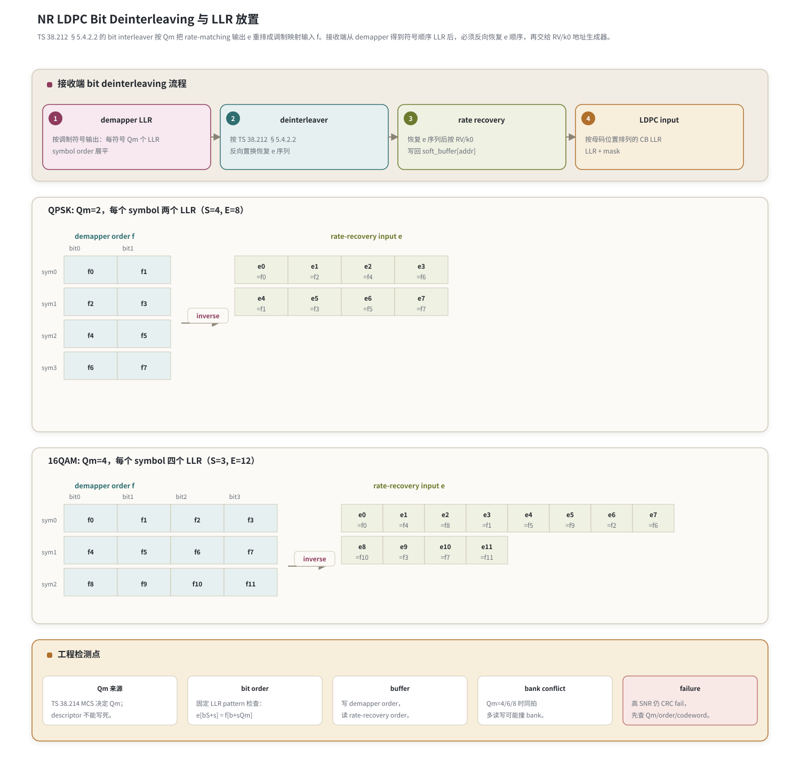

# T9.4 NR LDPC Bit Deinterleaving 与 LLR 放置
## 本节学习目标

本节使用的单篇技术缩写先统一说明：低密度奇偶校验码是 NR 数据业务的信道编码；对数似然比是 demapper 输出并送入译码链路的软信息；正交相移键控每个调制符号承载 2 个 bit；二进制相移键控在本节只作为“更低阶调制或简化测试”的对照；正交幅度调制可以让每个符号承载更多 bit，本节用 16QAM 举例；调制与编码方案决定调制阶数；下行控制信息是下行调度字段来源；上行共享信道和下行共享信道是本节主要关心的数据承载信道；码块是 LDPC 译码的逐块对象；循环冗余校验用于发现解交织或放置错误；传输块是多个 CB 拼接后对应业务数据和 TB CRC 的对象；传输块大小决定待承载 bit 数；混合自动重传请求让接收端在重传间复用软信息；块错误率是链路仿真中统计块译码失败的指标；静态随机存取存储器是硬件 reorder buffer 常用存储资源；寄存器传输级/专用集成电路实现需要把反交织落成 reorder buffer、地址生成器和 bank 访问。

本节讲一个很容易被忽略的接收端细节：TS 38.212 §5.4.2.2 在发送端把 rate matching 后的 bit 序列按调制阶数 $Q_m$ 交织后再调制。接收端从 demapper 得到的是“调制符号顺序”的 LLR，如果不先做 bit deinterleaving，后面的 RV/k0 rate recovery 会把 LLR 放到错误的 LDPC 编码位置。

学完本节后，应能做到：

- 解释为什么 bit interleaving 与调制阶数 $Q_m$ 相关。
- 写出发送端 interleaving 和接收端 deinterleaving 的索引关系。
- 用 QPSK 的 $Q_m=2$ 例子，把每个 symbol 两个 LLR 反排成 rate recovery 输入。
- 用 16QAM 的 $Q_m=4$ 例子，把每个 symbol 四个 LLR 反排成 rate recovery 输入。
- 说明 demapper 输出 LLR、bit deinterleaver、rate recovery 和 LDPC decoder input 的边界。
- 解释 bit order 错误为什么可能在高 SNR 下仍然 CRC fail。
- 给出 RTL/ASIC 中 reorder buffer、permutation address generator 和 bank conflict 的实现风险。

如果只记一件事：**demapper 的第几个 LLR不是 LDPC circular buffer 的第几个位置；它必须先按 $Q_m$ 反交织回 TS 38.212 的 rate-matching 输出顺序。**

## 前置知识检查

| 前置项 | 本节需要达到的程度 |
|:---|:---|
| T2.8/T2.9 软解调 | 知道 QPSK 每个 symbol 输出 2 个 LLR，16QAM 每个 symbol 输出 4 个 LLR。 |
| T9.1 速率恢复总览 | 知道 bit deinterleaving 位于 demapper LLR 和 bit selection 反操作之间。 |
| T9.3 HARQ soft buffer | 知道 deinterleaving 后的 LLR 还要按 RV/k0 写入 soft buffer。 |
| T5.2 memory banking | 知道 reorder buffer 的读写模式会影响 SRAM bank conflict。 |

本节不要求掌握完整星座映射表。星座点如何产生每个 bit 的 LLR 在 T2.8/T2.9 讲；这里关心的是这些 LLR 进入 LDPC rate recovery 前的顺序。

## 任务边界与 Prompt 覆盖

当前执行依据是 `docs/audits/lte_nr_decoding_remaining_work_register.md` 的 T9.4 条目：NR LDPC 解交织与 LLR 放置。需要说明一个计划错位：roadmap 文件中的 T9.4 是 CBG handling，已经在 T9.3 中覆盖了 HARQ/CBG 的主线，后续仍可单独深化；本节按登记表执行 bit deinterleaving。

| 登记表要求 | 本节覆盖位置 | 覆盖方式 |
|:---|:---|:---|
| 精读 TS 38.212 bit interleaving/rate matching | “资料与协议边界”“协议公式与接收端反操作” | 给出 §5.4.2.2 索引关系和接收端逆关系。 |
| 解释 $Q_m$ 如何影响 LLR 排列 | “调制阶数 $Q_m$ 与 LLR 排列关系” | 说明每个调制符号包含 $Q_m$ 个 bit LLR。 |
| demapper 输出与 LDPC 输入映射 | “接收端对象模型” | 划清 `f_llr`、`e_llr`、soft buffer 的边界。 |
| QPSK 例子 | “QPSK 数值例子” | 固定 4 个 symbols、8 个 LLR。 |
| 16QAM 例子 | “16QAM 数值例子” | 固定 3 个 symbols、12 个 LLR。 |
| 流程图 | “bit deinterleaving 流程图” | 用 Mermaid 和表格说明 $Q_m$ 分组、反交织地址和 decoder input 顺序。 |
| permutation address generator、reorder buffer、bank conflict | “RTL/ASIC 映射” | 列硬件模块和冲突风险。 |
| 伪代码 | “接收端伪代码” | 按 $Q_m$ 反交织。 |
| 常见错误 | “常见错误” | $Q_m$ 配错、bit order 反、layer/codeword 映射错。 |

正文额外补充 Python 可复现校验、浮点仿真方案、定点化策略、验证 dump 和自测答案。

## 资料与协议边界

| 协议位置 | 本地证据路径 |
| :--- | :--- |
| TS 38.212 §5.4.2 | `3GPP_Rel19/processed/TS_38.212_38212-j30/content.md:1175-1177` |
| TS 38.212 §5.4.2.1 | `3GPP_Rel19/processed/TS_38.212_38212-j30/content.md:1179-1309` |
| TS 38.212 §5.4.2.2 | `3GPP_Rel19/processed/TS_38.212_38212-j30/content.md:1311-1323` |
| TS 38.214 §5.1.3 | `3GPP_Rel19/processed/TS_38.214_38214-j30/content.md:1157-1171` |
| TS 38.214 §6.1.4 | `3GPP_Rel19/processed/TS_38.214_38214-j30/content.md:6829-6841` |

边界说明：

- TS 38.212 的 `content.md` 对 §5.4.2.2 的数学符号抽取不完整，但文字保留了“bit sequence interleaved to bit sequence, where value is modulation order”的结构。这里按 38.212 的标准索引关系重写为清晰公式，并用 toy 例子验证。
- 式 (4)/(5) 的人工转写证据已固化到 `docs/audits/T9.4_NR_LDPC_bit_interleaving_formula_evidence.md`：该文件记录 `source.docx`/`document.xml` SHA-256、`sections.jsonl` 的 `paragraph_index=684`、`document.xml` 段落 8955-8959 和旧式公式对象关系 ID `rId887/rId621/rId890/rId892/rId894/rId896/rId898/rId900`。当前 extractor 未自动转出旧式 Equation.3 公式，因此正文公式标注为人工复核重建。
- 本节不复现 TS 38.214 MCS 表值。MCS 表如何把索引变成 $Q_m$ 在模块 11 或系统配置章节再展开；本节只要求 descriptor 给出的 $Q_m$ 正确。

## 调制阶数 Qm 与 LLR 排列关系

$Q_m$ 是 modulation order，也就是每个调制符号承载多少个 coded bits。QPSK 的 $Q_m=2$，16QAM 的 $Q_m=4$，64QAM 的 $Q_m=6$，256QAM 的 $Q_m=8$。发送端把 bit 交给调制器时，不是一个 bit 一个 symbol，而是每 $Q_m$ 个 bit 组成一个 symbol 的 bit labels。

bit interleaving 的目的可以从工程直觉理解：rate matching 后的 bit 序列 $e$ 是按编码/速率匹配顺序排列的；调制器按 symbol 消费 bit。协议通过一个 $Q_m$ 相关的重排，让 bit 在调制 bit-level 之间分布。接收端 demapper 输出 LLR 时天然按 symbol 输出，例如：

```text
symbol0: LLR(bit0), LLR(bit1), ..., LLR(bit Qm-1)
symbol1: LLR(bit0), LLR(bit1), ..., LLR(bit Qm-1)
...
```

而 LDPC rate recovery 需要的是发送端 bit selection 输出 $e$ 的顺序。二者不是同一顺序，必须反交织。

## 高阶调制 bit-channel 不均衡

高阶正交幅度调制里，一个 symbol 内不同 bit lane 的可靠性通常不同。以 Gray-mapped 16QAM/64QAM 为例，决定象限或幅度粗分区的 bit 往往比决定细分边界的 bit 更可靠；具体可靠性还受星座归一化、信道估计、噪声方差和 demapper 算法影响。TS 38.212 的 bit interleaving 用 $Q_m$ 把 rate-matched bits 分散到这些 bit lanes 上，接收端必须按相反顺序恢复。

| 对象 | 含义 | bit deinterleaving 错误后果 |
|:---|:---|:---|
| bit lane | 一个调制符号内部的 bit 位置，例如 16QAM 的 lane 0..3 | 可靠 lane 的大幅 LLR 可能被放到本应较弱的编码位置。 |
| bit-channel | 某个 lane 经调制、信道、demapper 后形成的等效二进制软信道 | LDPC 看到的 LLR 分布与编码交织设计不匹配。 |
| lane-major order | 先收集所有 symbol 的同一 lane，再收集下一 lane | 常接近 TS 38.212 interleaving 的矩阵读写视角。 |
| symbol-major order | 每个 symbol 内 $Q_m$ 个 LLR 连续输出 | 常见 demapper 接口，需要本节式 (7) 反交织。 |

错误的 bit deinterleaving 不只是“数组顺序错”。在高 SNR 下，错误位置上的 LLR 绝对值可能很大，LDPC decoder 会非常相信这些错放证据，导致 syndrome 停滞或 CRC 稳定失败。定位时应回链 T2.9 的 QAM Max-Log-MAP demapping：先确认 bit lane 定义和 LLR 符号，再确认本节的 $Q_m$ 反交织，最后才检查 RV/k0 rate recovery。

## 协议公式与接收端反操作

设 rate matching 输出序列为：

$$
e_0,e_1,\ldots,e_{E-1},
\tag{1}
$$

bit interleaving 后送入 modulation mapper 的序列为：

$$
f_0,f_1,\ldots,f_{E-1}.
\tag{2}
$$

设：

$$
S = E / Q_m.
\tag{3}
$$

TS 38.212 §5.4.2.2 的 interleaving 可以写成下面这个更适合接收端理解的形式。这里不用 $i/j$，改用两个更直观的索引：$b$ 表示一个调制符号内部的 bit lane，$s$ 表示 symbol index。

$$
f_{b+sQ_m} = e_{bS+s},
\quad b=0,\ldots,Q_m-1,\quad s=0,\ldots,S-1.
\tag{4}
$$

式 (4) 可以看成把 $e$ 写成 $Q_m$ 行、$S$ 列的矩阵：第 $b$ 行是第 $b$ 个 bit lane，列号 $s$ 对应第 $s$ 个 symbol；发送端按 symbol 顺序读取这个矩阵，得到调制映射输入 $f$。接收端 demapper 若按调制符号顺序输出 LLR，则它的展开顺序正是 $f$ 顺序，反操作是：

$$
L_e[bS+s] = L_f[b+sQ_m].
\tag{5}
$$

式 (5) 是本节最重要的索引关系。工程实现还必须多问一句：本地 demapper 接口到底输出什么顺序？大多数软件/RTL demapper 会按 symbol 展平输出：

$$
L_{\mathrm{sym}}[sQ_m+b],
\quad s=0,\ldots,S-1,\quad b=0,\ldots,Q_m-1.
\tag{6}
$$

这时 $L_{\mathrm{sym}}$ 与 $L_f$ 只是命名不同，接收端直接恢复 $e$ 顺序：

$$
L_e[bS+s] = L_{\mathrm{sym}}[sQ_m+b].
\tag{7}
$$

如果某个 demapper 为了硬件并行而输出 bit-lane-major 顺序，才需要另外写接口适配。真正的实现必须把接口契约写进 descriptor 或模块说明，否则 QPSK 例子可能看似能跑，换到 16QAM 或双 codeword 就会出现稳定 CRC 失败。

## 接收端对象模型

| 对象 | 顺序 | 来源 | 去向 |
|:---|:---|:---|:---|
| `symbol_llr` | symbol 顺序，每个 symbol 有 $Q_m$ 个 LLR | demapper 常见接口 | 按式 (7) 直接反交织。 |
| `f_llr` | TS 38.212 modulation mapper input 顺序，通常等同 symbol 顺序 | demapper 或前级转换 | 按式 (5) 反交织。 |
| `e_llr` | rate matching output sequence 顺序 | bit deinterleaver 输出 | RV/k0 rate recovery。 |
| `soft_buffer[addr]` | LDPC circular buffer 地址顺序 | rate recovery 写入 | LDPC decoder 输入。 |

不要把 `f_llr[k]` 直接当作 `e_llr[k]`。高 SNR 下 demapper LLR 绝对值可能很大，如果顺序错了，错误 LLR 会被很强地放到错误编码位置，CRC 反而稳定失败。

## bit deinterleaving 流程图

```mermaid
%%{init: {'theme': 'default'}}%%
flowchart LR
SYM["symbol_llr: symbol order, Qm LLR per modulation symbol"]
F["f_llr: modulation mapper input order"]
E["e_llr: rate matching output sequence order"]
RV["RV/k0 rate recovery"]
BUF["soft_buffer[addr]: LDPC circular buffer coordinates"]
DEC["LDPC decoder input LLR/mask"]
SYM --> F
F -->|"TS 38.212 bit deinterleaving inverse"| E
E --> RV
RV --> BUF
BUF --> DEC

classDef demap fill:#EAF3FF,stroke:#2457A6,color:#17212F;
classDef reorder fill:#F1EDFF,stroke:#6E55A4,color:#17212F;
classDef rate fill:#EAF8EF,stroke:#2D8F5D,color:#17212F;
classDef buffer fill:#FFF5DD,stroke:#B9841A,color:#17212F;
classDef decode fill:#FFECEF,stroke:#B94A55,color:#17212F;
class SYM,F demap;
class E reorder;
class RV rate;
class BUF buffer;
class DEC decode;
```




| 内容 | 说明 |
|:---|:---|
| 输入顺序 | `symbol_llr` 通常按调制符号顺序到达，每个 symbol 包含 $Q_m$ 个 bit-lane LLR。 |
| `f_llr` | 对应 TS 38.212 modulation mapper input 顺序；若 demapper 已按该契约输出，可直接进入反交织公式。 |
| `e_llr` | bit deinterleaver 输出，恢复到 rate matching output sequence 顺序，后续才能按 RV/k0 放回 circular buffer。 |
| 地址落点 | `e_llr` 不能直接当 LDPC 母码 LLR；还要经过 rate recovery 写入 `soft_buffer[addr]`。 |
| 常见错误 | 把 `f_llr[k]` 当 `e_llr[k]`，在高 SNR 下会把强 LLR 放到错误编码位置，CRC 稳定失败。 |
| 最小验证 | dump `Qm`、symbol index、bit lane、`f_index`、`e_index`、RV/k0 地址和写入 soft buffer 地址。 |

图中 `rate-recovery input e` 是反交织后的关键边界：它已经不再是 demapper order，而是可以交给 RV/k0 rate recovery 的 `e` 序列。工程检测点必须逐项记录：

| 检测点 | 必须检查的内容 | 失败定位 |
|:---|:---|:---|
| Qm 来源 | TS 38.214 MCS 决定 `Qm`；descriptor 不能写死。 | 同一代码在 QPSK 通过、16QAM/64QAM/256QAM 失败时，先查 `Qm` 是否来自当前调度上下文。 |
| bit order | 固定 LLR pattern 检查：`e[bS+s] = f[b+sQm]`。 | 如果 `f` 和 `e` 只是原样透传，说明没有执行 TS 38.212 §5.4.2.2 的反操作。 |
| buffer | 写 demapper order，读 rate-recovery order。 | reorder buffer 的写端通常按 symbol 顺序进入，读端必须按 `e` 序列顺序吐出。 |
| bank conflict | `Qm=4/6/8` 时同拍多读写可能撞 bank。 | 高阶调制下多个 lane 同拍访问会暴露 SRAM bank 分配和 crossbar 约束。 |
| failure | 高 SNR 仍 CRC fail，先查 Qm/order/codeword。 | 不要先怀疑 LDPC 迭代算法；先确认调制阶数、LLR 顺序和 codeword/layer 映射。 |

## QPSK 数值例子

QPSK 时 $Q_m=2$。设本次有 $S=4$ 个 symbols，总 LLR 数 $E=8$。demapper 输出按 symbol 展平为：

| symbol | bit0 LLR | bit1 LLR |
|:---:|:---:|:---:|
| sym0 | $f_0$ | $f_1$ |
| sym1 | $f_2$ | $f_3$ |
| sym2 | $f_4$ | $f_5$ |
| sym3 | $f_6$ | $f_7$ |

若 demapper 接口按 symbol order 展平，则按式 (7)：

| $e$ index | 来源 $f$ index | 解释 |
|:---:|:---:|:---|
| $e_0$ | $f_0$ | bit0 lane, sym0 |
| $e_1$ | $f_2$ | bit0 lane, sym1 |
| $e_2$ | $f_4$ | bit0 lane, sym2 |
| $e_3$ | $f_6$ | bit0 lane, sym3 |
| $e_4$ | $f_1$ | bit1 lane, sym0 |
| $e_5$ | $f_3$ | bit1 lane, sym1 |
| $e_6$ | $f_5$ | bit1 lane, sym2 |
| $e_7$ | $f_7$ | bit1 lane, sym3 |

如果用固定 LLR pattern：

$$
L_{\mathrm{sym}} = [10,11,20,21,30,31,40,41],
\tag{8}
$$

则：

$$
L_e = [10,20,30,40,11,21,31,41].
\tag{9}
$$

这就是 QPSK 下“每个 symbol 两个 LLR”的接收端反交织。

## 16QAM 数值例子

16QAM 时 $Q_m=4$。设 $S=3$ 个 symbols，总 LLR 数 $E=12$。demapper 输出：

| symbol | bit0 | bit1 | bit2 | bit3 |
|:---:|:---:|:---:|:---:|:---:|
| sym0 | $f_0$ | $f_1$ | $f_2$ | $f_3$ |
| sym1 | $f_4$ | $f_5$ | $f_6$ | $f_7$ |
| sym2 | $f_8$ | $f_9$ | $f_{10}$ | $f_{11}$ |

若 demapper 接口按 symbol order 展平，则按式 (7)：

$$
L_e =
[f_0,f_4,f_8,\; f_1,f_5,f_9,\; f_2,f_6,f_{10},\; f_3,f_7,f_{11}].
\tag{10}
$$

如果固定：

$$
L_{\mathrm{sym}}=[100,101,102,103,200,201,202,203,300,301,302,303],
\tag{11}
$$

则：

$$
L_e=[100,200,300,101,201,301,102,202,302,103,203,303].
\tag{12}
$$

这个例子很适合做单元测试，因为每个 bit lane 的数字前缀不同，错误重排会立刻暴露。

## 接收端伪代码

```text
Input:
  symbol_llr[0..E-1] demapper output in symbol order
  Qm                modulation order from descriptor
  E                 number of LLRs for this CB after demapping

Check:
  E % Qm == 0
  S = E / Qm

Procedure:
  for i in 0..S-1:
      for j in 0..Qm-1:
          e_index = j * S + i
          sym_index = i * Qm + j
          e_llr[e_index] = symbol_llr[sym_index]

  send e_llr to rate recovery address generator
```

如果 demapper 的本地接口已经按协议 $f$ 顺序或 bit lane 顺序输出，而不是按 symbol 输出，伪代码必须切换到式 (5) 或接口专用映射。工程实现最怕接口双方都说“我输出的是 demapper LLR”，但一个按 symbol 排列，另一个按 lane 排列。

## Python 可复现校验

```python
def deinterleave_symbol_order(symbol_llr, qm):
    assert len(symbol_llr) % qm == 0
    s = len(symbol_llr) // qm
    e = [None] * len(symbol_llr)
    for i in range(s):
        for j in range(qm):
            e[j * s + i] = symbol_llr[i * qm + j]
    return e


def deinterleave_ts_f_order(f_llr, qm):
    assert len(f_llr) % qm == 0
    s = len(f_llr) // qm
    e = [None] * len(f_llr)
    for sym in range(s):
        for bit in range(qm):
            e[bit * s + sym] = f_llr[bit + sym * qm]
    return e


qpsk_symbol_order = [10, 11, 20, 21, 30, 31, 40, 41]
qpsk_e = deinterleave_symbol_order(qpsk_symbol_order, 2)
assert qpsk_e == [10, 20, 30, 40, 11, 21, 31, 41]

qam16_symbol_order = [100, 101, 102, 103, 200, 201, 202, 203, 300, 301, 302, 303]
qam16_e = deinterleave_symbol_order(qam16_symbol_order, 4)
assert qam16_e == [100, 200, 300, 101, 201, 301, 102, 202, 302, 103, 203, 303]

# The protocol f-order inverse is kept as a separate unit test.
qpsk_f_order = [10, 11, 20, 21, 30, 31, 40, 41]
assert deinterleave_ts_f_order(qpsk_f_order, 2) == qpsk_e

print("T9.4_BIT_DEINTERLEAVING_TOY_OK", qpsk_e, qam16_e)
```

上面特意区分两种接口顺序：

- TS 38.212 的 $f$ 顺序是发送端 bit interleaver 输出顺序。
- 很多 demapper 软件接口会按 symbol 展平输出。若接口是 symbol order，直接使用 `deinterleave_symbol_order()`，不要再套一次协议 $f$ 顺序反交织。

式 (7) 与本节图表中的矩阵一致。

## 浮点仿真方案

浮点仿真不要只跑随机 BLER，应先跑固定 pattern：

| 测试 | 输入 | 期望 |
|:---|:---|:---|
| QPSK fixed pattern | `[10,11,20,21,30,31,40,41]` symbol order | $e=[10,20,30,40,11,21,31,41]$。 |
| 16QAM fixed pattern | 每个 symbol 四个可识别 LLR | $e$ 按 bit lane 分组。 |
| $Q_m$ mismatch | 用 QPSK 数据按 16QAM 反排 | 输出长度/分组检查失败或 CRC fail。 |
| codeword mismatch | 双 codeword 场景交换输入 | 单个 codeword CRC fail。 |
| high SNR sanity | 大幅度 LLR 且无噪声 | 若 bit order 正确应通过；若错误高 SNR 仍 fail。 |

## 定点化策略

bit deinterleaving 本身不改变 LLR 数值，只改变位置。因此定点策略主要是“位宽保持”和“不要重复量化”：

- 输入是 6 bit LLR，输出仍应是 6 bit LLR。
- 不要在 reorder buffer 里重新缩放，否则会把 demapper 标定和 LDPC decoder 标定割裂。
- 若 reorder buffer 使用更窄 SRAM，需要在 T2.11/T5.1 定点预算中显式评估 BLER 损失。
- 符号位必须原样搬运；bit order 错和符号翻转是两类问题，日志要能区分。

## RTL/ASIC 映射

| 模块 | 输入 | 输出 | 风险 |
|:---|:---|:---|:---|
| descriptor parser | MCS-derived $Q_m$、CB length、codeword/layer id | deinterleaver config | $Q_m$ 配错。 |
| write address generator | demapper stream index | reorder buffer write address | symbol order/lane order 定义不清。 |
| read address generator | $Q_m$、$S$ | `e_llr` read order | 式 (5)/(7) 搞反。 |
| reorder buffer | LLR stream | reordered LLR stream | bank conflict、读写同址。 |
| scoreboard | fixed pattern 和索引 trace | pass/fail | 只看 CRC，定位太晚。 |

bank conflict 的来源是：当一个周期处理多个 symbols 或多个 bit lanes 时，读写地址可能落在同一个 SRAM bank。解决方式包括：

- 按 bit lane 分 bank。
- 写 symbol order、读 lane order 时使用 ping-pong buffer。
- 对高 $Q_m$ 使用小型 crossbar 或 shuffle network。
- 在吞吐不足时降低每拍 LLR 数，换取简单 SRAM。

## 验证方法

最小 dump 包：

| 字段 | 用途 |
|:---|:---|
| `Qm`、`E`、`S=E/Qm` | 判断基本维度。 |
| demapper interface order | 判断输入是 symbol order 还是 TS 38.212 $f$ order。 |
| first 32 input LLR | 固定 pattern 对照。 |
| first 32 output LLR | 检查反交织结果。 |
| address trace | 检查 `e_index/sym_index` 或 `e_index/f_index`。 |
| codeword/layer id | 排查多 codeword 映射错。 |
| CB CRC/TB CRC | 关联 bit order 与最终失败。 |

验证顺序：

1. 单元测试固定 pattern，不接 LDPC decoder。
2. 接 rate recovery，但不接迭代译码，只检查 soft buffer 地址和值。
3. 接 LDPC decoder，用无噪声或高 SNR case 检查 CRC。
4. 注入 $Q_m$ mismatch、bit order reverse、codeword swap 三类负测试。

## 常见错误

| 错误 | 表现 | 定位 |
|:---|:---|:---|
| $Q_m$ 配错 | 输出顺序整体错，甚至数组越界 | dump MCS-derived $Q_m$ 和 `E%Qm`。 |
| bit order 反 | 高 SNR 仍 CRC fail | fixed LLR pattern。 |
| symbol order 与 lane order 混淆 | QPSK/16QAM 都 fail，但 BPSK-like 测试可能过 | 明确接口契约。 |
| layer/codeword 映射错 | 一个 codeword 好，另一个 fail | dump codeword id 和 TB id。 |
| reorder buffer 覆盖 | 偶发 fail，和吞吐/并行度相关 | bank conflict counter。 |
| 符号位搬运错 | LLR 符号反，性能灾难 | 正负 pattern 测试。 |

## 自测题

1. 为什么 $Q_m=2$ 和 $Q_m=4$ 的 bit deinterleaving 不能共用固定置换表？
2. demapper 输出 `[10,11,20,21]`，QPSK 两个 symbols，symbol order 下恢复的 $e$ 是什么？
3. 高 SNR 下 CRC 仍失败，为什么要怀疑 bit order？
4. bit deinterleaving 会改变 LLR 数值吗？
5. RTL 中为什么需要 bank conflict counter？

## 自测题参考答案

1. 因为 $Q_m$ 决定每个 symbol 的 bit lane 数，也决定矩阵列数。不同 $Q_m$ 的 $S=E/Q_m$ 和索引关系不同。
2. $e=[10,20,11,21]$。先取 bit0 lane 的两个 symbols，再取 bit1 lane。
3. 高 SNR 下 LLR 很可靠；如果顺序错，可靠信息会被放到错误编码位置，CRC 会稳定失败。
4. 不改变。它只重排位置；缩放、裁剪和饱和属于其他模块。
5. 因为高并行读写 reorder buffer 时可能访问同一 SRAM bank，造成 stall 或覆盖，必须可观测。

## 协议证据表

| 结论 | 协议依据 | 本地证据 |
|:---|:---|:---|
| LDPC rate matching 包含 bit selection 和 bit interleaving | TS 38.212 §5.4.2 | `3GPP_Rel19/processed/TS_38.212_38212-j30/content.md:1175-1177` |
| bit interleaving 使用 modulation order | TS 38.212 §5.4.2.2 | `3GPP_Rel19/processed/TS_38.212_38212-j30/content.md:1311-1323` |
| §5.4.2.2 公式按 Word 段落和旧式公式对象人工复核重建 | TS 38.212 §5.4.2.2 | `docs/audits/T9.4_NR_LDPC_bit_interleaving_formula_evidence.md` |
| PDSCH 从 DCI/MCS 确定 modulation order $Q_m$ | TS 38.214 §5.1.3 | `3GPP_Rel19/processed/TS_38.214_38214-j30/content.md:1157-1163` |
| PUSCH 读取或确定 modulation order、RV、TBS | TS 38.214 §6.1.4 | `3GPP_Rel19/processed/TS_38.214_38214-j30/content.md:6829-6841` |

## 图示


## 执行与证据记录

| 项 | 记录 |
|:---|:---|
| 写作范围 | 新增 `docs/L2_协议算法/T9.4_NR_LDPC_bit_deinterleaving.md`。 |
| Prompt 对齐 | 按登记表 T9.4 覆盖 $Q_m$、QPSK、16QAM、LLR 放置、流程图、reorder buffer、address generator、bank conflict、伪代码、验证和常见错误；roadmap T9.4 的 CBG handling 已在 T9.3 承接主线，后续可继续深化。 |
| 协议精读 | 已读取 TS 38.212 §5.4.2/§5.4.2.2、TS 38.214 §5.1.3/§6.1.4。 |
| Python toy | 已运行正文片段，输出 `T9.4_BIT_DEINTERLEAVING_TOY_OK [10, 20, 30, 40, 11, 21, 31, 41] [100, 200, 300, 101, 201, 301, 102, 202, 302, 103, 203, 303]`。 |
| 自动审计 | 已通过：`LESSON_TERM_AUDIT_OK`、`MARKDOWN_HEADING_AUDIT_OK`、`LESSON_DEPTH_AUDIT_OK`、`LATEX_RENDER_AUDIT_OK formulas=121`。 |
| 审核经理 | 首轮复核 Critical=0、Important=1、Minor=2；Important 为 §5.4.2.2 公式证据链不足，已新增 `docs/audits/T9.4_NR_LDPC_bit_interleaving_formula_evidence.md` 并回链正文；Minor 本节图表中文字和记录状态已修复，待复审确认。 |

## 参考文献

1. 3GPP TS 38.212 Rel-19 `38212-j30`, Multiplexing and channel coding.
2. 3GPP TS 38.214 Rel-19 `38214-j30`, Physical layer procedures for data.
3. 本项目 T2.8：`docs/L1/T2.8_BPSK_QPSK_soft_demapping.md`。
4. 本项目 T2.9：`docs/L1/T2.9_QAM_Max_Log_MAP_demapping.md`。
5. 本项目 T9.1：`docs/L2_协议算法/T9.1_NR_LDPC_rate_recovery_overview.md`。
6. 本项目 T9.3：`docs/L2_协议算法/T9.3_NR_LDPC_HARQ_soft_buffer_RV_k0.md`。
