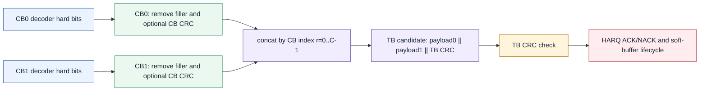
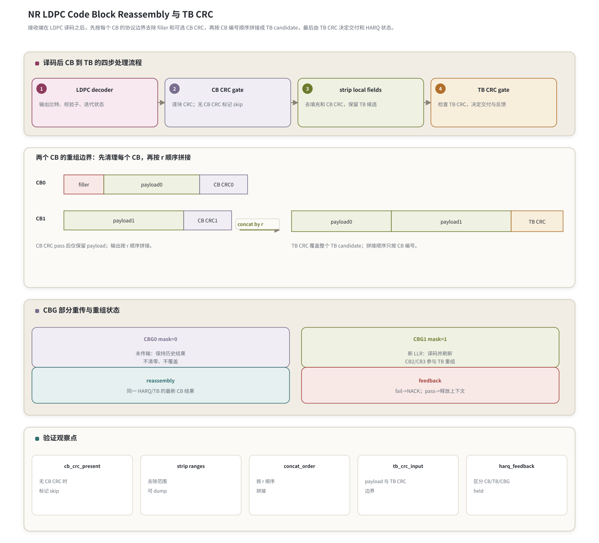

# T9.5 NR LDPC 码块重组与传输块 CRC
## 本节学习目标

本节使用的单篇技术缩写先统一说明：低密度奇偶校验码是 NR 数据业务采用的信道编码；对数似然比是 LDPC 译码前的软信息，本节只在解释 CBG 重传输入来源时提到；传输块是媒体接入控制层交给物理层的业务数据单元；码块是 TB 经分段后逐块 LDPC 译码的对象；CBG是 NR 为部分重传引入的 CB 分组；循环冗余校验用于发现译码或重组错误；混合自动重传请求根据译码状态保留或释放软缓存；下行共享信道和上行共享信道是本节主要讨论的数据承载信道；下行控制信息携带 CBG transmission information 等控制字段；寄存器传输级/专用集成电路实现需要把 CB 状态、拼接地址和 CRC 输入边界做成可验证的硬件控制。

本节回答 NR LDPC 接收链路中一个很靠后的问题：每个 CB 已经完成速率恢复、LDPC 迭代和硬判决以后，接收端怎样把这些 CB 重新变成一个 TB，并决定本次 HARQ 是通过还是失败。

学完本节后，应能做到：

- 区分 CB CRC 与 TB CRC 的职责，尤其知道 CB CRC 不是所有场景都存在。
- 说明 filler 去除、可选 CB CRC 去除和 CB 拼接的先后关系。
- 解释 CB 必须按协议 CB index 顺序拼接，不能按硬件译码完成时间拼接。
- 说明 CBG 部分重传时，未更新 CB 的历史状态如何参与本次 TB 重组。
- 分析三类失败：单个 CB CRC 失败、所有 CB CRC 通过但 TB CRC 失败、CBG 部分重传后拼接状态错误。
- 写出接收端重组伪代码和最小 Python 校验。
- 给出 RTL/ASIC 中 CB status RAM、concat buffer、CRC checker 和 HARQ feedback 的验证观察点。

如果只记一件事：**LDPC decoder 输出的是一个个 CB 的候选结果；真正能交付给 MAC 的是按协议顺序去除 filler/可选 CB CRC 后拼接出来、并通过 TB CRC 的 TB candidate。**

## 前置知识检查

| 前置项 | 本节需要达到的程度 |
|:---|:---|
| T3.4 NR LDPC 分段规则 | 知道 TB 加 TB CRC 后可能被分成多个 CB，CB 可能带额外 CB CRC，开头可能有 filler。 |
| T8.1 NR LDPC 译码链路总览 | 知道 rate recovery、LDPC decoder、CB CRC、CB concat、TB CRC 的链路位置。 |
| T9.3 NR HARQ/CBG | 知道 CBG mask 可能让某些 CB 本次没有新 LLR，历史状态需要保持。 |
| T3.1 CRC 家族 | 知道 CRC 是 GF(2) 多项式余数检查，CRC pass 不等于所有上下文一定正确。 |

本节不重新推导 BG、Zc、lifting size 或 LDPC 迭代算法。那些属于 [[T3.4_NR_LDPC_segmentation_rules|T3.4]]、[[T8.2_NR_LDPC_base_graph_selection|T8.2]]、[[T8.3_NR_LDPC_lifting_QC_matrix|T8.3]]、[[T8.5_LDPC_sum_product_BP|T8.5]]-[[T8.8_NR_LDPC_decoder_numeric_walkthrough|T8.8]]。这里关心的是译码后的比特边界和接收端状态机。

## 任务边界与 Prompt 覆盖

| 要求 | 本节覆盖位置 | 覆盖方式 |
|:---|:---|:---|
| 填充位去除 | “Filler、CB CRC 与 TB CRC 的接收端边界” | 说明 filler 在单个 CB 内先去除，不进入 TB candidate。 |
| CB CRC | “CB CRC 的条件性职责” | 区分存在 CB CRC 和无 CB CRC 场景。 |
| 码块拼接 | “按协议顺序拼接” | 给两个 CB 例子和完成时间反例。 |
| TB CRC | “TB CRC 与 HARQ 反馈” | 说明最终交付边界和 soft buffer 释放条件。 |
| CB 失败案例 | “失败案例一” | 单个 CB CRC fail 阻断交付。 |
| CBG 部分重传案例 | “CBG 部分重传下的重组状态” | 未传输 CBG 使用历史结果，传输 CBG 更新状态。 |
| TB CRC 失败案例 | “失败案例二” | 所有 CB 局部通过但拼接/TB 边界错误导致 TB CRC fail。 |
| Python 小例子 | “Python 可复现校验” | 验证拼接长度、filler 去除、CB CRC 输入范围和拼接顺序。 |

正文额外补充协议证据表、接收端 descriptor、RTL/ASIC 映射、验证 dump、自测题和执行记录。

## 资料与协议边界

| 协议位置 | 本地证据路径 |
| :--- | :--- |
| TS 38.212 §5.2.2 | `3GPP_Rel19/processed/TS_38.212_38212-j30/content.md:717-805` |
| TS 38.212 §5.5 | `3GPP_Rel19/processed/TS_38.212_38212-j30/content.md:1335-1359` |
| TS 38.212 §6.2.1/§6.2.3/§6.2.6 | `3GPP_Rel19/processed/TS_38.212_38212-j30/content.md:1361-1415` |
| TS 38.212 §7.2.1/§7.2.3/§7.2.6 | `3GPP_Rel19/processed/TS_38.212_38212-j30/content.md:3737-3783` |
| TS 38.214 §5.1.7 | `3GPP_Rel19/processed/TS_38.214_38214-j30/content.md:2407-2437` |
| TS 38.214 §6.1.5 | `3GPP_Rel19/processed/TS_38.214_38214-j30/content.md:7099-7125` |

协议精读时要注意方向：TS 38.212 写的是发送端处理链路，接收端执行等价逆操作。发送端先 TB CRC，再 segmentation/CB CRC/filler，再 LDPC 编码、rate matching、CB concatenation；接收端在译码后要反过来：先拿到每个 CB 的 hard bits，再检查并去除可选 CB CRC 和 filler，按 CB 序号拼接，最后检查 TB CRC。

## 协议前因后果

一个 TB 可能很大，不能直接作为单个 LDPC CB 处理。TS 38.212 §5.2.2 因此规定：当输入超过基图允许的最大 code block size 时，发送端把带 TB CRC 的序列分成多个 CB，并给每个 CB 额外附加 CRC。这样做有两个直接后果：

- 工程上，多个 CB 可以并行编码、速率匹配和译码，降低单块复杂度。
- 接收端上，单个 CB 可以先局部判定是否可信，但最终业务交付仍由整个 TB 的 CRC 决定。

CB CRC 和 TB CRC 是两层不同的错误检测。CB CRC 的对象是某个 CB 的局部比特；TB CRC 的对象是所有 CB 去掉局部字段后拼回来的 TB candidate。CB CRC 能帮助快速定位“哪个 CB 出问题”，但不能替代 TB CRC；TB CRC 能发现拼接顺序、filler 删除、TB 边界或多 TB 上下文错误。

还要注意一个条件：CB CRC 不是无条件存在。TS 38.212 §5.2.2 的语义是触发 segmentation 时附加额外 CB CRC；没有触发该条件时，接收端不能在日志里伪造 `CB CRC pass`。正确日志应区分：

| 场景 | 接收端状态 |
|:---|:---|
| CB CRC present | 检查该 CB 的 CRC，记录 pass/fail。 |
| CB CRC absent | 记录 `cb_crc_present=false`，跳过 CB CRC gate。 |
| TB CRC present | 对完整 TB candidate 做最终 CRC 检查。 |

## 接收端对象模型

| 对象 | 含义 | 常见错误 |
|:---|:---|:---|
| `decoded_cb_bits[r]` | 第 `r` 个 CB 的 LDPC hard decision 输出，仍包含 filler/可选 CB CRC 边界。 | 直接拼接进 TB。 |
| `cb_crc_present[r]` | 该 CB 是否按协议附加 CB CRC。 | 无 CB CRC 场景仍报告 pass/fail。 |
| `filler_count[r]` | 该 CB 开头或指定区间的 filler 数量，来自 segmentation descriptor。 | 把 rate matching 的 unknown LLR 当 filler 删除。 |
| `payload_slice[r]` | 去除 filler 和可选 CB CRC 后参与 TB 拼接的比特。 | 去除范围错一位，CB CRC 可过但 TB CRC 失败。 |
| `cb_status[r]` | required/held/updated/pass/fail/no-crc 等状态。 | CBG 未传输 CB 被清空。 |
| `tb_candidate` | 按 `r=0..C-1` 拼接得到的带 TB CRC 检查候选。 | 按译码完成时间或 CBG 顺序拼接。 |
| `tb_crc_status` | 最终交付和 HARQ 反馈边界。 | TB fail 后释放 soft buffer。 |

`payload_slice[r]` 是本节的核心对象。它不是 LDPC 母码位置，不是 rate matching 输出，也不是 decoder 原始输出；它是当前 CB 在协议逆操作后真正属于 TB 的那段业务候选比特。

## Filler、CB CRC 与 TB CRC 的接收端边界

发送端 filler 是为了让 CB 长度满足 LDPC lifting 和矩阵尺寸要求。它不是业务比特，也不是空口未发送造成的 unknown LLR。接收端处理顺序应是：

1. 在 rate recovery/LDPC decoder 之前，filler 对应的 LDPC 输入位置通常作为已知值处理，不能当 unknown。
2. LDPC decoder 输出 hard bits 后，在 CB 重组阶段删除 filler 对应位置。
3. 如果该 CB 有 CB CRC，先对包含 CB payload 和 CB CRC 的局部候选做 CRC 检查，再去除 CB CRC parity bits。
4. 删除 filler 和可选 CB CRC 后，剩余 bit 才进入 `payload_slice[r]`。
5. 所有 `payload_slice[r]` 按 CB index 拼接后，形成用于 TB CRC 的候选序列。

三种容易混淆的东西如下：

| 名称 | 来源 | 接收端动作 |
|:---|:---|:---|
| filler | segmentation/lifting 需要 | 作为已知位置参与译码，重组时删除。 |
| punctured/unknown | rate matching/RV 未观测 | LLR 初始化为未知或低置信，不在重组阶段删除。 |
| CB CRC parity | segmentation 时可选附加 | 用于局部 CRC 检查，检查后不进入 TB payload。 |

## CB CRC 的条件性职责

当 `cb_crc_present[r]=true` 时，接收端应对该 CB 的局部候选执行 CRC 检查。若失败：

- 当前 CB 的 `cb_status[r]=fail`。
- 当前 TB 不应交付。
- HARQ soft buffer 通常保留，等待后续重传。
- 如果启用 CBG，可把该 CB 所在 CBG 标为需要后续关注的失败组。

当 `cb_crc_present[r]=false` 时，接收端不能写 `cb_crc_status=pass`。应写成 `not_present` 或 `skipped`。这种场景最终只能由 TB CRC 和 LDPC decoder 内部状态共同保护。

这一区分很重要，因为调试日志如果把 “没有 CB CRC” 写成 “CB CRC pass”，会误导工程师去排查 TB 拼接，而忽略无局部 CRC 保护的单 CB 译码不确定性。

## 按协议顺序拼接

TS 38.212 §5.5 明确 code block concatenation 是对不同 code blocks 的 rate matching outputs sequentially concatenating。对接收端来说，最终重组也必须按协议 CB 编号顺序执行：

$$
\mathrm{TB\_candidate}
= \mathrm{payload\_slice}[0]\Vert
\mathrm{payload\_slice}[1]\Vert
\cdots\Vert
\mathrm{payload\_slice}[C-1].
\tag{1}
$$

这里的 $C$ 是 TB 内 CB 数量，$\Vert$ 表示拼接。式 (1) 不能改成“哪个 LDPC core 先完成就先放哪个”。硬件中 CB1 可能先于 CB0 完成，这是并行调度现象，不是协议顺序。

## 手算例子：两个 CB 的最小重组

两个 CB 的最小例子：

| CB | decoder 输出中的局部结构 | CB CRC | 进入 TB candidate 的内容 |
|:---:|:---|:---:|:---|
| CB0 | `filler, payload0, cb_crc0` | pass | `payload0` |
| CB1 | `payload1, cb_crc1` | pass | `payload1` |

最终 TB candidate 是：

$$
\mathrm{payload0}\Vert\mathrm{payload1}\Vert\mathrm{TB\ CRC}.
\tag{2}
$$

如果 CB1 比 CB0 先完成，也不能形成 `payload1 || payload0`。这种错误常见表现是：每个 CB 的局部 CRC 都通过，但 TB CRC 稳定失败。

## 重组流程图




| 内容 | 说明 |
|:---|:---|
| CB 输入 | 每个 CB decoder 输出 hard bits、posterior/CRC 状态和 filler/CB CRC 边界。 |
| 去除规则 | 对每个 CB 先去 filler，再按是否存在 CB CRC 去除 CB CRC；无 CB CRC 的场景不能伪造一层检查。 |
| 拼接顺序 | 必须按 CB index `r=0..C-1` 重组，即使 CB1 比 CB0 先完成也不能交换。 |
| TB candidate | 重组结果为 `payload0 || payload1 || ... || TB CRC`，再进入 TB CRC check。 |
| 失败模式 | 单个 CB CRC 都通过但 concat 顺序错时，TB CRC 会稳定失败。 |
| CBG 边界 | CBG 部分重传下，未传输 CBG 使用历史 soft/hard/status，传输 CBG 更新后再参与 TB 重组。 |
## CBG 部分重传下的重组状态

CBG 不改变 CB 内部如何做 CRC，也不改变 TB candidate 的最终拼接顺序。它改变的是“本次哪些 CB 有新结果，哪些 CB 使用历史结果”。

图中的标题写作“CBG 部分重传与重组状态”，对应四个状态动作：`CBG0 mask=0` 时“未传输：保持历史结果”；`CBG1 mask=1` 时“新 LLR：译码并刷新”；`reassembly` 阶段使用“同一 HARQ/TB 的最新 CB 结果”；`feedback` 阶段遵循“fail->NACK；pass->释放上下文”。这些短句必须进入实现 checklist，因为 CBG 部分重传最常见错误就是把未传输 CBG 清空，或把新 LLR 与历史结果的所有权混在一起。

设一个 TB 有 4 个 CB，分成两个 CBG：

| CBG | 包含 CB | 本次 CBGTI | 接收端状态 |
|:---:|:---|:---:|:---|
| CBG0 | CB0, CB1 | 0 | 本次没有新 LLR，保持历史 soft buffer、hard result、CB status。 |
| CBG1 | CB2, CB3 | 1 | 本次有新 LLR，完成 rate recovery、LDPC decode 和 CB status 更新。 |

本次 TB 重组时，如果协议和实现允许使用历史结果，则 `tb_candidate` 应由同一 HARQ/TB 上下文中的“最新有效 CB 结果”组成：

$$
\mathrm{TB\_candidate}
= \mathrm{latest}(CB0)\Vert
\mathrm{latest}(CB1)\Vert
\mathrm{latest}(CB2)\Vert
\mathrm{latest}(CB3).
\tag{3}
$$

这里 `latest(CB0)` 和 `latest(CB1)` 可能来自前一次传输，`latest(CB2)` 和 `latest(CB3)` 来自本次重传。错误实现经常把 CBG0 未传输误解为“CB0/CB1 没有数据，所以填 0 或清空”。这会破坏 TB CRC，也会污染 HARQ 状态。

对于 PDSCH，若 DCI 中存在 CBGFI，还要按 TS 38.214 §5.1.7.2 判断旧实例是否可合并。`CBGFI=0` 表示早前相同 CBG 实例可能损坏，接收端不能盲目把旧 LLR 当成可合并证据；`CBGFI=1` 表示可与早前实例合并。[[T9.3_NR_LDPC_HARQ_soft_buffer_RV_k0|T9.3]] 已讲 soft buffer 合并，本节只强调重组时要使用正确的 CB result/status。

## TB CRC 与 HARQ 反馈

TB CRC 是交付边界。接收端可以把判决写成下面的状态机：

| 条件 | TB 交付 | HARQ/soft buffer 动作 |
|:---|:---|:---|
| 任一 required CB 无有效结果 | 不交付 | NACK，保留上下文。 |
| 任一存在 CB CRC 的 required CB fail | 不交付 | NACK，保留失败相关 soft buffer/CBG 状态。 |
| 所有 required CB 局部可用，但 TB CRC fail | 不交付 | NACK，保留上下文，重点排查拼接顺序和输入边界。 |
| TB CRC pass | 交付 MAC | ACK，释放或标记可释放 HARQ soft buffer。 |

“required CB” 在 CBG 场景中很关键。未在本次传输中的 CBG 不等于不 required；它可能 required 但使用历史有效结果。是否可使用历史结果，取决于 HARQ/CBG 状态、NDI、CBGFI 和实现策略。

验证观察点还要显式记录：`cb_crc_present` 为 false 时无 CB CRC 时标记 skip，不能伪造 pass；`strip ranges` 必须支持去除范围可 dump，方便核对 filler、CB CRC parity 和 payload slice 的边界。

## 失败案例一：单个 CB CRC 失败

输入状态：

| 字段 | 值 |
|:---|:---|
| `C` | 2 |
| `cb_crc_present` | `[true, true]` |
| `cb_crc_status` | `[pass, fail]` |
| `tb_crc_status` | 不应作为交付依据继续计算，或计算后也不得交付 |

现象：

- CB1 局部 CRC fail。
- TB 不交付。
- HARQ feedback 为 NACK。

定位字段：

- `cb_id=1`
- `rate_recovery_addr_trace[1]`
- `BG/Zc`
- `LLR sign/range`
- `iteration_count`
- `cb_crc_input_range`

此时不应优先怀疑 CB0，也不应把 CB0 的 pass 和 CB1 的 fail 合并成一个模糊的 `crc_fail`。

## 失败案例二：所有 CB CRC 通过但 TB CRC 失败

输入状态：

| 字段 | 值 |
|:---|:---|
| `C` | 2 |
| `cb_crc_status` | `[pass, pass]` |
| `concat_order` | 错误地使用 `[1,0]` |
| `tb_crc_status` | fail |

现象：

- 每个 CB 单独看都可信。
- TB CRC 稳定失败，且在高信噪比下仍失败。

优先怀疑：

- CB 拼接顺序按完成时间而不是 `r=0..C-1`。
- filler 删除多删或少删。
- CB CRC parity 被误留进 TB payload。
- TB CRC 输入边界错，把 TB CRC parity 当 payload 或反过来。
- 多 TB/多 codeword 上下文串扰。

这种错误很像 [[T9.4_NR_LDPC_bit_deinterleaving|T9.4]] 的 bit order 错误：局部信息很可靠，但被放在错误位置，最终全局 CRC 不可能通过。

## 失败案例三：CBG 部分重传后拼接状态错误

输入状态：

| 字段 | 值 |
|:---|:---|
| 初传 | CB0/CB1/CB2/CB3 都有历史 hard result，CB2/CB3 失败 |
| 重传 CBGTI | `[0,1]`，只更新 CBG1={CB2,CB3} |
| 错误动作 | 清空 CBG0={CB0,CB1} 的历史 result |

现象：

- CB2/CB3 本次可能通过。
- TB CRC 仍失败。
- dump 显示 CB0/CB1 的 `result_valid=false` 或 payload 被填 0。

正确动作：

- CBG0 未传输时保持历史 result 和状态。
- CBG1 更新后，TB candidate 使用 CB0/CB1 历史有效结果和 CB2/CB3 最新结果。
- 若历史 result 不再可信，应由 CBGFI/NDI/上下文刷新逻辑显式标记，而不是由 CBGTI=0 隐式清空。

## 接收端伪代码

```text
Input:
  desc.C
  decoded_cb_bits[r]
  cb_crc_present[r]
  filler_ranges[r]
  cb_crc_ranges[r]
  cb_status[r]          updated or held from HARQ/CBG context
  tb_crc_config

Procedure:
  tb_candidate = []

  for r in 0..C-1:
      if cb_status[r].required and not cb_status[r].result_valid:
          mark TB as fail_missing_cb
          request HARQ retransmission
          stop

      local = decoded_cb_bits[r]

      if cb_crc_present[r]:
          cb_crc_ok = crc_check(local without filler according to CB CRC input range)
          cb_status[r].cb_crc = cb_crc_ok
          if not cb_crc_ok:
              mark TB as fail_cb_crc
              request HARQ retransmission
              stop
          local = remove_cb_crc(local)
      else:
          cb_status[r].cb_crc = not_present

      payload = remove_filler(local, filler_ranges[r])
      tb_candidate.append(payload)

  tb_bits = concatenate tb_candidate in r order
  tb_crc_ok = crc_check(tb_bits according to TB CRC input range)

  if tb_crc_ok:
      deliver payload to MAC
      release HARQ soft buffer
  else:
      keep HARQ soft buffer
      request retransmission
```

工程实现中，`remove_filler()` 和 `remove_cb_crc()` 的顺序要和本地 bit layout 定义一致。最稳妥的做法不是靠函数名猜，而是在 descriptor 中记录每个 CB 的 `filler_ranges`、`cb_crc_range`、`payload_range` 和 `tb_concat_offset`。

## Python 可复现校验

下面用字符串模拟 bit，重点验证三件事：filler 不进入 TB candidate，CB CRC 字段不进入 TB candidate，拼接按 `r` 顺序而不是完成时间。

```python
def strip_cb(decoded, filler_prefix=0, cb_crc_len=0):
    assert filler_prefix <= len(decoded)
    without_filler = decoded[filler_prefix:]
    if cb_crc_len:
        assert cb_crc_len <= len(without_filler)
        cb_crc_input = without_filler
        payload = without_filler[:-cb_crc_len]
    else:
        cb_crc_input = None
        payload = without_filler
    return payload, cb_crc_input


cb0 = "FFAAAA24"  # FF=filler, AAAA=payload0, 24=CB CRC toy field
cb1 = "BBBB24"    # BBBB=payload1, 24=CB CRC toy field

payload0, crc_input0 = strip_cb(cb0, filler_prefix=2, cb_crc_len=2)
payload1, crc_input1 = strip_cb(cb1, filler_prefix=0, cb_crc_len=2)

assert payload0 == "AAAA"
assert payload1 == "BBBB"
assert crc_input0 == "AAAA24"
assert crc_input1 == "BBBB24"

finish_order = [1, 0]
protocol_order = [payload0, payload1]
wrong_order = [payload1, payload0]

tb_candidate = "".join(protocol_order)
assert tb_candidate == "AAAABBBB"
assert "".join(wrong_order) == "BBBBAAAA"
assert finish_order != [0, 1]

# CBG partial retransmission: CBG0 held, CBG1 updated.
history = {0: "AAAA", 1: "BBBB", 2: "CCCC_old", 3: "DDDD_old"}
updated = {2: "CCCC", 3: "DDDD"}
latest = dict(history)
latest.update(updated)
assert "".join(latest[r] for r in range(4)) == "AAAABBBBCCCCDDDD"

print("T9.5_REASSEMBLY_TB_CRC_TOY_OK", tb_candidate, "".join(latest[r] for r in range(4)))
```

期望输出：

```text
T9.5_REASSEMBLY_TB_CRC_TOY_OK AAAABBBB AAAABBBBCCCCDDDD
```

这个 toy 不实现真实 CRC 多项式。真实 CRC 计算已在 [[T3.1_LTE_NR_CRC_families|T3.1]] 复现；本节只验证输入边界和拼接顺序。

## 浮点仿真方案

[[T9.5_NR_LDPC_reassembly_TB_CRC|T9.5]] 位于硬判决之后，浮点 LLR 本身不是主角，但链路仿真仍要保留从 LLR 到 CRC 的闭环：

| 测试 | 输入 | 期望 |
|:---|:---|:---|
| 单 CB 成功 | 一个 CB，无 CB CRC 或 CB CRC present | TB CRC pass，交付。 |
| 两 CB 成功 | CB0/CB1 都 pass | 按 `r` 顺序拼接，TB CRC pass。 |
| 单 CB fail | 注入 CB1 比特错误 | CB1 CRC fail，TB 不交付。 |
| 拼接顺序错 | 交换 CB0/CB1 | CB CRC 仍 pass，TB CRC fail。 |
| filler 错 | 多删/少删 filler | TB CRC fail。 |
| CBG held | CBGTI `[0,1]` | 未传输 CBG 历史 result 不变，TB candidate 使用 latest result。 |

高信噪比下仍 TB CRC fail 时，优先检查 [[T9.4_NR_LDPC_bit_deinterleaving|T9.4]] bit deinterleaving、[[T9.1_NR_LDPC_rate_recovery_overview|T9.1]]/[[T9.3_NR_LDPC_HARQ_soft_buffer_RV_k0|T9.3]] rate recovery 地址、[[T9.5_NR_LDPC_reassembly_TB_CRC|T9.5]] 拼接顺序和 CRC 输入边界，而不是立即改 LDPC Min-Sum 参数。

## 定点化策略

本节重组阶段处理 hard bits 和状态，不再处理 LLR 量化。但它仍受定点实现影响：

- CB CRC 输入必须来自 hard decision 后的 bit，不应拿 posterior LLR 的符号位未锁存版本。
- CBG held 的历史 hard result 要和历史 soft buffer 生命周期一致，不能一个释放、一个保留。
- 状态 RAM 至少要区分 `valid`、`updated_this_tx`、`held_from_history`、`cb_crc_present`、`cb_crc_status`、`tb_crc_status`。
- TB CRC fail 时，定点 soft buffer 的饱和计数和历史 CB result 不能立即清零；是否清零由 NDI、新 HARQ 进程或 flush 规则决定。

## RTL/ASIC 映射

| 模块 | 输入 | 输出 | 风险 |
|:---|:---|:---|:---|
| CB result buffer | LDPC hard bits、CB id | `decoded_cb_bits[r]` | CB id 写错，结果串块。 |
| CB status RAM | CB CRC present、CBG mask、result valid | per-CB status | 未传输 CBG 被清空。 |
| strip address generator | filler ranges、CB CRC ranges | payload read addresses | off-by-one 导致 TB CRC fail。 |
| concat buffer | payload slice、CB index | TB candidate | 按完成时间写入。 |
| CRC engine | CB/TB CRC config、input range | pass/fail | CRC 输入边界错。 |
| HARQ feedback controller | CB/TB status、NDI、CBGFI | ACK/NACK、release/retain | TB fail 后误释放 soft buffer。 |

硬件上最容易出现的并发问题是 CB 多核并行完成。建议 concat buffer 不直接按完成流顺序 append，而是按 `tb_concat_offset[r]` 写入固定地址。等所有 required CB 都 valid 后，再启动 TB CRC engine。

## 验证方法与最小 dump 包

最小 dump 包：

| 字段 | 用途 |
|:---|:---|
| `tb_id`, `harq_id`, `ndi` | 区分新旧 TB 和 HARQ 上下文。 |
| `C`, `cb_id`, `cbg_id` | 定位 CB/CBG 层级。 |
| `cb_crc_present`, `cb_crc_status` | 区分局部 CRC 失败和无 CB CRC。 |
| `filler_ranges`, `cb_crc_ranges`, `payload_ranges` | 定位删除边界。 |
| `tb_concat_offset[r]` | 检查拼接顺序。 |
| `result_valid`, `held_from_history`, `updated_this_tx` | 检查 CBG 部分重传状态。 |
| `tb_crc_input_len`, `tb_crc_status` | 检查最终交付边界。 |
| `harq_feedback`, `soft_buffer_release` | 检查反馈和缓存生命周期。 |

验证顺序：

1. 先跑 Python toy，检查 `strip_cb()` 和拼接顺序。
2. 再跑真实 CRC 函数，固定两 CB payload 和 TB CRC。
3. 注入单 CB bit flip，确认 CB CRC fail 阻断交付。
4. 交换 CB 拼接顺序，确认 CB CRC pass 但 TB CRC fail。
5. 注入 CBG held 场景，确认未传输 CBG 的 result/status 不变。
6. 在 RTL 波形中检查 `tb_concat_offset`、`cb_crc_input_valid`、`tb_crc_input_valid` 和 `soft_buffer_release`。

## 常见错误

| 错误 | 表现 | 定位 |
|:---|:---|:---|
| 把 filler 留进 TB candidate | CB CRC 可能过，TB CRC fail | dump `filler_ranges` 和 `payload_ranges`。 |
| 删除 punctured/unknown 位置 | TB 长度变短，CRC fail | 区分 filler 与 rate matching unknown。 |
| 无 CB CRC 场景伪造 pass | 日志误导 | 检查 `cb_crc_present=false`。 |
| 按完成时间拼接 CB | 所有 CB pass 但 TB CRC fail | dump `concat_order`。 |
| CB CRC parity 留进 TB payload | TB CRC fail | dump `cb_crc_ranges`。 |
| CBG 未传输就清空历史 result | CBG 重传后仍 TB fail | dump `held_from_history`。 |
| TB fail 后释放 soft buffer | 后续重传无法合并 | 检查 `soft_buffer_release` 条件。 |
| 多 TB/codeword 串扰 | 一个 TB pass，另一个异常 fail | dump `tb_id/cw_id/harq_id`。 |

## 自测题

1. CB CRC 和 TB CRC 的检查对象分别是什么？
2. 为什么 CB CRC 通过不能替代 TB CRC？
3. 两个 CB 中 CB1 先译码完成，为什么不能先拼 CB1？
4. CBG mask 为 0 的 CB 在本次重传中应如何参与 TB 重组？
5. 所有 CB CRC 都通过但 TB CRC 失败，优先怀疑哪些字段？

## 自测题参考答案

1. CB CRC 检查单个 CB 的局部候选；TB CRC 检查所有 CB 去除局部字段并按序拼接后的完整 TB candidate。
2. 因为 TB CRC 能发现跨 CB 的拼接顺序、filler 删除、TB 边界、多 TB 上下文等全局错误。
3. 协议拼接顺序由 CB index 决定，不由硬件完成时间决定。先完成只表示硬件调度先后，不改变 bit 序列定义。
4. 若该 CB 所在 CBG 本次未传输，应保持同一 HARQ/TB 上下文中的历史有效 result/status；不能清空或填 0。
5. 优先查 `concat_order`、`filler_ranges`、`cb_crc_ranges`、`payload_ranges`、`tb_crc_input_len`、`tb_id/cw_id/harq_id` 和 CBG held 状态。

## 协议证据表

| 结论 | 协议依据 | 本地证据 |
|:---|:---|:---|
| UL-SCH transport block 有 TB CRC | TS 38.212 §6.2.1 | `3GPP_Rel19/processed/TS_38.212_38212-j30/content.md:1361-1375` |
| UL-SCH code block segmentation 调用 §5.2.2 | TS 38.212 §6.2.3 | `3GPP_Rel19/processed/TS_38.212_38212-j30/content.md:1381-1387` |
| UL-SCH code block concatenation 调用 §5.5 | TS 38.212 §6.2.6 | `3GPP_Rel19/processed/TS_38.212_38212-j30/content.md:1409-1415` |
| DL-SCH/PCH transport block 有 TB CRC | TS 38.212 §7.2.1 | `3GPP_Rel19/processed/TS_38.212_38212-j30/content.md:3737-3753` |
| DL-SCH/PCH code block segmentation 调用 §5.2.2 | TS 38.212 §7.2.3 | `3GPP_Rel19/processed/TS_38.212_38212-j30/content.md:3757-3763` |
| DL-SCH/PCH code block concatenation 调用 §5.5 | TS 38.212 §7.2.6 | `3GPP_Rel19/processed/TS_38.212_38212-j30/content.md:3777-3783` |
| LDPC 分段时可附加 CB CRC 和 filler | TS 38.212 §5.2.2 | `3GPP_Rel19/processed/TS_38.212_38212-j30/content.md:717-805` |
| CBG 与 CB 的分组、CBGTI、CBGFI 影响部分重传状态 | TS 38.214 §5.1.7/§6.1.5 | `3GPP_Rel19/processed/TS_38.214_38214-j30/content.md:2407-2437`；`content.md:7099-7125` |

## 图示


## 执行与证据记录

| 项 | 记录 |
|:---|:---|
| 写作范围 | 新增 `docs/L2_协议算法/T9.5_NR_LDPC_reassembly_TB_CRC.md`。 |
| Prompt 对齐 | 覆盖填充位去除、CB CRC、码块拼接、TB CRC、通过/失败上报、CB 失败、CBG 部分重传、TB CRC 失败案例、伪代码、Python 校验和验证方法。 |
| 协议精读 | 已读取 TS 38.212 §5.2.2/§5.5/§6.2.1/§6.2.3/§6.2.6/§7.2.1/§7.2.3/§7.2.6，TS 38.214 §5.1.7/§6.1.5。 |
| Python toy | 已运行正文片段，输出 `T9.5_REASSEMBLY_TB_CRC_TOY_OK AAAABBBB AAAABBBBCCCCDDDD`。 |
| 自动审计 | 已通过：`LESSON_TERM_AUDIT_OK`、`MARKDOWN_HEADING_AUDIT_OK`、`LESSON_DEPTH_AUDIT_OK`、`LATEX_RENDER_AUDIT_OK formulas=5`。 |
| 审核经理 | 待审核。 |

## 参考文献

1. 3GPP TS 38.212 Rel-19 `38212-j30`, Multiplexing and channel coding.
2. 3GPP TS 38.214 Rel-19 `38214-j30`, Physical layer procedures for data.
3. 本项目 [[T3.1_LTE_NR_CRC_families|T3.1]]：`docs/L1_基础/T3.1_LTE_NR_CRC_families.md`。
4. 本项目 [[T3.4_NR_LDPC_segmentation_rules|T3.4]]：`docs/L1_基础/T3.4_NR_LDPC_segmentation_rules.md`。
5. 本项目 [[T8.1_NR_LDPC_decoder_chain_overview|T8.1]]：`docs/L2_协议算法/T8.1_NR_LDPC_decoder_chain_overview.md`。
6. 本项目 [[T9.3_NR_LDPC_HARQ_soft_buffer_RV_k0|T9.3]]：`docs/L2_协议算法/T9.3_NR_LDPC_HARQ_soft_buffer_RV_k0.md`。
